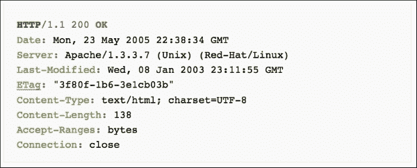
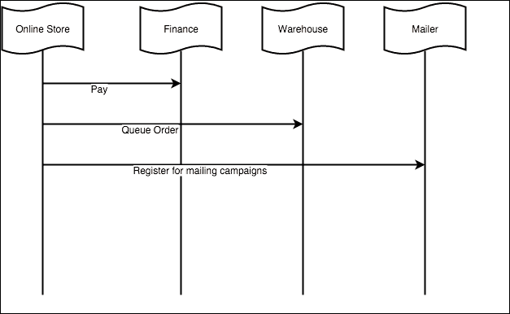
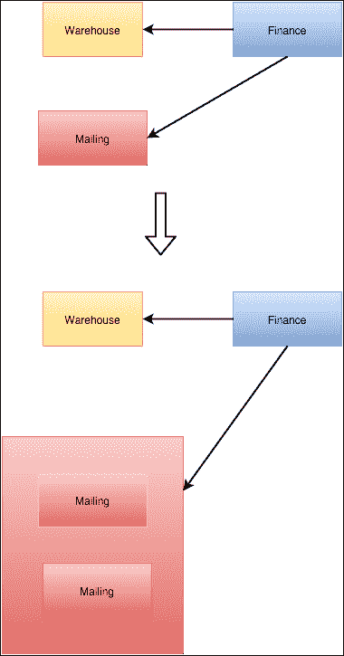
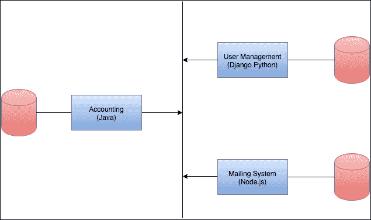

# 一、微服务架构

微服务变得越来越受欢迎。 如今，几乎每个处于新领域项目的工程师都应该考虑使用微服务，以提高他们所构建的系统的质量。 他们应该知道涉及这样的系统的架构原则。 我们将揭示微服务与**面向服务的体系结构**(**SOA**)之间的区别。 我们还将引入一个伟大的平台来编写微服务，**Node.js**，这将允许用很少的努力来创建高性能的微服务。

在本章中，您将从架构的角度了解微服务:

*   microservices 是什么?
*   Microservice-oriented 架构
*   关键好处
*   SOA versus Microservices
*   为什么 node . js ?

# 需要微服务

在过去的 40 年里，软件开发的世界发展迅速。 这种进化的关键点之一是这些系统的规模。 从 MS-DOS 时代开始，我们向现有的系统迈进了一百倍。 这种规模的增长需要更好的方法来组织代码和软件组件。 通常，当一个公司由于业务需求而增长时，称为**有机增长**，软件是在单片架构上组织的，因为这是构建软件最简单和最快的方法。 几年(甚至几个月)之后，由于所创建软件的耦合特性，添加新特性变得更加困难。

## 单片机

自然趋势新的高科技公司如亚马逊和 Netflix 使用 microservices 构建他们的新软件,这是理想的场景:他们得到一个巨大的优势 microservices-oriented 软件(在这本书中,您将学习如何)为了扩大他们的新产品没有很大的努力。 问题是，并不是所有的公司都能预先规划他们的软件。 这些公司不做计划，而是根据所经历的有机增长来构建软件:很少有软件组件通过亲和来组织业务流。 很多公司都有两大软件组件:面向用户的网站和内部管理工具。 这通常被称为**单片软件架构**。

其中一些公司在试图扩大工程团队规模时遇到了大问题。 很难协调构建、部署和维护单个软件组件的团队。 发布的冲突和 bug 的重新引入是一个很常见的问题，它消耗了团队大量的精力。 此问题的解决方案之一(它有好处)是将整体软件分成 microservices,以便团队能够专注于几个小模块和自治和孤立的软件组件,这些组件可以版本,更新和部署不干扰其他公司的系统。

将整体结构分解为微服务使工程团队能够创建独立的、自治的工作单元，这些工作单元高度专门于特定的任务，如发送电子邮件、处理银行卡支付等。

## 现实世界中的微服务

微服务(Microservices)是专门从事一项任务的小型软件组件，它们一起工作以实现更高级别的任务。 暂时忘掉软件，想想公司是如何运作的。 当一个人在一家公司申请一份工作时，他申请的是一个给定的职位:软件工程师、系统管理员、办公室经理。 其原因可以用一个词来概括:专业化。 如果你习惯了软件工程师的工作，你会随着经验变得更好，为公司增加更多的价值。 事实上，你不知道如何与客户打交道，这不会影响你的表现，因为这不是你的专业领域，也不会为你的日常工作增加任何价值。

### 提示

专业化往往是提高效率的关键。 做一件事并把它做对是软件开发的咒语之一。

微服务是一个独立的工作单元，它可以在不干扰系统其他部分的情况下执行一项任务，类似于公司的工作岗位。 这对工程团队有很多好处，可以用来帮助扩展公司的系统。

如今，有数百个系统使用面向微服务的架构构建，如下:

*   **Netflix**:这是最受欢迎的流媒体服务之一，它已经建立了一个完整的应用生态系统，协作以提供一个可靠的、可扩展的全球流媒体系统。
*   **Spotify**:这是世界领先的音乐流媒体服务之一，它使用微服务构建了这个应用程序。 应用程序的每个小部件(它是一个使用 Chromium Embedded Framework 的桌面应用程序的网站)都是一个不同的微服务，可以单独更新。

## 面向微服务的架构

面向微服务的架构有一些特殊之处，这使得任何大中型公司都希望保持其 IT 系统的弹性，并处于可伸缩/可下降状态。

## 如何更好?

它们并不是软件工程的圣杯，但如果小心处理，它们将成为解决依赖技术的公司所面临的大多数大问题的完美方法。

记住面向微服务体系结构设计的关键原则是很重要的，比如弹性、可组合性、弹性等等; 否则，您可能会得到一个分散在不同机器上的单一应用程序，从而产生问题，而不是一个优雅的解决方案。

## 缺点

对于面向微服务的体系结构也有一些批评，因为它们引入了一些需要处理的问题，比如延迟、可跟踪性和配置管理，而这些是基于单块的软件所不具备的。 以下是一些问题的描述:

*   **网络延迟**:微服务具有分布式特性，因此必须考虑网络延迟
*   **操作开销**:服务器越多，维护越多
*   **最终一致性**:在高度事务性的系统上，我们需要在实现中考虑数据在一段时间内可能不一致的事实(我们将在本章后面讨论它)

一般来说，工程师应该尝试评估这种方法的利弊，并决定是否使用微服务以满足业务需求。

面向微服务的体系结构有一些需要考虑的特性。 当软件工程师编写单片软件时，由于所构建软件的性质，有一些问题是完全被忽略的。

例如，假设我们的软件需要发送电子邮件。 在一个单片软件中，我们只需要将功能添加到应用程序的核心中。 我们甚至可以选择创建一个专门的模块来处理电子邮件(这似乎是个好主意)。 现在，假设我们正在创建一个微服务，而不是向大型软件工件添加功能，我们创建了一个可以独立部署和版本控制的专用服务。 在这种情况下，我们将有一个不必要考虑的额外步骤，即**网络延迟**，以达到新的微服务。

在前面的例子中，无论你采用哪种方法(单片还是微服务)来构建软件，都不是什么大事; 例如，如果一封电子邮件丢失了，这并不是世界末日。 根据定义，不能保证电子邮件传递，所以我们的应用程序仍然可以工作，尽管我们可能会收到一些来自客户的投诉。

# 主要设计原则

在构建微服务时，需要考虑一些关键设计原则。 这里没有黄金法则，而且由于微服务是最近才出现的概念，有时甚至缺乏对应遵循何种实践的共识。 一般来说，我们可以假设以下设计原则:

*   微服务是模拟公司流程的业务单元。
*   它们是包含业务逻辑和使用简单通道和协议进行通信的智能端点。
*   根据定义，面向微服务的体系结构是分散的。 这有助于构建健壮且有弹性的软件。

## 业务单元，无组件

软件工程中最令人愉快的方面之一是创建一个新项目。 在这里，您可以应用所有的创造力，尝试新的架构概念、框架或方法。 不幸的是，这种情况在成熟的公司中并不常见。 通常，我们所做的是在现有软件中创建新的组件。 在创建新组件时，您可以遵循的最佳设计原则之一是保持与软件其余部分的耦合尽可能低，以便它作为一个独立的单元工作。

### 提示

保持较低的耦合水平可以使软件组件转换为微服务而不费什么力气。

考虑一个真实的例子:您公司的应用程序现在需要能够处理支付。

这里的逻辑决策是创建一个新模块，该模块知道如何处理所选择的支付提供者(信用卡、PayPal 等)，并允许我们将所有与支付相关的业务逻辑保留在其中。 让我们在下面的代码中定义接口:

```js
public interface PaymentService {
  PaymentResponse processPayment(PaymentRequest request) throws MyBusinessException;
}
```

这个简单的界面可以被每个人理解，但它是走向微服务的关键。 我们将所有的业务知识封装在一个接口后面，这样理论上我们就可以在不影响应用程序其余部分的情况下切换支付提供商——实现细节对外部世界是隐藏的。

以下是我们目前所知道的情况:

*   我们知道方法名，因此，我们知道如何调用服务
*   该方法可能会抛出一个`MyBusinessException`类型的异常，迫使调用代码处理它
*   我们知道输入参数是一个`PaymentRequest`实例
*   响应是一个已知的对象

我们已经创建了一个高度内聚和松散耦合的业务单元。 让我们在下面证明这个肯定:

*   **高内聚**:支付模块将内部的代码只做一件事,那就是,处理支付和调用第三方服务的所有方面(连接处理、响应代码等等),如借记卡处理器。
*   **松散耦合**:如果由于某种原因，我们需要切换到新的支付处理器，会发生什么情况? 是否有信息从接口流出? 我们是否需要因为合同的变化而改变调用代码? 答案是否定的。 支付服务接口的实现始终是一个模块化的工作单元。

下面的图显示了一个由许多组件组成的系统如何将其中一个组件(支付服务)剥离为一个微服务:


一旦这个模块被实现，我们将能够处理支付，而我们的单一应用程序将拥有另一个可能是提取到微服务的很好的候选功能。

现在，我们可以推出支付服务的新版本，只要界面没有改变，以及与世界其他地方(我们的系统或第三方)的合同没有改变。 这就是为什么保持实现独立于接口是如此重要，即使语言不提供接口支持。

我们还可以按需要扩展和部署尽可能多的支付服务，这样我们就可以满足业务需求，而不必不必要地扩展应用程序的其他部分，因为这些部分可能没有压力。

### 提示

**下载示例代码**

你可以从你的账户[http://www.packtpub.com](http://www.packtpub.com)下载这本书的示例代码文件。 如果您在其他地方购买这本书，您可以访问[http://www.packtpub.com/support](http://www.packtpub.com/support)并注册，将文件直接通过电子邮件发送给您。

你可以按以下步骤下载代码文件:

*   使用您的电子邮件地址和密码登录或注册我们的网站。
*   将鼠标悬停在顶部的**SUPPORT**标签上。
*   点击**代码下载&勘误表**。
*   在**Search**框中输入书名。
*   选择要下载代码文件的书。
*   从下拉菜单中选择你购买这本书的地方。
*   点击**代码下载**。

您也可以在 Packt Publishing 网站上点击该书网页上的**code files**按钮下载代码文件。 在**Search**框中输入书名即可进入本页。 请注意，您需要登录到您的包帐户。

下载文件后，请确保使用最新版本的解压或解压缩文件夹:

*   WinRAR / 7-Zip for Windows
*   Mac 的 Zipeg / iZip / unarx
*   7-Zip / PeaZip for Linux

## 智能服务，哑通信管道

**超文本传输协议**(**HTTP**)是互联网有史以来发生的最好的事情之一。 想象一下，一个协议被设计为无状态，但是通过使用 cookie 来保持客户端的状态而被黑客攻击。 那是在 Web 1.0 的时代，那时还没有人谈论 REST api 或移动应用程序。 让我们看一个 HTTP 请求的例子:



如您所见，它是一个人类可读的*协议，不需要解释就可以理解。*

 *现在，人们普遍认为 HTTP 并不局限于在 Web 中使用，而且由于它是设计的，现在它被用作从一个端点向另一个端点传输数据的通用协议。 HTTP 是微服务之间通信所需要的全部:一个传输数据和从传输错误中恢复的协议(如果可能的话)。

在过去的几年中，特别是在企业领域，人们一直在努力创建智能的通信机制，如**BPEL**。 BPEL 代表**业务流程执行语言**，它不关注通信操作，而是关注围绕业务步骤的操作。

这在通信协议中引入了某种程度的复杂性，并使应用程序的业务逻辑从端点融入到通信协议中，从而导致端点之间存在某种程度的耦合。

业务逻辑应该保持在端点内，而不是渗透到通信通道中，这样系统就可以容易地测试和扩展。 多年来得到的教训是，通信层必须是一个简单的协议，以确保数据和端点(微服务)的传输。 这些端点应该在它们的实现中嵌入这样一个事实:服务可能会宕机一段时间(这称为弹性，我们将在本章的后面讨论这个问题)，或者网络可能会导致通信问题。

HTTP 通常是构建面向微服务的软件时使用最多的协议，但另一个需要探索的有趣选项是使用队列，如 Rabbit MQ 和 Kafka，以促进端点之间的通信。

队列技术提供了一种以缓冲的方式管理通信的干净方法，封装了高度事务系统上确认消息的复杂性。

## 分散化

单片应用程序的主要缺点之一是将所有东西都集中在一个(或几个)软件组件和数据库上。 这通常会导致巨大的数据存储，需要根据公司的需求和对流的集中治理进行复制和扩展。

微服务的目标是去中心化。 与其拥有一个庞大的数据库，为什么不根据前面解释的业务单元分割数据呢?

有些读者可能将事务性作为不这么做的主要原因之一。 考虑以下场景:

1.  顾客在我们以微服务为导向的网上商店购买商品。
2.  当支付项目时，系统发出以下调用:
    1.  对公司财务系统的调用，以创建与支付有关的交易。
    2.  呼叫仓库系统分派图书。
    3.  打电话给邮件系统，让客户订阅时事通讯。

在单片软件中，所有调用都将包装在一个事务中，因此，如果由于某种原因，任何调用失败，其他调用的数据将不会持久存储在数据库中。

当你学习设计数据库时，首先也是最重要的原则之一被**ACID**缩写总结为:

*   **原子性**:每个事务将是全部或没有。 如果其中一部分失败，则不会持久化数据库上的任何更改。
*   **一致性**:通过事务更改数据需要保证其一致性。
*   **隔离**:并发执行事务的结果会导致系统状态，如果事务是串行执行的，则会获得这种状态。
*   **持久性**:一旦事务被提交，数据将被持久化。

在面向微服务的软件中，ACID 原则不能在全局上得到保证。 微服务将在本地提交事务，但没有机制可以保证全局事务的 100%完整性。 我们可以不处理付款就发送图书，除非我们考虑到特定的规则来阻止它。

在面向微服务的体系结构中，无法保证数据的事务性，因此我们需要将失败因素考虑到实现中。 解决这个问题的一种方法(不过，变通是一个更合适的词)是分散治理和数据存储。

在构建微服务时，我们需要在设计中嵌入一个或多个组件可能失效并根据软件的可用性降低功能的事实。

让我们看一下下面的图表:



这个图表示了在一个单片软件上的执行顺序。 一个顺序的调用列表，无论如何，都将按照 ACID 原则执行:要么所有调用(事务)成功，要么没有一个调用成功。

这只有在框架和数据库引擎设计人员开发了事务的概念以保证数据的事务性时才有可能。

在使用微服务时，我们需要考虑工程师所说的最终一致性。 在事务出现部分失败后，每个微服务实例都应该存储恢复事务所需的信息，以便这些信息最终保持一致。 按照前面的示例，如果我们发送图书而没有处理支付，支付网关将有一个失败的事务，稍后有人将处理该事务，使数据再次保持一致。

解决这个问题的最佳方法是分权治理。 每个端点都应该能够做出影响事务全局范围的本地决策。 我们将在[第三章](3.html "Chapter 3. From the Monolith to Microservices")，*从整体到微服务*中讨论这个问题。

## 技术接轨

在构建一个新软件时，每个开发人员都应该记住一个的概念:**标准**。

标准保证了您的服务在技术上是独立的，因此可以很容易地使用不同的编程语言或技术构建集成。

为具有微服务的系统建模的优点之一是，我们可以为正确的工作选择正确的技术，这样我们就可以非常高效地解决问题。 在构建整体软件时，我们很难像使用微服务那样结合技术。 通常，在一个单片软件中，我们与我们在开始时选择的技术联系在一起。

**Java 远程方法调用**(**RMI**)是一个非标准协议的例子，如果您希望您的系统对新技术开放，那么应该避免使用。 它是连接用 Java 编写的软件组件的一种很好的方式，但是开发人员将很难(如果不是失败的话)使用 Node.js 调用 RMI 方法。 这将把我们的架构与给定的语言联系起来，从微服务的角度来看，这将扼杀一个最有趣的优势:**技术异构**。

## How small is too small?多小才算太小?

一旦我们决定将我们的系统建模为一组微服务，总是有一个问题需要回答:*多小才算太小?*

答案总是棘手的，可能令人失望:*这取决于*。

给定系统中微服务的正确大小取决于公司的结构以及创建易于由小型开发团队管理的软件组件的能力。 这也取决于技术需求。

想象一个接收和处理银行文件的系统; 正如您可能知道的那样，所有银行之间的支付都以特定的已知格式(例如针对欧元支付的**单一欧元支付区域**(**SEPA**)的文件发送)。 这种类型的系统的特性之一是系统需要知道如何处理大量不同的文件。

解决这个问题的第一种方法是从微服务的角度处理它，将其与创建工作单元的任何其他服务分离，并为每种类型的文件创建一个微服务。 它将使我们能够在不干扰系统其他部分的情况下推出对现有文件处理器的修改。 它还将使我们能够保持处理文件，即使其中一个服务正在经历问题。

微服务应该根据需要尽可能小，但是要记住，每个微服务都会给需要管理新服务的运营团队增加开销。 试着回答这个问题*多小才算太小? 在可管理性、可伸缩性和专门化方面。 微服务应该足够小，可以在不影响系统其他部分的情况下快速管理和扩展(或缩小); 它只应该做一件事。*

### 提示

一般来说，微服务应该足够小，可以在一次 sprint 中完全重写。

# 主要优点

在前面的主题中，我们讨论了什么是面向微服务的体系结构。 我还展示了我从经验中学到的设计原则，以及这种类型的架构的一些好处。

现在，是时候概述这些关键的好处，并展示它们将如何帮助我们提高软件的质量，以及能够快速适应新的业务需求。

## 韧性

弹性在维基百科中定义为*系统应对变化的能力*。 我喜欢考虑弹性的*能力系统优雅地从一个异常恢复*(暂时的硬件故障,竟高网络延迟,等等)或者一段压力而不影响系统的性能,一旦形势已经解决。

虽然听起来很简单，但在构建面向微服务的软件时，由于系统的分布式特性，问题的来源扩大了，有时很难(甚至不可能)防止所有异常情况。

弹性是指从错误中优雅地恢复的能力。 它还增加了另一个级别的复杂性:如果一个微服务遇到问题，我们能防止一个普遍的失败吗? 理想情况下，我们应该以降低服务响应而不是导致普遍故障的方式构建系统，尽管这并不总是容易做到的。

## 可扩展性

目前，企业中常见的问题之一是系统的可扩展性。 如果您以前开发过单片软件，我敢肯定您在公司发展的过程中遇到过容量问题。

通常，这些问题并不存在于应用程序的所有层或子系统中。 总是有一个子系统或服务的执行速度比其他子系统或服务慢得多，如果不能满足需求，就会导致整个应用程序失败。

下图描述了微服务如何在不影响系统其他部分的情况下扩展(两个邮件服务):



### 提示

汽车保险领域中这些弱点的一个例子是计算给定风险因素列表的报价的服务。 为了满足特定部分的需求而扩展整个应用程序是否有意义? 如果你心中的答案是*而不是*，那么你离接受微服务又近了一步。 当特定领域的需求增加时，微服务使您能够扩展系统的某些部分。

如果我们的保险系统是一个面向微服务的软件，那么要解决对报价计算的高需求，唯一需要的就是生成更多负责计算的微服务实例。 请记住，扩展服务可能会增加操作的开销。

## 技术异质性

软件世界每隔几个月就会发生变化。 新的语言作为某种类型的系统的事实上的标准正在进入行业。 几年前，Ruby on Rails 崭露头角，并在 2013 年成为新项目中使用最多的 web 框架之一。 Golang(由谷歌创建的一种语言)现在正成为一种趋势，因为它结合了巨大的性能和优雅而简单的语法，任何有其他编程语言经验的人都可以在几天内学会它。

过去，我曾成功地使用 Python 和 Java 来编写微服务。

特别是自 Spring Boot 发布以来，Java 是编写敏捷(编写和操作)微服务的一个有吸引力的技术堆栈。

Django 也是一个在 Python 上编写微服务的强大框架。 它非常类似于 Ruby on Rails，它自动化了数据库迁移，并使**CRUD**(**Create Read Update Delete**)服务的创建成为一项非常简单的任务。

Node.js 利用了一种著名的语言，JavaScript，来创建一个新的服务器端堆栈，这个堆栈正在改变工程师创建新软件的方式。

那么，把它们结合在一起有什么错呢? 公平地说，这是一种优势:我们可以为正确的工作选择正确的工具。

只要集成技术是标准的，面向微服务的体系结构就可以实现这一点。 正如您之前所了解的，微服务是一个小的、独立的软件，可以自己操作。

下图显示了微服务如何隐藏数据存储/收集，只有共同的通信点——这使它们成为低耦合的好例子(一个服务实现的改变不会干扰任何其他服务):


我们之前已经讨论了性能。 在我们的系统中，总是有一些部分承受着比其他部分更大的压力。 在现代多核 cpu 中，并行(并发)编程可以解决这些性能问题，然而，Node.js 并不是一种很好的并行任务语言。 我们可以选择在压力下使用更合适的语言(如 Erlang)重写微服务，以更优雅的方式管理并发。 做这件事不应该超过两周。

在同一个系统上使用多种技术有一个缺点:开发人员和系统管理员需要了解所有(或一些)技术。 采用微服务的公司通常会坚持使用一种核心技术(在本书中，我们将使用 Node.js)和一些辅助技术(虽然我们将使用 Docker 来管理部署，但我们可以使用 Capistrano 或 Fabricator 来管理发布)。

## 可替代性

可替换性是在不干扰系统行为的情况下更改系统的一个组件的能力。

当谈论软件的时，可替换性伴随着低耦合。 我们在编写微服务时，应该确保内部逻辑不会暴露给调用服务，这样给定服务的客户端就不需要知道它是如何实现的，只需要知道接口。 让我们看一下下面的例子。 它是用 Java 编写的，因为我们只需要看到接口来识别陷阱:

```js
public interface GeoIpService {
  /**
   * Checks if an IP is in the country given by an ISO code.
   **/
  boolean isIn(String ip, String isoCode) throws SOAPFaultException;
}
```

乍一看，这个界面是不言自明的。 它会检查某个 IP 是否在某个国家，然后抛出一个`SOAPFaultException`，这是一个大问题。

如果我们构建使用此服务的客户端，将其逻辑、捕获和处理`SoapFaultException`考虑在内，我们将向外部公开内部实现细节，并使其难以替换`GeoIpService`接口。 也,我们创建一个服务相关的应用程序逻辑的指示创建**限界上下文**:高内聚的服务或一组服务,共同达到一个目的。

## 独立性

无论我们如何努力，人脑不是为解决复杂问题而设计的。 人类大脑最有效的运作方式是将复杂的问题分解成更小的问题*。 面向微服务的体系结构应该遵循这种方法:所有服务都应该是独立的，并且通过接口进行交互，直到可以由不同的工程师团队开发而不需要任何交互，除了同意接口之外。 这将使采用微服务的公司能够根据业务需求向上或向下扩展工程团队，使业务敏捷地响应需求高峰或安静期。*

### 为什么可替代性很重要?

在前一节中，我们讨论了微服务的正确大小。 一般的经验法则是，一个团队应该能够在一个 sprint 中重写和部署一个微服务。 其背后的原因是**技术债**。

我将把技术债定义为在计划的截止日期内交付预期功能而偏离最初的技术设计。 这些牺牲或错误的假设常常导致编写得很差的软件，需要完全重构或重写。

在前面的例子中,外部世界的接口公开的事实,我们使用 SOAP**来调用 web 服务,但是我们需要更改代码在客户端作为一个 REST 客户端确实与 SOAP 异常。**

### 易于部署

微服务应该易于部署。

作为软件开发人员，我们很清楚有很多事情可能会出错，从而阻止软件的部署。

如前所述，微服务应该易于部署的原因有很多，如下所述:

*   少量的业务逻辑(记住*两周的从头重写*经验法则)可以简化部署。
*   微服务是独立的工作单元，因此在复杂系统中升级服务是一个包含性问题。 无需重新部署整个系统。
*   微服务体系结构上的基础设施和配置应该尽可能地自动化。 在本书的后面，我们将学习如何使用 Docker 来部署微服务，以及与传统部署技术相比有哪些好处。

# SOA 与微服务的对比

**面向服务的体系结构**(**SOA**)已经出现多年了。 SOA 是设计软件的一个伟大的原则。 它们是自包含的组件，为其他组件提供服务。 正如我们之前所商定的，这一切都是关于在系统的不同模块上保持低耦合，就好像它是一个谜一样，以便我们可以在不对整个系统造成重大影响的情况下替换各个部分。

原则上，SOA 看起来非常类似于微服务体系结构。 那么区别是什么呢?

微服务是细粒度的 SOA 组件。 换句话说，单个 SOA 组件可以分解到许多微服务中，这些微服务可以一起工作，以提供相同级别的功能:



### 提示

微服务是细粒度的 SOA 组件。 它们是关注范围狭窄的轻量级服务。

微服务和 SOA 之间的另一个区别是用于连接和编写服务的技术。

J2EE 是一种技术堆栈，其设计初衷是为了编写 SOA 体系结构，以实现企业标准。 Java 命名和目录接口、企业 Java bean 和**企业服务总线**(**ESB**)是构建 SOA 应用程序和维护的生态系统。 尽管 ESB 是一种标准，但 2005 年毕业的工程师很少听说过 ESB，使用过它的人更少，现在的现代框架，如 Ruby on Rails，甚至不考虑如此复杂的软件部分。

另一方面，微服务强制使用众所周知且可广泛互操作的标准(如 HTTP)。 我们可以选择正确的语言或工具来构建组件(微服务)，这是本章前面的*技术异构*部分所阐述的一个关键优点。

除了技术栈中的和服务的大小，SOA 和微服务之间还有一个更大的区别:域模型。 在本章的前面，我们已经讨论了去中心化。 治理的分散化，更重要的是数据的分散化。 在基于微服务的软件中，每个微服务都应该在本地存储自己的数据，将域模型隔离到单个服务中; 然而，在面向 SOA 的软件中，数据通常存储在几个大数据库中，服务共享域模型。

# 为什么选择 Node.js?

几年前，我不相信 Node.js。 对我来说，它是一种趋势，而不仅仅是解决问题的工具……JavaScript 在服务器上? 这看起来不太对。 平心而论，我甚至不喜欢 JavaScript。 然后，像 jQuery 和 Angular.js 这样的现代框架来拯救我们。 他们解决了其中一个问题，即跨浏览器兼容性。 以前我们至少需要考虑三种不同的浏览器，而在 jQuery 之后，所有这些逻辑都被很好地封装在一个库中，所以只要我们遵循 jQuery 文档，就无需担心兼容性问题。

然后，JavaScript 变得更加流行。 突然间，所有的内部工具都是用**Single-Page Application**(**SPA**)框架编写的，大量使用了 JavaScript，因此，如今的大多数开发人员，无论如何都精通 JavaScript。

然后，有人决定将 JavaScript 从浏览器中移除，这是一个伟大的想法。 Rhino、Node.js 和 Nashorn 都是可以独立执行 JavaScript 的运行时实例。 其中一些甚至可以与 Java 代码交互，使开发人员能够将 Java 类导入到 JavaScript 程序中，从而使您能够访问大量已经用 Java 编写的框架。

让我们聚焦于**Node.js**。 Node.js 是面向微服务架构的完美候选，原因如下:

*   容易学习(尽管很难掌握)
*   容易扩展
*   高度可测试的
*   易于部署
*   通过**npm**进行依赖管理
*   有数百个库可以与大多数标准协议集成

这些原因，加上我们将在接下来的章节中阐述的，使得 Node.js 成为构建坚实的微服务的完美候选人。

## API 聚合

**Seneca**是我在接下来的章节中选择的发展框架。 Seneca 最吸引人的特性之一是 API 聚合。

API 聚合是一种高级技术，通过聚合不同的功能(插件、方法等)来组成接口。

让我们看一下下面的例子:

```js
var express = require('express');
var app = express();

app.get('/sayhello', function (req, res) {
  res.send('Hello World!');
});
app.get('/saygoodbye', function(req, res) {
  res.send('Bye bye!');
});

var server = app.listen(3000, function () {
  var host = server.address().address;
  var port = server.address().port;
  console.log('App listening at http://%s:%s', host, port);
});
```

前面的例子使用了 Express，这是 Node.js 的一个非常流行的 web 框架。 这个框架也是围绕 API 聚合技术构建的。 让我们看看第四和第七行。 在这几行中，开发人员注册了两个方法，当有人使用 GET 请求访问 url`/sayhello`和`/saygoodbye`时，将执行这两个方法。 换句话说，应用程序由不同的较小且独立的实现组成，这些实现通过单个接口对外公开，在本例中是一个监听`3000`端口的应用程序。

在接下来的章节中，我将解释为什么这个属性很重要，以及在构建(和扩展)微服务时如何利用它。

## Node.js 的未来

JavaScript 最初被设计成一种在 web 浏览器中执行的语言。 对于那些曾经工作或学习过的人来说，使用 C/ c++是非常熟悉的，这也是将其作为 Web 2.0 中动态操纵文档的标准的关键所在。 **异步 JavaScript 和 XML**(**AJAX**)是 JavaScript 增长的导火线。 不同的浏览器有不同的请求对象实现，因此开发人员很难编写跨浏览器代码。

标准的缺乏导致了许多框架的创建，这些框架封装了 AJAX 背后的逻辑，使跨浏览器脚本易于编写。

JavaScript 是一种脚本语言。 它不是被设计为面向对象的，也不是被设计为大型应用程序的语言选择，因为代码往往会变得混乱，而且很难在不同公司之间强制执行关于代码应该如何布局的标准。 我工作过的每个公司都有不同的*最佳实践*，有些甚至是相互矛盾的。

**欧洲计算机制造商协会**(ECMA)伸出援手。 **ECMAScript 6**,下 ECMA 标准语言(JavaScript, ActionScript,犀牛,等等)引入了类的概念,继承,集合,以及许多有趣的特性,这些特性将使发展的比实际的 V8 JavaScript 软件更容易也更标准规范。

我认为这些特性中更有趣的一个是引入了**class**关键字，它允许我们用对象对 JavaScript 软件建模。

目前，大多数浏览器都支持大量的这些特性，但在 Node.js 中，只有少数是默认实现的，其中一些是通过向解释器传递特殊标志(和谐标志)来实现的。

在这本书中，我将尽量避免使用 ECMAScript 6 特性，坚持使用 V8 规范，因为大多数开发人员都知道它，而且一旦有人知道了 JavaScript V8，使用 ECMAScript 6 就相当容易了。

# 小结

在本章中，我们研究了围绕微服务的关键概念，以及在设计高质量的软件组件时应遵循的最佳实践，以构建健壮且有弹性的软件架构，从而使我们能够快速响应业务需求。

您还了解了一些关键的好处，比如可以在面向微服务的体系结构上为正确的服务使用正确的语言(技术异构性)，以及一些可能使我们的生活更加困难的缺陷， 例如，由面向微服务的体系结构的分布式特性引起的操作方面的开销。

最后，我们讨论了为什么 Node.js 是构建微服务的伟大工具，以及我们如何从 JavaScript 中受益，通过 API 聚合等技术构建高质量的软件组件。

在接下来的章节中，我们将进一步阐述本章中讨论的概念，并使用代码示例，进一步解释我多年来所学到的主题。

如前所述，我们将关注 JavaScript 的 V8 版本，但我将提供一些提示，说明如何轻松编写包含 ECMAScript 6 的可升级组件。*