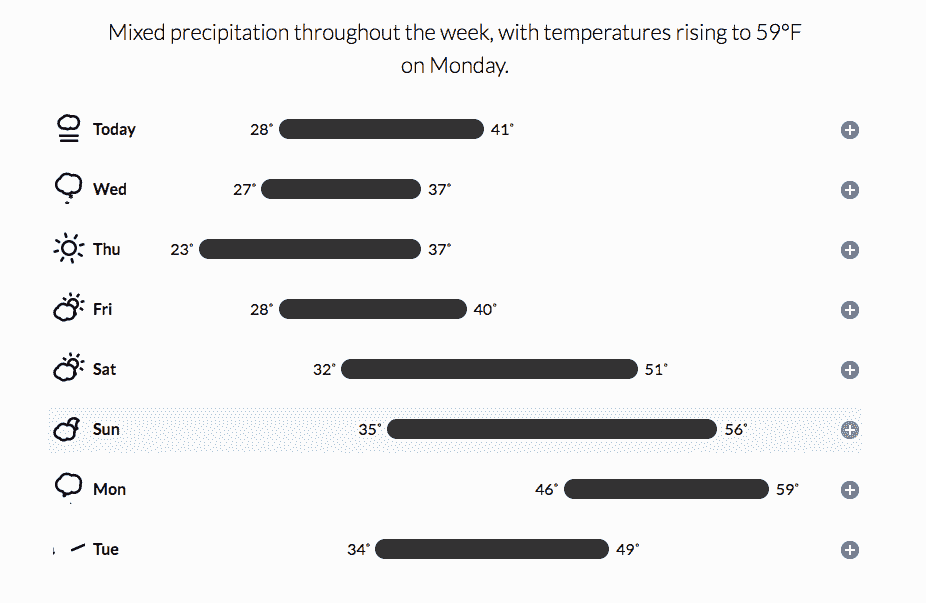
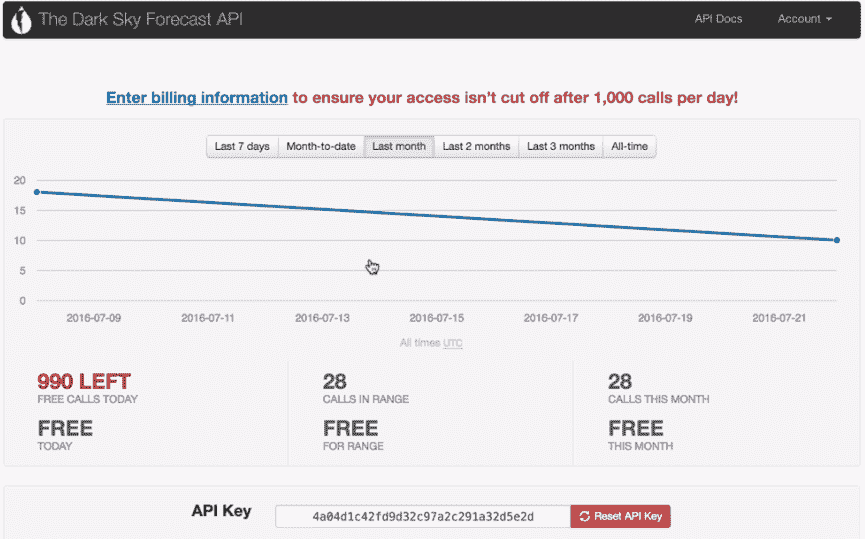
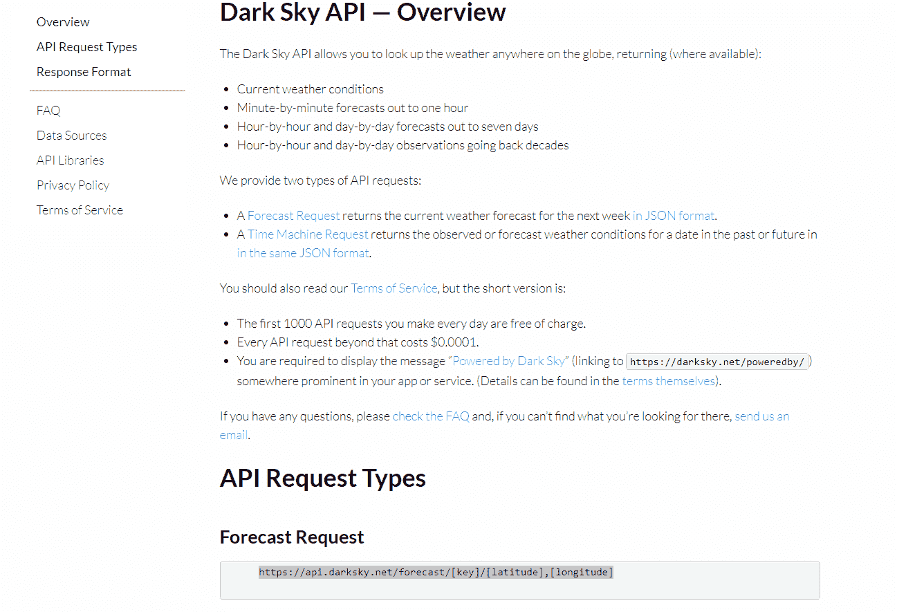
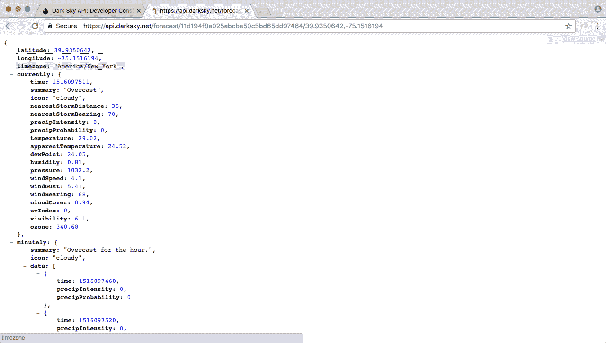

# 六、异步编程中的回调

本章是 Node.js 异步编程的第二部分。在本章中，我们将介绍回调、HTTP 请求等。我们将处理回调中发生的许多错误。`app.js`中的请求可能会出现很多错误，我们想知道在进行异步编程时如何从回调函数内部的错误中恢复。

接下来，我们将把请求代码块移动到一个单独的文件中，并抽象出许多细节。我们将讨论这意味着什么以及为什么它对我们很重要。我们将使用谷歌的地理定位 API，我们将使用 Dark Sky API 获取位置信息，如邮政编码，并将其转化为现实世界的当前天气信息。

然后，我们将开始连接预测 API，获取地理编码地址的实时天气数据。我们将在`geocodeAddress`的回调中添加我们的请求。这将让我们获取纬度和经度坐标的动态集合，`lat`/`lng`作为参数列表中使用的地址，并获取该位置的天气。

具体来说，我们将研究以下主题：

*   编码用户输入
*   回调错误
*   抽象回调
*   连接天气搜索
*   将回调链接在一起

# 编码用户输入

在本节中，您将学习如何为天气应用设置 yargs。您还将学习如何包含用户输入，这对于我们的应用非常重要。

如前一章*HTTPS 请求*部分所示，用户不会在终端中输入自己的编码地址；相反，他们将输入一个纯文本地址，如`1301 Lombard Street`。

现在这对我们的 URL 不起作用，我们需要对那些特殊字符进行编码，比如空格，用`%20`替换它们。现在`%20`是空格的特殊字符，其他特殊字符有不同的编码值。我们将学习如何对字符串进行编码和解码，以便将 URL 设置为动态的。它将基于终端中提供的地址。这就是我们在本节要讨论的全部内容。在本节结束时，您将能够键入任何您喜欢的地址，您将看到格式化的地址、纬度和经度。

# 安装桩

在我们开始进行任何编码之前，我们必须从用户那里获得地址，在我们可以设置 yargs 之前，我们必须安装它。在终端中，我们将运行`npm install`命令，模块名为`yargs`，我们将查找 10.1.1 版本，这是编写本文时的最新版本。我们将使用`save`标志运行此安装，如以下屏幕截图所示：


现在`save`旗很好，因为正如你所记得的。它更新了`package.json`文件，这正是我们想要的。这意味着我们可以去掉 Node 模块文件夹，它占用了大量的空间，但是我们可以使用`npm install`重新生成它。

If you run `npm install` without anything else, no other module names or flags. It will dig through that `package.json` file looking for all the modules to install, and it will install them, recreating your node modules folder exactly as you left it.

在安装过程中，我们在`app.js`文件中进行了一些配置。所以我们可以先装上码开始。为此，在`app.js`文件中，在请求常量旁边，我将创建一个名为`yargs`的常量，将其设置为等于`require(yargs)`，如下所示：

```js
const request = require('request');
const yargs = require('yargs');
```

现在，我们可以继续进行并实际执行该配置。接下来我们将创建另一个常量，名为`argv`。存储将被解析的最终输出的对象。这将从过程变量获取输入，通过`yargs`，结果将在`argv`常量中。这将设置为`yargs`，我们可以开始添加一些呼叫：

```js
const request = require('request');
const yargs = require('yargs');

const argv = yargs
```

现在，当我们创建 notes 应用时，我们有各种各样的命令，你可以添加一个需要一些参数的注释，列出一个只需要标题的注释，列出所有不需要任何参数的注释，我们在`yargs`中指定了所有这些。

对于天气应用，配置将简单得多。没有命令，唯一的命令是 get weather，但是如果我们只有一个命令，为什么还要让别人键入它呢。在我们的例子中，当用户想要获取天气信息时，他们只需键入`node app.js`，后跟`address`标志，如下所示：

```js
node app.js --address
```

然后他们可以在引号内键入地址。在我的例子中，它可能类似于`1301 lombard street`：

```js
node app.js --address '1301 lombard street'
```

这正是命令执行的方式。不需要像 fetchweather 这样的实际命令，我们直接从文件名进入参数。

# 配置码

要配置 yargs，情况看起来有些不同，但仍然非常相似。在 Atom 中，我将首先调用`.options`，这将允许我们配置一些顶级选项。在本例中，我们将传入一个对象，在其中配置所需的所有选项。现在，我将像对所有链接调用一样格式化此文件，将调用移动到下一行，并按如下方式缩进：

```js
const argv = yargs
  .options({

})
```

现在我们可以设置我们的选项，在这种情况下，我们只有一个选项，那就是`a`选项；`a`将是地址的缩写。我可以在选项中键入地址，然后在别名中键入`a`，或者在选项中键入`a`，然后在别名中键入地址。在这种情况下，我将放置一个如下所示的：

```js
const argv = yargs   
  .options({
    a: {

    }
  })
```

下一步，我可以继续提供那个空对象，我们将详细介绍我们在 notes 应用中使用的相同选项。我们会要求的。如果您要获取天气信息，我们需要一个地址来获取天气信息，因此我将`demand`设置为`true`：

```js
const argv = yargs
  .options({
    a: {
       demand: true,
    }
  })
```

接下来，我们可以设置一个`alias`，我将`alias`设置为等于`address`。最后我们将设置`describe`，我们可以将`describe`设置为我们认为有用的任何东西，在这种情况下，我将使用`Address to fetch weather for`，如下所示：

```js
const argv = yargs
  .options({
    a: {
      demand: true,
      alias: 'address',
 describe: 'Address to fetch weather for'
    }
  })
```

现在，这些是我们为 notes 应用提供的三个选项，但我将添加第四个选项，以使天气应用的 yargs 配置更加全面。这将是一个名为`string`的选项。现在`string`接受布尔值`true`或`false`。在我们的案例中，我们希望`true`成为价值。这告诉`yargs`始终将`a`或`address`参数解析为字符串，而不是数字或布尔值：

```js
const argv = yargs
  .options({
    a: {
      demand: true,
      alias: 'address',
      describe: 'Address to fetch weather for',
      string: true
    }
  })
```

在终端中，如果我要删除实际的字符串`address`，那么`yargs`仍然会接受这一点，它会认为我在尝试添加布尔标志，这在某些情况下可能很有用。例如，我想取摄氏度还是华氏度？但在我们的例子中，我们不需要任何类型的`true`或`false`标志，我们需要一些数据，所以我们将字符串设置为 true 以确保我们获得这些数据。

现在我们已经有了选项配置，我们可以继续添加我们已经研究过的几个其他调用。我将添加`.help`，如下代码所示调用它，添加`help`标志。这非常有用，尤其是当某人第一次使用命令时。然后我们可以访问`.argv`，它接受所有这些配置，通过我们的参数运行它，并在`argv`变量中恢复结果：

```js
const argv = yargs
  .options({
    a: {
      demand: true,
      alias: 'address',
      describe: 'Address to fetch weather for',
      string: true
    }
  })
  .help()
 .argv;
```

现在`help`方法添加了`help`参数，我们也可以通过调用`.alias`为它添加一个别名。现在`.alias`接受两个参数，您要为其设置别名的实际参数和别名。在我们的例子中，我们已经注册了`help`，当我们调用`help`时它会注册，我们会设置一个别名，它将只是字母`h`，真棒：

```js
.help()
.alias('help', 'h')
.argv;
```

现在，我们已经为天气应用设置了各种各样非常棒的配置。例如，在终端内部，我现在可以运行`help`，并且我可以看到此应用的所有帮助信息：


我也可以使用快捷方式`-h`，我会得到完全相同的数据：


# 将地址打印到屏幕

现在地址也被传递了，但是我们不把它打印到屏幕上，所以让我们这样做。配置完成后，让我们使用`console.log`将整个`argv`变量打印到屏幕上。这将包括`yargs`解析的所有内容：

```js
  .help()
  .alias('help', 'h')
  .argv;
console.log(argv);
```

让我们继续在终端中重新运行它，这次传入一个地址。我将使用`a`标志，并指定类似`1301 lombard street`的内容，关闭引号，然后点击*回车*：

```js
node app.js -a '1301 lombard street'
```

当我们这样做时，我们得到了我们的对象，如代码输出所示，我们有 1301 Lombard St，Philadelphia，PA 19147，USA，纯文本地址：


在前面的屏幕截图中，请注意，我们碰巧获取了该地址的纬度和经度，但这只是因为我们在`app.js`的 URL 中对其进行了硬编码。我们仍然需要进行一些更改，以便将在参数中键入的地址作为 URL 中显示的地址。

# 对字符串进行编码和解码

为了探索如何编码和解码字符串，我们将进入终端。在终端内部，首先使用`clear`命令清除屏幕，然后通过键入`node`命令启动 Node 进程，如图所示：

```js
node
```

在这里，我们可以运行任何我们喜欢的语句。当我们探索一个真正基本的 Node 或 JavaScript 特性时，我们将首先研究一些示例，然后继续将其添加到实际应用中。我们将看两个函数，`encodeURIComponent`和`decodeURIComponent`。我们将首先开始编码。

# 编码 URI 组件

编码，该方法称为`encodeURIComponent`，用大写字母对 URI 进行编码，它只需要一个参数，即要编码的字符串。在我们的例子中，该字符串将是地址，类似于`1301 lombard street philadelphia`。当我们通过点击*输入*在`encodeURIComponent`中运行此地址时，我们将返回编码版本：

```js
encodeURIComponent('1301 lombard street philadelphia')
```

如下面的代码输出所示，我们可以看到所有的空格，如 1301 和 lombard 之间的空格，都已替换为它们的编码字符，对于空格的情况，它是%20。通过将字符串传递给`encodeURIComponent`，我们将创建一些可以直接注入 URL 的内容，这样我们就可以发出动态请求。


# 解码 URI 组件

现在`encodeURIComponent`的替代方案是。这将获取一个编码字符串，如前一个示例中的字符串，并获取所有特殊字符，如`%20`，然后将其转换回原始值，在本例中为空格。对于这个，在`decodeURIComponent`的内部，我们将再次传递一个字符串。

让我们继续输入我们的名字和姓氏。在我的例子中，它是`Andrew`，而不是它们之间的空格，我将添加`%20`，我们知道它是空格的编码字符。因为我们试图解码一些东西，所以这里有一些编码字符很重要。一旦你的名字和姓氏看起来像下面的代码，你可以继续点击*进入*，我们得到的是解码版本：

```js
decodeURIComponent('Andrew%20Mead')
```

如下面的代码输出所示，我有 Andrew Mead，`%20`被空格替换，这正是我们所期望的。这就是我们在应用中编码和解码 URI 组件的方法：


# 正在从 argv 中提取地址

现在我们要做的是把地址从`argv`中拉出来，我们已经看到它在那里，我们要对它进行编码，我们要将它插入`app.js`文件中的 URL 中，替换地址：


这将本质上创建我们一直在讨论的动态请求。我们可以输入任何我们想要的地址，无论是地址、邮政编码还是城邦组合，我们还可以获取格式化的地址、纬度和经度。

为了开始，我要做的第一件事就是获取编码地址。让我们在`app.js`中`argv`变量旁边创建一个名为`encodedAddress`的变量，我们可以在那里存储结果。我们将其设置为刚才在终端`encodeURIComponent`中探索的方法的返回值。这将获取纯文本地址并返回编码结果。

现在我们确实需要传入字符串，我们在`argv.address`上有可用的字符串，它是别名：

```js
  .help()
  .alias('help', 'h')
  .argv;
var encodedAddress = encodeURIComponent(argv.address);
```

Here we could use `argv.a` as well as `argv.address`, both will work the same.

现在我们有了编码结果，剩下要做的就是将其注入 URL 字符串中。在`app.js`中，目前我们使用的是常规字符串。我们将把它换成一个模板字符串，这样我就可以在其中插入一个变量。

现在我们有了一个模板字符串，我们可以突出显示以`philadelphia`结尾并上升到`=`符号的静态地址，并将其删除，而不是键入静态地址，我们可以插入动态变量。在我的花括号内，`encodedAddress`，如图所示：

```js
var encodedAddress = encodeURIComponent(argv.address);

request({
  url: `https://maps.googleapis.com/maps/api/geocode/json?address=${encodedAddress}`,
```

有了这些，我们现在就完成了。我们从终端获取地址，对其进行编码，然后在`geocode`呼叫中使用该地址。所以格式化的地址、纬度和经度应该匹配。在终端内部，我们将使用*控制*+*C*两次关闭 Node，并使用 clear 清除终端输出。

然后我们可以继续使用`node app.js`运行我们的应用，传递`a`或`address`标志。在这种情况下，我们只使用`a`。然后我们可以继续输入一个地址，例如，`1614 south broad street philadelphia`，如下所示：

```js
node app.js -a '1614 south broad street philadelphia'
```

When you run it you should have that small delay while we fetch the data from the geocode URL.

在这种情况下，我们会发现它实际上比我们预期的要长一点，大约三四秒钟，但我们确实得到了地址：


在这里，我们有一个正确的邮政编码和国家的格式化地址，我们也有纬度和经度显示。我们将尝试其他几个例子。例如，对于宾夕法尼亚州一个名为 Chalfont 的城镇，我们可以输入`chalfont pa`，它不是一个完整的地址，但 Google Geocode API 会将其转换为最近的地址，如下所示：


我们可以看到，它基本上是该镇的地址，宾夕法尼亚州查尔丰特 18914 是邮政编码，是美国的州。接下来，我们有该镇的一般纬度和经度数据，这对于获取天气数据很好。当你移动几个街区的时候，天气并没有完全改变。

现在我们有了动态的数据，我们可以进入下一节，在这里我们将处理回调中发生的许多错误。这个请求可能会出现很多错误，我们想知道在异步编程时如何从回调函数内部的错误中恢复。

# 回调错误

在本节中，我们将学习如何处理回调函数中的错误，因为您可能会猜到事情并不总是按计划进行。例如，我们的应用的当前版本有一些非常大的缺陷，如果我尝试使用带有`a`标志的`node app.js`获取天气，而 zip 并不存在，比如`000000`，程序就会崩溃，这是一个非常大的问题。它要爆炸了。它正在获取数据，最终数据将返回，我们得到一个错误，如下所示：


它试图获取不存在的属性，比如`body.results[0].formatted_address`不是不动产，这是一个大问题。

我们目前的回调预期一切都按计划进行。它不关心错误对象，不查看响应代码；它只是开始打印它想要的数据。这是一条快乐的道路，但在现实世界的 Node 应用中，我们也必须处理错误，否则应用将变得毫无用处，当事情似乎无法按预期工作时，用户可能会非常沮丧。

为此，我们将在回调中添加一组`if`/`else`语句。这将让我们检查某些属性，以确定此调用（在`app.js`中指向我们的 URL 的调用）是否应被视为成功或失败。例如，如果响应代码是 404，我们可能想考虑失败，除了尝试打印地址、纬度和经度之外，我们还想做别的事情。如果一切顺利的话，这是一件非常合理的事情。

在本节中，我们将关注两种类型的错误。这将是：

*   机器错误，例如无法连接到网络，这些通常会显示在错误对象中，以及
*   错误来自另一个服务器，谷歌服务器，这可能是一个无效的地址

为了开始，让我们看看当我们把一个坏数据传递给谷歌 API 时会发生什么。

# 检查 GoogleAPI 请求中的错误

要查看像上一个示例那样的调用中实际返回的内容，其中我们有一个无效地址，我们将转到浏览器并调出我们在`app.js`文件中使用的 URL：


我们将从浏览器历史记录中删除之前使用的地址，并键入`000000`，点击*输入*：


我们得到了我们的结果，但这些都没有结果，我们有状态，状态显示`ZERO_RESULTS`，这是一种非常重要的跟踪信息。我们可以使用状态文本值来确定请求是否成功。如果我们传入一个真实的邮政编码，比如`19147`，即`Philadelphia`，我们将返回结果，如下图所示，`status`将被设置为等于`OK`：


我们可以用这个状态来判断事情是否进展顺利。在这些 status 属性和应用内部的 error 对象之间，我们可以确定在回调中到底要做什么。

# 为回调错误添加 if 语句

我们要做的第一件事是添加一个`if`语句，如下所示，检查错误对象是否存在：

```js
request({
  url: `https://maps.googleapis.com/maps/api/geocode/json?address=${encodedAddress}`,
  json: true
}, (error, response, body) => {
  if (error) {

 }
```

如果错误对象存在，这将在我们的代码块内运行代码，如果它不正常，我们将进入下一个`else if`语句（如果有）。

如果出现错误，我们所要做的就是在屏幕上添加一个`console.log`和一条消息，类似于`Unable to connect to Google servers`：

```js
if (error) {
  console.log('Unable to connect Google servers.');
}
```

这将让用户知道我们无法连接到用户服务器，而不是他们的数据出了问题，比如地址无效。这是错误对象内部的内容。

现在我们要做的下一件事是添加一个`else if`语句，然后在条件内部检查 status 属性。如果 status 属性是`ZERO_RESULTS`，这是用于邮政编码`000000`，那么除了打印地址之外，我们还想做其他事情。在 Atom 中的条件语句中，我们可以使用以下语句检查：

```js
if (error) {
  console.log('Unable to connect Google servers.');
} else if (body.status === 'ZERO_RESULTS') {

}
```

如果是这种情况，我们将打印一条不同的消息，而不是`Unable to connect Google servers`，对于这条消息，我们可以使用`console.log`打印`Unable to find that address.`：

```js
if (error) {
  console.log('Unable to connect Google servers.');
} else if (body.status === 'ZERO_RESULTS') {
  console.log('Unable to find that address.');
}
```

这让用户知道这不是连接问题，我们只是找不到他们提供的地址，他们应该尝试其他东西。

现在我们有了针对这些系统错误的错误处理，比如无法连接到 Google 服务器，以及针对输入错误，在这种情况下，我们无法找到该地址的位置，这太棒了，我们已经处理了这两个错误。

Now the `body.status` property that shows up in the `else if` statement, is not going to be on every API, this is specific to the Google Geocode API. When you explore a new API it's important to try out all sorts of data, good data like a real address and bad data like an invalid zip code, to see exactly what properties you can use to determine whether or not the request was successful, or if it failed.

在我们的例子中，如果状态为`ZERO_RESULTS`，我们知道请求失败，我们可以相应地采取行动。在我们的`app`中，如果一切顺利，现在我们将添加最后一个`else if`条款。

# 添加 if-else 语句以检查正文状态属性

现在我们想添加`else if`子句，检查`body.status`属性是否等于`OK`。如果有，我们可以继续在代码块内运行以下三行：

```js
  console.log(`Address: ${body.results[0].formatted_address}`);
  console.log(`Latitude: ${body.results[0].geometry.location.lat}`);
  console.log(`Longitude: ${body.results[0].geometry.location.lng}`);
});
```

如果没有，这些行就不应该运行，因为代码块不会执行。然后我们将在终端内部进行测试，尝试获取`00000`的地址，并确保程序不会崩溃，而是将错误消息打印到屏幕上。然后我们继续，通过删除一些重要字符来搞乱应用中的 URL，并确保这次我们得到了`Unable to connect to the Google servers.`消息。最后，我们将看到当我们输入一个有效地址时会发生什么，并确保我们的三个`console.log`语句仍然执行。

首先，我们将添加该`else if`语句，并在条件内部检查`body.status`是否为`OK`：

```js
if (error) {
  console.log('Unable to connect Google servers.');
} else if (body.status === 'ZERO_RESULTS') {
  console.log('Unable to find that address.');
} else if (body.status === 'OK') {

}
```

如果它是`OK`，那么我们将简单地获取三条`console.log`行（如前面的代码块所示），并在`else if`条件下移动它们。如果是`OK`，我们将运行以下三个`console.log`语句：

```js
if (error) {
  console.log('Unable to connect Google servers.');
} else if (body.status === 'ZERO_RESULTS') {
  console.log('Unable to find that address.');
} else if (body.status === 'OK') {
  console.log(`Address: ${body.results[0].formatted_address}`);
 console.log(`Latitude: ${body.results[0].geometry.location.lat}`);
 console.log(`Longitude: ${body.results[0].geometry.location.lng}`);
}
```

现在我们有了一个处理错误非常好的请求。如果出现任何问题，我们会为其发送一条特殊的消息，如果事情进展顺利，我们会准确地打印用户期望的内容，地址、纬度和经度。接下来我们将测试这个。

# 测试 body status 属性

要在终端内部测试这一点，我们将首先使用无效的地址重新运行命令：

```js
node app.js -a 000000
```


当我们运行这个命令时，我们看到无法找到地址。打印到屏幕上。我们只需要在屏幕上打印一点消息，而不是程序崩溃，打印一堆错误。这是因为我们在第二条`else if`语句中尝试访问那些不存在的属性的代码不再运行，因为我们的第一条`else if`条件被捕获，我们只是将消息打印到屏幕上。

现在我们还想测试第一条消息（`Unable to connect to the Google servers.`）是否在应该打印的时候打印。为此，我们将删除代码中 URl 的某些部分，例如，`s`和`.`，并保存文件：

```js
request({
  url: `https://mapgoogleapis.com/maps/api/geocode/json?address=${encodedAddress}`,
  json: true
}, (error, response, body) => {
  if (error) {
    console.log('Unable to connect Google servers.');
  } else if (body.status === 'ZERO_RESULTS') {
   console.log('Unable to find that address.');
  } else if (body.status === 'OK') {
    console.log(`Address: ${body.results[0].formatted_address}`);
    console.log(`Latitude: ${body.results[0].geometry.location.lat}`);
    console.log(`Longitude: ${body.results[0].geometry.location.lng}`);
  }
});
```

然后，我们将在终端中重新运行上一个命令。这一次，我们可以在屏幕上看到`Unable to connect to Google servers.`打印，就像它应该看到的那样：


现在，我们可以测试它的最后一件事，首先重新调整 URL 使其正确，然后从终端获取一个有效地址。例如，我们可以使用`node app.js`，将`address`设置为`08822`，这是新泽西州的邮政编码：

```js
node app.js --address 08822
```

当我们运行这个命令时，我们确实得到了新泽西州弗莱明顿的格式化地址，带有邮政编码和州名，我们的纬度和经度如下所示：


我们现在有了一个完整的错误处理模型。当我们请求谷歌提供一个有问题的地址时，在本例中有`ZERO_RESULTS`，错误对象将被填充，因为从技术上讲，它不是一个错误，请求认为错误是什么，它实际上在响应对象中，这就是为什么我们必须使用`body.status`以便检查错误。

这就是这一部分，我们现在有了错误处理，我们处理了系统错误，谷歌服务器错误，我们有了我们的成功案例。

# 抽象回调

在本节中，我们将重构`app.js`，采用许多与地理编码相关的复杂逻辑，并将其移动到一个单独的文件中。目前，所有发出请求并确定请求是否成功的逻辑，我们的`if else`语句，都存在于`app.js`中：

```js
request({
  url: `https://maps.googleapis.com/maps/api/geocode/json?address=${encodedAddress}`,
  json: true
}, (error, response, body) => {
  if (error) {
    console.log('Unable to connect Google servers.');
  } else if (body.status === 'ZERO_RESULTS') {
   console.log('Unable to find that address.');
  } else if (body.status === 'OK') {
    console.log(`Address: ${body.results[0].formatted_address}`);
    console.log(`Latitude: ${body.results[0].geometry.location.lat}`);
    console.log(`Longitude: ${body.results[0].geometry.location.lng}`);
  }
});
```

这是不完全可重用的，它真的不属于这里。在我们添加更多与获取预测相关的逻辑之前，我想做的是，将其分解为自己的函数，这是下一节的主题。这个函数将保存在一个单独的文件中，就像我们为 notes 应用所做的那样。

在`notes app`中，我们有一个单独的文件，该文件具有从本地相邻文件添加、列出和删除注释的功能。我们将创建一个单独的函数，负责对给定地址进行地理编码。虽然逻辑将保持不变，但实际上没有办法绕过它，它将从`app.js`文件中抽象出来并放到自己的位置。

# 将 app.js 和代码重构为 geocode.js 文件

首先，我们需要创建一个新目录和一个新文件，然后我们将向该函数添加一些更高级的功能。但在此之前，我们将看到 require 语句是什么样子的。

# 关于请求声明的工作

我们将通过名为`geocode`的常量变量加载模块，并将其设置为`require`，因为我们需要一个本地文件，我们将添加相对路径`./geocode/geocode.js`：

```js
const geocode = require('./geocode/geocode.js');
```

这意味着您需要在`weather-app`文件夹中创建一个名为`geocode`的目录，以及一个名为`geocode.js`的文件。既然我们有一个`.js`分机，我们实际上可以不打我们需要的电话。

现在，在`app.js`文件中，在`.argv`对象旁边，我们需要调用`geocode.geocodeAddress`。`geocodeAddress`功能，即负责`app.js`中当前所有逻辑的功能。`geocodeAddress`功能将采用地址`argv.address`：

```js
geocode.geocodeAddress(argv.address);
```

它将负责做所有事情，编码 URL，发出请求，并处理所有错误案例。这意味着，在这个新文件中，我们需要导出`geocodeAddress`函数，就像我们从`notes application`文件导出函数一样。接下来，我们有所有的逻辑：

```js
var encodedAddress = encodedURIComponent(argv.address);

request({
  url: `https://maps.googleapis.com/maps/api/geocode/json?address=${encodedAddress}`,
  json: true
}, (error, response, body) => {
  if (error) {
    console.log('Unable to connect Google servers.');
  } else if (body.status === 'ZERO_RESULTS') {
   console.log('Unable to find that address.');
  } else if (body.status === 'OK') {
    console.log(`Address: ${body.results[0].formatted_address}`);
    console.log(`Latitude: ${body.results[0].geometry.location.lat}`);
    console.log(`Longitude: ${body.results[0].geometry.location.lng}`);
  }
});
```

此逻辑需要在`geocodeAddress`函数内部移动。现在我们可以直接复制和粘贴前面显示的代码，实际上没有办法绕过一些更复杂的逻辑，但是我们需要做一些更改。我们需要将请求加载到该新文件中，因为我们使用它，并且默认情况下该文件中不需要它。然后我们可以继续清理代码中的 request require 调用，因为我们不会在这个文件中使用它。

接下来，`argv`对象将不存在，我们将通过第一个参数传入，就像`geocode.Address`语句中的`argv.address`一样。这意味着我们需要把它换成第一个参数，比如 address。一旦完成此操作，程序应完全按照其工作方式工作，而不改变`app.js`，功能也不应改变。

# 创建地理代码文件

首先，让我们在`weather-app`文件夹中创建一个全新的目录，这是我们需要做的第一件事。目录名为`geocode`，它与`geocode`变量中的 require 语句一致。在`geocode`文件夹中，我们将制作我们的文件`geocode.js`：


现在在`geocode.js`的内部，我们可以开始加载请求，让我们创建一个名为`request`的常量，并将其设置为`require('request')`：

```js
const request = require('request');
```

现在我们可以继续定义负责地理编码的函数，这个函数将被称为`geocodeAddress`。我们将创建一个名为`geocodeAddress`的变量，将其设置为一个 arrow 函数，该 arrow 函数将获得一个`address`参数：

```js
var geocodeAddress = (address) => {

};
```

这是纯文本未编码地址。现在，在我们将代码从`app.js`复制到这个函数体之前，我们想使用`module.exports`导出我们的`geocodeAddress`函数，我们知道它是一个对象。我们在`module.exports`对象上放置的任何内容都将可用于任何需要此文件的文件。在我们的例子中，我们希望使`geocodeAddress`属性可用，将其设置为等于我们在前面语句中定义的`geocodeAddress`函数：

```js
var geocodeAddress = (address) => {

};

module.exports.geocodeAddress = geocodeAddress;
```

现在是将所有代码从`app.js`复制到`geocode.js`的时候了。我们将剪切请求函数代码，移动到`geocode.js`，并将其粘贴到函数体中：

```js
var geocodeAddress = (address) => {
  var encodedAddress = encodedURIComponent(argv.address);

  request({
    url: `https://maps.googleapis.com/maps/api/geocode/json?address=${encodedAddress}`,
    json: true
  }, (error, response, body) => {
    if (error) {
      console.log('Unable to connect Google servers.');
    } else if (body.status === 'ZERO_RESULTS') {
      console.log('Unable to find that address.');
    } else if (body.status === 'OK') {
      console.log(`Address: ${body.results[0].formatted_address}`);
      console.log(`Latitude: ${body.results[0].geometry.location.lat}`);
      console.log(`Longitude: ${body.results[0].geometry.location.lng}`);
    }
  });
};

module.exports.geocodeAddress = geocodeAddress;
```

在这段代码中，我们唯一需要改变的是如何获得明文地址。我们不再有那个`argv`对象，而是将`address`作为参数传入。最终代码将类似于以下代码块：

```js
const request = require('request');

var geocodeAddress = (address) => {
  var encodedAddress = encodedURIComponent(argv.address);

  request({
    url: `https://maps.googleapis.com/maps/api/geocode/json?address=${encodedAddress}`,
    json: true
  }, (error, response, body) => {
    if (error) {
      console.log('Unable to connect Google servers.');
    } else if (body.status === 'ZERO_RESULTS') {
      console.log('Unable to find that address.');
    } else if (body.status === 'OK') {
      console.log(`Address: ${body.results[0].formatted_address}`);
      console.log(`Latitude: ${body.results[0].geometry.location.lat}`);
      console.log(`Longitude: ${body.results[0].geometry.location.lng}`);
    }
  });
};

module.exports.geocodeAddress = geocodeAddress;
```

有了这个，我们现在就完成了`geocode`文件。它包含发出和完成请求的所有复杂逻辑。在`app.js`上，我们可以通过删除一些额外的空格，并删除此文件中不再使用的请求模块来清理这些内容。最终的`app.js`文件将类似于以下代码块：

```js
const yargs = require('yargs');

const geocode = require('./geocode/geocode');

const argv = yargs
  .options({
    a: {
      demand: true,
      alias: 'address',
      describe: 'Address to fetch weather for',
      string: true
    }
  })
  .help()
  .alias('help', 'h')
  .argv;

geocode.geocodeAddress(argv.address);
```

现在，功能应该完全相同。在终端内部，我将继续运行一些以确认更改是否有效。我们将使用`a`标志搜索确实存在的邮政编码，如`19147`所示，我们可以看到地址、纬度和经度：


现在我们将把邮政编码换成一个不存在的邮政编码，如`000000`，当我们通过地理编码器运行此功能时，您可以看到无法在屏幕上找到地址打印：


这意味着`geocode.js`中的所有逻辑仍在运行。现在，流程的下一步是向`geocodeAddress`添加回调函数。

# 向 geocodeAddress 添加回调函数

重构代码和`app.js`的目标并不是摆脱回调，而是抽象所有与编码数据、发出请求和检查错误相关的复杂逻辑。`app.js`不应该关心这些，它甚至不需要知道曾经发出过 HTTP 请求。`app.js`应该关心的是向函数传递地址，并对结果进行处理。结果是错误消息或数据、格式化地址、纬度和经度。

# 在 app.js 的 geocodeAddress 函数中设置函数

在我们继续对`geocode.js`进行任何更改之前，我们想看看我们将如何构建`app.js`中的内容。我们将向`geocodeAddress`传递一个箭头函数，在请求返回后调用：

```js
geocode.geocodeAddress(argv.address, () => {

});
```

在括号中，我们需要两个参数，`errorMessage`，它将是一个字符串，`results`，它将包含地址、纬度和经度：

```js
geocode.geocodeAddress(argv.address, (errorMessage, results) => {

});
```

在这两个系统中，一次只能提供一个。如果我们有错误消息，我们将不会有结果，如果我们有结果，我们将不会有错误消息。这将使 arrow 函数中确定调用是否成功的逻辑更加简单。我们可以使用`if`语句`if (errorMessage)`，如果出现错误消息，我们可以使用`console.log`语句将其打印到屏幕上：

```js
geocode.geocodeAddress(argv.address, (errorMessage, results) => {
  if (errorMessage) {
    console.log(errorMessage);
  }
});
```

没有必要深入研究任何类型的对象，弄清楚到底发生了什么，所有这些逻辑都抽象在`geocode.js`中。现在，如果`else`子句中没有错误消息，我们可以继续打印结果。我们将使用上一章中提到的漂亮打印方法，我们将添加`console.log(JSON.stringify)`语句，并漂亮地打印结果对象，它将是一个包含地址属性、纬度属性和经度属性的对象。

然后，我们将`undefined`参数作为第二个参数传递。这跳过了我们不需要的过滤函数，然后我们可以指定间距，这将以一种非常好的方式格式化它，我们将使用两个空格，如下所示：

```js
geocode.geocodeAddress(argv.address, (errorMessage, results) => {
  if (errorMessage) {
    console.log(errorMessage);
  } else {
    console.log(JSON.stringify(results, undefined, 2));
  }
});
```

现在我们已经在`app.js`中的`geocodeAddress`函数中设置了我们的函数，并且我们对它的外观有了很好的了解，我们可以继续在`geocode.js`中实现它。

# 在 geocode.js 文件中实现回调函数

在我们的参数定义中，我们不仅需要一个地址参数，还需要一个回调参数，我们可以随时调用这个回调参数。我们将在三个地方称之为。我们将在`if (error)`块中调用它一次，而不是调用`console.log`，我们将简单地使用`Unable to connect to Google servers.`字符串调用回调。此字符串将是我们在`app.js`中的`geocodeAddress`函数中定义的错误消息。

为了做到这一点，我们需要做的就是将我们的`console.log`呼叫更改为`callback`呼叫。我们将它作为错误消息的第一个参数传递。我们可以完全按照`console.log`中显示的字符串，将其移动到`callback`的参数中。然后我可以删除`console.log`调用并保存文件。生成的代码如下所示：

```js
request({
  url: `https://maps.googleapis.com/maps/api/geocode/json?address=${encodedAddress}`,
  json: true
}, (error, response, body) => {
  if (error) {
    callback('Unable to connect to Google servers.');
  }
```

现在我们可以在下一个`else if`块中为我们的另一个`console.log`语句做完全相同的事情，当有`zero results`时，我们将用`callback`替换`console.log`：

```js
if (error) {
  callback('Unable to connect Google servers.');
} else if (body.status === 'ZERO_RESULTS') {
  callback('Unable to find that address.');
}
```

现在，最后一个`else if`区块将有点棘手。这有点棘手，因为我们没有明确的目标。我们还需要为第一个参数创建一个`undefined`变量，因为事情进展顺利时不会提供错误消息。我们所要做的就是创建未定义的错误消息，调用`callback`，传递一个`undefined`变量作为第一个参数。然后我们可以继续，将我们的对象指定为第二个参数，这个对象，这正是`geocodeAddress`函数中的内容，结果：

```js
} else if (body.status === 'OK') {
  callback(undefined, {

  })
  console.log(`Address: ${body.results[0].formatted_address}`);
  console.log(`Latitude: ${body.results[0].geometry.location.lat}`);
  console.log(`Longitude: ${body.results[0].geometry.location.lng}`);
}
```

正如我所提到的，结果有三个属性：第一个是格式化的地址，所以让我们先把它去掉。我们将`address`设置为`body.results`，就像我们在`console.log`语句的`Address`变量中一样：

```js
} else if (body.status === 'OK') {
  callback(undefined, {
    address: body.results[0].formatted_address
  })
  console.log(`Address: ${body.results[0].formatted_address}`);
  console.log(`Latitude: ${body.results[0].geometry.location.lat}`);
  console.log(`Longitude: ${body.results[0].geometry.location.lng}`);
}
```

在这里，我们将使事情变得更加简单，而不是将复杂的属性嵌套在`app.js`中的对象的深处，我们将能够访问一个简单的`address`属性，我们将对`console.log`语句的`Latitude`和`Longitude`执行同样的操作。

接下来，我们将获取用于获取纬度的代码，我将添加我的第二个属性`latitude`，将其设置为等于我们从`console.log`语句中获取的代码。然后我们可以继续添加最后一个属性，即`longitude`，将其设置为等于`latitude`代码，将`lat`替换为`lng`。现在我们已经准备好了，我们可以在末尾添加一个分号，删除`console.log`语句，因为它们不再是必需的，这样我们就完成了：

```js
if (error) {
  callback('Unable to connect Google servers.');
} else if (body.status === 'ZERO_RESULTS') {
  callback('Unable to find that address.');
} else if (body.status === 'OK') {
  callback(undefined, {
    address: body.results[0].formatted_address,
    latitude: body.results[0].geometry.location.lat,
    longitude: body.results[0].geometry.location.lng
  });
}
```

我们现在可以重新运行该文件，当我们这样做时，我们将向`geocodeAddress`传递一个地址，这将启动并发出请求，当请求返回时，我们将能够以非常简单的方式处理该响应。

# 在 geocode.js 文件中测试回调函数

在终端内部，我们将返回运行两个`node app.js`命令；我们使用邮政编码为`19147`的命令，一切正常，邮政编码为错误的`000000`来显示错误消息。

如以下代码输出所示，我们可以看到带有 address 属性、latitude 属性和 longitude 属性的 results 对象：


如果邮政编码不正确，我们只想确保错误消息仍然显示，并且它确实显示了，无法找到该地址。打印到屏幕上，如下所示：


这是因为`app.js`中的`geocodeAddress`函数中有`if`语句。

将所有逻辑抽象到`geocode`文件后，`app.js`文件现在简单多了，维护起来也容易多了。我们也可以在多个地点呼叫`geocodeAddress`。如果我们想重用代码，我们不需要复制和粘贴代码，这不会遵循**DRY**原则，即**不要重复自己**，相反，我们可以做一些简单的事情，简单地调用`geocodeAddress`，就像我们在`app.js`文件中所做的那样。有了这个，我们现在就可以获取`geocode`数据了。

# 连接天气搜索

在本节中，您将向 weather API 发出第一个请求，我们将首先以静态方式执行此操作，这意味着它不会使用我们传入的地址的实际纬度和经度，我们只需要一个静态 URL。我们将提出请求，并探索我们从体内获得的数据。

# API 在浏览器中工作的探索

现在，在向 Atom 添加任何内容之前，我们想继续研究这个 API，以便了解它在浏览器中的工作方式。当我们将纬度和经度传递给 API 时，这将使我们更好地了解返回的天气数据。为此，我们将转到浏览器，并访问几个 URL。

首先让我们转到[forecast.io](http://forecast.io)。这是一个常规的天气网站，您可以键入您的位置，并获得您期望的所有天气信息：


如上图所示，有警告，有雷达，有当前天气，我们在网站上还有每周预报，如下图所示：



这与[weather.com](http://weather.com)类似，但[forecast.io](http://forecast.io)的一个很酷的地方是，为该网站提供动力的 API，它实际上可以作为开发人员提供给您。您可以向我们的 URL 发出请求，您可以获取完全相同的天气信息。

这正是我们将要做的，当我们可以通过访问网站[developer.forecast.io](http://developer.forecast.io)来探索 API 时。在这里，我们可以注册一个免费的开发者帐户，以便开始提出这些天气请求：


Dark Sky Forecast API 每天为您提供 1000 个免费请求，我看我们不会超过这个限制。在 1000 个请求之后，每一个都要花费千分之一便士，所以你每花一分钱就会收到 1000 个请求。我们永远不会超过这个极限，所以别担心。开始时不需要信用卡，在你提出一千个请求后，你就会被切断。

要开始，你需要注册一个免费帐户，这很简单，我们只需要一封电子邮件和一个密码。创建帐户后，我们可以看到如下所示的仪表板：



我们从这个页面需要的唯一信息是我们的 API 密钥。API 密钥就像一个密码，它将是我们请求的 URL 的一部分，它将帮助[forecast.io](http://forecast.io)跟踪我们每天发出的请求数量。现在，我将获取此 API 密钥并将其粘贴到`app.js`中，以便以后需要时可以访问它。

接下来我们要做的是浏览文档，我们需要提供实际的 URL 结构，以便获取给定纬度和经度的天气。我们可以通过点击 API 文档链接按钮来实现，该按钮位于黑暗天空预测 API 页面的右上角。这将引导我们进入下一页：



在 API 文档链接中，我们有一个预测请求 URL。如上图所示，为了获取数据，我们需要向该 URL 发出请求。

# 探索代码的实际 URL

在我们将这个 URL 添加到我们的应用并使用请求库之前，我们需要找到我们可以用来发出请求的实际 URL。为此，我们将复制它并将其粘贴到新选项卡中：


现在，我们确实需要交换一些 URL 信息。例如，我们有需要替换的 API 密钥，还有纬度和经度。这两者都需要用真实的数据来代替。让我们首先开始使用该 API 密钥，因为我们已经将其复制并粘贴到了`app.js`中。我们将复制 API 密钥，并将字母`[key]`替换为实际值：


接下来，我们可以获取一组经纬度坐标。为此，进入终端并运行我们的应用`node app.js`，对于地址，我们可以使用任何邮政编码，比如`19146`获取纬度和经度坐标。

下一步，我们将复制这些内容，并将其放在它们所属的 URL 中。纬度在正斜杠和逗号之间，经度在逗号之后，如下所示：


一旦我们有了一个真实的 URL，将所有这三条信息交换为实际信息，我们就可以提出请求，我们将得到的是预测信息：



Remember, this way the information is showing in the preceding image is due to JSONView, I highly recommend installing it.

现在我们得到的数据是压倒性的。我们有按分钟的预测，有按小时、按周、按天的预测，各种各样的信息，非常有用，但也非常强大。在本章中，我们将使用第一个对象`currently`。它存储了所有当前的天气信息，比如清晰的当前摘要，温度，降水概率，湿度，许多真正有用的信息。

在我们的例子中，我们真正关心的是温度。费城目前的温度显示为`84.95`度。当有人在给定位置搜索天气时，我们希望在应用中使用这类信息。

# 使用静态 URL 请求天气应用

现在，为了使用天气 API，我们将使用与上一节中定义的 URL 完全相同的 URL，并在`app.js`中发出请求。首先，我们想做一些设置工作。

在`app.js`的内部，我们将注释掉目前为止的所有内容，在 API 键旁边，我们将调用 request，请求这个准确的 URL，就像我们在上一节/章节中对 geocode API 所做的那样，在我们将其动态化之前。然后，我们将把`body.currently.temperature`属性打印到屏幕上，这样当我们运行应用时，无论我们使用的纬度和经度如何，我们都会看到当前的温度。在我们的例子中，它是代表费城的静态经纬度。

为了开始，我们将加载请求。现在我们在之前的`app.js`文件中有它，然后在上一节中删除了它，但我们将再次添加它。我们将在注释掉的代码旁边添加它，方法是创建一个名为`request`的常量，并将其加载到`const request`等于`require('request')`：

```js
const request = require('request');
```

现在我们可以继续进行实际的请求，就像我们调用`request`对 geocode API 所做的那样，它是一个如下函数：

```js
const request = require('request');

request();
```

我们必须传入两个参数，options 对象是第一个，第二个是 arrow 函数：

```js
request({}, () => {

});
```

这是我们的回调函数，一旦 HTTP 请求完成就会被触发。在填写实际函数之前，我们需要设置选项。有两个选项，URL 和 JSON。我们将`url`设置为静态字符串，即浏览器中的确切 URL：

```js
request({
 url: 'https://api.forecast.io/forecast/4a04d1c42fd9d32c97a2c291a32d5e2d/39.9396284,-75.18663959999999',

}, () => {
```

然后在逗号后的下一行中，我们可以将`json`设置为`true`，告诉请求库继续并将该主体解析为 JSON，即：

```js
request({
 url: 'https://api.forecast.io/forecast/4a04d1c42fd9d32c97a2c291a32d5e2d/39.9396284,-75.18663959999999',
 json: true
}, () => {
```

从这里开始，我们可以继续添加回调参数；`error`、`response`和`body`。这三个参数与我们在`geocode.js`文件的`if`块中针对`geocoding`请求的参数完全相同：

```js
request({
 url: 'https://api.forecast.io/forecast/4a04d1c42fd9d32c97a2c291a32d5e2d/39.9396284,-75.18663959999999',
 json: true
}, (error, response, body) => {

});
```

现在我们已经准备好了，我们需要做的最后一件事就是打印当前温度，这可以通过`console.log`语句在身体上获得。我们将使用`console.log`打印`body.currently.temperature`，如下图：

```js
request({
 url: 'https://api.forecast.io/forecast/4a04d1c42fd9d32c97a2c291a32d5e2d/39.9396284,-75.18663959999999',
 json: true
}, (error, response, body) => {
  console.log(body.currently.temperature);
});
```

现在我们有了温度打印，我们需要从终端运行它来测试它。在终端中，我们将重新运行上一个命令。因为我们注释掉了该代码，所以这里没有实际使用地址，我们得到的是 28.65，如代码输出所示：


有了它，我们的天气 API 调用就可以在应用内部工作了。

# 回调函数中的错误处理

现在我们确实想在回调函数中添加一点错误处理。我们将处理 error 对象上的错误，还将处理从[forecast.io](http://forecast.io)服务器返回的错误。首先，就像我们对地理编码 API 所做的那样，我们将检查是否存在错误。如果是这样，这意味着我们无法连接到服务器，因此我们可以打印一条消息，将该消息转发给用户，`console.log`类似于`Unable to connect to forecast.io server.`：

```js
request({
 url: 'https://api.forecast.io/forecast/4a04d1c42fd9d32c97a2c291a32d5e2d/39.9396284,-75.18663959999999',
 json: true
}, (error, response, body) => {
  if (error){
    console.log('Unable to connect to Forecast.io server.');
  }
  console.log(body.currently.temperature);
});
```

现在我们已经处理了一般错误，我们可以继续处理[forecast.io](http://forecast.io)API 抛出的特定错误。当 URL 的格式（纬度和经度）不正确时，就会发生这种情况。

例如，如果我们删除 URL 中的一些数字，包括逗号，然后点击*输入*，我们将收到 400 个错误请求：


这是实际的 HTTP 状态代码。如果您还记得在`geolocation`API 中，我们有一个`body.status`属性，它是`OK`或`ZERO_RESULTS`。这与该属性类似，只是它使用 HTTP 机制，而不是 Google 使用的某种自定义解决方案。在我们的例子中，我们需要检查状态代码是否为 400。现在，如果我们有一个坏的 API 密钥，我将在 URL 中添加几个 e，我们还将得到一个 400 个坏请求：


因此，这两个错误都可以使用相同的代码来处理。

在 Atom 内部，我们可以通过检查 status code 属性来处理这个问题。在我们的`if`语句结束大括号后，我们将添加`else if`块，`else if (response.statusCode)`，这是我们在详细查看响应参数时看到的属性。如果出现问题，`response.statusCode`将等于`400`，这正是我们将在此处检查的内容：

```js
if (error){
  console.log('Unable to connect to Forecast.io server.');
} else if (response.statusCode === 400) {

}
```

如果状态码为`400`，我们将打印一条消息`console.log('Unable to fetch weather')`：

```js
if (error){
  console.log('Unable to connect to Forecast.io server.');
} else if (response.statusCode === 400) {
  console.log('Unable to fetch weather.');
}
```

现在我们已经处理了这两个错误，我们可以继续讨论成功案例。为此，我们将添加另一个 else if 块，其中`response.statusCode`等于`200`。如果一切顺利，状态代码将等于`200`，在这种情况下，我们将在屏幕上打印当前温度。

我将剪切`console.log(body.currently.temperature)`行，并将其粘贴到 else if 代码块中：

```js
  if (error){
    console.log('Unable to connect to Forecast.io server.');
  } else if (response.statusCode === 400) {
    console.log('Unable to fetch weather.');
  } else if (response.statusCode === 200) {
    console.log(body.currently.temparature);
  }
});
```

# 另一种错误处理方法

还有另一种方法来表示整个 if 块代码。下面是一个更新的代码片段，我们实际上可以用以下代码替换当前回调函数中的所有内容：

```js
if (!error && response.statusCode === 200) {
  console.log(body.currently.temperature);
} else {
  console.log('Unable to fetch weather.');
}
```

此条件检查是否没有错误，响应状态代码是否为`200`，如果是这种情况，我们该怎么办？我们只是像上次一样打印温度，这是在最底部的`else if`条款中。现在我们在更新的代码片段中有一个`else`案例，因此如果出现错误或状态代码不是`200`，我们将继续并将此消息打印到屏幕上。这将处理诸如服务器没有网络连接，或者来自无效或损坏的 URL 的 404。好的，改用这段代码，在最新版本的 WeatherAPI 中，一切都应该按照预期工作。

# 测试回调中的错误处理

现在我们有了一些错误处理，我们可以继续测试我们的应用是否仍然有效。在终端中，我们将重新运行上一个命令，但仍然得到 28.71 的温度：


回到 Atom 内部，我们将删除逗号并保存文件，从而丢弃一些数据：

```js
request({
 url: 'https://api.forecast.io/forecast/4a04d1c42fd9d32c97a2c291a32d5e2d/39.9396284-75.18663959999999',
 json: true
}, (error, response, body) => {
  if (error){
    console.log('Unable to connect to Forecast.io server.');
  } else if (response.statusCode === 400) {
    console.log('Unable to fetch weather.');
  } else if (response.statusCode === 200) {
    console.log(body.currently.temparature);
  }
});
```

当我们从终端重新运行它时，这一次，我们预计无法获取天气信息。打印到屏幕上，当我重新运行应用时，我们得到的正是这样的结果，如下所示：


现在，让我们重新添加逗号，并测试代码的最后一部分。为了测试 if 错误，我们可以通过从`forecast.io`中删除类似点的内容来测试：

```js
request({
 url: 'https://api.forecastio/forecast/4a04d1c42fd9d32c97a2c291a32d5e2d/39.9396284,-75.18663959999999',
 json: true
}, (error, response, body) => {
```

我们可以重新运行应用，但发现无法连接到 Forecast.io 服务器：


我们所有的错误处理都非常有效，如果没有错误，正确的温度会打印到屏幕上，这太棒了。

# 将回调链接在一起

在本节中，我们将获取上一节中创建的代码，并将其分解为自己的文件。与我们对地理编码 API 请求所做的类似，我们调用了`geocodeAddress`，而不是在`app.js`中实际调用请求。这意味着我们将创建一个新文件夹，一个新文件，并在其中创建一个导出的函数。

之后，我们将继续学习如何将回调链接在一起。所以当我们从终端得到地址时，我们可以把它转换成坐标。我们可以把这些坐标转换成温度信息，或者我们想从预测 API 中得到的任何天气数据。

# 重构 weather.js 文件中的请求调用

现在，在我们开始重构之前，我们将创建一个全新的文件，我们将担心如何将上一节中创建的代码放入该函数中。然后我们将开始创建回调。

# 在 weather 文件中定义新函数 getWeather

首先，让我们创建目录。该目录将被称为`weather`。在`weather`目录中，我们将创建一个名为`weather.js`的新文件。

现在在这个文件中，我们可以从`app.js`中获取所有代码，并将其粘贴到`weather.js`中：

```js
const request = require('request');

request({
  url: 'https://api.forecast.io/forecast/4a04d1c42fd9d32c97a2c291a32d5e2d/39.9396284,-75.18663959999999',
  json: true
}, (error, response, body) => {
  if (error) {
    console.log('Unable to connect to Forecast.io server.');
  } else if (response.statusCode === 400) {
    console.log('Unable to fetch weather.');
  } else if (response.statusCode === 200) {
    console.log(body.currently.temperature);
  }
});
```

我们需要做的唯一一件事就是获取这段代码并将其转换为创建该函数，该函数将被导出。然后我们可以把我们的呼叫转移到它里面的请求。我们将在`request`变量旁边创建一个名为`getWeather`的全新函数：

```js
const request = require('request');
var getWeather = () => {

};
```

`getWeather`将接受一些参数，但稍后将添加这些参数。现在我们将参数列表保留为空。接下来，我们将调用 request 并将其移动到`getWeather`函数中：

```js
const request = require('request');
var getWeather = () => {
  request({
   url: 'https://api.forecast.io/forecast/4a04d1c42fd9d32c97a2c291a32d5e2d/39.9396284,-75.18663959999999',
   json: true
}, (error, response, body) => {
  if (error) {
    console.log('Unable to connect to Forecast.io server.');
  } else if (response.statusCode === 400) {
    console.log('Unable to fetch weather.');
  } else if (response.statusCode === 200) {
    console.log(body.currently.temperature);
  }
});
};
```

然后，我们可以继续导出这个`getWeather`函数。我们将添加`module.exports.getWeather`并将其设置为等于我们定义的`getWeather`函数：

```js
module.exports.getWeather = getWeather;
```

# 在 app.js 中提供天气目录

现在我们已经准备好了，我们可以继续进入`app.js`添加一些代码。我们需要做的第一件事是删除 API 密钥。我们不再需要它了。我们将突出显示所有已注释的代码，并使用命令`/`取消注释。

现在我们将导入`weather.js`文件。我们将创建一个名为`weather`的`const`变量，并将其设置为等于`require`，返回结果：

```js
const yargs = require('yargs');

const geocode = require('./geocode/geocode');
const weather = require('');
```

在这种情况下，我们需要我们刚刚创建的全新文件。我们将提供一个相对路径`./`，因为我们正在加载我们编写的文件。然后我们将提供名为`weather`的目录，后跟名为`weather.js`的文件。我们可以省去那个`js`分机，我们已经知道：

```js
const weather = require('./weather/weather');
```

现在我们已经加载了天气 API，我们可以继续调用它了。我们将对我们的呼叫`geocodeAddress`进行注释，然后运行`weather.getWeather()`：

```js
// geocode.geocodeAddress(argv.address, (errorMessage, results) => {
//  if (errorMessage) {
//    console.log(errorMessage);
//  } else {
//    console.log(JSON.stringify(results, undefined, 2));
//  }
//});

weather.getWeather();
```

正如我前面提到的，本节后面将有一些论据。现在我们要让它们空着。我们可以从终端运行我们的文件。这意味着我们应该看到天气打印的坐标，我们在上一节硬编码。那么，我们将运行`node app.js`。我们需要提供一个地址，因为我们还没有注释掉 yargs 代码。因此，我们将添加一个虚拟地址。我将使用新泽西州的邮政编码：

```js
node app.js -a 08822
```


现在，`geolocation`代码永远不会运行，因为它被注释掉了。但是我们正在运行移动到新文件中的天气代码。我们确实看到了 31.82 度的温度，这意味着代码在新文件中得到了正确的执行。

# 在 getWeather 函数中传递参数

现在我们需要传入一些参数，包括回调函数和 weather 文件中的`getWeather`变量。我们需要使用这些参数，而不是静态的`lat`/`lng`对。我们还需要调用回调，而不是使用`console.log`。在实际更改`weather.js`代码之前，我们要做的第一件事就是更改`app.js`代码。需要添加三个参数。这些是`lat`、`lng`和`callback`。

首先我们要通过纬度。我们将获取静态数据，如`weather.js`中 URL 的纬度部分，复制它，并将其粘贴到`app.js`中的参数列表中作为第一个参数。下一个是经度。我们将从 URL 中获取它，复制它，并将其粘贴到`app.js`中，作为第二个参数：

```js
// lat, lng, callback
weather.getWeather(39.9396284, -75.18663959999999);
```

然后我们可以继续提供第三个函数，即回调函数。一旦天气数据从 API 返回，此函数将被触发。我将使用一个 arrow 函数，它将获得我们在上一节前面讨论过的两个参数：`errorMessage`和`weatherResults`：

```js
weather.getWeather(39.9396284, -75.18663959999999, (errorMessage, weatherResults) => {

});
```

包含我们想要的任何类型的温度信息的`weatherResults`对象。在这种情况下，可能是温度和实际温度。现在，我们使用了`weatherResults`来代替结果，这是因为我们想要区分`weatherResults`和`geocodeAddress`中的结果变量。

# 在 getWeather 函数中打印错误消息

在`app.js`中的`getWeather`函数内部，我们现在需要使用`if`-`else`语句，以便根据是否存在错误消息，将适当的内容打印到屏幕上。如果存在`errorMessage`，我们确实希望继续使用`console.log`进行打印。在这种情况下，我们将传入`errorMessage`变量：

```js
weather.getWeather(39.9396284, -75.18663959999999, (errorMessage, weatherResults) => {
  if (errorMessage) {
    console.log(errorMessage);
  }
});
```

现在，如果没有错误消息，我们将使用`weatherResults`对象。稍后我们将打印一条格式良好的消息。现在，我们可以简单地使用上一章提到的漂亮打印技术打印`weatherResults`对象，我们在`console.log`中称之为`JSON.stringify`：

```js
weather.getWeather(39.9396284, -75.18663959999999, (errorMessage, weatherResults) => {
  if (errorMessage) {
    console.log(errorMessage);
  } else {
    console.log(JSON.stringify());
  }
});
```

在`JSON.stringify`括号内，我们将提供这三个参数，即实际对象；`weatherResults`、`undefined`用于我们的过滤功能，一个数字用于我们的缩进。在这种情况下，我们将再次使用`2`：

```js
weather.getWeather(39.9396284, -75.18663959999999, (errorMessage, weatherResults) => {
  if (errorMessage) {
    console.log(errorMessage);
  } else {
    console.log(JSON.stringify(weatherResults, undefined, 2));
  }
});
```

现在我们的`getWeather`调用被三个参数调用了，我们可以继续并在`weather.js`中实际实现这个调用。

# 在 weather.js 文件中实现 getWeather 回调

首先，我们将使`weather.js`文件中的 URL 成为动态的，这意味着我们需要用模板字符串替换 URL 字符串。一旦我们有了模板字符串，我们就可以将参数纬度和经度直接注入 URL。

# 添加动态纬度和经度

让我们继续定义所有传入的参数。我们增加了`lat`、`lng`和我们的`callback`：

```js
var getWeather = (lat, lng, callback) => {
```

首先，让我们注入这个纬度。我们将获取静态纬度，删除它，在正斜杠和逗号之间，我们将使用带花括号的 dollar 注入它。这让我们可以向模板字符串中注入一个值；在本例中`lat`。我们可以在逗号和经度后面做同样的事情。我们将删除静态经度，使用带花括号的美元符号将变量注入字符串：

```js
var getWeather = (lat, lng, callback) => {
  request({
    url: `https://api.forecast.io/forecast/4a04d1c42fd9d32c97a2c291a32d5e2d/${lat},${lng}`,
```

既然 URL 是动态的，我们需要在`getWeather`中做的最后一件事就是将`console.log`调用更改为`callback`调用。

# 将 console.log 调用更改为回调调用

要将我们的`console.log`通话改为`callback`通话，前两个`console.log`通话我们可以将`console.log`改为`callback`。这将符合我们在`app.js`中指定的论点，其中第一个是`errorMessage`，第二个是`weatherResults`。在本例中，我们将传回`errorMessage`，第二个参数是`undefined`，它应该是。我们可以为`Unable to fetch weather`做同样的事情：

```js
if (error) {
  callback('Unable to connect to Forecast.io server.');
} else if (response.statusCode === 400) {
  callback('Unable to fetch weather.');
}
```

现在第三个`console.log`电话会更复杂一些。我们必须实际创建一个对象，而不是仅仅将温度传回。我们将调用`callback`，第一个参数是`undefined`，因为在本例中没有`errorMessage`。相反，我们将提供`weatherResults`对象：

```js
if (error) {
  callback('Unable to connect to Forecast.io server.');
} else if (response.statusCode === 400) {
  callback('Unable to fetch weather.');
} else if (response.statusCode === 200) {
  callback(undefined, {

  })
  console.log(body.currently.temperature);
}
```

在括号内，我们可以定义我们喜欢的所有温度特性。在这种情况下，我们将定义`temperature`，将其设置为`body.currently`，存储所有`currently`天气数据`.temperature`：

```js
else if (response.statusCode === 200) {
  callback(undefined, {
    temperature: body.currently.temperature
  })
  console.log(body.currently.temperature);
}
```

现在我们有了`temperature`变量，我们可以继续向对象提供第二个属性，即`actual temperature`。实际温度将考虑湿度、风速和其他天气条件。实际温度数据在当前称为`apparentTemperature`的属性下可用。我们会提供的。作为价值，我们将使用相同的东西。这使我们到达`currently`物体，就像我们对温度所做的一样。这将是`body.currently.apparentTemperature`：

```js
else if (response.statusCode === 200) {
  callback(undefined, {
    temperature: body.currently.temperature,
    apparentTemperature: body.currently.apparentTemperature
  })
  console.log(body.currently.temperature);
}
```

现在我们有了两个属性，所以我们可以继续删除`console.log`语句。添加分号。最终代码如下所示：

```js
const request = require('request');

var getWeather = (lat, lng, callback) => {
  request({
    url: `https://api.forecast.io/forecast/4a04d1c42fd9d32c97a2c291a32d5e2d/${lat},${lng}`,
    json: true
  }, (error, response, body) => {
    if (error) {
      callback('Unable to connect to Forecast.io server.');
    } else if (response.statusCode === 400) {
      callback('Unable to fetch weather.');
    } else if (response.statusCode === 200) {
      callback(undefined, {
        temperature: body.currently.temperature,
        apparentTemperature: body.currently.apparentTemperature
      });
    }
  });
};

module.exports.getWeather = getWeather;
```

现在我们可以继续运行应用了。我们的`getWeather`函数在`weather.js`文件和`app.js`文件内部都已连接。现在我们仍然使用静态坐标，但这将是最后一次使用该静态数据运行该文件。我们将从终端重新运行应用：


如图所示，我们将温度对象打印到屏幕上。我们有我们的温度特性 48.82，我们有表观温度，已经是 47.42 度了。

有了这个，我们现在准备学习如何将回调链接在一起。这意味着在`app.js`中，我们将从`geocodeAddress`返回的结果传递到`getWeather`，并使用该结果为您在终端中提供的地址打印动态天气。在这种情况下，我们可以得到新泽西镇的地址。与我们在`app.js`文件中使用的静态地址相反，纬度/经度对用于费城。

# 将 geocodeAddress 和 getWeather 回调链接在一起

首先，我们必须接受我们的`getWeather`调用，并将其实际移动到`geocodeAddress`的`callback`函数中。因为在这个`callback`功能中，我们唯一可以访问经纬度对的地方。

现在如果我们打开`geocode.js`文件，我们可以看到我们得到`formatted_address`作为地址属性，我们得到`latitude`作为纬度，我们得到`longitude`作为经度。我们将开始接线。

# 将 getWeather 调用移动到 geocodeAddress 函数中

首先，我们确实需要删除`app.js`中`geocodeAddress`的注释。

接下来，我们将继续在成功案例中使用`console.log`语句，并将其替换为将打印格式化地址的`console.log`调用：

```js
geocode.geocodeAddress(argv.address, (errorMessage, results) => {
  if (errorMessage) {
    console.log(errorMessage);
  } else {
    console.log(results.address);
  }
});
```

这将把地址打印到屏幕上，这样我们就可以准确地知道获取天气数据的地址。

现在我们有了`console.log`打印地址，我们可以拨打`getWeather`电话，并将其移动到`console.log`行的正下方：

```js
geocode.geocodeAddress(argv.address, (errorMessage, results) => {
  if (errorMessage) {
    console.log(errorMessage);
  } else {
    console.log(results.address);
    weather.getWeather(39.9396284, -75.18663959999999, 
    (errorMessage, weatherResults) => {
      if (errorMessage) {
        console.log(errorMessage);
      } else {
        console.log(JSON.stringify(weatherResults, undefined, 2));
      }
    });
  }
});
```

有了这个，我们现在真的很接近将两个回调链接在一起。剩下要做的就是将这些静态坐标替换为动态坐标，这些坐标将在`results`对象中可用。

# 用动态坐标替换静态坐标

第一个参数是`results.latitude`，我们在`app.js`中对对象进行了定义。第二个是`results.longitude`：

```js
geocode.geocodeAddress(argv.address, (errorMessage, results) => {
  if (errorMessage) {
    console.log(errorMessage);
  } else {
    console.log(results.address);
    weather.getWeather(results.latitude, results.longitude, 
    (errorMessage, weatherResults) => {
      if (errorMessage) {
        console.log(errorMessage);
      } else {
        console.log(JSON.stringify(weatherResults, undefined, 2));
      }
    });
  }
});
```

这就是我们从`geocodeAddress`获取数据并将其传递到`getWeather`所需要做的一切。这将创建一个打印动态天气的应用，即终端地址的天气。

现在，在我们继续运行这个之前，我们将用一个更格式化的对象调用替换对象调用。我们将从`weather.js`文件中获取`temperature`变量和`apparentTemperature`变量这两条信息，并在`app.js`中的字符串中使用它们。这意味着我们可以删除`getWeather`调用的`else`块中的`console.log`，用不同的`console.log`语句替换它：

```js
if (errorMessage) {
  console.log(errorMessage);
} else {
  console.log();
}
```

我们将使用模板字符串，因为我们计划在其中注入一些变量；这些是目前的温度，其次是温度。我们将使用`weatherResults.temperature`注入它。然后我们可以继续放置一个句号，并添加一些类似于：`It feels like`的内容，后面是`apparentTemperature`属性，我将使用`weatherResults.apparentTemperature`注入该属性。我会在那之后加上句号：

```js
if (errorMessage) {
  console.log(errorMessage);
} else {
  console.log(`It's currently ${weatherResults.temperature}. It feels like 
    ${weatherResults.apparentTemperature}`);
}
```

我们现在有一个`console.log`语句，它将天气打印到屏幕上。我们还有一个将地址打印到屏幕上的程序，并且我们有针对`geocodeAddress`和`getWeather`的错误处理程序。

# 测试回调的链接

让我们继续并通过在终端中重新运行`node app.js`命令来测试这一点。我们将使用相同的邮政编码，`08822`：

```js
node app.js -a 08822
```


当我们运行它时，我们得到了新泽西州弗莱明顿的格式化地址，它目前是 31.01。感觉像是 24.9。现在，为了测试这是否有效，我们将在引号中键入其他内容，如`Key West fl`：

```js
node app.js -a 'Key West fl'
```


当我们运行这个命令时，我们确实得到了 Key West，FL，如格式化地址所示，目前是 64.51。感觉像是 64.52。

有了它，天气应用现在就可以连接起来了。我们使用谷歌地理编码 API 获取纬度/经度对的地址。然后，我们使用预测 API 获取纬度/经度对，并将其转换为温度信息。

# 总结

在本章中，我们学习了如何为`weather-app`文件设置 YARG，以及如何在其中包含用户输入。接下来，我们研究了如何处理回调函数内部的错误以及如何从这些错误中恢复。我们只是在`callback`函数中添加了`else`/`if`语句。回调只是一个函数，所以为了判断事情是否进展顺利，我们必须使用`else`/`if`语句，这让我们可以做不同的事情，比如打印不同的消息，这取决于我们是否感觉到请求进展顺利。然后，我们向天气 API 发出了第一个请求，并研究了一种基于经纬度组合获取天气的方法。

最后，我们查看了`geocodeAddress`和`getWeather`调用函数的链接。我们接受了最初在`app.js`中的请求调用，并将其移动到`weather.js`中，在那里定义它。我们使用回调将数据从`weather.js`传递到`app.js`，在那里我们导入了`weather.js`文件。然后，在`geocodeAddress`的回调中，我们调用`getWeather`，在`callback`中，我们将特定于天气的信息打印到屏幕上。这一切都是使用`callback`函数完成的。

在下一章中，我们将讨论使用 ES6 同步异步代码的另一种方法。