# 十一、测试 Node 应用——第 2 部分

在本章中，我们将继续测试 Node 应用。在前一章中，我们研究了基本测试框架，并研究了同步和异步 Node 应用。在本章中，我们将继续测试 Express 应用，然后我们将研究一种在结果输出中更好地组织测试的方法，最后但并非最不重要的是，我们将介绍一些测试 Node 应用的高级方法。

具体来说，我们将研究以下主题：

*   设置 Express 应用的测试
*   测试 Express 应用
*   用`describe()`组织测试
*   测试间谍

# 测试 Express 应用

在本节中，我们将设置一个 Express 应用，然后，我们将研究如何测试它，以验证从我们的路线返回的数据是否是用户应该获得的数据。现在，在我们做这些之前，我们需要创建一个 Express 服务器，这是本节的目标。

# 设置 Express 应用的测试

我们将从安装 Express 开始。我们将使用`npm i`（install 的缩写）来安装 Express。请记住，您可以随时用`i`替换 install。我们将获取最新版本，`@4.16.2`。现在，我们将使用`save`标志，而不是我们在上一章中用于测试的 save`dev`标志：

```js
npm i express@4.16.2 --save
```

此命令将作为常规依赖项安装 Express，这正是我们想要的：


我们在部署到生产环境时需要 Express，无论是 Heroku 还是其他服务。

回到应用内部，如果我们打开`package.json`，我们可以看到我们有以前见过的依赖项，以及对我们来说是新的`devDependencies`：

```js
  "devDependencies": {
    "expect": "^1.20.2",
    "mocha": "^3.0.0"
  },
  "dependencies": {
    "express": "^4.14.0"
  }
}
```

这就是我们如何分解不同的依赖关系。从这里开始，我们将在项目根目录中创建一个`server`文件夹，在那里我们可以存储服务器示例以及测试文件。我们将创建一个名为`server`的目录。然后在`server`中，我们将创建一个名为`server.js`的文件。

`server.js`文件将包含启动服务器的实际代码。我们将定义我们的路线，我们将听一个端口，所有这些事情都将在这里发生。这是我们在上一个服务器章节中所做的。在`server.js`中加上`const express`，等于`require ('express')`返回结果：

```js
const express = require('express');
```

接下来，我们可以通过创建一个名为`app`的变量并将其设置为对`express`的调用来创建我们的应用：

```js
const express = require('express');

var app = express();
```

然后我们可以开始配置我们的路由。让我们为这个部分只设置一个，`app.get`：

```js
const express = require('express');

var app = express();

app.get
```

这将设置一个 HTTP GET 处理程序。URL 将仅为网站的根目录`/`（正斜杠）。当有人请求时，现在我们将指定一个非常简单的字符串作为返回结果。我们获得请求和响应对象，就像我们对所有`express`路由所做的那样。你回答，我们将呼叫`res.send`，发回字符串`Hello World!`：

```js
app.get('/', (req, res) => {
  res.send('Hello world!');
});
```

该过程的最后一步是使用`app.listen`监听端口。我们将通过将端口`3000`作为第一个也是唯一的参数传入来绑定它：

```js
app.get('/', (req, res) => {
  res.send('Hello world!');
});

app.listen(3000);
```

有了这些，我们现在就完成了。我们有一个基本的 Express 服务器。在我们继续探索如何测试这些路由之前，让我们先启动它。我们将使用以下命令执行此操作：

```js
node server/server.js
```

当我们运行它时，我们不会得到任何日志，因为我们没有添加服务器启动时的回调函数，但它确实应该启动了。

如果我们转到 Chrome 并访问`localhost:3000`，我们会看到 Hello world！在屏幕上打印：


现在，我们准备开始测试我们的 Express 应用。

# 使用 SuperTest 测试 Express 应用

现在，我们将学习一种简单、毫无意义的方法来测试我们的 Express 应用。这意味着我们可以验证，当我们向`/`URL 发出 HTTP GET 请求时，我们会得到`Hello world!`响应。

现在传统上，测试 HTTP 应用一直是比较困难的事情之一。我们必须启动一个服务器，就像上一节一样。然后，我们需要一些代码来实际向适当的 URL 发出请求。然后我们必须挖掘响应，得到我们想要的，并对其做出断言，无论是标题、状态码、正文还是其他任何内容。这是一个真正的负担。这不是本节的目标。我们的目标是使测试变得简单和容易，因此我们将使用一个名为 SuperTest 的库来测试我们的 Express 应用。

SuperTest 是由最初创建 Express 的开发人员创建的。它内置了对 Express 的支持，使测试您的 Express 应用变得非常简单。

# 超级测试文档

为了开始，让我们打开 docs 页面，这样如果您想查看它提供的任何其他功能，您就可以知道它的位置。如果你用谷歌搜索`supertest`，应该是第一个结果：

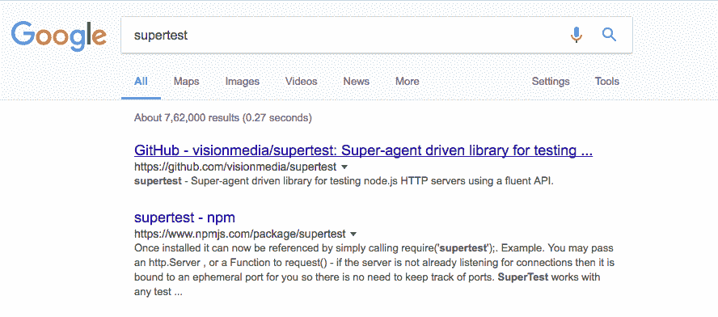

它是 VisionMedia 存储库，存储库本身称为 SuperTest。让我们切换到 repository 页面，我们可以快速查看它提供了什么。在这个页面上，我们可以找到安装说明和介绍资料。我们真的不需要。让我们来看看一个例子：

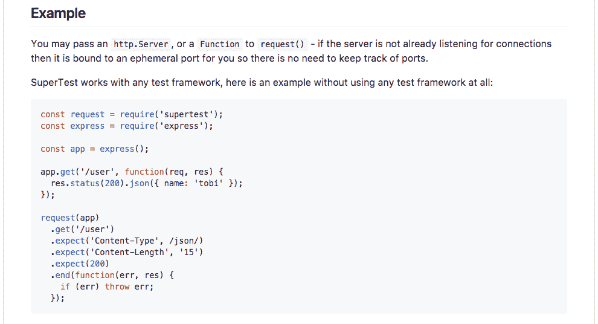

如前一个屏幕截图所示，我们可以看到 SuperTest 如何工作的示例。我们创建一个 Express 应用，就像我们通常会做的那样，并定义一个路由。然后我们调用 SuperTest 提供的`request`方法，传入我们的 Express 应用。我们说我们要向`/`URL 发出`get`请求。然后我们开始断言。无需手动检查标题、状态代码或正文。它对所有这些都有内置的断言。

# 为 Express 应用创建测试

首先，我们将通过从终端运行 npm install 在应用中安装 SuperTest。我们的 Node 服务器仍在运行。让我们关闭它，然后安装模块。

我们可以使用`npm i`，模块名为`supertest`，我们将获取最新版本`@2.0.0`。这是一个特定于测试的模块，因此我们将使用 save 安装它。我们将使用`save-dev`将其添加到`package.json`中的`devDependencies`：

```js
npm i supertest@3.0.0 --save-dev
```


安装了 SuperTest 后，我们现在可以开始处理`server.test.js`文件了。因为它在`server`文件夹中还不存在，所以我们可以创建它。它将紧挨着`server.js`：


既然`server.test.js`已经就位，我们就可以开始进行第一次测试了。首先，我们将创建一个名为 request 的常量，并设置为等于要求`supertest`返回的结果：

```js
const request = require('supertest');
```

这是我们将用来测试 Express 应用的主要方法。从这里，我们可以加载 Express 应用。现在在`server.js`中，我们没有导出应用的导出，因此我们必须添加它。我将通过创建`module.exports.app`并将其设置为等于`app`变量，将其添加到`app.listen`语句旁边：

```js
app.listen(3000);
module.exports.app = app;
```

现在我们有了一个名为 app 的导出，我们可以从其他文件访问它。当我们从终端启动时，`server.js`仍将按预期运行，而不是在测试模式下。我们刚刚添加了一个导出，所以如果有人需要它，他们可以访问该应用。在`server.test.js`中，我们将创建一个变量来导入此项。我们将调用变量`app`。然后我们需要使用`require('./server.js')`，或者只使用`server`。然后我们将访问`.app`属性：

```js
const request = require('supertest');

var app = require('./server').app;
```

有了它，我们现在就有了编写第一个测试所需的一切。

# 为 Express 应用编写测试

我们将编写的第一个测试是验证当我们向`/`URL 发出 HTTP GET 请求时，我们将返回`Hello world!`。要做到这一点，我们将调用`it`，就像我们在上一章的其他测试中所做的那样。我们仍然使用`mocha`作为实际的测试框架。我们使用 SuperTest 来填补空白：

```js
var app = require('./server').app;

it('should return hello world response')
```

现在，我们将按如下方式设置函数：

```js
it('should return hello world response', (done) => {

});
```

这将是一个异步调用，因此我提供了`done`作为参数，让`mocha`知道在确定测试是否通过或失败之前等待。从这里，我们可以第一次呼叫`request`。为了使用 SuperTest，我们在实际的 Express 应用中调用`request`传递。在这种情况下，我们传入`app`变量：

```js
it('should return hello world response', (done) => {
  request(app)
});
```

然后，我们可以开始将我们需要的所有方法链接在一起，以发出请求、做出断言，并最终完成总结。首先，您将使用一种方法来实际发出该请求，无论是`get`、`put`、`delete`还是`post`。

现在，我们将发出一个`get`请求，所以我们将使用`.get`。`.get`请求采用 URL。因此，我们将提供`/`（正斜杠），正如我们在`server.js`中所做的那样：

```js
it('should return hello world response', (done) => {
  request(app)
    .get('/')
});
```

接下来，我们可以做一些断言。要做出断言，我们将使用`.expect`。现在`.expect`是一种方法，它根据您传递给它的内容做不同的事情。在我们的例子中，我们将传递一个字符串。让我们传入一个字符串，它将是我们断言的响应主体，`Hello world!`：

```js
it('should return hello world response', (done) => {
  request(app)
    .get('/')
    .expect('Hello world!')
});
```

现在我们已经做了，我们已经做出了我们的主张，我们可以结束了。为了在 SuperTest 中结束一个请求，我们所做的就是调用`.end`传入`done`作为回调：

```js
it('should return hello world response', (done) => {
  request(app)
    .get('/')
    .expect('Hello world!')
    .end(done);
});
```

这将在幕后处理所有事情，因此您不需要在稍后的时间点手动调用`done`。所有这些都由 SuperTest 处理。有了这四行代码（在前面的代码中），我们成功地测试了我们的第一个 API 请求。

# 测试我们的第一个 API 请求

我们将通过运行`test-watch`脚本在终端启动：

```js
npm run test-watch
```

测试脚本即将启动，如图所示，我们有一些测试：

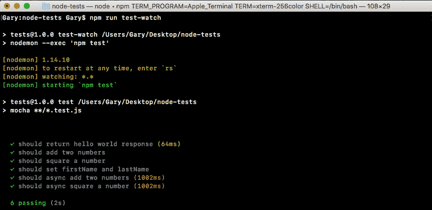

我们有我们的测试，`should return hello world response`，显示在上一个屏幕截图中。

现在我们可以进一步对返回的数据做出其他断言。例如，我们可以在`server.test.js`中的`.get`请求之后使用 expect 对状态代码进行断言。默认情况下，我们所有的直通电话都会返回一个`200`状态码，这意味着一切正常：

```js
it('should return hello world response', (done) => {
  request(app)
    .get('/')
    .expect(200)
    .expect('Hello world!')
    .end(done);
});
```

如果保存文件，测试仍然通过：


现在，让我们对请求进行一些更改，以使这些测试失败。首先，在`server.js`中，我们只需在字符串中添加几个字符（`ww`，并保存文件：

```js
app.get('/', (req, res) => {
  res.send('Hello wwworld!');
});

app.listen(3000);
module.exports.app = app;
```

这会导致 SuperTest 测试失败，并且确实会导致：

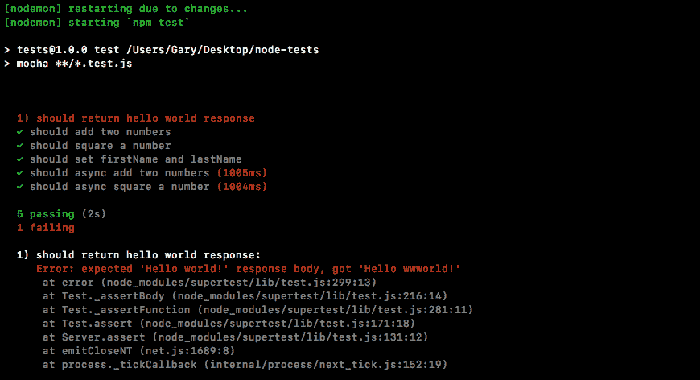

如前一个屏幕截图所示，我们收到一条消息，`expected 'Hello world!' response body, but we got 'Hello wwworld!'`。这让我们知道到底发生了什么。回到`server.js`里面，我们可以删除那些额外的字符（`ww`，然后尝试其他的东西。

# 设置自定义状态

现在我们还没有讨论如何为我们的响应设置自定义状态，但是我们可以通过一种方法`.status`来实现。让我们在`server.js`中添加`.status`，将其链接在`send('Hello world!')`之前，如下所示：

```js
app.get('/', (req, res) => {
  res.status().send('Hello world!');
});
```

然后，我们可以传入数字状态代码。例如，对于未找到的页面，我们可以使用`404`：

```js
app.get('/', (req, res) => {
  res.status(404).send('Hello world!');
});
```

如果我们这次保存文件，主体将匹配，但在终端内部，我们可以看到我们现在有一个不同的错误：

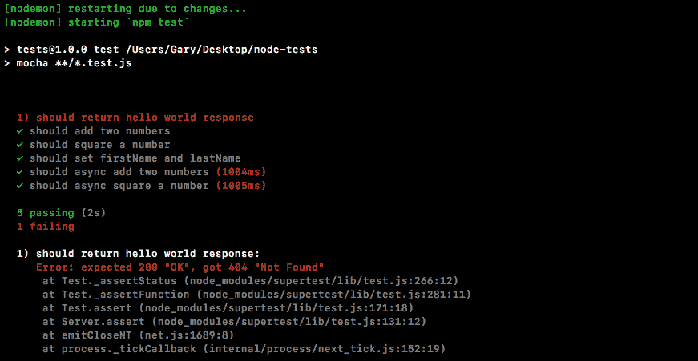

我们期待一个`200`，但我们得到了一个`404`。使用 SuperTest，我们可以对应用做出各种断言。对于不同类型的响应，同样的情况也是如此。例如，我们可以创建一个对象作为响应。让我们制作一个简单的对象，然后创建一个名为`error`的属性。然后我们将`error`设置为`404`的通用错误消息，类似于`Page not found`：

```js
app.get('/', (req, res) => {
  res.status(404).send({
    error: 'Page not found.'
  });
});
```

现在，我们将返回一个 JSON 主体，但目前我们没有对该主体做出任何断言，因此测试将失败：

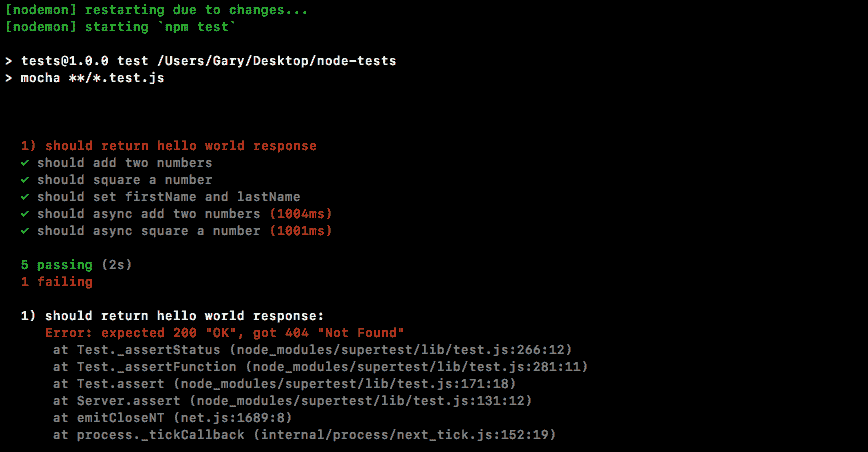

我们可以将测试更新为`expect`JSON 以返回。为了做到这一点，我们在`server.test`中所要做的就是将传递的内容更改为`expect`。我们将传入一个对象，而不是传入字符串：

```js
it('should return hello world response', (done) => {
  request(app)
    .get('/')
    .expect(200)
    .expect({

    })
    .end(done);
});
```

现在我们可以精确地匹配那个物体了。在对象内部，我们将`expect`证明`error`属性存在，并且它完全等于`server.js`中的内容：

```js
    .expect({
      error: 'Page not found.'
    })
```

然后，我们将`.expect`调用从`200`更改为`404`：

```js
    .expect(404)
    .expect({
    error: 'Page not found.'
    })
```

有了它，我们的断言现在与我们在 Express 应用中定义的实际端点相匹配。让我们保存文件，看看是否所有测试都通过：


如前一个屏幕截图所示，我们可以看到它确实正在通过。`Should return hello world`响应正在通过。大约需要`41ms`（毫秒）才能完成，这非常好。

# 为 SuperTest 增加灵活性

在大多数情况下，许多内置断言确实完成了工作。有时候你需要更多的灵活性。例如，在上一章中，我们了解了 expect 可以做出的所有那些很酷的断言。我们可以使用`toInclude`、`toExclude`，所有这些东西都非常方便，失去它们真是太遗憾了。幸运的是，SuperTest 具有很大的灵活性。我们可以做什么来代替获取一个对象并将其传递给 expect 或状态代码的数字，我们可以提供一个函数。SuperTest 将调用此函数，并通过响应：

```js
    .expect((res) => {

    })
```

这意味着我们可以从 HTTP 响应中访问头、主体和任何我们想要访问的内容，它将在函数中可用。我们可以像在上一章中所做的那样，通过常规的 expect 断言库来传递它。

让我们加载它，创建一个名为`expect`的常量，并将其设置为 require`expect`：

```js
const express = require('supertest');
const express = require('express');
```

现在，在我们了解它将如何工作之前，我们将对`server.js`进行更改。在这里，我们将在`.status`对象上添加第二个属性。我们将添加一个`error`，然后添加其他内容。我们使用`name`，将其设置为应用名`Todo App v1.0`：

```js
app.get('/', (req, res) => {
  res.status(404).send({
    error: 'Page not found.',
    name: 'Todo App v1.0'
  });
});
```

现在我们已经准备好了，我们可以看看如何在测试文件中使用这些自定义断言。在`.expect`对象中，我们可以访问响应，响应中有一个 body 属性。这将是一个带有键值对的 JavaScript 对象，这意味着我们希望有一个`error`属性和一个`name`属性，这是我们在`server.js`中设置的。

回到测试文件内部，我们可以使用`expect`进行自定义断言。我会`expect`关于尸体的一些事情`res.body`。现在我们可以使用我们喜欢的任何断言，而不仅仅是 equals 断言，它是 SuperTest 唯一支持的断言。让我们使用`toInclude`断言：

```js
    .expect((res) => {
      expect(res.body).toInclude({

      });
    })
```

记住，`toInclude`允许您指定对象属性的子集。只要有那些就行。它有多余的没有关系。在我们的例子中，在`toInclude`中，我们可以只指定`error`消息，完全不考虑名称存在的事实。我们要检查`error: Page not found`，格式与`server.js`中的格式完全相同：

```js
    .expect((res) => {
      expect(res.body).toInclude({
        error: 'Page not found.'
      });
    })
```

现在，当我们将文件保存回终端内部时，事情会重新启动，我的所有测试都会通过：


结合使用 SuperTest 和 expect，我们可以为 HTTP 端点提供超级灵活的测试套件。有了这个，我们将创建另一个`express`路由，并定义一个测试，确保它按预期工作。

# 创建快速路线

这条快速路线将有两个方面，`server.js`中的实际设置和测试。我们可以从`server.js`开始。在这里，我们将开辟一条新路线。首先，让我们添加一些注释来明确说明我们将要做什么。这将是一个 HTTP`GET`路由。路由本身将是`/users`，我们可以假设它返回一个用户数组：

```js
app.get('/', (req, res) => {
  res.status(404).send({
    error: 'Page not found.',
    name: 'Todo App v1.0'
  });
});

  // GET /users
```

我们可以通过`send`方法传回数组，就像我们在前面的代码中处理对象一样。现在这个数组将是一个对象数组，其中每个对象都是一个用户。现在，我们想给用户一个`name`属性和一个`age`道具：

```js
  // GET /users
  // Give users a name prop and age prop
```

然后，我们将为这个示例创建两个或三个用户。现在，一旦我们完成了这项工作，我们将负责编写一个测试，断言它按预期工作。这将在`server.test.js`中发生。在`server.test.js`内，我们将做一个新的测试：

```js
it('should return hello world response', (done) => {
  request(app)
    .get('/')
    .expect(404)
    .expect((res) => {
      expect(res.body).toInclude({
        error: 'Page not found.'
      });
    })
    .end(done);
});

// Make a new test
```

这项测试将证明以下几点。首先，我们断言返回的状态代码是一个`200`，我们想断言在该数组中，我们将使用`toInclude`来实现这一点：

```js
// Make a new test
// assert 200
// Assert that you exist in users array
```

让我们首先定义端点。在`server.js`内部，只需跟随注释，我们将调用`app.get`，以便为我们的应用注册全新的 HTTP 端点。这一个将在`/users`：

```js
app.get('/users')
// GET /users
// Give users a name prop and age prop
```

接下来，我们将指定同时接受请求和响应的回调：

```js
app.get('/users', (req, res) => {

});
// GET /users
// Give users a name prop and age prop
```

这将让我们实际响应请求，这里的目标就是使用数组进行响应。在这种情况下，我将调用`response.send`传入一个对象数组：

```js
app.get('/users', (req, res) => {
  res.send([{

    }])
  }); 
```

第一个对象将是`name`。我们将`name`设置为`Mike`，将其`age`设置为`27`：

```js
app.get('/users', (req, res) => {
  res.send([{
    name: 'Mike',
    age: 27
  }])  
});
```

然后我可以添加另一个对象。让我们将第二个对象添加到数组中，其名称等于`Andrew`，年龄等于`25`：

```js
app.get('/users', (req, res) => {
  res.send([{
    name: 'Mike',
    age: 27
  }, {
    name: 'Andrew',
    age: 25
  }])    
});
```

在最后一个示例中，我们将名称设置为`Jen`，年龄设置为`26`：

```js
app.get('/users', (req, res) => {
  res.send([{
    name: 'Mike',
    age: 27
  }, {
    name: 'Andrew',
    age: 25
  }, {
    name: 'Jen',
    age: 26
  }])    
});
```

现在我们已经完成了端点，我们可以保存`server.js`，进入`server.test.js`，并开始担心实际创建测试用例。

# 为快速路线编写测试

在`server.test.js`中，只需跟随评论，我们需要通过调用`it`开始事情。`it`是进行新测试的唯一方法：

```js
// Make a new test
// assert 200
// Assert that you exist in users array
it('should return my user object')
```

然后我们将指定回调函数。它将通过`done`参数，因为这个参数将是异步的：

```js
// Make a new test
// assert 200
// Assert that you exist in users array
it('should return my user object', (done) => {

});
```

为了在测试用例内部启动，我们将调用请求，就像在 hello world response 中一样，传入 Express 应用：

```js
it('should return my user object', (done) => {
  request(app)
});
```

现在我们可以设置实际通话。在这种情况下，我们只是打一个电话，一个`get`请求，到下面的 URL，在引号内，`/users`：

```js
it('should return my user object', (done) => {
  request(app)
    .get('/users')
});
```

接下来，我们可以开始进行断言，首先我们应该断言状态代码位于`200`，这是 Express 使用的默认状态代码。我们可以通过调用`.expect`并将状态代码作为一个数字传递来断言这一点。在这种情况下，我们将传入`200`：

```js
it('should return my user object', (done) => {
  request(app)
    .get('/users')
    .expect(200)
});
```

在此之后，我们将使用一个定制的`expect`断言。这意味着我们将调用`expect`传入一个函数，并在`it`中使用`toInclude`断言您存在于该用户数组中。我们将调用`expect`传入函数的方法，该函数将随响应一起被调用：

```js
it('should return my user object', (done) => {
  request(app)
    .get('/users')
    .expect(200)
    .expect((res) => {

    })
});
```

这将让我们对响应做出一些断言。我们实际上要做的是使用`expect`进行断言。我们会对反应体有所期待。在本例中，我们将检查它是否包括使用我们的用户对象`toInclude`：

```js
it('should return my user object', (done) => {
  request(app)
    .get('/users')
    .expect(200)
    .expect((res) => {
      expect(res.body).toInclude()

    })
});
```

现在请记住，您可以对数组和对象调用`toInclude`。我们所要做的就是将要确认的项传入数组中。在我们的例子中，`name`属性等于`Andrew`，而`age`属性等于`25`，这就是我们在`server.js`中使用的对象：

```js
    expect(res.body).toInclude({
      name: 'Andrew',
      age: 25
    })
```

现在我们有了自定义的`expect`调用，在最底层我们可以调用`.end`。这将结束请求，我们可以将`done`作为回调传入，以便在实际发生任何错误时，它可以正确地触发这些错误：

```js
    expect(res.body).toInclude({
      name: 'Andrew',
      age: 25
    })
  })
  .end(done);
```

有了这些，我们就可以开始了。我们可以保存文件。

在终端内部，我们可以看到测试确实在重新运行：


我们有一个测试，如前一个屏幕截图`should return my user object`所示。它正在过去。

现在我们可以确认，我们不会发疯，只是把数据弄乱，测试错误的东西。现在我们将在`server.js`中`Andrew`的大写字母后添加一个小写字母`a`，如下所示：

```js
app.get('/users', (req, res) => {
  res.send([{
    name: 'Mike',
    age: 27
  }, {
    name: 'Aandrew',
    age: 25
  }, {
    name: 'Jen',
    age: 26
  }])    
});
```

考试要失败了。我们可以在航站楼看到：

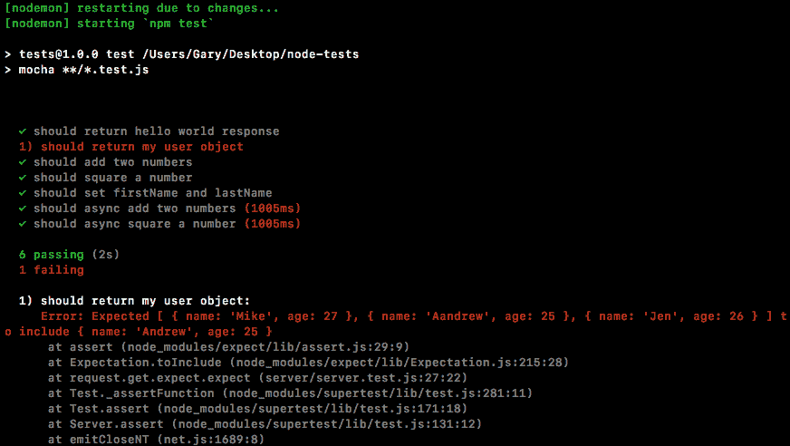

我们已经为我们的 Express 应用进行了测试。现在我们将讨论测试 Node 代码的另一种方法。

# 使用 descripe（）组织测试

在本节中，我们将学习如何使用`describe()`。`describe`是一个注入到我们的测试文件中的函数，就像`it`函数一样。它来自`mocha`，非常棒。本质上，它让我们可以将测试分组在一起。这使得扫描测试输出更加容易。如果我们在终端中运行`npm test`命令，我们将得到我们的测试：


我们有七个测试，目前它们都分组在一起。在`utils`文件中查找测试非常困难，如果不扫描所有文本，就不可能找到`asyncAdd`的测试。我们要做的是打电话给`describe()`。这将让我们进行一组测试。我们可以给那群人起个名字。它将使我们的测试输出更具可读性。

在`utils.test.js`文件中，在`utils`常量之后，我们将调用`describe()`：

```js
const expect = require('expect');

const utils = require('./utils');

describe()
```

descripe 对象接受两个参数，就像`it`。第一个是名称，另一个是回调函数。我们将使用`Utils`。这将是包含`utils.test`文件中所有测试的`describe`块。然后我们将提供函数。这是回调函数：

```js
describe('Utils', () => {

});
```

在回调函数中，我们将定义测试。回调函数中定义的任何测试都将是`utils`块的一部分。这意味着我们可以将现有的测试从文件中剪切出来，粘贴到文件中，我们将有一个名为`utils`的`describe`块，其中包含该文件的所有测试。那么，我们就这么做吧。

我们将获取所有的测试，不包括那些仅仅是操场测试的测试，在那里我们可以使用各种`expect`功能。然后我们将它们粘贴到回调函数中。生成的代码如下所示：

```js
describe('Utils', () => {
  it('should add two numbers', () => {
    var res = utils.add(33, 11);

    expect(res).toBe(44).toBeA('number');
  });

  it('should async add two numbers', (done) => {
    utils.asyncAdd(4, 3, (sum) => {
      expect(sum).toBe(7).toBeA('number');
      done();
    });
  });

  it('should square a number', () => {
    var res = utils.square(3);

    expect(res).toBe(9).toBeA('number');
  });

  it('should async square a number', (done) => {
    utils.asyncSquare(5, (res) => {
      expect(res).toBe(25).toBeA('number');
      done();
    });
  });
});
```

这是分别针对`add`、`asyncAdd`、`square`和`asyncSquare`的四项测试。现在我们将保存文件，我们可以从终端启动`test-watch`脚本并检查输出：

```js
npm run test-watch
```

脚本将启动并运行我们的测试，如以下屏幕截图所示，我们将有不同的输出：


我们有一个`Utils`部分，在`Utils`下，我们有`describe`块中的所有测试。这使得阅读和扫描测试变得越来越容易。我们可以对单独的方法做同样的事情。

# 为单个方法添加 descripe（）

现在，在`utils.test.js`（参考前面的屏幕截图）的情况下，我们每个方法有一个测试，但是如果您有很多针对复杂方法的测试，最好将其包装在自己的`describe`块中。我们可以用我们喜欢的任何方式嵌套`describe`块和测试。例如，就在`describe`语句之后的`utils`内，我们可以再次调用`describe`。我们可以通过一个新的描述。让我们使用`#`（磅符号）后跟`add`：

```js
describe('Utils', () => {

  describe('#add')
```

方法名称后面的`#`（磅号）是为特定方法添加`describe`块的常用语法。然后我们可以提供回调函数：

```js
describe('Utils', () => {

  describe('#add', () => {

  })
```

然后，我们可以进行想要添加到该组中的任何测试，将其剪切并粘贴到其中：

```js
describe('Utils', () => {

  describe('#add', () => {
    it('should add two numbers', () => {
      var res = utils.add(33, 11);

      expect(res).toBe(44).toBeA('number');
    });
  });
```

然后我可以保存文件。这将重新运行测试套件，现在我们有了更可扫描的测试输出：


找到`utils`add 方法测试非常容易，因为它们有明确的标签。现在，你可以随心所欲地疯狂或诡异。对于使用`describe`构建测试的频率，确实没有硬性规定。考虑到您对方法或文件的测试量，您真的需要弄清楚什么是有意义的。

在本例中，我们在文件中有很多测试，因此添加`utils`块肯定是有意义的。我只是想告诉你你可以把它们放在窝里，所以我把它也加在了`add`上。如果我写这段代码，我可能不会添加第二层测试，但是如果每个方法有多个测试，我肯定会添加第二个`describe`块。

# 为 server.test.js 文件添加路由描述块

现在，让我们在`server.test`文件中创建一些`describe`块。我们将创建一个名为`Server`的路由`describe`块。然后我们将为路由 URL 和`/users`创建`describe`块。我们要`GET/`。这将有测试用例在那里，`some test case`。然后除了`//`，我们还有`GET /users`，这将有它自己的测试用例`some test case`，如下面的评论所述：

```js
const request = require('supertest');
const expect = require('expect');

var app = require('./server').app;

// Server
  // GET /
    // some test case
  // GET / user
    // some test case
```

现在，测试用例显然已经定义好了。我们所需要做的就是调用`describe`三次以生成前面解释的结构。

在注释部分之后，我们将从调用`describe()`开始，此描述将针对路线，因此我们将此调用`Server`：

```js
// Server
  // GET /
    // some test case
  // GET / user
    // some test case

  describe('Server')
```

这将包含我们`server`文件中的所有测试。接下来我们可以添加回调函数，我们可以继续：

```js
describe('Server', () => {

})
```

下一步，我们将再次致电`describe`。这次我们为测试`GET /`路由并添加回调函数的测试创建`describe`块：

```js
describe('Server', () => {

  describe('GET /', () => {

  })

})
```

现在我们可以简单地进行测试，将其剪切，并将其粘贴到`describe`回调中。生成的代码如下所示：

```js
describe('Server', () => {

  describe('GET /', () => {
    it('should return hello world response', (done) => {
      request(app)
        .get('/')
        .expect(404)
        .expect((res) => {
          expect(res.body).toInclude({
            error: 'Page not found.'
          });
        })
        .end(done);
    });
  });

})
```

接下来，我们将第三次致电`describe`。我们将呼叫`describe`作为描述`GET /users`传入：

```js
  describe('GET /users')
```

我们将一如既往地使用回调函数，然后我们可以复制并粘贴测试：

```js
  describe('GET /users'), () => {
    it('should return my user object', (done) => {
      request(app)
        .get('/users')
        .expect(200)
        .expect((res) => {
          expect(res.body).toInclude({
            name: 'Andrew',
            age: 25
          });
        })
        .end(done);
    });
  });
```

有了这些，我们现在就完成了。我们有一个更好的测试结构，当我们通过保存文件重新运行测试套件时，我们将能够在终端中看到：

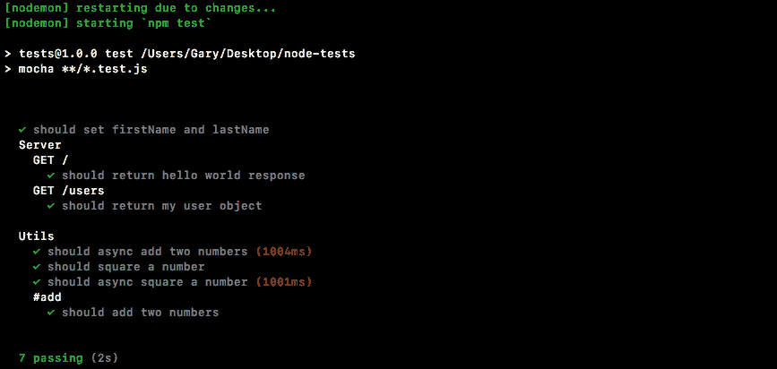

如前一段代码所示，我们有一个更可扫描的测试套件。我们可以立即查看服务器测试。我们可以为每个特性创建测试组。因为我们现在有静态数据，所以我们实际上不需要对每个特性进行多个测试。但接下来，我们将对每个 HTTP 请求进行多个测试，因此尽早养成创建`describe`块的习惯是个好主意。这一次就这样！

# 测试间谍

本节是测试章节的最后一节，我们将学习一些非常先进的测试技术。我们将在构建真实世界的应用时使用这些技术，但现在让我们从一个示例开始。我们将为我们马上要做的事情担心词汇。

目前，我们将关闭所有当前文件，并在项目根目录中创建一个新目录。我们将创建一个名为`spies`的新文件夹。稍后我们将讨论`spies`到底是什么，以及它们与测试的关系。在`spies`中，我们将创建两个文件：`app.js`（这是我们将要测试的文件）和第二个文件，称为`db.js`。在我们的示例中，我们可以假设`db.js`是一个文件，它有各种方法来保存和读取数据库中的数据。

在`db.js`中，我们将使用`module.exports`创建一个函数。让我们创建一个名为`saveUser`的函数。`saveUser`函数将是一个非常简单的函数，它将采用如下的`user`对象：

```js
module.exports.saveUser = (user) => {

}
```

现在，我们将使用`console.log`语句将其打印到屏幕上。我们将打印一条小消息，`Saving the user`，我们还将打印出如下所示的对象：

```js
module.exports.saveUser = (user) => {
  console.log('Saving the user', user);
}
```

显然，这不是一个真正的`saveUser`函数。我们不与任何类型的数据库交互，但它将准确地说明我们将如何使用`spies`来测试我们的代码。

接下来，我们将填写我们的`app.js`，这是我们将实际测试的文件。在`app.js`中，我们将创建一个新函数：`module.exports.handleSignup`。在具有身份验证的应用上下文中，`handleSignup`可能采用`email`和`password`；也许它会继续检查`email`是否已经存在。如果没有，那就太好了；它保存用户，然后发送某种欢迎电子邮件。我们可以通过创建一个包含`email`和`password`的箭头函数（`=>`）来模拟：

```js
module.exports.handleSignup = (email, password) => {

};
```

在 arrow 函数（`=>`中，我们将留下三条注释。这些都是函数应该做的事情。检查`email`是否已经存在；它将用户保存到数据库中；最后，我们将发送欢迎电子邮件：

```js
module.exports.handleSignup = (email, password) => {
  // Check if email already exists
  // Save the user to the database
  // Send the welcome email
};
```

现在，这三件事只是一个`handleSignup`方法可能实际做的例子。当我们经历真正的过程时，你会看到结果如何。现在，我们已经有了其中一个。我们刚刚创建了`saveUser`，所以我们要做的是调用`saveUser`，而不是使用第二条注释：

```js
  // Check if email already exists
  db.saveUser()
  // Send the welcome email
```

它还没有进口，但这并不能阻止我们称之为；我们将在一秒钟内添加导入，并传入它所期望的`user`对象。现在，我们没有`user`对象；我们有一个`email`和一个`password`。我们可以通过将`email`设置为等于`email`参数并将`password`设置为等于`password`参数来创建该`user`对象：

```js
db.saveUser({
  email: email,
  password: password
});
```

现在需要注意的一件重要事情是：在 ES6 中，如果要设置的对象中的属性名与变量名相同，那么实际上可以这样定义它：

```js
db.saveUser({
  email,
  password
});
```

在本例中，由于我们将`password`属性设置为`password`变量上的任意值，因此不需要同时设置这两个属性。这个 ES6 语法还允许我们创建一个更简单的调用。因为它的长度非常合理，所以没有必要在多行上使用它。

现在，在顶部，我们可以通过创建一个变量来加载`db`，将其命名为`db`，并将其设置为`require('db.js')`。这是一个本地文件，因此我们将以一个`./`开始从当前目录获取它：

```js
var db = require('./db.js');
```

现在，这是我们希望在代码中测试的一个示例。我们有一个`handleSignup`方法。它需要一个`email`和一个`password`，我们需要确保`db.saveUser`也能正常工作。这是一个大问题，这意味着我们不仅在测试`handleSignup`，我们还在测试以下各项：

*   我们正在测试`handleSignup`
*   我们正在测试检查`email`是否存在的代码
*   也许这允许另一个功能
*   我们正在检查`saveUser`功能是否按预期工作
*   我们正在检查欢迎电子邮件是否已发送

这真的很痛苦。我们要做的是伪造`saveUser`函数。它实际上永远不会执行它里面的代码`db`，但它会让我们验证当我们运行`handleSignup`时，`saveUser`会被调用。我们要用一种叫做`spies`的东西来做这件事。

`spies`函数允许您将`saveUser`等实函数替换为测试实用程序。当调用该测试函数时，我们可以创建关于它的各种断言，确保使用某些参数调用它。让我们开始探索。

# 为间谍创建测试文件

我们将从创建一个新文件开始。在`spies`目录中，我们将创建一个名为`app.test.js`的新文件，我们可以开始玩`spies`。现在，`spies`内置了`expect`，所以我们所要做的就是加载它：

```js
const expect = require('expect');
```

从这里我们可以创建我们的第一个测试。我们将把它放在`describe`块中，以便更容易在测试输出中找到：

```js
const expect = require('expect');

describe('')
```

我们将调用此`describe`块`App`，并添加我的回调函数：

```js
describe('App', () => {

});
```

现在我们可以添加单独的测试用例。首先，我们将调用`it`并进行一个新的测试，在该测试中，我们只需使用`spies`即可：

```js
describe('App', () => {

  it('')

});
```

我们现在还不会调用`app.js`文件中的函数。我们将在`it`对象中添加一个字符串，比如`Should call the spy correctly`：

```js
describe('App', () => {

  it('should call the spy correctly', () => {
  });

});
```

为了直观地了解`spies`是如何工作的，我们将通过最基本的例子。首先，创建一个`spy`。

# 制造间谍

要创建一个`spy`，我们将在`it`回调函数中调用一个函数`expect.createSpy`：

```js
  it('should call the spy correctly', () => {
    expect.createSpy();
  });
```

`createSpy`将返回一个函数，这是我们将替换为真实函数的函数，这意味着我们确实希望将其存储在一个变量中。我将创建一个名为`spy`的变量，将其设置为等于返回的结果：

```js
   it('should call the spy correctly', () => {
    var spy = expect.createSpy();
   });
```

现在我们将`spy`注入到我们的代码中，不管它是`app.js`还是其他函数，我们都会等待它被调用。我们可以直接这样称呼它：

```js
  it('should call the spy correctly', () => {
    var spy = expect.createSpy();
    spy();
   });
```

# 设置间谍断言

接下来，我们可以使用 expect 的 spies 断言设置一系列断言，方法是转到浏览器并转到`expect`文档 mjackson expect（[）https://github.com/mjackson/expect](https://github.com/mjackson/expect) 。

在这一页上，我们可以向下滚动到 spies 部分，在那里他们谈论我们可以访问的所有断言。我们应该开始在方法名称中看到间谍，这时我们知道我们已经做到了：

&gt;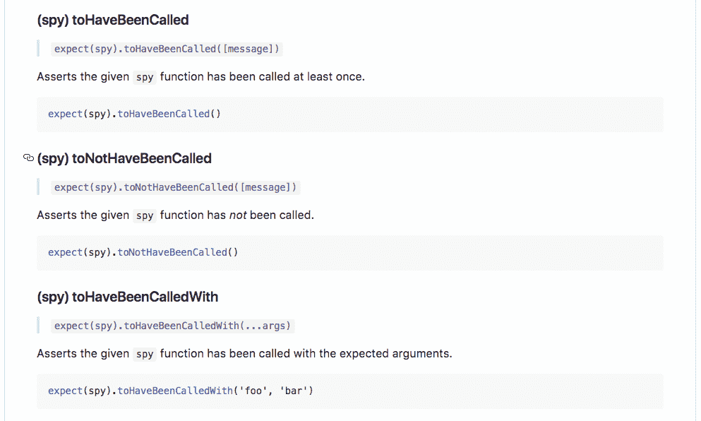

如前一段代码所示，我们有`toHaveBeenCalled`函数，这是我们对 spies 的第一个断言。我们可以断言我们的`spy`确实被调用了。在 Atom 内部，我们将调用`expect`并传入`spy`，就像这样：

```js
  it('should call the spy correctly', () => {
    var spy = expect.createSpy();
    spy();
    expect(spy)
  });
```

然后，我们将添加断言`toHaveBeenCalled`：

```js
    expect(spy).toHaveBeenCalled();
```

如果调用了`spy`，这将导致测试通过，而事实就是如此；如果从未调用`spy`，这将导致测试失败。我们可以使用`npm run test-watch`命令在终端内部运行测试套件，这将使用`nodemon`启动测试：

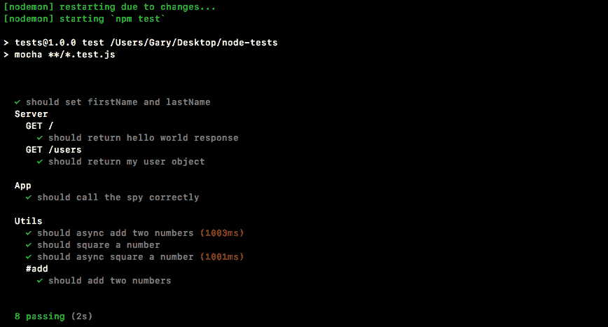

如前一个屏幕截图所示，我们有所有的测试用例，在`App`下有`should call the spy correctly`。它确实通过了，这太棒了。

现在让我们评论一下我称之为`spy`的那一行：

```js
  it('should call the spy correctly', () => {
    var spy = expect.createSpy();
    // spy();
    expect(spy).toHaveBeenCalled();
  });
```

而这一次，测试应该失败，因为实际上从未调用过`spy`，如下面的屏幕截图所示，我们看到`spy was not called`：

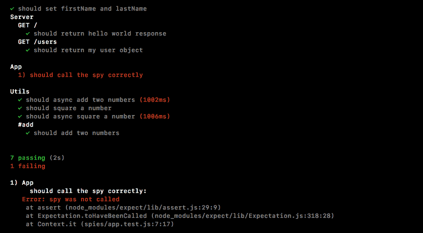

# 间谍断言的更多细节

现在，检查`spy`是否被调用非常好，但我们可以从断言中获得更多细节。例如，如果我用名称`Andrew`和年龄`25`来称呼`spy`会怎么样：

```js
  it('should call the spy correctly', () => {
    var spy = expect.createSpy();
    spy('Andrew', 25);
    expect(spy).toHaveBeenCalled();
  });
```

现在，我们想验证`spy`是否不仅仅是调用的，而是使用这些参数调用的？幸运的是，我们对此也有一个断言。我们可以调用`toHaveBeenCalledWith`而不是`toHaveBeenCalled`，这让我们可以传入一些参数，并验证`spy`确实是用这些参数调用的。

如下面的代码所示，我们将断言调用我的`spy`时使用了`Andrew`和编号`25`：

```js
    expect(spy).toHaveBeenCalledWith('Andrew', 25);
```

当我们保存文件并重新启动测试用例时，我们应该看到所有测试都通过了，这正是我们得到的结果：

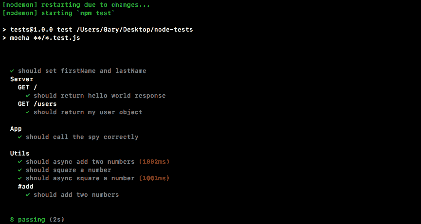

现在，如果没有使用上述数据调用`spy`，我将删除`25`：

```js
  it('should call the spy correctly', () => {
    var spy = expect.createSpy();
    spy('Andrew');
    expect(spy).toHaveBeenCalledWith('Andrew', 25);
  });
```

现在，如果我们重新运行测试套件，测试将失败。它会给你一条错误消息，让你知道`spy was never called with [ 'Andrew', 25 ]`。这会导致测试失败，这太棒了。

There are plenty of other assertions we can use with our spies. You can find them in the `expect` docs. We have `toHaveBeenCalled`, which we used; `toNotHaveBeenCalled`, verifying that a `spy` was not called. Then we have `toHaveBeenCalledWith`, which we also used. You can see there's a lot more to spies as well: how to create spies, which we've already done, and a few other methods.

# 使用 spy 交换函数

出于我们的目的，我们需要一个间谍，这样我们就可以在`app.js`（`saveUser`的内部模拟该功能。我们需要一种方法将`saveUser`功能替换为`spy`。然后我们可以验证当`handleSignup`被调用时，它确实调用了`saveUser`。它不需要在`db.js`中实际经历这个过程；这对我们的测试并不重要。唯一重要的是调用函数时使用了正确的参数。

为此，我们将研究一个名为`rewire`的 npm 模块，它允许我们为测试交换变量。在我们的例子中，在我们的测试文件中，我们将能够完全用其他东西替换`db`对象。然后，当代码运行时，它不会调用`app.js`中定义的`db.saveUser`，而是调用`db.saveUser`，这将是一个`spy`。

# 安装和设置重新布线功能

首先，我们需要在终端中安装`rewire`。这是一个很棒的测试工具。这对于测试有副作用的函数非常重要，就像我们在本节中看到的那样。让我们跑`npm install`。模块名称本身被称为`rewire`，我们将获取本次拍摄的最新版本`@3.0.2`。这是一个特定于测试的模块。我们的应用不需要它才能正常运行，因此我们将使用`--save-dev`标志将其添加到`package.json`依赖项列表中：

```js
npm install rewire@3.0.2 --save-dev
```


一旦安装了模块，我们就可以开始使用它了，而且设置起来非常简单。在`app.test.js`内部，我们可以从加载开始。在最上面，我们将创建一个新常量。这个将被称为`rewire`，我们将其设置为等于要求`rewire`返回的结果：

```js
const expect = require('expect');
const rewire = require('rewire');
```

# 用 spy 替换 db

现在，`rewire`的工作方式是，在加载要模拟的文件时，需要使用`rewire`而不是 require。在这个例子中，我们想用其他东西来替换`db`，所以当我们加载`app`时，我们必须以一种特殊的方式加载它。我们将创建一个名为`app`的变量，并将其设置为等于`rewire`，后跟通常放在`require`中的变量。在这种情况下，它是一个相对文件，我们创建的一个文件`./app`将完成任务：

```js
const expect = require('expect');
const rewire = require('rewire');

var app = rewire('./app');
```

现在，rewire 通过 require 加载您的文件，但它也在`app`上添加了两种方法。这些方法是：

*   `app.__set__`
*   `app.__get__`

我们可以用这些来模拟`app.js`中的各种数据。这意味着我们将模拟`db`对象，即从`db.js`返回的对象，但我们将用`spy`替换该函数。

在我们的`describe`块中，我们可以通过创建变量开始工作。这个变量将被称为`db`，我们将其设置为一个对象：

```js
describe('App', () => {
  var db = {

  }
```

我们唯一需要模仿的就是`saveUser`。在对象内部，我们将定义`saveUser`，然后通过使用`expect.createSpy`创建一个，将其设置为等于`spy`，如下所示：

```js
describe('App', () => {
  var db = {
    saveUser: expect.createSpy()
  };
```

现在我们有了这个`db`变量，唯一要做的就是替换它。我们使用`app.__set__`来实现这一点，这需要两个参数：

```js
describe('App', () => {
  var db = {
    saveUser: expect.createSpy()
  };
  app.__set__();
```

第一个是你想要替换的东西。我们试图替换`db`，我们试图用`db`变量替换它，这是我们的对象，具有`saveUser`函数：

```js
describe('App', () => {
  var db = {
    saveUser: expect.createSpy()
  };
  app.__set__('db', db);
```

有了它，我们现在可以编写一个测试来验证`handleSignup`确实调用了`saveUser`。

# 编写测试以验证函数的交换

为了验证`handleSignup`是否调用`saveUser`，在`app.test.js`内，我们将调用`it`：

```js
describe('App', () => {
  var db = {
    saveUser: expect.createSpy()
  };
  app.__set__('db', db);

  it('should call the spy correctly', () => {
    var spy = expect.createSpy();
    spy('Andrew', 25);
    expect(spy).toHaveBeenCalledWith('Andrew', 25);
  });

  it('should call saveUser with user object')
```

然后我们可以传入我们的函数，这就是在执行测试时实际运行的函数，不需要使用任何异步 done 参数。这将是目前的同步测试：

```js
  it('should call saveUser with user object', () => {

  });
```

在回调函数中，我们可以得到一个`email`和一个`password`，我们将在`db.js`中传递给`handleSignup`。我们将创建一个名为`email`的变量，将其设置为某封电子邮件`andrew@example.com`，我们可以对`password`、`var password`执行相同的操作；我们将其设置为`123abc`：

```js
  it('should call saveUser with user object', () => {
    var email = 'andrew@example.com';
    var password = '123abc';
  });
```

下一步，我们将呼叫`handleSignup`。这是我们要测试的函数。我们将调用`app.handleSignup`，传入两个参数`email`和`password`：

```js
  it('should call saveUser with user object', () => {
    var email = 'andrew@example.com';
    var password = '123abc';

    app.handleSignup(email, password);
  });
```

此时，`handleSignup`将被执行。这意味着这里的代码将运行并触发`db.saveUser`，但`db.saveUser`不是`db.js`中的方法；它是一个`spy`，这意味着我们现在可以使用我们刚刚学到的断言。

在测试用例内部，我们将使用`expect`到`expect`关于`db`的内容；变量`.saveUser`，我们将其设置为等于 a`spy`：

```js
    app.handleSignup(email, password);
    expect(db.saveUser)
```

我们将使用对象调用`.toHaveBeenCalledWith`，因为这是`db.js`应该使用的对象。我们将使用相同的 ES6 快捷方式：`email`、`password`：

```js
    app.handleSignup(email, password);
    expect(db.saveUser).toHaveBeenCalledWith({email, password});
  });
```

这将为`email`变量创建一个`email`属性集，并为`password`变量创建一个`password`属性集。有了这个，我们现在可以保存我们的测试文件，在终端中，我们可以通过使用向上箭头键两次重新运行`npm run test-watch`命令来重新启动`test-watch`脚本。这将启动我们的测试套件，启动我们的所有测试：

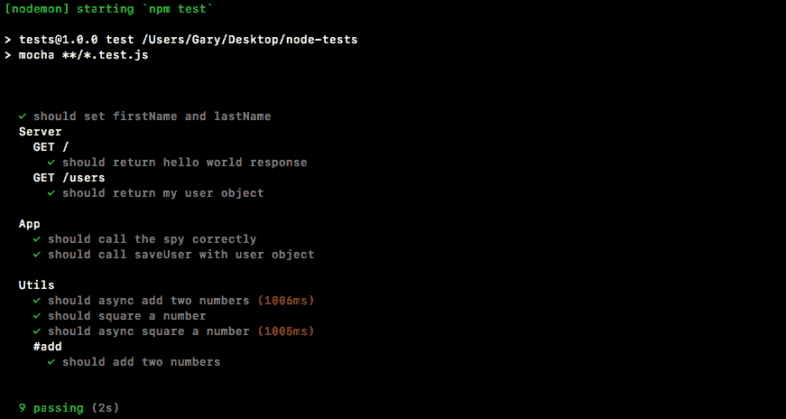

如前一个屏幕截图所示，我们看到`should call the spy correctly`通行证。另外，我们刚刚创建的测试用例也通过了。我们可以看到`should call saveUser with the user object`，这太棒了。我们现在有了一种方法来测试 Node 内的几乎所有内容。我们甚至可以测试调用其他函数的函数，验证通信是否按预期进行。所有这些都可以通过间谍来完成。

# 总结

在本章中，我们研究了 Express 应用的测试，正如我们在前一章中对同步和异步 Node 应用所做的那样。然后，我们用`describe()`对象组织我们的测试，这样我们就可以立即看到我们不同的测试方法。

在最后一节中，我们探讨了测试 Node 应用的另一种方法，即 spies。我们为间谍创建了测试文件，研究了`spy`断言以及与`spy`交换函数。

# 结论

这本书到此为止！通过本书的课程，您学习了 Node.js 的基础知识，以便在 web 上测试和部署 Node.js 应用。我们希望你喜欢这本书带给你的旅程。我们祝愿您一切顺利，并希望您继续改进 Node.js 应用。