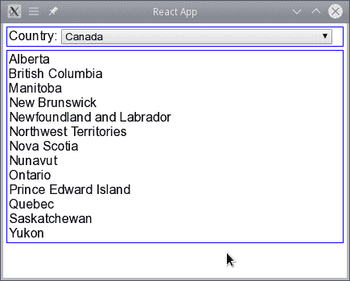
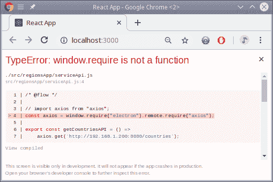
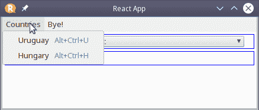
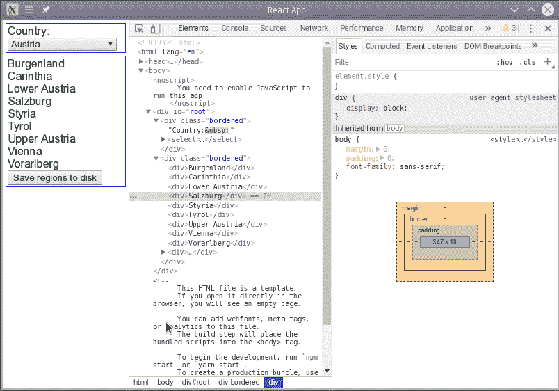
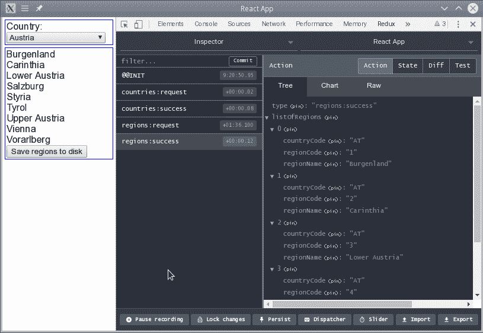

# 十三、使用 Electron 创建桌面应用

我们将了解以下配方：

*   用 React 设置电子
*   向应用添加 Node 功能
*   构建更加开放的体验
*   测试和调试你的应用
*   制作一个可分发的包

# 介绍

在前面的章节中，我们使用`Node`设置服务器，`React`创建网页。在本章中，我们将两者结合在一起，添加另一个名为`Electron`的工具，我们将了解如何使用 JS 编写与任何本机可执行应用完全相同的桌面应用。

# 用 React 设置电子

`Electron`是一个开源框架，由 GitHub 创建，允许您开发桌面可执行文件，将 Node 和 Chrome 结合在一起，提供完整的 GUI 体验。`Electron`已用于多个知名项目，包括 Visual Studio 代码、Atom 和 Light Table 等开发工具。基本上，您可以使用 HTML、CSS 和 JS 定义 UI（或者使用`React`，就像我们将要做的那样），但您也可以使用`Node`中的所有包和函数，因此您将不局限于沙盒体验，能够超越仅使用浏览器所能做到的

You may also want to read about **Progressive Web Apps** (**PWA**) which are web apps that can be "installed" at your machine, very much like they were native apps. These apps are launched as any other app, and run in a common app window, without tabs or a URL bar as a browser would show. PWAs may not (yet?) have access to full desktop functionality, but for many cases they may be more than enough. Read more about PWAs at [https://developers.google.com/web/progressive-web-apps/](https://developers.google.com/web/progressive-web-apps/).

# 怎么做。。。

现在，在这个配方中，让我们先安装`Electron`，然后在后面的配方中，我们将看到如何将`React`应用之一变成桌面程序。

我从[第 8 章](08.html)*中的存储库副本开始，扩展您的应用*，以获得国家和地区应用，我们也使用了 RN 示例。碰巧你可以很好地使用`Electron`和 CRA 构建的应用，甚至不需要弹出它，所以这就是我们在这里要做的。首先，我们需要安装基本的`Electron`包，因此在我们编写`React`应用的同一目录中，我们将执行以下命令：

```js
npm install electron --save-dev
```

然后，我们需要一个初学者 JS 文件。从[的`main.js`文件中获取一些提示 https://github.com/electron/electron-quick-start](https://github.com/electron/electron-quick-start) ，我们将创建以下`electron-start.js`文件：

```js
// Source file: electron-start.js

/* @flow */

const { app, BrowserWindow } = require("electron");

let mainWindow;

const createWindow = () => {
    mainWindow = new BrowserWindow({
        height: 768,
        width: 1024
    });
    mainWindow.loadURL("http://localhost:3000");
    mainWindow.on("closed", () => {
        mainWindow = null;
    });
};

app.on("ready", createWindow);

app.on("activate", () => mainWindow === null && createWindow());

app.on(
    "window-all-closed",
    () => process.platform !== "darwin" && app.quit()
);

```

以下是有关上述代码段的一些注意事项：

*   此代码在`Node`中运行，因此我们使用`require()`而不是`import`
*   `mainWindow`变量将指向运行代码的浏览器实例
*   我们将首先运行 React 应用，以便 Electron 能够从[加载代码 http://localhost:3000](http://localhost:3000)

在我们的代码中，我们还必须处理以下事件：

*   `Electron`完成初始化后调用`"ready"`，可以开始创建窗口。
*   `"closed"`表示您的窗口已关闭；您的应用可能有几个打开的窗口，因此此时您应该删除关闭的窗口。
*   `"window-all-closed"`表示您的整个应用已关闭。在 Windows 和 Linux 中，这意味着退出，但在 macOS 中，由于苹果的常规规则，通常不会退出应用。
*   重新激活应用时会调用`"activate"`，因此如果该窗口已被删除（如在 Windows 或 Linux 中），则必须重新创建该窗口。

The complete list of events that `Electron` can emit is at [https://github.com/electron/electron/blob/master/docs/api/app.md](https://github.com/electron/electron/blob/master/docs/api/app.md); check it out. 

我们已经有了`React`应用，所以我们只需要一种方法来调用`Electron`。将以下脚本添加到`package.json`，您就可以准备好了：

```js
 "scripts": {
 "electron": "electron .",
        .
        .
        .
```

我们准备好了；让我们看看这一切是如何结合在一起的。

# 它是如何工作的。。。

要在开发模式下运行`Electron`应用（稍后我们将继续创建可执行文件），我们必须执行以下操作：

1.  运行[第 4 章](04.html)中的`restful_server_cors`服务器代码*与 Node*实现 RESTful 服务。
2.  启动`React`应用，要求服务器运行。
3.  等到它加载完毕，然后，也只有到那时，才能继续下一步。
4.  启动`Electron`。

因此，基本上，您必须运行以下两个命令，但您需要在不同的终端上运行，并且在启动`Electron`之前，您还必须等待`React`应用显示在浏览器中：

```js
// *in the directory for our restful server:* node out/restful_server_cors.js // *in the React app directory:* npm start

// *and after the React app is running, in other terminal:*
npm run electron
```

启动`Electron`后，屏幕迅速出现，我们再次发现我们的国家和地区应用，现在独立于浏览器运行。请参见以下屏幕截图注意，我已将窗口的大小从 1024×768 调整为：


Our app, running as an independent executable

应用一如既往地工作；作为一个例子，我选择了一个国家，加拿大，并正确地得到了它的地区列表：



The app works as before; pick a country, and a call to our RESTful server will get its regions

我们完了！你可以看到，一切都是相互关联的，就像以前一样，如果你对`React`源代码进行任何更改，它们将立即反映在`Electron`应用中

到目前为止，我们已经看到我们可以从网页中生成一个可执行文件；现在让我们看看如何使它更强大。

# 向应用添加 Node 功能

在前面的配方中，我们看到只需进行一些小的配置更改，就可以将 web 页面变成一个应用。但是，您的功能仍然受到限制，因为您仍然只使用沙盒浏览器窗口中可用的功能。你不必这样想，因为你基本上可以添加所有`Node`功能，使用的功能可以让你超越网络的限制。让我们看看如何在这个食谱中做到这一点

# 怎么做。。。

我们想在我们的应用中添加一些典型桌面所具备的功能。让我们看看我们如何做到这一点。在应用中添加`Node`功能的关键是使用`Electron`中的`remote`模块。使用它，您的浏览器代码可以调用主进程的方法，从而获得对额外功能的访问

See [https://github.com/electron/electron/blob/master/docs/api/remote.md](https://github.com/electron/electron/blob/master/docs/api/remote.md) for more on the remote module. There is also extra information that might come in handy at [https://electronjs.org/docs/api/remote](https://electronjs.org/docs/api/remote).

假设我们想添加将一个国家的地区列表保存到文件中的可能性。我们需要访问`fs`模块才能写入文件，还需要打开一个对话框来选择要写入的文件。在我们的`serviceApi.js`文件中，我们将添加以下函数：

```js
// Source file: src/regionsApp/serviceApi.js

/* @flow */

const electron = window.require("electron").remote;

.
.
.

const fs = electron.require("fs");

export const writeFile = fs.writeFile.bind(fs);

export const showSaveDialog = electron.dialog.showSaveDialog;
```

添加了这一点之后，我们现在可以从主代码编写文件并显示对话框。要使用此功能，我们可以在`world.actions.js`文件中添加一个新操作：

```js
// Source file: src/regionsApp/world.actions.js

/* @flow */

import {
    getCountriesAPI,
    getRegionsAPI,
 showSaveDialog,
 writeFile
} from "./serviceApi";

.
.
.

export const saveRegionsToDisk = () => async (
    dispatch: ({}) => any,
    getState: () => { regions: [] }
) => {
    showSaveDialog((filename: string = "") => {
        if (filename) {
            writeFile(filename, JSON.stringify(getState().regions), e =>
                e && window.console.log(`ERROR SAVING ${filename}`, e);
            );
        }
    });
};
```

当`saveRegionsToDisk()`动作被调度时，它将显示一个对话框，提示用户选择要写入的文件，然后将从`getState().regions`获取的当前区域集以 JSON 格式写入所选文件。我们只需在`<RegionsTable>`组件中添加适当的按钮，即可发送必要的操作：

```js
// Source file: src/regionsApp/regionsTableWithSave.component.js

/* @flow */

import React from "react";
import PropTypes from "prop-types";

import "../general.css";

export class RegionsTable extends React.PureComponent<{
    loading: boolean,
    list: Array<{
        countryCode: string,
        regionCode: string,
        regionName: string
    }>,
 saveRegions: () => void
}> {
    static propTypes = {
        loading: PropTypes.bool.isRequired,
        list: PropTypes.arrayOf(PropTypes.object).isRequired,
 saveRegions: PropTypes.func.isRequired
    };

    static defaultProps = {
        list: []
    };

    render() {
        if (this.props.list.length === 0) {
            return <div className="bordered">No regions.</div>;
        } else {
            const ordered = [...this.props.list].sort(
                (a, b) => (a.regionName < b.regionName ? -1 : 1)
            );

            return (
                <div className="bordered">
                    {ordered.map(x => (
                        <div key={x.countryCode + "-" + x.regionCode}>
                            {x.regionName}
                        </div>
                    ))}
 <div>
 <button onClick={() => this.props.saveRegions()}>
 Save regions to disk
 </button>
 </div>
                </div>
            );
        }
    }
}
```

我们差不多完成了！当我们将此组件连接到存储时，只需添加新操作，如下所示：

```js
// Source file: src/regionsApp/regionsTableWithSave.connected.js

/* @flow */

import { connect } from "react-redux";

import { RegionsTable } from "./regionsTableWithSave.component";

import { saveRegionsToDisk } from "./world.actions";

const getProps = state => ({
    list: state.regions,
    loading: state.loadingRegions
});

const getDispatch = (dispatch: any) => ({
 saveRegions: () => dispatch(saveRegionsToDisk())
});

export const ConnectedRegionsTable = connect(
    getProps,
 getDispatch
)(RegionsTable);
```

现在，一切都准备好了让我们看看它的工作。

# 它是如何工作的。。。

我们添加的代码展示了如何访问`Node`包（在我们的例子中是`fs`）和一些额外的功能，例如显示“保存到磁盘”对话框。（后一个功能与应用的本地外观有更多关系，我们将在即将到来的*构建更具窗口性的体验*部分中了解更多信息。）当我们运行更新的应用并选择一个国家时，我们将看到新添加的按钮，如以下屏幕截图所示：


We now have a Save regions to disk button after the regions list

单击按钮将弹出一个对话框，允许您选择数据的目的地：


Clicking on the button brings up a Save screen, to specify to which file to save the results

如果单击“保存”，区域列表将以 JSON 格式写入，正如我们前面在`writeRegionsToDisk()`函数中指定的：

```js
[{"countryCode":"CA","regionCode":"1","regionName":"Alberta"},
{"countryCode":"CA","regionCode":"10","regionName":"Quebec"},
{"countryCode":"CA","regionCode":"11","regionName":"Saskatchewan"},
{"countryCode":"CA","regionCode":"12","regionName":"Yukon"},
{"countryCode":"CA","regionCode":"13","regionName":"Northwest Territories"},
{"countryCode":"CA","regionCode":"14","regionName":"Nunavut"},
{"countryCode":"CA","regionCode":"2","regionName":"British Columbia"},
{"countryCode":"CA","regionCode":"3","regionName":"Manitoba"},
{"countryCode":"CA","regionCode":"4","regionName":"New Brunswick"},
{"countryCode":"CA","regionCode":"5","regionName":"Newfoundland and Labrador"},
{"countryCode":"CA","regionCode":"7","regionName":"Nova Scotia"},
{"countryCode":"CA","regionCode":"8","regionName":"Ontario"},
{"countryCode":"CA","regionCode":"9","regionName":"Prince Edward Island"}]
```

需要注意的最后一个细节是，您的应用现在无法在浏览器中运行，您必须习惯于看到以下屏幕截图中的内容，即使您的代码在`Electron`中运行良好：



If you use Node's or Electron's functions, your code will no longer run in the browser, though it will perform perfectly well with Electron

就这样！没有太多麻烦，我们就能够超越普通浏览器应用的限制。你可以看到，你在`Electron`应用中所能做的几乎没有限制。

# 构建更加开放的体验

在前面的配方中，我们添加了使用`Node`提供的任何和所有功能的可能性。在本食谱中，我们现在将重点放在使我们的应用更像窗口，具有图标、菜单等。我们希望用户真正相信他们使用的是一款本机应用，具备他们习惯的所有功能。以下是[中的有趣主题列表 https://electronjs.org/docs/api](https://electronjs.org/docs/api) 只是一个简短的亮点列表，但还有更多可用选项：

| `clipboard` | 使用系统剪贴板执行复制和粘贴操作的步骤 |
| `dialog` | 显示消息、警报、打开和保存文件等的本机系统对话框 |
| `globalShortcut` | 检测键盘快捷键的步骤 |
| `Menu`、`MenuItem` | 创建包含菜单和子菜单的菜单栏的步骤 |
| `Notification` | 添加桌面通知的步骤 |
| `powerMonitor`、`powerSaveBlocker` | 监视电源状态变化，禁止进入睡眠模式 |
| `screen` | 获取有关屏幕、显示器等的信息 |
| `Tray` | 将图标和上下文菜单添加到系统托盘的步骤 |

让我们添加其中的一些功能，这样我们就可以得到一个外观更好的应用，它更集成到桌面上。

# 怎么做。。。

任何像样的应用都应该至少有一个图标和一个菜单，可能还有一些键盘快捷键，所以现在让我们添加这些功能，为了实现这一点，我们还可以添加一些区域写入磁盘时的通知。加上我们已经使用的保存对话框，这意味着我们的应用将包括几个本机窗口功能。让我们实现以下步骤，并了解如何添加这些额外功能。

首先，让我们添加一个图标。显示图标是最简单的事情，因为在创建`BrowserWindow()`对象时，它只需要一个额外的选项。我不是很注重*图形视觉设计师*，所以我只是从图标图标网站[下载了字母表、字母、r 图标免费文件 https://icon-icons.com/icon/alphabet-letter-r/62595](https://icon-icons.com/icon/alphabet-letter-r/62595) 。按如下方式实现该图标：

```js
mainWindow = new BrowserWindow({
    height: 768,
    width: 1024,
 icon: "./src/regionsApp/r_icon.png"
});
```

您也可以为系统托盘选择图标，尽管在这种情况下无法使用我们的 regions 应用，但您可能希望查看它。

There's another way of adding an icon to your app when you do the build, by adding an extra configuration item to the `"build"` entry in `package.json`. 

为了继续，我们将添加的第二个功能是一个菜单，其中有一些全局快捷方式可以引导。在我们的`App.regions.js`文件中，我们需要添加几行来访问`Menu`模块，并定义菜单本身：

```js
// Source file: src/App.regions.js

.
.
.

import { getRegions } from "./regionsApp/world.actions";

.
.
.

const electron = window.require("electron").remote;
const { Menu } = electron;

const template = [
    {
        label: "Countries",
        submenu: [
            {
                label: "Uruguay",
                accelerator: "Alt+CommandOrControl+U",
                click: () => store.dispatch(getRegions("UY"))
            },
            {
                label: "Hungary",
                accelerator: "Alt+CommandOrControl+H",
                click: () => store.dispatch(getRegions("HU"))
            }
        ]
    },
    {
        label: "Bye!",
        role: "quit"
    }
];

const mainMenu = Menu.buildFromTemplate(template);
Menu.setApplicationMenu(mainMenu);
```

使用模板是创建菜单的一种简单方法，但也可以手动创建，逐项添加。我决定要一份国家菜单，上面有两个选项来显示乌拉圭（我出生的地方）和匈牙利（我父亲的父亲出生的地方）的地区。`click`属性发送适当的操作。`accelerator`属性也用于定义全局快捷方式。参见[https://github.com/electron/electron/blob/master/docs/api/accelerator.md](https://github.com/electron/electron/blob/master/docs/api/accelerator.md) 用于可能使用的组合键列表，包括以下内容：

*   *命令键*，如`Command`（或`Cmd`）、`Control`（或`Ctrl`）或两者兼有（`CommandOrControl`或`CmdOrCtrl`）
*   *备用键*，如`Alt`、`AltGr`或`Option`
*   *常用键*，如`Shift`、`Escape`（或`Esc`、`Tab`、`Backspace`、`Insert`或`Delete`等
*   *功能键*，如`F1`至`F24`
*   *光标键*，包括`Up`、`Down`、`Left`、`Right`、`Home`、`End`、`PageUp`、`PageDown`等
*   *媒体键*，如`MediaPlayPause`、`MediaStop`、`MediaNextTrack`、`MediaPreviousTrack`、`VolumeUp`、`VolumeDown`、`VolumeMute`等

我还希望能够退出应用（不要介意`Electron`创建的窗口已经有一个×图标来关闭它！）-这是一个预定义的*角色*，您不需要做任何特殊的事情。有关角色的完整列表，请访问[https://electronjs.org/docs/api/menu-item#roles](https://electronjs.org/docs/api/menu-item#roles) 。使用这些角色，您可以执行大量操作，包括一些特定的 macOS 功能，以及以下操作：

*   使用剪贴板（`cut`、`copy`、`paste`和`pasteAndMatchStyle`）
*   处理窗口（`minimize`、`close`、`quit`、`reload`、`forceReload`）
*   变焦（`zoomIn`、`zoomOut`和`resetZoom`）

为了完成这项工作，实际上只是为了完成这项工作，让我们在写入文件时添加一个通知触发器。`Electron`有`Notification`模块，但我选择使用[中的`node-notifier`https://github.com/mikaelbr/node-notifier](https://github.com/mikaelbr/node-notifier) ，使用起来很简单。首先，我们将以通常的方式添加包：

```js
npm install node-notifier --save
```

在`serviceApi.js`中，我们必须导出新函数，因此我们可以从其他地方导入，我们将很快看到：

```js
const electron = window.require("electron").remote;

.
.
.

export const notifier = electron.require("node-notifier");
```

最后，让我们在`world.actions.js`文件中使用：

```js

import {
 notifier,
    .
    .
    .
} from "./serviceApi";
```

在我们所有的设置中，实际上发送通知非常简单，只需要很少的代码：

```js
// Source file: src/regionsApp/world.actions.js

.
.
.

export const saveRegionsToDisk = () => async (
    dispatch: ({}) => any,
    getState: () => { regions: [] }
) => {
    showSaveDialog((filename: string = "") => {
        if (filename) {
            writeFile(filename, JSON.stringify(getState().regions), e => {
 if (e) {
 window.console.log(`ERROR SAVING ${filename}`, e);
 } else {
 notifier.notify({
 title: "Regions app",
 message: `Regions saved to ${filename}`
 });
 }
            });
        }
    });
};
```

我们准备好了！让我们看看我们更多的*窗口*应用现在是什么样子。

# 它是如何工作的。。。

首先，我们可以轻松检查图标是否出现。请参见以下屏幕截图，并将其与本章中的第一个屏幕截图进行比较：


Our app now has its own icon, possibly not too exclusive or original, but better than nothing

现在，让我们看看菜单。它有我们的选项，包括快捷方式：



Our app now also has a menu, as any self-respecting app should

然后，如果我们使用鼠标或全局快捷方式选择一个选项（比如乌拉圭），屏幕将正确加载预期区域：


The menu entries work as expected; we can use the Uruguay option to see my country's 19 departments

最后，让我们看看通知是否按预期工作。如果单击“将区域保存到磁盘”按钮并选择一个文件，我们将看到一个通知，如以下屏幕截图所示：


Saving a file now shows a notification; in this case, for Linux with KDE

现在我们已经了解了如何扩展浏览器页面，以包括`Node`功能和窗口本机功能。现在，让我们回到更基本的需求，学习如何测试和调试代码。

# 测试和调试你的应用

现在，我们有一个共同的需求：测试和调试你的应用。我要告诉你的第一件事是没有关于测试的新闻！我们看到的所有测试浏览器和`Node`代码的技术仍然适用，因为您的`Electron`应用本质上只是一个浏览器应用（尽管可能有一些额外的功能），您将以与之前相同的方式模拟它，所以这里没有什么新的内容可供学习。

但是，关于调试，会有一些新的要求，因为您的代码没有在浏览器中运行。与`React Native`类似，我们必须使用一些工具才能在代码运行时查看代码。让我们看看，在这个食谱中，如何进行所有这些。

# 怎么做。。。

我们希望安装和配置调试所需的所有工具。让我们在本节中这样做。调试的关键工具将是`electron-devtools-installer`，您可以从[获得 https://github.com/MarshallOfSound/electron-devtools-installer](https://github.com/MarshallOfSound/electron-devtools-installer) 。我们将使用一个简单的命令来安装它，以及之前使用的`Redux Devtools`扩展：

```js
npm install electron-devtools-installer redux-devtools-extension --save-dev
```

要使用`Redux Devtools`，我们必须首先修复商店，就像我们之前做的那样；这里没有什么新鲜事：

```js
// Source file: src/regionsApp/store.with.redux.devtools.js

/* @flow */

import { createStore, applyMiddleware } from "redux";
import { composeWithDevTools } from "redux-devtools-extension";
import thunk from "redux-thunk";

import { reducer } from "./world.reducer";

export const store = createStore(
    reducer,
 composeWithDevTools(applyMiddleware(thunk))
);
```

对于工具本身，我们还必须稍微调整一下启动程序代码：

```js
// Source file: electron-start.with.debugging.js

/* @flow */

const { app, BrowserWindow } = require("electron");
const {
 default: installExtension,
 REACT_DEVELOPER_TOOLS,
 REDUX_DEVTOOLS
} = require("electron-devtools-installer");

let mainWindow;

const createWindow = () => {
    mainWindow = new BrowserWindow({
        height: 768,
        width: 1024
    });
    mainWindow.loadURL("http://localhost:3000");

 mainWindow.webContents.openDevTools();

 installExtension(REACT_DEVELOPER_TOOLS)
 .then(name => console.log(`Added Extension: ${name}`))
 .catch(err => console.log("An error occurred: ", err));

 installExtension(REDUX_DEVTOOLS)
 .then(name => console.log(`Added Extension: ${name}`))
 .catch(err => console.log("An error occurred: ", err));

    mainWindow.on("closed", () => {
        mainWindow = null;
    });
};

app.on("ready", createWindow);

app.on("activate", () => mainWindow === null && createWindow());

app.on(
    "window-all-closed",
    () => process.platform !== "darwin" && app.quit()
);
```

好的是，您可以从代码中添加所有工具，而无需特殊安装或任何其他过程。在这些简单的改变之后，你就完成了；现在，让我们看看它的工作！

# 它是如何工作的。。。

如果您启动修改后的代码，您将看到`Electron`窗口现在包括经典的 Chrome 工具，包括`React`和`Redux`。请参见以下屏幕截图：



The electron-devtools-installer package lets you add all the tools you need, with a simple procedure

除控制台外，您还可以使用`React Devtools`检查部件：


The React Devtools can be used to inspect components and their props

类似地，`Redux DevTools`允许您检查操作和存储。请参见以下屏幕截图：



You also installed the Redux developer tools, which let you inspect everything Redux-related

正如你所看到的，我们已经拥有了所有我们习惯使用的工具，除了一个例外——网络呼叫呢？让我们现在来处理这个问题。

# 还有更多。。。

您可能已经注意到，“网络”选项卡没有显示从应用完成的 API 调用。有了 RN，我们解决了这个问题，因为我们使用的工具包括检查所有网络流量的能力，但这在这里并没有发生。因此，我们将不得不做一些额外的工作，而不是简单、自动化的解决方案。如果您使用`axios`进行所有 API 调用，只需修改其原始方法即可生成日志：

```js
// Source file: src/regionsApp/serviceApi.js

.
.
.

axios.originalGet = axios.get;
axios.get = (uri, options, ...args) =>
    axios.originalGet(uri, options, ...args).then(response => {
        console.log(`GET ${uri}`, {
            request: { uri, options, ...args },
            response
        });
        return response;
    });
```

显示的更改将导致每个成功的`GET`记录您需要的所有内容，如以下屏幕截图所示：


Our changed `axios.get()` method produces a satisfying log

当然，这只是所需更改的一小部分。您必须为失败的调用添加代码（因此，也要添加一些登录`.catch()`），并且您还需要对其他方法（`.post()`、`.delete()`等等）进行此类更改，但必要的代码很简单，因此我将把它作为练习留给读者！

# 制作一个可分发的包

现在我们有了一个完整的应用，剩下要做的就是将其打包，以便您可以将其作为可执行文件交付给 Windows、Linux 或 macOS 用户。让我们看看如何在这个食谱中完成这一章。

# 怎么做。。。

打包应用的方法有很多，但我们将使用一个工具`electron-builder`，如果你能正确配置它，这将使它变得更容易！

You can read more about `electron-builder`, its capabilities, and its configuration at [https://www.electron.build/](https://www.electron.build/).

让我们来看看必要的步骤。首先，我们必须从定义构建配置开始，我们的第一步将一如既往地安装该工具：

```js
npm install electron-builder --save-dev
```

要访问添加的工具，我们需要一个新脚本，我们将在`package.json`中添加该脚本：

```js
"scripts": {
 "dist": "electron-builder",
    .
    .
    .
}
```

我们还必须在`package.json`中添加更多细节，这是构建过程和生成的应用所需要的。特别是，需要对`homepage`进行更改，因为 CRA 创建的`index.html`文件使用的绝对路径在以后无法与`Electron`一起使用：

```js
"name": "chapter13",
"version": "0.1.0",
"description": "Regions app for chapter 13",
"homepage": "./",
"license": "free",
"author": "Federico Kereki",
```

最后，需要一些特定的建筑配置。您无法使用 Linux 或 Windows 机器为 macOS 构建，因此我将省略该配置。我们必须指定在哪里可以找到文件，使用什么压缩方法，等等：

```js
"build": {
    "appId": "com.electron.chapter13",
    "compression": "normal",
    "asar": true,
    "extends": null,
    "files": [
        "electron-start.js",
        "build/**/*",
        "node_modules/**/*",
        "src/regionsApp/r_icon.png"
    ],
    "linux": {
        "target": "zip"
    },
    "win": {
        "target": "portable"
    }
}
```

Read more about building for different platforms at [https://www.electron.build/multi-platform-build](https://www.electron.build/multi-platform-build). For more on all of the configuration options, see [https://www.electron.build/configuration/configuration#configuration](https://www.electron.build/configuration/configuration#configuration).

我们已经完成了所需的配置，但是代码本身也有一些更改，我们必须调整代码以构建包。当打包应用运行时，不会有任何网页包服务器运行；代码将取自构建的`React`包。此外，您不希望包含调试工具。因此，起动机代码需要进行以下更改：

```js
// Source file: electron-start.for.builder.js

/* @flow */

const { app, BrowserWindow } = require("electron");
const path = require("path");
const url = require("url");

let mainWindow;

const createWindow = () => {
    mainWindow = new BrowserWindow({
        height: 768,
        width: 1024,
 icon: path.join(__dirname, "./build/r_icon.png")
    });
    mainWindow.loadURL(
 url.format({
 pathname: path.join(__dirname, "./build/index.html"),
 protocol: "file",
 slashes: true
 })
    );
    mainWindow.on("closed", () => {
        mainWindow = null;
    });
};

app.on("ready", createWindow);

app.on("activate", () => mainWindow === null && createWindow());

app.on(
    "window-all-closed",
    () => process.platform !== "darwin" && app.quit()
);
```

我们主要从`build/`目录中获取图标和代码。一个`npm run build`命令将负责生成该目录，因此我们可以继续创建我们的可执行应用。

# 它是如何工作的。。。

完成此设置后，构建应用基本上是微不足道的。只需执行以下操作，即可在`dist/`目录中找到所有可分发的文件：

```js
npm run electron-builder
```

You may want to add a new line to the `.gitignore` file so that the distribution directory won't be committed. I included a `**/dist` line to mine, paralleling the previous `**/node_modules` and `**/dist` existing lines.

现在我们有了 Linux 应用，我们可以通过解压缩`.zip`文件并单击`chapter13`可执行文件来运行它。（名称来自`package.json`中的`"name"`属性，我们在前面对其进行了修改。）结果应该如下图所示：


The Linux executable runs as a native app, showing the same screen as we saw earlier

我还想试用 Windows`EXE`文件。因为我没有 Windows 机器，所以我从[下载了一个免费的`VirtualBox`虚拟机 https://developer.microsoft.com/en-us/microsoft-edge/tools/vms/](https://developer.microsoft.com/en-us/microsoft-edge/tools/vms/) -它们只能工作 90 天，但我只需要几分钟。

下载虚拟机后，在`VirtualBox`中进行设置，最后运行，生成的结果与 Linux 相同，如下图所示：


Our native Windows app runs equally in a Windows machine

所以，我们设法开发了一款`React`应用，用`Node`和`Electron`功能对其进行了增强，并最终将其打包用于不同的操作系统。这样，我们就完了！