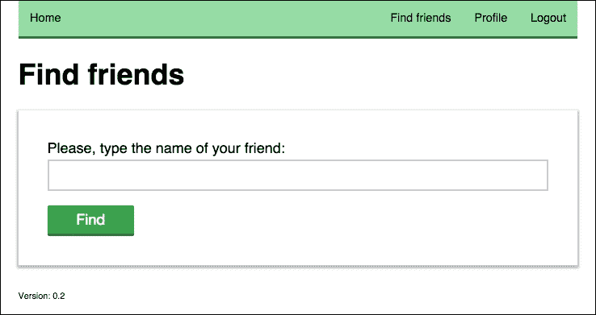

# 六、增加好友功能

在第五章、*用户管理*中，实现了用户注册登录系统。 现在我们的数据库中有用户信息，我们可以继续研究社交网络最重要的特征之一——好友。 在本章中，我们将为以下内容添加一个逻辑:

*   找到朋友
*   将用户标记为好友
*   在**配置文件**页面显示被链接的用户

# 寻找朋友

寻找朋友的过程涉及到我们当前代码库的一系列变化。 下面的部分将指导我们搜索和显示朋友简介。 我们将对 REST API 进行一些改进，并定义一个新的控制器和模型。

## 添加搜索页面

到目前为止，我们有用于注册、登录和配置文件管理的页面。 我们将在导航栏中增加一个链接`Find friends`。 为此，我们需要更新`frontend/tpl/navigation.html`文件，如下所示:

```js
<li class="right"><a on-click="goto:logout">Logout</a></li>
<li class="right"><a on-click="goto:profile">Profile</a></li>
<li class="right"><a on-click="goto:find-friends">Find  friends</a></li>
```

我们在最后添加的链接将把用户转发到一个新的路由。 与其他页面一样，我们的路由将捕获 URL 更改并触发一个处理程序。 以下是`app.js`文件的一个小更新:

```js
Router
.add('find-friends', function() {
  if(userModel.isLogged()) {
    var p = new FindFriends();
    showPage(p);
  } else {
    Router.navigate('login');
  }
})
```

如果用户没有经过身份验证，就不可能添加新朋友。 我们将在前端应用一个简单的检查，但我们也将保护 API 调用。 必须创建新的`FindFriends`控制器。 这个控制器的作用是显示一个带有输入字段和按钮的表单。 用户提交表单，我们查询数据库，然后显示与输入的字符串匹配的用户。 下面是控制器如何开始的:

```js
// frontend/js/controllers/FindFriends.js
module.exports = Ractive.extend({
  template: require('../../tpl/find-friends'),
  components: {
    navigation: require('../views/Navigation'),
    appfooter: require('../views/Footer')
  },
  data: {
    loading: false,
    message: '',
    searchFor: '',
    foundFriends: null
  },
  onrender: function() {
    // ...
  }
});
```

我们保持相同的`Navigation`和`Footer`组件。 有几个变量具有各自的默认值。 `loading`关键字将用作一个标志，指示我们正在向 API 发出请求。 获取符合某些条件的好友可能是一个复杂的操作。 因此，向用户展示我们正在处理他/她的查询将是一个很好的实践。 属性`message`将用于显示确认一切正常或报告错误。 最后两个变量保存数据。 `searchFor`变量将承载用户输入的字符串，`foundFriends`将承载后端返回的用户。

让我们检查一下需要什么作为 HTML 标记。 `frontend/tpl/find-friends.html`文件包含以下内容:

```js
<header>
  <navigation></navigation>
</header>
<div class="hero">
  <h1>Find friends</h1>
</div>
<form onsubmit="return false;">
  {{#if loading}}
    <p>Loading. Please wait.</p>
  {{else}}
    <label for="friend-name">
      Please, type the name of your friend:
    </label>
    <input type="text" id="friend-name" value="{{friendName}}"/>
    <input type="button" value="Find" on-click="find" />
  {{/if}}
</form>
{{#if foundFriends !== null}}
  <div class="friends-list">
    {{#each foundFriends}}
      <div class="friend-list-item">
        <h2>{{firstName}} {{lastName}}</h2>
        <input type="button" value="Add as a friend"
         on-click="add:{{id}}"/>
      </div>
    {{/each}}
  </div>
{{/if}}
{{#if message !== ''}}
  <div class="friends-list">
    <p>{{{message}}}</p>
  </div>
{{/if}}
<appfooter />
```

`header`、和`navigation`部分保持不变。 我们在顶部有一个很好的标题，后面是我们提到的表单。 如果`loading`标志的值为`true`，则显示**Loading。 请稍等。** 信息。 如果我们不在后台查询的过程中，那么我们将显示输入字段和按钮。 下面的截图演示了它在实践中的样子:



模板的下一部分呈现后端发送的用户。 它显示他们的名字和一个**添加为好友**按钮。 在下面的页面中，我们将看到该视图的屏幕截图。

HTML 标记的最后一部分用于有条件地显示消息。 如果我们为`message`变量设置一个值，那么 ractivejs 将显示`div`元素并使文本可见。

## 编写模型

我们有接受用户输入的用户界面。 现在，我们需要与后端通信并检索与表单字段值匹配的用户。 在我们的系统中，我们通过模型向 API 发出请求。

因此，让我们创建一个新的`frontend/js/models/Friends.js`模型:

```js
var ajax = require('../lib/Ajax');
var Base = require('./Base');

module.exports = Base.extend({
  data: {
    url: '/api/friends'
  },
  find: function(searchFor, callback) {
    ajax.request({
      url: this.get('url') + '/find',
      method: 'POST',
      data: {
        searchFor: searchFor
      },
      json: true
    })
    .done(function(result) {
      callback(null, result);
    })
    .fail(function(xhr) {
      callback(JSON.parse(xhr.responseText));
    });
  }
});
```

`friendship`功能的端点为`/api/friends`。 要在用户中搜索，我们将`/find`附加到 URL。 我们将使用`searchFor`变量的值发出`POST`请求。 再次处理结果的代码使用`lib/Ajax`模块，如果一切正常，它将触发指定的回调。

让我们更新调用新创建的模型及其`find`函数的控制器。 在`controllers/FindFriends.js`文件的顶部，我们将添加一个`require`语句:

```js
var Friends = require('../models/Friends');
```

然后，在控制器的`render`处理程序中，我们将放置以下代码片段:

```js
onrender: function() {

  var model = new Friends();
  var self = this;

  this.on('find', function(e) {
    self.set('loading', true);
    self.set('message', '');
    var searchFor = this.get('friendName');
    model.find(searchFor, function(err, res) {

      if(res.friends && res.friends.length > 0) {
        self.set('foundFriends', res.friends);
      } else {
        self.set('foundFriends', null);
        self.set('message', 'Sorry, there is no friends matching <strong>' + searchFor + '<strong>');
      }
      self.set('loading', false);
    });
  });

}
```

我们表单中的`find`事件由按钮触发。 一旦我们注册了按钮的点击，我们就会显示`loading`字符串并清除之前显示的任何消息。 我们得到输入字段的值，并请求模型匹配用户。 如果存在任何这样的潜在朋友，我们将通过为`foundFriends`变量设置一个值来呈现它们。 如果没有，我们将显示一条消息，说明没有符合条件的用户。 一旦我们完成了 API 方法的实现，屏幕就会像这样:


## 从数据库中获取好友

我们需要做的改变是在`backend/API.js`。 我们需要增加两条新路线。 但是，在继续查询用户之前，我们将添加一个帮助函数来获取当前用户的配置文件。 我们将把当前用户的姓名和电子邮件保存在一个`session`变量中，但这还不够，因为我们想要显示更多的用户信息。 因此，下面的函数从数据库中获取完整的概要文件:

```js
var getCurrentUser = function(callback, req, res) {
  getDatabaseConnection(function(db) {
    var collection = db.collection('users');
    collection.find({ 
      email: req.session.user.email
    }).toArray(function(err, result) {
      if(result.length === 0) {
        error('No such user', res);
      } else {
        callback(result[0]);
      }
    });
  });
};
```

我们使用用户的电子邮件作为请求的标准。 包含概要文件数据的对象作为回调函数的参数返回。

因为我们有关于当前用户的所有信息，所以我们可以继续实现用户的搜索。 应该回答这些查询的路由如下:

```js
Router
.add('api/friends/find', function(req, res) {
  if(req.session && req.session.user) {
    if(req.method === 'POST') {      
      processPOSTRequest(req, function(data) {
        getDatabaseConnection(function(db) {
          getCurrentUser(function(user) {
            findFriends(db, data.searchFor, user.friends || []);
          }, req, res);          
        });
      });
    } else {
      error('This method accepts only POST requests.', res);
    }
  } else {
    error('You must be logged in to use this method.', res);
  }
})
```

第一个`if`子句保证此路由仅对已注册和登录的用户可访问。 此方法只接受`POST`请求。 其余取`searchFor`变量并调用`findFriends`函数，其实现方式如下:

```js
var findFriends = function(db, searchFor, currentFriends) {
  var collection = db.collection('users');
  var regExp = new RegExp(searchFor, 'gi');
  var excludeEmails = [req.session.user.email];
  currentFriends.forEach(function(value, index, arr) {
    arr[index] = ObjectId(value);
  });
  collection.find({
    $and: [
      {
        $or: [
          { firstName: regExp },
          { lastName: regExp }
        ]
      },
      { email: { $nin: excludeEmails } },
      { _id: { $nin: currentFriends } }
    ]
  }).toArray(function(err, result) {
    var foundFriends = [];
    for(var i=0; i<result.length; i++) {
      foundFriends.push({
        id: result[i]._id,
        firstName: result[i].firstName,
        lastName: result[i].lastName
      });
    };
    response({
      friends: foundFriends
    }, res);
  });
}
```

我们将系统中的用户名分为两个变量:`firstName`和`lastName`。 我们不能确定当用户在搜索表单的字段中输入时，他们可能指的是哪一个。 我们将在数据库中搜索这两个属性。 我们还将使用一个正则表达式来确保我们的搜索不区分大小写。

MongoDB 数据库提供了执行复杂查询的语法。 在我们的例子中，我们想要获取以下内容:

*   姓或名与客户端发送的条件匹配的用户。
*   与当前用户已添加的好友不同的用户。
*   与当前用户不同的用户。 我们不想用用户的个人资料来表示他们的好友。

变量`$nin`表示不在提供的数组中的*值。 我们将排除当前用户的电子邮件地址。 值得一提的一点细节是 MongoDB 以 12 字节的 BSON 类型存储用户的 id。 它们不是纯文本。 因此，我们需要在发送查询之前使用一个`ObjectID`函数。 该方法可通过相同的`mongodb`模块`var ObjectId = require('mongodb').ObjectID`访问。*

当数据库驱动程序返回满足我们标准的记录时，我们过滤信息并使用适当的 JSON 文件进行响应。 我们不会发送用户的全部配置文件，因为我们不会使用所有数据。 名字和 id 就足够了。

向 API 添加新路由将使好友搜索工作。 现在，让我们添加将概要文件附加到当前用户的逻辑。

# 将用户标记为好友

如果我们检查新页面的 HTML 模板，我们将看到每个呈现的用户都有一个发送`add`事件的按钮。 让我们在控制器中处理这个问题，并在模型中运行一个函数，这与寻找朋友的过程类似:

```js
this.on('add', function(e, id) {
  this.set('loading', true);
  model.add(id, function(err, res) {
    self.set('foundFriends', null);
    if(err) {
      self.set('message', 'Operation failed.');
    } else if(res.success === 'OK') {
      self.set('message', 'Operation successful.');
    }
    self.set('loading', false);
  });
});
```

我们对`loading`标志使用相同的技术。 我们将在下面的代码中介绍的模型方法接受用户的`id`值，并报告链接是否成功。 我们需要清除`foundFriends`数组。 否则，当前用户可能会两次单击相同的配置文件。 另一种选择是只删除单击的项，但这涉及更多代码。

在`models/Friends.js`中增加的内容如下:

```js
add: function(id, callback) {
  ajax.request({
    url: this.get('url') + '/add',
    method: 'POST',
    data: {
      id: id
    },
    json: true
  })
  .done(function(result) {
    callback(null, result);
  })
  .fail(function(xhr) {
    callback(JSON.parse(xhr.responseText));
  });
}
```

`add`和`find`方法之间唯一的区别在于，在第一个方法中，我们发送了`searchFor`，而在第二个方法中，我们发送了`id`参数。 错误处理和结果响应是相同的。 当然，端点也进行了调整。

我们显示概要文件，用户单击其中一些概要文件，然后我们的模型向后端触发一个`POST`请求。 是时候实现将用户标记为好友的 API 路由了。 为此，我们将通过添加一个名为`friends`的新数组来更新当前用户的配置文件，该数组包含了对好友配置文件的引用:

```js
.add('api/friends/add', function(req, res) {
  if(req.session && req.session.user) {
    if(req.method === 'POST') {
      var friendId;
      var updateUserData = function(db, friendId) {
        var collection = db.collection('users');
        collection.update(
          { email: req.session.user.email },
          { $push: { friends: friendId } }, 
          done
        );
      };
      var done = function(err, result) {
        if(err) {
          error('Error updating the data.', res);
        } else {                
          response({
            success: 'OK'
          }, res);
        }
      };
      processPOSTRequest(req, function(data) {
        getDatabaseConnection(function(db) {
          updateUserData(db, data.id);
        });
      });
    } else {
      error('This method accepts only POST requests.', res);
    }
  } else {
    error('You must be logged in to use this method.', res);
  }
})
```

上述方法再次受到保护。 我们需要一个经过身份验证的用户和一个`POST`请求。 在获取好友的 ID 之后，使用`$push`操作符创建(如果不存在)并填充`friends`数组。 `done`函数的唯一任务是向浏览器发送响应。

本章的下一步是在用户的**配置文件**页面上显示添加的朋友。

# 在 Profile 页面显示链接的用户

同样，我们将从更新模板开始。 在上一章的中，我们创建了`frontend/tpl/profile.html`。 它包含一个表单，我们用它来更新配置文件。 让我们在它后面添加以下代码:

```js
{{#if friends.length > 0}}
  <div class="hero">
    <h1>Friends</h1>
  </div>
  <div class="friends-list">
    {{#each friends:index}}
      <div class="friend-list-item">
        <h2>{{friends[index].firstName}}  {{friends[index].lastName}}</h2>
      </div>
    {{/each}}
  </div>
{{/if}}
```

如果 Ractive 组件具有`friends`属性，那么我们将呈现一个用户列表。 页面将显示用户的名字，它看起来像下一个截图:


呈现页面的控制器也应该更新。 我们应该使用在前几节中开发的相同的`models/Friends`模型。 这就是为什么我们需要在顶部添加`var Friends = require('../models/Friends');`。 另外三行代码将使记录的获取工作。 我们将它们添加到控制器的`onrender`处理程序中，如下所示:

```js
// controllers/Profile.js
onrender: function() {

  ...

  var friends = new Friends();
  friends.fetch(function(err, result) {
    self.set('friends', result.friends);
  });
}
```

我们必须在控制器中做的另一个小添加是定义变量`friends`的默认值，如下所示:

```js
  data: {
    friends: []
  },
  onrender: function() {
  ...
  }
```

这次，我们不打算更新模型。 我们将使用默认的`fetch`方法向`/api/friends`端点发送`GET`请求。 唯一需要做的添加是在`backend/API.js`文件中。 我们需要一个找到当前用户的朋友并返回他们的路径:

```js
.add('api/friends', function(req, res) {
  if(req.session && req.session.user) {
    getCurrentUser(function(user) {
      if(!user.friends || user.friends.length === 0) {
        return response({ friends: [] }, res);
      }
      user.friends.forEach(function(value, index, arr) {
        arr[index] = ObjectId(value);
      });
      getDatabaseConnection(function(db) {
        var collection = db.collection('users');
        collection.find({ 
          _id: { $in: user.friends }
        }).toArray(function(err, result) {
          result.forEach(function(value, index, arr) {
            arr[index].id = value.id;
            delete arr[index].password;
            delete arr[index].email;
            delete arr[index]._id;
          });
          response({
            friends: result
          }, res);
        });
      });
    }, req, res);
  } else {
    error('You must be logged in to use this method.', res);
  }
})
```

这个是我们使用`getCurrentUser`辅助函数的第二个位置。 我们没有用户的资料。 因此，我们需要向 MongoDB 服务器发出一个额外的请求。 在这种情况下，操作员会帮助我们。 同样，我们需要在将 id 与查询一起发送之前将它们转换为正确的格式。 最后，在响应浏览器之前，我们删除敏感信息，如 ID、密码和电子邮件。 前端接收到一个漂亮的数组，其中包含当前登录用户的所有好友。

# 小结

在本章中，我们使创建用户之间的链接成为可能。 我们加强了关于前端控制器和模型的知识。 我们用一些新方法扩展了项目的 API，并执行了一些复杂的数据库查询。

在下一章中，我们将学习如何使用 Node.js 上传内容。 像其他流行的社交网络一样，发布的信息将作为提要显示给用户。