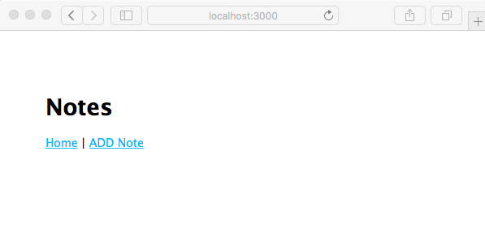
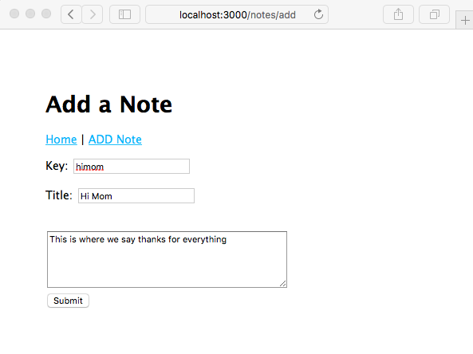
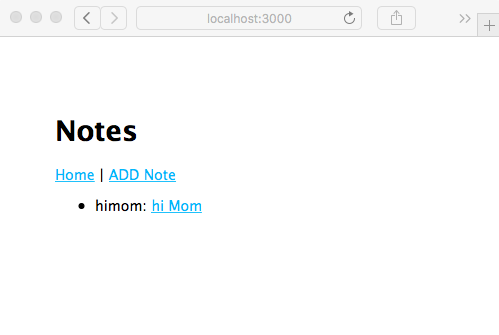
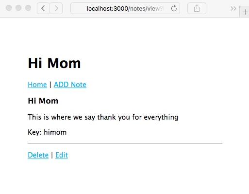
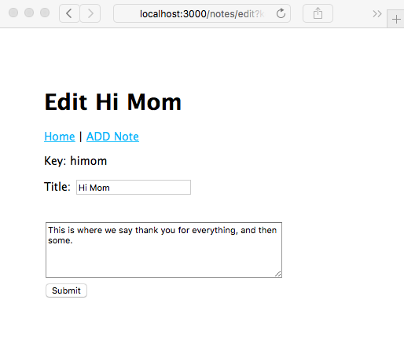
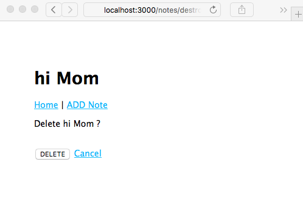
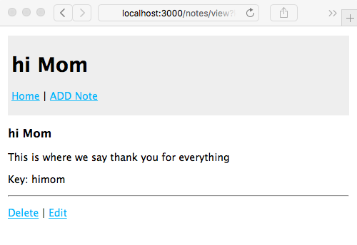
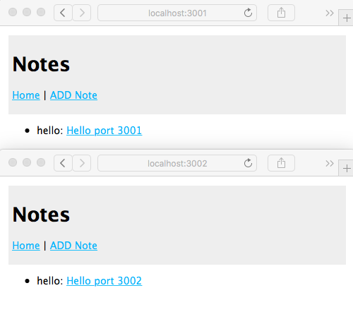

# 五、您的第一个简单应用

现在，我们已经为 Node.js 构建了一个 Express 应用，让我们开发一个执行有用功能的应用。我们将构建的应用将保留一个注释列表，它将让我们探索实际应用的某些方面。

在本章中，我们将只构建应用的基本基础结构，在后面的章节中，我们将对应用进行大量扩展

本章涵盖的主题包括

*   在 Express 路由函数中使用承诺和异步函数
*   应用 MVC 范式表示应用
*   构建快速应用
*   JavaScript 类定义
*   实现 CRUD 范式
*   车把模板

# 承诺、异步函数和快速路由函数

在开始开发我们的应用之前，我们必须更深入地了解一对全新的 ES-2015/2016/2017 特性，它们共同革新了 JavaScript 编程：`Promise`类和`async`函数。这两种方法都用于延迟和异步计算，并且可以使密集嵌套的回调函数成为过去：

*   `Promise`表示尚未完成但预计在未来完成的操作。我们看到承诺在使用。当承诺的结果（或错误）可用时，调用`.then`或`.catch`函数
*   *生成器*函数是一种可以暂停和恢复的新函数，可以从函数中间返回结果
*   这两个特性与另一个特性（迭代协议）以及一些新语法混合在一起，以创建`async`函数

`async`函数的神奇之处在于，我们可以像编写同步代码一样编写异步代码。它仍然是异步代码，这意味着长时间运行的请求处理程序不会阻塞事件循环。该代码看起来像我们用其他语言编写的同步代码。一条语句紧跟着另一条语句，错误作为异常抛出，结果落在下一行代码上。Promise 和`async`函数是一个很大的改进，Node.js 社区非常有必要切换范例，这意味着重写传统的面向回调的 API。

多年来，已经使用了几种其他方法来管理异步代码，您可能会遇到使用这些其他技术的代码。在`Promise`对象标准化之前，至少有两个实现可用：Bluebird（[http://bluebirdjs.com/](http://bluebirdjs.com/) 和 Q（[https://www.npmjs.com/package/q](https://www.npmjs.com/package/q) 。应仔细考虑使用非标准承诺库，因为维护与标准 Promise 对象的兼容性是有价值的。

**末日金字塔**是根据代码经过几层嵌套后的形状命名的。任何多级过程都可以快速升级到嵌套 15 层的代码。考虑下面的例子：

```js
router.get('/path/to/something', (req, res, next) => { 
  doSomething(arg1, arg2, (err, data1) => { 
    if (err) return next(err); 
    doAnotherThing(arg3, arg2, data1, (err2, data2) => { 
      if (err2) return next(err2); 
      somethingCompletelyDifferent(arg1, arg42, (err3, data3) => { 
        if (err3) return next(err3); 
        doSomethingElse((err4, data4) => { 
          if (err4) return next(err4); 
          res.render('page', { data }); 
        }); 
      }); 
    }); 
  }); 
});
```

将其重写为`async`函数将使其更加清晰。要实现这一目标，我们需要研究以下想法：

*   使用承诺管理异步结果
*   发电机功能和承诺
*   `async`功能

我们以这种方式做出承诺：

```js
exports.asyncFunction = function(arg1, arg2) { 
  return new Promise((resolve, reject) => { 
    // perform some task or computation that's asynchronous 
    // for any error detected: 
    if (errorDetected) return reject(dataAboutError); 
    // When the task is finished 
    resolve(theResult); 
  }); 
}; 
```

Note that `asyncFunction` is an asynchronous function, but it does not take a callback. Instead, it returns a `Promise` object, and the asynchronous code is executed within a callback passed to the `Promise` class.

您的代码必须通过`resolve`和`reject`函数指示异步操作的状态。正如函数名所暗示的，`reject`表示发生错误，`resolve`表示成功结果。然后，调用者使用以下函数：

```js
asyncFunction(arg1, arg2) 
.then((result) => { 
   // the operation succeeded 
   // do something with the result
   return newResult;
}) 
.catch(err => { 
   // an error occurred 
}); 
```

系统足够流畅，在`.then`中传递的函数可以返回一些东西，比如另一个承诺，并且您可以将`.then`调用链接在一起。`.then`处理程序（如果有）中返回的值将成为新的 Promise 对象，通过这种方式，您可以构建`.then`和`.catch`调用链来管理异步操作序列

异步操作序列将被实现为一个`.then`函数链，我们将在下一节中看到。

# 承诺和错误处理

承诺对象可以处于以下三种状态之一：

*   **未决**：这是初始状态，既没有满足也没有拒绝
*   **完成**：这是它成功执行并
    产生结果的最终状态
*   **拒绝**：执行失败的最终状态

考虑这个代码段类似于我们将在本章后面使用的代码段：

```js
notes.read(req.query.key) 
.then(note => { return filterNote(note); }) 
.then(note => { return swedishChefSpeak(note); }) 
.then(note => { 
    res.render('noteview', { 
        title: note ? note.title : "", 
        notekey: req.query.key, 
        note: note 
    }); 
}) 
.catch(err => { next(err); }); 
```

这段代码中有几个地方可能会出现错误。`notes.read`功能有几种可能的故障模式：`filterNote`功能可能希望在检测到跨站点脚本攻击时发出警报。这位瑞典厨师可能要罢工了。`res.render`或正在使用的模板可能有故障。但是我们只有一种方法来捕获和报告错误。我们错过什么了吗？

`Promise`类自动捕获错误，并将其发送到`Promise`所附的操作链中。如果`Promise`类手头有一个错误，它将跳过`.then`函数，转而调用它找到的第一个`.catch`函数。换句话说，使用 Promise 实例可以提供更高的捕获和报告错误的保证。在旧的约定中，错误报告更加棘手，很容易忘记添加正确的错误处理。

# 扁平化异步代码

所要解决的问题是，JavaScript 中的异步编码导致了末日金字塔。为了解释，让我们重申 Ryan Dahl 作为 primary Node.js 惯用语给出的示例：

```js
db.query('SELECT ..etc..', function(err, resultSet) { 
   if (err) { 
      // Instead, errors arrive here 
   } else { 
      // Instead, results arrive here 
    } 
}); 
// We WANT the errors or results to arrive here 
```

目的是避免长时间操作阻塞事件循环。使用回调函数延迟处理结果或错误是一个很好的解决方案，也是 Node.js 的基本习惯用法。回调函数的实现导致了这个金字塔形的问题，即结果和错误落在回调函数中。错误和结果不会被传递到下一行代码中，而是被隐藏起来。

承诺有助于扁平化代码，使其不再呈金字塔形。它们还可以捕获错误，确保交付到有用的位置。但是这些错误和结果仍然隐藏在匿名函数中，不会传递到下一行代码。

此外，使用 Promises 会产生一些样板代码，模糊了程序员的意图。与常规回调函数相比，它不是样板，但样板仍然存在。

幸运的是，ECMAScript 委员会一直在研究这个问题。

# 承诺和生成器生成异步函数

生成器和相关的迭代协议是一个很大的主题，我们将简要介绍一下

迭代协议是新的`for..of`循环和其他一些新的循环构造背后的内容。这些构造可以用于生成迭代器的任何对象。有关这两者的更多信息，请参见[https://developer.mozilla.org/en-US/docs/Web/JavaScript/Reference/Iteration_protocols](https://developer.mozilla.org/en-US/docs/Web/JavaScript/Reference/Iteration_protocols) 。

生成器是一种可以使用`yield`关键字停止和启动的功能。生成器生成一个迭代器，其值是给定给 yield 语句的任何值。更多信息，请参见[https://developer.mozilla.org/en-US/docs/Web/JavaScript/Reference/Global_Objects/Generator](https://developer.mozilla.org/en-US/docs/Web/JavaScript/Reference/Global_Objects/Generator) 。

考虑一下：

```js
$ cat gen.js
function* gen() {
    yield 1;
    yield 2;
    yield 3;
    yield 4;
}
for (let g of gen()) {
   console.log(g); }
$ node gen.js
1
2
3
4

```

`yield`语句导致生成器函数暂停，并为其`next`函数的下一次调用提供给定的值。此处未明确显示`next`函数，但它控制循环，并且是迭代协议的一部分。尝试多次调用`gen().next()`，而不是循环：

```js
var geniter = gen();
console.log(geniter.next());
console.log(geniter.next());
console.log(geniter.next());
```

您将看到：

```js
$ node gen.js
{ value: 1, done: false }
{ value: 2, done: false }
{ value: 3, done: false }
```

迭代协议规定当`done`为`true`时迭代器完成。在本例中，我们调用它的次数不足以触发迭代器的结束状态。

生成器变得有趣的地方是当与返回承诺的函数一起使用时。承诺是通过迭代器提供的。使用迭代器的代码可以等待承诺获得其值。一系列异步操作可以在生成器内部以可移植的方式调用

在一个额外函数的帮助下，生成器函数和承诺返回异步函数可以是编写异步代码的一种非常好的方法。我们在[第 2 章](02.html)中看到了一个例子，*在探索巴别塔时设置 Node.js，*。Babel 有一个插件，可以将`async`函数连同一个 helper 函数一起重写到生成器中，我们看了一下传输的代码和 helper 函数。`co`图书馆（[https://www.npmjs.com/package/co](https://www.npmjs.com/package/co) 是在生成器中实现异步编码的常用辅助函数。创建一个名为`2files.js`的文件：

```js
const fs = require('fs-extra');
const co = require('co');
const util = require('util');
co(function* () {
  var texts = [
    yield fs.readFile('hello.txt', 'utf8'),
    yield fs.readFile('goodbye.txt', 'utf8')
  ];
  console.log(util.inspect(texts));
});
```

然后像这样运行：

```js
$ node 2files.js
[ 'Hello, world!\n', 'Goodbye, world!\n' ]
```

通常，`fs.readFile`将其结果发送给回调函数，我们将构建一段小的金字塔形代码来执行此任务。`fs-extra`模块包含来自内置`fs`模块的所有函数的实现，但更改为返回承诺而不是回调函数。因此，这里显示的每个`fs.readFile`都返回一个承诺，当文件内容被完全读入内存时，该承诺将得到解决。`co`所做的是管理等待承诺被解决（或拒绝）的舞蹈，并返回承诺的价值。因此，使用两个合适的文本文件，我们可以看到执行`2files.js`的结果。

重要的是，代码非常干净且可读。我们没有陷入管理异步操作所需的样板代码中。程序员的意图非常清楚。

`async`函数采用相同的生成器和承诺组合，并在 JavaScript 语言中定义标准化语法。创建一个名为`2files-async.js`的文件：

```js
const fs    = require('fs-extra');
const util  = require('util');
async function twofiles() {
    var texts = [
        await fs.readFile('hello.txt', 'utf8'),
        await fs.readFile('goodbye.txt', 'utf8')
    ];
    console.log(util.inspect(texts));
}
twofiles().catch(err => { console.error(err); });

```

然后像这样运行：

```js
$ node 2files-async.js 
[ 'Hello, world!\n', 'Goodbye, world!\n' ]
```

清洁的可读的。程序员的意图是明确的。不依赖于附加库，JavaScript 语言内置语法。最重要的是，一切都以自然的方式处理。错误自然地通过抛出异常来表示。异步操作的结果自然显示为操作的结果，`await`关键字有助于传递该结果。

要了解真正的优势，让我们回到前面的末日金字塔示例：

```js
router.get('/path/to/something', async (req, res, next) => { 
   try {
       let data1 = await doSomething(req.query.arg1, req.query.arg2);
       let data2 = await doAnotherThing(req.query.arg3, req.query.arg2, 
       data1);
       let data3 = await somethingCompletelyDifferent(req.query.arg1,
                                                      req.query.arg42);
       let data4 = await doSomethingElse();
       res.render('page', { data1, data2, data3, data4 }); 
   } catch(err) {
       next(err);
   }
}); 
```

除了`try/catch`之外，与回调金字塔的形式相比，这个示例变得非常干净。所有异步回调样板文件都被删除，程序员的意图清晰可见。

为什么需要`try/catch`呢？通常，`async`函数会捕捉抛出的错误，并自动正确地报告它们。但是由于这个例子是在一个 Express router 函数中，我们受到其功能的限制。Express 不知道如何识别`async`函数，因此不知道如何查找抛出的错误。相反，我们被要求`catch`给他们打电话`next(err)`。

这种改进仅适用于在`async`函数内执行的代码。`async`函数之外的代码仍然需要回调或承诺进行异步编码。此外，`async`函数的返回值是一个承诺。

参见[中`async`功能的官方说明 https://tc39.github.io/ecmascript-asyncawait/](https://tc39.github.io/ecmascript-asyncawait/) 了解详情。

# Express 与 MVC 范式

Express 并没有强制执行您应该如何构造应用的模型、视图和控制器模块的意见，也没有强制执行您是否应该遵循任何类型的 MVC 范例的意见。正如我们在前一章中所学到的，由 Express 生成器创建的空白应用提供了 MVC 模型的两个方面：

*   `views`目录包含模板文件，控制视图对应的显示部分。
*   `routes`目录包含实现应用识别的 URL 并协调对每个 URL 的响应的代码。这与控制器相对应。

这让您想知道将与模型对应的代码放在哪里。模型保存应用数据，根据控制器的指示进行更改，并提供视图代码请求的数据。至少，型号代码应与控制器代码位于单独的模块中。这是为了确保清晰地分离关注点，例如，简化每个关注点的单元测试。

我们将使用的方法是创建一个`models`目录，作为`views`和`routes`目录的同级目录。`models`目录将包含用于存储注释和相关数据的模块。`models`目录中模块的 API 将提供创建、读取、更新或删除数据项**C****创建**、**R****ead**、**更新**和**D**elete 或**销毁****的功能 CRUD**模型）和视图代码执行其任务所需的其他功能。

CRUD 模型（创建、读取、更新、销毁）是持久数据存储的四个基本操作。`Notes`应用被构造为 CRUD 应用，以演示如何实现这些操作。

我们将使用名为`create`、`read`、`update`和`destroy`的函数来实现每个基本操作。

We're using the verb `destroy` rather than `delete`, because `delete` is a reserved word in JavaScript.

# 创建 Notes 应用

让我们像以前一样开始创建*Notes*应用，使用快速生成器为我们提供一个起点：

```js
$ mkdir notes
$ cd notes
$ npm install express-generator@4.x
$ ./node_modules/.bin/express --view=hbs --git .
destination is not empty, continue? [y/N] y

 create : .
 create : ./package.json
 create : ./app.js
 create : ./.gitignore
 create : ./public
 create : ./routes
 create : ./routes/index.js
 create : ./routes/users.js
 create : ./views
 create : ./views/index.hbs
 create : ./views/layout.hbs
 create : ./views/error.hbs
 create : ./bin
 create : ./bin/www
 create : ./public/stylesheets
 create : ./public/stylesheets/style.css

 install dependencies:
 $ cd . && npm install

 run the app:
 $ DEBUG=notes:* npm start

 create : ./public/javascripts
 create : ./public/images
$ npm install
added 82 packages and removed 5 packages in 97.188s
$ npm uninstall express-generator
up to date in 8.325s
```

如果您愿意，您可以运行 AutoT0T 并在浏览器中查看空白应用。相反，让我们继续设置代码。

# 您的第一个 Notes 模型

创建一个名为`models`的目录，作为`views`和`routes`目录的同级目录。

然后，在该目录中创建一个名为`Note.js`的文件，并将此代码放入其中：

```js
const _note_key = Symbol('key');
const _note_title = Symbol('title');
const _note_body = Symbol('body');

module.exports = class Note { 
    constructor(key, title, body) { 
        this[_note_key] = key; 
        this[_note_title] = title; 
        this[_note_body] = body; 
    } 

    get key() { return this[_note_key]; }
    get title() { return this[_note_title]; }
    set title(newTitle) { this[_note_title] = newTitle; }
    get body() { return this[_note_body]; }
    set body(newBody) { this[_note_body] = newBody; }
};
```

这定义了一个新类`Note`，用于我们的`Notes`应用。其目的是保存与应用用户之间交换的票据相关的数据

# 理解 ES-2015 等级定义

这种对象类定义对于使用 ES-2015 的 JavaScript 来说是新的。与以前的方法相比，它简化了类的定义，并使 JavaScript 类定义更接近其他语言的语法。在幕后，JavaScript 类仍然使用基于原型的继承，但语法更简单，程序员甚至不必考虑对象原型。

我们可以通过`instanceof`操作符可靠地确定对象是否为注释：

```js
$ node
> const Note = require('./Note');
> typeof Note
'function'
> const aNote = new Note('foo', 'The Rain In Spain', 'Falls mainly on the plain');
> var notNote = {}
> notNote instanceof Note
false
> aNote instanceof Note
true
> typeof aNote
'object'
```

这向我们展示了识别对象最清晰的方法是使用`instanceof`操作符。`typeof`操作符告诉我们`Note`是一个函数（因为幕后基于原型的继承），并且`Note`类的实例是一个对象。使用的实例，我们可以轻松确定对象是否是给定类的实例。

对于 Note 类，我们使用了`Symbol`实例来提供数据隐藏的一小部分。JavaScript 类不提供数据隐藏机制，例如，不能像 Java 中那样标记字段`private`。了解如何隐藏实现细节非常有用。这是面向对象编程的一个重要属性，因为可以随意更改实现是很有用的。还有一个问题是控制哪些代码可以操作对象的字段

首先，我们声明了 getter 和 setter 函数以提供对值的访问。我们在[第 4 章](04.html)、*HTTP 服务器和客户端*中讨论了正常的 getter/setter 用法。

访问基于 getter 的字段是通过使用属性的名称，而不是通过调用函数-`aNote.title`而不是`aNote.title()`来实现的。看起来您正在通过指定值或访问值来访问对象属性。实际上，类中定义的函数在每次访问时都会执行。您可以通过只实现 getter 而不实现 setter 来定义只读属性，就像我们对`key`字段所做的那样。

前面定义的匿名对象与简单定义的匿名对象之间存在显著差异：

```js
{
   key: 'foo', title: 'The Rain in Spain',
   body: 'Falls mainly on the plain'
}
```

我们一直在用 JavaScript 编写这样的代码。它简单、快速，而且是函数间共享数据的一种非常流畅的方式。但是没有隐藏实现细节的措施，也没有明确的对象类型标识

在`Note`类中，我们可以使用这种`constructor`方法：

```js
class Note {
  constructor(key, title, body) {
     this.key = key;
     this.title = title;
     this.body = body;
 }
}
```

这与匿名对象实际上是一样的，因为没有隐藏任何细节，也没有对哪些代码可以对对象实例做什么进行控制。与匿名对象相比，唯一的优势是使用`instanceof`操作符来识别对象实例。

我们选择的方法使用了符号类，这也是 ES-2015 的新特性。符号是一种不透明对象，有两种主要使用情形：

*   生成唯一键以用作上一个`Note`类中的属性字段
*   可用于颜色或红色等概念的符号标识符

通过生成`Symbol`实例的工厂方法定义符号：

```js
> let symfoo = Symbol('foo')
```

每次调用符号工厂方法时，都会创建一个新的唯一实例。例如，`Symbol('foo') === Symbol('foo')`是`false`，正如`symfoo === Symbol('foo')`一样，因为在等式运算符的每一侧都创建了一个新实例。然而，`symfoo === symfoo`是正确的，因为它们是相同的实例。

这在实践中意味着，如果我们尝试直接访问字段，它将失败：

```js
> aNote[Symbol('title')]
undefined
```

请记住，每次使用符号工厂方法时，我们都会得到一个新实例。`Symbol('title')`的新实例与`Note.js`模块中使用的实例不同

底线是为字段使用`Symbol`对象提供了一个小的实现隐藏措施

# 填写内存中的 Notes 模型

在`models`目录中创建一个名为`notes-memory.js`的文件，代码如下：

```js
const Note = require('./Note');

var notes = [];

exports.update = exports.create = async function(key, title, body) {
    notes[key] = new Note(key, title, body);
    return notes[key];
};

exports.read = async function(key) {
    if (notes[key]) return notes[key];
    else throw new Error(`Note ${key} does not exist`);
};

exports.destroy = async function(key) {
    if (notes[key]) {
        delete notes[key];
    } else throw new Error(`Note ${key} does not exist`);
};

exports.keylist = async function() { return Object.keys(notes); };
exports.count = async function() { return notes.length; };
exports.close = async function() { }
```

这是一个简单的内存数据存储，非常简单。每个 Note 实例的`key`用作数组的索引，数组反过来保存 Note 实例。简单、快速且易于实现。它不支持任何长期数据持久性。服务器关闭时，此模型中存储的任何数据都将消失。

我们使用了`async`函数，因为将来我们将在文件系统或数据库中存储数据。因此，我们需要一个异步 API。

`create`和`update`函数由同一个函数处理。在 Notes 应用的这个阶段，这两个函数的代码可以完全相同，因为它们执行完全相同的操作。稍后，当我们向 Notes 添加数据库支持时，`create`和`update`功能将需要不同。例如，在 SQL 数据模型中，`create`将通过`INSERT INTO`命令实现，而`update`将通过`UPDATE`命令实现。

# 注释主页

我们将修改 starter 应用以支持创建、编辑、更新、查看和删除注释。让我们从修复主页开始。它应该显示注释列表，顶部的导航栏应该链接到添加注释页面，这样我们就可以始终添加新注释。

虽然我们将修改生成的`app.js`，但无需修改即可支持主页。这些代码行与主页相关：

```js
const index = require('./routes/index'); 
.. 
app.use('/', index); 
```

此外，为了支持把手模板`app.js`，需要进行以下更改：

```js
const hbs = require('hbs');
...
app.set('view engine', 'hbs');
hbs.registerPartials(path.join(__dirname, 'partials'));

```

我们将把把手`partials`放在目录`partials`中，该目录是`views`目录的同级目录。将`routes/index.js`更改为：

```js
const express = require('express');
const router = express.Router();
const notes = require('../models/notes-memory');

/* GET home page. */
router.get('/', async (req, res, next) => {
  let keylist = await notes.keylist();
  let keyPromises = keylist.map(key => {
    return notes.read(key)
  });
  let notelist = await Promise.all(keyPromises);
  res.render('index', { title: 'Notes', notelist: notelist });
});

module.exports = router;
```

这将收集有关我们将在主页上显示的注释的数据。默认情况下，我们将显示一个简单的注释标题表。我们确实需要谈谈技术。

`Promise.all`函数执行一系列承诺。这些承诺是并行评估的，允许我们的代码潜在地向服务发出并行请求。这应该比按顺序一次发出一个请求更快地执行。

我们可以编写一个简单的`for`循环，如下所示：

```js
let keylist = await notes.keylist();
let notelist = [];
for (key of keylist) {
    let note = await notes.read(keylist);
    notelist.push({ key: note.key, title: note.title });
}
```

虽然更易于阅读，但每次检索一个注释，没有机会重复`read`操作。

Promise 数组是使用`map`函数构造的。在`map`中，一个人迭代一个数组以生成一个新数组。在本例中，新数组包含由`notes.read`函数调用生成的承诺。

因为我们写了`await Promise.all`，一旦所有承诺都成功，`notelist`数组将完全充满正确的数据。如果任何承诺被拒绝，换句话说，将抛出一个异常。我们所做的是将异步操作的列表排成队列，并整齐地等待它们全部完成。

然后将`notelist`数组传递到我们即将编写的`view`模板中。

以`views/layout.hbs`开头，包含：

```js
<!DOCTYPE html>
<html>
 <head>
 <title>{{title}}</title>
 <link rel='stylesheet' href='/stylesheets/style.css' />
 </head>
  <body>
  {{> header }}
  {{{body}}}
  </body>
</html>
```

这是生成的文件，并为页眉添加了一个分部。我们已经声明`partials`居住在`partials`目录中。创建`partials/header.hbs`，包含：

```js
<header>
 <h1>{{ title }}</h1>
  <div class='navbar'>
  <p><a href='/'>Home</a> | <a href='/notes/add'>ADD Note</a></p>
  </div>
</header>
```

将`views/index.hbs`更改为：

```js
{{#each notelist}}
<ul>
  <li>{{ key }}:
  <a href="/notes/view?key={{ key }}">{{ title }}</a>
  </li>
</ul>
{{/each}}
```

这只需逐步遍历 note 数据数组并格式化一个简单的列表。每个项目都通过一个`key`参数链接到`/notes/view`URL。我们还没有查看该代码，但是这个 URL 显然会显示注释。另外需要注意的是，如果`notelist`为空，则不会生成列表的 HTML。

当然，还有很多东西可以投入其中。例如，只需在此处添加适当的`script`标记，就可以轻松地向每个页面添加 jQuery 支持。

我们现在有足够的代码来运行应用；让我们查看主页：

```js
$ DEBUG=notes:* npm start

> notes@0.0.0 start /Users/David/chap05/notes
> node ./bin/www

 notes:server Listening on port 3000 +0ms
GET / 200 87.300 ms - 308
GET /stylesheets/style.css 200 27.744 ms - 111
```

如果我们访问`http://localhost:3000`，我们将看到以下页面：



因为还没有任何笔记，所以没有什么可展示的。点击主页链接只是刷新页面。单击 addnote 链接会抛出一个错误，因为我们还没有实现该代码。这表明`app.js`中提供的错误处理程序正在按预期执行。

# 添加新注释–创建

现在，让我们看看如何创建注释。因为应用没有为`/notes/add`URL 配置路由，所以我们必须添加一个路由。要做到这一点，我们需要一个控制器的笔记。

在`app.js`中，进行以下更改。

注释掉这些行：

```js
// var users = require('./routes/users'); 
.. 
// app.use('/users', users); 
```

在此阶段，`Notes`应用不支持用户，并且这些路由不是必需的。这将在未来的一章中发生变化。

我们真正需要做的是为`notes`控制器添加代码：

```js
// const users = require('./routes/users'); 
const notes  = require('./routes/notes'); 
.. 
// app.use('/users', users); 
app.use('/notes', notes); 
```

现在，我们将添加一个包含`notes`路由的控制器模块。创建一个名为`routes/notes.js`的文件，包含以下内容：

```js
const util = require('util'); 
const express = require('express'); 
const router = express.Router(); 
const notes = require('../models/notes-memory'); 

// Add Note. 
router.get('/add', (req, res, next) => { 
    res.render('noteedit', { 
        title: "Add a Note", 
        docreate: true, 
        notekey: "", note: undefined 
    }); 
}); 

module.exports = router; 
```

生成的`/notes/add`URL 对应于`partials/header.hbs`中的链接。

在`views`目录中，添加一个名为`noteedit.hbs`的模板，包含以下内容：

```js
<form method='POST' action='/notes/save'> 
<input type='hidden' name='docreate' value='<%= 
                  docreate ? "create" : "update"%>'> 
<p>Key: 
{{#if docreate }}
    <input type='text' name='notekey' value=''/> 
{{else}} 
    {{#if note }}{{notekey}}{{/if}} 
    <input type='hidden' name='notekey'
         value='{{#if note }}{{notekey}}{{/if}}'/> 
{{/if}} 
</p> 
<p>Title: <input type='text' name='title' 
        value='{{#if note }}{{note.title}}{{/if}}' /></p> 
<br/><textarea rows=5 cols=40 name='body' >
    {{#if note }}{{note.body}}{{/if}} 
    </textarea> 
<br/><input type='submit' value='Submit' /> 
</form>
```

我们将重用此模板以支持编辑注释和创建新注释。

请注意，在本例中，传递给模板的`note`和`notekey`对象是空的。模板检测到这种情况并确保输入区域为空。此外，还传入一个标记`docreate`，以便表单记录它是否用于创建或更新注释。此时，我们正在添加一个新的 note，因此不存在 note 对象。编写模板代码是为了防止抛出错误。

此模板是一个表单，它将`POST`其数据发送到`/notes/save`URL。如果此时要运行应用，它会给您一条错误消息，因为没有为该 URL 配置路由。

要支持`/notes/save`URL，请将其添加到`routes/notes.js`：

```js

// Save Note (update)
router.post('/save', async (req, res, next) => {
    var note;
    if (req.body.docreate === "create") {
        note = await notes.create(req.body.notekey,
                req.body.title, req.body.body);
    } else {
        note = await notes.update(req.body.notekey,
                req.body.title, req.body.body);
    }
    res.redirect('/notes/view?key='+ req.body.notekey);
});
```

由于此 URL 还将用于创建和更新注释，因此需要检测`docreate`标志并调用适当的模型操作。

模型返回`notes.create`和`notes.update`的承诺。当然，我们必须根据`docreate`标志调用相应的模型函数

这是一个`POST`操作处理程序。由于`bodyParser`中间件，表单数据被添加到`req.body`对象中。附在`req.body`上的字段直接对应于 HTML 表单中的元素。

现在，我们可以再次运行该应用并使用添加注释表单：



但单击 Submit 按钮时，我们会收到一条错误消息。现在还没有任何东西可以实现`/notes/view`URL。

您可以在位置框中修改 URL 以重新访问`http://localhost:3000`，您将在主页上看到如下截图：



纸条实际上就在那里；我们只需要实现`/notes/view`。让我们继续吧。

# 查看备注–阅读

现在我们已经了解了如何创建注释，我们需要继续阅读它们。这意味着为`/notes/view`URL 实现控制器逻辑和视图模板。

在`routes/notes.js`中增加此路由功能：

```js
// Read Note (read)
router.get('/view', async (req, res, next) => {
    var note = await notes.read(req.query.key);
    res.render('noteview', {
        title: note ? note.title : "",
        notekey: req.query.key, note: note
    });
});
```

因为此路由安装在处理`/notes`的路由上，所以此路由处理`/notes/view`。

如果`notes.read`成功读取注释，则使用`noteview`模板呈现。如果出现问题，我们将通过 Express 向用户显示错误。

在`views`目录中添加`noteview.hbs`模板，此代码引用：

```js
{{#if note}}<h3>{{ note.title }}</h3>{{/if}}
{{#if note}}<p>{{ note.body }}</p>{{/if}}
<p>Key: {{ notekey }}</p>
{{#if notekey }}
    <hr/>
    <p><a href="/notes/destroy?key={{notekey}}">Delete</a>
     | <a href="/notes/edit?key={{notekey}}">Edit</a></p>
{{/if}}
```

这很简单：从 note 对象中提取数据并使用 HTML 显示。底部有两个链接，一个指向`/notes/destroy`删除注释，另一个指向`/notes/edit`编辑注释。

这两种方法的代码目前都不存在。但这不会阻止我们继续执行应用：



正如所料，使用此代码，应用将正确重定向到`/notes/view`，我们可以看到我们的工作。此外，正如预期的那样，单击“删除”或“编辑”链接将显示一个错误，因为代码尚未实现。

# 编辑现有注释–更新

现在我们已经了解了`create`和`read`操作，让我们看看如何更新或编辑注释

在`routes/notes.js`中增加此路由功能：

```js
// Edit note (update)
router.get('/edit', async (req, res, next) => {
    var note = await notes.read(req.query.key);
    res.render('noteedit', {
        title: note ? ("Edit " + note.title) : "Add a Note",
        docreate: false,
        notekey: req.query.key, note: note
    });
});
```

我们正在重用`noteedit.ejs`模板，因为它可以用于`create`和`update`/`edit`操作。请注意，我们将`false`传递给`docreate`，通知模板它将用于编辑。

在本例中，我们首先检索 note 对象，然后将其传递给模板。这样，模板设置为编辑，而不是创建注释。当用户单击 Submit 按钮时，我们将进入前面屏幕截图中显示的相同`/notes/save`路由处理程序。它已经做了正确的事情：在模型中调用`notes.update`方法，而不是`notes.create`。

因为这就是我们需要做的，所以我们可以继续并重新运行应用：



单击此处的提交按钮，您将被重定向到`/notes/view`屏幕，然后可以阅读新编辑的注释。回到`/notes/view`屏幕：我们刚刚处理了编辑链接，但是删除链接仍然会产生错误。

# 删除注释–销毁

现在，让我们看看如何实现删除注释的`/notes/destroy`URL。

在`routes/notes.js`中增加以下路由功能：

```js
// Ask to Delete note (destroy)
router.get('/destroy', async (req, res, next) => {
    var note = await notes.read(req.query.key);
    res.render('notedestroy', {
        title: note ? note.title : "",
        notekey: req.query.key, note: note
    });
});
```

销毁一张便笺是一个重要的步骤，因为如果我们犯了错误，没有垃圾桶可以取回它。因此，我们想询问用户是否确定要删除该注释。在本例中，我们检索注释，然后呈现以下页面，显示一个问题以确保他们确实想要删除注释。

在`views`目录中添加`notedestroy.hbs`模板：

```js
<form method='POST' action='/notes/destroy/confirm'>
<input type='hidden' name='notekey' value='{{#if note}}{{notekey}}{{/if}}'>
<p>Delete {{note.title}}?</p>
<br/><input type='submit' value='DELETE' /> 
<a href="/notes/view?key={{#if note}}{{notekey}}{{/if}}">Cancel</a>
</form>
```

这是一个简单的表单，要求用户单击按钮进行确认。取消链接只是将它们发送回`/notes/view`页面。点击提交按钮在`/notes/destroy/confirm`URL 上生成`POST`请求。

该 URL 需要一个请求处理程序。将此代码添加到`routes/notes.js`：

```js
// Really destroy note (destroy)
router.post('/destroy/confirm', async (req, res, next) => {
    await notes.destroy(req.body.notekey);
    res.redirect('/');
});
```

这将调用模型中的`notes.destroy`函数。如果成功，浏览器将重定向到主页。否则，将向用户显示一条错误消息。重新运行应用时，我们现在可以查看它的运行情况：



现在，应用中的一切都正常工作了，您可以单击任何按钮或链接并保留所有需要的注释。

# 设置 Express 应用的主题

Express 团队在确保 Express 应用在出厂时看起来正常方面做得不错。我们的 Notes 应用不会赢得任何设计奖项，但至少它并不丑陋。现在基本应用正在运行，有很多方法可以改进它。让我们快速浏览一下一个快速的应用。在[第 6 章](06.html)*中，我们将深入探讨移动第一范式*，重点关注解决移动市场这一至关重要的目标。

如果您正在使用推荐的方法`npm start`运行*Notes*应用，那么控制台窗口中将打印一份活动日志。其中之一是：

```js
GET /stylesheets/style.css 304 0.702 ms - - 
```

这是因为我们在`layout.hbs`中输入了这行代码：

```js
<link rel='stylesheet' href='/stylesheets/style.css' /> 
```

这个文件是由 Express Generator 在开始时为我们自动生成的，并放在`public`目录中。`public`目录由 Express 静态文件服务器管理，在`app.js`中使用此行：

```js
app.use(express.static(path.join(__dirname, 'public'))); 
```

我们打开`public/stylesheets/style.css`来看看：

```js
body { 
  padding: 50px; 
  font: 14px "Lucida Grande", Helvetica, Arial, sans-serif; 
} 

a { 
  color: #00B7FF; 
} 
```

突出的是，应用内容在屏幕的顶部和左侧有大量空白。原因是`body`标记具有`padding: 50px`样式。改变它是一件很快的事情。

由于 Express 静态文件服务器中没有缓存，我们只需编辑 CSS 文件并重新加载页面，CSS 也将重新加载。可以打开缓存控制头和 ETag 生成，就像生产网站一样。有关详细信息，请参阅联机 Express 文档。

这需要做一点工作：

```js
body { 
  padding: 5px; 
  .. 
} 
.. 
header { 
    background: #eeeeee; 
    padding: 5px; 
} 
```

因此，我们将有：



我们也不会因此赢得任何设计奖项，但现在已经有了一些品牌化和主题化的可能性。

一般来说，我们构建页面模板的方式，应用一个站点范围的主题只是在`layout.hbs`中添加适当的代码以及适当的样式表和其他资产。许多现代主题化框架，如 Twitter 的 Bootstrap，从 CDN 服务器提供 CSS 和 JavaScript 文件，使其非常容易整合到网站设计中。

关于 jQuery，请参考[http://jquery.com/download/](http://jquery.com/download/) 。

谷歌的托管图书馆服务提供了一长串的图书馆，托管在谷歌的 CDN 基础设施上。参见[https://developers.google.com/speed/libraries/](https://developers.google.com/speed/libraries/) 。

虽然使用第三方 CDN 托管这些资产很简单，但自己托管它们更安全。您不仅要对应用的带宽消耗负责，而且一定不会受到任何第三方服务中断的影响。尽管谷歌可能很可靠，但他们的服务可能会下降，如果这意味着 jQuery 和 Bootstrap 无法加载，你的客户会认为你的网站坏了。但是，如果这些文件与应用从同一台服务器加载，则交付这些文件的可靠性将与应用的可靠性完全相同。

在[第 6 章](06.html)中*实现了移动第一范式*，我们将介绍一种将这些前端库添加到应用中的简单方法。

# 放大–运行多个 Notes 实例

现在我们已经有了一个正在运行的应用，您将可以进行一些操作，创建、阅读、更新和删除许多注释。

假设这不是一个玩具应用，而是一个有趣到每天吸引一百万用户的应用。为高负载服务通常意味着添加服务器、负载平衡器和许多其他东西。核心部分是让应用的多个实例同时运行，以分散负载。

让我们看看当您同时运行 Notes 应用的多个实例时会发生什么。

第一件事是确保实例位于不同的端口上。在`bin/www`中，您会看到设置`PORT`环境变量控制正在使用的端口。如果未设置`PORT`变量，则默认为`http://localhost:3000`，或者我们一直在使用的。

让我们打开`package.json`并将这些行添加到`scripts`部分：

```js
"scripts": { 
    "start": "DEBUG=notes:* node ./bin/www", 
    "server1": "DEBUG=notes:* PORT=3001 node ./bin/www", 
    "server2": "DEBUG=notes:* PORT=3002 node ./bin/www" },
```

`server1`脚本在`PORT 3001`上运行，`server2`脚本在`PORT 3002`上运行。把这些都记录在一个地方不是很好吗？

然后，在一个命令窗口中运行以下命令：

```js
$ npm run server1

> notes@0.0.0 server1 /Users/David/chap05/notes
> DEBUG=notes:* PORT=3001 node ./bin/www

 notes:server Listening on port 3001 +0ms
```

在另一个命令窗口中，运行以下命令：

```js
$ npm run server2

> notes@0.0.0 server2 /Users/David/chap05/notes
> DEBUG=notes:* PORT=3002 node ./bin/www

 notes:server Listening on port 3002 +0ms
```

这为我们提供了 Notes 应用的两个实例。使用两个浏览器窗口访问`http://localhost:3001`和`http://localhost:3002`。输入几个注释，您可能会看到如下内容：



编辑并添加一些注释后，您的两个浏览器窗口可能与前面的屏幕截图类似。这两个实例不共享相同的数据池。每个进程都在自己的进程和内存空间中运行。在其中一个屏幕中添加注释，而在另一个屏幕中不显示。

此外，由于模型代码不会在任何位置保留数据，因此不会保存注释。您可能已经编写了有史以来最伟大的 Node.js 编程书籍，但一旦应用服务器重新启动，它就消失了。

通常，可以运行应用的多个实例来扩展性能。这是一个古老的*向其*扔更多服务器的把戏。为了实现这一点，数据当然必须共享，每个实例必须访问相同的数据源。通常，这涉及一个数据库。当涉及到用户身份信息时，甚至可能需要武装警卫

请稍候，我们将很快讨论数据库实现。在此之前，我们将介绍移动优先开发。

# 总结

在这一章中我们已经走了很长的路。

我们从末日金字塔开始，`Promise`对象和`async`函数如何帮助我们编写简单的异步代码。我们将在本书中始终使用这些技术。

我们很快就开始用 Express 编写一个真正的应用的基础。目前，它将数据保存在内存中，但它的基本功能将成为一个笔记记录应用，支持对笔记进行实时协作评论。

在下一章中，我们将在响应迅速、移动友好的网页设计中探索。由于移动计算设备的日益普及，有必要在台式计算机用户之前先解决移动设备的问题。为了每天接触数百万用户，Notes 应用用户在使用智能手机时需要良好的用户体验。

在接下来的章节中，我们将从数据库存储模型开始，不断增强 Notes 应用的功能。