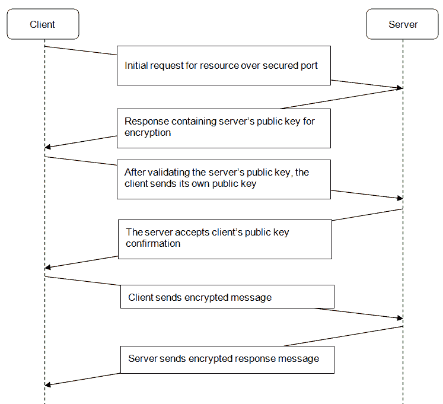

# 九、保护应用的安全

一旦部署到生产环境中，应用将面临大量请求。不可避免地，其中一些人会怀有恶意。这就要求仅向经过身份验证的用户授予显式访问权限，即，对选定数量的使用者进行身份验证，使其能够访问您的服务。大多数消费者将仅将该服务用于数据供应。但是，一些用户需要能够提供新的或修改现有的目录数据。为了确保只有适当的使用者才能执行`POST`、`PUT`和`DELETE`请求，我们必须在应用中引入授权的概念，这将只授予明确选择的用户修改权限。

数据服务可能提供敏感的私人信息，如电子邮件地址；作为文本协议的 HTTP 协议可能不够安全。通过它传输的信息受到**中间人**攻击，可能导致数据泄漏。为防止此类情况发生，应使用**传输层安全**（**TLS**）。HTTPS 协议对传输的数据进行加密，确保只有拥有正确解密密钥的适当使用者才能使用服务公开的数据。

在本章中，我们将了解 Node.js 如何启用以下安全功能：

*   基本身份验证
*   基于 Passport 的基本身份验证
*   基于 Passport 的第三方身份验证
*   批准
*   传输层安全

# 认证

当用户的身份已根据受信任的存储成功验证时，应用认为该用户已通过身份验证。此类受信任存储可以是任何类型的专门维护的数据库，存储应用的凭据（基本身份验证），也可以是第三方服务，该第三方服务根据自己的受信任存储检查给定的身份（第三方身份验证）。

# 基本身份验证

HTTP 基本身份验证是最流行和最直接的身份验证机制之一。它依赖于请求中提供用户凭据的 HTTP 头。或者，服务器可以使用头进行回复，强制客户机进行身份验证。下图显示了执行基本身份验证时的客户端-服务器交互：


每当 HTTP 请求被发送到由 HTTP 基本身份验证保护的端点时，服务器都会使用 HTTP`401 Unauthorized`状态码进行响应，并且可以选择使用`WWW-Authenticate`头进行响应。此标头强制客户端发送另一个请求，其中包含`Authorization`标头，该标头指定身份验证方法为`basic`。此请求之后是一个 base64 编码的密钥/值对，提供用户名和密码以进行身份验证。或者，服务器可以使用`realm`属性向客户端指定消息。

此属性指定共享相同`realm`值的资源应支持相同的身份验证方式。在上图中，`realm`消息为`MyRealmName`。客户端通过发送值为`Basic YWRtaW46YWRtaW4`的`Authentication`头进行身份验证，指定使用`Basic`身份验证，然后是 base64 编码值。在图中，base64 中解码的文本`YWRtaW46YWRtaW4`表示`admin:admin`文本。如果成功验证了这样的用户名/密码组合，HTTP 服务器将使用请求项的 JSON 负载进行响应。如果认证失败，服务器将以`401 Unauthorized`状态码响应，但这次不包括`WWW-Authenticate`头。

# 护照

现在有很多认证方法可供选择。也许最流行的方法是基本身份验证，每个用户都有自己的用户名和密码；第三方身份验证，用户可以通过自己已有的外部公共服务帐户（如 LinkedIn、Facebook 和 Twitter 等个人社交服务）来识别自己。

为 web API 选择最合适的身份验证类型主要取决于其使用者。显然，使用 API 获取数据的应用不太可能通过个人社交帐户进行身份验证。当 API 由人直接通过前端使用时，这种方法更合适。

实现能够在不同身份验证方法之间轻松切换的解决方案是一项复杂而耗时的任务。事实上，如果不在应用的初始设计阶段考虑，这几乎是不可能的。

**Passport**是 Node.js 的一个身份验证中间件，专门为身份验证方式可以轻松切换的用例而创建。它具有模块化体系结构，可以使用特定的身份验证提供商，称为**策略**。该策略负责实现选定的身份验证方法。

有很多身份验证策略可供选择，例如，Facebook、LinkedIn 和 Twitter 等服务的常规基本身份验证策略或基于社交平台的策略。请参阅官方护照网站[http://www.passportjs.org/](http://www.passportjs.org/) ，获取可用策略的完整列表。

# Passport 的基本身份验证策略

现在是时候看看如何利用 Passport 的策略了；我们将从基本的身份验证策略开始；现在我们知道了基本身份验证的工作原理，这是一个合乎逻辑的选择。

像往常一样，我们将从使用 NPM 包管理器安装相关模块开始。我们需要`passport`模块，该模块提供基本功能，允许您插入不同的身份验证策略，以及`passport-http`模块提供的基本身份验证的具体策略：

```js
  npm install passport
  npm install passport-http
```

接下来，我们必须实例化 Passport 中间件和基本身份验证策略。`BasicStrategy`将回调函数作为参数，用于检查提供的用户名/密码组合是否有效。最后，passport 的身份验证方法作为一种中间件功能提供给 express route，以确保未经身份验证的请求将以适当的`401 Unauthorized`状态被拒绝：

```js
const passport = require('passport');
const BasicStrategy = require('passport-http').BasicStrategy;

passport.use(new BasicStrategy(function(username, password, done) {
  if (username == 'user' && password=='default') {
    return done(null, username);
  }
}));

router.get('/v1/', 
  passport.authenticate('basic', { session: false }), 
     function(request,    response, next) {
       catalogV1.findAllItems(response);
});
router.get('/v2/', 
  passport.authenticate('basic', { session: false }), 
     function(request,    response, next) {
       catalogV1.findAllItems(response);
});

router.get('/', 
  passport.authenticate('basic', { session: false }), 
     function(request,    response, next) {
       catalogV1.findAllItems(response);
});
```

`BasicStrategy`构造函数将处理函数作为参数。它允许我们访问客户端提供的用户名和密码，以及 Passport 中间件的`done()`功能，该功能通知 Passport 用户是否已成功通过身份验证。使用`user`作为参数调用`done()`函数以授予身份验证，或将`error`参数传递给该函数以撤销身份验证：

```js
passport.use(new BasicStrategy(
function(username, password, done) {
  AuthUser.findOne({username: username, password: password}, 
    function(error, user) {
      if (error) {
        return done(error);
      } else {
        if (!user) {
          console.log('unknown user');
          return done(error);
        } else {
          console.log(user.username + ' 
          authenticated successfully');
          return done(null, user);
        }
      }
    });  
  })
); 
```

最后，使用路由中间件中的`passort``authenticate()`函数将其附加到特定的 HTTP 方法处理程序函数。

在本例中，我们指定不希望在会话中存储任何身份验证详细信息。这是因为，在使用基本身份验证时，不需要在会话中存储任何用户信息，因为每个请求都包含提供登录详细信息的`Authorization`头。

# Passport 的 OAuth 战略

OAuth 是第三方授权的开放标准，它定义了一个委托协议，用于对第三方身份验证提供者进行授权。OAuth 使用特殊的令牌，一旦发出，就可以识别用户而不是用户凭据。让我们通过一个示例场景进一步了解 OAuth 工作流。场景中的主要参与者是一个**用户**与**web 应用**交互，该应用使用**后端**系统提供的 restful 服务来提供某种数据。web 应用将其授权委托给单独的**第三方授权服务器。**


1.  用户请求需要身份验证的 web 应用，以建立与后端服务的通信。这是初始请求，因此用户仍然没有经过身份验证，因此他们会被重定向到登录页面，要求获得相关第三方帐户的凭据。
2.  成功的身份验证后，身份验证服务器将向 web 应用颁发授权代码。此授权码是已颁发的客户端 id 和提供商颁发的机密之间的组合。它们应该从 web 应用发送到身份验证服务器，并交换为具有有限生存期的访问令牌。
3.  Web 应用使用身份验证令牌进行身份验证，直到其过期。之后，它必须使用授权码请求一个新令牌。

Passport.js 使用一个单独的策略模块来自动化 OAuth 工作流，从而隐藏了此过程背后的复杂性。可在`npm`存储库中找到

```js
npm install passport-oauth
```

创建该策略的一个实例，并为其提供 URL，用于请求令牌和一起对其进行身份验证，它是您的个人消费者密钥，也是您选择的一个秘密短语。

```js
var passport = require('passport')
  , OAuthStrategy = require('passport-oauth').OAuthStrategy;

passport.use('provider', new OAuthStrategy({
    requestTokenURL: 'https://www.provider.com/oauth/request_token',
    accessTokenURL: 'https://www.provider.com/oauth/access_token',
    userAuthorizationURL: 'https://www.provider.com/oauth/authorize',
    consumerKey: '123-456-789',
    consumerSecret: 'secret'
    callbackURL: 'https://www.example.com/auth/provider/callback'
  }, function(token, tokenSecret, profile, done) {  
    //lookup the profile and authenticate   and call done
  }
));
```

Passport.js 提供了包装不同提供商的单独策略，如 linkedin 或 github。它们确保您的应用使用令牌发布 URL 保持最新。一旦你决定了你要支持的提供商，你应该检查他们的具体策略。

# Passport 的第三方身份验证策略

如今，几乎每个人都至少拥有一个个人公共社交媒体账户，如 Twitter、Facebook 和 LinkedIn。最近，网站非常流行的做法是，只需单击图标，将其社会服务帐户绑定到服务内部自动生成的帐户，即可允许访问者通过其社会帐户进行身份验证。

这种方法对于通常至少永久登录一个帐户的 web 用户来说非常方便。如果他们当前未登录，单击图标会将他们重定向到其社会服务登录页面，并且在成功登录后，会发生另一个重定向，以确保用户获得他们最初请求的内容。当涉及到通过 web API 公开数据时，这种方法实际上不是一种选择。

公开的 API 无法预测它们是由人还是由应用使用。此外，API 通常不会被人类直接消费。因此，当您作为 API 作者确信公开的数据将直接提供给通过前端从 internet 浏览器手动请求数据的最终用户时，第三方身份验证是唯一的选择。一旦他们成功登录到他们的社交帐户，会话中将存储一个唯一的用户标识符，因此您的服务将需要能够适当地处理此类会话。

要启用会话支持以使用 Passport 和 Express 存储用户登录信息，您必须在初始化 Passport 及其会话中间件之前初始化 Express 会话中间件：

```js
app.use(express.session()); 
app.use(passport.initialize()); 
app.use(passport.session()); 
```

然后，指定其详细信息 Passport 应序列化/反序列化到会话中或从会话中导出的用户。为此，Passport 提供了`serializeUser()`和`deserializeUser()`功能，在会话中存储完整的用户信息：

```js
passport.serializeUser(function(user, done) { done(null, user); }); passport.deserializeUser(function(obj, done) { done(null, obj); });
```

The order of initializing the session handling of the Express and Passport middleware is important. The Express session should be passed to the application first and should be followed by the Passport session.

启用会话支持后，您必须决定依赖哪种第三方身份验证策略。基本上，第三方身份验证是通过第三方提供商创建的插件或应用启用的，例如，社会服务网站。我们将简要介绍如何创建允许通过 OAuth 标准进行身份验证的 LinkedIn 应用。

通常，这是通过与社交媒体应用关联的一对公钥和一个秘密（令牌）来完成的。创建 LinkedIn 应用很容易，您只需登录[http://www.linkedin.com/secure/developer](http://www.linkedin.com/secure/developer) 并填写一份简短的申请信息表。您将获得一个密钥和一个令牌以启用身份验证。执行以下步骤以启用 LinkedIn 身份验证：

1.  安装`linkedin-strategy`模块-`npm install linkedin-strategy`

2.  获取 LinkedIn 策略的实例，并在启用会话支持后通过`use()`功能将其初始化到 Passport 中间件：

```js
      var passport = require('passport')
        , LinkedInStrategy = require('passport-
        linkedin').Strategy;

        app.use(express.session());
        app.use(passport.initialize());
        app.use(passport.session());

      passport.serializeUser(function(user, done) {
        done(null, user);
      });

      passport.deserializeUser(function(obj, done) {
        done(null, obj);
      });

        passport.use(new LinkedInStragety({
          consumerKey: 'api-key',
          consumerSecret: 'secret-key',
          callbackURL: "http://localhost:3000/catalog/v2"
        },
          function(token, tokenSecret, profile, done) {
            process.nextTick(function () {
              return done(null, profile);
            });
          })
        ); 
```

3.  明确指定 LinkedIn 策略应用作每个单独路由的通行证，确保启用会话处理：

```js
      router.get('/v2/', 
        cache('minutes',1), 
        passport.authenticate('linked', { session: true}), 
        function(request, response) {
          //...
        }
      });
```

4.  通过公开注销 URI，利用`request.logout`为用户提供注销的方式：

```js
      router.get('/logout', function(req, res){
      request.logout();
        response.redirect('/catalog');
      });

```

The given third-party URLs and service data are subject to change. You should always refer to the service policy when providing third-party authentication.

# 批准

到目前为止，目录数据服务使用基本身份验证来保护其路由不受未知用户的攻击；但是，目录应用应该只允许少数白名单用户修改目录中的项目。为了限制对目录的访问，我们将引入授权的概念，即授权用户的子集，并允许适当的权限。

当调用 Passport 的`done()`函数对成功登录进行身份验证时，它会将被授予身份验证的用户的`user`实例作为参数。`done()`函数将该用户模型实例添加到`request`对象中，通过这种方式，在成功验证后，通过`request.user`属性提供对该用户模型实例的访问。我们将利用该属性实现一个功能，在成功验证后执行授权检查：

```js
function authorize(user, response) {
  if ((user == null) || (user.role != 'Admin')) {
    response.writeHead(403, { 'Content-Type' : 
    'text/plain'});
    response.end('Forbidden');
    return;
  }
} 
```

The HTTP 403 Forbidden status code can be easily confused with 405 Not allowed. However, the 405 Not Allowed status code indicates that a specific HTTP verb is not supported by the requested resource, so it should be used only in that context.

`authorize()`功能关闭`response`流，返回`403 Forbidden`状态码，表示登录用户已被识别，但权限不足。这将撤消对资源的访问。此功能必须在执行数据操作的每条路线中使用。

下面是一个`post`路由如何实现授权的示例：

```js
app.post('/v2', 
  passport.authenticate('basic', { session: false }), 
    function(request, response) {
      authorize(request.user, response);
      if (!response.closed) {
        catalogV2.saveItem(request, response);
      }
    }
); 
```

调用`authorize()`后，我们通过检查`response`对象的 closed 属性的值来检查`response`对象是否仍然允许写入其输出。一旦`response`对象的 end 函数被调用，它将返回`true`，这正是`authorize()`函数在用户缺乏管理权限时所做的。因此，我们可以在实现中依赖于闭属性。

# 传输层安全

网络上的公开信息很容易成为不同类型网络攻击的对象。通常，仅仅把所谓的“坏人”拒之门外是不够的。有时，他们根本不会费心获得身份验证，可能更愿意执行**中间人**（**MiM**）攻击，假装是消息的最终接收者，嗅探传输数据的通信通道，或者更糟糕的是，在数据流动时改变数据。

作为一种基于文本的协议，HTTP 以人类可读的格式传输数据，这使得它很容易成为 MiM 攻击的受害者。除非以加密格式传输，否则我们服务的所有目录数据都容易受到 MiM 攻击。在本节中，我们将把传输从不安全的 HTTP 协议切换到安全的 HTTPS 协议。

HTTPS 由非对称加密（也称为**公钥加密**来保护。它基于一对数学上相关的密钥。用于加密的密钥称为**公钥**，用于解密的密钥称为**私钥**。其想法是向必须发送加密消息并使用私钥执行解密的合作伙伴免费提供加密密钥。

双方*A*和*B*之间的典型公钥加密通信场景如下：

1.  *甲方*制作报文，用乙方公钥加密后发送

2.  *B*方用自己的私钥解密报文并进行处理

3.  *B*方编写响应报文，用*a*方公钥加密后发送

4.  方*A*使用自己的私钥对响应消息进行解密

现在，我们已经了解了公钥加密的工作原理，让我们来看一个 HTTPS 客户机-服务器通信示例，如下图所示：



客户端发送针对 SSL 安全端点的初始请求。服务器通过发送其公钥来响应该请求，该公钥用于加密进一步传入的请求。然后，客户端必须检查有效性并验证所接收密钥的身份。成功验证服务器的公钥后，客户端必须将自己的公钥发送回服务器。最后，在密钥交换过程完成后，双方可以开始安全通信。

HTTPS 依赖于信任；因此，使用可靠的方法检查特定公钥是否属于特定服务器至关重要。公钥在具有层次结构的 X.509 证书中交换。此结构使客户端能够检查给定的证书是否已从受信任的根证书生成。客户端应仅信任由已知的**证书颁发机构**（**CA**颁发的证书）。

在将服务切换到使用 HTTPS 传输之前，我们需要一个公钥/私钥对。由于我们不是一个证书颁发机构，我们将不得不使用 OpenSSL 工具为我们生成测试密钥。

OpenSSL 可在[下载 http://www.openssl.org/](http://www.openssl.org/) ，源代码分发版可用于所有流行的操作系统。OpenSSL 可以按如下方式安装：

1.  二进制发行版可供 Windows 下载，Debian 和 Ubuntu 用户可以通过执行以下操作使用打包发行版：

```js
sudo apt-get install openssl
```

Windows users will have to set an environment variable, OPENSSL_CNF, specifying the location of the `openssl.cnf` configuration file, typically located in the share directory in the installation archive.

2.  现在，让我们使用 OpenSSL 生成一个测试密钥/值对：

```js
opensslreq -x509 -nodes -days 365 -newkey rsa:2048-keyoutcatalog.pem -out catalog.crt
```

OpenSSL 将提示生成证书所需的一些详细信息，例如国家代码、城市和完全限定的域名。之后，它将在`catalog.pem`文件中生成一个私钥，并在`catalog.crt`文件中生成一个有效期为一年的公钥证书。我们将使用这些新生成的文件，因此将它们复制到 catalog data service 目录中名为`ssl`的新子目录中。

现在，我们已经具备了将服务修改为使用 HTTPS 所需的一切：

1.  首先，我们需要切换并使用 HTTPS 模块而不是 HTTP，并指定要用于启用 HTTPS 通信的端口：

```js
var https = require('https');
var app = express();
app.set('port', process.env.PORT || 3443); 
```

2.  然后，我们必须将`catalog.cem`文件中的私钥和`catalog.crt`中的证书读取到一个数组中：

```js
var options = {key : fs.readFileSync('./ssl/catalog.pem'),
                cert : fs.readFileSync('./ssl/catalog.crt')
}; 
```

3.  最后，我们在创建服务器时将包含密钥对的数组传递给 HTTPS 实例，并通过指定的端口开始侦听：

```js
https.createServer(options, app).listen(app.get('port'));
```

这就是为基于 Express 的应用启用 HTTPS 所需做的全部工作。保存更改并通过在浏览器中请求`https://localhost:3443/catalog/v2`进行尝试。将向您显示一条警告消息，通知您所连接的服务器使用的证书不是由受信任的证书颁发机构颁发的。这是正常的，因为我们自己生成了证书，而且我们不能确定自己是 CA，所以请忽略该警告。

Before deploying a service on a production environment, you should always ensure that you use a server certificate issued by a trusted CA.

# 自测题

完成以下问题：

*   HTTP 基本身份验证对中间人攻击是否安全？

*   传输层安全的好处是什么？

# 总结

在本章中，您学习了如何通过启用身份验证和授权来保护公开的数据。这是任何公共可用数据服务的一个关键方面。此外，您还学习了如何使用服务与其用户之间的安全层传输协议防止中间人攻击。作为此类服务的开发人员，您应该始终考虑应用应该支持的最合适的安全特性。

我希望这是一次有益的经历！您获得了足够的知识和实践经验，这应该使您在理解 RESTful API 的工作原理以及它们的设计和开发方式方面更有信心。我强烈建议您一章一章地阅读代码演化。您应该能够进一步重构它，将其应用到您自己的编码风格中。当然，它的某些部分可以进一步优化，因为它们经常重复。这是一个有意的决定，而不是良好的做法，因为我想强调它们的重要性。您应该始终努力改进代码库，使其更易于维护。

最后，我想鼓励您始终关注您在应用中使用的`Node.js`模块的开发。Node.js 拥有一个非凡的社区，它渴望快速发展。那里总是有令人兴奋的事情发生，所以确保你不会错过它。祝你好运