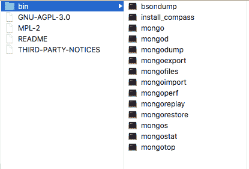
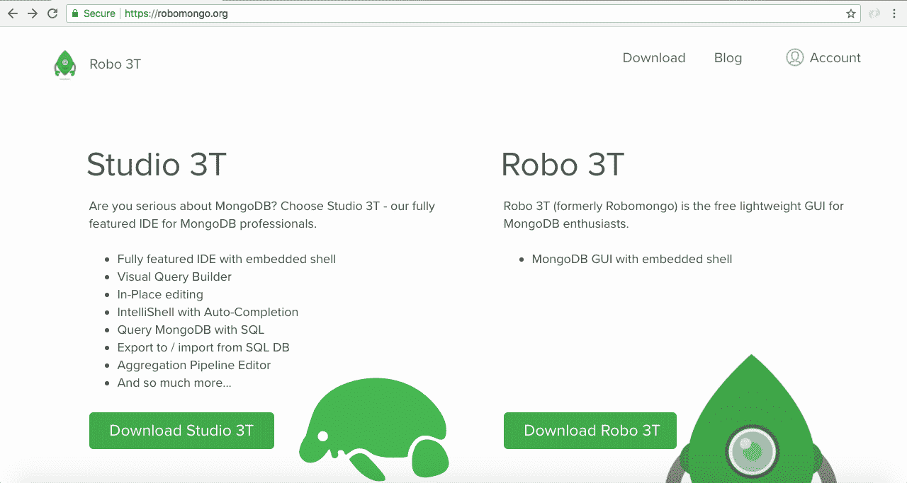
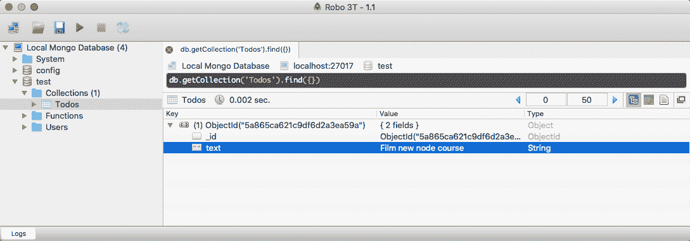
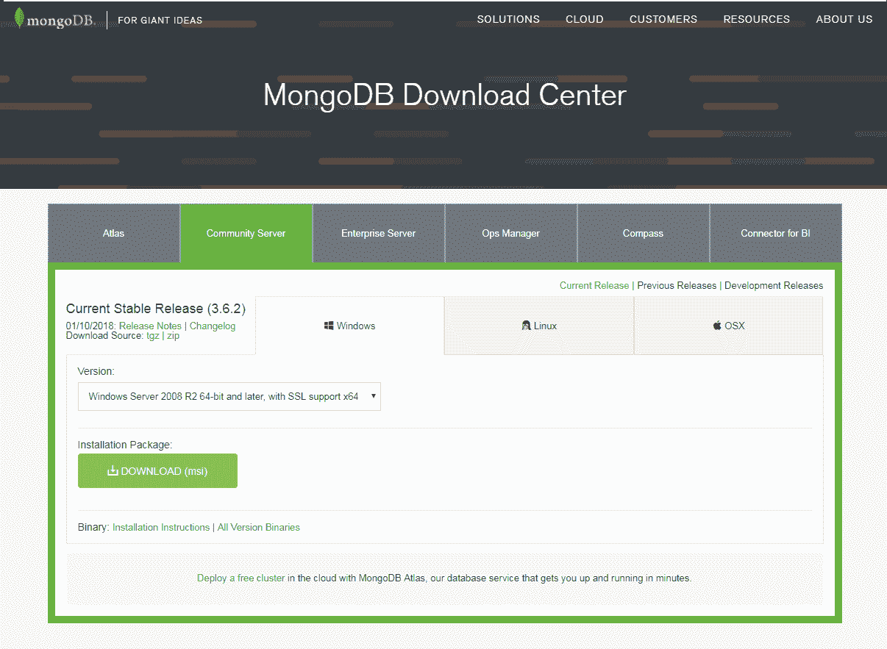
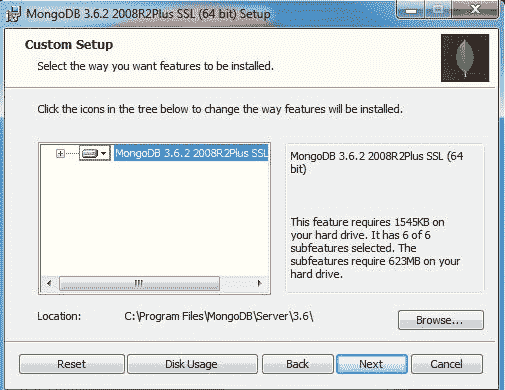
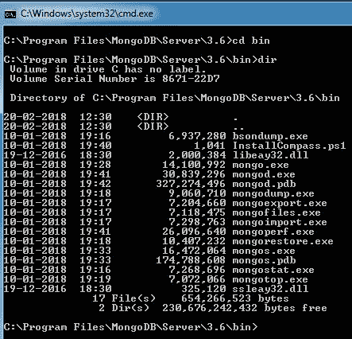
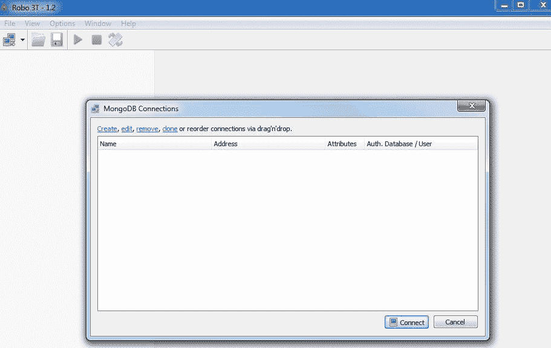
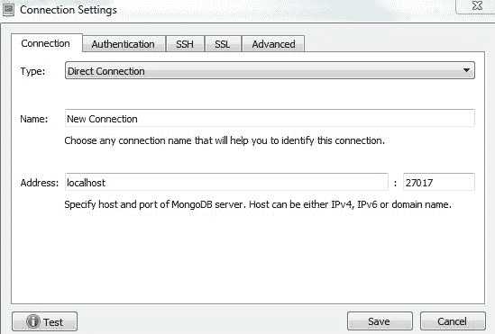

# 一、起步

在本章中，您将为本书的其余部分设置您的本地环境。无论你是在 macOS、Linux 还是 Windows 上，我们都会安装 MongoDB 和 Robomongo。

更具体地说，我们将涵盖以下主题:

*   面向 Linux 和 macOS 的 MongoDB 和 Robomongo 安装
*   面向 Windows 的 MongoDB 和 Robomongo 安装

# 为 Linux 和 macOS 安装 MongoDB 和 Robomongo

这部分是给 macOS 和 Linux 用户的。如果你在 Windows 上，我已经为你写了一个单独的部分。

我们要做的第一件事是下载并设置 MongoDB，因为这将是我们要使用的数据库。当我们最终将其部署到 Heroku 时，我们将使用第三方服务来托管我们的数据库，但是在我们的本地机器上，我们需要下载 MongoDB，以便我们可以启动数据库服务器。这将允许我们通过节点应用连接到它，以读取和写入数据。

为了获取数据库，我们将前往[mongodb.com](https://www.mongodb.com/)。然后我们可以进入下载页面，下载合适的版本。

在此页面上，向下滚动并选择社区服务器；这是我们将要使用的。此外，不同的操作系统都有不同的选项，无论是 Windows、Linux、macOS 还是 Solaris。我在 macOS 上，所以我将使用这个下载:


如果你在 Linux 上，点击 Linux；然后转到版本下拉列表，选择适当的版本。例如，如果您在 Ubuntu 14.04 上，您可以从 Linux 选项卡下载正确的版本。然后，您可以简单地点击下载按钮并继续。

接下来你可以打开它。我们只是提取目录，在`Downloads`文件夹中创建一个全新的文件夹。如果您在 Linux 上，您可能需要手动将该档案的内容提取到`Downloads`文件夹中。

现在这个文件夹包含一个`bin`文件夹，在那里我们有所有需要的可执行文件，以便连接到数据库和启动数据库服务器:



在我们开始运行它们之前。我们将这个目录重命名为`mongo`，然后将其移入`user`目录。你可以看到现在在`user`目录中，我有`mongo`文件夹。我们还将在`mongo`旁边创建一个名为`mongo-data`的全新目录，它将存储数据库中的实际数据:


例如，当我们在`Todos`表中插入一条新记录时，它将位于`mongo-data`文件夹中。一旦您将`mongo`文件夹移动到`user`目录中，并且您有了新的`mongo-data`文件夹，您就可以从终端实际运行数据库服务器了。我将进入终端，导航到我当前所在的`user`目录中的全新`mongo`文件夹，这样我就可以将`cd`放入`mongo`，然后我将通过在此处添加标签将`cd`放入`bin`目录:

```js
cd mongo/bin
```

从这里，我们可以运行一堆可执行文件:


我们有 bisondump 和 mongodump 之类的东西。在本节中，我们将重点关注:mongod，它将启动数据库服务器，mongo，它将让我们连接到服务器并运行一些命令。就像当我们键入`node`时，我们可以直接在终端中运行一些 JavaScript 命令，当我们键入`mongo`时，我们将能够运行一些 Mongo 命令来插入、获取或对数据做任何我们喜欢的事情。

首先，让我们启动数据库服务器。我将使用`./`在当前目录中运行一个文件。我们要运行的文件叫做`mongod`；此外，我们确实需要提供一个论点:`dbpath`论点。`dbpath`参数将被设置为等于我们刚刚创建的目录的路径，即`mongo-data`目录。我将使用`~`(波浪符号)导航到用户目录，然后导航到`/mongo-data`，如下所示:

```js
./mongod --dbpath ~/mongo-data
```

运行此命令将启动服务器。这将创建一个活动连接，我们可以连接到它来操作我们的数据。运行命令时看到的最后一行应该是，等待端口 27017 上的连接:


如果您看到这一点，这意味着您的服务器已经启动并运行。

接下来，让我们打开一个新的选项卡，它从完全相同的目录开始，这次，我们将运行`mongo`文件，而不是运行`mongod`:

```js
./mongo
```

当我们运行`mongo`时，我们打开一个控制台。它连接到我们刚刚启动的数据库服务器，从这里，我们可以开始运行一些命令。这些命令只是为了测试事情是否如预期的那样运行。我们将在本节稍后详细讨论所有这些内容。不过现在，我们可以访问`db.Todos`，然后我们将调用`.insert`来创建一个全新的待办事项记录。我把它叫做函数:

```js
db.Todos.insert({})
```

接下来，在`insert`内部，我们将传递我们的文档。这将是我们想要创建的 MongoDB 文档。现在，我们会让事情变得非常简单。在我们的对象上，我们将指定一个属性`text`，将其设置为一个字符串。在引号内，键入您想做的任何事情。我会说`Film new node course`:

```js
db.Todos.insert({text: 'Film new node course'})
```

您的命令看起来就像这样，您可以按*进入*，您应该会得到一个写结果对象，它有一个“插入”属性，这是插入数字的缩写:一个设置为 1 的值。这意味着创造了一项新记录，这太棒了！


现在我们已经插入了一条记录，让我们获取该记录，以确保一切都按预期运行。

不叫`insert`，我们就叫`find`没有任何争论。我们想要归还`Todos`系列中的每一件物品:

```js
db.Todos.find()
```

当我运行这个时，我们得到了什么？我们得到一个看起来像物体的东西:


我们将`text`属性设置为我们提供的文本，并且我们有一个`_id`属性。这是每个记录的唯一标识符，我们将在后面讨论。只要您看到文本属性恢复到您设置的内容，您就可以开始了。

我们可以关闭`mongo`命令。但是，我们仍然会让`mongod`命令保持运行，因为我还想安装一个东西。它叫做 Robomongo，是一个管理你的 mongo 数据库的图形用户界面。这将非常有用，因为你开始玩蒙古。您将能够查看保存在数据库中的确切数据；你可以操纵它，做各种事情。

在 **Finder** 中，我们有我们的`mongo-data`目录，你可以看到这里有很多东西。这意味着我们的数据被成功保存。所有的数据都在这个`mongo-data`目录下。要下载并安装适用于 Linux、Windows 和 macOS 的 Robomongo，我们将前往[robomongo.org](https://robomongo.org/)并获取我们操作系统的安装程序:



我们可以点击下载 Robo 3T，下载最新版本；它会自动检测你的操作系统。下载适用于 Linux 或 macOS 的安装程序。macOS 的那个真的很简单。这是一个安装程序，你拿着图标，把它拖到`Applications`文件夹。对于 Linux，您需要提取归档文件并在`bin`目录下运行程序。这将在你的 Linux 发行版上启动 Robomongo。

因为我使用的是苹果操作系统，所以我会快速将图标拖到应用上，然后我们就可以玩程序本身了。接下来，我将在 Finder 中打开它。当您第一次打开 Robomongo 时，您可能会在 macOS 上收到如下警告，因为它是我们下载的一个程序，并且不是来自已识别的 macOS 开发人员:


这很好；你从网上下载的大多数程序都不是官方的，因为它们不是来自应用商店。您可以右键单击下载的包，选择“打开”，然后再次单击“打开”来运行该程序。当您第一次打开它时，您会看到如下所示的一些屏幕:


我们在后台有一个小屏幕和一个连接列表；目前该列表为空。我们需要做的是为我们的本地 MongoDB 数据库创建一个连接，这样我们就可以连接到它并操作这些数据。我们有创造。我将点击这个，我们唯一需要更新的是名称。我会给它起一个更具描述性的名字，比如`Local Mongo Database`。我将地址设置为`localhost`，`27017`端口是正确的；没有必要改变这些。所以，我会点击保存:


接下来，我将双击数据库以连接到它。在这个小窗口里，我们有我们的数据库。我们与它相连；我们可以做各种事情来管理它。

我们可以打开`test`数据库，在里面应该会看到一个`Collections`文件夹。如果我们展开这个文件夹，我们有我们的`Todos`收藏，从那里，我们可以右击收藏。接下来，点击查看文档，我们应该得到我们的一个待办事项，我们在 Mongo 控制台中创建的一个:


我可以展开它来查看文本属性。电影新节点课程展示:



如果你看到这个，那你就完了。

下一部分是针对 Windows 用户的。

# 为 Windows 安装 MongoDB 和 Robomongo

如果您在 Windows 上，这是为您准备的安装部分。如果你在 Linux 或 macOS 上，上一节是为你准备的；你可以跳过这个。我们在这里的目标是在我们的机器上安装 MongoDB，这将让我们创建一个本地 MongoDB 数据库服务器。我们将能够使用 Node.js 连接到该服务器，并且能够向数据库读写数据。这对于 Todo API 来说将是非常棒的，它将负责读取和写入各种与 Todo 相关的信息。

首先，我们将通过转到[mongodb.com](https://www.mongodb.com/)来获取 MongoDB 安装程序。在这里我们可以点击绿色的大下载按钮；此外，我们可以在此页面上看到几个选项:



我们将使用社区服务器和 Windows。如果您转到版本下拉列表，那里的版本都不适合您。最上面一个是我们想要的:Windows Server 08 R2 64 位及更高版本，支持 SSL。让我们开始下载这个。它略大；100 MB 多一点，所以下载需要一点时间。

我来启动它。这是一个基本的安装程序，你点击几次下一步，你就同意了许可协议。点击自定义选项一秒钟，尽管我们将继续完成选项。当你点击自定义时，它会显示你的机器将被安装在哪里，这很重要。在这里，你可以看到对我来说它在`C:\Program Files\MongoDB\Server`上，然后在`3.2`目录中:



这很重要，因为我们需要导航到这个目录来启动 MongoDB 服务器。不过我会回去，我会使用“完成”选项，它会安装我们需要的一切。现在我们实际上可以开始安装过程了。通常，您必须单击是，确认您想要安装软件。我会去做，然后我们就结束了。

现在，一旦它被安装，我们将导航到命令提示符并启动一个服务器。我们需要做的第一件事是导航到那个`Program Files`目录。我在命令提示符下。我建议您使用命令提示符，而不是 Git Bash。Git Bash 不适用于启动 MongoDB 服务器。我将使用`cd/`导航到我的机器的根目录，然后我们可以使用以下命令开始导航到该路径:

```js
cd Program Files/MongoDB/Server/3.2
```

这是安装 MongoDB 的目录。我可以用`dir`打印出这个目录的内容，这里我们关心的是`bin`目录:


我们可以使用`cd bin`导航到`bin`，使用`dir`打印出它的内容。此外，该目录包含一大堆可执行文件，我们将使用它们来执行一些操作，例如启动服务器并连接到它:



我们将运行的第一个可执行文件是这个 mongod.exe 文件。这将启动我们本地的 MongoDB 数据库。在我们继续运行这个`EXE`之前，我们还需要做一件事。在通用的文件资源管理器中，我们需要创建一个目录来存储我们所有的数据。为此，我将通过转到`C:/Users/Andrew`目录将我的放入我的用户目录中。我会做一个新的文件夹，我会把这个文件夹叫做`mongo-data`。现在，`mongo-data`目录是我们所有数据实际存储的地方。这是我们运行`mongod.exe`命令时需要指定的路径；我们需要告诉 Mongo 在哪里存储数据。

在命令提示符下，我们现在可以启动这个命令。我将运行`mongod.exe`，作为`dbpath`参数传入，我们刚刚创建的那个文件夹的路径。就我而言，是`/Users/Andrew/mongo-data`。现在，如果您的用户名不同(很明显是不同的)，或者您将文件夹放在不同的目录中，您需要指定`mongo-data`文件夹的绝对路径。一旦您做到了这一点，您就可以通过运行以下命令来启动服务器:

```js
mongod.exe --dbpath /Users/Andrew/mongo-data
```

您将获得一长串输出:


您唯一需要关心的是，在最底部，您应该看到在端口 27017 上等待连接。如果你看到这个，那你就可以走了。但是现在服务器已经启动，让我们连接到它并发出一些命令来创建和读取一些数据。

# 创建和读取数据

为此，我们将打开第二个命令提示符窗口，并使用`cd/Program Files/MongoDB/Server/3.2/bin`导航到同一个`bin`目录。从这里，我们将运行`mongo.exe`。请注意，我们没有运行`mongod`命令；我们在跑`mongo.exe`。这将连接到我们本地的 MongoDB 数据库，它将把我们放在数据库的命令提示符视图中。我们将能够发出各种 Mongo 命令来操作数据，就像我们可以从命令提示符运行 Node 来在控制台内部运行各种 JavaScript 语句一样。当我们运行这个时，我们将连接到数据库。在第一个控制台窗口中，您可以看到连接接受显示出来。我们确实有了新的联系。现在在第一个控制台窗口中，我们可以运行一些命令来创建和读取数据。现在我不指望你从这些命令中拿走任何东西。我们暂时不讨论 MongoDB 的来龙去脉。我想做的就是确保当你运行它们时，它能像预期的那样工作。

首先，让我们从控制台创建一个新的 Todo。这可以通过`db.Todos`完成，在这个 Todos 集合中，我们将调用`.insert`方法。同样，我们用一个论点来称呼`insert`，一个物体；这个对象可以有我们想要添加到记录中的任何属性。比如我想设置一个`text`属性。这是我真正需要做的事情。在引号里面，我可以放一些东西。我和`Create new Node course`一起去:

```js
db.Todos.insert({text: 'Create new Node course'})
```

现在，当我运行这个命令时，它实际上将插入到我们的数据库中，我们应该得到一个`writeResult`对象，其`nInserted`属性设置为`1`。这意味着插入了一条记录。

现在我们的数据库中有了一个 Todo，我们可以再次尝试使用`db.Todos`获取它。这一次，我们将调用`find`而不提供参数，而不是调用`insert`来添加记录。这将返回我们数据库中的每个 Todo:

```js
db.Todos.find()
```

当我运行这个命令时，我们得到一个看起来像对象的东西，其中我们有一个设置为`Create new Node course`的`text`属性。我们还有一处`_id`房产。`_id`属性是 MongoDB 的唯一标识符，这是他们用来给你的文档的属性；在这种情况下，一个 Todo，一个唯一的标识符。稍后，我们将更多地讨论`_id`以及我们刚刚运行的所有命令。现在，我们可以使用 *Ctrl* + *C* 关闭这个。我们已经成功地与 Mongo 断开连接，现在我们还可以关闭第二个命令提示符窗口。

在我们继续之前，还有一件事我想做。我们将安装一个名为 Robomongo 的程序——一个针对 MongoDB 的图形用户界面。它将允许您连接到您的本地数据库以及真实的数据库，这将在后面讨论。此外，它将允许您查看所有数据，操作它，并在数据库图形用户界面中做任何您能做的事情。真的很有用；有时，您只需要深入数据库，就能确切地看到数据的样子。

为了开始这项工作，我们将进入一个新的标签页，进入[robomongo.org](https://robomongo.org/):


在这里，我们可以通过下载来获取安装程序。我们将下载最新版本，我在 Windows 上。我想要安装程序，而不是便携式版本，所以我会点击这里的第一个链接:


这将开始一个非常小的下载，只有 17 MB，我们可以通过这个点击几次 Next 来让 Robomongo 安装在我们的机器上。

我将开始这个过程，确认安装并点击下一步几次。没有必要在设置中进行任何自定义。我们将运行应用了所有默认设置的安装程序。现在我们实际上可以通过完成安装程序中的所有步骤来运行程序。当您运行 Robomongo 时，您将看到一个 MongoDB 连接屏幕:



此屏幕允许您配置 Robomongo 的所有连接。您可能有本地数据库的本地连接，也可能有存储实际生产数据的真实 URL 的连接。我们以后再谈这些。

现在，我们将点击创建。默认情况下，您的`localhost`地址和您的`27017`端口不需要更改:



我要做的就是改变名字，这样更容易识别。我会和`Local Mongo Database`一起去。现在，我们可以保存我们的新连接，并通过双击它来连接到数据库。当我们这样做的时候，我们得到了我们的数据库的一个小树视图。我们有这个`test`数据库；这是默认创建的，我们可以扩展它。然后我们可以展开`Collections`文件夹，查看`Todos`收藏。这是我们在控制台内创建的集合。我将右键单击它，然后转到查看文档。当我查看文档时，我实际上可以查看各个记录:


在这里，我看到我的 _id 和文本属性已经创建了新的节点课程，如上图所示。

如果您看到了这一点，那么这意味着您有一个本地 Mongo 服务器正在运行，这也意味着您已经成功地向其中插入了数据。

# 摘要

在本章中，您下载并运行了 MongoDB 数据库服务器。这意味着我们有一个本地数据库服务器，可以从节点应用连接到它。我们还安装了 Robomongo，它允许我们连接到本地数据库，以便我们可以查看和操作数据。当您调试或管理数据，或者对您的 Mongo 数据库做任何其他事情时，这很方便。我们将在整本书中使用它，您将在后面的章节中开始看到它的价值。不过，现在你们都准备好了。您已经准备好继续并开始构建 Todo API。