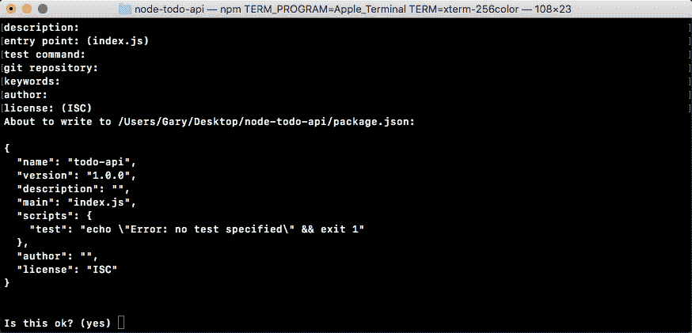
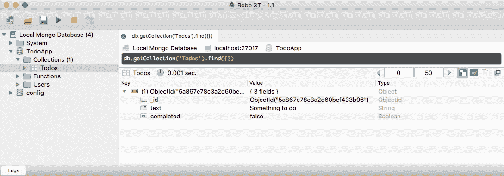
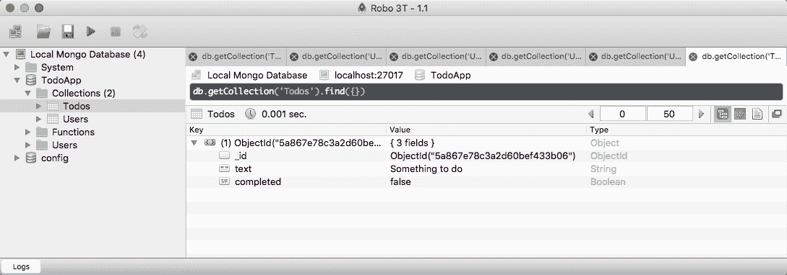
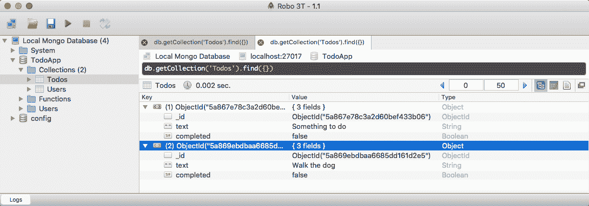
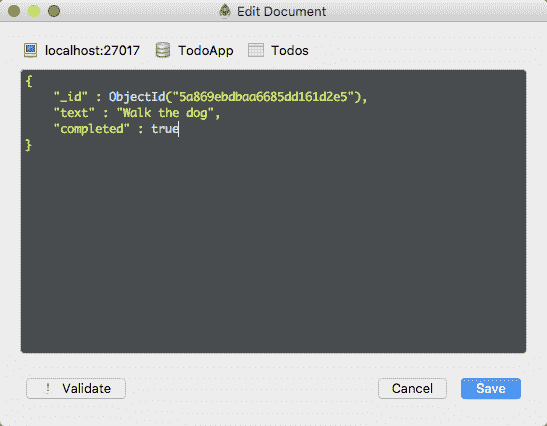
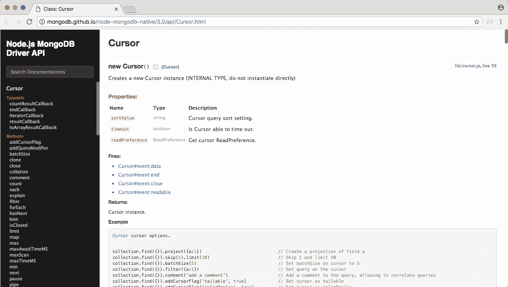

# 二、MongoDB、Mongoose 和 REST 应用编程接口——第 1 部分

在本章中，您将学习如何将您的 Node 应用连接到您在本地机器上运行的 MongoDB 数据库。这意味着我们将能够在我们的节点应用中发出数据库命令来执行插入、更新、删除或读取数据等操作。如果我们要制作 Todo REST 应用编程接口，这将是至关重要的。当有人攻击我们的一个应用编程接口端点时，我们希望操纵数据库，无论是读取所有的 Todos 还是添加一个新的。在我们做到这些之前，我们必须学习基础知识。

# 连接到 MongoDB 并写入数据

为了从 Node.js 内部连接到我们的 MongoDB 数据库，我们将使用由 MongoDB 团队创建的 npm 模块。它被称为 node-mongodb-native，但它包含了连接到数据库并与之交互所需的所有功能。为了找到答案，我们要去谷歌一下:


GitHub repo 应该是第一个链接，它是我们想要的——节点-MongoDB-原生存储库——如果我们向下滚动，我们可以看到几个重要的链接:


首先，我们有文档，我们也有 api 文档；当我们开始探索这个库中的特性时，这些将是至关重要的。如果我们在这一页进一步向下滚动，我们会发现大量关于如何开始的例子。我们将在本章中详细介绍这些内容，但我确实想让您知道在哪里可以找到其他资源，因为 mongodb 原生库有大量功能。有专门针对 MongoDB 的完整课程，它们甚至没有开始涵盖该库内置的所有内容。

我们将重点关注 Node.js 应用所需的 MongoDB 的重要且通用的子集。首先，让我们打开上图中显示的文档。当你进入文档页面时，你必须选择你的版本。我们将使用 3.0 版本的驱动程序，其中有两个重要的链接:

*   **参考链接:**这包括类似指南的文章，让你开始的东西，以及其他各种参考。
*   **API 链接:**这包括当您使用库时，您可以使用的每一个方法的细节。当我们开始创建节点待办事项应用编程接口时，我们将探索这个链接上的一些方法。

不过现在，我们可以从为这个项目创建一个新目录开始，然后我们将继续安装 MongoDB 库并连接到我们正在运行的数据库。我将假设您已经运行了本章所有章节的数据库。我让它在我的终端的一个单独的标签中运行。

如果您在 Windows 上，如果您忘记了，请参考 Windows 安装部分中的说明来启动数据库。如果你在 Linux 或 macOS 操作系统上，使用我已经提到的指令，不要忘记也包括那个`dbpath`参数，这对于启动你的 MongoDB 服务器是必不可少的。

# 为项目创建目录

首先，我将在桌面上为节点应用编程接口创建一个新文件夹。我将使用`mkdir`创建一个名为`node-todo-api`的新文件夹。然后，我可以继续使用`cd`进入目录`cd node-todo-api`。从这里，我们将运行`npm init`，它创建我们的`package.json`文件，并让我们安装我们的 MongoDB 库。我们将再次使用 enter 跳过所有选项，使用每个选项的默认值:



一旦我们到达终点，我们可以确认我们的选择，现在我们的`package.json`文件被创建。接下来我们要做的是在 Atom 中打开这个目录。在桌面上，`node-todo-api`。接下来，在项目的根目录下，我们将创建一个新的文件夹，我将把这个文件夹叫做`playground`。在这个文件夹中，我们将存储各种脚本。它们不会是与 Todo API 相关的脚本；它们将是与 MongoDB 相关的脚本，所以我确实希望将它们保存在文件夹中，但我不一定希望它们成为应用的一部分。我们将像过去一样使用`playground`文件夹。

在`playground`文件夹中，让我们继续制作一个新文件，我们将这个文件称为`mongodb-connect.js`。在这个文件中，我们将开始加载库并连接到数据库。为了做到这一点，我们必须安装库。从终端，我们可以运行`npm install`来完成。新库名为`mongodb`；全部小写，没有连字符。然后，我们将继续指定版本，以确保我们都使用相同的功能，`@3.0.2`。这是撰写本文时的最新版本。版本号后，我要用`--save`标志。这将把它保存为常规依赖项，它已经是:

```js
npm install mongodb@3.0.2 --save
```

我们将需要它来运行 Todo API 应用。

# 将 mongodb-connect 文件连接到数据库

现在安装了 MongoDB，我们可以将其移动到我们的`mongodb-connect`文件，并开始连接到数据库。我们需要做的第一件事是从我们刚刚安装的库中拉出一些东西，这就是`mongodb`库。我们要找的是一种叫做`MongoClient`构造器的东西。`MongoClient`构造函数允许您连接到 Mongo 服务器，并发出命令来操作数据库。让我们通过创建一个名为`MongoClient`的常量来开始吧。我们将把它设置为`require`，并要求使用我们刚刚安装的库`mongodb`。从那个图书馆，我们将完成`MongoClient`:

```js
const MongoClient = require('mongodb').MongoClient; 
```

现在`MongoClient`已经就位，我们可以调用`MongoClient.connect`来连接数据库。这是一个方法，它需要两个参数:

*   第一个参数是一个字符串，这将是数据库所在的 URL。现在在一个生产示例中，这可能是一个亚马逊网络服务网址或英雄库网址。在我们的例子中，它将是一个本地主机网址。我们稍后再谈。
*   第二个参数是一个回调函数。回调函数将在连接成功或失败后触发，然后我们可以继续适当地处理事情。如果连接失败，我们将打印一条消息并停止程序。如果成功了，我们就可以开始操作数据库了。

# 添加字符串作为第一个参数

对于我们案例中的第一个论点，我们将从`mongodb://`开始。当我们连接到 mongodb 数据库时，我们希望使用 MongoDB 协议，如下所示:

```js
MongoClient.connect('mongodb://')
```

接下来，它将在本地主机上运行，因为我们在本地机器上运行它，并且我们已经探索了端口:`27017`。在端口之后，我们需要使用`/`来指定我们要连接到哪个数据库。在上一章中，我们使用了这个测试数据库。这是 MongoDB 给你的默认数据库，但是我们可以创建一个新的。`/`之后，我就这样给数据库`TodoApp`打电话:

```js
MongoClient.connect('mongodb://localhost:27017/TodoApp'); 
```

# 添加回调函数作为第二个参数

接下来，我们可以继续提供回调函数。我将使用一个 ES6 箭头(`=>`)函数，我们将跳过两个参数。第一个将是一个错误参数。这可能存在，也可能不存在；就像我们过去看到的，如果错误真的发生了，它就会存在；否则不会。第二个参数将是`client`对象。这是我们可以用来发出读写数据的命令:

```js
MongoClient.connect('mongodb://localhost:27017/TodoApp', (err, client) => { 

});
```

# mongodb-connect 中的错误处理

现在，在我们写任何数据之前，我将继续处理任何可能出现的错误。我将使用`if`语句来完成。如果出现错误，我们将向控制台打印一条消息，让查看日志的人知道我们无法连接到数据库服务器`console.log`，然后在引号内加上类似`Unable to connect to MongoDB server`的内容。在`if`声明之后，我们可以继续注销成功消息，类似于`console.log`。然后，在报价中，我们将使用`Connected to MongoDB server`:

```js
MongoClient.connect('mongodb://localhost:27017/TodoApp', (err, client) => {
  if(err){
    console.log('Unable to connect to MongoDB server');
  }
  console.log('Connected to MongoDB server');
});
```

现在，当您处理这样的错误时，即使错误块运行，成功代码也将运行。相反，我们要做的是在`console.log('Unable to connect to MongoDB server');`行前添加一个`return`语句。

这个`return`声明没有做任何花哨的事情。我们所做的就是用它来阻止函数的其余部分执行。你一从一个函数返回，程序就停止了，这意味着如果确实发生了错误，消息会被记录下来，函数会停止，我们永远不会看到这个`Connected to MongoDB server`消息:

```js
if(err) { 
    return console.log('Unable to connect to MongoDB server'); 
  } 
```

使用`return`关键字的替代方法是添加一个`else`子句，并将我们的成功代码放在一个`else`子句中，但这是不必要的。我们可以只使用`return`语法，这是我比较喜欢的。

现在，在我们运行这个文件之前，我还有一件事要做。在回调函数的最底层，我们将调用 db 上的一个方法。叫做`client.close`:

```js
MongoClient.connect('mongodb://localhost:27017/TodoApp', (err, client) => {
  if(err) { 
    return console.log('Unable to connect to MongoDB server'); 
  } 
  console.log('Connected to MongoDB server');
  const db = client.db('TodoApp');
```

```js
  client.close(); 
}); 
```

这将关闭与 MongoDB 服务器的连接。现在我们已经准备好了，我们实际上可以保存`mongodb-connect`文件并在终端内部运行它。这还没多大作用，但确实会起作用。

# 在终端中运行文件

在终端内部，我们可以使用`node playground`作为目录运行文件，文件本身为`mongodb-connect.js`:

```js
node playground/mongodb-connect.js
```

当我们运行该文件时，我们将`Connected to MongoDB server`打印到屏幕上:


如果我们进入有 MongoDB 服务器的选项卡，我们可以看到我们得到了一个新的连接:连接被接受。正如你在下面的截图中看到的，那个连接被关闭了，这太棒了:


使用 Mongo 库，我们能够连接、打印一条消息，并断开与服务器的连接。

现在，您可能已经注意到，我们在 Atom 中的`MongoClient.connect`行中更改了数据库名称，实际上我们从未做任何事情来创建它。在 MongoDB 中，与其他数据库程序不同，您不需要在开始使用之前创建数据库。如果我想启动一个新的数据库，我只需要给它一个名字，类似于`Users`。

现在我有了一个`Users`数据库，我可以连接到它并操纵它。没有必要先创建那个数据库。我将继续将数据库名称改回`TodoApp`。如果我们进入 Robomongo 程序并连接到我们的本地数据库，你还会看到我们唯一的数据库是`test`。`TodoApp`数据库甚至从未被创建，即使我们连接到它。在我们开始向数据库中添加数据之前，Mongo 不会创建数据库。我们可以现在就去做。

# 向数据库添加数据

在 Atom 内部，在我们调用`db.close`之前，我们将向集合中插入一个新记录。这将是 Todo 应用。在这个应用中，我们将有两个集合:

*   一个`Todos`系列
*   一个`Users`系列

我们可以通过调用`db.collection`开始向`Todos`集合添加一些数据。`db.collection`方法将您想要插入的集合的字符串名称作为唯一的参数。现在，就像实际的数据库本身一样，您不需要首先创建这个集合。你可以简单的给它起个名字，比如`Todos`，就可以开始插入了。不需要运行任何命令来创建它:

```js
db.collection('Todos')
```

接下来，我们将使用我们的集合中可用的方法`insertOne`。`insertOne`方法允许您将新文档插入到集合中。它需要两个参数:

*   第一个将是一个物体。这将存储我们希望在文档中拥有的各种键值对。
*   第二个是回调函数。当事情失败或进展顺利时，这个回调函数将被触发。

您将获得一个错误参数，它可能存在也可能不存在，您还将获得结果参数，如果一切顺利，将提供该参数:

```js
const MongoClient = require('mongodb').MongoClient;

MongoClient.connect('mongodb://localhost:27017/TodoApp', (err, client) => {
  if(err){
    console.log('Unable to connect to MongoDB server');
  }
  console.log('Connected to MongoDB server');
  const db = client.db('TodoApp');
  db.collection('Todos').insertOne({
    text: 'Something to do',
    completed: false
  }, (err, result) => {

  });
  client.close();
});
```

在错误回调函数本身内部，我们可以添加一些代码来处理错误，然后我们将添加一些代码来将对象打印到屏幕上，如果添加成功的话。首先，让我们添加一个错误处理程序。就像我们之前做的一样，我们将检查错误参数是否存在。如果是这样，那么我们将简单地使用`return`关键字打印一条消息来停止函数的执行。接下来，我们可以使用`console.log`来打印`Unable to insert todo`。我要传递给`console.log`的第二个参数将是实际的`err`对象本身，因此如果有人在查看日志，他们可以看到到底哪里出错了:

```js
db.collection('Todos').insertOne({ 
  text: 'Something to do', 
  completed: false 
}, (err, result) => { 
  if(err){ 
    return console.log('Unable to insert todo', err); 
  }
```

在我们的`if`语句旁边，我们可以添加我们的成功代码。在这种情况下，我们要做的就是在`console.log`屏幕上打印一些东西，然后我要打电话给`JSON.stringify`，在那里我们要继续并通过`result.ops`。`ops`属性将存储所有插入的文档。在这种情况下，我们使用了`insertOne`，所以它只是我们的一个文档。然后，我可以添加我的另外两个参数，分别是过滤函数的`undefined`和缩进的`2`:

```js
db.collection('Todos').insertOne({ 
  text: 'Something to do', 
  completed: false 
}, (err, result) => { 
  if(err){ 
    return console.log('Unable to insert todo', err); 
  }

  console.log(JSON.stringify(result.ops, undefined, 2)); 
}); 
```

有了这些，我们现在可以继续执行我们的文件，看看会发生什么。在终端内部，我将运行以下命令:

```js
node playground/ mongodb-connect.js
```

当我执行该命令时，我们得到成功消息:`Connected to MongoDB server`。然后，我们得到一系列插入的文档:


正如我提到的，在这种情况下，我们只插入了一个文档，如前面的截图所示。我们拥有`text`属性，它是由我们创造的；我们拥有`completed`属性，它是由我们创建的；我们有`_id`属性，它是由 Mongo 自动添加的。`_id`属性将成为下一节的主题。我们将深入讨论它是什么，为什么它存在，为什么它很棒。

现在，我们将继续，只是注意到它是一个唯一的标识符。这是给这份文件的身份证明。这就是使用 Node.js 将文档插入 MongoDB 数据库所需要的全部内容。我将右键单击该连接，然后单击刷新:


这揭示了我们全新的`TodoApp`数据库。如果我们打开它，我们会得到我们的`Collections`列表。然后我们可以进入`Collections`，查看文件，我们会得到什么？我们得到了我们的一个待办事项。如果我们展开它，我们可以看到我们有我们的 _id，我们有我们的文本属性，我们有我们完整的布尔值:



在这种情况下，Todo 没有完成，因此完成的值为 false。现在，我希望您做的是向集合中添加一个新记录。这将是你在这部分的挑战。

# 向集合中添加新记录

在 Atom 内部，我想让你做的是把代码从`db.collection`一直带到回调的底部，然后注释掉。然后，我们将继续添加一些东西。就在前面`db.close()`，你要输入`Insert new doc into the Users collection`。这个文档会有一些属性。我要你给它一个`name`属性；把它设置成你的名字。然后，我们将给它一个`age`属性，最后但同样重要的是，我们可以给它一个`location`字符串。我要你用`insertOne`插入那个文件。您需要将新的集合名称传入集合方法。接下来，您将添加一些错误处理代码，并将操作打印到屏幕上。一旦您重新运行文件，您应该能够在终端中查看您的记录，并且您应该能够刷新东西。在 Robomongo 中，您应该会看到新的用户集合，并且您应该会看到您的用户以及您指定的姓名、年龄和位置。

希望您能够在用户集合中插入一个新文档。您需要做的是调用`db.collection`来访问我们想要插入的集合，在本例中是`Users`:

```js
//Insert new doc into Users(name, age, location)
db.collection('Users')
```

接下来，我们必须调用一个方法来操纵`Users`集合。我们想插入一个新的文档，所以我们将使用`insertOne`，就像我们在前面的小节中所做的那样。我们将把我们的两个论点传递给`insertOne`。第一个是要插入的文档。我们要给它一个`name`属性；我会把它设置为`Andrew`。然后，我们可以将`age`设置为类似于`25`的值。最后，我们将`location`设置为等于我的当前位置`Philadelphia`:

```js
//Insert new doc into Users(name, age, location)
db.collection('Users').insertOne({
  name: 'Andrew',
  age: 25,
  location: 'Philadelphia'
}
```

我们希望它传入的下一个参数是我们的回调函数，它将与错误对象以及结果一起被调用。在回调函数内部，我们将首先处理错误。如果有错误，我们将继续记录到屏幕上。我要返回`console.log`，然后我们可以放消息:`Unable to insert user`。然后，我将添加错误参数作为`console.log`的第二个参数。接下来，我们可以添加我们的成功案例代码。如果一切顺利，我要做的就是用`console.log`把`result.ops`打印到屏幕上。这将向我们展示所有插入的记录:

```js
//Insert new doc into Users(name, age, location)
db.collection('Users').insertOne({
  name: 'Andrew',
  age: 25,
  location: 'Philadelphia'
}, (err, result) => {
  if(err) {
    return console.log('Unable to insert user', err);
  }
  console.log(result.ops);
});
```

我们现在可以使用*向上*箭头键和*输入*键在终端内部重新运行文件:


我们得到了插入文档的数组，我们只有一个。`name`、`age`、`location`属性都来自我们，`_id`属性来自 MongoDB。

接下来，我希望您通过在 Robomongo 中查看它来验证它确实是被插入的。通常，当您添加新集合或新数据库时，您只需右键单击连接本身，单击“刷新”，然后您应该能够看到添加的所有内容:


如前面的截图所示，我们有我们的用户集合。我可以为用户查看文档。我们得到一份文件，名字设定为安德鲁，年龄设定为 25 岁，地点设定为费城。有了这些，我们就完成了。我们已经能够使用 Node.js 连接到我们的 MongoDB 数据库，我们还学习了如何使用这个 mongo 原生库插入文档。在下一节中，我们将深入研究 ObjectIds，探索它们到底是什么以及它们为什么有用。

# ObjectId

现在您已经在 MongoDB 集合中插入了一些文档，我想花一点时间来谈谈 MongoDB 上下文中的`_id`属性，因为它与您在使用其他数据库系统(如 Postgres 或 MySQL)时可能会使用的 id 略有不同。

# MongoDB 上下文中的 _id 属性

为了开始我们对`_id`属性的讨论，让我们继续并重新运行`mongodb-connect`文件。这将向用户集合中插入一个新文档，就像我们在`db.collection`行中定义的那样。我将继续通过节点运行文件来实现这一点。在`playground`文件夹里，文件本身叫做`mongodb-connect.js`:

```js
node playground/mongodb-connect.js
```

我将运行命令，我们将打印出插入的文档:


正如我们在过去看到的，我们得到了我们的三个属性以及 Mongo 添加的属性。

你会注意到的第一件事是，它不是一个自动递增的整数，有点像 Postgres 或 MySQL，其中第一条记录的标识为 1，第二条记录的标识为 2。Mongo 不使用这种方法。Mongo 旨在非常轻松地横向扩展。横向扩展意味着您可以添加更多的数据库服务器来处理额外的负载。

想象一下，你有一个 web 应用，每天大约有 200 个用户，而你当前的服务器已经为这个流量做好了准备。然后，你被某个新闻媒体报道，10，000 人涌入你的网站。使用 MongoDB，很容易启动新的数据库服务器来处理额外的负载。当我们使用随机生成的标识时，我们不需要经常与其他数据库服务器通信来检查最高增量值是多少。是 7 点吗？是 17 吗？真的不重要；我们只需生成一个新的随机 ObjectId，并将其用作文档的唯一标识符。

现在，ObjectId 本身由一些不同的东西组成。这是一个 12 字节的值。前四个字节是时间戳；我们稍后再谈。这意味着我们在数据中内置了一个时间戳，它指的是标识创建的时间。这意味着在我们的文档中，不需要有`createdAt`字段；它已经被编码在身份证里了。

接下来的三个字节是机器标识符。这意味着如果两台计算机生成 ObjectIds，它们的机器 ID 将不同，这将确保 ID 是唯一的。接下来，我们有两个字节，进程标识，这只是创建唯一标识符的另一种方式。最后，我们有一个 3 字节的计数器。这类似于 MySQL 会做的事情。这只是 ID 的 3 个字节。正如我们已经提到的，我们有一个独特的时间戳；机器标识符；一个进程标识；最后，只是一个随机值。这就是 ObjectId 的组成。

ObjectId 是`_id`的默认值。如果什么都不提供，你确实可以用那笔财产做任何你想做的事情。例如，在`mongodb-connect`文件内部，我可以指定一个`_id`属性。我要给它一个值，那就用`123`吧；在末尾加一个逗号；这是完全合法的:

```js
db.collection('Users').insertOne({
  _id: 123,
  name: 'Andrew',
  age: 25,
  location: 'Philadelphia'
}
```

我们可以保存文件，并使用*向上*箭头键和*进入*键重新运行脚本:


我们得到了我们的记录，其中`_id`属性是`123`。`ObjectId`是 MongoDB 创建身份证的默认方式，但是你可以为身份证创建做任何你喜欢的事情。在 Robomongo 内部，我们可以对我们的用户集合进行刷新，并获得我们的文档:


我们有上一节中创建的一个和刚才创建的两个，都有唯一的标识符。这就是为什么独特的身份非常重要。在本例中，我们有三个属性:姓名、年龄和位置，它们对于所有记录都是相同的。这是一件合理的事情。想象两个人需要做同样的事情，比如买杂货。仅仅这个字符串不足以唯一标识一个 Todo。另一方面，ObjectIds 将是独一无二的，这就是我们用来将 Todos 之类的东西与`Users`之类的东西联系起来的东西。

接下来，我想看看我们可以用代码中的 ID 做些什么。正如我前面提到的，时间戳嵌入在这里，我们实际上可以把它拉出来。在 Atom 内部，我们要做的是移除`_id`属性。时间戳仅在您使用`ObjectId`时可用。然后，在回调中，我们可以继续将时间戳打印到屏幕上。

```js
db.collection('Users').insertOne({
  name: 'Andrew',
  age: 25,
  location: 'Philadelphia'
}, (err, result) => {
  if(err) {
    return console.log('Unable to insert user', err);
  }

  console.log(result.ops);
});
```

如果你记得的话，`result.ops`是所有插入的文档的数组。我们只插入一个，所以我将访问数组中的第一个项目，然后我们将访问`_id`属性。这将完全符合你的想法:

```js
console.log(result.ops[0]._id);
```

如果我们保存文件并从终端重新运行脚本，我们得到的只是`ObjectId`打印到屏幕上:


但是现在，我们可以在`_id`属性上调用一个方法。

# 打电话给。getTimestamp 函数

我们要称之为`.getTimestamp`。`getTimestamp`是一个函数，但它不接受任何参数。它只返回创建 ObjectId 的时间戳:

```js
console.log(result.ops[0]._id.getTimestamp()); 
```

现在，如果我们继续运行我们的程序，我们会得到一个时间戳:


在前面的截图中，我可以看到 ObjectId 是在 2016 年 2 月 16 日 08:41 Z 创建的，所以这个时间戳确实是正确的。这是一个很好的方法来准确地计算文档是什么时候创建的。

现在，我们不需要依赖 MongoDB 来创建我们的对象。在 MongoDB 库中，它们实际上给了我们一个函数，我们可以随时运行这个函数来创建一个 ObjectId。现在，让我们继续评论我们插入一个的呼吁。

在文件的最顶端，我们将更改我们的 import 语句，以便从 MongoDB 加载一些新的东西，我们将使用一个称为对象析构的 ES6 特性来实现这一点。在我们真正开始使用它之前，让我们花一点时间来讨论一下。

# 使用对象析构 ES6

对象析构允许您从对象中拉出属性，以便创建变量。这意味着，如果我们有一个名为`user`的对象，并且它被设置为等于一个`name`属性被设置为`andrew`并且年龄属性被设置为`25`的对象，如下面的代码所示:

```js
const MongoClient = require('mongodb').MongoClient;

var user = {name: 'andrew', age: 25};
```

我们可以很容易地把其中的一个变成一个变量。比方说，我们想要抓取名称并创建一个`name`变量。为此，在 ES6 中使用对象析构，我们将创建一个变量，然后将其包装在大括号内。我们将提供我们想要提取的名称；这也将是变量名。然后，我们将它设置为等于我们想要破坏的任何对象。在这种情况下，那就是`user`对象:

```js
var user = {name: 'andrew', age: 25};
var {name} = user;
```

我们已经成功地破坏了`user`对象，去掉了`name`属性，创建了一个新的`name`变量，并将其设置为任意值。这意味着我可以使用`console.log`语句将`name`打印到屏幕上:

```js
var user = {name: 'andrew', age: 25};
var {name} = user;
console.log(name);
```

我将重新运行脚本，我们得到`andrew`，这正是您所期望的，因为这是`name`属性的值:


ES6 析构是一种从对象属性中创建新变量的极好方法。我将继续删除这个例子，在代码的顶部，我们将更改我们的`require`语句，以便它使用析构。

在我们添加任何新内容之前，让我们继续使用 MongoClient 语句，并将其切换到析构；然后，我们会担心抓住新的东西，让我们成为客体。我将复制并粘贴该行，并注释掉旧行，以便我们可以参考。

```js
// const MongoClient = require('mongodb').MongoClient;
const MongoClient = require('mongodb').MongoClient;
```

我们要做的是在`require`之后移除我们的`.MongoClient`呼叫。没有必要去掉这个属性，因为我们将使用析构来代替。这意味着我们可以在这里使用析构，这需要我们添加花括号，我们可以从 MongoDB 库中提取任何属性。

```js
const {MongoClient} = require('mongodb');
```

在这种情况下，我们唯一的财产是`MongoClient`。这会创建一个名为`MongoClient`的变量，将其设置为等于`require('mongodb')`的`MongoClient`属性，这正是我们在前面的`require`语句中所做的。

# 创建 objectID 的新实例

现在我们已经进行了一些破坏，我们可以很容易地从 MongoDB 中提取更多的东西。我们可以添加一个逗号，并指定我们想要完成的其他事情。在这种情况下，我们将去掉大写，`ObjectID`。

```js
const {MongoClient, ObjectID} = require('mongodb');
```

这个`ObjectID`构造函数让我们可以动态地创建新的对象。我们可以和他们做任何我们喜欢的事情。即使我们没有使用 MongoDB 作为我们的数据库，创建和使用 ObjectIds 来唯一地识别事物也是有价值的。接下来，我们可以通过首先创建一个变量来创建一个新的 ObjectId。我称之为`obj`，我们将它设置为`new ObjectID`，称之为函数:

```js
const {MongoClient, ObjectID} = require('mongodb');

var obj = new ObjectID(); 
```

使用`new`关键字，我们可以创建`ObjectID`的新实例。接下来，我们可以使用`console.log(obj)`将它记录到屏幕上。这是一个常规的 ObjectId:

```js
console.log(obj); 
```

如果我们从终端重新运行文件，我们会得到您所期望的结果:


我们得到一个看起来像物体的东西。如果我再次运行它，我们会得到一个新的；它们都是独一无二的:


使用这种技术，我们可以在任何我们喜欢的地方合并 ObjectIds。我们甚至可以生成自己的属性，将它们设置为文档的`_id`属性，尽管我发现让 MongoDB 为我们处理这一重任要容易得多。我将继续删除下面两行，因为我们实际上不会在脚本中使用这些代码:

```js
var obj = new ObjectID();
console.log(obj);
```

我们已经了解了一些对象，它们是什么，以及它们为什么有用。在接下来的几节中，我们将了解使用 MongoDB 的其他方法。我们将学习如何阅读、删除和更新文档。

# 正在获取数据

现在，您已经知道如何将数据插入到数据库中，让我们继续讨论如何从中提取数据。我们将在 Todo API 中使用这种技术。人们会想要填充他们需要的所有待办事项的列表，并且他们可能想要获取关于单个待办事项的细节。所有这些都需要我们能够查询 MongoDB 数据库。

# 正在获取 Robomongo 文件中的 todos

现在，我们将基于`mongodb-connect`创建一个新文件。在这个新文件中，我们将从数据库中获取记录，而不是插入记录。我将创建一个副本，调用这个新文件`mongodb-find`，因为`find`是我们用来查询那个数据库的方法。接下来，我们可以删除当前插入记录的所有注释掉的代码。让我们开始尝试从 Todos 集合中获取所有 Todos。现在，如果我去 Robomongo 打开`Todos`收藏，我们只有一个记录:



为了使这个查询更加有趣，我们将继续添加第二个查询。在 Robomongo 窗口中，我可以单击插入文档。Robomongo 可以删除、插入、更新和阅读您的所有文档，这使它成为一个出色的调试工具。我们可以动态添加一个新文档，其`text`属性等于`Walk the dog`，我们还可以附加一个`completed`值。我要将`completed`设置为等于`false`:

```js
{
  text : "Walk the dog",
  completed : false
}
```

现在默认情况下，我们不会提供`_id`道具。这将让 MongoDB 自动生成 ObjectId，这里我们有两个 Todos:



有了这些，让我们继续在 Atom 中运行我们的第一个查询。

# 查找方法

在 Atom 中，我们要做的是访问集合，就像我们在`mongodb-connect`文件内部使用`db.collection`一样，将集合名称作为字符串传入。这个系列将成为`Todos`系列。现在，我们将继续使用集合中可用的方法`find`。默认情况下，我们可以毫无争议地称`find`:

```js
db.collection('Todos').find();
```

这意味着我们不提供查询，所以我们不是说我们想要获取所有完成或未完成的`Todos`。我们只是说我们想获取所有`Todos`:一切，不管它的价值。现在，调用 find 只是第一步。`find`返回一个 MongoDB 游标，这个游标不是实际的文档本身。可能有几千个，那将是非常低效的。它实际上是指向那些文档的指针，并且光标有大量的方法。我们可以使用这些方法来获取我们的文档。

我们将要使用的最常见的游标方法之一是`.toArray.`它完全按照您认为的那样工作。我们没有光标，而是有一个文档数组。这意味着我们有一个对象数组。它们有标识属性、文本属性和完整属性。这种`toArray`方法让我们得到了我们想要的东西，也就是文档。`toArray`回报诺言。这意味着我们可以附加一个`then`调用，我们可以添加我们的回调，当事情进展顺利时，我们可以做一些事情，比如将这些文档打印到屏幕上。

```js
db.collection('Todos').find().toArray().then((docs) => {

});
```

我们将获取文档作为第一个也是唯一的参数，我们还可以添加一个错误处理程序。我们会得到一个错误参数，我们可以简单地在屏幕上打印一些东西，比如`console.log(Unable to fetch todos)`；作为第二个参数，我们将传递`err`对象:

```js
db.collection('Todos').find().toArray().then((docs) => {

}, (err) => { 
  console.log('Unable to fetch todos', err); 
}); 
```

现在，对于成功案例，我们要做的是将文档打印到屏幕上。我先去用`console.log`打印一条小消息，`Todos`，然后我再给`console.log`打电话。这次，我们将使用`JSON.stringify`技术。我将传递文档，`undefined`用于我们的过滤功能，`2`用于我们的间距。

```js
  db.collection('Todos').find().toArray().then((docs) => {
    console.log('Todos');
    console.log(JSON.stringify(docs, undefined, 2));
  }, (err) => {
    console.log('Unable to fetch todos', err);
  });
```

我们现在有了一个脚本，它能够获取文档，将它们转换成数组，并将其打印到屏幕上。现在暂时先评论一下`db.close`法。目前，这将干扰我们之前的代码。我们的最终代码如下所示:

```js
//const MongoClient = require('mongodb').MongoClient;
const {MongoClient, ObjectID} = require('mongodb');

MongoClient.connect('mongodb://localhost:27017/TodoApp', (err, client) => {
  if(err){ 
    console.log('Unable to connect to MongoDB server');
  } 
  console.log('Connected to MongoDB server');
  const db = client.db('TodoApp');

  db.collection('Todos').find().toArray().then((docs) => {
    console.log('Todos');
    console.log(JSON.stringify(docs, undefined, 2));
  }, (err) => {
    console.log('Unable to fetch todos', err);
  });
  //client.close();
});
```

保存文件并从终端运行它。在终端内部，我将继续运行我们的脚本。显然，既然我们用 Robomongo 连接了数据库，它就在某个地方运行；它运行在另一个选项卡中。在另一个选项卡中，我可以运行脚本。我们将贯穿`node`；它在`playground`文件夹中，文件本身叫做`mongodb-find.js`:

```js
node playground/mongodb-find.js
```

当我执行这个文件时，我们将得到我们的结果:


我们有我们的`Todos`数组和我们的两个文档。我们有我们的`_id`、我们的`text`属性和我们的`completed`布尔值。我们现在有一种方法可以在 Node.js 中查询我们的数据。我们获取`Todos`数组中的所有内容，不管它是否有某些值。

# 编写查询以获取某些值

为了基于某些值进行查询，让我们继续切换我们的`Todos`。目前，两者的`completed`值都等于`false`。让我们继续将`Walk the dog`完成值更改为`true`，这样我们就可以尝试只查询未完成的项目。在 Robomongo 中，我将右键单击文档，然后单击编辑文档，在那里我们可以编辑值。我要把`completed`值从`false`改成`true`，然后我就可以保存记录了:



在终端内部，我可以重新运行脚本来证明它已经改变。我要通过运行*控制* + *C* 关闭脚本，然后我可以重新运行它:


如上图所示，我们有两个`Todos`，一个`completed`值为`false`，一个`completed`值为`true`。默认情况下，Todo 应用可能只会向您显示您尚未完成的`Todos`收藏。你已经完成的，比如`Walk the dog`，可能会被隐藏，尽管如果你点击一个按钮，比如显示所有 Todos，它们可能是可访问的。让我们继续编写一个查询，该查询只获取状态设置为`false`的`Todos`集合。

# 编写查询以获取已完成的 todos

为了做到这一点，在 Atom 内部，我们将改变我们称之为查找的方式。我们将传递`1`，而不是传递`0`参数。这就是我们所知道的查询。我们可以开始指定如何查询`Todos`收藏。例如，也许我们只想查询`completed`值等于`false`的`Todos`。我们只需要设置键值对就可以按值进行查询，如下所示:

```js
db.collection('Todos').find({completed: false}).toArray().then((docs) => {
```

如果我在终端关闭后重新运行我们的脚本，我们只得到一个待办事项:


我们的物品的`text`等于`Something to do`。它的`completed`状态为`false`，所以它出现了。我们的另一个拥有`Walk the dog`T4 属性的待办事项没有出现，因为那个已经完成了。它与查询不匹配，所以 MongoDB 不返回它。当我们开始根据完成的值、文本属性或标识来查询文档时，这将会派上用场。让我们花一点时间来看看如何通过身份证查询我们的一个`Todos`。

# 按 id 查询 todos

我们需要做的第一件事是从查询对象中移除所有内容；我们不再想通过`completed`值进行查询。相反，我们将通过`_id`属性进行查询。

现在，为了说明这一点，我将从终端获取带有`false`的`completed`值的待办事项的标识。我将使用*命令* + *C* 复制它。如果您在 Windows 或 Linux 上，您可能需要在突出显示标识后右键单击，然后单击复制文本。既然剪贴板中有了文本，我就可以转向查询本身了。现在，如果我们尝试这样添加标识:

```js
db.collection('Todos').find({_id: ''}).toArray().then((docs) => {
```

它不会像预期的那样工作，因为我们在 ID 属性中拥有的不是一个字符串。这是一个 ObjectId，这意味着我们需要使用之前导入的`ObjectID`构造函数来为查询创建一个 ObjectId。

为了说明这将如何发生，我将继续缩进我们的对象。这将使阅读和编辑变得更加容易。

```js
db.collection('Todos').find({
  _id: '5a867e78c3a2d60bef433b06'
}).toArray().then((docs) => {
```

现在，我要去掉绳子，调用`new ObjectID`。`new ObjectID`构造函数确实接受一个参数:标识，在这个例子中，我们将其存储为字符串。这将如预期的那样起作用。

```js
db.collection('Todos').find({
  _id: new ObjectID('5a867e78c3a2d60bef433b06');
})
```

我们在这里做的是查询 Todos 集合，寻找任何具有与我们的 ID 相等的`_id`属性的记录。现在，我可以继续保存这个文件，通过再次运行脚本进行刷新，我们将得到完全相同的 Todo:


我可以通过复制字符串值，将它粘贴到 ObjectID 构造函数中，然后重新运行脚本，继续将它更改为`Walk the dog` Todo。当我这样做的时候，我得到了返回的`Walk the dog`待办事项，因为那是我查询的对象。

现在，以这种方式查询是我们将使用 find 的方法之一，但是除了`toArray`之外，还有其他方法可以在我们的游标上使用。我们可以通过转到本机驱动程序的文档来探索其他驱动程序。在 Chrome 中，打开 MongoDB 文档——这些是我在上一章中向您展示的文档——在左侧，我们有光标部分。

如果您单击该按钮，我们可以查看光标上所有可用方法的列表:



这是从 find 回来的。在列表的最底部，我们有我们的`toArray`方法。我们现在要看的这个叫做计数。从上一个，你可以继续点击计数；它会带你去看文档；本地驱动程序的文档实际上非常好。这里有一个你能提供的所有参数的完整列表。其中一些是可选的，一些是必需的，通常有一个真实的例子。接下来，我们就可以弄清楚`count`到底怎么用了。

# 实现计数方法

现在，我们将继续在 Atom 内部实现`count`。我要做的是获取当前查询，将其复制到剪贴板，然后对其进行注释。我要把我们对`toArray`的呼叫替换为对`count`的呼叫。让我们继续，删除我们传入查找的查询。我们在这里要做的是计算`Todos`集合中的所有 to do。我们将有一个电话来计数，而不是打给`toArray`。

```js
db.collection('Todos').find({}).count().then((count) => {
```

正如您在 count 示例中看到的，它们这样调用 count:调用 count，传入一个回调函数，该函数被错误调用，或者传入实际的 count。你也可以承诺访问这些数据，这正是我们对`toArray`所做的。在我们的例子中，我们将使用 promise 来代替像这样传递回调函数。我们已经有了承诺。我们需要做的就是将`docs`更改为`count`，然后我们将移除`console.log`调用者，我们将文档打印到屏幕上。就在我们打印 Todos 之后，我们将打印`Todos count`，用冒号传递值。

```js
db.collection('Todos').find({}).count().then((count) => {
   console.log('Todos count:');
}, (err) => {
   console.log('Unable to fetch todos', err);
});
```

这不是一个模板字符串，但我将继续用一个替换它，用```js替换引号。现在，我可以通过`count`。

```
db.collection('Todos').find({}).count().then((count) => {
   console.log(`Todos count: ${count}`);
}, (err) => {
   console.log('Unable to fetch todos', err);
});
```js

既然我们已经准备好了，我们就有办法计算出`Todos`集合中的所有 Todos。在终端中，我将关闭我们之前的脚本并重新运行它:


我们也得到`Todos count`，这是正确的。我们拥有的游标，一个查找调用，返回 Todos 集合中的所有内容。如果你把这些都算上，你会得到这两个待办事项。

再说一次，这些是`count`和`toArray`；它们只是你可以使用的所有令人敬畏的方法的一个子集。我们将使用其他方法，无论是 MongoDB 本地驱动程序，还是您将在后面看到的库 Mongoose，但是现在让我们继续做一个挑战，给出您所知道的。

# 查询用户集合

首先，让我们进入 Robomongo，打开“用户”集合，看看里面所有的文档。我们目前有五个。如果你没有完全相同的号码，或者你的号码有点不同，没关系。我将突出显示它们，右键单击它们，然后单击递归扩展。这将向我展示每个文档的所有键值对:


目前，除了身份证，他们都是一样的。名字叫安德鲁，年龄 25，地点是费城。我将调整其中两个的 name 属性。我将右键单击第一个文档，并将名称更改为类似`Jen`的内容。然后，我将继续对第二个文档进行同样的操作。我将编辑该文档并将名称从`Andrew`更改为`Mike`。现在我有一个名为`Jen`的文件，一个名为`Mike`的文件，三个名为`Andrew`的文件。

我们将查询我们的用户，寻找所有名称与您在脚本中提供的名称相同的用户。在这种情况下，我将尝试查询名称为`Andrew`的`Users`集合中的所有文档。然后，我会把它们打印到屏幕上，我会期望得到三个回来。名为`Jen`和`Mike`的两个应该不会出现。

我们需要做的第一件事是从集合中获取。这将是`Users`系列，而不是我们在本章中使用的`Todos`系列。在`db.collection`中，我们正在寻找`Users`集合，现在我们将继续调用`find`，传递我们的查询。我们需要一个查询，获取所有`name`等于字符串`Andrew`的文档。

```
db.collection('Users').find({name: 'Andrew'})
```js

这将返回光标。为了真正拿到文件，我们不得不调用`toArray`。我们现在有一个承诺；我们可以在`toArray`上附加一个`then`呼叫，用`docs`做些事情。文档将作为我们的成功处理程序中的第一个参数返回，就在函数本身内部，我们可以将文档打印到屏幕上。我将继续使用`console.log(JSON.stringify())`，传递我们的三个经典参数:对象本身、`docs`、`undefined`和`2`进行格式化:

```
db.collection('Users').find({name: 'Andrew'}).toArray().then((docs) => {
  console.log(JSON.stringify(docs, undefined, 2));
});
```js

有了这些，我们现在已经做到了。我们有一个查询，它应该可以工作。我们可以通过从终端运行它来测试它。在终端中，我将继续关闭之前的连接并重新运行脚本:


当我这样做的时候，我会拿回我的三份文件。它们都有一个等于 T1 的 T0，这是正确的，因为我们设置了查询。请注意，找不到名称等于`Mike`或`Jen`的文档。

我们现在知道如何从数据库中插入和查询数据。接下来，我们将看看如何删除和更新文档。

# 设置回购

在我们继续之前，我确实想给这个项目添加版本控制。在本节中，我们将在本地创建一个新的 repo，创建一个新的 GitHub 存储库，并将我们的代码推送到该 GitHub 存储库中。如果你已经熟悉 Git 或 GitHub，你可以自己去做；你不需要看完这一部分。如果你是 Git 的新手，但还没有意义，那也没关系。只要跟着做，我们就能完成整个过程。

这一部分会非常简单；这里没有与 MongoDB 相关的内容。首先，我将使用`git init`从终端初始化一个新的 Git 库。这将初始化一个新的存储库，我可以像这样运行`git status`来查看未跟踪的文件:


这里我们有我们的`playground`文件夹，我们想在版本控制下添加，我们有`package.json`。我们还有`node_modules`。我们不想跟踪此目录。这包含了我们所有的 npm 库。忽略`node_modules`，在 Atom 中，我们将在项目的根目录下创建`.gitignore`文件。如果您还记得，这可以让您指定不在版本控制范围内的文件和文件夹。我要创建一个名为`.gitignore`的新文件。为了忽略`node_modules`目录，我们所要做的就是准确地键入它，如下所示:

```
node_modules/
```js

我要保存文件并从终端重新运行`git status`。我们看到`.gitignore`文件夹出现了，`node_modules`文件夹不见了:


接下来，我们将使用两个命令进行第一次提交。首先，我将使用`git add .`将所有内容添加到下一个提交中。然后，我可以使用带有`-m`标志的`git commit`进行提交。这个承诺的一个好消息是`Init commit`:

```
git add .
git commit -m 'Init commit'
```js

在我们走之前，我想做一个 GitHub 存储库，把这段代码放到那里。这就需要我打开浏览器去[github.com](http://www.github.com)。一旦您登录，我们就可以进行新的回购。我要做一个新的回购，并给它起个名字:


我要和`node-course-2-todo-api`一起去。如果你愿意，你可以给你的名字起别的名字。我打算用这个来保持课程文件的条理。现在我可以继续创建这个存储库了，您可能还记得，GitHub 实际上给了我们一些有用的命令:


在本例中，我们从命令行推送一个现有的存储库。我们已经完成了初始化存储库、添加文件和第一次提交的步骤。这意味着我可以取下面两行，复制它们，转到终端，然后粘贴进去:

```
git remote add origin https://github.com/garygreig/node-course-2-todo-api.git
git push -u origin master
```js

根据您的操作系统，您可能需要一次做一个。在 Mac 上，当我尝试粘贴多个命令时，它会运行除最后一个命令之外的所有命令，然后我只需按 enter 键即可运行最后一个命令。花点时间为你的操作系统敲敲那个。您可能需要将它作为一个命令运行，或者您可以将其全部粘贴进来并点击*进入*。无论哪种方式，我们这里都有被推送到 GitHub 的代码。我可以通过刷新存储库页面来证明这一点:


就在那里，我们有我们所有的源代码，文件`.gitignore`、`package.json`，我们有我们的`playground`目录和我们的 MongoDB 脚本。

这部分就到这里。我们将在下一节探讨如何从 MongoDB 集合中删除数据。

# 删除文档

在本节中，您将学习如何从 MongoDB 集合中删除文档。在我们开始之前，为了探索让我们删除多个文档或只删除一个文档的方法，我们想再创建几个 Todos。目前，`Todos`集合只有两个项目，我们还需要几个项目来处理所有这些涉及删除的方法。

现在，我有两个。我将继续通过右键单击创建第三个，然后转到插入文档....我们将创建一个新文档，其`text`属性类似于`Eat lunch`，我们将`completed`设置为`false`:

```
{
   text: 'Eat lunch',
   completed: false
}
```js

在我们保存这个之前，我要把它复制到剪贴板上。我们将创建几个重复的 Todos，这样我们就可以看到如何根据特定的标准删除项目。在这种情况下，我们将删除多个具有相同文本值的 Todos。我将把它复制到剪贴板，单击保存，然后我将创建另外两个具有完全相同结构的文件。现在我们有三个 Todos，除了 ID 之外都是相同的，我们有两个 Todos 有唯一的文本属性:


让我们继续进入 Atom 并开始编写一些代码。

# 探索删除数据的方法

我将复制`mongodb-find`文件，创建一个名为`mongodb-delete.js`的全新文件。在这里，我们将探讨删除数据的方法。我还将删除我们在上一节中设置的所有查询。我将保留`db.close`方法，因为我们再次不想关闭连接；这会干扰我们将要写的这些陈述。

现在，我们将使用三种方法来删除数据。

*   第一个将是`deleteMany`。`deleteMany`方法会让我们针对很多文档，把它们去掉。
*   我们还将使用`deleteOne`，它针对一个文档并删除它。
*   最后，我们将使用`findOneAndDelete`。`findOneAndDelete`方法允许您移除单个项目，并且它也返回这些值。假设我想删除一个待办事项。我删除了待办事项，但我也取回了待办事项对象，这样我就可以准确地告诉用户哪个被删除了。这是一个非常有用的方法。

# 删除许多方法

现在，我们将从`deleteMany`开始，我们将针对那些我们刚刚创建的副本。本节的目标是删除 Todos 集合中每个属性等于`Eat lunch`的 Todo。目前，五分之三的人符合这一标准。

在 Atom 中，我们可以通过做`db.collection`来开始事情。这将让我们瞄准我们的 Todos 系列。现在，我们可以继续使用收集方法`deleteMany`，传递参数。在这种情况下，我们唯一需要的参数是我们的对象，这个对象就像我们传递给 find 的对象一样。有了这个，我们可以瞄准我们的 Todos。在这种情况下，我们将删除每个 Todo，其中`text`等于`Eat lunch`。

```
//deleteMany 
db.collection('Todos').deleteMany({text: 'Eat lunch'});
```js

我们在 RoboMongo 中没有使用任何标点符号，所以我们也将避免在 Atom 中使用标点符号；它需要完全相同。

既然我们已经做好了准备，我们就可以在事情成功或失败的时候，发出一个`then`的号召去做一些事情。现在，我们只添加一个成功案例。我们将得到一个传递回回调的结果参数，我们可以将它打印到`console.log(result)`屏幕上，稍后我们将看看这个结果对象中到底有什么。

```
//deleteMany 
db.collection('Todos').deleteMany({text: 'Eat lunch'}).then((result) => {
  console.log(result); 
});
```js

有了这个，我们现在有了一个删除所有文本值为`Eat lunch`的 Todos 的脚本。让我们继续运行它，看看到底会发生什么。在终端中，我将运行这个文件。在`playground`文件夹里，我们就叫它`mongodb-delete.js`:

```
node playground/mongodb-delete.js
```js

现在当我运行它时，我们得到了很多输出:


一个真正重要的产出，实际上唯一重要的产出，在最顶端。如果你滚动到顶部，你将看到的是这个`result`对象。我们将`ok`设置为`1`，这意味着事情确实如预期的那样发展，我们将`n`设置为`3`。`n`是删除的记录数。在本例中，我们有三个符合该标准的 todo，因此删除了三个 todo。这是你如何瞄准和删除许多 Todos。

# 删除一个方法

现在，除了`deleteMany`之外，我们还有`deleteOne`，`deleteOne`的工作方式与`deleteMany`完全相同，只是它删除了它看到的第一个符合条件的项目，然后停止。

为了确切说明这是如何工作的，我们将在我们的收藏中创建两个项目。如果我刷新一下，您会看到我们现在只有两个文档:


这些是我们开始的。我将使用剪贴板中的相同数据再次插入文档。这次我们只制作两份文件，两份完全相同。

# deleteOne 方法

这里的目标是使用`deleteOne`删除文本等于`Eat lunch`的文档，但是由于我们使用的是`deleteOne`而不是`deleteMany`，其中一个应该留在这里，另一个应该离开。

回到 Atom 内部，我们可以通过用我们想要针对的集合名称调用`db.collection`来开始。在这种情况下又是`Todos`，我们将使用`deleteOne`。`deleteOne`方法采用相同的标准。我们将目标文档放在`text`等于`Eat lunch`的地方。

不过这一次，我们不删除多个文档，而只是删除一个，我们仍然会得到相同的结果。为了证明这一点，我将像我们之前使用`console.log(result)`一样打印到屏幕上:

```
//deleteOne 
db.collection('Todos').deleteOne({text: 'Eat lunch'}).then((result) => {
  console.log(result); 
});
```js

有了这些，我们现在可以重新运行我们的脚本，看看会发生什么。在终端中，我将关闭当前连接并重新运行:


我们得到了一个相似的对象，一堆我们并不真正关心的垃圾，但是再一次如果我们滚动到顶部，我们得到了一个`result`对象，其中`ok`是`1`，被删除的文档数量也是`1`。即使多个文档通过了这个标准，它也只删除了第一个，我们可以通过转到 Robomongo，在上面右键单击，然后再次查看文档来证明这一点。这一次，我们有三个托多斯。

我们仍然有一个带有`Eat lunch`文本的 Todos:


现在我们知道如何使用这两种方法，我想看看我最喜欢的方法。这是`findOneAndDelete`。

# findOneAndDelete 方法

很多时候，我在删除文档的时候，只有 ID。这意味着我不知道文本是什么，也不知道完成的状态，这可能真的很有用，这取决于您的用户界面。例如，如果我删除了一个待办事项，也许我想接下来显示它，说*你删除了写着吃午饭*的待办事项，带有一个小的撤销按钮，以防他们无意采取那个动作。取回数据和删除数据可能非常有用。

为了探索`findOneAndDelete`，我们将再次以`text`等于`Eat lunch`的托多为目标。我将继续评论`deleteOne`，接下来我们可以通过访问适当的集合开始。这个方法叫做`findOneAndDelete`。`findOneAndDelete`方法采用了一组非常相似的参数。我们唯一需要传递的是查询。这将与我们在上一张截图中看到的完全相同。不过这一次，让我们将目标锁定在`completed`值设置为`false`的 Todos 上。

现在有两个 Todos 符合这个查询，但是我们再次使用`findOne`方法，这意味着它只针对它看到的第一个，具有`Something to do`的`text`属性的那个。回到 Atom，我们可以通过瞄准 Todos 来做到这一点，这里`completed`等于`false`。现在，`findOneAndDelete`方法实际上是取回文档，而不是取回具有`ok`属性和`n`属性的结果对象。这意味着我们可以附加一个`then`调用，我们可以得到我们的结果，我们可以用`console.log(result)`再次将其打印到屏幕上:

```
//findOneAndDelete
db.collection('Todos').findOneAndDelete({completed: false}).then((result) => {
  console.log(result);
});
```js

现在我们已经准备好了，让我们在终端测试一下。在终端中，我将关闭脚本并再次启动它:


我们在结果对象中得到一些不同的东西。我们确实将`ok`设置为`1`，让我们知道事情按计划进行。我们有一个`lastErrorObject`；我们一会儿再谈这个。我们有了我们的`value`对象。这是我们删除的实际文档。这就是为什么`findOneAndDelete`的方法超级得心应手。它会取回并删除该文档。

现在在这个特殊的例子中，`lastErrorObject`又一次拥有了我们的`n`属性，我们可以看到被删除的 Todos 的数量。还有其他信息可能存在于`lastErrorObject`中，但这只有在我们使用其他方法时才会发生，所以到时候我们会看看。现在，当你删除一个待办事项时，我们只需要找回号码。

有了这些，我们现在有三种不同的方法来定位和删除我们的 MongoDB 文档。

# 使用删除许多和查找和删除方法

我们将继续进行快速挑战，测试您的技能。在 Robomongo 内部，我们可以查看`Users`集合中的数据。我将打开它，突出显示所有数据，并递归展开它，这样我们就可以查看它:


我们的名字是珍；我们有迈克；我们有安德鲁，安德鲁和安德鲁。这是完美的数据。您的方法可能看起来有些不同，但目标是使用两种方法。首先，寻找任何重复的，任何名称设置为另一个文件的名称。在这种情况下，我有三份文件，名字是安德鲁。我想做的是使用`deleteMany`来锁定所有这些文档并删除它们。我还想用`findOneAndDelete`删除另一个文档；哪一个不重要。我要你按身份证删除它。

最后，这两种说法都应该在 Robomongo 内部显示出它们的效果。完成后，我希望看到这三个文档被删除。他们都叫安德鲁，我希望看到删除了迈克这个名字的文档，因为我要在我的`findOneAndDelete`方法调用中通过 ID 来定位这个。

首先，我要写我的脚本，一个用于删除名字为`Andrew`的用户，一个用于删除 ID 为的文档。为了获取 ID，我将继续编辑它，并简单地获取引号内的文本，然后我可以取消更新并进入 Atom。

# 删除重复的文档

首先，我们将继续尝试删除重复的用户，我将通过使用`db.collection`来做到这一点。我们将以`Users`系列为目标，在这种特殊情况下，我们将使用`deleteMany`方法。在这里，我们将尝试删除所有`name`属性等于`Andrew`的用户。

```
db.collection('Users').deleteMany({name: 'Andrew'});
```js

现在我可以附加一个随后的调用来检查成功或错误，或者我可以就这样离开它，这就是我要做的。如果您使用回调或 promise then 方法，那是完全可以的。只要删除发生，你就可以走了。

# 使用标识锁定文档

接下来，我要写另一个语句。我们将再次瞄准`Users`集合。现在，我们继续使用`findOneAndDelete`方法。在这个特殊的例子中，我将删除 Todo，其中`_id`等于我复制到剪贴板的 ObjectId，这意味着我需要创建一个`new ObjectID`，并且我还需要继续从剪贴板中的引号内传入值。

```
db.collection('Users').deleteMany({name: 'Andrew'});

db.collection('Users').findOneAndDelete({
  _id: new ObjectID("5a86978929ed740ca87e5c31")
})
```js

单人或双人都可以。确保`ObjectID`的大写和你定义的一致，否则这个创造不会发生。

现在我们已经创建了 ID 并作为`_id`属性传入，我们可以继续进行`then`回调。既然我在用`findOneAndDelete`，我就要把那份文件打印到屏幕上。在这里，我将得到我的参数`results`，我将使用我们漂亮的打印方法`console.log(JSON.stringify())`将其打印到屏幕上，传递这三个参数`results`、`undefined`和间距，我将使用它们作为`2`。

```
db.collection('Users').deleteMany({name: 'Andrew'});

db.collection('Users').findOneAndDelete({
  _id: new ObjectID("5a86978929ed740ca87e5c31")
}).then((results) => {
  console.log(JSON.stringify(results, undefined, 2));
});
```js

有了这些，我们现在可以出发了。

# 运行查找、删除和删除多条语句

让我们先评论一下`findOneAndDelete`。我们将运行`deleteMany`语句。在终端中，我可以关闭当前的连接，重新启动它，如果我们转到 Robomongo，我们应该会看到这三个文档被删除了。我将右键单击`Users`并查看文档:


我们只要拿回两份文件。名称为`Andrew`的任何东西现在都被删除了，这意味着我们的声明如预期的那样工作，这太棒了。

接下来，我们可以运行我们的`findOneAndDelete`语句。在这种情况下，我们期望那个文档，其中的`name`等于`Mike`，被删除。我将继续并确保保存文件。完成后，我可以进入终端并重新运行脚本。这一次，我们把文件带回了`name`在`Mike`的地方。我们确实瞄准了正确的一个，而且看起来确实有一个项目被删除了:


我可以通过刷新 Robomongo 内部的收藏来验证这一点:


我的收藏里只有一份文件。我们现在结束了。我们知道如何从 MongoDB 集合中删除文档；我们可以删除多个文档；我们可以只瞄准一个，或者我们可以瞄准一个，然后拿回它的价值。

# 提交删除文档的方法

在我们走之前，让我们先做一个承诺，把它推到 GitHub。在终端中，我可以关闭脚本并运行`git status`来查看我们有哪些文件未被跟踪。这里，我们有我们的`mongodb-delete`文件。我可以使用`git add .`添加它，然后我可以提交，使用带有`-m`标志的`git commit`。在这里，我可以继续提供一个提交消息，它将是`Add delete script`:

```
git commit -m 'Add delete script'
```js

我将进行提交，并使用`git push`将其推送到 GitHub，这将默认为原始远程。当你只有一个遥控器时，第一个将被称为原点。这是默认名称，就像 master 是默认分支一样。有了这些，我们就完成了。我们的代码在 GitHub 上。下一节的主题是更新，在这里您将学习如何更新集合中的文档。

# 更新数据

您知道如何在 MongoDB 中插入、删除和获取文档。在本节中，您将学习如何更新 MongoDB 集合中的文档。像往常一样，为了开始工作，我们将复制我们编写的最后一个脚本，并将在这一部分对其进行更新。

我将复制`mongodb-delete`文件，将其重命名为`mongodb-update.js`，这是我们编写更新语句的地方。我还要删除我们写的所有语句，也就是删除的数据。既然我们已经做好了这些，我们就可以在这一节中探索一种方法。这个叫`findOneAndUpdate`。有点类似`findOneAndDelete`。它让我们更新一个项目，并得到新的文件回来。所以如果我更新一个待办事项，将其设置为`completed`等于`true`，我将在回复中得到那个文档。现在，为了开始，我们将更新我们的 Todos 收藏中的一个项目。如果我查看文档，我们目前有两个。这里的目标是更新第二个项目，即`text`等于`Eat lunch`的项目。我们将尝试将`completed`值设置为`true`，这将是一个非常常见的操作。

如果我签出一个待办事项，我们希望切换那个完整的布尔值。回到 Atom 内部，我们将通过访问适当的集合来开始工作。那就是`db.collection`。集合名称是`Todos`，我们将使用的方法是`findOneAndUpdate`。现在，`findOneAndUpdate`将采用到目前为止我们使用最多的参数，因此让我们继续查找文档以供将来参考。

在 Chrome 内部，我们当前打开了光标选项卡。这就是我们定义`count`方法的地方。如果我们滚动到“光标”选项卡，我们会看到其他选项卡。我们要找的是`Collection`。现在，在集合部分，我们有了自己的类型定义和方法。我们在这里看方法，所以如果我向下滚动，我们应该可以找到`findOneAndUpdate`并点击它。现在，`findOneAndUpdate`需要相当多的论证。第一个是`filter`。`update`参数允许我们锁定要更新的文档。也许我们有文本，或者很可能我们有文档的 ID。接下来是我们想要进行的实际更新。我们不想更新 ID，我们只想按 ID 过滤。在这种情况下，更新将更新完成的布尔值。然后我们有一些选择，我们将要定义。我们只用其中一个。我们也有我们的`callback`。我们将停止回调，就像我们到目前为止一直在做的那样，支持承诺。正如您在文档页面上看到的，如果没有传入回调，它会返回一个承诺，这正是我们所期望的。让我们开始为`findOneAndUpdate`填写适当的论据，以`filter`开始。我要做的是按 ID 过滤。在 Robomongo，我可以抓取这个文档的 ID。我要编辑它，并将 ID 复制到剪贴板。现在，在 Atom 中，我们可以开始查询第一个对象`filter`。我们只寻找`_id`等于`new ObjectID`的文档，其值是我们复制到剪贴板的。这就是我们需要的`filter`论点。接下来将是我们想要应用的实际更新，这并不完全简单。我们在这里要做的是了解 MongoDB 更新操作符。

我们可以通过谷歌`mongodb update operators`查看这些运营商的完整列表，以及它们到底是什么。当我这样做的时候，我们正在寻找[mongodb.com](http://www.mongodb.com)文档:


现在这个文档是针对 MongoDB 的，这意味着它将适用于所有的驱动程序。在这种情况下，它将与我们的 Node.js 驱动程序一起工作。如果我们进一步向下滚动，我们可以查看我们可以访问的所有更新操作符。最重要的，也是我们将要开始的，是`$set`运算符。这让我们可以在更新中设置字段的值，这正是我们想要做的。还有其他操作符，比如增量。这个`$inc`，让你增加一个字段的值，就像我们`Users`收藏中的年龄字段。虽然这些超级有用，但我们还是要从`$set`开始。为了使用这些运算符中的一个，我们需要做的是将其键入，`$set`，然后将其设置为等于一个对象。在这个对象中，这些是我们实际上要设置的东西。比如我们想将`completed`设置为等于`true`。如果我们像这样试图把`completed`等于`true`放在物体的根部，它就不会像预期的那样工作。我们必须使用这些更新操作符，这意味着我们需要这个。现在我们已经使用 set update 操作符进行了更新，我们可以继续提供第三个也是最后一个参数。如果你去找`findOneAndUpdate`的文档，我们可以很快看到`options`。我们关心的是`returnOriginal`。

`returnOriginal`方式默认为`true`，表示返回的是原始单据，不是更新后的单据，我们不希望这样。当我们更新一个文档时，我们希望得到更新后的文档。我们要做的是将`returnOriginal`设置为`false`，这将发生在我们的第三个也是最后一个论点中。这个也是一个对象，`returnOriginal`，设置等于`false`。

有了这些，我们就完了。我们可以附加一个`then`调用来处理结果。我将返回结果，只需将结果打印到屏幕上，我们就可以查看返回的结果:

```
db.collection('Todos').findOneAndUpdate({ 
  _id: new ObjectID('5a86c378baa6685dd161da6e') 
}, { 
  $set: { 
    completed:true 
  } 
}, { 
  returnOriginal: false 
}).then((result) => { 
  console.log(result); 
}); 
```js

现在，让我们继续从终端运行它。我要把我的文件保存在终端里。我们要跑步了。文件在`playground`文件夹中，我们称之为`mongodb-update.js`。我将运行以下脚本:

```
node playground/mongodb-update.js
```js

我们拿回了价值道具，就像我们使用`findOneAndDelete`时一样，这是我们的文档，完整的价值设置为真，这是我们刚刚设置的全新价值，这太棒了:


如果我们前往 Robomongo，我们可以确认该值确实已更新。我们可以在旧文档中看到这一点，这里的值是假的。我将为托多斯打开一个新的视角:


我们有“吃午餐”，完整的真实值。现在我们已经准备好了，我们知道如何插入、删除、更新和读取 MongoDB 集合中的文档。为了结束这一部分，我想给你一个快速的挑战。在`Users`集合里面，你应该有一个文档。它应该有名字。大概不是`Jen`；可能是你设置的。我要你做的是把这个名字更新成你的名字。如果它已经是你的名字，没关系；你可以把它换成别的东西。我还想让你用`$inc`，我们谈到的增量运算符，将这个加 1。现在我不会告诉你增量是如何工作的。我想让你做的是前往文档，点击`operator`，然后向下滚动查看示例。每个操作员都有例子。学习如何阅读文档会对你非常有用。现在，图书馆的文档并不总是相同的；每个人做的有点不同；但是一旦你学会了如何阅读一个图书馆的文档，那么阅读其他图书馆的文档就会变得容易得多，而我在这门课上只能教这么多。本课程的真正目标是让您编写自己的代码，进行自己的研究，并查找自己的文档，因此您的目标再次是更新该文档，将名称设置为当前设置以外的其他名称，并将年龄增加 1。

首先，我要在 Robomongo 中获取文档的 ID，因为这是我想要更新的文档。我会将 ID 复制到剪贴板，现在我们可以专注于在 Atom 中编写该语句。首先，我们将更新名称，因为我们已经知道如何做到这一点。在 Atom 中，我将继续复制以下语句:

```
db.collection('Todos').findOneAndUpdate({
  _id: new ObjectID('57bc4b15b3b6a3801d8c47a2')
}, {
  $set: {
    completed:true
  }
}, {
  returnOriginal: false
}).then((result) => {
  console.log(result);
});
```js

我会复制粘贴。回到原子内部，我们可以开始交换东西了。首先，我们要把旧的 ID 换成新的，我们要改变我们传递给 set 的。不是更新`completed`，而是要更新`name`。我将把`name`设置为与`Jen`不同的值。我将继续使用我的名字，`Andrew`。现在，我们将保持`returnOriginal`设置为`false`。我们想拿回新文件，而不是原件。现在，我们需要做的另一件事是增加年龄。这将通过增量操作符来完成，您应该已经使用 Chrome 内部的文档对此进行了探索。如果你点击`$inc`，它会把你带到文档的`$inc`部分，如果你向下滚动，你应该能看到一个例子。就在这里，我们有一个增量的例子:


我们设置`$inc`就像设置`set`一样。然后，在对象内部，我们指定我们想要增加的东西，以及我们想要增加它们的程度。可能是`-2`，或者在我们的例子中，可能是正面的`1`。在 Atom 中，我们可以实现这一点，如以下代码所示:

```
db.collection('Users').findOneAndUpdate({ 
  _id: new ObjectID('57abbcf4fd13a094e481cf2c') 
}, { 
  $set: { 
    name: 'Andrew' 
  }, 
  $inc: { 
    age: 1 
  } 
}, { 
  returnOriginal: false 
}).then((result) => { 
  console.log(result); 
}); 
```js

我将`$inc`设置为一个对象，在这里，我们将`age`增加`1`。有了这些，我们就完成了。在运行这个文件之前，我要对另一个对`findOneAndUpdate`的调用进行注释，只留下新的调用。我还需要换出收藏品。我们不再更新 Todos 集合；我们正在更新`Users`系列。现在，我们可以走了。我们将`name`设置为`Andrew`，并将`age`增加`1`，这意味着我们预计 Robomongo 的年龄为 26 岁，而不是 25 岁。让我们通过在终端中重新启动脚本来继续运行:


我们可以看到我们的新文档，这里的名字确实是`Andrew`，年龄确实是`26`，这太神奇了。现在您已经知道如何使用增量运算符，您也可以在更新调用中学习所有其他可用的运算符。我可以再次检查 Robomongo 中的一切是否如预期的那样工作。我将继续刷新`Users`收藏:


我们的更新文档就在这里。好吧，让我们通过提交我们的更改来结束这一部分。在终端中，我将运行`git status`以便我们可以查看对存储库的所有更改:


在这里，我们只有一个未跟踪的文件，我们的`mongodb-update`脚本。我将使用`git add .`将它添加到下一个提交中，然后我将使用`git commit`实际进行提交。我将为`message`提供`-m`参数，因此我们可以指定一个消息，它将是`Add update script`:

```
git add .
git commit -m 'Add update script'
```js

现在我们可以运行 commit 命令并将其推送到 GitHub，这样我们的代码就备份到了 GitHub 存储库中:

```
git push
```

随着更新的进行，我们现在已经完成了所有基本的 CRUD(创建、读取、更新和删除)操作。接下来，我们将讨论一种叫做猫鼬的东西，我们将把它用于托多应用编程接口。

# 摘要

在本章中，我们从连接到 MongoDB 并写入数据开始。然后，我们继续在 MongoDB 的上下文中理解`id`属性。在了解了更多关于获取数据的知识后，我们探索了删除文档中数据的不同方法。

在下一章中，我们将继续更多地使用 Mongoose、MongoDB 和 REST APIs。