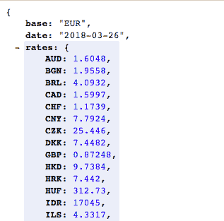
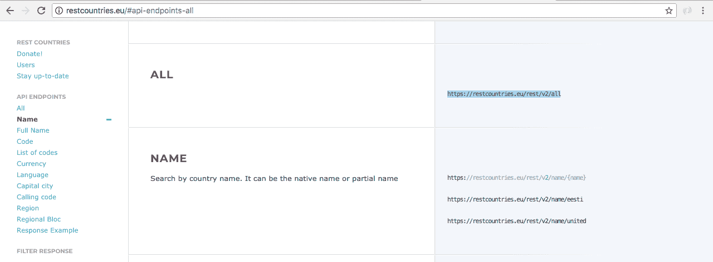
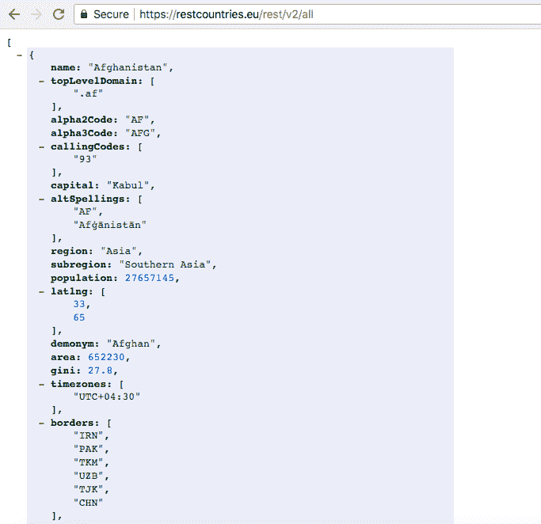
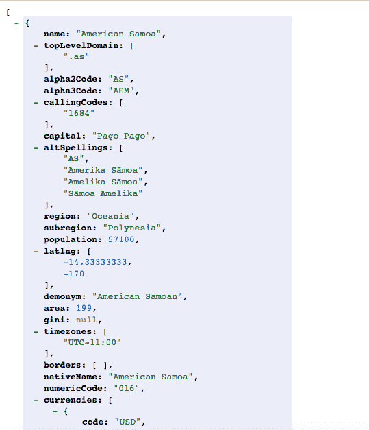
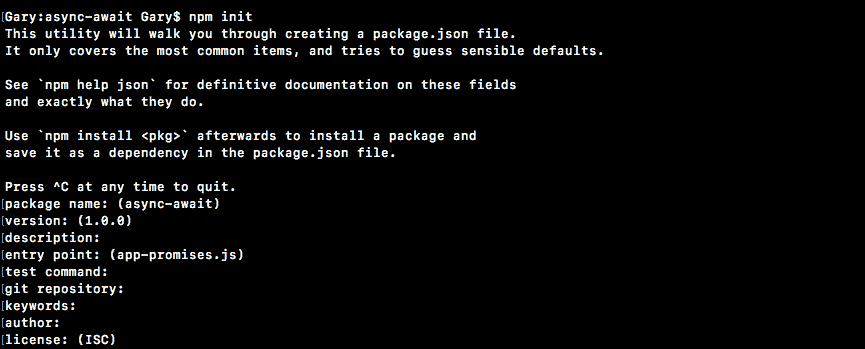

# 异步/等待项目设置

在这一章中，我们将学习异步/等待是如何工作的，它到底是什么，以及它在什么地方适合我们已经知道的节点。**异步/等待**是并非在所有版本的节点中都可用的功能。你必须使用 7.6 或更高版本。所以如果你在 V7 上，只要确保你在 7.6 或更高版本上。如果我们转到[nodejs.org](https://nodejs.org/en/)，您将会看到 v9 实际上已经推出，因此我们可以直接升级到 V9:


如果有更新的版本就完全没问题了。你也可以抓住它，只要它是 7.6 或更高。所以 6.10，不会有我们将要深入研究的语法。

# 在承诺中使用异步/等待特性

现在，在我们实际使用 async/await 之前，我们将继续运行一个只使用承诺的例子。我们将使用我们已经知道的技术来建立一个小的示例项目。现在，当人们听说 async/await 时，他们认为他们需要忘记所有关于回调和承诺的知识，这是不正确的。异步/等待不是第三种选择；这更像是对承诺的强化。我们将通过一个例子，使用你已经知道如何做的常规旧承诺。然后，我们将看到异步/等待如何增强代码。所以，为了开始，我们确实需要一个地方来放置这些东西。我要在我的桌面上做一个全新的项目，`async-await`。

我们可以在编辑器中打开它，并确保在您的终端中也能打开它。现在，我们的目标是做一个非常简单的项目。我们不需要任何节点模块，只需要一个文件。这个文件可以放在项目的根目录下，我们称之为`app-promises.js`:


这将是我们的应用程序版本，只使用承诺。现在，在我们继续之前，我想给你一个关于这一章将会是什么样子的快速想法。我们将经历三件不同的事情:首先，我们将创建一个非常人为的例子，这将允许我们学习如何在没有大量开销或负担的情况下使用异步/等待。所以，我们将创建常数，像`users`，它将只是一个对象和常数的数组，像`grades`；还有一个对象数组，这就是数据库的样子。

```js
const users = [];
const grades = [];
```

显然，从数组中访问某些属性并不是异步的，所以我们将继续创建一些新的承诺，将同步过程转变为异步过程。

# 设置 getUser 项目

因此，第一个项目不是很真实，但它将是学习新语法的好方法。然后我们将进入另一个小项目，在这个项目中，您需要从我挑选的一些 API 中进行两次实际的 API 调用。这些将是异步的，我们将在那里使用异步/等待。为了总结一下，我们将在 todo API 中添加一点异步/等待代码。

因此，为了开始，我们将通过这个非常人为的例子，我们可以从创建一些用户开始。每个用户对象都有一些属性；我们将从一个`id`开始，就像他们在一个真实的数据库中一样。我要给这个人一个`1`的 id:

```js
const users = [{
  id: 1,

}];

const grades = [];
```

我们还有一个名称，一个用户的字符串名称。我将调用第一个`Andrew`，然后我们将进入最后一个属性，一个`schoolId`，一个随着学生从一所学校转到另一所学校而改变的 ID。我们可以为这个再编一个 id。我将从`101`开始:

```js
const users = [{
  id: 1,
  name: 'Andrew',
  schoolId: 101
}];

const grades = [];
```

现在我们已经创建了用户号`1`‘让我们继续克隆他吧。我将复制它，抛出一个逗号并粘贴它，我们将为本例再创建一个用户。这个有一个`2`的`id`。我们会把名字从`Andrew`改成类似`Jessica`的，我们会给她取一个`999`的`schoolId`:

```js
const users = [{
  id: 1,
  name: 'Andrew',
  schoolId: 101
}, {
  id: 2,
  name: 'Jessica',
  schoolId: 999
}];

const grades = [];
```

现在我们已经有了一些用户，我们将在这一部分创建三个功能中的第一个。这个叫做常量`getUser`。它将获取用户的`id`，找到该用户，并返回用户对象:

```js
const grades = [];

const getUser = [id] => {
};
```

所以，如果`id`是`1`，我们将得到这个对象:

```js
const users = [{
  id: 1,
  name: 'Andrew',
  schoolId: 101
}, 
```

如果是`2`，我要拿回这个物体:

```js
{
  id: 2,
  name: 'Jessica',
  schoolId: 999
}];
```

如果是`3`或者其他不存在的 id，我实际上会抛出一个错误。因此，如果`id`与其中一个用户匹配，这将返回一个解决承诺，否则拒绝。

正如我提到的，这是一个人为的例子，所以我们将明确地创造新的承诺。我将创建一个新的承诺，传递那个承诺函数，正如你所记得的，这个函数用`resolve`和`reject`来调用:

```js
const getUser = (id) => {
  return new Promise((resolve, reject) => { 

 });
};
```

然后我们将继续在函数中添加一点逻辑。

# 数组查找方法

我们需要做的第一件事是尝试找到一个匹配，我将使用数组查找方法来完成这项工作。我们将创建一个`const user`来存储匹配，然后我们将它设置为等于`users.find`，传入我们的函数:

```js
const getUser = (id) => {
 return new Promise((resolve, reject) => { 
  const user = user.find(() = { 

  }); 
 });
};
```

现在这个函数对数组中的每一项都被调用一次。这是一个用户阵列，所以我们可以称之为单个项目`user`。如果我们返回`true`，那就要考虑匹配了。它将停止，并将该对象设置为用户。如果我们返回`false`，它将继续通过数组，如果没有匹配，未定义将是用户的值。因此，我们将返回`user.id`，检查它是否等于传入的`id`。

```js
const getUser = (id) => {
  return new Promise((resolve, reject) => { 
    const user = user.find((user) => {
   return user.id === id;
  });
 });
};
```

现在，我们有了一个很好的速记语法候选。我们只有一个返回一些值的箭头函数。它只是提供值并让它隐式返回:

```js
const getUser = (id) => {
 return new Promise((resolve, reject) => { 
   const user = user.find((user) => user.id === id); 
```

这里我们有完全相同的功能。现在，在我们继续使用它之前，让我们继续实际调用`resolve`或`reject`。如果有用户，我们要做一件事；如果没有用户，那没关系，我们只是去做别的事情。在`else`声明中，我们将呼叫`reject`，在 if 声明中，我们将呼叫`resolve`:

```js
const getUser = (id) => {
 return new Promise((resolve, reject) => { 
   const user = user.find((user) => user.id === id); 

   if (user) {
     resolve();
   } else {
     reject();
   } 
 });
};
```

现在，`resolve`只是让用户通过，对于`reject`，我们可以给出一个错误消息，帮助用户找出问题所在。我们可以添加`unable to find user with id of .`，然后，我们将把`id`放在它旁边。在模板字符串中，我将引用`id`。这是在`getUser`变量中传递的精确值。

```js
const getUser = (id) => {
  return new Promise((resolve, reject) => { 
    const user = user.find((user) => user.id === id); 

    if (user) {
      resolve(user);
    } else {
      reject('Unable to find user with id of ${id}.');
    } 
  });
};
```

现在，在我们继续实际运行之前，让我们快速使用`getUser`。我要用`2`的`id`给`getUser`打电话，应该会返回`Jessica`。我接着补充`catch`。在`catch`里面，我们可以`catch`那个错误。我们将获取错误并将其注销，`console.log(e)`。

```js
getUser(2).then().catch((e) => {
  console.log(e);
});
```

然后我们可以设置我们的`then`回调；在`then`中，我们将访问用户，现在，我们将注销它:

```js
getUser(2).then((user) => {
  console.log(user);
}).catch((e) => {
  console.log(e);
});
```

# 运行 getUser 对象测试

为了实际运行，我们将前往终端，并确保我们确实得到了预期的结果。我将使用`nodemon`来完成它。如果你刚刚更新了节点，它也更新了`npm`，说到底，这意味着你不再能够访问那些全局模块。您可能需要重新运行`npm install -g nodemon`才能使用`nodemon`命令。我将使用`nodemon`运行`app-promises.js`文件，在这里，我们有我们的输出:


我们有杰西卡打印的`999`的`schoolId`和`2`的`id`。那是因为我通过了`getUser`身份证中的`2`:

```js
getUser(2).then((user) => {
  console.log(user);
}).catch((e) => {
  console.log(e);
});
```

如果我把这个切换到`1`，我应该会看到`Andrew`。我确实看到了`Andrew`。最后，让我们继续传递一个不像`21`那样存在的 ID:

```js
getUser(21).then((user) => {
  console.log(user);
}).catch((e) => {
  console.log(e);
});
```

就在这里，我得到了信息:


这是我们将要建造的三个项目中的第一个。让我们继续，很快淘汰另外两个。

# 建立 getGrades 项目

这将设置我们使用`const getGrades`实际探索异步/等待语法。`getGrades`虽然会和`getUsers`非常相似。它将使用等级数组，而不是用户数组:

```js
const getGrades = () => {

};
```

现在，我们没有设置任何等级，所以让我们继续设置一些。

# 为“获取成绩”项目创建成绩

我们将继续创造几个等级。首先，让我们用`1`的`id`来创建一个等级。现在，这个`1`将被附加到`Andrew`上，所以我们将继续使用`schoolId`来完成。`schoolId`，在本例中为`Andrew`，为`101`。然后，我们要放入实际的`grade`。在这种情况下，我会继续给自己一个`86`:

```js
const grades = [{
  id: 1,
  schoolId: 101,
  grade: 86
}];
```

这是等级`1`；让我们继续创造三个等级。我要复制它，扔进一个逗号，然后粘贴两次。这个会有一个`2`的 id。我们可以把这个和`Jessica`联系起来，所以我们给她`999`的`schoolId`值。她真的很聪明，所以我们给她一个`100`。最后`3`的 id:我们将这个和`Andrew`关联起来，接下来，我们给他一个`80`的等级:

```js
const grades = [{
  id: 1,
  schoolId: 101,
  grade: 86
}, {
  id: 2,
  schoolId: 999,
  grade: 100
}, {
  id: 3,
  schoolId: 101,
  grade: 80
}];
```

因此，我们已经有了一些分数，目标是根据某个学生的`schoolId`返回他们的所有分数。如果我传入`101`，我会期望一个数组返回与安德鲁关联的对象。如果我传入`999`，我会期望一个数组返回与杰西卡相关联的数组，如果我传入一个类似`55`的值，该学生将没有分数，因此我们将继续返回一个空数组。

# 回报新的承诺

现在，在`getGrades`变量中，我们将得到用于查找的`schoolId`。然后我们将继续前进，并返回一个新的承诺；这都是人为例子的一部分，`resolve`和`reject`是我们的两个论点:

```js
const getGrades = (schoolId) => {
  return new Promise((resolve, reject) => {

  });
};
```

然后，就在这里，我们继续`resolve`过滤等级数组，也就是`grades.filter`。我们将通过传递一个箭头函数来过滤这个。它将被单独的等级调用，而不是用户，然后我们将继续并隐式地返回一些东西。如果我们返回`true`，这将被认为是一场比赛，分数将被解决。如果我们返回`false`，该等级将从解析的数组中移除。在这种情况下，如果`grade.schoolId`等于调用函数的`schoolId`，我们希望保持等级。

```js
const getGrades = (schoolId) => {
  return new Promise((resolve, reject) => {
    resolve(grades.filter((grade) => grade.schoolId === schoolId));
  });
};
```

这种情况下，那就是`getGrades`了；我们可以继续测试。我要打电话给`getGrades`而不是`getUser`。我将传入一个有效的`schoolId`如`101`，我们将有`grades`而不是用户，然后:

```js
getGrades(101).then((grades) => {
  console.log(grades);
}).catch((e) => {
  console.log(e);
});
```

如果我保存这个，我们会得到什么？我们得到一个包含两个对象的数组，正如预期的那样:


我们有`Andrew`、`86`和`80`的所有等级。我要去前面通过`999`；我们拿到了杰西卡的成绩，最后，我们通过了`12`:

```js
getGrades(12).then((grades) => {
  console.log(grades);
}).catch((e) => {
  console.log(e);
});
```

如果我传入`12`，我们会得到一个空数组，这正是我所希望的。只剩下一个功能，然后我们将完成这一部分，我们可以继续下一个。

# 设置 getStatus 项目

这个项目将被称为`const getStatus`。`getStatus`将是一个函数，它将为您试图获取其状态的用户获取`userId``id`。现在，这个项目的目标是返回一个字符串。我们先从他们的名字开始，比如`Andrew`，然后再加一点信息；`Andrew has a`，在这种情况下，我在类中有一个`83`平均值(所以我取`80`，我加上`86`，我除以`2`生成那个平均值)。所以，我们想在实际运行完`getUser`和`getGrades`之后，从`getStatus`解析以下字符串:

```js
const getGrades = (schoolId) => {
  return new Promise((resolve, reject) => {
    resolve(grades.filter((grade) => grade.schoolId === schoolId));
  });
};

// Andrew has a 83% in the class
const getStatus = (userId) => {

};
```

# 解析获取状态字符串

我们要先解决这个问题，然后就完事了。这意味着我们将用`userId`来称呼`getStatus`。我们将恢复状态，并注销状态:

```js
getStatus(1).then((status) => {
  console.log(status);
}).catch((e) => {
  console.log(e);
});
```

现在开始，我们需要做什么？首先，我们必须继续和`return`保持承诺链的活力，因为我们用`getStatus`函数附加了然后和`catch`回调。

接下来，我们将呼叫`getUser`。在实际使用`getGrades`之前，我们要先拿着`userId`，找到用户对象，拿到他们的`schoolId`。我们还想确保能够访问消息的名称，因此我们需要该对象的两条信息:`getUser`和`userId`。我们将添加我们的`then`回调。在这个回调中，我们将访问该用户对象，其中包含一些有用的信息。其中一条信息将允许我们实际上调用`getGrades`。我要去`return getGrades`，就在这里，我们要传入学生证，那就是`user.schoolId`:

```js
// Andrew has a 83% in the class
const getStatus = (userId) => {
  return getUser(userId).then((tempUser) => {
    return getGrades(user.schoolId);
  })
};
```

所以现在我们有了`getGrades`的召唤，接下来我们就可以进入那些等级了。`getGrades`承诺成功回调将获得`grades`阵。然后我们可以继续实际创建一个`average`变量，我们马上就要做，然后我们可以`return our string`。这就是这个函数的目标，但这也是我们在使用 promises 时遇到的第一个问题:

```js
// Andrew has a 83% in the class
const getStatus = (userId) => {
  return getUser(userId).then((tempUser) => {
    return getGrades(user.schoolId);
  }).then((grades) => {
    // average
    // return our string 
  });
};
```

我们有`getStatus`承诺链；为了真正开始另一个承诺，我们必须有一个承诺，在一天结束时，我想用两者的价值观做一些事情。嗯，我们不能；我们无法访问第二个`then`功能内的用户。它是在另一个函数中创建的，第一个`then`回调，这是一个相当常见的问题。

那么，我们如何解决这个问题呢？我们有几种方法可以做到这一点。大多数都是丑陋的变通方法。就在`getStatus`变量下面，我可以做一个名为`user`的变量，我会先把它设置为 undefined。

```js
const getStatus = (userId) => {
  var user;
```

然后，在第一次`then`回调的时候，我会在这个函数运行的时候给它一个值。现在，我不能对同一件事有两个变量。如果我试着输入`user = user`，我们会遇到一些问题:

```js
const getStatus = (userId) => {
  var user;
  return getUser(userId).then((user) => {
    user = user;
```

它将采用`user`值，并在随后的回调中将其设置为用户值。它根本不会使用用户变量。因此，我们必须添加另一个小变通方法:`tempUser`。

```js
const getStatus = (userId) => {
  var user;
  return getUser(userId).then((tempUser) => {
    user = tempUser;
```

然后我们继续设置`user = tempUser`，这在技术上是可行的。我们现在可以访问用户变量，我们可以完成一些事情。

# 计算平均值

所以，我们可以在第二个`then`回调函数中计算我们的`average = 0`的平均值:

```js
// Andrew has a 83% in the class
const getStatus = (userId) => {
  var user;
  return getUser(userId).then((tempUser) => {
    user = tempUser;
    return getGrades(user.schoolId);
  }).then((grades) => {
    var average = 0;

    // average
    // return our string
  });
};
```

现在，我们在整个课程中一直使用 const。我们实际上可以将`var`切换到`let`；`let`ES6 相当于`var`，所以这是一个我们可以改变值的变量:

```js
// Andrew has a 83% in the class
const getStatus = (userId) => {
  let user;
  return getUser(userId).then((tempUser) => {
    user = tempUser;
    return getGrades(user.schoolId);
  }).then((grades) => {
    let average = 0;

    // average
    // return our string
  });
};
```

现在我们将从平均值`0`开始，然后继续计算更好的平均值，如果有`grades` : `grades.length`。如果`grades.length`大于`0`，我们将继续进行计算。

```js
 }).then((grades) => {
   let average = 0;

   if (grades.length > 0) {

   }
   // average
   // return our string
});
```

现在，我们将在这里使用一些数组方法。首先，我们将设置平均值等于某个值。我们将通过获取对象数组并将其简化为数字数组来开始。

我们将使用地图来实现这一点；那是`grades.map`。在这里，我们将继续进入个人等级，我们要做的就是隐式返回`grade.grade`。

```js
  if (grades.length > 0) {
    average = grades_map((grade) => grade.grade)
  }
```

因此，我们有一个单独的`grade`对象，我们试图访问它的`grade`属性。此时，我们有一组数字。我们需要把这些数字转化成一个和，然后除以数组的长度。我们将在这里使用`reduce`，所以我们在一组数字上称`reduce`。`reduce`的工作原理与您过去可能见过的其他一些数组方法略有不同。这个需要两个参数，`a`和`b`；

```js
if (grades.length > 0) {
  average = grades.map((grade) => grade.grade).reduce((a, b) => {

  });
};
```

所以，第一次通过的时候，它会取前两个等级，我们可以用这些等级做一些事情。我们想做什么？我们想返回`a + b`。然后它会取前两个等级的和，它会再次调用 reduce 函数，把那个和放入第三个等级。我们将利用`a + b`为新的`b`增加价值，然后我们将继续产生这个总和。现在，你实际上可以简化`a + b`:

```js
if (grades.length > 0) {
  average = grades.map((grade) => grade.grade).reduce((a, b) => a + b); 
}
```

现在，光是这个就给了我们总和，所以在`Andrew`的情况下，我们还没有计算出平均值`83`；我们刚刚把这两个数字加起来。你也要把这个除以`grades.length`；这就是平均值。我们可以通过打印`average`变量`console.log (average)`来进行测试。

```js
  if (grades.length > 0) {
    average = grades.map((grade) => grade.grade).reduce((a, b) => a + b) / grades.length; 
  }

  console.log(average);
});
```

我要去救它。我们有`getStatus`和`1`的`getStatus`。很好，我们可以继续使用。在终端，我们得到`83`打印，这是正确的平均值。


如果我继续为用户`2`重新运行它，我们会得到`100`打印。一切都很顺利；`undefined`即将上线，因为我们没有任何东西返回，所以状态等于`undefined`，打印在`console.log`声明中。因此，我们不要只是将平均值转储到屏幕上，而是继续返回我们的模板字符串。这是我们在这一部分要做的最后一件事。

# 返回模板字符串

就在平均值的`console.log`语句上方，我们将遵循从名称开始的格式，即`user.name`。然后我们要进入下一部分，有一个，后面是他们的年级。那就是`average`。我们会在上课时间把`%`扔在它后面:

```js
return `${user.name} has a ${average}% in the class.`;
```

现在我们正在返回一些东西，无论谁调用`getStatus`，这个值都是可访问的。在这种情况下，就发生在这里。在终端中，我们看到`Jessica has 100% in the class`打印到屏幕上:


如果我继续到`1`，我们看到`Andrew`有一个`83`，如果我输入一些其他的`id`，我们可以看到`Unable to find user with the id of 123`打印。这就是我们设计的初始示例。我知道这里没有太多有趣的东西，但我保证有一个例子可以使用，这将使理解异步/等待变得更加容易。因此，下一节的目标是获取代码片段，并使用这种新语法将其简化为大约三行代码:

```js
// Andrew has a 83% in the class
const getStatus = (userId) => {
  let user;
  return getUser(userId).then((tempUser) => {
    user = tempUser;
    return getGrades(user.schoolId);
  }).then((grades) => {
    let average = 0;

    if (grades.length > 0) {
      average = grades.map((grade) => grade.grade).reduce((a, b) => a + b) / grades.length;
    }

    return `${user.name} has a ${average}% in the class.`;
  });
};
```

这将是三行代码，更容易阅读和使用。它将看起来像同步代码，而不是回调和承诺链。

# 异步/等待基础

在本节中，您将最终开始使用新的异步/等待功能。我们将创建另一个版本的`getStatus`函数并将其称为`getStatusAlt`，这样我们就可以继续定义它:一个常量`getStatusAlt`。现在，它仍然是一个函数，所以我们将从创建一个箭头函数(`=>`)开始。我们仍然要接受一个论点，所以我们将定义`userId`:

```js
const getStatusAlt = (userId) => {

};
```

不过，现在我们要改变一下。我们将使用新的异步/等待功能，而不是使用旧的示例。为了探究这一点，让我们暂时注释掉`getStatus` - `then`和`catch`块代码。我们将通过调用`getStatusAlt`来重新创建它，而不是调用`getStatus`，但我确实想保留旧代码，以便我们可以直接比较和对比差异。

新的异步/等待功能将允许我们以看起来像同步代码的方式编写旧代码，这意味着我们将能够避免像`then`回调、承诺链接和变通办法这样的事情。有了 async/await，我们将能够避免所有这些东西，创建一个更容易阅读、修改、使用和测试的函数。现在，`getStatusAlt`要以超级无聊的方式开始了。

我们将返回一个字符串:

```js
const getStatusAlt = (userId) => {
  return 'Mike';
};
```

这是 JavaScript `101`的东西。你会期待`Mike`回来。如果我用`consult.log`，他的名字应该会通过`getStatusAlt`弹出来。

```js
const getStatusAlt = (userId) => {
  return 'Mike';
};

console.log(getStatusAlt());
```

让我们继续完成这个工作，所以我们将保存文件，`nodemon`将重新启动，就这样。我们已经将`Mike`打印到屏幕上:


这正是我们所期望的。现在，使用异步/等待，我们实际上将我们的函数标记为特殊函数。我这里有几个功能。我们将把`return 'Mike'`标记为一个特殊的异步函数。所以在未来，`async/await`会是两个字`async`和`await`。这些不仅仅是单词，而是我们将要输入的实际关键词。

# 使用异步函数

第一个，`await`，最终将在我们的`async`函数中使用，但是，在我们可以使用`await`之前，我们必须将该函数标记为`async`，所以我们将首先使用它。我们将探索它，然后我们将继续`await`。在`getStatusAlt`变量行中，我们要做的就是在我们的参数列表前添加`async`一个空格:

```js
const getStatusAlt = async (userId) => {
  return 'Mike';
};
```

现在，这实际上会改变`console.log`的工作方式；为了探索这一点，我们要做的就是保存文件，看看我们会得到什么。你可以看到我们现在不是拿回绳子`Mike`，而是拿回一根`Promise`:


我们得到了一个解决字符串`Mike`的承诺，所以这就引出了常规函数和`async`函数之间的第一个大区别。正则函数返回字符串，字符串返回；`async`函数总是返回承诺。如果你从一个`async`函数中返回一些东西，它实际上是返回一个承诺，并解析这个值。所以这个函数相当于下面的代码。你不必把这个写出来；这只是为了得到想法。这相当于创建一个函数，该函数返回一个新的承诺，该新的承诺得到`resolve`和`reject`，然后用`Mike`调用 resolve:

```js
() => {
  return new Promise((resolve, reject) => {
  resolve('Mike')
  })
}
```

这两个是相同的，它们具有完全相同的功能。我们创造一个新的承诺，我们解决`Mike`或者我们使用一个`async`函数，它只是返回一些东西。

So, that is lesson one: when you have an `async` function, whatever you return is actually just going to get resolved, which means that we can switch up this usage.

代替`console.log`的说法，我准备叫`getStatusAlt`。这一次我们得到了承诺，我们知道这一点，所以我们可以只使用`then`回调。我们要拿回什么？我们将返回作为解析值的返回值。

如果我回到字符串，我会得到一个字符串回来；这里有一个数字，我会得到一个数字；一个布尔，一个对象，一个函数；您从这个函数中显式返回的任何内容都将像解析过一样可用，这意味着我可以创建一个像`console.log(name)`这样的名称变量:

```js
const getStatusAlt = async (userId) => {
  return 'Mike';
};

getStatusAlt().then((name) => {
  console.log(name);
});
```

现在，我们要回到里面去做什么？我们就要再次找回`Mike`了，普通的素色老弦。因为我们添加了一个基于承诺的链接，然后我们得到名字并打印出来，这里`Mike`再次打印:


那么，如果返回值相当于解析，我们怎么拒绝呢？

# 使用异步函数拒绝错误

如果我想让它拒绝像(`'This is an error'`)这样的错误，我该如何使用新的`async`功能来完成呢？我们所做的就是使用标准的 JavaScript 技术抛出一个新的错误。抛出一个新的错误消息，(`'This is an error'`):

```js
const getStatusAlt = async (userId) => {
  throw new Error('This is an error');
  return 'Mike';
};
```

这相当于在新的《无极》中使用`reject`参数。当您从`async`函数抛出一个新的错误时，这与拒绝某个值完全相同。因此，在这种情况下，我们可以通过添加一个`catch`来继续使用这个错误，就像我们希望它是一个常规的旧承诺一样。我们要找回错误，如果出现错误，我会用`console.log`打印到屏幕上:

```js
getStatusAlt().then((name) => {
  console.log(name);
}).catch(e) => {
  console.log(e);
});
```

它总是会发生，因为我把它扔在线上`1`。如果我保存文件，`nodemon`重新启动，我们会将`Error: This is an error`打印到屏幕上:


因此，在我们进一步使用 wait 之前，这是您需要了解的关于`async`函数的前两件重要事情。返回某物相当于解决，抛出错误相当于拒绝；我们总能得到回报。

# 使用等待功能

至此，我们只使用了功能的一半。我们已经使用了`async`部分，单独使用并不是特别有用。当我们将其与`await`结合时，它会变得非常有用，所以让我们继续并开始了解它。

`await`功能将允许我们重新引入其他功能，`getGrades`和`getUser`。我们将继续使用`await`，然后我们将讨论到底发生了什么。所以，目前，请耐心等待，只需键入以下行:`const user =`，我们将把它设置为等于`await`关键字。我们一会儿再谈这个。我们将呼叫`getUser`并且我们将通过`userId`。让我们开始分解这条线:

```js
 const getStatusAlt = async (userId) => {
   const user = await getUser(userId);
};
```

我们以前也这样做过；我们用`userId`呼叫`getUser`。它回报了一个承诺。我们正在创建一个新的变量 user，它是一个常量；这是新的`await`部分。所以`await`关键字，正如我之前提到的，必须在`async`函数中使用。我们符合这个标准。我们有一个`async`功能，这意味着我们可以在里面使用等待。

我们在承诺之前使用`await`，所以这里我们得到一个承诺。所以，我们在等待对`resolve`或`reject`的承诺。如果承诺被解析，这个表达式的结果将是解析值，这意味着解析值将被存储在用户变量中。如果承诺被拒绝，这将相当于抛出一个错误，这意味着永远不会创建任何用户变量。该函数将停止执行，我们将在`catch`中得到该错误。

让我们继续玩这个吧。我要做的是把一个`id`传入`getStatusAlt`。让我们继续使用`Jessica`；我们要做的就是`console.log(user)`到屏幕。我们想看看用户等于什么。现在，`nodemon`将在后台重启，我的`nodemon`之前已经清空了:


就在这里，我们的对象有一个`2`的`id`，一个`Jessica`的名字，和一个`999`的学校 id。

现在，没有`await`，我们会得到一个承诺；有了`await`，我们实际上能够拿回那个值，这相当于我们之前所做的。这就相当于我们可以访问用户，并使用它做一些事情，但是，使用`async/await`，我们能够以一种看起来非常同步的方式做到这一点。

现在，我们可以运用同样的技巧来获得分数。在`user`常量旁边，我们要做一个名为`grades`的常量。我们想要回那些成绩。我们不想做的是创建愚蠢的临时变量，添加复杂的链接和嵌套。我们只想拿到分数，所以我们要等待以下承诺，要么`resolve`要么`reject`。对于从`getGrades`回来的，我们传入一个有效的学校 id，`user.schoolId`:

```js
const getStatusAlt = async (userId) => {
  const user = await getUser(userId);
  const grades = await getGrades(user.schoolId);

  console.log(user, grades);
};
```

这将返回`grades`数组，因为该用户可以将它们转储到屏幕上。

所以，在终端中，我们得到了`Jessica`的对象和等级:


她只有一个等级，所以我们有一个里面只有一个对象的数组。我们得不到承诺；我们得到了一个常规的旧数组。`Andrew`也是如此；他会有这两个等级:

```js
getStatusAlt(123).then((name) => {
  console.log(name);
}).catch((e) => {
  console.log(e);
});
```

他们都会回来，如果我把它切换到无效的`id`，我们会得到我们的错误:`Unable to find user with an id of 123`:


那是因为`await`函数拒绝，相当于抛出一个错误。当我们通过`catch`从`async`函数抛出一个错误时，我们看到了这一点。因此，在这一点上，我们有我们的用户，我们有我们的成绩，我们准备好进入最后一步，这是真正重要的东西。到目前为止，我们只是把数据取出来，取了几行需要我们嵌套东西的代码。在这一点上，我们可以对代码片段取平均值，就像它现在的样子:

```js
let average = 0;

if (grades.length > 0) {
  average = grades.map((grade) => grade.grade).reduce((a, b) => a + b) / grades.length;
}

return `${user.name} has a ${average}% in the class.`;
```

这段代码依赖于一个`user`变量，我们有，和一个`grades`变量，我们也有。我们可以把它复制到`async`功能中，如下所示:

```js
const getStatusAlt = async (userId) => {
  const user = await getUser(userId);
  const grades = await getGrades(user.schoolId);
  let average = 0;

  if (grades.length > 0) {
    average = grades.map((grade) => grade.grade).reduce((a, b) => a + b) / grades.length;
  }

  return `${user.name} has a ${average}% in the class.`;
};
```

现在，我们设置我们的平均变量。如果有等级，我们计算平均值，并返回我们的状态:

```js
getStatusAlt(2).then((status) => {
  console.log(status);
}).catch((e) => {
  console.log(e);
});
```

此时，我们可以使用状态，并且可以使用`console.log`语句打印它。让我们把这个变回一个有效的`id`，或者`1`或者`2`，一些确实存在的`id`。这一次，当 JavaScript 运行通过`getStatusAlt`时，实际上是要返回正确的状态:`Andrew has an 83 in the class`或`Jessica has a 100 in the class`:


我们能够在没有一个回调、没有链接、没有嵌套、只有看起来像同步代码的常规旧代码的情况下完成所有这些。

这段代码比我们上面的代码更易读、更易维护、更易理解。使用`async` / `await`，我们将能够做到这一点。我们将能够编写更好、更简洁的基于承诺的代码。现在，你会注意到我没有在上面的函数中使用`await`。没有必要，因为我们不需要`async`在它们里面。还有一点需要注意，没有顶级`await`。你必须在一个`async`函数中使用`await`，所以，在我们的例子中，这意味着我们在最后确实使用了一点链，但是当我们使用复杂的链时，我们能够使用`async/await`来完成工作。

在这一点上，我不指望你能自己使用`async` / `await`。我们将使用真实的 API 来运行另一个示例，它将为我们提供更多的真实体验。我很兴奋能做到这一点。

# 一个真实的例子

在这一节中，我们将继续讨论我们设计的例子，我们将看一个使用两个真实 HTTP APIs 的例子。在此之前，需要注意的是，箭头函数(`=>`)并不是唯一支持`async`的函数。我刚好用了一个箭头函数(`=>`)。我也可以使用带有`function`关键字的 ES5 函数；这也很有效:

```js
const getStatusAlt = async function (userId) {
  const user = await getUser(userId);
  const grades = await getGrades(user.schoolId);
  let average = 0;
```

我可以保存文件，我仍然会得到`Jessica has 100%`打印:


我也可以`async`一个 ES6 对象方法，但是我这里还是要坚持一个箭头函数(`=>`)。现在，我们将把这个文件留在尘埃中，我们将进入一个全新的文件，用于我们的真实例子。

# 使用异步/等待函数创建货币转换器

这一个将被称为`currency-convert.js`，正如你可能猜到的名字，我们将创建一个货币转换器。

本质上，这只是一个接受三个参数的函数。我们将从开始使用的货币的货币代码开始；在这种情况下，假设我有美元。然后是我们试图转换的货币代码；假设我要去加拿大，我想看看我的钱值多少钱；以及我们想要换算的金额。

所以，这本质上是在要求加拿大版的`23 USD`:

```js
// USD CAD 23
```

我们将能够使用任何我们想要的代码和任何我们想要的值。现在，为了获得所有这些信息，我们将使用两个 API。我们基本上会说:

```js
// USD CAD 23
// 23 USD is worth 28 CAD. You can spend these in the following countries:
```

然后我们会列出所有接受加元的国家。现在，为了实际获得所有这些信息，我们将使用这两个 API，我确实想在 Chrome 中探索一下。然后，我们将安装 Axios，发出请求，并将所有这些都集成到货币转换器中。

# 探索货币汇率应用编程接口

我们将使用的第一个应用编程接口在 [fixer.io](http://fixer.io/) :


这个将给我们当前的货币数字，所以我们可以得到这些汇率。如果我们去他们的网站，他们有一个很好的使用页面。你可以点击网址；它将向您显示如果您发出一个 HTTP 请求，会返回的确切数据。

这个应用编程接口和我们将使用的另一个应用编程接口，它们不需要身份验证，因此我们将能够在没有太多麻烦的情况下集成它们。在这里，我们看到基础货币是欧元，我们可以看到欧元在其他货币中的价值。所以€1 号目前价值 1.2411 美元或 1.5997 加元:



这是我们将使用的第一个端点，实际上我们将使用一个替代的跟随。在这里，我们可以指定基本查询参数，该参数将从我们选择的货币开始。这是我们兑换的货币，然后我们得到汇率。

所以，如果我想把美元兑换成加元，我会得到基本的美元兑换图。我会找到这个数字，然后把`23`乘以这个数字，或者我试图转换的任何值。这是第一个应用编程接口；让我们继续抓取网址，在浏览器中打开它，我们将保持不变。

我们将使用的另一个应用编程接口，你可以在[rest counters . eu](http://restcountries.eu/)找到。这个包含了一些关于国家的有用信息。如果您转到“全部”示例，我们可以获得以下网址:



我们可以在浏览器中打开它，我们可以看到 API 返回的国家和国家数据的广泛列表，从`Afghanistan`开始:关于它的各种东西，顶级域名，可选拼写，`regions`，lat 和 long，`population`，很多非常好的信息:



它还包括那些货币代码，所以我们实际上将使用不同的端点。它们支持货币端点:


这可以让你找到使用特定货币的国家，所以让我们获取这个网址，并在浏览器中打开它。这里我们使用`cop`；让我们把它换成`usd`:


现在，有多个国家使用美元。我们有`American Samoa`。

在下面，如果我们沿着列表向下滚动，我们会得到其他的东西；例如，这里有津巴布韦。然后，我们有美利坚合众国——这是一个明显的例子——特克斯和凯科斯群岛:



所以有相当多不同的地方使用美元。如果我们换成`cad` -加拿大；只有一个:


因此，使用这两个端点，我们将能够转换货币，并计算出哪些国家支持该货币。我们将把所有这些连接在一起，然后我将让你自己实际使用异步/等待来获取这些信息。

# 在我们的应用程序中利用 axios

让我们继续，通过关闭、清除输出和安装必要的依赖项，在终端内部重新开始。我要跑`npm init`:



我们可以使用默认值生成一个快速的`package.json`文件，他们将使用`npm install axios`。目前版本的 Axios 是`0.18.1`，我们来掷`save`旗:

```js
npm install axios@0.18.0 --save
```

它将确保说，作为一个依赖，我们去那里。一切都在按预期进行。现在我们可以清除这个输出，实际上我们可以在应用程序中利用 Axios。所以，让我们从第一个开始。我们将继续设置一个函数，调用 Fixer 并获取汇率。

# getExchangeRate 函数

为此，在 Atom 内部，我们将通过创建一个`const axios`来启动事情；我们将去`require axios`，然后我们将为我们的两个功能之一制作`const`。这是第一个端点`getExchangeRate`。现在，`getExchangeRate`将获取两条信息:`from`货币代码和`to`货币代码:

```js
// USD CAD 23
// 23 USD is worth 28 CAD. You can spend these in the following countries:

const axios = require('axios');

const getExchangeRate = (from, to)
```

这将是一个函数。我们要做的就是使用`axios`。这是`axios.get`，我们将传入我刚刚从浏览器中复制的网址:

```js
// USD CAD 23
// 23 USD is worth 28 CAD. You can spend these in the following countries:

const axios = require('axios');

const getExchangeRate = (from, to) => {
  axios.get(`http://api.fixer.io/latest?base=USD)
}
```

现在，我们希望将基数设置为我们来自的任何货币。所以我可以继续使用一个模板字符串，把静态的基值换成动态的，访问`from`和`then`函数。我们将很快使用`then`。我们将在这里使用`then`来操纵值。这将通过一堆关于 HTTP 请求的信息来回报 Axios 的承诺。`getExchangeRate`的来电者不在乎这些。他们甚至不应该知道发出了 HTTP 请求。他们需要的只是一个数字，所以这正是我们要给他们的。

在`then`回调中，我们将能够访问`response`，在`response`上，我们将能够获得该货币代码。我们要去`return response.data`。这让我们进入了 JSON 对象。现在，在这里我们有一个`rates`对象，它是键-值对，其中键是货币，所以我们确实想访问`rates`，我们想得到无论`to`变量是什么的汇率:

```js
// USD CAD 23
// 23 USD is worth 28 CAD. You can spend these in the following countries:

const axios = require('axios');

const getExchangeRate = (from, to) => {
  axios.get(`http://api.fixer.io/latest?base=USD).then((response) => {
    return response.data.rates[to]
  });
}
```

所以，在这种情况下，我们会有美元对加元。我们会用`USD`来调用这个 URL，然后我们会得到这个值:`1.2889`。这就是我们要返回的确切值。让我们继续在下面测试这个，`getExchangeRate`。我要把`USD`换成`CAD`(加拿大)元，`then`我们会拿回我们的`rate`并且我们可以注销，`console.log(rate)`:

```js
// USD CAD 23
// 23 USD is worth 28 CAD. You can spend these in the following countries:

const axios = require('axios');

const getExchangeRate = (from, to) => {
  return axios.get(`http://api.fixer.io/latest?base=USD).then((response) => {
    return response.data.rates[to]
  });
};

getExchangeRate('USD', 'CAD').then((rate) => {
  console.log(rate);
});
```

我要继续保存这个。在后台，在终端内部，我们可以再次启动`nodemon`，我们将运行`currency-convert`文件。就在这里，我们得到的数值`1.2889`是当前的货币汇率:


我可以把`EUR`写成代码:

```js
getExchangeRate('USD', 'EUR').then((rate) => {
  console.log(rate); 
});
```

我可以算出欧元汇率是多少，所以我们开始吧:


我们的第一个都被淘汰了。现在，我们要快速创建的另一个将是`getCountries`。

# getCountries 函数

`getCountries`函数将获得一个国家列表，只有他们的名字，我们将通过`currencyCode`获得:

```js
const getCountries = (currencyCode) => {

};
```

这一个，就像`getExchangeRate`一样，也是要从`axios.get`返回一个承诺，我们想要获取的 URL 就在浏览器里面住着:


所以，这里我们有我们的网址。我们有一个地方可以倾倒我们的`currencyCode`，所以我们可以把它敲掉。这将是一个模板字符串，我们将去掉`CAD`并注入`currencyCode`的论点:

```js
const getCountries = (currencyCode) => {
  return axios.get(`https://restcountries.eu/rest/v2/currency/${currencyCode}`)
};
```

现在，在这一点上，再一次，我们确实想对数据做一点操作，所以我可以继续使用`then`。在`then`回调中，我可以继续访问`response`。我想用`response`做的是我只想循环它。我想找出所有支持我的货币的国家，然后我想返回一个数组:

```js
const getCountries = (currencyCode) => {
  return axios.get(`https://restcountries.eu/rest/v2/currency/${currencyCode}`).then((response) => {

  });
};
```

现在你知道我们会把所有这些国家夺回来，对吗？所以，对于`cad`我们有一个数组，里面有单个对象。对于`usd`，我们有一个内部有多个对象的数组，所以我们将获取这个对象数组，并将其转换为字符串数组。

我们将从`American Samoa`开始:


为此，我们将使用`map`。回到 Atom 内部，我们可以通过返回`response.data`来快速解决这个问题，这是一个数组，这意味着它可以使用`map`方法。然后我们将使用`map`。每个单项都将成为一个`country`；每个`country`都有一个`name`属性，所以我们可以返回`country.name`，给我们一个支持`currency`的国家名称数组。在这种情况下，我们可以通过隐式返回`country.name`来简化这一点。现在，让我们在这里测试一下。`getCountries`。我们将取回`countries`并将`countries`转储到屏幕上。我们只提供一个参数:

```js
const getCountries = (currencyCode) => {
  return axios.get(`https://restcountries.eu/rest/v2/currency/${currencyCode}`).then((response) => {
    return response.data.map((country) => country.name);
  });
};

getCountries('USD').then((countries) => {
  console.log(countries);
});
```

所以，如果我们保存这个并在终端中检查，我们应该能看到什么会回来。这里有一个列表，列出了我们可以使用该货币的所有国家，在本例中为美元:


我们可以去`EUR`看看哪些国家支持:

```js
getCountries('EUR').then((countries) => {
  console.log(countries);
});
```

如果我们保存文件，我们马上就能把那个列表拿回来。

这里有所有支持它的国家，从`Belgium`一直到`Zimbabwe`和`Spain`的一切:


所有这些国家都包括在内。接下来，是 CAD:

```js
getCountries('CAD').then((countries) => {
  console.log(countries);
});
```

你应该有一个，加拿大，它确实出现在那里:


因此，在这一点上，我们拥有了实际完成工作所需的所有数据。因此，我们将一起在我们的承诺中构建这个函数的等价物，您将构建出`async`函数。

在这里，让我们开始吧:`const convertCurrency`。这将是我们将要建立的功能。这是你最终将制作的`async`，但是，目前，我们将把它作为一个常规的箭头函数(`=>`)。我们将获得我们要转换的货币代码`from`我们要转换的货币代码`to`，以及我们要转换的金额。

```js
const getCountries = (currencyCode) => {
  return axios.get(`https://restcountries.eu/rest/v2/currency/${currencyCode}`).then((response) => {
    return response.data.map((country) => country.name);
  });
};

const convertCurrency = (from, to, amount) => {

};
```

在这里，我们可以通过让这些国家。我要去`return getCountries`。我会用我们要转换成的货币来称呼它，然后我们可以锁定`then`并且我们会拿回`countries`名单。接下来，我们将回电给`getExchangeRates` -传入`from`和`to`，我们也将作为承诺回电，这意味着我们可以再打一个`then`电话。在这里，我们将得到这个比率:

```js
const convertCurrency = (from, to, amount) => {
  return getCountries(to).then((tempCountries) => {
    return getExchangeRate(from, to);
  }).then((rate) => {

  });
};
```

现在，在`then`回调中，我们可以继续实际计算我们要计算的所有东西。在这种情况下，我们将生成我刚才提到的长字符串。

让我们首先从创建一个`const`开始；这个常量将被称为`exchangedAmount`。我们要做的就是把用户传入的`amount`乘以交易所`rate`；因此，在这种情况下，我们将成功地从加元兑换美元。现在，在下面，我们可以开始研究那根弦了。我们要去`return`一个模板字符串，在这里，我们要做很多事情。

首先，我们将从`amount`开始。你要来的货币`from`中的`amount`是`worth`。然后我们将把`amount`放入你要使用的货币中，它是`exchangedAmount`。然后我们再掷`to`:

```js
const convertCurrency = (from, to, amount) => {
  return getCountries(to).then((countries) => {
    return getExchangeRate(from, to);
  }).then((rate) => {
    const exchangedAmount = amount * rate;

    return `${amount} ${from} is worth ${exchangedAmount} ${to}`;
 });
};
```

这是第一部分。我们甚至可以在继续前进之前先测试一下。接下来，我将把`getCountries`呼叫切换到`convertCurrency`呼叫。我们将继续把加元兑换成美元。让我们继续转换一百个。现在我们要拿回`status`，而不是实际拿回国家名单:

```js
const convertCurrency = (from, to, amount) => {
  return getCountries(to).then((countries) => {
  return getExchangeRate(from, to);
}).then((rate) => {
  const exchangedAmount = amount * rate;

  return `${amount} ${from} is worth ${exchangedAmount} ${to}`;
 });
};

convertCurrency('CAD', 'USD', 100).then((status) => {
  console.log(status);
});
```

我们可以继续保存货币兑换，看看终端内部会发生什么。在这里，我们得到`100 CAD is worth 73.947 USD`，这是伟大的第一步:


现在，我们还将在这个国家的名单上添加我们在这个功能中无法访问的内容。我们可以走上次走的那一步。我们将创造`tempCountries`。在上面，我们可以创建一个名为国家的新变量，并将国家设置为等于`tempCountries`，如下所示:

```js
const convertCurrency = (from, to, amount) => {
  let countries;
  return getCountries(to).then((tempCountries) => {
    countries = tempCountries;
    return getExchangeRate(from, to);
  }).then((rate) => {
    const exchangedAmount = amount * rate;

    return `${amount} ${from} is worth ${exchangedAmount} ${to}.`;
  });
};
```

现在，我们将能够进入这些国家，并与他们一起做一些事情。我们该怎么办？我们将把它们连接在一起，用逗号隔开，创建一个漂亮的列表。那将是我们正在谈论的货币。

然后，我们将添加一个冒号，然后插入以下内容。所以，我们要把所有这些国家，我们要把这个数组，我们要把它转换成一个字符串使用`join`。我们想在它们之间放些什么？我们将放一个逗号和一个空格，我们将创建一个逗号分隔的国家列表，该货币可用于:

```js
const convertCurrency = (from, to, amount) => {
  let countries;
  return getCountries(to).then((tempCountries) => {
    countries = tempCountries;
    return getExchangeRate(from, to);
  }).then((rate) => {
    const exchangedAmount = amount * rate;

    return `${amount} ${from} is worth ${exchangedAmount} ${to}. ${to} can be used in the following countries: ${countries.join(', ')}`;
  });
};
```

现在我们可以继续保存货币兑换，看看当事情重新开始时`nodemon`内部会发生什么。


然后我们有一个可以使用它的所有国家的列表。让我们继续测试一个不同的变体。让我们继续将美元兑换成加元:

```js
convertCurrencyAlt('USD', 'CAD', 100).then((status) => {
  console.log(status);
});
```

这一次，我们将获得如下不同的输出:


加元可以在以下国家使用，在这种情况下，只是`Canada`。一切都在按预期进行。问题是我们使用承诺链来完成所有事情。我们需要使用`async`功能来代替它。

# 创建 convertCurrencyAlt 作为异步/等待函数

我们将把它转换成异步/等待，你将在`convertCurrency`函数的末尾完成。我们将使用`Create convertCurrencyAlt as async function`。所以，就像我们在 app-promises 里面做的那样，你将创建一个`async`函数。然后，您将使用`await` : `Get countries and rate using await and our two functions`获取这两条数据。所以，你要去`await`这两个承诺，然后你要把这个值存储在某个变量中。您可以创建一个国家变量和一个`rate`变量。最后，你可以把这两行写在最后:

```js
const exchangedAmount = amount * rate;

return `${amount} ${from} is worth ${exchangedAmount} ${to}. ${to} can be used in the following countries: ${countries.join(', ')}`;
 });
```

这将计算`exchangedAmount`并返回正确的信息:`Calculate exchangedAmount`和`Return status string`。您有两个语句来获取数据，一个用于计算交换的金额，最后一个用于实际打印。

我们将通过创造这个`const convertCurrencyAlt`来开始。这将是一个`async`功能，所以我们必须将其标记为这样。然后我们可以继续讨论我们的论点列表，它与另一个完全相同:`from`、`to`和`amount`。然后我们要放箭头和箭头函数(`=>`)，我们要打开和关闭我们的花括号。

```js
const convertCurrencyAlt = async (from, to, amount) => {

});
```

现在我们可以继续第一件事，那就是得到国家和汇率。我将从国家开始；`const countries`等于。我们要去`await`从`getCountries`回来的承诺。我们想得到哪些国家？可以使用`to`货币的地方。然后我们将继续往下进行评级。所以，`const rate`。在这种情况下，我们也在努力`await`点什么；我们正在努力实现从`getExchangeRate`回来的承诺。我们试图得到汇率，就在这里，`from`和`to`:

```js
const convertCurrencyAlt = async (from, to, amount) => {
  const countries = await getCountries(to);
  const rate = await getExchangeRate(from, to);
};
```

现在，我们已经有了所有的数据，可以继续计算交换的金额并返回字符串。我们已经做好了，没必要再做了。我们可以复制这两行，粘贴到下面，就可以了。一切都完成了:

```js
const convertCurrencyAlt = async (from, to, amount) => {
  const countries = await getCountries(to);
  const rate = await getExchangeRate(from, to);
  const exchangedAmount = amount * rate;

  return `${amount} ${from} is worth ${exchangedAmount} ${to}. ${to} can be used in the following countries: ${countries.join(', ')}`;
};
```

现在，在下面，我们可以调用`convertCurrencyAlt`，传递完全相同的参数并返回状态，而不是调用`convertCurrency`。

```js
convertCurrencyAlt('USD', 'CAD', 100).then((status) => {
  console.log(status);
});
```

不同的是我们的功能是使用`async`；可读性更强，更容易操作。我们将继续保存货币兑换。这将贯穿获取所有数据、转换数据的过程，然后我们将继续打印状态。一天结束时我们会得到什么？在这里，我们得到了与这里的输出完全相同的结果:


在下一节中，我们将讨论在本例中可以使用`async`的其他几个地方，我们还将讨论如何处理和处理错误。

# 处理错误并等待异步功能

我们将通过将`getExchangeRate`和`getCountries`转换为`async`功能来开始这一部分。他们是很好的候选人，因为我们确实有承诺，我们可以等待这些承诺。然后我们将讨论错误，我们如何抛出它们，以及我们如何定制被其他代码抛出的错误。这将使它变得非常有用，并使在需要处理错误的真实世界中实际使用`async` / `await`变得更加容易。

# 将获取汇率和获取国家转换为异步函数

所以我们要做的第一件事就是转换`getExchangeRate`和`getCountries`。我要采取的第一步是使这个成为一个`async`功能，否则我们不能使用`await`。然后我们将继续设置一个变量，一个`const`响应，我们将把它设置为等于`await`。然后我们要等待下面的承诺，从`axios.get`回来的承诺。我要复制它，粘贴它，在末尾扔一个分号，剩下唯一要做的就是返回值。我将采用`return`语句，并将其移动到这里，然后我们可以删除之前的所有代码:

```js
const getExchangeRate = async (from, to) => {
  const response = await axios.get(`http://api.fixer.io/latest?base=${from}`);
  return response.data.rates[to];
}
```

我们现在有完全相同的功能，而且更好一点。现在，这个好处不像从`convertCurrency`到`convertCurrencyAlt`的好处那么剧烈，但是它仍然很好，我建议你在任何你能使用的地方使用`async`。现在我们需要使用与刚才完全相同的步骤来转换`getCountries`:

1.  将`currencyCode`标记为`async`:

```js
const getCountries = async (CurrencyCode) => {
```

2.  创建`response`变量，并实际等待承诺。我们将等待以下承诺:

```js
axios.get(`https://restcountries.eu/rest/v2/currency/${currencyCode}`);
```

3.  最后一步就是做同样的事情。开始了。

```js
return response.data.map((country) => country.name);
```

现在我们已经转换了这两个，我们将通过保存文件来测试我们的工作，只要我们得到完全相同的输出，我们将继续讨论错误；它如何捕捉它们，我们如何抛出它们，以及一般来说，我们如何改进应用程序中出现的错误。

好了，新的结果出现了:


和另外两个一模一样，说明我们可以走了。现在，我想把讨论转移到错误上。

# 异步函数中的错误处理

我们要做的是让端点触发错误。我们将研究如何处理这些端点，以及如何将它们调整为更有用的东西，因为目前我们只能得到一大堆垃圾。

# 在屏幕上打印错误

第一步是将错误打印到屏幕上，这样我们就可以看到我们正在处理的内容。我们将`catch`错误，我们将打印错误，`console.log(e)`:

```js
convertCurrencyAlt('USD', 'CAD', 100).then((status) => {
  console.log(status);
}).catch((e) => {
  console.log(e);
});
```

现在让我们开始做一些失败的事情。我们将通过使`getCountries`失败来开始事情；这是第一个电话。

现在，这个只使用`to`，所以我们要做的就是向`countryCode`发送一个坏消息。我要用`MMM`:

```js
convertCurrencyAlt('USD', 'MMM', 100).then((status) => {
  console.log(status);
}).catch((e) => {
  console.log(e);
});
```

保存文件，我们会看到我们在浏览器中看到了什么。现在我们要拿回来的是一堆垃圾:


回到这里的其实是`axios`的回应。这有错误信息；它有状态码之类的东西。你可以看到那是一辆 404。我们收到一条信息说没有找到。这让我们知道我们提供的`countryCode`没有被该端点找到。现在这个不是特别有用。

我们想出一些更有用的东西，比如一条信息:`Unable to get countries that use MMM`。那太好了。为此，我们将调整`getCountries`。我们将继续使用一个常规的旧`try catch`块，并设置如下:

```js
const getCountries = async (CurrencyCode) => {
  try{

  } catch (e){

  }
```

如果`try`块中的代码抛出错误，`catch`块将运行，否则`catch`将永远不会运行。我们要做的就是把`const response`和`return statement`代码移到`try`里面:

```js
const getCountries = async (currencyCode) => {
  try {
    const response = await axios.get(`https://restcountries.eu/rest/v2/current/${currencyCode}`);
    return response.data.map((country) => country.name);
  } catch(e){

  }
};
```

所以，我们要做的是说，无论何时这些行抛出错误，运行`catch`块中的代码并提供错误。现在我们知道错误是什么了。它没有包含太多的东西，所以我们要做的就是抛出我们自己的错误；人类可读的东西:`throw new Error`。在这种情况下，我们将坚持使用模板字符串，并继续设置它:`Unable to get countries that use`。然后我们会在经期前注射`currencyCode`:

```js
const getCountries = async (currencyCode) => {
  try {
    const response = await axios.get(`https://restcountries.eu/rest/v2/current/${currencyCode}`);
    return response.data.map((country) => country.name);
  } catch(e){
    throw new Error(`Unable to get countries that use
```

```js
${currencyCOde}.`);
  }
};
```

现在，如果我们继续保存错误为`countryCode`的货币转换应用程序，我们将看到`Unable to get countries that use MMM`为错误。我们可以直接使用`e.message`获取信息。

```js
convertCurrencyAlt('USD', 'MMM', 100).then((status) =>{
  console.log(status);
}).catch((e) => {
  console.log(e.message);
});
```

这将进一步提高产量。现在我们只有一根绳子。我们可以用那根绳子做任何我们想做的事。很清楚:`Unable to get the countries that use MMM`。

# getExchangeRate 函数的错误处理

现在，让我们继续来看看我们列表中的下一个，即`getExchangeRate`功能。这里实际上有两件事会出错；`axios`请求本身可能会失败，我们也可能会得到有效的响应，但是`to`状态代码无效。在这种情况下，就没有费率了。

现在我们可以通过注释掉几行代码来模拟这种情况，这将允许我们单独测试`getExchangeRate`:

```js
const convertCurrencyAlt = async (from, to, amount) => {
  //const countries = await getCountries(to);
  const rate = await getExchangeRate(from, to);
  //const exchangedAmount = amount * rate;
  //
  //return `${amount} ${from} is worth ${exchangedAmount} ${to}. ${to} can be used in the following`;
};
```

现在，如果我继续将`USD`与`QWE`混淆，我们可以保存该文件，我们将获得另一个错误请求，该请求失败，状态代码为 422:


我们要做的是再次经历同样的过程。所以，我们将把这两行包装在一个`try catch`块中。然后，如果`catch`运行，您将使用以下格式抛出一个新错误:`Unable to get exchange rate for USD and CAD`。这将是`from`美元货币代码到加元货币代码。我们将通过设置那个`try catch`街区来开始事情。我们将尝试运行以下代码:

```js
const response = await axios.get(`http://api.fixer.io/latest?base=${from}`);
return response.data.rates[to];
```

如果它运行了，那就太好了，但是如果它没有运行，我们也想通过抛出一个新的错误来处理它。在`catch`块内部，我们将提供我们的消息；它只是一个模板字符串。现在我要提供的消息是`Unable to get exchange rate for ${from} and ${to}`，后面是句号:

```js
const getExchangeRate = async(from, to) =>{
  try{
    const response = await axios.get(`http://api.fixer.io/latest?base=${from}`);
    return response.data.rates[to];
  } catch(e){
    throw new Error(`Unable to get exchange rate for ${from} and ${to}.`);
  }
};
```

现在我们可以继续保存它，看看浏览器内部会发生什么:


我们得到`Unable to get exchange rate for QWE and MMM`。目前这是失败的，因为`from`无效，但是如果`from`有效呢？如果我们想去`USD`去`MMM`呢？这一次，我们实际上会得到一些不同的东西:


这里我们只得到`undefined`。它出现是因为`getExchangeRate`中的`return`语句有`response.data.rates`。我们有一个有效的`from countryCode`所以有效的数据回来了，但是`to countryCode`不存在，这就是未定义的来源。

我们总是可以通过创建一个变量`const rate`来解决这个问题，我们会将其设置为等于`response.data.rates[to]`。然后，嗯，一点点`if`的逻辑。如果有`rate`，我们就直接退掉。如果没有`rate`，我们将继续`throw`一个新的错误，这将触发`catch`块，它将打印消息到屏幕上:

```js
const getExchangeRate = async(from, to) =>{
  try{
    const response = await axios.get(`http://api.fixer.io/latest?base=${from}`);
    const rate = response.data.rates[to];

    if(rate){
      return rate;
    } else{
      throw new Error();
    }
  } catch(e){
    throw new Error(`Unable to get exchange rate for ${from} and ${to}.`);
  }
};
```

现在，如果我们使用这些相同的代码保存代码，我们会再次收到消息:`Unable to get the exchange rate for USD and MMM`:


如果`from`无效，如果`to`无效，或者如果两者都无效，这个信息就会出现。

有了这些，我们现在有了一些小的错误处理设置，我们可以从我们的应用程序中带回其余的行。如果我们使用此处的错误数据运行应用程序，`Unable to get countries that use MMM`会打印:


让我们将其切换回有效的国家代码，如`USD`和`CAD`。让我们实际使用欧元`EUR`，在浏览器中进行更改，我们应该得到有效值，因为这两个国家代码都是有效的:


这里我们得到汇率，我们得到所有使用欧元的国家，我们没有得到任何错误信息，这太棒了。因此，通过使用常规技术，像`try`、`catch`和`throw`新错误，我们能够使用这些`async`函数创建一个非常好的设置。

这部分到此为止，这是我们的货币转换示例。因此，在这一点上，我们已经经历了两个例子:我们经历了应用程序承诺的例子，在那里我们有一组人为的数据；我们创建了一些函数，并开始探索`async` / `await`的基础知识。然后，我们看了货币转换的例子，在这个例子中，我们使用了两个真实的 API，并且添加了一个更健壮的错误处理。最终，他们会使用完全相同的`async`和`await`技术。希望您已经开始看到这如何能够适合我们的节点应用程序。在下一部分，也是最后一部分，我们将使用`async`和`await`对节点应用编程接口进行一些更改。

在本章中，我们研究了一种新的语法`async` / `await`。我们研究了项目设置、`async` / `await`的基础知识以及一个真实的例子。我们还研究了使用`async` / `await`的错误处理。