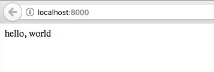
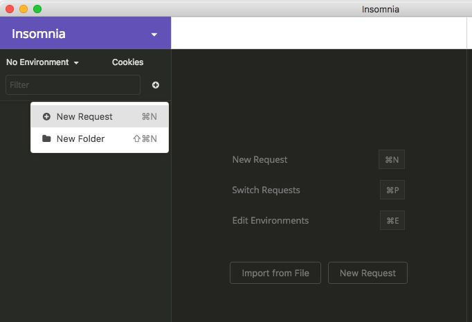
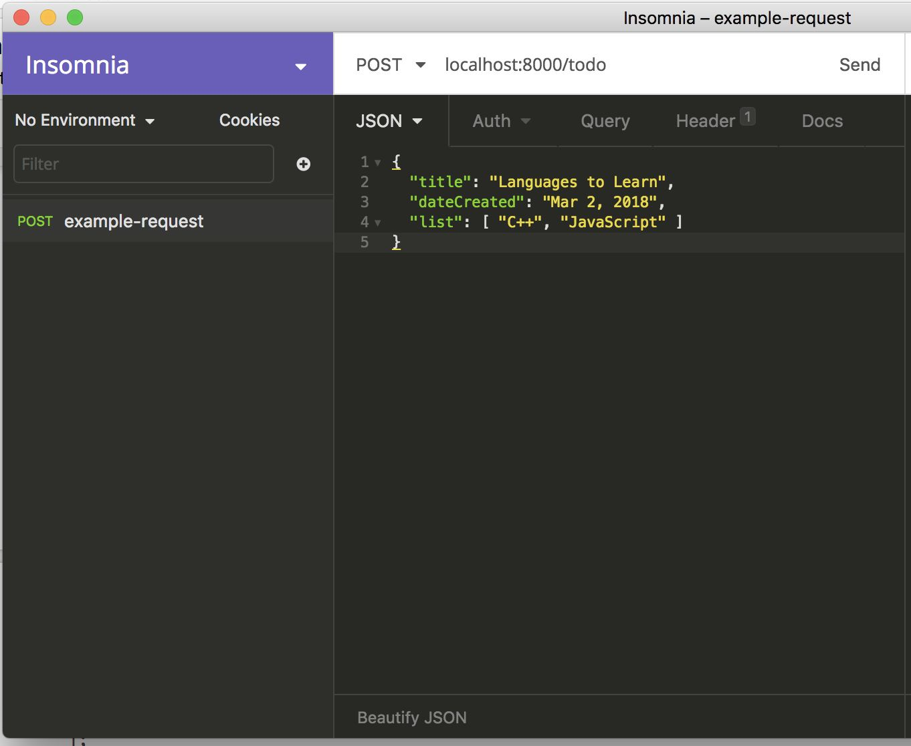
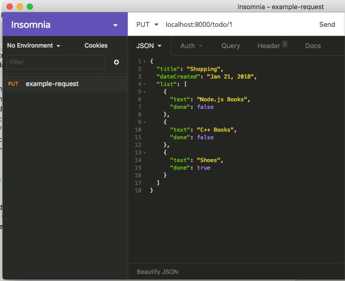
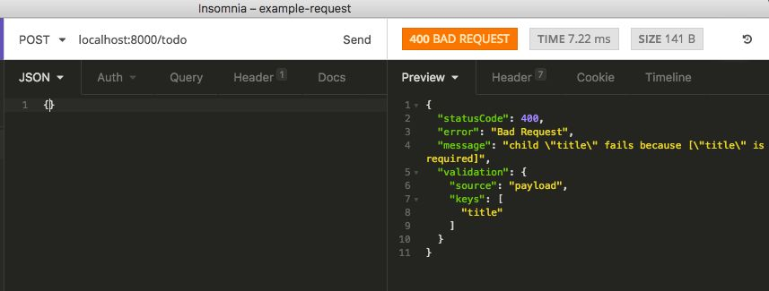

# 二、构建 API——第 1 部分

本章旨在向学生介绍如何使用 Node.js 构建 API。我们将首先构建一个基本的 HTTP 服务器，以了解 Node.js 的工作原理。

在本章结束时，您将能够：

*   使用 Node.js 内置的`http`模块实现一个基本 HTTP 服务器
*   为 API 实现基本的 Hapi.js 设置
*   描述基本 HTTP 动词以及它们之间的区别
*   使用不同的 HTTP 谓词为 API 实现各种路由
*   实现 web 应用程序的日志记录
*   验证 API 请求

# 构建基本 HTTP 服务器

让我们先看看 Node.js web 应用程序的基本构建块。内置的`http`模块是本系统的核心。但是，从下面的示例中，您还将了解这是多么基本。

将以下代码保存在名为`simple-server.js`的文件中：

```js
const http = require('http');
const server = http.createServer((request, response) => 
{
  console.log('request starting...');
  // respond
  response.write('hello world!');
  response.end();
});
server.listen(5000);
console.log('Server running at http://127.0.0.1:5000');
```

Use the `simple-server.js` file for your reference at `Code/Lesson-2`.

现在，让我们运行文件：

```js
node simple-server.js
```

当我们转到浏览器并访问示例中的 URL 时，得到的结果如下：


# 设置 Hapi.js

**Hapi.js**（**HTTP API**）是构建应用程序和服务的丰富框架，专注于编写可重用的应用程序逻辑。还有许多其他框架；其中值得注意的是 Express.js。然而，从一开始，Hapi.js 就针对 API 构建进行了优化，我们将在构建应用程序时看到这一点。

# 练习 1：构建基本的 Hapi.js 服务器

在本练习中，我们将构建一个与以前一样的基本 HTTP 服务器，但现在使用 Hapi.js。你会注意到，在 Hapi.js 的帮助下，我们完成了很多事情。然而，Hapi.js 也构建在`http`模块之上。

对于其余的练习，从[第 3 章](3.html#1P71O0-12af9adc04d045258c0a537819d419dc)的第一个练习开始，*构建 API–第 2 部分*，我们将在每个练习的基础上进行构建。因此，我们可能需要返回并修改以前的文件，等等：

1.  在`Lesson-2`文件夹中，创建名为`hello-hapi`的子文件夹。

Use the `exercise-b1` folder for your reference at `Code/Lesson-2`.

2.  在终端上，将目录更改为`hello-hapi`文件夹的根目录。
3.  将其初始化为 basic Node.js 项目并运行以下命令：

```js
npm init -y
```

4.  创建一个文件`server.js`。
5.  通过执行以下命令安装 Hapi.js：

```js
npm install hapi --save
```

6.  在该文件中，编写以下代码：

```js
const Hapi = require('hapi');
// create a server with a host and port
const server = new Hapi.Server();
server.connection
({
  host: 'localhost',
  port: 8000,
});
// Start the server
server.start((err) => 
{
  if (err) throw err;
  console.log(`Server running at: ${server.info.uri}`);
});
```

Use the `server.js` file for your reference at `Code/Lesson-2/exercise-b1`.

让我们试着理解代码：

*   我们首先需要刚才包含的 Hapi.js 框架。

Recall our subtopic, *The Module System*, in [Chapter 1](1.html#I3QM0-12af9adc04d045258c0a537819d419dc), *Introduction to Node.js?* We looked at third-party modules—this is one of them.

*   然后，我们通过初始化服务器类来创建一个服务器，从而创建一个新的`Hapi.Server()`。
*   然后，我们将该服务器绑定到特定主机（`localhost`和端口（`8000`）上。

*   之后，我们创建了一个示例路由，`/`。如您所见，对于创建的每个路由，我们必须指定三个主要内容（作为传递给`server.route`方法的对象的键）：
    *   `method`：这是该路由的 HTTP 方法。在后面的一节中，我们将更深入地研究 HTTP 动词的类型。对于我们的示例，我们使用 GET。基本上，顾名思义，它从服务器获取内容/资源。
    *   `path`：这是服务器上我们获取的特定资源的路径。
    *   `handler`：这是一个完成实际获取的闭包（匿名函数）。

We're going to look at another extra key, called `config`, in our main project.

*   完成此设置后，我们使用`server.start`方法启动服务器。此方法接受在服务器启动后调用的闭包（回调函数）。在这个函数中，我们可以检查启动服务器时是否发生任何错误。

7.  通过转到终端运行服务器，并运行以下命令：

```js
node server.js
```

8.  您应该会在终端上看到这一点：

```js
Server running at: http://localhost:8000
```

您应该在`http://localhost:8000`中看到类似的内容：



Open another Terminal, change directory to the same project folder, and run the same command, `node server.js`. We'll get this error: `Error: listen EADDRINUSE 127.0.0.1:8000`.

The reason we get this error is because we can only have one server running on a particular port of our host. Remember that the host IP `127.0.0.1` is what we refer to as `localhost`.  `if (err) throw err;` is the line which throws the error.

We can fix this by changing the port number of our second server to something like `8001`. However, as best practice, other than keep changing the code, we can pass the port number as a Terminal argument, that is, running the app as, `node server.js <port-number>`, then changing our code (in the `port` section) to, `port: process.argv[2] || 8000,`.

这里，我们是说，如果端口是作为脚本的第一个参数提供的，那么使用它，否则，使用`8000`作为端口号。现在，当您运行：`node server.js 8002`时，服务器应该从`localhost:8002`正常运行。

For the `process.argv` array, index `0` is the program running the script, node and index `1` is the script being run, `server.js`. Arguments passed to the script are therefore counted from index `2` onwards. You can read more about `process.argv` here later on.

# 使用 API 客户端

为了最大限度地利用客户机，为了能够完成所有请求类型（`GET`、`POST`、`UPDATE`等等），我们需要一个 API 客户机。这里有一个数字，但我们推荐两个邮递员（[）https://www.getpostman.com/](https://www.getpostman.com/) 或失眠[https://insomnia.rest/](https://insomnia.rest/) ）。对于我们的例子，我们将使用失眠。

安装完成后，向`http://localhost:8000`添加 GET 请求：

1.  我们将首先为失眠创建一个*请求*页面，在该页面中我们将提出所有请求：



输入新请求的名称：


2.  然后，我们将通过键入路线并单击发送来提出请求：


When we change the type from GET to POST, and click on Send, we get a 404 error because, on our server, we currently have only the GET method defined for route `/`.

# 返回 JSON 字符串

由于我们现在正在构建 API，我们需要一种正式的方式来通过发送或接收请求来表示我们的数据。**JavaScript 对象表示法**（**JSON**）是 REST API 的常规数据交换格式。

关于 JSON 需要注意的一点是，它从 JavaScript 开始，现在被其他语言广泛采用。因此，当谈到 Node.js 时，您将看到如何使用 JSON 变得如此简单和自然。

# 练习 2：返回 JSON

1.  让我们回到*练习 1**构建基本 Hapi.js**服务器*的`server.js`文件。

Use the `exercise-b2` folder for your reference at `Code/Lesson-2`.

2.  要为我们的`/`路由返回 JSON，我们只需要将返回的字符串更改为一个对象：

```js
handler: (request, reply) => 
{
  return reply({ message: 'hello, world' });
}
```

3.  前往服务器运行的终端，按*Ctrl*+*C*停止服务器。然后，通过运行以下命令再次启动服务器以实现更改：

```js
node server.js
```

4.  现在回到失眠症，再做一个 GET 请求。您可以看到，这已有效地更改为 JSON 字符串：

```js
{
  "message": "hello, world"
}
```

这在 Hapi.js 中是现成的，而对于一些框架，例如 Express.js，您必须使用`json`函数来进行转换。

# 使用 nodemon 进行开发工作流

您会注意到，在第一个练习中进行更改后，我们必须返回并停止服务器，然后重新开始。每次更改代码时都这样做会变得非常麻烦。幸运的是，工具来拯救我们。

有一个名为`nodemon`的 Node.js 包，它可以帮助在文件发生更改时自动重新启动服务器。

# 练习 3：使用 nodemon

在本练习中，我们将介绍一个名为`nodemon`的节点模块，我们将使用它来运行 web 服务器。这使得在我们对服务器进行更改时，服务器可以自动重新加载，从而避免了在我们对服务器进行更改时停止服务器并手动重新启动服务器的繁琐工作：

1.  返回终端停止服务器（按*Ctrl+C*，然后运行以下命令。
2.  我们需要全局安装此软件包（请记住，您可能需要一些管理权限，因此在 Unix 系统中，您需要以[T0]的形式运行该命令）：

```js
npm install --global nodemon
```

3.  安装完成后，我们可以使用`nodemon`运行：

```js
nodemon server.js
```

你应该得到这样的东西：

```js
[nodemon] 1.12.1
[nodemon] to restart at any time, enter `rs`
[nodemon] watching: *.*
[nodemon] starting `node server.js`
Server running at: http://localhost:8000
```

# 设置记录器

日志记录是任何 web 应用程序的一个非常重要的组件。我们需要一种保存服务器历史记录的方法，这样我们就可以随时回来查看它是如何为请求提供服务的。

而且，最重要的是，您不希望日志记录成为事后诸葛亮，只有当您在试图找出问题的确切位置时，遇到一个导致 web 应用程序崩溃的生产缺陷时，才会实施日志记录。

Hapi.js 内置了一个最小的日志功能，但是如果您需要一个更广泛的日志功能，一个很好的例子就是**good**（[https://github.com/hapijs/good](https://github.com/hapijs/good) ）。

# 练习 4：设置记录器

在本练习中，我们将在已创建的 web 服务器上添加日志机制，以便通过日志轻松跟踪每个请求和服务器活动：

1.  让我们从*练习 2 回到我们的项目：返回 JSON*。

Use the `exercise-b4` folder for your reference at `Code/Lesson-2`.

2.  我们首先需要安装几个有助于日志记录的软件包（`good`和`good-console`。运行以下命令：

```js
npm install --save good good-console 
```

`good-console` is what we call a write stream. There are other write streams that work with good, but, for simplicity, we won't look at them. You can check [https://github.com/hapijs/good](https://github.com/hapijs/good) for more information.

3.  然后，我们将修改`server.js`代码以配置日志记录。首先，在 Hapi.js 之后要求 good：

```js
const Hapi = require('hapi');
const good = require('good');
```

4.  然后，在启动服务器之前向服务器注册它：

```js
// set up logging
const options = {
  ops: {
    interval: 100000,
  },
  reporters: {
    consoleReporters: [
    { module: 'good-console' },
    'stdout',
…
});
```

Use the `server.js` file for your reference at `Code/Lesson-2/exercise-b4`.

5.  如果您仍在使用`nodemon`运行服务器，那么现在，您将开始在终端上看到服务器日志定期更新；类似于：

```js
171102/012027.934, [ops] memory: 34Mb, uptime (seconds):
100.387, load: [1.94580078125,1.740234375,1.72021484375]
171102/012207.935, [ops] memory: 35Mb, uptime (seconds):
200.389, load: [2.515625,2.029296875,1.83544921875]
...
```

6.  现在，回到失眠症，尝试在`localhost:8000/`上执行另一个 GET 请求。您将看到创建了一个额外的日志，其中显示了发出请求的时间（`timestamp`）、路线、方法（`get`）、状态代码（`200`）以及请求所用的时间：

```js
171102/012934.889, [response] http://localhost:8000: get /{} 200 (13ms)
```

The time taken comes in very handy when you are trying to optimize the performance of your server, seeing which requests take longer than expected to be served.

# 理解请求

让我们看看请求的概念和不同的 HTTP 请求方法。

# HTTP 请求方法简介

设置好服务器后，我们就可以开始构建 API 了。路由基本上就是构成实际 API 的部分。

我们首先来看 HTTP 请求方法（有时称为*HTTP 谓词*，然后使用一个简单的*todo 列表*示例将它们应用到我们的 API 中。我们将讨论五个主要问题：

*   `GET`：请求指定资源的表示。使用`GET`的请求只应检索数据，不应用于更改资源。
*   `POST`：用于向指定的资源提交条目，通常会导致状态更改。
*   `PUT`：用请求有效负载替换目标资源的所有当前表示。

*   `DELETE`：删除指定的资源。
*   `PATCH`：用于对资源进行部分修改。

在下面的练习中，我们将重写以前的代码，在那里我们硬编码了数据，这样我们就可以处理直接来自数据库的真实和动态数据。

# 练习 5：获取资源列表

1.  让我们回到*练习 4：设置记录器*的项目。

Use the `exercise-c1` folder for your reference at `Code/Lesson-2`.

2.  由于我们将有不同的路线，为了组织起见，现在将我们的路线分割成一个单独的文件是明智的。在项目中，创建名为`routes`的子文件夹。
3.  在创建的文件夹中，创建一个名为`todo.js`的文件。在`todo.js`中，这是`todo`资源的所有路线。此文件（模块）将导出路由列表。
4.  让我们先做一个简单的路由，返回`GET`请求中的 TODO 列表：

```js
const todoList = [
  {
    title: 'Shopping',
    dateCreated: 'Jan 21, 2018',
    list: [
    { 
      text: 'Node.js Books', done: false },
      ...
    ]
  },
  {
];
```

Use the `todo.js` file for your reference at `Code/Lesson-2/exercise-c1/routes`.

5.  然后我们返回到我们的`server.js`文件，需要`todo`路由模块，并使用`server.route`方法向我们的服务器注册它：

```js
const routes = {};
routes.todo = require('./routes/todo')
// create a server with a host and port
const server = new Hapi.Server();
server.connection(
{
  host: 'localhost',
  port: process.argv[2] || 8000,
});
server.route(routes.todo);
```

Use the `server.js` file for your reference at `Code/Lesson-2/exercise-c1`.

6.  使用失眠，向`http://localhost:8000/todo`发出`GET`请求。您应该看到返回的结果：


# 练习 6：获取特定资源

1.  现在，让我们试着找出具体的任务。因为我们没有带 ID 的数据库，所以我们将把索引设为 ID，`[0]`为`1`等等。

Use the `exercise-c1` folder for your reference at `Code/Lesson-2`.

2.  让我们为此添加一条路线。请注意，我们使用`{<parameter-key>}`作为向`route`函数传递请求参数的一种方式，然后通过`request.params.id`获取：

```js
module.exports = [
 {
 method: 'GET',
 path: '/todo',
 ...
 handler: (request, reply) => {
 const id = request.params.id - 1; 
 // since array is 0-based index
 return reply(todoList[id]);
 }
 },
];
```

Use the `todo.js` file for your reference at `Code/L``esson-2/exercise-c1/routes`.

3.  到失眠症处，向`http://localhost:8000/todo/1`发出`GET`请求。您应该看到：


# 练习 7：使用 POST 创建新的 Todo

1.  现在，让我们添加一个新的待办事项。这就是`POST`的用武之地。`POST`请求应始终带有有效负载，即*发布的*数据。我们将添加一条新路线来处理此问题：

```js
module.exports = [
  // previous code
  {
    method: 'POST',
    path: '/todo',
    handler: (request, reply) => {
      const todo = request.payload;
      todoList.push(todo);
      return reply({ message: 'created' });
    …
];
```

Use the `todo.js` file for your reference at `Code/Lesson-2/exercise-c1/routes`.

2.  关于失眠：
    1.  将请求类型更改为 POST:




3.  当您发布请求时，您应该将其视为响应：

```js
{
  "message": "created"
}
```

4.  现在，当您向`http://localhost:8000/todo`发出`GET`请求时，您应该会看到新创建的 todo 作为响应的一部分出现：

```js
[
...
  {
    "title": "Languages to Learn",
    "dateCreated": "Mar 2, 2018",
```

```js
    "list": 
     [
       "C++",
       "JavaScript"
    ]
  }
]
```

# 练习 8：使用 PUT 更新资源

1.  如果我们想更新，比如说，第一个 todo 列表，按照惯例，`PUT`要求我们发送整个更新的 todo 资源。现在让我们创建一条`PUT`路线：

```js
{
  method: 'PUT',
  path: '/todo/{id}',
  handler: (request, reply) => {
    const index = request.params.id - 1;
    // replace the whole resource with the new one
    todoList[index] = request.payload;
    return reply({ message: 'updated' });
  }
}
```

Use the `todo.js` file for your reference at `Code/Lesson-2/exercise-c1/routes`.

2.  现在转到失眠，提出请求。请记住将请求类型更改为 PUT：



3.  您应该看到以下响应：

```js
{
  "message": "updated"
}
```

4.  当您在`http://localhost:8000/todo/1`上执行`GET`操作时，您应获得更新的资源：


# 练习 9：使用修补程序更新

1.  您会意识到，在我们之前的练习中，我们不得不发布整个资源，只是为了更改其中的一部分。更好的方法是使用`PATCH`，这样有效负载只包含所需的内容。现在我们创建一条`PATCH`路线：

```js
{
  method: 'PATCH',
  handler: (request, reply) => 
  {
    …
    Object.keys(request.payload).forEach(key => 
    {
      if (key in todo) 
      {
        todo[key] = request.payload[key];
        …
    return reply({ message: 'patched' });
    },
}
```

Use the `todo.js` file for your reference at `Code/Lesson-2/exercise-c1/routes`.

2.  现在，您可以提供任意键及其值，它们将分别更新。例如，发出以下请求，仅更改第一个 todo 的标题：


3.  您应该得到以下响应：

```js
{
  "message": "patched"
}
```

4.  当您在`http://localhost:8000/todo/1`上执行`GET`操作时，您应获得更新的资源：


# 练习 10：使用 DELETE 删除资源

1.  当我们想要删除资源时，我们使用`DELETE`方法。让我们创建一条`DELETE`路线：

```js
{
  method: 'DELETE',
  path: '/todo/{id}',
  handler: (request, reply) => {
    const index = request.params.id - 1;
    delete todoList[index]; // replaces with `undefined`
    return reply({ message: 'deleted' });
  },
},
```

Use the `exercise-c1` folder for your reference at `Code/Lesson-2`.

2.  现在去失眠测试一下，你会得到这样的回答：


3.  现在尝试访问以前删除的资源，您应该会得到一个`404`错误。但是，在我们之前的`GET`路线中（在*练习 6：获取特定资源*中），我们没有考虑到这一点，所以让我们对`GET: /todo/{id} route`进行修改：

```js
{
  method: 'GET',
  path: '/todo/{id}',
  handler: (request, reply) => 
  {
    const id = request.params.id - 1;
    // should return 404 error if item is not found
    if (todoList[id]) return reply(todoList[id]);
    return reply({ message: 'Not found' }).code(404);
  }
}
```

Use the `todo.js` file for your reference at `Code/Lesson-2/exercise-c1/routes`.

Don't worry about the status code, `404`, if you have never come across it. We are going to go through the major status codes in our last subsection of this section.

4.  请记住，这次服务器将重新加载，因此，删除的资源仍将被带回，因此请返回并重复*步骤 2*。
5.  当您现在向`http://localhost:8000/todo/1`发出`GET`请求时，您应该看到：

```js
{
  "message": "Not found"
}
```

Short Closing Note on Insomnia
You should be able to access all your previous requests under History. Click on the Time icon in the top-right corner.

# 请求验证

我们需要验证传入的请求，以确保它们符合服务器可以处理的内容。

这是我看到 Hapi.js 超越其他框架的地方之一。在 Hapi.js 中，您将验证作为配置对象作为`route`对象的一部分进行挂钩。为了进行验证，我们将使用 Joi 库，它可以很好地与 Hapi.js 配合使用。

# 练习 11：验证请求

在本练习中，我们将看到*请求验证*的概念正在发挥作用。我们将为其中一个路由编写验证作为示例，但同样的验证也可以应用于其他路由：

1.  例如，如果我们从*练习 1：构建一个基本的 Hapi.js 服务器*返回`POST`路径，我们可以发布一个空的负载，但仍然可以获得状态代码`200!`，显然，我们需要一种验证方法。
2.  让我们从安装 Joi 开始：

```js
npm install joi --save
```

Use the `exercise-c2` folder for your reference at `Code/Lesson-2`.

3.  在`routes/todo.js`文件中，我们需要请求 Joi，然后通过向`route`对象添加`config.validate`键来修改我们的 post 路由：

```js
{
  method: 'POST',
  path: '/todo',
  handler: (request, reply) => 
  {
    const todo = request.payload;
    todoList.push(todo);
    return reply({ message: 'created' });
  },
...
},
```

Use the `todo.js` file for your reference at `Code/Lesson-2/exercise-c1/routes`.

4.  当我们尝试提交一个空负载时，我们现在得到错误`400`：



5.  也就是说，在我们为 todo 提供标题之前，因为需要标题：


Joi is a full-fledged validation library with many options for how to use it. In this exercise, we just touched on a basic example.

You validate any part of the request by coming up with the respective key/value pair within the validate key and its respective type:

`payload` (for request payloads, as in the preceding exercise), `params` (for request params), and `query` (for query params).

For example, for the request, `GET: /todo/:id`, if we want to validate that the ID is an integer, we will add this `config` object:
`config: {`
`  validate:
    {`
`    params:
     {`
`      id: Joi.number()`
`    }`
`  }
}`

更多关于 Joi 的详细信息可在此处找到：[https://github.com/hapijs/joi](https://github.com/hapijs/joi) 。

# 总结

本章介绍了使用 Node.js 构建 API 的初始部分。我们首先看一看仅使用内置 HTTP 模块构建的基本 HTTP 服务器，以便了解 Node.js web 应用程序的基本构建块。然后，我们介绍了如何使用 Hapi.js 框架做同样的事情。

然后，在使用 Hapi.js 构建基本 API 时，我们举例说明了各种 HTTP 谓词（请求方法）。分别是`GET`、`POST`、`PUT`、`PATCH`和`DELETE`。

我们还介绍了 web 应用程序的一些基本概念，如日志记录、使用良好和请求验证以及使用 Joi。