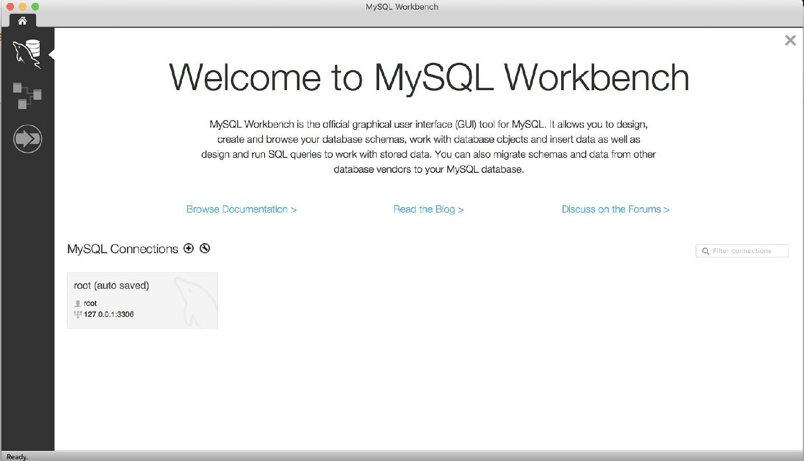
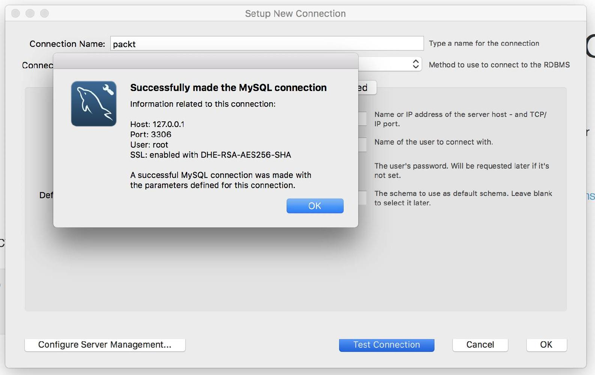
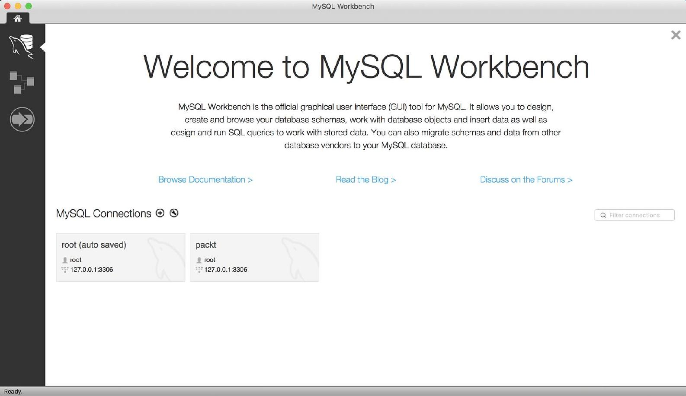
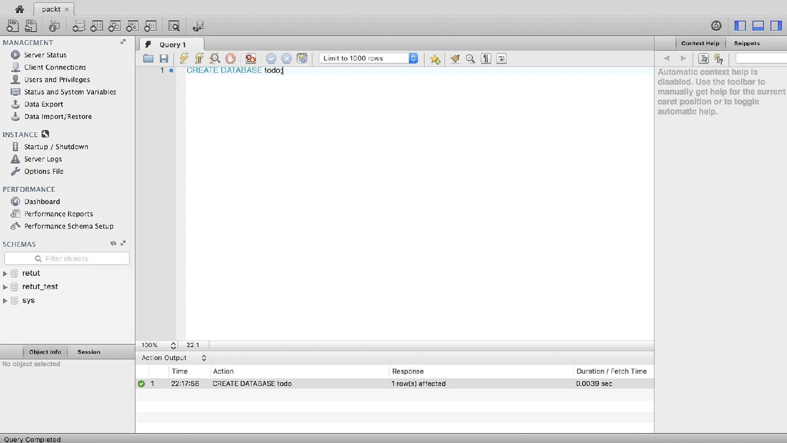
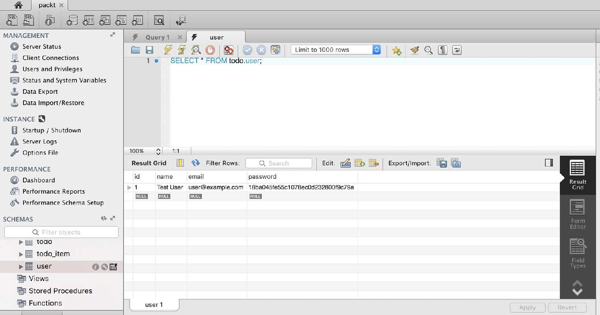

# 三、构建 API——第 2 部分

本章旨在重温以前的实现，这次是将数据保存在持久存储（数据库）中。它还将包括身份验证、单元测试和托管，这些都是一些很好的概念（但不是必需的）。因此，谨慎的做法是更多地强调使用 knex.js 使用 DB，并使用 JWT 验证 API。

在本章结束时，您将能够：

*   使用 Knex.js 实现数据库连接
*   描述常用的 Knex.js 方法
*   用 Knex.js 重写之前的 todo 路由实现
*   用 JWT 实现 API 认证
*   描述对 API 进行单元测试的重要性
*   使用 Lab 实现 API 的基本测试

# 使用 Knex.js 处理数据库

在本节中，我们将介绍使用数据库的基本概念。我们将继续从以前的 todo 项目逐步构建。你会注意到我们的上一个项目，我们将信息存储在计算机内存中，一旦服务器返回，信息就会立即消失。在现实生活中，您将希望持久地存储这些数据以供以后访问。

那么，什么是 Knex.js？它是一个用于关系数据库（如 PostgreSQL、Microsoft SQL Server、MySQL、MariaDB、SQLite3 和 Oracle）的 SQL 查询生成器。基本上，使用 Knex 之类的工具，您可以编写一个代码，轻松地处理上述任何数据库，无需额外努力，只需切换配置即可。

让我们在解释概念的同时浏览练习。

# 练习 12：设置数据库

让我们回到我们在*练习 11：验证[第 2 章](2.html#147LC0-12af9adc04d045258c0a537819d419dc)*构建 API 的请求*——第 1 部分*中结束的地方。在本例中，我们将使用 MySQL 作为我们选择的数据库。确保您的机器已使用 MySQL 和 MySQL Workbench 进行设置：

Use the `Code/Lesson-3/exercise-a` folder for your reference.

1.  打开 MySQL 工作台。单击+按钮创建连接：



2.  添加连接名称为`packt`、用户名为`root`、密码（如有）。单击测试连接以查看连接是否正确，然后单击确定：



3.  单击 OK 创建连接。

4.  现在，单击连接，packt:



5.  通过运行以下查询创建 todo 数据库，并单击执行图标：

```js
CREATE DATABASE todo;
```



6.  章节文件为我们的 todo 示例项目提供了一个基本 SQL 模式，与我们在前面的练习中使用的基本 JavaScript 数组几乎相似：
    1.  在`Code/Lesson-3`文件夹中，有一个名为`raw-sql.sql`的文件。用代码编辑器打开文件并复制文件内容。
    2.  然后，返回 MySQL 工作台。
    3.  将从文件复制的内容粘贴到文本框中，然后单击执行图标：


# 练习 13：连接到数据库

现在我们已经创建了数据库，在本练习中，我们将使用必要的 npm 包（即[T0]和[T1]）将应用程序连接到数据库：

1.  在终端上，将目录更改为项目的根目录，并运行以下命令：

```js
npm install mysql knex --save
```

2.  让我们创建一个文件`db.js`并向其中添加以下代码，如果需要，适当地替换用户和密码：

```js
const env = process.env.NODE_ENV || 'development';
const configs = 
{
  development: 
  {
    client: 'mysql',
    ...
    const Knex = require('knex')(configs[env]);
    module.exports = Knex;
```

You can find the complete code from the `db.js` file at `Code/Lesson-3/exercise-a`.

3.  让我们测试一下我们的配置是否正确。我们将创建一个`test-db.js`文件：

```js
const Knex = require('./db');
Knex.raw('select 1+1 as sum')
.catch((err) => console.log(err.message))
.then(([res]) => console.log('connected: ', res[0].sum));
```

4.  现在，让我们转到终端并运行测试文件：

```js
node test-db.js
```

您应该打印以下内容：

```js
connected: 2
```

# 练习 14：创建记录

在本练习中，我们将编写用于保存 todo 及其*项*的代码。首先，让我们创建一个虚拟用户，因为我们将为代码硬编码用户 ID。稍后，在*练习 19：保护所有路由*中，我们将从身份验证详细信息中选择 ID：

1.  返回 MySQL 工作台。
2.  清除上一个查询并粘贴以下查询，然后单击执行图标：

```js
USE todo;
INSERT INTO 'user' ('id', 'name', 'email', 'password')
VALUES (NULL, 'Test User', 'user@example.com',
MD5('u53rtest'));
```

3.  当您单击用户表时，您应该看到以下内容：；我们新创建的用户 ID 为`1`：



4.  现在，让我们转到路由文件`/routes/todo.js`并修改`POST: /todo`路由的代码；将代码更改如下（只有`handler`在更改，请注意`async`功能的更改）：
    1.  首先，我们需要[T0]中的 Knex 实例。在需要 Joi 的行之后，添加以下内容：

```js
const Knex = require('../db');
```

Notice the two dots, `../db.js`, since `db.js` is found in the parent folder. Recall our topic on requiring local modules in [Chapter 1](1.html#I3QM0-12af9adc04d045258c0a537819d419dc), *Introduction to Node.js*.

```js
{
  method: 'POST',
  path: '/todo',
  handler: async (request, reply) => 
  {
    const todo = request.payload;
    todo.user_id = 1; // hard-coded for now
    // using array-destructuring here since the
    // returned result is an array with 1 element
    const [ todoId ] = await Knex('todo')
      .returning('id')
      .insert(todo);
...
  }
},
```

You can find the complete code from the `todo.js file` at `Code/Lesson-3/exercise-a/routes`.
Unlike our previous exercises in [Chapter 2](2.html#147LC0-12af9adc04d045258c0a537819d419dc), *Building the API – Part 1*, we will split our `POST: /todo` route into two, `POST: /todo`, for adding a todo list, and `POST: /todo/<id>/item` for adding items to the list.

5.  现在，让我们测试新创建的端点。如果您已停止服务器，请返回终端并再次启动，使用[T0]：

```js
nodemon server.js
```

6.  去失眠症，提出发帖要求；您应该得到这样的结果（注意返回的[T0]，因为我们将在下一个示例中使用它）：


7.  现在，让我们添加一个用于添加待办事项的路由，`POST: /todo/<id>/item`；因此，在前面的`route`对象旁边，添加这个`route`对象：

```js
{
  method: 'POST',
  path: '/todo/{id}/item',
  handler: async (request, reply) => 
  {
    const todoItem = request.payload;
    todoItem.todo_id = request.params.id;
    const [ id ] = await Knex('todo_item')
      .insert(todoItem);
    return reply({ message: 'created', id: id });
...
},
```

You can find the complete code from the `todo.js` file at `Code/Lesson-3/exercise-a/routes`.

8.  现在，让我们测试路径，`/todo/1/item`，`1`是我们在步骤 6 中创建的`todo`的 ID：


# 练习 15：从数据库中读取

在本练习中，我们将编写以下路径：

*   列出特定用户的所有`todo`
*   获取单个待办事项的详细信息
*   列出特定待办事项的项目

我们将使用一些`Knex`方法：

*   [T0]，相当于“[T1]”
*   `.where()`，用于将 where 子句添加到查询中

1.  为了获得所有待办事项的列表，我们将修改之前的`GET: /todo`路线。在这里，您只想列出特定身份验证用户的待办事项。现在，我们将使用硬编码测试用户：

```js
{
  method: 'GET',
  path: '/todo',
  handler: async (request, reply) => 
  {
    const userId = 1; // hard-coded
    const todos = await Knex('todo')
      .where('user_id', userId);
    return reply(todos);
  },
},
```

2.  让我们修改获取单个`todo`项目`GET: /todo/<id>`的路线：

```js
{
  method: 'GET',
  path: '/todo/{id}',
  ...
    .where({
    id: id,
    user_id: userId
    });
  if (todo) return reply(todo);
  return reply({ message: 'Not found' }).code(404);
  },
},
```

You can find the complete code from the `todo.js` file at `Code/Lesson-3/exercise-a/routes`. We are using array destructuring here too, since the result, if any, will be an array of length 1, so we're getting the first and only element from the array with: `const [ todo ] = ...`

3.  现在，让我们添加 route 对象以获取特定`todo`的项目列表，最好是在*练习 14：创建记录*中添加`todo`项目的路线之后：

```js
{
  method: 'GET',
  path: '/todo/{id}/item',
  handler: async (request, reply) =>
  {
    const todoId = request.params.id;
    const items = await Knex('todo_item')
      .where('todo_id', todoId);
    return reply(items);
  },
},
```

4.  现在，让我们测试一下路线：


# 练习 16：更新记录

在本练习中，我们将编写更新 todo 标题或 todo 项目的路线，这里我们将介绍一种新的 Knex 方法，`.update()`：

1.  让我们从修改之前的`PATCH: /todo/<id>`路线开始。我们还添加了额外的验证，以确保`title`作为`payload`提供：

```js
{
  method: 'PATCH',
  path: '/todo/{id}',
  ...
    title: Joi.string().required(),
    }
  }
  }
},
```

2.  让我们测试一下路线：


3.  现在，让我们为`/todo/<id>/item`添加另一条`PATCH`路线，这将有助于编辑`todo`项目的文本，并将`todo`项目标记为完成或未完成：

```js
{
  method: 'PATCH',
  path: '/todo/{todo_id}/item/{id}',
  handler: async (request, reply) => 
  {
    const itemId = request.params.id;
    ...
    payload: 
    {
      text: Joi.string(),
      done: Joi.boolean(),
    }
  ...
},
```

You can find the complete code from the `todo.js` file at `Code/Lesson-3/exercise-a/routes`.

4.  此路由可以一次获取一个有效负载项（这将是最实际的情况，例如使用 web 或移动 UI 时），或者一次获取所有有效负载项：
    1.  例如，将项目从`Nairobi`更改为`Nigeria`，或者：


5.  当我们通过`GET: /todo/<id>/item`路线再次列出项目时，您将看到更新的项目：


# 练习 17：删除记录

在本练习中，我们将介绍最后一个重要的 Knex 方法来完成我们的**创建**、**阅读**、**更新**、**删除**（**积垢**之旅，`.delete()`：

1.  让我们添加一个删除`todo`项的路由：

```js
{
  method: 'DELETE',
  path: '/todo/{todoId}/item/{id}',
  handler: async (request, reply) =>
  {
    const id = request.params.id;
    const deleted = await Knex('todo_item')
      .where('id', id)
      .delete();
    return reply({ message: 'deleted' });
  },
},
```

2.  现在，让我们在前面的[T0]（ID 为[T1]）上再添加一项，然后将其删除：
    1.  添加项目：


# 练习 18：清理代码

现在，我们已经更新了[第 2 章](2.html#147LC0-12af9adc04d045258c0a537819d419dc)*、**构建 API 第 1 部分*中的所有路线，现在让我们删除所有不再需要的代码：

1.  删除以前硬编码的待办事项列表：

```js
const todoList = [
...
];
```

2.  移除`PUT: /todo/<id>`路由对象：

```js
{
  method: 'PUT',
  path: '/todo/{id}',
  handler: (request, reply) =>
  {
    const index = request.params.id - 1;
    // replace the whole resource with the new one
    todoList[index] = request.payload;
    return reply({ message: 'updated' });
  },
},
```

3.  重新实现`DELETE: /todo/<id>`路由对象，非常类似*练习 17：删除记录*；不同之处在于路线：

```js
{
  method: 'DELETE',
  path: '/todo/{id}',
  handler: async (request, reply) =>
  {
    const id = request.params.id;
    const deleted = await Knex('todo')
      .where('id', id)
      .delete();
    return reply({ message: 'deleted' });
  },
},
```

Since our SQL query had this line that adds a constraint which is possible when a `todo` is deleted, all the items for that `todo` are also deleted:
`CREATE TABLE todo_item(`
`  'id' INT PRIMARY KEY AUTO_INCREMENT,`
`  'text' VARCHAR(50),`
`  'done' BOOLEAN,`
`  'date_created' TIMESTAMP DEFAULT CURRENT_TIMESTAMP,`
`  'todo_id' INT,`
`  FOREIGN KEY (`todo_id`) REFERENCES `todo` (`id`) ON DELETE CASCADE`
`);`

# 使用 JWT 验证您的 API

到目前为止，我们一直在使用我们的 API，没有任何身份验证。这意味着，如果此 API 托管在公共场所，任何人都可以访问任何路由，包括删除我们的所有记录！任何适当的 API 都需要身份验证（和授权）。基本上，我们需要知道谁在做什么，以及他们是否被授权（允许）这样做。

**JSON Web 令牌**（**JWT**）是一种开放的行业标准方法，用于在双方之间安全地表示索赔。声明是您希望其他人能够读取和/或验证但不能更改的任何数据位。

为了识别/验证我们 API 的用户，用户将基于标准的令牌放入请求的头部（带有授权密钥）（在其前面加上单词*Bearer*）。我们很快就会看到这一点。

# 练习 19：确保所有路线的安全

在本练习中，我们将保护我们创建的所有`/todo/*`路由，以便未经身份验证的用户无法访问它们。在*练习 21：实施授权*中，我们将区分*未经身份验证的*用户和*未经身份验证的*用户：

1.  我们将首先为 JWT 安装一个 Hapi.js 插件`hapi-auth-jwt`。转到终端并运行：

```js
npm install hapi-auth-jwt --save
```

Use the `Code/Lesson-3/exercise-b` for your reference.

2.  我们将在`server.js`文件中修改从`./routes/todo.js`获取的 routes 数组：
    1.  首先，首先要求在文件顶部安装[T0]：

```js
const hapiAuthJwt = require('hapi-auth-jwt');
```

```js
server.register(hapiAuthJwt, (err) => 
{
  server.auth.strategy('token', 'jwt', 
  {
    key: 'secretkey-hash',
    verifyOptions: 
    {
      algorithms: [ 'HS256' ],
...
    // add auth config on all routes
...
});
```

You can find the complete code from the `server.js` file at `Code/Lesson-3/exercise-b`.

3.  现在，尝试访问任何路由，例如，`GET: /todo`；你应该得到这个：


# 练习 20：添加用户身份验证

现在，我们已经保护了所有的 todo 路由，我们需要一种向有效用户颁发令牌以访问 API 的方法。我们将让用户将他们的电子邮件和密码发送到路由（`/auth`，我们的 API 将发回用于每个请求的身份验证令牌：

1.  在`/routes`文件夹中，创建一个文件`auth.js`。
2.  我们现在还需要另外两个软件包，`jsonwebtoken`用于签名身份验证令牌，`md5`用于比较密码，因为如果您还记得，我们使用 MySQL 的`md5`函数来存储用户密码：

```js
npm install jsonwebtoken md5 --save
```

3.  在`auth.js`文件中，有以下代码：

```js
const jwt = require('jsonwebtoken');
const Joi = require('joi');
const md5 = require('md5');
const Knex = require('../db');
module.exports =
  {
  method: 'POST',
  path: '/auth',
...
};
```

You can find the complete code from the `auth.js` file at `Code/Lesson-3/exercise-b/routes`.

4.  现在，让我们向服务器注册我们的`auth.js`路由。在`server.js`中，在`routes.todo = ...`之后添加以下代码：

```js
routes.auth = require('./routes/auth');
```

5.  行初始化服务器后，我们可以添加`route`注册：

```js
server.route(routes.auth);
```

6.  现在，让我们试试我们的路线，`POST: /auth`：
    1.  首先，使用不正确的电子邮件/密码组合：


7.  现在，我们可以复制生成的令牌，并通过添加授权标头将其用于后续请求，例如，`GET: /todo`。因此请记住，我们从单词`Bearer`开始，然后是空格，然后粘贴标记；这就是 JWT 公约：


8.  我们现在可以访问该路径而不会得到未经授权的响应，如第 20 练习的*步骤 6*：


9.  现在，让我们回到`./routes/todo.js`文件中我们硬编码用户的地方，现在从身份验证对象获取他们，即：

```js
const userId = request.auth.credentials.id;
```

Recall in the preceding *step 3*, when we were signing our token, we provided the user details, that is, `name`, `email`, and `id`. This is where we get the `.id` in `request.auth.credentials.id`:
`jwt.sign(`
`{`
`  name: user.name,`
`  email: user.email,`
`  id: user.id,`
`},`
`...`
`);`

10.  现在，让我们回到我们的 phpMyAdmin web 界面并创建另一个用户，就像我们在*练习 14：创建记录*、*步骤 2*中所做的那样，并将以下 SQL 粘贴到 SQL 文本区域：

```js
INSERT INTO 'user' ('id', 'name', 'email', 'password')
VALUES (NULL, 'Another User', 'another@example.com',
MD5('12345'));
```

11.  现在，让我们对新用户进行另一个`POST: /auth`请求，并获取令牌：


12.  让我们通过`POST: /todo`请求，使用这个新令牌创建另一个 todo 列表：
    1.  在下一步中，转到标题部分，删除以前的授权标题并将其替换为新的授权标题：


哎呀！我们可以看到其他人的待办事项列表项；这是一个安全漏洞。这就引出了本主题的最后一部分，**授权**。

# 身份验证与授权

通过身份验证，我们知道谁在访问我们的 API；通过授权，我们可以告诉谁可以在我们的 API 中访问什么。

# 练习 21：实施授权

在本练习中，我们将改进 API，以确保用户仅被授权访问其 todo 和 todo 项：

1.  让我们首先修复在*练习 20：添加用户身份验证*、*步骤 12*中遇到的缺陷。因此，我们将修改`/routes/todo.js`中的`GET: /todo/<id>`项目路由对象，首先检查 todo 是否属于用户，然后用户才能访问其项目：

```js
{
  method: 'GET',
  path: '/todo/{id}/item',
  handler: async (request, reply) =>
  {
    const todoId = request.params.id;
    ...
    return reply(items);
  },
},
```

You can find the complete code from the `todo.js` file at `Code/Lesson-3/exercise-b/routes`.

2.  现在，当我们返回访问`GET: /todo/1/item`时，我们得到正确的错误消息：


3.  您可以为以下路由添加额外的授权逻辑：

**跨源资源共享**（**CORS**）是一种机制，它使用额外的 HTTP 头，让用户代理（浏览器）获得从与当前使用的站点不同的源（域）上的服务器访问所选资源的权限。例如，当您在另一个域上托管 web 应用程序前端时，由于浏览器限制，您将无法访问 API。
因此，我们需要明确声明，我们的 API 将允许跨源请求。我们将在初始化服务器连接的地方修改`server.js`文件，以启用 CORS：

```js
server.connection(
{
   host: 'localhost',
   port: process.argv[2] || 8000,
   routes:
   {
     cors: true,
   }
});
```

# 使用 Lab 测试 API

在本节中，我们将简要介绍如何为 Hapi.js API 编写单元测试。测试是一个庞大的主题，它本身可能需要一整门课程，但在本节中，我们将介绍让您启动并运行的基本部分。

让我们首先强调为 API 编写单元测试的重要性：

*   可维护性：这是我认为将测试添加到软件中最重要的价值。当您进行测试时，您可以自信地在几个月后回来修改代码，而不必担心更新是否破坏了任何东西。
*   需求规范：测试确保您的代码满足需求。对于我们的示例，我们从实现需求开始，因为我们希望传递一些基本概念。但在实践中，在实现路由之前，最好先从测试开始。
*   **自动测试**：您意识到在前面的示例中，我们一直在检查 API 客户端（失眠），以查看 API 是否正常工作；这可能有点麻烦。对于测试，一旦编写了正确的测试，就不必担心这一点。

Hapi.js 通常使用**实验室**（[https://github.com/hapijs/lab](https://github.com/hapijs/lab) 作为其测试框架。在下一个练习中，我们将为 API 编写一些测试。

# 练习 22：使用实验室编写基本测试

在本练习中，我们将介绍为 Hapi.js web API 编写单元测试的概念，主要使用第三方`lab`模块和内置`assert`模块。理想情况下，我们的测试应该有一个单独的数据库，但为了简单起见，我们也将共享我们的测试开发数据库：

1.  让我们首先安装必要的软件包。请注意，我们使用的是`--save-dev`，因为生产不需要测试，所以它们是*开发依赖项*：

```js
npm install lab --save-dev
```

Use the `Code/Lesson-3/exercise-c` for your reference.

2.  在项目的根目录下创建一个`test`文件夹，我们将在那里进行测试。因为我们的 API 是一个简单的 API，所以我们只有一个包含所有测试的文件。
3.  在`test`中，创建一个文件`test-todo.js`。
4.  作为设置，`test/test-todo.js`需要我们测试所需的必要模块：

```js
const assert = require('assert');
// lab set-up
const Lab = require('lab');
const lab = exports.lab = Lab.script();
// get our server(API)
const server = require('../server');
```

In the first line, we are requiring assert, which is an inbuilt module if you recall from [Chapter 1](1.html#I3QM0-12af9adc04d045258c0a537819d419dc), *Introduction to Node.js*. Alternatively, you can use any other assertion libraries such as `chai` ([https://github.com/chaijs/chai](https://github.com/chaijs/chai)), `should.js` ([https://github.com/tj/should.js](https://github.com/tj/should.js)), and others.

Lab test files must require the `lab` module and export a test script, as seen on line 4 prior. We will be getting the rest of the items from lab in the following line; we're going to see them in action shortly.

5.  由于我们在`test-todo.js`文件的第 6 行需要服务器，我们需要返回`server.js`文件并导出`server`对象，最后一行：

```js
module.exports = server;
```

6.  对于 DB 配置，让我们修改`db.js`文件以包含测试环境的配置，指向开发配置。在`configs`定义后添加此行：

```js
configs.test = configs.development;
```

7.  让我们修改服务器连接设置代码，以便在运行测试时从环境变量设置测试服务器的端口。这允许我们在开发服务器运行时，让测试服务器在不同的端口上运行：

```js
server.connection(
{
  host: 'localhost',
  port: process.env.PORT || 8000,
  routes:
  {
    cors: true,
  }
});
```

8.  在`lab`模块中，我们将使用多种方法；我们需要使用对象分解来获得它们。在我们的`test-todo.js`文件中添加以下行：

```js
const
{
  experiment,
  test,
  before,
} = lab;
```

9.  让我们先编写一个简单的测试，确保[T0]通过，并返回定义的[T1]：

```js
experiment('Base API', () => 
{
  test('GET: /', () => 
  {
    const options =
    {
      ...
      assert.equal(response.result.message, 'hello, world');
    });
  });
});
```

You can find the complete code from the `test-todo.js` file at `Code/Lesson-3/exercise-c/test`.
We now see `experiment`, `test`, and `assert.equal` methods in action. `experiment` is basically a way of grouping together the tests, and the actual tests are written within the `test` method's callback function (known as *test cases)*. `assert.equal` here is just comparing the two values to make sure they are equal, and if not, an *assertion error* will be thrown.

10.  现在，让我们运行测试：

    1.  在终端上（如果在其中一个终端上运行 API，请打开一个新终端），导航到项目的根目录并运行以下命令：

```js
PORT=8001 ./node_modules/lab/bin/lab test --leaks
```

We're adding an optional `--leaks` option to turn off memory leak detection since we don't need it now.
At the beginning of the command, we're adding `PORT=8001`; this is a way of passing an environment variable to our script, which is why we changed our code at step 7 previously. We're now running our test server on port `8001` while our development server is still running on port `8000`.


11.  我们可以将测试命令作为脚本添加到我们的`package.json`文件中，从而缩短测试命令：
    1.  替换以下代码行：

```js
"test": "echo \"Error: no test specified\" && exit 1"
```

```js
"test": "PORT=8001 ./node_modules/lab/bin/lab test --leaks"
```

```js
npm test
```

12.  现在，让我们测试一下身份验证是否正常工作。在上一段之后添加以下
    段：

```js
experiment('Authentication', () =>
{
  test('GET: /todo without auth', () =>
  {
    const options =
    {
      method: 'GET',
      url: '/todo'
    };
    server.inject(options, (response) => 
    {
      assert.equal(response.statusCode, 401);
    });
  });
});
```

13.  现在，返回并运行`npm test`。两项测试均应通过：


14.  你知道我们必须每隔一段时间回到终端来运行测试。这与在 API 客户机上进行测试一样麻烦（失眠）；我们需要一些自动化：
    1.  我们需要 gulp.js 和另外两个 gulp 插件。让我们安装它们：

```js
install gulp gulp-shell gulp-watch --save-dev
```

```js
const gulp = require('gulp');
const shell = require('gulp-shell');
const watch = require('gulp-watch');
...
gulp.task('test', shell.task('npm test'));
```

You can find the complete code from the `gulpfile.js` file at `Code/Lesson-3/exercise-c`.

```js
"scripts": 
{
  "test": "PORT=8001 ./node_modules/lab/bin/lab test --leaks",
  "test:dev": "./node_modules/.bin/gulp test:dev"
},
```

```js
npm run test:dev
```


15.  现在让我们为`GET: /todo`路由编写一个示例测试。请记住，对于所有经过身份验证的路由，我们首先需要令牌，以便发出成功的请求。因此，在任何测试开始之前，我们需要一个脚本来获取令牌。这就是我们在第 8 步中得到的`before`函数的作用。在我们的`test-todo.js`文件中，添加以下段：

```js
experiment('/todo/* routes', () => 
{
  const headers = 
  {
    Authorization: 'Bearer ',
  };
  before(() => 
  {
    const options = 
    {
      method: 'POST',
      url: '/auth',
      ...
});
```

You can find the complete code from the `test-todo.js` file at `Code/Lesson-3/exercise-c/test`.

# 总结

在这一章中，我们探讨了很多。我们首先介绍了 Knex.js 以及如何使用它连接和使用数据库。我们介绍了基本的 CRUD 数据库方法。然后，我们介绍了如何使用 JWT 机制对 API 进行身份验证并防止未经授权的访问。我们还提到了有关 CORS 的一些重要内容，浏览器如何处理这些内容，以及我们如何在 API 上启用这些内容。最后，我们介绍了有关使用实验室库测试 API 的概念。我们还顺便介绍了使用 gulp.js 实现测试自动化的概念。

在本书中，我们首先学习如何实现必要的模块，以启动和运行简单的应用程序。然后，我们继续实现异步并等待函数有效地处理异步代码。在学习了 Node.js（应用程序构建方面）之后，我们开始使用 Node.js 构建 API。为此，我们首先使用内置模块，然后使用富 Hapi.js 框架。我们还了解了 Hapi.js 框架的优点。后来，我们学习了如何处理来自 API 客户机的请求，最后，我们通过介绍与数据库的交互完成了本书。

这是一个实用的快速入门指南。为了进一步了解你的知识，你应该考虑用 NoDE.js 构建实时应用程序。我们在下一节中推荐了几本书，但请确保您查看我们的网站，找到您可能感兴趣的其他书！