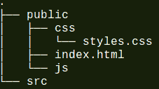
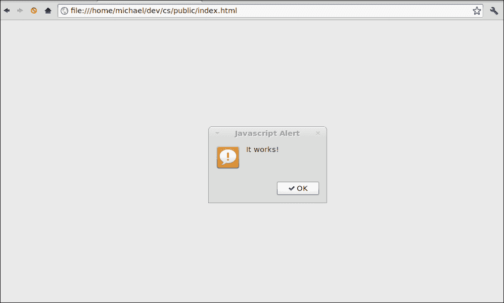

# 第三章。咖啡脚本和 jQuery

**jQuery** 是一个跨浏览器兼容的库，旨在简化 HTML 应用程序开发人员的生活。它由 John Resig 于 2006 年首次发布，此后成为世界上最受欢迎的 JavaScript 库，并被数百万网站使用。

为什么会变得这么受欢迎？jQuery 有几个不错的特性，比如简单的 DOM 操作和查询、事件处理和动画，以及 AJAX 支持。所有这些结合在一起，使得针对 DOM 的编程和用 JavaScript 编程要好得多。

该库还在跨浏览器兼容性和速度方面进行了高度优化，因此使用 jQuery 的 DOM 遍历和操作功能不仅可以让您避免编写繁琐的代码，而且通常比您自己编写的代码要快得多。

事实证明，jQuery 和 CoffeeScript 可以很好地结合在一起，当结合在一起时，提供了一个强大的工具集来以简洁和表达的方式编写 web 应用程序。

在本章中，我们将执行以下操作:

*   探索 jQuery 的一些高级特性，并讨论它给你带来了什么
*   了解如何在浏览器中使用咖啡脚本和 jQuery
*   使用 jQuery 和 CoffeeScript 构建一个简单的待办事项应用程序

让我们从更详细地讨论 jQuery 库开始，并发现是什么让它如此有用。

# 寻找和改变元素

在网络浏览器中，DOM 或文档对象模型是 HTML 文档中用于编程交互的元素的表示。

在 JavaScript 中，您会发现自己做了大量的 DOM 遍历来查找您感兴趣的元素，然后对它们进行操作。

要仅使用标准的 JavaScript 库来实现这一点，通常需要结合使用`document.getElementsByName`、`document.getElementById`和`document.getElementsById`方法。一旦您的 HTML 结构开始变得复杂，这通常意味着您将不得不在一个笨拙且麻烦的迭代代码中组合这些方法。

以这种方式编写的代码通常会对您的 HTML 结构做出许多假设，这意味着如果 HTML 发生变化，它通常会崩溃。

## 美元功能

有了 jQuery，很多这种命令式代码通过`$`函数变得简单多了——jQuery 的工厂方法(一种创建 jQuery 类实例的方法)和进入大部分库的入口点。

该函数通常以一个 CSS 选择器字符串作为参数，可以用来根据元素名称、ID、类属性或其他属性值选择一个或多个元素。此方法将返回一个 jQuery 对象，该对象包含一个或多个与选择器匹配的元素。

在这里，我们将使用`$`功能选择一个类别为`address`的文档中的所有`input`标签:

```js
$('input .address')
```

然后，您可以使用多种功能来操纵或询问这些元素，这些功能通常称为**命令**。以下只是一些常见的 jQuery 命令及其用途:

*   `addClass`:这给元素添加了一个 CSS 类
*   `removeClass`:这将从元素中移除一个 CSS 类
*   `attr`:从元素中获取属性
*   `hasClass`:检查元素上是否存在 CSS 类
*   `html`:获取或设置元素的 HTML 文本
*   `val`:获取或设置元素值
*   `show`:显示一个元素
*   `hide`:这隐藏了一个元素
*   `parent`:获取元素的父元素
*   `appendTo`:这将追加一个子元素
*   `fadeIn`:这将淡入一个元素
*   `fadeout`:这将淡出一个元素

大多数命令返回一个 jQuery 对象，该对象可用于将其他命令链接到它们上面。通过链接命令，您可以使用一个命令的输出作为下一个命令的输入。这种强大的技术允许您在 HTML 文档的部分上编写非常简短的转换。

假设我们想要以 HTML 形式突出显示并启用所有`address`输入；jQuery 允许我们做类似的事情:

```js
$('input .address').addClass('highlighted').removeAttr('disabled')
```

在这里，我们再次选择所有带有`address`类的`input`标签。我们使用`addClass`命令为每个类添加`highlighted`类，然后通过链接对`removeAttr`命令的调用来移除`disabled`属性。

# 实用功能

jQuery 也附带了一系列实用函数，通常可以改善你的日常 JavaScript 编程体验。这些都是全局 jQuery 对象上的方法形式，比如:`$.methodName`。例如，最广泛使用的工具之一是`each`方法，该方法可用于迭代数组或对象，其调用如下(在咖啡脚本中):

```js
$.each [1, 2, 3, 4], (index, value) -> alert(index + ' is ' + value)
```

jQuery 的实用方法包括数组和集合帮助器方法、时间和字符串操作，以及大量其他有用的 JavaScript 和浏览器相关函数。这些功能很多都源于很多 JavaScript 程序员的日常需求。

通常，您会发现一个函数适用于您在编写 JavaScript 或 CoffeeScript 时面临的常见问题或模式。您可以在[http://api.jquery.com/category/utilities/](http://api.jquery.com/category/utilities/)找到详细的功能列表。

# Ajax 方法

jQuery 提供了`$.ajax`方法来执行跨浏览器工作的 Ajax 请求。传统上，这是一件痛苦的事情，因为浏览器都实现了不同的接口来处理 Ajax。jQuery 解决了所有这些问题，并提供了一种更简单的、基于回调的方式来构造和执行 Ajax 请求。这意味着您可以声明性地指定如何进行 Ajax 调用，然后提供 jQuery 在请求成功或失败时将回调的函数。

# 使用 jQuery

在浏览器中使用 jQuery 非常简单；您只需要在您的 HTML 文件中包含 jQuery 库。您可以从他们的网站([http://docs.jquery.com/Downloading_jQuery](http://docs.jquery.com/Downloading_jQuery))下载最新版本的 jQuery 并引用它，也可以直接链接到**内容交付网络** ( **CDN** ) 版本的库。

下面是一个你可以怎么做的例子。这个片段来自优秀的 HTML5 样板项目([http://html5boilerplate.com/](http://html5boilerplate.com/))。在这里，我们包含了来自谷歌 CDN 的最新缩小的 jQuery，但是如果包含 CDN 失败，我们也将包含本地版本。

```js
<script src="//ajax.googleapis.com/ajax/libs/jquery/1.7.2/jquery.min.js"></script>
    <script>window.jQuery || document.write('<script src="js/lib/jquery-1.7.2.min.js"><\/script>')
</script>
```

# 在浏览器中使用咖啡脚本和 jQuery

在我们可以开始玩 jQuery 和 CoffeeScript 之前，让我们来谈谈如何着手编写在浏览器中运行的 CoffeeScript 代码。

## 编写咖啡脚本

为网络应用程序编译咖啡脚本最常见的方法是运行`coffee`命令来观察一个或多个咖啡脚本文件的变化，然后将它们编译成 JavaScript。输出将包含在您的 web 应用程序中。

例如，我们将组织我们的项目文件夹结构，看起来像下面的文件夹结构:



'

“T2”文件夹是你的咖啡脚本文件要去的地方。然后我们可以启动一个咖啡脚本编译器来观察那个文件夹，并将 JavaScript 编译到我们的**公共/js** 文件夹中。

这是咖啡脚本命令的样子:

```js
coffee -co public/js -w src/
```

让这个命令在后台自己的终端窗口中运行，当你保存它们时，它会重新编译你的咖啡脚本文件。

### 类型

**咖啡脚本标签**

在浏览器中运行咖啡脚本的另一种方法是将咖啡脚本内嵌在包含在`<script type="text/coffeescript">`标签中的文档中，然后将缩小的咖啡脚本编译器脚本(`coffee-script.js`)包含在您的文档中。这将编译，然后运行页面中的所有内联咖啡脚本。

这并不意味着要认真使用，因为每次加载页面时，您都会为编译步骤付出严重的性能代价。然而，在不设置完整的编译器链的情况下，在浏览器中快速地玩一些咖啡脚本可能会非常有用。

## jQuery 和咖啡脚本

让我们在的咖啡脚本文件中放一些东西，看看我们是否能成功地将它与 jQuery 连接起来。在`src`文件夹中，创建一个名为`app.coffee`的文件，并包含以下代码:

```js
$ -> alert "It works!"
```

这将设置 jQuery 的`$(document).ready()`函数，当应用程序初始化时将调用该函数。这里我们使用它的简写语法，只需将一个匿名函数传递给`$`函数。

您现在应该在`public/js`文件夹中有一个`app.js`文件，其内容类似于:

```js
// Generated by CoffeeScript 1.3.3
(function() {
    alert('It works!');
}).call(this);
```

最后，我们需要在应用程序的 HTML 文件中包含这个文件以及 jQuery。在`public/index.html`文件中，添加以下代码:

```js
<!doctype html>
<html lang="en">
<head>
  <meta charset="utf-8">
  <meta http-equiv="X-UA-Compatible" content="IE=edge,chrome=1">
  <title>jQuery and CoffeeScript Todo</title>
  <link rel="stylesheet" href="css/styles.css">
</head>
<body>
  <script src="http://ajax.googleapis.com/ajax/libs/jquery/1.7.2/jquery.min.js"></script>
  <script src="js/app.js"></script>
</body>
</html>
```

前面的代码创建了我们的 HTML 框架，包括 jQuery(使用谷歌 CDN)和我们的应用程序代码。

### 类型

**下载示例代码**

您可以从您在[http://www.PacktPub.com](http://www.PacktPub.com)的账户中下载您购买的所有 Packt 书籍的示例代码文件。如果您在其他地方购买了这本书，您可以访问[http://www.PacktPub.com/](http://www.PacktPub.com/)支持并注册，以便将文件直接通过电子邮件发送给您。

## 测试这一切

我们现在应该能够通过在浏览器中打开我们的`index.html`文件来运行我们的应用程序。如果一切顺利，我们应该会看到我们的警报弹出窗口，如下图所示:



## 运行本地网络服务器

虽然我们现在可以很容易地从磁盘测试我们的网络应用程序，但是我们可能希望很快将其托管在本地网络服务器上，尤其是如果我们想开始使用 Ajax 的话。因为我们已经安装了 Node.js，所以运行 web 服务器应该非常容易，目前我们只需要提供静态内容。幸运的是，有一个 npm 包可以为我们做到这一点；它被命名为 **http-server** ，可以在[https://github.com/nodeapps/http-server](https://github.com/nodeapps/http-server)找到。

要安装它，只需运行以下命令:

```js
npm install http-server -g
```

然后，我们通过导航到应用程序文件夹并输入以下内容来执行它:

```js
http-server
```

这将托管端口 **8080** 上的公共文件夹中的所有文件。我们现在应该能够使用网址`http://localhost:8080/`导航到我们托管的网站。

# 我们的应用

在本章的剩余部分，我们将使用咖啡脚本构建一个 jQuery 应用程序。该应用程序是一个待办事项应用程序，可以用来跟踪你的日常任务以及你是如何完成的。

## todo VC

我已经在一些 TodoMVC 项目的源代码上建模了很多应用程序，这些源代码在公共领域。这个项目展示了不同的 JavaScript MVC 框架，它们都用于构建同一个应用程序，在评估框架时非常有用。如果你想去看看，可以在[http://addyosmani.github.com/todomvc/](http://addyosmani.github.com/todomvc/)找到。

### 注

**MVC** ，或 Model–view–controller，是一种广泛使用的应用程序架构模式，旨在通过将应用程序关注点拆分为三种域对象类型来简化代码并减少耦合。我们将在本书后面更详细地讨论 MVC。

我们将把我们的应用程序主要建立在 TodoMVC 项目的基础上，以获得它所附带的令人敬畏的样式表以及设计良好的 HTML5 结构。然而，大部分客户端 JavaScript 将在 CoffeeScript 中被重写，并且为了说明的目的，它将被简化和修改很多。

所以不再多说，让我们开始吧！

## 我们最初的 HTML

首先，我们将添加一些允许我们输入待办事项和查看现有项目列表的 HTML。在`index.html`中，将以下代码添加到`body`标签中，就在包含的`script`标签之前:

```js
<section id="todoapp">
    <header id="header">
      <h1>todos</h1>
      <input id="new-todo" placeholder="What needs to be done?" autofocus>
    </header>
    <section id="main">
      <ul id="todo-list"></ul>
    </section>
    <footer id="footer">
      <button id="clear-completed">Clear completed</button>
    </footer>
  </section> 
```

让我们简单浏览一下前面标记的结构。首先，我们有一个带有`todoapp`标识的部分，它将作为应用程序的主要部分。它包括一个`header`标签，用于存放我们创建新项目的输入信息，一个`main`部分，用于列出我们所有的待办事项，以及一个`footer`部分，用于清除已完成的按钮。在我们在浏览器中打开这个页面之前，让我们从我们的`app.coffee`文件中删除之前的警报行。

当您导航到此页面时，它看起来不会太像。那是因为我们的 HTML 根本没有被设计出来。下载本章的`styles.css`文件，复制到`public/css`文件夹。现在看起来应该好多了。

## 初始化我们的应用

包括我们在内的大多数 jQuery 应用程序都遵循类似的模式。我们创建一个`$(document).ready`处理程序，它依次执行页面初始化，通常包括为用户操作连接事件处理程序。让我们在`app.coffee`文件中执行此操作。

```js
class TodoApp
  constructor: ->
    @bindEvents()

  bindEvents: ->
    alert 'binding events'

$ ->
  app = new TodoApp()
```

在这里，在前面的代码片段中，我们创建了一个名为`TodoApp` 的类，它将代表我们的应用程序。它有一个调用`bindEvents`方法的构造函数，目前只显示一条警告消息。

我们设置了 jQuery 的`$(document).ready`事件处理程序来创建我们的`TodoApp`实例。当您重新加载页面时，您应该会看到**绑定事件**提醒弹出窗口。

### 类型

**看不到预期产量？**

记得留意后台运行的 coffee 编译器的输出。如果你犯了任何语法错误，那么编译器会吐出一条错误信息。一旦你修复了它，编译器应该重新编译你的新的 JavaScript 文件。请记住，咖啡脚本是空白敏感的。如果你遇到不理解的错误，仔细检查你的缩进。

## 添加待办事项

现在我们可以添加事件处理，实际上向列表中添加一个待办事项。在我们的`bindEvents`功能中，我们将选择`new-todo`输入并处理其`keyup`事件。我们将它绑定到类上的`create`方法，我们也将去定义它；这在下面的代码片段中显示:

```js
  bindEvents: ->
    $('#new-todo').on('keyup', @create)

  create: (e) ->
    $input = $(this)
    val = ($.trim $input.val())
    return unless e.which == 13 and val
    alert val
    # We create the todo item
```

`$('#new-todo')`函数使用 jQuery CSS 选择器语法获取带有`new-todo` ID 的输入，`on`方法将`create`方法绑定到其`'keyup'`事件，当输入有焦点时，只要按下一个键就会触发该事件。

在`create`函数中，我们可以通过使用`$(this)`函数获得对输入的引用，该函数将始终返回生成事件的元素。我们将其分配给`$input`变量。分配 jQuery 变量时，使用前缀为`$`的变量名是一种常见的约定。然后，我们可以使用`val()`函数获取输入值，并为其分配一个局部`val`变量。

通过检查`keyup`事件的`which`属性是否等于`13`，我们可以看到*回车*键是否被按下。如果是，并且如果`val`变量不是`null`，我们可以继续创建待办事项。现在，我们将使用一条警告消息输出它的值。

一旦我们创建了项目，我们将把它放在哪里？在许多传统的网络应用程序中，这些数据通常会使用 Ajax 请求存储在服务器上。我们想保持这个应用程序简单，只是保持这些项目在客户端。HTML5 规范为我们定义了一个名为 **localStorage** 的机制来实现这一点。

### 使用本地存储

`localStorage`是新 HTML5 规范的一部分，允许您在浏览器中的本地数据库中存储和检索对象。界面相当简单；在支持的浏览器中，将出现一个名为`localStorage`的全局变量。该变量有以下三种重要方法:

```js
localStorage.setItem(key, value)
localStorage.getItem(key)
localStorage.removeItem(key)
```

`key`和`value`参数都是字符串。当页面刷新时，存储在`localStorage`变量中的字符串甚至会在周围挂起。在大多数浏览器中`localStorage`变量最多可以存储 5 MB。

因为我们希望将待办事项存储为复杂的对象，而不是字符串，所以在从`localStorage`设置和获取项目时，我们使用了常用的转换为 JSON 对象和从 JSON 对象转换的技术。为此，我们将向`Storage`类的原型添加两个方法，然后在全局`localStorage`对象上可用。将以下代码片段添加到我们的`app.coffee`文件的顶部:

```js
Storage::setObj = (key, obj) ->
  @setItem key, JSON.stringify(obj)

Storage::getObj = (key) ->
  JSON.parse @getItem(key)
```

这里，我们使用`::`运算符将`setObj`和`getObj`方法添加到`Storage`类中。这些函数通过将对象转换成 JSON 来包装`localStorage`对象的`getItem`和`setItem`方法。

我们现在终于准备好创建我们的待办事项并将其存储在`localStorage`中。

下面是我们剩下的`create`方法:

```js
  create: (e)->
    $input = $(this)
    val = ($.trim $input.val())
    return unless e.which == 13 and val

 randomId = (Math.floor Math.random()*999999)

 localStorage.setObj randomId,{
 id: randomId
 title: val
 completed: false
 }
 $input.val ''

```

为了让我们唯一地识别任务，我们将使用我们能使用的最简单的东西，并且仅仅生成一个大的随机数来用作 ID。这不是识别文档的最复杂的方法，您可能不应该在生产环境中使用这种方法。然而，它实现起来非常简单，目前很好地服务于我们的目的。

生成 ID 后，我们现在可以使用`setObj`方法将待办事项放入本地数据库。我们传递一个从`input`标签值获得的标题，并默认该项目为未完成。

最后，我们清除`$input`的值，给用户视觉输入`create`成功。

我们现在应该能够测试我们的小应用程序，看看待办事项是否存储到`localStorage`中。谷歌浏览器开发者工具将允许你在**资源**标签中查看`localStorage`。添加几个任务后，您应该可以在这里看到它们，如下图所示:


## 显示待办事项

现在我们可以存储待办事项列表，如果能在屏幕上看到就好了。为此，我们将添加一个`displayItems`方法。这将遍历本地待办事项列表并显示它们。

在`create`方法之后，将以下代码添加到我们的`TodoApp`中:

```js
displayItems: ->
    alert 'displaying items'
```

现在我们应该能够从`create`方法调用这个方法了，如下面的代码所示:

```js
  create: (e) ->
    $input = $(this)
    val = ($.trim $input.val())
    return unless e.which == 13 and val

    randomId = (Math.floor Math.random()*999999)

    localStorage.setObj randomId,{
      id: randomId
      title: val
      completed: false
    }
    $input.val ''
 @displayItems()

```

让我们运行这段代码来看看会发生什么。当我们这样做时，我们会得到以下错误:

**未捕获类型错误:对象#<html 输入远程>没有方法“显示项目”**

那么在这里发生了什么？对`@displayItems()` 的调用似乎是试图在`HTMLInputElement`而不是`TodoApp`的实例上调用该方法。

这是因为 jQuery 将设置`this`的值来引用引发事件的元素。当我们将类方法绑定为事件处理程序时，jQuery 本质上将“劫持”`this`为不指向类本身。在使用咖啡脚本中的 jQuery 和类时，您应该知道一个重要的警告。

要修复它，我们可以在设置`keyup`事件处理程序时使用 CoffeeScript 胖箭头，这将确保`this`的值保持不变。让我们修改我们的`bindEvents`方法看起来类似于下面的代码:

```js
  bindEvents: ->
 $('#new-todo').on('keyup',(e) => @create(e))

```

不过，还有一件事。在我们的`createItem`方法中，我们使用`$(this)`来获取引发事件的`input`元素的值。自从切换到胖箭头，这将指向我们的`TodoApp`实例。幸运的是，传入的事件参数有一个目标属性，它也指向我们的输入。更改`create`方法的第一行，类似于下面的代码片段:

```js
  create: (e) ->
 $input = $(e.target)
    val = ($.trim $input.val())
```

现在，当我们创建一个项目时，我们应该会看到“显示项目”警报，这意味着`displayItems`方法已经正确连接。

我们可以做得更好。由于每次触发`create`方法时都需要查找`$input`标记，所以我们可以将其存储在类变量中，以便可以重复使用。

这个的最佳位置是在应用启动时。让我们创建一个`cacheElements`方法，它就是这样做的，并在构造函数中被调用——这在下面的代码中突出显示:

```js
class TodoApp

  constructor: ->
 @cacheElements()
    @bindEvents()

 cacheElements: ->
 @$input = $('#new-todo')

  bindEvents: ->
 @$input.on('keyup',(e) => @create(e))

  create: (e) ->
 val = ($.trim @$input.val())
    return unless e.which == 13 and val

    randomId = (Math.floor Math.random()*999999)

    localStorage.setObj randomId,{
      id: randomId
      title: val
        completed: false
    }
 @$input.val ''
 @displayItems()
```

`cacheElements`调用分配了一个名为`@$input` 的类变量，然后在我们的类中使用。这个`@$`语法起初可能看起来很奇怪，但是它确实在几次击键中传达了很多信息。

## 显示待办事项

我们现在应该能够显示项目。在`displayItems`方法中，我们将遍历所有`localStorage`键，并使用它们来获取每个对应的待办事项。对于每个项目，我们将添加一个`li`子元素到带有`todo-list`标识的`ul`元素中。在开始使用`$('#todo-list')`元素之前，让我们像使用`@$input`一样缓存它的值:

```js
  cacheElements: ->
    @$input = $('#new-todo')
 @$todoList = $('#todo-list')
  displayItems: ->
 @clearItems()
 @addItem(localStorage.getObj(id)) for id in Object.keys(localStorage)

 clearItems: ->
 @$todoList.empty()

 addItem: (item) ->
 html = """
 <li #{if item.completed then 'class="completed"' else ''} data-id="#{item.id}">
 <div class="view">
 <input class="toggle" type="checkbox" #{if item.completed then 'checked' else ''}>
 <label>#{item.title}</label>
 <button class="destroy"></button>
 </div>
 </li> 
 """
 @$todoList.append(html)

```

这里我们对`displayItems`方法做了一点修改。首先，我们从`$@todoList`中移除任何现有的子列表项，然后我们遍历`localStorage`中的每个键，获取带有该键的对象，并将该项发送到`addItem`方法。

`addItem`方法构建一个待办事项的 HTML 字符串表示，然后使用 jQuery 的`append`函数将一个子元素追加到`$@todoList` 中。除了标题标签，我们还创建了一个复选框来将任务设置为已完成，并创建了一个按钮来删除任务。

注意`li`元素上的`data-id`属性。这是一个 HTML5 数据属性，允许您向任何元素添加任意数据属性。我们将使用这个链接每个`li`到其在`localStorage`对象中的待办事项。

### 注

虽然 CoffeeScript 可以让构建这样的 HTML 字符串变得更容易一些，但是在客户端代码中定义标记会很快变得很麻烦。我们在这里这样做主要是为了说明的目的；使用 JavaScript 模板库可能更好，比如 handlebar([http://handlebarsjs.com/](http://handlebarsjs.com/))。

这些类型的库允许您在标记中定义模板，然后用特定的上下文来编译它们，这就给了您一个格式良好的 HTML，然后您可以将它附加到元素中。

最后一件事，现在我们可以在一个创建后显示项目，让我们添加对构造函数的`displayItems`调用，这样我们就可以显示现有的待办事项；该调用在以下代码中突出显示:

```js
  constructor: ->
    @cacheElements()
    @bindEvents()
 @displayItems()

```

## 移除并完成项目

让我们连接移除任务按钮。我们为它添加了一个事件处理程序，如下所示:

```js
  bindEvents: ->
    @$input.on('keyup',(e) => @create(e))
 @$todoList.on('click', '.destroy', (e) => @destroy(e.target)) 

```

这里，我们用一个`.destroy`类处理`@$todoList`上任何子元素的点击事件。

我们再一次用粗箭头创建处理程序，调用一个`@destroy`方法，传入目标，应该是点击的**破坏**按钮。

我们现在需要使用以下代码片段创建`@destroy`方法:

```js
  destroy: (elem) ->
    id = $(elem).closest('li').data('id')
    localStorage.removeItem(id)
    @displayItems()
```

`closest`功能将找到最靠近按钮本身定义的`li`元素。我们使用 jQuery 的`data`函数来检索其`data-id`属性，然后我们可以使用该属性从`localStorage`中移除待办事项。再次调用`@displayItems` 刷新视图。

完成一个项目将遵循非常相似的模式；也就是说，我们添加了一个事件处理程序，它在下面的代码中突出显示:

```js
  bindEvents: ->
    @$input.on('keyup',(e) => @create(e))
    @$todoList.on('click', '.destroy', (e) => @destroy(e.target))
 @$todoList.on('change', '.toggle', (e) => @toggle(e.target))

```

这一次我们处理`'change'`事件，只要选中或未选中已完成的复选框，该事件就会触发。这又将调用`@toggle`方法，其编码如下:

```js
  toggle: (elem) ->
    id = $(elem).closest('li').data('id')
    item = localStorage.getObj(id)
    item.completed = !item.completed
    localStorage.setObj(id, item)
```

该方法还使用`closest`功能获取待办事项的 ID。它从`localStorage`加载对象，切换`completed`的值，然后使用`setObj`方法将其保存回`localStorage`。

## 现在，轮到你了！

作为对你的最后一个练习，我将要求你让 **Clear 完成**按钮工作。

# 总结

在本章中，我们学习了什么是 jQuery，以及它的优势和好处。我们还学习了如何将 jQuery 的强大功能与咖啡脚本相结合，以更少的工作量和复杂性编写复杂的网络应用程序。jQuery 是一个非常大的库，我们只是触及了它所能提供的表面。我敦促你花更多的时间学习图书馆本身，并使用咖啡脚本来学习。

接下来，我们将从了解如何使用 CoffeeScript 和 Rails 开始与服务器端代码交互开始。