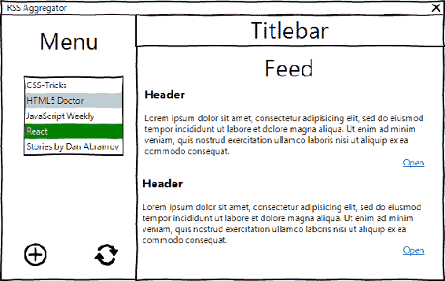
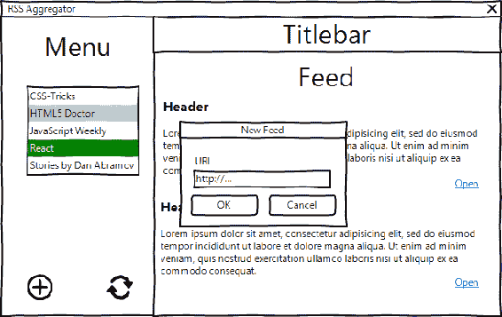
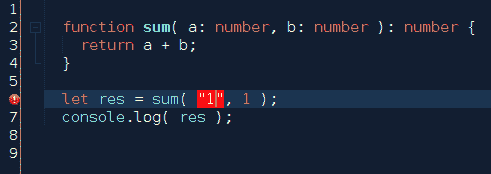

# 使用 Electron、TypeScript、React 和 Redux 创建 RSS 聚合器:规划、设计和开发

通过前面的章节，我们用纯 JavaScript、React 和 React + Redux 创建了一个应用程序。 现在我们来看看大型可伸缩 web 应用的最佳技术堆栈——TypeScript + React + Redux。 我们将开发 RSS 聚合器。 我发现它是一个很好的例子，可以展示 TypeScript 的操作，也可以研究异步操作。 此外，您将学习使用一个新的组件库 React MDL。 我们还将使用 SASS 语言编写的自定义样式对其进行扩展。

# 应用蓝图

我们开发了一个典型的工具，从可管理的源列表聚合聚合内容。 如果我们把需求分成用户故事，我们会得到这样的结果:

*   作为一个用户，我可以看到以前添加的源代码列表
*   作为用户，我可以看到聚合的内容
*   作为用户，我可以通过在菜单中选择一个源来过滤内容项

让我们再次使用**WireframeSketcher**([http://wireframesketcher.com/](http://wireframesketcher.com/))将其放到线框上:



*   作为用户，我可以打开列表旁边的项目链接



*   作为一个用户，我可以添加一个源代码
*   作为用户，我可以删除源代码
*   作为用户，我可以更新聚合的内容


# 欢迎来到打印稿

在处理大型可伸缩应用程序时，所有团队成员必须遵循已建立的体系结构。 在其他语言中，如 Java、c++、c#和 PHP，我们可以声明类型和接口。 因此，除非新功能完全满足系统架构师预期的界面，否则没有人能够使用它。 JavaScript 既没有严格的类型也没有严格的接口。 这就是为什么在 2012 年，微软的工程师们开发了一个名为**TypeScript 的 JavaScript 超集(ES2015)。** 该语言使用可选的静态类型扩展 JavaScript，并编译回 JavaScript，因此任何浏览器和操作系统都可以接受。 这类似于我们编译 ES 的方式。 接下来的第五版的 ECMAScript 与 Babel，但除此之外，给我们带来了不太可能在可预见的未来被集成到 ECMAScript 的特性。 该语言非常棒，在[https://www.typescriptlang.org/docs/home.html](https://www.typescriptlang.org/docs/home.html)中有文档说明，并提供了一个优秀的规范[http://bit.ly/2qDmdXj](http://bit.ly/2qDmdXj)。 该语言受到主流 ide 和代码编辑器的支持，可以通过插件集成到自动化工具中，如 Grunt、Gulp、Apache Maven、Gradle 等。 一些主流框架正在考虑迁移到 TypeScript，而 Angular 2+和 Dojo 2 已经包含了它。 其他框架通过定义文件向 TypeScript 公开它们的接口。

Alternatively for static type checking, one can go with **Flow** ([https://flow.org](https://flow.org)) by Facebook. Unlike TypeScript, Flow is no compiler, but a checker. Basic typings in Flow are pretty similar to the ones of TypeScript, achieved by almost the same syntax. Flow also introduces advanced types, such as array, union, intersection, and generics, but does it in its own ways. According to Facebook, they created Flow because "TypeScript isn't built around bug finding as much as they wanted."

# 为 TypeScript 设置开发环境

TypeScript 对一个人的开发经验做出了诱人的承诺。 为什么不修改一下代码，看看它的实际应用呢? 首先，我们必须为接下来的示例创建一个专用目录。 我们通过运行`npm init -y`来初始化项目，并安装`typescript`作为一个开发依赖:

```js
npm i -D typescript

```

在 manifest`scripts`部分，我们添加了一个用 TypeScript 编译源代码的命令:

`package.json`

```js
{ 
... 
"scripts": { 
    "build": "tsc" 
  }, 
... 
} 

```

我们需要让 TypeScript 知道我们到底想从它那里得到什么。 我们将在配置文件中描述:

`tsconfig.json`

```js
{ 
  "compilerOptions": { 
    "target": "ES6", 
    "module": "CommonJS", 
    "moduleResolution": "node", 
    "sourceMap": true, 
    "outDir": "./build" 
  }, 

  "include": [ 
    "./**/*" 
  ], 
  "exclude": [ 
    "node_modules" 
  ] 
} 

```

这里，我们将 TypeScript 编译器设置为在项目目录中除`node_modules`之外的任何地方搜索`ts`源。 在`compilerOptions`中，我们指定了在编译期间如何处理源代码。 字段`target`是在`ES6`中设置的，这意味着 TypeScript 将被编译成 ES6/ES2016 语法，这已经在所有现代浏览器中得到了完全支持。 在外地`module`，我们有`CommonJS`。 因此，TypeScript 会将源代码捆绑到 commonjs 兼容的模块中，这些模块可以很好地在 Node.js 环境中运行。 对于`moduleResolution`字段，我们选择支持 Node.js 模块解析样式。 在字段`outDir`中，我们确定 TypeScript 将把编译后的模块存储在哪里。 关于编译器选项的更多信息可以在[http://bit.ly/2t9fckV](http://bit.ly/2t9fckV)上找到。

# 基本类型

现在看来开发环境已经准备好了，所以我们可以用一个基本示例来测试:

`example.ts`

```js
let title: string = "RSS Aggregator"; 

```

我们使用 TypeScript 的类型注释特性来设置变量的约束。 这是那么容易; 我们只需要像`:type`一样使用所谓的**声明空间**来扩展该声明，其中 type 可以是基本类型(布尔类型、数字、字符串、数组、void、any 以及其他一些类型)、类、接口、类型别名、enum 和 import 中的一种。 这里，我们应用了`string`，这意味着 title 只接受字符串。

用`npm run build`编译后，可以在`./build`目录下找到文件`example.js`，内容如下:

`build/example.js`

```js
let title = "RSS Aggregator"; 

```

你看，它没有多大作用; 它只是删除了类型提示。 这就是 TypeScript 类型检查在编译时发生而在运行时消失的神奇之处。 因此，我们从 TypeScript 中受益，而不会对应用程序的性能产生任何影响。

好吧，让我们做一件讨厌的事情，给变量设置一个值，违反给定的约束:

`example.ts`

```js
let title: string = "RSS Aggregator"; 
title = 1; 

```

在编译时，我们收到一个错误消息:

```js
error TS2322: Type '1' is not assignable to type 'string'. 

```

嗯; TypeScript 会在我们做错事时警告我们。 更令人兴奋的是，如果你的 IDE 支持 TypeScript，你会在打字时收到动态通知。 我建议检查列表[http://bit.ly/2a8rmTl](http://bit.ly/2a8rmTl)，如果你的 IDE 不存在，选择最适合你的 IDE。 我推荐**Alm**([http://alm.tools](http://alm.tools))作为同时使用 TypeScript、React 和 Redux 的一个很好的例子。 然而，我自己，在 10 年前拉了**NetBeans**([https://netbeans.org/](https://netbeans.org/))，它从来没有让我失望。 它不支持本地 TypeScript，但是你可以通过安装**TypeScript 编辑器插件**([https://github.com/Everlaw/nbts](https://github.com/Everlaw/nbts))轻松获得。

让我们对类型注释进行更多的研究。 我们取一个函数并为进入点和退出点定义一个契约:

`example.ts`

```js
function sum( a: number, b: number ): number { 
  return a + b; 
} 
 let res = sum( 1, 1 ); 
console.log( res ); 

```

实际上，我们在这里声明函数接受两个数字并返回一个数字。 现在，如果我们给函数任何不同于 number 的类型，IDE 都会立即提醒我们:



# 数组、普通对象和可索引类型

好吧，我相信，对于原始类型，它或多或少是清楚的，但其他的呢，例如数组? 通过将基本类型与`[]`组合，我们定义了一个数组类型:

```js
let arr: string[]; 

```

在这里，我们声明变量`arr`，它是一个字符串数组。 我们可以用下面的语法实现同样的目的:

```js
let arr: Array<string>; 

```

或者，我们可以用接口来做:

```js
interface StringArray { 
  [ index: number ]: string; 
} 
 const arr: StringArray = [ "one", "two", "tree" ]; 

```

在使用所谓的**索引签名**声明`StringArray`接口时，我们对类型结构设置约束。 它接受数字索引和字符串值。 换句话说，它是一个字符串数组。 我们可以进一步对数组的长度进行约束:

```js
interface StringArray { 
  [ index: number ]: string; 
  length: number; 
} 

```

对于普通对象，我们可以使用一个接口来描述预期的形状:

```js
interface MyObj {  
  foo: string; 
  bar: number; 
} 
let obj: MyObj; 

```

另一方面，我们可以设置与对象类型 literal 内联的约束:

```js
let obj: { foo: string, bar: number }; 
// or 
function request( options: { uri: string, method: string } ): void { 
}

```

如果能够声明一个值对象([http://bit.ly/2khKSBg](http://bit.ly/2khKSBg))，则需要确保不可变性。 幸运的是，TypeScript 允许我们指定对象的成员为`readonly`:

```js
interface RGB { 
    readonly red: number; 
    readonly green: number; 
    readonly blue: number; 
} 
 let green: RGB = { red: 0, green: 128, blue: 0 }; 

```

我们可以访问一个百分比，例如，`RGB`类型的颜色中的红色。 但是我们不能为已声明的颜色更改 RGB 级别。 如果我们尝试这样做，我们将得到如下错误:

```js
error TS2540: Cannot assign to 'red' because it is a constant or a read-only property. 

```

对于任意属性的对象，我们可以使用索引签名来目标字符串键:

```js
interface DataMap { 
  [ key: string ]: any; 
} 

const map: DataMap = { foo: "foo", bar: "bar" }; 

```

注意，在`DataMap`中，我们为成员类型设置了`any`。 因此，我们允许任何值类型。

# 函数类型

我们可以使用函数类型 literal 来设置函数的约束:

```js
const showModal: (toggle: boolean) => void =  
  function( toggle )  { 
    console.log( toggle ); 
  } 

```

我觉得这很令人沮丧，我更喜欢使用界面:

```js
interface Switcher { 
  (toggle: boolean): void; 
} 

const showModal:Switcher = ( toggle ) => { 
  console.log( toggle ); 
} 

showModal( true ); 

```

你现在可能会问，如果函数有可选参数呢? TypeScript 让定义一个可选参数变得非常简单。 你只需要在参数后面加上一个问号:

```js
function addOgTags(title: string, description?: string): string { 
  return ` 
    <meta property="og:title" content="${title}" /> 
    <meta property="og:description" content="${description || ""}" /> 
    } 

```

我们将`description`设为可选的，这样就可以以两种方式调用该函数:

```js
addOgTags( "Title" ); 
addOgTags( "Title", "Description" ); 

```

这些都没有违反声明的接口; 到目前为止，我们给它字符串。

以几乎相同的方式，我们可以定义可选的对象成员:

```js
interface IMeta { 
  title: string; 
  description?: string; 
} 

function addOgTags( meta: IMeta ): string { 
} 

```

# 类类型

在其他语言中，我们习惯于认为接口与类密切相关。 TypeScript 带来了类似的开发体验。 此外，虽然 Java 和 PHP 接口不能包含实例属性，但 TypeScript 没有这样的限制:

```js
interface Starship { 
  speed: number;  
  speedUp( increment: number ): void; 
} 

class LightFreighter implements Starship { 
  speed: number = 0; 
  speedUp( increment: number ): void { 
    this.speed = this.speed + increment; 
  } 
} 

let millenniumFalcon = new LightFreighter(); 
millenniumFalcon.speedUp( 100 ); 

```

随着 ES2015/2016 的进步，类在 JavaScript 中被广泛使用。 不过，TypeScript 允许我们设置成员的可访问性。 因此，当我们允许从代码消费对象实例访问一个成员时，我们将其声明为`public`。 我们使用`private`来确保成员不会在其包含类的外部被访问。 此外，`protected`成员与`private`相似，只是它们可以在任何派生类实例中访问:

```js
class LightFreighter implements Starship { 
  private speed: number = 0; 
  public speedUp( increment: number ): void { 
    this.speed = this.speed + increment; 
  } 
} 

```

如您所见，`speed`的值是硬编码的。 如果我们的类可以在初始化时配置为初始化速度，那就再合适不过了。 让我们来做重构:

```js
class LightFreighter implements Starship { 
  constructor( private speed: number = 0 ) { 
  } 
  public speedUp( increment: number ): void { 
    this.speed = this.speed + increment; 
  } 
} 

```

这里，我们使用了 TypeScript 的另一个很好的特性，这也是我个人很感兴趣的。 它被称为**参数属性**。 我们经常声明私有属性并使用构造函数参数填充它们。 在 TypeScript 中，我们可以简单地在形参前加上一个可访问性修饰符，这将导致一个分别命名的属性接受形参的值。 因此，在前面的代码中，在参数列表中使用`private speed`，我们声明了`speed`参数并将一个传入值赋给它。 通过对默认参数使用 ES6 语法，当没有任何参数传入构造函数`constructor( speed = 0 )`时，我们将`speed`设为零。

# 抽象类

就像你在其他语言中所习惯的那样，在 TypeScript 中，我们可以使用抽象类和方法。 抽象类只用于扩展。 不能创建抽象类的实例。 定义为抽象的方法需要在任何子类中实现:

```js
abstract class Starship { 
  constructor( protected speed: number = 0 ) { 

  } 
  abstract speedUp( increment: number ): void; 
} 

class LightFreighter extends Starship { 

  public speedUp( increment: number ): void { 
    this.speed = this.speed + increment; 
  } 
} 

```

抽象类与接口非常相似，只是一个类可以实现多个接口，但只能扩展一个抽象类。

# 枚举类型

我们一次又一次地使用常量来定义一组逻辑上相关的实体。 使用 TypeScript，我们可以声明一个用不可变数据填充的枚举类型，然后通过该类型引用整个集合:

```js
const enum Status { 
    NEEDS_PATCH, 
    UP_TO_DATE, 
    NOT_INSTALLED 
} 

function setStatus( status: Status ) { 
  // ... 
} 

setStatus( Status.NEEDS_PATCH ); 

```

这里，我们声明一个类型`Status`，它接受一个预定义值(`NEEDS_PATCH`、`UP_TO_DATE`和`NOT_INSTALLED`)。 函数`setStatus`期望`status`参数为`Status`类型。 如果你传入任何其他值，TypeScript 就会报告一个错误:

```js
setStatus( "READY" ); 
//  error TS2345: Argument of type '"READY"' is not assignable to parameter of type 'STATUS'. 

```

或者，我们可以使用引用组的任意字符串值的字符串类型:

```js
function setStatus( status: "NEEDS_PATCH" | "UP_TO_DATE" | "NOT_INSTALLED" ) { 
  // ... 
} 
setStatus( "NEEDS_PATCH" ); 

```

# 并交类型

到目前为止很有趣，不是吗? 你会对它说什么呢:在 TypeScript 中，我们可以同时引用多个类型。 例如，我们有两个接口`Anakin`和`Padmé`，需要从这两个接口继承一个新类型(`Luke`)。 我们可以很容易地做到这一点:

```js
interface Anakin { 
  useLightSaber: () => void; 
  useForce: () => void; 
} 
interface Padmé { 
  leaderSkills: string[]; 
  useGun: () => void; 
} 
type Luke = Anakin & Padmé; 

```

此外，我们可以在不显式声明类型的情况下执行交集:

```js
function joinRebelion( luke: Anakin & Padmé ){   
}

```

我们还可以定义一个联合类型，允许组的任何类型。 你知道`jQuery`图书馆吧? 函数`jQuery`接受多个不同类型的选择器参数，并返回`jQuery`实例。 它怎么可能被一个接口覆盖呢?

```js
interface PlainObj { 
  [ key: string ]: string; 
} 
interface JQuery { 
} 

function jQuery( selector: string | Node | Node[] | PlainObj | JQuery ): JQuery { 
  let output: JQuery = {} 
  // ... 
  return output; 
} 

```

当一个函数根据传入的类型返回一个类型时，我们可以声明一个接口来描述所有可能的用例:

```js
interface CreateButton { 
  ( tagName: "button" ): HTMLButtonElement; 
  ( tagName: "a" ): HTMLAnchorElement; 
} 

```

实现此接口的函数接受一个字符串作为`tagName`参数。 如果值是`"button"`，函数返回`Button`元素。 如果是`"a"`，则返回`Anchor`元素。

One can find available DOM-related interfaces in the specification at [https://www.w3.org/TR/DOM-Level-2-HTML/html.html](https://www.w3.org/TR/DOM-Level-2-HTML/html.html).

# 泛型类型

我们刚才检查的类型是指一个具体的类型组合。 此外，TypeScript 还支持所谓的**泛型**，它可以帮助在不同的上下文中重用已经创建好的接口。 例如，如果我们想要一个数据地图的接口，我们可以这样做:

```js
interface NumberDataMap { 
  [ key: string ]: number; 
} 

```

但是这个`NumberDataMap`只接受数字作为成员值。 假设，对于字符串值，我们必须创建一个新的接口，例如`StringDataMap`。 或者，我们可以声明一个泛型`DataMap`，在引用时设置一个任意的值类型约束:

```js
interface DataMap<T> { 
  [ key: string ]: T; 
} 

const numberMap: DataMap<number> = { foo: 1, bar: 2 }, 
      stringMap: DataMap<string> = { foo: "foo", bar: "bar" }; 

```

# 全球图书馆

是的，TypeScript 在编写新代码时确实是一种令人印象深刻的语言。 但是现有的非 typescript 库呢? 例如，我们将使用 React 和 Redux 模块。 它们是用 JavaScript 写的，而不是 TypeScript。 幸运的是，主流库已经提供了 TypeScript 声明文件。 我们可以使用 npm 为每个模块安装这些文件:

```js
npm i -D @types/react 
npm i -D @types/react-dom 

```

现在，当我们用这些模块做一些愚蠢的尝试时，我们会立即收到问题的通知:

```js
import * as React from "react"; 
import * as ReactDOM from "react-dom"; 

ReactDOM.render( 
  <div></div>, 
  "root" 
); 

```

在编译或甚至在键入时，您将得到错误:

```js
error TS2345: Argument of type '"root"' is not assignable to parameter of type 'Element'. 

```

很好; 而不是 HTML 元素(例如，`document.getElementById( "root" )`)，我传递给`ReactDOM.render`一个字符串作为第二个参数。

然而，老实说，并不是每个库都提供了 TypeScript 声明。 例如，在*RSS 聚合器*应用程序中，我将使用`feedme`库([https://www.npmjs.com/package/feedme](https://www.npmjs.com/package/feedme))通过 URL 获取和解析 RSS。 碰巧，库中没有声明文件。 幸运的是，我们可以快速创建一个:

`feedme.d.ts`

```js
declare class FeedMe { 
  new ( flag?: boolean ): NodeJS.WritableStream; 
  on( event: "title", onTitle: ( title: string ) => void): void; 
  on( event: "item", onItem: ( item: any ) => void ): void; 
} 

```

模块`feedme`公开了一个类`FeedMe`，但是 TypeScript 并不知道这些模块; 它还没有在 TypeScript 作用域中声明。 因此，我们使用`feedme.d.ts (declare class FeedMe)`中的环境声明在作用域中引入一个新值。 我们声明接受类型`boolean`的可选标志并返回 Node.js`WriteStream`对象的类构造函数。 我们使用重载来描述函数使用的两种情况。 在第一种情况下，它接收到一个字符串`"title"`来对应`event`，并期望一个回调来处理 RSS 标题。 在第二种情况下，它接受事件`"title"`，然后期望一个回调来处理 RSS 条目。

现在，我们可以从服务中使用新创建的声明文件:

```js
/// <reference path="./feedme" /> 
import http = require( "http" ); 
var FeedMe = require( "feedme" ); 

http.get('http://feeds.feedburner.com/TechCrunch/startups', ( res ) => { 
  const parser = new FeedMe( true ); 
  parser.on( "title", ( title: string ) => { 
    console.log( title ); 
  }); 
  res.pipe( parser ); 
}); 

```

使用一个三斜杠指令，我们在项目中包含了`feedme.d.ts`。 在它完成之后，TypeScript 会验证`FeedMe`是否根据其接口被使用。

# 创建静态原型

我假设，在这一点上，我们已经足够了解 TypeScript，可以开始应用程序了。 与前面的示例一样，我们首先要做的是静态原型。

# 为应用程序设置开发环境

我们必须为项目建立开发环境。 因此，我们指定一个目录，并将以下清单放在那里:

`./package.json`

```js
{ 
  "name": "rss-aggregator", 
  "title": "RSS Aggregator", 
  "version": "1.0.0", 
  "main": "./app/main.js", 
  "scripts": { 
    "build": "webpack", 
    "start": "electron .", 
    "dev": "webpack -d --watch"  
  } 
} 

```

根据任何 Electron 应用程序的要求，我们在`main`字段中设置主进程脚本的路径。 我们还定义了脚本命令，用于运行 Webpack 进行构建和监视。 我们设置了一个脚本命令来使用 Electron 运行应用程序。 现在，我们可以安装依赖项了。 我们肯定需要 TypeScript，因为我们要用它来构建应用:

```js
npm i -D typescript 

```

对于绑定，我们将使用 Webpack，就像我们在 Chat 和 Screen capture 应用中使用的那样，但这一次，我们使用的不是`babel-loader`，而是`ts-loader`，因为我们的源文件是在 TypeScript 语法中:

```js
npm i -D webpack 
npm i -D ts-loader 

```

我们还安装了 Electron 以及在创建 Chat 应用程序时已经检查过的相关模块:

```js
npm i -D electron 
npm i -D electron-debug 
npm i -D electron-devtools-installer 

```

最后，我们安装 React 声明文件:

```js
npm i -D @types/react 
npm i -D @types/react-dom 

```

为了访问 Node.js 的接口，我们还安装了相应的声明:

```js
npm i -D @types/node 

```

现在，我们可以配置 Webpack:

`./webpack.config.js`

```js
const path = require( "path" ); 
module.exports = { 
  entry: "./app/ts/index.tsx", 
  output: { 
    path: path.resolve( __dirname, "./app/build/js/" ), 
    filename: "bundle.js" 
  }, 

  target: "electron-renderer", 
  devtool: "source-map", // enum 
  module: { 
    rules: [ 
      { 
        test: /\.tsx?$/, 
        use: "ts-loader" 
      } 
    ] 
  } 
}; 

```

在这里，我们将条目脚本设置为`app/ts/index.tsx`和`./app/build/js/bundle.js`作为输出。 我们将 Webpack 定位于 Electron(`electron-renderer`)，并启用源地图生成。 最后，我们指定一个规则，使 Webpack 使用`ts-loader`插件处理任何`.ts`/`.tsx`文件。

因此，如果我们请求一个文件，比如`require("./path/file.ts")`或`import {member} from "./path/file.ts"`，Webpack 会在捆绑过程中使用 TypeScript 对其进行编译。 我们可以更方便地使用 Webpack 选项`resolve`:

`./webpack.config.js`

```js
{ 
... 
resolve: { 
    modules: [ 
      "node_modules", 
      path.resolve(__dirname, "app/ts") 
    ], 

    extensions: [ ".ts", ".tsx", ".js"] 
  }, 
... 
} 

```

在这里，我们声明任何遇到的模块名称 Webpack 都试图针对`node_modules`和`app/ts`目录进行解析。 所以，如果我们像这样访问一个模块，我们将会有以下内容:

```js
import {member} from "file.ts" 

```

根据我们的配置，Webpack 首先检查`node_modules/file.ts`是否存在，然后再检查`app/ts/file.ts`是否存在。 因为我们把`.ts`扩展名列为可解析的，所以可以从模块名中省略它:

```js
import {member} from "file" 

```

剩下的只是 TypeScript 的配置:

`tsconfig.json`

```js
{ 
  "compilerOptions": { 
    "target": "es6", 
    "module": "commonjs", 
    "moduleResolution": "node", 
    "sourceMap": false, 
    "outDir": "../dist/", 
    "jsx": "react" 
  }, 

  "files": [ 
    "./app/ts/index.tsx" 
  ] 
} 

```

它与我们在 TypeScript 介绍的例子中创建的几乎相同，除了这里，我们没有将编译器指向某个目录，而是显式地指向入口脚本。 我们还通知编译器，它将使用 JSX。

# React-MDL

以前，在处理 Screen capture 时，我们研究了组件库 Material UI。 这并不是 React 可用的材料设计的唯一实现。 这一次，让我们尝试另一个——**React MDL**([https://react-mdl.github.io/react-mdl/](https://react-mdl.github.io/react-mdl/))。 因此，我们安装了这个库及其附带的声明:

```js
npm i -S react-mdl 
npm i -D @types/react-mdl 

```

根据文档，我们通过导入来启用库:

```js
import "react-mdl/extra/material.css"; 
import "react-mdl/extra/material.js"; 

```

哦! 哦! Webpack 将无法解析 CSS 模块，直到我们相应地配置它。 首先，我们必须告诉 Webpack 在`node_modules`目录中查找`react-mdl/extra/material.css`和`react-mdl/extra/material.js`:

```js
./webpack.config.js 
{ 
... 
resolve: { 
   modules: [ 
        "node_modules", 
        path.resolve(__dirname, "app/ts") 
      ], 
      extensions: [ ".ts", ".tsx", ".js", ".css"] 
  }, 
... 
} 

```

其次，我们添加了一个规则来处理 CSS 与`css-loader`插件:

`./webpack.config.js`

```js
{ 
... 
module: { 
  rules: [ 
    ... 
    { 
      test: /\.css$/, 
      use: [ 
          "style-loader", 
          "css-loader" 
        ] 
    } 
  ] 
}, 

... 
} 

```

现在，当遇到`import "react-mdl/extra/material.css"`时，Webpack 加载样式并将它们嵌入到页面中。 但在 CSS 内容中，有自定义`.woff`字体的链接。 我们需要让 Webpack 加载引用的字体文件:

`./webpack.config.js`

```js
{ 
... 
module: { 
  rules: [ 
    ... 
    { 
       test: /\.woff(2)?(\?v=[0-9]\.[0-9]\.[0-9])?$/, 
       use: { 
         loader: "url-loader", 
         options: { 
           limit: 1000000, 
           mimetype: "application/font-woff" 
         } 
       } 
    } 
  ] 
}, 

... 
} 

```

现在，我们必须安装上述两个加载器:

```js
npm i -D css-loader 
npm i -D style-loader 

```

# 创建 index . html

在 Electron 应用程序中，我们通常关心的第一件事是创建应用程序窗口的主进程脚本。 对于这个应用程序，我们没有引入任何关于它的新概念，所以我们可以重用聊天应用程序的`main.js`。

`index.html`将非常简单:

```js
app/index.html
<!DOCTYPE html>
<html lang="en">
   <head>
      <link rel="stylesheet" href="https://fonts.googleapis.com/icon?
      family=Material+Icons">
     <title>RSS Aggregator</title>
 </head>
   <body>
        <div id="root"></div> 
       <script src="./build/js/bundle.js"></script>
  </body>
</html>

```

基本上，我们加载谷歌的 Material Icons 字体并声明边界元素(`div#root`)。 当然，我们必须加载由 Webpack/TypeScipt JavaScript 生成的。 它位于`build/js/bundle.js,`，与我们在`./webpack.config.js`中配置的完全一致。

接下来，我们编写入口脚本:

`./app/ts/index.tsx`

```js
import "react-mdl/extra/material.css"; 
import "react-mdl/extra/material.js"; 

import * as React from "react"; 
import * as ReactDOM from "react-dom"; 
import App from "./Containers/App"; 

ReactDOM.render( 
  <App />, 
  document.getElementById( "root" ) 
); 

```

如您所见，除了导入 React-MDL 资产之外，它与我们在 Screen capurer 静态原型中拥有的内容类似。 至于 TypeScript，它实际上不需要在代码中做任何改变。 然而，现在我们确实为所使用的模块(`./node_modules/@types/react-dom/index.d.ts`)提供了类型化的接口，这意味着如果我们违反了约束，例如`ReactDOM.render`，我们就会得到一个错误。

# 创建容器组件

现在让我们创建我们在入口脚本中引用的`container`组件:

`./app/ts/Containers/App.tsx`

```js
import { Layout, Content } from "react-mdl"; 
import * as React from "react"; 

import TitleBar from "../Components/TitleBar"; 
import Menu from "../Components/Menu"; 
import Feed from "../Components/Feed"; 

export default class App extends React.Component<{}, {}> { 

  render() { 
    return ( 
      <div className="main-wrapper"> 
        <Layout fixedHeader fixedDrawer> 
          <TitleBar /> 
          <Menu /> 
          <Content> 
            <Feed  /> 
          </Content> 
        </Layout> 
      </div> 
    ); 
  } 
} 

```

这里，我们从 React-MDL 库导入组件`Layout`和`Content`。 我们使用它们来布局自定义组件`TitleBar`、`Menu`和`Feed`。 根据 React 声明文件`(./node_modules/@types/react/index.d.ts`，`React.Component`是一个泛型类型，所以我们必须为它提供状态和道具的接口`React.Component<IState, IProps>.`在静态原型中，我们既没有状态也没有道具，所以我们可以使用空类型。

# 创建 TitleBar 组件

下一个组件将代表标题栏:

`./app/ts/Components/TitleBar.tsx`

```js
import * as React from "react"; 
import { remote } from "electron"; 
import { Header, Navigation, Icon } from "react-mdl"; 

export default class TitleBar extends React.Component<{}, {}> { 

  private onClose = () => { 
    remote.getCurrentWindow().close(); 
  } 
  render() { 
    return ( 
     <Header  scroll> 
        <Navigation> 
            <a href="#" onClick={this.onClose}><Icon name="close" />
            </a> 
        </Navigation> 
    </Header> 
    ); 
  } 
} 

```

在这里，我们使用 React MDL 的`Header`、`Navigation`和`Icon`组件设置外观，并订阅关闭图标上的点击事件。 此外，我们导入`electron`模块的`remote`对象，并通过`getCurrentWindow`方法访问当前窗口对象。 它有我们用来关闭窗口的方法`close`。

我们的`Menu`组件将包含聚合提要的列表。 通过`add`和`remove`按钮，用户可以管理列表。 按钮`autorenew`用于更新所有提要。

# 创建 Menu 组件

我们将保持 feed 菜单在 React MDL 的`Drawer`组件中，自动显示在宽屏幕上，隐藏在小屏幕上的汉堡菜单中:

`./ts/Components/Menu.tsx`

```js
import * as React from "react"; 
import { Drawer, Navigation, Icon, FABButton } from "react-mdl"; 

export default class Menu extends React.Component<{}, {}> { 

  render (){ 

    return ( 
     <Drawer  className="mdl-color--blue-grey-900 mdl-
     color-text--blue-grey-50"> 
        <Navigation className="mdl-color--blue-grey-80"> 
          <a> 
             <Icon name="& #xE0E5;" /> 
             Link title 
          </a> 
        </Navigation> 
        <div className="mdl-layout-spacer"></div> 
        <div className="tools"> 
          <FABButton mini> 
              <Icon name="add" /> 
          </FABButton> 

          <FABButton mini> 
              <Icon name="delete" /> 
          </FABButton> 

          <FABButton mini> 
              <Icon name="autorenew" /> 
          </FABButton> 
        </div> 
      </Drawer> 
    ); 
  } 
} 

```

# 创建提要组件

最后，我们要关注的主要部分，我们将显示活动提要内容:

`./app/ts/Components/Feed.tsx`

```js
import * as React from "react"; 
import { Card, CardTitle, CardActions, Button, CardText } from "react-mdl"; 

export default class Feed extends React.Component<{}, {}> { 
  render(){ 
    return ( 
      <div className="page-content feed-index"> 
        <div className="feed-list"> 

          <Card shadow={0} style={{width: "100%", height: "auto", 
          margin: "auto"}}> 
             <CardTitle expand style={{color: "#fff", backgroundColor: 
             "#46B6AC"}}> 
             Title 
             </CardTitle> 
             <CardText> 
                  Lorem ipsum dolor sit amet, consectetur adipiscing 
                  elit. Cras lobortis, mauris quis mollis porta 
             </CardText> 
             <CardActions border> 
                  <Button colored>Open</Button> 
             </CardActions> 
           </Card> 

        </div> 

        <div className="feed-contents"></div> 
      </div> 
    ); 
  } 
} 

```

在`.feed-list`容器中，我们显示 RSS 条目列表，每个条目都用 React MDL 的`Card`组件包装。 容器`.feed-contents`是项内容的占位符。

一切都准备好了。 我们可以建立并开始:

```js
npm run build
npm start

```

的输出是:


# 添加自定义风格与 SASS

看起来，生成的 UI 需要额外的样式。 我建议我们在 SASS 中编码我们的定制风格:

`./app/sass/app.scss`

```js
 .main-wrapper { 
  height: 100vh; 
} 

```

首先，我们使顶层元素(`./app/ts/Containers/App.tsx`)始终适应实际的窗口高度。

此外，我们声明一个变量来固定标题栏的高度，并设置提要条目和条目内容容器的布局:

`./app/sass/app.scss`

```js
$headrHeight: 66px; 

.feed-index { 
  display: flex; 
  flex-flow: row nowrap; 
  overflow-y: auto; 
  height: calc(100vh - #{$headrHeight}); 
  &.is-open { 
    overflow-y: hidden; 
    .feed-list { 
      width: 50%; 
    } 
    .feed-contents { 
      width: 50%; 
    } 
  } 
} 
.feed-list { 
  flex: 1 0 auto; 
  width: 100%; 
  transition: width 200ms ease; 
} 
.feed-contents { 
  flex: 1 0 auto; 
  width: 0; 
  transition: width 200ms ease; 
} 

```

最初，提要条目容器(`.feed-list`)的宽度是 100%，而条目内容 1(`.feed-contents`)是隐藏的(`width:0`)。 当父容器(`.feed-index`)接收到带有`is-open`类的新状态时，两个子容器都优雅地移动到`50%`宽度。

最后，我们在菜单组件中布局动作按钮:

`./app/sass/app.scss`

```js
.tools { 
  height: 60px; 
  display: flex; 
  flex-flow: row nowrap; 
  justify-content: space-between; 
} 

```

我们已经引入了一个新的源类型(SASS)，所以我们必须调整 Webpack 的配置:

`./webpack.config.js`

```js
{ 
... 
resolve: { 
   modules: [ 
        "node_modules", 
        path.resolve(__dirname, "app/ts"), 
        path.resolve(__dirname, "app/sass") 
      ], 
      extensions: [ ".ts", ".tsx", ".js", ".scss", ".css"] 
  }, 
... 
} 

```

现在，Webpack 接受`.scss`模块名，并在`app/sass`中查找源代码。 我们还必须配置 Webpack 来在 CSS 中编译 SASS:

`./webpack.config.js`

```js
{ 
... 
module: { 
  rules: [ 
    ... 
    { 
      test: /\.scss$/, 
      use: [ 
          "style-loader", 
          "css-loader", 
          "sass-loader" 
        ] 
    } 
  ] 
}, 

... 
} 

```

这里我们可以确定，在解析`.scss`文件时，Webpack 使用`sass-loader`插件将 SASS 转换为 CSS，然后通过`css-loader`、`style-loader`加载生成的 CSS。 所以，我们现在有一个缺失的依赖项`sass-loader`; 让我们安装它:

```js
npm i -D sass-loader 

```

这个模块依赖于`node-sass`编译器，所以我们也需要它:

```js
npm i -D node-sass 

```

为什么不去看看我们得到了什么。 所以我们建立并开始:

```js
npm run build
npm start

```

应用程序现在看起来更好:


# 总结

在本章中，我们深入探讨了 TypeScript。 我们研究了变量声明和参数约束中的基本类型。 我们修改了数组和普通对象的接口。 您学习了接口函数和类。 我们注意到抽象特性，例如成员可访问性修饰符、参数属性、抽象类和方法。 您学习了如何使用枚举类型和字符串字面值处理组实体。 我们研究了泛型类型接口的重用。 我们还看到了如何为全局库安装 TypeScript 声明，以及在没有任何声明的情况下如何编写自己的 TypeScript 声明。 我们开始开发应用程序。 因此，我们建立了 Webpack 来查找和处理`.ts`/`.tsx`模块以及加载 CSS 和 web 字体。 我们使用 React MDL 库的组件来创建 UI。 我们用 SASS 加载器扩展了 Webpack 配置来处理我们的自定义样式。 我们最终得到了一个可用的静态原型。