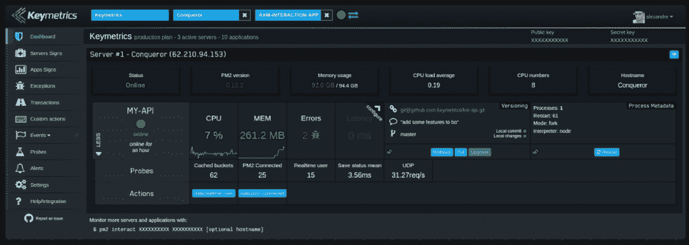
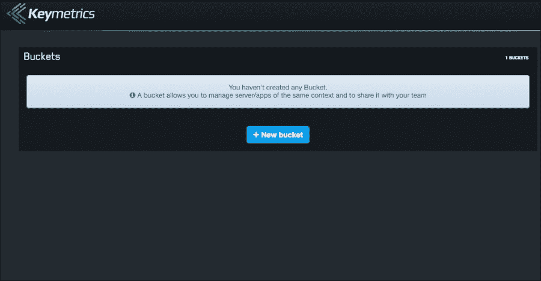
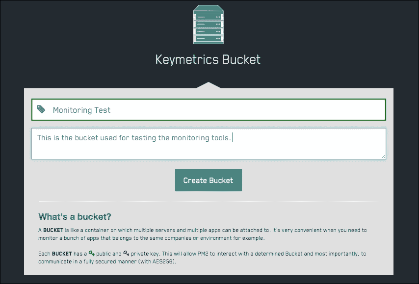
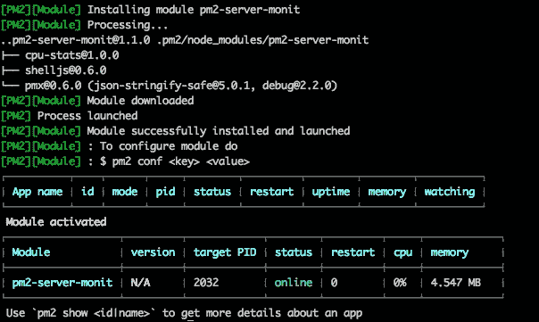
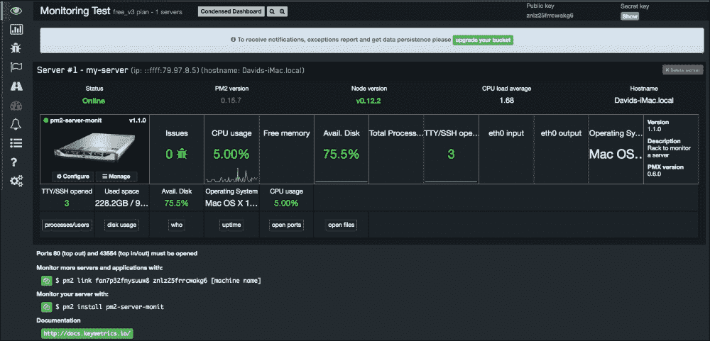
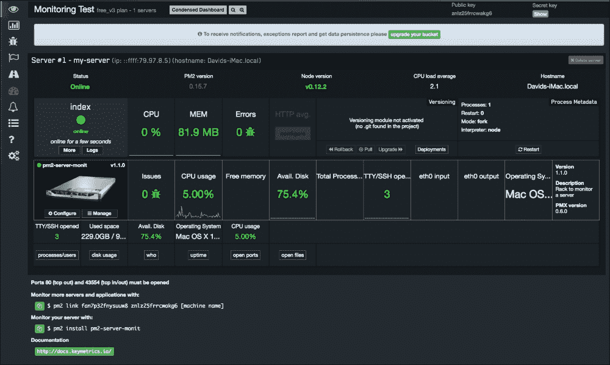
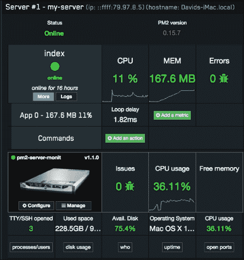
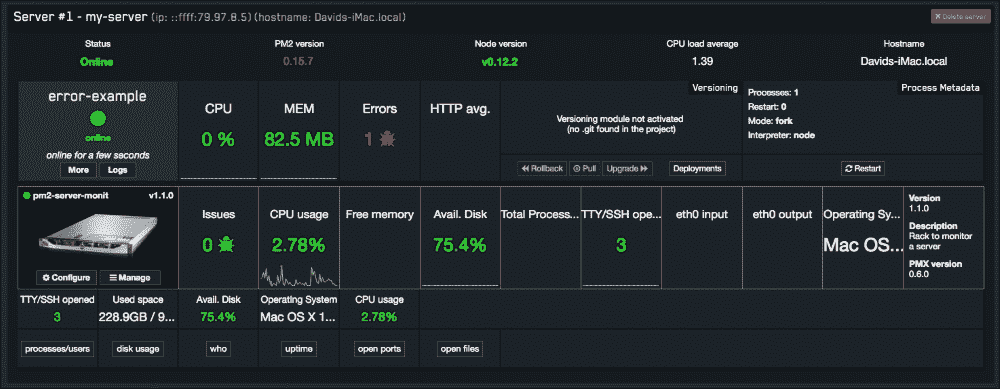

# 七、监控微服务

监视服务器一直是一个有争议的话题。 它通常属于系统管理，软件工程师甚至不去接近它，但是我们正在失去监控的一个巨大好处:*快速响应故障的能力*。 通过非常密切地监控我们的系统，我们几乎可以立即意识到问题，因此纠正问题的行动甚至可以避免我们对客户的影响。 除了监视之外，还有性能的概念。 通过了解系统在负载期间的行为，我们将能够预测系统伸缩的必要性。 在本章中，我们将讨论如何监控服务器，特别是微服务，以保持系统的稳定性。

在本章中，我们将涵盖以下主题:

*   监控服务
*   使用 PM2 和 Keymetrics 进行监视
*   监测指标
*   Simian Army - Spotify 的积极监控
*   吞吐量和性能下降

# 监控服务

在监视一个微服务时，我们对几种不同类型的指标感兴趣。 第一大组指标是硬件资源，如下所述:

*   **内存指标**:这表示系统中还有多少内存，或者应用程序消耗了多少内存
*   **CPU 利用率**:顾名思义，这表示在给定时间内我们使用了多少 CPU
*   **硬盘利用率**:此表示物理硬盘的 I/O 压力

第二大组是应用程序指标，如下:

*   每个时间单位的错误数
*   每个时间单位的调用数
*   响应时间

尽管两个组都是连接的，而且硬件中的问题会影响应用程序的性能(反之亦然)，但了解所有这些问题是必须的。

如果我们的服务器是一台 Linux 机器，硬件指标很容易查询。 在 Linux 上，所有神奇的硬件资源都在`/proc`文件夹中。 这个文件夹是由系统的内核维护的，它包含关于系统在系统的许多方面是如何运行的文件。

软件指标更难收集，我们将使用 PM2 创建者的**关键指标**来监控我们的 Node.js 应用程序。

## 使用 PM2 和 Keymetrics 进行监控

正如我们之前看到的，PM2 是运行 Node 应用程序的非常强大的工具，但是它也非常善于监视生产服务器中的独立应用程序。 然而，根据您的业务案例，访问产品并不总是容易。

PM2 的创建者通过创建 Keymetrics 解决了这个问题。 Keymetrics 是一个**软件即服务(SaaS**)组件,允许 PM2 发送网站通过网络监控数据,如下图所示(如发现[https://keymetrics.io/【显示】):](https://keymetrics.io/)****

 **

尽管 Keymetrics 不是免费的，但它提供了一个免费层来演示它是如何工作的。 我们将在本章中用到它。

我们需要做的第一件事就是注册用户。 一旦我们进入我们的帐户，我们应该看到类似以下屏幕:



这个屏幕要求我们创建一个桶。 Keymetrics 使用桶的概念来定义上下文。 例如，如果我们的组织有不同的区域(支付、客户服务等)，每个区域上有不同的服务器，我们可以监视一个 bucket 中的所有服务器。 对于在一个桶中可以有多少服务器没有限制。 甚至可以将所有组织都放在同一个 bucket 中，以便方便访问所有内容。

让我们创建一个名为`Monitoring Test`的桶，如下图所示:



简单，一旦我们点击**Create Bucket**，Keymetrics 将显示一个屏幕，显示启动应用程序所需的信息，如下图所示:


正如您可以看到的，屏幕显示了 Keymetrics 使用的私钥的信息。 通常，与任何人共享这个密钥是一个非常糟糕的主意。

如屏幕上所示，下一步是配置 PM2 以将数据推入 Keymetrics。 还有一些有用的信息是关于使 Keymetrics 工作所需的网络:

*   PM2 将在 Keymetrics 上将数据推入端口**80**
*   Keymetrics 将在端口**43554**上将数据推回给我们

通常，在大型组织中，有关于网络的限制，但如果您在家里测试，一切都应该是直接工作。

为了使 PM2 能够向 Keymetrics 发送指标，我们需要安装一个名为`pm2-server-monit`的 PM2 模块。 这是一个相当简单的任务:

```js
pm2 install pm2-server-monit

```

这将导致类似如下的输出:



让我们运行 advise 命令:

```js
pm2 link fan7p32fnysuuw8 znlz25frrcwakg6 my-server

```

在这个的例子中，我用`my-server`替换了`[server name]`。 对服务器名没有限制; 但是，在将 Keymetrics 引入实际系统时，建议选择一个描述性名称，以便在仪表板中方便地识别服务器。

前面的命令将产生类似如下图像的输出:


这表明一切进展顺利，我们的应用程序已经准备好从 Keymetrics 监视，可以在[https://app.keymetrics.io/](https://app.keymetrics.io/)上检查，如下所示:



现在，我们的服务器显示在界面中。 正如我们之前所说的，这个桶可以监视不同的服务器。 创建了一个简单的虚拟机器，正如您在屏幕底部所看到的，Keymetrics 为我们提供了要执行的命令，以便添加另一个服务器。 在本例中，由于我们使用对 Keymetrics 的免费访问，因此我们只能监视一个服务器。

让我们看看 Keymetrics 能为我们提供什么。 乍一看，我们可以看到一些有趣的指标，比如 CPU 使用率、可用内存、可用磁盘等等。

所有这些都是表明我们的系统如何运行的硬件指标。 在压力下，它们是指出需要更多硬件资源的完美指标。

通常，硬件资源是应用程序失败的主要指示器。 现在，我们将了解如何使用 Keymetrics 来诊断问题。

### 诊断问题

由于缺陷的性质，内存泄漏通常是一个难以解决的问题。 看看下面的代码。

让我们使用一个简单的`seneca.act()`操作来运行程序:

```js
var seneca = require('seneca')();

var names = [];

seneca.add({cmd: 'memory-leak'}, function(args, done){
  names.push(args.name);
  greetings = "Hello " + args.name;
  done(null ,{result: greetings});
});

seneca.act({cmd: 'memory-leak', name: 'David'}, function(err, response) {
  console.log(response);
});
```

这个程序有一个非常明显的内存泄漏，这里的“明显”是指它被写得很明显。 `names`数组将无限增长。 在前面的示例中，这并不是什么大问题，因为我们的应用程序是一个脚本，它的启动和结束都不会将状态保存在内存中。

### 提示

记住，如果没有使用`var`关键字，JavaScript 会在全局范围内分配变量。

当其他人在应用程序的不同部分重新使用我们的代码时，问题就来了。

让我们假设我们的系统发展到需要一个微服务来迎接新客户(或者交付个人信息的初始有效负载，如姓名、首选项、配置等)。 下面的代码可能是一个很好的例子来说明如何构建它:

```js
var seneca = require('seneca')();

var names = [];

seneca.add({cmd: 'memory-leak'}, function(args, done){
  names.push(args.name);
  greetings = "Hello " + args.name;
  done(null ,{result: greetings});
});

seneca.listen(null, {port: 8080});
```

在本例中，Seneca 将通过 HTTP 监听来自 Seneca 客户端或其他类型的系统(如**curl**)的请求。 当我们运行应用程序时:

```js
node index.js
2016-02-14T13:30:26.748Z szwj2mazorea/1455456626740/40489/- INFO hello Seneca/1.1.0/szwj2mazorea/1455456626740/40489/-
2016-02-14T13:30:27.003Z szwj2mazorea/1455456626740/40489/- INFO listen {port:8080}

```

然后从另一个终端，我们使用 curl 作为我们微服务的客户端，一切都将顺利进行，内存泄漏将不会被发现:

```js
curl -d '{"cmd": "memory-leak", "name":"David"}' http://127.0.0.1:8080/act
{"result":"Hello David"}%

```

但是，我们将使用 Keymetrics 来发现问题。 我们需要做的第一件事是使用 PM2 运行我们的程序。 为了做到这一点，我们运行以下命令:

```js
pm2 start index.js

```

该命令将产生如下输出:


让我们在下面解释输出:

*   第一行为我们提供了与 Keymetrics 集成的信息。 公钥、服务器名、访问 Keymetrics 的 URL 等数据。
*   在第一个表中，我们可以看到正在运行的应用程序的名称，以及关于内存、正常运行时间、CPU 等的少量统计信息。
*   在第二张表中，我们可以看到与`pm2-server-monit`PM2 模块相关的信息。

现在，让我们进入 Keymetrics，看看发生了什么:



应用程序现在已经在 Keymetrics 中注册，因为可以在控制面板中看到它

正如您可以看到的，现在我们的应用程序显示在 Keymetrics 中。

我们马上就能看到我们的应用程序非常有用的东西。其中之一就是使用的内存。 这是指示内存泄漏的指标，因为它将继续增长。

现在，我们将强制内存泄漏在应用程序中造成问题。 在这种情况下，我们唯一需要做的事情就是启动我们的服务器(我们之前写的小应用程序)，并发出大量的请求:

```js
for i in {0..100000}
do
  curl -d '{"cmd": "memory-leak", "name":"David"}' http://127.0.0.1:8080/act
done
```

就像这个小 bash 脚本一样简单，这就是在我们的应用程序中打开潘多拉盒子所需要的一切:



应用程序现在显示了高负载(36%的 CPU 和增加的内存使用高达 167mb)

前面的图像显示了在系统中运行请求循环的影响。 让我们在下面解释一下:

*   我们的应用程序中的 CPU 已经达到了**11%**，平均循环延迟为**1.82**毫秒。 对于我们的系统，由于应用程序和 bash 脚本都使用了大量的资源，所以总体 CPU 利用率已经上升到**36.11%**。
*   内存消耗从**81.9 MB**激增到**167.6 MB**。 正如您所看到的，内存分配图上的线并不是直线上升的，这是由于垃圾收集的原因。 垃圾收集是 Node.js 框架中的一个活动，未引用的对象从内存中释放出来，允许我们的系统重用硬件资源。
*   关于错误，我们的应用程序已经稳定了**0**错误(稍后我们将回到本节)。

现在，一旦我们的 bash 脚本完成(我手动停止了它，因为它可能需要大量的资源和时间来完成)，我们可以在下面的截图中再次看到我们的系统发生了什么:


我们可以看到 CPU 已经恢复正常，但是内存呢? 由于程序存在内存泄漏，应用程序所消耗的内存没有被释放，而且只要变量引用了所消耗的内存(请记住`names`数组正在累积越来越多的名称)，它就不会被释放。

在本例中，我们有一个非常简单的示例，它清楚地显示了内存泄漏的位置，但在复杂的应用程序中，它并不总是显而易见的。 特别是，由于我们可能经常部署应用的新版本而没有意识到这一点，所以这个错误永远不会作为一个问题出现。

### 应用异常监控

应用程序错误是当我们的应用程序不能处理意外情况时发生的事件。 例如，将数字除以 0 或试图访问应用程序的未定义属性，通常会导致这类问题。

在使用 Tomcat 等多线程框架(语言)时，我们的一个线程由于异常而死亡的事实通常只影响到一个客户(持有线程的那个客户)。 然而，在 Node.js 中，当我们的应用程序死亡时，一个冒泡异常可能是一个严重的问题。

PM2 和 Seneca 在保持应用程序存活方面做得很好，因为如果有什么东西让它停止，PM2 会重启我们的应用程序，而 Seneca 不会让应用程序在一个操作中发生异常时死亡。

Keymetrics 开发了一个名为**pmx**的模块，我们可以使用它以编程的方式获取错误警报:

```js
var seneca = require('seneca')();

var pmx = require('pmx');

var names = [];

seneca.add({cmd: 'exception'}, function(args, done){
  pmx.notify(new Error("Unexpected Exception!"));

  done(null ,{result: 100/args.number}); 
});

seneca.listen({port: 8085});
```

它很简单，而且是自描述的:如果作为参数发送的数字为零，那么该操作将向 Keymetrics 发送异常。 如果我们运行它，我们将得到以下输出:


现在我们需要以的方式撞击服务器，以导致错误。 正如我们之前所做的，我们将使用 curl:

```js
curl -d '{"cmd": "exception", "number": "0"}' http://localhost:8085/act
{"result":null}%

```

现在，当我们进入 Keymetrics，我们可以看到有一个错误记录，如下图所示:



Keymetrics 的另一个有趣之处是警报的配置。 由于 PM2 发送关于系统中几乎每个指标的数据，因此我们能够在我们认为对应用程序健康的阈值上配置 Keymetrics。

这是非常方便的，因为我们可以将通知集成到我们的公司聊天(类似于**Slack**)中，当我们的应用程序出现问题时，可以实时收到通知。

### 定制指标

关键指标也允许我们使用**探针**。 探测是一个自定义度量，它是由应用程序以编程方式发送到 Keymetrics 的。

Keymetrics 的本地库允许我们直接推送不同类型的值。 我们来看看最有用的。

#### 简单的度量

一个简单的指标，正如其名称所示，是一个非常基本的指标，开发者可以在其中设置发送到 Keymetrics 的数据的值:

```js
var seneca = require('seneca')();
var pmx = require("pmx").init({
  http: true,
  errors: true,
  custom_probes: true,
  network: true,
  ports: true
});
var names = [];
var probe = pmx.probe();

var meter = probe.metric({
  name      : 'Last call'
});

seneca.add({cmd: 'last-call'}, function(args, done){
  console.log(meter);
  meter.set(new Date().toISOString());
  done(null, {result: "done!"});
});

seneca.listen({port: 8085});
```

在这种情况下，度量将把动作最后一次被调用的时间发送给 Keymetrics:


此指标的配置不存在:

```js
var probe = pmx.probe();

var meter = probe.metric({
  name      : 'Last call'
});
```

这个度量标准没有复杂性。

#### 柜台

这个度量对于计算一个事件发生的次数非常有用:

```js
var seneca = require('seneca')();
var pmx = require("pmx").init({
  http: true,
  errors: true,
  custom_probes: true,
  network: true,
  ports: true
});
var names = [];
var probe = pmx.probe();

var counter = probe.counter({
  name : 'Number of calls'
});

seneca.add({cmd: 'counter'}, function(args, done){
  counter.inc();
  done(null, {result: "done!"});
});

seneca.listen({port: 8085});
```

在前面的代码中，我们可以看到每次调用操作计数器时计数器是如何递增的。

该指标还允许我们减少计数器上调用`dec()`方法的值:

```js
counter.dec();
```

#### 计算平均值

这个度量允许我们记录一个事件发生的时间，并且它将自动计算每个时间单位的事件数量。 它是非常有用的，以计算平均和是一个很好的工具，以衡量负载在系统中。 让我们看一个简单的例子，如下:

```js
var seneca = require('seneca')();
var pmx = require("pmx").init({
  http: true,
  errors: true,
  custom_probes: true,
  network: true,
  ports: true
});
var names = [];
var probe = pmx.probe();

var meter = probe.meter({
  name      : 'Calls per minute',
  samples   : 60,
  timeframe : 3600
});

seneca.add({cmd: 'calls-minute'}, function(args, done){
  meter.mark();
  done(null, {result: "done!"});
});

seneca.listen({port: 8085});
```

前面的代码创建一个探针，并向 Keymetrics 发送一个名为`Calls per minute`的新度量。

现在，如果我们运行该应用程序和以下命令几次，该指标将显示在以下 Keymetrics 接口中:

```js
curl -d '{"cmd": "calls-minute"}' http://localhost:8085/act

```


正如您可以看到的，在 UI 中有一个新的度量，称为`Calls per minute`。 配置该指标的关键在于以下初始化:

```js
var meter = probe.meter({
  name      : 'Calls per minute',
  samples   : 60,
  timeframe : 3600
});
```

如您所见，度量的名称在配置字典中以及两个参数中:`samples`和`timeframe`。

`samples`参数对应于我们想要评估度量的区间; 在本例中，它是每分钟的呼叫数，因此速率为`60`秒。

另一方面，`timeframe`参数表示我们希望 Keymetrics 将数据保存多长时间，或者用更简单的词表示，它是将分析度量的时间框架。

# Simian Army - Spotify 的主动监控

**Spotify**是构建面向微服务的应用时的参考公司之一。 他们极具创造力和天赋，归根结底就是能想出新点子。

其中我最喜欢的一个想法是他们称之为**猿人军队**。 我喜欢称之为**主动监测**。

在这本书中，我多次谈到人类如何在执行不同的任务时失败。 无论你花了多少精力来创建你的软件，都将会有危及系统稳定性的 bug。

这是一个大问题，但当现代云提供商使用脚本实现基础设施自动化时，这就成了一个大问题。

想想看，如果在上千个服务器池中，其中三个服务器的*时区与其他服务器的*不同步，会发生什么? 嗯，这取决于你的系统的性质，它可能是好的，也可能是一个大问题。 你能想象你的银行给你一份无序交易的对账单吗?

Spotify 通过创建许多软件代理(在我们系统的不同机器上移动的程序)解决(或缓解)了上述问题，并以不同种类的猴子命名，以确保其基础设施的健壮性。 让我们进一步解释一下。

正如您可能知道的，如果您以前使用过 Amazon Web Services，那么机器和计算元素被划分到不同的区域(EU、澳大利亚、美国等等)，每个区域内都有可用性区域，如下图所示:


这使得我们这些工程师能够创建软件和基础设施，而不触及我们所说的单点故障。

### 注意事项

**单点故障**是系统中的一种情况，其中单个元件的故障将导致系统行为失常。

这个配置给 Spotify 的工程师提出了一些问题，如下:

*   如果我们盲目地相信我们的设计而不测试我们是否真的有任何故障点会发生什么?
*   如果一个完整的可用性区域或区域发生故障会发生什么?
*   如果由于某种原因出现异常延迟，我们的应用程序将如何表现?

为了回答所有的这些问题，Netflix 创建了各种代理。 代理是运行在系统(在本例中是我们的微服务系统)上的软件，并执行不同的操作，如检查硬件、测量网络延迟等。 agent 的概念并不新鲜，但直到现在，它的应用几乎是一个未来主义的课题*。* 让我们来看看 Netflix 创建的以下代理:

*   **Chaos Monkey**:此代理将正常的机器从给定可用性区域的网络断开。 这确保在可用性区域中不存在*单点故障。 因此，如果我们的应用程序在四个节点上进行平衡，当 Chaos Monkey 启动时，它将断开这四个机器中的一个。*
*   **Chaos Gorilla**:这个与 Chaos Monkey 相似，Chaos Gorilla 将断开一个完整的可用区域，以验证 Netflix 服务重新平衡到其他可用区域。 换句话说，《混沌大猩猩》是《混沌猴子》的大哥; 它不是在服务器级别上操作，而是在分区级别上操作。
*   **Latency Monkey**:这个代理负责在连接中引入人工延迟。 在开发系统时，延迟通常很少被考虑，但在构建微服务体系结构时，它是一个非常微妙的问题:一个节点的延迟可能会影响整个系统的质量。 当服务耗尽资源时，通常第一个指示是响应中的延迟; 因此，潜伏期猴*是了解系统在压力*下表现如何的好方法。
*   **Doctor Monkey**:健康检查是应用程序中的一个端点，如果一切正常，它返回 HTTP 200;如果应用程序内部存在问题，它返回 500 错误码。 Monkey 是一个代理，它会在我们的应用程序中随机执行节点的健康检查，并报告出现故障的节点以便进行替换。
*   **10-18 Monkey**:像 Netflix 这样的组织是全球性的，所以它们需要有语言感知能力(当然，如果你的母语是西班牙语，你不会想要建立一个德语网站)。 10-18 Monkey 报告配置错误的实例。

还有其他探员，但我想跟你解释一下主动监控。 当然，这种类型的监控超出了小组织的能力范围，但是了解它们的存在是很好的，这样我们就可以受到启发来建立我们的监控程序。

### 注意事项

该代码在 Apache License 下可以在以下存储库中使用:

[https://github.com/Netflix/SimianArmy](https://github.com/Netflix/SimianArmy)。

总的来说，这种主动监测遵循*早失败*的原则，我是这方面的老手。 无论您的系统中的缺陷有多大，或者它有多关键，您都希望尽早找到它，并且在不影响任何客户的情况下理想地找到它。

## 吞吐量和性能降低

我们的应用程序的吞吐量相当于一个工厂的月产量。 它是一个度量单位，用于指示应用程序的执行情况，并回答一个系统的*有多少*问题。

与吞吐量非常接近的是，我们还可以测量另一个单位:**延迟**。

时延为，即回答*问题的性能单位*。

让我们考虑下面的例子:

我们的应用程序是一个基于微服务的体系结构，它负责计算申请人撤回抵押贷款时的信用评级。 由于我们有大量的客户(这是一个很好的问题)，我们决定分批处理应用程序。 让我们围绕它画一个小算法:

```js
var seneca = require('seneca')();
var senecaPendingApplications = require('seneca').client({type: 'tcp', 
  port: 8002, 
  host: "192.168.1.2"});
  var senecaCreditRatingCalculator = require('seneca').client({type: 'tcp', 
  port: 8002, 
  host: "192.168.1.3"});

seneca.add({cmd: 'mortgages', action: 'calculate'}, function(args, callback) {
  senecaPendingApplications.act({
    cmd: 'applications', 
    section: 'mortgages', 
    custmers: args.customers}, function(err, responseApplications) {
      senecaCreditRatingCalculator.act({cmd: 'rating', customers: args.customers}, function(err, response) {

        processApplications(response.ratings, 
        responseApplications.applications,
        args.customers
      );
    });
  });
});
```

这是一个小型的和简单的 Seneca 应用程序(这只是的理论，不要尝试运行它，因为有很多代码丢失!)，它作为另外两个微服务的客户端，如下:

*   第一个得到待定抵押贷款申请的列表
*   第二个得到我们要求的客户的信用评级列表

这可能是处理抵押贷款申请的真实情况。 平心而论，我曾经在一个非常相似的系统上工作过，尽管它要复杂得多，但工作流程也非常相似。

让我们讨论吞吐量和延迟。 想象一下，我们有相当多的抵押贷款要处理，而系统行为不端:网络没有像它应该的那样快，并且正在经历一些退出。

其中一些应用程序将丢失，需要重新尝试。 在理想的条件下，我们的系统每小时产生 500 个应用程序的吞吐量，处理每个应用程序的平均延迟时间为 7.2 秒。 然而，正如我们以前所述，今天的制度并不是最好的; 我们每小时只处理 270 个申请，平均需要 13.3 秒来处理一个抵押贷款申请。

正如你所看到的，通过延迟和吞吐量，我们可以衡量我们的业务事务的行为如何与之前的经验相比较; 我们现在的产能是正常产能的 54%。

这可能是一个严重的问题。 公平地说，这样的下降应该给我们的系统敲响警钟，因为我们的基础设施正在发生真正严重的事情; 然而，如果我们在构建系统时足够聪明，性能会下降，但我们的系统不会停止工作。 这可以很容易地通过使用断路器和队列技术来实现，例如**RabbitMQ**。

排队是展示如何将人类行为应用于 IT 系统的最好例子之一。 严肃地说，我们可以很容易地用一个简单的消息作为连接点来解耦我们的软件组件，我们的服务产生或消费连接点，这一事实给我们在编写复杂软件时带来了很大的优势。

HTTP 队列的另一个优点是，如果发生网络丢失，HTTP 消息将丢失。

我们需要在构建应用程序时考虑到它是完全的成功还是错误。 RabbitMQ 排队等技术,我们的消息交付是异步的,所以我们不需要担心间歇性故障:*尽快交付到适当的队列的消息,它会一直持续到客户机能够使用它(或消息超时)*。

这使我们能够考虑基础设施中的间歇性错误，并基于围绕队列的通信构建更健壮的应用程序。

同样，Seneca 让我们的生活变得非常简单:构建 Seneca 框架的插件系统使得编写传输插件成为一项相当简单的任务。

### 注意事项

RabbitMQ 传输插件可以在以下 GitHub 库中找到:

[https://github.com/senecajs/seneca-rabbitmq-transport](https://github.com/senecajs/seneca-rabbitmq-transport)

传输插件非常少，我们也可以创建自己的(或修改现有的)来满足我们的需求。

如果你快速看一下 RabbitMQ 插件(仅仅作为一个例子)，我们只需要做一件事来编写一个 transport 插件，那就是重写下面的两个 Seneca 动作:

*   `seneca.add({role: 'transport', hook: 'listen', type: 'rabbitmq'}, ...)`
*   `seneca.add({role: 'transport', hook: 'client', type: 'rabbitmq'}, ...)`

使用排队技术，我们的系统将*对间歇性故障*更具弹性，并且我们将能够降低性能，而不是由于丢失消息而导致灾难性故障。

# 小结

在本章中，我们通过 Keymetrics 深入探讨了 PM2 监控。 我们学习了如何进行严密的监视，以便能够迅速获知应用程序中的故障。

在软件开发生命周期中，在我看来，**QA**阶段是最重要的阶段之一:无论你的代码看起来有多好，如果它不能工作，它就是没有用的。 然而，如果我不得不选择另一个工程师应该更加重视的阶段，那就是部署，更具体地说，是在每次部署后执行的监视。 如果您立即收到错误报告，那么反应可能足够快，以避免更大的问题，如损坏的数据或客户抱怨。

我们还看到了一个由 Netflix 在其系统上执行的主动监视的示例，尽管这可能超出了您的公司的能力范围，但它可以激发好的想法和实践来监视您的软件。

Keymetrics 只是一个例子,适合为 node . js 非常好与 PM2 集成,但也有其他好的监控系统,如**AppDynamics**,或者如果你想去一个内部的软件,你可以使用 Nagios。 关键是要清楚在应用程序中需要监视什么，然后找到最好的提供者。

另外两个监控 Node.js 应用程序的好选择是 StrongLoop 和 New Relic。 它们与 Keymetrics 在同一条线上，但它们在大型系统中工作得更好，特别是 StrongLoop，它面向用 Node.js 编写的应用程序，面向微服务。**