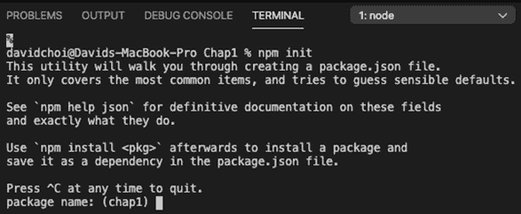

# 一、理解 TypeScript

JavaScript 是一种非常流行且功能强大的语言。根据 GitHub 的说法，它是世界上最流行的语言（是的，使用量甚至超过了 Python），ES6+中的新特性继续添加有用的功能。然而，对于大型应用开发，其功能集被认为是不完整的。这就是创建 TypeScript 的原因。

在本章中，我们将了解 TypeScript 语言、创建它的原因以及它为 JavaScript 开发人员提供的价值。我们将了解微软在创建 TypeScript 时使用的设计理念，以及为什么这些设计决策为大型应用开发增加了重要的语言支持。

我们还将看到 TypeScript 如何增强和改进 JavaScript。我们将比较和对比 JavaScript 与 TypeScript 编写代码的方式。TypeScript 具有丰富的尖端功能，使开发人员受益。其中主要包括静态类型和**面向对象编程**（**OOP**功能。这些特性可以使代码质量更高，更易于维护。

在本章结束时，您将了解 JavaScript 的一些限制，这些限制使得它难以在大型项目中使用。您还将了解 TypeScript 如何填补这些空白，并使编写大型复杂应用更容易，更不容易出错。

在本章中，我们将介绍以下主要主题：

*   什么是TypeScript？
*   为什么需要TypeScript？

# 技术要求

为了充分利用这一章，您应该对 JavaScript 版本 ES5 或更高版本有基本的了解，并有一些使用 JavaScript 框架构建 web 应用的经验。您还需要安装 Node 和一个JavaScript 代码编辑器，例如**Visual Studio 代码**（**VSCode**）。

您可以在[找到本章的 GitHub 存储库 https://github.com/PacktPublishing/Full-Stack-React-TypeScript-and-Node](https://github.com/PacktPublishing/Full-Stack-React-TypeScript-and-Node) 。使用`Chap1`文件夹中的代码。

# 什么是TypeScript？

TypeScript 实际上是两种截然不同但相关的技术——一种语言和一种编译器：

*   该语言是一种功能丰富的静态类型编程语言，为 JavaScript 添加了真正的面向对象功能。
*   编译器将 TypeScript 代码转换为本机 JavaScript，但也为程序员提供了编写错误较少的代码的帮助。

TypeScript 使开发人员能够设计质量更高的软件。语言和编译器的结合增强了开发人员的能力。通过使用 TypeScript，开发人员可以编写更易于理解和重构的代码，并且包含更少的 bug。此外，它还通过在开发过程中强制修复错误，为开发工作流添加了规则。

TypeScript 是一种开发时技术。没有运行时组件，任何机器上都没有运行过 TypeScript 代码。相反，TypeScript 编译器将 TypeScript 转换为 JavaScript，然后在浏览器或服务器上部署和运行该代码。微软可能考虑为 TypeScript 开发一个运行时。然而，与操作系统市场不同的是，微软并不控制 ECMAScript 标准机构（决定每个 JavaScript 版本的内容的组织）。因此，从该群体中获得认同将是困难和耗时的。相反，微软决定创建一个工具来提高 JavaScript 开发人员的生产力和代码质量。

那么，如果 TypeScript 没有运行时，开发人员如何运行代码呢？TypeScript 使用一个称为 transpilation 的过程。**transfilation**是一种方法，其中来自一种语言的代码被“编译”或转换为另一种语言。这意味着在最终部署和运行之前，所有类型脚本代码最终都会转换为 JavaScript 代码。

在本节中，我们了解了什么是 TypeScript 以及它是如何工作的。在下一节中，我们将了解为什么构建大型复杂应用需要这些功能。

# 为什么需要TypeScript？

JavaScript 编程语言由 Brendan Eich 创建，并于 1995 年添加到 Netscape浏览器中。从那时起，JavaScript 获得了巨大的成功，现在也被用于构建服务器和桌面应用。然而，这种流行性和普遍性已经证明是一个问题，也是一个好处。随着越来越大的应用的创建，开发人员开始注意到这种语言的局限性。

大型应用开发比最初创建 JavaScript 的浏览器开发有更大的需求。在高层次上，几乎所有的大型应用开发语言，如 java、C++、C 等，都提供静态类型和 OOP 能力。在本节中，我们将介绍静态类型相对于 JavaScript 动态类型的优势。我们还将了解 OOP，以及为什么 JavaScript 的 OOP 方法过于有限，无法用于大型应用。

但是首先，我们需要安装一些软件包和程序来支持我们的示例。要执行此操作，请遵循以下说明：

1.  让我们先安装 Node。您可以从这里下载节点：[https://nodejs.org/](https://nodejs.org/) 。Node 为我们提供了`npm`，这是一个 JavaScript 依赖关系管理器，允许我们安装 TypeScript。我们将在[*第 8 章*](08.html#_idTextAnchor122)*中深入学习 Node.js 和 Express*的服务器端开发。
2.  安装 VSCode。它是一个免费的代码编辑器，其高质量和丰富的特性使它迅速成为在任何平台上编写 JavaScript 代码的标准开发应用。您可以使用任何您喜欢的代码编辑器，但我将在本书中广泛使用 VSCode。
3.  Create a folder in your personal directory called `HandsOnTypeScript`. We'll save all our project code into this folder.

    重要提示

    如果您不想自己输入代码，可以下载*技术要求*部分中提到的完整源代码。

4.  在`HandsOnTypeScript`内，创建另一个名为`Chap1`的文件夹。
5.  打开 VSCode，进入**文件****打开**，然后打开刚才创建的**Chap1**文件夹。然后，选择**查看**|**终端**并在 VSCode 窗口内启用终端窗口。
6.  Type the following command into the terminal. This command will initialize your project so that it can accept `npm` package dependencies. You'll need this because TypeScript is downloaded as an `npm` package:

    ```js
    npm init
    ```

    您应该会看到如下屏幕：

    

    图 1.1–npm 初始屏幕

    您可以接受所有提示的默认值，因为我们现在只安装 TypeScript。

7.  使用以下命令安装 TypeScript:[T0]

安装完所有项目后，您的 VSCode 屏幕应如下所示：


图 1.2–安装完成后的 VSCode

我们已经完成了环境的安装和设置。现在，我们可以看一些示例，它们将帮助我们更好地理解 TypeScript 的好处。

## 动态分型与静态分型

每种编程语言都有并使用类型。类型只是一组描述对象并可重用的规则。JavaScript 是一种动态类型化语言。在 JavaScript 中，新变量不需要声明它们的类型，即使在设置之后，它们也可以重置为不同的类型。这个特性为语言增加了惊人的灵活性，但它也是许多 bug 的来源。

TypeScript 使用了一种更好的替代方法，称为**静态类型**。静态类型强制开发人员在创建变量时预先指示变量的类型。这消除了歧义并消除了类型之间的许多转换错误。在以下步骤中，我们将查看一些动态类型缺陷的示例，以及 TypeScript 的静态类型如何消除这些缺陷：

1.  在`Chap1`文件夹的根目录下，我们创建一个名为`string-vs-number.ts`的文件。`.ts`文件扩展名是特定于 TypeScript 的扩展名，允许 TypeScript 编译器识别文件并将其转换为 JavaScript。接下来，在文件中输入以下代码并保存：

    ```js
    let a = 5;
    let b = '6';
    console.log(a + b);
    ```

2.  Now, in the terminal, type the following:

    ```js
    tsc string-vs-number.ts
    ```

    `tsc`是执行 TypeScript 编译器的命令，文件名告诉编译器检查文件并将其转换为 JavaScript。

3.  Once you run the `tsc` command, you should see a new file, `string-vs-number.js`, in the same folder. Let's run this file:

    ```js
    node string-vs-number.js
    ```

    `node`命令充当 JavaScript 文件运行的运行时环境。之所以如此，是因为 Node 使用 Google 的 Chrome 浏览器引擎 V8 来运行 JavaScript 代码。因此，运行此脚本后，您应该看到：

    ```js
    56
    ```

    显然，如果我们正常地将两个数字相加，我们希望得到一个和，而不是字符串串联。但是，由于 JavaScript 运行时无法知道这一点，因此它猜测所需的意图，并将[T0]数字变量转换为字符串，并将其附加到变量[T1]。这种情况在现实世界的代码中似乎不太可能发生，但如果不进行检查，它可能会发生，因为在 web 开发中，来自 HTML 的大多数输入都以字符串的形式输入，即使用户键入数字也是如此。

4.  现在，让我们将 TypeScript 的静态键入引入到代码中，看看会发生什么。首先，让我们删除 Apple T0x 文件，因为 TypScript 编译器可能会认为有两个副本：看看这个代码：

    ```js
    let a: number = 5;
    let b: number = '6';
    console.log(a + b);
    ```

5.  如果在此代码上运行[T0]编译器，将得到错误[T1]。这正是我们想要的。编译器告诉我们代码中有错误，并阻止编译成功编译。因为我们指出这两个变量都应该是数字，所以编译器会检查这一点，并在发现不正确时进行投诉。所以，如果我们修正这个代码并将`b`设置为一个数字，让我们看看会发生什么：

    ```js
    let a: number = 5;
    let b: number = 6;
    console.log(a + b);
    ```

6.  现在，如果您运行编译器，它将成功完成，并且运行 JavaScript 将得到值`11`：


图 1.3–有效数字添加

太好了，当我们错误地设置`b`时，TypeScript 捕捉到了我们的错误并阻止它在运行时被使用。

让我们看看另一个更复杂的例子，就像您在更大的应用代码中看到的一样：

1.  Let's create a new `.ts` file called `test-age.ts` and add the following code to it:

    ```js
    function canDrive(usr) {    
        console.log("user is", usr.name);     

        if(usr.age >= 16) {
            console.log("allow to drive");
        } else {
            console.log("do not allow to drive");
        }
    } 

    const tom = { 
        name: "tom"
    } 
    canDrive (tom); 
    ```

    如您所见，该代码有一个功能，用于检查用户的年龄，并根据该年龄确定是否允许他们驾驶。在函数定义之后，我们看到创建了一个用户，但没有年龄属性。让我们假设开发人员希望在以后根据用户输入填写这些内容。现在，在用户创建下面，调用了`canDrive`函数，它声称不允许用户驾驶。如果用户`tom`的年龄超过 16 岁，并且该功能触发了另一项基于用户年龄的操作，那么显然这可能会导致一系列问题。

    JavaScript 中有一些方法可以解决这个问题，或者至少是部分解决。我们可以使用`for`循环遍历用户对象的所有属性键名称，并检查`age`名称。然后，我们可以抛出一个异常或使用其他错误处理程序来处理这个问题。然而，如果我们必须在每个函数上都这样做，它将很快变得低效和繁重。此外，我们将在代码运行时执行这些检查。显然，对于这些错误，我们更希望在它们向用户显示之前捕获它们。TypeScript 为这个问题提供了一个简单的解决方案，并在代码投入生产之前捕获错误。请查看以下更新的代码：

    ```js
    interface User {
        name: string;
        age: number;
    }

    function canDrive(usr: User) {     
        console.log("user is", usr.name);     

        if(usr.age >= 16) {
            console.log("allow to drive");
        } else {
            console.log("do not allow to drive");
        }
    } 

    const tom = { 
        name: "tom"
    } 
    canDrive (tom); 
    ```

    让我们来看一下更新后的代码。在顶部，我们看到一个称为接口的东西，它被命名为`User`。接口是 TypeScript 中一种可能的类型。我将在后面的章节中详细介绍接口和其他类型，但现在，让我们看看这个示例。`User`接口有两个我们需要的字段：`name`和`age`。下面，我们看到我们的`canDrive`函数的`usr`参数有一个冒号和`User`类型。这称为类型注释，它意味着我们告诉编译器只允许将`User`类型的参数赋予`canDrive`。因此，当我尝试用 TypeScript 编译这段代码时，编译器抱怨调用[T9]时，传入的参数中缺少[T10]，因为我们的[T11]对象没有该属性：

    

    图 1.4–驱动误差

2.  因此，编译器再次发现了我们的错误。让我们通过给`tom`一个类型来解决这个问题：

    ```js
    const tom: User = { 
        name: "tom"
    } 
    ```

3.  If we give `tom` a type of `User`, but do not add the required `age` property, we get the following error:

    ```js
    Property 'age' is missing in type '{ name: string; }' but required in type 'User'.ts(2741)
    ```

    但是，如果我们添加缺少的`age`属性，错误就会消失，我们的`canDrive`函数也会正常工作。以下是最终工作代码：

    ```js
    interface User {
        name: string;
        age: number;
    }

    function canDrive(usr: User) {     
        console.log("user is", usr.name);     

        if(usr.age >= 16) {
            console.log("allow to drive");
        } else {
            console.log("do not allow to drive");
        }
    } 

    // let's pretend sometime later someone else uses the   //function canDrive
    const tom: User = { 
        name: "tom",
        age: 25
    } 
    canDrive (tom); 
    ```

    此代码在`tom`变量中提供所需的`age`属性，以便在执行`canDrive`时，正确完成对`usr.age`的检查，然后运行相应的代码。

以下是修复完成并再次运行代码后的输出屏幕截图n：


图 1.5–canDrive 成功结果

在本节中，我们了解了动态类型的一些缺陷，以及静态类型如何帮助消除并防止这些问题。静态类型消除了代码中对编译器和其他开发人员的歧义。这种清晰性可以减少错误并获得更高质量的代码。

## 面向对象编程

JavaScript 被称为 OOP 语言。它确实有其他 OOP 语言的一些功能，比如继承。然而，JavaScript 的实现在可用的语言特性和设计方面都受到限制。在本节中，我们将了解 JavaScript 如何进行 OOP，以及 TypeScript 如何改进 JavaScript 的功能。

首先，让我们定义什么是 OOP。OOP 有四个主要原则：

*   封装
*   抽象
*   遗产
*   多态性

让我们逐一复习。

### 封装

封装的一个简短说法是信息隐藏。在每一个程序中，你都有数据和函数，允许你用这些数据做一些事情。当我们使用封装时，我们将数据放入一个容器中。在大多数编程语言中，这个容器被称为类，基本上，它保护数据，以便容器之外的任何东西都不能修改或查看它。相反，如果要使用数据，则必须通过容器对象控制的函数来完成。这种处理对象数据的方法允许从代码中的一个位置严格控制该数据的变化，而不是分散在大型应用中的多个位置，这可能会很难维护。

有一些关于封装的解释主要集中在公共容器中的成员分组上。但是，JavaScript 没有严格意义上的信息隐藏功能。对于大多数 OOP 语言，封装要求能够通过语言工具显式隐藏成员。例如，在 TypeScript 中，您可以使用`private`关键字，以便在其类之外无法查看或修改属性。现在，在 JavaScript 中可以通过各种变通方法模拟成员隐私，但这又不是本机代码的一部分，增加了额外的复杂性。TypeScript 支持使用访问修饰符（如本机的[T1]）进行封装。

重要提示

ECMAScript 2020 将支持类字段的隐私。但是，由于这是一项较新的功能，在编写本文时，并非所有浏览器都支持它。

### 抽象

抽象与封装相关。当使用抽象时，您隐藏了如何管理数据的内部实现，并为外部代码提供了一个更简化的接口。这主要是为了引起“松散耦合”。这意味着负责一组数据的代码应该是独立的，并且与其他代码分离。通过这种方式，可以更改应用一部分中的代码，而不会对另一部分中的代码产生不利影响。

大多数 OOP 语言的抽象要求使用一种机制来简化对对象的访问，而不暴露对象的内部工作。对于大多数语言，这要么是一个接口，要么是一个抽象类。在后面的章节中，我们将更深入地回顾接口，但现在，接口就像类一样，其成员没有实际的工作代码。您可以将它们视为只显示对象成员的名称和类型的 shell，但 OutT0 隐藏它们是如何工作的。这种能力对于产生前面提到的的“松耦合”以及允许更容易地修改和维护代码非常重要。JavaScript 不支持接口或抽象类，而 TypeScript 支持这两种功能。

### 遗产

继承是关于代码重用的。例如，如果您需要为几种类型的车辆（汽车、卡车和船）创建对象，那么为每种车辆类型编写不同的代码将效率低下。最好创建一个具有所有车辆核心属性的基本类型，然后在每个特定车辆类型中重用该代码。这样，我们只需编写一次所需的代码，并在每种车型上共享。

JavaScript 和 TypeScript 都支持类和继承。如果您不熟悉类，则类是一种类型，它存储一组相关的字段，还可能具有可作用于这些字段的函数。JavaScript 通过使用名为原型继承的系统来支持继承。基本上，这意味着在 JavaScript 中，特定类型的每个对象实例共享单个核心对象的相同实例。这个核心对象就是原型，无论在原型上创建什么字段或函数，它们都可以跨各种对象实例访问。这是一种节省资源（如内存）的好方法，但它没有 TypeScript 中继承模型的灵活性或复杂性。

在 TypeScript 中，类可以从其他类继承，但也可以从接口和抽象类继承。由于 JavaScript 没有这些特性，相比之下，它的原型继承是有限的。此外，JavaScript 不能直接从多个类继承，这是另一种进行代码重用的方法，称为多重继承。但 TypeScript 确实允许使用 mixin 进行多重继承。我们将在后面深入讨论所有这些特性，但基本上，重点是 TypeScript 有一个更强大的继承模型，它允许更多类型的继承，从而有更多的方法重用代码。

### 多态性

多态性与遗传有关。在多态性中，可以创建一个对象，该对象可以设置为从同一基本谱系继承的任意数量的可能类型中的一个。此功能对于场景非常有用，其中所需类型无法立即得知，但可以在适当情况出现后在运行时设置。

与其他一些特性相比，此特性在 OOP 代码中使用的频率较低，但仍然很有用。就 JavaScript 而言，多态性没有直接的语言支持，但由于它的动态类型，可以很好地模拟它（一些 JavaScript 爱好者强烈反对这种说法，但请听我说）。

让我们看一个例子。可以使用 JavaScript 类继承来创建一个基类，并拥有多个从这个单亲基类继承的类。然后，通过使用标准 JavaScript 变量声明（不指示类型），我们可以在运行时将类型实例设置为适当的继承类。我发现的问题是，无法强制变量为特定的基类型，因为无法在 JavaScript 中声明类型，因此无法在开发期间仅强制从一个基类型继承的类。因此，同样，您必须求助于变通方法，例如使用[T0]关键字，以便在运行时测试某些类型，尝试并实施类型安全性。

在 TypeScript 的情况下，静态类型在默认情况下处于启用状态，并在首次创建变量时强制进行类型声明。此外，TypeScript 支持接口，接口可以通过类实现。因此，将变量声明为特定接口类型将强制实例化为该变量的所有类成为同一接口的继承者。同样，这些都是在部署代码之前在开发时完成的。该系统比 JavaScript 中的系统更明确、更可执行、更可靠。

在本节中，我们了解了 OOP 及其在大型应用开发中的重要性。我们还了解了为什么 TypeScript 的 OOP 功能比 JavaScript 的要好得多，功能也更丰富。

# 总结

在本章中，我们介绍了 TypeScript，并了解了创建它的原因。我们了解了为什么类型安全和 OOP 功能对于构建大型应用如此重要。然后，我们看到了一些比较动态类型和静态类型的示例，并了解了为什么静态类型可能是编写代码的更好方法。最后，我们比较了这两种语言的 OOP 风格，并了解了为什么 TypeScript 具有更好、更强大的系统。本章中的信息使我们对 TypeScript 的好处有了很好的高层概念性理解。

在下一章中，我们将深入研究 TypeScript 语言。我们将进一步了解类型，并研究 TypeScript 的一些最重要的特性，例如类、接口和泛型。本章将为您在 JavaScript 生态系统中使用各种框架和库提供坚实的基础。