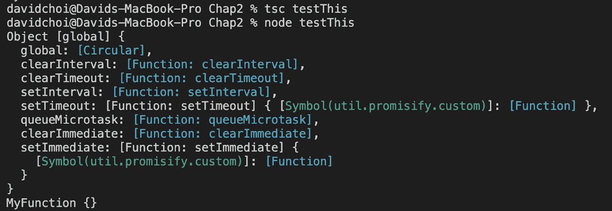
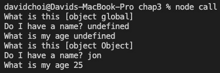
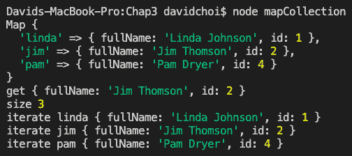
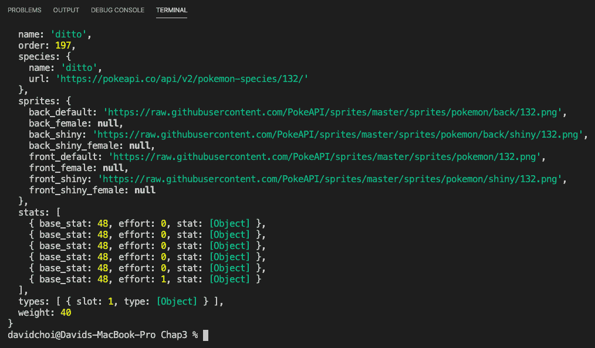

# 三、使用 ES6+ 特性构建更好的应用

在本章中，我们将以最新的 ES6+形式回顾 JavaScript 的某些重要特性（我添加了加号以表示 ES6 及更高版本）。重要的是要理解，尽管这本书使用 TypeScript，但这两种语言是互补的。换句话说，TypeScript 不会取代 JavaScript。它扩展和增强了 JavaScript，添加了一些使其更好的特性。因此，我们将回顾一下 JavaScript 语言中一些最重要的特性。我们将回顾变量范围和新的[T0]和[T1]关键字。此外，我们将深入探讨[T2]关键字，以及如何在需要时切换它。我们还将了解 JavaScript 中的许多新特性，例如新的数组函数和[T3]。这些知识将为我们提供一个坚实的基础，我们可以在 TypeScript 编码。

在本章中，我们将介绍以下主要主题：

*   了解 ES6 变量类型和 JavaScript 范围
*   学习箭头函数
*   改变`this`上下文
*   学习传播、去结构和休息
*   学习新的数组函数
*   了解新的集合类型
*   了解`async await`

# 技术要求

本章要求与[*第 2 章*](02.html#_idTextAnchor025)*相同，探索字体*。您应该对 JavaScript 和 web 技术有基本的了解。您将再次使用 Node 和**Visual Studio 代码**（**VSCode**）。

GitHub 存储库位于[https://github.com/PacktPublishing/Full-Stack-React-TypeScript-and-Node](https://github.com/PacktPublishing/Full-Stack-React-TypeScript-and-Node) 。使用`Chap3`文件夹中的代码。

让我们设置本章的代码文件夹：

1.  转到您的`HandsOnTypescript`文件夹，创建一个名为`Chap3`的新文件夹。
2.  打开 VSCode，进入**文件****打开**，然后打开刚才创建的`Chap3`文件夹。然后，选择**查看**|**终端**并在 VSCode 窗口内启用终端窗口。
3.  如前一章所述，键入`npm init`命令，为`npm`初始化项目，并接受所有默认值（您也可以使用`npm init -y`自动接受所有默认值）。
4.  如前一章所述，键入[T0]命令以安装 TypeScript。

现在我们准备开始了。

# 学习 ES6 变量类型和 JavaScript 范围

在本节中，我们将学习 JavaScript 的作用域规则和一些新的变量类型，它们有助于澄清和改进与这些作用域规则相关的一些问题。这些信息是有价值的，因为作为一名软件开发人员，您将在整个职业生涯中不断创建变量，了解变量在什么范围内可以访问以及在什么情况下可以更改非常重要。

在大多数其他语言中，变量作用域发生在任意一组括号或[T2]begin end[T3]范围语句中。但是，JavaScript 中的作用域由函数体处理，这意味着当在函数体中使用[T0]关键字声明变量时，该变量只能在该函数体中访问。让我们来看一个例子。创建一个名为`functionBody.ts`的新文件，并向其中添加以下代码：

```js
if (true) {
    var val1 = 1;
}
function go() {
    var val2 = 2;
}
console.log(val1);
console.log(val2);
```

在 VSCode 中，您应该在对`console.log(val2)`的调用中看到错误指示，而对`console.log(val1)`的调用工作正常。您可能会认为，由于`val1`是在`if`语句的括号内声明的，因此以后将无法访问它。然而，显然是这样。但另一方面，`go`函数范围内的`val2`在其外部无法访问。这表明，就使用`var`的变量声明而言，函数充当作用域容器。

这个特性实际上是 JavaScript 中许多混乱的根源。因此，在 ES6 中，创建了一组新的变量声明前缀：`const`和`let`。让我们在这里回顾一下。

`const`变量支持一种称为块级作用域的方法。块级范围界定是指任何弯曲括号之间的范围界定。例如，在我们前面的示例中，这将是`if`语句。此外，顾名思义，`const`创建一个常量变量值，一旦设置，就不能重置为其他值。然而，这意味着与其他一些语言略有不同。在 JavaScript 中，这意味着变量的赋值不能更改。但是，变量本身可以编辑。这很难想象，所以让我们看一些例子。创建一个名为`const.ts`的新文件，并添加以下代码：

```js
namespace constants {
    const val1 = 1;
    val1 = 2;
    const val2 = [];
    val2.push('hello');
}
```

在 VSCode 中，此代码将为`val1 = 2`显示错误，但为`val2.push('hello')`显示正确。这是因为在`val1`的情况下，变量实际上被重置为一个全新的值，这是不允许的。但是，对于`val2`，数组值保持不变，并添加了一个新元素。所以，这是允许的。

现在，让我们看一下`let`关键字。`let`变量与`const`变量一样，也是块作用域。但是，它们可以随意设置和重置（当然，在 TypeScript 中，类型需要保持不变）。让我们展示一个`let`的例子。创建名为`let.ts`的文件并添加以下代码：

```js
namespace lets {
    let val1 = 1;
    val1 = 2;
    if(true) {
        let val2 = 3;
        val2 = 3;
    }
    console.log(val1);
    console.log(val2);
}
```

这里，我们有两组`let`变量。`val1`未在块中确定范围，但`val2`在`if`块中确定范围。如您所见，只有对`console.log(val2)`的调用失败，因为`val2`只存在于`if`块中。

那么，您使用哪种变量声明方法呢？社区中当前的最佳实践更倾向于使用`const`，因为不变性是一个有益的属性，而且，使用常量会增加一点性能优势。但是，如果您知道以后需要能够重置变量，请使用`let`。最后，避免使用`var`。

我们已经了解了 ES6 中的作用域和新的[T0]和[T1]变量类型。理解作用域并知道何时使用`const`与`let`是进行现代 JavaScript 开发的一项重要技能。在较新的 JavaScript 代码中，您会经常看到这些关键字。接下来，我们将回顾`this`上下文和箭头函数。

# 学习箭头功能

箭头功能是 ES6 的新增功能。基本上，它们有两个主要目的：

*   它们缩短了编写函数的语法。
*   它们还自动生成直接作用域父对象、`this`对象、箭头函数的父对象。

在继续之前，让我再解释一下`this`，因为它是 JavaScript 开发人员的关键知识。

在 JavaScript 中，`this`对象（成员属性和方法所属的所有者对象实例）可以根据调用的上下文进行更改。因此，例如，当直接调用函数时，`MyFunction()`-父`this`将是该函数的调用方；也就是说，当前作用域的`this`对象。对于浏览器，这通常是`window`对象。但是，在 JavaScript 中，函数也可以用作对象构造函数，例如，[T5]。在这种情况下，函数中的`this`对象将是从`new MyFunction`构造函数创建的对象实例。

让我们看一个例子来说明这一点，因为这是 JavaScript 的一个非常重要的特性。创建一个名为`testThis.ts`的新文件，并添加以下代码：

```js
function MyFunction () {
    console.log(this);
}

MyFunction();
let test = new MyFunction();
```

如果编译并运行此代码，将看到以下结果：



图 3.1–测试此结果

因此，当直接调用`MyFunction`时，直接作用域父对象将成为节点的全局对象，因为我们不是在浏览器中运行。接下来，如果我们使用`new MyFunction()`从`MyFunction`创建一个新对象，`this`对象将成为它自己的对象实例，因为该函数用于创建对象，而不是直接运行。

现在我们有了这一点，让我们看看箭头函数是什么样子的。创建`arrowFunction.ts`文件并添加以下代码：

```js
const myFunc = (message: string): void => {
    console.log(message);
}

myFunc('hello');
```

如果编译并运行此代码，您将看到`hello`已打印出来。语法非常类似于函数类型；然而，它们并不相同。如果我们看一下代码，可以看到参数括号后面有一个冒号，然后是参数括号后面的 void 类型。这是函数的返回类型。对于函数类型，返回类型在`=>`符号后指示。

这里有一些关于箭头函数的附加注意事项。JavaScript 中的所有非箭头函数都可以访问名为`arguments`的集合。这是给定给函数的所有参数的集合。`arguments`没有自己的收藏功能。但是，它们确实可以访问直接函数 parent 的`arguments`集合。

箭头函数有几种主体样式。以下是三种样式的示例：

```js
const func = () => console.log('func');
const func1 = () => ({ name: 'dave' });
const func2 = () => {
    const val = 20;
    return val;
}
console.log(func());
console.log(func1());
console.log(func2());
```

让我们看看这三种风格中的每一种：

*   第一个函数`func`显示了函数体中只使用了一行代码，并且没有返回任何内容的情况，因为您可以看到函数体没有右括号或圆括号。
*   第二个函数`func1`显示只有一行，但返回了一些内容。在这种情况下，不需要[T1]关键字，只有在返回对象时才需要括号。
*   最后一个案例是`func2`。在这种情况下，由于它是一个多行语句（不管它是否返回），所以需要小括号。

本节介绍了箭头函数。箭头函数在现代 JavaScript 和 TypeScript 代码中被大量使用，因此深入了解这一特性是有益的。

# 更改此上下文中的

在上一节中，我们已经讨论了[T0]上下文对象。如前所述，在 JavaScript 中，函数可以访问名为`this`的内部对象，该对象表示函数的调用方。现在，使用`this`令人困惑的地方在于`this`的值可能会根据调用函数的方式发生变化。因此，JavaScript 提供了帮助程序，允许您将函数的`this`对象重置为您想要的对象，而不是给定给您的对象。有几种方法，包括`apply`和`call`，但我们要学习的最重要的方法是`bind`关键字。这对我们来说很重要，因为`bind`经常用于基于 React 类的组件中。现在展示一个全面的 React 示例还为时过早。那么，让我们从简单一点的事情开始。创建一个名为`bind.ts`的新文件，并向其中添加以下代码：

```js
class A {
    name: string = 'A';
    go() {
        console.log(this.name);
    }
}
class B {
    name: string = 'B';
    go() {
        console.log(this.name);
    }
}
const a = new A();
a.go();
const b = new B();
b.go = b.go.bind(a);
b.go();
```

从这段代码中可以看到，有两个不同的类：`A`和`B`。这两个类都有一个`go`函数，将特定的类名写入日志。现在，当我们将`b`对象的`go`函数中的`this`对象的`bind`重置为`a`对象时，它将`console.log(this.name)`语句切换为使用`a`作为`this`对象。因此，如果我们编译并运行，我们会得到：


图 3.2–绑定

如您所见，`a.go()`写入`A`，但`b.go()`也写入`A`，而不是`B`，因为我们将`this`切换为`a`而不是`b`。请注意，除了使用[T8]参数外，[T9]还可以在此后使用任意数量的参数。

您可能想知道使用`bind`、`call`和`apply`有什么区别。`bind`用于更改`this`上下文，以后调用函数时，会更改`this`对象。但是，`call`和`apply`在调用函数时使用，并在调用时立即替换`this`上下文。`call`和`apply`之间的区别在于`call`采用的参数数量不确定，`apply`采用的参数数组。让我们看一些例子。创建一个名为`call.js`的文件，并向其中添加以下代码：

```js
const callerObj = {
    name: 'jon'
}
function checkMyThis(age) {    
    console.log(`What is this ${this}`)
    console.log(`Do I have a name? ${this.name}`)
    this.age = age;
    console.log(`What is my age ${this.age}`);
}
checkMyThis();
checkMyThis.call(callerObj, 25);
```

首先，我们正在创建一个名为`callerObj`的新对象，该对象有一个名为`name`的字段，即`jon`。之后，我们声明一个`checkMyThis`函数，它测试`this`当前是什么以及它是否有名称。最后，我们运行两个调用。请注意，第二个调用看起来很奇怪，但`checkMyThis.call`是`checkMyThis`函数的实际执行。如果我们运行这段代码，我们将看到一些有趣的东西。运行以下命令：

```js
node call
```

您将看到以下结果：



图 3.3–节点调用

`checkMyThis`函数的第一次执行默认使用全局对象，因为它没有被覆盖。同样，对于 Node，它是 Node 的全局对象，但是对于浏览器，它是`window`对象。我们还看到，`name`和`age`字段未定义，因为节点的全局对象没有`name`字段，并且年龄没有作为参数传递给`checkMyThis`。但是，在第二次执行该函数时，即使用`call`的函数，我们看到该对象已更改为标准对象类型，其名称为`jon`，这是`callerObj`的`name`字段，以及等于`25`的`age`字段，这是我们传入`call`的参数。您应该注意，`call`的参数列表顺序遵循被调用函数的参数列表顺序。`apply`的用法相同；但是，它将参数作为数组。

在本节中，我们学习了使用`this`上下文的困难，以及如何使用`bind`处理这些困难。一旦我们开始创建 React 组件，我们将广泛使用`bind`。但是，即使在特定的用例之外，您也会发现，您的代码有时需要能够更改`this`上下文，可能还需要更改函数的一些参数。因此，这种能力是一种非常有用的特性。

# 学习传播、分解和休息

在 ES6+中，有处理对象复制和显示变量和参数的新方法。这些功能大大缩短了 JavaScript 代码的长度，使其更易于阅读。这些特性已经成为现代 JavaScript 的标准实践，因此重要的是我们了解它们并正确使用它们。

## 排列、Object.assign 和 Array.concat

**排列**、`Object.assign`和`Array.concat`JavaScript 特性非常相似。基本上，您将多个对象或数组附加到一个对象或数组中。但是，严格来说，有一些区别。

对于对象，有两种合并或连接对象的方法：

*   例如，`{ … obja, …objb }`：您正在创建这两个对象的未修改副本，然后创建一个全新的对象。请注意，“排列”可以处理两个以上的对象。
*   `Object.assign`—`(obja, objb)`: You are adding the properties from `objb` into `obja` and returning `obja`. Therefore, `obja` is being modified. Here's an example. Create a new file called `spreadObj.ts` and add the following code:

    ```js
    namespace NamespaceA {
        class A {
            aname: string = 'A';
        }
        class B {
            bname: string = 'B';
        }
        const a = new A();
        const b = new B();
        const c = { ...a, ...b }
        const d = Object.assign(a, b);
        console.log(c);
        console.log(d);
        a.aname = 'a1';
        console.log(c);
        console.log(d);
    }
    ```

    首先，我们创建一个新对象`c`，它是使用扩展操作符`…`设置的。之后，我们从`Object.assign`调用创建`d`。让我们试着运行这段代码。您需要以 ES6 为目标，因为`Object.assign`仅在该版本的 JavaScript 上可用。让我们编译并使用以下命令运行：

    ```js
    tsc spreadObj –target 'es6'
    node spreadObj
    ```

    运行这些命令后，您将看到以下内容：


图 3.4-spreadObj

如您所见，`c`既有`aname`属性，也有`bname`属性，但它本身是一个独特的对象。然而，`d`实际上是对象`a`，其属性为对象`b`，这可以通过`a.aname = 'a1'`设置后的`aname`变量等于`a1`来证明。

现在，对于合并或连接数组，您还有两种方法：

*   spread 操作符：与对象的 spread 一样，它合并数组并返回单个新数组。不修改原始数组。
*   `Array.concat`：通过将两个源阵列合并为单个阵列来创建新阵列。不修改原始数组。

让我们用两种方法来看一个例子。创建一个名为`spreadArray.ts`的文件，并添加以下代码：

```js
namespace SpreadArray {
    const a = [1,2,3];
    const b = [4,5,6];
    const c = [...a, ...b];
 const d = a.concat(b);
    console.log('c before', c);
    console.log('d before', d);
    a.push(10);
    console.log('a', a);
    console.log('c after', c);
    console.log('d after', d);
}
```

如您所见，数组`c`是使用两个数组的排列创建的：`a`和`b`。然后，使用`a.concat(b)`创建数组`d`。在这种情况下，两个生成的数组都是唯一的，并且不引用任何原始数组。让我们像以前一样编译和运行这段代码，看看我们得到了什么：


图 3.5–扩展阵列

您将看到，`a.push(10)`对`console.log('d after', d)`语句没有影响，即使数组`d`是从数组`a`创建的。这表明阵列的 spread 和[T4]都创建了新的阵列。

解构

**解构**是显示并直接使用对象内部属性的能力，而不仅仅依赖于对象名称。稍后我将用一个示例对此进行解释，但请注意，这是现代 JavaScript 开发中非常常用的功能，特别是在 React 挂钩中，因此我们需要熟悉它。

让我们看一个对象分解的示例。对于这个例子，让我们只使用一个 JavaScript 文件，因为这样的例子会更清楚。创建一个名为`destructuring.js`的新文件，并向其中添加以下代码：

```js
function getEmployee(id) {
    return {
        name: 'John',
        age: 35,
        address: '123 St',
        country: 'United States'
    }
}
const { name: fullName, age } = getEmployee(22);
console.log('employee', fullName, age);
```

让我们假设`getEmployee`函数通过`id`到达服务器并检索员工信息。现在，正如您所看到的，`employee`对象有很多字段，可能不是函数的每个调用方都需要每个字段。因此，我们使用对象分解只选择我们关心的字段。此外，请注意，我们还使用冒号为字段名提供了一个别名`fullName`。

也可以对阵列进行分解。让我们将以下代码添加到此文件：

```js
function getEmployeeWorkInfo(id) {
    return [
        id,
        'Office St',
        'France'
    ]
}
const [id, officeAddress] = getEmployeeWorkInfo(33);
console.log('employee', id, officeAddress);
```

在本例中，`getEmployeeWorkInfo`函数返回关于员工工作地点的一系列事实；但它以数组的形式返回。因此，我们也可以对数组进行解构，但请注意，元素的顺序在解构时确实很重要。让我们看看这两个函数的结果。注意，我们只需要调用 Node，因为这是一个 JavaScript 文件。运行以下命令：

```js
node destructuring.js 
```

您将看到两个函数的以下结果：


图 3.6–分解结构

如您所见，这两个函数都返回了正确的相对数据。

## 休息

**Rest**是的一项功能，允许您使用一个关键字`…`来引用一组不确定的参数。任何 rest 参数都是数组，因此可以访问所有数组函数。rest 关键字指的是“其余项目”，而不是“暂停”或“停止”。“此关键字在创建函数签名时具有更大的灵活性，因为它允许调用方确定要传递多少个参数。请注意，只有最后一个参数可以是 rest 参数。下面是一个使用 rest 的示例。创建一个名为`rest.js`的文件，并添加以下代码：

```js
function doSomething(a, ...others) {
    console.log(a, others, others[others.length - 1]);
}
doSomething(1,2,3,4,5,6,7);
```

如您所见，`…others`是指`a`之后的其余参数。这表明 rest 参数不必是函数的唯一参数。因此，如果运行此代码，将得到以下结果：


图 3.7–休息

`doSomething`函数接收两个参数：`a`变量和**rest**参数。然后，它写入一个日志条目，其中写入了`a`参数、rest 参数（也是一个参数数组）和 rest 参数的最后一个元素。Rest 不像扩展和解构那样频繁使用。然而，你会看到它，所以你应该意识到它。

在本节中，我们学习了[T0]有关 JavaScript 特性的知识，这些特性使代码更短、更易于阅读。这些特性的使用在现代 JavaScript 编程中非常常见，因此学习如何使用这些功能将使您受益匪浅。在下一节中，我们将学习一些非常重要的数组操作技术，这些技术简化了对数组的处理，并且也被广泛使用。

# 学习新的数组函数

在本节中，我们将回顾 ES6 中为操纵数组而添加的许多方法。这是一个非常重要的部分，因为在 JavaScript 编程中，您必须经常处理数组，使用这些性能优化的方法比创建自己的方法更可取。使用这些标准方法还可以使团队中的其他开发人员更加一致和可读代码。我们将在 React 和节点开发中广泛利用这些方法。让我们开始吧。

## 发现

`find`关键字允许从数组中获取与搜索条件匹配的元素的第一个实例。让我们看一个简单的例子。创建`find.ts`并添加以下代码：

```js
const items = [
    { name: 'jon', age: 20 },
    { name: 'linda', age: 22 },
    { name: 'jon', age: 40}
]
const jon = items.find((item) => {
    return item.name === 'jon'
});
console.log(jon);
```

如果您查看`find`的代码，可以看到它以一个函数作为参数，函数正在查找一个名为`jon`的项。该函数进行真值检查，查看项目名称是否等于`jon`。如果项目真相检查为真，`find`将返回该项目。但是，您也可以看到数组中有两个`jon`项。让我们编译并运行这段代码，看看哪个返回。运行以下命令：

```js
tsc find –target 'es6'
node find
```

编译并运行上述命令后，应看到以下结果：


图 3.8–查找

您可以在输出中看到找到的第一个`jon`项被返回。这就是`find`的工作原理；它总是只返回阵列中第一个找到的物品。

## 过滤器

`filter`与类似，只是它返回所有符合搜索条件的项目。让我们创建一个名为`filter.ts`的新文件，并添加以下代码：

```js
const filterItems = [
    { name: 'jon', age: 20 },
    { name: 'linda', age: 22 },
    { name: 'jon', age: 40}
]
const results = filterItems.filter((item, index) => {
    return item.name === 'jon'
});
console.log(results);
```

正如您所看到的，`filter`函数还可以为数组中项目的索引号选择第二个参数。但从内部来看，这与`find`的工作原理是一样的，因为存在一个真理检查，以确定是否找到了某个匹配项。但是，对于`filter`，所有匹配项都会返回，如下所示：


图 3.9–过滤器

正如您所看到的，对于`filter`，所有符合过滤条件的项目都被返回，在这个示例案例中，这两个项目都是`jon`项目。

## 地图

`map`函数是 ES6 风格编码中更重要的数组函数之一。它经常出现在 React component creation 中，以便从数据数组中创建组件元素的集合。请注意，`map`函数与`Map`集合不同，我们将在本章后面介绍。创建一个名为`map.ts`的新文件，并添加以下代码：

```js
const employees = [
    { name: 'tim', id: 1 },
    { name: 'cindy', id: 2 },
    { name: 'rob', id: 3 },
]
const elements = employees.map((item, index) => {
    return `<div>${item.id} - ${item.name}</div>`;
});
console.log(elements);
```

如您所见，`map`函数有两个参数，`item`和`index`（您可以随意调用它们，但顺序很重要），它将自定义返回值映射到每个数组元素。明确地说，`return`意味着将每个项目返回到一个新数组中。这并不意味着返回并停止运行迭代。如果我们运行代码，它将生成以下 DOM 字符串：


图 3.10–地图

这个函数实际上可能是最常见的 ES6 数组函数，因此了解它的工作原理非常重要。尝试修改代码并将其用于不同的数组项类型。

## 减少

`reduce`函数是一个聚合器，它接受数组中的每个元素，并基于自定义逻辑创建单个最终值。让我们看一个例子。再次创建一个`reduce.js`文件，我们将使用一个 JavaScript 文件来消除 TypeScript 编译器中的一些杂音，并重点添加以下代码：

```js
const allTrucks = [
    2,5,7,10
]
const initialCapacity = 0;
const allTonnage = allTrucks.reduce((totalCapacity,  currentCapacity) => {
    totalCapacity = totalCapacity + currentCapacity;

    return totalCapacity;
}, initialCapacity);
console.log(allTonnage);
```

在这个示例中，让我们想象一下，我们需要计算一家卡车运输公司所有卡车所能承载的总吨位容量。然后，`allTrucks`列出了每辆卡车的吨位。然后，我们使用`allTrucks.reduce`得到所有卡车的总容量。`initialCapacity`变量仅用于有一些起始点，当前设置为`0`。然后，当我们注销最终值时，我们会看到以下内容：


图 3.11–减少

所有卡车的总容量为`24`，因为每辆卡车的容量之和为 24。注意，减速机的逻辑可以是任何东西；它不一定是一个总和。它可以是一个减法或任何你可能需要的其他逻辑。核心的一点是，在最后，您将只有一个值或对象结果。这就是为什么它被称为`reduce`。

## 一些和每一个

这些功能旨在测试某些标准。因此，它们只返回[T0]或[T1]。`some`测试到查看阵列中的*任何*元素是否满足特定标准，`every`测试*所有*元素是否满足特定标准。让我们来看看两者。创建名为`someEvery.js`的文件并添加以下代码：

```js
const widgets = [
    { id: 1, color: 'blue' },
    { id: 2, color: 'yellow' },
    { id: 3, color: 'orange' },
    { id: 4, color: 'blue' },
]
console.log('some are blue', widgets.some(item => {
    return item.color === 'blue';
}));
console.log('every one is blue', widgets.every(item => {
    return item.color === 'blue';
}));
```

代码非常简单，`some`和`every`的条件都经过了测试。如果运行此代码，将看到以下结果：


图 3.12–Someever

正如您所看到的，每个测试的结果都是有效的。

在部分中，我们了解了 ES6 中添加的许多新函数，这些函数帮助我们更有效地处理和使用 JavaScript 中的数组。当我们构建我们的应用时，您肯定会在您自己的代码中使用这些功能。接下来，我们将学习一些可以代替数组使用的新集合类型。

# 了解新的收藏类型

ES6 有两种新的集合类型`Set`和`Map`，这两种集合类型对于某些特定场景非常有用。在本节中，我们将学习这两种类型，以及如何为它们编写代码，以便在以后开始构建应用时使用它们。

## 套

`Set`是唯一值或对象的集合。当您只想查看一个项目是否包含在一个大型复杂列表中时，这是一个很好的函数。让我们看一个例子。创建一个名为`set.js`的新文件，并添加以下代码：

```js
const userIds = [
    1,2,1,3
]
const uniqueIds = new Set(userIds);
console.log(uniqueIds);
uniqueIds.add(10);
console.log('add 10', uniqueIds);
console.log('has', uniqueIds.has(3));
console.log('size', uniqueIds.size);
for (let item of uniqueIds) {
    console.log('iterate', item);
}
```

`Set`对象有许多成员，但这些是它最重要的一些特性。正如您所看到的，`Set`有一个可以接受数组的构造函数，这使得该数组成为一个唯一的集合。

重要提示

对于集合，`size`用于检查数量而不是长度。

在底部，请注意迭代`Set`与使用数组索引的正常方式有多么不同。运行此文件将导致以下结果：


图 3.13–设置

从概念上讲，它仍然非常类似于阵列，但针对独特的集合进行了优化。

## 地图

`Map`是键值对的集合。换句话说，这是一本字典。`Map`的每个成员都有一个唯一的密钥。让我们创建一个样本`Map`对象。创建一个名为`mapCollection.js`的新文件，并添加以下代码：

```js
const mappedEmp = new Map();
mappedEmp.set('linda', { fullName: 'Linda Johnson', id: 1 });
mappedEmp.set('jim', { fullName: 'Jim Thomson', id: 2 });
mappedEmp.set('pam', { fullName: 'Pam Dryer', id: 4 });
console.log(mappedEmp);
console.log('get', mappedEmp.get('jim'));
console.log('size', mappedEmp.size);
for(let [key, val] of mappedEmp) {
    console.log('iterate', key, val);
}
```

如您所见，一些调用与[T0]非常相似。然而，一个不同之处是底部的迭代循环，它使用数组来指示键和值。运行此文件会产生以下输出：



图 3.14–地图收集

这很简单。首先，记录所有`Map`对象的列表。然后，我们使用`jim`项的键值与`get`一起得到`jim`项。接下来是`size`，最后是对所有元素的迭代。

本节展示了 ES6 中的两种新收集类型。这些类型不经常使用，但如果您有这些集合所满足的需求，它们可以派上用场。在下一节中，我们将讨论[T0]，它是 ES7 的一个特性。`async await`已被 JavaScript 开发人员社区迅速采用，因为它使异步代码的读取变得更加困难，可读性更高，并且使其看起来像是同步的。

# 学习异步等待

在解释`async`和`await`之前，让我们先解释一下什么是异步代码。在大多数语言中，代码通常是同步的，这意味着语句一个接一个地运行。如果您有语句`A`、`B`和`C`，则在语句`A`完成之前无法运行语句`B`，在语句`B`完成之前无法运行语句`C`。然而，在异步编程中，如果语句`A`是异步的，它将启动，但紧接着，语句`B`将启动。所以，语句`B`在运行之前从不等待`A`完成。这对性能很好，但会使代码更难阅读和修复。JavaScript 中的`async``await`试图解决其中一些困难。

因此，异步编程提供了更快的性能，因为语句可以同时运行，而不必互相等待。然而，为了理解异步编程，我们首先需要理解回调。回调是 Node.js 编程的一个核心特性，因此理解它很重要。让我们看一个回调的例子。创建一个名为`callback.js`的新文件，并输入以下代码：

```js
function letMeKnowWhenComplete(size, callback) {
    var reducer = 0;
    for (var i = 1; i < size; i++) {
        reducer = Math.sin(reducer * i);
    }
    callback();
}
letMeKnowWhenComplete(100000000, function () { console.log('Great it completed.'); });
```

如果我们看一下这段代码，我们可以看到`letMeKnowWhenComplete`函数有两个参数。第一个表示进行数学计算的迭代的大小，第二个表示实际的回调。正如您从代码中看到的，`callback`是一个在数学工作完成后执行的函数，因此得名。准确地说，从技术上讲，回调实际上并不是异步的。但是，它提供的功能实际上是相同的，即在主任务完成后立即执行辅助工作（回调），而无需等待或轮询。现在，让我们看看 JavaScript 的第一个异步完成方法。

JavaScript 接收到的第一个异步执行功能是使用`setTimeout`和`setInterval`函数。这些功能很简单；它们接受一个回调，该回调在特定时间完成后执行。在`setInterval`的情况下，唯一的区别是它重复。这些函数真正异步的原因是，当计时器运行时，它在当前**调用堆栈**之外运行。调用堆栈只是当前线程运行的代码和数据序列。在 JavaScript 的情况下，它是单线程的，因此计时器通常由浏览器引擎代表 JavaScript 运行，然后结果再次返回到主 JavaScript 线程，即调用堆栈。让我们看一个简单的例子。创建一个名为`setTimer.js`的新文件，并输入以下代码：

```js
// 1
console.log('Let's begin.');
// 2
setTimeout(() => {
    console.log('I waited and am done now.');
}, 3000);
// 3
console.log('Did I finish yet?');
```

让我们回顾一下这段代码。我已经添加了注释来分隔主要部分。首先，在注释 1 下，我们有一条日志消息，指示此代码正在启动。然后，在注释 2 下，我们有`setTimeout`，它将在等待 3 秒钟后执行我们的箭头函数回调。当回调运行时，它将记录它已完成。在`setTimeout`之后，我们在注释 3 下看到另一条日志消息，询问计时器是否已经完成。现在，当您运行此代码时，会发生一件奇怪的事情，如下图所示：


图 3.15–设置计时器

最后一条询问`Did I finish yet?`的日志消息将首先运行，`I waited and am done now`的日志将完成。为什么呢？`SetTimeout`是一个异步函数，所以当它执行时，它允许在它之后编写的任何代码立即执行（即使`setTimeout`尚未完成）。这意味着在本例中，注释 3 中的日志实际上在注释 2 中的回调之前运行。因此，如果我们设想注释 3 中有一些重要的代码需要立即运行，而不必等待注释 2，那么我们就可以看到使用异步调用如何有助于提高性能。现在，让我们结合对回调和异步调用的理解，看看承诺。

在`async await`之前，异步代码是使用承诺处理的。`Promise`是一个在不确定的未来时间延迟完成的对象。[T2]代码的一个例子是这样的。创建一个名为`promise.js`的文件，并添加以下代码：

```js
const myPromise = new Promise((resolve, reject) => {
    setTimeout(() => {
        //resolve('I completed successfully');
        reject('I failed');
    }, 500);
});
myPromise
.then(done => {
    console.log(done);
})
.catch(err => {
    console.log(err);
});
```

在这段代码中，我们首先创建一个`Promise`对象，在内部，我们使用异步计时器在 500 毫秒后执行一条语句。`reject`和`catch`是我们故意调用下面的处理程序的原因。现在，如果我们注释掉`reject`，然后取消注释`resolve`，那么底部代码将转到`then`处理程序。很明显，这段代码是有效的，但是如果你想象一个更复杂的`Promise`，有许多`then`语句，甚至许多承诺，那么阅读和理解事情就会变得越来越复杂。

这就是`async await`可以提供帮助的地方。它主要做两件事：清理代码，使代码变得更简单、更小，并且使代码更易于遵循，因为它看起来像同步代码。让我们来看一个例子。创建一个名为`async.js`的新文件，并添加以下代码：

```js
async function delayedResult() {
    return new Promise((resolve, reject) => {
        setTimeout(() => {
            resolve('I completed successfully');
        }, 500);
    });
}
(async function execAsyncFunc() {
    const result = await delayedResult();
    console.log(result);
})();
```

这段代码有一个名为`delayedResult`的函数，如您所见，它前面有`async`前缀。在函数前面加上[T2]会告诉运行时该函数将返回一个[T3]，因此应该异步处理。在`delayedResult`之后，我们看到一个名为`execAsyncFunc`的函数，它同时声明和执行。如果您不熟悉，此功能称为**立即调用的函数表达式**（**IIFE**。稍后我们将了解生活，但现在，让我们继续。`execAsyncFunc`函数也具有`async`功能，如您所见，它在内部使用`await`关键字。`await`关键字告诉运行时我们将要执行一个异步函数，因此它应该代表我们等待，然后在语句完成后，给我们实际的返回值。如果运行此代码，将看到以下内容：


图 3.16–异步

如您所见，`result`变量包含`I completed successfully`字符串，而不是`delayedResult`通常返回的`Promise`。这种语法显然比许多嵌套的[T4][T5]语句短得多，也更容易阅读。请注意，`async`和`await`已经接管了 JavaScript 社区中的异步开发。为了成功使用现代 JavaScript，您必须很好地理解它。我们将再看一个例子来进一步理解。

重要提示

我们必须为`execAsyncFunc`函数使用 IIFE，因为在当前 JavaScript 中，顶级`await`是不允许的。顶级`await`基本上意味着能够运行一个调用来等待一个不在另一个`async`函数内部的函数。在 ECMAScript 2020 版本的 JavaScript 中，这是启用的，但在撰写本文时，尚未完全支持所有浏览器。

因为`async await`非常重要，让我们再看一个例子。让我们调用网络资源以获取一些数据。我们将使用`fetch`API，但由于 Node 本机不支持它，因此我们需要先安装一个`npm`包。以下是步骤：

1.  在您的终端中运行以下命令安装`fetch`：

    ```js
    npm i node-fetch
    ```

2.  创建一个名为`fetch.js`的文件，并输入以下代码：

```js
const fetch = require('node-fetch');
(async function getData() {
    const response = await fetch('https://pokeapi.co/api/v2/     pokemon/ditto/');
    if(response.ok) {
        const result = await response.json();
        console.log(result);
    } else {
        console.log('Failed to get anything');
    }
})();
```

注意，在本例中，代码易于阅读且自然流畅。如您所见，我们正在使用`fetch`API，它允许我们进行异步网络调用。在导入`fetch`之后，我们再次创建`async`包装函数来执行对`fetch`函数的`await`调用。如果你想知道，这个 URL 是一个用于神奇宝贝角色的公共 API，不需要身份验证。对`await`的第一次呼叫是针对实际的网络呼叫本身。呼叫完成后，使用`response.ok`检查是否成功。如果成功，则再次调用`await`将数据转换为 JSON 格式。每次调用`await`都会在该点阻塞代码，直到函数完成并返回。

我们正在*等待*，因为没有来自网络 API 的数据，我们无法继续，因此我们别无选择，只能等待。如果运行此代码，将看到以下数据：



图 3.17–提取

当这段代码运行时，您可能注意到在代码完成之前有一点延迟。这显示了等待直到网络调用完成数据所需的代码。

在本节中，我们学习了什么是异步编程。我们还讨论了两个承诺，即 java 程序中异步编程的基础和 Apple T0T，这为我们提供了一种简化异步代码的方法。您将看到`async await`在 React 和节点开发中大量使用。

# 总结

在本章中，我们介绍了 JavaScript 编程的许多新的尖端功能，例如将对象和数组与[T1]扩展[T2]合并的方法，处理数组的新的和改进的方法，当然还有[T0]，这是一种处理异步代码的新的非常流行的方法。了解这些特性非常重要，因为它们在现代 JavaScript 和 React 开发中被广泛使用。

在下一节中，我们将开始使用 React 深入研究单页应用开发。我们将开始使用本章中学习的许多功能。