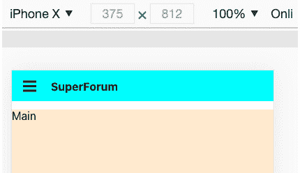
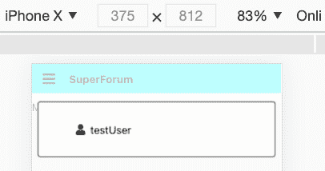
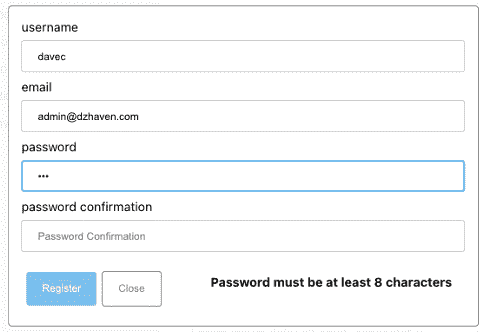
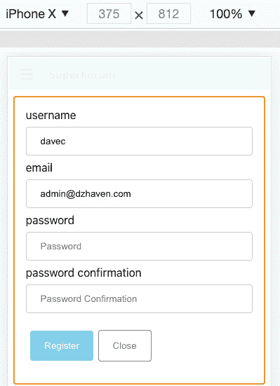
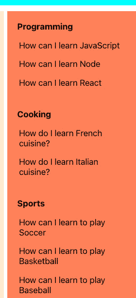
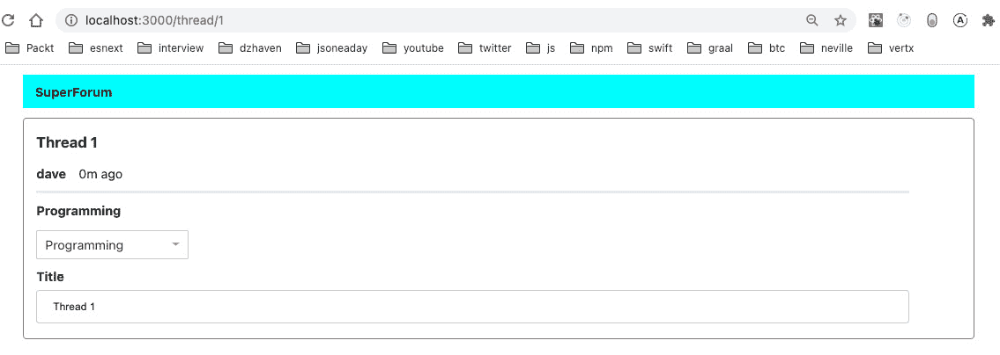
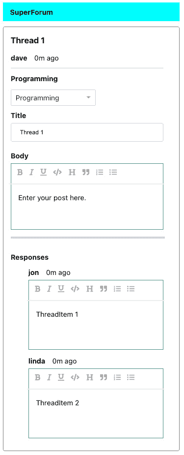
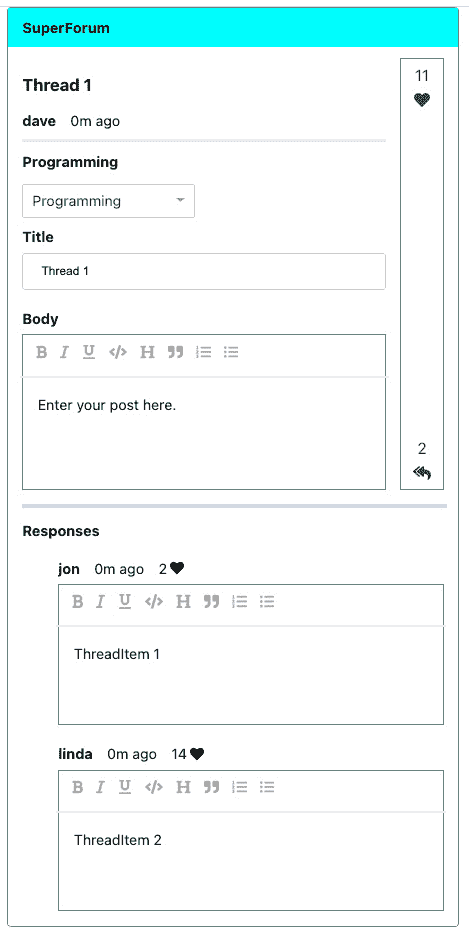
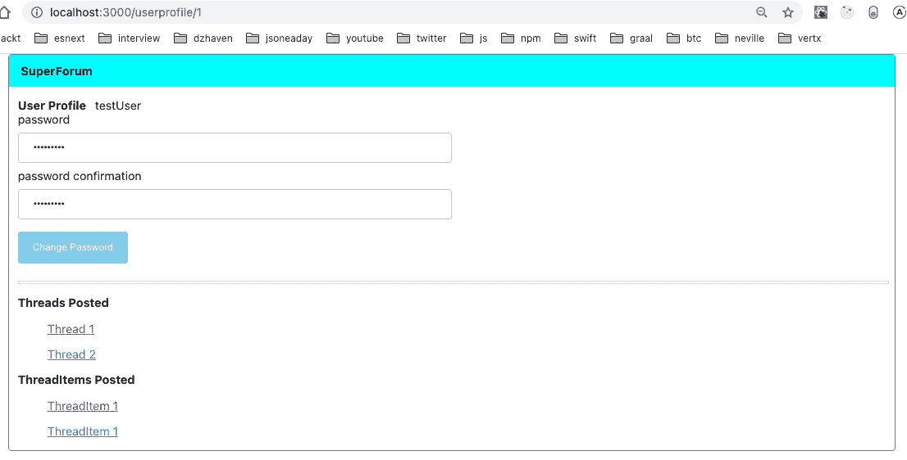

# 十二、为我们的在线论坛应用构建 React 客户端

我们已经走了很长的路。在本章中，我们将从 React 客户端开始编写应用。我们将学习前面章节中学习的所有内容，并使用新的 hooksapi 构建我们的 React 应用。我们还将使用响应技术构建移动客户端，该客户端将调整其视图以处理移动和桌面设备。

# 技术要求

现在，您应该对使用 React、Node、Express 和 GraphQL 进行 web 开发有了很好的了解。您还应该熟悉 CSS。我们将再次使用 Node 和 visualstudio 代码来编写代码。

本书的 GitHub 存储库可在[找到 https://github.com/PacktPublishing/Full-Stack-React-TypeScript-and-Node](https://github.com/PacktPublishing/Full-Stack-React-TypeScript-and-Node) 。使用`Chap12`文件夹中的代码。

要设置[*第 12 章*](#_idTextAnchor179)代码文件夹，请转到您的`HandsOnTypescript`文件夹并创建一个名为`Chap12`的新文件夹。

# 创建 React 应用的初始版本

在本节中，我们将构建我们的客户。我们无法完全完成客户机，因为它需要我们的后端功能，如 GraphQLAPI、身份验证功能、post 线程等。不过，我们将开始创建主屏幕，并设置 Redux 和 React 路由。

本节将有大量代码。请经常休息并调整自己的节奏。在我们的构建过程中，代码将不断演化并得到多次迭代和重构。有时，这是为了更好地重用代码。有时，这将是为了改进我们的设计及其可读性。所以，如果你被卡住了，请参考源代码。这将是本书迄今为止最具挑战性的部分。

笔记

我们不会显示每一行代码，因为这是多余的。请下载并在编辑器中打开源代码，以便后续操作。

在本节中，我们将介绍以下主题：

*   React 项目设置和依赖项配置
*   造型与布局
*   Core component and feature creation

    提示

    从一开始就把所有的东西都编译好，实际上对你的学习没有任何好处。第一次这样做时，不要把精力放在简单地编译和运行东西上。相反，试着做些实验和改变。换句话说，破坏代码，使其不编译，然后修复它。这是确保你明白自己在做什么的唯一方法。

让我们首先使用`create-react-app`创建我们的基础项目。然后，我们将添加 Redux 和 React 路由：

1.  从终端转到`Chap12`文件夹并运行以下命令：

    ```js
    create-react-app super-forum-client --template typescript
    ```

2.  接下来，将 cd 放入新的`super-forum-client`文件夹，并运行`start`命令以确保其正常工作：

    ```js
    npm start
    ```

3.  Now, let's install Redux and React Router:

    ```js
    npm i redux react-redux @types/redux @types/react-redux react-router-dom @types/react-router-dom
    ```

    笔记

    如果您曾经遇到应用无法正常启动的 NPM 软件包问题，请尝试删除`package-lock.json`文件和`node_modules`文件夹。然后，使用`npm install`进行清洁安装。

现在，我们已经安装了核心软件包。在开始编写代码之前，我们需要讨论如何布置应用。在我们的例子中，我们希望我们的应用能够在移动设备和台式机上工作。这样，我们就可以在手机、台式机和笔记本电脑上运行单个应用。

实现这一目标有多种方法。我们可以使用库，如**引导**或 UI 框架，如**离子**来帮助我们构建 UI 和布局。这些框架很棒，工作也很好，但它们也隐藏了一些关于布局和样式如何在 web 上工作的细节。在使用框架时，您也可能会失去一些控制，最终导致站点看起来与使用相同框架的其他站点类似。

## CSS 网格

对于我们的应用，我们将使用响应式 Web 设计。响应性Web 设计只是为了让我们的 Web 应用适应不同的设备和屏幕尺寸。在使用 web 技术时，有很多方法可以做到这一点。其中之一是 CSS 网格。有了这个系统，我们可以构造我们的应用屏幕，以最佳利用桌面空间，同时自动为移动设备重新配置它。因此，我们将使用 CSS 网格以及其他 web 技术来创建布局。

CSS 网格为我们提供了 Bootstrap 等程序可以实现的大部分功能。但是，CSS 网格是 CSS web 标准的一部分，而不是第三方库的一部分。因此，我们知道我们的布局将始终与 web 配合使用，并且不会突然变得不受支持。

那么，什么是 CSS 网格？CSS 网格是标准 CSS 中内置的一种布局方法，它允许我们使用行和列创建灵活的布局。它的创建是为了取代布局中表格的使用。CSS 网格非常强大，有很多方法可以做同样的事情。为了简单起见，我将向您展示一种具体的方法来实现这一点，尽管您可以在以后探索更多选项，如果您认为这很有用的话。让我们开始使用 CSS 网格：

1.  First, go back to our project, open `App.tsx`, and remove the contents of the `App` object. Do the following:

    ```js
    import React from "react";
    import "./App.css";
    function App() {
      return (
        <div className="App">
          <nav className="navigation">Nav</nav>
          <div className="sidebar">Sidebar</div>
          <div className="leftmenu">Left Menu</div>
          <main className="content">Main</main>
          <div className="rightmenu">Right Menu</div>
        </div>
      );
    }
    export default App;
    ```

    如您所见，我们已经删除了大部分内容，并将其替换为布局占位符。当然，我们最终会用这些元素制作组件，但现在，我们将专注于让我们的`Grid`布局发挥作用。

2.  Now, let's replace the contents of the `App.css` file, like this:

    ```js
    :root {
      --min-screen-height: 1000px;
    }
    ```

    首先，有一个`:root`伪类，我们将使用它作为应用主题 CSS 变量的容器。为了使样式和主题更加一致和容易，我们将使用变量而不是硬编码值。当我们构建应用时，您将看到这里添加了越来越多的变量：

    ```js
    .App {
    margin: 0 auto;
    ```

    以下页边距设置集中在我们的布局中：

    ```js
      max-width: 1200px;
      display: grid;
      grid-template-columns: 0.7fr 0.9fr 1.5fr 0.9fr;
      grid-template-rows: 2.75rem 3fr;
      grid-template-areas:
        "nav nav nav nav" 
        "sidebar leftmenu content rightmenu";
      gap: 0.75rem 0.4rem;
    }
    ```

    下面是与网格相关的属性的概述：

    *   `display`：在这里，我们声明我们的元素将是`grid`类型。
    *   `grid-template-columns`：该属性以相对的方式告诉我们的应用列的宽度。在我们的设置中，它表示我们有四列。`fr`值表示应将可用宽度的一部分提供给列。例如，在我们的例子中，我们有四列，所以如果每列的可用宽度完全相等，那么每列的值将是`1fr`。但在我们的例子中，每一列使用的宽度大小不同，小于或大于相等的分布，这就是为什么我们有不同的值。可能的值可以是特定的，例如`100px`或`2rem`；百分比，例如`20%`；或者隐式的，例如。`25fr`。
    *   `grid-template-rows`：表示行数和行大小。可能的值与列相同。
    *   `grid-template-areas`：每个网格都可以有标记的区域，称为区域。如本例所示，您只需将网格形式中每个区域的标签添加到希望它们位于其中的列和行中。因此，在我们的例子中，`"nav nav nav nav"`表示两行中的第一行，有四列，`"sidebar leftmenu content rightmenu"`表示第二行及其每一列。
    *   `gap`：这是在列和行之间添加填充的一种方式。第一个条目表示行，第二个条目表示列。
3.  Now that we've explained the basic features of CSS Grid, let's look at the styling for the related sections of the Grid. The remaining styles are for the Grid content areas:

    ```js
    .navigation {
      grid-area: nav;
    }
    .sidebar {
      min-height: var(--min-screen-height);
      grid-area: sidebar;
      background-color: aliceblue;
    }
    .leftmenu {
      grid-area: leftmenu;
      background-color: skyblue;
    }
    .content {
      min-height: var(--min-screen-height);
      grid-area: content;
      background-color: blanchedalmond;
    }
    .rightmenu {
      grid-area: rightmenu;
      background-color: coral;
    }
    ```

    正如您所看到的，它们有一个`grid-area`属性，指示元素所属的网格区域。`nav`区域将用于导航。`sidebar`将显示用户特定设置的菜单，仅在台式机和笔记本电脑上显示；它将为移动设备隐藏。`leftmenu`将用于存储我们的线程类别列表。`content`将包含按类别筛选的线程主列表。最后，`rightmenu`将显示流行或其他相关线程的列表。

    笔记

    我暂时使用这些笨拙的`background-color`设置，只是为了清楚地区分每个区域。最终，我们将移除它们。

现在，我们有了一个适用于台式机和笔记本电脑设备的应用的基本布局。但是，我们如何才能使这种自动重新配置自己的小屏幕，如手机和平板电脑？有一种 CSS技术称为**媒体查询**，在这种情况下可能会有所帮助。然而，就我们的需要而言，光靠它是不够的。

我们使用由状态变化驱动的 React 动态构建应用。这意味着，如果不需要或无法在较小的设备上显示某些屏幕组件，则不应绘制它们。因此，尽管我们可以在检测到较小屏幕时使用媒体查询来隐藏元素，但让 React 呈现用户永远不会看到或直接使用的内容将是对资源的低效利用。

相反，让我们看看我们可以在代码中使用事件处理和反应挂钩来解决这个问题：

1.  我们要做的第一件事是将元素转换为 React 组件。让我们在名为`components`的`src`文件夹中创建一个新文件夹。
2.  然后，在该文件夹中，为`App`组件的根`div`内的每个元素创建一个容器组件。您的`src`文件夹和`App.tsx`文件现在应该如下所示：


图 12.1–重构的 App.tsx 文件

由于简短，我不会审查我们需要在这里创建的每个文件，因为它是高度重复的代码，但这里有一个更新的`Main`组件的示例（当然，源代码将包含所有组件的完整应用代码）：

```js
import React from "react";
const Main = () => {
  return <main className="content">Main</main>;
};
export default Main;
```

如您所见，我们刚刚将代码从`App.tsx`移到组件的`Main.tsx`文件中。这意味着您需要创建其余的组件；即，`Nav`、`SideBar`、`LeftMenu`和`RightMenu`。下面是 React开发者工具屏幕的截图，显示了迄今为止我们的组件层次结构。React 开发者工具在*第 6 章中进行了讨论，使用 create React 应用设置我们的项目，并使用 Jest*进行测试：


图 12.2–组件层次结构视图

注意这里有**导航**、**侧栏**、**左菜单**、**主菜单**和**右菜单**组件。每个组件代表我们网站根目录上的应用区域。请注意，在构建应用时，我们将有更多的屏幕。

无论如何，我们都必须进行组件化，因为我们正在构建一个 React 应用。但是，这如何帮助我们满足我们的愿望，使我们的 web 应用能够响应，从而自动配置到不同的设备屏幕？通过将网格的每个区域分离为自己的组件，我们可以允许每个组件使用一个 React 挂钩来查找屏幕大小信息。因此，如果组件不适合特定的屏幕大小，它将不会渲染或以不同方式渲染。

为了使这个响应系统工作，我们需要两个主要特性。首先，我们需要一些额外的 CSS 样式，当检测到较小的设备时，这些样式使用媒体查询以不同的方式布置网格。此外，我们需要让我们的组件在使用特定的屏幕大小时能够感知，或者不渲染组件，或者以不同的方式渲染组件。让我们看看代码是什么样子。

首先，让我们为移动设备创建媒体查询。打开您的`App.css`文件，将以下媒体查询添加到我们文件的底部：

```js
@media screen and (orientation: portrait) and (max-width: 768px) {
  .App {
    grid-template-columns: 1fr;
    grid-template-areas:
      "nav"
      "content";
  }
}
```

这里，每当设备的`orientation`处于`portrait`模式且分辨率小于等于`768px`时，我们将覆盖原始的`App`类定义。如果您在移动模式下使用 Chrome Developer Tools 作为 iPhone X 运行应用，您应该会看到：


图 12.3–移动模式下应用的 Chrome 开发者工具视图

该应用有一个白色的右侧，因为我们仍然呈现原始桌面模式中存在的元素。我们很快就会解决的。现在，让我们创建我们的**挂钩**，它有助于处理基于设备大小的渲染：

1.  Create a folder inside the `src` folder called `hooks`. Then, add a file called `useWindowDimensions.ts`. Notice that it is not a component since it has a `ts` extension. Copy the source code from this book's GitHub repository and let's go through it.

    首先，我们创建一个名为`WindowDimension`的接口，这样我们就可以输入挂钩返回的内容，在本例中是浏览器的`window`对象维度。

    然后，在*第 8 行*上，我们命名我们的`useWindowDimensions`挂钩。然后，在下一行，我们创建了一个名为`dimension`的状态对象，并为`height`和`width`分别赋予它`0`和`0`的值。

2.  接下来，我们创建处理函数`handleResize`，它将使用状态更新方法`setDimension`来设置维度值。我们浏览器的`window`对象提供尺寸值。
3.  最后，从第 21 行开始，我们使用`useEffect`挂钩来处理窗口的`resize`事件。请注意，空数组[T2]表示在第一次加载时只运行一次。另外，请注意，在添加事件处理程序时，还必须返回事件移除程序（这可以防止添加内存泄漏和冗余事件处理程序）。
4.  Now, we need to update our `SideBar`, `LeftMenu`, and `RightMenu` components so that they will use our `useWindowDimensions` Hook and know not to render when a device has a width of less than or equal to `768` (the same as our media query). The code to use with the Hook is identical across each of these components, so I will only show the `SideBar` component here. Please update the other components yourself in a similar manner:

    ```js
    import React from "react";
    import { useWindowDimensions } from "../hooks/useWindowDimensions";
    const SideBar = () => {
      const { width } = useWindowDimensions();
      if (width <= 768) {
        return null;
      }
      return <div className="sidebar">Sidebar</div>;
    };
    export default SideBar;
    ```

    如您所见，我们使用`useWindowDimensions`挂钩获得`width`尺寸。然后检查是否为`768`或更低，如果为，则返回`null`；否则，我们将返回正常的 JSX。其他部件将具有与`useWindowDimensions`挂钩相同的代码。

    如果您运行该应用，您将看到白色间隙现在消失，并且这些组件不会在 HTML 中呈现。请注意，为了节省时间，我们只支持 iPhone X 的桌面和移动肖像模式。支持所有可能的设备配置超出了本书的范围。下面是一个关于支持多个设备屏幕主题的好链接，来自谷歌：[https://developers.google.com/web/fundamentals/codelabs/your-first-multi-screen-site](https://developers.google.com/web/fundamentals/codelabs/your-first-multi-screen-site) 。

    在我们继续之前，让我们充实一下我们的客户群配置，比如 Redux 和 React 路由。

5.  更新您的`index.tsx`文件，使其包含 Redux 和 React 路由。我们在[*第 7 章*](07.html#_idTextAnchor110)*中介绍了 Redux 和 React 路由，学习 Redux 和 React 路由*。和往常一样，如果您陷入困境，源代码是可用的。
6.  现在，让我们在名为`store`的`src`文件夹中创建一个文件夹，并在那里添加我们的 Redux 文件。创建`AppState.ts`和`configureStore.ts`文件，并输入源文件中显示的代码。我们还没有为`UserProfileReducer`做好准备，所以您可以暂时不考虑。我们不会使用 Redux 中间件，因为我在[*第 7 章*](07.html#_idTextAnchor110)*中展示了这一点，学习 Redux 和 React 路由*。

现在，在我们继续并开始创建组件之前，让我们为我们的应用添加一个更新的 React 功能，这将帮助我们添加更多的润色。

## 误差边界

错误边界很像 React 组件的异常处理。在大型应用中，并非总是能够防止所有可能发生的错误。因此，通过对组件使用错误边界，我们可以“捕获”意外错误，并为用户提供更好的用户体验。当出现错误时，我们将显示一个我们预先创建的错误屏幕，而不是一些看起来不祥的技术错误消息。让我们开始：

1.  First, let's create our Error Boundary file. Inside of the `components` folder, create a file called `ErrorBoundary.tsx` and add the source code from this book's GitHub repository to it. Note that Error Boundaries still uses the older class style because we need the `getDerivedStateFromError` and `componentDidCatch` life cycle event handlers to catch errors. The React team does plan to add a Hooks equivalent eventually.

    在文件的顶部，请注意，我们还有一个匹配的 CSS 样式文件。它很简单，所以我不会在这里显示它，但是您可以在源代码中找到它。

    首先，我们将为错误边界的道具创建一个名为`ErrorBoundaryProps`的类型。

    接下来，我们必须为错误边界的本地状态创建另一种类型，称为`ErrorBoundaryState`。在`ErrorBoundary`类定义的开始，我们将看到一些带有构造函数的样板文件，用于设置状态。紧接着，我们将使用`getDerivedStateFromError`函数告诉 React，如果`hasError`为真，则显示错误 UI。

    在*第 31 行*中，正是在我们的`componentDidCatch`函数中，我们的组件意识到发生了某种错误，并将我们的`hasError`状态变量设置为 true。我们也可以在这里运行自己的代码来记录错误，并在需要时通知支持人员。

    最后，如果[T0]为真，我们将呈现我们的消息，这样用户就不必看到可能令人困惑的奇怪技术消息。当然，您可以编写自己的自定义消息。

    警告

    错误边界不会捕获事件处理程序、异步代码或服务器端渲染的 React 中发生的错误，以及错误边界本身引发的错误。您必须使用`try catch`自行处理这些问题。

2.  Now, let's test our Error Boundary by throwing an error inside one of our components. Update the `Main.tsx` file's `Main` function, like this:

    ```js
    const Main = () => {
      const test = true;
      if (test) throw new Error("Main fail");
      else {
        return <main className="content">Main</main>;
      }
    };
    ```

    如你所见，我们故意抛出`Error`。

3.  现在尝试运行应用。您应该看到我们试图避免的屏幕类型。为什么会这样？之所以会发生这种情况，是因为我们目前处于开发模式，React 故意显示了该模式中的所有错误。如果我们处于生产模式，通过运行`npm run build`，我们将看到错误边界消息。

然而，如果我们点击 Chrome 浏览器右上角的**x**按钮，我们仍然可以在开发模式下查看错误边界屏幕。如果执行此操作，您将看到以下消息：


图 12.4–错误边界消息

如您所见，我们的正常错误消息现在出现。同样，您可以根据自己的喜好随意设计这条信息。为了节省时间，我们将保持原样。

## 数据服务层

在我们的应用中，我们将调用 GraphQLAPI 或 Web API，或者获取网络调用。然而，这些后端服务都还没有准备好。现在，我们将创建一个文件，其中包含模拟真实后端的假网络调用。一旦我们真正的后端到达，我们将删除此功能：

1.  首先，在`src`内创建一个名为`services`的文件夹，然后在其中创建`DataService.ts`文件。因为这是我们将很快丢弃的代码，所以我不会在这里显示它，但是您可以从源文件中获取代码。请注意，此服务中将提供一些对模型类型的引用，因此您需要添加这些引用，我们将在本章中介绍这些引用。
2.  现在我们有了获取数据的方法，让我们更新`LeftMenu`组件，以便它使用它。但首先，我们需要创建`Category`类型，因为我们使用的是 TypeScript。在`src`内创建一个名为`model`的新文件夹。然后，创建`Category.ts`文件并向其中添加源代码。
3.  现在，更新`LeftMenu.tsx`文件。首先，我们将通过添加名为`Category`的模型类型和`LeftMenu.css`文件来更新导入。稍后我们将在代码中使用这些。
4.  然后，在*第 9 行*中，创建名为`categories`的状态对象，其中包含类别列表。在加载`Category`数据之前，我们需要一些默认文本`Left Menu`。
5.  然后，在*第 13 行*上，我们有`useEffect`，在那里我们调用`getCategories`函数并获取`Categories`。然后，我们使用 ES6`map`函数将对象转换为 JSX。
6.  最后，在返回的 JSX 中，我们在 UI 中使用`Categories`状态对象。

如果您重新加载浏览器，您将看到由于我们的假`DataService`中的计时器而导致的 2 秒延迟，然后是类别列表，如所示：


图 12.5–加载的类别

同样，一旦真正的服务器调用就绪，我们将删除[T0]。

## 导航菜单

既然有了基本配置和布局，我们就可以开始创建侧栏菜单了。我们的侧栏菜单项的有趣之处在于，它们将用于侧栏和移动设备的下拉模式。这样，我们可以通过两种显示类型都只有一个组件来编写更少的代码。

现在，为了创建带有一组正确链接的侧栏，我们需要知道用户是否已登录。如果他们没有登录，我们将向他们显示登录和注册菜单。如果他们登录，我们将向他们显示注销和用户配置文件菜单。UserProfile 菜单屏幕将显示用户的设置，以及他们发表的文章列表。由于用户的登录状态将在整个应用中共享，因此让我们将这些数据放入我们的 Redux 存储：

1.  我们将使用`UserProfile`对象实例的存在或缺少作为用户登录的指示。首先，让我们将一个新的减速器添加到当前空的减速器集中。在`store`中创建一个名为`user`的新文件夹。现在，创建一个名为`Reducer.ts`的文件，并添加所需的源代码。
2.  然后，创建一个名为`UserProfileSetType`的动作类型，以便我们的`UserProfileReducer`可以与其他减速器区分开来。
3.  接下来，我们必须创建一个名为`UserProfilePayload`的有效负载类型。这些数据将在稍后发送时出现在我们的操作中。
4.  然后，我们必须创建`UserProfileAction`接口，它是`action`类型的。这用于区分 UserProfiles 的操作与其他操作类型。
5.  最后，我们有一个实际的减速机`UserProfileReducer`，它根据我们想要的`UserProfileSetType`执行过滤。再次，Redux 在[*第 7 章*](07.html#_idTextAnchor110)*中介绍，学习 Redux 和 React Router。*
6.  为了帮助我们设计组件，我们需要使用图标来提供更好的视觉表现。让我们安装 Font Awesome，因为它是免费的，并且提供了一个非常受欢迎的 web 开发风格和图标工具包。运行以下命令：

    ```js
    npm i @fortawesome/fontawesome-svg-core @fortawesome/free-solid-svg-icons @fortawesome/react-fontawesome 
    ```

7.  Now that we've added our icons, let's create a new folder inside `src/components` called `sidebar` and move our existing `SideBar.tsx` file into it. Now, create a new file called `SideBarMenus.tsx` and add the following code to it. Make sure you've added the necessary imports:

    ```js
    const SideBarMenus = () => {
      const user = useSelector((state: AppState) => state.   user);
    const dispatch = useDispatch();
    ```

    我们使用`useSelector`和`useDispatch`挂钩访问 Redux 的功能：

    ```js
    useEffect(() => { 
        dispatch({
          type: UserProfileSetType,
          payload: {
            id: 1,
            userName: "testUser",
          },
        });
      }, [dispatch]);
    ```

    然后，我们使用`useEffect`挂钩调用、分派和更新`UserProfile`对象。请注意它现在是硬编码的，但稍后后端准备就绪时，我们将使用 GraphQL 调用：

    ```js
      return (
        <React.Fragment>
          <ul>
            <FontAwesomeIcon icon={faUser} />
              <span className="menu-name">{user?.userName}           </span>
          </ul>
        </React.Fragment>
      );
    };
    ```

    接下来，我们必须为 UserProfile 添加一个`FontAwesome`字体，然后显示当前的`username`。此菜单项最终将可单击，以便我们的用户配置文件屏幕出现：

    ```js
    export default SideBarMenus;
    ```

    当我们构建登录、注销、注册等屏幕时，我们将把这些菜单项添加到这个 JSX 中。

    我个人认为要点会分散注意力，所以让我们通过在`index.css`文件中添加以下样式来删除应用无序列表中的所有要点：

    ```js
    ul {
        list-style-type: none 
    }
    ```

8.  Now, we need to update `SideBar.tsx` so that it uses `SideBarMenus.tsx`. Update `SideBar` like this. First, add the appropriate imports, such as `SideBarMenus`, first:

    ```js
    const SideBar = () => {
      const { width } = useWindowDimensions();
      if (width <= 768) {
        return null;
      }
      return (
        <div className="sidebar">
          <SideBarMenus />
        </div>
      );
    };
    ```

    现在，我们可以更新 JSX 以包含它。

    请注意，我们最终将编写一些代码，以便只有当用户实际登录时，`UserProfile`图标和`userName`才会出现。我们还将单击启用它，以便单击它打开用户的 UserProfile 屏幕。但是，没有后端，我们无法做到这一点。现在，我们将把它作为占位符。

9.  Let's continue and reuse our `SideBarMenus` component for mobile display. Update the `Nav.tsx` file inside the `components` folder. Add the appropriate imports:

    ```js
    const Nav = () => {
      const { width } = useWindowDimensions();
      const getMobileMenu = () => {
        if (width <= 768) {
          return (
            <FontAwesomeIcon icon={faBars} size="lg"          className="nav-mobile-menu" />
          );
        }
        return null;
      };
    ```

    同样，我们使用了挂钩来确定我们是否在移动设备上。然而，这一次，我们创建了一个名为`getMobileMenu`的函数来处理决定返回什么 JSX 的逻辑。如果我们没有运行移动设备，它不会返回任何信息；否则，返回汉堡菜单的`FontAwesome`图标：

    ```js
      return (
        <nav className="navigation">
          {getMobileMenu()}
          <strong>SuperForum</strong>
        </nav>
      );
    };
    export default Nav;
    ```

    在移动设备上查看时，屏幕应如下所示：

    

    图 12.6–移动模式下的导航菜单

10.  当我们构建应用时，我们需要能够显示模态。所以，在继续之前，我们需要安装`react-modal`。这个软件包将允许我们制作一些组件模式弹出窗口。这使它们在何时可以显示方面更加灵活。像这样安装`react-modal`：

    ```js
    npm i react-modal
    npm i @types/react-modal -D
    ```

11.  In order to use this modal and have it be responsive and adapt to different device screens, we need to update our styles. In our `App.css` file, you will see a class called `modal-menu` that has been applied to all our modals.

    这是我们的非移动设备将获得的模态的默认样式。这里需要注意的主要问题是，模态在屏幕的 50%处开始其`left`位置。然后，我们使用`transform`将其拉回一半（自身的 50%）。这应该以我们的模态为中心，这样它就在屏幕的中间。请注意，`z-index`设置为高，以确保此模式始终显示在顶部。

    对于移动设备，我们使用`App.css`文件的现有媒体查询来保存更新的`modal-menu`。基本上，我们正在用移动媒体查询的样式覆盖桌面样式中的相同属性。在本例中，我们使用`left`、`right`和`top`将模式延伸到可用屏幕的末端。这就是为什么我们的转换现在是 0，因为它不是必需的。

12.  接下来，我们将将点击处理程序添加到汉堡包图标，然后在点击图标时显示`SideBarMenus`组件。因此，我们需要再次更新我们的`Nav.tsx`文件，以便它包含显示`SideBarMenus`的模态。让我们更新一下`Nav.tsx`。首先添加适当的导入。然后，添加源代码。
13.  如果我们从*第 10 行*开始，我们将看到一个新的地方州，名为`showMenu`。我们将使用它来控制是显示还是隐藏模式菜单。
14.  `onClickToggle`处理程序用于`FontAwesomeIcon`中的`getMobileMenu`函数中，用于切换`showMenu`本地状态，显示或隐藏模式。
15.  在`ReactModal`中，当任何关闭请求进入组件时，我们需要设置状态控制显示，以便可以显式设置为 false；否则，模态不会消失。这就是`onRequestClose`所做的。`shouldCloseOnOverlayClick`属性允许我们关闭模态，即使我们单击它之外的任何位置。这是用户通常期望的行为，所以拥有它是很好的。
16.  Finally, the JSX has been updated so that we can add our `ReactModal`, which includes our `SideBarMenus` component.

    如您所见，模态被称为`ReactModal`，在其属性中，有一个称为`isOpen`的道具。这决定是否显示模态。

17.  如果您运行代码，然后点击汉堡图标，您将看到：



图 12.7–带侧边栏菜单的 ReactModel

同样，我们将在添加更多功能时构建此菜单。

## 认证组件

现在我们已经设置了侧栏，让我们开始构建我们的身份验证组件。我们将首先构建注册、登录和注销屏幕：

1.  Let's create the registration modal first. In order to do this, we'll need to add a link for registration inside our `SideBarMenus` component. Open the `SideBarMenus.tsx` file and update it like this:

    ```js
    As always add appropriate imports first.
    ```

    前几行代码保持不变，因此我没有在这里显示它们。以下是更新的 JSX：

    ```js
      return (
        <React.Fragment>
          <ul>
            <li>
              <FontAwesomeIcon icon={faUser} />
              <span className="menu-name">{user?.userName}          </span>
            </li>
            <li>
              <FontAwesomeIcon icon={faRegistered} />
              <span className="menu-name">register</span>
            </li>
          </ul>
        </React.Fragment>
      );
    };
    ```

    我们在返回的 JSX 中添加了和额外的`li`，并为注册添加了新图标和标签。

2.  Now, before we create our Registration component, let's create a helper service that validates our passwords for us. We want to make sure users enter sufficiently long and complex passwords, so we need a **validator**. Create a new folder inside `src` called `common` and then another folder called `validators`. In the `validators` folder, create a file called `PasswordValidator.ts` and add the following code to it. The code is pretty simple, so I won't show all of it here, but do notice the password strength and the Regular Expression. A Regular Expression is just a programmatic way of searching for patterns in a string:

    ```js
    const strongPassword = new RegExp(
        "^(?=.*[a-z])(?=.*[A-Z])(?=.*[0-9])(?=.*[!@#$%^&*])      (?=.{8,})"
      );
      if (!strongPassword.test(password)) {
        passwordTestResult.message =
          "Password must contain at least 1 special       character, 1 cap letter, and 1 number";
        passwordTestResult.isValid = false;
      }
    ```

    在这里，我们使用了一个正则表达式，通过确保密码中同时包含字母、数字和符号来检查适当的复杂性。偏执词代表一组相关的表达。首先，我们有小写字母，然后是大写字母，然后是数字，然后是符号，最后是预期长度：

    ```js
      return passwordTestResult;
    };
    ```

    这段代码并不特别复杂，但由于我们需要跨多个组件（例如注册和服务器上的组件）使用这段代码，因此将其放在单独的文件中有利于代码重用。

    笔记

    在 SPA web 开发中，验证通常进行两次—一次在客户端，另一次在服务器上。这样做两次似乎是多余的，但这对于增加安全性是必要的。一旦我们开始构建我们的服务器代码，我们将学习如何跨项目共享像这样的依赖项。

3.  Since we're creating multiple authentication-related components, let's create a folder inside `components` called `auth` and then place our authentication-related files there. Once you've created the `auth` folder, add a file called `Registration.tsx` in there. Add the following code to the file. If you look at the source code, you will be able to see the necessary imports. Make sure your `App.css` file is updated as well. Note that eventually, we'll move some of this code into a shared location, but for now, we'll use it directly in our `Registration` component:

    ```js
    const userReducer = (state: any, action: any) => {
      switch (action.type) {
        case "userName":
          return { ...state, userName: action.payload };
        case "password":
          return { ...state, password: action.payload };
        case "passwordConfirm":
          return { ...state, passwordConfirm: action.payload        };
        case "email":
          return { ...state, email: action.payload };
        case "resultMsg":
          return { ...state, resultMsg: action.payload };
        default:
          return { ...state, resultMsg: "A failure has        occurred." };
      }
    };
    ```

    在这里，我们正在创建减速器，它有许多相关字段：

    ```js
    export interface RegistrationProps {
      isOpen: boolean;
      onClickToggle: (
        e: React.MouseEvent<Element, MouseEvent> | React.    KeyboardEvent<Element>
      ) => void;
    }
    ```

    由于这是一个模态组件，我们允许我们的父组件通过传递道具来控制如何查看这个组件。`isOpen`道具控制模态的显示方式，`onClickToggle`功能控制模态的隐藏和显示：

    ```js
    const Registration: FC<RegistrationProps> = ({ isOpen, onClickToggle }) => {
      const [isRegisterDisabled, setRegisterDisabled] =    useState(true);
      const [
        { userName, password, email, passwordConfirm, resultMsg },
        dispatch,
      ] = useReducer(userReducer, {
        userName: "davec",
        password: "",
        email: "admin@dzhaven.com",
        passwordConfirm: "",
        resultMsg: "",
      });
    ```

    这里，我们有`isRegisterDisabled`本地状态值，如果给定值不正确，将禁用寄存器按钮，当然还有我们的本地减速机`userReducer`：

    ```js
      const allowRegister = (msg: string, setDisabled:     boolean) => {
        setRegisterDisabled(setDisabled);
        dispatch({ payload: msg, type: "resultMsg" });
      };
    ```

    `allowRegister`只是一个辅助功能，用于将寄存器按钮设置为禁用状态，并在需要时显示消息。

4.  Next, we have a series of `onChange` event handlers for each field, such as the `userName` field. They each do validation as needed, as well as update the typed-in text:

    ```js
    const onChangeUserName = (e: React.ChangeEvent<HTMLInputElement>) => {
        dispatch({ payload: e.target.value, type: "userName" });
        if (!e.target.value) allowRegister("Username cannot     be empty", true);
        else allowRegister("", false);
    };
    ```

    `onChangeUserName`功能用于设置`userName`并验证是否允许继续注册：

    ```js
    const onChangeEmail = (e: React.ChangeEvent<HTMLInputElement>) => {
    dispatch({ payload: e.target.value, type: "email" });
    if (!e.target.value) allowRegister("Email cannot be empty", true);
    else allowRegister("", false);
    };
    ```

    `onChangeEmail`功能用于设置邮件并验证是否允许继续注册：

    ```js
    const onChangePassword = (e: React.ChangeEvent<HTMLInputElement>) => {
    dispatch({ payload: e.target.value, type: "password" });
    const passwordCheck: PasswordTestResult = isPasswordValid(e.target.value);
    if (!passwordCheck.isValid) {
    allowRegister(passwordCheck.message, true);
    return;
    }
    passwordsSame(passwordConfirm, e.target.value);
    };
    ```

    `onChangePassword`功能用于设置密码和验证是否允许继续注册：

    ```js
    const onChangePasswordConfirm = (e: React.ChangeEvent<HTMLInputElement>) => {
        dispatch({ payload: e.target.value, type:     "passwordConfirm" });
        passwordsSame(password, e.target.value);
    };
    ```

    `onChangedPasswordConfirm`功能用于设置`passwordConfirm`并验证是否允许继续注册：

    ```js
    const passwordsSame = (passwordVal: string, passwordConfirmVal: string) => {
    if (passwordVal !== passwordConfirmVal) {
    allowRegister("Passwords do not match", true);
    return false;
    } else {
    allowRegister("", false);
    return true;
    }
    };
    ```

    最后，由于这是注册组件，我们使用`passwordsSame`检查密码和确认密码是否相等。

5.  Next, we have `onClickRegister` and `onClickCancel`. The `onClickRegister` button click handler will submit the attempted registration. Currently, since we have no backend, it does no actual submission, but we'll fill it in once we have the server up. On the other hand, the `onClickCancel` handler exits the `Registration` component:

    ```js
    const onClickRegister = (
    e: React.MouseEvent<HTMLButtonElement, MouseEvent>
    ) => {
    e.preventDefault();
    onClickToggle(e);
    };
    const onClickCancel = (
    e: React.MouseEvent<HTMLButtonElement, MouseEvent>
    ) => {
    onClickToggle(e);
    };
    ```

    注意，`e.preventDefault`函数只是防止标准行为，这取决于上下文。对于表单，我们的`onClickRegister`处理程序与表单标记内的按钮相关联，因此默认行为是提交并导致页面刷新。在 SPA 中，页面刷新不是我们想要的，所以我们使用`preventDefault`来限制页面刷新。

6.  Now that the event handlers have been set up we return the JSX that is tied to those handlers. First, we start with the `ReactModal` wrapper component:

    ```js
    return (
        <ReactModal
            className="modal-menu"
            isOpen={isOpen}
            onRequestClose={onClickToggle}
            shouldCloseOnOverlayClick={true}
        >
        <form>
            <div className="reg-inputs">
                <div>
                    <label>username</label>
                    <input type="text" value={userName}                onChange={onChangeUserName} />
                </div>
    ```

    同样，我们的模态由父组件通过`isOpen`和`onClickToggle`道具进行外部控制。

    ```js
    <div>
            <label>email</label>
            <input type="text" value={email}          onChange={onChangeEmail} />
          </div>
    ```

    在这里，我们有我们的电子邮件字段。

    ```js
          <div>
            <label>password</label>
            <input
              type="password"
              placeholder="Password"
              value={password}
              onChange={onChangePassword}
            />
        </div>
    ```

    这是我们的密码字段。

    ```js
        <div>
            <label>password confirmation</label>
            <input
                type="password"
                placeholder="Password Confirmation"
                value={passwordConfirm}
                onChange={onChangePasswordConfirm}
                />
            </div>
        </div>
    ```

    这是我们的密码确认字段。

    ```js
        <div className="reg-buttons">
            <div className="reg-btn-left">
                <button
                    style={{ marginLeft: ".5em" }}
                    className="action-btn"
                    disabled={isRegisterDisabled}
                    onClick={onClickRegister}
                >
                Register
                </button>
    ```

    在这里，我们有按钮进行注册。

    ```js
                <button
                    style={{ marginLeft: ".5em" }}
                    className="cancel-btn"
                    onClick={onClickCancel}
                >
                Close
                </button>
    ```

    这是我们要取消的按钮。

    ```js
            </div>
                <span className="reg-btn-right">
                    <strong>{resultMsg}</strong>
                </span>
            </div>
            </form>
            </ReactModal>
        );
    };
    export default Registration;
    ```

    最后，请注意，我们有一个使用[T0]reducer[T1]字段的消息部分。如果出现问题，这将显示错误。

7.  Now, if you run the app in desktop mode, you should see something this:

    

    图 12.8–桌面注册模式视图

    如果运行 Chrome 调试器并切换到移动模式，单击汉堡图标和注册标签后，您将看到以下屏幕：

    

    图 12.9–移动注册模式视图

    正如您所看到的，通过使用CSS 响应功能，我们能够有效地使用单个组件获得两个屏幕。

8.  Now, let's move on to the login modal. If we take a look at the existing `Registration` component, we will see that it contains some code that we could also use in our `Login` component. We really should refactor the code so that it can be reused. For example, `Registration`, `Login`, and `Logout` will all use `ReactModal` and therefore receive props to control the modal's display. So, let's see what we can do to reuse our existing code. First, let's extract the `RegistrationProps` interface from the `Registration.tsx` file and place it in its own file. Create a folder called `types` inside `components`. Then, create a file called `ModalProps.ts` and add the `RegistrationProps` interface. Rename it `ModalProps`.

    如您所见，除了名称更改外，它与`RegistrationProps`相同。现在，打开`Registration.tsx`文件，删除`RegistrationProps`，导入`ModalProps`。然后，将`RegistrationProps`替换为`ModalProps`。检查所有设备是否仍在运行。

9.  We refactored `ModalProps` so that it can be reused across components. Now, let's pull out `UserReducer` since `Login` uses some of its fields. Create a new folder called `common` inside the existing `auth` folder and create the `UserReducer.ts` file. Place the following code inside it:

    ```js
    const userReducer = (state: any, action: any) => {
      switch (action.type) {
        case "userName":
          return { ...state, userName: action.payload };
        case "password":
          return { ...state, password: action.payload };
        case "passwordConfirm":
          return { ...state, passwordConfirm: action.payload       };
        case "email":
          return { ...state, email: action.payload };
        case "resultMsg":
          return { ...state, resultMsg: action.payload };
        case "isSubmitDisabled":
          return { ...state, isSubmitDisabled: action.payload };
        default:
          return { ...state, resultMsg: "A failure has        occurred." };
      }
    };
    export default userReducer;
    ```

    请注意，我们添加了一个名为`isSubmitDisabled`的新字段。此字段将替换现有的`isRegisterDisabled`，以便用于禁用任何验证屏幕上的按钮。

    现在，从`Registration.tsx`文件中删除`userReducer`并从新的`UserReducer.ts`文件中导入它。另外，将`isRegisterDisabled`替换为`isSubmitDisabled`，并在`destructured`对象中包含`isSubmitDisabled`，以及`useReducer`挂钩调用的状态初始值设定项。

10.  Now, let's do one more refactor. The `allowRegister` function in `Registration` disables a button and updates the status message. This can also clearly be reused. Let's create a new file called `Helpers.ts` inside the common folder and add the following code inside it:

    ```js
    import { Dispatch } from "react";
    export const allowSubmit = (
      dispatch: Dispatch<any>,
      msg: string,
      setDisabled: boolean
    ) => {
      dispatch({ type: "isSubmitDisabled", payload: setDisabled });
      dispatch({ payload: msg, type: "resultMsg" });
    };
    ```

    如您所见，我们将函数名更改为`allowSubmit`，现在将`dispatch`作为参数。现在，从`Registration`中删除`allowRegister`并导入新的`allowSubmit`函数，并将`allowRegister`调用更新为`allowSubmit`调用。对照源代码检查`Registration.tsx`文件的代码。

    我们将保留这两个`onClick`调用，即使`Login`也会有类似的调用，因为在后端准备好后，我们可能需要为这些调用做一些特定于组件的事情。

    您现在应该能够运行此代码。

11.  Now, we can use the newly extracted code in our new `Login` component. In the `auth` folder, create a new file called `Login.tsx` and add the relevant code from the source code. I'll highlight a few items here:

    ```js
      const [
        { userName, password, resultMsg, isSubmitDisabled },
        dispatch,
      ] = useReducer(userReducer, {
        userName: "",
        password: "",
        resultMsg: "",
        isSubmitDisabled: true,
      });
    ```

    由于我们的`Login`组件与`Registration`组件有不同的需求，因此我们仅使用`userReducer`中的一部分字段，使用对象分解。

    在 JSX 中，请注意，为了更好地对齐按钮，我们更新了一些 CSS 类。这些新类在`App.css`文件中。

12.  最后，我们需要添加一个用于登录的链接。更新`SideBarMenu.tsx`文件，如源代码所示。

因为`Logout`非常相似，所以我添加了组件，但在这里不介绍它。我们将添加代码来控制显示哪些菜单链接，这取决于用户登录状态，稍后后端将更加充实。我们还将添加额外的验证。然而，在此之前我们还有很多工作要做，所以让我们继续。

## 路由和屏幕

现在，让我们继续创建应用将需要的路由。到目前为止，我们的应用只有一个 URL。根 URL 为`http://localhost:3000`。我们现在想要划分我们的应用，以便它对应用的特定部分有不同的路由。我们将首先使用现有代码，对其进行修改，并将其纳入第一个根路径。让我们开始：

1.  首先，让我们将与网格区域相关的组件移动到不同的文件夹中。首先，在`components`文件夹中创建一个名为`areas`的文件夹。然后，将`Nav.tsx`、`Nav.css`、`RightMenu.tsx`、`Main.tsx`、`LeftMenu.tsx`和`LeftMenu.css`文件以及整个`sidebar`文件夹移动到新的`areas`文件夹中。您的文件路径导入需要更新，包括`App.tsx`文件。看看源代码，了解如何做到这一点。
2.  完成后，在`areas`中创建一个名为`main`的新文件夹，并将`Main.tsx`文件移到其中。确保更新您的路径。我们将把所有与区域相关的主要组件添加到此文件夹中。
3.  The first new component we'll create in this folder is a `MainHeader` component. As the name implies, it will be used as a header for the main section. It will show what category of thread items we are currently looking at. Create the `MainHeader.tsx` file inside the `main` folder and add the code from the source into it.

    此控件的唯一用途是显示当前的`Category`名称。

再次注意，我们在的`MainHeader.css`和`App.css`文件中有一些新的 CSS 类。

## 主屏幕

在我们继续之前，让我们为我们的新路线执行一些基本设置。在这里，我们将创建新的屏幕组件`Home`，并更新任何相关文件，如`App.tsx`：

1.  When we first created our `App.tsx` file, we did so as if our application will have only one screen. Obviously, this is not true. Now that we have fleshed out our layout, let's begin adding our distinct screens and routes. Open the `App.tsx` file and update it like this.

    在这里，我们添加了一个名为`Home`的新导入，它表示主页路由。我们将在稍后构建它：

    ```js
    import Home from "./components/routes/Home";function App() {
    const renderHome = (props: any) => <Home {...props} />;
    ```

    我们在这里定义一个函数来发送到路由的`render`属性。此功能允许所有路线道具以及我们想要发送的任何自定义道具包含在`Home`组件的初始化中：

    ```js
      return (
        <Switch>
          <Route exact={true} path="/" render={renderHome} />
          <Route
            path="/categorythreads/:categoryId"
            render={renderHome}
          />
        </Switch>
      );
    }
    ```

    因此，之前显示网格区域的代码现在将位于`Home`组件中，我们将很快构建组件。

    如[*第 7 章*](07.html#_idTextAnchor110)*所示，学习 Redux 和 React Router*，我们的`Switch`组件允许 React Router 根据提供的 URL 更改路由屏幕的呈现。现在，我们将有两条路径指向同一`Home`屏幕，但稍后我们将添加更多。根路径将显示默认类别的线程，`categorythreads`路由将显示特定类别的线程。

2.  Before we create our new `Home` component, let's refactor our CSS a bit and make it more reusable. First, update the `App.css` file by adding the following class above the `App` class:

    ```js
    .screen-root-container {
      margin: 0 auto;
      max-width: 1200px;
      margin-bottom: 2em;
      border: var(--border);
      border-radius: 0.3em;
    }
    ```

    现在，它将成为我们应用中表示路由屏幕的任何组件的根类。

3.  Next, create a new file called `Home.css` inside the `components/routes` folder. Now, cut this entire set of CSS styles from `App.css`:

    ```js
    .App { // note this class is rename into home-container   // later
      margin: 0 auto;
      max-width: 1200px;
      display: grid;
      grid-template-columns: 0.7fr 0.9fr 1.5fr 0.9fr;
      grid-template-rows: 2.75rem 3fr;
      grid-template-areas:
        "nav nav nav nav"
        "sidebar leftmenu content rightmenu";
      gap: 0.75rem 0.4rem;
    }
    ```

    下一组 CSS 类是网格区域：

    ```js
    .navigation {
      grid-area: nav;
    }
    .sidebar {
      min-height: var(--min-screen-height);
      grid-area: sidebar;
      background-color: aliceblue;
    }
    .leftmenu {
      grid-area: leftmenu;
      background-color: skyblue;
    }
    .content {
      min-height: var(--min-screen-height);
      grid-area: content;
      background-color: blanchedalmond;
      padding: 0.5em 0.75em 0.5em 0.75em;
    }
    .rightmenu {
      grid-area: rightmenu;
      background-color: coral;
    }
    ```

    现在，将这个代码复制到我们新的`Home.css`文件中。复制完后，将[T1]类的名称更改为[T2]。我们正在更改名称，以便该类的用途更加明确。现在，让我们创建新的主屏幕组件，并学习如何使用这些 CSS 类。

4.  Create a folder inside the `components` folder called `routes` and add a new file called `Home.tsx` inside it. The code is short and simple, so you can just copy it from the source. It's mostly the old code from the previous version of `App.tsx`.

    我们已经更新了根 CSS`App`类，现在是`screen-root-container home-container`。在一个类属性中使用两个类只意味着首先应用第一个类样式，然后应用下一个，这将覆盖上一个类样式中的任何设置。此外，我们现在可以在其他屏幕中使用`screen-root-container`。

    我们已经成功地将原始的`App.tsx`代码移动到`Home.tsx`文件中。注意，我们还将`Nav`组件放在`div`标记中。我们这样做是为了以后可以在其他屏幕中重用`Nav`组件。您现在应该从`Nav.tsx`组件文件中删除`className="navigation"`属性。

5.  Now that we have updated our `Home` screen, we need to update our `Main` component so that it lists the threads within the given category. In order to do this, we actually need to do quite a few updates. First, we need to create two new models called `Thread` and `ThreadItem`. `Thread` is the initial post, while `ThreadItem` is a response. Let's start with our models.

    首先，在文件夹中创建`Thread.ts`，如源代码中的所示。

    这里没有什么要解释的，因为这是相当明显的。但是，请注意，`points`表示喜欢的总数。

    接下来，我们来做`ThreadItem.ts`。创建所需的文件并向其中添加源代码。它与`Thread`非常相似。

6.  Now, we will create the thread card file component. This component will represent a single Thread record and will show things such as its title, body, and points. Create a file called `ThreadCard.tsx` inside the `components/areas/main` folder. Then, add the code to it:

    ```js
    import React, { FC } from "react";
    import "./ThreadCard.css";
    import Thread from "../../../models/Thread";
    import { Link, useHistory } from "react-router-dom";
    import { faEye, faHeart, faReplyAll } from "@fortawesome/free-solid-svg-icons";
    import { FontAwesomeIcon } from "@fortawesome/react-fontawesome";
    import { useWindowDimensions } from "../../../hooks/useWindowDimensions";
    ```

    首先，我们有各种导入，包括 React Router 的`Link`对象和`useHistory`挂钩：

    ```js
    interface ThreadCardProps {
      thread: Thread;
    }
    ```

    请注意，我们正在接受`Thread`对象作为参数。在呈现`ThreadCard`UI 时，我们将使用此对象及其成员：

    ```js
    const ThreadCard: FC<ThreadCardProps> = ({ thread }) => {
      const history = useHistory();
      const { width } = useWindowDimensions();
      const onClickShowThread = (e: React.  MouseEvent<HTMLDivElement>) => {
        history.push("/thread/" + thread.id);
      };
    ```

    这里，我们使用 React 路由`useHistory`挂钩来获取`history`对象。当有人点击我们的线程时，我们使用`history`对象通过`history`对象上方的`pushing`新 URL 将应用重定向到新 URL。我们稍后将构建我们的线程路径和组件：

    ```js
      const getPoints = (thread: Thread) => {
        if (width <= 768) {
          return (
            <label
              style={{
                marginRight: ".75em",
                marginTop: ".25em",
              }}
            >
              {thread.points || 0}
              <FontAwesomeIcon
                icon={faHeart}
                className="points-icon"
                style={{
                  marginLeft: ".2em",
                }}
              />
            </label>
          );
        }
        return null;
      };
    ```

    `getPoints`函数创建了在我们的帖子上显示“喜欢”的用户界面。但是，由于我们的 UI 是响应性的，因此当我们检查屏幕的`width`属性时，它不会出现在桌面模式下：

    ```js
      const getResponses = (thread: Thread) => {
        if (width <= 768) {
          return (
            <label
              style={{
                marginRight: ".5em",
              }}
            >
              {thread && thread.threadItems && thread.           threadItems.length}
    ```

    此函数显示响应计数，如`thread.threadItems.length`属性指示的：

    ```js
              <FontAwesomeIcon
                icon={faReplyAll}
                className="points-icon"
                style={{
                  marginLeft: ".25em",
                  marginTop: "-.25em",
                }}
              />
            </label>
          );
        }
        return null;
    };
    ```

    `getResponses`函数显示此`Thread`有多少`ThreadItems`响应。但是，由于我们的 UI具有响应性，因此当我们检查屏幕的`width`属性时，它不会出现在桌面模式下：

    ```js
      const getPointsNonMobile = () => {
        if (width > 768) {
          return (
            <div className="threadcard-points">
              <div className="threadcard-points-item">
                {thread.points || 0}
                <br />
                <FontAwesomeIcon icon={faHeart}              className="points-icon" />
              </div>
              <div
                className="threadcard-points-item"
                style={{ marginBottom: ".75em" }}
              >
                {thread && thread.threadItems && thread.             threadItems.length}
    ```

    此函数正在获取 LIKE计数，如`thread.threadItems.length`属性所示：

    ```js
                <br />
                <FontAwesomeIcon icon={faReplyAll}              className="points-icon" />
              </div>
            </div>
          );
        }
        return null;
      };
    ```

    `getPointsNonMobile`函数返回`ThreadCard`右侧的 points 列，但仅当设备是屏幕宽度大于 768 像素的台式机或笔记本电脑时才渲染。

    请记住，可能在同一屏幕上多次使用的每个 React 组件必须具有唯一的`key`值。所以，稍后，当我们使用这个组件时，您将看到每个实例都被赋予了一个唯一的`key`值。以下 JSX 是将`Category`名称返回为`Link`，这样当点击时，用户将被发送到显示该`Category`线程的屏幕：

    ```js
    return (    
    <section className="panel threadcard-container">
          <div className="threadcard-txt-container">
            <div className="content-header">
              <Link
                to={`/categorythreads/${thread.category.id}`}
                className="link-txt"
              >
                <strong>{thread.category.name}</strong>
              </Link>
    ```

    `Link`是呈现 URL 锚（HTTP 链接）的 React 路由组件。请注意，`categorythreads`是我们前面创建的第二条路由，它以`categoryId`作为参数：

    ```js
              <span className="username-header" style={{            marginLeft: ".5em" }}>
                {thread.userName}
              </span>
            </div>
            <div className="question">
              <div
                onClick={onClickShowThread}
                data-thread-id={thread.id}
                style={{ marginBottom: ".4em" }}
              >
                <strong>{thread.title}</strong>
              </div>
              <div
                className="threadcard-body"
                onClick={onClickShowThread}
                data-thread-id={thread.id}
              >
                <div>{thread.body}</div>
              </div>
    ```

    如您所见，我们在呈现 UI 时广泛使用了`thread`道具。

    在这里，我们使用`getPoints`和`getResponses`函数呈现 UI 的一个子集，以便它显示点和响应：

    ```js
              <div className="threadcard-footer">
                <span
                  style={{
                    marginRight: ".5em",
                  }}
                >
                  <label>
                    {thread.views}
                    <FontAwesomeIcon icon={faEye}                  className="icon-lg" />
                  </label>
                </span>
                <span>
                  {getPoints(thread)}
                  {getResponses(thread)}
                </span>          </div>
            </div>
          </div>
    ```

    在这里，我们使用来`getPointsNonMobile`显示我们的响应计数和喜好：

    ```js
          {getPointsNonMobile()}    </section>
      );
    };
    export default ThreadCard;
    ```

    注意，我们在这个组件中引用了许多 CSS 类，所有这些类都可以在源代码中的`ThreadCard.css`和`App.css`文件中找到。我不会在这里讨论每一个 CSS 类，但是如果你看一下`ThreadCard.css`文件，你会注意到有一个对`flex`的引用。Flexbox 是另一种在 CSS 中创建布局的方法，类似于网格。但是，Flexbox 旨在用于单行或单列布局；例如：

    ```js
    .threadcard-txt-container {
      display: flex;
      flex-direction: column;
      width: 92%;
    margin: 0.75em 1em 0.75em 1.2em;
    border-right: solid 1px var(--border-color);
    }
    ```

    在这个 CSS 中，显示方式表示为`flex`，而`flex-direction`表示列。这意味着`threadcard-txt-container`内所有元素的布局将在单个堆叠柱中。因此，即使我们有标签或按钮等元素，它们通常设置在水平线上，如果它们位于基于列的 flex 容器中，它们也将垂直放置。如果我们使用了 row 属性，那么布局将是水平的。

7.  Now that we've created our Thread container, `ThreadCard`, let's update our `Main.tsx` file so that we can use it. Add the code from the source.

    如果您查看*第 8 行*，您将看到正在使用的`useParams`功能。之前，我们在`App.tsx`文件中为 React Router 创建了两条路由。其中一条路由`categorythreads`接受了 URL 参数。通过使用`useParams`挂钩，我们可以获得路由参数——在本例中为`categoryId`——以便我们可以使用它们。

    然后，在*行 9*上，我们有`category`状态。一旦我们从线程列表中检索到类别，我们将更新此状态。

    在*第 10 行*中，我们有一个状态对象，它是我们`ThreadCards`的列表，称为`threadCards`。

    然后，在`useEffect`中，如果我们得到一个新的`categoryId`，我们将更新`ThreadCards`列表。当我们得到有效的`categoryId`时，我们使用`DataService`查询特定于该类别的线程列表，然后构建`ThreadCards`列表。我们还使用第一个线程获取类别的名称，因为它们都具有相同的类别。

    最后，我们返回 UI。

    笔记

    有时，您会看到关于[T0]挂钩数组缺少依赖项的警告。这些是我认为固执己见的警告和经验，你将能够判断哪些人可以被安全地忽略。例如，在`Main.tsx`的`useEffect`中，我故意忽略关于`category`状态对象的警告，因为将该对象包含在数组中会触发不必要的`useEffect`双运行（因为`useEffect`在其数组列表中的某些内容发生更改时运行）以及可能的双渲染。

8.  现在，let 尝试在桌面模式下运行。转到`http://localhost:3000/categorythreads/1`。您应该看到以下内容：


图 12.10–categorythreads URL 的桌面视图

以下是在手机上的样子：


图 12.11–类别读取 URL 的移动视图

正如你所看到的，在移动模式下，我们没有正确的点列。相反，这些要点位于正文部分的底部。图标显示，对于第一篇帖子，有两个人看到了它。55 人喜欢，一人回应。

哇–我们刚刚通过了很多代码！然而，我们还没有完成！让我们继续构建`RightMenu`组件。

在我们的`RightMenu`上，我们想展示一个拥有最多帖子的前三大类别的列表。在每个类别中，我们将显示查看次数最多的线程。让我们开始：

1.  首先，在名为`rightMenu`的`areas`文件夹中为`RightMenu`创建一个文件夹。
2.  现在，在该文件夹中创建一个名为`TopCategory.tsx`的新文件。此组件将表示单个顶级类别及其线程。
3.  创建一个表示来自服务器的数据的新模型。我们叫它`CategoryThread`。在`models`文件夹中创建一个名为`CategoryThread.ts`的文件，并输入源代码。
4.  Now, we need to update our existing `RightMenu` component and create a new component that will display our `CategoryThread` items. To group and organize our `CategoryThread` items, we need to use a tool called Lodash to help us.

    Lodash 是一个依赖项，它提供了一个庞大的 JavaScript 辅助函数库。它不可能在这里完成所有的功能。但是，Lodash 对于管理阵列和集合特别有用。您将看到它的使用非常简单，但是如果您想了解更多详细信息，这里有一个指向他们文档的链接：`https://lodash.com/docs/`。按如下方式安装 Lodash：

    ```js
    npm I lodash @types/lodash
    ```

    笔记

    切勿使用`import _ from "lodash"`导入整个 Lodash 库。这样做将为项目添加大量代码。仅使用`import groupBy from "lodash/groupBy"`导入特定呼叫。

    现在，我们可以更新我们的`RightMenu.tsx`文件，如源代码所示。

    首先，请注意，除了 Lodash 之外，我们还导入了一个新的`RightMenu.css`文件，以及一些次要的样式。我们还导入了`TopCategory`组件，之后我们将构建该组件。

    接下来，我们有一个名为`topCategories`的新状态对象，用于存储顶级类别数组。

    然后，在`useEffect`中，我们有`getTopCategories`函数中的顶级类别。然后，我们将结果按类别分组，并创建`TopCategory`元素数组。`TopCategory`组件元素将显示我们的数据。请注意，`TopCategory`组件通过`topCategories`道具接收每组顶级类别。

    然后组件返回`topCategories`元素。

5.  Now, we need to build our `TopCategory` component. Create the file called `TopCategory.tsx` in the same folder as `RightMenu` and add the relevant source code to it.

    在顶部，请注意我们有一个名为`TopCategory.css`的互补 CSS 文件。

    接下来，我们有一个名为`TopCategoryProps`的新接口，用于接收道具。在*第 10*行，线程状态对象将在准备就绪时存储我们的 JSX 元素。

    然后，在*第 12 行*中，我们有`useEffect`，我们将使用它基于传入的道具构建我们的 UI 元素；也就是说，`topCategories`。

    返回的 JSX 有一个`strong`头，这是找到的第一个 category 元素的名称，因为顶级 categories 数组总是来自一个 category。然后，我们加入了线程列表。

6.  由于此`RightMenu`不适用于移动设备，让我们看看它在桌面上的外观：



图 12.12–具有顶级类别的右菜单

好了，我们快到了！我们已经完成了主屏幕所需的大部分内容，但现在，我们需要应用显示个人**帖子**。

## 螺纹柱屏幕

此屏幕将是多用途的。使用此屏幕，我们将能够创建新帖子或显示现有帖子。我们还将在同一屏幕上显示线程响应。让我们开始：

1.  First, we need to create our new route component. We'll call it `Thread.tsx` and place it inside a new folder called `thread`, which should be placed inside the `routes` folder. However, our `Thread` component will be complex, so we should split it into modular pieces known as child components. In this case, doing this will not give us code reuse benefits. However, it will make the code easier to read and refactor since it will be distributed in chunks instead of a single very large monolith. Let's create a new component file called `ThreadHeader.tsx` and add the source code to it.

    首先，请注意我们正在导入的新函数`getTimePastIfLessThanDay`。此函数将查看传入的日期，并对其进行适当的格式设置，以便于阅读。

    此组件将把中的字段作为参数，并且没有自己的状态。`ThreadHeader`作为仅显示组件。它显示线程的`title`、`userName`和`lastModifiedOn`时间。

2.  Now, create the `Thread.tsx` file and add the source code to it.

    请注意，我们正在导入一个新的`Thread.css`文件和新的`ThreadHeader`组件。另外，请注意，由于我们的组件也被称为`Thread`，正如我们的模型一样，我将我们的模型导入为`ThreadModel`。这种类型的问题可能在大型项目中经常发生，因此您应该知道，您可以通过这种方式导入。

    接下来，我们必须创建本地的`thread`状态对象，它是`ThreadModel`类型的。然后，我们必须再次使用`useParams`挂钩来获取路由参数的`id`，这是该路由的线程 ID。

    在`useEffect`中，如果`id`路由参数存在且大于`0`，我们尝试获取我们的`thread`。稍后，一旦后端就绪，我们将编写一些代码以便插入新线程。

    最后，我们返回我们的 UI，其中包括`ThreadHeader`。请注意，`lastModifiedOn`字段是不可为空的，因此我们对空`thread`使用三元检查，如果为空，则返回当前日期。

3.  Now, we need to create a new route for our `Thread` screen component. Open `App.tsx` again and update the code, like this:

    ```js
    function App() {
      const renderHome = (props: any) => <Home {...props} />;
      const renderThread = (props: any) => <Thread {...props} />;
    ```

    在这里，我们为我们的`Thread`组件添加了`renderThread`功能：

    ```js
      return (
        <Switch>
          <Route exact={true} path="/" render={renderHome} />
          <Route
            path="/categorythreads/:categoryId"
            render={renderHome}
          />
          <Route
            path="/thread/:id"
            render={renderThread}
          />
        </Switch>
      );
    }
    ```

    请注意，`Thread`的路由是`"/thread/:id"`，这意味着在线程路径之后，它需要一个参数。在内部，React 路由会将其标记为`id`。

4.  Now, we'll add the next section of our Thread screen. On this screen, we will be displaying the Thread's category via a drop-down menu. However, since the standard dropdown in HTML, called a `select` element, is ugly and does not integrate well with React, we'll use an NPM package called `react-dropdown` to help us get a more attractive and React integrated control.

    安装`react-dropdown`如下：

    ```js
    npm I react-dropdown
    ```

    现在，在`thread`文件夹中创建一个名为`ThreadCategory.tsx`的文件，并向其中添加源代码。

    设置导入后，创建`ThreadCategoryProps`接口，该接口将表示我们的道具类型。

    接下来，我们开始创建`ThreadCategory`组件，并设置一个常量变量`catOptions`，其中包含将在下拉列表中显示为可选选项的项目。同样，在后端准备就绪之前，我们只是暂时硬编码值。

    最后，我们返回带有初始化的`DropDown`控件的 JSX。

5.  Now, let's create our `Title` component. We'll call it `ThreadTitle`. Create a file called `ThreadTitle.tsx` inside the `thread` folder and add the source code to it.

    这只是一个简单的渲染器，所以我不会在这里解释它。但是，请注意，目前我们的`onChangeTitle`处理程序为空。同样，一旦后端准备就绪，我们将区分读写状态并实现`onChangeTitle`功能。

6.  Now, let's update our `Thread.tsx` file and take a look at what we have so far. Update `Thread.tsx` like this. Note that as we've been adding these Thread-related components, we've been updating the `Thread.css` file, so keep your CSS file updated as well.

    状态和`useEffect`代码基本相同，所以这里不展示：

    ```js
      return (
        <div className="screen-root-container">
          <div className="thread-nav-container">
            <Nav />
          </div>
          <div className="thread-content-container">
            <ThreadHeader
              userName={thread?.userName}
              lastModifiedOn={thread ? thread.lastModifiedOn : new Date()}
              title={thread?.title}
            />
            <ThreadCategory categoryName={thread?.category?.name} />
            <ThreadTitle title={thread?.title} />
          </div>
        </div>
      );
    };
    ```

    在这里，我们已经将我们的新组件添加到我们返回的 JSX 中。如您所见，我们的代码比在`Thread.tsx`文件中包含单个元素和事件处理程序时要短得多，也更易于阅读。

    如果您通过`http://localhost:``3000/thread/1`运行应用，您应该会看到：

    

    图 12.13–线程屏幕

    请注意，右侧的间隙是我们将为线程添加喜欢和响应计数信息的位置。

    现在，我们不是在检查每一个CSS 文件，因为我们想把重点放在代码上，但是因为这是一个主要的屏幕和路由目的地，让我们检查一下 CSS，看看我们是如何布置的。这就是我们迄今为止的情况。更新您的`Thread.css`文件，以便我们一起查看。

    正如我们之前在主屏幕上所做的那样，我们将导航控件放置在它自己的名为`thread-nav-container`的 div 容器中。

    这个`thread-content-container`类是实际线程内容的布局位置。如您所见，布局是一个具有两列和未定义行数的网格。

    其余内容将使用`grid-column`属性添加到第一列。稍后，我们将添加第二列来保存线程的点（like）。

7.  Now, we need to add a section for the body of our Thread posting. The body entry is a bit more complicated because we will need to add a Rich Text entry formatter. This control will allow users to format their text and do more sophisticated editing.

    为了创建身体，让我们安装一个名为 Slate.js 的 NPM 包。这将是我们的富文本编辑器和格式化程序。我们还需要安装 s所有依赖项，包括一种称为情感的东西。情感是一个库，允许我们在 JavaScript 中直接使用 CSS di：

    ```js
    npm i slate slate-react slate-history emotion is-hotkey @types/is-hotkey @types/slate @types/slate-react 
    ```

    使用 Slate.js 并实现富文本编辑相当复杂。它可以很容易地填满自己的一本书。因此，我们会尽量让事情简单一些，但正如您很快就会看到的，实现富文本编辑没有简单的方法。让我们在`components`文件夹中创建一个名为`editor`的文件夹，并创建一个名为`RichTextControls.tsx`的新文件。此文件包含我们将在编辑器中使用的控件。我使用的源代码来自[上的 Slate.js 项目 https://github.com/ianstormtaylor/slate/blob/master/site/components.tsx](https://github.com/ianstormtaylor/slate/blob/master/site/components.tsx) 。这段代码相当大，因此我将在使用每个控件时显示并解释相关代码。

8.  Next, we need to create the `RichEditor.tsx` file in the same `editor` folder and add this code to it.

    在 imports 部分的顶部，我们可以看到通常的 React 相关导入，但也可以看到两个 Slate.js 导入。这些帮助我们创建编辑器 UI。稍后我将更详细地解释这些。

    `isHotKey`导入是一个帮助我们为编辑器构建键盘快捷键的工具。

    `withHistory`导入允许编辑器以正确的顺序保存已发生的编辑，以便在需要时可以撤消这些编辑。

    `Button`和`Toolbar`是可用于构建编辑器 UI 的控件。我们马上创建`RichTextControls`文件。

    现在，我们可以导入图标和 CSS 样式表。

    `HOTKEYS`变量是一个字典，其中包含格式化配对的各种快捷键。左侧`[keyName: string]`表示字典键；右侧显示该值。

    在*第 26 行*中，我们有`initialValue`变量。我们的编辑器使用对象作为其值，而不是字符串。因此，`initialValue`变量表示编辑器的起始值对象。该类型是来自 Slate.js 编辑器的[T2]数组。在 Slate.js 中，文本表示为节点的层次树。这是为了确保文本的结构保持完整，同时也允许格式化的信息与文本一起存在。您可以将其视为文本和元数据。

    `LIST_TYPES`数组用于区分条目是段落还是文本列表。

    在*第 38 行*中，我们开始创建`RichEditor`组件。如前所述，在 Slate.js 中，编辑器中文本的值或内容不是纯文本。它是一个 JSON 对象，其根类型为`Node`。因此，我们的主文本值称为`value`，是节点数组类型的状态对象。

    接下来，我们有`renderElement`函数，它在内部用于渲染较大的文本片段。`Element`是一组多行文本。我们将在稍后构建`Element`组件。

    然后，我们有`renderLeaf`函数，用于呈现较小的文本位。`Leaf`是一小段文字。稍后我们将创建此组件。

    请注意，我们在[*第 5 章*](05.html#_idTextAnchor081)*中涵盖了挂钩，如`useCallback`和`useMemo`，它们与挂钩*反应发展。

    然后我们有了编辑器。编辑器是接收和显示文本的 React 组件，而`Slate`、`Toolbar`和`Editable`组件则充当编辑器周围的包装器，并为其注入或修改文本格式。

    `useEffect`函数用于抓取`existingBody`道具并使其成为本地状态值，假设传入了`existingBody`。同样，仅在查看模式下传递`existingBody`，而不是在创建模式下传递。

    `onChangeEditorValue`事件处理程序在 UI 中更改时设置本地`value`状态。再次注意，值类型不是文本，而是一个`Node`数组。

    从*第 59 行*开始，我们开始我们的 JSX 定义。我们使用`editor`实例、本地`value`状态和`onChange`事件初始化 Slate 包装器组件。

    接下来，`Toolbar`，来自`RichTextControls.tsx`文件的，它代表一个布局容器，包含我们的格式化按钮。它们看起来像这样。稍后我将解释`MarkButton`和`BlockButton`：

    

    图 12.14–Slate.js 工具栏按钮

    可编辑控件包含编辑器的主要格式化程序、快捷键和基本设置。

    注意，为了可读性，我已经将大多数函数移出了主组件之外。

    在*第 92*行，我们有`MarkButton`控制。`MarkButton`是一个生成按钮 UI 的函数，它还关联在单击特定按钮时触发的实际格式化程序。通常，标记用于单词或字符，而块通常是多行语句。`Button`来自我们的`RichTextControls.tsx`文件。它代表我们工具栏上的一个样式化按钮。

    接下来是`isMarkActive`函数。`isMarkActive`函数确定是否已应用格式化程序。

    接下来，`toggleMark`函数将根据是否已应用来切换格式。它将编辑器与格式关联。

    `BlockButton`设置文本块的格式并创建其按钮。通常，一个块包含多个`Nodes`。

    `isBlockActive`函数确定是否应用了格式设置。

    `ToggleBlock`切换应用的格式。

    接下来，`Element`组件确定要使用哪种类型的 HTML。`Elements`在 Slate.js 中使用非常频繁。

    我们使用`Leafs`确定要返回的较小 HTML。`Leafs`在 Slate.js 中经常使用。

    我们现在有了一个可重用的富文本编辑器。我们肯定会在线程显示中使用此组件。现在，由于它是它自己的组件，我们可以在任何地方重用这些代码。

9.  现在，我们需要将新的`RichEditor`添加到`ThreadBody.tsx`文件中。它是一个小组件，所以只需添加源代码。
10.  Finally, we need to reference our `ThreadBody` from our `Thread` component, like this. Make sure you have all the necessary imports. Then, in the JSX, just below `ThreadTitle`, add the following code:

    ```js
            <ThreadBody body={thread?.body} />
    ```

    再次，请注意，既然我们已经将此 JSX 放入组件中，那么阅读和理解它是多么容易。

    现在，让我们来看看这是什么样子：


图 12.15–线程输入屏幕及其编辑器

我们的富文本编辑器提供以下选项：粗体、斜体、下划线、显示为代码、制作标题、用引号括起来、数字列表和项目符号列表。正如您所看到的，我们所有的格式化程序都可以工作。

在使用 Slate.js 时，您可能想知道为什么会出现这些项目符号，尽管我们在前面的[T1]文件中添加了 CSS 以删除[T0]样式。为了在我们的编辑器中获得适当的样式，我更新了该样式，如下所示：

```js
ul:not([data-slate-node="element"]) {
  list-style-type: none;
}
```

这是一个 CSS 选择器，表示“如果元素上有一个名为`data-slate-node`的自定义属性，则不要应用此样式”。这就是 Slate.js 用来将自己的元素与其他标准 HTML 区分开来的地方。

哇，代码太多了！然而，我们还没有完成。我们仍然需要在右侧创建我们的积分栏，添加我们的响应能力，并允许添加`ThreadItems`。让我们稍后再讨论积分栏，然后再讨论我们的响应系统：

1.  我们要做的第一件事是重构。在我们的`ThreadHeader`组件中，我们显示了`userName`和`lastModifiedOn`，让用户知道是谁创建了帖子以及何时创建的。我们也可以使用此显示来进行响应。所以，让我们把这段代码提取出来，放到一个单独的组件中，这样我们就可以重用它了。在`routes/thread`文件夹中创建一个名为`UserNameAndTime.tsx`的文件，并向其中添加源代码。因为我们基本上是在复制`ThreadHeader`代码，所以我不会在这里回顾它。
2.  现在，我们可以通过更新`ThreadHeader`组件代码来使用它。通过使用以下代码替换`title`的`h3`标记下的 JSX 来更新它。别忘了添加导入语句：

    ```js
          <UserNameAndTime userName={userName} lastModifiedOn={lastModifiedOn} />    
    ```

伟大的现在，我们可以开始构建`ThreadItems`组件了。但这一次，我们会做一些不同的事情。在线程响应的情况下，可能有多个响应。因此，这个场景有点类似于小部件工厂中的机器。只有一台机器，但可能需要创建许多小部件。编程设计中的这种情况通常需要使用工厂模式。

所以，我们要做的实际上是两个组件。一个组件将充当工厂“构建”线程响应。另一个组件将定义响应的实际外观。因此，这两个部分结合在一起可以产生任意数量的响应。请注意，我们没有为工厂使用正式的设计模式，只是一个粗略的概念模型。让我们开始：

1.  First, we need to create our `ThreadResponse` component, which will define what our `ThreadItem` UI and behavior look like. Create a `ThreadResponse.tsx` file inside `routes`/`thread` and add the relevant source code.

    首先，请注意，我们正在导入并重用前面创建的`RichEditor`和`UserNameAndTime`组件。你能想象如果我们没有将它们组件化，重新创建它们需要多少工作吗？谢天谢地，我们将它们放入了自己的组件中！

    接下来是我们的`ThreadResponseProps`接口。请注意，我们所有的道具都是可选的。这是为我们重构这个组件并使其能够创建新的响应条目做准备的。

    最后，我们得到了返回的 JSX。这是一个非常简单的 UI–我们只显示我们的[T0]和[T1]。

2.  Now, let's create our `ThreadResponse` factory. Create a file called `ThreadResponseBuilder.tsx` in the same folder and add the relevant source code to it.

    首先，我们有`ThreadResponsesBuilderProps`接口。该组件将收到一个包含一个列表的`props`。我们必须更新`Thread`父组件，以便它向下传递列表。

    从*第 12 行*开始，由于我们的构建器正在大量生成多个响应，因此我们唯一的状态`responseElements`是一个用于包含它们的 JSX 元素。

    接下来，我们使用`useEffect`创建响应元素列表。每个`ThreadResponse`实例都有一个唯一的密钥，可以防止渲染问题。每当我们的`threadItems`道具改变时，我们将创建`ThreadResponses`的`ul`。

    最后，我们返回 JSX，它是一个`TheadResponse`元素的列表。

3.  We're almost done. Let's update our `Thread.tsx` file so that it now uses our `ThreadResponsesBuilder` component. Note that the styling has been updated in the `App.css` and `Thread.css` files.

    在`ThreadBody`下方的 JSX 中，添加高亮显示的标记，如以下代码所示：

    ```js
      return (
        <div className="screen-root-container">
          <div className="thread-nav-container">
            <Nav />
          </div>
          <div className="thread-content-container">
            <ThreadHeader
              userName={thread?.userName}
              lastModifiedOn={thread ? thread.lastModifiedOn : new Date()}
              title={thread?.title}
            />
            <ThreadCategory categoryName={thread?.category?.name} />
            <ThreadTitle title={thread?.title} />
            <ThreadBody body={thread?.body} />
            <hr className="thread-section-divider" />
            <ThreadResponsesBuilder threadItems={responses} />
          </div>
        </div>
      );
    };
    ```

    请注意，我们还添加了一行新代码`hr`，用于将线程帖子与任何响应分开。

    我们的屏幕现在应该如下所示：



图 12.16–线程及其响应

我们现在有一个几乎完成`Thread`发布和查看 UI。但同样，我们还没有完成。我们仍然需要构建我们的 points viewer 并启用`Thread`和`ThreadItem`发布。我们将在这里构建 points viewing 组件，但是让我们在后面的章节中保留发布功能，当我们的后端准备好将其绑定在一起时。此外，当我们的后端准备就绪时，我们将更清楚地了解为什么我们会以我们在这里的方式做某些事情。

对于我们的`categorythreads`路线，您看到我们有一个竖条，显示我们的喜好和响应计数。如果您看看我们是如何创建该部分的，您会看到我们将该代码放入一个名为`getPointsNonMobile`的函数中。我们可以将这个特性提取到它自己的 React 组件中。显然，这将允许我们在`ThreadCard`组件和`Thread`组件中使用它，以及以后可能需要它的任何其他地方。让我们开始：

1.  Create a new file called `ThreadPointsBar.tsx` and place it inside the root of the `components` folder. We'll take the `getPointsNonMobile` function from the `ThreadCard` component and add it inside this new component.

    在*第 6 行*中，我们使用`ThreadPointsBarProps`作为我们的道具类型。你可能想知道为什么我没有把整个线程对象传递进来。只添加所需的成员数据可以让我们更好地分离关注点。如果我们传递整个线程，我们不仅会告诉我们的`ThreadPointsBar`我们正在处理的模型类型，而且会给它提供它实际上不使用或不需要的信息。

    接下来，返回的 JSX 基本上与原始函数相同，因为它做的是相同的事情。现在，尝试更新`ThreadCard`组件，以便删除`getPointsNonMobile`函数。取而代之的是，我们将添加新的`ThreadPointsBar`组件。请注意，我们的`ThreadCard.css`文件已略微更新，因此您应该刷新它。屏幕看起来应该和我们原来的屏幕一样，因为我们只移动了一些东西。

2.  Now, let's add our new `ThreadPointsBar` component to our `Thread` route component. The JSX changes are small but significant, so let's go over them here and then look at our updated `Thread.css` file:

    ```js
      return (
        <div className="screen-root-container">
          <div className="thread-nav-container">
            <Nav />
          </div>
          <div className="thread-content-container">
            <div className="thread-content-post-container">
    ```

    在这里，我们移动了一些元素的顺序。现在，主线程post 相关元素是`thread-content-post-container`类中`div`下的：

    ```js
              <ThreadHeader
                userName={thread?.userName}
                lastModifiedOn={thread ? thread.lastModifiedOn : new Date()}
                title={thread?.title}
              />
              <ThreadCategory categoryName={thread?.category?.name} />
              <ThreadTitle title={thread?.title} />
              <ThreadBody body={thread?.body} />
            </div>
            <div className="thread-content-points-container">
    ```

    在这里，我们有一个全新的`div`，带有一个`thread-content-points-container`类，其中包含我们新的`ThreadPointsBar`组件：

    ```js
              <ThreadPointsBar
                points={thread?.points || 0}
                responseCount={
                  thread && thread.threadItems && thread.threadItems.length
                }
              />
            </div>
          </div>
          <div className="thread-content-response-container">
            <hr className="thread-section-divider" />
            <ThreadResponsesBuilder threadItems={thread?.threadItems} />
          </div>
    ```

    我们也已经将我们的回答转移到他们自己的父母`thread-content-response-container`：

    ```js
        </div>
      );
    };
    ```

    让我们看看刷新的 CSS`Thread.css`文件，看看发生了什么。

    在文件的顶部，我明确给出了`grid-template-rows`的定义。网格现在有两行：一行用于帖子，一行用于回复。帖子占用了可用空间的一部分，但响应可以根据需要占用尽可能多的空间，这就是`auto`的意思，因为它可以有 0 个或更多响应。

    我们现在有了这个新的类，`thread-content-points-container`。我们需要这个来改变我们的`ThreadPointsBar`的布局，它现在与主屏幕不同。请注意，它将自己放入第二列开始索引和第一个网格行中。第二个定义中的`> div`元素意味着为`ThreadPointsBar`和`threadcard-points`内的`div`元素提供所有可用元素的特定高度。

    现在，我们的主线程帖子项目，如`ThreadTitle`和`ThreadBody`就生活在这个`thread-content-post-container`中。

    我们的回应——主要是`ThreadResponsesBuilder`——生活在`thread-content-response-container`之中。请注意，`grid-row`被设置为 2。

    在`thread-content-response-container`类之后，您会注意到所有与节相关的类都不再需要引用任何网格列或网格，因为它们都位于`thread-content-post-container`内部的。

3.  Now, we want to give our points totals for our responses. However, because we could end up having many responses, it might not look that great to have 20 or 30 little vertical points bars for each response. So, to make things look cleaner, let's just put these points on the same line as our `userName` and `createdOn` dates. Luckily for us, we've already created most of the code to show these points in our `ThreadCard` component with the `getPoints` function. So, let's convert that into a component too.

    创建一个名为`ThreadPointsInline.tsx`的新文件，并向其中添加相关的源代码。我们基本上只是复制并粘贴了我们的`getPoints`代码到这里，所以没有什么要解释的。但是，请注意，我们重用了来自`ThreadPointsBar`组件的`ThreadPointsBarProps`接口。因此，我们需要使此类型可导出。

    我假设您知道如何更新`ThreadCard.tsx`文件，因为我们之前使用`ThreadPointsBar`进行了更新。现在，让我们更新`ThreadResponse.tsx`文件，以便它使用新的`ThreadPointsInline`组件。试着自己做这件事；只有当你陷入困境时才看代码。那么，我们现在有了：

    

    图 12.17–显示螺纹点

    正如你所看到的，我们的两个系统都可以看到。现在，我们需要实现最后一个小技巧，以便在移动设备上正确显示此屏幕。

4.  Open the `Thread.css` file and make sure it contains the same Media Query as the source code.

    现在，打开`Thread`组件的代码，以便我们可以查看它。

    在*第 32 行*中，您会看到我们的帖子相关物品都在`thread-content-container`内。CSS 类通过媒体查询进行了设置，因此在移动设备上只有一个**单独的**列。此设置将确保当我们从该区域移除`ThreadPointsBar`组件时，不会出现空白，因为之前我们有两列。

接下来，我们可以看到我们的`ThreadPointsBar`实际上住在`thread-content-points-container`里面。在媒体查询中，我们正在使该元素不可见。这仍然是有效的，因为正如您可能记得的，在内部，`ThreadPointsBar`正在使用我们的`useWindowDimensions`挂钩来确定它是否应该呈现自己。对于移动设备，它不会这样做。

令人惊叹的让我们看看手机屏幕：


图 12.18–线程屏幕的移动视图

极好的现在，我们有一个代码库和两个屏幕。

对于本章的最后一项，我们将构建`UserProfile`屏幕。我们想用这个屏幕做几件事：

*   允许用户重置其密码。
*   显示所有用户生成的线程帖子。
*   显示所有用户生成的响应（`ThreadItems`。

让我们开始：

1.  The very first thing we have to do is actually make a change to the `SideBarMenus` component. We need to move out the `useEffect` call in order to send our user to Redux, and then to the `Login` component. We're doing this so that when the user successfully logs in, the new user object will be sent to Redux. By now, you should be comfortable with making this kind of change. So, go ahead and remove this code from `SideBarMenu` and add it to `Login`.

    提示

    确保当您将代码放入`Login`时，您将`dispatch`的名称更改为其他名称，因为`Login`组件中已经有一个`dispatch`。

2.  This new screen will include a password reset feature, but you may recall we already have a lot of code for doing password confirmations in our `Register` component. Let's try to extract that code into its own component so that we can reuse it in both the `Register` component and our new `UserProfile` component.

    在`components/auth/common`文件夹中创建一个名为`PasswordComparison.tsx`的文件。向其中添加相关的源代码。

    这是一个相当简单的复制和粘贴，但是有几件事需要注意。请注意，此组件不使用`userReducer`，而是使用道具作为其值。特别要注意的是，其中一个是`dispatch`函数。**这就是允许此组件与其父**共享其密码值的原因，因为`dispatch`调用属于父。其他一切基本上都是复制粘贴。

    尝试从原始的`Register`组件中删除此代码。确保删除所有不必要的导入。

3.  Now, let's create a new `userProfile` folder inside the `routes` folder so that we can create our new `UserProfile.tsx` file and add the relevant source code to it.

    从*第 14 行*开始，我们使用`userReducer`，因为我们需要它的一些属性，比如`userName`。我们还获得了 Redux 用户 reducer，并为用户的线程和`ThreadItems`设置了一些本地状态。

    在*第 28 行*上，`useEffect`函数使用`DataService`的`getUserThreads`函数，获取用户的线程。我们不需要另一个调用来获取`ThreadItems`，因为线程包含相关的`ThreadItems`。但是，我确实更新了`ThreadItem`类，使其包含其父`ThreadId`。看看那些文件中的代码。

    接下来，从*第 38 行*开始，我们将查询结果中的每个线程映射到一个`li`。我们还将所有`ThreadItems`添加到单个数组中，以便以后使用它们。

    然后，从*第 53 行*开始，我们将`ThreadItems`也映射到一组`li`。

    在*第 77 行*中，我们使用前面创建的`PasswordComparison`组件。

    在*第 82 行*中，请注意我们的按钮使用了`isSubmitDisabled`。即使`UserProfile`不包含任何更改代码，您能猜出这种禁用是如何工作的吗？没错，–`PasswordComparison`正在使用我们的 UserProfile 的`dispatch`函数在内部完成这项工作。

    最后，我们有我们的线程和`ThreadItems`渲染我们的本地状态对象。

4.  For the final change, let's update our `App.tsx` file so that it includes our new route for `UserProfile`. Note that we also need to temporarily add the `userName` Redux call until the same call, inside `Login.tsx`, is completely working (we'll finish the call in `Login.tsx` once our backend is ready). This is because when we load our `UserProfile`, there is no guarantee that the user has already loaded their `Login` screen. However, we know that if they've loaded any screen in the app, they must have loaded the `App.tsx` component. Update `App.tsx` from the source code.

    首先，我们有一个带有硬编码的`userName`的`useEffect`被发送到 Redux商店。同样，在后端准备就绪之前，这只是暂时的。

    在*第 26 行*中，`renderUserProfile`是返回我们的`UserProfile`组件的函数。然后在*33 号线*上使用该功能作为新路线的目的地；也就是说，`"/userprofile/:id"`。

    我们还需要做一个小小的改变。在我们的`SideBarMenus`组件中，让我们更新`userName`标签，使其成为指向新`UserProfile`屏幕的链接。您可以在`SideBarMenus.tsx`文件中找到此 JSX：

    ```js
    <span className="menu-name">{user?.userName}</span>
    ```

    然后，将其替换为以下内容：

    ```js
    <span className="menu-name">
                <Link to={`/userprofile/${user?.id}`}>{user?.userName}</Link>
              </span>
    ```

    现在，如果运行该应用，您将看到以下内容：



图 12.19–用户配置文件屏幕

如果你点击任何一个线程链接，你会看到它们把我们带到线程路径。

太棒了！在本章中，我们已经阅读了很多 React 代码。我们学习了布局、文件夹结构、组件创建、代码重用、代码重构、样式设计等。特别是中的代码重构可能非常耗时，甚至有压力。然而，现实情况是，大多数时候，我们不会编写新代码，而是重构现有代码。所以，这是培养我们技能的好方法。

在接下来的几章中，我们将构建我们的后端，并将其与客户端绑定在一起。你现在应该感到非常自信了——你为完成这一复杂的章节付出了巨大的努力。

# 总结

在本章中，我们通过创建 React 客户端开始了构建完整堆栈应用的旅程。我们使用挂钩创建组件，实现组件层次结构，并使用 CSS 网格设计布局。然后，我们重构了大量代码，并尝试尽可能多地重用代码。尽管我们还没有完成，但我们已经构建了最终应用的一个重要部分。

在下一章中，我们将了解后端服务器上的会话状态，会话状态是什么，如何使用它，以及创建和管理会话数据最流行的工具：Redis。