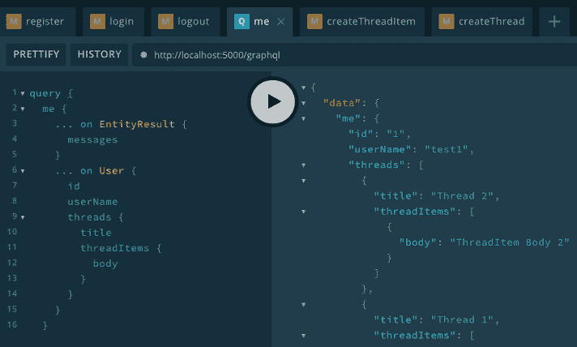
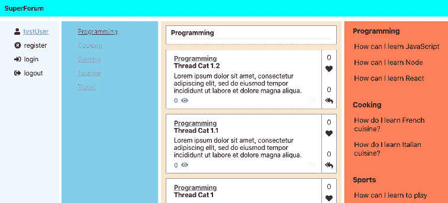
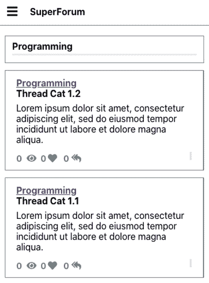
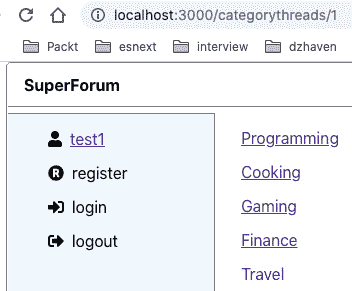
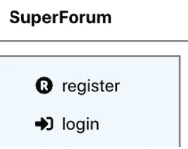
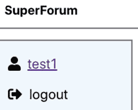
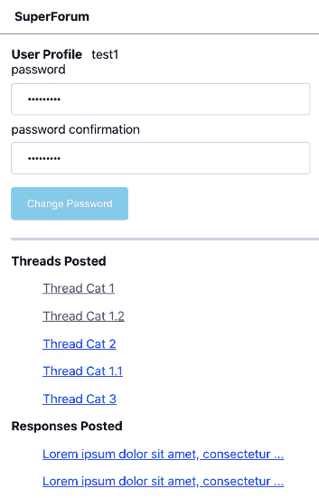

# 十五、集成 GraphQL 模式——第一部分

在本章中，我们将继续通过集成 GraphQL 构建我们的应用。我们将在客户端和服务器上执行此操作。我们还将完成构建后端 Express 服务器并将该后端与 React 客户端集成。

在本章中，我们将介绍以下主要主题：

*   创建 GraphQL 服务器端 TypeDef 和解析器
*   将身份验证与 GraphQL 解析器集成
*   创建 React 客户端挂钩查询 Apollo GraphQL

# 技术要求

您应该对 GraphQL 有基本的了解，并且对 React、Node.js、Postgres 和 Redis 有很好的理解。我们将再次使用 Node 和**Visual Studio 代码**（**VSCode**来编写代码。

GitHub 存储库位于[https://github.com/PacktPublishing/Full-Stack-React-TypeScript-and-Node](https://github.com/PacktPublishing/Full-Stack-React-TypeScript-and-Node) 。使用文件夹`Chap15`中的代码。

【T1，T3】设置【第 15 章】

1.  转到您的`HandsOnTypescript`文件夹，创建一个名为`Chap15`的新文件夹。
2.  现在转到`Chap14`文件夹，将`super-forum-server`文件夹复制到`Chap15`文件夹中。确保已复制所有文件。
3.  在`super-forum-server`文件夹中删除`node_modules`文件夹和`package-lock.json`文件。确保您在`super-forum-server`文件夹中并运行此命令：

    ```js
    npm install 
    ```

4.  现在确保您的 Postgres 服务器和 Redis 服务器正在运行，如[*第 13 章*](13.html#_idTextAnchor208)、*使用 Express 和 Redis*设置会话状态、[*第 14 章*](14.html#_idTextAnchor216)、*使用 TypeORM*设置 Postgres 和存储库层。然后，通过运行以下命令来测试服务器：

    ```js
    npm start 
    ```

5.  现在，让我们复制我们的客户端应用。转到`Chap13`文件夹，将`super-forum-client`复制到`Chap15`的根目录下。确保所有文件都已复制。
6.  删除`node_modules`文件夹和`package-lock.json`文件。现在确保您在`super-forum-client`文件夹中，并运行以下命令：

    ```js
    npm install
    ```

7.  通过运行以下命令来测试它是否工作：

    ```js
    npm start 
    ```

# 创建 GraphQL 服务器端 TypeDef 和解析器

在本节中，我们将向 Express 服务器添加 GraphQL 服务。我们还将开始将路由转换为 GraphQL 查询，这是我们在[*第 14 章*](14.html#_idTextAnchor216)中创建的，*使用 TypeORM*设置*Postgres 和存储库层。我们还将充实我们需要的其余调用，如 GraphQL 查询。*

让我们首先将 GraphQL 集成到我们的 Express 应用中（我们介绍了 GraphQL in[*第 9 章*](09.html#_idTextAnchor139)、*什么是 GraphQL？*、d[*第 10 章*](10.html#_idTextAnchor147)、*设置带有 TypeScript 和 GraphQL 依赖项的 Express 项目*：

笔记

本章将有大量代码，并不是所有代码都可以在文本中显示。请经常参考源代码一章，这是 GitHub 存储库代码。另请注意，源代码一章是最终运行的项目，只包含最终的工作代码。

1.  让我们从安装 GraphQL 开始。运行此命令：

    ```js
    npm i apollo-server-express graphql graphql-middleware graphql-tools
    ```

2.  Next, let's create our initial type definitions, `typeDefs`. Create a folder called `gql` inside of the `src` folder. Then create the file `typeDefs.ts` inside of it. Now add this code:

    ```js
    import { gql } from "apollo-server-express";
    const typeDefs = gql`
      scalar Date
    ```

    我们定义了一个新的自定义`scalar`类型`Date`，在 GraphQL 中，日期和时间默认不可用：

    ```js
      type EntityResult {
        messages: [String!]
      }
    ```

    当返回错误或消息时，将使用此`EntityResult`类型，而不是从我们的解析程序返回实体：

    ```js
      type User {
        id: ID!
        email: String!
        userName: String!
        password: String!
        confirmed: Boolean!
        isDisabled: Boolean!
        threads: [Thread!]
        createdBy: String!
        createdOn: Date!
        lastModifiedBy: String!
        lastModifiedOn: Date!
      }
    ```

    我们在这里创建了我们的`User`类型。注意与`Thread`和`ThreadItem`的关系。我们还使用了我们的`Date`类型：

    ```js
      type Thread {
        id: ID!
        views: Int!
        isDisabled: Boolean!
        title: String!
        body: String!
        user: User!
        threadItems: [ThreadItem!]
        category: ThreadCategory
        createdBy: String!
        createdOn: Date!
        lastModifiedBy: String!
        lastModifiedOn: Date!
    }
    ```

    我们创建了我们的`Thread`类型及其关系：

    ```js
      union ThreadResult = Thread | EntityResult
    ```

    现在我们正在实现真正的应用，是时候使用 GraphQL 的一些更复杂的特性了。`union`类型与 TypeScript 中的概念相同。它将允许我们从可能的 GraphQL 类型列表中返回任何类型。对于示例，在本示例中，该类型可以表示*线程或实体结果，但不能同时表示两者。我将很快展示这种类型的用法，它的工作原理将变得更加清晰。*

    ```js
      type ThreadItem {
        id: ID!
        views: Int!
        isDisabled: Boolean!
        body: String!
        user: User!
        thread: Thread!
        createdBy: String!
        createdOn: Date!
        lastModifiedBy: String!
        lastModifiedOn: Date!
      }
    ```

    我们创造了我们的`ThreadItem`类型。

    ```js
      type ThreadCategory {
        id: ID!
        name: String!
        description: String
        threads: [Thread!]!
        createdBy: String!
        createdOn: Date!
        lastModifiedBy: String!
        lastModifiedOn: Date!
    }
    ```

    `ThreadCategory`类型也指其包含的`Threads`。

    ```js
      type Query {
        getThreadById(id: ID!): ThreadResult
      }
    `;
    ```

    在这里，我们有我们的`Query`和`getThreadById`函数。注意它返回了我们的`union``ThreadResult`。我们稍后会进一步充实这一点。

    ```js
    export default typeDefs;
    ```

3.  Now let's create a simple resolvers file to get started with our GraphQL installation. Create a file called `resolvers.ts` in the `gql` folder and add this code:

    ```js
    import { IResolvers } from "apollo-server-express";
    interface EntityResult {
      messages: Array<string>;
    }
    ```

    我们将使用`EntityResult`作为错误和状态消息的返回类型。另外，将我们的类型映射添加到`typeDefs`文件中的相同类型：

    ```js
    const resolvers: IResolvers = {
      ThreadResult: {
        __resolveType(obj: any, context: GqlContext, info:      any) {
          if (obj.messages) {
            return "EntityResult";
          }
          return "Thread";
        },
    },
    ```

    这里是我们正在使用的 GraphQL 的另一个新特性。`ThreadResult`是表示图形 QL 中`Thread`和`EntityResult`两种类型的`union`。当`ThreadResult`即将返回时，此解析器会注意到，并确定其内部是哪种类型。您使用的方法完全取决于您确定返回的类型，但这里我们通过检查`obj.message`对`EntityResult`类型的`message`字段进行了简单检查：

    ```js
      Query: {
        getThreadById: async (
          obj: any,
          args: { id: string },
          ctx: GqlContext,
          info: any
        ): Promise<Thread | EntityResult> => {
          let thread: QueryOneResult<Thread>;
          try {
            thread = await getThreadById(args.id);
            if (thread.entity) {
              return thread.entity;
            }
            return {
              message: thread.messages ? thread.messages[0] :            "test",
            };
          } catch (ex) {
            throw ex;
          }
        },
      },
    };
    export default resolvers;
    ```

    在【图集】第【图集】第【图集】第【图集】第【图集】第【图集】第【图集】第【图集】第【图集】第【图集第【图集】第【图集第【图集】第【图集第【图集】第【图集第【图集】第【图集第【图集】第【图集第【图集】第【图集】第【图集第【图集】第【图集】第【图集第【图？，所以我不会在这里深入讨论。只需注意在本次调用中，我接受调用`getThreadById`、`QueryOneResult`的结果类型，经过一些处理后，返回实际实体本身或`EntityResult`。同样，由于我们的`typeDefs`文件将我们的查询返回一个`ThreadResult`，它将转到`ThreadResult`查询并确定返回哪种类型。这是我们将在大多数存储库调用中重复的模式。[*第 14 章*](14.html#_idTextAnchor216)*用 TypeORM*设置 Postgres 和 Repository 层涵盖了存储库。

    笔记

    对于这个示例应用，我们只是重新引用可能发生的错误。但在你的生产应用中，你应该根据你的应用来处理错误，一般来说，这意味着至少要记录问题，以便以后可以查看。

    稍后，我们将使用更多查询和突变填充此代码，但现在，让我们重点完成基本设置。

4.  将`GqlContext.ts`文件从`Chap10/gql-server/src`文件夹复制粘贴到`gql`文件夹中。如[*第 9 章*](09.html#_idTextAnchor139)所示，*什么是 GraphQL？*，这就是我们的请求和响应对象在 GraphQL 调用中的位置。
5.  Now let's open our `index.ts` file and add GraphQL into it. Update it by adding this code just before the call to `listen` and make sure to add the necessary imports, which you should be able to do yourself now:

    ```js
    const schema = makeExecutableSchema({ typeDefs, resolvers });
    const apolloServer = new ApolloServer({
        schema,
        context: ({ req, res }: any) => ({ req, res }),
    });
    apolloServer.applyMiddleware({ app });
    ```

    这基本上类似于[*第 9 章*](09.html#_idTextAnchor139)*什么是 GraphQL？*，在这里我们实例化我们的`ApolloServer`并将其带到我们的`typeDefs`、`resolvers`并表达`app`实例。

6.  Let's test this to make sure it's working. Open the URL `http://localhost:5000/graphql`. This is the GraphQL playground we reviewed in [*Chapter 9*](09.html#_idTextAnchor139), *What is GraphQL?*. Run it as shown:

    

    图 15.1–对 GraphQL 的第一次查询

    所以，正如你们所看到的，我们的电话现在起作用了。与我们之前对 GraphQL 的一些调用的唯一区别在于，由于我们的调用可以返回两种不同的类型，因此我们使用`… on <some type>`语法来决定在返回时需要哪个实体和字段（此功能称为内联片段）。同样，请记住，您的本地 ID 号不一定与我的相同，因此您需要发送数据库中肯定存在的 ID。

7.  OK, let's do another. This time, we'll pick one that does not return an entity – the `createThread` function. First, add this mutation to the end of your `typeDefs` file:

    ```js
    type Mutation {
        createThread(
          userId: ID!
          categoryId: ID!
          title: String!
          body: String!
        ): EntityResult
    }
    ```

    请注意，我们没有返回[T0]。我们的`createThread`函数只返回字符串消息。这就是我们所需要的。

8.  Now let's update the `resolvers` file. Add this function as a mutation. Again, you'll need to import anything that is needed yourself:

    ```js
    Mutation: {
        createThread: async (
          obj: any,
          args: { userId: string; categoryId: string; title:        string; body: string },
          ctx: GqlContext,
          info: any
        ): Promise<EntityResult> => {
    ```

    同样，参数列表一如既往，但这次我们只返回`EntityResult`，因为不需要返回整个实体：

    ```js
          let result: QueryOneResult<Thread>;
          try {
            result = await createThread(
              args.userId,
              args.categoryId,
              args.title,
              args.body
            );
    ```

    在这里，我们打电话到存储库的`createThread`并得到了结果。

    ```js
            return {
              messages: result.messages
                ? result.messages
                : ["An error has occurred"],
            };
    ```

    现在我们返回可能的消息列表，以指示结果的状态。

    ```js
          } catch (ex) {
            throw ex;
    ```

    同样，在生产环境中，您不应该简单地重新排序，而应该记录或以其他方式处理错误。我们在这里重述是为了简化和关注手头的概念，而不会偏离正题。

    ```js
          }
        },
      },
    ```

9.  So, now if we run our code, we should see this:

    

    图 15.2–createThread 函数

10.  OK, so let's do one more call for Threads. In the `ThreadRepo` is the call `getThreadsByCategoryId`, which returns an array of Threads. This is a problem because the GraphQL `union` operator does not support arrays. So we'll need to create another new entity in the `typeDefs` file to represent an array of Threads and then we can create our union. Update the `typeDefs` file by adding this under the ThreadResult union:

    ```js
    type ThreadArray {
        threads: [Thread!]
    }
    union ThreadArrayResult = ThreadArray | EntityResult
    ```

    所以我们创建了一个实体，它首先返回一个线程数组。然后，我们创建了返回该实体类型或返回[T1]的[T0]。

    现在在`getThreadById`查询后添加：

    ```js
    getThreadsByCategoryId(categoryId: ID!): ThreadArrayResult!
    ```

11.  Now we can build our resolver. Update the `resolvers` Query section by adding this:

    ```js
    getThreadsByCategoryId: async (
          obj: any,
          args: { categoryId: string },
          ctx: GqlContext,
          info: any
        ): Promise<{ threads: Array<Thread> } | EntityResult>      => {
          let threads: QueryArrayResult<Thread>;
          try {
            threads = await getThreadsByCategoryId(args.         categoryId);
            if (threads.entities) {
              return {
                threads: threads.entities,
              };
            }
    ```

    在这里，我们返回线程数组。

    ```js
            return {
              messages: threads.messages
                ? threads.messages
                : ["An error has occurred"],
            };
    ```

    这里如果没有线程，我们将返回消息。

    ```js
          } catch (ex) {
            throw ex;
          }
        },
    ```

12.  We're missing just one more item. When we first started using `union`, we had to create a query for the `EntityResult` type. So, we need to do the same thing for our new `ThreadArrayResult` type. Enter this code just after the `EntityResult` definition inside the `resolvers` file:

    ```js
    ThreadArrayResult: {
        __resolveType(obj: any, context: GqlContext, info:     any) {
          if (obj.messages) {
            return "EntityResult";
          }
          return "ThreadArray";
        },
      },
    ```

    情况和以前一样。如果`obj`有`messages`属性，则返回类型`EntityResult`；如果没有，则返回类型。

13.  如果我们运行此查询，应该会看到类似的内容（注意，我的结果中填充了重复的测试数据）：


图 15.3–getThreadsByCategoryId 函数

请注意，我们添加了一个名为`__typename`的附加字段。该字段将告诉我们返回的是哪种类型，如图所示为`ThreadArray`。

好的，现在我们有了一个工作的 GraphQL 服务器，可以查询线程。尝试将[*第 14 章*](14.html#_idTextAnchor216)*中与身份验证无关的调用与 TypeORM*一起集成，设置 Postgres 和 Repository 层。如果遇到问题，可以参考源代码。但重要的是，你要尽量做到这一点，不要让自己看起来像是在做什么，因为这样你才能确定你是否理解材料。

## 螺纹点系统

现在我们已经集成了现有的解析器调用，让我们创建一些仍然需要的调用。我们为我们的线程和线程项创建了一个积分系统。现在让我们实现一种递增和递减点的方法。如果已经过了一段时间，请在继续之前查看 ThreadPoint 和 ThreadItemPoint 实体。您会注意到一个名为`points`的新字段，一旦我们开始编写代码，我将对此进行解释：

1.  First, create a file called `ThreadPointRepo.ts` inside of the repo folder and add this code into it (again, I assume you know how to add the necessary imports):

    ```js
    export const updateThreadPoint = async (
      userId: string,
      threadId: string,
      increment: boolean
    ): Promise<string> => {
    ```

    请注意，参数有一个`increment`布尔值。这决定了我们是尝试添加点还是删除点。

    ```js
      // todo: first check user is authenticated
    ```

    创建身份验证调用后，我们将重新访问此注释并用代码填充它。请注意，添加`todo`注释是跟踪剩余待完成项目的好方法。它还通知团队成员这一事实。

    ```js
      let message = "Failed to increment thread point";
      const thread = await Thread.findOne({
        where: { id: threadId },
        relations: ["user"],
      });
      if (thread!.user!.id === userId) {
        message = "Error: users cannot increment their own      thread";
        return message;
    }
    ```

    因此，我们首先得到给定的[T1]的[T0]。注意，我们还检查给定的[T2]与拥有线程的[T3]不同。如果您的数据库中只有一个`User`，则需要添加另一个`User`，以便`Thread`的所有者不是试图增加其点数的同一人。您可以通过【T18】使用【T18】使用【T18】的【T18】注册【T18】和【T18】使用【T18】的【T18】重新注册【T18】用户。

    ```js
      const user = await User.findOne({ where: { id: userId } });
    ```

    在这里，在我们实际需要使用它们之前，我们已经得到了匹配的`User`一点。过一会儿我们就会明白为什么我们要做一些看起来效率低下的事情。

    ```js
      const existingPoint = await ThreadPoint.findOne({
        where: {
          thread: { id: threadId },
          user: { id: userId },
        },
        relations: ["thread"],
    });
    ```

    这里，我们将查看现有的点实体是否已经存在。稍后，我们将使用此对象决定如何添加或删除点：

    ```js
    await getManager().transaction(async (transactionEntityManager) => {
    ```

    如您所见，我们有一些新的类型代码。`getManager().transaction`调用正在创建一个 SQL 事务。事务是作为单个原子操作执行多个 SQL 操作的一种方式。换句话说，要么每一个都会成功完成，要么全部都会失败。因此，在此范围内运行的所有内容都是事务的一部分。

    此外，我们之前注意到，我们已经在使用[T0]实体之前创建了它。这是因为避免在事务内部进行选择查询是最佳实践。这不是一条硬性规定。但一般来说，在事务中进行选择查询会使事情变得更慢。

    ```js
        if (existingPoint) {
          if (increment) {
            if (existingPoint.isDecrement) {
              await ThreadPoint.remove(existingPoint);
              thread!.points = Number(thread!.points) + 1;
              thread!.lastModifiedOn = new Date();
              thread!.save();
            }
          } else {
            if (!existingPoint.isDecrement) {
              await ThreadPoint.remove(existingPoint);
              thread!.points = Number(thread!.points) - 1;
              thread!.lastModifiedOn = new Date();
              thread!.save();
            }
          }
    ```

    在本节中，我们通过检查`existingPoint`来检查`ThreadPoint`是否已经存在（记住`ThreadPoint`可以表示正或负的点，如`isDecrement`字段所示）。一旦确定了，我们就决定是递增还是递减。如果执行`increment`且存在减量`ThreadPoint`，我们将删除该实体，而不执行其他操作。如果我们正在进行减量，并且存在一个`increment``ThreadPoint`，我们将删除该实体，而不执行其他操作。

    现在，需要注意的另一件事是，我们的线程实体现在有一个名为 points 的字段，我们可以根据需要增减它。该字段将作为我们 UI 中的一种快捷方式，允许我们获取当前的`Thread's`总积分，而无需将`Thread`的所有`ThreadPoints`相加：

    ```js
        } else {
          await ThreadPoint.create({
            thread,
            isDecrement: !increment,
            user,
          }).save();
          if (increment) {
            thread!.points = Number(thread!.points) + 1;
          } else {
            thread!.points = Number(thread!.points) - 1;
          }
          thread!.lastModifiedOn = new Date();
          thread!.save();
        }
    ```

    否则，如果我们根本没有存在的点，我们只需创建一个新点，它可以是递增的，也可以是递减的：

    ```js
        message = `Successfully ${
          increment ? "incremented" : "decremented"
        } point.`;
      });
      return message;
    };
    ```

2.  `typeDefs`现在加上`typeDefs`
3.  Then, update the `resolver` by adding the `updateThreadPoint` call to the `Mutation` section. Since this is just a wrapper around the repository call that does the actual work, I won't show the code here. Try and see if you can create the `Mutation` yourself without looking at the code.

    笔记

    我们将使用的大多数解析器只是存储库调用的包装器。这使得解析器代码与数据库和存储库调用分离。因此，大多数情况下，我不会显示解析器代码，因为它在源代码中很小并且可用。

4.  如图所示运行`Mutation`，然后检查您的数据库：


图 15.4–运行 updateThreadPoint

这里，我们有我们在 Postgres 数据库中的突变结果，使用 pgAdmin：


图 15.5–运行 updateThreadPoint 数据库结果

因此，我们的记录已成功创建，如图所示。

现在，让我们进一步讨论一下这个积分系统，以及它是如何工作的。类似于的*积分系统可以同时考虑正积分和负积分，就像我们的系统一样。但是，它还必须防止用户多次投票。为了做到这一点，我们需要将每个点与给出它的用户以及他们放置它的线程或线程项相关联。这就是为什么我们有 ThreadPoint 和 ThreadPointItem 实体。*

在一个有很多用户的流量很大的站点上，在任何给定时间添加或删除点都可能是服务器上的一个重要负载。但更糟糕的是，如果我们必须在每次调用时汇总所有这些 ThreadPoints 或 ThreadItemPoints，以获取 Thread 或 ThreadItem 数据。这是站不住脚的。因此，对于第一个问题，我们必须接受它作为“每个用户一票”计分制的一部分。然而，对于积分问题，我们可以尝试几种不同的方法来提高性能。

最有效的方法是添加一个缓存系统，使用像 Redis 这样的辅助服务。然而，构建缓存系统并不是一件小事，远远超出了本书的范围。我们可以说，虽然我们的网站刚刚起步，但在它取得辉煌的成功和数十亿美元之前，我们不会有这样的流量。因此，作为一个开始，我们可以尝试一些简单一点的方法。

所以我们所做的是将 points 字段添加到我们的 Thread 和 ThreadItem 实体中，并在调用添加或删除点时增加值。这不是最好的解决方案，但现在就可以了。随着时间的推移，缓存系统或其他机制可能会变得更加复杂。

ThreadItemPoint 的代码实际上是相同的。继续，看看你是否可以自己构建`ThreadItemPointRepo.ts`文件。与往常一样，如果遇到问题，请查看源代码中的代码。

在本节中，我们开始将存储库调用与 GraphQL 层集成。我们还充实了 Thread 和 ThreadItem 积分系统。在下一节中，我们将继续通过 integr和身份验证调用构建 GraphQLAPI。

# 将身份验证与 GraphQL 解析器集成

将身份验证集成到 GraphQL 与添加任何其他功能没有太大区别。在这一节中，我们将学习如何做到这一点。

现在让我们集成与身份验证相关的调用。让我们从`register`电话开始：

1.  你会记得我们已经在[*第 14 章*](14.html#_idTextAnchor216)中创建了`register`调用，*使用 typerorm*设置 Postgres 和 Repository 层。现在，让我们添加我们的`typeDefs`和`resolvers`。首先，将源代码中的`register`调用添加到`Mutation`部分的`typeDefs`文件中：
2.  Now, in our resolvers file, in the `Mutation` section, add the code from our GitHub source code.

    这同样只是我们的存储库调用的包装，因此没有太多的解释，但请注意，我们没有返回[T0]对象；我们只返回状态消息。这是因为我们希望减少任何不必要信息泄露的机会。在我们尝试运行它之前，让我们让 GraphQL 游乐场能够接受[T1]cookies，以便我们可以[T2]测试它。我们需要启用 cookies，以便保存会话状态，这使我们的呼叫能够检查用户是否已登录。

    在操场的右上角，单击齿轮图标。如图所示，将`request.credentials`字段设置为`include`，然后保存并刷新屏幕。如果现在运行它，我们应该看到：

    

    图 15.6–寄存器

3.  让我们继续使用`login`函数。将登录源代码添加到`typeDefs`文件的`Mutation`部分。
4.  现在从源代码中添加`login`的解析器代码。我们的存储库`login`调用正在检查用户是否存在，并确保密码匹配。然后，如果成功登录，GraphQL 调用将获取[T2]并将其设置为会话对象[T3]。还要注意，我们的解析器在成功时不会返回[T4]对象。稍后我们将创建一个新函数来提供`User`信息。
5.  现在让我们做`logout`函数。首先，在`Mutation`部分中添加`typeDefs`条目，如源代码所示。
6.  现在用源代码中的`logout`解析器代码更新解析器`Mutation`。请注意，无论从存储库`logout`调用返回什么响应，我们`destroy`使用`ctx.req.session?.destroy`将`session`设置为`ctx.req.session?.userId`到`undefined`。
7.  Now we need to add one more new call and a new type to our `typeDefs`. Add the function `me` to the `Query` section of the `typeDefs` file, as shown by the source code. Next, underneath the `User` type, add this `union`:

    ```js
    union UserResult = User | EntityResult
    ```

    我们为什么需要这些？在对`register`和`login`的调用中，我们删除了返回的`User`对象，因为`User`细节在这些调用之后可能会被使用，也可能不会被使用，我们不想不必要地公开`User`数据。然而，有时当`User`登录后，我们可能想要查看他们的相关数据。例如，当他们访问 UserProfile 屏幕时。所以，我们将使用这个`me`函数来处理这个问题。

8.  Now let's add our `UserRepo` call for the `me` function. Add this function to `UserRepo`:

    ```js
    export const me = async (id: string): Promise<UserResult> => {
      const user = await User.findOne({
        where: { id },
        relations: ["threads", "threads.threadItems"],
    });
    ```

    首先，注意我们找到的`user`对象包括属于用户的任何`Threads`和`ThreadItems`。我们将在 UserProfile 屏幕中使用这些选项：

    ```js
      if (!user) {
        return {
          messages: ["User not found."],
        };
      }
      if (!user.confirmed) {
        return {
          messages: ["User has not confirmed their       registration email yet."],
        };
      }
      return {
        user: user,
      };
    };
    ```

    该函数的其余部分与登录函数非常相似。

9.  现在让我们为`UserResult`和`me`函数创建`resolvers`。在解析器`const`的顶部，添加UserResult 解析器，如代码所示。这与其他结果`union`解析器相同–这里没有什么新的解释。
10.  In the `Query` section, add the code for the `me` function from the source code.

    请注意，此解析器不接受任何参数，因为它从会话中获取[T0]。在第 193 行，它检查`userId`是否在会话中。如果不是，它会提前退出。如果`userId`在会话中，则使用我们的`UserRepo``me`功能获取当前登录的`user`。其余的函数基本上与返回实体的其他函数相同。

11.  让我们试着运行`me`解析器。确保您已登录一次，并已按照*第 3 步*中的说明进行 GraphQL 游乐场的操作。如图所示运行`me`时，应返回相关数据：



图 15.7–调用 me 解析器

正如您所看到的，我们再次使用内联片段，并且能够获取相关线程和线程项。

在本节中，我们将存储库层身份验证调用绑定到 GraphQL，并测试其功能。在下一节中，我们将通过将几乎完整的后端连接到前端来完成应用。

# 创建 React 客户端挂钩查询 Apollo GraphQL

在部分中，我们将通过将 React 客户端连接到 GraphQL 后端来完成我们的应用。我们已经走了很长一段路，我们就快到了。

为了将应用的两个部分连接在一起，我们需要将 COR 添加到 Express 服务器。**CORS**代表**跨源资源共享**。这意味着我们的服务器将被设置为允许客户端域与其自己的域不同。

在大多数即使是中等复杂度的服务器配置中，承载客户端应用的服务器和提供 API 的服务器并不存在于同一域中。通常，您将拥有某种代理，例如 NGINX，它将接受来自浏览器的调用。该代理将根据需要“重定向”调用。我们将在[*第 17 章*](17.html#_idTextAnchor259)*将应用部署到 AWS*中更详细地解释反向代理如何工作。

笔记

代理是一项服务或某些服务的代理。当使用代理时，如果客户机调用服务，他们将首先访问代理，而不是直接访问服务。然后，代理确定客户端的请求应该路由到哪里。因此，代理为公司提供了更好的服务访问控制。

启用CORS 也是必要的，因为 React 应用在其自己的测试 web 服务器上运行。在我们的例子中，它在端口`3000`上运行，而服务器在端口`5000`上运行。尽管它们都使用 localhost，但拥有不同的端口实际上意味着不同的域。要更新 CORS，请执行以下操作：

1.  首先，我们需要更新我们的`.env`文件，以获得客户机开发服务器的路径：

    ```js
    CLIENT_URL=http://localhost:3000
    ```

2.  Open `index.ts` and add this code immediately after `const app = express();`:

    ```js
    app.use(
        cors({
          credentials: true,
          origin: process.env.CLIENT_URL,
        })
    );
    ```

    `credentials`设置启用报头访问控制允许凭证。这允许客户端 JavaScript 在成功提供凭据后从服务器接收响应。

3.  Also update the Apollo Server so that its own `cors` is disabled. Update this line just before `listen`:

    ```js
    apolloServer.applyMiddleware({ app, cors: false });
    ```

    阿波罗服务器有自己的`cors`，默认情况下是启用的，所以我们想禁用它。

现在我们已经在服务器上安装了CORS。现在，让我们在自己的 VSCode 窗口中打开 React 项目，并安装 GraphQL 以开始与 GraphQL 服务器集成：

1.  在自己的 VSCode 窗口中打开`super-forum-client`文件夹后，请先尝试运行它，以确保它正常工作。如果您还没有这样做，请删除`node_modules`文件夹和`package-lock.json`文件并运行`npm install`一次。
2.  现在让我们安装 Apollo GraphQL 客户端。打开你的终端到`super-forum-client`的根目录，并运行以下命令：

    ```js
    npm install @apollo/client graphql 
    ```

3.  Now we need to configure our client. Open `index.ts` and add this code above `ReactDOM.render`:

    ```js
    const client = new ApolloClient({
      uri: 'http://localhost:5000/graphql',
      credentials: "include",
      cache: new InMemoryCache()
    });
    ```

    像一样，添加您的导入内容——这是不言自明的。我们设置服务器的 URL，包括所需的任何凭证，并设置`cache`对象。注意，这意味着 Apollo 将缓存所有查询结果。

4.  下一次更新`ReactDOM.render`并包含`ApolloProvider`：

    ```js
    ReactDOM.render(
      <Provider store={configureStore()}>
        <BrowserRouter>
        <ApolloProvider client={client}>
          <ErrorBoundary>{[<App key="App" />]}</       ErrorBoundary>
          </ApolloProvider>
        </BrowserRouter>
      </Provider>,
      document.getElementById("root")
    );
    ```

5.  Now let's test that its working by getting ThreadCategories. Open the `src/components/areas/LeftMenu.tsx` file and update it like this:

    ```js
    import React, { useEffect, useState } from "react";
    import { useWindowDimensions } from "../../hooks/useWindowDimensions";
    import "./LeftMenu.css";
    import { gql, useQuery } from "@apollo/client";
    ```

    我们从 Apollo 客户端导入了一些项目。`gql`允许我们获得 GraphQL 查询的语法突出显示和格式设置。`UseQuery`是我们第一个与 GraphQL 相关的客户端挂钩。它允许我们执行 GraphQL 查询，而不是执行变异，但它会立即运行。稍后，我将展示一个允许延迟加载的挂钩：

    ```js
    const GetAllCategories = gql`
      query getAllCategories {
        getAllCategories {
          id
          name
        }
      }
    `;
    ```

    这里是我们的查询。这里没有太多的解释，但请注意我们同时得到了[T0]和[T1]。

    ```js
    const LeftMenu = () => {
    const { loading, error, data } = useQuery(GetAllCategories);
    ```

    我们的`useQuery`调用返回属性`loading`、`error`和`data`。每个 Apollo GraphQL 挂钩返回一组不同的相关属性。我们将在下面的代码中看到如何使用这些特定属性：

    ```js
      const { width } = useWindowDimensions();
      const [categories, setCategories] = useState<JSX.   Element>(
        <div>Left Menu</div>
      );
      useEffect(() => {
        if (loading) {
          setCategories(<span>Loading ...</span>);
    ```

    在刚才显示的代码中，我们首先使用`loading`属性和提供占位符文本来检查数据是否仍在加载。

    ```js
        } else if (error) {
          setCategories(<span>Error occurred loading        categories ...</span>);
    ```

    在此错误部分中，我们指出查询运行期间发生的错误。

    ```js
        } else {
          if (data && data.getAllCategories) {
            const cats = data.getAllCategories.map((cat: any)         => {
              return <li key={cat.id}>
            <Link to={`/categorythreads/${cat.id}`}>{cat.         name}</Link>
         </li>;
            });
            setCategories(<ul className="category">{cats}        </ul>);
          }
    ```

    最后，如果一切顺利，我们得到了数据，那么我们将显示一个无序的元素列表，这些元素表示每个 ThreadCategory。请注意，每个`li`元素都有一个唯一的密钥标识符。在提供类似元素的数组时，关键点始终很重要，因为它可以减少不必要的渲染。此外，每个元素都是一个链接，向用户显示与特定`ThreadCategory`相关的所有线程：

    ```js
        }
        // eslint-disable-next-line react-hooks/exhaustive-     //deps
      }, [data]);
      if (width <= 768) {
        return null;
      }
      return <div className="leftmenu">{categories}</div>;
    };
    export default LeftMenu;
    ```

6.  运行应用应在桌面模式下显示此屏幕。请注意，我单击了一个具有关联线程数据的 ThreadCategory 链接。当然，我们目前仍在使用返回硬编码数据：


图 15.8–LeftMenu 线程类别列表

真棒–我们现在已连接到 GraphQL 服务器！

## 主画面

祝贺你，你已经走了很长的路。现在我们需要更新主要组件，以便从 GraphQL 服务返回真实数据。让我们现在就创建它：

1.  转到我们的`super-forum-server`项目，打开`typeDefs`文件，在源代码的`getThreadsByCategoryId`查询下方添加函数`getThreadsLatest`的模式条目。在这里，我们正在创建一个新的解析器，`getThreadsLatest`，当没有给出特定的线程类别时，它将为我们提供最新的线程。当给出 ThreadCategory 时，我们已经有了`getThreadsByCategoryId`解析器。
2.  Open `ThreadRepo` and add this function:

    ```js
    export const getThreadsLatest = async (): Promise<QueryArrayResult<Thread>> => {
      const threads = await Thread.createQueryBuilder("thread")
        .leftJoinAndSelect("thread.category", "category")
        .leftJoinAndSelect("thread.threadItems",      "threadItems")
        .orderBy("thread.createdOn", "DESC")
        .take(10)
        .getMany();
    ```

    我们有一个包含 ThreadCategories 和 ThreadItems 的查询–`leftJoinAndSelect`，由`createdOn`字段`orderBy`排序，最多只需要 10 个项目（`take`）：

    ```js
      if (!threads || threads.length === 0) {
        return {
          messages: ["No threads found."],
        };
      }
      return {
        entities: threads,
      };
    };
    ```

    其余部分是不言自明的，因为它类似于`getThreadsByCategoryId`。

    让我们也更新我们的`getThreadsByCategoryId`函数，以包括 ThreadItems：

    ```js
    export const getThreadsByCategoryId = async (
      categoryId: string
    ): Promise<QueryArrayResult<Thread>> => {
      const threads = await Thread.   createQueryBuilder("thread")
        .where(`thread."categoryId" = :categoryId`, {       categoryId })
        .leftJoinAndSelect("thread.category", "category")
        .leftJoinAndSelect("thread.threadItems",       "threadItems")
        .orderBy("thread.createdOn", "DESC")
        .getMany();
      if (!threads || threads.length === 0) {
        return {
          messages: ["Threads of category not found."],
        };
      }
      return {
        entities: threads,
      };
    };
    ```

    与以前一样，只是增加了`leftJoinAndSelect`功能。

3.  打开`resolvers`文件，在查询部分末尾添加源代码中的`getThreadsLatest`函数。这是一个与[T2]解析器几乎相同的包装器，只是它调用了[T3]。
4.  Now we need to update our `Main` React component so that it uses our GraphQL resolvers instead of the fake data from our `dataService`. Open `Main` and update the file like this.

    `const``GetThreadsByCategoryId`是我们的第一个查询。如您所见，它使用内联片段并返回线程数据字段：

    ```js
    const GetThreadsByCategoryId = gql`
      query getThreadsByCategoryId($categoryId: ID!) {
        getThreadsByCategoryId(categoryId: $categoryId) {
          ... on EntityResult {
            messages
          }
          ... on ThreadArray {
            threads {
              id
              title
              body
              views
              threadItems {
                id
              }
              category {
                id
                name
              }
            }
          }
        }
      }
    `;
    ```

    `GetThreadsLatest`与`GetThreadsByCategoryId`基本相同：

    ```js
    const GetThreadsLatest = gql`
      query getThreadsLatest {
        getThreadsLatest {
          ... on EntityResult {
            messages
          }
          ... on ThreadArray {
            threads {
              id
              title
              body
              views
              threadItems {
                id
              }
              category {
                id
                name
              }
            }
          }
        }
      }
    `;
    ```

    现在我们开始使用`useLazyQuery`挂钩定义`Main`组件：

    ```js
    const Main = () => {
      const [
        execGetThreadsByCat,
        {
          //error: threadsByCatErr,
          //called: threadsByCatCalled,
          data: threadsByCatData,
        },
      ] = useLazyQuery(GetThreadsByCategoryId);
      const [
        execGetThreadsLatest,
        {
          //error: threadsLatestErr,
          //called: threadsLatestCalled,
          data: threadsLatestData,
        },
    ] = useLazyQuery(GetThreadsLatest);
    ```

    显示的两个挂钩现在正在使用我们的查询。请注意，这些是惰性 GraphQL 查询。这意味着它们不会立即运行，不像`useQuery`，只有在发出`execGetThreadsByCat`或`execGetThreadsLatest`调用时才会运行。`data`属性包含我们查询返回的数据。此外，我已经注释掉了两个返回的属性，因为我们没有使用它们。但是，如果您的呼叫出现错误，可以使用它们。`Error`包含故障信息，`called`表示挂钩是否已经被调用。

    ```js
      const { categoryId } = useParams();
      const [category, setCategory] = useState<Category |   undefined>();
      const [threadCards, setThreadCards] =   useState<Array<JSX.Element> | null>(
        null
      );
    ```

    以前的状态对象保持不变。

    ```js
      useEffect(() => {
        if (categoryId && categoryId > 0) {
          execGetThreadsByCat({
            variables: {
              categoryId,
            },
          });
        } else {
          execGetThreadsLatest();
        }
        // eslint-disable-next-line react-hooks/exhaustive-    // deps
      }, [categoryId]);
    ```

    此`useEffect`已更新为现在仅根据需要执行`execGetThreadsByCat`或`execGetThreadsLatest`。如果给出了`categoryId`参数，`execGetThreadsByCat`应该运行；如果没有，则其他应运行：

    ```js
      useEffect(() => {
        if (
          threadsByCatData &&
          threadsByCatData.getThreadsByCategoryId &&
          threadsByCatData.getThreadsByCategoryId.threads
        ) {
          const threads = threadsByCatData.      getThreadsByCategoryId.threads;
          const cards = threads.map((th: any) => {
            return <ThreadCard key={`thread-${th.id}`}         thread={th} />;
          });
          setCategory(threads[0].category);
          setThreadCards(cards);
        }
    }, [threadsByCatData]);
    ```

    在`useEffect`中，`threadsByCatData`更改导致我们使用`getThreadsByCategoryId`查询中的数据更新`category`和`threadCards`。

    ```js
      useEffect(() => {
        if (
          threadsLatestData &&
          threadsLatestData.getThreadsLatest &&
          threadsLatestData.getThreadsLatest.threads
        ) {
          const threads = threadsLatestData.getThreadsLatest.      threads;
          const cards = threads.map((th: any) => {
            return <ThreadCard key={`thread-${th.id}`}         thread={th} />;
          });
          setCategory(new Category("0", "Latest"));
          setThreadCards(cards);
        }
      }, [threadsLatestData]);
    ```

    在`useEffect`中，`threadsLatestData`更改导致我们使用`getThreadsLatest`查询中的数据更新`category`和`threadCards`。请注意，当没有给出[T5]时，我们只使用一个通用的“最新”名称作为 ThreadCategory。

    ```js
      return (
        <main className="content">
          <MainHeader category={category} />
          <div>{threadCards}</div>
        </main>
      );
    };
    export default Main;
    ```

    代码的其余部分与以前一样。

5.  现在，如果我们为`categoryId`运行这个，我们应该看到：



图 15.9–带类别 ID

如果我们在没有[T0]的情况下运行此程序，我们应该看到：


图 15.10–无类别 ID

好的–现在我们在我们的网站屏幕上有一些实际的数据填充。在继续之前，让我们稍微整理一下样式，去掉一些占位符背景色。我对`Nav.css`和`Home.css`文件做了一些小改动。这就是它现在的样子：


图 15.11-主屏幕样式更新

好的，这样更好。在手机版的屏幕上有一件事需要注意——我们无法让用户切换到其他类别，如此屏幕截图所示：



图 15.12-主屏幕移动视图

因此，让我们添加一个下拉列表，允许用户切换类别。此下拉列表应仅在移动模式下显示。在继续之前，请尝试自己构建此控件。提示：使用 React 下拉菜单构建下拉菜单，并用下拉控件替换类别标签。例如，在*图 15.12*中，我们看到所选类别为**编程**，如`MainHeader`控件所示。然后用下拉列表替换标签，但只能在移动模式下。请注意，我们已经在 ThreadCategory 路由中使用了一个下拉列表，因此我们应该从中创建一个组件，以便可以重用它。

如果您已经尝试过，现在让我们一起构建它，以便您可以进行比较。我撒了一点谎。这是一个相当复杂的变化，因为它需要两个主要方面。首先，我们想为 ThreadCategories 添加一个新的 Reducer，因为我们知道 ThreadCategories 列表至少在两个单独的组件中使用。我们还需要对 ThreadCategory 组件中的下拉列表进行组件化，以便它可以在多个地方使用。这第二部分相当复杂，因为新的下拉组件必须足够复杂，以便从外部接收道具，并在其更改时发送所选类别：

1.  首先，让我们创建新的减速器。在名为`categories`的`store`文件夹中创建一个新文件夹。在该文件夹中，创建一个名为`Reducer.ts`的文件，并将源代码添加到其中。这个文件与我们的`User`减速机非常相似，只是它返回一个`Category`对象数组作为有效负载。
2.  Next, we need to add our new Reducer to our `AppState's` `rootReducer` like this:

    ```js
    export const rootReducer = combineReducers({
      user: UserProfileReducer,
      categories: ThreadCategoriesReducer,
    });
    ```

    我们的新成员`rootReducer`将被称为`Categories`。

3.  Now update the `App.tsx` component so that upon application load, we immediately get our ThreadCategories and add them to the Redux store.

    在这里，我们添加了`GetAllCategories`GraphQL 查询：

    ```js
    const GetAllCategories = gql`
      query getAllCategories {
        getAllCategories {
          id
          name
        }
      }
    `;
    function App() {
      const { data } = useQuery(GetAllCategories);
      const dispatch = useDispatch();
      useEffect(() => {
        dispatch({
          type: UserProfileSetType,
          payload: {
            id: 1,
            userName: "testUser",
          },
        });
        if (data && data.getAllCategories) {
          dispatch({
            type: ThreadCategoriesType,
            payload: data.getAllCategories,
          });
    ```

    [T0]这段代码的大部分我们以前见过，但这就是我们将 ThreadCategories 的有效负载发送到 Redux 存储的地方：

    ```js
        }
      }, [dispatch, data]);
      const renderHome = (props: any) => <Home {...props} />;
      const renderThread = (props: any) => <Thread {...props}    />;
      const renderUserProfile = (props: any) => <UserProfile    {...props} />;
      return (
        <Switch>
          <Route exact={true} path="/" render={renderHome} />
          <Route path="/categorythreads/:categoryId"       render={renderHome} />
          <Route path="/thread/:id" render={renderThread} />
          <Route path="/userprofile/:id"       render={renderUserProfile} />
        </Switch>
      );
    }
    ```

    其他一切都是一样的。注意：您将需要更新您的导入。

4.  The `LeftMenu` and `ThreadCategory` components will need to have their code for getting ThreadCategories and creating the dropdown removed. But first, let's create our shared control that will do all this. Create a file inside of `src/components` called `CategoryDropDown.tsx` and add this code. Make sure you add any necessary imports:

    ```js
    const defaultLabel = "Select a category";
    const defaultOption = {
      value: "0",
      label: defaultLabel
    };
    ```

    通过`defaultOption`，我们为下拉列表创建了一个初始值。

    ```js
    class CategoryDropDownProps {
      sendOutSelectedCategory?: (cat: Category) => void;
      navigate?: boolean = false;
      preselectedCategory?: Category;
    }
    ```

    `CategoryDropDownProps`将是我们`CategoryDropDown`组件的参数类型。`sendOutSelectedCategory`是父调用方传递的函数，用于接收父调用方选择的下拉选项。`Navigate`是一个布尔值，用于确定屏幕在选择新的下拉选项后是否会移动到新的 URL。并且`preselectedCategory`允许父级强制下拉列表在加载时选择指定的 ThreadCategory：

    ```js
    const CategoryDropDown: FC<CategoryDropDownProps> = ({
      sendOutSelectedCategory,
      navigate,
      preselectedCategory,
    }) => {
      const categories = useSelector((state: AppState) =>   state.categories);
      const [categoryOptions, setCategoryOptions] = useState<
        Array<string | Option>
      >([defaultOption]);
      const [selectedOption, setSelectedOption] =   useState<Option>(defaultOption);
      const history = useHistory();
    ```

    根据我们之前的学习，这些列出的挂钩的用法是非常明显的。但是请注意，我们正在使用[T0]从 Redux 商店获取 ThreadCategories 列表。

    ```js
      useEffect(() => {
        if (categories) {
          const catOptions: Array<Option> = categories.      map((cat: Category) => {
            return {
              value: cat.id,
              label: cat.name,
            };
          });
    ```

    在这里，我们构建了一系列选项，以供稍后输入下拉列表。

    ```js
          setCategoryOptions(catOptions);
    ```

    在这里，在`setCategoryOptions`中，我们收到了 ThreadCategory 选项元素的列表，并对它们进行了设置，以便稍后下拉列表可以使用它们。

    ```js
          setSelectedOption({
            value: preselectedCategory ? preselectedCategory.        id : "0",
            label: preselectedCategory ? preselectedCategory.        name : defaultLabel,
          });
    ```

    在这里，我们设置了默认的下拉选择。

    ```js
        }
      }, [categories, preselectedCategory]);
      const onChangeDropDown = (selected: Option) => {
        setSelectedOption(selected);
        if (sendOutSelectedCategory) {
          sendOutSelectedCategory(
            new Category(selected.value, selected.label?.valueOf().toString() ?? "")
          );
        }
    ```

    在此下拉更改处理程序中，我们将通知父项选择更改。

    ```js
        if (navigate) {
          history.push(`/categorythreads/${selected.value}`);
        }
    ```

    如果家长要求，我们将导航到下一条 ThreadCategory 路线。

    ```js
      };
      return (
        <DropDown
          className="thread-category-dropdown"
          options={categoryOptions}
          onChange={onChangeDropDown}
          value={selectedOption}
          placeholder=defaultLabel
        />
      );
    };
    export default CategoryDropDown;
    ```

    最后，这里是我们实际的 JSX，这是非常不言自明的。

5.  Now we need to update the `MainHeader.tsx` file like this:

    ```js
    interface MainHeaderProps {
      category?: Category;
    }
    const MainHeader: FC<MainHeaderProps> = ({ category }) => {
      const { width } = useWindowDimensions();
    ```

    唯一重要的变化是这个`getLabelElement`功能，它决定屏幕是否移动，如果是，则呈现`CategoryDropDown`：

    ```js
      const getLabelElement = () => {
        if (width <= 768) {
          return (
            <CategoryDropDown navigate={true}         preselectedCategory={category} />
          );
        } else {
          return <strong>{category?.name || "Placeholder"}      </strong>;
        }
      };
      return (
        <div className="main-header">
          <div
            className="title-bar"
            style={{ marginBottom: ".25em", paddingBottom:         "0" }}
          >
            {getLabelElement()}
    ```

    这里，我们使用`getLabelElement`函数。

    ```js
          </div>
        </div>
      );
    };
    ```

代码的其余部分主要是删除代码，所以请自己尝试。当然，如果需要，您可以查看源代码。受影响的文件有`ThreadCategory.tsx`、`LeftMenu.tsx`和`Thread.css`。

## 认证相关特征

现在让我们继续更新我们的身份验证相关功能。请记住，您的所有`User`账户必须在登录之前将其`confirmed`字段设置为 true*：*

1.  The first thing we want to do is have the user be able to log in. In order to do this and then be able to update our `User` object in the global Redux store, we're going to refactor our Redux User Reducer.

    首先，在`models`文件夹中，创建一个名为`User.ts`的新文件，并向其中添加源代码。请注意，我们的`User`类有一个名为 threads 的字段。这将不仅包含属于用户的线程，还包含这些线程的线程项。

2.  现在让我们更新减速机。打开`store/user/Reducer.ts`并通过删除`UserProfilePayload`接口并用我们刚刚创建的新`User`类替换其引用来更新它。如果需要，请查看源代码。
3.  Now we can update our `Login` component like this. Update the imports as needed.

    【我们有进口通知】。稍后我们将定义这个挂钩，但首先我想介绍一下[T1]GraphQL 挂钩的一些特性：

    ```js
    const LoginMutation = gql`
      mutation Login($userName: String!, $password: String!)  {
        login(userName: $userName, password: $password)
      }
    `;
    ```

    这里是我们的登录`Mutation`：

    ```js
    const Login: FC<ModalProps> = ({ isOpen, onClickToggle }) => {
      const [execLogin] = useMutation(LoginMutation, {
        refetchQueries: [
          {
            query: Me,
          },
        ],
      });
    ```

    让我解释一下这个电话。该调用将变异查询`LoginMutation`和一个名为`refetchQueries`的东西作为参数。`refetchQueries`强制其中列出的任何查询重新运行，然后缓存它们的值。如果我们不使用`refetchQueries`并再次运行`Me`查询，我们将得到最后一个缓存版本，而不是最新的数据。请注意，它不会自动刷新依赖于其查询的任何调用；我们仍然需要打这些电话来获取新数据。

    输出`execLogin`是一个可在以后根据需要执行的功能。

    ```js
    const [
        { userName, password, resultMsg, isSubmitDisabled },
        dispatch,
      ] = useReducer(userReducer, {
        userName: "test1",
        password: "Test123!@#",
        resultMsg: "",
        isSubmitDisabled: false,
      });
      const { execMe, updateMe } = useRefreshReduxMe();
      const onChangeUserName = (e: React.   ChangeEvent<HTMLInputElement>) => {
        dispatch({ type: "userName", payload: e.target.value     });
        if (!e.target.value)
          allowSubmit(dispatch, "Username cannot be empty",       true);
        else allowSubmit(dispatch, "", false);
      };
      const onChangePassword = (e: React.  ChangeEvent<HTMLInputElement>) => {
        dispatch({ type: "password", payload: e.target.value     });
        if (!e.target.value)
          allowSubmit(dispatch, "Password cannot be empty",       true);
        else allowSubmit(dispatch, "", false);
      };
    ```

    之前的电话与之前的电话相同。

    ```js
    const onClickLogin = async (
        e: React.MouseEvent<HTMLButtonElement, MouseEvent>
      ) => {
        e.preventDefault();
        onClickToggle(e);
        const result = await execLogin({
          variables: {
            userName,
            password,
          },
        });
        execMe();
        updateMe();
      };
    ```

    `onClickLogin`处理程序现在正在使用适当的参数调用我们的`execLogin`函数。`execLogin`完成后，会自动调用我们的`refetchQueries`查询列表。之后，我们从挂钩、[T4]、[T5]和[T6]调用函数。`execMe`函数将获取最新的`User`对象，`updateMe`将其添加到 Redux 存储中。代码的其余部分是相同的，所以我不会在这里显示它。

4.  Now let's define our Hook `useRefreshReduxMe`. We want to create this Hook so that our code to set or unset our Redux `User` object can be in this single file. We will be using this Hook from several components. Create a file called `useRefreshReduxMe.ts` in the hooks folder and add the source code.

    从顶部可以看到`Me``const`是我们获取用户信息的查询。`EntityResult`内联片段用于获取返回的消息字符串。如果我们得到实际的用户数据，那么所需的字段由[T3]内联片段定义。

    接下来，`UseRefreshReduxMeResult`接口是我们挂钩的返回类型。

    在第 37 行中，我们定义了`useLazyQuery`以允许我们的挂钩用户能够在自己选择的时间执行对`Me`查询的调用。

    接下来，我们定义了一个函数`deleteMe`，允许挂钩的用户随时销毁 Redux`User`对象。例如，当用户注销时。

    最后，我们有`updateMe`函数来允许设置 Redux`User`对象。然后我们返回所有这些函数，以便挂钩调用方可以使用它们。

5.  Upon app load, we should immediately check if our `User` is logged in and who that is. So, open `App.tsx` and update it like this:

    ```js
    function App() {
      const { data: categoriesData } =   useQuery(GetAllCategories);
      const { execMe, updateMe } = useRefreshReduxMe();
    ```

    这里，我们已经初始化了我们的`useRefreshReduxMe`挂钩。

    ```js
      const dispatch = useDispatch();
      useEffect(() => {
        execMe();
      }, [execMe]);
    ```

    这里，我们调用`execMe`从 GraphQL 获取`User`数据。

    ```js
      useEffect(() => {
        updateMe();
      }, [updateMe]);
    ```

    在这里，我们调用`updateMe`，用`User`数据更新我们的 Redux 用户缩减器（若有）。

    ```js
      useEffect(() => {
        if (categoriesData && categoriesData.    getAllCategories) {
          dispatch({
            type: ThreadCategoriesType,
            payload: categoriesData.getAllCategories,
          });
        }
      }, [dispatch, categoriesData]);
    ```

    我将原来的数据字段名改为`categoriesData`，这样可以更清楚地了解它的用途。代码的其余部分保持不变。

6.  如果您现在登录，您会看到我们的`SideBar``userName`更新到登录用户：



图 15.13–登录用户

所以，现在我们可以登录，然后显示`userName`。

太棒了，但是现在让我们修复我们的`SideBar`以便只有适当的链接在正确的时间显示。以为例，如果用户已登录，我们不应该看到**登录**或**注册**链接：

1.  To make sure that the right menus show when the user logs in or out, let's first update our `Logout` component. Make sure imports are up to date:

    ```js
    const LogoutMutation = gql`
      mutation logout($userName: String!) {
        logout(userName: $userName)
      }
    `;
    ```

    这是我们的`logout`突变。

    ```js
    const Logout: FC<ModalProps> = ({ isOpen, onClickToggle }) => {
      const user = useSelector((state: AppState) => state.  user);
      const [execLogout] = useMutation(LogoutMutation, {
        refetchQueries: [
          {
            query: Me,
          },
        ],
      });
    ```

    在这里，我们再次为`Me`查询强制刷新 GraphQL 缓存。

    ```js
      const { execMe, deleteMe } = useRefreshReduxMe();
      const onClickLogin = async (
        e: React.MouseEvent<HTMLButtonElement, MouseEvent>
      ) => {
        e.preventDefault();
        onClickToggle(e);
        await execLogout({
          variables: {
            userName: user?.userName ?? "",
          },
        });    
        deleteMe();
      };
    ```

    我们再次使用了`useRefreshReduxMe`挂钩，但这里我们只调用`deleteMe`函数，因为我们刚刚注销。代码的其余部分保持不变，因此我不会在这里显示它。

2.  Now we're going to update the `SideBarMenus` component so that only the appropriate menus show at the right time. Open that file and update it as follows.

    在本例中，我将只显示返回的 JSX，因为这是唯一更改的内容（导入除外）：

    ```js
    return (
        <React.Fragment>
          <ul>
            {user ? (
              <li>
                <FontAwesomeIcon icon={faUser} />
                <span className="menu-name">
                  <Link to={`/userprofile/${user?.               id}`}>{user?.userName}</Link>
                </span>
              </li>
            ) : null}
    ```

    正如您所看到的，我们正在测试`user`对象是否有值，然后显示相同的`userName`UI，否则我们什么也不显示。

    ```js
            {user ? null : (
              <li>
                <FontAwesomeIcon icon={faRegistered} />
                <span onClick={onClickToggleRegister}              className="menu-name">
                  register
                </span>
                <Registration
                  isOpen={showRegister}
                  onClickToggle={onClickToggleRegister}
                />
              </li>
            )}
    ```

    在这个案例中，如果用户确实存在，我们不想显示我们的注册 UI，所以这就是我们正在做的。

    ```js
            {user ? null : (
              <li>
                <FontAwesomeIcon icon={faSignInAlt} />
                <span onClick={onClickToggleLogin}             className="menu-name">
                  login
                </span>
                <Login isOpen={showLogin}              onClickToggle={onClickToggleLogin} />
              </li>
            )}
    ```

    同样，如果`user`对象已经存在，我们不会显示登录，因为这表明用户已经登录。

    ```js
            {user ? (
              <li>
                <FontAwesomeIcon icon={faSignOutAlt} />
                <span onClick={onClickToggleLogout}              className="menu-name">
                  logout
                </span>
                <Logout isOpen={showLogout}              onClickToggle={onClickToggleLogout} />
              </li>
            ) : null}
    ```

    这里，如果`user`对象有值，我们将显示注销 UI。

    ```js
          </ul>
        </React.Fragment>
      );
    ```

3.  如果您现在运行此代码，在尚未登录时，您将看到：



图 15.14–未登录侧边栏菜单

现在，当登录时，我们应该看到：



图 15.15–登录侧栏菜单

所以我们的侧边栏现在显示正确的链接和文本。现在让我们在 UserProfile 屏幕上工作。

## 用户配置文件屏幕

现在，由于我们在验证部分，让我们完成 UserProfile 屏幕。我们需要进行多次更改以配置此屏幕：

1.  First, let's update our GraphQL by adding a field to our `User` type. Update the `typeDefs` file's `User` type by adding this just below the threads field:

    ```js
      threadItems: [ThreadItem!]
    ```

    我们只添加了一个新字段，`threadItems`。请注意，这与作为`threads`字段一部分的`threadItems`不同，因为我们试图检索用户自己编写的 ThreadItem 实体。

2.  We also need to update our User Entity by adding one new field. Update the `User.ts` file by adding this field in it:

    ```js
      @OneToMany(() => ThreadItem, (threadItem) =>   threadItem.user)
      threadItems: ThreadItem[];
    ```

    这允许我们的`User`实体在 ThreadItems 实体上有关联的实体。另外，确保您在`ThreadItem.ts`文件中已经有匹配字段，如下所示：

    ```js
    @ManyToOne(() => User, (user) => user.threadItems)
      user: User;
    ```

3.  Now let's open our UserRepo Repository file and update our `me` function so that it includes the user's ThreadItems. Update the UserRepo `User.findOne` function like this:

    ```js
        relations: ["threads", "threads.threadItems",    "threadItems", "threadItems.thread"],
    ```

    我们只做了一个更改，如突出显示所示，即添加了`threadItems`和`threadItems.thread`关系。

4.  You'll notice that the UserProfile screen has a change password feature. So let's build that out now. First, we'll need to add a new Mutation to our `typeDefs` file. Add this Mutation to the Mutation section:

    ```js
    changePassword(newPassword: String!): String!
    ```

    一个非常不言自明的突变定义。

5.  Now let's implement this function in our UserRepo. Add the `changePassword` function to the end of the UserRepo from the source code.

    从第 125 行开始，由于如果进行此调用，用户将登录，因此我们希望传入解析程序代码中的用户`id`。如果它不存在，那么我们当然会出错。

    然后我们尝试获取[T0]对象，然后运行一些检查以确保用户有效。最后，我们使用`bcrypt`生成散列密码。

6.  Now we can create our resolver. Open the `resolvers` file and add the source code for the `changePassword` function into the Mutation section.

    首先，在第 389 行，我们检查是否存在有效会话和该会话中的`userId`，因为这表示用户已登录。

    最后，我们使用会话`userId`和给定的新密码调用`changePassword`存储库函数。

7.  Let's now update our `UserProfile` component. Update the code as follows:

    更新导入，因为我们导入了两个新项目`gql`和`useMutation`：

    ```js
    const ChangePassword = gql`
      mutation ChangePassword($newPassword: String!) {
        changePassword(newPassword: $newPassword)
      }
    `;
    ```

    这里，我们有了新的突变`ChangePassword`。

    ```js
    const UserProfile = () => {
      const [
        { userName, password, passwordConfirm, resultMsg,    isSubmitDisabled },
        dispatch,
      ] = useReducer(userReducer, {
        userName: "",
        password: "*********",
        passwordConfirm: "*********",
        resultMsg: "",
        isSubmitDisabled: true,
      });
      const user = useSelector((state: AppState) => state.   user);
      const [threads, setThreads] = useState<JSX.Element |    undefined>();
      const [threadItems, setThreadItems] = useState<JSX.   Element | undefined>();
      const [execChangePassword] =    useMutation(ChangePassword);
    ```

    在这里，我们已经用`useMutation`建立了我们的`ChangePassword`突变。

    此处显示的`useEffect`代码与前面相同：

    ```js
      useEffect(() => {
        if (user) {
          dispatch({
            type: "userName",
            payload: user.userName,
          });
          getUserThreads(user.id).then((items) => {
            const threadItemsInThreadList: Array<ThreadItem>        = [];
            const threadList = items.map((th: Thread) => {
              for (let i = 0; i < th.threadItems.length; i++) {
                threadItemsInThreadList.push(th.            threadItems[i]);
              }
              return (
                <li key={`user-th-${th.id}`}>
                  <Link to={`/thread/${th.id}`}               className="userprofile-link">
                    {th.title}
                  </Link>
                </li>
              );
            });
            setThreads(<ul>{threadList}</ul>);
            const threadItemList = threadItemsInThreadList.         map((ti: ThreadItem) => (
              <li key={`user-th-${ti.threadId}`}>
                <Link to={`/thread/${ti.threadId}`}             className="userprofile-link">
                  {ti.body}
                </Link>
              </li>
            ));
            setThreadItems(<ul>{threadItemList}</ul>);
          });
        }
      }, [user]);
    ```

    这个`onClickChangePassword`功能是新的。它触发`changePassword`调用，然后更新 UI 状态消息。

    ```js
      const onClickChangePassword = async (
        e: React.MouseEvent<HTMLButtonElement, MouseEvent>
      ) => {
        e.preventDefault();
        const { data: changePasswordData } = await     execChangePassword({
          variables: {
            newPassword: password,
          },
        });
        dispatch({
          type: "resultMsg",
          payload: changePasswordData ? changePasswordData.      changePassword : "",
        });
      };
      return (
        <div className="screen-root-container">
          <div className="thread-nav-container">
            <Nav />
          </div>
          <form className="userprofile-content-container">
            <div>
              <strong>User Profile</strong>
              <label style={{ marginLeft: ".75em"           }}>{userName}</label>
            </div>
            <div className="userprofile-password">
              <div>
                <PasswordComparison
                  dispatch={dispatch}
                  password={password}
                  passwordConfirm={passwordConfirm}
                />
                <button
                  className="action-btn"
                  disabled={isSubmitDisabled}
                  onClick={onClickChangePassword}
                >
    ```

    `onClickChangePassword`处理程序在此设置在我们的“更改密码”按钮上。

    ```js
                  Change Password
                </button>
              </div>
              <div style={{ marginTop: ".5em" }}>
                <label>{resultMsg}</label>
              </div>
            </div>
            <div className="userprofile-postings">
              <hr className="thread-section-divider" />
              <div className="userprofile-threads">
                <strong>Threads Posted</strong>
                {threads}
              </div>
              <div className="userprofile-threadIems">
                <strong>ThreadItems Posted</strong>
                {threadItems}
              </div>
            </div>
          </form>
        </div>
      );
    };
    export default UserProfile;
    ```

    剩下的代码是相同的。

现在让我们展示用户的线程和线程项：

1.  首先，我们需要更新我们的用户模型。将此字段添加到`User.ts`文件：

    ```js
    public threadItems: Array<ThreadItem>
    ```

2.  Now update the `Me` query inside of the `useRefreshReduxMe` Hook like this:

    ```js
    export const Me = gql`
      query me {
        me {
          ... on EntityResult {
            messages
          }
          ... on User {
            id
            userName
            threads {
              id
              title
            }
            threadItems {
              id
              thread {
                  id
              }
              body
            }
          }
        }
      }
    `;
    ```

    我们已经将`threadItems`从获取`threads'``threadItems`更改为获取用户的`threadItems`。我们现在也得到了`threadItems'``thread`。

3.  Now, in your `UserProfile` component, update `useEffect` like this:

    ```js
    useEffect(() => {
        if (user) {
          dispatch({
            type: "userName",
            payload: user.userName,
          });
    ```

    我们现在从`user.threads`数组中获取线程，而不是伪`dataService`调用，如图所示：

    ```js
          const threadList = user.threads?.map((th: Thread)      => {
            return (
              <li key={`user-th-${th.id}`}>
                <Link to={`/thread/${th.id}`}             className="userprofile-link">
                  {th.title}
                </Link>
              </li>
            );
          });
          setThreads(
            !user.threadItems || user.threadItems.length ===          0 ? undefined : (
              <ul>{threadList}</ul>
            )
          );
    ```

    我们也为`threadItems`做同样的事情。请注意，我们的`Link to`已更新，因此它使用`ti.thread?.id`而不是`ti.threadId`：

    ```js
          const threadItemList = user.threadItems?.map((ti:        ThreadItem) => (
            <li key={`user-ti-${ti.id}`}>
              <Link to={`/thread/${ti.thread?.id}`}            className="userprofile-link">
                {ti.body.length <= 40 ? ti.body : ti.body.             substring(0, 40) + " ..."}
    ```

    在这里，我们添加了一点额外的逻辑来格式化长文本，这些文本可能会水平离开屏幕并进行包装。基本上，这只是意味着如果文本长度超过 40 个字符，我们会添加[T0]。

    ```js
              </Link>
            </li>
          ));
          setThreadItems(
            !user.threadItems || user.threadItems.length ===          0 ? undefined : (
              <ul>{threadItemList}</ul>
            )
          );
        } else {
          dispatch({
            type: "userName",
            payload: "",
          });
          setThreads(undefined);
          setThreadItems(undefined);
        }
      }, [user]);
    ```

    剩余的代码是相同的。如果运行此操作，您应该会看到如下内容（同样，您的数据会有所不同）：



图 15.16–用户线程和线程项

好了，我们的用户配置文件到此为止。因为这涉及到大量的资料，所以让我们在下一章[*第 16 章*](16.html#_idTextAnchor254)*中继续我们的工作，添加一个 GraphQL 模式–第二部分*。

# 总结

在本章中，通过将前端和后端与 GraphQL 集成，我们几乎完成了应用。这是一个庞大而复杂的章节，所以你应该对自己已经走了多远感到高兴。

在下一章[*第 16 章*](16.html#_idTextAnchor254)*添加 GraphQL 模式–第二部分*中，我们将通过在线程屏幕上工作来完成应用的编码，这样我们就可以查看和发布线程，并在 Points 系统上工作，这样用户就可以看到各个线程的流行程度。