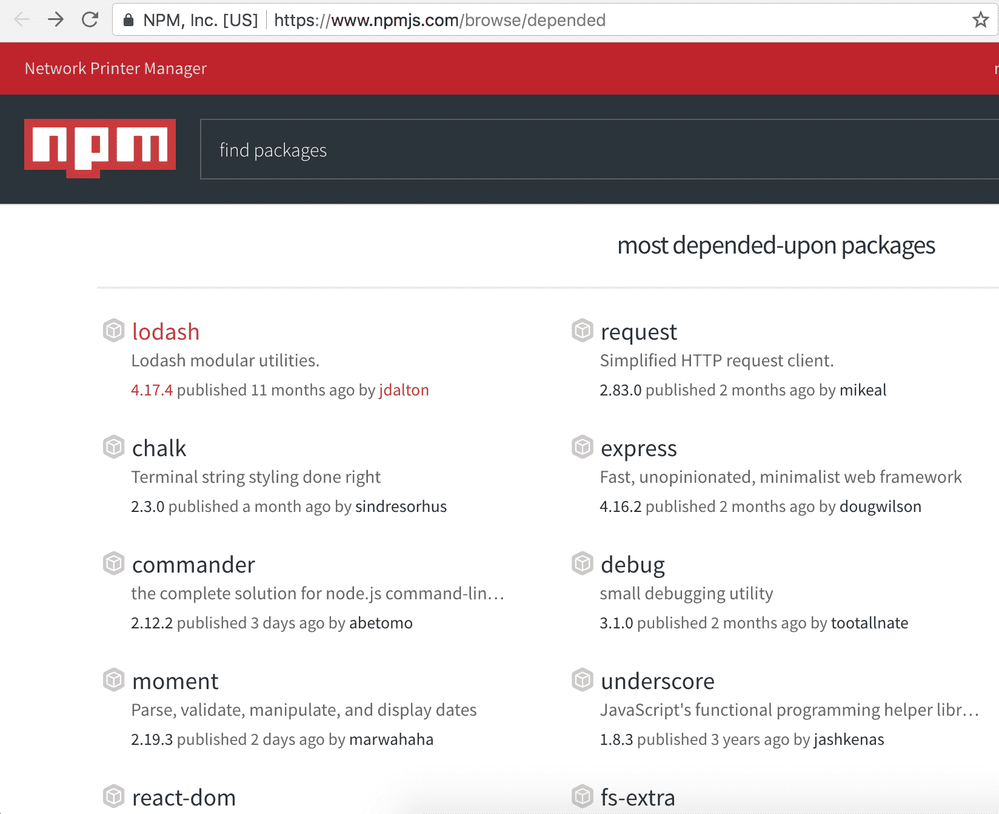
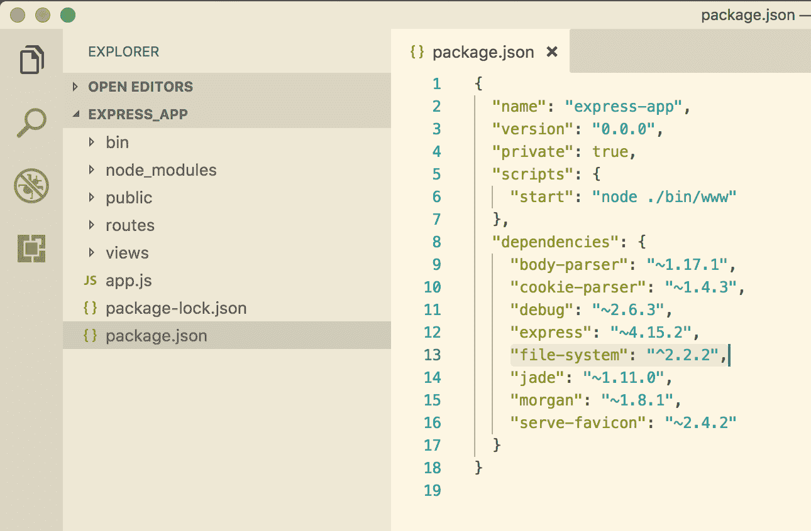

Building an Express Application <link href="css/style.css" rel="stylesheet" type="text/css">  

# 构建快速应用程序

Express.js 是一个 Node.js web 应用框架。 Express.js 使使用 Node.js 变得更容易，并充分利用了它的能力。 在本章中，我们将只使用 Express.js 创建一个应用程序。 Express.js 也是一个`node`包。 我们可以使用应用程序生成器工具，它可以让我们轻松地创建一个快速应用程序的框架，或者我们可以简单地从头创建一个。

在前一章中，我们了解了什么是`npm`，什么是包，以及如何安装包。 在本章中，我们将涵盖以下要素:

*   Node.js 是什么，它能做什么
*   它所带来的好处
*   Node.js 的基本编程
*   Node.js 核心和自定义模块
*   Express.js 简介
*   使用 Express.js 创建应用程序
*   在 Express.js 路线
*   MVC 架构:它是什么，以及在应用程序中实现时它增加了什么价值
*   应用程序的文件命名约定
*   文件夹重组以合并 MVC
*   js 应用程序的视图创建

有很多`npm`包可以让我们为 Express.js 应用程序创建框架。 其中一个就是`express-generator`。 这让我们可以在几秒钟内构建整个应用程序。 它将在模块化结构中创建所有必要的文件和文件夹。 它以一种非常容易理解的方式生成文件结构。 我们唯一需要做的就是定义模板视图和路由。

我们也可以根据自己的需要和要求修改这个结构。 当我们的截止日期很紧，想要在一天左右的时间内构建一个应用程序时，这是非常方便的。 这个过程非常简单。

`express-generator` is only one of many tools that are available to create a scaffold or a modular structure of an express application. Each generator tool may have its own way of building the file structure as per their standard which can be easily customized.

如果您是初学者，并且想了解文件夹结构是如何工作的，我建议您从头开始构建应用程序。 我们将在本章中进一步讨论这个问题。

在开始之前，我们首先需要了解更多关于 Node.js 的内容。

# 介绍 node . js

Node.js 是在 JavaScript 引擎上构建的 JavaScript 运行时。 它是一个用于服务器端管理的开源框架。 Node.js 是轻量级且高效的，可以在各种平台上运行，比如 Windows、Linux 和 macOS。

Node.js 由 Ryan Dahl 在 2009 年创建。 JavaScript 过去主要用于客户端脚本，但 Node.js 也允许在服务器端使用 JavaScript。 Node.js 的发明引入了 web 应用程序中单一编程语言的使用。 Node.js 带来了很多好处，其中一些如下:

*   **事件驱动编程**:它意味着将一个对象的状态从一个改变到另一个。 Node.js 使用事件驱动编程，这意味着它使用用户的交互操作，如鼠标单击和按键，来改变对象的状态。
*   **非阻塞 I/O**:非阻塞 I/O，即非同步 I/O，即异步 I/O。 同步进程会等待当前运行的进程完成，因此会阻塞该进程。 另一方面，异步进程不需要等待该进程完成，这也使其快速和可靠。
*   **单线程**:单线程表示 JavaScript 只在一个事件循环中运行。 由于异步进程允许我们同时拥有多个进程，看起来似乎所有这些进程都在它们自己的特定线程中运行。 但是 Node.js 处理异步的方式有点不同。 Node.js 中的事件循环触发下一个回调函数，该函数计划在相应的事件发生后执行。

# 理解 node . js

在深入 Node.js 编程之前，让我们先看看 Node.js 的一些基础知识。 Node.js 运行在 JavaScript V8 引擎上。 JavaScript V8 引擎是由*The Chromium Project*为谷歌 Chrome 和 Chromium web 浏览器构建的。 它是一个用 c++编写的开源项目。 该引擎用于客户端和服务器端 JavaScript web 应用程序。

# node . js 编程

让我们从运行一个`node`进程开始。 打开终端并输入以下命令:

```js
$ node
```

这将开始一个新的`node`过程。 我们可以在这里编写普通的 JavaScript。

例如，我们可以在新的 Node shell 中编写以下 JavaScript 命令:

```js
> var a = 1;
```

当我们输入`a`并按 enter 键时，它返回`1`。

我们还可以在`node`进程中运行扩展名为`.js`的文件。 让我们使用`mkdir tutorial`命令在根目录中创建一个名为`tutorial`的文件夹，并在其中创建一个名为`tutorial.js`的文件。

现在，在 Terminal 中，让我们用下面的命令进入该目录:

```js
$ cd tutorial $ node tutorial.js
```

我们应该看到类似以下内容:


这不会返回任何内容，因为我们还没有为`tutorial.js`编写任何内容。

现在，让我们向`tutorial.js`添加一些代码:

```js
console.log('Hello World');
```

现在，用下面的命令运行该文件:

```js
$ node tutorial.js
```

我们将看到一个显示`Hello World`的输出。 这就是我们在 Node.js 中执行文件的方式。

除了运行在 V8 引擎上并在浏览器中执行 JavaScript 代码外，Node.js 还提供了一个服务器运行环境。 这是 Node.js 最强大的特性。 Node.js 本身提供了一个 HTTP 模块，它支持非阻塞 HTTP 实现。 让我们构建一个简单的 web 服务器来理解这一点。

在同一个文件上，在`tutorial.js`中，用以下代码覆盖该文件:

```js
const http = require('http');

http.createServer(function (req, res) {
 res.writeHead(200, { 'Content-Type': 'text/plain' });
 res.end('Hello World\n');
}).listen(8080, '127.0.0.1');

console.log('Server running at http://127.0.0.1:8080/');
```

在这里，`var http = require('http');`代码要求在应用程序中加入 HTTP 模块。 这意味着现在我们可以通过`http`变量访问 HTTP 库中定义的函数。 现在我们需要创建一个 web 服务器。 前面的代码告诉 Node.js 在 8080 端口运行 web 服务器。 `createServer`方法中的`function`参数有两个参数，`req`和`res`，分别是请求和响应的简写形式。 在该函数中，我们需要做的第一件事是设置 HTTP 头。 这基本上定义了我们希望从该请求得到什么类型的响应。 然后，我们使用`res.send`定义我们想在响应中得到什么。 最后，我们请求 web 服务器侦听端口 8080。

当我们用`$ node tutorial.js`运行这段代码时，输出如下:


当我们在浏览器中输入 URL 时，我们应该能够看到:


这就是 Node.js 作为服务器程序的工作方式。

按 2 次*Ctrl**+**C*退出`node`控制台。

# node . js 模块

Node.js 模块只是一个由可重用代码组成的普通 JavaScript 文件。 每个模块都有自己特定的功能。 我们可以把它想象成图书馆。

例如，如果我们想隔离应用程序中所有与用户相关的活动，我们就为它创建一个模块，该模块将处理关于用户的所有数据库。

我们在 Node.js 中使用模块的方式是通过`require`。 我们刚才展示的关于创建 web 服务器的例子也是一个 Node.js 模块。

# node . js 核心模块

Node.js 中有两种类型的模块。 核心模块是在 Node.js 中构建的模块。 它们在我们安装 Node.js 时出现。 这些也被称为内置模块。 Node.js 中有很多核心模块:

*   调试器
*   文件系统
*   HTTP
*   路径
*   过程
*   事件

如果您想了解关于每个核心模块的更多细节，您可以访问以下文档:
[https://nodejs.org/api/。](https://nodejs.org/api/)

# 自定义模块

这些是我们在 Node.js 之上自己创建的模块。 由于 Node.js 有一个非常大的生态系统，有大量不同的模块可以根据我们的需要免费获取。 我们可以自己构建一个，或者使用别人的模块。 这是 Node.js 强大的另一个方面。 它为我们提供了使用来自社区的模块的灵活性，或者我们可以自己构建它们。

我们可以在[https://www.npmjs.com/browse/depended](https://www.npmjs.com/browse/depended):查看所有现有可用模块的列表。



# 引入 Express.js

Express.js 是 Node.js 的一个极简服务器端 web 框架。 它构建在 Node.js 之上，以方便管理 Node.js 服务器。 Express.js 最重要的优点是它使路由非常、非常容易。 它提供的健壮 API 非常容易配置。 它很容易接收来自前端的请求，也很容易连接到数据库。 Express.js 也是 Node.js 中最流行的 web 框架。 它使用**模型视图控制器**(**MVC**)设计模式，我们将在本章后面讨论。

# 安装 Express.js

我们已经介绍了如何通过`npm`安装`node`模块。 类似地，我们可以通过 NPM 使用以下命令安装 Express.js:

```js
$ npm install express
```

这是安装`node`模块的一种简单方法。 但是，在构建应用程序时，我们将需要许多不同类型的模块。 我们还希望在多个应用程序之间共享这些模块。 因此，要使一个模块在全球范围内可用，我们必须在全球范围内安装它。 为此，`npm`提供了在安装`node`模块时添加`-g`的选项。 所以，现在我们可以使用:

```js
$ npm install -g express
```

这将全局安装 Express.js，这允许我们在多个应用程序中使用`express`命令。

# 创建 Express.js 应用程序

现在我们已经安装了 Express.js，让我们开始使用 Express.js 创建应用程序。

我们将我们的应用程序命名为`express_app`。 使用`express`命令构建快速应用程序的概要非常简单。 我们可以简单地使用:

```js
$ express express_app
```

输出如下:


该命令在我们的应用程序中创建了许多文件和文件夹。 让我们快速看看这些:

*   `package.json`:该文件包含应用程序中安装的所有`node`包的列表和应用程序介绍。
*   `app.js`:该文件是快速应用程序的主入口页。 web 服务器代码驻留在这个文件中。
*   `public`:我们可以使用这个文件夹来插入我们的资产，如图像、样式表或自定义 JavaScript 代码。
*   `views`:这个文件夹包含了我们要在浏览器中呈现的所有视图文件。 它的主要布局文件(包含视图的基本 HTML 模板文件),一个`index.jade`文件(扩展了布局文件,只有改变的或动态的内容),和一个`error.jade`文件(显示当我们需要显示的错误消息传递我们的前端)。
*   `routes`:这个文件夹有一个完整的列表，列出了我们将要构建的访问应用程序不同页面的所有路由。 我们将在以后的章节中对此进行更多讨论。
*   `bin`:该文件夹包含 Node.js 的可执行文件。

这些是我们需要知道的基本知识。 现在，使用您最喜欢的文本编辑器来处理应用程序，让我们开始吧。 现在，如果我们看一下`package.json`，有一些我们没有安装但在依赖项中列出的包:


这是因为它们是任何应用程序的 Express.js 依赖项。 这意味着，当我们使用`express`命令创建一个应用程序时，它将自动安装它需要的所有依赖项。 例如，在前面的`package.json`文件中列出的依赖项做以下事情:

*   **body-parser**:用于解析 HTTP 请求时提供的 body 参数
*   **debug**:这是一个 JavaScript 实用程序包，它为`console.log`返回的内容提供了很好的格式化，我们也可以通过`package.json`文件安装或删除包。 只需在`package.json`文件中添加或删除包的名称就可以安装或删除它。 然后运行`$ npm install`。
*   **express**:这是一个 Node.js JavaScript 框架，用于在 Node.js 之上构建可伸缩的 web 应用。
*   **jade**:如前所述，这是 Node.js 的默认模板引擎。 在使用`express`命令创建应用程序时，我们应该看到一个警告，说默认视图引擎在未来的版本中不会是 jade。 这是因为`jade`将被`pug`所取代; `jade`的版权归某公司所有，后来更名为`pug`。

express 生成器使用过时的`jade`模板引擎。 使用实例修改模板引擎。

1.  在`package.json`文件中，删除`"jade": "~1.11.0"`，行并运行:

```js
$ cd express_app
$ npm install
```

2.  现在，要安装新的`pug`模板引擎，运行:

```js
$ npm install pug --save
```

3.  如果我们查看`package.json`文件，我们应该看到类似于
    `"pug": "^2.0.0-rc.4"`的一行。

4.  将`views`文件夹中的文件重命名:
    *   `error.jade`to`error.pug`
    *   `index.jade`to`index.pug`
    *   `layout.jade`to`layout.pug`
5.  最后，在`app.js`中删除下面一行:

```js
app.set('view engine', 'jade');
```

6.  添加以下一行以使用`pug`作为视图引擎:

```js
app.set('view engine', 'pug');
```

*   **morgan**:这是用于记录 HTTP 请求的中间件
*   **service -favicon**:用于在浏览器中显示一个图标来标识我们的应用程序

It's not necessary to have all these dependencies for our application. They come from installing Express.js. Just dig around for what you want and then add or remove the packages as per your application needs.

现在，我们将保持现状。 `express`命令只是将依赖项添加到`package.json`文件中，并为应用程序创建一个框架。 为了实际安装`package.json`文件中列出的这些模块和包，我们需要运行:

```js
$ npm install
```

这个命令将实际安装所有依赖项。 现在，如果我们查看文件夹结构，我们可以看到添加了一个名为`node_modules`的新文件夹。 这是我们在该应用程序中安装的所有包的所在位置。

现在，我们要做的第一件事是建立一个网络服务器。 为此，在`app.js`文件中添加以下行:

```js
// error handler
app.use(function(err, req, res, next) {
  // set locals, only providing error in development
  res.locals.message = err.message;
  res.locals.error = req.app.get('env') === 'development' ? err : {};

  // render the error page
  res.status(err.status || 500);
  res.render('error');
});

app.listen(3000, function() { console.log('listening on 3000') })

module.exports = app;

```

现在，运行以下命令:

```js
$ node app.js
```

这将启动我们的应用服务器。 现在，当我们转到`http://localhost:3000/`URL 时，我们应该能够得到这个:


就是这样。 我们已经成功创建了一个 Express 应用程序。

# 表达的路由器

让我们来看看 Express 路由器。 正如本章前面提到的，Express.js 最重要的一个方面是它为应用程序提供了简单的路由。 路由是应用程序的 URL 定义。 如果我们看一下`app.js`，我们会看到这样一个部分:

```js
...
app.use('/', index);
app.use('/users', users);
...
```

这意味着当我们访问一个网页时，当一个请求被发送到主页时，快速路由器会将其重定向到一个名为`index.`的路由器。现在，看看`routes/index.js`，它有以下代码:

```js
var express = require('express');
var router = express.Router();

/* GET home page. */
router.get('/', function(req, res, next) {
  res.render('index', { title: 'Express' });
});

module.exports = router;
```

这意味着当我们访问主页时，它将呈现一个位于`views/index.pug`内部的名为`index`的页面，并为`title`传递一个参数以在页面上显示。 现在，看看 views 文件夹中的`index.pug`文件，它有以下代码:

```js
extends layout

block content
  h1= title
  p Welcome to #{title}
```

这意味着它使用了来自`layout.pug`文件的布局，并显示了一个`h1`标题以及一个呈现我们从路由文件传递过来的标题的段落。 因此，输出如下:


非常简单明了，对吧?

# 请求对象

请求对象是一个包含 HTTP 请求信息的对象。 请求的属性如下:

*   **query:**它包含关于解析后的查询字符串的信息。 通过`req.query`访问。
*   **params:**包含解析的路由参数信息。 通过`req.params`访问。
*   **body:包含关于解析后的请求体的信息。 通过`req.body`访问。**

# 响应对象

在接收到`req`变量上的`request`后，`res`对象就是我们要返回的`response`对象。

响应的属性是:

*   **send:**用于向视图发送响应。 通过`res.send`访问。 它接受两个参数，状态码和响应体。
*   **状态:**如果要发送应用程序的成功或失败，则使用`res.status`。 这是 HTTP 状态代码。
*   **重定向:**`res.redirect`用于重定向到某个页面，而不是以其他格式发送响应。

# 介绍 MVC

在构建应用程序时，无论使用哪种编程语言，MVC 模型都是必不可少的。 MVC 架构使得组织应用程序的结构和分离逻辑部分和视图部分变得很容易。 我们可以在任何时候合并这个 MVC 结构，即使我们已经完成了应用程序的一半。 实现它的最佳时间是在任何应用程序的开始阶段。

顾名思义，它分为三个部分:

*   **模型:**应用程序的所有业务逻辑都位于这些`models`之下。 这些处理数据库。 它们处理应用程序的所有逻辑部分。
*   **View:**浏览器所呈现的一切——用户所看到的——都由这些视图文件处理。 它处理我们发送给客户端的任何信息。
*   **控制器:**`Controllers`基本连接这些`models`和视图。 它负责将在`models`中完成的逻辑计算带到`views`部分:


在我们构建的应用程序中，没有必要实现 MVC 平台。 JavaScript 是模式无关的，这意味着我们可以创建自己的文件夹结构。 与其他编程语言不同，我们可以选择任何对我们来说最简单的结构。

# 为什么 MVC ?

当我们在应用程序中实现 MVC 架构时，有很多好处:

*   清晰的业务逻辑和视图分离。 这种分离允许我们在整个应用程序中重用业务逻辑。
*   开发过程变得更快。 这是很明显的，因为这些部分被清楚地分开了。 我们可以将我们的视图添加到我们的视图文件夹中，并在`models`文件夹中添加逻辑。
*   修改现有代码很容易。 当多个开发人员在同一个项目中工作时，这非常方便。 任何人都可以从任何地方拿起应用程序并开始对其进行更改。

# 更改文件夹结构以合并 MVC

现在我们已经对 MVC 有了足够的了解，让我们修改我们创建的应用程序的文件夹结构，称为`express_app`。 首先，我们需要在根目录中创建这三个文件夹。 这里已经有一个视图文件夹了，我们可以跳过它。 让我们继续创建`models`和`controllers`文件夹。

之后，在我们的`app.js`中，我们需要包含控制器文件。 为此，我们首先必须引入一个名为 filesystem 的新包。 该模块可以方便地执行与文件相关的操作，例如对文件的读写。 所以，要将这个包添加到我们的应用程序中，运行:

```js
$ npm install file-system --save 
```

当我们想要一个`node`模块只安装在我们的应用程序中时，使用这个`--save`参数。 另外，在安装后，这个包将自动包含在我们的`package.json`中。



现在，我们将需要这个模块，并使用它来包含驻留在控制器中的所有文件。 为此，在我们的`app.js`中添加以下代码行。 确保在我们的 web 服务器运行代码之前添加这些行:

```js
var index = require('./routes/index');
var users = require('./routes/users');

var app = express();

// Require file system module
var fs = require('file-system');

// Include controllers
fs.readdirSync('controllers').forEach(function (file) {
 if(file.substr(-3) == '.js') {
 const route = require('./controllers/' + file)
 route.controller(app)
 }
})

// view engine setup
app.set('views', path.join(__dirname, 'views'));
app.set('view engine', 'pug');
```

让我们继续添加到控制器的路由。 让我们在应用程序的根目录中创建一个名为`controllers`的文件夹，并在`controllers`文件夹中添加一个`index.js`文件，并粘贴以下代码:

```js
module.exports.controller = (app) => {
 // get homepage
 app.get('/', (req, res) => {
 res.render('index', { title: 'Express' });
 })
}
```

现在，我们所有的路由都将由控制器文件处理，这意味着我们不需要`app.js`中的代码来控制路由。 因此，我们可以从文件中删除这些行:

```js
var index = require('./routes/index');
var users = require('./routes/users');

app.use('/', index);
app.use('/users', users);
```

实际上，我们不再需要那个`routes`文件夹了。 让我们同时删除`routes`文件夹。

类似地，让我们添加一个控制所有用户相关操作的新路由。 为此，向`controllers`文件夹添加一个名为`users.js`的新文件，并将以下代码粘贴到其中:

```js
module.exports.controller = (app) => {
 // get users page
 app.get('/users', (req, res) => {
 res.render('index', { title: 'Users' });
 })
}
```

现在，让我们重新启动应用程序的节点服务器:

```js
$ node app.js
```

因此，当我们访问`http://localhost:3000/users`时，我们将能够看到以下内容:


我们已经成功地建立了 MVC 架构的一部分`controllers`和`views`。 我们将在接下来的章节中详细介绍`models`部分。

In the previous chapter, we talked about GitHub and how to use it for making code history by making small commits. Don't forget to set up a repo and continuously push code to GitHub. 

npm 包被存储在`node_modules`目录下，我们不应该将其推送到 GitHub。 要忽略这些文件，我们可以添加一个名为`.gitignore`的文件，并指定我们不希望推送到 GitHub 的文件。

让我们在应用程序中也创建一个名为`.gitignore`的文件，并添加以下内容:

```js
node_modules/
```

这样，当我们安装任何包时，当提交到 GitHub 时，它不会显示为代码差异。

每次修改代码时，我们都必须重启`node`服务器，这非常耗时。 为了简化这个过程，`node`提供了一个名为`nodemon`的包，它会在我们每次修改代码时自动重启服务器。

执行以下命令安装包:

```js
$ npm install nodemon --save
```

运行服务器，使用如下命令:

```js
$ nodemon app.js
```

# 文件命名约定

在开发应用程序时，我们需要遵循特定的约定来命名文件。 当我们继续构建应用程序时，我们将拥有大量的文件，这些文件可能会变得混乱。 MVC 允许在不同的文件夹中使用并行命名约定，这可能导致在不同的文件夹中使用相同的文件名。

如果我们发现这样的文件名容易维护，我们也可以在这样的文件名上工作。 否则，我们可以将文件名的类型附加到每个文件中，如下例所示; 对于处理用户相关活动的控制器文件，我们可以将其保留为`controllers/users.js`，或者将其重命名为`controllers/users_controller.js`。 我们将在应用程序中使用`controllers/users`。

对于`models`、`services`或需要在整个应用程序的不同区域之间共享的任何其他文件夹也是如此。 对于这个应用程序，我们将使用以下命名约定:


记住，在 Node.js 中没有正式的命名约定。 我们绝对可以自定义我们发现更简单的方式。 我们将在以后的章节中进一步讨论如何创建`models`。 这将需要我们创建一个与蒙古的连接，我们将在后面的章节中描述。

# 为 Express.js 应用程序创建视图文件

在上一节中，我们了解了如何创建`controllers`。 在本节中，我们将讨论如何添加和自定义视图文件。 如果你还记得，我们在`controllers/users.js`中有这样的代码:

```js
module.exports.controller = (app) => {
  // get users page
  app.get('/users', (req, res) => {
    res.render('index', { title: 'Users' });
  })
}
```

让我们改变一行将`index`文件渲染成这样:

```js
module.exports.controller = (app) => {
  // get users page
  app.get('/users', (req, res) => {
    res.render('users', { title: 'Users' });
  })
}
```

这意味着控制器希望加载位于`views`文件夹中的`users`文件。 让我们在`views`文件夹中创建一个`users.pug`文件。

创建文件后，粘贴以下代码; 这与我们的`views`文件夹中的`index.pug`文件中的代码是相同的:

```js
extends layout

block content
 h1= title
 p Welcome to #{title}
```

现在，如果我们使用`nodemon`，我们不需要重新启动服务器; 只需用位置`http://localhost:3000/users`重新加载浏览器。 这应该渲染如下:


现在，我们已经知道了如何连接`controllers`和`views`以及如何创建视图文件，接下来让我们了解关于文件代码的更多信息。

第一行写着:

```js
extends layout
```

这意味着它要求扩展已经在`layout.pug`文件中的视图。 现在，看`layout.pug`:

```js
doctype html
html
  head
    title= title
    link(rel='stylesheet', href='/stylesheets/style.css')
  body
    block content
```

这是一个带有`doctype`、`HTML`、`head`和`body`标记的简单 HTML 文件。 在`body`标记中，它说要阻止内容，这意味着它从在这个`block content`语句下写入的任何其他文件中生成内容。 如果我们看一下`users.jade`，我们可以看到内容写在块内容语句下面。 现在，这非常有用，因为我们不必在创建的每个视图文件中重复整个 HTML 标记。

同样，如果我们看一下控制器内部的`users.js`，有一行是这样写的:

```js
res.render('users', { title: 'Users' });
```

render 方法有两个参数:它想要加载的视图和想要传递给该视图的变量。 在本例中，将`Users`传递给 title 变量。 在`views`文件夹的`users.jade`中，我们有:

```js
block content
  h1= title
  p Welcome to #{title}
```

这将在`h1`标签和`p`标签中呈现该变量。 通过这种方式，我们可以将`controllers`中需要的任何内容传递给视图。 让我们在`users.js`控制器中的`render`方法中添加一个名为`description`的新变量:

```js
module.exports.controller = (app) => {
  // get homepage
  app.get('/users', (req, res) => {
    res.render('users', { title: 'Users', description: 'This is the description of all the users' });
  })
}
```

同样，让我们创建一个地方，这将在`users.pug`中呈现:

```js
extends layout

block content
  h1= title
  p Welcome to #{title}
  p #{description}
```

如果我们重新加载浏览器，我们将得到:


这就是为一个快速应用程序创建视图的方式。 现在，继续为我们的应用程序添加视图。

一定要确保提交并将更改推入 GitHub。 提交越小，代码的可维护性就越强。

# 总结

在本章中，我们学习了什么是 Node.js 和什么是 Express.js。 我们学习了如何使用 Express.js 创建应用程序，并了解了 MVC 架构。

在下一章中，我们将讨论 MongoDB 及其查询。 我们还将讨论使用 Mongoose 进行快速开发以及 Mongoose 查询和验证。