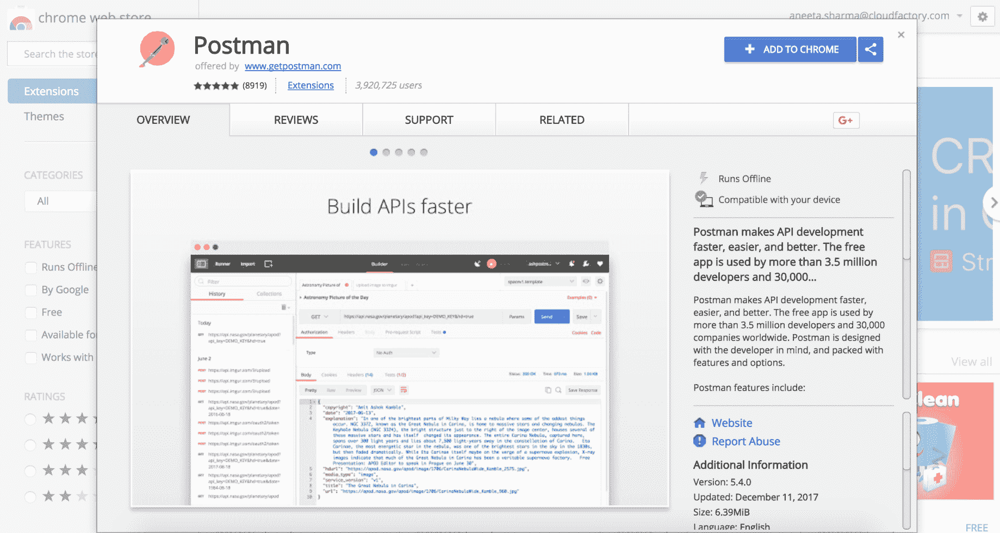
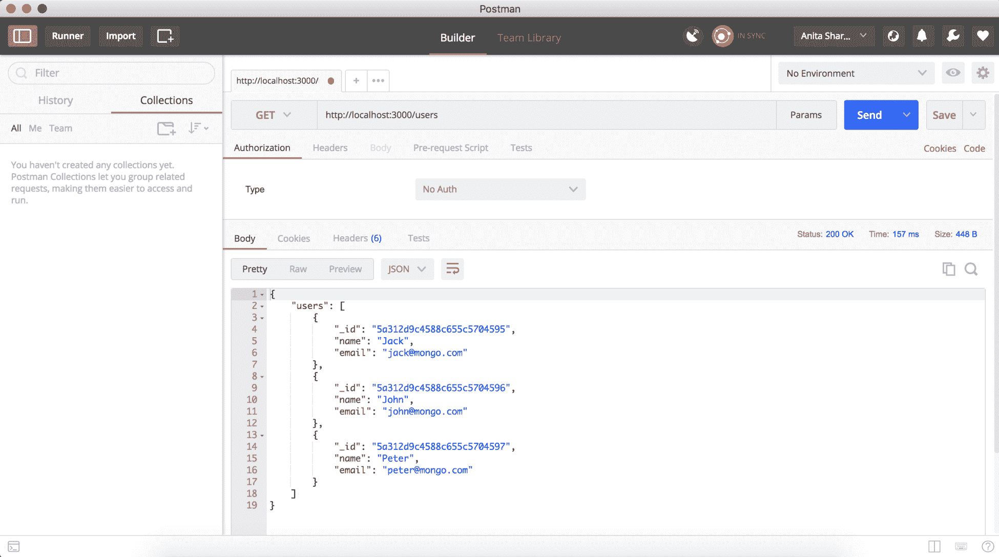
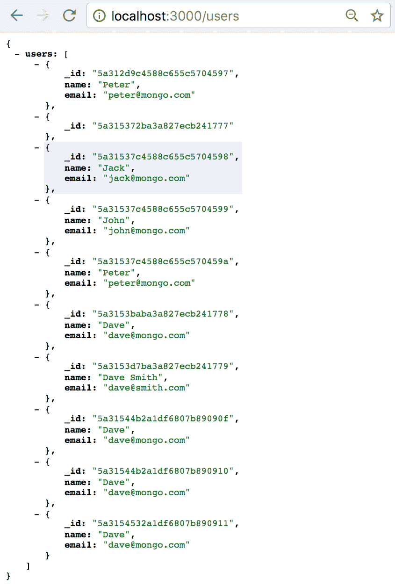
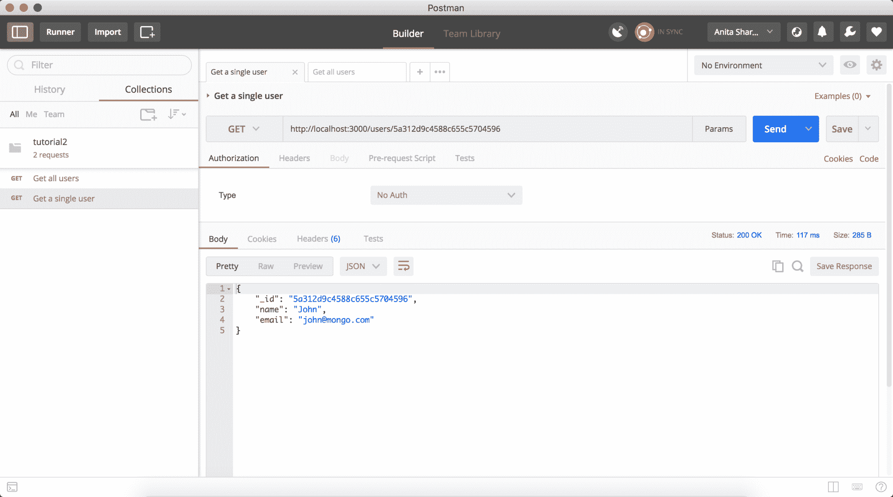
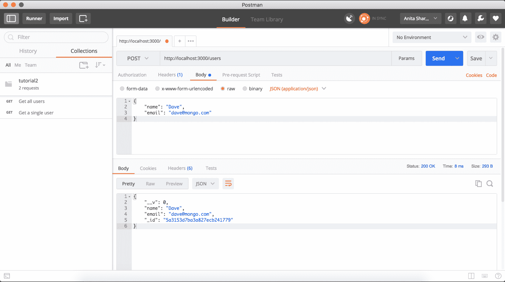
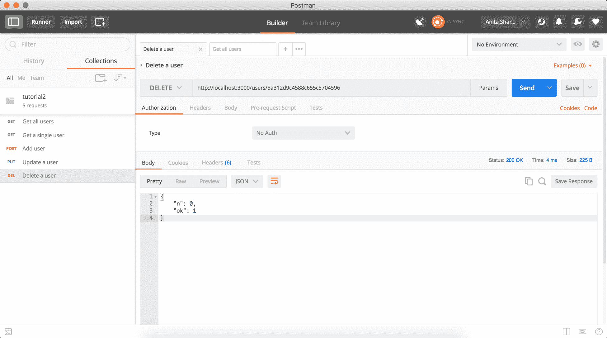

Introducing REST APIs <link href="css/style.css" rel="stylesheet" type="text/css">  

# 介绍 REST api

**应用程序编程接口**(**API**)，通常用于从一个应用程序到另一个应用程序获取数据。 有不同种类的 api 用于不同的领域，如硬件和编程，但我们将只讨论 web api。 Web api 是 Web 服务的一种形式，它提供了在多个应用程序之间进行通信的接口。 来自一个应用程序的数据通过使用此类 api 的 HTTP 协议发送到另一个应用程序。

在本章中，我们将讨论:

*   REST 架构和 RESTful api
*   HTTP 动词和状态码
*   使用 Postman 开发和测试 api

Web api 的工作方式与浏览器与应用服务器交互的方式类似。 客户端向服务器请求一些数据，服务器将格式化后的数据响应给客户端; api 做类似的事情。 例如，在多个应用程序之间预先设置了一个契约。 因此，如果有两个应用程序需要共享数据，那么一个应用程序将向另一个应用程序提交请求，说明它需要这种格式的数据。 当另一个应用程序接收到请求时，它从服务器获取数据，并将结构化和格式化的数据响应给客户端或请求者。

Web api 分为**简单对象访问协议(SOAP**),**远程过程调用(RPC****),**或【显示】具象状态传输(**休息)类别。 这些 api 的响应格式可以是各种形式的，例如 XML、JSON、HTML、图像和视频。******

 ******api 也有不同的模型，如公共 api 和私有 api:

*   **私有 api**:私有 api 或内部 api 仅用于组织内部的应用程序
*   **公共 api**:公共 api 或外部 api 的设计方式是让它们可以与组织外的公共团体共享

# 其他是什么?

REST 是一个 web 服务，用于通过 HTTP 协议在多个应用程序之间交换数据。 基于 rest 的 Web 服务是可伸缩且易于维护的。

下面是一个简单的图表，解释了 REST Web Service 是如何工作的:


正如我们在图中看到的，客户机通过调用 Rest Web Service Server 请求一些数据。 在这里，当我们发送一个 HTTP 请求时，我们还提供一些头，例如我们想要什么类型的数据作为响应。 这些响应可以是 JSON、XML、HTML 或任何其他形式。 当服务器接收到请求并从存储中提取数据时，它并不是简单地将数据库资源作为响应返回。 它发送这些资源的表示。 这就是为什么它被称为**代表性的**。 当服务器用这些格式化的数据响应客户机时，应用程序的状态就会改变。 这就是为什么它被称为**状态转移**。

# 介绍 REST api

REST api 是基于 RESTful 架构设计的。 使用 RESTful 架构原则构建的 api 称为 RESTful api。 RESTful 架构也被称为**无状态架构**，因为客户端和服务器之间的连接没有被保留。 在客户端和服务器之间的每个事务之后，连接被重置。

由于有多个 web 服务，我们必须能够选择我们的需求和需求，以便为我们的应用程序构建完美的 API。 SOAP 和 REST 协议都有一些优点和局限性。

SOAP 协议是由 Dave Winer 在 1998 年设计的。 它使用**可扩展标记语言**(**XML**)进行数据交换。 是使用 SOAP 还是 REST 取决于我们在开发时选择哪种编程语言以及应用程序的需求。

REST api 允许我们以 JSON/XML 数据格式在应用程序之间通信。 JSON/XML 是一种数据表示形式，便于格式化和人类阅读。 RESTful api,我们可以执行创建**,**读**,**更新**和**删除**(【显示】C****路德)操作从一个应用程序到另一个地方。**

 **# REST API 的好处

REST API 提供了很多好处。 下面是我们可以通过使用 REST api 获得的一些好处:

*   从一个应用程序向另一个应用程序发出请求和获得响应是很容易的。
*   可以以人类可读的格式(JSON 或 XML)检索响应。
*   一切都以 URI 的形式进行操作，这意味着每个请求都由 URI 请求标识。
*   客户机和服务器之间的分离使得在需要的时候很容易迁移到不同的服务器，而只需进行最小的更改。 客户机和服务器之间的隔离也使其易于扩展。
*   它独立于任何编程语言。 不管我们是否使用 PHP、JAVA、Rails、Node.js 等，我们都可以实现 REST 架构。
*   它很容易上手，而且学习曲线很短。

# HTTP 动词

HTTP 动词是用于定义我们希望为资源执行的操作的不同方法。 最常用的 HTTP 动词是 GET、POST、PUT、PATCH 和 DELETE。 HTTP 动词是使多个应用程序之间通信成为可能的请求方法。 这些 HTTP 动词使得在一个资源上执行多个操作成为可能，而不需要完全改变 url。 让我们更详细地研究每一个。

# 得到

`GET`请求是幂等请求。 当我们想要获取关于资源的信息时使用。 这不会修改或删除资源。 `GET`请求的等效 CRUD 操作是`READ`，这意味着它只获取信息，仅此而已。 `GET`请求的 URL 示例如下:

*   获取所有记录:

```js
GET http://www.example.com/users
```

*   获取单个用户的信息:

```js
GET http://www.example.com/users/{user_id}
```

# 帖子

`POST`请求的等效 CRUD 操作是`CREATE`。 它与集合中的新记录一起使用。 因为这会改变服务器的状态，所以这不是一个幂等请求。 如果我们用相同的参数请求一个`POST`方法两次，这将在数据库中创建两个相同的新资源。 `POST`请求的 URL 示例如下:

```js
POST http://www.example.com/users/
```

# 把

`PUT`请求用于创建或更新记录。 如果资源还不存在，则创建一个新记录;如果资源已经存在，则更新现有记录。 等效的 CRUD 操作是`update()`。 它替换资源的现有表示。 `PUT`请求的 URL 示例如下:

```js
PUT http://www.example.com/users/
```

# 删除

这用于从集合中删除资源。 等效的 CRUD 操作是`delete()`。

`DELETE`请求的 URL 示例如下:

```js
DELETE http://www.example.com/users/{user_id}
```

# HTTP 状态代码

状态码是服务器为向该服务器发出的请求而做出的响应的一部分。 它指示请求的状态，不管请求是否成功执行。 状态码有三位数。 第一个数字表示响应的类别或类别。 HTTP 状态码的取值范围是*100 ~ 500*。 在本节中，我们将介绍一些主要的状态代码。

# 2 xx 条码

200 范围状态码是 API 中任何请求的成功范围。 在 200 个范围内，有很多代表不同成功形式的代码。 这里解释了许多可用的状态代码中的一些:

*   **200 OK**:此响应为标准响应。 它只是请求成功的表示。 此状态代码还返回执行请求的资源。
*   **201 Created**:表示资源创建成功。
*   **204 No Content**:该状态码成功执行请求，但不返回任何内容。

# 4 xx 代码

400 范围状态码出现时，有一个错误的客户端:

*   **400 Bad Request**:**当请求参数格式不正确或语法错误时，服务器返回 400 状态码。**
***   **401 Unauthorized**:**当未授权方试图发送 API 请求时，返回此状态码。 这基本上检查了身份验证部分。*****   **403 Forbidden**:这有点像 401。 这将检查执行 API 请求的一方的授权。 这基本上是在不同用户执行 API 有不同权限设置时完成的。*   **404 Not Found**:当服务器在数据库中没有找到我们试图执行某些操作的资源时返回。****

 ****# 5 xx 代码

500 range 状态码告诉我们，在给定资源中执行的动作有一些错误:

*   **500 Internal Server Error**:**当操作执行不成功时，显示此状态码。 与 200 状态码一样，这是当出现错误时服务器返回的通用代码。**
***   **503 服务不可用**:当我们的服务器没有运行时显示此状态码。*   **504 Gateway Timeout**:这表示请求已经发送到服务器，但是在给定的时间内没有得到任何响应。**

 **# 引入邮差

Postman 是一个让我们更快地开发和测试 api 的工具。 这个工具提供了一个 GUI，可以方便地更快地调整我们的 api，从而减少了 api 的开发时间。 我们还可以通过创建已开发的所有 api 的集合来维护历史记录。

对于 Postman 也有不同的选择，比如 Runscope 和 Paw。 我们将用邮差来写这本书。

# 安装邮差

使用邮差有不同的方法:

1.  如果你访问[https://chrome.google.com/webstore/detail/postman/fhbjgbiflinjbdggehcddcbncdddomop?hl=en](https://chrome.google.com/webstore/detail/postman/fhbjgbiflinjbdggehcddcbncdddomop?hl=en)，我们将看到以下内容:



点击添加到 Chrome 按钮，扩展将被安装。

2.  我们可以通过
    [https://www.getpostman.com/](https://www.getpostman.com/)下载适合我们操作系统的桌面应用程序。

我们在本书中使用了桌面应用程序。

# 使用 Postman 测试 api

首先，让我们快速回顾一下到目前为止所做的工作。 在我们正在构建的应用中，`app.js`文件应该有以下代码:

```js
var express = require('express');
var path = require('path');
var favicon = require('serve-favicon');
var logger = require('morgan');
var cookieParser = require('cookie-parser');
var bodyParser = require('body-parser');
var fs = require('file-system');
var mongoose = require('mongoose');

var app = express();
var mongoose = require('mongoose');
mongoose.connect('mongodb://localhost:27017/tutorial2', {
  useMongoClient: true
});
var db = mongoose.connection;
db.on("error", console.error.bind(console, "connection error"));
db.once("open", function(callback){
  console.log("Connection Succeeded");
});

// view engine setup
app.set('views', path.join(__dirname, 'views'));
app.set('view engine', 'pug');

// uncomment after placing our favicon in /public
//app.use(favicon(path.join(__dirname, 'public', 'favicon.ico')));
app.use(logger('dev'));
app.use(bodyParser.json());
app.use(bodyParser.urlencoded({ extended: false }));
app.use(cookieParser());
app.use(express.static(path.join(__dirname, 'public')));

// Include controllers
fs.readdirSync("controllers").forEach(function (file) {
  if(file.substr(-3) == ".js") {
    const route = require("./controllers/" + file)
    route.controller(app)
  }
})

// catch 404 and forward to error handler
app.use(function(req, res, next) {
  var err = new Error('Not Found');
  err.status = 404;
  next(err);
});

// error handler
app.use(function(err, req, res, next) {
  // set locals, only providing error in development
  res.locals.message = err.message;
  res.locals.error = req.app.get('env') === 'development' ? err : {};

  // render the error page
  res.status(err.status || 500);
  res.render('error');
});

module.exports = app;

app.listen(3000, function() {
  console.log('listening on 3000')
})
```

由于这个文件是在我们通过命令 CLI 构建应用程序时自动生成的，所以它使用的是 typescript 语法。 如果我们想使用 es6 语法，我们可以用`const`替换`var`。

在我们的`models/User.js`中，我们有以下内容:

```js
const mongoose = require("mongoose")
const Schema = mongoose.Schema
const UserSchema = new Schema({
 name: String,
 email: String
})

const User = mongoose.model("User", UserSchema)
module.exports = User
```

同样，在`controllers/users.js`中，我们有以下内容:

```js
module.exports.controller = (app) => {
  // get homepage
  app.get('/users', (req, res) => {
    res.render('index', { title: 'Users' });
  })
}
```

# 在用户控制器中添加 GET 端点

让我们添加一个到`controllers/users.js`的路由，它将从数据库中获取所有用户的记录。

目前，使用我们的`users`控制器中的代码，当我们访问`http://localhost:3000/users`时，它只返回一个标题`Users`。 让我们修改这段代码，使其包含一个`GET`请求来获取所有用户请求。

# 获取所有用户

首先，使用`$ nodemon app.js`启动服务器。 现在，在`controllers/users.js`:

```js
var User = require("../models/User");

module.exports.controller = (app) => {
  // get all users
  app.get('/users', (req, res) => {
    User.find({}, 'name email', function (error, users) {
      if (error) { console.log(error); }
      res.send(users);
    })
  })
}
```

现在代码已经就绪，让我们使用 Postman 应用程序测试这个端点。在 Postman 应用程序中，在 URL 中添加必要的详细信息。 当我们点击 Send 按钮时，我们应该看到如下的响应:



`_id`是用户的 Mongo ID，默认情况下是由 Mongoose query 发送的，我们正在获取用户的姓名和电子邮件。 如果我们只想要名称，我们可以在控制器中更改查询，只获取名称。

Postman 允许我们编辑端点，并且请求很容易开发。 如果我们想使用自己的本地浏览器进行测试，我们也可以这样做。

我使用了一个叫做 JSONview 的 Chrome 插件来格式化 JSON 响应。 您可以从这里获得插件:
[https://chrome.google.com/webstore/detail/jsonview/chklaanhfefbnpoihckbnefhakgolnmc](https://chrome.google.com/webstore/detail/jsonview/chklaanhfefbnpoihckbnefhakgolnmc)。

正如我之前提到的，如果我们访问`http://localhost:3000/users`，我们应该可以看到类似以下内容:



We can use the `save` query feature given by Postman to run those queries in future as well. Just click the Save button, which is in the top right-hand corner of the app. And create new queries as we go forward.

# 获取单个用户

正如在 HTTP verbs 部分中提到的，要从集合中获取单个记录，我们必须在参数中传递用户的`id`，以便获得用户详细信息。 在前面的 Postman 响应示例中，让我们选择一个`id`并使用它来获取用户的记录。 首先，让我们将端点添加到控制器。 在`controllers/users.js`中，添加以下代码行:

```js
var User = require("../models/User");

module.exports.controller = (app) => {
  // get all users
  app.get('/users', (req, res) => {
    User.find({}, 'name email', function (error, users) {
      if (error) { console.log(error); }
       res.send({
        users: users
      })
    })
  })

  //get a single user details
 app.get('/users/:id', (req, res) => {
 User.findById(req.params.id, 'name email', function (error, user) {
 if (error) { console.log(error); }
 res.send(user)
 })
 })
}
```

现在使用以下参数在 Postman 中创建一个新的查询。 我们将使用 URL`http://localhost:3000/users/:user_id`创建一个`GET`请求，其中`user_id`是您在数据库中创建的任何用户的`id`。 通过这个设置，我们应该能够看到如下内容:



查询应该返回 URL 中具有给定 ID 的用户的详细信息。

# 在用户控制器中添加 POST 端点

让我们看一个例子。 让我们创建一个 API，它将使用 MongoDB`insert()`命令在数据库中保存用户资源。 在用户控制器中，添加一个新的端点:

```js
// add a new user
  app.post('/users', (req, res) => {
    const user = new User({
      name: req.body.name,
      email: req.body.email
    })

    user.save(function (error, user) {
      if (error) { console.log(error); }
      res.send(user)
    })
  })
```

在 Postman 中，将方法设置为`POST`，URL 设置为`http://localhost:3000/users`，将参数设置为原始 JSON，并提供以下输入:

```js
{
 "name": "Dave",
 "email": "dave@mongo.com"
}
```



与`GET`请求不同，我们必须传递想要添加到`body`参数中的用户的姓名和电子邮件。 现在，如果我们运行一个`GET all users`查询，我们应该能够看到这个新用户。 如果我们使用相同的参数运行两次`POST`请求，那么它将创建两个不同的资源。

# 在用户控制器中添加 PUT 端点

让我们用 ID`5a3153d7ba3a827ecb241779`更新一个用户(将此 ID 更改为您的文档的 ID)，这是我们刚刚创建的。 让我们重命名电子邮件:首先，让我们在用户控制器中添加端点，换句话说，`controllers/user.js`:

```js
// update a user
  app.put('/users/:id', (req, res) => {
    User.findById(req.params.id, 'name email', function (error, user) {
      if (error) { console.error(error); }

      user.name = req.body.name
      user.email = req.body.email
      user.save(function (error, user) {
        if (error) { console.log(error); }
        res.send(user)
      })
    })
  })
```

我们在这里所做的是，为`PUT`请求添加一个端点，该端点以名称和电子邮件作为参数，并将其保存到数据库中。 相应的邮差如下:


在这里，我们可以看到用户的名字已经被更新。 而且，如果我们查看请求参数，我们还添加了一个`age`参数。 但是，由于我们没有在定义 User 模型时将`age`添加到 Schema 中，所以它会丢弃年龄值，但更新其他值。

We can also use the `PATCH` method to update a resource. The difference between the `PUT` and `PATCH` methods is: the `PUT` method updates the whole resource, whereas `PATCH` is used for a partial update on resources.

# 在用户控制器中添加一个 DELETE 端点

类似地，对于删除，让我们在`controllers/users.js`中添加一个端点:

```js
// delete a user
  app.delete('/users/:id', (req, res) => {
    User.remove({
      _id: req.params.id
    }, function(error, user){
      if (error) { console.error(error); }
      res.send({ success: true })
    })
  })
```

前面的代码获取用户的 ID，并从数据库中删除具有给定 ID 的用户。 在 Postman 中，端点如下所示:



# 总结

在本章中，我们了解了什么是 RESTful API，不同的 HTTP 动词和状态码，以及如何开发 RESTful API 和使用 Postman 测试它们。

在下一章中，我们将跳到 Vue.js 的介绍，并将使用 Vue.js 构建一个应用程序。**************