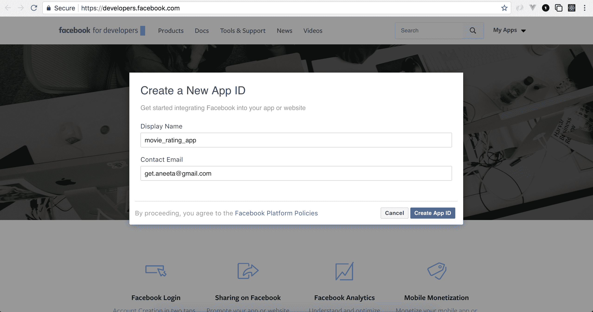
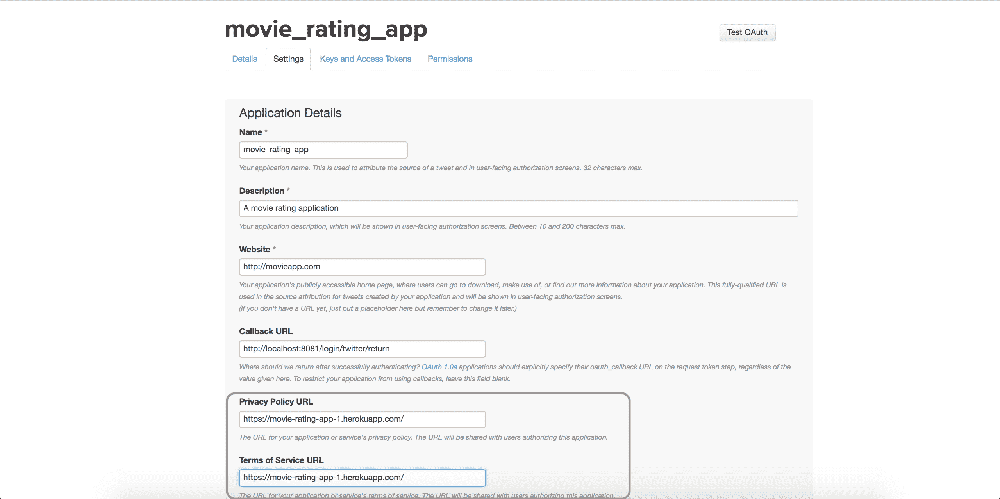
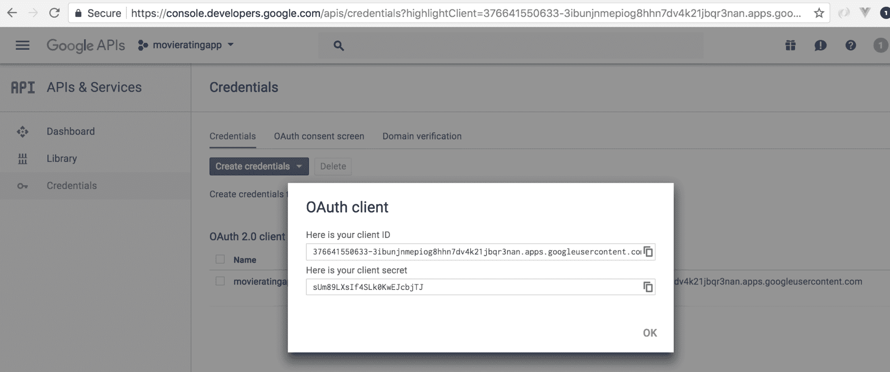
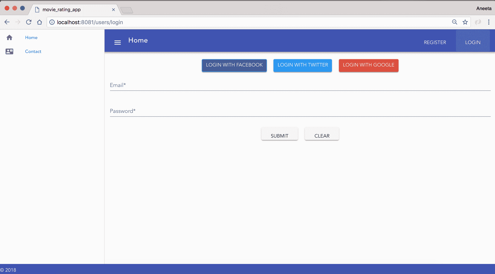

# 四、使用`passport.js`构建 OAuth 策略

在前一章中，我们讨论了 passport-JWT 战略。 我们讨论了如何利用 JWT 包来构建一个健壮的用户加载过程。 我们介绍了如何为用户实现注册和登录过程。 在本章中，我们将深入研究以下部分:

*   `passport.js`Facebook 策略
*   `passport.js`Twitter 策略
*   `passport.js`谷歌策略
*   `passport.js`LinkedIn 策略

如果我们从头开始做，所有这些部分单独消耗大量时间。 `passport.js`提供了一种更简单的方式，以非常灵活的方式集成所有这些策略，并使它们更容易实现。

**OAuth**是一种认证协议，允许用户通过不同的外部服务登录。 例如，如果用户已经登录到 Facebook 或 Twitter，那么通过 Facebook 或 Twitter 登录到应用不需要用户提供他们的用户名和密码。 它节省了用户在应用中建立新账户的时间，这使得登录过程更加顺利。 这使得登录应用更容易; 否则，用户首先需要注册到我们的应用，然后使用这些凭据登录。 Passport 的 OAuth 策略允许用户登录到我们的应用，如果浏览器记住了帐户，只需单击一次。 其他一切都是自动完成的，由策略本身处理。

# 护照的 Facebook 战略

《Passport》的 Facebook 策略很容易整合。 和往常一样，让我们从安装这个策略开始。

# 安装《Passport》的 Facebook 策略

我们可以通过运行以下命令安装 passport 的 Facebook 策略:

```js
$ npm install passport-facebook --save
```

下面的代码将把这个包添加到你的`package.json`文件中:

```js
...
"node-sass": "^4.7.2",
"nodemon": "^1.14.10",
"passport": "^0.4.0",
"passport-facebook": "^2.1.1",
...
```

# 配置 Passport 的 Facebook 策略

配置 Passport 的 Facebook 策略需要几个步骤。 我们将详细讨论每一步:

1.  创建并设置一个 Facebook 应用。这将为我们提供一个`App ID`和一个`App Secret`。
2.  添加一个按钮到我们的登录页面，允许我们的用户通过 Facebook 登录。
3.  为 Facebook 认证添加必要的路由。
4.  添加一个中间件方法来检查认证是否成功。

让我们深入了解前面每个步骤的细节。

# 创建和设置一个 Facebook 应用

为了能够使用 Facebook 策略，你必须首先构建一个 Facebook 应用。 Facebook 的开发者门户网站为[https://developers.facebook.com/](https://developers.facebook.com/)。

登录后，单击 Get Started 按钮，然后单击 Next。

然后，您将在屏幕的右上角看到一个名为“我的应用”(My Apps)的下拉菜单，在这里可以找到创建新应用的选项。

选择要为应用命名的显示名称。 在本例中，我们将其命名为`movie_rating_app`:



点击 Create App ID。 如果你进入设置页面，你会看到你的应用的 App ID 和 App Secret:


您将需要前面屏幕截图中提到的值。

# 在我们的登录页面添加一个按钮，允许用户通过 Facebook 登录

下一步是在您的登录页面中添加一个 LOGIN WITH FACEBOOK 按钮，您将链接到您的 FACEBOOK 应用。 将`Login.vue`内容替换为:

```js
<template>
  <div>
    <div class="login">
      <a class="btn facebook" href="/login/facebook"> LOGIN WITH FACEBOOK</a>
 </div>
    <v-form v-model="valid" ref="form" lazy-validation>
      <v-text-field
        label="Email"
        v-model="email"
        :rules="emailRules"
        required
      ></v-text-field>
      <v-text-field
        label="Password"
        v-model="password"
        :rules="passwordRules"
        required
      ></v-text-field>
      <v-btn
        @click="submit"
        :disabled="!valid"
      >
        submit
      </v-btn>
      <v-btn @click="clear">clear</v-btn><br/>
    </v-form>
  </div>
</template>
...
```

我们还将为这些按钮添加一些样式。 在`simg/stylesheets/home.css`中添加以下代码:

```js
#app {
  font-family: 'Avenir', Helvetica, Arial, sans-serif;
  -webkit-font-smoothing: antialiased;
  -moz-osx-font-smoothing: grayscale;
  text-align: center;
  color: #2c3e50;
  width: 100%;
}

#inspire {
  font-family: 'Avenir', Helvetica, Arial, sans-serif;
}

.container.fill-height {
  align-items: normal;
}

a.side_bar_link {
  text-decoration: none;
}

.card__title--primary, .card__text {
  text-align: left;
}

.card {
  height: 100% !important;
}

.btn.facebook {
 background-color: #3b5998 !important;
 border-color: #2196f3;
 color: #fff !important;
}

.btn.twitter {
 background-color: #2196f3 !important;
 border-color: #2196f3;
 color: #fff !important;
}

.btn.google {
 background-color: #dd4b39 !important;
 border-color: #dd4b39;
 color: #fff !important;
}

.btn.linkedin {
 background-color: #4875B4 !important;
 border-color: #4875B4;
 color: #fff !important;
}
```

前面的代码将添加一个 LOGIN WITH FACEBOOK 按钮:


# 为 Facebook 应用添加配置

让我们像配置本地策略一样配置 Facebook 策略。 我们将创建一个单独的文件来处理 Facebook 登录，这样代码就更简单了。 让我们在`controllers`文件夹中创建一个名为`facebook.js`的文件，并添加以下内容:

```js
const User = require('../models/User.js');
const passport = require('passport');
const config = require('./../config/Config');
const Strategy = require('passport-facebook').Strategy;

module.exports.controller = (app) => {
 // facebook strategy
 passport.use(new Strategy({
 clientID: config.FACEBOOK_APP_ID,
 clientSecret: config.FACEBOOK_APP_SECRET,
 callbackURL: '/login/facebook/return',
 profileFields: ['id', 'displayName', 'email']
 },
 (accessToken, refreshToken, profile, cb) => {
 // Handle facebook login
 }));
};
```

在前面的代码中，`exports`方法中的第一行导入了 Facebook Strategy。 配置有三个参数:`clientID`、`clientSecret`和回调 URL。 `clientID`和`clientSecret`分别是你的 Facebook 应用的`App ID`和`App Secret`。

让我们将这些秘密添加到配置文件中。 在`config/Config.js`，让我们添加我们的 Facebook 键，`facebook_client_id`和`facebook_client_secret`:

```js
module.exports = {
  DB: 'mongodb://localhost/movie_rating_app',
  SECRET: 'movieratingappsecretkey',
  FACEBOOK_APP_ID: <facebook_client_id>,
 FACEBOOK_APP_SECRET: <facebook_client_secret>
}
```

回调 URL 是您希望在 Facebook 事务成功后将应用路由到的 URL。

我们在这里定义的回调是`http://127.0.0.1:8081/login/facebook/return`，我们必须定义它。 该配置后面跟着一个函数，该函数接受以下四个参数:

*   `accessToken`
*   `refreshToken`
*   `profile`
*   `cb`(回调)

请求成功后，我们的应用将被重定向到主页。

# 添加必要的 Facebook 登录路线

现在，让我们继续添加必要的路由，以便在单击登录按钮和接收 Facebook 回调时使用。 在同一个文件`facebook.js`中添加如下路由:

```js
const User = require("../models/User");
const passport = require('passport');
const config = require('./../config/Config');

module.exports.controller = (app) => {
  // facebook strategy
  const Strategy = require('passport-facebook').Strategy;

  passport.use(new Strategy({
    clientID: config.FACEBOOK_APP_ID,
    clientSecret: config.FACEBOOK_APP_SECRET,
    callbackURL: '/api/login/facebook/return',
    profileFields: ['id', 'displayName', 'email']
  },
  function(accessToken, refreshToken, profile, cb) {
  }));

  app.get('/login/facebook',
 passport.authenticate('facebook', { scope: ['email'] }));

 app.get('/login/facebook/return',
 passport.authenticate('facebook', { failureRedirect: '/login' }),
 (req, res) => {
 res.redirect('/');
 });
}
```

在前面的代码中，我们添加了两个路由。 如果您还记得，在`Login.vue`中，我们已经添加了一个到`http://127.0.0.1:8081/login/facebook`的链接，该链接将由我们在这里定义的第一个路由提供。

此外，如果您还记得，在配置设置中，我们还添加了一个回调函数，它将由第二条路由提供，这也是我们在这里定义的。

现在，最后要做的是使用策略实际登录用户。 将`facebook.js`内容替换为:

```js
const User = require('../models/User.js');
const passport = require('passport');
const config = require('./../config/Config');
const Strategy = require('passport-facebook').Strategy;

module.exports.controller = (app) => {
  // facebook strategy
  passport.use(new Strategy({
    clientID: config.FACEBOOK_APP_ID,
    clientSecret: config.FACEBOOK_APP_SECRET,
    callbackURL: '/login/facebook/return',
    profileFields: ['id', 'displayName', 'email'],
  },
  (accessToken, refreshToken, profile, cb) => {
 const email = profile.emails[0].value;
 User.getUserByEmail(email, (err, user) => {
 if (!user) {
 const newUser = new User({
 fullname: profile.displayName,
 email,
 facebookId: profile.id,
 });
 User.createUser(newUser, (error) => {
 if (error) {
 // Handle error
 }
 return cb(null, user);
 });
 } else {
 return cb(null, user);
 }
 return true;
 });
 }));

  app.get('/login/facebook',
    passport.authenticate('facebook', { scope: ['email'] }));

  app.get('/login/facebook/return',
    passport.authenticate('facebook', { failureRedirect: '/login' }),
    (req, res) => {
      res.redirect('/');
    });
};
```

在使用 Facebook 登录登录时，如果用户已经存在于我们的数据库中，用户只需登录并保存在会话中。 会话数据不是存储在浏览器 cookie 中，而是存储在服务器端本身。 如果该用户在我们的数据库中不存在，那么我们使用 Facebook 提供的电子邮件创建一个新用户。

这里要配置的最后一件事是添加从 Facebook 到应用的返回 URL 或重定向 URL。 为此，我们可以在 Facebook 的 App Settings 页面中添加 url。 在应用`Settings`页面，在`Valid OAuth Redirect URIs`下，添加从 Facebook 重定向到我们的应用的 url。

现在，我们应该可以通过 Facebook 登录了。 `login`功能成功后，将用户重定向到首页。 如果你注意到，Facebook 将我们重定向到`http://localhost:8081/#*=* `而不是`http://localhost:8081`。 这是因为存在安全漏洞。 我们可以通过在主文件中添加以下代码片段(即`index.html`)来从 URL 中删除`#`:

```js
<!DOCTYPE html>
<html>
  <head>
    <meta charset="utf-8">
    <meta name="viewport" content="width=device-width,initial-scale=1.0">
    <link href="https://fonts.googleapis.com/css?family=Roboto:300,400,500,700|Material+Icons" rel="stylesheet">
    <link href="https://unpkg.com/vuetify/dist/vuetify.min.css" rel="stylesheet">
    <title>movie_rating_app</title>
  </head>
  <body>
    <div id="app"></div>
    <!-- built files will be auto injected -->
  </body>
  <script type="text/javascript">
 if (window.location.hash == '#_=_'){
 history.replaceState
 ? history.replaceState(null, null, window.location.href.split('#')[0])
 : window.location.hash = '';
 }
 </script>
</html>
```

这将从前面的 URL 中删除`#`符号。 当您成功登录后，我们应该会在顶部栏视图中看到您的电子邮件如下所示:


# 护照的 Twitter 的策略

下一个策略是 Passport 的 Twitter 策略。 让我们从安装这个策略开始。

# 安装 Passport 的 Twitter 策略

运行如下命令安装 Twitter 策略:

```js
$ npm install passport-twitter --save
```

前面的命令应该将包添加到你的`package.json`文件中:

```js
...
"node-sass": "^4.7.2",
"nodemon": "^1.14.10",
"passport": "^0.4.0",
"passport-twitter": "^2.1.1",
...
```

# 配置 Passport 的 Twitter 策略

就像 Facebook 策略一样，我们必须执行以下步骤来配置 passport 的 Twitter 策略:

1.  创建和设置一个 Twitter 应用。 这将为我们提供一个消费者密钥(API 密钥)和一个消费者机密(API 秘密)。
2.  添加一个按钮到我们的登录页面，允许我们的用户登录与 TWITTER。
3.  添加必要的路由。
4.  添加一个中间件方法来检查认证。
5.  重定向用户到首页后，在顶部栏显示登录用户的电子邮件。

让我们深入了解前面每个步骤的细节。

# 创建并设置一个 Twitter 应用

就像 Facebook 战略一样，为了能够使用 Twitter 战略，我们也必须构建一个 Twitter 应用。 Twitter 的开发人员门户在[https://apps.twitter.com/](https://apps.twitter.com/)，在那里您将看到所有应用的列表。 如果是新的，您将看到一个用于创建新应用的按钮——单击 create your Twitter application。

您将看到一个表单，它将要求您填写应用名称和其他细节。 您可以为应用命名任何您想要的名称。 对于这个应用，我们将该应用命名为`movie_rating_app`。 对于回调 URL，我们已经提供了`http://localhost:8081/login/twitter/return`，我们将在后面定义:


成功创建应用后，你可以在“密钥和访问令牌”选项卡中看到 API 密钥(消费者密钥)和 API 秘密(消费者秘密):


这些令牌将在我们的应用中用于认证。

# 在我们的登录页面添加一个按钮，允许用户通过 Twitter 登录

下一步是在我们的登录页面中添加一个 LOGIN WITH TWITTER 按钮，我们将该按钮链接到我们刚刚创建的 TWITTER 应用。

在`Login.vue`中，添加一个通过 Twitter 登录的链接，如下:

```js
<template>
  <div>
    <div class="login">
      <a class="btn facebook" href="/login/facebook"> LOGIN WITH FACEBOOK</a>
       <a class="btn twitter" href="/login/twitter"> LOGIN WITH TWITTER</a>
    </div>
    <v-form v-model="valid" ref="form" lazy-validation>
      <v-text-field
        label="Email"
        v-model="email"
        :rules="emailRules"
        required
      ></v-text-field>
...
```

前面的代码将添加一个 LOGIN WITH TWITTER 按钮。 让我们运行以下命令:

```js
$ npm run build
```

现在，如果我们访问 URL`http://localhost:8080/users/login`，我们应该看到以下页面:


# 为 Twitter App 添加配置

现在，下一步是为 Twitter 登录添加必要的路由。 为此，我们需要配置设置和回调 URL。 就像我们在 Facebook 策略中所做的那样，让我们创建一个单独的文件来设置我们的 Twitter 登录。 让我们在`controllers`目录下创建一个名为`twitter.js`的新文件，并添加以下内容:

```js
const User = require('../models/User.js');
const passport = require('passport');
const config = require('./../config/Config');
const Strategy = require('passport-twitter').Strategy;

module.exports.controller = (app) => {
 // twitter strategy
 passport.use(new Strategy({
 consumerKey: config.TWITTER_APP_ID,
 consumerSecret: config.TWITTER_APP_SECRET,
 callbackURL: '/login/twitter/return',
 profileFields: ['id', 'displayName', 'email'],
 },
 (accessToken, refreshToken, profile, cb) => {
 // Handle twitter login
 }));
};
```

正如我们在 Facebook 策略中所做的，第一行导入了 Twitter 策略。 该配置需要三个参数:`clientID`、`clientSecret`和一个回调 URL。 `consumerKey`和`consumerSecret`分别是您的 Twitter 应用的`App ID`和`App Secret`。

让我们将这些秘密添加到配置文件中。 在`config/Config.js`中，加上`Facebook client ID`和`Facebook Client Secret`:

```js
module.exports = {
  DB: 'mongodb://localhost/movie_rating_app',
  SECRET: 'movieratingappsecretkey',
  FACEBOOK_APP_ID: <facebook_client_id>,
  FACEBOOK_APP_SECRET: <facebook_client_secret>, TWITTER_APP_ID: <twitter_consumer_id>,
  TWITTER_APP_SECRET: <twitter_consumer_secret>
}
```

回调 URL 是您希望在 Twitter 事务成功之后将应用路由到的 URL。

我们在[前一段代码中定义的回调是`http://localhost:8081/login/twitter/return`，我们必须定义它。 该配置后面跟着一个函数，该函数接受以下四个参数:

*   `accessToken`
*   `refreshToken`
*   `profile`
*   `cb`(回调)

请求成功后，我们的应用将被重定向到主页。

# 为 Twitter 登录添加必要的路由

现在，让我们为点击`Login`按钮和接收 Twitter 回调时添加必要的路由。 在同一个文件`twitter.js`中，添加以下路由:

```js
const User = require('../models/User.js');
const passport = require('passport');
const config = require('./../config/Config');
const Strategy = require('passport-twitter').Strategy;

module.exports.controller = (app) => {
  // twitter strategy
  passport.use(new Strategy({
    consumerKey: config.TWITTER_APP_ID,
    consumerSecret: config.TWITTER_APP_SECRET,
    callbackURL: '/login/twitter/return',
    profileFields: ['id', 'displayName', 'email'],
  },
  (accessToken, refreshToken, profile, cb) => {
    // Handle twitter login
  }));

  app.get('/login/google',
 passport.authenticate('google', { scope: ['email'] }));

 app.get('/login/google/return',
 passport.authenticate('google', { failureRedirect: '/login' }),
 (req, res) => {
 res.redirect('/');
 });
};
```

在前面的代码中，我们添加了两条路由:`/login/google`和`/login/google/return`。 如果你还记得，在`Login.vue`中，我们添加了一个到`http://localhost:8081/login/twitter`的链接，它将由我们在这里定义的第一条路由提供。

现在，最后要做的是使用策略实际登录用户。 将`twitter.js`内容替换为:

```js
const User = require('../models/User.js');
const passport = require('passport');
const config = require('./../config/Config');
const Strategy = require('passport-twitter').Strategy;

module.exports.controller = (app) => {
  // twitter strategy
  passport.use(new Strategy({
    consumerKey: config.TWITTER_APP_ID,
    consumerSecret: config.TWITTER_APP_SECRET,
    userProfileURL: 'https://api.twitter.com/1.1/account/verify_credentials.json?include_email=true',
    callbackURL: '/login/twitter/return',
  },
  (accessToken, refreshToken, profile, cb) => {
 const email = profile.emails[0].value;
 User.getUserByEmail(email, (err, user) => {
 if (!user) {
 const newUser = new User({
 fullname: profile.displayName,
 email,
 facebookId: profile.id,
 });
 User.createUser(newUser, (error) => {
 if (error) {
 // Handle error
 }
 return cb(null, user);
 });
 } else {
 return cb(null, user);
 }
 return true;
 });
 }));

  app.get('/login/twitter',
    passport.authenticate('twitter', { scope: ['email'] }));

  app.get('/login/twitter/return',
    passport.authenticate('twitter', { failureRedirect: '/login' }),
    (req, res) => {
      res.redirect('/');
    });
};
```

这里我们必须考虑几件事。 Twitter 默认不允许我们访问用户的电子邮件地址。 为此，我们需要在设置 Twitter 应用时检查一个名为 Request 电子邮件地址的字段，该字段可以在 Permissions 选项卡下找到。

在此之前，我们还需要设置 Privacy Policy URL 和 Terms of Service URL，以便请求用户访问其电子邮件地址。 该设置可以在 Settings 选项卡中找到:



填写隐私策略和服务 url 的条款，然后在 Permissions 选项卡下，选中“请求用户的电子邮件地址”复选框，然后单击 Update Settings:


我们还需要的最后一件事是指定资源 URL，以便能够访问电子邮件地址，我们通过在`twitter.js`中添加以下内容来实现:

```js
...
passport.use(new Strategy({
    consumerKey: config.TWITTER_APP_ID,
    consumerSecret: config.TWITTER_APP_SECRET,
    userProfileURL: 
    "https://api.twitter.com/1.1/account/verify_credentials.json?   
    include_email=true",
    callbackURL: '/login/twitter/return',
  },
...
```

现在，一切都为 Twitter 登录做好了准备。 现在我们应该能够使用 LOGIN with TWITTER 按钮成功登录了。

# 护照的谷歌战略

下一个策略是 Passport 的谷歌策略。 让我们从安装这个策略开始。

# 安装 Passport 的谷歌策略

执行以下命令安装 Passport 的谷歌策略:

```js
$ npm install passport-google-oauth20 --save
```

前面的命令应该将包添加到你的`package.json`文件中:

```js
...
"node-sass": "^4.7.2",
"nodemon": "^1.14.10",
"passport": "^0.4.0",
"passport-google-oauth20": "^1.0.0",
...
```

# 配置 Passport 的谷歌策略

所有策略的配置都有些相似。 对于谷歌策略，以下是配置时必须遵循的步骤:

1.  在谷歌上创建并注册一个应用。 这将为我们提供一个消费者密钥(API 密钥)和一个消费者秘密(API 秘密)。
2.  添加一个按钮到我们的登录页面，允许我们的用户通过谷歌登录。
3.  添加必要的路由。
4.  添加一个中间件方法来检查认证。
5.  将用户重定向到主页，并在顶部栏显示登录用户的电子邮件。

让我们深入了解前面每个步骤的细节。

# 创建和设置一个谷歌应用

正如我们对 Facebook 和 Twitter 策略所做的那样，为了能够使用谷歌策略，我们必须构建一个谷歌应用。 谷歌的开发者门户在[https://console.developers.google.com/](https://console.developers.google.com/)。

然后，单击位于页面左上角的项目的下拉列表。 会出现一个弹出窗口。 然后，单击+图标创建一个新的应用。

您只需要添加应用的名称。 我们将应用命名为*movieratingapp*，因为谷歌不允许下划线或任何其他特殊字符:


当应用成功创建后，单击 Credentials 和`Create`，然后单击 OAuth Client ID 来生成应用令牌。 要生成令牌，我们首先需要通过开发人员控制台在[https://console.developers.google.com/](https://console.developers.google.com/)启用谷歌+ API。

然后将我们带到`Create Consent`页面，在那里我们需要填写一些关于我们的申请的信息。 之后，在凭据页面上，我们将能够查看我们的`Client ID`和`Client Secret`。

这些令牌将用于在我们的应用中验证身份:



# 添加一个按钮到我们的登录页面，允许用户通过谷歌登录

下一步是在我们的登录页面添加一个 LOGIN WITH 谷歌按钮，我们将链接到我们刚刚创建的谷歌应用:

```js
<template>
  <div>
    <div class="login">
       <a class="btn facebook" href="/login/facebook"> LOGIN WITH FACEBOOK</a>
       <a class="btn twitter" href="/login/twitter"> LOGIN WITH TWITTER</a>
       <a class="btn google" href="/login/google"> LOGIN WITH GOOGLE</a>
 </div>
    <v-form v-model="valid" ref="form" lazy-validation>
      <v-text-field
        label="Email"
        v-model="email"
        :rules="emailRules"
        required
      ></v-text-field>
      <v-text-field
        label="Password"
        v-model="password"
        :rules="passwordRules"
        required
      ></v-text-field>
      <v-btn
        @click="submit"
        :disabled="!valid"
      >
        submit
      </v-btn>
      <v-btn @click="clear">clear</v-btn><br/>
    </v-form>
  </div>
</template>
...
```

上面的代码将添加一个 LOGIN WITH 谷歌按钮:



# 为谷歌应用添加配置

让我们配置谷歌策略，就像对 Facebook 和 Twitter 策略所做的那样。 我们将创建一个单独的文件来处理谷歌登录，这样代码就简单了。 让我们在`controllers`文件夹中创建一个名为`google.js`的文件，并添加以下内容:

```js
const User = require('../models/User');
const passport = require('passport');
const config = require('./../config/Config');
const Strategy = require('passport-google-oauth20').OAuth2Strategy;

module.exports.controller = (app) => {
 // google strategy
 passport.use(new Strategy({
 clientID: config.GOOGLE_APP_ID,
 clientSecret: config.GOOGLE_APP_SECRET,
 callbackURL: '/login/google/return',
 },
 (accessToken, refreshToken, profile, cb) => {
 // Handle google login
 }));
};
```

正如我们在 Facebook 和 Twitter 策略中所做的那样，第一行导入了谷歌策略。 该配置包含以下三个参数:`clientID`、`clientSecret`和回调 URL。 `clientID`和`clientSecret`是我们刚刚创建的谷歌应用的`App ID`和`App Secret`。

让我们将这些秘密添加到我们的`config`文件中。 在`config/Config.js`中，加上`facebook_client_id`和`facebook_client_secret`:

```js
module.exports = {
  DB: 'mongodb://localhost/movie_rating_app',
  SECRET: 'movieratingappsecretkey',
  FACEBOOK_APP_ID: <facebook_client_id>,
  FACEBOOK_APP_SECRET: <facebook_client_secret>,
  TWITTER_APP_ID: <twitter_client_id>,
  TWITTER_APP_SECRET: <twitter_client_secret>, GOOGLE_APP_ID: <google_client_id>,
  GOOGLE_APP_SECRET: <google_client_secret>
}
```

回调 URL 是在谷歌成功事务处理之后，您希望将应用路由到的 URL。

我们刚刚添加的回调是`http://127.0.0.1:8081/login/google/return`，我们必须定义它。 该配置后面跟着一个函数，该函数接受以下四个参数:

*   `accessToken`
*   `refreshToken`
*   `profile`
*   `cb`(回调)

当请求成功时，我们的应用将被重定向到`profile`页面，我们还没有定义该页面。

# 为谷歌登录添加必要的路由

现在，当我们单击登录按钮和接收到来自谷歌的回调时，让我们继续添加必要的路由。 在同一个文件`google.js`中添加如下路由:

```js
const User = require('../models/User');
const passport = require('passport');
const config = require('./../config/Config');
const Strategy = require('passport-google-oauth20').OAuth2Strategy;

module.exports.controller = (app) => {
  // google strategy
  passport.use(new Strategy({
    clientID: config.GOOGLE_APP_ID,
    clientSecret: config.GOOGLE_APP_SECRET,
    callbackURL: '/login/google/return',
  },
  (accessToken, refreshToken, profile, cb) => {
    // Handle google login
  }));

  app.get('/login/google',
 passport.authenticate('google', { scope: ['email'] }));

 app.get('/login/google/return',
 passport.authenticate('google', { failureRedirect: '/login' }),
 (req, res) => {
 res.redirect('/');
 });
};
```

在前面的代码中，我们添加了两个路由。 如果您还记得，在`Login.vue`中，我们已经添加了一个到`http://localhost:8081/login/google`的链接，该链接将由我们在这里定义的第一个路由提供。

此外，如果您还记得，在配置设置中，我们添加了一个回调函数，它将由我们在这里定义的第二个路由提供服务。

现在，最后要做的是使用策略实际登录用户。 将`google.js`内容替换为:

```js
const User = require('../models/User');
const passport = require('passport');
const config = require('./../config/Config');
const GoogleStrategy = require('passport-google-oauth20').Strategy;

module.exports.controller = (app) => {
  // google strategy
  passport.use(new GoogleStrategy({
    clientID: config.GOOGLE_APP_ID,
    clientSecret: config.GOOGLE_APP_SECRET,
    callbackURL: '/login/google/return',
  },
  (accessToken, refreshToken, profile, cb) => {
 const email = profile.emails[0].value;
 User.getUserByEmail(email, (err, user) => {
 if (!user) {
 const newUser = new User({
 fullname: profile.displayName,
 email,
 facebookId: profile.id,
 });
 User.createUser(newUser, (error) => {
 if (error) {
 // Handle error
 }
 return cb(null, user);
 });
 } else {
 return cb(null, user);
 }
 return true;
 });
  }));

  app.get('/login/google',
    passport.authenticate('google', { scope: ['email'] }));

  app.get('/login/google/return',
    passport.authenticate('google', { failureRedirect: '/login' }),
    (req, res) => {
      res.redirect('/');
    });
};
```

# 护照的 LinkedIn 策略

到目前为止，您必须非常清楚如何使用`passport.js`提供的每一种策略。 让我们用 LinkedIn 的策略来快速修改这些内容。 这是我们将在本书中讨论的最后一个策略。 根据您的需要，还可以使用其他几种策略。 您可以在[https://github.com/jaredhanson/passport/wiki/Strategies](https://github.com/jaredhanson/passport/wiki/Strategies)找到该列表。

现在，让我们从安装这个策略开始。

# 安装 Passport 的 LinkedIn 策略

运行以下命令安装 LinkedIn 策略:

```js
$ npm install passport-linkedin --save
```

前面的命令应该将以下包添加到您的`package.json`文件中:

```js
...
"node-sass": "^4.7.2",
"nodemon": "^1.14.10",
"passport": "^0.4.0",
"passport-linkedin-oauth2": "^2.1.1",
...
```

# 配置 Passport 的 LinkedIn 策略

所有策略的配置都有些相似。 因此，以下是我们必须遵循的步骤来配置这个策略:

1.  在 LinkedIn 上创建并注册一个应用。 这将为我们提供一个消费者密钥(API 密钥)和一个消费者机密(API 秘密)。
2.  在我们的登录页面添加一个按钮，允许用户通过 LinkedIn 登录。

3.  添加必要的路由。
4.  添加一个中间件方法来检查认证。
5.  将用户重定向到主页，并在顶部栏中显示登录用户的电子邮件。

让我们深入了解前面每个步骤的细节。

# 创建并设置一个 LinkedIn 应用

就像我们对 Facebook 和 Twitter 策略所做的一样，为了能够使用 Linkedin 策略，我们必须构建一个 Linkedin 应用。 LinkedIn 的开发人员门户网站是[https://www.linkedin.com/developer/apps](https://www.linkedin.com/developer/apps)。 您将在那里看到所有应用的列表。 您还会注意到一个用于创建新应用的按钮; 单击创建应用。

我们只需要添加应用的名称。 我们可以任意命名应用，但是对于我们的应用，我们将命名它`movie_rating_app`:


成功创建应用后，您可以在 Credentials 选项卡中看到 API Key(`clientID`)和 API Secret(客户端秘密)。

这些令牌将用于在我们的应用中验证身份:


# 在我们的登录页面添加一个按钮，允许用户通过 LinkedIn 登录

下一步是在我们的登录页面中添加一个 LOGIN WITH LINKEDIN 按钮，我们将它链接到我们刚刚创建的 LINKEDIN 应用。

在`Login.vue`中添加以下代码:

```js
<template>
  <div>
    <div class="login">
      <a class="btn facebook" href="/login/facebook"> LOGIN WITH FACEBOOK</a>
       <a class="btn twitter" href="/login/twitter"> LOGIN WITH TWITTER</a>
       <a class="btn google" href="/login/google"> LOGIN WITH GOOGLE</a>
       <a class="btn linkedin" href="/login/linkedin"> LOGIN WITH LINKEDIN</a>
    </div>
    <v-form v-model="valid" ref="form" lazy-validation>
      <v-text-field
        label="Email"
        v-model="email"
        :rules="emailRules"
        required
      ></v-text-field>
      <v-text-field
        label="Password"
        v-model="password"
        :rules="passwordRules"
        required
      ></v-text-field>
      <v-btn
        @click="submit"
        :disabled="!valid"
      >
        submit
      </v-btn>
      <v-btn @click="clear">clear</v-btn><br/>
    </v-form>
  </div>
</template>
<script>
  import axios from 'axios';
  import bus from "./../bus.js";

  export default {
    data: () => ({
      valid: true,
      email: '',
      password: '',
      emailRules: [
        (v) => !!v || 'E-mail is required',
        (v) => /^\w+([\.-]?\w+)*@\w+([\.-]?\w+)*(\.\w{2,3})+$/.test(v) || 'E-mail must be valid'
      ],
      passwordRules: [
        (v) => !!v || 'Password is required',
      ]
    }),
    methods: {
      async submit () {
        if (this.$refs.form.validate()) {
          return axios({
            method: 'post',
            data: {
              email: this.email,
              password: this.password
            },
            url: '/users/login',
            headers: {
              'Content-Type': 'application/json'
            }
          })
          .then((response) => {
            localStorage.setItem('jwtToken', response.data.token)
            this.$swal("Good job!", "You are ready to start!", 
            "success");
            bus.$emit("refreshUser");
            this.$router.push({ name: 'Home' });
          })
          .catch((error) => {
            const message = error.response.data.message;
            this.$swal("Oh oo!", `${message}`, "error")
          });
        }
      },
      clear () {
        this.$refs.form.reset()
      }
    }
  }
</script>
```

前面的代码将添加一个 LOGIN WITH LINKEDIN 按钮:


# 为 LinkedIn 应用添加配置

让我们像配置其他策略一样配置 LinkedIn 策略。 我们将创建一个单独的文件来处理 LinkedIn 登录，这样代码就简单了。 让我们在`controllers`文件夹中创建一个名为`linkedin.js`的文件，并添加以下内容:

```js
const User = require('../models/User.js');
const passport = require('passport');
const config = require('./../config/Config');
const Strategy = require('passport-linkedin').Strategy;

module.exports.controller = (app) => {
 // linkedin strategy
 passport.use(new Strategy({
 consumerKey: config.LINKEDIN_APP_ID,
 consumerSecret: config.LINKEDIN_APP_SECRET,
 callbackURL: '/login/linkedin/return',
 profileFields: ['id', 'first-name', 'last-name', 'email-address']
 },
 (accessToken, refreshToken, profile, cb) => {
 // Handle linkedin login
 }));
};
```

在前面的代码中，第一行导入了 LinkedIn 策略。 该配置需要三个参数:`clientID`、`clientSecret`和一个回调 URL。 `clientID`和`clientSecret`分别是我们刚刚创建的 LinkedIn 应用的`App ID`和`App Secret`。

让我们将这些秘密添加到我们的`config`文件中。 在`config/Config.js`中，加上`Facebook Client ID`和`Facebook Client Secret`:

```js
module.exports = {
  DB: 'mongodb://localhost/movie_rating_app',
  SECRET: 'movieratingappsecretkey',
  FACEBOOK_APP_ID: <facebook_client_id>,
  FACEBOOK_APP_SECRET: <facebook_client_secret>,
  TWITTER_APP_ID: <twitter_consumer_id>,
  TWITTER_APP_SECRET: <twitter_consumer_secret>,
  GOOGLE_APP_ID: <google_consumer_id>,
  GOOGLE_APP_SECRET: <google_consumer_secret>,
  LINKEDIN_APP_ID: <linkedin_consumer_id>,
 LINKEDIN_APP_SECRET: <linkedin_consumer_secret>
}
```

`callbackURL`是您想在与 LinkedIn 成功交易后路由您的应用的 URL。

我们在前面代码中定义的`callbackURL`是`http://127.0.0.1:8081/login/linkedin/return`，我们必须定义它。 该配置后面跟着一个函数，该函数接受以下四个参数:

*   `accessToken`
*   `refreshToken`
*   `profile`
*   `cb`(回调)

请求成功后，我们的应用将被重定向到概要页面，该页面我们还没有定义。

# 为 LinkedIn 登录添加必要的路由

现在，让我们添加必要的路由，当我们点击登录按钮和当我们收到 LinkedIn 的回调:

```js
const User = require('../models/User.js');
const passport = require('passport');
const config = require('./../config/Config');
const Strategy = require('passport-linkedin').Strategy;

module.exports.controller = (app) => {
  // linkedin strategy
  passport.use(new Strategy({
    consumerKey: config.LINKEDIN_APP_ID,
    consumerSecret: config.LINKEDIN_APP_SECRET,
    callbackURL: '/login/linkedin/return',
    profileFields: ['id', 'first-name', 'last-name', 'email-address']
  },
  (accessToken, refreshToken, profile, cb) => {
    // Handle linkedin login
  }));

  app.get('/login/linkedin',
 passport.authenticate('linkedin'));

 app.get('/login/linkedin/return',
 passport.authenticate('linkedin', { failureRedirect: '/login' }),
 (req, res) => {
 res.redirect('/');
 });
};
```

在前面的代码中，我们添加了两个路由。 如果您还记得，在`Login.vue`中，我们已经添加了一个到`http://localhost:8081/login/linkedin`的链接，该链接将由我们在这里定义的第一个路由提供。

此外，如果您还记得，在配置设置中，我们还添加了一个回调函数，它将由第二条路由提供，这也是我们在这里定义的。

现在，最后要做的是使用策略实际登录用户。 将`linkedin.js`内容替换为:

```js
const User = require('../models/User');
const passport = require('passport');
const config = require('./../config/Config');
const Strategy = require('passport-linkedin').Strategy;

module.exports.controller = (app) => {
  // linkedin strategy
  passport.use(new Strategy({
    consumerKey: config.LINKEDIN_APP_ID,
    consumerSecret: config.LINKEDIN_APP_SECRET,
    callbackURL: '/login/linkedin/return',
    profileFields: ['id', 'first-name', 'last-name', 'email-address'],
  },
  (accessToken, refreshToken, profile, cb) => {
 const email = profile.emails[0].value;
 User.getUserByEmail(email, (err, user) => {
 if (!user) {
 const newUser = new User({
 fullname: profile.displayName,
 email: profile.emails[0].value,
 facebookId: profile.id,
 });
 User.createUser(newUser, (error) => {
 if (error) {
 // Handle error
 }
 return cb(null, user);
 });
 } else {
 return cb(null, user);
 }
 return true;
 });
  }));

  app.get('/login/linkedin',
    passport.authenticate('linkedin'));

  app.get('/login/linkedin/return',
    passport.authenticate('linkedin', { failureRedirect: '/login' }),
    (req, res) => {
      res.redirect('/');
    });
};
```

有了这个，登录 LinkedIn 的一切都准备好了。 现在我们应该能够通过 LOGIN with LINKEDIN 按钮成功登录了。

# 总结

在本章中，我们介绍了什么是 OAuth 以及如何将不同种类的 OAuth 集成到我们的应用中。 我们还涵盖了`passport.js`提供的 Facebook、Twitter、谷歌和 LinkedIn 策略。 如果您想探索不同的策略，可以在[https://github.com/jaredhanson/passport/wiki/Strategies](https://github.com/jaredhanson/passport/wiki/Strategies)上找到可用包的列表。

在下一章中，我们将了解更多关于`Vuex`是什么以及我们如何使用`Vuex`来简化我们的应用。