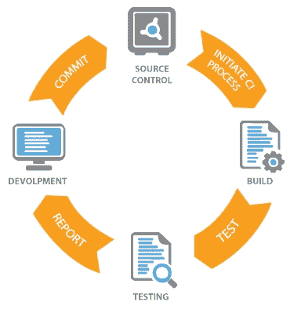
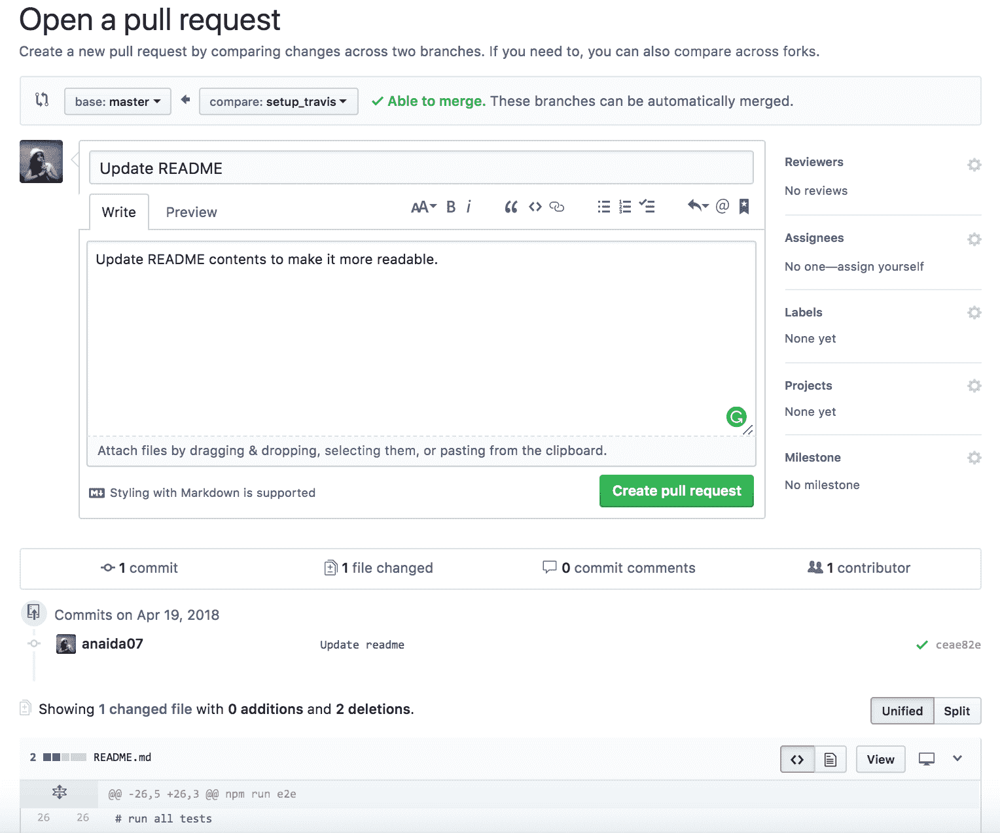
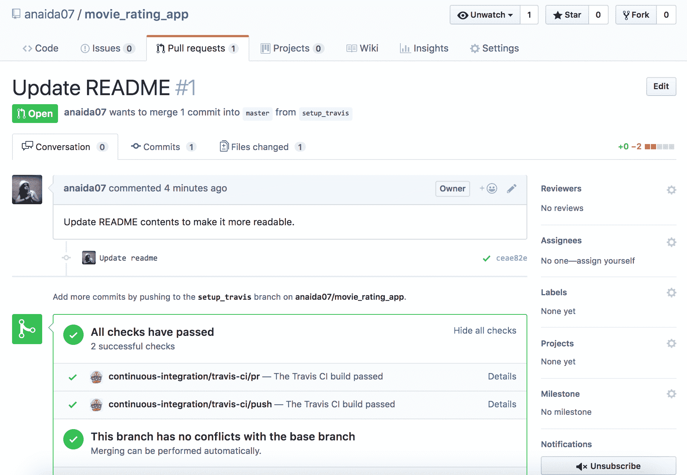
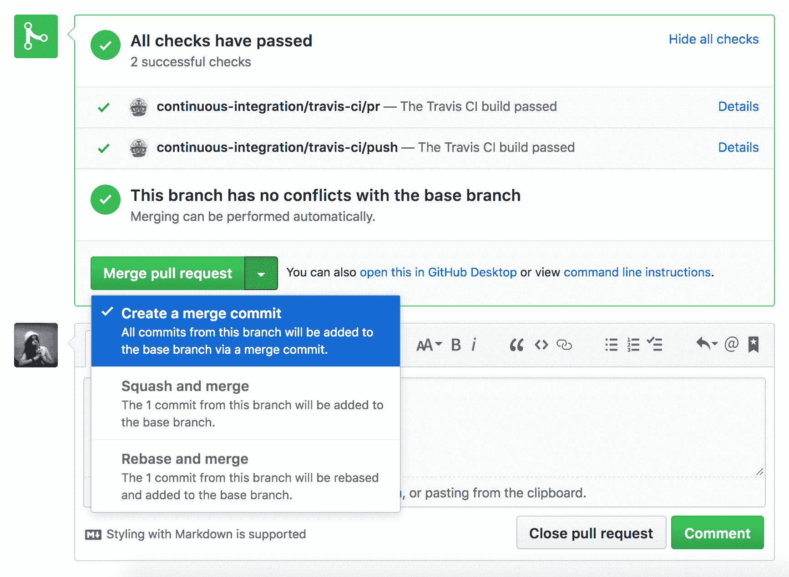
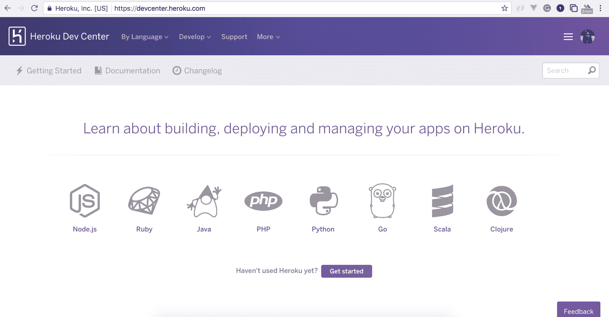
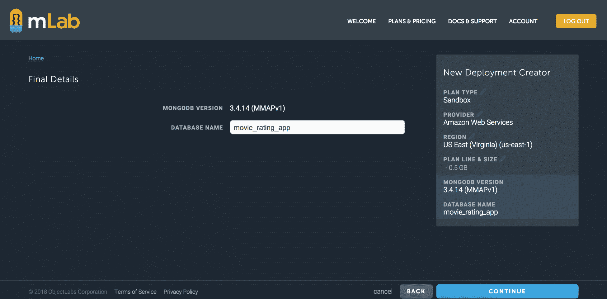
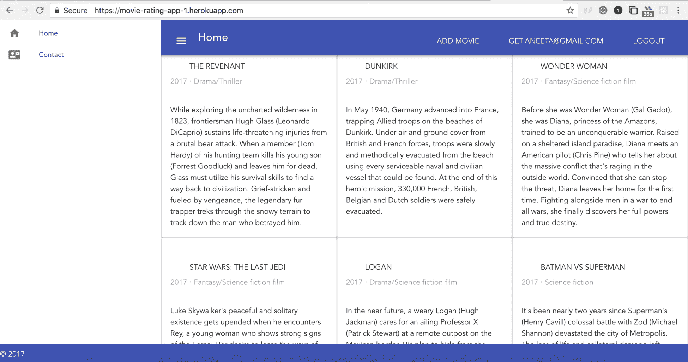

# 十、走向实时

在前一章中，我们学习了如何为应用的 Node.js 和 Vue.js 组件编写测试。 我们了解了可以使用哪些技术来测试 MEVN 应用。

在这一章中，我们将学习什么是**持续集成**(**CI**)，它如何让我们的生活更轻松，以及我们如何在 Heroku 中部署我们的应用。

# 持续集成

CI 是软件开发过程中的一种实践，在这个过程中，团队中的每个成员都要对代码进行连续的小修改，并将它们集成到原始代码库中。 每次更改后，开发人员将其推到 GitHub，测试就会在更改中自动运行。 这有助于检查更改后的代码中是否有任何错误或问题。

考虑一个场景，多个开发人员在同一个应用上工作。 每个开发人员都在独立的分支上处理不同的特性。 他们都构建特性，并为所构建的特性编写测试代码。 一切都很顺利。 然后当这些功能完成后，他们试图整合所有的功能，突然间一切都崩溃了。 测试也会失败，许多 bug 开始出现。

如果应用很小，那就不是什么大问题，因为 bug 可以很容易地修复。 但如果这是一个大项目，那就很难找出哪里出了问题，更别说解决所有问题了。 这就是 CI 的起源。

CI 的出现是为了在集成软件时减少这些风险。 CI 的原则是尽早且经常集成，这有助于在向现有代码库添加新功能的过程中尽早识别错误和问题。 因此，与其等待每个组件都完成，CI 鼓励我们构建代码库，并在提交到代码库的每一个更改上运行测试套件。

# 工作流的词

下面的图表解释了 CI 的工作原理:



在真实的场景中，多个开发人员在同一个应用上工作。 它们分别在自己的机器上工作。 当他们对代码库进行更改时，他们将其推入所使用的版本控制系统中的存储库。

现在，这个更改触发了我们已经集成到应用中的 CI 流程，以便自动运行测试套件并对我们更改的代码进行质量检查。

如果测试套件通过了，那么它将进入进一步的流程来测试整个应用，并将其移交给 qa。

但是，如果测试失败，则会通知开发人员或处理该应用的整个团队。 然后处理该更改的开发人员进行必要的更改以修复错误，提交，并将固定的代码更改推到存储库中。 同样，重复相同的过程，直到测试通过。 因此，如果有任何 bug，它们会在早期被识别并修复。

# CI 的好处

现在我们知道了什么是 CI 以及为什么我们应该使用它，让我们看看它带来的一些好处:

*   **自动构建和测试应用**:虽然期望开发人员在将更改的代码放入存储库之前构建应用并运行测试，但有时开发人员可能会忘记。 在这种情况下，集成一个持续集成过程有助于使过程自动化。
*   **有信心部署**:由于 CI 检查测试套件，我们可以对其进行配置，以检查代码库中的代码质量，因此我们无需担心在将代码推送到 GitHub 之前会忘记运行测试。
*   **简单配置**:CI 非常容易配置。 我们只需要创建一个包含所有配置的文件。
*   :这是 CI 的强大特性之一。 当在构建或运行测试时出现故障时，团队将收到通知。 它还可以提供关于谁做了什么改变的信息，这非常棒。

# 特拉维斯 CI 简介

既然我们已经了解了 CI，我们也需要开始在应用中使用它。 有几种技术可以用于遵循任何应用的 CI 过程。 有很多工具，每个都有自己的优点; 我们将为我们的应用选择的是**Travis CI**。

Travis CI 是一种用于构建 CI 服务器的技术。 Travis CI 在 GitHub 中被大量使用。 还有一些其他的工具。 其中一些是:

*   Circle 我们
*   詹金斯
*   Semaphore CI
*   无人机

如果您想了解更多关于每个选项，这里有一个很好的阅读:
[https://blog.github.com/2017-11-07-github-welcomes-all-ci-tools/。](https://blog.github.com/2017-11-07-github-welcomes-all-ci-tools/)

Travis CI 被用来构建每一个推送到 GitHub，它是非常容易设置的。

# 在应用中设置崔维斯

让我们进入设置部分。 在这里首先要做的是查看特拉维斯 CI 的官方网站[https://travis-ci.org/](https://travis-ci.org/)。

# 激活存储库

我们需要先注册，这可以很容易地用 GitHub 注册。 完成之后，您应该会看到现有存储库的列表。 选择您想要设置 Travis CI 的应用，您将能够看到以下页面:


# 指定 Node.js 版本

现在，激活要在其中添加 Travis CI 的存储库。 我们可以在概要文件中看到存储库的列表。 选择应用并单击复选标记来激活存储库中的 Travis CI。 现在，下一部分是添加配置细节。 第一件事是指定我们将用于应用的`node`版本。

在应用的根目录下创建`.travis.yml`文件:

```js
// travis.yml
language: node_js
node_js:
 - "10.0.0"
```

现在，这个代码块告诉我们这是一个 Node.js 项目，并且这个项目的 Node.js 版本是`10.0.0`。 您必须指定安装在应用中的 Node.js。 您可以通过以下方式检查版本:

```js
$ node -v 
```

中指定相同的版本。 `travis.yml`文件。

如果指定的版本不是 Node.js 的标准或可用版本，则会引发一个错误。

我们还可以指定想要在名为`.nvmrc`的文件中构建项目的 Node.js 版本。 如果`.travis.yml`文件本身没有指定版本，`travis.yml`文件将读取该文件的内容。

# 构建脚本

现在，下一部分是告诉 Travis 运行测试套件。 该部分在`.travis.yml`文件中的`script`键中指定。 Node.js 项目的默认构建脚本是`npm test`。 但是，让我们首先添加一个命令，以便在单个文件中运行，这样比较快。 更新的内容。 `travis.yml`文件如下:

```js
language: node_js
node_js:
  - "10.0.0"
script: npm run unit
```

这告诉`script`在对存储库进行任何更改时运行单元测试。

# 依赖关系管理

下一部分是安装依赖项。 默认情况下，Travis CI 不添加任何依赖项。 下面的命令告诉 Travis CI 在构建`script`之前下载依赖项。 它使用`npm`来安装依赖项，所以让我们添加一个`script`来安装这些依赖项:

```js
language: node_js
node_js:
  - "10.0.0"
before_script:
 - npm install
script: npm run unit
```

就是这样。 我们已经成功地为我们的应用配置了 Travis CI。

现在，让我们提交并推送该文件到 GitHub。 当你这样做时，检查`travis.org`上的分支，以查看所有的构建:


在这里，master 是我们添加 Travis CI 构建的分支，构建正在传递。 您可以通过单击构建来查看`master`分支的详细信息。

虽然这是一种查看构建的好方法，但最好的方法是为每个分支创建一个拉请求，并在该拉请求本身中查看构建通过或失败。 因此，让我们创建一个新的 pull request，看看如何最好地利用 Travis CI 来简化我们的工作。

让我们用下面的命令创建一个名为`setup_travis`的分支(你可以给你的分支命名任何东西，但要确保它表明了一个特定的变化，以便更容易识别该分支可以期待什么变化):

```js
$ git checkout -b setup_travis 
```

让我们对应用做一个简单的更改，以便我们的 pull 请求包含一些不同之处。

更新`README.md`文件，内容如下:

```js
# movie_rating_app

> A Vue.js project

## Build Setup

``` bash
# install dependencies
npm install

# serve with hot reload at localhost:8080
npm run dev

# build for production with minification
npm run build

# build for production and view the bundle analyzer report
npm run build --report

# run unit tests
npm run unit

# run e2e tests
npm run e2e

# run all tests
npm test
```js
```

然后，使用以下命令为更改创建`commit`:

```js
$ git add README.md
$ git commit -m 'Update readme'
```

最后，使用下面的命令将更改推到 GitHub:

```js
$ git push origin setup_travis
```

现在，如果我们进入这个应用的 GitHub 存储库页面，我们应该能够看到以下内容:


点击比较&拉请求按钮。 然后添加必要的描述，并点击 Create pull request 按钮。



一旦您创建了一个拉请求，Travis CI 将开始构建应用，随着您继续添加更多的提交和推送更改，Travis CI 将为每个提交构建应用。

虽然在我们将任何更改推到 GitHub 之前运行测试是一个很好的实践，但 Travis CI 构建有助于在每次提交时通过构建应用来通知是否有什么中断。

我们还可以添加设置，以便在构建失败或成功时通过电子邮件或任何其他机制通知我们。 默认情况下，Travis CI 会通过邮件通知我们，如下截图所示:


你可以在这里看到 Travis CI 已经成功集成，并且测试也通过了:



当我们点击 Details，我们也可以看到构建的详细日志:


一旦我们对这些变化有信心，我们可以将 pull 请求合并到 master 分支:



# Heroku 概论

开发应用的最后也是最重要的部分是部署它。 Heroku 是一种云平台服务。 它是一个云平台，我们可以在这里托管应用。 Heroku 是一种部署和管理应用的简单而优雅的方法。

有了 Heroku，我们可以部署用 Node.js 编写的应用，也可以部署其他许多编程语言，比如 Ruby、Java 和 Python。 不管使用哪种编程语言，Heroku 应用所需的设置在所有语言中都是相同的。

有几种方法可以使用 Heroku 来部署我们的应用，比如使用 Git, GitHub, Dropbox，或者通过 API。 在本章中，我们将重点介绍如何使用 Heroku 客户端部署我们的应用。

# 建立一个 Heroku 帐户

要开始在 Heroku 中部署应用，我们首先需要创建一个帐户。 您可以直接从[https://www.heroku.com/](https://www.heroku.com/)创建您的。 如果你想了解更多不同类型的应用，你可以在[https://devcenter.heroku.com/](https://devcenter.heroku.com/)查看官方文档。

一旦你创建了你的帐户，你应该能够看到你自己的仪表盘:



# 创建一个 Node.js 应用

Heroku 为我们将要构建的应用提供了许多选项。 它支持 Node.js、Ruby、Java、PHP、Python、Go、Scala 和 Clojure。 让我们继续从仪表板中选择 Node.js。

本文档本身将指导您执行每个步骤。 让我们继续在 Heroku 中部署我们自己的应用。

# Installing Heroku

首先要做的是安装 Heroku。

# Windows 下安装 Heroku

我们可以通过从官方页面[https://devcenter.heroku.com/articles/heroku-cli#download-and-install](https://devcenter.heroku.com/articles/heroku-cli#download-and-install)下载安装程序，并运行安装程序在 Windows 上安装 Heroku。

# Linux 下安装 Heroku

Heroku 可以在 Linux 下安装，只需一条命令:

```js
$ wget -qO- https://cli-assets.heroku.com/install-ubuntu.sh | sh
```

# 在 macOS X 中安装 Heroku

我们可以使用`homebrew`在 macOS 中安装 Heroku:

```js
$ brew install heroku/brew/heroku
```

我们可以使用以下命令检查是否安装了`Heroku`:

```js
$ heroku -v
```

这应该打印我们刚刚安装的 Heroku 版本。

# 部署到 Heroku

一旦安装好 Heroku，让我们进入`https://dashboard.heroku.com/apps`，在那里我们将为我们的项目创建一个 Heroku 应用。 单击 Create New App 按钮并输入要提供给应用的应用名称。 我们将为我们的应用命名`movie-rating-app-1`:


这将创建一个 Heroku 应用。 现在，让我们切换到终端中的应用，并运行以下命令:

```js
$ cd movie_rating_app
$ heroku login
```

这个命令会提示你输入你的电子邮件和密码:


现在，如果你已经在你的应用中初始化了一个 Git 仓库，你可以跳过下面代码片段中的`git init`部分:

```js
$ git init
$ heroku git:remote -a movie-rating-app-1
```

这个命令将把我们的应用链接到我们刚刚创建的 Heroku 应用。

设置部分已经完成。 现在，我们可以继续在应用中进行一些更改。 按照我们一直在做的方式提交 GitHub 回购，并推动更改。

现在，要部署到 Heroku 应用的简单命令是运行以下命令:

```js
$ git push heroku master
```

这里有几件事我们需要处理。

因为我们是通过使用`server.js`中的`serve-static`包将 Vue.js 组件转换为静态文件来提供服务的，所以我们需要更新`package.json`中的启动脚本来运行`node`服务器。 让我们在`package.json`中用下面的行来更新开始脚本:

```js
"scripts": {
    "dev": "webpack-dev-server --inline --progress --config build/webpack.dev.conf.js",
    "start": "nodemon server.js",
    "unit": "cross-env BABEL_ENV=test karma start test/unit/karma.conf.js --single-run",
    "e2e": "node test/e2e/runner.js",
    "test": "npm run unit && npm run e2e",
    "lint": "eslint --ext .js,.vue src test/unit test/e2e/specs",
    "build": "node build/build.js",
    "heroku-postbuild": "npm install --only=dev --no-shrinkwrap && npm run build"
  },
```

同样，在`config/Config.js`文件中，我们有以下内容:

```js
module.exports = {
  DB: 'mongodb://localhost/movie_rating_app',
  SECRET: 'movieratingappsecretkey',
  FACEBOOK_APP_ID: <facebook_client_id>,
  FACEBOOK_APP_SECRET: <facebook_client_secret>,
  TWITTER_APP_ID: <twitter_consumer_id>,
  TWITTER_APP_SECRET: <twitter_consumer_secret>,
  GOOGLE_APP_ID: <google_consumer_id>,
  GOOGLE_APP_SECRET: <google_consumer_secret>,
  LINKEDIN_APP_ID: <linkedin_consumer_id>,
  LINKEDIN_APP_SECRET: <linkedin_consumer_secret>
}
```

这里，我们指定了本地 MongoDB URL，当我们在 Heroku 中托管我们的应用时，它将无法工作。 为此，我们可以使用一个名为**mLab**的工具。 mLab 是 MongoDB 的数据库服务工具。 mLab 允许我们为沙箱数据库创建任意数量的数据库。

让我们继续在[https://mlab.com/](https://mlab.com/)上创建一个帐户。 一旦你登录，点击 Create new 按钮来创建一个新的数据库:


我们可以选择任何我们想要的云提供商。 选择计划类型为 Sandbox 并单击 CONTINUE。 选择任何区域，然后单击 CONTINUE 并为应用添加所需的数据库名称。 最后，点击提交订单:



现在，如果我们点击数据库名，我们可以看到 mLab 提供的 MongoDB URL 的链接。 我们还需要创建一个能够对数据库进行认证的数据库用户。

转到 Users 选项卡，单击 Add Database User，提供用户名和密码，然后单击 Create。

我们应该能够看到 MongoDB 的 URL 在数据库配置文件页面:


让我们更新 MongoDB 的 URL 在我们的`config/Config.js`:

```js
module.exports = {
  mongodb://<dbuser>:<dbpassword>@ds251849.mlab.com:51849/movie_rating_app
  SECRET: 'movieratingappsecretkey',
  FACEBOOK_APP_ID: <facebook_client_id>,
  FACEBOOK_APP_SECRET: <facebook_client_secret>,
  TWITTER_APP_ID: <twitter_consumer_id>,
  TWITTER_APP_SECRET: <twitter_consumer_secret>,
  GOOGLE_APP_ID: <google_consumer_id>,
  GOOGLE_APP_SECRET: <google_consumer_secret>,
  LINKEDIN_APP_ID: <linkedin_consumer_id>,
  LINKEDIN_APP_SECRET: <linkedin_consumer_secret>
}
```

我们需要更改的最后一件事是应用的端口。 Heroku 应用在部署应用时自动分配端口。 我们应该只使用开发环境的端口`8081`。 因此，让我们验证一下我们的`server.js`是否有以下代码:

```js
const port = process.env.PORT || 8081;
app.use('/', router);
var server = app.listen(port, function() {
  console.log(`api running on port ${port}`);
});

module.exports = server
```

现在，让我们提交并推送这些更改到`master`，然后再次部署:

```js
$ git add package.json config/Config.js server.js
$ git commit 'Update MongoDB url and app port'
$ git push origin master
$ git push heroku master
```

应用应该成功部署到 Heroku，我们应该能够在[https://movie-rating-app-1.herokuapp.com/](https://movie-rating-app-1.herokuapp.com/)查看我们的应用:



# Heroku 错误日志

如果在 Heroku 中部署时出现错误，我们也可以通过下面的命令查看 Heroku 提供的错误日志:

```js
$ heroku logs -t
```

# 总结

在本章中，我们了解了什么是 CI，以及如何使用它在应用中实现自动构建。 我们还学习了如何使用 Heroku 集成来部署应用。 总之，我们学习了如何使用 Vue.js 和 Node.js 技术来构建一个完整的 web 应用，我们集成了一个不同的认证机制，我们还学习了如何为应用编写测试和部署应用。 恭喜你!

这只是你们未来旅程的开始。 现在，您应该能够使用我们在这里学到的所有技术创建小型到大型的应用。

本书向您提供了使用 JavaScript 作为使用 MEVN 堆栈的唯一编程语言来构建应用的技巧。 如果您打算构建自己的完整应用，那么这是一个很好的开始。 我希望您喜欢这本书，并希望您能够继续构建出色的应用!