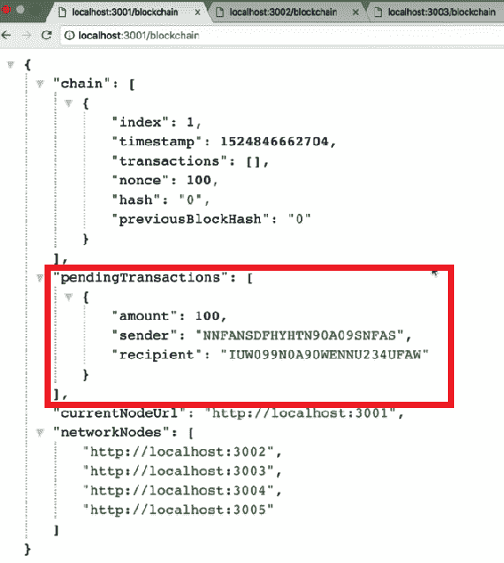
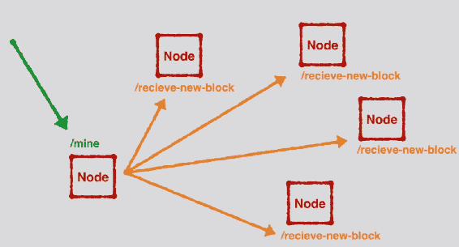
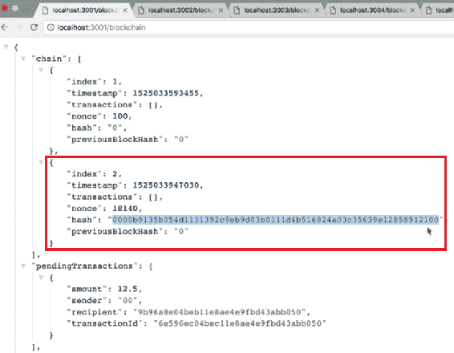
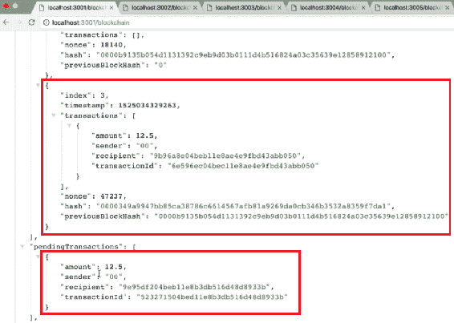
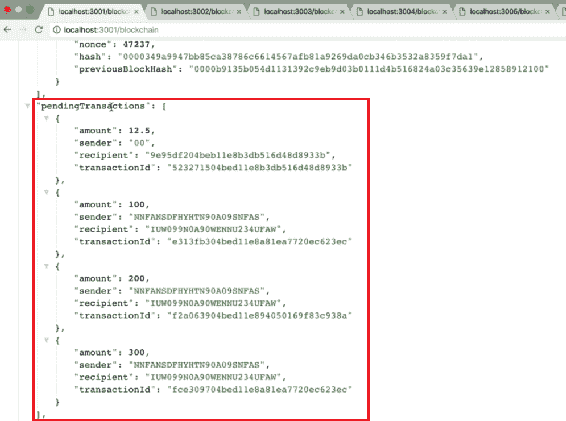
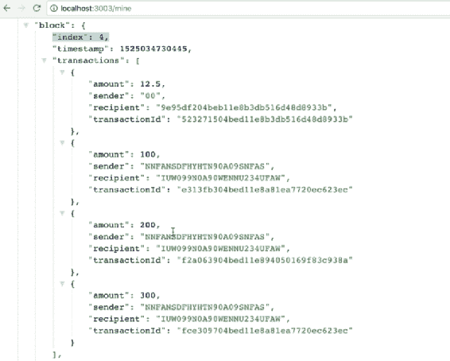

Unknown 

# 同步网络

在前面的章节中，我们构建了一个由五个节点组成的网络。每个节点都知道网络中的所有其他节点，从而创建了一个分散的区块链网络。我们现在需要创建一个同步网络，这样每个节点上的区块链都是相同的，数据在整个过程中是一致的。我们负担不起在不同节点上运行不同版本的区块链，因为这将彻底破坏拥有区块链的目的。每个节点上应该只有一个版本的区块链是一致的。因此，在本章中，让我们同步我们在[第 4 章](4.html)中构建的网络，*创建一个分散的区块链网络*。我们将通过广播在网络中所有节点上挖掘的事务和新块来实现这一点。

本章将介绍以下主题：

*   了解同步网络的必要性
*   构建`/transaction/broadcast`端点
*   重构`createTransaction`方法和`/transaction`端点
*   测试事务端点
*   更新挖掘信息
*   构建`/receive-new-block`端点
*   测试新的和更新的`/mine`端点

让我们开始同步网络

# 了解同步网络的必要性

让我们试着理解为什么网络需要同步。区块链网络目前由五个分散的节点组成。这些节点之间的数据不一致；每个节点上的数据可能会有所不同，这将导致无法实现区块链的目的。让我们通过一个例子来尝试了解这种情况。转到 Postman 并发送一个示例事务，如以下屏幕截图所示：


点击发送按钮，将此事务发送到`localhost:3001`上托管的节点。此交易将出现在`localhost:3001/blockchain`的`pendingTransactions`数组中，您可以在下面的屏幕截图中看到：



现在，转到任何其他节点并检查发送的事务。我们将无法查看这些节点上的`pendingTransactions`数组中的事务。发送的示例事务将仅出现在`localhost:3001`上的节点中。它不会广播到网络中的任何其他节点

在本章中，您将要做的是重构`/transaction`端点，以便无论何时创建事务，它都会广播到所有节点。这意味着所有节点将拥有相同的数据。我们需要做同样的事情来挖掘一个块。让我们重构`/mine`端点，这样每当挖掘新块时，它也会在整个网络中广播。这意味着整个网络是同步的，并且具有完全相同的块数。通过网络同步数据是区块链技术的一个重要特征

# 重构 createNewTransaction 方法和/事务端点

在本节中，让我们通过将`createNewTransaction`方法拆分为两个单独的部分来重构它。一部分将简单地创建一个新事务，然后返回该事务，另一部分将新事务推送到`pendingTransactions`数组中。我们将通过为其创建一个单独的方法来完成后一部分。我们还创建了一个名为`/transaction/broadcast`的新事务端点。该端点将允许我们在整个区块链网络中广播交易，以便每个节点都有相同的数据，从而使整个网络同步。

# 对 createNewTransaction 方法的修改

在这里，我们将`createNewTransaction`方法分成两个单独的方法，修改如下：

1.  转到您的`dev/blockchain.js`文件中的`createNewTransaction`方法，我们在[第二章](2.html)中构建了该方法，在*创建 createNewTransaction 方法*一节中*构建区块链*中构建了该方法，请参考以下`createNewTransaction`方法：

```js
Blockchain.prototype.createNewTransaction = function (amount, sender, recipient) {
    const newTransaction = {
        amount: amount,
        sender: sender,
        recipient: recipient,
    };
    this.newTransactions.push(newTransaction);
    return.this.getlastBlock() ['index'] + 1;
}
```

2.  让我们对该方法进行以下突出显示的修改：

```js
Blockchain.prototype.createNewTransaction = function (amount, sender, recipient) {
    const newTransaction = {
        amount: amount,
        sender: sender,
        recipient: recipient,
        transactionId: uuid().split('-').join('')
    };
    return newTransaction;
}
```

在这里，每个事务都会添加一个 ID。为了创建这个 ID，使用了一个唯一的字符串，这非常类似于我们在[第 3 章](3.html)、*中通过 API 访问区块链时创建节点地址所使用的字符串。*

3.  ID 的唯一字符串是使用`uuid`库创建的。因此，在定义了所有常量的`dev/blockchain.js `文件的开头，您需要添加以下代码行，以便在我们的项目中使用`uuid`库：

```js
const uuid = require('uuid/v1');
```

在修改后的方法中，您可以看到添加了以下代码行以为`transactionId`值创建唯一的字符串。这就是使用`uuid`库的地方：

```js
transactionId: uuid().split('-').join('')
```

这里，`.split()`函数将去掉添加到唯一字符串中的破折号，`.join()`函数将重新连接字符串，为每个事务提供唯一的`Id`输出

# 构建 addTransactionToPendingTransactions 方法

接下来，我们需要推送返回到区块链`pendingTransactions`阵列的`newTransaction`。因此，让我们创建另一个方法，称为`addTransactionToPendingTransactions`：

1.  在`dev/blockchain.js`文件中，将`addTransactionToPendingTransactions`方法定义如下：

```js
Blockchain.prototype.addTransactionToPendingTransactions = function(transactionObj) {
};
```

2.  接下来，将`transactionObj`推到区块链的`pendingTransactions`阵列：

```js
Blockchain.prototype.addTransactionToPendingTransaction = function(transactionObj) {
    this.pendingTransactions.push(transactionObj);

};
```

3.  然后，我们只想返回添加了事务的块的索引：

```js
Blockchain.prototype.addTransactionToPendingTransaction = function(transactionObj) {
    this.pendingTransaction.push(transactionObj);
    return this.getLastBlock()['index'] + 1;
};
```

为了快速回顾，我们修改了`createNewTransaction`方法，该方法创建一个新事务，并返回该新事务。然后我们创建了一个新方法，名为`addTransactionToPendingTransactions`。此方法接收一个`transactionObj`并将其添加到区块链上的`pendingTransactions`阵列中。之后，我们只返回添加了新事务的块的索引。

# 构建/事务/广播端点

在本节中，让我们构建一个名为`/transaction/broadcast`的新端点。从现在开始，任何时候我们想要创建一个新事务，我们都将访问这个`/transaction/broadcast`端点。该端点将完成两件事：

*   它将创建一个新事务。
*   然后，它将向网络中的所有其他节点广播该新事务。

让我们通过以下步骤来创建端点：

1.  要添加此端点，请转到`dev/networkNode.js`文件，我们在其中定义了所有端点，并按如下方式添加此新端点：

```js
app.post('/transaction/broadcast', function(req, res) )  {

});
```

2.  然后，为了让端点执行上述功能，向端点添加以下突出显示的代码：

```js
app.post('/transaction/broadcast', function(req, res) )  {
    const newTransaction = bitcoin.createNewTransaction();

});
```

此处的`createNewTransaction()`方法是上一节中的修改方法。

3.  `createNewTransaction()`方法采用`amount`、`sender`和`recipient`参数。对于我们的端点，假设所有这些数据都是通过`req.body`发送的。因此，这些参数将定义为以下代码中突出显示的参数：

```js
app.post('/transaction/broadcast', function(req, res) )  {
    const newTransaction = bitcoin.createNewTransaction(req.body.amount, req.body.sender, req.body.recipient);

});
```

4.  接下来，让我们借助`addTransactionToPendingTransactions`方法将`newTransaction`变量添加到节点上的`pendingTransactions`数组中。因此，在前一行代码之后，添加以下行：

```js
bitcoin.addTransactionToPendingTransactions (newTransaction);
```

5.  现在，将新事务广播到网络中的所有其他节点。这可以通过以下方式完成：

```js
bitcoin.netowrkNodes.forEach(networkNodeUrl => {
    //...
});
```

6.  在这个`forEach`循环中，让我们定义用于广播事务的代码。为此，向网络中所有其他节点上的`/transaction`端点发出请求。因此，请为这些请求定义一些选项。在循环内部，让我们添加以下行：

```js
const requestOptions = {

};
```

7.  然后，定义我们的所有选项，如下所示：

```js
const requestOptions = {
    uri: networkNodeUrl + '/transaction',
 method: 'POST',
 body: newTransaction,
 json: true
};
```

8.  接下来，让我们创建一个承诺数组，将所有请求推送到该数组中，以便可以同时运行所有请求。让我们在`forEach`循环之前定义数组，如下所示：

```js
const requestPromises = []; 
```

9.  然后，在定义所有选项后，按如下方式发出请求：

```js
requestPromises.push(rp(requestOptions));
```

在前面这行代码中，我们将把所有请求推送到`requestPromises`数组中。在`forEach`循环运行之后，我们应该拥有`requestPromises`数组中定义的所有请求。

10.  接下来，让我们运行所有请求。在`forEach`循环之后，添加以下行：

```js
promise.all(requestPromises)
```

11.  最后，在所有请求运行之后，我们将添加以下行：

```js
.then(data => {

});
```

12.  我们实际上不会使用所有这些请求返回的数据，但我们会发送一个响应，因为此时，整个广播已经完成。因此，在前面的代码块中，添加以下突出显示的代码：

```js
.then(data => {
    res.json({ note: 'Transaction created and broadcast successfully.'})
});
```

通过添加前一行代码，我们成功地完成了构建`/transaction/broadcast`端点的工作。

# 重构/事务端点

我们将在本节中重构`/transaction`端点，使其与新的`/transaction/broadcast`端点完美配合。让我们应用以下步骤来修改端点：

1.  要开始，请转到`dev/networkNode.js`文件并删除`/transaction`端点中的所有内容。只有在广播发生时才会命中`/transaction`端点。当命中`/transaction`端点时，`newTransaction`变量将作为数据发送。该条件可定义如下：

```js
app.post('/transaction', function(req, res) {
    const newTransaction = req.body;

};
```

在前面突出显示的行中，`newTransaction`变量在`req.body`的帮助下发送到`/transaction`端点

2.  接下来，将新事务添加到接收调用的节点的`pendingTransactions`数组中。为此，将使用新的`addTransactionToPendingTransactions`方法。因此，在前一行代码之后，添加以下行：

```js
bitcoin.addTransactionToPendingTransactions();
```

3.  此方法仅接收接收到的`newTransaction`变量：

```js
bitcoin.addTransactionToPendingTransactions(newTransaction);
```

4.  现在，通过`addTransactionToPendingTransactions`方法，我们得到了将添加事务的块的索引。让我们将此块索引保存在新的`/transaction`端点中。在前一行代码的开头添加变量，如下所示：

```js
const blockIndex = bitcoin.addTransactionToPendingTransactions(newTransaction);
```

5.  最后要做的是发回回复。在前一行之后，添加以下内容：

```js
res.json({ note: 'Transaction will be added in block ${blockIndex}.'});
```

我们现在已经完成了对`/transaction`端点的重构

# 测试事务端点

让我们测试`/transaction/broadcast`和`/transaction`端点，以确保它们一起正确工作。

对于这个测试，我们需要做的第一件事是将所有节点连接在一起，形成一个网络。您可能还记得如何做到这一点，正如我们在[第 4 章](4.html)*创建分散的区块链网络*中了解到的。无论如何，我们将快速完成这些步骤，以刷新您的记忆。

# 重述如何创建网络

查看以下步骤以了解如何连接所有节点：

1.  去找邮递员，走`/register-and-broadcast-node`路线。这可以在任何节点上完成。在我们的示例中，让我们使用`localhost:3001`。
2.  现在，在主体内部，我们希望通过传递 URL 向网络添加一个新节点。让我们从第二个节点开始。请看以下屏幕截图：


3.  然后，单击 Send 按钮发送请求。发送请求后，您将收到一个响应，表示新节点已成功注册到网络。您可以以相同的方式发送所有剩余节点。
4.  要验证所有节点是否正确连接以形成网络，请转到浏览器，在地址栏中键入`localhost:3001/blockchain`，然后按*回车*。您将看到`networkNodes`数组中的所有节点

# 测试事务端点

现在区块链网络已经建立，让我们测试一下我们在前面几节中创建的端点

让我们创建一个事务并将其发送到`/transaction/broadcast`端点。返回 Postman 并点击节点上的`/transaction/broadcast`端点，该节点位于端口`3001`上。在此，将一些数据作为事务发送，如以下屏幕截图所示：


您正在发送的事务数据可以是任何随机数据。我们所需要的只是金额、发件人和收件人。添加事务数据后，让我们通过单击发送按钮发送此请求。如果事务发送成功，将收到一个响应，显示事务创建并广播成功。

现在，转到浏览器，您应该能够看到我们在网络的每个节点上创建的事务。让我们检查一下这是否有效。在浏览器的地址栏中，键入`localhost:3001/blockchain`，然后按*输入*。您应该可以看到`pendingTransactions`数组中的事务数据，如下图所示：


这里，`pendingTransactions`数组中的事务现在也有一个`transactionId`值，该值以随机散列开始。

接下来，打开另一个选项卡，在地址栏中键入`localhost:3002/blockchain`，然后按*进入*。您可以看到，在阵列中可以看到相同的事务数据：


如果转到网络中的其他节点，则可以对所有剩余节点执行类似的检查。您可以在每个节点的`pendingTransactions`数组中观察到相同的事务数据。区块链网络中的每个节点现在都知道创建了一个新的交易。

您也可以尝试使用其他事务数据测试端点。尝试将金额更改为`500`，将发送方和接收方的地址更改为随机哈希字符串，并尝试将此请求发送到托管在`localhost:3004`上的节点。这应该没有什么区别，因为广播端点将事务数据发送到网络中的所有节点。因此，这个请求应该与上一个请求一样工作。在浏览器上检查响应时，您应该能够看到具有不同事务 ID 的两个事务

Try experimenting with different transaction data to gain a clear understanding of how the `/transaction` and `/transaction/broadcast` endpoints work. 

从测试中，我们可以得出结论，`/transaction/broadcast`端点和`/transaction`端点都像我们预期的那样正常工作

在下一节中，我们将通过重构`/mine`端点来继续同步网络，这样它将向整个网络广播创建的新块。

# 更新挖掘信息

同步网络所需的下一件事是更新`/mine`端点。我们还将添加一个新端点，称为`/receive-new-block`。需要更新`/mine`端点，以便每当节点创建新块时，该新块将广播到网络中的所有其他节点。这意味着网络上的每个节点都知道已创建了一个新块，并且承载区块链的所有节点保持同步。

# 更新的采矿过程

无论何时挖掘新块，都将在特定节点上进行挖掘。为了理解更新的挖掘过程，假设我们需要一个托管在端口`3001`上的节点为区块链挖掘一个新块：

1.  首先，在所选节点上点击`/mine`端点。当到达`/mine`端点时，通过工作证明创建一个新块。

2.  创建新块后，它将广播到网络中的所有其他节点。所有其他节点将在其`/receive-new-block`端点接收该新块，如下图所示：



3.  广播完成后，整个网络将同步，所有节点将承载相同的区块链

另一件需要注意的事情是，当一个新块被广播并且一个节点接收到它时，在链验证该块是合法的之后，该新块将被添加到链中。然后，节点清除其`pendingTransactions`数组，因为所有挂起的事务现在都在它们刚刚接收到的新块中。

在接下来的几节中，我们将逐步构建整个流程。当我们构建这些步骤中的每一步时，应该更容易看到所有东西是如何协同工作的。

# 重构/挖掘端点

让我们通过实现以下步骤重构`/mine`端点：

1.  前往`dev/networkNode.js`档案。在`/mine`端点中，在定义`newBlock`变量的部分下面，让我们添加将新块广播到网络中所有其他节点的功能。要做到这一点，请遵循我们在前面章节中介绍的相同过程，即循环网络中的所有其他节点，向节点发出请求，并将`newBlock`变量作为数据发送：

```js
bitcoin.networkNodes.forEach(networkNodeUrl => {

})
```

前一行提到，对于每个`networkNodes`，我们将发出请求并发送`newBlock`

2.  然后我们需要一些请求选项来发送。这些选项的定义如下：

```js
bitcoin.networkNodes.forEach(networkNodeUrl => {
    const requestOptions = {

 }; 

})
```

3.  此对象中的第一个选项是`uri`。我们要向其发送请求的`uri`将是`networkNodeUrl`和我们要创建的新端点，即`/receive-new-block`。我们将在下一节中研究此端点：

```js
bitcoin.networkNodes.forEach(networkNodeUrl => {
    const requestOptions = {
        uri: networkNodeUrl + '/receive-new-block',   
    }; 

})
```

4.  下一个要添加的选项是将要使用的方法，即`POST`方法：

```js
bitcoin.networkNodes.forEach(networkNodeUrl => {
    const requestOptions = {
        uri: networkNodeUrl + '/receive-new-block', method: 'POST',   
    }; 

})
```

5.  接下来，让我们一起发送身体内部的数据。我们还想发送一个`newBlock`实例：

```js
bitcoin.networkNodes.forEach(networkNodeUrl => {
    const requestOptions = {
        uri: networkNodeUrl + '/receive-new-block',method: 'POST',        body: { newBlock: newBlock }
    }; 

})
```

6.  最后，在`body`之后，将`json`设置为`true`，如下所示：

```js
bitcoin.networkNodes.forEach(networkNodeUrl => {
    const requestOptions = {
        uri: networkNodeUrl + '/receive-new-block',method: 'POST',       body: { newBlock: newBlock },
        json: true
    }; 

})
```

7.  之后，通过添加以下突出显示的代码行发出请求：

```js
bitcoin.networkNodes.forEach(networkNodeUrl => {
    const requestOptions = {
        uri: networkNodeUrl + '/receive-new-block',method: 'POST',       body: { newBlock: newBlock },
       json: true
    }; 
    rp(requestOptions)
})
```

8.  每次提出一个这样的请求，它都会回复一个承诺。让我们通过添加以下突出显示的代码来创建所有这些承诺的数组：

```js
const requestPromises = [];
bitcoin.networkNodes.forEach(networkNodeUrl => {
    const requestOptions = {
        uri: networkNodeUrl + '/receive-new-block',method: 'POST',       body: { newBlock: newBlock },
       json: true
    }; 
    requestPromises.push(rp(requestOptions));
});
```

在`forEach`循环运行之后，我们应该有一个充满承诺的数组。

9.  接下来，让我们运行所有这些承诺。因此，在`forEach`块之后，添加以下代码：

```js
Promise.all(requestPromises)
.then(data => {
    // ....
})
```

在所有请求运行后，我们希望在`.then(data => {    })`内进行另一次计算。如果您还记得，当创建新交易时，挖掘奖励交易代码`bitcoin.createNewTransaction(12.5, "00" , nodeAddress);`需要在整个区块链网络中广播。此时，当挖掘一个新块时，我们创建一个挖掘奖励事务，但它不会广播到整个网络。要广播它，请求将被发送到`/transaction/broadcast`端点，因为它已经具有广播事务的功能。我们将使用传入的挖掘奖励事务数据调用此端点。

10.  但是，在传递挖掘奖励交易数据之前，我们需要一些请求选项：

```js
Promise.all(requestPromises)
.then(data => {
    const requestOptions = {
 uri: bitcoin.currentNodeUrl + '/transaction/broadcast',
 method: 'POST',
    };    

})
```

11.  `body`数据将作为对象发送。在`body`中，我们添加挖掘奖励交易数据：

```js
Promise.all(requestPromises)
.then(data => {
    const requestOptions = {
        uri: bitcoin.currentNodeUrl + '/transaction/broadcast',
        method: 'POST',
        body: {
 amount: 12.5, 
 sender:"00", 
 recipient: nodeAddress
 }
    };    

})
```

12.  最后，在`body`之后，通过添加以下行将`json`设置为`true`：

```js
json: true
```

13.  然后，在`requestOptions`之后，我们发送以下请求：

```js
return rp(requestOptions);
```

此时，在`/mine`端点内，正在进行一系列计算以创建新块。然后，一旦创建了新的块，它将被广播到网络中的所有其他节点。在`.then`块内的广播完成后，向`/transaction/broadcast`端点发出新的请求。此请求将创建挖掘奖励交易，然后节点将其广播到整个区块链网络。然后，在请求运行且所有计算完成后，发送响应：New block mined successfully。

You can view the complete updated mine endpoint code at [https://github.com/PacktPublishing/Learn-Blockchain-Programming-with-JavaScript/blob/master/dev/networkNode.js](https://github.com/PacktPublishing/Learn-Blockchain-Programming-with-JavaScript/blob/master/dev/networkNode.js).

# 构建/接收新块端点

我们要做的下一件事是构建我们在更新的`/mine`端点中使用的`/receive-new-block`端点。让我们开始构建端点：

1.  在`dev/networkNode.js`文件中，在`/register-and-broadcast-node`端点之前，定义`/receive-new-block`端点如下：

```js
app.post('/receive-new-block', function(req, res) {
};
```

2.  在此端点内，代码期望接收正在广播的新块。让我们将新块保存在变量中，如以下代码中突出显示的那样：

```js
app.post('/receive-new-block', function(req, res) {
    const newBlock = req.body.newBlock;

};
```

3.  当所有其他节点接收到这个新块时，它们需要检查它是否实际上是一个真正的块，以及它是否正确地嵌入到链中。为了验证这一点，检查`newBlock`上的`previousBlockHash`以确保它等于链中最后一个块上的哈希值。为此，需要访问链中的最后一个块：

```js
app.post('/receive-new-block', function(req, res) {
    const newBlock = req.body.newBlock;
   const lastBlock = bitcoin.getLastBlock(); 
};
```

4.  接下来，我们测试链中最后一个块的哈希值是否等于`newBlock`实例中的`previousBlockHash`：

```js
  lastBlock.hash === newBlock.previousBlockHash; 
```

5.  这样，我们知道这个`newBlock`确实紧跟在链中的`lastBlock`之后。前面定义的语句将返回`true`或`false`。`true`或`false`值将保存在`correctHash`变量中：

```js
const correctHash = lastBlock.hash === newBlock.previousBlockHash;
```

6.  在前面的检查之后，我们还要确保`newBlock`具有正确的索引。这意味着`newBlock`应该是链中`lastBlock`之上的一个索引。添加以下复选框：

```js
const correctIndex = lastBlock['index'] + 1 === newBlock['index'];
```

7.  接下来，根据`newBlock`是否合法，需要采取两种不同的行动。如果`newBlock`合法，则应接受并添加到链中。如果它不应该被拒绝，那么它就应该被拒绝。为了定义这个条件，让我们使用一个`if`-`else`语句：

```js
if (correctHash && correctIndex) {
    bitcoin.chain.push(newBlock);

}
```

8.  现在，由于`newBlock`已添加到链中，`pendingTransactions`数组需要清除，因为挂起的事务现在位于新块中。因此，在`if`语句中，需要添加的下一个条件如下：

```js
bitcoin.pendingTransaction = [];
```

9.  然后，需要做的最后一件事是发回一个响应，表示该块已被接受并添加到链中。在`if`语句中，在前一行下方添加响应，如下所示：

```js
res.json({
    note: 'New block received and accepted.',
    newBlock: newBlock
})
```

10.  如果`newBlock`不合法且未通过前面定义的任何一项测试，则在`else`语句中发送一个响应，指示该块被拒绝：

```js
else{
  res.json({
      note:'New block rejected.',
      newBlock: newBlock
  });  
}
```

加上前面的条件，我们已经完成了`/receive-new-block`端点的构建。

# 测试新的和更新的/挖掘的端点

让我们测试更新的`/mine`端点和我们刚刚创建的`/receive-new-block`端点。基本上，`/mine`端点将为我们挖掘新块。它还将获取该块并在整个区块链网络中广播，以便每个节点都是同步的，并且所有节点都具有相同的块和相同的数据。这是我们在测试`/mine`终点时预期观察到的结果：

1.  要开始，您应该让所有五个节点都运行。您还应该将它们连接在一起以创建区块链网络
2.  接下来，转到浏览器。这里要做的第一件事是选择一个节点来挖掘新块。我们有五个节点可供选择，但在本例中，我们将只使用第一个节点。因此，在地址栏中键入`localhost:3001/mine`，然后点击*输入*。您将获得如下输出：


看起来矿井的端点工作得很好。响应表明新块已成功挖掘和广播。您还可以在前面的屏幕截图中看到新块及其索引

3.  让我们验证新块是否已添加到网络中。首先，在第一个节点上验证它。在浏览器中，打开另一个选项卡，在地址栏中键入`localhost:3001/blockchain`，然后按*进入*。您可以看到，新块已添加到网络中，如下所示：



在前面的屏幕截图中，您可能还注意到`pendingTransactions`数组中存在一些事务。这个挂起的事务实际上是我们刚刚挖掘的块的挖掘奖励。更新后的`/mine`端点定义在创建新块后应广播挖掘奖励事务。

从现在开始，每当创建一个新的区块时，该区块的采矿奖励将进入`pendingTransactions`数组并添加到下一个区块。这就是挖掘奖励在比特币区块链中的工作方式。当我们在前两章中首次创建区块链时，我们将挖掘奖励放在我们挖掘的区块中。现在区块链更加先进，我们有了一个分散的网络，我们必须遵循最佳实践，并将采矿奖励投入下一个区块。

让我们回到`/mine`端点，继续测试。让我们检查网络中的其他节点，并验证挖掘的新块是否添加到这些节点。另外，让我们检查生成的挖掘奖励是否也广播到网络中的其他节点。

打开另一个选项卡，在地址栏中键入`localhost:3002/blockchain`，然后按*进入*。您将看到以下输出：


在前面的屏幕截图中，您可以看到端口`3002`上的节点收到了新挖掘的块以及挖掘奖励事务。您可以为网络中的其余节点验证这一点

现在让我们从另一个节点挖掘另一个块。在浏览器的地址栏中输入`localhost:3004/mine`而不是进入`localhost:3001`，然后按*进入*。新区块将被开采；输出如下所示：


从前面的屏幕截图中，您可以看到这是第三个块。这是正确的，因为我们已经开采了两个区块。在该区块的`transactions`阵列中，您可以看到我们获得了上一个区块的采矿奖励。此事务是端口`3001`上的节点挖掘上一个块时生成的挖掘奖励。

让我们转到`localhost:3001/blockchain`并验证我们刚刚挖掘的这个新区块是否已添加到网络中。您将看到以下响应：



在此屏幕截图中，您可以观察到已挖掘的新块已添加到托管在`3001`上的节点。此块的事务数组由上一块的挖掘奖励组成。我们现在在`pendingTransactions`数组中还有一个新的采矿奖励，它是在第三个区块被开采时生成的。按照之前使用的类似验证过程，您可以检查我们挖掘的第三个块是否已添加到所有剩余节点

从这些测试来看，`/mine`端点似乎正常工作。它正在创建新的区块，并向整个网络广播。这意味着整个网络是同步的，并且具有完全相同的区块链数据，这对于区块链正常工作非常重要。

让我们进一步测试端点。前往邮递员处，创建两个交易，然后广播它们。之后，让我们挖掘一个新区块，看看新交易是否已正确添加到区块链中：

1.  立即转到您的邮递员，创建以下交易：


2.  接下来，为了广播事务，点击`/transaction/broadcast`端点。您可以将此事务数据发送到任何节点，并将其广播到整个网络。在我们的示例中，让我们将此事务发送到端口`3002`上的节点：


3.  现在，点击发送按钮。当事务创建并成功广播时，您将收到一个响应。

您也可以尝试进行其他交易，就像我们以前做的那样，通过更改金额值以及发件人和收件人的地址。另一个测试是将事务数据发送到不同的节点

4.  现在让我们回到浏览器并检查节点，以验证它们是否都已收到我们刚刚创建的事务。我们之前在浏览器中加载了节点`3001`，现在让我们刷新它。您应该获得以下输出：



从前面的屏幕截图中，您可以看到该节点拥有我们创建的所有三个事务，加上它拥有`pendingTransactions`数组中前一个块的挖掘奖励。类似地，您可以验证剩余节点的`pendingTransaction`数组。因此，我们可以得出结论，我们创建的所有事务都可以完美地广播到整个网络

现在，让我们挖掘一个新块，以验证是否已将所有挂起的事务添加到新块中。对于本例，让我们通过在新选项卡的地址栏中键入`localhost:3003/mine`来挖掘节点`3003`上的新块。响应将表明该区块已成功挖掘和广播：



从前面的屏幕截图来看，在`transactions`数组中，我们创建的所有事务似乎都存在于新挖掘的块中。让我们转到所有节点，并验证我们创建的事务是否已添加到新块中。在`localhost:3001`上，您可以观察到以下输出：


从这个屏幕截图中，我们可以看到，我们现在有第四个块，其中包含我们发送的所有事务。然后，如果您检查`pendingTransactions`数组，您可以看到交易数据已被清除，并且其中存在新的挖掘奖励：


在本节中，我们在不同的节点上创建了两个新事务。然后成功地向整个网络广播。然后，我们挖掘了一个新块，我们创建的所有事务都成功地添加到该新块中。除此之外，我们新开采的区块被广播到区块链网络中的所有节点。我们整个网络中的所有节点现在都是同步的，并且都包含相同的区块链数据。

# 总结

到目前为止，你在这本书中取得了很多成就。您已经创建了一个分散的区块链网络，目前运行在五个节点上，并且您构建了同步整个网络的功能，以便所有节点都具有完全相同的数据。这反映了区块链在现实应用程序中的功能。

在本章中，我们通过重构端点将数据广播到网络中的所有节点，成功地同步了整个区块链网络。我们首先将`/createNewTransaction`方法的功能分为两个独立的部分：`/createNewTransaction`方法和`addTransactionToPendingTransactions`方法。然后，我们构建`/transaction/broadcast`端点，将新创建的事务广播到网络中的所有节点。我们还重构了`/transaction`端点，以便`/transaction/broadcast`端点和`/transaction`端点可以一起工作。在本章后面，我们重构了`/mine`端点，并构建了一个新端点`/receive-new-block`。在这些端点的帮助下，新创建的块可以广播到网络中的所有节点。

在下一章中，我们将构建共识算法，以确保我们网络中的所有节点都能就区块链中要保存的正确数据达成一致。