Basics of Asynchronous Programming in Node.js  

# Node.js 中异步编程的基础知识

如果您读过任何关于节点的文章，您可能会遇到四个术语：异步、非阻塞、基于事件和单线程。所有这些都是描述节点的准确术语；问题是，它通常就止于此，而且非常抽象。Node.js 中的异步编程主题分为三章。在接下来的三章中，我们的目标是通过在天气应用程序中使用所有这些术语，使异步编程变得超级实用。这就是我们将在这些章节中构建的项目。

本章介绍异步编程的基础知识。我们将研究与异步编程相关的基本概念、术语和技术。我们将研究向地理定位 API 发出请求。我们需要发出异步 HTTP 请求。让我们深入了解一下 Node 中异步编程的基础知识。

具体来说，我们将研究以下主题：

*   异步程序的基本概念
*   调用堆栈和事件循环
*   回调函数和 API
*   HTTPS 请求

# 异步程序的基本概念

在本节中，我们将创建第一个异步非阻塞程序。这意味着我们的应用程序将在等待其他事件发生时继续运行。在本节中，我们将看一个基本示例；然而，在本章中，我们将构建一个与第三方 API（如谷歌 API 和天气 API）通信的天气应用程序。我们需要使用异步代码从这些源获取数据。

为此，我们需要做的就是在桌面上为本章创建一个新文件夹。我将导航到我的桌面并使用`mkdir`创建一个新目录，我将此目录称为`weather-app`。我只需导航到天气应用程序：


现在，我将使用`clear`命令清除终端输出。

现在，我们可以在 Atom 中打开新的`weather app`目录：


这是我们将在本章中使用的目录。在本节中，我们还不准备构建天气应用程序，我们只需要使用异步特性。所以在`weather-app`里面我们将制作`playground`文件夹。

这段代码不会成为 weather 应用程序的一部分，但在后面的章节中创建 weather 应用程序时，它将非常有用。现在在`playground`中，我们可以为该部分创建文件。我们将其命名为`async-basics.js`，如下所示：

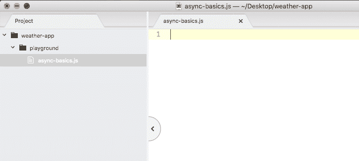

# 演示异步编程模型

为了说明异步编程模型是如何工作的，我们将从一个使用`console.log`的简单示例开始。让我们从以同步方式添加两个`console.log`语句开始。我们将在应用程序的开头创建一个`console.log`语句，该语句将显示为`Starting app`，我们将在末尾添加第二个语句，第二个语句将打印`Finishing up`，如下所示：

```js
console.log('Starting app');

console.log('Finishing up');
```

现在它们总是同步运行。无论你运行程序多少次，`Starting app`总是会在`Finishing up`之前出现。

为了添加一些异步代码，我们将看一看 Node 提供的名为`setTimeout`的函数。`setTimeout`函数是说明非阻塞编程基础知识的一种很好的方法。它包含两个参数：

*   第一个是函数。这将被称为回调函数，它将在一段时间后被激发。
*   第二个参数是一个数字，它告诉您要等待的毫秒数。所以如果你想等一秒钟，你会在 1000 毫秒内通过。

让我们调用`setTimeout`，传入一个箭头函数（`=>`）作为第一个参数。这将是一个回调函数。它会马上被解雇；也就是说，它将在超时时间结束后，在我们的两秒钟后被触发。然后我们可以设置第二个参数，即延迟，`2000`毫秒，等于这两秒：

```js
console.log('Starting app');

setTimeout(() => {

}, 2000);
```

在 arrow 函数（`=>`中，我们所要做的就是使用一个`console.log`语句，这样我们就可以准确地知道函数何时启动，因为该语句将打印到屏幕上。我们将添加`console.log`，然后在内部回调完成任务，如下所示：

```js
setTimeout(() => {
  console.log('Inside of callback');
}, 2000);
```

有了这个，我们实际上已经准备好运行我们的第一个异步程序，我不会使用`nodemon`来执行它。我将使用 basic Node 命令从终端运行此文件；`node playground`和`playground`文件夹中的文件`async-basic.js`：

```js
node playground/async-basics.js
```

现在请密切关注当我们到达 e*INTER*时到底发生了什么。我们将立即看到两条消息，两秒钟后，我们的最后一条消息`Inside of callback`打印到屏幕上：


这些消息显示的顺序是：首先我们得到了`Starting app`；几乎在这之后，`Finishing up`立即打印到屏幕上，最后（两秒钟后），`Inside of callback`被打印出来，如前面的代码所示。在文件中，这不是我们编写代码的顺序，而是代码执行的顺序。

`Starting app`语句按我们的预期打印到屏幕上。接下来，我们调用`setTimeout`，但实际上我们并没有告诉它等待两秒钟。我们正在注册一个将在两秒钟内被触发的回调。这将是一个异步回调，这意味着节点可以在这两秒钟内执行其他操作。在本例中，另一个东西向下移动到`Finishing up`消息。现在，由于我们使用`setTimeout`注册了此回调，它将在某个时间点触发，两秒钟后，我们确实看到`Inside of callback`打印到屏幕上。

通过使用非阻塞 I/O，我们可以等待，在本例中是两秒钟，而不会阻止程序的其余部分执行。如果这是阻塞 I/O，我们将不得不等待两秒钟，以触发此代码，然后`Finishing up`消息将打印到屏幕上，显然这并不理想。

这是一个非常人为的例子，我们不会在现实世界的应用程序中使用`setTimeout`来创建不必要的任意延迟，但原则是一样的。例如，当我们从 GoogleAPI 获取数据时，我们需要等待大约 100 到 200 毫秒才能返回该数据，我们不希望程序的其余部分处于空闲状态，它将继续。我们将注册一个回调，一旦数据从 Google 服务器返回，该回调将被触发。即使实际发生的情况大不相同，同样的原则也适用。

现在，我们想在这里再写一篇`setTimeout`。我们想要注册一个打印消息的`setTimeout`函数；类似于`Second setTimeout works`的东西。这将在回调内部，我们希望注册一个`0`毫秒的延迟，完全没有延迟。让我们填写异步基础知识`setTimeout`。我将使用我的箭头函数（`=>`调用`setTimeout`，传递`0`毫秒的延迟，如下面的代码所示。在 arrow 函数（`=>`中，我将使用`console.log`以便能够准确地看到该函数何时执行，我将使用`Second setTimeout`作为文本：

```js
setTimeout(() => {
  console.log('Second setTimeout');
}, 0);
```

现在我们已经准备好了，我们可以从终端运行程序，注意语句的打印顺序非常重要。让我们运行程序：

```js
node playground/async-basics.js
```

我们马上得到三个陈述，然后在最后，两秒钟后，我们得到了我们的最终陈述：


我们从`Starting app`开始，这很有意义，它位于顶部。然后我们得到`Finishing up`。在`Finishing up`之后，我们得到`Second setTimeout`，这看起来很奇怪，因为我们明确告诉 Node 我们希望在`0`毫秒之后运行这个函数，应该马上运行它。但在我们的示例中，`Second setTimeout`在`Finishing up`之后打印。

最后，`Inside of callback`打印到屏幕上。这种行为完全是意料之中的。这正是 Node.js 应该如何运行的，在下一节之后，它将变得更加清晰，我们将详细介绍这个示例，向您展示幕后发生的事情。我们将从一个更基本的示例开始，向您展示调用堆栈是如何工作的，我们将在下一节讨论所有这些，然后我们将继续讨论一个更复杂的示例，该示例附带一些异步事件。我们将在下一节讨论`Second setTimeout`出现在`Finishing up`消息之后的原因。

# 调用堆栈和事件循环

在上一节中，我们创建了第一个异步应用程序，但不幸的是，我们提出的问题多于得到的答案。即使我们使用过异步编程，我们也不知道它是如何工作的。本节的目标是理解程序为何以这种方式运行。

例如，为什么以下代码中的两秒延迟不会阻止应用程序的其余部分运行，为什么`0`秒延迟会导致在`Finishing up`打印到屏幕后执行该功能？

```js
console.log('Starting app');

setTimeout(() => {
  console.log('Inside of callback');
}, 2000);

setTimeout(() => {
  console.log('Second setTimeout');
}, 0);

console.log('Finishing up');
```

这些都是我们将在本节中回答的问题。本节将带您了解异步程序运行时 V8 和 Node 中发生的情况。现在让我们深入了解异步程序是如何运行的。我们将从一些基本的同步示例开始，然后继续了解异步程序中到底发生了什么。

# 同步程序示例

下面是第一个例子。左边是代码，这是一个基本的同步示例，右边是幕后发生的所有事情、调用堆栈、节点 API、回调队列和事件循环：


现在，如果您曾经阅读过一篇关于节点如何工作的文章或观看过任何视频课程，您很可能听说过其中一个或多个术语。在本节中，我们将探索它们如何结合在一起创建一个真实的、工作节点应用程序。现在，对于我们的第一个同步示例，我们需要担心的是调用堆栈。调用堆栈是 V8 的一部分，对于我们的同步示例，它是唯一要运行的东西。我们没有使用任何节点 API，也没有进行任何异步编程。

# 调用堆栈

调用堆栈是一个非常简单的数据结构，它跟踪 V8 内部的程序执行情况。它跟踪当前执行的函数和触发的语句。调用堆栈是一个非常简单的数据结构，可以完成两件事：

*   你可以在上面加些东西
*   您可以删除顶部的项目

这意味着如果数据结构的底部有一个项，而上面有一个项，则不能删除底部项，必须删除顶部项。如果已经有两个项，并且您想在其中添加一些内容，那么它必须继续，因为调用堆栈就是这样工作的。

把它想象成一罐品客啤酒或一件网球：如果已经有一件物品在里面了，你扔了一件，那么你刚才扔下的物品不会是最下面的物品，而是最上面的物品。首先，你不能从网球的顶部移除网球。这正是调用堆栈的工作方式。

# 运行同步程序

现在，当我们开始执行下面的屏幕截图中所示的程序时，将发生的第一件事是 Node 将运行 main 函数。主要功能是我们在 nodemon 中看到的包装器功能（请参阅[第 2 章](02.html)、*节点基础知识第 1 部分*中的*安装 nodemon 模块*一节），当我们通过节点运行文件时，它会包装所有文件。在这种情况下，通过告诉 V8 运行 main 函数，我们正在启动程序。

如下面的屏幕截图所示，我们在程序中做的第一件事是创建一个变量`x`，将其设置为`1`，这是将要运行的第一条语句：

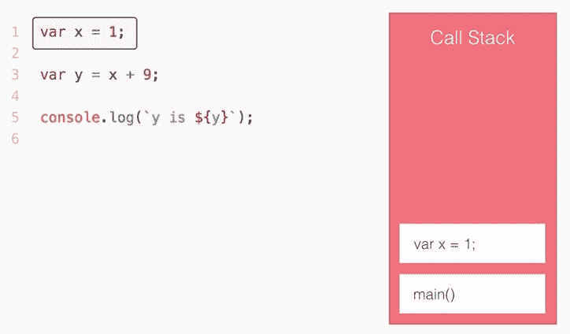

请注意，它位于 main 的顶部。现在将运行此语句，创建变量。完成后，我们可以将其从调用堆栈中移除，并转到下一个语句，在该语句中，我们将变量`y`设置为等于`x`，即`1`加`9`。这意味着`y`将等于`10`：


如前一个屏幕截图所示，我们这样做并继续下一行。下一行是我们的`console.log`声明。`console.log`语句将`y`is`10`打印到屏幕上。我们使用模板字符串注入`y`变量：

```js
console.log(`y is ${y}`);
```

当我们运行这一行时，它会弹出到调用堆栈中，如下所示：


一旦语句完成，它就会被删除。此时，我们已经执行了程序中的所有语句，程序几乎可以完成了。main 函数仍在运行，但由于函数结束，它隐式返回，当它返回时，我们从调用堆栈中删除 main，程序就完成了。此时，我们的节点进程已关闭。这是一个使用调用堆栈的基本示例。我们进入了主功能，并在程序中逐行移动。

# 一个复杂同步程序实例

让我们看一个稍微复杂一点的例子，我们的第二个例子。如下面的代码所示，我们首先定义一个`add`函数。`add`函数接受参数`a`和`b`，将它们相加，并将其存储在一个名为`total`的变量中，然后返回`total`。接下来，我们将`3`和`8`相加，即`11`，将其存储在`res`变量中。然后，我们使用`console.log`语句打印出响应，如下所示：

```js
var add = (a, b) => {
 var total = a + b;

 return total;
};

var res = add(3, 8);

console.log(res);
```

就这样，没有同步发生。我们再次需要调用堆栈。发生的第一件事是我们执行主函数；这将启动我们在这里的程序：


然后我们运行第一条语句，在其中定义`add`变量。我们并不是在实际执行函数，我们只是在这里定义它：

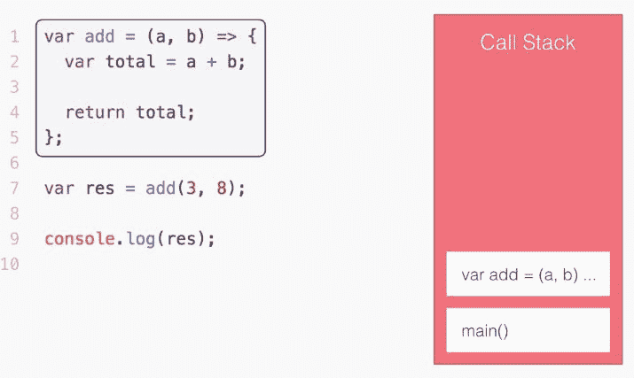

在上图中，`add()`变量被添加到调用堆栈中，我们定义了`add`。下一行`7`是我们调用`add`变量的地方，该变量存储响应变量的返回值：

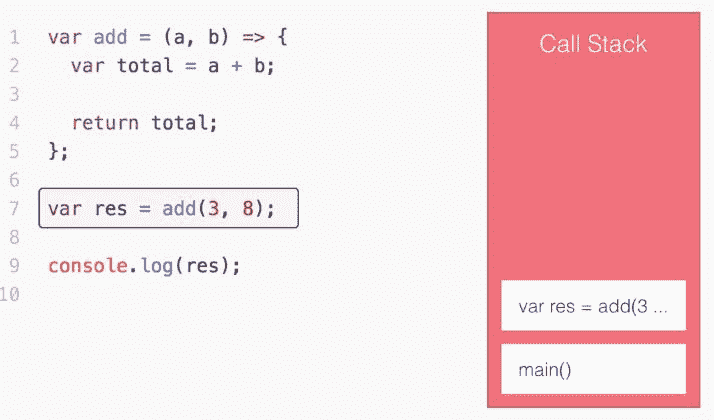

When you call a function, it gets added on top of the Call Stack. When you return from a function, it gets removed from the Call Stack.

在本例中，我们将调用一个函数。因此，我们将把`add()`添加到调用堆栈中，并开始执行该函数：


我们知道，当我们添加 main 时，我们开始执行 main，当我们添加`add()`时，我们开始执行 add。`add`内的第一行将`total`变量设置为`a + b`，即`11`。然后我们使用`return total`语句从函数返回。这是下一条语句，当它运行时，`add`被删除：

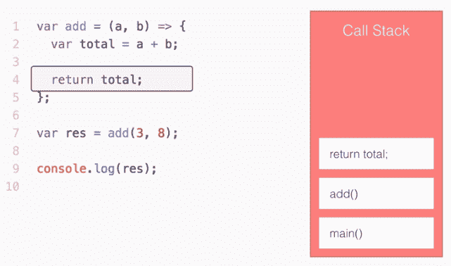

所以当`return total`结束时，`add()`被删除，然后我们进入程序的最后一行，我们的`console.log`语句，在这里我们将`11`打印到屏幕上：


`console.log`语句将运行，将`11`打印到屏幕并完成执行，现在我们已经到了主函数的末尾，当我们隐式返回时，它将从堆栈中移除。这是通过 V8 调用堆栈运行的程序的第二个示例。

# 异步程序示例

到目前为止，我们还没有使用节点 API、回调队列或事件循环。下一个示例将使用所有四个（调用堆栈、节点 API、回调队列和事件循环）。如下面屏幕截图的左侧所示，我们有一个异步示例，与上一节中编写的示例完全相同：


在本例中，我们将使用调用堆栈、节点 API、回调队列和事件循环。所有这四项都将在我们的异步程序中发挥作用。现在事情将如你所预料的那样开始。首先，我们运行 main 函数，将其添加到调用堆栈中。这告诉 V8 启动我们在上一个屏幕截图左侧的代码，再次显示如下：

```js
console.log('Starting app');

setTimeout(() => {
  console.log('Inside of callback');
}, 2000);

setTimeout(() => {
  console.log('Second setTimeout');
}, 0);

console.log('Finishing up');
```

这段代码中的第一条语句非常简单，一条将`Starting app`打印到屏幕上的`console.log`语句：

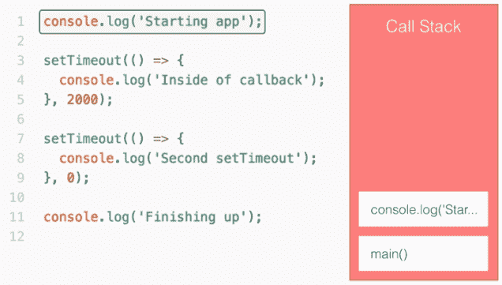

这句话马上就要开始了，我们接着讲第二句话。第二条语句是事情开始变得有趣的地方，这是对`setTimeout`的调用，它实际上是一个节点 API。它在 V8 中不可用，Node 允许我们访问：

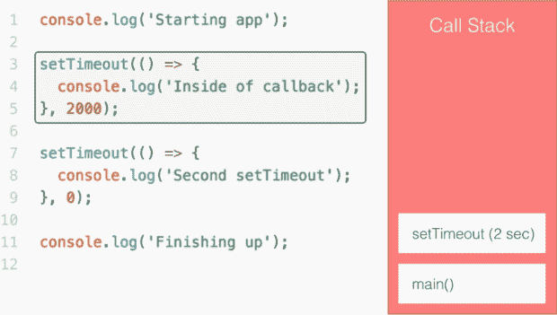

# 异步编程中的节点 API

当我们调用`setTimeout (2 sec)`函数时，实际上是在节点 API 中注册事件回调对。事件只需等待两秒钟，回调函数就是我们提供的函数，即第一个参数。当我们调用`setTimeout`时，它会在节点 API 中注册，如下所示：


现在该语句将结束，调用堆栈将继续，并且`setTimeout`将开始倒计时。仅仅因为`setTimeout`正在倒计时，并不意味着调用堆栈不能继续工作。调用堆栈一次只能运行一件事情，但即使在执行调用堆栈时，也可以让事件等待处理。现在运行的下一个语句是对`setTimeout`的另一个调用：


在本例中，我们注册了一个延迟为`0`毫秒的`setTimeout`回调函数，同样的情况也会发生。这是一个节点 API，它将被注册，如下面的屏幕截图所示。这实际上是说，在零秒之后，您可以执行此回调：

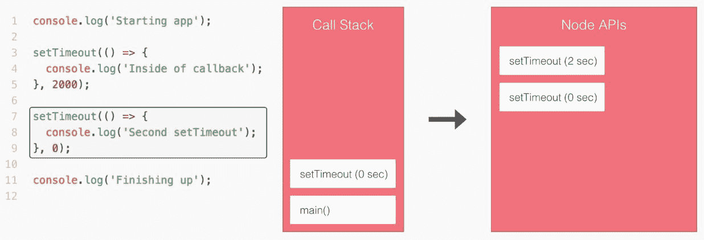

`setTimeout (0 sec)`语句被注册，调用堆栈将删除该语句。

# 异步编程中的回调队列

在这一点上，让我们假设有零秒延迟的`setTimeout`完成。当它结束时，它不会马上被执行；它将接受该回调并将其向下移动到回调队列中，如下所示：


回调队列是所有准备启动的回调函数。在前面的屏幕截图中，我们将函数从节点 API 移动到回调队列中。现在回调队列是回调函数等待的地方；他们需要等待调用堆栈为空。

当调用堆栈为空时，我们可以运行第一个函数。后面还有一个函数。我们必须等待第一个函数在第二个函数运行之前运行，这就是事件循环发挥作用的地方。

# 事件循环

事件循环查看调用堆栈。如果调用堆栈不是空的，它不会做任何事情，因为它做不到，它什么也做不到一次只能运行一件事情。如果调用堆栈是空的，那么事件循环会说很棒，让我们看看是否有任何东西可以运行。在我们的例子中，有一个回调函数，但是因为我们没有空的调用堆栈，事件循环无法运行它。让我们继续看这个例子。

# 运行异步代码

我们程序中发生的下一件事是运行`console.log`语句，将`Finishing up`打印到屏幕上。这是终端中显示的第二条消息：

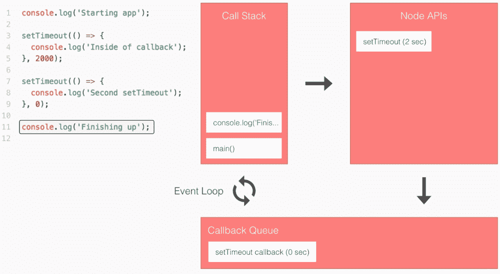

此语句运行时，我们的主函数已完成，它将从调用堆栈中删除。

此时，事件循环说，嘿，我看到调用堆栈中没有任何内容，回调队列中也有一些内容，所以让我们运行回调函数。它将接受回调并将其移动到调用堆栈中；这意味着函数正在执行：


它将运行第一行，该行位于`8`、`console.log`线上，将`Second setTimeout`打印到屏幕上。这就是为什么在前面的示例中，`Second setTimeout`出现在`Finishing up`之后，因为在调用堆栈完成之前，我们无法运行回调。由于`Finishing up`是主功能的一部分，它将始终在`Second setTimeout`之前运行。

`Second setTimeout`语句完成后，函数将隐式返回，回调将从调用堆栈中删除：

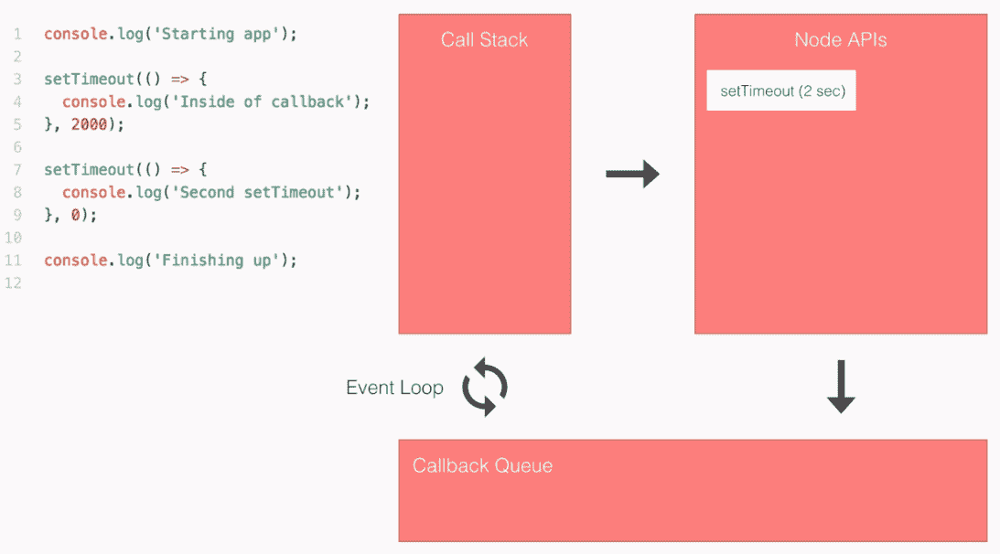

此时，调用堆栈中没有任何内容，回调队列中也没有任何内容，但我们的节点 API 中仍然有一些内容，我们仍然注册了一个事件侦听器。因此，节点过程尚未完成。两秒钟后，`setTimeout(2 sec)`事件将触发，它将获取该回调函数并将其移动到回调队列中。它将从节点 API 中删除，并添加到回调队列中：


此时，事件循环将查看调用堆栈，并看到它是空的。然后，它将快速查看回调队列，并看到确实有东西要运行。它能做什么？它将接受该回调，将其添加到调用堆栈中，并开始执行它的过程。这意味着我们将在回调中运行一条语句。完成后，回调函数隐式返回，程序完成：


我们的程序就是这样运行的。这说明了我们如何能够使用节点 API 注册事件，以及为什么当我们使用`setTimeout`为零时，代码不会立即运行。它需要通过节点 API 和回调队列才能在调用堆栈上执行。

现在，正如我在本节开头提到的，调用堆栈、节点 API、回调队列和事件循环都是非常容易混淆的主题。他们感到困惑的一个重要原因是，我们从未与他们直接互动；它们发生在幕后。我们没有调用回调队列，也没有启动事件循环方法来实现这些功能。这意味着在有人解释之前，我们不知道它们的存在。这些都是第一次真正很难把握的话题。通过编写真正的异步代码，它的工作原理将变得更加清晰。

现在我们对代码在幕后如何执行有了一点了解，接下来我们将继续本章的其余部分，并开始创建一个与第三方 API 交互的天气应用程序。

# 回调函数和 API

在本节中，我们将深入了解回调函数，并使用它们从谷歌地理定位 API 获取一些数据。这将是一个 API，它获取一个地址并返回纬度和经度坐标，这对于天气应用程序来说是非常好的。这是因为我们使用的天气 API 需要这些坐标，并返回实时天气数据，如温度、五天预报、风速、湿度和其他天气信息。

# 回调函数

在开始发出 HTTPS 请求之前，让我们先讨论一下回调函数，我们已经使用过了。请参阅以下代码（我们在上一节中使用了它）：

```js
console.log('Starting app');

setTimeout(() => {
  console.log('Inside of callback');
}, 2000);

setTimeout(() => {
  console.log('Second setTimeout');
}, 0);

console.log('Finishing up');
```

在`setTimeout`函数中，我们使用了`callback`函数。通常，`callback`函数被定义为作为参数传递给另一个函数并在某个事件发生后执行的函数。现在这是一个通用定义，JavaScript 中没有严格的定义，但它确实满足了本例中的函数：

```js
setTimeout(() => {
  console.log('Inside of callback');
}, 2000);
```

这里我们有一个函数，我们把它作为一个参数传递给另一个函数`setTimeout`，它会在经过两秒钟的某个事件后执行。现在事件可能是其他事情，可能是数据库查询完成，可能是 HTTP 请求返回。在这些情况下，您将需要一个回调函数，就像在我们的例子中一样，来处理这些数据。在`setTimeout`的情况下，我们没有得到任何数据，因为我们没有请求任何数据；我们只是在制造一个任意的延迟。

# 创建回调函数

现在，在我们向 Google 发出 HTTP 请求之前，让我们在`playground`文件夹中创建一个回调函数示例。让我们创建一个名为`callbacks.js`的新文件：


在该文件中，我们将创建一个人为的示例，说明回调函数在幕后的样子。在本书中，我们将给出真实的示例，并使用许多需要回调的函数。但在本章中，我们将从一个简单的示例开始。

首先，让我们创建一个名为`getUser`的变量。这将是我们将要定义的函数，它将准确地向我们展示当我们将回调传递给另一个函数时在幕后发生的事情。`getUser`回调将模拟从数据库或某种 web API 获取用户时的样子。这将是一个函数，因此我们将使用箭头函数（`=>`进行设置：

```js
var getUser = () => {

};
```

arrow 函数（`=>`）将接受一些参数。它将采用的第一个参数是`id`，它将是某种表示每个用户的唯一数字。我可能有一个`id`的`54`，你可能有一个`id`的`2000`；无论哪种方式，我们都需要`id`来找到用户。接下来，我们将获得一个回调函数，这是我们稍后将使用该用户对象调用的数据：

```js
var getUser = (id, callback) => {

};
```

这正是将函数传递给`setTimeout`时发生的情况。

The `setTimeout` function definition looks like this:
`var getUser = (callback, delay) => {`

`};`
It has a callback and a delay. You take the callback, and after a certain amount of time passes, you call it. In our case, though, we'll switch the order with an `id` first and the callback second.

现在我们可以在实际填写之前调用这个函数。我们将调用`getUser`，就像我们在前面的代码示例中对`setTimeout`所做的一样。我将调用`getUser`，传递这两个参数。第一个是一些`id`；因为我们现在是在假装，所以这并不重要，我会选择`31`。第二个参数是我们希望在用户数据返回时运行的函数，这非常重要。如图所示，我们将定义该函数：

```js
getUser(31, () => {

});
```

现在，回调本身并不是真正有用的；只有在我们实际获得用户数据时，才能在用户数据返回后运行此函数，这就是我们在这里所期望的：

```js
getUser(31, (user) => {

});
```

我们希望`user`对象，比如`id`、`name`、`email`、`password`等等，作为回调函数的参数返回。然后在 arrow 函数（`=>`中，我们实际上可以使用这些数据做一些事情，例如，我们可以在 web 应用程序上显示这些数据，响应 API 请求，或者在我们的例子中，我们可以简单地将其打印到控制台`console.log(user)`：

```js
getUser(31, (user) => {
  console.log(user);
});
```

现在我们已经准备好了调用，让我们填写`getUser`函数，使其像定义的那样工作。

我要做的第一件事是创建一个虚拟对象，它将成为`user`对象。将来，这将来自数据库查询，但现在我们只创建一个变量`user`将其设置为某个对象：

```js
var getUser = (id, callback) => {
  var user = {

  }
};
```

让我们将`id`属性设置为用户传入的任何`id`属性，并将`name`属性设置为某个名称。我将使用`Vikram`：

```js
var getUser = (id, callback) => {
  var user = {
    id: id,
    name: 'Vikram'
  };
};
```

现在我们有了`user`对象，我们要做的是调用回调，将其作为参数传递。然后我们将能够实际运行，`getUser(31, (user)`功能，将`user`打印到屏幕上。为了做到这一点，我们将像调用任何其他函数一样调用回调函数，只需按名称引用它并添加括号，如下所示：

```js
var getUser = (id, callback) => {
  var user = {
    id: id,
    name: 'Vikram'
  };
  callback();
};
```

现在，如果我们像这样调用函数，我们不会将任何数据从`getUser`传递回回调。在本例中，我们希望返回一个`user`，这就是为什么我们要指定`user`，如下所示：

```js
callback(user);
```

正如我现在所说的，命名是不重要的

```js
callback(user);
};

getUser(31, (userObject) => {
  console.log(userObject);
});
```

重要的是论点和立场。在这种情况下，我们将第一个参数称为`userObject`，第一个参数传回时确实是`userObject`。有了这个，我们现在可以运行我们的示例了。

# 运行回调函数

在终端中，我们将使用`playground`文件夹中的`node`运行回调函数，并调用文件`callbacks.js`：

```js
node playground/callback.js
```

当我们运行文件时，数据会立即打印到屏幕上：


我们使用同步编程创建了一个回调函数。正如我所提到的，这仍然是一个人为的例子，因为在这种情况下不需要回调。我们可以简单地返回 user 对象，但在这种情况下，我们不会使用回调，这里的重点是探索幕后发生了什么，以及我们如何实际调用作为参数传入的函数。

# 使用 setTimeout 模拟延迟

现在，我们还可以使用`setTimeout`来模拟延迟，所以让我们这样做。我们在前面的代码中使用了`callback (user)`。我们将传入一个箭头函数（`=>`作为第一个参数，并使用`3000`毫秒设置 3 秒的延迟：

```js
  setTimeout(() => {

  }, 3000);
  callback(user);
};
```

现在我可以进行回调调用，从第 10 行中删除它，并将其添加到回调函数中，如下所示：

```js
setTimeout(() => {
    callback(user);
  }, 3000);
};
```

现在，在三秒钟过去之前，我们不会响应`getUser`请求。现在，这将或多或少类似于当我们创建真实世界的回调示例时发生的情况，我们传入回调，无论我们是从数据库还是从 HTTP 端点请求，都会发生某种延迟，然后启动回调。

如果我保存`callbacks.js`并从终端重新运行代码，您会看到我们等待这三秒钟，这是模拟的延迟，然后`user`对象打印到屏幕上：


这正是我们开始使用回调时需要了解的原则，这正是我们将在本节中开始做的。

# 向地理定位 API 发出请求

在我们在节点中发出请求之前，我们将对该地理定位 API 发出的请求实际上可以在浏览器中进行模拟，这正是我们想要开始做的。因此，请跟随 URL[https://maps.googleapis.com/maps/api/geocode/json](https://maps.googleapis.com/maps/api/geocode/json) 。

现在这是实际的端点 URL，但是我们必须指定我们想要地理代码的地址。我们将使用查询字符串来实现这一点，查询字符串将在问号后面提供。然后，我们可以设置一组键值对，我们可以在 URL 中使用符号 and 添加倍数，例如：[https://maps.googleapis.com/maps/api/geocode/json?key=value &键二=值二](https://maps.googleapis.com/maps/api/geocode/json?key=value&keytwo=valuetwo)。

在本例中，我们只需要一个查询字符串地址[https://maps.googleapis.com/maps/api/geocode/json?address](https://maps.googleapis.com/maps/api/geocode/json?address) ，对于地址查询字符串，我们将其设置为一个地址。为了填写该查询地址，我将开始键入`1301 lombard street philadelphia`。

请注意，我们在 URL 中使用空格。这只是为了说明一点：我们可以在浏览器中使用空格，因为它会自动将这些空格转换为其他空格。然而，在节点内部，我们必须自己处理这个问题，稍后我们将在本节中讨论这个问题。现在如果我们将空格保留在中，点击 e*ENTR*，我们可以看到它们会自动为我们转换：


空格字符转换为`%20`，这是空格的编码版本。在本页中，我们有返回的所有数据：

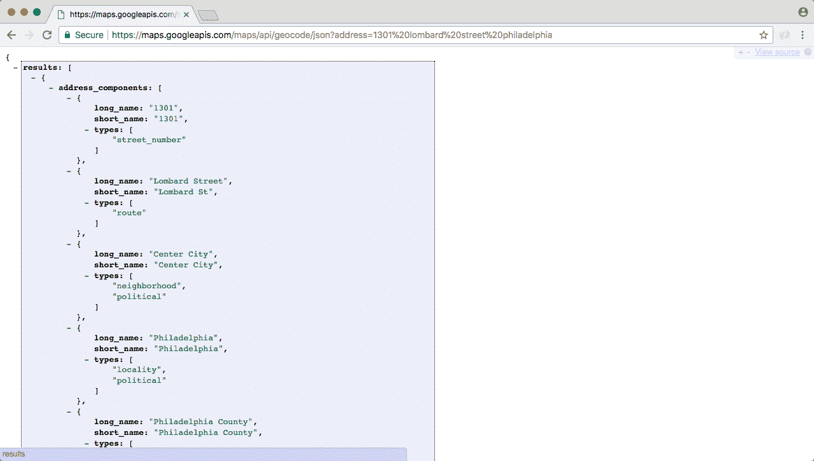

现在我们将使用一个名为 JSONView 的扩展，它可用于 Chrome 和 Firefox。

I highly recommend installing JSONView, as we should see a much nicer version of our JSON data. It lets us minimize and expand various properties, and it makes it super easy to navigate.

现在，如前面的屏幕截图所示，此页面上的数据正是我们所需要的。我们有一个 address\u components 属性，我们不需要它。接下来，我们有一个非常好的格式化地址，它包括州、邮政编码和国家，我们甚至没有在地址查询中提供。

然后，我们得到了我们真正想要的东西：在几何学中，我们有位置，这包括纬度和经度数据。

# 在我们的代码中使用 GoogleMapsAPI 数据

现在，我们从 GoogleMapsAPI 请求中得到的只是一些 JSON 数据，这意味着我们可以获取 JSON 数据，将其转换为 JavaScript 对象，并开始在代码中访问这些属性。要做到这一点，我们将使用第三方模块，让我们在应用程序内发出这些 HTTP 请求；这个叫做请求。

我们可以去[参观 https://www.npmjs.com/package/request](https://www.npmjs.com/package/request) 。当我们访问此页面时，我们将看到所有文档以及使用请求包发出 HTTP 请求的所有不同方式。不过，现在我们将继续使用一些基本示例。在右侧的“请求文档”页面上，我们可以看到这是一个非常流行的软件包，在最后一天下载了 70 万次：


为了开始，我们将在我们的项目中安装这个包，并向这个 URL 发出请求。

# 安装请求包

要安装软件包，我们将转到终端并使用`npm init`安装模块，以创建`package.json`文件：


我们将运行此命令并使用 e*nter*为每个选项使用默认值：


最后，我们将键入`yes`并再次点击 e*ENTR*。

现在我们有了`package.json`文件，我们可以使用`npm install`，后面是模块名、请求，我将指定一个版本。您始终可以在 npm 页面上找到最新版本的模块。撰写本文时的最新版本是`2.73.0`，因此我们将添加该版本`@2.73.0`。然后我们可以指定保存标志，因为我们确实希望将此模块保存在我们的`package.json`文件中：

```js
npm install request@2.73.0 --save
```

这对于运行天气应用程序至关重要。

# 使用请求作为函数

现在我们已经安装了请求模块，可以开始使用它了。在 Atom 内部，我们将通过向该 URL 发出请求来结束该部分，在名为`app.js`的项目根目录下的一个新文件中。这将是天气应用程序的起点。天气应用程序将是我们创建的最后一个命令行应用程序。在未来，我们将使用 Socket.IO 为 web 应用程序以及实时应用程序制作后端。但为了说明异步编程，命令行应用程序是最好的方式。

现在，我们有了我们的应用程序文件，我们可以开始加载`request`，就像我们对其他 npm 模块所做的那样。我们将创建一个常量变量，将其命名为`request`，并将其设置为等于`require(request)`，如下所示：

```js
const request = require('request');
```

现在我们需要做的是做一个`request`。为此，我们必须调用`request`函数。我们调用它，这个函数有两个参数：

*   第一个参数是一个选项对象，我们可以在其中配置各种信息
*   第二个是回调函数，一旦数据从 HTTP 端点返回，就会调用该函数

```js
request({}, () => {

});
```

在我们的例子中，一旦 JSON 数据（来自 GoogleMapsAPI 的数据）返回到节点应用程序中，它就会被调用。我们可以添加将从`request`传回的参数。现在，这些是`request`文档中概述的参数，我不是在为这些参数命名：

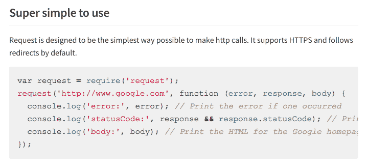

在文档中，您可以看到他们将其称为**错误**、**响应**和**主体**。这正是我们所说的。所以，在 Atom 内部，我们可以添加`error`、`response`和`body`，就像文档一样。

现在我们可以填写 options 对象，在这里我们将指定`request`特有的内容。在这种情况下，唯一的东西之一是 URL。URL 精确地指定了您想要请求的内容，在我们的例子中，浏览器中有这样的内容。让我们复制 URL 的外观，将其粘贴到 URL 属性的字符串中：

```js
request({
  url: 'https://maps.googleapis.com/maps/api/geocode/json?address=1301%20lombard%20street%20philadelphia',
}, (error, response, body) => {

});
```

现在我们已经有了 URL 属性，我们可以在最后添加一个逗号并点击 e*nter*。因为我们将再指定一个属性，所以将`json`设置为等于`true`：

```js
request({
  url: 'https://maps.googleapis.com/maps/api/geocode/json?address=1301%20lombard%20street%20philadelphia',
  json: true
}, (error, response, body) => {

});
```

这告诉`request`返回的数据将是 JSON 数据，它应该继续，获取 JSON 字符串，并为我们将其转换为对象。这让我们跳过了一步，这是一个非常有用的选择。

有了这个，我们现在可以在回调中做一些事情了。在未来，我们将利用这个经度和纬度来获取天气。现在，我们只需使用`console.log`将`body`打印到屏幕上。我们将 body 参数传递到`console.log`，如下所示：

```js
request({
  url: 'https://maps.googleapis.com/maps/api/geocode/json?address=1301%20lombard%20street%20philadelphia',
  json: true
}, (error, response, body) => {
  console.log(body);
});
```

现在，我们已经设置了第一个 HTTP 请求，并且当数据返回时将触发回调，我们可以从终端运行它。

# 运行请求

要运行请求，我们将使用`node`并运行`app.js`文件：

```js
node app.js
```

当我们这样做时，文件将开始执行，在正文打印到屏幕之前会有一个非常短的延迟：


我们得到的正是我们在浏览器中看到的。一些属性，例如`address_components`，在本例中显示对象，因为我们正在将其打印到屏幕上。但这些属性确实存在；我们将在本章后面讨论如何获取它们。不过，现在我们有了前面截图中所示的`formatted_address`、`geometry`对象、`place_id`和`types`。这就是我们将用来获取经度和纬度，以及稍后获取天气数据的内容。

既然我们已经准备好了，我们就完成了。我们已经完成了流程的第一步。我们已经向谷歌地理定位 API 发出了一个请求，我们正在取回数据。我们将在下一节继续创建天气应用程序。

# 漂亮的打印对象

在我们继续学习 HTTP 和 Apple T0T、AuthT1、和 Ty2 T2 的内容之前，让我们花一点时间讨论如何将一个对象漂亮地打印到屏幕上。正如我们在上一小节中看到的，当我们使用`node app.js`运行应用程序时，身体会打印到屏幕上。

但由于有许多对象嵌套在彼此内部，JavaScript 开始剪切它们：

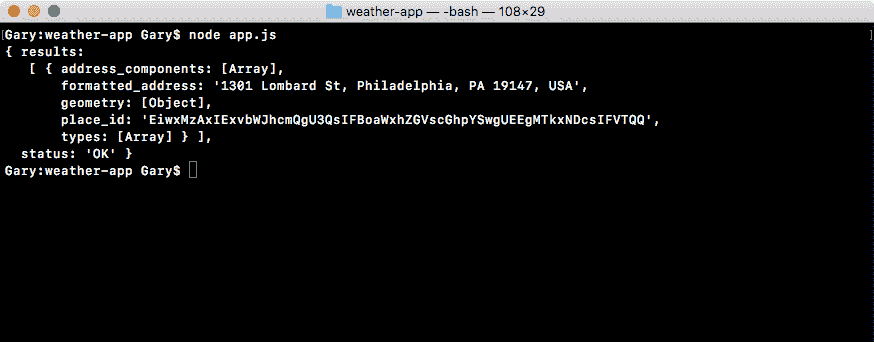

如前一个屏幕截图所示，它告诉我们一个对象在`results`中，但我们无法确切看到属性是什么。这发生在`address_components`、`geometry`和`types`之间。显然这是没有用的；我们要做的是准确地看到对象中的内容。

# 使用 body 参数

为了探索所有属性，我们将研究一种漂亮地打印对象的方法。这将需要一个非常简单的函数调用，一个我们实际上已经使用过的函数，`JSON.stringify`。这是获取 JavaScript 对象的函数，`body`是，记住我们使用`json: true`语句告诉`request`获取 JSON 并将其转换为对象。在`console.log`语句中，我们将获取该对象，传入`body`，并提供如下所示的参数：

```js
const request = require('request');

request({
  url: 'https://maps.googleapis.com/maps/api/geocode/json?address=1301%20lombard%20street%20philadelphia',
  json: true
}, (error, response, body) => {
  console.log(JSON.stringify(body));
});
```

现在，这就是我们通常使用的`JSON.stringify`，过去我们只提供了一个参数，我们想要的对象`stringify`，在本例中，我们将提供两个其他参数。下一个参数用于筛选出属性。我们不想使用它，它通常是无用的，所以我们现在将它保留为未定义的：

```js
console.log(JSON.stringify(body, undefined));
```

我们之所以需要提供它，是因为第三个论点是我们想要的。第三个参数将格式化 JSON，我们将指定每个缩进要使用多少空格。根据您的喜好，我们可以选择`2`或`4`。在这种情况下，我们将选择`2`：

```js
console.log(JSON.stringify(body, undefined, 2));
```

我们将保存文件并从终端重新运行它。当我们`stringify`使用 JSON 并将其打印到屏幕上时，正如我们在重新运行应用程序时看到的那样，我们会看到整个对象显示出来。没有一个属性被剪裁掉，我们可以看到整个 address_components 数组，无论它有多复杂，所有内容都会显示出来：

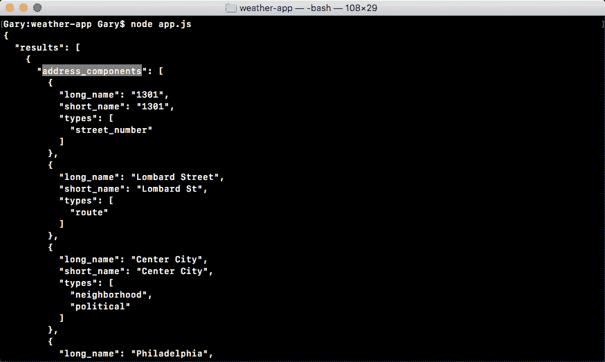

接下来，我们有了几何体对象，这是存储纬度和经度的地方，您可以看到它们，如下所示：


下面是我们的`types`，它之前被切断了，尽管它是一个包含一个项目的数组，这是一个字符串：

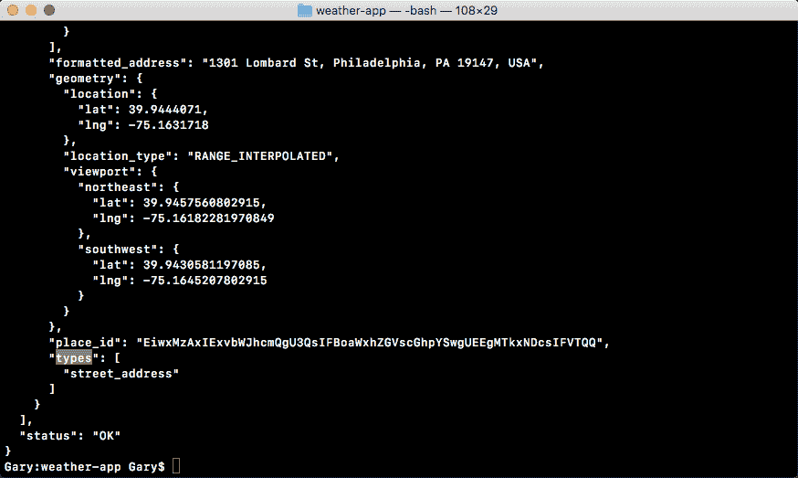

既然我们知道了如何漂亮地打印对象，那么在控制台中扫描数据就容易多了——我们的所有属性都不会被剪裁，而且它的格式使数据更具可读性。在下一节中，我们将开始深入研究 HTTP 和回调中的所有参数。

# 组成 HTTPS 请求

上一节的目标不是理解 HTTP 是如何工作的，也不是理解参数`error`、`response`和`body`到底是什么。目标是给出一个真实的回调示例，而不是我们迄今为止一直在使用的人工示例`setTimeout`：

```js
const request = require('request');

request({
 url: 'https://maps.googleapis.com/maps/api/geocode/json?address=1301%20lombard%20street%20philadelphia',
 json: true
}, (error, response, body) => {
 console.log(JSON.stringify(body, undefined, 2));
});
```

在前面的例子中，我们有一个真正的回调，一旦 HTTP 请求从 Google 服务器返回，它就会被触发。我们能够打印出`body`，并且我们在网站上看到了我们所拥有的内容。在本节中，我们将深入讨论这些参数，让我们先看看`body`参数。这是`request`传递给回调函数的第三个参数。

现在`body`不是`request`模块独有的东西（`body`是 HTTP 的一部分，代表**超文本传输协议**。当您向网站发出请求时，返回的数据就是请求的主体。事实上，在我们的一生中，我们已经使用过身体大约一百万次了。每次我们在浏览器中请求 URL 时，屏幕中呈现的就是主体。

在[的情况下 https://www.npmjs.com](https://www.npmjs.com) 返回的主体是一个 HTML 网页，浏览器知道如何呈现该网页。正文也可以是一些 JSON 信息，我们的 GoogleAPI 请求就是这样。无论哪种方式，主体都是从服务器返回的核心数据。在我们的例子中，主体存储了我们需要的所有位置信息，我们将使用这些信息在本节中提取格式化的地址、纬度和经度。

# 响应对象

在我们深入身体之前，让我们先讨论一下`response`物体。我们可以通过将`response`对象打印到屏幕上来查看它。让我们用代码中的`response`替换`console.log`语句中的主体：

```js
const request = require('request');
request({
  url: 'https://maps.googleapis.com/maps/api/geocode/json?address=1301%20lombard%20street%20philadelphia',
  json: true
}, (error, response, body) => {
  console.log(JSON.stringify(response, undefined, 2));
});
```

然后保存文件并通过运行`node app.js`命令在终端内部重新运行。在等待请求返回时，我们会得到一点延迟，然后我们会得到一个非常复杂的对象：

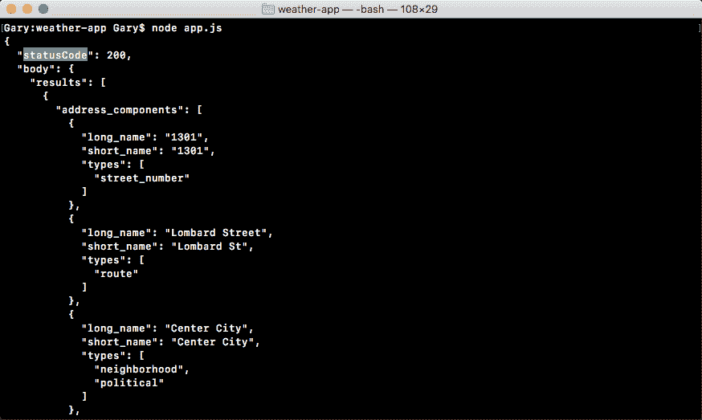

在前面的屏幕截图中，我们可以看到`response`对象中的第一个东西是状态码。状态代码是从 HTTP 请求返回的代码；这是响应的一部分，可以准确地告诉您请求是如何进行的。

这意味着你发现了 404，或者说你不熟悉 404 的所有代码。在这本书中，我们还会用到其他的身体密码。

We'll be making our very own HTTP API, so you'll become intimately familiar with how to set and use status codes.

在本节中，我们所关心的是状态代码为`200`，这意味着一切顺利。接下来在`response`对象中，我们实际上重复了`body`，因为它是`response`的一部分。由于它是返回的最有用的信息，请求模块开发人员选择将其作为第三个参数，尽管您可以使用`response.body`访问它，在本例中您可以清楚地看到。这里，我们有我们已经看过的所有信息，地址组件，格式化的地址几何体，等等。

在 body 参数旁边，我们有一个名为`headers`的东西，如下所示：


现在，`headers`是 HTTP 协议的一部分，它们是键-值对，正如您在前面的屏幕截图中所看到的，其中键和值都是字符串。它们可以在请求中发送，从节点服务器发送到 GoogleAPI 服务器，并在响应中从 GoogleAPI 服务器发送回节点服务器。

标题很棒，有很多内置的标题，比如`content-type`。`content-type`是一个网站的 HTML，在我们的例子中，它是`application/json`。我们将在后面的章节中进一步讨论标题。这些头文件中的大多数对我们的应用程序并不重要，而且大多数我们永远不会使用。当我们在本书后面创建我们自己的 API 时，我们将设置我们自己的头，因此我们将非常熟悉这些头是如何工作的。现在，我们可以完全忽略它们，我想让你们知道的是，你们看到的这些头是由谷歌设置的，它们是从服务器返回的头。

在标题的旁边是 request 对象，它存储了有关所做请求的一些信息：

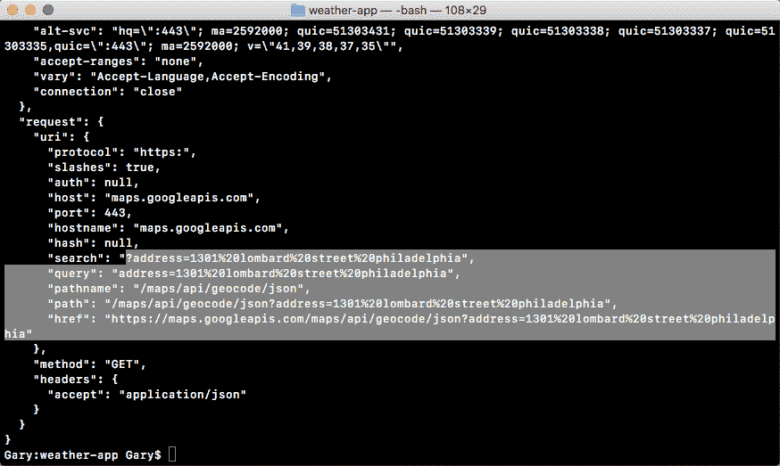

如前一个屏幕截图所示，您可以看到协议 HTTPS、主机、`maps.googleapis.com`网站以及其他内容，如地址参数、整个 URL 以及关于请求的所有其他内容，这些内容存储在这一部分中。

接下来，我们还有自己的标题。以下是从节点发送到 Google API 的标题：


当我们在代码中向 options 对象添加`json: true`时，设置了这个标题。我们告诉 request 我们想要回 JSON，request 接着告诉 Google，*嘿，我们想要回一些 JSON 数据，所以如果你能使用这种格式，就把它发回去！*这正是谷歌所做的。

这是`response`对象，它存储有关`response`和请求的信息。虽然我们不会使用`response`参数中的大部分内容，但重要的是要知道它们的存在。所以，如果你需要访问它们，你知道它们住在哪里。我们将在整本书中使用其中的一些信息，但正如我前面提到的，其中大部分是不必要的。

在大多数情况下，我们将访问 body 参数。我们将使用的一件事是状态。在我们的案例中，它是`200`。当我们确保成功满足请求时，这一点非常重要。如果我们无法获取位置或状态代码中出现错误，我们不想继续尝试获取天气，因为显然我们没有纬度和经度信息。

# 错误参数

现在，我们可以继续讨论最后一件事，那就是错误。正如我刚才提到的，状态代码可以显示发生了错误，但这将是谷歌服务器上的错误。也许谷歌服务器有语法错误，他们的程序正在崩溃，也许你发送的数据无效，例如，你发送了一个不存在的地址。这些错误将通过状态代码变得明显。

error 参数包含的是与发出 HTTP 请求的过程相关的错误。例如，可能域是错误的：如果我删除了`s`和 URL 中带有`go`的点，在我们的代码中，我会得到一个很可能不存在的 URL：

```js
const request = require('request');

request({
  url: 'https://mapogleapis.com/maps/api/geocode/json?address=1301%20lombard%20street%20philadelphia',
```

在本例中，我将在 error 对象中得到一个错误，因为节点无法发出 HTTP 请求，甚至无法将其连接到服务器。如果我发出请求的机器无法访问 internet，我也可能会出错。它将尝试接触谷歌服务器，它将失败，我们将得到一个错误。

现在，我们可以通过从 URL 中删除这些文本片段并发出请求来检查错误对象。在这种情况下，我将把响应替换为`error`，如下所示：

```js
const request = require('request');

request({
  url: 'https://mapogleapis.com/maps/api/geocode/json?address=1301%20lombard%20street%20philadelphia',
  json: true
}, (error, response, body) => {
  console.log(JSON.stringify(error, undefined, 2));
});
```

现在，在终端内部，让我们通过运行`node app.js`命令重新运行应用程序，我们可以准确地看到我们得到了什么：


当我们发出错误请求时，我们会将错误对象打印到屏幕上，而我们真正关心的是错误代码。在这种情况下，我们有`ENOTFOUND`错误。这意味着我们的本地计算机无法连接到提供的主机。在本例中`mapogleapis.com`不存在，因此我们将在这里得到一个错误。

这些将是系统错误，例如您的程序无法连接到 internet 或找不到域。在为我们的应用程序创建一些错误处理时，这一点也非常重要，因为用户的机器有可能无法连接到 internet。我们要确保采取适当的措施，这取决于错误对象中的内容。

如果我们可以修复 URL，将其设置回[maps.googleapis.com](https://developers.google.com/maps/)，并使用向上箭头键和*enter*键发出完全相同的请求，请求错误对象将为空，并且您可以在屏幕上看到空打印：


在这种情况下，一切都很顺利，没有错误，它能够成功地获取数据，它应该能够获取数据，因为我们有一个有效的 URL。这是对主体、`response`和错误参数的快速概述。在添加错误处理时，我们将更详细地使用它们。

# 从 body 对象打印数据

现在，我们将把一些数据从身体打印到屏幕上。让我们从打印格式化的地址开始，然后我们将负责打印纬度和经度。

# 打印格式化的地址

我们将从找出格式化地址的位置开始。为此，我们将转到浏览器并使用 JSONView。在浏览器页面的底部，您可以看到，当我们在项目上高亮显示时，会显示一个蓝色的小条，并且在切换项目时它会发生变化。例如，对于格式化地址，我们访问`results`属性，结果是一个数组。对于大多数地址，您只能得到一个结果：

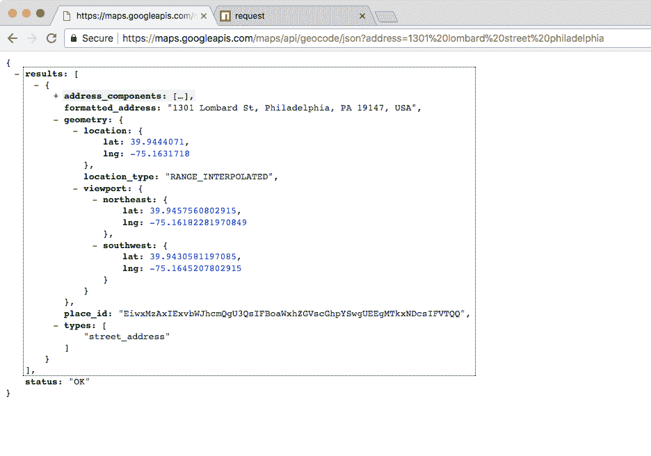

我们每次都会使用第一个结果，所以我们有索引`0`，然后它就是`.formatted_address`属性。这条底线正是我们需要在节点代码中键入的内容。

在 Atom 内部，在我们的代码中，我们将删除`console.log`语句，并用新的`console.log`语句替换它。我们将使用模板字符串来添加一些不错的格式。我们将用冒号和空格添加`Address`，然后我将使用美元符号和大括号插入地址。我们将访问正文、结果和结果数组中的第一项，后跟格式化地址，如下所示：

```js
const request = require('request');

request({
 url: 'https://maps.googleapis.com/maps/api/geocode/json?address=1301%20lombard%20street%20philadelphia',
 json: true
}, (error, response, body) => {
 console.log(`Address: ${body.results[0].formatted_address}`);
});
```

有了这个，我现在可以在末尾添加分号并保存文件。接下来，我们将在终端内部重新运行应用程序，这一次我们将地址打印到屏幕上，如下所示：


现在我们已经在屏幕上打印了地址，接下来我们要打印的是纬度和经度。

# 印刷经纬度

为了开始，在 Atom 内部，我们将在为格式化地址添加的`console.log`旁边添加另一行`console.log`。我们将再次使用模板字符串来添加一些好的格式。让我们先打印纬度。

为此，我们将添加纬度，后跟冒号。然后我们可以使用带花括号的美元符号注入变量。然后，我们想要的变量在主体上。与格式化地址一样，它也位于第一个结果项中；指数为零时的结果。接下来，我们将学习几何。从几何图形中，我们将获取位置属性，即纬度`.lat`，如下所示：

```js
  console.log(`Address: ${body.results[0].formatted_address}`);
  console.log(`Latitude: ${body.results[0].geometry.location.lat}`);
});
```

现在我们已经准备好了，我们将对经度做完全相同的事情。我们将在代码的下一行添加另一个`console.log`语句。我们将再次使用模板字符串，首先键入经度。之后，我们将放置一个冒号，然后注入值。在这种情况下，值位于主体上；它在同一个结果项中，第一个。我们将再次进入几何位置。我们将访问`.lng`，而不是`.lat`。然后我们可以在末尾添加分号并保存文件。这将类似于以下内容：

```js
  console.log(`Address: ${body.results[0].formatted_address}`);
  console.log(`Latitude: ${body.results[0].geometry.location.lat}`);
  console.log(`Longitude: ${body.results[0].geometry.location.lng}`);
});
```

现在我们将从终端测试它。我们将重新运行上一个命令，如下面的屏幕截图所示，您可以看到我们在屏幕上打印了纬度`39.94`和经度`-75.16`：


这些值与我们在 Chrome 浏览器中的值完全相同，`39.94`、`-75.16`。有了这些，我们现在已经成功地获取了向天气 API 发出请求所需的数据。

# 总结

在本章中，我们介绍了异步编程的一个基本示例。接下来，我们讨论了运行异步代码时在幕后发生的事情。我们对您的程序如何运行以及幕后正在发生的工具和技巧有了非常好的了解，以使其按其方式运行。我们将通过几个示例来说明调用堆栈、节点 API、回调队列和事件循环是如何工作的。

然后，我们学习了如何使用请求模块对一些信息发出 HTTP 请求，我们请求的 URL 是一个 Google Maps 地理编码 URL，我们输入了我们想要的纬度和经度的地址。然后我们使用了一个回调函数，一旦数据返回，它就会被触发。

在*回调函数和 API*一节的末尾，我们研究了如何在将对象打印到控制台时格式化对象的快速技巧。最后，我们研究了 HTTPS 请求的组成。

在下一章中，我们将在此回调中添加一些错误处理，因为这对于 HTTP 请求来说非常重要。有可能出现问题，当出现问题时，我们希望通过在屏幕上打印一条漂亮的错误消息来处理该错误。