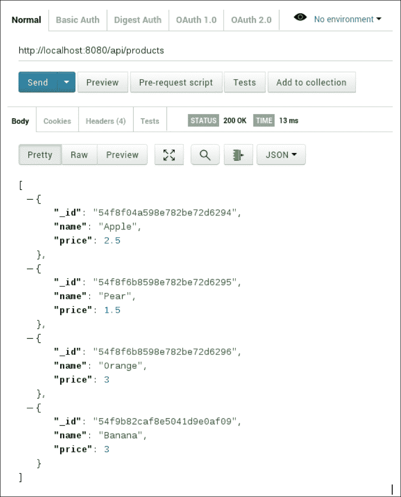
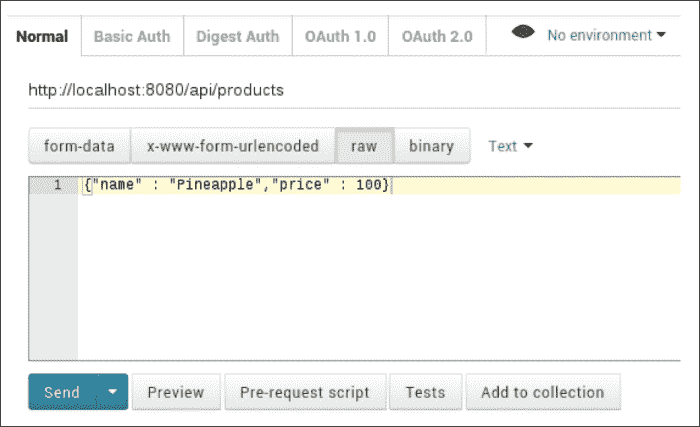

# 二、创建应用编程接口

不管你的后端有多复杂，除非你能以某种方式让它的服务对你的客户可用，否则它很可能是没有用的。最常见的方法是通过**应用编程接口** ( **应用编程接口**)—一组为您的后端定义良好的访问方法。通过这种方式，您允许客户端请求数据、执行计算以及请求它提供的其他服务。

在这一章中，我们将看看如何根据广泛使用的**表征状态转移** ( **REST** )架构来构建这样一个 API。我们将介绍 REST 的理论基础，然后看看如何根据我们的需要使用 Node.js 实现它的精简版本。我们将通过一个 REST 客户端访问 API 来总结一下，看看它是如何工作的。

# RESTful API 的学习成果

读完这一章，你会明白什么是 RESTful API，它是如何构造的。您还将彻底了解如何在 Node.js 中定义数据访问点，并通过 REST 客户端使用这些数据访问点。

# 轻松休息

互联网时代最大的挑战之一一直是让网络服务以统一和高效的方式相互对话。这就是为什么我们开发了大量我们今天所依赖的通信协议的原因，例如非常重要的 TCP/IP 堆栈。诸如此类的协议使得应用之间的正式通信成为一个简单的过程，至少就线上的实际字节而言是如此。

然而，对于应用应该如何相互传递数据抽象，并没有单一的事实规范。原始 TCP/IP 只理解数据包的交换；它对客户、订单或产品等抽象概念一无所知。为了提高抽象级别并构建一个允许与我们的后端进行直观通信的接口，我们将不得不依赖一个或多个架构模式的定制实现来获得我们想要的东西。今天，有几种这样的模式被广泛使用。您可能已经熟悉了诸如 SOAP、WSDL 之类的术语，甚至可能已经熟悉了我们这里的目标——REST。

# 都是超媒体

REST 是一种架构模式，其中两个或多个应用通过对这些资源的一组操作在它们之间交换资源。资源是所有相关应用(如产品、客户等)都知道的数据类型集。例如，客户端应用可以要求服务器应用给它一个它存储的给定种类的所有资源的列表，或者要求服务器在其数据库中注册一个给定资源的新实例。所有这些操作都只通过使用标准的 HTTP 协议进行通信，这使得该过程既直观又易于实现。

RESTful 通信的核心是常见的 HTTP 动词— **GET** 、 **POST** 、 **PUT** 和 **DELETE** 。就流行的**CRUD**(**Create/Read/Update/Delete**)缩略词而言， **C** 对应 **POST** ， **R** 到 **GET** ， **U** 到 **PUT** ，最后D 到，嗯， **DELETE** 。如果你熟悉 HTTP，你就已经知道这些动词代表两个说 HTTP 的应用之间发送的不同请求类型。例如当你在浏览器的 URL 字段中输入`www.google.com`并按下*回车*键时，浏览器会向 URL 绑定到的服务器发出`GET`请求，要求其返回服务器上的任何数据。通常，这些数据采用标准格式，如 **HTML** 、 **XML** 或 **JSON** 。同样，当您在网页上填写表单并按下**提交**按钮(或等效按钮)时，会通过`POST`请求向服务器发送一个请求，该请求携带您输入的请求数据供服务器处理。

如前所述，REST 的功能是通过使用这些动词来传达对相关方知道的各种资源的操作。例如，在我们的例子中，我们可能希望通过使用 RESTful 请求告诉服务器以下内容:

*   获取服务器上所有可用的产品(动词为`GET`)
*   取 ID 为`abcd1234`的产品(动词为`GET`)
*   为 ID 为`xyz456`的客户订购名为`abcd1234`的产品(动词为`POST`)
*   将 ID 为`abcd1234`的产品价格更新为 5 亿美元(动词为`PUT`)
*   删除 ID 为`abcd1234`的产品，因为没人再买了(动词是`DELETE`)

按照惯例，REST 对在给定资源上操作的请求使用以下通用基本 URL 结构(括号中的元素是可选的):

```js
http://<domain>/[api name]/[api version]/<resource>
```

对于我们的产品示例，该资源的 RESTful 基本网址如下:

`http://myserver.com/myapi/v1/products`

在下一节中，我们将演示如何使用 HTTP 动词在实践中执行这样的操作。

## GET

在 REST 的上下文中，GET 请求总是指示检索操作。因此，我们说 GET 请求是常见动词中唯一没有变化的请求，因为它们不会改变服务器上相关资源的状态。

在 REST 中，有两个标准的 GET 操作，任何 API 都应该理想地实现:

### 获取全部

以下是 GET all 操作的主要特征:

*   它向资源的基本网址发送一个空白的获取请求
*   它返回给定类型的所有资源
*   GET all 操作给出的资源的一个例子是`http://myserver.com/myapi/v1/products`。

### 按 ID 获取

以下是按标识获取操作的主要特征:

*   它返回具有特定标识的资源
*   这种操作的一个例子是`http://myserver.com/myapi/v1/products/abcd1234`(使用路径参数)或`http://myserver.com/myapi/v1/products?id=abcd1234`(使用查询参数)

您应该使用路径参数还是查询参数完全由您决定，这不是 REST 约定所要求的。在这里，对于本书的剩余部分，我们将使用查询参数，因为这是正常的 HTTP 做事方式，并且更容易理解和实现。

## 开机自检

开机自检请求用于创建给定资源的新实例。通常，传统的 REST 服务器会提供关于资源字段的文档，您需要指定这些字段才能成功创建。

## PUT

PUT 是用于创建或更新资源。它的工作方式几乎与 POST 相同，只是如果您在请求中提供一个资源标识，服务器将首先找到该特定资源，然后用您请求中的等效字段替换该资源的每个字段。

例如，假设您的服务器有一个产品类型的资源，如下所示:

```js
{
  name: 'Apple',
  price: 50,
  id: 'abcd1234'
}
```

假设您提交了一个带有以下表单数据的`PUT`请求:

```js
{
  id: 'abcd1234'
  price: 500000000,
}
```

事务结束后，同一资源在服务器上将具有以下状态:

```js
{
  name: "Apple",
  price: 500000000,
  id: "abcd1234"
}
```

## 删除

删除是用来删除服务器上的资源。你所需要做的就是在你的请求中提供资源标识。例如，向`http://myserver.com/myapi/v1/products/abcd1234`发送`DELETE`请求将删除服务器上标识为`abcd1234`的产品。

# 用 Node.js 构建 RESTful API

现在已经介绍了 REST 的基础知识，让我们将它付诸实践，并为`OrderBase`构建一个 API，该 API 是在前一章中构建的。如果您还没有这样做，请花一点时间查看我们在那里编写的代码，以确保您理解在本例中我们的应用编程接口和数据库之间发生了什么。

## 设置 RESTful 应用编程接口

首先为我们的服务器创建一个工作区。在你的驱动器上，创建一个名为`order_api`的文件夹，进入这个文件夹，创建并执行名为`api.js`的文件。最后，打开一个终端并执行以下操作:

```js
npm init

```

正如我们在上一章中看到的，为了引导 Node.js 服务器，这将会给你一些问题要回答。当问题向您询问入口点时，一定要指定`api.js`，因为这是您的服务器配置将被读取的主文件。

接下来，您将需要导入我们在[第 2 章](02.html "Chapter 2. Configuring Persistence with MongoDB")、*中创建的数据库接口模块，使用 MongoDB* 配置持久化。为此，首先安装`mongodb`驱动程序:

```js
npm install mongodb

```

然后，您可以通过两种方式导入模块本身:

*   将前一章的`database.js`文件复制粘贴到当前目录，并将`var database = require('./database');`添加到您的`api.js`文件的顶部
*   将`var database = require([pathToDatabase])`添加到您的`api.js`文件的顶部，其中`[pathToDatabase]`是您的`database.js`文件的完整系统路径

完成后，打开`api.js`文件。让我们开始为我们的应用编程接口添加一些代码。

## HTTP 模块

我们首先需要的是一种方法，将 Node.js 实例向网络开放，并使其能够通过 HTTP 协议进行通信，因为这将是我们的 API 功能的核心驱动因素。

为了实现这一点，我们将在我们的服务器中包含标准的 HTTP 模块。在`api.js`文件的顶部添加以下一行:

```js
var http = require('http');
```

这将导致 Node.js 加载 HTTP 模块，这是一个强大的组件，可以用来监听和处理 HTTP 请求以及向客户端发送响应。

现在，有了这个模块，让我们开始监听和响应简单的 HTTP 请求。将以下内容添加到您的文件中:

```js
var server = http.createServer(function (req, res) {
    res.writeHead(200);
    res.end("I am a fledgling API, and I am alright");
});
server.listen(8080);

console.log('Up, running and ready for action!');
```

就这样！如果这是您第一次使用 HTTP 模块，您可能会对这个设置如此简单感到惊讶。你不是每天都用七行代码写一个功能齐全的 HTTP 服务器！Node.js 就是这么好。

让我们运行一下服务器，确保它正常工作。打开自己喜欢的浏览器，导航至 *http://localhost:8080* 。您将看到下面一行文本:

**我是一个初出茅庐的 API，我还好**

一切都好。我们现在准备开始让我们的应用编程接口做一些更有趣的事情，而不仅仅是一遍又一遍地显示相同的文本。然而，让我们先仔细看看 HTTP 模块实际上是如何工作和服务请求的。

## 剖析 HTTP 服务器

查看我们的服务器代码，我们实际上只是在做以下两件事:

1.  为我们的服务器配置事件循环是它在 HTTP 请求进入时应该做的事情。这是通过调用`http.createServer()`方法来完成的，该方法以回调函数作为参数，将对每个传入的请求执行该回调函数。
2.  将服务器绑定到主机中的给定网络端口，并开始侦听该端口上的传入连接。

第一项的有趣之处在于回调函数:

```js
function (req, res) {
  res.writeHead(200);
  res.end("I am a fledgling API, and I am alright");
}
```

这个方法需要两个参数，`req`和`res`。你可能已经猜到了，它们指的是 HTTP *请求*和相关的*响应*。`req`参数将包含与传入的 HTTP 请求相关的所有数据，如来源、报头、有效载荷、cookies 等。`res`参数是 HTTP 响应，返回方法时会将发射回调用者。

您可能想知道为什么响应作为参数传递给一个显然处理传入请求的函数。这是一个设计问题。`res`参数实际上是在函数外部创建的，并传递给它，以便您可以在 HTTP 模块再次控制它之前做您认为合适的修改，最终确定它，并将其发送回发送者。

在我们的功能中，我们只做以下两件事:

*   我们将响应的响应代码设置为 *200* ，表示请求周期成功。
*   我们在响应`—"I am a fledgling API, and I am alright"`的主体(即有效载荷)上附加一个字符串。

关于处理和响应请求就是这样(真的！).

让我们利用这一点，开始返回一些更有趣的东西。

## 返回 JSON

通常，REST API将支持以几种不同的格式提供数据，比如 JSON 和 XML。为了简单起见，这里我们只关注 JSON。这在我们到目前为止所看到的上下文中是有意义的，在这个上下文中，所有的东西都是面向 JavaScript 和 JSON 的。

谢天谢地，向我们的调用者返回一个 JSON 对象几乎是微不足道的；我们只需要在回调函数中做一些调整:

*   将响应的内容类型指定为 JSON
*   将我们想要发送回的 JSON 对象转换为字符串

第一次调整是通过修改我们响应的`Content-Type`头来完成的。在您的代码中，您有以下代码行:

```js
res.writeHead(200);
```

您可以将其更改为以下代码行:

```js
res.writeHead(200, {'Content-Type': 'application/json'});
```

传递给`writeHead()`方法的这个附加参数是一个 JSON 对象，在响应对象中有头的自定义值。如果您不指定头，HTTP 模块通常会设置合理的默认值，但是当您确定头应该设置为什么时，您应该总是明确的。在这里，我们要向客户端明确，我们正在向他们发送一个 JSON 对象作为响应，我们相应地设置`Content-Type`头。

为了解决第二个问题，让我们首先添加一个 JSON 对象发送回客户端。在`res.writeHead()`方法后，添加以下内容:

```js
var myProduct = {
  name: 'Apple',
  price: 600
};
```

接下来，我们需要将这个 JSON 对象转换成字符串，以便将其打包到响应中。为此，我们可以使用本机 Javascript `JSON.stringify()`方法。正如预期的那样，该方法接受一个 JSON 对象，并返回该对象的字符串表示形式。修改以下行:

```js
res.end('I am a fledgling API, and I am alright');
```

将前面一行改为下面一行:

```js
res.end(JSON.stringify(myProduct));
```

我们完了！保存您的更改，重新启动 Node.js 实例(只需关闭并再次启动它)，并刷新服务器的浏览器窗口。您将看到文本:

```js
{
  'name':'Apple',
  'price':600
}
```

我们现在有了一个成熟的、服务于 JSON 的 HTTP 服务器。该是我们认真对待正经事的时候了。

# 实现我们的 GET 处理程序

让我们从为我们的资源实现基本的 GET 方法开始。您可能还记得，我们之前提到，一个好的 REST API 应该至少实现其中的两个——按 ID 获取和获取全部。因为我们喜欢符合标准，这就是我们在这里要使用的。

## 实现路由器

我们的第一个业务顺序是为我们的 Node.js 实例提供一种方法来区分它接收请求的不同 URL。到目前为止，我们的服务器只需要处理对其根 URL ( `http://localhost:8080/`)的请求，但是为了做一些更有趣的事情，我们希望能够为更具体的 URL 生成自定义响应，例如`http://localhost:8080/api/products`。

幸运的是，Node.js 再次提供了一种现成的方法来实现这一点 URL 模块。

在`var http = require('http');`行后添加以下内容:

```js
var URL = require('URL');
```

这将导入网址模块。我们现在可以使用它来分解传入的请求，并根据它们的网址结构采取行动。

将`http.createServer()`调用修改如下:

```js
var server = http.createServer(function (req, res) {

  // Break down the incoming URL into its components
  var parsedURL = URL.parse(req.URL, true);

  // Determine a response based on the URL
  switch (parsedURL.pathname) {
    case '/api/products':
    // Find and return the product with the given id
    if (parsedURL.query.id) {
      findProductById(id, req, res);
    }
    // There is no id specified, return all products
    else {
      findAllProducts(req, res);
    }
    break;
    default:
    res.end('You shall not pass!');
  }
});
```

注意，我们引入了两个新方法，`findAllProducts`和`findProductById`。这些都是实用方法，我们将单独定义。除了它们之外，我们还将定义一些通用的助手方法来帮助我们减少数据访问的麻烦。在`createServer()`呼叫前添加以下内容:

```js
// Generic find methods (GET)

function findAllResources(resourceName, req, res) {
  database.find('OrderBase', resourceName, {}, function (err, resources) {
  res.writeHead(200, {'Content-Type': 'application/json'});
  res.end(JSON.stringify(resources));
  });
};

var findResourceById = function (resourceName, id, req, res) {
  database.find('OrderBase', resourceName, {'_id': id}, function (err, resource) {
  res.writeHead(200, {'Content-Type': 'application/json'});
  res.end(JSON.stringify(resource));
  });
};

// Product methods

var findAllProducts = function (req, res) {
  findAllResources('Products', req, res);
};

var findProductById = function (id, req, res) {
  findResourceById('Products', id, req, res);
};
```

通用方法很简单。他们只是利用我们在[第 2 章](02.html "Chapter 2. Configuring Persistence with MongoDB")、*中创建的 MongoDB 接口，使用 MongoDB* 配置持久化，以便从特定集合中检索所有文档，或者根据其标识检索单个文档。具体的产品方法利用这些通用方法，以这种方式寻找产品。

为了简洁起见，我们这里不为客户和订单实现类似的方法；它们与产品所用的相同。只需更改资源的名称，并在`createServer()`方法中添加适当的路径。你可以在书的源代码中看到完整的例子。

## 实现我们的开机自检处理器

我们现在将继续添加处理程序来创建资源的新实例。为此，我们不仅需要区分 URL，还需要区分请求类型。修改您的`createServer()`调用，使其看起来如下所示:

```js
var server = http.createServer(function (req, res) {

  // breaks down the incoming URL into its components
  var parsedURL = URL.parse(req.URL, true);

  // determine a response based on the URL
  switch (parsedURL.pathname) {
    case '/api/products':
    if (req.method === 'GET') {
      // Find and return the product with the given id
      if (parsedURL.query.id) {
        findProductById(id, req, res)
      }
      // There is no id specified, return all products
      else {
        findAllProducts(req, res);
      }
    }
    else if (req.method === 'POST') {

      //Extract the data stored in the POST body
      var body = '';
      req.on('data', function (dataChunk) {
        body += dataChunk;
      });
      req.on('end', function () {
        // Done pulling data from the POST body.
        // Turn it into JSON and proceed to store it in the database.
        var postJSON = JSON.parse(body);
        insertProduct(postJSON, req, res);
      });
    }
    break;
    default:
    res.end('You shall not pass!');
  }
});
```

注意我们引入了另一个处理程序方法`insertProduct()`。我们定义了它，以及它对应的泛型方法，就像我们之前做的那样:

```js
// Generic insert/update methods (POST, PUT)

var insertResource = function (resourceName, resource, req, res) {
  database.insert('OrderBase', resourceName, resource, function (err, resource) {
  res.writeHead(200, {'Content-Type': 'application/json'});
  res.end(JSON.stringify(resource));
  });
};

// Product methods

var insertProduct = function (product, req, res) {
  insertResource('OrderBase', 'Product', product, function (err, result) {
  res.writeHead(200, {'Content-Type': 'application/json'});
  res.end(JSON.stringify(result));
  });
};
```

同样，除了名称之外，其他资源的这个功能的实现是相同的。我们不会在这里复制它们。

## 实现 DELETE 和 PUT 处理程序

处理 DELETE 和 PUT 类似于分别处理一个 GET 和 POST 请求，除了方法被改变。因此，我们建议您参考附带的源代码来查看完整的实现。

## 测试空气污染指数

到目前为止，我们一直使用一个普通的浏览器来戳我们的 API，看看它会返回什么。然而，这远非最佳。大多数浏览器只让发送 GET 请求变得容易，而发送 POST 请求需要一个 HTML 表单或类似的东西。让我们甚至不要开始使用 DELETE 和 PUT 请求。

为了测试 REST API，使用专用的 REST 客户端是一个更好的主意，它将为您提供更多的选项，使发送请求更容易，并彻底分析响应。一个非常受欢迎(并且免费)的工具是 Postman，它是 Chrome 的扩展。它运行在所有主要的操作系统上。你可以从[https://www.getpostman.com/](https://www.getpostman.com/)免费下载。安装过程非常简单，这里不再赘述。

一旦你安装了邮差，启动它。让我们来看看我们的应用编程接口。首先，让我们尝试要求后端向我们发送它当前存储的所有产品。在 Postman 的 URL 字段中输入产品的根 URL，确保在右侧组合框中的方法中选择了 GET，然后点击**发送**按钮。你应该会得到类似下面截图的东西:



现在，让我们尝试将新产品发布到后端。保持相同的网址，但将右边组合框中的方法改为 POST。接下来，发送前添加一些数据；从网址字段下的按钮组中选择**原始**，并输入以下内容:



点击**上的发送**启动请求(注意这比使用普通浏览器要容易得多)。最后，让我们再次拉动所有产品，以确保确实添加了新产品:


就这样！我们的 API 正在工作，我们准备开始走向一些严重的使用。

# 前进

在这一章中，我们研究了基本框架，并通过仅使用核心 Node.js 模块本身提供的功能从头构建了我们的 API。我们这样做是为了向您展示 Node.js 在现实中是如何工作的，并避免将您绑定到任何已经完成我们在这里实现的事情的给定框架，以防您在自己的职业生涯中使用另一个框架。

也就是说，作为一个补充，我们仍然希望向您指出一些我们自己推荐的框架，以便使用 Node.js 快速构建强大的 API:

*   **Express.js**: Express is a framework that can be used to build robust, complete web applications using Node.js. It comes with a host of powerful features, including an advanced router, which makes it very easy to handle incoming requests based on the URL (forget about the switch and if statements like we did here), extract, parse, and validate data, connect to external data sources, and much more.

    Express.js 在很大程度上被视为 Node.js 事实上的框架，它有一个庞大的社区和插件可供它使用，使得它很容易根据需要找到帮助和额外的功能。

    ### 注

    有关该框架的更多信息，请访问[http://expressjs.com/](http://expressjs.com/)。

*   **Loopback.js**: This was developed by the same team that created Express.js. Loopback.js is an Express.js derivative, which is designed solely for the creation of APIs. It comes with a powerful terminal interface, where you can quickly create and modify resources, relations between resources, security, and much more. Loopback automatically generates full RESTful APIs for your resources, which means that you have to write almost no code for cases, such as the examples that we looked at in this chapter.

    ### 注

    有关该框架的更多信息，请访问[。](http://loopback.io)

# 总结

现在，您应该很好地理解了 RESTful APIs 的基本概念，以及如何使用 Node.js 实现它们并从网络访问它们。

在下一章中，我们将继续改进我们的应用编程接口，并展示如何保护它，以防止未经授权访问您的资源。