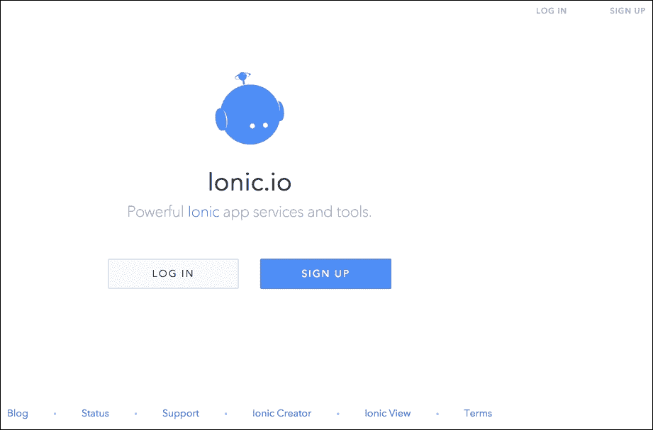
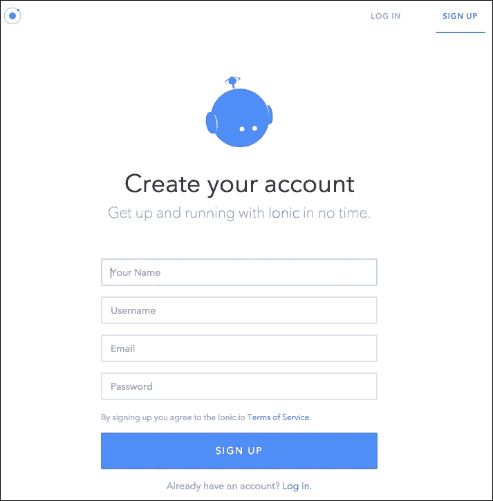
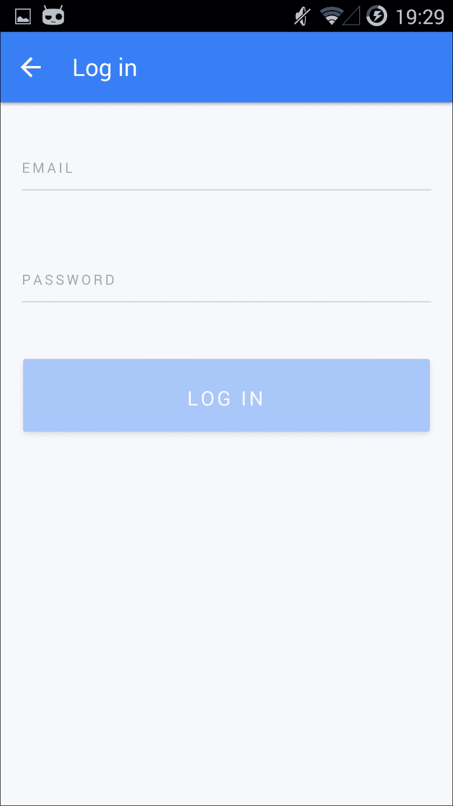
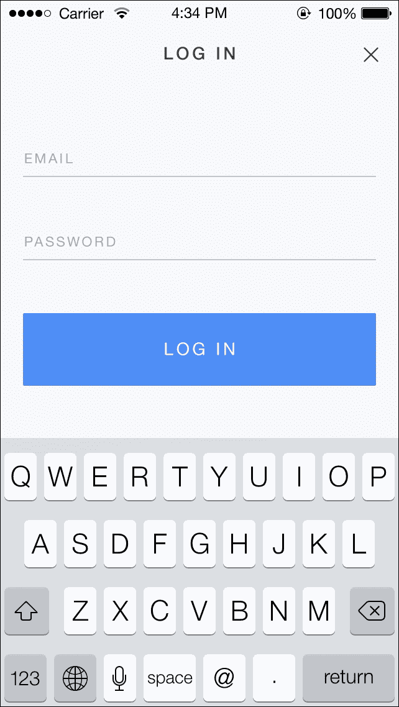
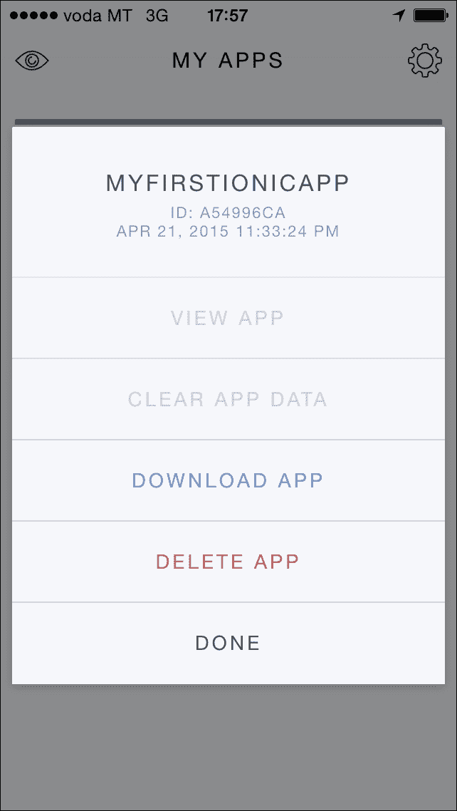
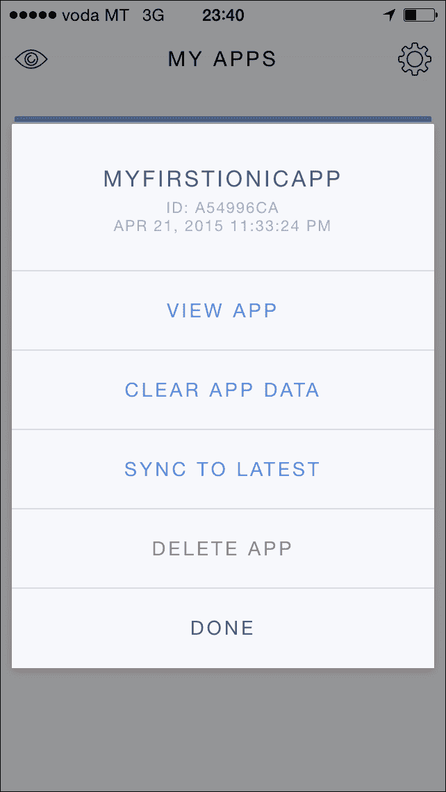
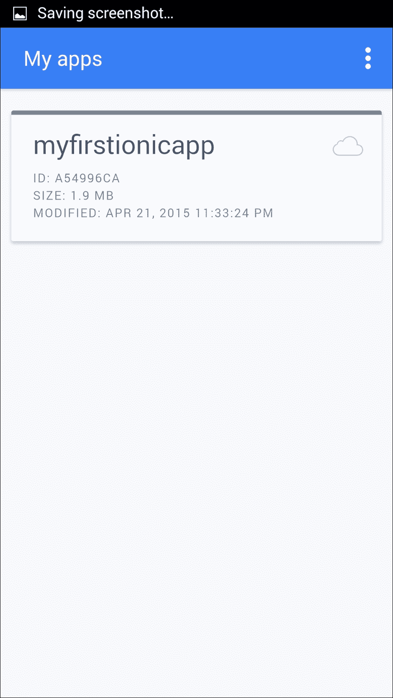
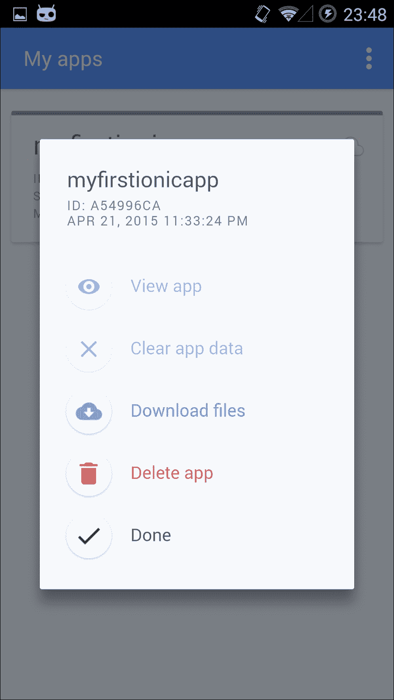
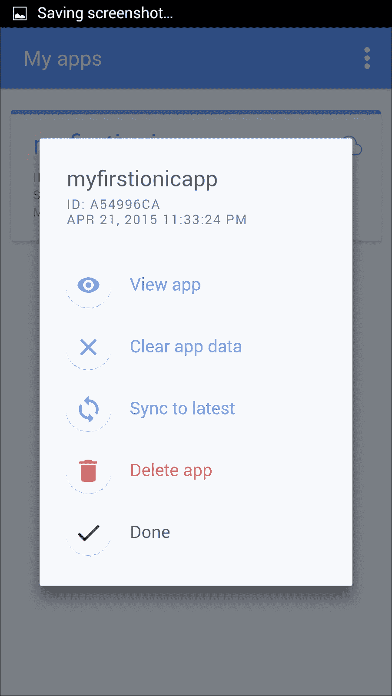

# 六、引入Ionic

ion 是一个免费开源的移动优化 HTML、CSS 和 JavaScript 组件、手势和工具库，可用于构建高度交互的移动应用。围绕广泛使用的 **【语法上令人敬畏的样式表】** ( **萨斯**)和 AngularJS 技术构建，爱奥尼亚为具有 HTML、CSS 和 JavaScript 基础知识的网络开发人员提供了开发跨平台移动应用的机会。

在本章中，我们将介绍以下内容:

*   设置您的Ionic网络服务
*   创建您的第一个Ionic应用
*   使用Ionic视图测试您的应用
*   与您的合作者共享您的作品

# 设置您的爱奥尼亚网络账户

在[第 1 章](01.html "Chapter 1. Setting Up Your Workspace")*设置您的工作区*中，我们重点介绍了为爱奥尼亚设置工作区的基本要点，包括安装核心爱奥尼亚库以及安卓和 iOS 软件开发工具包。

在本节中，我们将进一步阐述在`ionic.io`上设置帐户，这是一种网络服务，允许我们通过Ionic视图应用在安卓和 iOS 设备上轻松部署和测试我们的创作。通过Ionic网络服务，我们还将能够配置推送通知等功能，这是与您的应用受众进行交互的绝佳方式。

要开始设置您的`ionic.io`网络帐户，请访问[apps . ion . io](http://apps.ionic.io)并点击**注册**:



注册界面如下图所示:



当填写基本细节时，您会受到以下屏幕的欢迎，它将为您提供设置您的第一个Ionic项目的整体视图:


# 创建您的第一个Ionic应用

要启动第一个Ionic项目，打开终端并运行`start`命令，如下所示:

```js
$ ionic start myfirstionicapp

```

然后，您需要将目录更改为您的Ionic项目目录，该目录与您的项目标题相同:

```js
$ cd myfirstionicapp

```

导航到正确的目录后，您需要使用以下命令登录到您的 Ionic web 帐户。然后输入与您的帐户和密码相关的电子邮件地址:

```js
$ ionic login

```

验证您的凭据后，您将能够使用以下命令将首次创建的内容上传到Ionic网络服务:

```js
$ ionic upload

```

一旦你上传了你的应用，你将能够看到你的应用与Ionic网络服务应用仪表盘，你将能够看到你所有的Ionic应用:


# 使用Ionic视图查看您的Ionic应用

爱奥尼亚已经为 iOS 和安卓推出了一个非常漂亮的应用，你可以在几分钟内在你的智能手机上看到并测试你的应用创作。我们首先需要在您的特定设备上安装Ionic视图。

## 在安卓上安装Ionic视图

在谷歌 Play 商店上搜索Ionic视图应用，并将其下载到您的设备上。

当您第一次加载应用时，您将看到以下屏幕，您将被要求输入您的登录凭据:



一旦您登录，应该会出现一个包含您当前应用的仪表板。

## 在 iOS 上安装Ionic视图

在应用商店上搜索Ionic视图，并将其下载到您的设备上。安装应用后，您将看到以下内容，系统会要求您输入登录凭据:


这就是登录页面的样子:



当您第一次登录时，根据您是否按照前面的说明成功地将应用上传到了Ionic应用网络服务，您应该能够看到如下内容:


## 在 iOS Ionic视图应用上测试应用

一旦您第一次加载了应用并登录，您将能够开始测试您的应用。您可以点击**下载应用**，将您的应用下载到您的设备上，从而进入本阶段:



下载应用后，你会看到如下截图所示，在这里你可以选择在你的设备上查看应用。要试用您的应用，请点击**查看应用**:



您的第一个ion 应用是基于 ion 框架提供的样板，以突出 ion 的功能。测试完应用后，要退出应用，您需要用三个手指在屏幕上向下滑动:


## 在安卓系统上测试你的应用

从Ionic视图应用登录后，您将看到下面的截图，其中显示了您所有Ionic应用的仪表板。要开始在安卓系统上测试您的应用，请使用类似于 iOS Ionic视图应用的方法，您需要将应用下载到设备上:



点击后，点击**我的问题程序**，点击**下载文件**将应用数据从Ionic网络服务同步到您的设备:



一旦应用同步到您的设备，您将看到以下内容。这将启用**查看应用**。点击相应的按钮查看您的应用:



一旦你加载了应用，你会看到下面的应用，它是完全启用的。该应用在Ionic**视图应用**中工作，给人一种工作应用的感觉。如前所述，我们一起创建的应用是基于由Ionic框架团队生成的样板文件。

正如您可能已经观察到的，这个移动应用遵循的设计惯例适用于每个平台，这进一步增强了Ionic框架为开发人员提供的价值主张。也就是说，跨平台应用适用于设备所基于的平台:


## 与合作者共享您的应用

与您的合作者分享您的应用非常简单。这可以通过网络服务和命令行来实现。通过网络服务，你需要点击你选择的爱奥尼亚应用上的齿轮图标，然后点击**分享**。

从命令行，您首先需要通过终端导航到您的项目目录。然后，您需要通过键入以下命令来登录:

```js
$ ionic login

```

一旦您登录，您只需要键入以下命令并用您选择的合作者的电子邮件地址替换`EMAIL`:

```js
$ ionic share EMAIL

```

您的合作者将收到一封邀请查看该应用的电子邮件。我们建议他们通过移动设备查看此电子邮件，以便能够看到该应用。

# 走得更远

在Ionic框架的生态系统中有许多令人难以置信的特性，这些特性使框架更上一层楼。值得通过查看他们的文档来探索Ionic框架的不同特性，这些文档可在[http://docs.ionic.io/](http://docs.ionic.io/)获得。

如果您想进一步尝试，在此阶段探索如何为您的Ionic应用项目、Ionic实验室、Ionic分析和部署设置推送通知将是值得的。

Ionic实验室允许您在浏览器中并排查看您的Ionic应用的安卓和 iOS 版本，这让您有机会看到Ionic支持的不同平台之间的显著差异。在下一章中，我们将更频繁地使用 Ionic lab，因为您现在应该能够理解如何为我们的不同需求构建不同的用户界面。

# 总结

在本章中，我们介绍了设置工作环境以高效创建和共享Ionic应用的所有基本要素。如前所述，还有许多其他工具值得尝试，这些工具将帮助您有效地创建应用的工作流程，我们在本章中没有详细介绍。

在下一章中，我们将学习一个Ionic项目的一般结构，以及它的组件如何一起工作来创建移动体验。这些组件基于 web 技术，但外观、感觉和工作方式都像本机应用。