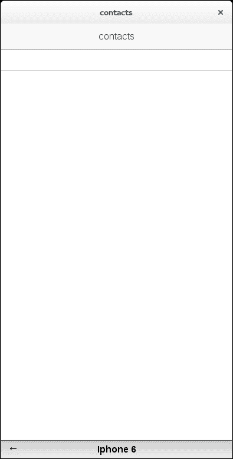

# 第八章。让我们的应用互动

在前一章中，我们给了你一个如何在爱奥尼亚使用用户界面的要点。在这样做的同时，我们还向您全面介绍了 AngularJS，这是离子应用背后的驱动力，并解释了您如何使用它来让用户与您的应用交互。

在这里，我们将继续以此为基础，同时探索 ion 的新功能，包括与您设备的本机功能的交互。我们将通过构建一个具体的应用来实现这一切，该应用将加载并显示您电话簿中的联系人。通过这样做，您还将学习如何在物理设备(如 iPhones 和安卓手机)上编译和运行 ion 应用，而不是我们迄今为止使用的仿真器。

# 创建新项目

ion自带强大的 **命令行界面** ( **CLI** )，可以快速创建、修改和扩展 ion 项目。通过自动化诸如模块集成和脚手架之类的杂务，它可以极大地提高您的生产力。

让我们使用 CLI 创建一个基本项目，以便在本章中使用。转到您的工作目录，并在终端中运行以下内容:

```js
ionic start phonebook-app blank

```

这将创建一个空白的应用，只包含一个基本的工作应用的基本组件。这适合我们，因为我们想从头开始构建一个应用，边走边学。

### 注

`ionic start`命令还有其他几个基本模板。例如`tabs`模板给你一个可以扩展的带有选项卡式导航的基本应用，而侧边菜单创建一个带有侧边菜单的用于导航的基本应用。

当此命令完成运行时，您将有一个完整的项目要处理。不需要额外的摆弄！现在，让我们继续在其中添加一些内容。

# 创建一个基本的 MVC 项目

本章中我们的目标是创建一个应用，可以从本地设备的联系人存储中提取信息并显示给用户(如果您愿意，可以是电话簿)。为此，我们需要做以下事情:

*   定义一个**视图**(模板文件)来显示联系人列表
*   定义一个**控制器**，以便处理与列表的交互
*   提供必要的**模型**逻辑，以便提供联系人信息。

您可能还记得，这个工作流非常适合 AngularJS 的整体架构，它遵循 MVC 模式。我们将依次处理每一项。

## 创建视图

继续并将以下文件夹添加到您的项目中:

```js
www/templates
```

在这里，我们将存储在整个项目中使用的所有视图模板。在这个文件夹中，让我们创建第一个视图文件，如下所示:

```js
www/templates/contacts.html
```

如果我们需要在我们的应用中添加额外的视图，我们将以同样的方式进行。像这样划分我们的视图不仅使组织更容易，而且提高了性能，因为 HTML 只会在需要时按需加载，而不是一次全部加载。

让我们添加一些内容来创建一个实际的视图:

```js
<ion-view view-title="contacts">
  <ion-content>
    <ion-list>
      <ion-item>
      </ion-item>
    </ion-list>
  </ion-content>
</ion-view>
```

暂时不要关心与列表相关的标签；我们一会儿就去做他们要做的事情。现在，让我们看看两个外部的:

*   `ion-view`:这个标签告诉 Ionic，这是一个可以从应用其他部分动态加载的视图。我们向其中添加视图标题属性，以便创建可用于引用视图的标签。
*   `ion-content`:这个标签指定了视图中的一个内容区域，特别擅长显示滚动数据。由于我们想要显示一个未知长度的联系人列表，这就是我们想要包装的列表。

### 创建列表视图

列表是应用中最普遍的数据结构。因此，大多数框架都提供了强大的工具来使用它们也就不足为奇了。爱奥尼亚当然也不例外。

看看我们之前添加的代码。特别注意`ion-content`标签内的标签:

```js
<ion-view view-title="contacts">
  <ion-content>
    <ion-list>
      <ion-item>
      </ion-item>
    </ion-list>
  </ion-content>
</ion-view>
```

以下两个标签封装了 ion 的大部分列表呈现功能，通常是显示列表所需的一切:

*   `ion-list`:表示包装的内容是列表
*   `ion-item`:表示单个数据节点，可以呈现在列表中

由于我们列表中的每一项都是一个联系人，因此我们会将它们包装在一个`ion-item`标签中。

目前，我们的视图除了显示一个空列表之外并没有做什么。我们需要添加一些标记，以便显示包装在每个项目中的联系人的详细信息。让我们先做一些基本的事情，比如只显示联系人的姓名和手机号码，如果有的话:

```js
<ion-view view-title="contacts">
  <ion-content>
    <ion-list>
      <ion-item>
        <h2>{{contact.name}}</h2>
        <p>{{contact.number}}</p>
      </ion-item>
    </ion-list>
  </ion-content>
</ion-view>
```

这里，我们定义了两个 Angular 表达式来在运行时呈现联系人的名称和号码。这种情况下的联系人只是一个保存我们联系人列表中给定人员信息的 **JavaScript 对象符号** ( **JSON** )对象。接下来，我们将看到如何为这个 JSON 对象分配一个具体的值；这将发生在相关的控制器中。

### 注

在撰写本书时，官方发布的版本是 AngularJS 1.3，从这个版本开始，可以让表达式以一次绑定的方式运行。这意味着它们采用最初计算的值，之后的 AngularJS DOM 更新周期会跳过这些值，从而提高性能。在我们的例子中，这很有效，因为我们在获取数据后只显示一次数据，我们将在后面看到。这种方法的缺点是数据模型的更新不会反映在这个视图中。

要使表达式绑定一次，请在表达式前添加两个冒号(`::`)，如下所示:

```js
<ion-view view-title="contacts">
  <ion-content>
    <ion-list>
      <ion-item>
        <h2>{{::contact.name}}</h2>
        <p>{{::contact.number}}</p>
      </ion-item>
    </ion-list>
  </ion-content>
</ion-view>
```

## 创建控制器

你可能还记得控制器是你的视图和模型(也就是你的业务逻辑)之间的*粘合剂*。它的主要职责是处理用户与用户界面的交互，并将适当响应的处理委托给模型。

在前一章中，示例控制器位于一个单独的 JavaScript 文件中，在那里它们被声明为模块的一部分。这是一个很好的设计实践，因为它让你更容易构建你的应用。

请注意，我们的空白项目没有这样的文件。所以，让我们从创造它开始。将以下文件添加到项目中:

```js
www/js/controllers.js
```

在这个文件中，让我们添加以下内容:

```js
angular.module('phonebook.controllers', [])
controller('ContactsCtrl', function ($scope) {
});
```

让我们简要回顾一下来看看前面的代码是做什么的:

1.  我们使用核心`angular.module()`函数定义了一个模块，它采用以下参数:
    *   第一个参数是`phonebook.controllers`，是模块的名称。
    *   第二个参数是一个空列表，表示这个模块没有外部依赖。如果是的话，我们会在这里列出它们的名字，这样 AngularJS 依赖注入系统就可以在运行时解析它们。
2.  创建一个模块后，我们使用(恰当命名的)核心功能`controller()`将一个控制器附加到它上面。以下参数被传递给此函数:
    *   `ContactsCtrl`，也就是控制器的名字，是第一个参数。
    *   第二个参数是一个`function`，它定义了控制器做什么。在这个控制器中，我们将定义在这个控制器控制的应用段中发生的所有动作。请注意，该函数采用`$scope`参数(稍后我们将了解它的功能)。就像模块中的依赖列表一样，这个参数和传递给函数的所有其他参数(可以有任意数量的参数，也可以没有参数)表示这个控制器的依赖，这将在运行时使用依赖注入系统来解决。

目前，这是我们拥有一个成熟的控制器所需要的。接下来，我们需要将它与我们的观点联系起来。

## 连接视图和控制器

如果我们需要将新创建的视图和控制器放在一起，我们有以下两个选择:

*   我们可以使用内联视图，其中我们将视图和控制器的引用直接放在`index.html`文件或另一个模板中，该模板又从`index.html`加载
*   我们可以使用路由器将视图及其控制器与应用中的特定路径相关联

即使我们现在只有一种观点，我们还是会选择第二种。这看起来可能是多余的，但是如果我们想在以后添加新的导航状态(剧透——我们会的！)

路由通常在`app.js`文件中配置。所以，这就是我们接下来要去的地方。打开文件，确保它包含以下内容:

```js
angular.module('phonebook', ['ionic', 'phonebook.controllers'])
.run(function ($ionicPlatform) {
  $ionicPlatform.ready(function () {
    if (window.cordova&&window.cordova.plugins.Keyboard) {
      cordova.plugins.Keyboard.hideKeyboardAccessoryBar(true);
    }
    if (window.StatusBar) {
      StatusBar.styleDefault();
    }
  });
})
.config(function ($stateProvider, $urlRouterProvider) {
  $stateProvider
  .state('contacts', {
    url: '/',
    templateUrl: 'templates/contacts.html',
    controller: 'ContactsCtrl'
  });
  $urlRouterProvider.otherwise('/');
});
```

让我们考虑一下这里发生了什么，尤其是在`config`函数中。在这里，我们通过配置`$stateProvider`和`$urlRouterProvider`展示的路由模块，为我们的应用设置核心导航设置。默认情况下，爱奥尼亚使用T3(更多信息，请访问[https://github.com/angular-ui/ui-router](https://github.com/angular-ui/ui-router))。这个路由器是面向状态的。也就是说，它让你把你的应用构造成一个状态机，每个状态可以连接到一个路径和一组视图和控制器。这种设置使得使用嵌套视图变得非常容易，这在为移动设备开发时是一种常见的情况，在移动设备中，像选项卡、侧面菜单等导航元素非常常见。

了解了这一点，让我们考虑一下这段代码实际上是做什么的:

1.  `config`函数本身有两个参数，`$stateProvider`和`$urlRouterProvider`。两者都是属于`ui-router`的配置接口，可以在应用引导时用来配置路由器。
2.  我们使用参数将状态联系人添加到我们的应用中。当应用处于这种状态时，我们保持以下属性:
    *   app 内的当前路径是 root ( `/`)，也就是说，每当我们在 app 的初始路径时，我们都处于这种状态。
    *   该状态下要加载的模板是`templates/contacts.html`，与我们之前创建的视图模板相同。
    *   与该视图相关联的控制器是`ContactsCtrl`，这也是前面定义的。由于我们的`phonebook.controllers`模块是作为我们的应用的依赖项加载的(参见`app.js`第一行)，我们只需要命名控制器，依赖项注入系统将完成剩下的工作。
3.  最后，我们为我们的应用配置一个默认路由。如果没有提供其他有效路线，我们的导航将解析到这条路线。在我们的例子中，我们总是默认开始屏幕。

这就是我们要走的路线！接下来，我们需要确保`index.html`文件有必要的内容来加载到目前为止我们配置的所有文件，包括新的联系人视图。打开它，并确保它包含以下内容:

```js
<!DOCTYPE html>
<html>
  <head>
    <meta charset="utf-8">
    <meta name="viewport" content="initial-scale=1, maximum-scale=1, user-scalable=no, width=device-width">
    <title></title>

    <link href="lib/ionic/css/ionic.css" rel="stylesheet">
    <link href="css/style.css" rel="stylesheet">

    <!-- ionic/angularjsjs -->
    <script src="lib/ionic/js/ionic.bundle.js"></script>

    <!-- cordova script (this will be a 404 during development) -->
    <script src="cordova.js"></script>

    <!-- your app's js -->
 <script src="js/controllers.js"></script>
    <script src="js/app.js"></script>
  </head>
  <body ng-app="phonebook">

 <ion-nav-bar class="bar-stable">
 <ion-nav-back-button></ion-nav-back-button>
 </ion-nav-bar>

 <ion-nav-view></ion-nav-view>

  </body>
</html>
```

注意突出显示的部分:

*   `script`标签只是导入`phonebook.controllers`模块。
*   The `ion-nav-bar` tag creates a standard navigation bar, which displays content specific to the current navigation context that the app is in.

    如果你拥有一个安卓设备，这将类似于顶部的动作栏，在那里你有你的应用标志，当前视图的名称，等等

    同样，如果你有一部 iPhone，这个栏将是底部栏，通常包含应用的导航标签

*   `ion-nav-back-button`标签创建了一个按钮，从当前导航上下文返回到上一个导航上下文，很像浏览器中的后退按钮。
*   最后，`ion-nav-view`是一个特殊的标签，它告诉 AngularJS 路由系统应该在哪里绑定模板。在我们的例子中，当我们的导航上下文是联系人状态时，这就是`templates/contacts.html`模板将被渲染的地方，正如我们之前在路由器`config`中定义的那样。

## 测试连接

这就是我们应用基本设置所需的全部内容。为了确保它能够运行，让我们在模拟器中进行测试。从项目文件夹的根目录，在终端或命令行中运行以下命令:

```js
ionic serve

```

您应该会看到前面命令的以下输出:



### 注

根据运行模拟器的浏览器，您可能看不到顶部或底部栏。这不是由 Ionic 生成的，而是由 Chrome 插件生成的，Chrome 插件会自动设置窗口大小以匹配 iPhone 6。这个插件叫做 **【移动/响应网页设计测试员】**，我们建议你在自己的项目中尝试一下。

## 创建模型

我们现在有了一个工作视图和控制器。接下来，我们需要一个能够响应用户输入提供所需数据的模型。

### 服务

在 AngularJS 中，在控制器中保持尽可能少的逻辑被认为是良好的设计实践。请记住，控制器应该只是视图和模型之间的粘合剂。理想情况下，他们不应该负责任何繁重的数据提取和处理工作。为此，AngularJS 提供了服务。

服务是由依赖注入系统按需注入到应用的其他组件中的对象。如果你回头看`app.js`代码，你已经看到了其中的一些；`$stateProvider`和`$urlRouterProvider`的论点都属于这一类。

如果你看看先进的 AngularJS 应用，你会发现服务几乎无处不在。它们构成了几乎任何应用的很大一部分，可以用来包含几乎任何种类的功能。例如，我们可以创建一个服务，封装对给定 REST API 的访问，允许我们通过一组实用函数来查询它，而服务本身处理与服务器的连接、安全性等。同样，我们可以定义一个服务，它代表一组数学运算，可以向这些运算提供简单的数据，以便获得算术结果。

**服务**是 **单件**，这意味着在运行时每个服务只有一个实例。

以这种方式实现业务逻辑很重要，原因有几个，其中一些如下:

*   它提供了模块化的界面来处理应用业务逻辑的某个方面。您的模型可以围绕几个服务构建，每个服务都提供应用功能的一个基本特性。
*   这是高效的，因为在整个应用中，每个服务只有一个实例可用。
*   这使得扩展你的应用变得更加容易，因为功能单元可以在任何需要的地方定义和注入。

既然我们已经确定了服务有多棒，自然的问题是，我们将如何着手创建它们？

#### 创建服务

AngularJS 提供了几种创建服务的方法。这些方法被称为食谱。总共有五个——常量、值、提供者、工厂和服务。每个都有不同的复杂性和适合它们的用例:

*   **常量**:最简单的服务，用于定义单个常量，在整个应用中都可用。它与其他四个不同之处在于，当应用启动时，它会立即实例化，这意味着它可以在应用生命周期的配置阶段使用。常量通常用于包含常量值，如基本 URL。
*   **值**:这是类似于常量，值得注意的是在 app 的配置阶段不可用。也可用于`decorators`。
*   **Factories**: Whereas constants and values are used to store simple values, factories begin making things much more interesting:
    *   它们提供工厂函数，可以用来定义逻辑，而不仅仅是值。这意味着工厂可以提供多种功能，这些功能根据输入计算值。
    *   工厂可以有依赖关系，这意味着您可以使用其他服务来构建它们。
    *   工厂被延迟实例化，这意味着它们只在需要的时候被实例化。

    对于我们的应用来说，这是我们将要使用的配方，因此你很快就会看到它的例子。事实上，我们认为工厂将适合大多数应用的大多数可用用例。

*   **服务**:服务和工厂非常非常相似。虽然语义上有一些细微的差别，但它们真正的贡献是提供了一个简洁的语法。使用工厂或服务几乎总是偏好的问题。哦，万一你对这个名字有疑问，AngularJS 开发人员自己会后悔称它为*服务*，把它比作给你的孩子命名*孩子*。
*   **提供商**:最后最先进的配方是**提供商**，它提供了服务提供的全部功能(不，不是我们刚才提到的那些；我们正在谈论实际的服务——命名是一个非常糟糕的主意，不是吗？)特别是，提供商允许您在应用的`config`阶段将服务公开给配置，然后在`run`阶段实际使用服务。值得注意的是(也许令人惊讶的是)，提供商实际上是服务的唯一配方；前面四个只是简化用法的语法糖。因为它太复杂了，所以对大多数情况来说都是一种过度杀伤，这就是为什么根据您的模型逻辑有多复杂，有其他选项可供选择。

这么多知识，这么少空间！让我们通过实际创建一个检索联系人的工厂来充分利用我们所学的知识。

### 创建工厂

像控制器一样，习惯于将您的服务定义放在它们自己的文件中(或者文件，如果您喜欢将每个服务配方放在它自己的文件中的话)。在这里，我们使用一个共同的文件为他们所有人)。在项目目录中，创建以下文件:

```js
js/services.js
```

在这个文件中，放入以下内容:

```js
angular.module('phonebook.services', [])
.factory('contactsFactory', function contactsFactory() {
  return {
    all: function () {
      return [];
    }
  }
});
```

让我们看看我们做了什么:

我们创建了一个名为`phonebook.services`的模块来托管我们的服务

我们定义了一个名为`contactsFactory`的基本`factory`服务

暴露单一效用方法的服务叫做`all`，目前没有任何作用(我们很快会改变这一点，不用担心)。

现在，我们需要修改`app.js`和`index.html`文件，以便让应用知道新服务。确保`app.js`文件以下列内容开头:

```js
angular.module('phonebook', ['ionic', 'phonebook.controllers','phonebook.services'])
```

这将服务模块注入主应用。现在，我们只需要导入模块所在的文件。为此，请确保您在`index.html`中的 JavaScript 导入如下所示:

```js
<!-- your app's js -->
<script src="js/controllers.js"></script>
<script src="js/services.js"></script>
<script src="js/app.js"></script>
```

就这样！我们现在已经为我们的应用打下了基础。但是，如果您再次运行模拟器，您会注意到没有太大变化。我们仍然被同一个空白屏幕迎接。现在，是时候通过加载联系人列表向我们的应用添加一些实际内容了。

# 访问设备数据

现在我们 app 的基础已经实现，是时候给它添加一些严肃的数据了。在我们的例子中，我们希望加载存储在运行我们的应用的设备上的联系人，以便我们可以在之前创建的列表中显示他们。

## 访问本地服务

大家可能还记得，ion 是建立在 Cordova 平台之上的，它提供了与底层操作系统和硬件的核心交互。为了访问本地服务，例如联系人列表，我们经常不得不直接使用科尔多瓦。

在这种特殊情况下，我们处于一个非常容易的位置；科尔多瓦不仅有一个成熟的插件来与联系人交互，而且还有一个非常方便的命令行界面方法来安装它。

转到项目目录，从终端或命令行运行以下命令:

```js
cordova plugin add org.apache.cordova.contacts

```

这将安装科尔多瓦联系人插件，该插件将放在以下文件夹中:

```js
plugins/org.apache.cordova.contacts
```

在我们继续之前，请随意检查文件。接下来，我们需要将这个插件与 ion 集成，这样我们就可以在我们的应用中使用它。

## 恩科尔多瓦

科尔多瓦本身对离子炮和安古拉炮一无所知。因此，以 Angular 方式访问的服务通常需要包装代码。幸运的是，已经有了一个广泛的图书馆来满足这一确切的目的——**ngCordova**。

要安装它，请转到项目文件夹的根目录，并从终端运行以下命令:

```js
bower install ngCordova

```

这将安装我们需要的一切。接下来，让我们再次通过修改`app.js`和`index.html`文件将其导入我们的应用。在`app.js`中，确保你的应用依赖现在包括`ngCordova`，如下所示:

```js
angular.module('phonebook',
  [
    'ionic',
    'ngCordova',
    'phonebook.controllers',
    'phonebook.services
])
```

同样，在`index.html`中，确保我们导入了相应的 JS 库，如下所示:

```js
<!-- AngularJS bindings for Cordova -->
<script src="lib/ngCordova/dist/ng-cordova.min.js"></script>
```

## 为我们的工厂添加科尔多瓦触点

这里的最后一步是将科尔多瓦联系人与`contactsFactory`服务集成，以便让它为设备上可用的联系人提供服务。打开`js/services.js`文件，确保包含以下内容:

```js
angular.module('phonebook.services', [])
.factory('contactsFactory', function contactsFactory($q, $cordovaContacts) {
  /**
  * Turns a raw contact into something more suitable for viewing.
  *
  * @paramrawContact
  */
 function processContact(rawContact) {
 return {
 name: rawContact.name ? rawContact.name.formatted : '',
 number: rawContact.phoneNumbers ? rawContact.phoneNumbers[0].value
 }
 }

  return {
    all: function () {
      // It may take some time to fetch all contacts, so we defer it.
 var deferred = $q.defer();
 $cordovaContacts.find({multiple: true}).then(function (contacts) {

 varprocessedContacts = [];
 contacts.forEach(function (contact) {
 processedContacts.push(processContact(contact));
 });

 deferred.resolve(processedContacts);
 }, function (error) {
 deferred.reject(error);
 });
 return deferred.promise;
    }
  }
});
```

重要的部分突出显示。让我们弄清楚发生了什么:

*   我们为工厂注入了以下依赖项:
    *   `$q`:这是用来和`promises`一起工作的 AngularJS 服务。这将允许我们创建`deferred`函数，在稍后阶段解析为一个值。在这一点上，可以用他们的结果做一些事情。
    *   `$cordovaContacts`:这是被 ngCordova 包装的 Cordova 联系人插件本身。
*   由于原始联系数据相当笨重，我们定义了一个实用方法，以便将其处理成更轻量级的东西。
*   我们创建了一个`promise`，它将返回给使用我们服务的人。这种情况下的`promise`是，在某个时候，我们会发送一个联系人列表，或者一个错误，指出我们为什么不能这样做。
*   我们调用`cordovaContacts`的`find()`函数，和同名的 MongoDB 函数非常相似；它只是返回所有可用的联系人。
*   如果我们能得到联系人列表，我们会解析`promise`并将列表交给来电者。
*   如果我们无法获得联系人列表，我们将拒绝该承诺，这表明我们无法获得所请求的内容。由`cordovaContacts`创建的错误信息返回给用户。

我们的服务现在都配置好了，可以走了。不过，还有一个主要障碍。模拟器没有可供我们显示的联系人！为了继续前进，我们首先必须绕道而行，看看如何在物理设备上部署应用，然后通过向用户显示联系人来最终包装我们的应用。

# 构建本地设备

到目前为止，我们在 Ionic 中所做的一切都已经在模拟器或远程服务中进行了测试。现在，我们有了一个使用真实手机功能的应用，是时候我们终于全力以赴，构建最终的终端产品——移动应用了。

由于有了离子命令行界面，在物理设备上构建和部署离子应用变得非常容易。我们将在下一节演示如何做到这一点。

## 安卓

从项目文件夹的根目录，运行以下命令:

```js
ionic platform add android

```

这将添加在安卓设备上部署应用所需的所有文件。

接下来，我们有两个选项来运行我们的应用——一个实际的安卓模拟器或一个物理设备。

### 仿真器

要在模拟器中运行应用，首先通过运行以下命令构建项目:

```js
ionic build android

```

最后，启动模拟器并通过运行以下命令部署应用:

```js
ionic run

```

### 物理设备

在物理设备上运行应用就像在仿真器上运行应用一样简单。首先，连接一个可以通过 USB 接受 APK 安装的安卓设备(有关设置的说明，请参见[第 1 章](01.html "Chapter 1. Setting Up Your Workspace")、*设置您的工作区*)。完成后，运行以下命令:

```js
ionic build android

```

最后，运行以下命令，在连接的设备上安装并运行 APK:

```js
ionic run

```

一旦应用部署完毕，它将在您的设备上自动启动。

# 列表视图重访

我们现在将为我们的应用添加收尾工作，如下所示:

1.  使用逻辑显示我们从联系人列表中提取的联系人
2.  添加拉取刷新功能，以便用户能够动态刷新用户列表。

首先，让我们修改`contacts.html`文件，以便处理列表本身的渲染。打开文件，确保它看起来像这样:

```js
<ion-view view-title="contacts">
  <ion-content class="has-header">
 <ion-refresher
 pulling-text="Pull to refresh"
 on-refresh="doRefresh()">
 </ion-refresher>
    <ion-list>
    <ion-item collection-repeat="contact in contacts" type="item-text-wrap">
      <h2>{{contact.name}}</h2>

      <p>{{contact.number}}</p>
    </ion-item>
    </ion-list>
  </ion-content>
</ion-view>
```

大多数事情看起来都一样，但我们强调了一些重要的变化:

*   我们添加了一个`ion-refresher`标签，它为我们的视图创建了一个拉刷新界面。当用户在屏幕上向下滑动手指时，将显示文本**拉动刷新**。如果随后执行完整的手势(即滑动和放下)，将调用在该视图范围内定义的`doRefresh()`功能。我们将稍微定义一下这个函数。
*   我们给`ion-item`标签添加了一个`collection-repeat`属性。这是`ng-repeat` AngularJS 属性的变体，这意味着将为联系人集合中的每个联系号码创建一个`ion-item`。联系人集合需要在视图的范围内定义，这将在接下来进行。

修改`controllers.js`文件，使其看起来像下面的代码:

```js
angular.module('phonebook.controllers', [])
.controller('ContactsCtrl', function ($scope, contactsFactory) {
  // List of contacts
  $scope.contacts = [];

  $scope.doRefresh = function () {
    contactsFactory.all().then(
      function (contacts) {
        $scope.contacts = contacts;
        $scope.$broadcast('scroll.refreshComplete')
      },
      function (error) {
        alert(error);
        $scope.$broadcast('scroll.refreshComplete')
      },
      function (notify) {
        console.log("Just notifying");
    });
  };
});
```

让我们考虑一下这里发生了什么:

*   我们创建了空的联系人列表，并将其绑定到注入该控制器的`scope`标签。这对应于我们认为`collection-repeat`指令使用的相同联系人列表。
*   同样，我们将视图中已经看到的`doRefresh`函数绑定到我们的范围。我们让它做了以下工作:
    *   调用`contactsFactory`类的`all()`方法。这给了我们一个承诺，一个联系人列表将在未来某个时间交付。
    *   如果承诺实现了，我们将结果列表绑定到范围。Angular 将通过刷新视图来响应此更改，以便适应模型中的此更改，并使用 collection-repeat 用联系人信息填充列表。
    *   If the promise fails, we display an error message.

        棱角分明的承诺让我们能够倾听承诺的进度通知。我们在这里不使用这个特性，但是我们只是捕捉这样的消息。

就这样！您现在应该可以运行您的应用并浏览您的联系人。再次完成原生设备的构建步骤并进行测试！

# 总结

在这一章中，我们涉及了很多内容，深入探讨了 AngularJS，并了解了更多关于模型、视图和控制器的交互。我们还看到了如何使用 Cordova 插件和 ngCordova 来访问原生特性(这将是我们在未来章节中要做的事情)。最后，我们看到了如何创建服务并使用它们来向用户提供数据。

我们还建议使用您最喜欢的浏览器的 inspect element 工具，它可以让您了解运行应用时可能遇到的任何显示错误。