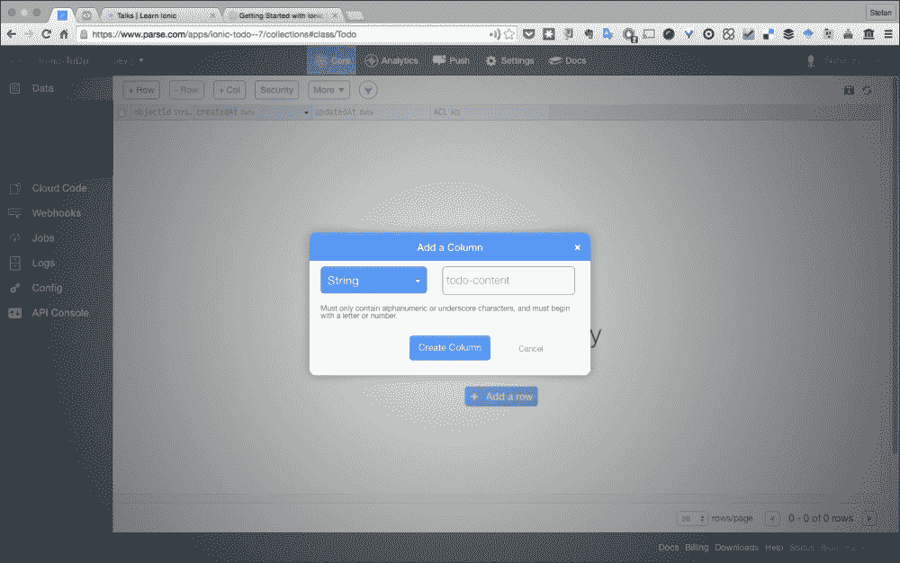
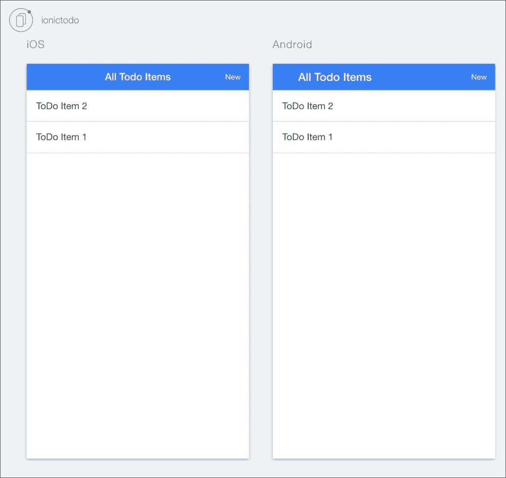

# 十、使用 API

在应用的创建过程中，在当今动态的生活和工作环境中，将您的移动应用连接到后端将有助于数据存储和将数据连接到配套网络应用的过程，这将为用户提供增强的功能和令人满意的体验。

通过使用`Parse.com` REST 应用编程接口，可以为您的项目引入后端。Parse 提供了一个易于使用、简单明了且可扩展的平台，可以在基于 ion 框架的应用中实现。

在本章中，我们将从设置一个解析后端和一个Ionic项目开始。在此之后，我们将在它们之间创建一个连接，以达到我们期望的效果。

# 设置解析

启动和运行该项目所需的第一步是访问[www.parse.com](http://www.parse.com)并创建一个帐户，或者登录该网站(如果您已经有帐户)。在免费计划中，您将获得 20 GB 的文件存储空间、20 GB 的数据库存储空间以及传输高达 2 TB 数据的能力。

如果您是第一次使用`Parse.com`，您将受到以下屏幕的欢迎:


让我们将命名为应用`Ionic-ToDo`。创建应用后，如果这是您使用 Parse 创建的第一个应用，您将看到以下屏幕。确保记下**应用标识**和**休息应用编程接口键**:


下一部分涉及到进入**数据浏览器**。在这个视图中，点击侧边栏中的**添加班级**。类的角色是在 Parse 应用实例中存储数据。在我们的案例中，我们将命名类`Todo`并选择**自定义**作为类类型:


要完成课程创建过程，点击**创建课程**，您将准备好您的课程。在数据浏览器中，您将看到新创建的类已经有了一些属性:

*   `objectId`:这是一个唯一的 ID，代表集合中的单个`Todo`项目
*   `createdAt`:这告诉我们`Todo`项是什么时候添加到解析的
*   `updatedAt`:这告诉我们`Todo`项上次更新的时间

为了个性化`Todo`应用并允许创建待办事项，我们需要一个自定义属性来保存`Todo`项目的内容。在数据浏览器中，点击 **+Col** ，弹出如下对话框:



对于这个属性，我们将选择**字符串**作为列的类型，并在名称字段中输入`todo-content`。点击**创建栏目**结束这个过程，我们就完成了！

一旦我们准备好了课程，我们就可以开始创建我们的Ionic应用了。

# 设立Ionic项目

我们将通过运行以下命令来创建Ionic应用:

```js
ionic start ionictodo blank

```

这将创建一个名为`whichapp`的空白Ionic启动器应用，它将为我们提供将解析服务连接到我们的项目所需的必要设置。

# 将解析连接到我们的项目

为了将解析数据连接到我们的项目中，我们需要创建一个执行必要的 CRUD 操作来与解析 REST API 交互的服务。

我们选择的代码编辑器是 Atom，GitHub 开源编辑器。首先，导航到项目文件夹，将其添加到 Atom:

**文件** | **添加项目文件夹**

使用以下路径创建名为`services.js`的文件:

**www**|**js**|**services . js**

首先连接`services`。如下定义`service`:

```js
angular.module('ionictodo.services',[]).factory('Todo',['$http',function($http){
  return {

  }
}]);
```

在这个阶段，我们的工厂对象`Todo`是一个空对象，我们需要向其中添加必要的`Parse.com` API 方法。需要注意的是，在所有情况下，主机名都是`https://api.parse.com`。`/1/`表示我们使用的是 API 的版本 1。

以下是具有五种必需方法的工厂对象:

```js
angular.module('ionictodo.services',[]).factory('Todo',['$http','PARSE_CREDENTIALS',function($http,PARSE_CREDENTIALS){
  return {
    getAll:function(){
      return $http.get('https://api.parse.com/1/classes/Todo'',{
        headers:{
          'X-Parse-Application-Id': PARSE_CREDENTIALS.APP_ID,
          'X-Parse-REST-API-Key':PARSE_CREDENTIALS.REST_API_KEY,
        }
      });
    },
    get:function(id){
    return $http.get('https://api.parse.com/1/classes/Todo/'+id,{
      headers:{
        'X-Parse-Application-Id': PARSE_CREDENTIALS.APP_ID,
        'X-Parse-REST-API-Key':PARSE_CREDENTIALS.REST_API_KEY,
      }
    });
  },
  create:function(data){
    return $http.post('https://api.parse.com/1/classes/Todo',data,{
      headers:{
        'X-Parse-Application-Id': PARSE_CREDENTIALS.APP_ID,
        'X-Parse-REST-API-Key':PARSE_CREDENTIALS.REST_API_KEY,
        'Content-Type':'application/json'
      }
    });
    },
    edit:function(id,data){
      return $http.put('https://api.parse.com/1/classes/Todo/'+id,data,{
        headers:{
          'X-Parse-Application-Id': PARSE_CREDENTIALS.APP_ID,
          'X-Parse-REST-API-Key':PARSE_CREDENTIALS.REST_API_KEY,
          'Content-Type':'application/json'
        }
      });
    },
    delete:function(id){
      return $http.delete('https://api.parse.com/1/classes/Todo/'+id,{
        headers:{
          'X-Parse-Application-Id': PARSE_CREDENTIALS.APP_ID,
          'X-Parse-REST-API-Key':PARSE_CREDENTIALS.REST_API_KEY,
          'Content-Type':'application/json'
        }
      });
    }
  }
}]);
```

我们将也需要申报`PARSE_CREDENTIALS` `value`服务，如下:

```js
.value(PARSE_CREDENTIALS 'PARSE_CREDENTIALS',{
  APP_ID: 'yourappid',
  REST_API_KEY:'yourrestapikey'
});
```

将`yourappid`和`yourrestapikey`分别替换为您之前提到的应用标识和 REST 应用编程接口密钥。

## 定义应用状态

为了连接不同应用的功能，我们需要为我们的应用定义一些状态，如下所示:

*   `todos`:这里列出了所有的待办事项
*   `createTodo`:这允许用户创建新的待办事项
*   `editTodo`:允许用户更新待办事项

应用状态在名为`whichfile`的`app.js`文件中定义，可通过以下路径获得:

**www**|**js**|**app . js**

用以下代码替换现有的`app.js`代码:

```js
angular.module('ionictodo', ['ionic','ionictodo.controllers','ionictodo.services'])

.run(function($ionicPlatform,$state) {
  $ionicPlatform.ready(function() {
    // Hide the accessory bar by default (remove this to show the accessory bar above the keyboard
    // for form inputs)
    if(window.cordova && window.cordova.plugins.Keyboard) {
      cordova.plugins.Keyboard.hideKeyboardAccessoryBar(true);
    }
    if(window.StatusBar) {
      StatusBar.styleDefault();
    }
    $state.go('todos');
  });
}).config(function($stateProvider){
  $stateProvider.state('todos',{
    url:'/todos',
    controller:'TodoListController',
    templateUrl:'views/todos.html'
  }).state('createTodo',{
    url:'/todo/new',
    controller:'TodoCreationController',
    templateUrl:'views/create-todo.html'
  }).state('editTodo',{
    url:'/todo/edit/:id/:content',
    controller:'TodoEditController',
    templateUrl:'views/edit-todo.html'
  });
});
```

## 创建控制器和模板

一旦您定义了状态，您需要创建控制器并为每个控制器提供一个模板。由于我们希望在列表视图中编辑和创建任务，我们将定义以下三个控制器:

*   `TodoListController`
*   `TodoCreationController`
*   `TodoEditController`

为了实现控制器，我们需要创建一个名为`controllers.js`的新文件，该文件应该可以通过以下路径获得:

**www**|**js**|**controller . js**

在这个文件中，我们将声明我们所有的控制器`whichcontrollers`，这将在以下代码的帮助下完成:

```js
angular.module('ionictodo.controllers',[]).controller('TodoListController',['$scope','Todo',function($scope,Todo){

  Todo.getAll().success(function(data){
    $scope.items=data.results;
  });

  $scope.onItemDelete=function(item){
    Todo.delete(item.objectId);
    $scope.items.splice($scope.items.indexOf(item),1);
  }

}]).controller('TodoCreationController',['$scope','Todo','$state',function($scope,Todo,$state){

  $scope.todo={};

  $scope.create=function(){
    Todo.create({content:$scope.todo.content}).success(function(data){
      $state.go('todos');
    });
  }

}]).controller('TodoEditController',['$scope','Todo','$state','$stateParams',function($scope,Todo,$state,$stateParams){

  $scope.todo={id:$stateParams.id,content:$stateParams.content};
  $scope.edit=function(){
    Todo.edit($scope.todo.id,{content:$scope.todo.content}).success(function(data){
      $state.go('todos');
    });
  }
}]);
```

对于每个控制器，我们需要模板来呈现控制器。我们将从`todo`列表控制器开始，它使用`ion-list`显示`todo`列表中的所有项目。为了从开始这个过程，我们将在`www`中创建一个新文件夹，命名为视图。在视图文件夹中，我们需要设计三个新的 HTML 文件，命名为创建- `todo.html`、`edit-todo.html`和`todos.html`。

对于`todos.html`，我们需要声明`ion-list` UI 元素如下:

```js
<ion-header-bar class="bar-positive">
  <div class="buttons">
    <button class="button button-icon icon ion-ios7-minus-outline" ng-click="data.showDelete = !data.showDelete;"></button>
    <h1 class="title">All Todo Items</h1>
    <button class="button" ui-sref="createTodo">New</button>
  </div>
</ion-header-bar>
<ion-content>
  <ion-list show-delete="data.showDelete">
    <ion-item ng-repeat="item in items | orderBy: '-createdAt'"
    item="item"
      href="#/todo/edit/{{item.objectId}}/{{item.content}}">
      {{item.content}}
      <ion-delete-button class="ion-minus-circled" ng-click="onItemDelete(item)"></ion-delete-button>
    </ion-item>
  </ion-list>
</ion-content>
```

新的`todo`列表的创建会显示一个文本区域和一个**添加**按钮。点击此按钮，调用`$scope.create()`方法。导航至**创建**|**todo.html**。这应该在代码中呈现如下:

```js
<ion-header-bar class="bar-positive">
  <div class="buttons">
    <button class="button" ui-sref="todos">Back</button>
    <h1 class="title">Create Todo</h1>
  </div>
</ion-header-bar>

<ion-content>
  <div>
    <ion-list>
      <li class="item item-input item-stacked-label">
        <textarea type="text" placeholder="Start typing..." name="content" rows="10" ng-model="todo.content" required></textarea>
      </li>
      <ion-button class="button button-block button-positive" ng-click="create()">
        Add
      </ion-button>
    </ion-list>
  </div>
</ion-content>
```

编辑`todo`列表的功能是任何待办事项应用的必备功能，在我们的项目中，我们将创建一个`edit-todo.html`文件，允许修改现有的待办事项，如下所示:

```js
<ion-header-bar class="bar-positive">
  <div class="buttons">
    <button class="button" ui-sref="todos">Back</button>
    <h1 class="title">Edit Todo</h1>
  </div>
</ion-header-bar>

<ion-content>
  <div>
    <ion-list>
      <li class="item item-input item-stacked-label">
        <textarea type="text" name="content" rows="10" ng-model="todo.content" required></textarea>
      </li>
      <ion-button class="button button-block button-positive" ng-click="edit()">
        Update
      </ion-button>
    </ion-list>
  </div>
</ion-content>
```

# 测试我们的应用

在这个阶段，我们已经产生了我们的应用的基本功能，我们准备在浏览器中测试应用。

在您的终端上，导航到项目目录。进入项目文件夹后，运行以下命令:

```js
ionic serve --lab
```

当你执行命令时，你的浏览器会自动加载安卓和 iOS 并排运行的应用的实时截图。屏幕将如下所示:



在这个阶段，一旦您添加了新项目，它们可能不会立即显示在您的应用中，您将需要刷新页面。

# 总结

当将应用连接到 API 时，我们在本章中讨论的主题只是可能性的冰山一角。如果您希望扩展这样的应用，从用户界面的角度到应用编程接口的可扩展性，有无数的机会可以利用。

首先，我们可以提供删除或归档已完成的待办事项列表的选项。为了更新待办事项列表，我们还可以添加一个拉取刷新功能选项。从用户体验来看，我们可以增加更多的交互控件，比如向左或向右滑动，将一个待办事项标记为已完成任务。我们在本章中建立的知识基础将使您熟悉承担更复杂任务所需的必要概念，这将是我们在下一章中面临的问题。