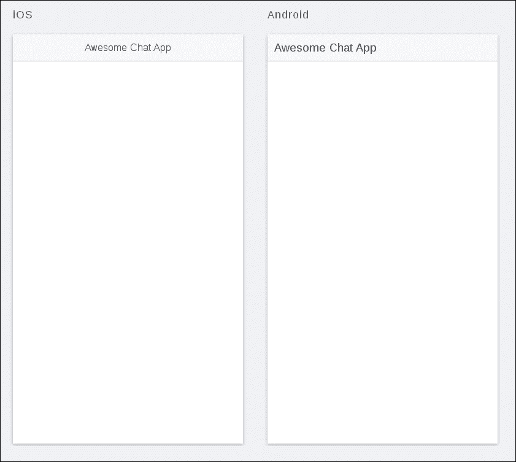

# 十二、使用实时数据

在当今的应用生态系统中，各种实时功能或多或少正在成为主流。聊天应用(以及现有应用的聊天功能)变得越来越普遍，推送通知可以为用户带来新闻和视图，而用户无需寻找，等等。

在这一章中，我们将看看如何将一些精选的实时功能整合到我们的 Ionic 应用中。我们将通过构建一个没有身份验证的简单聊天应用来做到这一点，在这个应用中，至少有两个人可以聚在一起谈论生活中的奇迹。在这样做的时候，我们将重温我们之前学习过的关于 web sockets 的知识，因为我们需要为此创建一个简单的服务器。

# 复习课程——网络套接字

在我们继续之前，让我们快速复习一下我们之前讨论过的一个重要概念——网络套接字。

网络套接字是一种标准化的互联网协议，它允许通过网络进行服务器到客户端的直接通信。这在传统的客户机-服务器体系结构中是相当不寻常的，在传统的客户机-服务器体系结构中，几乎所有的通信都是由客户机发起的，而服务器只是对这种通信做出响应。

WebSockets 使得构建实时应用变得很容易，因为一旦服务器的状态发生变化，它就可以动态地将新数据推送到连接的客户端。这对于聊天应用来说是理想的，否则我们将不得不使用更繁琐和消耗资源的方法，如轮询，以达到近似相同的效果。

要想更深入的了解网络套接字，请参考[第 5 章](05.html "Chapter 5. Real-Time Data and WebSockets")、*实时数据和网络套接字*，我们在这里进行了深入的探讨。

# 获得土地的铺设

在这一章中，我们将构建一个聊天应用，让人想起我们在[第 5 章](05.html "Chapter 5. Real-Time Data and WebSockets")、*实时数据和网络套接字*中看到的那个。当然，最大的不同是，我们的客户端这次将是一个 Ionic 应用，它将能够与也连接到同一服务器的浏览器客户端完全交互。在这样做的过程中，我们展示了构建与使用同一服务器的其他平台上的应用几乎无缝交互的应用是多么容易。

## 我们需要什么

为了让我们的应用正常运行，我们需要:

*   可以通过网络套接字接收和转发消息的服务器。
*   一种应用，可以使用网络套接字连接到服务器，并通过相同的协议发送、接收和处理消息。所有发送的数据都应该以对用户有意义的方式呈现。

本着这本书的精神，我们当然会将 Node.js 用于我们的服务器。为了增加对它的 WebSocket 支持，我们将使用`socket.io`库，您已经在[第 6 章](06.html "Chapter 6. Introducing Ionic")、*介绍 Ionic* 中看到了这个库。

对于客户端，我们将使用标准的`socket.io`客户端库，这在[第 5 章](05.html "Chapter 5. Real-Time Data and WebSockets")、*实时数据和网络套接字*中可以看到，(这里观察到一个趋势？).然而，我们会巧妙利用它，以便让事情在应用方面顺利进行。

让我们开始着手准备吧！

# 创建服务器

我们需要做的第一件事是创建一个 WebSocket 服务器来在我们的客户端之间传递消息。找到合适的项目文件夹，打开您的终端/命令行，并运行以下命令:

```js
npm init
```

这将创建基本的 Node.js 项目结构。您可以输入您认为合适的任何值:

```js
{
  "name": "ionic-chat-server",
  "version": "1.0.0",
  "description": "A websocket server for chatting.",
  "main": "server.js",
  "scripts": {
    "test": "echo \"Error: no test specified\" && exit 1"
  },
  "author": "csvan",
  "license": "MIT"
}
```

现在，让我们安装我们需要的依赖项。运行以下命令:

```js
npm install socket.io
```

这将安装`socket.io`，这是我们运行我们的服务器所需要的。

接下来，在当前文件夹中创建`server.js`文件，并向其中添加以下内容:

```js
var http = require('http');
var url = require('url');
var fs = require('fs');
var server = http.createServer(function (req, res) {
  var parsedUrl = url.parse(req.url, true);
  switch (parsedUrl.pathname) {
    case '/':
    // Read the file into memory and push it to the client
    fs.readFile('index.html', function (err, content) {
      if (err) {
        res.writeHead(500);
        res.end();
      }
      else {
        res.writeHead(200, {'Content-Type': 'text/html'});
        res.end(content, 'utf-8');
      }
    });
    break;
  }
});
// Connect the websocket handler to our server
var websocket = require('socket.io')(server);

// Create a handler for incoming websocket connections
websocket.on('UserConnectedEvent', function (socket) {
  console.log("New user connected");

  // Tell others a new user connected
  socket.broadcast.emit('UserConnectedEvent', null);

  // Bind event handler for incoming messages
  socket.on('MessageSentEvent', function (chatData) {
    console.log('Received new chat message');

    // By using the 'broadcast' connector, we will
    // send the message to everyone except the sender.
    socket.broadcast.emit('MessageReceivedEvent', chatData);
  });
});
server.listen(8080);
```

看起来很眼熟吧？这与我们在[第 5 章](05.html "Chapter 5. Real-Time Data and WebSockets")、*实时数据和网络套接字*中开发的服务器几乎完全相同！它甚至有我们在那里建立的漂亮、现代的聊天界面。我们需要做的就是为它服务。为此，将`index.html`文件添加到当前文件夹中，并向其中添加以下内容:

```js
<!DOCTYPE html>
<html>
<head lang="en">
  <meta charset="UTF-8">
    <title>Socket.io chat application</title>
    <link rel="stylesheet" href="http://maxcdn.bootstrapcdn.com/bootstrap/3.3.4/css/bootstrap.min.css"/>
</head>
  <body>
    <ul id="messages"></ul>
    <div class="container">
      <div class="row">
         <div id="chat-box" class="well">
           <ul id="chat-view" class="list-unstyled"></ul>
         </div>
      </div>
      <form action="">
        <div class="row">
        <input type="text"
        id="chat-name"
        class="form-control"
        placeholder="Your name">
        </div>
        <div class="row">
          <input type="text"
          id="chat-message"
          class="form-control"
          placeholder="Enter message">
          <button id="chat-submit"
          type="submit"
          class="btn btn-default">Send
          </button>
        </div>
      </form>
    </div>
    <script src="/socket.io/socket.io.js"></script>
    <script src="https://code.jquery.com/jquery-1.11.0.min.js"></script>
    <script>
      var websocket = io();
      var appendChatMessage = function (sender, message) {
        $('#chat-view').append($('<li>').text(sender + ': ' + message));
      };
      var clearChatField = function () {
        $('#chat-message').text('');
      };
      // Notify the server when we send a new message

      $('#chat-submit').click(function () {
        var chatData = {
          name: $('#chat-name').val(),
          message: $('#chat-message').val()
        };
        appendChatMessage(chatData.name, chatData.message);
        clearChatField();
        websocket.emit('newChatMessage', chatData);
        return false;
      });

      // Update the state of the chat when we receive a new chat message
      websocket.on('new chat message', function (chatData) {
        appendChatMessage(chatData.name, chatData.message);
      });
    </script>
  </body>
</html>
```

这就是全部。我们基于浏览器的聊天现已全部启动并运行...又来了！我不会解释这里的一切是如何运作的。结账[第五章](05.html "Chapter 5. Real-Time Data and WebSockets")*实时数据和网络插座*，如果有什么不清楚的话。当你准备好了，让我们开始使用我们的应用客户端。

# 搭建聊天应用

我们在开发移动体验时的首要关注点之一是创建一个用户可以直观使用的界面。幸运的是，爱奥尼亚装载了一些非常方便的功能来实现这一点。在我们到达那里之前，让我们设置基础。

## 设置基本的应用结构

让我们从创建一个基本应用开始。创建一个合适的项目文件夹，它不同于我们之前创建的聊天服务器。导航到文件夹，打开终端/命令行，并运行以下命令:

```js
ionic start ionic-chat-app blank
```

正如我们之前看到的，这将创造一个空的 Ionic 项目，让我们充满爱和美好的事物。四处看看。这里没什么好看的，对吧？我们很快就会改变这一点。抓紧了。

现在还早，但是让我们马上启动我们的 Ionic 预览服务器，这样我们就可以看到应用的直播。在不做任何更改的情况下，从终端/命令行运行以下命令:

```js
ionic serve -l
```

这将显示安卓和 iOS 的预览。不出所料，这里还没有什么可看的:



让我们继续并设置基础。我们首先需要处理的是路由。在`js/app.js`文件中，确保您有以下内容:

```js
angular.module('ionic-chat-app', ['ionic'])
.run(function ($ionicPlatform) {
  $ionicPlatform.ready(function () {
    if (window.cordova && window.cordova.plugins.Keyboard) {
      cordova.plugins.Keyboard.hideKeyboardAccessoryBar(true);
    }
    if (window.StatusBar) {
      StatusBar.styleDefault();
    }
  })
})
.config(function ($stateProvider, $urlRouterProvider) {
  // Configure the routing
  $stateProvider.
  state('app', {
    url: "/app",
    abstract: true,
    templateUrl: 'index.html'
  })
  .state('app.chat', {
    url: '/chat',
    templateUrl: 'templates/app-chat.html'
  });
  $urlRouterProvider.otherwise('/app/chat');
});
```

在这里，我们定义了一个称为`app`的基本抽象状态，我们将把它作为应用整体的根状态。该状态的唯一子状态是`app.state`，它将包含实际的聊天视图和关联逻辑。

为一个我们只希望拥有单一视图的应用添加状态，这似乎有悖于直觉。然而，这是一个很好的架构预防措施，以防我们想进一步扩展应用。

现在，让我们添加一些基本的视图信息。在应用的`www`文件夹中创建一个**模板**文件夹，然后在其中创建一个名为`app-chat.html`的文件，该文件包含以下内容:

```js
<ion-view view-title="chat">
  <ion-content class="padding">
    Chat awesomeness goes here!
  </ion-content>
</ion-view>
```

现在，您的应用预览应该如下所示:


这个稍微好一点，但是我们还没有完全到达那里。接下来，我们将向其中添加实际的聊天布局。

## 输入部分

继续并修改`app-chat.html`文件，使其看起来像这样:

```js
<ion-view view-title="chat">
  <ion-content class="padding">
  </ion-content>
  <div class="bar bar-footer bar-balanced">
    <label class="item-input-wrapper">
      <input id="message-input" type="text" placeholder="Message">
    </label>
    <button class="button button-small">
      Submit
    </button>
  </div>
</ion-view>
```

在这里，我们在我们的应用上附加了一个页脚——一个将永久固定在视口底部的元素。在这个页脚中，我们定义了一个输入字段来添加一条消息和一个相关的按钮来发送它。为了使输入框适当缩放，我们需要在`css/style.css`文件中添加以下内容:

```js
#message-input {
  width: 100%;
}
```

完成所有这些后，我们将得出以下结论:


到目前为止，一切顺利。*得*喜欢那种辛辣的绿色触感。我们走！

## 消息视图

现在，让我们创建我们的应用的一部分，它将显示我们最重要的聊天中的所有消息。

修改`templates/app-chat.html`文件，使`<ion-content>`标签如下所示:

```js
<ion-content>
  <div class="list">
    <a class="item item-avatar">
      <h2>Me</h2>
      <p>Anyone out there!?</p>
    </a>
    <a class="item item-avatar other-chatbox">
      <h2>Anyone</h2>
      <p>Yes.</p>
    </a>
    <a class="item item-avatar">
      <h2>Me</h2>
      <p><3</p>
    </a>
  </div>
</ion-content>
```

前面的代码创建了一个包含一组`item-avatar`元素的标准 Ionic 列表。这些是 ional 中的标准列表项，可以很容易地显示头像图像、标题和一些文本，如下面来自 ional 元素引用的示例所示:


然而，在我们的例子中，我们将跳过实际的图像，只使用标题和文本。这两个构成了一种非常方便的方式来显示单个聊天消息以及发送者的姓名。

接下来，将以下内容添加到`css/style.css`文件中:

```js
.item-avatar {
  padding-left: 16px;
}
.other-chatbox {
  text-align: right;
}
```

需要前面的代码来覆盖`item-avatar`元素的默认 Ionic 样式。这允许标题和文本位于右侧或左侧。这将使最终的外观更接近更受欢迎的聊天应用，在这些应用中，其他参与者的文本通常位于流的右侧，而我们自己的文本位于左侧。

您的预览现在应该如下所示:


这是一个非常基本的聊天界面。现在，让我们继续并添加一些逻辑。

## 聊天服务功能

为了与 WebSocket 服务器通信，我们将创建一个服务，该服务将允许我们既向服务器发送消息，又订阅服务器发送的事件。

首先，创建一个名为`js/services.js`的文件，并在其中插入以下代码:

```js
angular.module('ionic-chat-app-services', [])
.service('ChatService', function ChatService($rootScope) {
  this.emit = function (message) {
    // Send a message
  };
  this.on = {
    userConnected: function (callback) {
      $rootScope.$on('UserConnectedEvent', function (event, user) {
        callback(user);
      })
    },
    messageReceived: function (callback) {
      $rootScope.$on('MessageReceivedEvent', function (event, message) {
        callback(message);
      })
    }
  }
});
```

我们的`service`向用户展示了以下两个核心特性:

*   `Emit`:这允许用户向服务器广播消息
*   `On`:这允许用户订阅以下两个事件:
    *   `UserConnectedEvent`:每当有新用户连接到该应用时，就会触发该选项
    *   `MessageReceivedEvent`:每当从服务器接收到新消息时，都会触发该选项

前面代码中的消息传递是通过`$rootScope`函数实现的，该函数已经为我们提供了一个健壮的机制。我们只是为了达到自己的目的而包装它。

要将`service`集成到我们的应用中，请将以下内容添加到`index.html`文件中:

```js
<script src="js/app.services.js"></script>
```

接下来，在`js/app.js`文件中将聊天服务作为依赖项列出，如下所示:

```js
angular.module('ionic-chat-app',
[
  'ionic',
  'ionic-chat-app-services'
])
```

## 向组合中添加网络套接字

现在服务已经连接到应用，让我们发挥网络套接字的作用，让它做一些有趣的事情！首先，在`index.html`文件中添加以下内容，以便导入`socket.io`客户端库:

```js
<script src="https://cdn.socket.io/socket.io-x.x.x.js"></script>
```

用服务器上运行的任何版本的`socket.io`替换前面代码中的`x.x.x`(如果您不确定，请查看我们之前创建的聊天服务器项目中的`package.json`文件)。

这将为我们提供名为`io`的全局对象，该对象可用于与网络套接字服务器进行交互。全局对象是邪恶的。非常邪恶。因此，出于良好的原则，我们将尽最大努力将其包含在我们的聊天服务中，如下所示:

```js
angular.module('ionic-chat-app-services', [])
.service('ChatService', function ChatService($rootScope) {

  // Init the Websocket connection
  var socket = io.connect('http://localhost:8080');

  // Bridge events from the Websocket connection to the rootScope
  socket.on('UserConnectedEvent', function(user) {
    $rootScope.emit('UserConnectedEvent', user);
  });
  socket.on('MessageReceivedEvent', function(message) {
    $rootScope.emit('MessageReceivedEvent', message);
  });

  /*
  * Send a message to the server.
  * @param message
  */
  this.emit = function (message) {
    socket.emit('MessageSentEvent', message);
  };
  this.on = {
    userConnected: function (callback) {
      $rootScope.$on('UserConnectedEvent', function (event, user) {
        callback(user);
      })
    },
    messageReceived: function (callback) {
      $rootScope.$on('MessageReceivedEvent', function (event, message) {
        callback(message);
      })
    }
  }
});
```

我们在这里所做的非常简单，可以总结如下:

*   我们使用`on`函数监听来自网络套接字服务器的事件，并将这些事件简单地传递给`$rootScope`函数。通过这样做，我们的应用的其他部分可以为这些事件注册侦听器和回调，以便对它们采取行动。
*   我们使用套接字的`emit`功能将消息发送回服务器。

这就是我们应用背后的硬逻辑。接下来，我们将通过使我们的聊天视图动态化来将这一切联系在一起。

## 更新聊天视图

每当您或另一个连接的用户向聊天提交一些东西时，您希望聊天显示显示新消息。如果这听起来像是`ng-repeat`的工作，那是因为它...良好的...真的不是。

虽然`ng-repeat`本身是一个非常强大的指令，但不幸的是，随着数据集的不断增长，它可能会招致严重的性能损失，尤其是在处理能力有限的移动设备上。为了解决这个问题，爱奥尼亚提供了另一个渲染动态数据集的指令— `collection-repeat`。在没有我们太多干预的情况下，`collection-repeat`在处理收藏品方面会做很多真正繁重的工作。

然而，在我们这样做之前，我们需要为我们的聊天视图添加一个控制器。继续创建`js/app.controllers.js`文件。分别在`index.html`和`app.js`中导入并添加为依赖项:

```js
<script src="js/app.controllers.js"></script>

angular.module('ionic-chat-app',
[
  'ionic',
  'ionic-chat-app-services',
  'ionic-chat-app-controllers'
])
```

接下来，让我们向文件中添加一些基本内容:

```js
angular.module('ionic-chat-app-controllers', [])
.controller('ChatController', function ($scope) {
});
```

最后，让我们将控制器绑定到我们应用的聊天状态。在`app.js`中，确保您的状态定义如下所示:

```js
$stateProvider.
state('app', {
  url: "/app",
  abstract: true,
  templateUrl: 'index.html'
})
.state('app.chat', {
  url: '/chat',
  templateUrl: 'templates/app-chat.html',
  controller: 'ChatController'
});
```

我们现在准备开始为我们的应用添加一些重要的功能！继续将以下内容添加到您的控制器中:

```js
angular.module('ionic-chat-app-controllers', [])
.controller('ChatController', function ($scope, ChatService) {
  // The chat messages
  $scope.messages = [];
  // Notify whenever a new user connects
  ChatService.on.userConnected(function (user) {
    $scope.messages.push({
      name: 'Chat Bot',
      text: 'A new user has connected!'
    });
  });
  // Whenever a new message appears, append it
  ChatService.on.messageReceived(function (message) {
    message.external = true;
    $scope.messages.push(message);
  });
  $scope.inputMessage = '';
  $scope.onSend = function () {
    $scope.messages.push({
      name: 'Me',
      text: $scope.inputMessage
    });
    // Send the message to the server
    ChatService.emit({
      name: 'Anonymous',
      text: $scope.inputMessage
    });
    // Clear the chatbox
    $scope.inputMessage = '';
  }
});
```

最后，修改文件以连接到控制器数据，如下所示:

```js
<ion-view view-title="chat">
  <ion-content>
    <div class="list">
      <a collection-repeat="message in messages"
      class="item item-avatar"
      ng-class="{'other-chatbox' : message.external}">
        <h2>{{message.name}}</h2>
        <p>{{message.text}}</p>
      </a>
    </div>
  </ion-content>
  <div class="bar bar-footer bar-balanced">
    <label class="item-input-wrapper">
      <input id="message-input"
      type="text"
      placeholder="Message"
      ng-model="inputMessage">
    </label>
    <button class="button button-small"
    ng-click="onSend()">
      Submit
    </button>
  </div>
</ion-view>
```

请注意，我们在这里使用传说中的`collection-repeat`功能，几乎不需要配置！该应用现在将对我们自己的消息发送事件以及从服务器传入的其他消息做出响应。在你的预览中点燃它，并尝试它！

# 走得更远

这里，为了简单起见，我们在模拟器上模拟了我们的聊天应用。然而，如果我们真的让它在一组物理设备上运行，我们当然可以玩得更开心。如果你是那种有钱到可以在从杂货店回来的路上买一堆 iPhones 和安卓设备的人(或者只是有很多朋友用同样的设备)，为什么不把它变成一个有趣的项目，把你的聊天服务器托管在一个实际的**【VPS】**(**虚拟私人服务器**)上，并把这个项目连接到它上面呢？你和你的朋友可以在你自己的应用中讨论统治世界的计划！

你想用的 VPS 由你自己决定，但是我们可以想出几个方案供你考虑。查看[https://www.digitalocean.com/](https://www.digitalocean.com/)和[https://www.linode.com/](https://www.linode.com/)来启动你的后端。还有几个更具体的解决方案，使您能够用更少的配置启动后端，如 **Heroku** 。许多突出的服务使得配置服务器功能的更关键的元素(如域名系统)变得极其容易。

配置好虚拟专用网络并运行聊天服务器后，将应用中的目标域从本地主机更改为服务器的域/IP。邀请你的朋友一起聊天吧！但是，为了确保您的用户的完整性受到保护，请确保您只在 HTTPS 为实际的实时应用启用通信。

# 总结

在这一章中，我们探索了如何使用`socket.io`将实时功能整合到 Ionic 应用中。在这样做的过程中，我们构建了一个简单的聊天应用，可以在以后进行扩展，以便学习高级的实时功能。

在下一章中，我们将了解如何通过应用设置网络套接字通信，以便从服务器订阅动态通知。我们将详细说明这如何帮助我们开发真正动态的应用，如聊天应用。