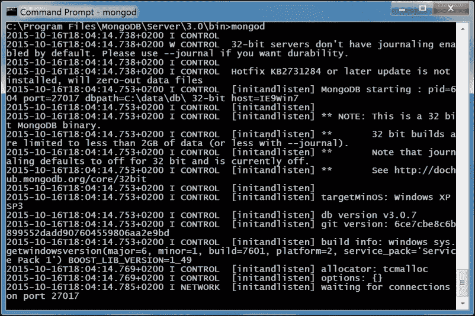
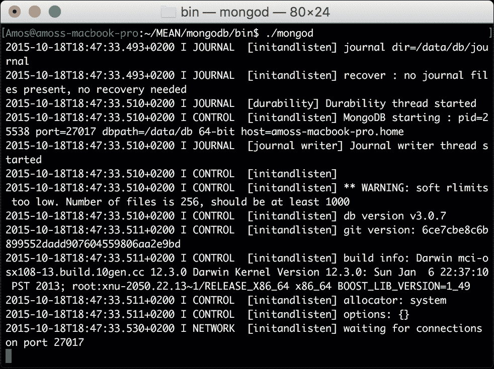
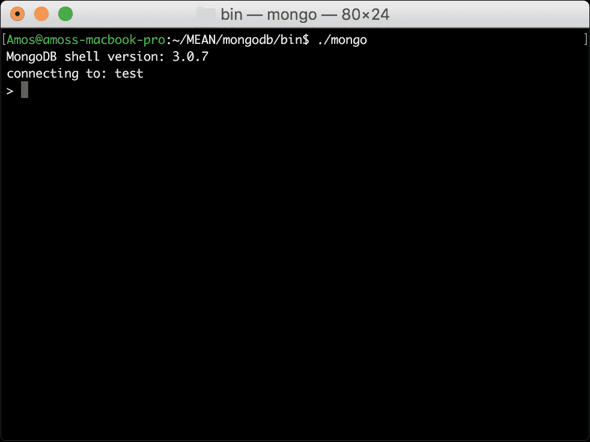
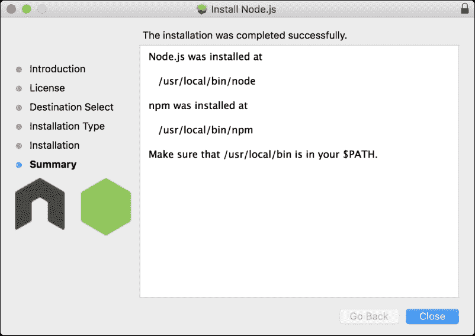

Chapter 1. Introduction to MEAN <link href="epub.css" rel="stylesheet" type="text/css">  

# 第一章。 介绍的意思

MEAN stack是一个强大的、全栈的 JavaScript 解决方案，它包含四个主要的构建块:MongoDB 作为数据库，Express 作为 web 服务器框架，Angular 作为 web 客户端框架，Node.js 作为服务器平台。 这些构建块由不同的团队开发，并涉及大量的开发人员社区和倡导者，推动每个组件的开发和文档编制。 栈的主要优点在于它将 JavaScript 集中起来作为主要编程语言。 然而，将这些工具连接在一起的问题会为伸缩性和架构问题奠定基础，这将极大地影响您的开发过程。

在本书中，我将尝试介绍构建 MEAN 应用程序的最佳实践和已知问题，但是在开始实际的 MEAN 开发之前，您首先需要设置您的环境。 本章将介绍一点编程概述，但主要介绍安装 MEAN 应用程序的基本功能的正确方法。 在本章结束时，你将学习如何在所有通用操作系统上安装和配置 MongoDB 和 Node.js，以及如何使用 NPM。 在本章中，我们将涵盖以下主题:

*   介绍 MEAN 堆栈架构
*   在 Windows、Linux 和 Mac OS X 上安装和运行 MongoDB
*   在 Windows、Linux 和 Mac OS X 上安装和运行 Node.js
*   介绍 npm 以及如何使用它来安装 Node 模块

# 三层 web 应用开发

大多数web 应用程序都构建在三层架构中，该架构由三个重要的层组成:数据、逻辑和表示。 在 web 应用程序中，应用程序结构通常分为数据库、服务器和客户端，而在现代 web 开发中，它也可以分为数据库、服务器逻辑、客户端逻辑和客户端 UI。

实现此模型的一个流行范例是**模型-视图-控制器**(**MVC**)架构模式。 在 MVC 范例中，逻辑、数据和可视化被分为三种类型的对象，每种对象处理自己的任务。 **视图**处理视觉部分，关注用户交互。 **控制器**响应系统和用户事件，命令模型和视图进行适当的更改。 **模型**处理数据操作，响应信息请求或根据控制器的指令改变其状态。 MVC 架构的一个简单的可视化表示如下图所示:


通用 MVC 架构通信

在 web 开发的 25 年(T0)中，许多技术栈在构建三层 web 应用程序方面变得流行起来。 在这些现在无处不在的堆栈中，您可以找到 LAMP 堆栈、. net 堆栈以及各种各样的其他框架和工具。 这些堆栈的主要问题是，每一层都需要一个通常超过单个开发人员能力的知识库，使团队比他们应该的更大，更低的生产力，并暴露在意想不到的风险中。

# JavaScript 的演变

JavaScript 是一种解释式计算机编程语言，它是为 Web 构建的。 它首先由 Netscape Navigator 网络浏览器实现，成为网络浏览器用来执行客户端逻辑的编程语言。 在 2000 年代中期，从网站到 web 应用的转变，伴随着更快的浏览器的发布，逐渐形成了编写更复杂应用的 JavaScript 开发人员社区。 这些开发人员开始创建库和工具来缩短开发周期，从而产生了新一代甚至更高级的 web 应用程序。 反过来，它们创造了对更好浏览器的持续需求。 这种循环持续了好几年，供应商不断改进他们的浏览器，JavaScript 开发人员不断突破边界。

真正的革命开始于 2008 年，当时谷歌发布了 Chrome 浏览器，以及快速编译 jit 的 V8 JavaScript 引擎。 谷歌的 V8 引擎使 JavaScript 运行得更快，它完全改变了 web 应用程序开发。 更重要的是，引擎源代码的发布允许开发人员开始在浏览器之外重新构思 JavaScript。 这次革命的首批产品之一是 Node.js。

在研究了其他选项一段时间后，程序员 Ryan Dahl 发现 V8 引擎适合他的非阻塞 I/O 实验 Node.js。 这个想法很简单:帮助开发人员构建非阻塞的代码单元，以便更好地使用系统资源并创建响应更快的应用程序。 其结果是一个最小但强大的平台，它利用了 JavaScript 在浏览器之外的非阻塞特性。 Node 优雅的模块系统使开发人员能够自由地使用第三方模块扩展平台，以实现几乎所有的功能。 在线社区的反应是创建了各种工具，从现代 web 框架到机器人服务器平台。 然而，服务器端 JavaScript 只是一个开始。

当 Dwight Merriman 和 Eliot Horowitz 在 2007 年着手构建他们的可伸缩主机解决方案时，他们已经有了很多构建 web 应用程序的经验。 然而，他们构建的平台并没有按计划取得成功，因此在 2009 年，他们决定将其拆分，并开放其组件的源代码，包括一个名为 MongoDB 的基于 v8 的数据库。 MongoDB 源于单词“humongous”，它是一个可伸缩的 NoSQL 数据库，使用类似于 json 的数据模型和动态模式。 MongoDB 为开发人员提供了处理复杂数据所需的灵活性，同时还提供了 RDBMS 特性，如高级查询和易于伸缩的特性，这些特性最终使 MongoDB 成为领先的 NoSQL 解决方案之一。 JavaScript 打破了另一个界限。 然而，JavaScript 的革命者们并没有忘记这一切是从哪里开始的。 事实上，现代浏览器的普及催生了 JavaScript 前端框架的新浪潮。

早在 2009 年，当将他们的 JSON 作为平台服务构建时，开发人员 Miško Hevery 和 Adam Abrons 注意到普通的 JavaScript 库是不够的。 他们的富 web 应用程序的本质提出了一个更结构化的框架的需求，这将减少繁重的工作并维护一个有组织的代码库。 他们放弃了最初的想法，决定专注于前端框架的开发，并将该项目开源，命名为 AngularJS。 其想法是在 JavaScript 和 HTML 之间搭建桥梁，并帮助推广单页面应用程序开发。

结果是一个丰富的 web 框架，它为前端 web 开发人员提供了诸如双向数据绑定、跨组件依赖注入和基于 mvc 的组件等概念。 角,以及其他现代框架,彻底改变了 web 开发通过将曾经不可维护的前端代码转换为结构化代码库,可以支持更先进的开发模式,如**测试驱动的开发(TDD**)。****

 ****开源协作工具的兴起，以及这些天才工程师的投入，创造了世界上最富有的社区之一。 更重要的是，这些主要的改进允许三层 web 应用程序的开发在 JavaScript 下统一，作为跨越所有三层的编程语言——这种想法通常被称为全栈 JavaScript。 MEAN 堆栈只是这种想法的一个例子。

# ECMAScript 2015 简介

经过多年的工作，ES6 规范于 2015 年 6 月发布。 它展示了自 ES5 以来 JavaScript 最大的进步，并在该语言中引入了几个特性，这些特性将彻底改变我们 JavaScript 开发人员编写代码的方式。 描述 ES2015 所做的所有改进是很有野心的。 相反，让我们试着完成我们将在下一章中使用的基本特性。

## 模块

模块现在是受支持的语言级特性。 它们允许开发人员将组件包装在模块模式中，并在代码中导出和导入模块。 虽然 ES2015 模块也支持异步加载，但它的实现与前面章节描述的 CommonJS 模块实现非常相似。 使用 ES2015 模块的基本关键词是`export`和`import`。 让我们看一个简单的例子。 假设你有一个名为`lib.js`的文件，它包含以下代码:

```js
export function halfOf(x) {
    return x / 2;
}
```

所以，在你的`main.js`文件中，你可以使用以下代码:

```js
import halfOf from 'lib';
console.log(halfOf(84));
```

然而，模块可以更有趣。 例如，假设我们的`lib.js`文件看起来像这样:

```js
export function halfOf(x) {
    return x / 2;
}
export function multiply(x, y) {
    return x * y;
}
```

在你的主文件中，使用以下代码:

```js
import {halfOf, multiply} from 'lib';
console.log(halfOf(84));
console.log(multiply(21, 2));
```

ES2015 模块也支持默认的`export`值。 例如，假设你有一个名为`doSomething.js`的文件，它包含以下代码:

```js
export default function () { 
    console.log('I did something')
};
```

你可以在你的`main.js`文件中这样使用它:

```js
import doSomething from 'doSomething';
doSomething();
```

重要的是要记住，默认导入应该使用模块名标识它们的实体。

另一个需要记住的重要的是模块导出绑定而不是值。 例如，假设你有一个像这样的`validator.js`文件:

```js
export let flag = false;
export function touch() {
    flag = true;
}
```

你也有一个看起来像这样的`main.js`文件:

```js
import { flag, touch } from 'validator';
console.log(flag); 
touch();
console.log(flag); 
```

第一个输出是`false`，第二个输出是`true`。 现在我们已经对模块有了基本的了解，让我们转向类。

## 班级

关于类和原型的长期争论得出的结论是，ES2015 中的类基本上只是基于原型继承的语法糖。 类是易于使用的模式，支持实例和静态成员、构造函数和超调用。 下面是一个例子:

```js
class Vehicle {
    constructor(wheels) {
        this.wheels = wheels;
    }
    toString() {
        return '(' + this.wheels + ')';
    }
}

class Car extends Vehicle {
    constructor(color) {
        super(4);
        this.color = color;
    }
    toString() {
        return super.toString() + ' colored:  ' + this.color;
    }
}

let car = new Car('blue');
car.toString(); 

console.log(car instanceof Car); 
console.log(car instanceof Vehicle); 
```

在本例中，`Car`类扩展了`Vehicle`类。 因此，输出如下:

```js
 (4) in blue
true
true
```

## 箭头功能

箭头是由`=>`语法简写的函数。 对于熟悉 c#和 Java 8 等其他语言的人来说，它们可能看起来很熟悉。 然而，箭头也非常有用，因为它们的作用域共享相同的词汇`this`。 它们主要有两种形式。 一种是使用表达式体:

```js
const squares = numbers.map(n => n * n); 
```

另一种形式是使用语句体:

```js
numbers.forEach(n => {
  if (n % 2 === 0) evens.push(n);
});
```

使用共享词法的一个例子是:

```js
const author = {
  fullName: "Bob Alice",
  books: [],
  printBooks() {
     this.books.forEach(book => console.log(book + ' by ' + this.fullName));
  }
};
```

如果作为常规函数使用，`this`将是`book`对象，而不是`author`对象。

## Let 和 Const

`Let`和`Const`是新的关键词，用于符号声明。 Let 是几乎相同的关键字`var`，所以它的行为将与全局变量和函数变量相同。 然而，`let`在块内的行为不同。 例如，看看下面的代码:

```js
function iterateVar() {
  for(var i = 0; i < 10; i++) {
    console.log(i);
  }

  console.log(i)
}

function iterateLet() {
  for(let i = 0; i < 10; i++) {
    console.log(i);
  }

  console.log(i)
}
```

第一个函数将在循环之后打印`i`，但是第二个函数将抛出错误，因为`i`是由`let`定义的。

关键字`const`强制执行单个赋值。 因此，这段代码也会抛出一个错误:

```js
const me = 1
me = 2
```

## 违约、休息和传播

Default、Rest 和 Spread 是三个与函数参数相关的新特性。 默认特性允许您设置函数参数的默认值:

```js
function add(x, y = 0) {
    return x + y;
}
add(1) 
add(1,2)
```

在本例中，如果未传递一个值或将其设置为`undefined`，则将`y`的值设置为`0`。

Rest 特性允许你传递一个数组作为后跟参数，如下所示:

```js
function userFriends(user, ...friends) {
  console.log(user + ' has ' + friends.length + ' friends');
}
userFriends('User', 'Bob', 'Alice');
```

Spread 特性将数组转换为调用参数:

```js
function userTopFriends(firstFriend, secondFriend, thirdFriends) {
  console.log(firstFriend);
  console.log(secondFriend);
  console.log(thirdFriends);
}

userTopFriends(...['Alice', 'Bob', 'Michelle']);
```

## 小结

进入现代 web 开发，ES2015 将成为您日常编程课程的一个可行部分。 这里显示的只是冰山一角，强烈建议您继续深入研究它。 然而，为了本书的目的，它就足够了。

# MEAN 的介绍

MEAN 是 MongoDB、Express、Angular 和 Node.js 的缩写。 其背后的概念是只使用 javascript 驱动的解决方案来覆盖应用程序的不同部分。 优点很大，如下:

*   整个应用程序使用单一语言
*   应用程序的所有部分都可以支持并经常强制使用 MVC 架构
*   不再需要序列化和反序列化数据结构，因为数据封送是使用 JSON 对象完成的

然而，仍有一些重要的问题没有得到解答:

*   如何将所有组件连接在一起?
*   Node.js 有一个巨大的模块生态系统，那么你应该使用哪些模块呢?
*   JavaScript 是与范例无关的，那么如何维护 MVC 应用程序结构呢?
*   JSON 是一种无模式的数据结构，所以应该如何以及何时对数据建模?
*   如何处理用户身份验证?
*   你应该如何使用 Node.js 非阻塞架构来支持实时交互?
*   如何测试 MEAN 应用程序代码库?
*   考虑到 DevOps 和 CI 的兴起，您可以使用什么样的 JavaScript 开发工具来加速 MEAN 应用程序的开发过程?

在本书中，我将试图回答这些问题以及更多的问题。 然而，在进一步讨论之前，您首先需要安装基本的先决条件。

# 安装 MongoDB

对于 MongoDB 的稳定版本，官方的MongoDB 网站提供了链接的二进制文件，提供了在 Linux、Mac OS X 和 Windows 上安装 MongoDB 的最简单的方法。 注意，您需要为您的操作系统下载正确的体系结构版本。 如果您使用 Windows 或 Linux，请确保根据您的系统架构下载 32 位或 64 位版本。 Mac 用户可以安全下载 64 位版本。

### 注意事项

MongoDB 版本控制方案的工作方式是，只有版本号才标志稳定的版本。 所以,版本 3.0。 X 和 3.2x 是稳定的，2.9。 3.1 x 和。 X 是不稳定的版本，不应该在生产中使用。 MongoDB 的最新稳定版本是 3.2.x。

当您访问[http://mongodb.org/downloads](http://mongodb.org/downloads)的下载页面时，您将获得一个包含安装 MongoDB 所需二进制文件的存档下载。 下载并解压缩归档文件后，您将需要定位`mongod`二进制文件，它通常位于`bin`文件夹中。 `mongod`进程运行 MongoDB 主服务器进程，可以作为独立服务器或 MongoDB 副本集的单个节点使用。 在本例中，我们将使用 MongoDB 作为独立服务器。 `mongod`进程需要一个存放数据库文件的文件夹(默认文件夹为`/data/db`)和一个监听的端口(默认端口为`27017`)。 在下面的小节中，我们将介绍每个操作系统的安装步骤。 我们将从常见的 Windows 安装过程开始。

### 注意事项

建议您通过访问官方文档[https://mongodb.org](https://mongodb.org)了解更多关于 MongoDB 的信息。

## 安装 MongoDB

下载了正确版本后，运行`.msi`文件。 MongoDB 应该被安装在`C:\Program Files\MongoDB\`文件夹中。 在运行时，MongoDB 使用一个默认的文件夹来存储它的数据文件。 在 Windows 上，默认文件夹位置是`C:\data\db`。 因此，在命令提示符中，转到`C:\`并发出以下命令:

```js
> md c:\data\db

```

### 提示

您可以使用`--dbpath`命令行标志告诉 mongod 服务为数据文件使用另一个路径。

一旦您完成了数据文件夹的创建，您将在运行主 MongoDB 服务时得到两个选项。

### 手动运行 MongoDB

要手动运行 MongoDB，您需要运行`mongod`二进制文件。 因此，打开命令提示符并导航到`C:\Program Files\MongoDB\Server\3.2\bin`文件夹。 然后，发出以下命令:

```js
C:\Program Files\MongoDB\Server\3.2\bin> mongod

```

上述命令将运行 MongoDB 主服务，该服务将开始监听默认的`27017`端口。 如果一切顺利，您应该会看到类似如下截图的控制台输出:



在 Windows 环境下运行 MongoDB 服务器

根据Windows 安全级别，将会发出安全警报对话框，通知您某些服务特性被阻塞。 如果出现这种情况，请选择一个专用网络，单击**允许接入**。

### 注意事项

您应该注意到 MongoDB 服务是自包含的，所以您可以从您选择的任何文件夹运行它。

### MongoDB 作为 Windows 服务运行

更流行的方法是在每个重启周期之后自动运行 MongoDB。 在开始将 MongoDB 设置为 Windows 服务之前，为 MongoDB 日志和配置文件指定一个路径被认为是一个很好的实践。 首先在命令提示符中运行以下命令为这些文件创建一个文件夹:

```js
> md C:\data\log

```

然后，你需要在`C:\Program Files\MongoDB\Server\3.2\mongod.cfg`创建一个配置文件，其中包含以下几行:

```js
systemLog:
    destination: file
    path: c:\data\log\mongod.log
storage:
    dbPath: c:\data\db
```

在配置文件就绪后，通过右键单击命令提示符图标并单击**Run 作为管理员**，打开一个新的具有管理权限的命令提示符窗口。 注意，如果一个旧版本的 MongoDB 服务已经在运行，你首先需要使用以下命令删除它:

```js
> sc stop MongoDB
> sc delete MongoDB

```

然后，执行如下命令安装 MongoDB 服务。

```js
> "C:\Program Files\MongoDB\Server\3.2\bin\mongod.exe" --config "C:\Program Files\MongoDB\Server\3.2\mongod.cfg" --install

```

注意，只有正确设置了配置文件，安装过程才会成功。 安装 MongoDB 服务后，您可以在管理命令提示符窗口中执行以下命令来运行它:

```js
> net start MongoDB

```

请注意，可以修改 MongoDB 配置文件以适应您的需要。 你可以通过[http://docs.mongodb.org/manual/reference/configuration-options/](http://docs.mongodb.org/manual/reference/configuration-options/)了解更多。

## 在 Mac OS X 和 Linux 上安装 MongoDB

在本节中，您将学习在基于 unix 的操作系统上安装MongoDB 的不同方法。 让我们从开始以最简单的方式安装 MongoDB，其中包括下载 MongoDB 的预编译二进制文件。

## 从二进制安装 MongoDB

您可以通过[http://www.mongodb.org/downloads](http://www.mongodb.org/downloads)的下载页面下载 MongoDB 的正确版本。 或者，你可以通过 CURL 执行以下命令:

```js
$ curl -O http://downloads.mongodb.org/osx/mongodb-osx-x86_64-3.2.10.tgz

```

请注意，我们已经下载了 Mac OS X 64 位版本，因此请确保修改命令以适合您的机器的版本。 下载过程结束后，在你的命令行工具中发出以下命令来解包文件:

```js
$ tar -zxvf mongodb-osx-x86_64-3.2.10.tgz

```

现在，通过运行以下命令将提取的文件夹名称更改为一个更简单的文件夹名称:

```js
$ mv mongodb-osx-x86_64-3.2.10 mongodb

```

MongoDB 使用默认的文件夹来存放文件。 在 Linux 和 Mac OS X 上，默认位置是`/data/db`，所以在你的命令行工具中，运行以下命令:

```js
$ mkdir -p /data/db

```

### 提示

创建这个文件夹可能会遇到一些麻烦。 这通常是一个权限问题，所以在运行上述命令时使用`sudo`或超级用户。

前面的命令将创建`data`和`db`文件夹，因为`–p`标志也创建父文件夹。 请注意，默认文件夹位于您的主文件夹之外，因此请确保您通过运行以下命令设置文件夹权限:

```js
$ chown -R $USER /data/db

```

现在一切准备就绪，使用命令行工具，进入`bin`文件夹，运行`mongod`服务，如下所示:

```js
$ cd mongodb/bin
$ mongod

```

这将运行主 MongoDB 服务，它将开始侦听默认的`27017`端口。 如果一切顺利，您应该会看到类似如下截图的控制台输出:



在 Mac OS X 上运行 MongoDB 服务器

### 使用包管理器安装 MongoDB

有时候，安装 MongoDB 的最简单的方法是使用包管理器。 缺点是一些包管理器在支持最新版本方面落后了。 幸运的是，MongoDB 背后的团队还维护着 RedHat、Debian 和 Ubuntu 的官方包，以及 Mac OS x 的自制包。注意，您必须配置您的包管理器存储库，以包括 MongoDB 服务器来下载官方包。

要在 Red Hat Enterprise, CentOS 或 Fedora 上使用 Yum 安装 MongoDB，请按照[http://docs.mongodb.org/manual/tutorial/install-mongodb-on-red-hat-centos-or-fedora-linux/](http://docs.mongodb.org/manual/tutorial/install-mongodb-on-red-hat-centos-or-fedora-linux/)的说明。

要在 Ubuntu 上使用 APT 安装 MongoDB，请遵循[http://docs.mongodb.org/manual/tutorial/install-mongodb-on-ubuntu/](http://docs.mongodb.org/manual/tutorial/install-mongodb-on-ubuntu/)的说明。

要使用 APT 在 Debian 上安装 MongoDB，请遵循[http://docs.mongodb.org/manual/tutorial/install-mongodb-on-debian/](http://docs.mongodb.org/manual/tutorial/install-mongodb-on-debian/)的说明。

使用 Homebrew 在 Mac OS X 上安装 MongoDB，请参见[http://docs.mongodb.org/manual/tutorial/install-mongodb-on-os-x/](http://docs.mongodb.org/manual/tutorial/install-mongodb-on-os-x/)。

## 使用 MongoDB shell

MongoDB 存档文件包括 MongoDB shell，它允许您使用命令行与服务器实例交互。 启动 shell 时，进入 MongoDB`bin`文件夹，运行`mongo`服务，如下所示:

```js
$ cd mongodb/bin
$ mongo

```

如果成功安装了 MongoDB, shell 将使用测试数据库自动连接到您的本地实例。 你应该看到一个控制台输出，类似如下截图:



在 Mac OS X 下运行 MongoDB shell

要测试数据库，运行以下命令:

```js
> db.articles.insert({title: "Hello World"})

```

上面的命令将创建一个新的项目集合，并插入一个包含`title`属性的 JSON 对象。 要检索项目对象，请执行以下命令:

```js
> db.articles.find()

```

控制台将输出类似以下消息的文本:

```js
{ _id: ObjectId("52d02240e4b01d67d71ad577"), title: "Hello World" }

```

恭喜你! 这意味着您的 MongoDB 实例正在正常工作，并且您已经成功地使用 MongoDB shell 与它进行了交互。 在接下来的章节中，您将学习更多关于 MongoDB 和如何使用 MongoDB shell 的知识。

# 安装 Node.js

对于稳定版本，官方 Node.js 网站提供了链接的二进制文件，提供了在 Linux、Mac OS X 和 Windows 上安装 Node.js 的最简单方法。 注意，您需要为您的操作系统下载正确的体系结构版本。 如果您使用 Windows 或 Linux，请确保根据您的系统架构下载 32 位或 64 位版本。 Mac 用户可以安全下载 64 位版本。

### 注意事项

Node.js 和 io.js 项目合并后，版本方案直接从 0.12 开始。 x 4\. x。 团队现在使用**长期支持**(**LTS**)策略。 你可以在[https://en.wikipedia.org/wiki/Long-term_support](https://en.wikipedia.org/wiki/Long-term_support)上阅读。 Node.js 的最新稳定版本是 6.x。

## Windows 上安装 Node.js

在 Windows机器上安装 Node.js 是一个简单的任务，可以很容易地使用独立安装程序完成。 要从开始，导航到[https://nodejs.org/en/download/](https://nodejs.org/en/download/)并下载正确的`.msi`文件。 注意，有 32 位和 64 位版本，所以请确保下载了适合您系统的版本。

下载安装程序后，运行它。 如果您得到任何安全对话框，只需点击**运行**按钮，安装向导就会启动。 你将会看到一个类似下图的安装界面:


Windows 安装向导

一旦你点击**下一步**按钮，安装就开始了。 几分钟后，你会看到一个类似下面截图的确认屏幕，告诉你 Node.js 已经成功安装:


Node.js Windows 安装确认

## 在 Mac OS X 上安装 Node.js

在Mac OS X 上安装 Node.js 是一项简单的任务，可以使用独立安装程序轻松完成。 首先导航到[https://nodejs.org/en/download/](https://nodejs.org/en/download/)页面，下载`.pkg`文件。 下载安装程序后，运行它，你会看到一个类似以下截图的安装屏幕提示:


Node.js Mac OS X 安装向导

单击**继续**，然后开始安装过程。 安装程序将要求您确认许可协议，然后要求您选择文件夹目的地。 选择最适合您的选项，然后再次单击**继续**按钮。 然后安装程序将要求您确认安装信息，并要求您提供用户密码。 几分钟后，你会看到一个类似下面截图的确认屏幕，告诉你 Node.js 已经成功安装:



Node.js Mac OS X 安装确认

## Linux 下安装 Node.js

要在 Linux 机器上安装Node.js，你必须使用官网的 tarball 文件。 最好的方法是下载最新版本，然后使用`make`命令构建并安装源代码。 首先导航到[http://nodejs.org/en/download/](http://nodejs.org/en/download/)页面，并下载合适的`.tar.gz`文件。 然后，通过发出以下命令展开文件并安装 Node.js:

```js
$ tar -zxf node-v6.9.1.tar.gz
$ cd node-v6.9.1
$ ./configure && make && sudo make install

```

如果一切顺利，命令将在您的机器上安装 Node.js。 注意，这些命令是针对 Node.js 6.9.1 版本的，所以请记住将版本号替换为您下载的版本。

### 注意事项

建议您通过访问官方文档[https://nodejs.org](https://nodejs.org)了解更多关于 Node.js 的信息。

## 运行 Node.js

在成功安装了Node.js 之后，您将能够使用提供的命令行界面(CLI)开始试验它。 进入命令行工具并执行以下命令:

```js
$ node

```

这将启动 Node.js CLI，它将等待 JavaScript 输入。 运行如下命令测试安装情况:

```js
> console.log('Node is up and running!');

```

输出应该类似如下所示:

```js
Node is up and running!
undefined

```

这很好，但您还应该尝试执行 JavaScript 文件。 首先创建一个名为`application.js`的文件，其中包含以下代码:

```js
console.log('Node is up and running!');

```

要运行它，您必须通过发出以下命令将文件名作为第一个参数传递给 Node CLI:

```js
$ node application.js
Node is up and running!

```

恭喜你! 您已经创建了第一个 Node.js 应用程序。 按*CTRL*+*D*或*CTRL*+*C*停止 CLI。

# 介绍 npm

Node.js 是一个平台，意味着它的特性和 api 保持在最小。 为了实现更复杂的功能，它使用了一个允许您扩展平台的模块系统。 安装、更新和删除 Node.js 模块的最好方法是使用 npm。 主要用于:

*   用于浏览、下载和安装第三方模块的包的注册表
*   一个 CLI 工具，用于管理本地和全局包

方便的是，npm 是在 Node.js 安装过程中安装的，所以让我们快速进入并学习如何使用它。

## 使用 npm

为了理解npm 是如何工作的，我们将安装 Express web 框架模块，你将在接下来的章节中使用它。 NPM 是一个健壮的包管理器，它为公共模块保留了一个集中的注册表。 可访问官方网站[https://www.npmjs.com/](https://www.npmjs.com/)浏览可用的公共软件包。

注册表中的大多数包都是开源的，由 Node.js 社区开发人员贡献。 在开发开源模块时，包作者可以决定将其发布到中央注册中心，从而允许其他开发人员下载并在他们的项目中使用它。 在包配置文件中，作者将选择一个名称，该名称稍后将用作下载该包的唯一标识符。

### 注意事项

建议您通过访问[https://docs.npmjs.com](https://docs.npmjs.com)的官方文档了解更多关于 Node.js 的信息。

### npm 安装过程

npm 有两种安装模式:本地和全局安装模式，记住这一点很重要。 默认的本地模式更常用，它将第三方包安装在应用程序文件夹中的本地`node_modules`文件夹中。 它对系统没有影响，用于安装应用程序需要的包，而不会让不必要的全局文件污染系统。

全局模式用于安装您希望 Node.js 全局使用的包。 通常，这些都是 CLI 工具，比如 Grunt，您将在接下来的章节中了解这些工具。 大多数时候，包的作者会特别指导您全局安装包。 因此，如果有疑问，请使用本地模式。 全局模式通常将包安装在基于 unix 系统的`/usr/local/lib/node_modules`文件夹中，而对于基于 windows 系统的`C:\Users\%USERNAME%\AppData\Roaming\npm\node_modules`文件夹中，使得可用于系统上运行的任何 Node.js 应用程序。

#### 使用 npm 安装包

一旦你找到正确的包，你就可以使用`npm install`命令安装它，如下所示:

```js
$ npm install <Package Unique Name>

```

全局安装模块与本地模块类似，但必须添加`–g`标志，如下所示:

```js
$ npm install –g <Package Unique Name>

```

### 注意事项

您可能会发现您的用户没有正确的权限来全局安装包，所以您必须使用 root 用户或使用 sudo 来安装它。

例如，要在本地安装 Express，你需要导航到你的应用程序文件夹并发出以下命令:

```js
$ npm install express

```

以上命令将在本地的`node_modules`文件夹中安装最新稳定版本的 Express 包。 此外，npm 支持广泛的语义版本控制。 因此，要安装某个特定版本的包，可以使用`npm install`命令，如下所示:

```js
$ npm install <Package Unique Name>@<Package Version>

```

例如，要安装 Express 包的第二个主要版本，您需要发出以下命令:

```js
$ npm install express@2.x 

```

这将安装 Express 2 的最新稳定版本。 注意，这个语法允许 npm 下载和安装 Express 2 的任何小版本。 要了解更多支持的语义版本语法，建议您访问[https://github.com/npm/node-semver](https://github.com/npm/node-semver)。

当一个包有依赖项时，npm 会自动解析这些依赖项，将所需的包安装在`package`文件夹下的`node_modules`文件夹中。 在前面的示例中，Express 依赖项将安装在`node_modules/express/node_modules`下。

#### 使用 npm 移除一个包

要删除安装包，你必须导航到应用程序文件夹并运行以下命令:

```js
$ npm uninstall < Package Unique Name>

```

然后 npm 会寻找这个包，并尝试从本地`node_modules`文件夹中删除它。 要移除一个全局包，你需要使用`-g`标志，如下所示:

```js
$ npm uninstall –g < Package Unique Name>

```

#### 使用 npm 更新一个包

要将一个包更新到其最新版本，发出以下命令:

```js
$ npm update < Package Unique Name>

```

NPM 将下载并安装这个包的最新版本，即使它还不存在。 要更新全局包，使用以下命令:

```js
$ npm update –g < Package Unique Name>

```

### 使用包管理依赖关系。 json 文件

安装一个包很好，但很快，您的应用程序将需要使用多个包。 因此，您需要一种更好的方法来管理这些依赖关系。 为此，npm 允许你在你的应用的根目录下使用一个名为`package.json`的配置文件。 在您的`package.json`文件中，您将能够定义应用程序的各种元数据属性，包括应用程序的名称、版本和作者等属性。 这也是定义应用程序依赖项的地方。

`package.json`文件基本上是一个 JSON 文件，其中包含描述应用程序属性所需的不同属性。 使用最新 Express 和 Grunt 包的应用程序将有一个`package.json`文件，如下所示:

```js
{
  "name" : "MEAN",
  "version" : "0.0.1",
  "dependencies" : {
    "express" : "latest",
    "grunt" : "latest"
  }
}
```

### 注意事项

你的应用程序名称和版本属性是必需的，所以删除这些属性会阻止 npm 正常工作。

#### 创建包。 json 文件

虽然您可以手动创建`package.json`文件，但更简单的方法是使用`npm init`命令。 为此，使用命令行工具并发出以下命令:

```js
$ npm init

```

npm 会问你一些关于你的应用程序的问题，并会自动为你创建一个新的`package.json`文件。 示例流程应该类似如下截图:


在 Mac OS X 上使用【T0

在创建`package.json`文件之后，您需要修改它并添加一个`dependencies`属性。 你的最终`package.json`文件看起来应该像以下代码片段:

```js
{
  "name": "mean",
  "version": "0.0.1",
  "description": "My First MEAN Application",
  "main": "server.js",
  "directories": {
    "test": "test"
  },
  "scripts": {
    "test": "echo \"Error: no test specified\" && exit 1"
  },
  "keywords": [
    "MongoDB",
    "Express",
    "Angular",
    "Node.js"
  ],
  "author": "Amos Haviv",
  "license": "MIT",
  "dependencies": {
    "express": "latest",
    "grunt": "latest"
  }
}
```

### 注意事项

在前面的代码示例中，我们使用了`latest`关键字来告诉 npm 安装这些包的最新版本。 但是，强烈建议您使用特定的版本号或范围，以防止在开发周期中更改应用程序的依赖项。 这是因为新的包版本可能与旧版本不向后兼容，这将在您的应用程序中造成重大问题。

#### 安装软件包。 json 的依赖性

在创建`package.json`文件之后，您就可以通过导航到应用程序的根文件夹并使用`npm install`命令来安装应用程序依赖项，如下所示:

```js
$ npm install

```

npm 将自动检测你的`package.json`文件并安装你所有的应用程序依赖项，将它们放在一个本地`node_modules`文件夹下。 另外一种更好的安装依赖项的方法是使用下面的`npm update`命令:

```js
$ npm update

```

这将安装任何丢失的包，并将更新所有现有的依赖到他们指定的版本。

#### 更新软件包。 json 文件

`npm install`命令的另一个强大的特性是能够安装一个新包并将包信息作为依赖项保存在`package.json`文件中。 这可以在安装特定包时使用`--save`可选标志来完成。 例如，要安装最新版本的 Express 并将其保存为依赖项，只需使用以下命令:

```js
$ npm install express --save

```

npm 将安装最新版本的 Express，并将 Express 包作为一个依赖项添加到你的`package.json`文件中。 为了清晰起见，在接下来的章节中，我们倾向于手动编辑`package.json`文件。 然而，这个有用的特性在您的日常开发周期中非常有用。

### 注意事项

建议您通过访问官方文档[https://docs.npmjs.com/files/package.json](https://docs.npmjs.com/files/package.json)了解更多关于 npm 的海量配置选项。

# 小结

在本章中，你学习了如何安装 MongoDB 以及如何使用 MongoDB shell 连接到本地数据库实例。 您还学习了如何安装 Node.js 和使用 Node.js CLI。 您了解了 npm，并了解了如何使用它下载和安装 Node.js 包。 您还学习了如何使用`package.json`文件轻松管理应用程序依赖项。

在下一章，我们将讨论一些 Node.js 的基础知识，你将构建你的第一个 Node.js web 应用程序。****