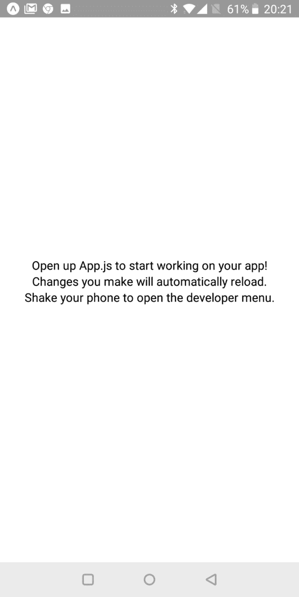
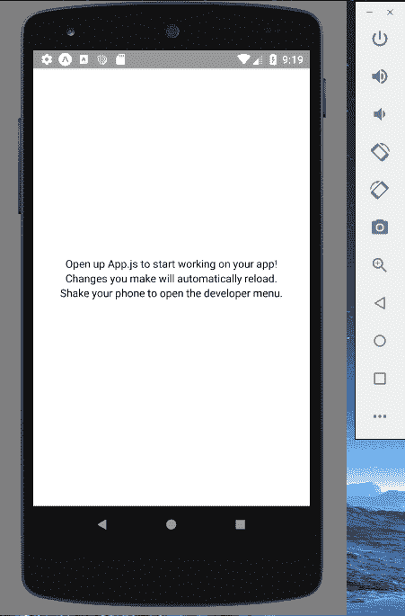
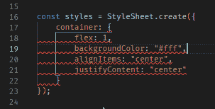
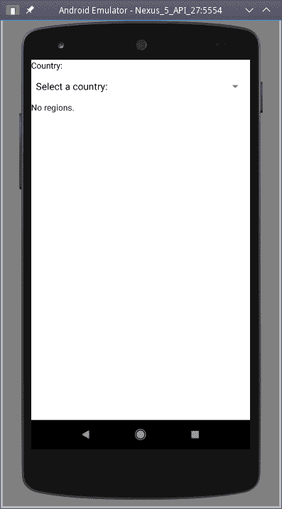
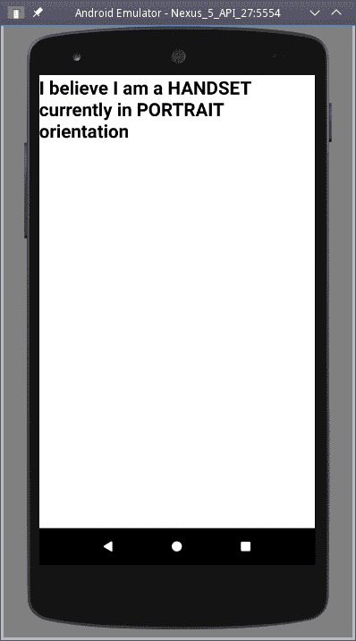
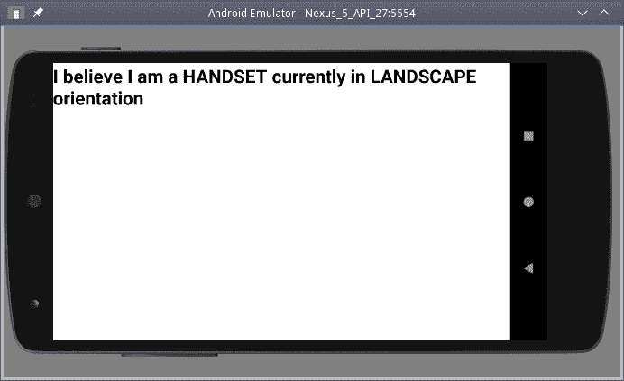
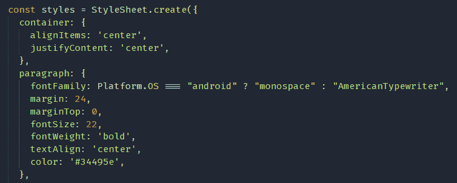
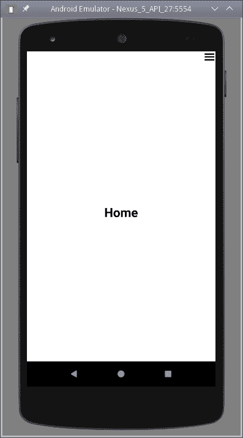
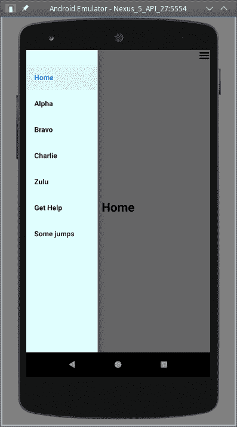

# 十一、使用 React Native 创建移动应用

在本章中，我们将介绍以下配方：

*   摆设
*   添加开发工具
*   使用本机组件
*   适应设备和方向
*   设置组件的样式和布局
*   添加特定于平台的代码
*   路由和导航

# 介绍

在最后几章中，我们向您展示了如何使用`React`构建 web 应用，在本章中，我们将使用一个近亲`React Native`来开发可以在 Android 和 iOS（苹果）手机上运行的本机应用。

# 摆设

对于移动应用的开发，有几种可能的方法：

*   *使用本机语言*，可能使用 Java 或 Kotlin for Android，或 Objective C 或 Swift for iOS，为每个平台使用本机开发工具。这可以确保你的应用最适合不同的手机，但需要多个开发团队，每个团队都有特定平台的经验。
*   *使用用户可以通过手机浏览器访问的纯网站*。这是最简单的解决方案，但应用会有一些限制，例如无法访问手机的大部分功能，因为它们不能在 HTML 中使用。此外，使用无线连接运行有时会很困难，因为无线连接的强度可能会有所不同。您可以使用任何框架进行此开发，例如`React`。
*   *开发一个混合应用*，这是一个网页，与包含一组扩展的浏览器捆绑在一起，以便您可以使用手机的内部功能。对于用户来说，这是一个独立的应用，即使没有网络连接也可以运行，可以使用手机的大部分功能。这些应用经常使用 apachecordova 或派生产品 PhoneGap。

还有第四种风格，由`React Native`提供，由 Facebook 开发，与现有`React`类似。`React Native`（从现在起，我们将缩短为*RN*）调用本机 API 来创建通过 JS 代码处理的内部组件，而不是将组件呈现给浏览器的 DOM。通常的 HTML 元素和 RN 的组件之间存在一些差异，但它们并不难克服。有了这个工具，您实际上正在构建一个本机应用，它的外观和行为与任何其他本机应用完全相同，只是您在 Android 和 iOS 开发中都使用了单一语言 JS。

在这个配方中，我们将设置一个 RN 应用，这样我们就可以开始尝试为手机开发应用。

# 怎么做。。。

有三种方法可以设置 RN 应用：完全手动，这是您不想做的；其次，使用包，使用`react-native-cli`命令行界面；最后，通过使用一个非常类似于我们已经用于`React`、`create-react-native-app`（从现在起，我们将其称为*CRAN*的包）。这两个包之间的一个关键区别是，对于后者，您不能包含自定义本机模块，如果需要，您必须*弹出*项目，这还需要设置其他几个工具。

You can read more about the two latter methods at [https://facebook.github.io/react-native/docs/getting-started.html](https://facebook.github.io/react-native/docs/getting-started.html), and if you want to be prepared for ejecting, go to [https://github.com/react-community/create-react-native-app/blob/master/EJECTING.md](https://github.com/react-community/create-react-native-app/blob/master/EJECTING.md).

我们首先获得一个命令行实用程序，它将包括大量其他软件包：

```js
npm install create-react-native-app -g
```

之后，我们可以创建并运行一个简单的项目，只需三个命令：

```js
create-react-native-app yourprojectname
cd yourprojectname
npm start
```

你准备好了！让我们看看它是如何工作的，是的，我们还有一些配置要做，但最好检查到目前为止一切是否顺利。

# 它是如何工作的。。。

当您运行应用时，它会在您的机器上的端口`19000`或`19001`启动一个服务器，您将使用`Expo`应用连接到该服务器，您可以在[找到该应用 https://expo.io/learn](https://expo.io/learn) ，适用于 Android 或 iOS。按照屏幕上的说明进行安装：


The initial screen you get when you fire up your app

当您第一次打开`Expo`应用时，它将显示如下屏幕截图。请注意，手机和您的机器必须位于同一个本地网络中，并且您的机器还必须允许连接到端口`19000`和`19001`；您可能需要修改防火墙才能使其正常工作：


On loading the Expo app, you'll have to scan the QR code in order to connect to the server

使用“扫描二维码”选项后，将进行一些同步，很快您将看到您的基本码运行没有问题：



Success—your code is up and running!

此外，如果您修改`App.js`源代码，更改将立即反映在您的设备上，这意味着一切都很好！要确保发生这种情况，请晃动手机以启用调试菜单，并确保启用实时重新加载和热重新加载。稍后还需要进行远程 JS 调试。您的手机应如下所示：


These settings enable reloading and debugging

# 还有更多。。。

通过使用`Expo`客户端，CRAN 允许您为 iOS 开发，即使您没有苹果电脑。（如果你有 Windows 或 Linux 机器，你就不能为苹果系统开发；你必须有 MacBook 或类似产品；这是苹果的限制。）此外，在某些方面，在实际设备上工作会更好，因为你可以看到最终用户会看到的东西，这是毫无疑问的。

然而，可能有两个原因使您希望以不同的方式工作，可能是在您的计算机上使用模拟现实生活设备的模拟器。首先，您可能很难获得十几种最流行的设备，以便在每种设备上测试您的应用。其次，只在您自己的机器上工作更方便，您可以轻松地进行调试、截图、复制和粘贴等。因此，您可以安装 Xcode 或 Android SDK，使自己能够使用模拟机器。

我们在这里不会详细讨论，因为有很多组合取决于您的开发操作系统和目标操作系统；相反，让我们指向位于[的文档 https://facebook.github.io/react-native/docs/getting-started.html](https://facebook.github.io/react-native/docs/getting-started.html) ，在这里，您应该单击使用本机代码构建项目，并查看使用模拟器需要什么。安装之后，您将需要`Expo`客户端（与实际设备一样），然后您将能够在自己的机器上运行代码。

例如，在以下屏幕截图中查看模拟 Nexus 5 的 Android emulator：



An emulated Nexus 5 running Android, directly on your screen

使用此模拟器，您可以获得与实际设备完全相同的功能。例如，您也可以获得调试菜单，尽管打开它会有所不同；例如，在我的 Linux 机器上，我需要按*Ctrl*+*M*：


All the functionality that is available on your phone is also available with emulated devices

使用**Android 虚拟设备**（**AVD**管理器，您可以为手机和平板电脑创建大量不同的模拟器；虽然 Xcode 只能在 macOS 计算机上运行，但它的功能与 Xcode 类似

# 添加开发工具

现在，让我们进行更好的配置。与前几章一样，我们希望 ESLint 用于代码检查，`Prettier`用于格式化，`Flow`用于数据类型。CRAN 负责包括`Babel`和`Jest`，所以我们不必为这两个做任何事情。

# 怎么做。。。

与`React`的情况相反，我们必须添加一个特殊的`rewiring`包才能处理特定的配置，在 RN 中，我们只需添加一些包和配置文件，就可以开始了。

# 添加 ESLint

对于 ESLint，我们将有一个需要的软件包列表。我们在`React`中使用了其中的大部分，但有一个特殊的补充`eslint-plugin-react-native`，它添加了一些特定于 RN 的规则：

```js
npm install --save-dev \
 eslint eslint-config-recommended eslint-plugin-babel \
 eslint-plugin-flowtype eslint-plugin-react eslint-plugin-react-native
```

If you want to learn more about the (actually few) extra rules added by `eslint-plugin-react-native`, check out its GitHub page at [https://github.com/Intellicode/eslint-plugin-react-native](https://github.com/Intellicode/eslint-plugin-react-native). Most of them have to do with styles, and one is applied for platform-specific code, but we'll get to this later.

我们需要一个单独的`.eslintrc`文件，就像我们对`React`所做的那样。适当的内容包括以下内容，我强调了特定于 RN 的补充内容：

```js
{
    "parser": "babel-eslint",
    "parserOptions": {
        "ecmaVersion": 2017,
        "sourceType": "module",
        "ecmaFeatures": {
            "jsx": true
        }
    },
    "env": {
        "node": true,
        "browser": true,
        "es6": true,
        "jest": true,
 "react-native/react-native": true
    },
    "extends": [
        "eslint:recommended",
        "plugin:flowtype/recommended",
        "plugin:react/recommended",
 "plugin:react-native/all"
    ],
    "plugins": ["babel", "flowtype", "react", "react-native"],
    "rules": {
        "no-console": "off",
        "no-var": "error",
        "prefer-const": "error",
        "flowtype/no-types-missing-file-annotation": 0
    }
}
```

# 添加流

完成后，`ESLint`设置为识别我们的代码，但我们还必须配置`Flow`：

```js
npm install --save-dev flow flow-bin flow-coverage-report flow-typed
```

我们必须在`package.json`的`scripts`部分添加几行：

```js
"scripts": {
    "start": "react-native-scripts start",
    .
    .
    .
 "flow": "flow",
 "addTypes": "flow-typed install"
},
```

然后，我们必须初始化`Flow`的工作目录：

```js
npm run flow init
```

最后，我们可以使用前面用于 React 的相同`.flowconfig`文件：

```js
[ignore]
.*/node_modules/.*

[include]

[libs]

[lints]
all=warn
untyped-type-import=off
unsafe-getters-setters=off

[options]
include_warnings=true

[strict]
```

我们现在设置为使用`Flow`，因此我们可以继续以我们习惯的方式工作，只需添加`Prettier`来格式化代码，我们就可以开始了！

# 添加更漂亮的

没有什么需要重新安装的了，我们只需要一个`npm`命令，再加上我们一直在使用的`.prettierrc`文件。对于前者，只需使用以下命令：

```js
npm install --save-dev prettier
```

对于配置，我们可以使用此`.prettierrc`文件的内容：

```js
{
    "tabWidth": 4,
    "printWidth": 75
}
```

现在，我们准备好了！我们可以检查它的工作情况；让我们这样做吧。

# 它是如何工作的。。。

让我们检查一下是否一切正常。我们将首先查看由 CRAN 创建的`App.js`文件，我们可以立即验证工具是否正常工作，因为检测到问题！请查看以下屏幕截图：



We can verify that ESLint integration is working, because it highlights a problem

失败的规则是一个新规则，从`eslint-plugin-react-native`：`no-color-literals`，因为我们在样式中使用常量，这可能会成为未来维护的难题。我们可以通过添加一个变量来解决这个问题，我们将使用一个类型声明来确保`Flow`也在运行。新代码应如下所示——我已经强调了所需的更改：

```js
// Source file: App.original.fixed.js /* @flow */

import React from "react";
import { StyleSheet, Text, View } from "react-native";

export default class App extends React.Component<> {
    render() {
        return (
            <View style={styles.container}>
                <Text>Open up App.js to start working on your app!</Text>
                <Text>Changes you make will automatically reload.</Text>
                <Text>Shake your phone to open the developer menu.</Text>
            </View>
        );
    }
}

const white: string = "#fff";

const styles = StyleSheet.create({
    container: {
        flex: 1,
        backgroundColor: white,
        alignItems: "center",
        justifyContent: "center"
    }
});
```

所以，现在我们已经恢复了所有工具，我们可以开始实际的代码了！

# 使用本机组件

使用 RN 非常类似于使用`React`——有组件、状态、道具、生命周期事件等，但有一个关键区别：您自己的组件不会基于 HTML，而是基于特定的 RN 组件。例如，您不会使用`<div>`元素，而是使用`<View>`元素，然后 RN 会将这些元素映射到 iOS 的`UIView`元素，或者 Android 的`Android.View`元素。视图可以嵌套在视图中，就像`<div>`标记可以嵌套一样。视图支持布局和样式，它们响应触摸事件等，因此基本上等同于`<div>`标签，不考虑移动环境的行为和细节。

还有更多的区别：组件的属性也不同于 HTML 组件，您必须阅读文档（见[https://facebook.github.io/react-native/docs/components-and-apis](https://facebook.github.io/react-native/docs/components-and-apis) 了解每个特定组件的所有可能性。

You are not limited to using the components that RN provides you with. You can extend your project by using native components developed by other people; for this, a top notch source is the Awesome React Native list, at [http://www.awesome-react-native.com/](http://www.awesome-react-native.com/). Note that it's likely that you'll have to eject your project in order to do this, so check [https://github.com/react-community/create-react-native-app/blob/master/EJECTING.md](https://github.com/react-community/create-react-native-app/blob/master/EJECTING.md) for more.

# 准备

让我们先看一下您可能要使用的 RN 组件和 API 列表，然后再看一些实际代码：

| **RN 组件** | **取代。。。** | **目标** |
| `ActivityIndicator` | 动画 GIF | 用于显示圆形负载指示器的零部件 |
| `Button` | `button` | 用于处理接触（单击）的组件 |
| `DatePickerAndroid`
`TimePickerAndroid` | `input type="date"`
`input type="time"` | 一个 API，显示一个弹出窗口，您可以在其中输入日期和时间；对于 Android |
| `DatePickerIOS` | `input type="date"`
`input type="datetime-local"`
`input type="time"` | 用户可以在其中输入日期和时间的组件；对于 iOS |
| `FlatList` | - | 仅呈现可见元素的列表组件；用于提高性能 |
| `Image` | `img` | 用于显示图像的组件 |
| `Picker` | `select` | 用于从列表中拾取值的组件 |
| `Picker.Item` | `option` | 用于定义列表值的组件 |
| `ProgressBarAndroid` | - | 显示活动的组件；仅适用于 Android |
| `ProgressViewIOS` | - | 显示活动的组件；仅适用于 iOS |
| `ScrollView` | - | 可能包含多个组件和视图的滚动容器 |
| `SectionList` | - | 与`FlatList`类似，但允许分段列表 |
| `Slider` | `input type="number"` | 用于从一系列值中选择值的组件 |
| `StatusBar` | - | 用于管理应用状态栏的组件 |
| `StyleSheet` | CSS | 将样式应用于你的应用 |
| `Switch` | `input type="checkbox"` | 接受布尔值的组件 |
| `Text` | - | 显示文本的组件 |
| `TextInput` | `input type="text"` | 使用键盘输入文本的组件 |
| `TouchableHighlight`
`TouchableOpacity` | - | 使视图响应触摸的包装器 |
| `View` | `div` | 应用的基本结构功能 |
| `VirtualizedList` | - | 更灵活的`FlatList`版本 |
| `WebView` | `iframe` | 用于呈现 web 内容的组件 |

还有许多 API，您可能会感兴趣；其中包括：

| **API** | **说明** |
| `Alert` | 显示具有给定标题和文本的警报对话框 |
| `Animated` | 简化创建动画 |
| `AsyncStorage` | `LocalStorage`的替代方案 |
| `Clipboard` | 提供获取和设置剪贴板内容的访问权限 |
| `Dimensions` | 提供对设备尺寸和方向更改的访问 |
| `Geolocation` | 提供对地理位置的访问；仅适用于弹出的项目 |
| `Keyboard` | 允许控制键盘事件 |
| `Modal` | 在视图上方显示内容 |
| `PixelRatio` | 提供对设备像素密度的访问 |
| `Vibration` | 允许控制设备振动 |

To have as few problems as possible, you might prefer to eschew platform-specific components and APIs, and make do with the generic, compatible components. However, if you are determined to use some Android or iOS-specific elements, have a look at [https://facebook.github.io/react-native/docs/platform-specific-code](https://facebook.github.io/react-native/docs/platform-specific-code) for details on how to do it; it's not complex. Remember, however, that this will become harder to maintain, and will probably change some interactions or screen designs.

现在，让我们回顾一下我们在[第 6 章](06.html)中为`React`编写的一个例子，*与 React*一起开发，国家和地区页面，它也允许我们使用`Redux`和异步调用，如[第 8 章](08.html)*中扩展应用*。因为我们使用的是`PropTypes`，所以我们需要那个软件包。使用以下命令安装它：

```js
npm install prop-types --save
```

然后，我们必须重新安装一些软件包，从`Redux`和亲戚开始。实际上，CRAN 已经包括了`redux`和`react-redux`，所以我们不需要这些，但`redux-thunk`不包括在内。如果您以不同的方式创建了该项目，而不使用 CRAN，则需要手动安装所有三个软件包。在这两种情况下，都可以使用以下命令，因为`npm`不会安装已安装的软件包：

```js
npm install react react-redux redux-thunk --save
```

我们还将使用`axios`进行异步调用，正如我们在本书前面所做的：

```js
npm install axios --save
```

By default, RN provides `fetch` instead of `axios`. However, RN includes the `XMLHttpRequest` API, which allows us to install `axios` with no problems. For more on network handling, check out [https://facebook.github.io/react-native/docs/network](https://facebook.github.io/react-native/docs/network).

我们的最后一步将是运行我们在[第 4 章](04.html)中写回的服务器代码，*通过 Node*实现 RESTful 服务，这样我们的应用将能够进行异步调用。转到该章节的目录，只需输入以下命令：

```js
node out/restful_server.js.
```

现在，我们准备好了！现在让我们看看如何修改代码，使之适合 RN。

# 怎么做。。。

由于 RN 使用自己的组件，您的 HTML 体验将没有什么用处。在这里，我们将看到一些变化，但为了充分利用 RN 的所有可能性，您必须自己研究它的组件。让我们从`<RegionsTable>`组件开始，它相当简单。我们在[第 6 章](06.html)的*定义组件*部分看到了它的原始代码，*与 React*一起开发；在这里，让我们关注这些差异，它们都受到`render()`方法的限制。之前，我们使用`<div>`标记并在其中显示文本；在这里，对于 RN，我们需要使用`<View>`和`<Text>`元素：

```js
// Source file: src/regionsApp/regionsTable.component.js

.
.
.

render() {
    if (this.props.list.length === 0) {
        return (
 <View>
 <Text>No regions.</Text>
 </View>
        );
    } else {
        const ordered = [...this.props.list].sort(
            (a, b) => (a.regionName < b.regionName ? -1 : 1)
        );

        return (
 <View>
                {ordered.map(x => (
 <View key={x.countryCode + "-" + x.regionCode}>
 <Text>{x.regionName}</Text>
 </View>
                ))}
 </View>
        );
    }
}
```

请注意，组件的其余部分没有变化，您所有的`React`知识仍然有效；您只需调整渲染方法的输出

接下来，我们将`<CountrySelect>`组件更改为使用`<Picker>`，这有点类似，但我们需要一些额外的修改。让我们看看我们的组件，强调需要更改的部分：

```js
// Source file: src/regionsApp/countrySelect.component.js

/* @flow */

import React from "react";
import PropTypes from "prop-types";
import { View, Text, Picker } from "react-native";

export class CountrySelect extends React.PureComponent<{
    dispatch: ({}) => any
}> {
    static propTypes = {
        loading: PropTypes.bool.isRequired,
 currentCountry: PropTypes.string.isRequired,
        list: PropTypes.arrayOf(PropTypes.object).isRequired,
        onSelect: PropTypes.func.isRequired,
        getCountries: PropTypes.func.isRequired
    };

    componentDidMount() {
        if (this.props.list.length === 0) {
            this.props.getCountries();
        }
    }

 onSelect = value => this.props.onSelect(value);

    render() {
        if (this.props.loading) {
            return (
 <View>
 <Text>Loading countries...</Text>
 </View>
            );
        } else {
            const sortedCountries = [...this.props.list].sort(
                (a, b) => (a.countryName < b.countryName ? -1 : 1)
            );

            return (
 <View>
 <Text>Country:</Text>
 <Picker
 onValueChange={this.onSelect}
 prompt="Country"
 selectedValue={this.props.currentCountry}
 >
 <Picker.Item
 key={"00"}
 label={"Select a country:"}
 value={""}
 />
 {sortedCountries.map(x => (
 <Picker.Item
 key={x.countryCode}
 label={x.countryName}
 value={x.countryCode}
 />
 ))}
 </Picker>
 </View>
            );
        }
    }
}
```

很多变化！让我们按照它们出现的顺序来检查它们：

*   意外更改：如果要`<Picker>`组件显示其当前值，必须设置其`selectedValue`属性；否则，即使用户选择了一个国家，也不会在屏幕上看到更改。我们将不得不提供一个额外的道具，`currentCountry`，我们将从商店获得，因此我们可以使用它作为我们列表中的`selectedValue`。
*   用户选择值时触发的事件也不同；事件处理程序将使用所选的值直接调用，而不是使用要从中处理`event.target.value`的事件。
*   我们必须用`<Picker>`替换`<select>`元素，并提供一个`prompt`文本道具，当扩展列表显示在屏幕上时将使用该道具。
*   我们必须为单个选项使用`<Item>`元素，注意要显示的`label`现在是一个道具。

在将国家/地区列表连接到商店时，不要忘记更改；我们只需向`getProps()`函数添加一个额外属性：

```js
// Source file: src/regionsApp/countrySelect.connected.js

const getProps = state => ({
    list: state.countries,
 currentCountry: state.currentCountry,
    loading: state.loadingCountries
});
```

现在，我们需要做的就是看看主应用是如何设置的。我们的`App.js`代码将非常简单：

```js
// Source file: App.js

/* @flow */

import React from "react";
import { Provider } from "react-redux";

import { store } from "./src/regionsApp/store";
import { Main } from "./src/regionsApp/main";

export default class App extends React.PureComponent<> {
    render() {
        return (
 <Provider store={store}>
 <Main />
 </Provider>
        );
    }
}
```

这很简单。其余的设置将在`main.js`文件中，其中有一些有趣的细节：

```js
// Source file: src/regionsApp/main.js

/* @flow */

import React from "react";
import { View, StatusBar } from "react-native";

import {
    ConnectedCountrySelect,
    ConnectedRegionsTable
} from ".";

export class Main extends React.PureComponent<> {
    render() {
        return (
 <View>
 <StatusBar hidden />
                <ConnectedCountrySelect />
                <ConnectedRegionsTable />
 </View>
        );
    }
}
```

除了在我们以前使用`<div>`的地方使用`<View>`（您应该已经习惯了这一变化），还有一个额外的细节：我们不希望状态栏显示，所以我们使用`<StatusBar>`元素，并确保将其隐藏。

好了，就这样！在为 RN 编写代码时，首先您必须努力记住哪些元素与旧的和熟悉的 HTML 元素是等价的，哪些道具或事件发生了变化，但除此之外，您之前的所有知识仍然有效。最后，让我们看看我们的应用正在运行。

# 它是如何工作的。。。

为了多样性，我决定使用模拟设备，而不是像本章前面所做的那样使用手机。在用`npm start`启动应用后，我启动了我的设备，很快就得到了以下结果：



Our application, just loaded, waiting for the user to select a country

如果用户触摸`<Picker>`元素，将显示一个弹出窗口，列出从我们的 Node 服务器接收到的国家，如以下屏幕截图所示：


Upon touching on the list of countries, a popup shows up so that the user can select the desired country

当用户实际点击某个国家时，触发`onValueChange`事件，并在呼叫服务器后，显示地区列表，如下所示：


After picking a country, the list of its regions is displayed, as in our earlier HTML React version

一切正常，并且使用本地组件；伟大的顺便说一下，如果您对我们描述的`selectedValue`问题不是很确定，只需省略该道具，当用户选择某个国家时，您将得到一个糟糕的结果：


There are some differences, such as requiring the selectedValue prop to be present, or otherwise the currently picked value
won't be updated—even though Brazil was selected, the picker doesn't show it

在这里，我们看了一个编写 RN 代码的例子，正如我们所看到的，它与简单的`React`代码没有太大区别，不同的是我们不能使用 HTML，而是依赖于不同的元素。

We have seen two ways of running our code: with the `Expo` client on our mobile device, and with emulators on our computer. To experiment with RN, there are a couple of online playgrounds you may want to look at Snack, at [https://snack.expo.io/](https://snack.expo.io/), [and `Repl.it`, at ](https://snack.expo.io/)[https://repl.it/languages/react_native](https://repl.it/languages/react_native)[. In both of these environments, you can create files, edit code, and see the results of your experiments online.](https://snack.expo.io/)

# 还有更多。。。

在让你的应用运行之后，最后一步是创建一个独立的软件包，你可以通过苹果和谷歌的应用商店理想地分发。如果你手动创建应用，那么这个过程可能会变得有点复杂，你甚至需要一台真正的 macOS 计算机，因为你将无法为 iOS 构建其他应用：你必须阅读如何使用`Xcode`或 Android 开发者工具包生成应用，这可能有点复杂。而使用 CRAN 应用，这个过程可以简化，因为`Expo`提供了一个应用构建功能，所以您不必这样做。退房[https://docs.expo.io/versions/latest/guides/building-standalone-apps.html](https://docs.expo.io/versions/latest/guides/building-standalone-apps.html) 了解具体说明。

In any case, no matter which way you decide to proceed for your build process, check out some of the suggestions to help ensure your app will be approved and well received at [https://docs.expo.io/versions/latest/guides/app-stores.html](https://docs.expo.io/versions/latest/guides/app-stores.html).

# 适应设备和方向

当我们在[第 7 章](07.html)*增强应用*中的*使应用自适应以增强可用性*一节中开发了一个响应性和自适应的网页时，我们必须处理窗口大小随时可能发生变化的可能性，我们网页的内容必须正确地重新定位。使用移动设备时，屏幕大小不会改变，但仍有可能发生旋转（从纵向模式更改为横向模式，反之亦然），因此您仍然需要处理至少一个更改。当然，如果你想让你的应用在所有设备上看起来都很好，你很可能需要考虑屏幕大小来决定如何容纳你的内容。

在本教程中，我们将介绍一种使应用了解不同设备类型的简单技术。这项技术可以很容易地升级，以涵盖特定的屏幕尺寸。

We'll look more at styling later; for the time being, we'll focus on getting the app to recognize the device type and orientation, and then in the next section, we'll follow up with specific style examples.

# 怎么做。。。

如果我们想让我们的应用适应，我们必须能够回答代码中的几个问题：

*   我们如何判断该设备是平板电脑还是手机？
*   我们如何了解它是处于纵向模式还是横向模式？
*   我们如何编写一个根据设备类型呈现不同的组件？
*   如何使组件在屏幕方向改变时自动重新绘制自身？

现在让我们把这些问题都复习一遍。让我们首先看看如何了解设备类型和方向。RN 包括一个 API`Dimensions`，它提供呈现应用所需的数据，如屏幕尺寸。那么，我们如何才能了解设备的类型和方向呢？第二个问题更简单：因为没有方形设备（至少到目前为止！），所以只要看看两个维度中哪个更大就足够了。如果高度更大，那么设备处于纵向模式，否则它处于横向模式

然而，第一个问题更难。在屏幕尺寸方面，没有严格的规则来定义手机的终端和平板电脑的起始位置，但如果我们查看设备上的信息并计算形状系数（最长边与最短边的比率），就会出现一个简单的规则：如果计算出的比率为 1.6 或以下，则更可能是平板电脑，更高的比例意味着手机。

If you need more specific data, check [http://iosres.com/](http://iosres.com/) for information on iOS devices, or [https://material.io/tools/devices](https://material.io/tools/devices) and [http://screensiz.es](http://screensiz.es) for a larger variety of devices, in particular for Android, which is used on devices with a much greater variety of screen sizes.

在下面的代码中，我们基本上返回了`Dimensions`提供的所有信息，再加上几个属性（`.isTablet`和`.isPortrait`，以简化编码：

```js
// Source file: src/adaptiveApp/device.js

/* @flow */

import { Dimensions } from "react-native";

export type deviceDataType = {
    isTablet: boolean,
    isPortrait: boolean,
    height: number,
    width: number,
    scale: number,
    fontScale: number
};

export const getDeviceData = (): deviceDataType => {
    const { height, width, scale, fontScale } = Dimensions.get("screen");

    return {
 isTablet: Math.max(height, width) / Math.min(height, width) <= 1.6,
 isPortrait: height > width,
        height,
        width,
        scale,
        fontScale
    };
};
```

使用前面的代码，我们可以以适合各种设备、尺寸和两种可能的方向的方式绘制视图，但是我们如何使用这些数据呢？现在让我们来看一下，让我们的应用在所有情况下都能正确调整。

For more on the `Dimensions` API, read [https://facebook.github.io/react-native/docs/dimensions](https://facebook.github.io/react-native/docs/dimensions).

我们可以在我们的组件中直接使用`getDeviceData()`提供的信息，但这会带来一些问题：

*   组件的功能将不如以前，因为它们在函数中有一个隐藏的依赖项
*   因此，测试组件会变得有点困难，因为我们必须模拟函数
*   最重要的是，设置组件以在方向更改时重新渲染它们自己并不是那么容易

所有这些的解决方案都很简单：让我们把设备数据放在存储中，然后相关组件（意味着需要更改渲染方式的组件）可以连接到数据。我们可以创建一个简单的组件来执行此操作：

```js
// Source file: src/adaptiveApp/deviceHandler.component.js

/* @flow */

import React from "react";
import PropTypes from "prop-types";
import { View } from "react-native";

class DeviceHandler extends React.PureComponent<{
    setDevice: () => any
}> {
    static propTypes = {
        setDevice: PropTypes.func.isRequired
    };

    onLayoutHandler = () => this.props.setDevice();

    render() {
 return <View hidden onLayout={this.onLayoutHandler} />;
    }
}

export { DeviceHandler };
```

该组件不会出现在屏幕上，因此我们可以将其添加到主视图的任何位置。连接组件是另一个必要步骤；当`onLayout`事件触发时（意味着设备的方向已经改变），我们将不得不发出一个动作：

```js
// Source file: src/adaptiveApp/deviceHandler.connected.js

/* @flow */

import { connect } from "react-redux";

import { DeviceHandler } from "./deviceHandler.component";
import { setDevice } from "./actions";

const getDispatch = dispatch => ({
 setDevice: () => dispatch(setDevice())
});

export const ConnectedDeviceHandler = connect(
    null,
    getDispatch
)(DeviceHandler);
```

当然，我们需要定义动作和减速器，以及存储。让我们看看如何做到这一点，我们将从行动开始。我们需要的最低要求（除了我们假设的应用需要的其他操作）如下：

```js
// Source file: src/adaptiveApp/actions.js

/* @flow */

import { getDeviceData } from "./device";

import type { deviceDataType } from "./device"

export const DEVICE_DATA = "device:data";

export type deviceDataAction = {
    type: string,
    deviceData: deviceDataType
};

export const setDevice = (deviceData?: object) =>
 ({
 type: DEVICE_DATA,
 deviceData: deviceData || getDeviceData()
 }: deviceDataAction); /* *A real app would have many more actions!*
*/
```

我们正在出口一种 thunk，其中包括`deviceData`。请注意，通过允许将其作为参数提供（或者使用由`getDeviceData()`创建的默认值），我们将简化测试；如果我们想模拟一个景观平板电脑，我们只需要提供一个合适的`deviceData`对象。

最后，reducer 将如下所示（显然，对于真正的应用，将有更多的操作！）

```js
// Source file: src/adaptiveApp/reducer.js

/* @flow */

import { getDeviceData } from "./device";

import { DEVICE_DATA } from "./actions";

import type { deviceAction } from "./actions";

export const reducer = (
    state: object = {
        // initial state: more app data, plus:
 deviceData: getDeviceData()
    },
    action: deviceAction
) => {
    switch (action.type) {
 case DEVICE_DATA:
 return {
 ...state,
 deviceData: action.deviceData
 };

        /*
  *          In a real app, here there would*
 *be plenty more "case"s*
        */

        default:
            return state;
    }
};
```

因此，现在我们在商店里有了我们的设备信息，我们可以研究如何对自适应、响应性组件进行编码。

我们可以看到如何使用一个非常基本的组件来编码自适应和响应组件，该组件只显示是手机还是平板电脑，以及当前的方向。访问所有`deviceData`对象意味着我们可以做出任何决定：显示什么、显示多少元素、制作它们的大小等等。我们将简短地介绍这个示例，但应该清楚如何扩展它：

```js
// Source file: src/adaptiveApp/adaptiveView.component.js

/* @flow */

import React from "react";
import PropTypes from "prop-types";
import { View, Text, StyleSheet } from "react-native";

import type { deviceDataType } from "./device";

const textStyle = StyleSheet.create({
    bigText: {
        fontWeight: "bold",
        fontSize: 24
    }
});

export class AdaptiveView extends React.PureComponent<{
    deviceData: deviceDataType
}> {
 static propTypes = {
 deviceData: PropTypes.object.isRequired
 };

 renderHandset() {
        return (
            <View>
                <Text style={textStyle.bigText}>
                    I believe I am a HANDSET currently in
                    {this.props.deviceData.isPortrait
                        ? " PORTRAIT "
                        : " LANDSCAPE "}
                    orientation
                </Text>
            </View>
        );
    }

 renderTablet() {
        return (
            <View>
                <Text style={textStyle.bigText}>
                    I think I am a
                    {this.props.deviceData.isPortrait
                        ? " PORTRAIT "
                        : " LANDSCAPE "}
                    TABLET
                </Text>
            </View>
        );
    }

 render() {
 return this.props.deviceData.isTablet
 ? this.renderTablet()
 : this.renderHandset();
 }
}
```

Don't worry about the `textStyle` definition—soon we'll be getting into how it works, but for now I think it should be easy to accept that it defines bold, largish, text.

给定`this.props.deviceData`，我们可以使用`.isTablet`属性来决定调用哪个方法（`.renderTablet()`或`.renderHandset()`。在这些方法中，我们可以使用`.isPortrait`来决定使用哪种布局：纵向还是横向。最后，尽管我们在示例中没有显示这一点，但我们可以使用`.width`或`.height`来显示更多或更少的组件，或者计算组件的大小，等等。我们只需要按如下方式将组件连接到存储，我们将设置：

```js
// Source file: src/adaptiveApp/adaptiveView.connected.js

/* @flow */

import { connect } from "react-redux";

import { AdaptiveView } from "./adaptiveView.component";

const getProps = state => ({
 deviceData: state.deviceData
});

export const ConnectedAdaptiveView = connect(getProps)(AdaptiveView);
```

我们现在拥有我们需要的一切；让我们看看它的工作！

# 它是如何工作的。。。

我们已经准备了一个（隐藏的）组件，它通过发送一个更新存储的操作来响应方向的更改，并且我们知道如何对将使用设备信息的组件进行编码。我们的主页可以如下所示：

```js
// Source file: src/adaptiveApp/main.js

/* @flow */

import React from "react";
import { View, StatusBar } from "react-native";

import { ConnectedAdaptiveView } from "./adaptiveView.connected";
import { ConnectedDeviceHandler } from "./deviceHandler.connected";

export class Main extends React.PureComponent<> {
    render() {
        return (
            <View>
                <StatusBar hidden />
 <ConnectedDeviceHandler />
 <ConnectedAdaptiveView />
            </View>
        );
    }
}
```

如果我在（模拟的）Nexus 5 设备上以纵向模式运行该应用，我们将看到如下内容：



Our device is recognized as a handset, currently in portrait (vertical) orientation

旋转设备将产生不同的视图：



When the orientation changes, the store is updated and the app re-renders itself appropriately

在我们的设计中，组件从不单独使用`Dimension`API，因为它们从存储中获取设备信息，可以在功能上测试组件在不同设备和方向上的行为，而无需模拟任何东西。

# 还有更多。。。

在我们的组件中，我们将所有内容都包含在一个类中，但对于复杂的情况来说，这可能不是一个好方法。在这种情况下，我们可以选择使用类和继承，如下所示。首先，创建一个基本的`something.base.js`文件，该文件将包含您将为手机和平板电脑扩展的基类。特别是，您的`.render()`方法应该按照下面的代码段进行编码，以便使类的行为像抽象类一样，而不是直接使用。您需要禁用`ESLint``react/require-render-return`规则以使`.render()`不返回任何内容：

```js
import React from "react";
import PropTypes from "prop-types";

// eslint-disable-next-line react/require-render-return
class SomethingBase extends React.PureComponent<{
    deviceData: deviceDataType
}> {
    static propTypes = {
        deviceData: PropTypes.object.isRequired
    };

    render() {
 throw new Error("MUST IMPLEMENT ABSTRACT render() METHOD");
 }
}

export { SomethingBase };
```

要继续，请分别编写扩展了`SomethingBase`的`something.handset.js`和`something.tablet.js`文件，以定义`SomethingHandset`和`SomethingTablet`组件。最后，设置用于检查设备是手机还是平板电脑的`something.component.js`文件，并返回`<SomethingHandset>`组件或`<SomethingTablet>`组件：

```js
import { SomethingTablet } from "./something.tablet";
import { SomethingHandset } from "./something.handset";
import { getDeviceData } from "./device";

export const Something = getDeviceData().isTablet ? SomethingTablet : SomethingHandset;
```

使用这种风格，您可以在代码中使用并连接`<Something>`组件，在内部，这将是当前设备类型的合适版本。

In computer science terms, this is called the *Factory* design pattern, where you are able to create an object without actually specifying its class.

# 设置组件的样式和布局

将 CSS 样式应用于应用并不困难，但您必须取消学习并重新学习以下一些概念，这些概念在 RN 中与 HTML 相比完全不同：

*   在网页中，CSS 样式是全局的，并且适用于所有标签；在 RN 中，样式是在局部逐个组件的基础上完成的；没有全局样式。此外，您不需要*选择器*，因为样式直接与组件关联。
*   样式没有继承性：在 HTML 中，默认情况下，子级继承父级的一些样式，但在 RN 中，如果希望这样做，则必须为子级提供所需的特定样式。然而，如果你愿意，你可以`export`风格和`import`其他地方。
*   RN 样式是完全动态的：您可以使用所有 JS 函数来计算希望应用的任何值。你甚至可以在飞行中改变样式，这样一个应用的背景颜色在白天可以变浅，在晚上随着时间的推移逐渐变暗。你将不需要任何像 SASS 或更少的东西；您可以进行数学运算并使用常量，因为这是纯 JS。

还有一些其他的细微差别：

*   RN 使用*camelCase*样式（如`fontFamily`），而不是 CSS 的*烤肉串*样式（如`font-family`）；这很容易适应。此外，并非所有常见的 CSS 属性都可能存在（这取决于特定的组件），有些可能会受到其可能值的限制。
*   RN 只有两种可能的测量值：百分比或**密度无关像素**（**DP**）。DP 不是来自 web 的经典屏幕像素；相反，它们与每台设备都能很好地协同工作，与像素密度或每英寸的**像素（**ppi**）无关，从而保证所有屏幕的外观都是通用的。**
*   布局使用 flex 完成，因此定位元素更简单。您可能没有可用于 web 页面的完整选项集，但您所获得的绝对足以用于任何类型的布局。

关于 RN 中的样式设计有很多值得阅读的内容（对于初学者，请参见[https://facebook.github.io/react-native/docs/style](https://facebook.github.io/react-native/docs/style) 作介绍，[https://facebook.github.io/react-native/docs/height-and-width](https://facebook.github.io/react-native/docs/height-and-width) 和[https://facebook.github.io/react-native/docs/flexbox](https://facebook.github.io/react-native/docs/flexbox) 在这个配方中，我们将通过设计我们的国家和地区应用的样式来看看一些具体的例子。

# 怎么做。。。

让我们试着增强一下我们的应用。而且，为了完成我们之前看到的自适应和响应显示，我们将提供不同的纵向和横向布局。我们不需要媒体查询或基于列的布局；我们将就一下简单的款式

让我们从为`<Main>`组件创建样式开始。我们将使用我们先前开发的`<DeviceHandler>`；这两个组件都将连接到存储。我不想为平板电脑和手机做特定的版本，但我想为纵向和横向显示不同的布局。对于前者，我基本上使用了我先前开发的内容，但对于后者，我决定将屏幕一分为二，在左侧显示国家选择器，在右侧显示地区列表。哦，你可能会注意到，我选择使用内联样式，即使它不是首选选项；由于组件通常较短，因此可以在 JSX 代码中正确放置样式，而不会丢失清晰度。由您决定是否喜欢：

```js
// Source file: src/regionsStyledApp/main.component.js

/* @flow */

import React from "react";
import { View, StatusBar } from "react-native";

import {
    ConnectedCountrySelect,
    ConnectedRegionsTable,
    ConnectedDeviceHandler
} from ".";
import type { deviceDataType } from "./device";

/* eslint-disable react-native/no-inline-styles */

export class Main extends React.PureComponent<{
    deviceData: deviceDataType
}> {
    render() {
 if (this.props.deviceData.isPortrait) {            .
            . *// portrait view*
            .
 } else {            .
            . *// landscape view*
            .
        }
    }
}
```

当设备处于纵向时，我创建了一个`<View>`，占据了所有屏幕（`flex:1`，并使用`flexDirection:"column"`垂直设置其组件，虽然这实际上是默认值，所以我可以忽略此项。我没有为`<CountrySelect>`组件指定大小，但我将`<RegionsTable>`设置为占用所有可能（剩余）的空间。详细代码如下：

```js
// Source file: src/regionsStyledApp/main.component.js

            return (
 <View style={{ flex: 1 }}>
                    <StatusBar hidden />
                    <ConnectedDeviceHandler />
 <View style={{ flex: 1, flexDirection: "column" }}>
                        <View>
                            <ConnectedCountrySelect />
                        </View>
 <View style={{ flex: 1 }}>
                            <ConnectedRegionsTable />
                        </View>
                    </View>
                </View>
            );
```

对于景观方向，需要进行一些更改。我将主视图内容的方向设置为水平（`flexDirection:"row"`，并在其中添加了两个大小相等的视图。首先，对于国家列表，我将其内容设置为垂直和居中，因为我认为这样看起来更好，而不是出现在顶部。我没有特别针对占据屏幕右侧的区域列表执行任何操作：

```js
// Source file: src/regionsStyledApp/main.component.js

            return (
 <View style={{ flex: 1 }}>
                    <StatusBar hidden />
                    <ConnectedDeviceHandler />
 <View style={{ flex: 1, flexDirection: "row" }}>
                        <View
 style={{
 flex: 1,
 flexDirection: "column",
 justifyContent: "center"
 }}
                        >
                            <ConnectedCountrySelect />
                        </View>
 <View style={{ flex: 1 }}>
                            <ConnectedRegionsTable />
                        </View>
                    </View>
                </View>
            );
```

如果希望组件占用更大的空间，请增加其弹性值；*flex*意味着组件将根据可用空间灵活地扩展或收缩，所有组件之间按照其 flex 值成正比地共享可用空间。如果我想让国家列表占据屏幕的三分之一，剩下的三分之二留给地区列表，我会为它设置`flex:1`，为地区设置`flex:2`。当然，您也可以直接设置高度和宽度（以倾斜值或百分比表示），就像您使用 CSS 所做的那样。

对于在视图中分布子视图，除了`"center"`将所有子视图集中在父视图中之外，您还有几个其他选项：

*   `"flex-start"`将它们放在一起，在父视图的开始处；这里是顶部，垂直对齐
*   `"flex-end"`会有类似的行为，但会将子视图放置在父视图的末尾（这里是底部）
*   `"space-between"`在子组件之间平均分配额外空间
*   `"space-around"`还平均分割额外空间，但在父视图的开始和结束处包含空间
*   `"space-evenly"`在子空间和分隔空间之间平均分割所有空间

在设置组件在主弯曲方向上的布局方式后，您可以使用`alignItems`来指定子组件如何沿次弯曲方向对齐（如果`flexDirection`为`"row"`，则次方向为`"column"`，反之亦然）。可能的值是`"flex-start"`、`"center"`和`"flex-end"`，与刚才给出的含义类似，或者您可以使用`"stretch"`，这将占用所有可能的空间。

If you want to experiment with these options, go to [https://facebook.github.io/react-native/docs/flexbox](https://facebook.github.io/react-native/docs/flexbox) and modify the code examples. You'll immediately see the effects of your changes, which is the easiest way to understand the effects and implications of each option.

现在，让我们设计区域表的样式。为此，我不得不做一些修改，首先需要一个`<ScrollView>`而不是一个普通的`<View>`，因为列表可能太长，无法在屏幕上显示。另外，为了向您展示一些样式和常量，我决定使用单独的样式文件。我首先创建了一个`styleConstants.js`文件，它定义了一个颜色常量和一个简单的全尺寸样式：

```js
// Source file: src/regionsStyledApp/styleConstants.js

/* @flow */

import { StyleSheet } from "react-native";

export const styles = StyleSheet.create({
    fullSize: {
        flex: 1
    }
});

export const lowColor = "lightgray";
```

这里有趣的是，您可以导出样式，或者定义将在其他地方使用的简单 JS 常量，而不是（被认为是相当斯巴达的）`fullSize`样式。在区域列表中，我导入了样式和颜色：

```js
// Source file: src/regionsStyledApp/regionsTable.component.js

/* @flow */

import React from "react";
import PropTypes from "prop-types";
import { View, ScrollView, Text, StyleSheet } from "react-native";

import type { deviceDataType } from "./device";

import { lowColor, fullSizeStyle } from "./styleConstants";

const ownStyle = StyleSheet.create({
 grayish: {
 backgroundColor: lowColor
 }
});

export class RegionsTable extends React.PureComponent<{
    deviceData: deviceDataType,
    list: Array<{
        regionCode: string,
        regionName: string
    }>
}> {
    static propTypes = {
        deviceData: PropTypes.object.isRequired,
        list: PropTypes.arrayOf(PropTypes.object).isRequired
    };

    static defaultProps = {
        list: []
    };

    render() {
        if (this.props.list.length === 0) {
            return (
 <View style={ownStyle.fullSize}>
                    <Text>No regions.</Text>
                </View>
            );
        } else {
            const ordered = [...this.props.list].sort(
                (a, b) => (a.regionName < b.regionName ? -1 : 1)
            );

            return (
                <ScrollView style={[fullSizeStyle, ownStyle.grayish]}>
                    {ordered.map(x => (
                        <View key={`${x.countryCode}-${x.regionCode}`}>
                            <Text>{x.regionName}</Text>
                        </View>
                    ))}
                </ScrollView>
            );
        }
    }
}
```

在前面的代码块中有一些有趣的细节：

*   正如我之前所说的，我使用`<ScrollView>`组件让用户能够浏览比可用空间更长的列表。一个`<FlatList>`组件也是可能的，尽管对于这里相对较短和简单的列表，它不会有太大的区别。
*   我用进口的颜色创造了一种地方风格，`grayish`，后来我就用了。
*   我直接将导入的`fullSize`样式应用于区域的`<ScrollView>`。
*   我对第二个`<ScrollView>`应用了不止一种风格；如果提供样式数组，则会按外观顺序应用样式。在这种情况下，我得到了一个完整的灰色区域。请注意，仅当存在某些区域时才应用颜色；否则，颜色不变。

请注意，可以动态创建样式，这样可以产生有趣的效果。使用基于 RN 文档中[的示例 https://facebook.github.io/react-native/docs/stylesheet](https://facebook.github.io/react-native/docs/stylesheet) 根据道具的不同，你可以改变标题样式。在下面的代码中，标题的样式将根据`this.props.isActive`而改变：

```js
<View>
    <Text
        style={[
            styles.title,
 this.props.isActive
 ? styles.activeTitle
 : styles.inactiveTitle
        ]}
    >
        {this.props.mainTitle}
    </Text>
</View>
```

你可以产生更有趣的结果；请记住，您可以使用 JS 的全部功能，并且可以动态创建样式表，因此您实际上拥有无限的可能性。

# 它是如何工作的。。。

我启动了模拟器，并尝试了代码。当处于纵向时，视图如以下屏幕截图所示；请注意，我向下滚动，应用可以正确处理它：


Our styled application, showing colors, styles, and a scrollable view

如果更改设备的方向，我们的设备处理程序逻辑将捕获事件，应用的呈现方式也会有所不同。在这里，我们可以看到分割屏幕，左侧为居中元素，右侧为可滚动视图，背景为灰色：


The landscape view gets a different layout, courtesy of new styling rules

正如我们所看到的，这只是对 RN 提供的许多样式特性的介绍，您可以获得与 HTML 和 CSS 相同的结果，尽管在这里您肯定使用了不同的元素和样式。将 JS 的完整范围应用于样式定义的可能性让您忘记了使用诸如 SASS 之类的工具，因为它带来的所有额外功能都已经通过 JS 本身可用。让我们看一个样式的进一步例子，这次是文本，因为我们考虑如何编写特定于给定平台的代码。

# 添加特定于平台的代码

对于大多数开发来说，使用通用组件已经足够好了，但您可能希望利用一些特定于平台的特性，而 RN 提供了一种方法。显然，如果你沿着这个趋势开始，你可能会以一个更大的工作结束，维护你的代码会更困难，但如果做得明智，它会给你的应用增加额外的*色彩*。

在本食谱中，我们将了解如何调整您的应用，使其更好地适应运行在任何平台上的应用。

# 怎么做。。。

识别平台的最简单方法是使用`Platform`模块，该模块包含一个属性`Platform.OS`，它告诉您是运行 Android 还是 iOS。让我们来看一个简单的例子。想象一下，你想在你的应用中使用一些单间距字体。恰巧，相关字体系列的正确名称在不同平台上有所不同：在安卓系统中是`"monospace"`，但在苹果设备上是`"AmericanTypewriter"`（等等）。通过勾选`Platform.OS`，我们可以适当设置样式表的`.fontFamily`属性，如下图所示：



Using Platform.OS is the simplest way to detect the platform of the device

如果您希望以不同的方式选择多个属性，您可能需要使用`Platform.select()`：

```js
const headings = Platform.select({
    android: { title: "An Android App", subtitle: "directly from Google" },
    ios: { title: "A iOS APP", subtitle: "directly from Apple" }
});
```

在这种情况下，`headings.title`和`headings.subtitle`将获得适合当前平台的值，无论是 Android 还是 iOS。显然，您可以使用`Platform.OS`来管理它，但这种样式可能会更短。

For more on the available font families in both Android and iOS devices, you may want to check the lists at [https://github.com/react-native-training/react-native-fonts](https://github.com/react-native-training/react-native-fonts). Take into account, however, that the list may change from version to version.

# 它是如何工作的。。。

为了多样性，我决定在零食中尝试平台检测（在[https://snack.expo.io/](https://snack.expo.io/) ；我们在本章前面提到了这个工具），因为它比在两个实际设备上运行代码快得多，也简单得多。

我打开页面，在提供的示例应用中，我刚刚添加了我前面显示的`.fontFamily`更改，并测试了两个平台的结果：


The Snack emulators show the different look of my app, with distinct fonts for Android (left) and iOS (right)

正如我们所看到的，平台差异问题可以很容易地解决，您的应用的最终用户将获得更符合他们对颜色、字体、组件、API 等方面期望的东西。

# 还有更多。。。

我们在这个配方中看到的变化范围相当小。如果你想要一些更大的差异，例如，通过使用一个用于 iOS 的 Tyt0}组件获取日期，但是 Android 的 API T1。API，还有一个你应该考虑的特性。

假设您自己的组件名为`AppropriateDatePicker`。如果您创建两个文件，分别命名为`appropriateDatePicker.component.ios.js`和`appropriateDatePicker.component.android.js`，那么当您使用`import { AppropriateDatePicker } from "AppropriateDatePicker"`导入组件时，`.ios.js`版本将用于苹果，`.android.js`版本将用于 Android：简单！

For a complete description of the `Platform` module and the platform-specific options, read [https://facebook.github.io/react-native/docs/platform-specific-code](https://facebook.github.io/react-native/docs/platform-specific-code).

# 路由和导航

使用`React`路由，您只需使用`<Link>`组件从一个页面导航到另一个页面，或者使用方法以编程方式打开另一个页面。在 RN 中，有一种不同的工作方式，`react-navigation`包实际上是事实上的标准。在这里，您定义了一个导航器（有几种可供选择），并为它提供了它应该处理的屏幕（视图），然后忘记它！导航器将自己处理所有事情，显示和隐藏屏幕，添加标签或滑动抽屉，或任何它需要的，您不必做任何额外的事情！ 

在本食谱中，我们将重温本书前几页的一个示例，并展示路由是如何以不同的方式编写的，以突出风格上的差异。

There's more to navigation than what we'll see here. Check out the API documentation at [https://reactnavigation.org/docs/en/api-reference.html](https://reactnavigation.org/docs/en/api-reference.html) for more, and beware if you Google around, because the `react-navigation` package has evolved, and many sites have references to old methods that are currently deprecated.

# 怎么做。。。

在本书的`React`部分，我们构建了一个完整的路由解决方案，包括公共路由和受保护路由，使用登录视图输入用户名和密码。在移动应用中，由于用户受到更多限制，我们只需在开始时启用登录，然后启用正常导航即可。所有关于用户名、密码和令牌的工作基本上与以前相同，所以现在，让我们只关注导航，这在 RN 中是不同的，而忽略常见的细节。

首先，让我们看一些视图——一个带有居中文本的空屏幕可以：

```js
// Source file: src/routingApp/screens.js

/* @flow */

import React, { Component } from "react";
import {
    Button,
    Image,
    StyleSheet,
    Text,
    TouchableOpacity,
    View
} from "react-native";

const myStyles = StyleSheet.create({
    fullSize: {
        flex: 1
    },
    fullCenteredView: {
        flex: 1,
        flexDirection: "column",
        justifyContent: "center",
        alignItems: "center"
    },
    bigText: {
        fontSize: 24,
        fontWeight: "bold"
    },
    hamburger: {
        width: 22,
        height: 22,
        alignSelf: "flex-end"
    }
});

// *continues...*
```

然后，为了简化创建所有需要的视图，让我们有一个`makeSimpleView()`函数来生成一个组件。我们将在右上角包括一个*汉堡*图标，它将打开和关闭导航抽屉；稍后我们将看到更多关于这方面的内容。我们将使用此功能创建大多数视图，并添加一个`SomeJumps`额外视图，三个按钮允许您直接导航到另一个视图：

```js
// ...*continued*

const makeSimpleView = text =>
    class extends Component<{ navigation: object }> {
        displayName = `View:${text}`;

        render() {
            return (
                <View style={myStyles.fullSize}>
 <TouchableOpacity
 onPress={this.props.navigation.toggleDrawer}
 >
 <Image
 source={require("./hamburger.png")}
 style={myStyles.hamburger}
 />
 </TouchableOpacity>
                    <View style={myStyles.fullCenteredView}>
                        <Text style={myStyles.bigText}>{text}</Text>
                    </View>
                </View>
            );
        }
    };

export const Home = makeSimpleView("Home");
export const Alpha = makeSimpleView("Alpha");
export const Bravo = makeSimpleView("Bravo");
export const Charlie = makeSimpleView("Charlie");
export const Zulu = makeSimpleView("Zulu");
export const Help = makeSimpleView("Help!");

export const SomeJumps = (props: object) => (
    <View style={myStyles.fullSize}>
 <Button
 onPress={() => props.navigation.navigate("Alpha")}
 title="Go to Alpha"
 />
 <Button
 onPress={() => props.navigation.navigate("Bravo")}
 title="Leap to Bravo"
 />
 <Button
 onPress={() => props.navigation.navigate("Charlie")}
 title="Jump to Charlie"
 />
    </View>
);
```

Here, for simplicity, and given that we weren't using props or state, and that the view was simple enough, I used a functional definition for the `SomeJumps` component, instead of using a class, as in most other examples. If you want to revisit the concept, have a look at [https://reactjs.org/docs/components-and-props.html](https://reactjs.org/docs/components-and-props.html)[.](https://reactjs.org/docs/components-and-props.html)

`navigation`道具从何而来？我们将在下一节中看到更多内容，但这里可以给出一些解释。无论何时创建导航器，都会为其提供一组要处理的视图。所有这些视图都会得到一个额外的道具`navigation`，它有一套方法可以使用，比如切换抽屉的可见性、导航到给定屏幕等等。在[阅读有关此对象的信息 https://reactnavigation.org/docs/en/navigation-prop.html](https://reactnavigation.org/docs/en/navigation-prop.html) 。

现在，让我们创建抽屉本身。这将处理侧栏菜单并显示所需的任何视图。`createDrawerNavigator()`函数获取一个对象，其中包含将要处理的屏幕和一组选项；在这里，我们只指定了抽屉本身的颜色和宽度（还有更多的可能性，详见[https://reactnavigation.org/docs/en/drawer-navigator.html](https://reactnavigation.org/docs/en/drawer-navigator.html) ：

```js
// Source file: src/routingApp/drawer.js

/* @flow */

import { createDrawerNavigator } from "react-navigation";

import {
    Home,
    Alpha,
    Bravo,
    Charlie,
    Zulu,
    Help,
    SomeJumps
} from "./screens";

export const MyDrawer = createDrawerNavigator(
    {
        Home: { screen: Home },
        Alpha: { screen: Alpha },
        Bravo: { screen: Bravo },
        Charlie: { screen: Charlie },
        Zulu: { screen: Zulu },
        ["Get Help"]: { screen: Help },
        ["Some jumps"]: { screen: SomeJumps }
    },
    {
 drawerBackgroundColor: "lightcyan",
 drawerWidth: 140
    }
);
```

`createDrawerNavigation()`的结果本身就是一个组件，负责显示所选的任何视图，显示和隐藏抽屉菜单，等等。我们只需要创建主应用本身。

接下来，让我们创建可导航的应用，因为我们现在有一组视图和一个抽屉导航器来处理它们。我们应用的主要视图非常简单，请查看其`.render()`方法，您必须同意：

```js
// Source file: App.routing.js

/* @flow */

import React from "react";
import { StatusBar } from "react-native";

import { MyDrawer } from "./src/routingApp/drawer";

class App extends React.Component {
    render() {
        return (
            <React.Fragment>
 <StatusBar hidden />
 <MyDrawer />
            </React.Fragment>
        );
    }
}

export default App;
```

有趣的一点是：因为导航器是组件。如果您愿意，您可以在另一个导航器中拥有一个导航器！例如，您可以创建一个`TabNavigator`，并将其包含在抽屉导航器中：当选择相应的选项时，您将在屏幕上看到一个选项卡式视图，现在由选项卡导航器控制。您可以按照任何方式组合导航器，如果您愿意，允许非常复杂的导航结构。

# 它是如何工作的。。。

打开应用时，将显示初始路由。您可以提供多个选项，如`initialRouteName`指定第一个显示的视图，`order`重新排列抽屉项目，如果您想自己绘制抽屉内容，甚至可以自定义`contentComponent`；总而言之，有很多灵活性。您的第一个屏幕应如下所示：



Our drawer navigator showing the initial screen

通常打开抽屉的方法是从左侧滑动（尽管您也可以将抽屉设置为从右侧滑动）。我们还提供了汉堡图标来切换抽屉的打开和关闭。打开抽屉应如以下屏幕截图所示：



The opened drawer shows the menu, with the current screen highlighted, and the rest of the screen darkened

单击任何菜单项将隐藏当前视图，并显示选定视图。例如，我们可以选择`Some jumps`屏幕，如下所示：


After selecting an option, the drawer menu slides close on its own, and the selected screen is shown

在这个特定的屏幕中，我们显示了三个按钮，它们都使用`props.navigation.navigate()`方法来显示不同的屏幕。这表明，您的导航不仅限于使用抽屉，还可以以任何方式直接浏览。

# 还有更多。。。

你会注意到我们没有像在`React`章节中那样提到`Redux`。虽然可以使用此功能，`react-navigation`作者倾向于*而不是*启用此功能，并且在[处 https://reactnavigation.org/docs/en/redux-integration.html](https://reactnavigation.org/docs/en/redux-integration.html) 您可以阅读以下内容：

"Warning: in the next major version of React Navigation, to be released in Fall 2018, we will no longer provide any information about how to integrate with Redux and it may cease to work. Issues related to Redux that are posted on the React Navigation issue tracker will be immediately closed. Redux integration may continue to work, but it will not be tested against or considered when making any design decisions for the library."

这一警告表明，将空间用于集成不是一个好主意，因为集成可能会在没有通知的情况下消失并停止工作。如果您想集成`Redux`，请阅读我前面提到的页面，但在更新导航包时要小心，以防某些东西停止工作。你被警告了！