# 第八章。用 Keystone 内容管理系统创建博客

在本章中，我们将讨论一个完全用 Node.js 制作的 CMS 的使用，它被称为 **Keystone** 。

**KeystoneJS** 将自己描述为一个开源平台，用来创建数据库驱动的网站。它已经有了一个构建网络应用的核心引擎和一个强大的博客，但它远不止于此。使用 Keystone.js 框架可以构建任何东西。

Keystone CMS 的主要吸引力之一是它使用了 Express 框架和 Mongoose ODM，这两个工具我们已经在本书中使用过了。

由于它是一个非常新的框架，它只带有一个使用 Bootstrap 框架的简单默认主题，但是 Keystone 背后的团队计划在即将推出的功能中包含定制新主题的选项。

Keystone 使用模型视图模板模式，非常类似于模型视图演示等模式。

在这一章中，我们将看到如何使用框架的所有特性来构建一个新的主题，以及如何用新的特性来扩展它。

在本章中，我们将涵盖以下主题:

*   安装密钥
*   按键的结构和功能
*   如何使用简单样式表进行自定义
*   处理主题以及如何创建新主题
*   扩展核心功能以创建模型和视图。

# 我们在建造什么

对于这一章，我们将以一个简单的博客为基础。我们将看到如何扩展它并创建可以通过控制面板管理的新页面，我们将得到与下图非常相似的结果:

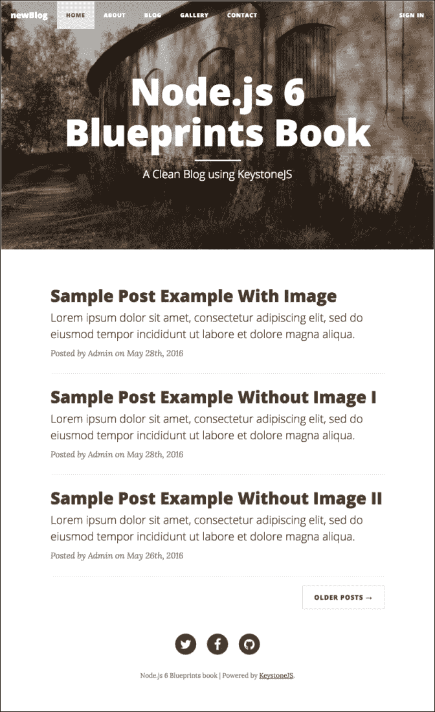

Keystone 博客主题主页

# 安装梯形框架

正如我们在前面几章中所做的，我们将使用官方的 Keystone.js yeoman 生成器。

### 类型

您可以在此链接找到更多关于 KeystoneJS 的信息:[http://keystonejs.com/](http://keystonejs.com/)。

让我们安装发电机。打开您的终端/外壳并键入以下命令:

```js
npm install keystone -g

```

# 创建支架应用

现在是时候创建一个新文件夹并开始开发我们的博客应用了:

1.  创建一个名为章节 08 的文件夹。
2.  Open your terminal/shell at the chapter-08 folder and type the following command:

    ```js
    yo keystone

    ```

    在这个命令之后，keystone.js 会触发一系列关于应用基本配置的问题；您必须回答这些问题，如下图所示:

    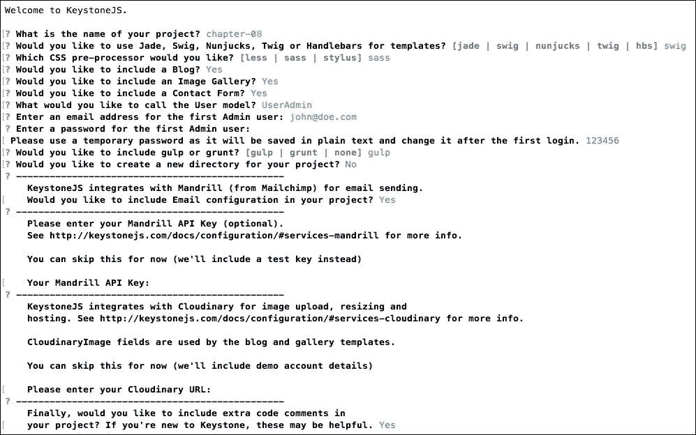

    Keystone 生成器提示问题

3.  所有生成器任务结束后，我们可以在终端窗口看到以下输出:

    ```js
    Your KeystoneJS project is ready to go!
     For help getting started, visit http://keystonejs.com/guide
     We've included a test Mandrill API Key, which will simulate
            email 
    sending but not actually send emails. Please replace
            it with your own 
    when you are ready.
     We've included a demo Cloudinary Account, which is reset daily. 
     Please configure your own account or use the Local Image field
            instead 
    before sending your site live.
     To start your new website, run "npm start".

    ```

请注意，在启动应用之前，我们需要纠正两个小错误。在写的时候，发电机有这个故障；然而，当这本书发行时，这个问题应该已经解决了。如果没有，以下是解决此问题的方法。

## 修复 lint 错误和管理对象名称

1.  在根项目文件夹中打开 gulpfile.js，删除关于 lint 的行任务:

    ```js
          watch:lint

    ```

2.  修复管理员用户名，打开根文件夹中的 Keystone.js 文件，替换如下代码:

    ```js
          keystone.set('nav', { 
            posts: ['posts', 'post-categories'], 
            galleries: 'galleries', 
            enquiries: 'enquiries', 
            userAdmins: 'user-admins' 
          }); 

    ```

仅此而已，我们已经有了自己的博客。让我们检查结果。

# 运行 Keystone 博客

1.  打开终端/外壳，输入以下命令:

    ```js
    gulp 

    ```

2.  Go to http://localhost:3000/; you should see the following result:

    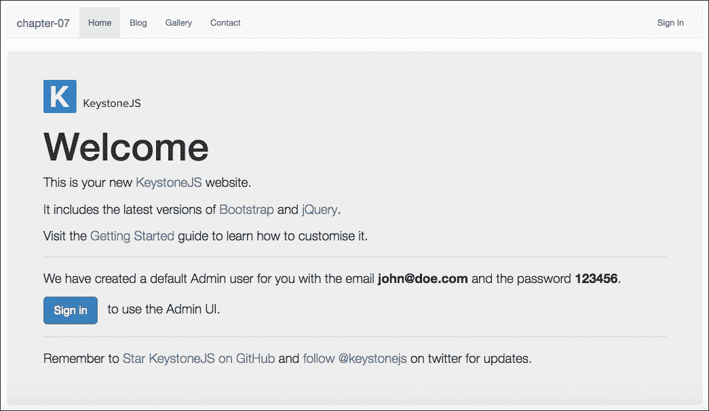

    Keystone 主屏幕

    如前所述，界面非常简单。它可以查看生成器生成的默认信息，包括关于用户和密码的信息。

3.  Click on the **Sign in** link in the top-right corner and fill in the login form with the user and password from the previous screenshot. The result will be the control panel, as shown in the following figure:

    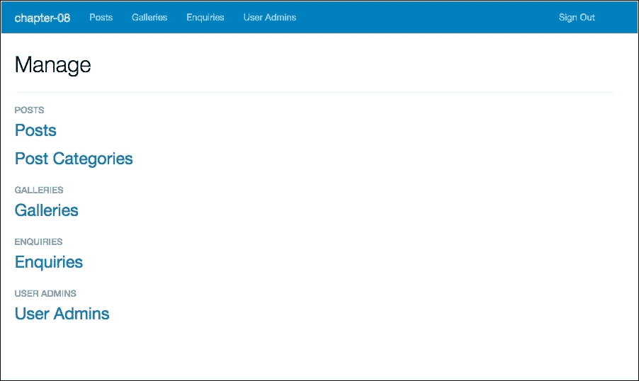

    梯形控制面板

每个链接都有一个为博客插入数据的表单，但此时不用担心这个；在本章的后面，我们将看到如何使用管理面板。

正如我们在前面的图片中看到的，布局非常简单。然而，这个框架的亮点不是它的视觉外观，而是它的核心引擎构建健壮应用的能力。

### 类型

你可以在官方网站上阅读更多关于 Keystone 的信息，网址为:[http://keystonejs.com/](http://keystonejs.com/)。

# 梯形发动机的解剖

在我们直接进入代码之前，我们将了解 Keystone 的目录结构是如何工作的。

启动应用后，我们将得到以下结果:

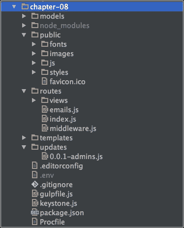

梯形目录结构

以下是每个目录/文件夹的构成描述:

<colgroup><col> <col> <col></colgroup> 
| **文件夹名称** | **文件夹路径** | **描述** |
| 模型 | /型号/ | 应用数据库模型。 |
| 公众 | /public/ | 图像、JavaScript、样式表和字体。 |
| 路线 | /路线//路线/风景 | 查看控制器(在 Restful API 上，我们可以使用一个名为 API 的文件夹)。 |
| 模板 | /templates//模板/电子邮件//模板/布局//templates/mixins//模板/视图 | 应用视图模板。 |
| 更新 | /更新/ | 迁移脚本和数据库填充。 |

此外，根文件夹中有以下文件:

*   。编辑器配置:设置编辑器的缩进
*   。环境:设置云云凭据
*   。gitignore:忽略 Git 源代码管理的文件
*   应用任务
*   引导应用
*   项目配置和 NPM 模块
*   程序文件:**英雄库**部署的配置

在接下来的几行中，我们将深入了解每个部分的表现。

### 类型

Routes 文件夹中有一些我们现在不会解释的文件，但是不用担心；我们将在下一个主题中看到这些文件。

# 更改默认引导主题

我们将展示两种方法来定制我们的博客:一种是表面的，只改变样式表，另一种是更深层的，改变页面的所有标记。

对于样式表的改变，我们使用的是[http://bootswatch.com/](http://bootswatch.com/)免费引导主题。

bootstrap 框架在这方面非常灵活；我们将使用一个名为超级英雄的主题。

1.  前往[http://bootswatch.com/superhero/_variables.scss](http://bootswatch.com/superhero/_variables.scss)网址。
2.  复制页面内容。
3.  在 public/style/boos trap/bootstrap 内部，创建一个名为 _ theme _ variables.scss 的新文件，并粘贴从 bootstrap 页面复制的代码。
4.  Open public/styles/bootstrap/_bootstrap.scss and replace the following  lines:

    ```js
          // Core variables and mixins 
          @import "bootstrap/_theme_variables"; 
          @import "bootstrap/mixins";

    ```

    现在我们将重复*步骤 1* 和*步骤 2* ，但是现在使用不同的网址。

5.  前往[http://bootswatch.com/superhero/_bootswatch.scss](http://bootswatch.com/superhero/_bootswatch.scss)网址。
6.  复制页面内容。
7.  在:public/style/bootstrap 中创建一个名为 _ bootstrap . SCS 的文件，并粘贴内容。
8.  打开 public/style/bootstrap/_ bootstrap . SCS，替换下面高亮显示的行:

    ```js
          // Bootswatch overhide classes
          @import "bootswatch";

    ```

9.  完成了。现在我们有一个不同于 keystone.js 采用的标准布局，让我们看看结果。打开你的终端/外壳，输入以下命令:

    ```js
     gulp 

    ```

10.  Go to URL: http://localhost:3000/, and you should see the following result:

    

    Keystone 主屏幕

有了这个小小的改变，我们已经可以看到取得的成果。然而，这是一个非常肤浅的定制，因为我们不改变任何 HTML 标记文件。

在前面的图片中，我们可以看到我们只是改变了页面的颜色，因为它保持了标记的完整性，只使用了一个引导主题。

在下一个示例中，我们将看到如何修改应用的整个结构。

# 修改 KeystoneJS 核心模板路径

现在让我们对模板目录做一点重构。

1.  在模板中，创建一个名为 default 的文件夹。
2.  将模板文件夹中的所有文件移动到新的默认文件夹。
3.  Copy all the contents from the default folder and paste them in a new folder called newBlog.

    结果将是下面的截图，但是我们需要更改 keystone.js 文件来配置新文件夹:

    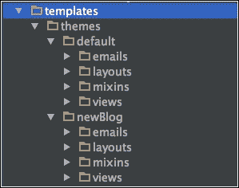

    模板文件夹结构

4.  从根文件夹打开 keystone.js 文件，更新如下行:

    ```js
          'views': 'templates/themes/newBlog/views', 
          'emails': 'templates/themes/newBlog/emails', 

    ```

完成了。我们创建了一个文件夹来存放我们所有的主题。

## 打造自己的主题

现在我们将更改主题标记。这意味着我们将编辑新日志主题中的所有 HTML 文件。我们使用以下来自[https://github . com/black rockDigital/startbootstrap-clean-blog](https://github.com/BlackrockDigital/startbootstrap-clean-blog)的免费模板作为参考和来源。我们的目标是有一个类似于下面截图的布局:

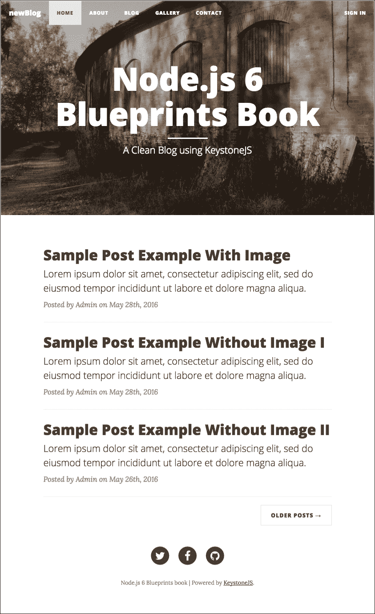

Keystone 主屏幕

1.  打开模板/主题/新日志/布局/默认页面，并在标签中添加以下代码:

    ```js
          {# Custom Fonts #} 
          <link href="http://maxcdn.bootstrapcdn.com/font-awesome/4.1.0
           /css/font-awesome.min.css" rel="stylesheet" type="text/css"> 
          <link href='http://fonts.googleapis.com
           /css?family=Lora:400,700,400italic,700italic'
           rel='stylesheet' type='text/css'> 
          <link href='http://fonts.googleapis.com      
           /css?family=Open+Sans:300italic,400italic,600italic,
           700italic,800italic,400,300,600,700,800' rel='stylesheet'
           type='text/css'> 

    ```

2.  Remove all lines between the {# HEADER #} and {# JAVASCRIPT #} comments.

    ### 类型

    请注意，此操作将删除 default.swig 文件底部的 body 标记和 JavaScript 链接之后的所有内容。

3.  现在将以下代码行放在{# HEADER #}和{# JAVASCRIPT #}注释之间:

    ```js
          <div id="header"> 
          {# Customise your sites navigation by changing the 
           navLinks Array in ./routes/middleware.js 
            ... or completely change this header to suit your design. #} 

          <!-- Navigation --> 
          <nav class="navbar navbar-default navbar-custom
           navbar-fixed-top"> 
            <div class="container-fluid"> 
              <!-- Brand and toggle get grouped for better mobile
               display --> 
              <div class="navbar-header page-scroll"> 
                <button type="button" class="navbar-toggle"
                 data-toggle="collapse" data-target="#bs-example-navbar-
                 collapse-1"> 
                  <span class="sr-only">Toggle navigation</span> 
                  <span class="icon-bar"></span> 
                  <span class="icon-bar"></span> 
                  <span class="icon-bar"></span> 
                </button> 
                <a class="navbar-brand" href="/">newBlog</a> 
              </div> 
              <!-- Collect the nav links, forms, and other content
                for toggling --> 
              <div class="collapse navbar-collapse" id="bs-example
               -navbar-collapse-1"> 
                <ul class="nav navbar-nav navbar-left"> 
                   
                     
                     
                       
                   
                  <li{{ linkClass | safe }}> 
                    <a href="{{ link.href }}">{{ link.label }}</a> 
                  </li> 
                   
                  </ul> 
                    <ul class="nav navbar-nav navbar-right"> 
                       
                         
                          <li><a href="/keystone">Open Keystone</a>
                          </li> 
                         
                          <li><a href="/keystone/signout">Sign Out</a>
                          </li> 
                         
                          <li><a href="/keystone/signin">Sign In</a>
                          </li> 
                         
                    </ul> 
              </div> 
              <!-- /.navbar-collapse --> 
              </div> 
              <!-- /.container --> 
            </nav> 
            <!-- Page Header --> 
            <header class="intro-header"> 
            <div class="container"> 
              <div class="row"> 
                <div class="col-lg-8 col-lg-offset-2 col-md-10 col-
                 md-offset-1"> 
                <div class="site-heading"> 
                  <h1>Node.js 6 Blueprints</h1> 
                  <hr class="small"> 
                  <span class="subheading">A Clean Blog using 
                   KeystoneJS</span> 
                </div> 
              </div> 
            </div> 
          </div> 
          </header> 
          </div> 

          {# BODY #} 
          <div id="body"> 
          {# NOTE: There is no .container wrapping class around body
            blocks to allow more flexibility in design. 
          Remember to include it in your templates when you override
            the intro and content blocks! #} 

          {# The Intro block appears above flash messages (used for
           temporary information display) #} 
           

          {# Flash messages allow you to display once-off status messages
           to users, e.g. form 
          validation errors, success messages, etc. #} 
          {{ FlashMessages.renderMessages(messages) }} 

          {# The content block should contain the body of your templates
           content #} 
           
          </div> 

    ```

4.  打开模板/主题/新日志/视图/博客. swig，用以下代码替换代码:

    ```js
           

           
          <div class="post" data-ks-editable="editable(user, { list:
            'Post', id: post.id })"> 
            <div class="post-preview"> 
               
                 
               
              <a href="/blog/post/{{ post.slug }}"> 
                <h2 class="post-title"> 
                  {{ post.title }} 
                </h2> 
                <h3 class="post-subtitle"> 
                  {{ post.content.brief | safe }} 
                </h3> 
              </a> 
              <p class="post-meta">Posted by <a href="#"> 
                 {{ post.author.name.first }}
                 
              </a>
                 
              on
                {{ post._.publishedDate.format("MMMM Do, YYYY") }} 
                 
                 
              in 
               
              <a href="/blog/{{ cat.key }}">{{ cat.name }}</a> 
                ,
                 
               
               
            </p> 
             
            <a class="read-more" href="/blog/post/{{ post.slug }}">
              Read more...</a> 
             
          </div> 
          <hr> 
          </div> 
           

           
            <div class="container"> 
             
               
                 
               
              <h1>{{ title }}</h1> 
            </div> 
           

           
          <div class="container"> 
            <div class="row"> 
              <div class="col-sm-8 col-md-9"> 
                 
                  <h3 class="text-muted">Invalid Category.</h3> 
                 
                 
                   
                    <h4 class="text-weight-normal">Showing 
                      <strong>{{ data.posts.first }}</strong> 
                      to 
                      <strong>{{ data.posts.last }}</strong> 
                      of 
                      <strong>{{ data.posts.total }}</strong> 
                      posts. 
                    </h4> 
                  
                <h4 class="text-weight-normal">Showing 
                  {{ utils.plural(data.posts.results.length, "*
                   post") }}
                </h4> 
               
              <div class="blog"> 
                 
                  {{ showPost(post) }}
                 
              </div> 
               
              <ul class="pagination"> 
                 
                <li> 
                  <a href="?page={{ data.posts.previous }}"> 
                    <span class="glyphicon glyphicon-chevron-left">
                    </span> 
                  </a> 
                </li> 
                 
                <li class="disabled"> 
                  <a href="?page=1"> 
                    <span class="glyphicon glyphicon-chevron-left">
                    </span> 
                  </a> 
                </li> 
                 
                 
                  <li class="
                    active"> 
                  <a href="?page=
                    {{data.posts.totalPages }}1
                    {{ p }}">{{ p }}
                  </a> 
                  </li> 
                 
                 
                <li> 
                  <a href="?page={{ data.posts.next }}"> 
                    <span class="glyphicon glyphicon-chevron-right">
                    </span> 
                  </a> 
                </li> 
                 
                <li class="disabled"> 
                  <a href="?page={{ data.posts.totalPages }}"> 
                    <span class="glyphicon glyphicon-chevron-right">
                    </span> 
                  </a> 
                </li> 
                 
              </ul> 
               
               
                 
                  <h3 class="text-muted">There are no posts in the
                    category {{ data.category.name }}.
                  </h3> 
                 
                  <h3 class="text-muted">There are no posts yet.</h3> 
                 
               
               
            </div> 
             
              <div class="col-sm-4 col-md-3"> 
                <h2>Categories</h2> 
                  <div class="list-group" style="margin-top: 70px;"> 
                    <a href="/blog" class="
                      active list-group-item">All Categories
                    </a> 
                    
                   <a href="/blog/{{ cat.key }}" class="
                     active list-group-item">{{ cat.name }}
                   </a> 
                    
                  </div> 
              </div> 
             
          </div> 
          </div> 
           

    ```

5.  打开模板/主题/新日志/视图/联系人. swig，用以下代码替换代码:

    ```js
           

           
            <div class="container"> 
              <h1>Contact Us</h1> 
            </div> 
           

           
            <div class="container"> 
              
               <h3>Thanks for getting in touch.</h3> 
             
              <div class="row control-group"> 
                <div class="col-lg-8 col-lg-offset-2 col-md-10 col-md-
                  offset-1"> 
                  <form method="post"> 
                    <input type="hidden" name="action" value="contact"> 
                       
                       
                         
                       
                    <div class="form-group {{ className }} col-xs-12
                      floating-label-form-group controls"> 
                      <label>Name</label> 
                      <input type="text" name="name.full" value="{{
                       formData['name.full'] | default('') }}" class=
                       "form-control" placeholder="Name"> 
                    </div> 
                     
                     
                       
                     
                    <div class="form-group {{ className }} col-xs-12
                      floating-label-form-group controls"> 
                      <label>Email</label> 
                      <input type="email" name="email" value="{{ 
                      formData.email | default('') }}" class=
                      "form-control" placeholder="E-mail"> 
                    </div> 
                      <div class="form-group col-xs-12 floating-label-
                        form-group controls"> 
                        <label>Phone</label> 
                        <input type="text" name="phone" value="{{ 
                          formData.phone | default('') }}" placeholder=
                          "Phone Number (Optional)" class="form-control"> 
                      </div> 
                       
                       
                         
                       
                      <div class="form-group {{ className }} col-xs-12
                       floating-label-form-group controls"> 
                        <span class="title-label text-muted">
                         What are you contacting us about?
                        </span> 
                        <br> 
                        <select name="enquiryType" class="form-control"> 
                          <option value="">(select one)</option> 
                           
                             
                             
                               
                             
                          <option value="{{ type.value }}"{{ selected }}>
                            {{ type.label }}</option> 
                           
                        </select> 
                      </div> 
                       
                       
                         
                       
                      <div class="form-group {{ className }} col-xs-12
                        floating-label-form-group controls"> 
                         <label>Message</label> 
                         <textarea rows="5" class="form-control"
                           placeholder="Message" name="message">
                         </textarea>
                         {{ formData.message }} 
                       </div> 
                       <br> 
                       <div class="row"> 
                         <div class="form-group col-xs-12"> 
                           <button type="submit" class="btn
                             btn-default">Send</button> 
                         </div> 
                       </div> 
                     </form> 
                   </div> 
                 </div> 
               
              </div> 
           

    ```

6.  打开模板/主题/新日志/视图/图库. swig 并用以下代码替换代码:

    ```js
           

           
          <div class="container"> 
            <h1>Gallery</h1> 
          </div> 
           

           
            <div class="container"> 
             
               
                <h2>{{ gallery.name }} 
                 
                  <span class="pull-right text-muted">{{ 
                    gallery._.publishedDate.format("Do MMM YYYY") }}
                  </span> 
             
                </h2> 
                <div class="row"> 
                 
                  <div class="gallery-image"> 
                    
                  </div> 
                  <br> 
                  <hr> 
                    <div class="row"> 
                      <div class='list-group gallery'> 
                       
                      <div class='col-sm-6 col-xs-6 col-md-4 col-lg-4'> 
                        <a class="thumbnail fancybox" rel="ligthbox"
                          href="{{ image.limit(640,480) }}"> 
                         
                        </a> 
                      </div> 
                       
                    </div> 
                  </div> 
                 
                <div class="row"> 
                  <div class='list-group gallery'> 
                     
                    <div class='col-sm-6 col-xs-6 col-md-4 col-lg-4'> 
                      <a class="thumbnail fancybox" rel="ligthbox"
                        href="{{ image.limit(640,480) }}"> 
                       
                      </a> 
                    </div> 
                   
                </div> 
              </div> 
             
          </div> 
           
           
            <h3 class="text-muted">There are no image galleries yet.</h3> 
           
          </div> 
           

    ```

7.  Open templates/themes/newBlog/views/index.swig and replace the code with the following code:

    ```js
           

           
            <div class="container"> 
              <div class="row"> 
                <div class="col-lg-8 col-lg-offset-2 col-md-10 col-md-
                  offset-1"> 
                 
                <div class="post-preview"> 
                  <a href="/blog/post/{{ post.slug }}"> 
                  <h2 class="post-title"> 
                    {{ post.title }} 
                  </h2> 
                  <h3 class="post-subtitle"> 
                    {{ post.content.brief | safe }} 
                  </h3> 
                  </a> 
                  <p class="post-meta">Posted by <span class=
                     "text-primary"> 
                     {{ post.author.name.first }}
                     
                    </span>  
                      on 
                    {{ post._.publishedDate.format("MMMM Do, YYYY") }} 
                    </p> 
                  </div> 
                  <hr> 
                 
                <!-- Pager --> 
                 
                <ul class="pager"> 
                  <li class="next"> 
                    <a href="/blog">Older Posts &rarr;</a> 
                  </li> 
                </ul> 
                 
              </div> 
            </div> 
          </div> 

           

    ```

    请注意，在这里，在 index.swig 中，我们添加了一些代码行来显示索引页面上的帖子列表，因此我们需要更改 index.js 控制器。

8.  打开路线/视图/索引. js，并添加以下代码行:

    ```js
          var keystone = require('keystone'); 

          exports = module.exports = function (req, res) { 

            var view = new keystone.View(req, res); 
            var locals = res.locals; 

              // locals.section is used to set the currently selected 
              // item in the header navigation. 
              locals.section = 'home'; 

              // Add code to show posts on index 
              locals.data = { 
                posts: [] 
              }; 
              view.on('init', function(next) { 
                var q = keystone.list('Post').model.find() 
                .where('state', 'published') 
                .sort('-publishedDate') 
                .populate('author') 
                .limit('4'); 

              q.exec(function(err, results) { 
                locals.data.posts = results; 
                next(err); 
              }); 
            }); 

            // Render the view 
            view.render('index'); 
          };

    ```

9.  Open templates/themes/newBlog/views/post.swig and replace the code with the following code:

    ```js
           

           
          <article> 
            <div class="container"> 
              <a href="/blog">&larr; back to the blog</a> 
              <div class="row"> 
                <div class="col-lg-8 col-lg-offset-2 col-md-10 col-md-
                  offset-1"> 
                   
                    <h2>Invalid Post.</h2> 
                   
                    <h1>{{ data.post.title }}</h1> 
                       
                      on 
                  {{ data.post._.publishedDate.format("MMMM Do, YYYY") }} 
                   
                   
                  in 
                   
                    <a href="/blog/{{ cat.key }}">{{ cat.name }}</a> 
                  ,
                  
                 
               
               
                by {{ data.post.author.name.first }} 
               
              <div class="post"> 
                 
                  <div class="image-wrap"> 
                     
                   </div> 
                  
                 {{ data.post.content.full | raw }} 
                   </div> 
                  
               </div> 
             </div> 
           </div> 
           </article> 
           <hr> 
            

    ```

    有了这段代码，我们就完成了对 HTML 标记的修改。现在我们需要应用新的样式表。

## 更改样式表

因为我们选择了 SASS 来处理 keystone.js 设置中的样式表，所以我们已经拥有了使用 **SASS** 特性的一切。

打开 public/style/site/_ variables . scss 并替换以下代码行的代码:

```js
    // Override Bootstrap variables in this file, e.g.
     $font-size-base: 14px;
    // Theme Variables
    $brand-primary: #0085A1;
    $gray-dark: lighten(black, 25%);
    $gray: lighten(black, 50%);
    $white-faded: fade(white, 80%);
    $gray-light: #eee;

```

请记住，我们使用了 http://black rock digital . github . io/startbootstrap-clean-blog/index . html 作为参考，我们只是挑选了一些代码块。请注意，模板使用 LESS 代替了 **SASS，**但是在这里我们重新编写了所有的代码来适应 SASS 语法。

由于篇幅的原因，我们不把整个样式表放在这个例子中。您可以从 Packt Publishing 网站([www.packtpub.com](http://www.packtpub.com))或直接从 GitHub 上的图书存储库中下载示例代码。

值得注意的是，我们已经为我们的示例博客创建了相同的样式表，但是我们将 **LESS** 语法转换为 **SASS。**

1.  打开 public/style/site/_ layout . SCS 并使用代码。
2.  Create a new file called _mixins.scss inside public/styles/site/ and add the following lines of code:

    ```js
          // Mixins 
          @mixin transition-all() { 
            -webkit-transition: all 0.5s; 
            -moz-transition: all 0.5s; 
            transition: all 0.5s; 
          } 
          @mixin background-cover() { 
            -webkit-background-size: cover; 
            -moz-background-size: cover; 
            background-size: cover; 
            -o-background-size: cover; 
          } 
          @mixin serif() { 
            font-family: 'Lora', 'Times New Roman', serif; 
          } 
          @mixin sans-serif () { 
            font-family: 'Open Sans', 'Helvetica Neue', Helvetica, Arial,
              sans-serif; 
          } 

    ```

    现在我们只需要编辑 public/style/site . scss 来包含新的 mixins 文件。

3.  打开 public/style/site . scss，添加以下代码行:

    ```js
          // Bootstrap 
          // Bootstrap can be removed entirely by deleting this line. 
          @import "bootstrap/bootstrap"; 
          // The easiest way to customise Bootstrap variables while 
          // being able to easily override the source files with new 
          // versions is to override the ones you want in another file. 
          // 
           // You can also add your own custom variables to this file for 
             // use in your site stylesheets. 
          @import "site/variables"; 
          // Add mixins 
          @import "site/mixins"; 
          // Site Styles 
          // =========== 
          // Add your own site style includes here 
          @import "site/layout"; 

    ```

4.  将示例图像文件夹中的图像 header-bg-1290x1140.jpg 添加到公共/图像/文件夹中(您可以从 Packt Publishing 或 GitHub 官方图书页面上下载所有示例文件)。

# 添加图库脚本

我们可以看到，默认的 Keystone.js 主题非常简单，只使用 Bootstrap 框架。现在我们将使用一个名为 Fancybox 的 jQuery 插件在我们的图库中应用一种新的样式。

### 类型

你可以在官网获得更多关于 **Fancybox** 的信息:[http://fancybox.net/](http://fancybox.net/)。

1.  打开模板/主题/新日志/布局/默认. swig，并在标题标签内添加以下突出显示的代码:

    ```js
          {# Customise the stylesheet for your site by editing
           /public/styles/site.sass #} 
          <link href="/styles/site.css" rel="stylesheet"> 
          <!-- fancyBox --> 
          <link rel="stylesheet" href="//cdnjs.cloudflare.com/ajax/libs
     /fancybox/2.1.5/jquery.fancybox.min.css" media="screen"> 
          {# This file provides the default styling for the KeystoneJS 
            Content Editor #} 
           
            <link href="/keystone/styles/content/editor.min.css" 
              rel="stylesheet"> 
          

    ```

2.  Now let's add the following highlighted lines of code to scripts at the bottom of templates/themes/newBlog/layouts/default.swig:

    ```js
          {# Add scripts that are globally required by your site here. #} 
          <script src="//cdnjs.cloudflare.com/ajax/libs/fancybox/2.1.5
            /jquery.fancybox.min.js"></script> 
          <script> 
          $(document).ready(function(){ 
            // Gallery 
          $(".fancybox").fancybox({ 
              openEffect: "elastic", 
              closeEffect: "elastic" 
          }); 
          // Floating label headings for the contact form 
            $("body").on("input propertychange", ".floating-label-
              form-group", function(e) { 
              $(this).toggleClass("floating-label-form-group-with-value",
                !!$(e.target).val()); 
              }).on("focus", ".floating-label-form-group", function() { 
                $(this).addClass("floating-label-form-group-with-focus"); 
                }).on("blur", ".floating-label-form-group", function() { 
                  $(this).removeClass("floating-label-form-group-
                    with-focus"); 
                  }); 
          }); 
          </script> 

          {# Include template-specific javascript files by extending 
            the js block #} 
         

    ```

    因为我们已经在项目中使用了 jQuery，因为 Bootstrap 依赖于它，所以我们不需要再次插入它。

3.  打开你的终端/外壳，输入以下命令:

    ```js
    gulp 

    ```

4.  Go to http://localhost:3000/gallery, and you can see the following result:

    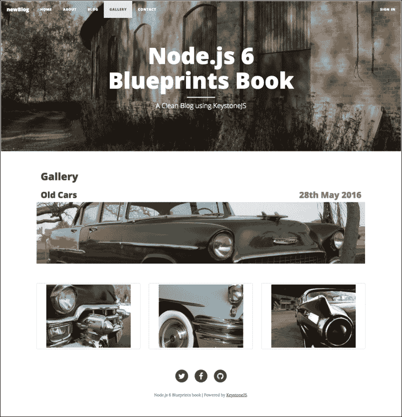

    模板图像库

    请注意，我们已经将示例内容包含到我们的博客中，但不要担心这一点；在本章的后面，我们将看到如何包含内容。

# 扩展 keystone.js 内核

现在我们已经差不多准备好了新的主题。

我们现在将看到如何扩展核心 keystone.js 并在我们的博客上添加另一个页面，正如前面的截图所示，我们有一个 **ABOUT** 菜单项，所以让我们创建它:

1.  在模型/文件夹内创建一个名为 About.js 的新文件，并添加以下代码行:

    ```js
          var keystone = require('keystone'); 
          var Types = keystone.Field.Types; 

          /** 
           * About Model 
           * ========== 
          */ 

          var About = new keystone.List('About', { 
            // Using map to show title instead ObjectID on Admin Interface 
            map: { name: 'title' }, 
            autokey: { path: 'slug', from: 'title', unique: true }, 
          }); 

          About.add({ 
            title: { type: String, initial: true, default: '',
              required: true }, description: { type: Types.Textarea } 
          }); 

          About.register();

    ```

2.  Add the new module to admin navigation, open keystone.js in the root folder, and add the following highlighted lines of code:

    ```js
          // Configure the navigation bar in Keystone's Admin UI
          keystone.set('nav', { 
            posts: ['posts', 'post-categories'], 
            galleries: 'galleries', 
            enquiries: 'enquiries', 
            userAdmins: 'user-admins', 
            abouts: 'abouts' 
          });

    ```

    请注意，左侧的单词将作为“关于”菜单项显示在导航条上，右侧的单词是 about.js 集合。

3.  让我们自定义列显示。在 About.js 文件的 register()函数之前添加以下代码行:

    ```js
     About.defaultColumns = 'title, description|60%'; 

    ```

4.  To add the route to the about page, open routes/index.js and add the following highlighted lines of code:

    ```js
          // Setup Route Bindings 
          exports = module.exports = function (app) { 
             // Views 
             app.get('/', routes.views.index); 
             app.get('/about', routes.views.about); 
             app.get('/blog/:category?', routes.views.blog); 
             app.get('/blog/post/:post', routes.views.post); 
             app.get('/gallery', routes.views.gallery); 
             app.all('/contact', routes.views.contact); 

            // NOTE: To protect a route so that only admins can see it,
            use the requireUser middleware: 
            // app.get('/protected', middleware.requireUser, 
            routes.views.protected); 
          }; 

    ```

    现在让我们为 routes . view . blog 函数创建控制器。

5.  在路由/视图/文件夹内创建一个名为 about.js 的新文件，并添加以下代码:

    ```js
          var keystone = require('keystone'); 
          exports = module.exports = function (req, res) { 
            var view = new keystone.View(req, res); 
            var locals = res.locals; 

             // locals.section is used to set the currently selected 
             // item in the header navigation. 
             locals.section = 'about'; 
             // Add code to show posts on index 
             locals.data = { 
               abouts: [] 
             }; 
             view.on('init', function(next) { 
               var q = keystone.list('About').model.find() 
                   .limit('1'); 
                 q.exec(function(err, results) { 
                   locals.data.abouts = results; 
                     next(err); 
               }); 
             }); 
             // Render the view 
             view.render('about'); 
             };

    ```

6.  在 routes/中间件. js 上添加路由，如下高亮显示的代码:

    ```js
          exports.initLocals = function (req, res, next) { 
            res.locals.navLinks = [ 
              { label: 'Home', key: 'home', href: '/' }, 
              { label: 'About', key: 'about', href: '/about' }, 
              { label: 'Blog', key: 'blog', href: '/blog' }, 
              { label: 'Gallery', key: 'gallery', href: '/gallery' }, 
              { label: 'Contact', key: 'contact', href: '/contact' }, 
            ]; 
            res.locals.user = req.user; 
              next(); 
          }; 

    ```

在这个例子中，我们看到了如何使用内置函数来扩展框架的功能。

### 类型

您可以在此链接阅读更多关于 **Keystone API** 的信息:[https://github.com/keystonejs/keystone/wiki/Keystone-API](https://github.com/keystonejs/keystone/wiki/Keystone-API)。

因此，所有这些步骤的最终结果将如下图所示:

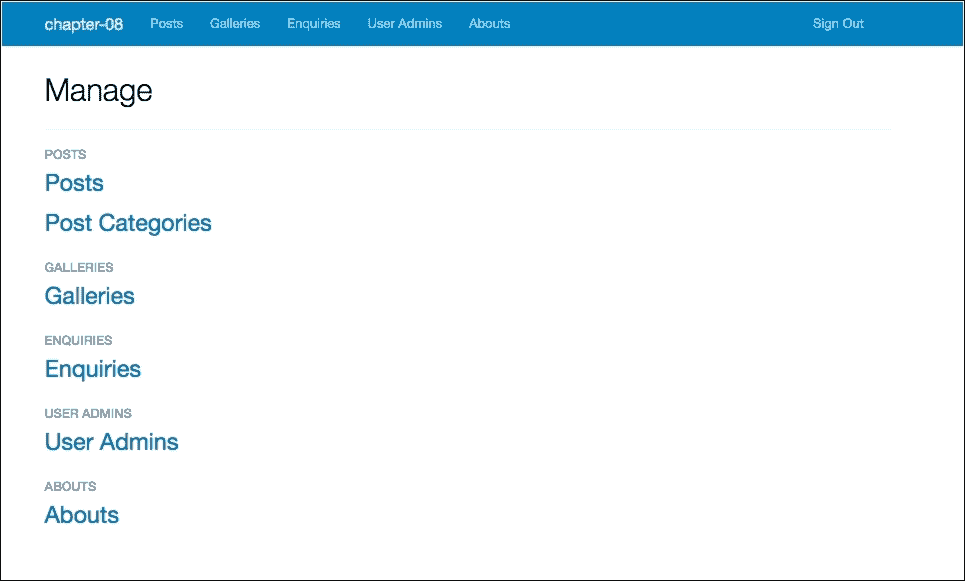

带“关于”菜单项的梯形控制面板

请注意，我们可以在上一个截图中看到**关于**菜单。

# 使用控制面板插入内容

经过所有这些步骤，我们设法为我们的博客创建了一个完全定制的布局；我们现在将使用示例图像文件夹中的可用图像输入内容，您可以在该书的源代码下载中找到这些图像:

1.  转到 http://localhost:3000/keystone，使用用户:john@doe.com 和密码:123456 访问控制面板。
2.  转到 http://localhost:3000/keystone/帖子类别，点击**帖子类别**链接。
3.  点击**创建帖子类别**按钮，将**旧车**标题插入输入栏，点击**创建**按钮。
4.  对于本书的例子，我们将只使用一个类别，但是在实际应用中，您可以创建任意多个类别。
5.  Go to http://localhost:3000/keystone/posts, click on the **Create Post** button and add the content as shown in the following screenshot:

    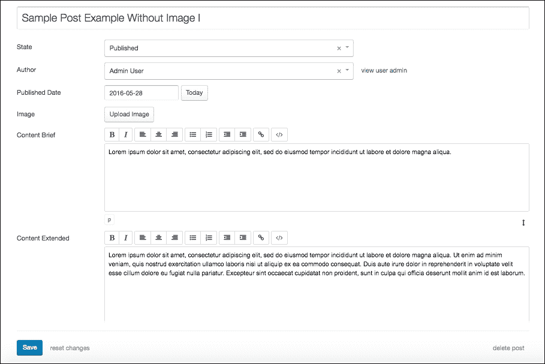

    创建帖子屏幕上的示例内容

6.  对第二个帖子条目重复与*步骤 4* 相同的过程，并将标题更改为**不带图片二的示例帖子示例**。
7.  Repeat the same process as for *step 4* for the third post entry and change the title to **Sample Post Example With Image**, click on the **Upload Image** button, and use the file sample-blog-image.png from the sample-images folder.

    ### 类型

    请注意，您可以随时从 Packt Publishing 网站或直接从 GitHub 图书存储库中下载图书源代码和图像示例。

    在*第 6 步*结束时，我们的控制面板将如下截图所示:

    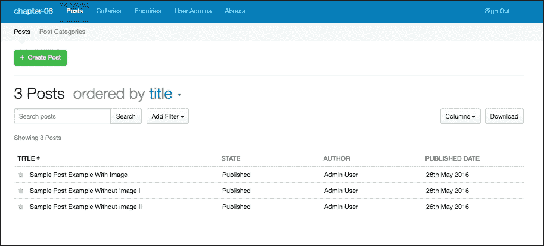

    柱子控制面板

    我们可以看到，Keystone.js 有一个非常简单易用的界面。我们可以扩展框架的所有特性来创造不可思议的东西。

    我们的帖子页面如下:

    

    博客页面截图

# 总结

在这一章中，我们讨论了关于 Keystone 框架的一些非常重要的概念，以创建带有数据库的应用和网站。

我们看到了如何通过使用内部 Keystone API 创建新的模型、视图和模板来扩展框架。

此外，我们展示了仅使用样式表定制内容管理系统的两种不同方法，以及如何完全改变页面结构和如何向图像库中插入新功能，如 **Fancybox** 插件。

在下一章中，我们将看到如何对 JSLint、Concat、Minify 和其他任务使用命令行界面，只使用节点包管理器(NPM)来构建和部署应用。