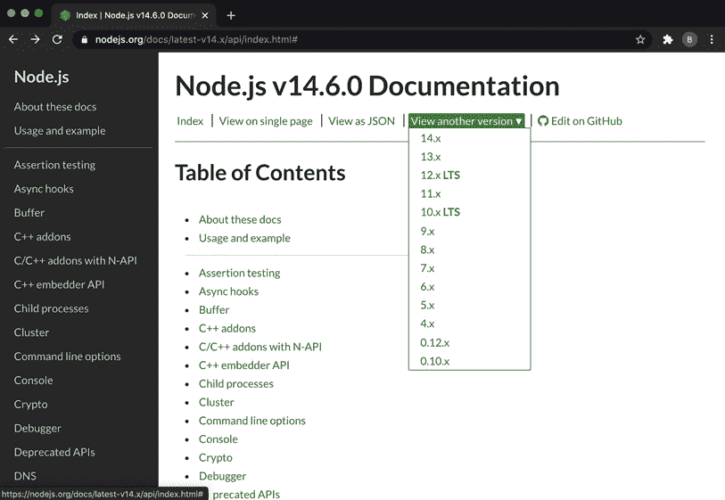
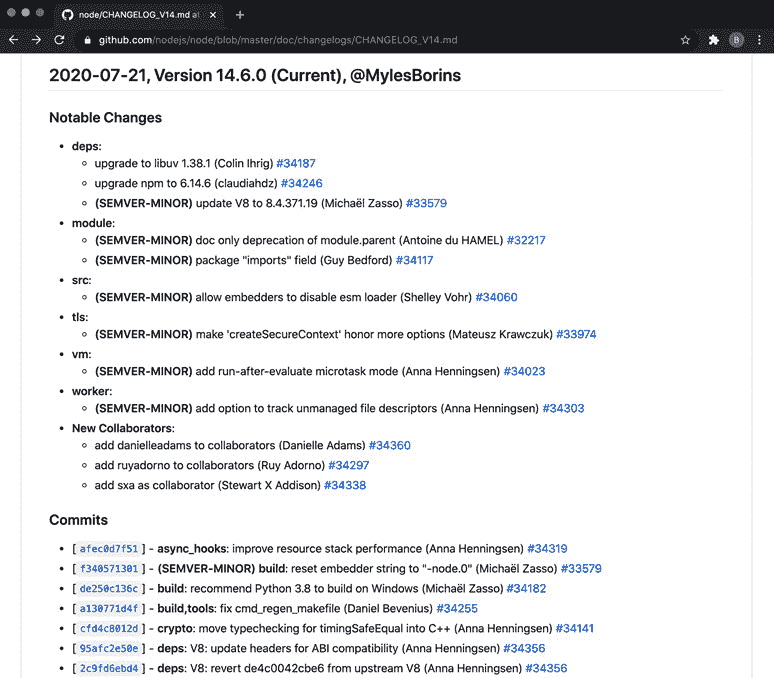
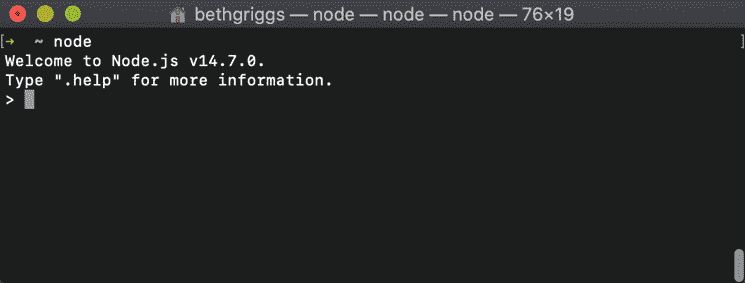

# 一、Node.js 14 简介

Node.js 遵循发布时间表，采用**长期支持**（**LTS**策略。发布计划基于语义版本控制（[https://semver.org/](https://semver.org/) 标准。

Node.js 发布政策规定，Node.js 每年有两个主要版本，一个在四月，一个在十月。主要版本包括中断的或不兼容的 API 更改，尽管 Node.js 项目确实尝试最小化中断更改的数量和影响，以减少对用户的中断。

Node.js 的偶数主要版本在 6 个月后升级为 LTS。偶数版本计划在 4 月份发布，并在 10 月份升级为 LTS。LTS 版本支持 30 个月。建议在生产应用中使用 Node.js 的 LTS 版本。LTS 策略的目的是为最终用户提供稳定性，并提供可预测的发布时间表，以便用户能够适当地管理其升级。Node.js 的所有 LTS 版本都有以元素命名的代码名。Node.js 14 的 LTS 代号为**Fermium**。

奇数的主要版本在 10 月份发布，仅支持 6 个月。奇数版本预计将用于尝试新功能和测试迁移路径，但通常不建议在生产应用中使用。

Node.js 发布工作组拥有 Node.js 发布时间表和流程的权限。Node.js 发布时间表和政策文件可在[找到 https://github.com/nodejs/release](https://github.com/nodejs/release) 。

本章介绍 Node.js–包括有关如何安装运行时和访问 API 文档的说明。

本章将介绍以下配方：

*   使用`nvm`安装 Node.js 14
*   访问 Node.js API 文档
*   在 Node.js 14 中采用新的 JavaScript 语法

# 技术要求

本章要求访问终端、您选择的浏览器和 internet。

# 使用 nvm 安装 Node.js 14

本书将始终使用 Node.js 14，因为它是撰写本文时最新的 LTS 版本。Node.js 14 于 2020 年 4 月发布，于 2020 年 10 月升级为 LTS，并将继续支持到 2023 年 4 月。本食谱将介绍如何使用**节点版本管理器**（**nvm**安装 Node.js 14）。在编写时，AuthT0T 是 OpenJS 基金会的孵化项目，并提供了一种安装和更新 NoDE.JS 版本的简单方法。

## 准备好了吗

您需要在设备上拥有相应的权限才能安装`nvm`。此配方假定您在类 UNIX 平台上。如果您在 Windows 上，它应该在针对 Linux 的**Windows 子系统**（**WSL**下运行。

## 怎么做…

在此配方中，我们将使用`nvm`安装 Node.js 14：

1.  首先，我们需要安装`nvm`。`nvm`提供处理`nvm`下载和安装的脚本。在终端中输入以下命令以执行`nvm`安装脚本：

    ```js
    $ curl -o- https://raw.githubusercontent.com/nvm-sh/nvm/v0.37.0/install.sh | bash
    ```

2.  `nvm`将自动尝试将自身添加到您的路径中。关闭并重新打开终端，以确保已进行更改。然后，输入以下命令列出我们安装的`nvm`版本；这也将确认`nvm`在我们的路径

    ```js
    $ nvm --version
    0.37.0
    ```

    中可用
3.  To install Node.js 14, we use the `$ nvm install` command. We can supply either the specific version we wish to install or the major version number. If we specify just the major version number, `nvm` will install the latest release of that major release line. Enter the following command to install the latest version of Node.js 14:

    ```js
    $ nvm install 14
    Downloading and installing node v14.6.0...
    Local cache found: ${NVM_DIR}/.cache/bin/node-v14.6.0-darwin-x64/node-v14.6.0-darwin-x64.tar.gz
    Checksums match! Using existing downloaded archive ${NVM_DIR}/.cache/bin/node-v14.6.0-darwin-x64/node-v14.6.0-darwin-x64.tar.gz
    Now using node v14.6.0 (npm v6.14.6)
    ```

    请注意，此命令将安装 Node.js 14 的最新版本，因此您的特定版本安装可能与前面输出中显示的版本不同。

4.  现在应该安装最新的 Node.js 14 版本，并在您的路径中提供。您可以通过输入以下命令来确认：

    ```js
    $ node --version
    v14.6.0
    ```

5.  `nvm`还将安装与您安装的 Node.js 版本捆绑的`npm`版本。输入以下内容以确认安装了哪个版本的`npm`：

    ```js
    $ npm --version
    6.14.6
    ```

6.  `nvm`便于安装和在多个 Node.js 版本之间切换。我们可以输入以下内容来安装并切换到最新的 Node.js 12 版本：

    ```js
    $ nvm install 12 
    Downloading and installing node v12.18.3...
    Local cache found: ${NVM_DIR}/.cache/bin/node-v12.18.3-darwin-x64/node-v12.18.3-darwin-x64.tar.gz
    Checksums match! Using existing downloaded archive ${NVM_DIR}/.cache/bin/node-v12.18.3-darwin-x64/node-v12.18.3-darwin-x64.tar.gz
    Now using node v12.18.3 (npm v6.14.6)
    ```

7.  一旦安装了版本，我们就可以使用`$ nvm use`命令在它们之间切换：

    ```js
    $ nvm use 14
    Now using node v14.6.0 (npm v6.14.6)
    ```

我们已经使用`nvm`安装了 Node.js 14 的最新版本。

## 它是如何工作的…

`nvm`是类 UNIX 平台上 Node.js 的版本管理器，支持兼容 POSIX 的 shell。POSIX 是一套操作系统兼容性标准，由 IEEE 计算机协会定义。

在配方的第一步，我们下载并执行了`nvm`安装脚本。在封面下，`nvm`安装脚本执行以下操作：

1.  它克隆了`nvm`GitHub 存储库（[https://github.com/nvm-sh/nvm](https://github.com/nvm-sh/nvm) 至`~/.nvm/`。
2.  它尝试添加以下源行以导入并加载`nvm`到相应的概要文件中，其中概要文件为`~/.bash_profile`、`~/.bashrc`、`~/.profile`或`~/.zshrc`。

如果您使用的配置文件不是先前指定的配置文件，您可能需要手动将以下行添加到您的配置文件中以加载`nvm`。以下线路在`nvm`安装文件（[中规定 https://github.com/nvm-sh/nvm#install--更新脚本](https://github.com/nvm-sh/nvm#install--update-script)：

```js
export NVM_DIR="$([ -z "${XDG_CONFIG_HOME-}" ] && printf %s "${HOME}/.nvm" || printf %s "${XDG_CONFIG_HOME}/nvm")"
[ -s "$NVM_DIR/nvm.sh" ] && \. "$NVM_DIR/nvm.sh" # This loads nvm
```

每次使用`$ nvm install`安装 Node.js 版本时，`nvm`都会从正式的 Node.js 下载服务器下载适合您平台的二进制文件。官网 Node.js 下载服务器可直接访问[https://nodejs.org/dist/](https://nodejs.org/dist/) 。`nvm`会将其安装的所有 Node.js 版本存储在`~/.nvm/versions/node/`目录中。

`nvm`支持别名，可用于安装 Node.js 的 LTS 版本。例如，您可以使用`$ nvm install --lts`命令安装最新的 LTS 版本。

要卸载 Node.js 版本，可以使用`$ nvm uninstall`命令。要更改默认 Node.js 版本，请使用`$ nvm alias default <version>`命令。默认版本是打开终端时默认可用的版本。

## 还有更多…

如果您不希望或无法使用`nvm`，可以手动安装 Node.js。访问 Node.js 下载页面[https://nodejs.org/en/download/](https://nodejs.org/en/download/) 下载适合您平台的二进制文件。

js 项目提供了 TAR 文件，可在许多平台上安装。要通过 TAR 文件安装，需要下载并解压缩 TAR 文件，然后将二进制位置添加到路径中。

除了 TAR 文件之外，Node.js 项目还为 macOS（`.pkg`）和 Windows（`.msi`）提供了一个安装程序。手动安装 Node.js 后，需要时需要手动安装 Node.js 的更新版本。

## 另见

*   *访问本章 Node.js API 文档*配方

# 访问 Node.js API 文档

js 项目提供了全面的 API 参考文档。Node.js API 文档是了解您正在使用的 Node.js 版本中哪些 API 可用的关键资源。js 文档还描述了如何与 API 交互，包括方法接受的参数和方法的返回值。

此配方将显示如何访问和浏览 Node.js API 文档。

## 准备好了吗

您需要访问自己选择的浏览器和 internet 连接才能访问 Node.js API 文档。

## 怎么做…

此配方将演示如何浏览 Node.js API 文档：

1.  First, navigate to [https://nodejs.org/api/](https://nodejs.org/api/) in your browser.

    希望查看 Node.js 最新版本的 Node.js API 文档：

    

    图 1.1–Node.js API 文档主页

2.  Hover over the **View another version** link and expect to see the other release lines of Node.js listed. This is how you can change which version of Node.js you're viewing the documentation for:

    

    图 1.2–显示版本下拉列表的 Node.js API 文档

3.  Now, let's suppose we want to find the documentation for the `fs.readFile()` method. The `fs.readFile()` method is exposed via the **File system** core module. We first need to locate and click on **File system** in the left-hand navigation pane. Clicking **File system** will take us to the table of contents for the **File system** core module API documentation:

    

    图 1.3–文件系统子系统的 Node.js API 文档

4.  Scroll down until you find the `fs.readFile()` method listed in the table of contents. When looking for a specific API, it may be worthwhile using your browser's search facility to locate the API definition. Click the **fs.readFile()** link in the table of contents. This will open the API definition:

    

    图 1.4–显示 fs.readFile（）API 定义的 Node.js API 文档

5.  Click **<Buffer>** to access the **Buffer** class documentation. This will detail the methods available on the **Buffer** type:

    

    图 1.5–显示缓冲区类定义的 Node.js API 文档

6.  现在，单击左侧-导航窗格中的**命令行选项**。此页面详细介绍了可传递到 Node.js 进程的所有可用命令行选项：


图 1.6–显示可用命令行选项的 Node.js API 文档

我们已经学习了如何访问和浏览 Node.js API 文档。

## 它是如何工作的…

本 Node.js API 文档是构建 Node.js 应用时的重要参考资源。该文档特定于 Node.js 的每个版本。在配方中，我们访问了 Node.js 的最新版本的文档，这是在[中呈现的文档的默认版本 https://nodejs.org/api/](https://nodejs.org/api/) 。以下 URL 可用于访问 Node.js 特定版本的文档：[https://nodejs.org/docs/v14.0.0/api/index.html](https://nodejs.org/docs/v14.0.0/api/index.html) （将`v14.0.0`替换为您希望查看文档的特定版本）。

API 文档详细介绍了 Node.js API 的使用，包括以下内容：

*   接受的参数及其类型
*   如果适用，API 返回的值和类型

在某些情况下，文档将提供进一步的信息，包括使用示例或示例代码来演示 API 的使用。

请注意，存在一些未记录的 API。有些 Node.js API 故意未记录。一些未记录的 API 仅被视为内部 API，不打算在 Node.js 核心运行时之外使用。

API 文档还详细说明了 API 的稳定性。Node.js 项目定义并使用以下三个稳定性指标：

*   **0–不推荐使用**：不鼓励使用这些 API。使用这些 API 时可能会发出警告。不推荐使用的 API 也将在[中列出 https://nodejs.org/dist/latest-v14.x/docs/api/deprecations.html](https://nodejs.org/dist/latest-v14.x/docs/api/deprecations.html) 。
*   **1–实验性**：这些 API 不稳定，可能会发生一些不向后兼容的变化。实验性 API 不受语义版本控制规则的约束。应谨慎使用这些 API，尤其是在生产环境中。
*   **2–稳定**：通过稳定的 API，Node.js 项目将努力确保兼容性。

Node.js 文档由 Node.js 核心存储库中的 Node.js 项目维护。任何错误或建议的改进都可以在[作为问题提出 https://github.com/nodejs/node](https://github.com/nodejs/node) 。

## 还有更多…

Node.js 项目为 Node.js 的每个发布行维护一个`CHANGELOG.md`文件，详细说明每个发布中的个人提交。Node.js 14 的`CHANGELOG.md`文件位于[https://github.com/nodejs/node/blob/master/doc/changelogs/CHANGELOG_V14.md](https://github.com/nodejs/node/blob/master/doc/changelogs/CHANGELOG_V14.md) 。

以下是 Node.js 14`CHANGELOG.md`文件中的一个片段：



图 1.7–Node.js 14 CHANGELOG.md 文件

js 项目努力突出每个版本中的显著变化。`CHANGELOG.md`文件表示根据语义版本标准（[确定哪些提交为`SEMVER-MINOR`https://semver.org/](https://semver.org/) ）。标记为`SEMVER-MINOR`的条目通常表示功能添加。`CHANGELOG.md`文件还将指示何时发布被视为安全发布（修复安全问题）。在安全释放的情况下，**显著变化**部分将以句子**开头，这是安全释放。**

对于主要版本，Node.js 项目将在 Node.js 介质帐户上发布发布发布公告，详细说明新功能和更改。Node.js 14 发布公告可在[获取 https://medium.com/@nodejs/node-js-version-14-available-now-8170d384567e](https://medium.com/@nodejs/node-js-version-14-available-now-8170d384567e)。

Node.js`CHANGELOG.md`文件可作为升级 Node.js 时的参考，帮助了解新版本中包含哪些更新和更改。

# 在 Node.js 14 中采用新的 JavaScript 语法

JavaScript 语言的正式规范是 ECMAScript。新的 JavaScript 功能通过更新 Node.js 运行时构建的基础 V8 JavaScript 引擎进入 Node.js。ECMAScript 每年都有更新，包括新的 JavaScript 语言特性和语法。

Node.js 的新主要版本倾向于对 V8 引擎进行重大升级。Node.js 版本 14.0.0 与 V8 版本 8.1 一起发布。已在编写时将 js.4 的版本更新为 include。

V8 的更新版本为 Node.js 运行时带来了基础性能改进和新的 JavaScript 语言功能和语法。这个方法将展示 Node.js14 中引入的几个较新的 JavaScript 语言特性。

## 准备好了吗

您需要安装 Node.js 14。您还需要访问终端。

## 怎么做…

在此配方中，我们将使用 Node.js**Read Eval Print Loop**（**REPL**）测试 Node.js 14 中提供的较新 JavaScript 功能：

1.  首先，让我们打开 Node.js REPL。在您的终端中输入以下命令：

    ```js
    $ node
    ```

2.  This should open the REPL, which is an interface that we can use to execute code. Expect to see the following output:

    

    图 1.8–Node.js REPL

3.  首先输入以下命令。此命令将返回您正在使用的 Node.js 版本中嵌入的 V8 版本：

    ```js
    > process.versions.v8
    '8.4.371.19-node.12'
    ```

4.  可选链接是 Node.js 14 提供的新 JavaScript 语言功能之一。可选链接允许您读取嵌套属性的值，而无需检查前面的每个引用是否有效。我们可以在 REPL 中演示这种语法。首先，我们将定义一个具有嵌套属性的 JSON 对象。将以下内容复制粘贴到 REPL 中：

    ```js
    const person = {
        name : 'Beth',
        dog : { name : 'Laddie' }
    };
    ```

5.  Now, we can demonstrate the optional chaining operator. The optional chaining operator is denoted by the `?.` syntax. The optional chaining operator allows you to read the value of a nested property without having to check whether each preceding reference is valid. We can use the sample object to demonstrate this. First, enter the following, not using the optional chaining operator:

    ```js
    > person.cat.name
    Uncaught TypeError: Cannot read property 'name' of undefined
    ```

    正如预期的那样，这会失败，因为我们创建的对象没有属性`cat`。

6.  Now, let's use the optional chaining operator:

    ```js
    > person.cat?.name
    undefined
    ```

    观察我们不再经历`TypeError`。如果希望检查嵌套属性的值，但不希望在未定义前一个属性时引发错误，则应使用可选的链接运算符。

7.  Node.js 14 中提供的另一个新 JavaScript 功能是空合并操作符，它由`??`表示。空合并运算符是一种逻辑运算符，当左操作数为`null`或`undefined`时，它返回右操作数。这与逻辑`OR`运算符（`||`不同。当左操作数为任何 falsy 值时，逻辑`OR`运算符返回右操作数。falsy 值是在布尔上下文中遇到的假值。JavaScript 中的错误值包括`false`、`0`、`-0`、`0n`（`BigInt`）、`""`（空字符串）、`null`、`undefined`和`NaN`。在的回复中输入以下命令，以演示逻辑`OR`运算符和空合并运算符之间的差异：

    ```js
    > 0 || "Hello World!"
    'Hello World!'
    > 0 ?? "Hello World!"
    0
    > null || "Hello World!"
    'Hello World!'
    > null ?? "Hello World!"
    'Hello World!' 
    ```

通过使用 REPL，我们探索了 Node.js14 中提供的两种新 JavaScript 语法。

## 它是如何工作的…

通过对底层 Google Chrome V8 JavaScript 引擎的更新，Node.js 中引入了新的 JavaScript 语言功能。JavaScript 引擎解析并执行 JavaScript 代码。在 Node.js 中嵌入 Google Chrome V8 引擎是在浏览器之外执行 JavaScript 的关键。Chrome 的 V8 JavaScript 是许多可用的 JavaScript 引擎之一，Mozilla 的 SpiderMonkey（用于 Mozilla Firefox 浏览器）是另一个领先的 JavaScript 引擎。

每隔 6 周，谷歌 Chrome 的 V8 引擎就会发布一个新版本。Node.js 14 将继续将更新合并到 V8 中，前提是它们与**应用二进制接口**（**ABI**）兼容。ABI 描述了程序如何通过编译程序与函数和数据结构交互。可以认为它类似于**应用编程接口**（**API**的编译版本。

一旦有一个版本的 V8 不再与 ABI 兼容，Node.js 的特定发行行将固定在其当前版本的 V8 上。但是，特定的 V8 补丁和补丁 m 可能会继续直接应用到 Node.js 发布行。Node.js 12 现在固定在 V8 版本 7.8 上，而编写本文时 Node.js 14 是 V8 版本 8.4。

V8 JavaScript 引擎内部使用**即时**（**JIT**编译）编译 JavaScript。JIT 编译加快了 JavaScript 的执行速度。当 V8 执行 JavaScript 时，它获取有关正在执行的代码的数据。根据这些数据，V8 发动机可以进行推测性优化。推测性优化根据最近执行的代码预测即将出现的代码。这允许 V8 发动机针对即将出现的代码进行优化。

V8 博客提供了新 V8 版本的公告，并详细介绍了 V8 的新功能和更新。V8 博客可在以下网址访问：https://v8.dev/blog.