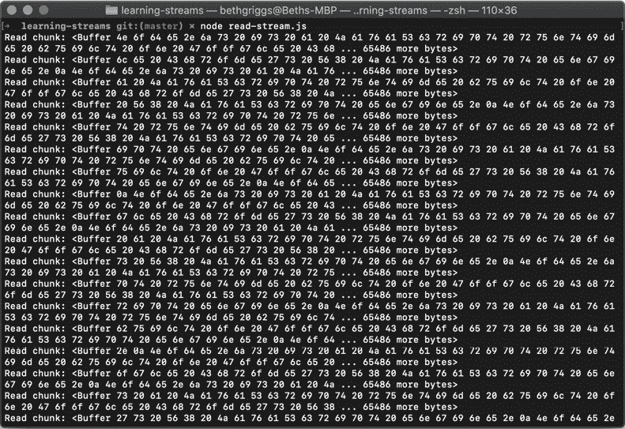
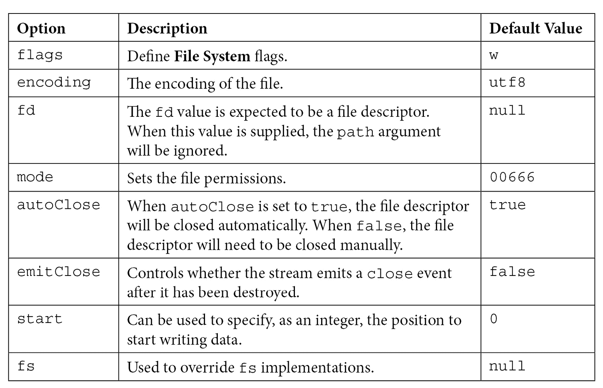
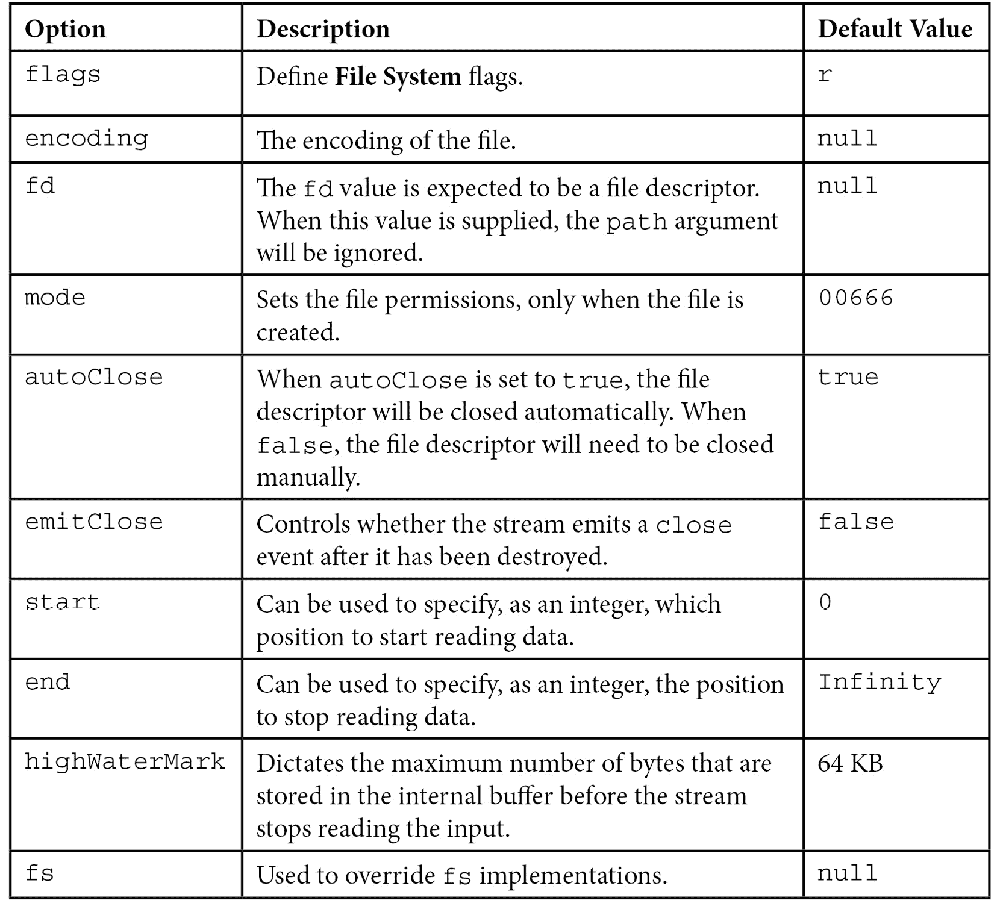
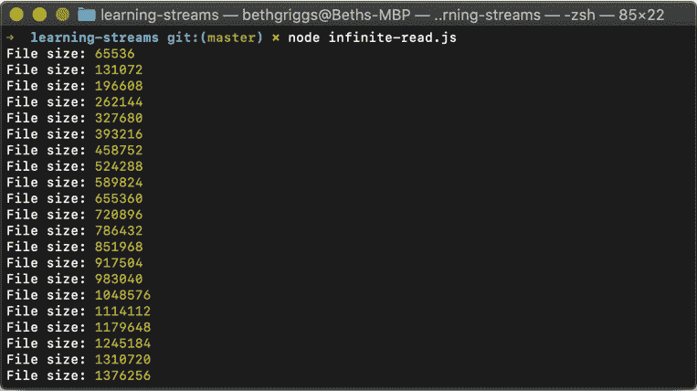

# 三、流、流、流

流是 Node.js 的关键功能之一。大多数 Node.js 应用依赖于底层 Node.js streams 实现，无论是用于读取/写入文件、处理 HTTP 请求还是其他网络通信。流提供了一种按顺序读取输入和写入输出的机制。

通过按顺序读取数据块，我们可以处理非常大的文件（或其他数据输入），这些文件通常太大，无法读入内存并作为一个整体进行处理。流是大数据应用或媒体流服务的基础，在这些应用或服务中，数据太大，无法一次性使用。

Node.js 中有四种主要类型的流：

*   **可读流**：用于读取数据
*   **可写流**：用于写入数据
*   **双工流**：用于读写数据
*   **转换流**：一种双工流，对输入的数据进行转换，然后输出转换后的数据

本章将演示如何创建这些不同类型的流，以及如何将这些类型的流链接在一起以形成流管道。

本章将介绍以下配方：

*   在 Node.js 中创建流
*   与暂停的流交互
*   管道流
*   使用转换流转换数据
*   Building stream pipelines

    重要提示

    本章中的配方将重点介绍 Node.js 14 中 Node.js 核心`stream`模块提供的流实现。因此，我们将不使用`readable-stream`模块（[https://github.com/nodejs/readable-stream](https://github.com/nodejs/readable-stream) ）。`readable-stream`模块旨在通过将流实现的外部镜像作为一个独立安装的模块提供，来缓解 Node.js 版本之间流实现的任何不一致。在撰写本文时，`readable-stream`的最新主要版本是版本 3，它是 Node.js 10 的流实现的镜像。

# 技术要求

您应该安装 Node.js 14，最好是最新版本的 Node.js 14。您还需要访问终端、编辑器和 internet。

# 在 Node.js 中创建流

Node.js流 API 由 Node.js`stream`核心模块提供。此配方将介绍如何在 Node.js 中使用流。它将介绍如何使用 Node.js core`fs`模块创建可读流和可写流，以与文件交互。

本章的代码示例可在 Packt GitHub 存储库（[中找到 https://github.com/PacktPublishing/Node.js-14-Cookbook `Chapter03`目录中的](https://github.com/PacktPublishing/Node.js-14-Cookbook)。

## 准备好了吗

1.  首先，我们创建一个工作目录：

    ```js
    $ mkdir learning-streams
    $ cd learning-streams
    ```

2.  创建以下两个文件：

    ```js
    $ touch write-stream.js
    $ touch read-stream.js
    ```

现在，我们准备好继续讨论配方。

## 怎么做…

在这个配方中，我们将学习如何创建可读流和可写流。我们将首先创建一个可写流来写一个大文件。然后，我们将使用可读流读取该大文件：

1.  首先导入`write-stream.js`：

    ```js
    const fs = require("fs");
    ```

    中的 Node.js core**文件系统**模块
2.  接下来，我们将使用`fs`模块

    ```js
    const file = fs.createWriteStream("./file.txt");
    ```

    上可用的`createWriteStream()`方法创建可写流
3.  现在，我们将开始将内容写入我们的文件。让我们在文件中多次写入一个随机字符串：

    ```js
    for (let i = 0; i <= 1000000; i++) {
      file.write(
        "Node.js is a JavaScript runtime built on Google Chrome's V8 JavaScript engine.\n"
      );
    }
    ```

4.  现在，我们可以使用以下命令运行脚本：

    ```js
    $ node write-stream.js
    ```

5.  这将在当前目录中创建一个名为`file.txt`的文件。文件大小约为 75 米。要检查文件是否存在，请在终端中输入以下命令：

    ```js
    $ ls -lh file.txt
    -rw-r--r--  1 bethgriggs  staff    75M 23 Sep 21:33 file.txt
    ```

6.  现在，让我们创建一个脚本，它将创建一个可读的流来读取文件的内容。导入`fs`核心模块

    ```js
    const fs = require("fs");
    ```

    启动`read-stream.js`文件
7.  现在，我们可以使用`createReadStream()`方法创建可读流：

    ```js
    const rs = fs.createReadStream("./file.txt");
    ```

8.  接下来，我们可以注册一个`data`事件处理程序，它将在每次读取数据块时执行：

    ```js
    rs.on("data", (data) => {
      console.log("Read chunk:", data);
    });
    ```

9.  我们还将添加一个`end`事件处理程序，当流

    ```js
    rs.on("end", () => {
      console.log("No more data.");
    });
    ```

    中没有更多数据可供使用时，将触发该事件处理程序
10.  使用以下命令运行程序：

    ```js
    $ node read-stream.js
    ```

11.  Expect to see the data chunks being logged as they're read:

    

    图 3.1–数据块读取时的可读流输出

12.  如果调用中`data`事件处理函数中的单个数据块`toString()`，我们将在处理时看到`String`内容输出。将`data`事件处理程序函数更改为以下内容：

    ```js
     rs.on("data", (data) => {
      console.log("Read chunk:", data.toString());
    });
    ```

13.  使用以下命令重新运行脚本：

    ```js
    $ node read-stream.js
    ```

14.  希望看到以下输出：


图 3.2–数据块的可读流输出，字符串形式

我们使用`createWriteStream()`创建了一个文件，然后使用`createReadStream()`读取该文件。

## 它是如何工作的…

在配方中，我们使用的`createReadStream()`和`createWriteStream()``fs`方法顺序写入和读取文件。Node.js 核心`fs`模块依赖于底层 Node.js`stream`核心模块。一般情况下，Node.js`stream`核心模块不直接交互。您通常只通过更高级别的 API（如`fs`模块公开的 API）与 Node.js`stream`实现交互。

重要提示

有关底层 Node.js 流实现和 API 的更多信息，请参阅[中的 Node.js`stream`模块文档 https://nodejs.org/docs/latest-v14.x/api/stream.html](https://nodejs.org/docs/latest-v14.x/api/stream.html) 。

我们通过`createWriteStream()`方法创建了一个可写流，以便按顺序写入文件内容。`createWriteStream()`方法接受两个参数。第一个是要写入的文件的路径，第二个是可用于向流提供配置的`options`对象。

下表详细说明了我们可以通过`options`对象向方法提供的配置：



图 3.3–描述可传递给 createWriteStream（）方法的配置的表

重要提示

有关**文件系统**标志的更多信息，请参阅[https://nodejs.org/api/fs.html#fs_file_system_flags](https://nodejs.org/api/fs.html#fs_file_system_flags) 。

然后，我们创建了一个可读流来顺序读取文件的内容。`createReadStream()`方法是可读流的抽象。同样，此方法需要两个参数——第一个是要读取内容的路径，第二个是`options`对象。下表详细说明了我们可以通过`options`对象传递给`createReadStream()`方法的选项：



图 3.4–描述可传递给 createReadStream（）方法的配置的表

在`read-stream.js`中，我们注册了一个`data`事件处理程序，它在我们的可读流每次读取一块数据时执行。我们可以在屏幕上看到读到的各个块的输出：

```js
Read chunk: <Buffer 20 62 75 69 6c 74 20 6f 6e 20 47 6f 6f 67 6c 65 20 43 68 72 6f 6d 65 27 73 20 56 38 20 4a 61 76 61 53 63 72 69 70 74 20 65 6e 67 69 6e 65 2e 0a 4e 6f ... 29149 more bytes>
```

一旦读取了所有的文件数据，我们的`end`事件处理程序就会被触发——导致**不再有数据**消息。

所有 Node.js 流都是`EventEmitter`类（[类）的实例 https://nodejs.org/api/events.html#events_class_eventemitter](https://nodejs.org/api/events.html#events_class_eventemitter) 。流发出一系列不同的事件。

以下事件在可读流上发出：

*   `close`：流和流的任何资源关闭时发出。不会发出进一步的事件
*   `data`：从流中读取新数据时发出
*   `end`：读取所有可用数据时发出
*   `error`：可读流出错时发出
*   `pause`：可读流暂停时发出
*   `readable`：有数据可读取时发出
*   `resume`：当可读流处于暂停状态后恢复时发出

以下是在可写流上发出的事件：

*   `close`：流和流的任何资源关闭时发出。不会发出进一步的事件
*   `drain`：当可写流可以恢复写入数据时发出
*   `error`：可写流发生错误时发出
*   `finish`：可写流结束且所有写操作完成时发出
*   `pipe`：在可读流上调用`stream.pipe()`方法时发出
*   `unpipe`：在可读流上调用`stream.unpipe()`方法时发出

## 还有更多…

让我们深入研究可读流，包括如何从无限数据源读取数据。我们还将学习如何对可读流使用更现代的异步迭代器语法。

### 与无限数据交互

流使得与无限量的数据交互成为可能。让我们编写一个脚本，无限期地按顺序处理数据：

1.  在`learning-streams`目录中，创建一个名为`infinite-read.js`：

    ```js
    $ touch infinite-read.js
    ```

    的文件
2.  我们需要一个无限的数据源。我们将使用`/dev/urandom`文件，该文件在类 Unix 操作系统上可用。此文件是一个伪随机数生成器。将以下内容添加到`infinite-read.js`以计算`/dev/urandom`的持续规模：

    ```js
    const fs = require("fs");
    const rs = fs.createReadStream("/dev/urandom");
    let size = 0;
    rs.on("data", (data) => {
      size += data.length;
      console.log("File size:", size);
    });
    ```

3.  使用以下命令运行脚本：

    ```js
    $ node infinite-read.js
    ```

4.  希望看到类似于以下内容的输出，显示不断增长的`/dev/urandom`文件大小：



图 3.5–显示不断增长的/dev/uradom 大小的输出

这个例子演示了如何使用流来处理无限量的数据。

### 具有异步迭代器的可读流

可读的流是**异步可重用的**。这意味着我们可以使用`for await...of`语法在流数据上循环：

1.  创建一个名为`for-await-read-stream.js`：

    ```js
    $ touch for-await-read-stream.js
    ```

    的文件
2.  要使用异步 iterables 实现配方中的`read-stream.js`逻辑，请使用以下代码：

    ```js
    const fs = require("fs");
    const rs = fs.createReadStream("./file.txt");
    async function run() {
      for await (const chunk of rs) {
        console.log("Read chunk:", chunk);
      }
      console.log("No more data.");
    }
    run();
    ```

3.  使用以下命令运行文件：

    ```js
    $ node for-await-read-stream.js
    ```

关于`for await...of`语法的更多信息，请参考MDN web 文档（[https://developer.mozilla.org/en-US/docs/Web/JavaScript/Reference/Statements/for-await...of](https://developer.mozilla.org/en-US/docs/Web/JavaScript/Reference/Statements/for-await...of) ）。

### 使用 readable.from（）生成可读流

`Readable.from()`方法由Node.js 核心`stream`模块公开。此方法用于使用迭代器构造可读流：

1.  创建一个名为`async-generator.js`：

    ```js
    $ touch async-generator.js
    ```

    的文件
2.  从`stream`模块

    ```js
    const { Readable } = require("stream");
    ```

    导入`Readable`类
3.  Define the asynchronous generator function. This will form the content of our readable stream:

    ```js
    async function* generate() {
      yield "Node.js";
      yield "is";
      yield "a";
      yield "JavaScript";
      yield "Runtime";
    }
    ```

    注意使用了`function*`语法。此语法定义了一个生成器函数。有关生成器语法的更多详细信息，请参阅 MDN web 文档（[https://developer.mozilla.org/en-US/docs/Web/JavaScript/Reference/Statements/function*](https://developer.mozilla.org/en-US/docs/Web/JavaScript/Reference/Statements/function*)）。

4.  使用`Readable.from()`方法创建可读流，将我们的`generate()`函数作为参数传递：

    ```js
    const readable = Readable.from(generate());
    ```

5.  要输出可读流的内容，请注册一个打印块的`data`事件处理程序：

    ```js
    readable.on("data", (chunk) => {
      console.log(chunk);
    });
    ```

6.  在终端中输入以下命令来运行程序：

    ```js
    $ node async-generator.js
    ```

7.  希望看到生成的值输出：

    ```js
    Node.js
    is
    a
    JavaScript
    Runtime
    ```

## 另见

*   [*第 2 章*](02.html#_idTextAnchor034)*处理 I/O*
*   本章*与暂停流*交互的配方
*   本章的*管道流*配方
*   本章的*转换数据与转换流*配方
*   本章*建流管道*配方

# 与暂停的流交互

Node.js 流可以是流动模式，也可以是暂停模式。在流动模式下，自动读取数据块，而在暂停模式下，必须调用`stream.read()`方法读取数据块。

在这个配方中，我们将学习如何与处于暂停模式的可读流交互，这是创建时的默认模式。

## 准备好了吗

在前面配方中创建的`learning-streams`目录中，创建以下文件：

```js
$ touch paused-stream.js
```

我们现在准备好继续讨论配方。

## 怎么做…

在本配方中，我们将学习如何与处于暂停模式的可读流交互：

1.  首先，导入`paused-stream.js`：

    ```js
    const fs = require("fs");
    ```

    中的`fs`模块
2.  接下来，创建一个可读流，使用`createReadStream()`方法

    ```js
    const rs = fs.createReadStream("./file.txt");
    ```

    读取`file.txt`文件
3.  接下来，我们需要在可读流上注册一个`readable`事件处理程序：

    ```js
    rs.on("readable", () => {
      // Read data
    });
    ```

4.  现在，我们可以添加手动逻辑来读取`readable`处理程序中的数据块。添加以下逻辑读取数据，直到没有剩余数据可使用：

    ```js
      let data = rs.read();
      while (data !== null) {
        console.log("Read chunk:", data);
        data = rs.read();
      }
    ```

5.  现在，我们可以在可读流中注册一个结束事件处理程序，该处理程序将不再打印**数据。**读取所有数据后的信息：

    ```js
    rs.on("end", () => {
      console.log("No more data.");
    });
    ```

6.  使用以下命令运行脚本：

    ```js
    $ node paused-stream.js
    ```

7.  期望看到以下输出，指示正在读取可读流的块：


图 3.6–可读流块的输出

我们已经学习了如何在暂停模式下通过侦听可读事件并手动调用`read()`方法与可读流交互。

## 它是如何工作的…

在配方中，我们学习了如何与处于暂停模式的可读流交互。

默认情况下，可读流处于暂停模式。但是，在以下情况下，可读流切换到流动模式：

*   注册`data`事件处理程序时
*   调用`pipe()`方法时
*   调用`resume()`方法时

由于配方中的程序没有执行这些操作，因此流仍处于暂停模式。

如果可读流处于流动模式，它将在以下情况下切换回暂停模式：

*   调用`pause()`方法且没有管道目的地时
*   在所有管道目标上调用`unpipe()`方法时

我们在可读流中添加了一个`readable`事件处理程序。如果可读流已经处于流动模式，则注册可读事件处理程序将阻止流流动（将其切换到暂停模式）。

当可读流处于暂停模式时，需要手动调用`readableStream.read()`方法来消耗流数据。在配方中，我们在`readable`事件处理程序中添加了逻辑，继续读取流数据，直到数据值为`null`。数据值为`null`表示流已结束（所有当前可用数据已被读取）。`readable`事件可以多次发出，表示有更多数据可用。

当流处于暂停模式时，我们可以更好地控制何时读取数据。本质上，我们是从流中提取数据，而不是自动推送数据。

重要提示

通常，如果可能，使用`pipe()`方法处理可读流的消耗数据是值得的，因为内存管理是自动处理的。以下配方*管道流*将详细介绍`pipe()`方法。

## 另见

*   [*第 2 章*](02.html#_idTextAnchor034)*处理 I/O*
*   本章 Node.js 配方中的*创建流*
*   本章的*管道流*配方
*   本章的*转换数据与转换流*配方
*   本章*建流管道*配方

# 管道流

管道是单向重定向的一种形式。在我们的终端（DOS 或类似 Unix 的终端）中，我们经常使用管道操作符（`|`通过管道将一个程序的输出作为另一个程序的输入。例如，我们可以输入`$ ls | head -3`将`ls`命令的输出通过管道传输到`head -3`命令，从而返回目录中的前三个文件。

类似于我们可以在 shell 中使用管道操作符在程序之间管道输出，我们可以使用 Node.js`pipe()`方法在流之间管道数据。

在这个食谱中，我们将学习如何使用`pipe()`方法。

## 准备好了吗

1.  创建要在其中工作的目录：

    ```js
    $ mkdir piping-streams
    $ cd piping-streams
    ```

2.  首先创建一个名为`file.txt`：

    ```js
    $ touch file.txt
    ```

    的文件
3.  在`file.txt`中添加一些虚拟数据，如：

    ```js
    Node.js is a JavaScript runtime built on Google Chrome's V8 JavaScript engine.
    Node.js is a JavaScript runtime built on Google Chrome's V8 JavaScript engine.
    Node.js is a JavaScript runtime built on Google Chrome's V8 JavaScript engine.
    ```

现在，我们准备好继续讨论配方。

## 怎么做…

在本配方中，我们将学习如何将可读流输送到可写流：

1.  创建一个名为`pipe-stream.js`：

    ```js
    $ touch pipe-stream.js
    ```

    的文件
2.  接下来，通过导入`fs`模块

    ```js
    const fs = require("fs");
    ```

    启动`pipe-stream.js`文件
3.  使用`createReadStream()`方法

    ```js
    const rs = fs.createReadStream("file.txt");
    ```

    创建可读流以读取`file.txt`
4.  现在，我们需要通过管道将可读流传输到`process.stdout`，它返回一个连接到 STDOUT:

    ```js
    rs.pipe(process.stdout);
    ```

    的可写流
5.  使用以下命令运行程序：

    ```js
    $ node pipe-stream.js
    ```

6.  期望看到以下输出：

    ```js
    Node.js is a JavaScript runtime built on Google Chrome's V8 JavaScript engine.
    Node.js is a JavaScript runtime built on Google Chrome's V8 JavaScript engine.
    Node.js is a JavaScript runtime built on Google Chrome's V8 JavaScript engine.
    ```

我们使用`pipe()`方法将可读流传输到可写流。

## 它是如何工作的…

在配方中，我们首先创建了一个可读流，使用`createReadStream()`方法读取`file.txt`文件。然后，我们使用`pipe()`方法将此可读流的输出通过管道传输到`process.stdout`（可写流）。`pipe()`方法将数据事件处理程序附加到源流，将传入数据写入目标流。

`pipe()`方法用于通过流引导数据。在幕后，`pipe()`方法管理数据流，以确保目标可写流不会被更快的可读流淹没。

`pipe()`方法提供的内置管理有助于解决背压问题。背压发生在输入超过系统容量时。对于流，当我们正在使用一个正在快速读取数据的流，而可写流无法跟上时，可能会发生这种情况。这可能导致大量内存在被可写流写入之前保持在进程中。内存中存储的大量数据可能会降低 Node.js 进程的性能，或者在最坏的情况下导致进程崩溃。

## 还有更多…

默认情况下，当使用`pipe()`方法时，当源可读流发出`end`事件时，对目标可写流调用`stream.end()`。这意味着目标不再可写。

要禁用此默认行为，我们可以通过`options`参数向`pipe()`方法提供`{ end: false }`：

```js
sourceStream.pipe(destinationStream, {end: false});
```

此配置指示目标流即使在源流发出结束事件后仍保持打开状态。

## 另见

*   本章 Node.js 配方中的*创建流*
*   本章的*转换数据与转换流*配方
*   本章*建流管道*配方

# 使用转换流转换数据

转换流允许我们使用输入数据，然后处理该数据，然后以处理后的形式输出数据。我们可以使用转换流以功能和异步方式处理数据操作。可以通过管道将许多转换流连接在一起，使我们能够将复杂的处理分解为连续的任务。

在这个配方中，我们将使用 Node.js core`stream`模块创建一个转换流。

重要提示

`through2`（[https://www.npmjs.com/package/through2](https://www.npmjs.com/package/through2) 是一个流行的模块，它为创建 Node.js 转换流提供了一个包装器。然而，在过去的几年中，Node.js 核心流的实现有很多简化和改进。如今，Node.js stream API 提供了简化的构造，如配方中所示，这意味着我们可以直接使用 Node.js core 实现等效语法，而不需要`through2`。

## 准备好了吗

1.  创建要在其中工作的目录：

    ```js
    $ mkdir transform-streams
    $ cd transform-streams
    ```

2.  创建一个名为`transform-stream.js`：

    ```js
    $ touch transform-stream.js
    ```

    的文件
3.  我们还需要一些样本数据进行转换。创建一个名为`file.txt`：

    ```js
    $ touch file.txt
    ```

    的文件
4.  在`file.txt`文件中添加一些伪文本数据，如：

    ```js
    Node.js is a JavaScript runtime built on Google Chrome's V8 JavaScript engine.
    Node.js is a JavaScript runtime built on Google Chrome's V8 JavaScript engine.
    Node.js is a JavaScript runtime built on Google Chrome's V8 JavaScript engine.
    ```

现在，我们准备好继续讨论配方。

## 怎么做…

在这个配方中，我们将学习如何使用 Node.js core`stream`模块创建转换流。我们将创建的转换流将文件中的所有文本转换为大写：

1.  首先导入`transform-stream.js`：

    ```js
    const fs = require("fs");
    ```

    中的 Node.js core**文件系统**模块
2.  接下来需要从 Node.js 核心`stream`模块

    ```js
    const { Transform } = require("stream");
    ```

    导入`Transform`类
3.  创建可读流以读取`file.txt`文件：

    ```js
    const rs = fs.createReadStream("./file.txt");
    ```

4.  一旦转换流处理了文件内容，我们将把它写入一个名为`newFile.txt`的新文件。创建一个可写流，使用`createWriteStream()`方法写入此文件：

    ```js
    const newFile = fs.createWriteStream("./newFile.txt");
    ```

5.  接下来，我们需要开始定义转换流。我们将把转换流命名为`uppercase()`：

    ```js
    const uppercase = new Transform({
      transform(chunk, encoding, callback) {
        // Data processing
      },
    });
    ```

6.  Now, within our transform stream, we will add the logic to transform the chunk into an uppercase string. Below the `// Data processing` comment, add the following line:

    ```js
        callback(null, chunk.toString().toUpperCase());
    ```

    这将使用转换的块调用转换流回调函数。

7.  我们现在需要将所有的流链接在一起。我们将使用`pipe()`方法进行此操作。在文件底部添加以下行：

    ```js
    rs.pipe(uppercase).pipe(newFile);
    ```

8.  在终端中输入以下命令以运行程序：

    ```js
    $ node transform-stream.js
    ```

9.  Expect `newFile.txt` to have been created by our program, which can be confirmed with the `cat` command followed by the new file's name in the Terminal:

    ```js
    $ cat newFile.txt
    NODE.JS IS A JAVASCRIPT RUNTIME BUILT ON GOOGLE CHROME'S V8 JAVASCRIPT ENGINE.
    NODE.JS IS A JAVASCRIPT RUNTIME BUILT ON GOOGLE CHROME'S V8 JAVASCRIPT ENGINE.
    NODE.JS IS A JAVASCRIPT RUNTIME BUILT ON GOOGLE CHROME'S V8 JAVASCRIPT ENGINE.
    ```

    请注意，内容现在是大写的，表示数据已通过转换流。

我们已经学习了如何创建转换流来操作数据。我们的转换流将输入数据转换成大写字符串。然后，我们通过管道将可读流传输到转换流，并通过管道将转换流传输到可写流。

## 它是如何工作的…

转换流是双工流，这意味着它们实现可读写流接口。转换流用于处理（或转换）输入，然后将其作为输出传递。

为了创建转换流，我们从 Node.js core`stream`模块导入`Transform`类。转换流构造函数接受以下两个参数：

*   `transform`：实现数据处理/转换逻辑的功能
*   `flush`：如果转换过程发出额外数据，则使用`flush`方法刷新数据。此参数是可选的

`transform()`函数处理流输入并产生输出。请注意，通过输入流提供的块数不必等于转换流输出的块数–在转换/处理过程中可以忽略一些块。

在封面下，`transform()`函数连接到变换流的`_transform()`方法。`_transform()`方法是`Transform`类上的一个内部方法，不打算直接调用（因此使用下划线前缀）。

`_transform()`方法接受以下三个参数：

*   `chunk`：需要转换的数据
*   `encoding`：如果输入为`String`类型，则编码为`String`类型。如果是`Buffer`类型，则该值设置为`buffer`
*   `callback(err, transformedChunk)`：处理完区块后要调用的回调函数。回调函数应该有两个参数——第一个是错误，第二个是转换的块

在配方中，我们的`transform()`函数使用我们处理的数据调用`callback()`函数（其中我们处理的数据是`chunk.toString().toUpperCase()`以将输入转换为大写字符串）。

重要提示

js 附带了一些内置的转换流。特别是 Node.js 核心`crypto`和`zlib`模块都公开了转换流。例如，`zlib.createGzip()`方法是由`zlib`模块公开的转换流，该模块压缩通过管道传输到它的文件。

## 还有更多…

我们将了解如何使用 ES6 语法创建转换流，以及如何创建对象模式转换流。

### ES6 语法

除了配方中使用的简化构造函数方法外，还可以使用 ES6 类语法编写转换流：

1.  创建一个名为`transform-stream-es6.js`：

    ```js
    $ touch transform-stream-es6.js
    ```

    的文件
2.  The transform stream from the recipe could be implemented as follows:

    ```js
    const fs = require("fs");
    const { Transform } = require("stream");
    const rs = fs.createReadStream("./file.txt");
    const newFile = fs.createWriteStream("./newFile.txt");
    class Uppercase extends Transform {
      constructor() {
        super();
      }
      _transform(chunk, encoding, callback) {
        this.push(chunk.toString().toUpperCase());
        callback();
      }
    }
    rs.pipe(new Uppercase()).pipe(newFile);
    ```

    有了这段代码，更清楚地表明，我们正在用转换逻辑覆盖`_transform()`方法。

### 创建对象模式变换流

默认情况下，Node.js流操作`String`、`Buffer`或`Uint8Array`对象。但是，也可以在**对象模式**下使用 Node.js 流。这允许我们使用其他 JavaScript 值（除了`null`值）。在对象模式下，从流返回的值是通用 JavaScript 对象。

与 object 模式的主要区别在于，`highWaterMark`值是指对象的数量，而不是字节。我们在前面的方法中了解到，`highWaterMark`值指示流停止读取输入之前存储在内部缓冲区中的最大字节数。对于对象模式流，该值设置为`16`——意味着一次缓冲 16 个对象。

要在对象模式下设置流，我们通过`options`对象传递`{ objectMode: true }`。

让我们演示如何在对象模式下创建变换流：

1.  让我们创建一个名为`object-streams`的文件夹，其中包含一个名为`object-stream.js`的文件，并用`npm`：

    ```js
    $ mkdir object-streams
    $ cd object-streams
    $ npm init --yes
    $ touch object-stream.js
    ```

    初始化项目
2.  安装`ndjson`模块：

    ```js
    $ npm install ndjson 
    ```

3.  在`object-stream.js`中，从 Node.js 核心`stream`模块

    ```js
    const { Transform } = require("stream");
    ```

    导入`Transform`类
4.  接下来，从`ndjson`模块

    ```js
    const { stringify } = require("ndjson");
    ```

    导入`stringify()`方法
5.  创建变换流，指定`{ objectMode: true }`：

    ```js
    const Name = Transform({
      objectMode: true,
      transform: ({ forename, surname }, encoding, callback) => {
        callback(null, { name: forename + " " + surname });
      },
    });
    ```

6.  现在，我们可以创建我们的流链。我们将把`Name`变换流通过管道传输到`stringify()`方法（从`ndjson`开始），然后将结果通过管道传输到`process.stdout`：

    ```js
    Name.pipe(stringify()).pipe(process.stdout);
    ```

7.  最后，仍然在`object-stream.js`中，我们将使用`write()`方法

    ```js
    Name.write({ forename: "John", surname: "Doe" });
    Name.write({ forename: "Jane", surname: "Doe" });
    ```

    向`Name`变换流写入一些数据
8.  使用以下命令运行程序：

    ```js
    $ node object-stream.js
    ```

9.  这将输出以下内容：

    ```js
    {"name":"John Doe"}
    {"name":"Jane Doe"}
    ```

在本例中，我们创建了一个名为`Name`的转换流，它聚合了两个 JSON 属性（`forename`和`surname`的值），并返回一个新属性（`name`和聚合值。`Name`转换流处于对象模式，同时读取和写入对象。

我们通过管道将`Name`转换流传输到`ndjson`模块提供的`stringify()`函数。`stringify()`函数将流式 JSON 对象转换为换行符分隔的 JSON。`stringify()`流是一个转换流，其中可写端处于对象模式，而可读端不处于对象模式。

对于转换流（和双工流），您可以通过提供以下配置选项，独立指定流的可读或可写端是否处于对象模式：

*   `readableObjectMode`：当`true`时，双工流的可读端处于对象模式
*   `writableObjectMode`：当`true`时，双工流的可写端处于对象模式

注意，也可以使用以下配置选项为双工流的可读或可写端设置不同的`highWaterMark`值：

*   `readableHighWaterMark`：为流的可读端配置`highWaterMark`值
*   `writableHighWaterMark`：为流的可写端配置`highWaterMark`值

如果提供了一个`highWaterMark`值，则`readableHighWaterMark`和`writableHighWaterMark`配置值不起作用，因为`highWaterMark`值优先。

## 另见

*   本章 Node.js 配方中的*创建流*
*   本章的*管道流*配方
*   本章*建流管道*配方

# 修建河道管线

Node.js 核心`stream`模块提供`pipeline()`方法。与使用 Node.js core stream`pipe()`方法将一个流传输到另一个流类似，我们也可以使用`pipeline()`方法将多个流链接在一起。

与`pipe()`方法不同，`pipeline()`方法也转发错误，从而更容易处理流中的错误。

本配方建立在本章其他配方所涵盖的许多流概念的基础上。我们将使用`pipeline()`方法创建一个流管道。

## 准备好了吗

1.  首先，创建一个名为`stream-pipelines`：

    ```js
    $ mkdir stream-pipelines
    $ cd stream-pipelines
    ```

    的工作目录
2.  创建一个名为`pipeline.js`：

    ```js
    $ touch pipeline.js
    ```

    的文件
3.  我们还需要一些样本数据进行转换。创建一个名为`file.txt`：

    ```js
    $ touch file.txt
    ```

    的文件
4.  在`file.txt`文件

    ```js
    Node.js is a JavaScript runtime built on Google Chrome's V8 JavaScript engine.
    Node.js is a JavaScript runtime built on Google Chrome's V8 JavaScript engine.
    Node.js is a JavaScript runtime built on Google Chrome's V8 JavaScript engine.
    ```

    中添加一些伪文本数据

现在，我们准备好继续讨论配方。

## 怎么做…

在这个配方中，我们将使用`pipeline()`方法创建一个流管道。我们的管道将读取`file.txt`文件，使用转换流将文件内容转换为大写，然后将新文件内容写入新文件：

1.  首先导入`pipeline.js`：

    ```js
    const fs = require("fs");
    ```

    中的 Node.js core`fs`模块
2.  接下来我们需要从 Node.js 核心`stream`模块

    ```js
    const { pipeline, Transform } = require("stream");
    ```

    导入`pipeline()`方法和`Transform`类
3.  接下来，我们将创建转换流（有关转换流的更多信息，请参阅本章中的*创建转换流*配方）。这将把输入转换成大写字符串：

    ```js
    const uppercase = new Transform({
      transform(chunk, encoding, callback) {
        // Data processing
        callback(null, chunk.toString().toUpperCase());
      },
    });
    ```

4.  现在，我们可以开始创建流管道。首先，我们调用`pipeline()`方法：

    ```js
    pipeline();
    ```

5.  管道方法期望第一个参数是可读的流。我们的第一个参数将是一个可读的流，它将使用`createReadStream()`方法

    ```js
    pipeline(
      fs.createReadStream("./file.txt"),
    );
    ```

    读取`file.txt`文件
6.  接下来，我们需要将转换流作为第二个参数添加到`pipeline()`方法中：

    ```js
    pipeline(
      fs.createReadStream("./file.txt"),
      uppercase,
    );
    ```

7.  然后，我们可以添加我们的可写流，将`newFile.txt`文件写入管道：

    ```js
    pipeline(
      fs.createReadStream("./file.txt"),
      uppercase,
      fs.createWriteStream("./newFile.txt"),
    );
    ```

8.  最后，管道的最后一个参数是回调函数，它将在管道完成后执行。此回调函数将处理管道中的任何错误：

    ```js
    pipeline(
      fs.createReadStream("./file.txt"),
      uppercase,
      fs.createWriteStream("./newFile.txt"),
      (err) => {
        if (err) {
          console.error("Pipeline failed.", err);
        } else {
          console.log("Pipeline succeeded.");
        }
      }
    );
    ```

9.  在终端中，使用以下命令运行程序。您应该期望看到**管道成功。**：

    ```js
    $ node pipeline.js
    Pipeline succeeded.
    ```

10.  要确认流管道成功，请验证`newFile.txt`文件包含`file.txt`的内容，但大写：

    ```js
    $ cat newFile.txt
    NODE.JS IS A JAVASCRIPT RUNTIME BUILT ON GOOGLE CHROME'S V8 JAVASCRIPT ENGINE.
    NODE.JS IS A JAVASCRIPT RUNTIME BUILT ON GOOGLE CHROME'S V8 JAVASCRIPT ENGINE.
    NODE.JS IS A JAVASCRIPT RUNTIME BUILT ON GOOGLE CHROME'S V8 JAVASCRIPT ENGINE.
    ```

我们已经使用 Node.js core`stream`模块公开的`pipeline()`方法创建了一个流管道。

## 它是如何工作的…

`pipeline()`方法允许我们将流相互输送，形成流。

我们通过流的`pipeline()`方法传递的参数如下：

*   `source`：从中读取数据的源流
*   `...transforms`：处理数据的任意数量的转换流（包括`0`）
*   `destination`：将处理后的数据写入的目的流
*   `callback`：管道完成后调用的函数

我们将`pipeline()`方法传递给我们的一系列流，按照它们需要运行的顺序，然后是一个回调函数，该函数在管道完成后执行。

`pipeline()`方法优雅地将流中发生的错误转发到回调。这是使用`pipeline()`方法优于`pipe()`方法的优点之一。

`pipeline()`方法还通过调用`stream.destroy()`来清除任何未终止的流。

## 还有更多…

`pipeline()`方法 c和也可用于承诺形式，使用`util.promisify()`实用方法。`util.promisify()`方法用于将回调风格的方法转换为承诺形式。要使用此方法，我们将希望*提示*的方法作为参数传递。例如，我们可以使用以下代码来*提示*该`fs.stat()`方法：

```js
const stat = util.promisify(fs.stat);
```

让我们将主配方中的流管道转换为使用承诺：

1.  创建一个名为`promise-pipeline.js`：

    ```js
    $ touch promise-pipeline.js
    ```

    的文件
2.  添加以下内容导入 Node.js 核心`fs`、`stream`和`util`模块：

    ```js
    const fs = require("fs");
    const stream = require("stream");
    const util = require("util");
    ```

3.  现在我们需要在`stream.pipeline()`方法上调用`util.promisify()`：

    ```js
    const pipeline = util.promisify(stream.pipeline);
    ```

4.  添加转换流：

    ```js
    const uppercase = new stream.Transform({
      transform(chunk, encoding, callback) {
        // Data processing
        callback(null, chunk.toString().toUpperCase());
      },
    });
    ```

5.  在等待`pipeline()`时，我们需要将`pipeline()`逻辑封装在一个异步函数中：

    ```js
    async function run() {
      await pipeline(
        fs.createReadStream("./file.txt"),
        uppercase,
        fs.createWriteStream("./newFile.txt")
      );
      console.log("Pipeline succeeded.");
    }
    ```

6.  最后，我们可以调用我们的`run()`函数，捕捉任何错误：

    ```js
    run().catch((err) => {
      console.error("Pipeline failed.", err);
    });
    ```

7.  使用以下命令运行程序：

    ```js
    $ node promise-pipeline.js
    Pipeline Succeeded.
    ```

我们已经演示了如何使用带有承诺的流`pipeline()`方法，使用`util.promisify()`实用程序。

## 另见

*   本章 Node.js 配方中的*创建流*
*   本章的*管道流*配方
*   本章的*转换数据与转换流*配方