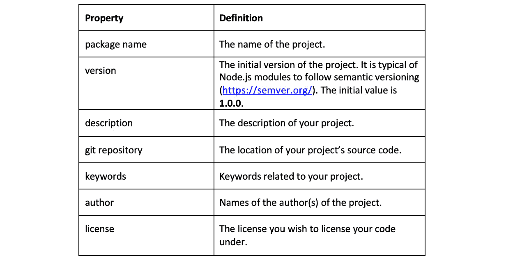
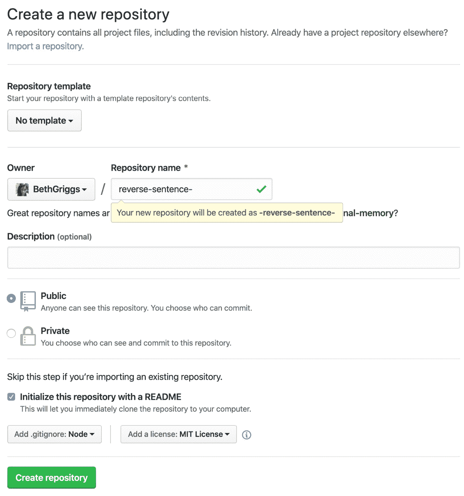
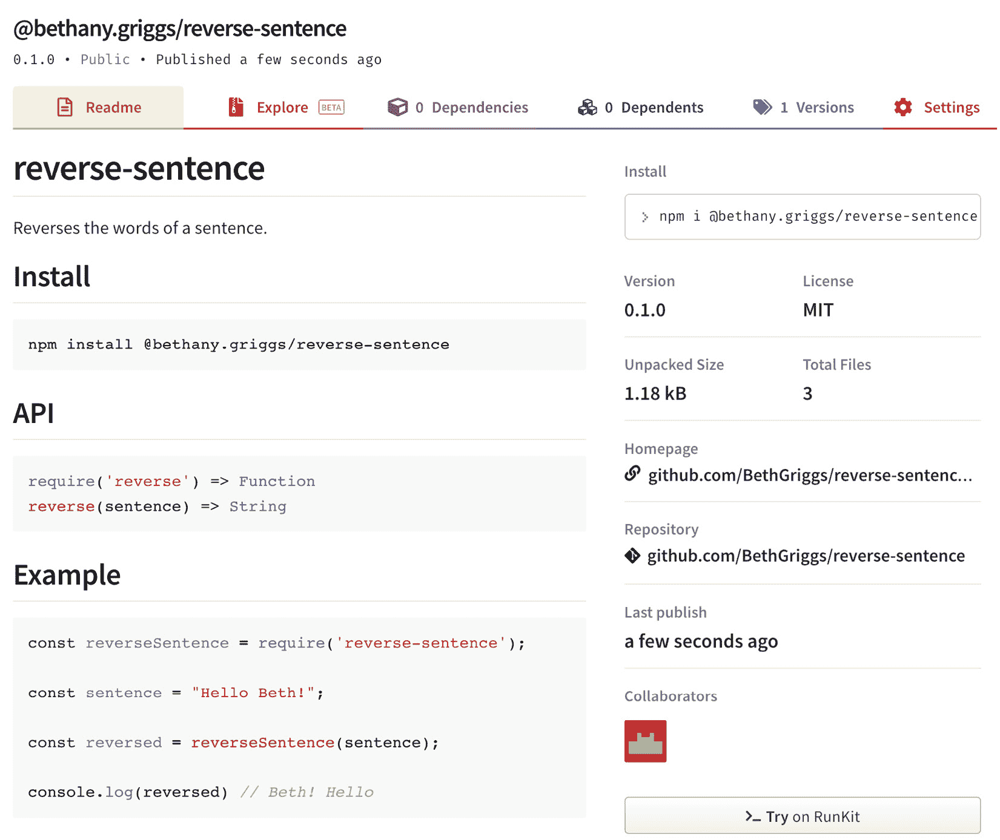

# 五、开发 Node.js 模块

Node.js 的主要吸引力之一是外部第三方库的庞大生态系统。Node.js 模块是要包含在应用中的库或一组函数。大多数模块将提供一个 API 来公开它们的功能。`npm`注册表是存储大多数 Node.js 模块的地方，其中有超过一百万个 Node.js 模块可用。

本章将首先介绍如何使用`npm`注册表中的现有 Node.js 模块，以便使用`npm`命令行界面在应用中使用。

在本章后面，您将学习如何开发自己的 Node.js 模块并将其发布到`npm`注册表。还将介绍如何使用较新版本的 Node.js 中提供的较新 ECMAScript 模块语法。

本章将介绍以下配方：

*   使用 Node.js 模块
*   设置您自己的模块
*   实现您的模块
*   准备模块并将其发布到 npm
*   使用 ECMAScript 模块

# 技术要求

本章要求您安装 Node.js，最好是最新的 Node.js 14 版本。您还应该安装与 Node.js 捆绑在一起的`npm`命令行界面。`node`和`npm`都应该在你的道路上。

重要提示

建议使用**节点版本管理器**（**nvm**安装 Node.js）。它是一个工具，使您能够在大多数类似 Unix 的平台上轻松切换 Node.js 版本。如果您使用的是 Windows，则可以从[安装 Node.jshttps://nodejs.org/en/](https://nodejs.org/en/) 。

您可以通过在终端中键入以下命令来确认安装了 Node.js 和`npm`的版本：

```js
$ node –version
v14.0.0
$ npm –version
6.13.7
```

`npm`是与 Node.js 捆绑的默认软件包管理器，我们将在本章中使用捆绑的`npm`CLI 来安装和发布模块。

重要提示

`npm`是与 Node.js 捆绑的**命令行界面工具**（**CLI**作为默认包管理器的名称。npm，inc.也是拥有公共注册的公司的名称（[https://registry.npmjs.org/](https://registry.npmjs.org/) ）。

请注意，由于我们将下载模块并将其发布到 npm 注册表，因此本章将要求访问 internet。

# 消费 Node.js 模块

在本食谱中，我们将学习如何使用`npm`CLI 从公共`npm`注册表中消费`npm`模块。

重要提示

Thread 是一种流行的 JavaScript 替代包管理器，2016 年作为`npm`CLI 的替代品创建。纱线发布时，`npm`没有`package-lock.json`功能来保证将安装哪些特定版本的模块的一致性。这是纱线的主要特征之一。在撰写本文时，Thread CLI 提供了与`npm`CLI 类似的用户体验。Thread 维护一个注册表，该注册表是 npm 注册表的反向代理。有关纱线的更多信息，请查阅的*入门指南*：https://yarnpkg.com/getting-started.

## 准备好了吗

要开始，我们首先需要创建一个新的目录：

```js
$ mkdir consuming-modules
$ cd consuming-modules
```

我们还需要一个文件，用于尝试执行导入的模块：

```js
$ touch require-express.js
```

## 怎么做

在本节中，我们将设置一个项目并安装`express`模块，这是 Node.js 下载最多的 web 框架：

1.  首先，我们需要初始化一个新项目。通过键入以下内容来执行此操作：

    ```js
    $ npm init
    ```

2.  您将需要通过该实用程序逐步回答命令行实用程序中的问题。如果您不确定，您可以点击*输入*接受默认值。
3.  `$ npm init`命令应该已经在项目目录中生成了一个`package.json`文件。应该是这样的：

    ```js
    {
      "name": "consuming-modules",
      "version": "1.0.0",
      "main": "require-express.js",
      "scripts": {
        "test": "echo \"Error: no test specified\" && exit 1"
      },
      "author": "",
      "license": "ISC",
      "description": ""
    }
    ```

4.  现在，我们可以安装我们的模块了。要安装`express`模块，请在项目目录中键入以下命令：

    ```js
    $ npm install express
    ```

5.  If we look at the `package.json` file again, we should see that the module has been added to a `dependencies` field:

    ```js
    {
      "name": "consuming-modules",
      "version": "1.0.0",
      "main": "require-express.js",
      "scripts": {
        "test": "echo \"Error: no test specified\" && exit 1"
      },
      "author": "",
      "license": "ISC",
      "description": "",
      "dependencies": {
        "express": "^4.17.1"
      }
    }
    ```

    另外，请注意，`node_modules`目录和`package-lock.json`文件现在都已在项目目录中创建。

6.  现在，我们可以打开我们的`require-express.js`文件了。我们只需要添加以下行来测试是否可以导入和使用模块：

    ```js
    const express = require("express");
    ```

7.  预计程序在需要`express`模块后会执行并立即终止。如果模块未成功安装，我们将看到类似以下错误：

    ```js
    $ node require-express.js 
    internal/modules/cjs/loader.js:979
      throw err;
      ^
    Error: Cannot find module 'express'
    ```

现在我们已经成功地从`npm`注册表下载了一个第三方模块，并将其导入到我们的应用中，以便可以使用。

## 它是如何工作的

该配方利用`npm`、与 Node.js 捆绑的命令行界面和`npm`公共注册表下载第三方模块`express`。

配方的第一个命令是`$ npm init`。此命令初始化当前工作目录中的新项目。默认情况下，运行此命令将打开一个 CLI 实用程序，该实用程序将询问有关项目的一些属性。下表定义了每个请求的属性：



图 5.1–详述 package.json 文件属性的表格

必需的唯一属性是包名和版本。还可以通过键入以下内容跳过 CLI 实用程序并接受所有默认值：

```js
$ npm init --yes
```

也可以使用`npm config`命令配置默认答案。这可以通过以下命令实现：

```js
$ npm config set init.author.name "Your Name"
```

一旦`$ npm init`命令完成，它将在您当前的工作目录中生成一个`package.json`文件。`package.json`文件执行以下操作：

*   它列出了您的项目所依赖的包，作为需要安装哪些依赖项的“蓝图”或一组说明。
*   它允许您使用语义版本控制规则（[指定项目可以使用的包的版本 https://semver.org/](https://semver.org/) 。
*   它使您的构建具有可复制性，因此更容易与其他开发人员共享。

在配方的下一步中，我们使用`$ npm install express`命令安装`express`模块。命令到达`npm`注册表，下载名称标识符为`express`的模块的最新版本。

重要提示

默认情况下，当传递名称时，`npm install`命令将查找具有该名称的模块，并从公共`npm`注册表下载该模块。但是也可以将`npm install`命令传递给其他参数，例如 GitHub URL，该命令将安装 URL 的内容。有关更多信息，请参阅`npm`CLI 文档：[https://docs.npmjs.com/cli/install](https://docs.npmjs.com/cli/install) 。

`install`命令完成后，将模块内容放入`node_modules`目录。如果在当前项目中没有，但是有`package.json`，该命令也会创建`node_modules`目录。

如果您查看`node_modules`目录的内容，您会注意到不仅仅存在`express`模块。这是因为`express`有自己的依赖项，它们的依赖项也可能有自己的依赖项。

安装模块时，您可能正在安装整个模块树。以下输出显示了`node_modules`目录的结构：

```js
$ ls node_modules
accepts             escape-html         mime                safer-buffer
array-flatten       etag                mime-db             send
body-parser         express             mime-types          serve-static
bytes               finalhandler        ms                  setprototypeof
content-disposition forwarded           negotiator          statuses
content-type        fresh               on-finished         toidentifier
cookie              http-errors         parseurl            type-is
cookie-signature    iconv-lite          path-to-regexp      unpipe
debug               inherits            proxy-addr          utils-merge
depd                ipaddr.js           qs                  vary
destroy             media-typer         range-parser
ee-first            merge-descriptors   raw-body
encodeurl           methods             safe-buffer
```

您还可以使用`$ npm list`命令列出您的`node_modules`目录的内容。

您可能还注意到已经创建了一个`package-lock.json`文件。`package-lock.json`文件在`npm`版本 5 中引入。

`package-lock.json`与`package.json`的区别在于`package-lock`文件定义了`node_modules`树中所有模块的特定版本。

由于依赖项的安装方式，两个具有相同`package.json`文件的开发人员在运行`$ npm install`时可能会遇到不同的结果。这主要是因为`package.json`文件可以指定可接受的模块范围。

例如，在我们的配方中，我们安装了最新版本的`express`，这导致了以下范围：

```js
"express": "^4.17.1"
```

`^`表示允许安装 v4.17.1 以上的所有版本，但不允许安装 v5.x.x。如果 v4.17.2 是在开发人员 A 和开发人员 B 运行`npm install`命令之间发布的，那么开发人员 A 可能会获得 v4.17.1 版本，开发人员 B 可能会获得 v4.17.2 版本。

如果`package-lock.json`文件在开发人员之间共享，他们将保证安装相同版本的`express`和相同版本的`express`所有依赖项。

在配方的最后一步，我们导入了`express`模块以测试其是否可访问：

```js
const express = require("express");
```

请注意，这与导入 Node.js 核心模块的方式相同。模块加载算法会首先检查是否需要一个核心 Node.js 模块；然后，它将在`node_modules`文件夹中查找具有该名称的模块。

还可以通过传递相对路径来要求特定文件，例如：

```js
const file = require("./file.js");
```

## 还有更多

现在，我们已经了解了一些关于使用 Node.js 模块的知识，我们将了解开发依赖项、全局模块，以及在使用 Node.js 模块时应该考虑的事项。

### 开发依赖关系

在`package.json`中，您可以区分开发依赖项和常规依赖项。开发依赖项通常用于支持您开发应用的工具。

运行应用不需要开发依赖项。在部署应用时，区分应用运行所需的依赖项和开发应用所需的依赖项尤其有用。您的生产应用部署可以省略开发依赖项，从而使生成的生产应用更小。较小的部署可以降低部署成本。

开发依赖项的一个非常常见的用法是用于 linter 和 formatter。`prettier`是一种可以一致地重新格式化代码的工具。对于一个更可定制的衬垫，您应该考虑使用 OutT1。

要安装开发依赖项，您需要为 install 命令提供`--save-dev`参数。例如，要安装`prettier`，我们可以使用以下方法：

```js
$ npm install --save-dev --save-exact prettier
```

`--save-exact`在您的`package.json`文件中锁定确切版本。当使用`prettier`时，建议这样做，因为补丁版本可能会引入新的样式规则，当自动选择时，可能会很麻烦。

请注意，对于在`package.json`中创建的开发依赖项，有一个单独的部分：

```js
{
  "name": "consuming-modules",
  "version": "1.0.0",
  "main": "require-express.js",
  "scripts": {
    "test": "echo \"Error: no test specified\" && exit 1"
  },
  "author": "",
  "license": "ISC",
  "description": "",
  "dependencies": {
    "express": "^4.17.1"
  },
  "devDependencies": {
    "prettier": "2.0.5"
  }
} 
```

然后，您可以使用以下命令执行已安装的`prettier`二进制文件：

```js
./node_modules/prettier/bin-prettier.js
```

### 全局模块

可以全局安装 Node.js 模块。通常，您要全局安装的模块类型是二进制文件或希望在 shell 中访问的程序。要全局安装模块，请将`--global`命令传递给`install`命令，如下所示：

```js
$ npm install --global lolcatjs
```

这不会将`lolcatsjs`安装到您的`node_module`文件夹中。相反，它将被安装到 Node.js 安装的`bin`目录中。要查看安装位置，您可以使用`which`命令（或 Windows 上的`where`）：

```js
$ which lolcatjs
		/Users/bethgriggs/.nvm/versions/node/v13.11.0/bin/lolcatjs
```

`bin`目录可能已经在您的路径中，因为那里存储着`node`和`npm`二进制文件。因此，全局安装的任何可执行程序也将在 shell 中可用。现在，您应该能够从 shell 调用`lolcatjs`模块：

```js
lolcatjs --help
```

在`npm`版本 v5.2 中，`npm`在其 CLI 中添加了`npx`命令。此命令允许您执行全局模块，而无需将其永久存储。您可以执行`lolcatjs`模块，而无需存储以下内容：

```js
$ npx lolcatjs
```

通常，`npx`对于您希望执行的大多数模块来说应该足够了。但是，如果您希望全局模块永久脱机可用，那么您可能希望仍然全局安装该模块，而不是使用`npx`命令。

### 负责任地使用模块

您可能希望在自己的应用中利用 Node.js 模块生态系统。模块提供常见问题和任务的解决方案和实现，因此重用现有代码可以在开发应用时节省时间。

正如你在菜谱中看到的，简单地引入 web 框架，`express`就引入了 80 多个其他模块。引入这么多的模块会增加风险，特别是当您将这些模块用于生产工作负载时。

在选择要包含在应用中的 Node.js 模块时，您应该考虑很多因素。应特别考虑以下五点：

*   **Security**

    您能否依靠模块修复安全漏洞？[*第 9 章*](09.html#_idTextAnchor259)*保护 Node.js 应用*将详细介绍如何检查模块中的已知安全问题。

*   **Licenses**

    如果您链接到开放源代码库，然后分发软件，则您的软件需要符合链接库的许可证。许可证可以是限制性/保护性的，也可以是许可性的。在 GitHub 中，您可以导航到许可证文件，它将为您提供许可证允许的基本概述：


图 5.2 GitHub 许可证界面

*   **Maintenance**

    您还需要考虑模块维护得有多好。大多数模块将其源代码发布到 GitHub，并将其 bug 报告作为 GitHub 问题查看。通过查看他们的问题以及维护人员如何/何时响应错误报告，您应该能够了解模块的维护情况。

## 另见

*   本章中的*设置您自己的模块*配方
*   本章中的*实现模块*配方
*   本章中的*准备模块并发布到 npm*配方
*   [*第 6 章*](06.html#_idTextAnchor165)*探索 Node.js web 框架*中的*使用 Express.js*配方构建 web 应用
*   [*第 9 章*](09.html#_idTextAnchor259)*保护 Node.js 应用*

# 设置您自己的模块

在这个配方中，我们将搭建我们自己的模块，也就是说，我们将为我们的模块设置一个典型的文件和目录结构，并学习如何使用`npm`CLI 初始化我们的项目。我们还将创建一个 GitHub 存储库来存储模块代码。GitHub 是一个托管提供商，允许用户存储基于 Git 的存储库，其中 Git 是一个版本控制系统。

我们将要创建的模块将公开一个 API，该 API 将反转我们传递给它的语句。

## 准备好了吗

让我们为模块创建一个新目录并将其更改为：

```js
$ mkdir reverse-sentence
$ cd reverse-sentence
```

此配方还要求您拥有 GitHub 帐户（[https://github.com/join](https://github.com/join) 发布源代码和`npm`账号（[https://www.npmjs.com/signup](https://www.npmjs.com/signup) 发布您的模块。

## 怎么做

在此配方中，我们将使用`npm`CLI 初始化`reverse-sentence`模块：

1.  要开始，我们必须首先初始化一个新项目：

    ```js
    $ npm init
    ```

2.  使用*输入*接受默认值。该命令将为您创建一个文件。打开文件，期望看到类似以下内容的输出：

    ```js
    {
      "name": "reverse-sentence",
      "version": "0.1.0",
      "description": "Reverses a sentence.",
      "main": "index.js",
      "scripts": {
        "test": "echo \"Error: no test specified\" && exit 1"
      },
      "author": "Beth Griggs",
      "license": "MIT"
    }
    ```

3.  现在我们有了一些模块代码，让我们创建一个 GitHub 存储库来存储模块代码。为此，您可以从 GitHub UI 中单击**+>新建存储库**或导航到[https://github.com/new](https://github.com/new) 。将存储库名称指定为`reverse-sentence`。请注意，存储库名称不必与模块名称匹配。
4.  While you're here, it's also recommended to add the default `.gitignore` for Node.js and add the license file that matches the license field in `package.json`. You should expect to see the following GitHub UI for creating a new repository:

    

    图 5.3 GitHub 创建一个新的存储库界面

    重要提示

    一个`.gitignore`文件通知 Git 在项目中忽略或忽略哪些文件。GitHub 为每种语言或运行时提供一个默认的`.gitignore`文件。GitHub 的 Node.js 默认的`.gitignore`文件在[处可见https://github.com/github/gitignore/blob/master/Node.gitignore](https://github.com/github/gitignore/blob/master/Node.gitignore) 。注意，`node_modules`自动添加到`.gitignore`。`package.json`文件指示项目需要安装哪些模块，通常期望每个开发人员在其开发环境中运行`npm install`命令，而不是将`node_modules`目录提交给源代码管理。

5.  在 shell 中从模块目录中运行这些命令，并用您自己的 GitHub 用户名替换相应的命令。GitHub 提供了一组示例命令，用于将模块代码推送到存储库：

    ```js
    $ echo "# reverse-sentence" >> README.md
    $ git init
    $ git add README.md
    $ git commit -m "first commit"
    $ git remote add origin git@github.com:<username>/reverse-sentence.git
    $ git push -u origin master
    ```

6.  当此操作成功时，您应该看到以下输出：

    ```js
    [master (root-commit) 11419a7] first commit
     1 file changed, 1 insertion(+)
     create mode 100644 README.md
    Enumerating objects: 3, done.
    Counting objects: 100% (3/3), done.
    Writing objects: 100% (3/3), 649 bytes | 649.00 KiB/s, done.
    Total 3 (delta 0), reused 0 (delta 0)
    To github.com:BethGriggs/reverse-sentence.git
     * [new branch]      master -> master
    Branch 'master' set up to track remote branch 'master' from 'origin'.
    ```

7.  我们现在可以再次键入`$ npm init`，它将自动为 repository 字段建议我们的 GitHub 远程存储库。这将把我们的`package.json`文件的存储库字段更新为以下内容：

    ```js
      "repository": {
        "type": "git",
        "url": "git+https://github.com/BethGriggs/reverse-sentence.git"
      },
      "bugs": {
        "url": "https://github.com/BethGriggs/reverse-sentence/issues"
      },
      "homepage": "https://github.com/BethGriggs/reverse-sentence#readme"
    }
    ```

现在我们已经了解了如何使用`npm`CLI 初始化`reverse-sentence`模块。

## 它是如何工作的

在配方的第一步中，我们使用`$` `npm init`命令初始化我们的模块，包括配置模块名称和初始版本。一旦初始化，您将拥有一个`package.json`文件。

在配方的第三步中，我们创建了一个 GitHub 存储库来存储模块代码。

重要提示

Git 是一个功能强大的工具，通常用于软件的源代码控制。如果您不熟悉 Git，GitHub 将提供一个交互式指南供您在 https://guides.github.com/introduction/flow/.

然后可以通过重新运行`$` `npm init`命令来重新初始化我们的模块。该命令检测到我们在目录中配置了 Git remote，并用我们的 Git remote URL 填充了`package.json`文件中的 repository字段。注意，它还填充了 bug 和 homepage 字段，假设这些字段也应该指向 GitHub 存储库。

## 还有更多

在配方中，我们将模块版本指定为 v0.1.0，以遵守语义版本控制。让我们更详细地看看这个。

语义版本，通常缩写为**semver**，是一个著名的版本控制标准。Node.js 本身尽量坚持语义版本控制。

语义版本号的格式为`X.Y.Z`：

*   `X`代表主要版本。
*   `Y`代表次要版本。
*   `Z`表示补丁版本。

简单地说，语义版本控制表示，当您进行破坏性的 API 更改时，您将增加主版本（第一个值）。当以向后兼容（或不中断）的方式添加新功能时，第二个数字（次要版本）将递增。补丁版本，或第三个版本，用于修复 bug 和非中断和非添加更新。

主要版本 0 是为初始开发保留的，在 v1 发布之前可以进行分解更改。最初的版本应该是什么经常引起争议。在配方中，我们从版本 v0.1.0 开始，允许我们在早期开发中自由地进行突破性的更改，而不必增加主要版本号。

以下语义版本控制在 Node.js 模块生态系统中很常见。`npm`CLI 考虑到了这一点，允许在`package.json`中使用 semver 范围-请参阅*Consuming Node.js 模块*配方或访问中的*有更多*部分 https://docs.npmjs.com/files/package.json#dependencies 有关 npm semver 范围的更多信息。

`npm`CLI 提供了支持语义版本控制的 API。`npm version`命令可以与`major`、`minor`或`patch`一起提供，以在您的`package.json`中增加适当的版本号。还有一些参数可以传递给`npm``version`命令，包括对`pre`版本的支持，请参考[https://docs.npmjs.com/cli/version](https://docs.npmjs.com/cli/version) 了解更多信息。

## 另见

*   本章中的*设置您自己的模块*配方
*   本章中的*实现模块*配方
*   本章中的*准备模块并发布到 npm*配方

# 实现您的模块

在这个配方中，我们将开始编写模块代码。我们将编写的模块将公开一个 API，将反转我们传递给它的语句。我们还将安装一个流行的代码格式化程序，以保持模块代码的一致性。

## 准备好了吗

确保您在`reverse-sentence`文件夹中并且`package.json`存在，这表示我们有一个初始化的项目目录。

我们还需要为模块创建第一个 JavaScript 文件：

```js
$ touch index.js
```

## 怎么做

我们将首先安装一个流行的代码格式化程序，以保持模块代码样式的一致性。在本配方结束时，我们将使用以下步骤创建第一个 Node.js 模块：

1.  首先，让我们添加`prettier`作为模块的代码格式化程序。当我们知道其他用户将使用模块时，使用一致且格式清晰的代码非常重要，这样用户就可以更轻松地调试您的模块：

    ```js
    $ npm install --save-dev --save-exact prettier   
    ```

2.  我们知道我们需要一个函数来接受一个字符串参数，然后将其反转，所以让我们先为它创建一个函数占位符。打开`index.js`并添加以下内容：

    ```js
    function reverse(sentence) {
    };
    ```

3.  现在我们可以专注于反向功能。我们将采用的反转句子的方法是将句子拆分为一个单字字符串数组，然后反转数组。首先，我们将把句子分成一个字符串数组。将以下内容添加到您的反向功能中：

    ```js
    function reverse(sentence) {
        const wordsArray = sentence.split(" ");
    };
    ```

4.  现在我们有了一个字符串数组，为了反转数组，我们可以调用`reverse`函数，该函数在数组对象上可用：

    ```js
    const reversedArray = wordsArray.reverse();
    ```

5.  由于单词仍然以数组格式存储，因此我们需要将数组中的元素重新连接在一起，以将句子重组为字符串。为此，我们可以使用`join()`函数，该函数在数组对象上可用：

    ```js
    const reversedSentence = reversedArray.join(" ");
    ```

6.  现在我们要从函数返回`reversedSentence`。现在，您的函数应该如下所示：

    ```js
    function reverse(sentence) {
        const wordsArray = sentence.split(" ");
        const reversedArray = wordsArray.reverse();
        const reversedSentence = reversedArray.join(" ");
        return reversedSentence;
    };
    ```

7.  下一步，我们将在文件顶部添加键行，以访问反向函数。在文件顶部添加以下内容：

    ```js
    module.exports = reverse;
    ```

8.  Now we can test that our small program works from the command line with the following command:

    ```js
    $ node --print "require('./')('Hello Beth\!')"
    Beth! Hello
    ```

    提示：

    如果不在代码中使用`\`来分隔`!`，从而使其不被解释为 bash 命令，则可能会出现`bash: !': event not found`错误。

现在我们已经创建了第一个模块。

## 它是如何工作的

在食谱中，我们首先解决了如何颠倒句子的逻辑问题。为了解决这个问题，我们使用了字符串和数组对象上的内置 API。

我们使用的第一种方法是`split()`函数。此方法在 JavaScript 中的字符串上自动可用。`split()`函数拆分字符串并将子字符串放入`Array`中，保留顺序。在配方中，我们将`" "`传递给`split()`方法，这指示 split 函数在每个空间之间创建子字符串。

我们使用的第二个函数是 JavaScript 中`Array`对象上可用的`reverse()`函数。顾名思义，此函数反转`Array`中的元素。

我们使用的最后一个函数是 join 函数，也可用于数组对象。join 函数返回通过连接或连接数组的所有元素而创建的字符串。在配方中，我们向该函数传递了空格字符`" "`，它告诉连接函数用字符串分隔数组中的每个字。可以不向 join 函数传递任何参数。在这种情况下，它将默认使用逗号连接字符串。

重要提示

`String.prototype.split`、`Array.prototype.reverse`和`Array.prototype.join`函数都来自 JavaScript。Mozilla MDN Web 文档是 JavaScript API 的有价值和可靠的参考：[https://developer.mozilla.org/en-US/docs/Web/JavaScript/Reference](https://developer.mozilla.org/en-US/docs/Web/JavaScript/Reference) 。

为了公开并允许访问我们的模块 API，我们添加了`module.exports = reverse;`行。`module.exports`是默认情况下可在所有 Node.js JavaScript 中访问的对象。分配给`module.exports`对象的任何内容都将公开。

我们通过将`--print`参数传递给 Node.js 进程来测试我们的模块。`–print`标志对提供的语句或表达式求值并输出结果。

我们提供的声明是`require('./')('Hello Beth!')`-这测试了当我们需要我们的模块时会发生什么。正如预期的那样，当需要模块时，调用 reverse 函数并返回句子，但单词的顺序颠倒了。

## 还有更多

现在我们已经有了模块代码并公开了，我们可以考虑向模块中添加自定义脚本。

### npm 运行脚本

`$ npm init`命令会自动在`package.json`文件中生成一个`scripts`属性。默认情况下，`scripts`属性将包含一个`test`属性：

```js
"scripts": {
  "test": "echo \"Error: no test specified\" && exit 1"
}
You can run this test script by typing: $ npm test    
> reverse-sentence@0.1.0 test /Users/bethgriggs/NodeCookbook/ch5/consuming-modules
> echo "Error: no test specified" && exit 1
Error: no test specified
npm ERR! Test failed.  See above for more details.
```

请注意，我们看到此错误是因为我们尚未配置要运行的测试脚本。[*第 8 章*](08.html#_idTextAnchor223)*与 Node.js*的测试将涵盖 Node.js 应用的测试。

您还可以将自定义脚本添加到此对象。让我们创建一个自定义脚本来运行`prettier`：

```js
"scripts": {
    "test": "echo \"Error: no test specified\" && exit 1",
    "lint": "./node_modules/prettier/bin-prettier.js . --write"
  }
```

现在，我们可以使用以下命令运行此脚本：

```js
$ npm run-script lint
```

重要提示

`npm`CLI 支持多种快捷方式。例如，`npm install`可以缩短为`npm i`。`npm test`可以缩短为`npm t`。`npm run-script`可缩短为`npm run`。有关更多信息，请参阅至`npm`CLI 文档：[https://docs.npmjs.com/cli-documentation/cli](https://docs.npmjs.com/cli-documentation/cli) 。

可以创建尽可能多的适合您的项目的自定义脚本。

## 另见

*   本章中的*准备模块并发布到 npm*配方
*   [*第 8 章*](08.html#_idTextAnchor223)*与 Node.js*的测试

# 准备模块并发布到 npm

本食谱将指导您如何准备模块并将其发布到`npm`注册表。将您的模块发布到`npm`注册表将使其他开发人员可以在其应用中查找并包含该模块。这就是`npm`生态系统的运作方式：开发人员将编写模块并发布到`npm`，供其他开发人员在 Node.js 应用中使用和重用。

在配方中，我们将把我们在实现本章模块配方的*中创建的`reverse-sentence`模块发布到`npm`注册表中。具体来说，我们将把我们的模块发布到一个作用域名称空间，因此您可以期望您的模块在`@npmusername/reverse-sentence`上可用。*

## 准备好了吗

此配方依赖于实现本章模块配方的*。我们将把在该配方中创建的`reverse-sentence`模块发布到`npm`注册表中。您可以从位于[的 GitHub 存储库中实现模块](https://github.com/BethGriggs/Node-Cookbook/tree/master/Chapter05/reverse-sentence)*配方的*获取模块代码 https://github.com/BethGriggs/Node-Cookbook/tree/master/Chapter05/reverse-sentence 。*

此配方还要求您拥有`npm`帐户。转到[https://www.npmjs.com/signup](https://www.npmjs.com/signup) 注册一个账户。记下你的`npm`用户名。

## 怎么做

此配方将遍历将模块发布到`npm`注册表的过程：

1.  一旦您注册了一个`npm`账户，您就可以使用以下命令授权您的`npm`客户：

    ```js
    npm login
    Username: bethany.griggs
    Password: 
    Email: (this IS public) bethany.griggs@uk.ibm.com
    ```

2.  Let's update our `README.md` file that was automatically created for us when we initialized the GitHub repository in the *Setting up your own module* recipe. Having an appropriate and clear `README.md` is important so that users who stumble upon the module can understand what it does and whether it suits their use case. Open the `README.md` file in your editor and update the following, remembering to change the `npm` username to your own:

    ```js
    # reverse-sentence
    Reverses the words of a sentence.
    ## Install
    ```sh
    npm install @npmusername/reverse-sentence
    ```js
    ## API
    ```js
    require("reverse-sentence") => Function
    reverse(sentence) => String
    ```js
    ## Example
    ```js
    const reverseSentence = require("reverse-sentence");
    const sentence = "Hello Beth!"; 
    const reversed = reverseSentence(sentence); 
    console.log(reversed) // Beth! Hello
    ```js
    ## License
    MIT
    ```

    重要提示

    我们刚刚创建的`README`文件是使用 Markdown 编写的。`.md`或`.MD`结尾表示它是一个标记文件。Markdown 是 GitHub 中常用的一种文档语法。要了解有关降价的更多信息，请查看位于[的 GitHub 指南 https://guides.github.com/features/mastering-markdown/](https://guides.github.com/features/mastering-markdown/) 。许多流行的编辑器都有可用的插件，因此您可以在编辑器中呈现标记。

3.  现在，我们需要更新`package.json`文件中模块的名称，以匹配作用域模块名称。您可以手动编辑`package.json`或重新运行`$ npm init`命令，用任何新值覆盖它：

    ```js
    {
      "name": "@npmusername/reverse-sentence",
      "version": "0.1.0",
      "description": "Reverses a sentence.",
      "main": "index.js",
      "scripts": {
        "test": "echo \"Error: no test specified\" && exit 1",
        "lint": "./node_modules/prettier/bin-prettier.js . --write",
      },
      "author": "",
      "license": "MIT",
      "repository": {
        "type": "git",
        "url": "git+https://github.com/BethGriggs/reverse-sentence.git"
      },
      "bugs": {
        "url": "https://github.com/BethGriggs/reverse-sentence/issues"
      },
      "homepage": "https://github.com/BethGriggs/reverse-sentence#readme"
    }
    ```

4.  让您的公共 GitHub 存储库保持最新状态非常理想。通常，模块作者将在 GitHub 上创建一个“标记”，该标记与推送到`npm`的版本相匹配。对于希望在特定版本中查看模块源代码的用户，这可以作为审计跟踪，而无需通过`npm`下载。但是，请注意，没有强制规定您发布到`npm`的代码必须与您发布到 GitHub 的代码匹配：

    ```js
    $ git add .
    $ git commit -m "v0.1.0"
    $ git push origin master
    $ git tag v0.1.0
    $ git push origin v0.1.0
    ```

5.  现在，我们可以使用以下命令将模块发布到`npm`注册表：

    ```js
    $ npm publish --access=public
    ```

6.  您可以通过导航到来检查发布是否成功 https://www.npmjs.com/package/@npmusername/倒装句。希望看到有关您的模块的以下信息：



图 5.4 npmjs.com 上的 npm 模块信息

## 它是如何工作的

我们首先使用`$` `npm login`命令对本地 npm 客户端进行身份验证。npm 提供了设置访问控制的能力，以便某些用户可以发布到特定的模块或范围。

`$` `npm login`确定您是谁以及您有权在哪里发布。也可以使用`$` `npm logout`注销。

实际发布到注册表的命令如下：

```js
$ npm publish --access=public
```

`npm`publish 命令尝试在`package.json`中`name`字段标识的位置发布包。在配方中，我们将其发布到一个有作用域的包中，具体来说，我们使用了自己的用户名作用域。作用域包有助于避免命名冲突。通过不向包传递命名作用域，可以将包发布到全局作用域，但如果包具有公共名称，则可能会遇到名称冲突。

我们也通过了`--access=public`旗。当发布到一个有作用域的包时，我们需要明确指出我们希望该模块是公共的。`npm`允许您将模块发布为作用域包的公共或私有模块。要私下发布模块，您需要有一个付费的`npm`帐户。请注意，发布到全局作用域时不需要`--access=public`标志，因为全局命名空间中的所有模块都是公共的。

`npm`publish 命令打包了我们的模块代码，并将其上传到`npm`注册表。由于`$` `npm`init 命令生成的`package.json`具有一致的属性，`npm`可以在模块页面上提取并呈现该信息。如配方所示，`npm`根据我们`package.json`中的信息自动填充 UI 中的`README`、版本和 GitHub 链接。

## 还有更多

接下来，我们将考虑预发布脚本和 AutoT0.ALE 文件，并查看如何发布 TyOutT1 私有注册。

### 预发布脚本

`npm`支持`prepublishOnly`脚本。此脚本仅在打包和发布模块之前运行。这有助于在发布前发现错误。如果出现错误，可能需要发布第二个版本来更正此错误，这可能会给您的模块消费者带来可避免的不便。

让我们在模块中添加一个`prepublishOnly`脚本。我们的`prepublishOnly`脚本现在只运行`lint`脚本。添加一个`prepublishOnly`脚本，如下所示：

```js
"scripts": {
"lint": "./node_modules/prettier/bin-prettier.js . --write",
  "prepublish": "npm run lint",
  "test": "echo \"Error: no test specified\" && exit 1"
}
```

通常，模块作者将在其`prepublish`脚本中包括重新运行其测试套件：

```js
"prepublish": "npm run lint && npm test",
```

### N.米格诺尔先生

与`.gitignore`文件类似，该文件指定哪些文件不应被跟踪或提交到存储库，`.npmignore`从包中省略其中列出的文件。`.npmignore`文件不是强制性的，如果您没有，但有`.gitignore`文件，则`npm`将省略与`.gitignore`文件匹配的文件和目录。如果存在`.npmignore`文件，则`.npmignore`文件将覆盖`.gitignore`。

通常添加到`.npmignore`文件中的文件和目录类型为测试文件。如果在大小方面有一个特别大的测试套件，那么您应该考虑通过将这些文件添加到您的 OutT1 文件中来排除这些文件。使用您的模块的用户不需要将测试套件捆绑到他们的应用中，除非它为所有用户减少了模块的大小。

仅排除测试目录的`.npmignore`文件如下所示：

```js
# Dependency directories
node_modules/
```

记住，一旦创建了`.npmingore`文件，它将被认为是 npm 包中应该忽略哪些文件的真实来源。仔细检查您的`.gitignore`并确保您添加的项目也添加到`.npmignore`中是值得的。

### 私人登记处

`npm`CLI 支持配置为指向私有注册表。私有注册表是使用某种形式的访问控制设置的注册表。通常，这些由希望将其部分代码保留在公共注册表之外的企业和组织设置，这可能是由于其企业确定的策略限制。这使企业能够在遵守业务策略的同时，在同一组织的成员之间共享其模块。同样，私有注册表也可以用作缓存机制。

您可以使用以下命令更改指向的注册表：

```js
$ npm config set registry https://registry.your-registry.npme.io/
```

您可以使用以下命令查看所指向的注册表：

```js
$ npm config get registry
https://registry.npmjs.org/
```

注意，这两个都使用`$` `npm config`命令。您可以使用以下内容列出您的所有`$` `npm config`设置：

```js
$ npm config list
; cli configs
metrics-registry = "https://registry.npmjs.org/"
scope = ""
user-agent = "npm/6.13.7 node/v13.11.0 darwin x64"
; node bin location = /Users/bethgriggs/.nvm/versions/node/v13.11.0/bin/node
; cwd = /Users/bethgriggs/NodeCookbook/ch5/reverse-sentence
; HOME = /Users/bethgriggs
; "npm config ls -l" to show all defaults.
```

# 使用 ECMAScript 模块

ECMAScript 是为标准化 JavaScript 而创建的语言规范，由 ECMAScript 国际定义。ECMAScript 模块是打包 JavaScript 代码以供重用的官方格式。

Node.js 支持当前指定的 ECMAScript 模块，并在它们与现有 CommonJS 模块格式之间提供有限的互操作性。CommonJS 是 Node.js 的原始和默认模块格式，`require()`语法期望模块以 CommonJS 的形式出现。

Node.js 中的实现目前处于实验阶段；这意味着它可能会受到破坏性 API 更改的影响。ECMAScript 模块是 Node.js 中的一项战略计划，由模块团队领导，他们根据 ECMAScript 国际规范推动 Node.js 中 ECMAScript 模块的开发和安装。

## 准备好了吗

ECMAScript 模块支持在大于`v13.2.0`的 Node.js 版本中默认启用，尽管它仍然被认为是实验性的。请注意，由于 ECMAScript 模块的实现是实验性的，并且正在积极开发中，因此可以预期 Node.js 版本之间的行为会有显著差异。确保您使用的是 Node.js 14。

首先，让我们创建一个工作目录：

```js
$ mkdir ecmascript-modules
$ cd ecmascript-modules
```

## 怎么做

在此配方中，我们将学习如何在 Node.js 中导入和导出 ECMAScript 模块：

1.  首先，让我们初始化一个新项目：

    ```js
    $ npm init --yes
    ```

2.  现在，让我们安装`express`：

    ```js
    $ npm install express
    ```

3.  我们将创建一个扩展名为`.mjs`的索引文件，而不是`.js`：

    ```js
    $ touch server.mjs
    ```

4.  添加以下行以导入模块。注意，我们没有使用`require`语法：

    ```js
    import express from "express";
    ```

5.  现在，让我们使用`express`设置一个简单的服务器和一条路由。在您的`express.mjs`文件中添加以下行：

    ```js
    const PORT = 3000;
    const app = express();
    app.get("/", (req, res) => res.send("Hello from Express!"));
    app.listen(PORT, () => {
        console.log("Express server started on port", PORT);
    });
    ```

6.  现在，我们可以使用以下命令运行我们的`server.mjs`文件：

    ```js
    $ node index.mjs
    (node:39410) ExperimentalWarning: The ESM module loader is experimental.
    Express server started on port 3000
    ```

7.  导航至[http://localhost:3000](http://localhost:3000) 在您选择的浏览器中确认服务器正在工作。
8.  现在，让我们开始创建我们自己的模块，并将其导入我们的`express`服务器。在当前目录下为`get-name`新建一个目录：

    ```js
    $ mkdir get-name
    $ cd get-name
    ```

9.  让我们创建一个名为`index.mjs`：

    ```js
    $ touch index.mjs
    ```

    的文件
10.  在`index.mjs`中，将以下行添加到`export`变量：

    ```js
    export const name = "Beth";
    ```

11.  现在我们可以返回到我们的`server.mjs`并导入我们刚刚创建的模块：

    ```js
    import { name } from "./get-name/index.mjs";
    ```

12.  我们再把`Hello from Express!`改为`Hello from {name}!`：

    ```js
    app.get("/", (req, res) => res.send(`Hello from ${name}!`));
    ```

13.  现在我们可以重新运行`server.mjs`和检查我们是否已成功使用`get-name`模块：

    ```js
    $ node server.mjs
    ```

14.  您可以使用[上的 CURL 确认其工作 http://localhost:3000](http://localhost:3000) 。或者，您可以在浏览器中导航到此 URL:

    ```js
    $ curl http://localhost:3000
    Hello from Beth%
    ```

我们已经使用`.mjs`文件成功地使用了 ECMAScript 模块`import`和`export`语法。

## 它是如何工作的

在配方中，我们创建了一个`server.mjs`文件。`.mjs`是 ECMAScript 模块文件的扩展名。此文件结尾表示 Node.js 应将该文件视为 ECMAScript 模块。还有另一个结局，`.cjs`；Node.js 始终将以此结尾的文件视为 CommonJS 模块。

还有其他方法表明您希望将模块视为 ECMAScript 模块。以结尾的文件。如果最近的`package.json`包含值为`module`的`type`字段，则将`js`视为 ECMAScript 模块，如下所示：

```js
{
  "type": "module"
}
```

在查找最近的`package.json`时，算法将从当前目录按顺序向上遍历目录结构。

也可以将类型指定为`CommonJS`模块：

```js
{
  "type": "commonjs"
}
```

我们使用的`import`语法而不是`require`语法导入`express`：

```js
import express from "express";
```

像这样的导入语句只允许在`.mjs`文件中使用，但它们可以引用 CommonJS 模块或 ECMAScript 模块。

Express 在其`package.json.`中没有指定顶级`type`来查看 Express`package.json`，您可以在项目目录中使用`cat ./node_modules/express/package.json`。由于 Express 没有`.mjs`文件，也没有类型字段，Node.js 将默认将此模块视为 CommonJS 模块。

在配方的下一部分，我们创建了自己的模块`get-name`。我们在一个`.mjs`文件中创建了这个。我们的模块所做的只是导出一个常量值，我们使用了`export`语法：

```js
export const name = "Beth";
```

`export`语法可用于导出对象、函数和值。在本例中，我们使用“命名导出”导出`name`值。有关导出语法的更多信息，请参阅 Mozilla MDN 文档：[https://developer.mozilla.org/en-US/docs/Web/JavaScript/Reference/Statements/export](https://developer.mozilla.org/en-US/docs/Web/JavaScript/Reference/Statements/export) 。

然后，我们可以使用以下语法导入我们的`get-name`模块：

```js
import { name } from "./get-name/index.mjs"
```

重要提示

我们必须提供该文件的完整参考资料。这是 CommonJS 和 ECMAScript 模块导入之间的区别；ECMAScript 模块必须完全指定目录索引。有关 ECMAScript 模块和 CommonJS 之间差异的更多信息，请参阅 Node.js API 文档：[https://nodejs.org/api/esm.html#esm_differences_between_es_modules_and_commonjs](https://nodejs.org/api/esm.html#esm_differences_between_es_modules_and_commonjs)

## 另见

*   [*第一章*](01.html#_idTextAnchor016)*介绍 Node.js 14*