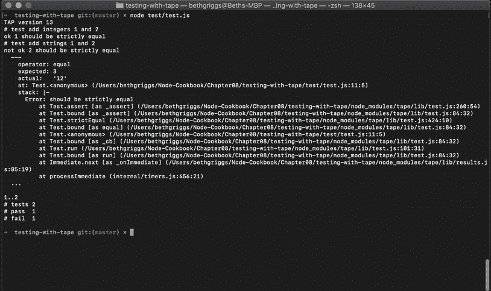
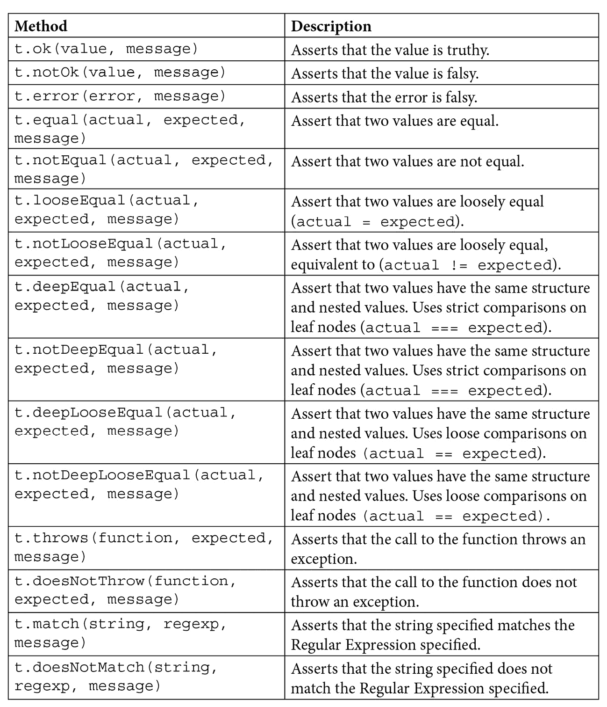
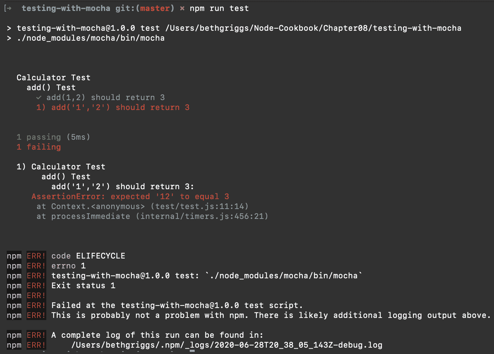
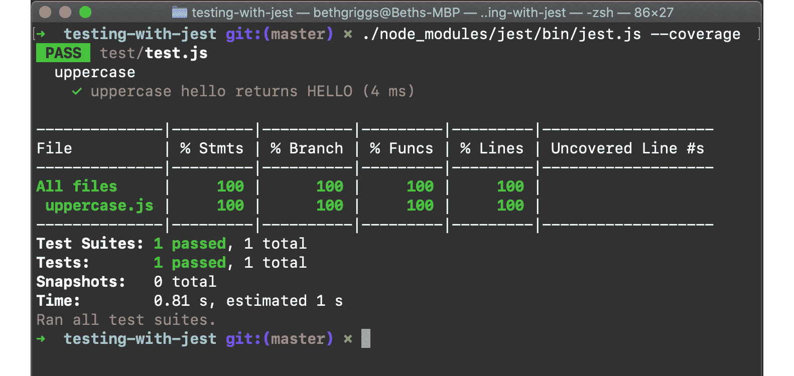
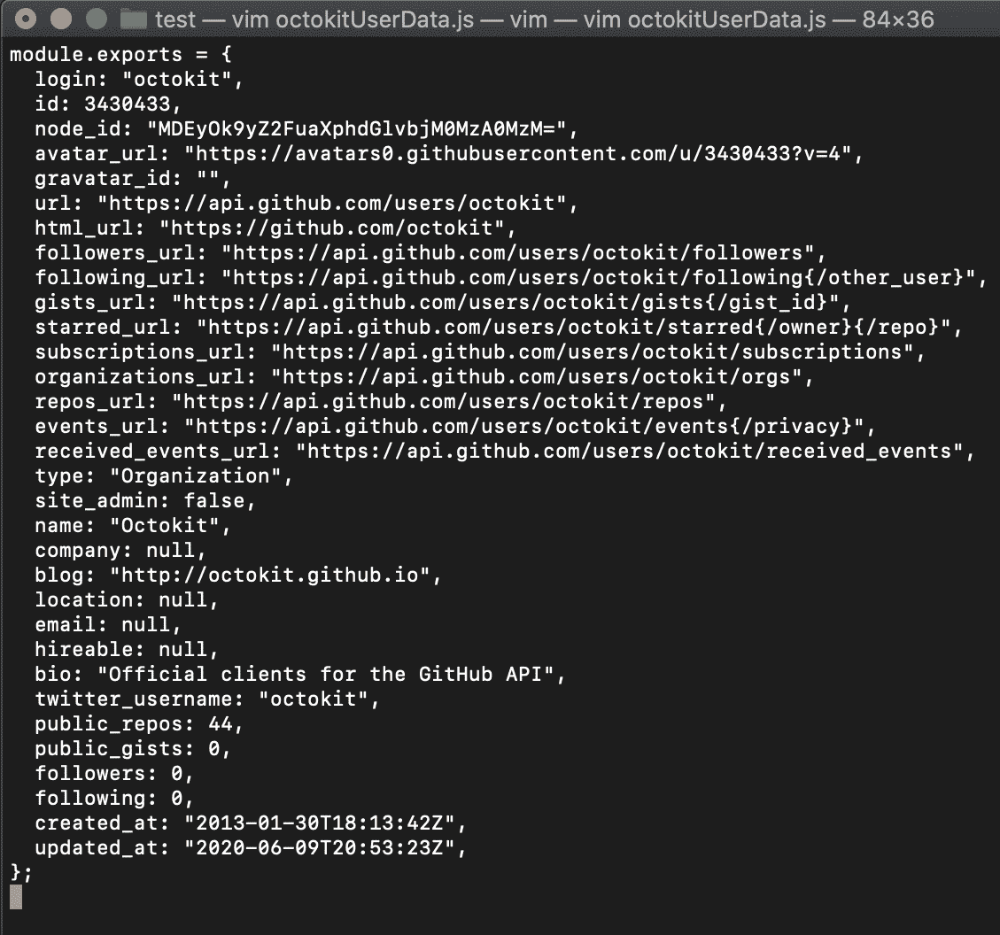
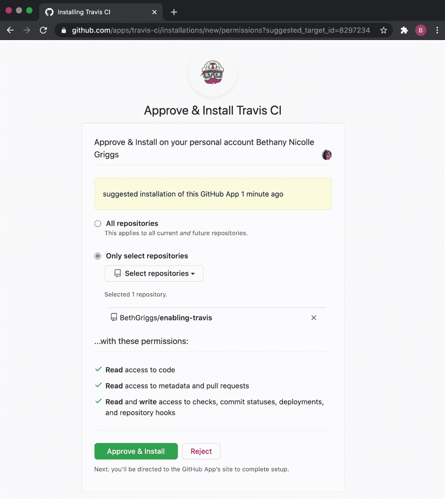
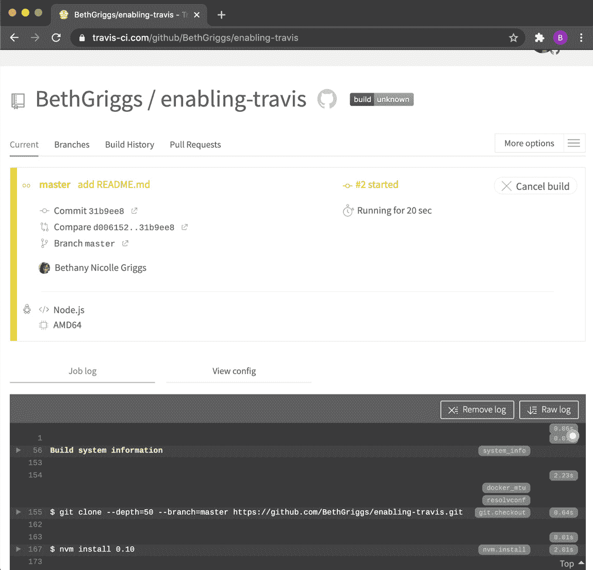
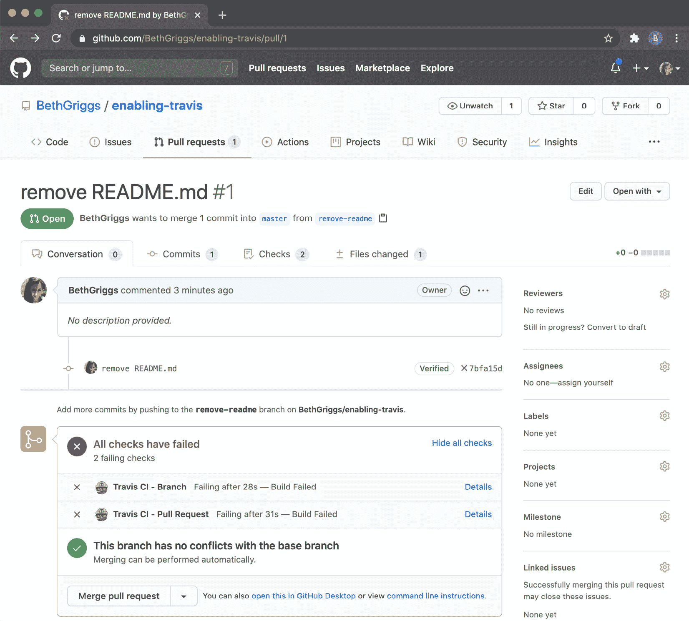

# 八、Node.js 测试

测试使您能够更快、更有效地识别代码中的错误。应该编写测试用例来验证每段代码是否产生了预期的输出或结果。测试可以作为程序逻辑的文档形式。

单元测试是一种特定类型的测试，其中测试单个组件或代码单元。小单元测试为您的程序提供了一个粒度规范来进行测试。确保单元测试覆盖了您的代码库，这有助于开发、调试和重构过程，因为它提供了一个您可以使用的质量基准度量。拥有一个全面的测试套件可以更快地识别 bug，这可以节省时间和金钱，因为 bug 发现得越早，修复的成本就越低。

本章将介绍几个单元测试框架。测试框架提供组件和实用程序，如用于运行自动化测试的测试运行程序。本章后面的方法将介绍其他测试概念，包括存根、用户界面测试以及如何配置持续集成测试。

本章将涵盖以下内容：

*   磁带测试
*   摩卡咖啡测试
*   开玩笑地测试
*   存根 HTTP 请求
*   使用木偶演员
*   配置连续集成测试

# 技术要求

本章假设您已安装 Node.js，最好是最新版本的 Node.js 14。您还需要访问自己选择的编辑器和浏览器。在整个配方中，我们将从 npm 注册表安装模块。

食谱的代码可在本书的 GitHub 存储库中找到（[https://github.com/PacktPublishing/Node.js-14-Cookbook `Chapter08`目录中的](https://github.com/PacktPublishing/Node.js-14-Cookbook)。

# 胶带测试

**Tape**是一个针对 Node.js 和浏览器的 TAP 生成测试库。Tape 是更轻量级的测试框架之一，通常用于实现单元测试。

TAP代表**测试任何东西协议**（[https://testanything.org/](https://testanything.org/) ）。TAP 是一种与语言无关的基于文本的协议，支持单元测试和测试线束之间的通信。最初是在 1987 年为 Perl 编程语言创建的，如今该协议被许多语言（包括 JavaScript）的测试库使用。TAP 为测试结果提供了一个简单且最小的视图。

在本食谱中，我们将学习如何使用`tape`测试库（[https://www.npmjs.com/package/tape](https://www.npmjs.com/package/tape) ）对我们的应用进行单元测试。

## 准备好了吗

1.  Let's first create a directory to work in and initialize our project directory:

    ```js
    $ mkdir testing-with-tape
    $ cd testing-with-tape
    $ npm init --yes
    ```

    我们需要一个可以测试的程序。我们将创建一个小型计算器程序，用于学习如何在配方中进行单元测试。

2.  创建一个名为`calculator.js`：

    ```js
    $ touch calculator.js
    ```

    的文件
3.  现在，我们可以在`calculator.js`中添加以下内容来创建我们的计算器程序：

    ```js
    module.exports.add = (number1, number2) => {
        return number1 + number2;
    };
    module.exports.subtract = (number1, number2) => {
        return number1 - number2;
    };
    module.exports.multiply = (number1, number2) => {
        return number1 * number2;
    };
    module.exports.divide = (number1, number2) => {
        return number1 / number2;
    };
    ```

现在我们已经设置了项目目录，并准备好了测试应用，我们可以继续进行配方步骤。

## 怎么做

在此配方中，我们将使用`tape`库为我们在*准备*部分中创建的计算器应用添加单元测试：

1.  第一步是从 npm 注册表安装`tape`模块。在终端中输入以下命令，确保您在`testing-with-tape`目录中：

    ```js
    $ npm install --save-dev tape
    ```

2.  现在，我们应该创建一个目录来保存测试文件。在这个文件夹中，我们还将创建一个名为`test.js`的文件，其中将包含我们的测试：

    ```js
    $ mkdir test
    $ touch test/test.js
    ```

3.  在`test.js`中，首先需要导入`tape`测试库：

    ```js
    const test = require("tape");
    ```

4.  接下来，我们可以导入我们的`calculator.js`程序：

    ```js
    const calculator = require("./../calculator.js");
    ```

5.  现在我们可以编写第一个测试用例了。我们将首先测试计算器的`add()`功能。我们的第一次测试将通过测试值`1`和`2`，并确认我们得到结果`3`：

    ```js
    test("test add integers 1 and 2", (t) => {
      t.plan(1);
      t.equal(calculator.add(1, 2), 3);
    });
    ```

6.  接下来，我们可以添加一个第二个测试。这一次，我们将把数字传递为`strings`而不是而不是`integers`。由于我们的`calculator.js`程序不包含将`string`输入转换为`integers`的逻辑，该测试预计会失败。在第一次测试下方添加以下内容：

    ```js
    test("test add strings 1 and 2", (t) => {
      t.plan(1);
      t.equal(calculator.add("1", "2"), 3);
    });
    ```

7.  现在，我们可以在终端窗口中输入以下命令来运行测试：

    ```js
    $ node test/test.js
    ```

8.  希望看到以下输出，指示第一个测试通过，第二个测试失败：



图 8.1–显示磁带测试摘要的终端窗口

我们已经学习了如何使用`tape`模块为我们的应用编写单元测试。我们已经执行了这些测试，并生成了测试结果的 TAP 摘要。

## 它是如何工作的

`tape`是一个 TAP 生成测试库，它提供了一个轻量级的测试接口，只需要最低限度的配置。在配方中，我们为计算器程序中的`add()`函数创建了两个测试用例。

为了能够调用我们的`calculator.js`中的函数，我们将`calculator.js`作为一个模块导入到我们的测试文件中，如下所示：

```js
const calculator = require("./../calculator.js");
```

在`calculator.js`中，我们通过`module.exports`公开了所有函数，这使我们能够从测试文件中调用函数。关于`module.exports`的更多信息，请参考[*第 5 章*](05.html#_idTextAnchor134)*开发 Node.js 模块*中的*实现您的模块*配方。

为了用`tape`创建一个测试用例定义，我们调用`test()`，传入一个测试名称和一个表示测试用例的函数。请注意，`tape`中的测试名称不是强制性的，但在解释测试结果时很有用。

在测试功能中，实现了测试用例的逻辑。我们的测试用例函数的第一行是`t.plan(1)`。`plan()`函数表示测试中应该运行多少断言。对于配方，我们在每个测试用例中只有一个断言。如果我们提供`t.plan(2)`，但只包含一个断言，我们的测试用例将挂起。即使测试没有完成预期数量的断言，也可以通过调用`t.end()`来强制完成测试用例。

我们使用`t.equal()`作为断言逻辑。我们给这个函数传递两个参数。第一个是返回的实际值。在我们的例子中，这是我们对`calculator.js`公开的`add()`函数的调用返回的值。第二个值是预期的测试结果。

`tape`提供了多种断言方法，详见下表：



图 8.2–列出磁带断言方法的表格

`tape`测试库的一个独特而诱人的特性是，可以使用 Node.js 进程执行测试，而其他测试库需要特定的测试工具来运行测试用例。

我们的测试用例是在调用`$ node test/test.js`时执行的。注意，也可以使用`tape`模块使用以下命令运行测试用例：

```js
$ npx tape tests/test.js
```

当测试执行时，测试结果以 TAP 格式输出到 STDOUT。在抽头输出中，**ok**表示测试通过，**not ok**表示测试失败。当测试用例失败时，输出相应的错误。

## 另见

*   本章中的摩卡配方*测试*
*   本章中的*测试与 Jest*配方
*   本章中的*配置持续集成测试*配方
*   在[*第五章*](05.html#_idTextAnchor134)*开发 Node.js 模块*中*实现您的模块*配方

# 摩卡咖啡测试

Mocha 是一个流行的开源 JavaScript 测试框架，适用于 Node.js 和浏览器。摩卡咖啡有很多特点。

在这个配方中，我们将使用 Mocha 为一个简单的计算器程序编写测试用例。

## 准备好了吗

1.  让我们首先创建一个目录来工作并初始化我们的项目目录：

    ```js
    $ mkdir testing-with-mocha
    $ cd testing-with-mocha
    $ npm init --yes
    ```

2.  我们需要一个可以测试的程序。我们将创建一个小型计算器程序，用于学习如何使用 Mocha 进行单元测试。创建一个名为`calculator.js`：

    ```js
    $ touch calculator.js
    ```

    的文件
3.  现在，我们可以为我们的计算器程序`calculator.js`添加以下内容：

    ```js
    module.exports.add = (number1, number2) => {
        return number1 + number2;
    };
    module.exports.subtract = (number1, number2) => {
        return number1 - number2;
    };
    module.exports.multiply = (number1, number2) => {
        return number1 * number2;
    };
    module.exports.divide = (number1, number2) => {
        return number1 / number2;
    };
    ```

现在，我们已经设置了项目目录并准备好了一个应用进行测试，我们可以继续进行配方步骤。

## 怎么做

在本食谱中，我们将学习如何使用 Mocha 的`describe()`和`it()`语法为我们的`calculator.js`程序编写一些单元测试：

1.  首先，我们需要将`mocha`作为开发依赖项安装：

    ```js
    $ npm install --save-dev mocha
    ```

2.  Mocha 没有绑定断言框架，因此我们还将安装 Chai 断言库：

    ```js
    $ npm install --save-dev chai
    ```

3.  接下来，我们将创建一个包含名为`test.js`：

    ```js
    $ mkdir test
    $ touch test/test.js
    ```

    的文件的`test`目录
4.  在我们的`test.js`文件中，我们需要导入`chai`断言库：

    ```js
    const assert = require("chai").assert;
    ```

5.  接下来，在`test.js`中，我们需要导入我们的`calculator.js`模块：

    ```js
    const calculator = require("../calculator.js");
    ```

6.  现在我们可以定义我们的第一个摩卡`describe()`块，它将包含多个测试。将以下内容添加到`test.js`：

    ```js
    describe("Calculator Test", () => {
    });
    ```

7.  现在，在`"Calculator Test"`定义中，我们可以添加一个嵌套的`describe()`来测试`calculator.js`中的`add()`函数。嵌套的`describe()`定义允许对测试用例进行逻辑分组。在`"Calculator Test"`回调函数中添加以下内容：

    ```js
      describe("add() Test", () => {

      });
    ```

8.  接下来，我们可以为`add()`函数编写一个测试用例。为此，我们使用 Mocha`it()` 语法。我们的测试用例将使用 Chai 断言库来验证当我们通过`add()`函数时，数字`1`、`2`和`3`将按预期返回。在`"add() Test"``describe()`块中添加以下内容：

    ```js
        it("add(1,2) should return 3", () => {
          assert.equal(calculator.add(1, 2), 3);
        });
    ```

9.  我们可以在`"add() Test"``describe()`块中添加第二个测试。这次我们将尝试将两个数字作为`strings`传递给`add()`函数。通过在`"add() Test"``describe()`块中添加以下内容来添加第二个测试用例：

    ```js
        it("add('1','2') should return 3", () => {
          assert.equal(calculator.add("1", "2"), 3);
        });
    ```

10.  我们现在准备好运行测试了。我们可以通过从终端窗口

    ```js
    $ ./node_modules/mocha/bin/mocha
    ```

    执行`node_modules`目录中的摩卡二进制文件来实现这一点
11.  希望在终端中看到以下输出，指示第一个测试通过，第二个测试失败。我们还可以看到 Mocha 如何嵌套我们的测试用例：

    ```js
      Calculator Test
        add() Test
            add(1,2) should return 3
          1) add('1','2') should return 3
      1 passing (5ms)
      1 failing
      1) Calculator Test
           add() Test
             add('1','2') should return 3:
         AssertionError: expected '12' to equal 3
          at Context.<anonymous> (test/test.js:11:14)
          at processImmediate (internal/timers.js:456:21)
    ```

12.  现在，我们将为我们的测试添加一个`npm test`脚本。这是 Node.js应用中的常见做法。将`package.json`文件中的测试脚本更改为`./node_modules/mocha/bin/mocha`。您的`package.json`文件应如下所示：

    ```js
    {
      "name": "testing-with-mocha",
      "version": "1.0.0",
      "description": "",
      "main": "index.js",
      "scripts": {
        "test": "./node_modules/mocha/bin/mocha"
      },
      "keywords": [],
      "author": "",
      "license": "ISC",
      "devDependencies": {
        "chai": "^4.2.0",
        "mocha": "^8.0.1"
      }
    }
    ```

13.  现在您应该能够在终端窗口中运行`$ npm test`来使用摩卡执行测试：



图 8.3–显示摩卡咖啡测试结果摘要的终端

## 它是如何工作的

我们的`test.js`文件的第一行导入了 Chai 断言库。Mocha 没有捆绑断言库来提供使用断言库的灵活性，但它通常与 Chai 一起使用。npm 注册表上有多个可选的断言库。另一种选择是使用 core Node.js`assert`模块（[https://nodejs.org/api/assert.html](https://nodejs.org/api/assert.html) ）。

为了能够调用我们的`calculator.js`文件中的函数，我们将`calculator.js`作为一个模块导入到我们的测试文件中。

我们使用 Mocha`describe()`和`it()`语法组织测试。`describe()`用于定义一组测试。`describe()`方法采用两个参数。第一个是测试的名称，它应该尽可能清楚并代表测试用例。第二个参数是回调函数，它可以包含测试用例或嵌套的`describe()`块。

`it()`语法是创建一个测试用例；它代表个人测试。`it()`方法也接受两个参数。第一个是测试名，第二个是包含测试逻辑的回调函数。

在我们的测试用例中，我们使用 Chai 进行断言。我们导入了 Chai 的`assert`风格断言来测试我们的`add()`函数。我们使用`equal()`断言方法将实际值与预期值相等。`equal()`只是众多可用的断言方法之一–Chai 的 API参考提供了完整的列表（[https://www.chaijs.com/api/assert/](https://www.chaijs.com/api/assert/) ）。

Chai 还提供了其他断言样式。下面的代码片段描述了如何在 Chai**Assert**、**Expect**和**Should**样式中编写相同的断言逻辑：

```js
const assert = require("chai").assert;
const expect = require("chai").expect;
require("chai").should();
const calculator = require("../calculator.js");
describe("Calculator Test", () => {
  describe("add() Test", () => {
    it("add(1,2) should return 3", () => {
      // assert form
      assert.equal(calculator.add(1, 2), 3);
      // expect form
      expect(calculator.add(1, 2)).to.equal(3);
      // should form
      calculator.add(1, 2).should.equal(3);
    });
  });
});
```

注意，我们需要导入我们希望使用的断言样式（`require("chai").assert`或`require("chai").expect`。要使用 Should 表单，我们需要调用 Chai`should()`方法。`should()`方法将每个对象扩展为具有`should`属性，然后可以使用该属性构建断言链，如`value.should.equal(3)`。

为了运行我们的测试用例，我们调用`mocha`可执行文件，它位于我们的`node_modules`目录中。Mocha 可执行文件运行测试。摩卡会自动查找名为`test`的目录。测试运行程序执行我们的测试，然后生成测试结果的输出摘要。测试结果以与我们的`describe()`和`it()`定义相同的结构输出。

Mocha 支持替代报告器，这意味着您可以更改测试结果摘要的输出方式。其中一个选项是以 TAP 格式输出测试结果。摩卡在其网站（[上定义了受支持的记者的完整名单 https://mochajs.org/#reporters](https://mochajs.org/#reporters) 。

## 还有更多

Mocha 提供了一种称为测试挂钩的功能。提供以下四个测试挂钩：

*   `before()`：在`describe()`块第一次测试前运行一次
*   `after()`：在`describe()`块的最后一次测试后运行一次
*   `beforeEach()`：在`describe()`块中每次测试前运行
*   `afterEach()`：在`describe()`块中的每次测试后运行

每个函数都接受一个函数作为参数。`before()`和`beforeEach()`函数应包含测试用例的设置或先决条件，而`after()`和`afterEach()`函数通常用于测试清理。

## 另见

*   本章中的*磁带测试*配方
*   本章中的*测试与 Jest*配方
*   本章中的*配置持续集成测试*配方
*   在[*第五章*](05.html#_idTextAnchor134)*开发 Node.js 模块*中*实现您的模块*配方

# 开玩笑测试

Jest 是 Facebook 开发的开源 JavaScript 测试框架。它通常用于测试React 代码，但也可用于测试 Node.js 应用。Jest 提供了与 Mocha 类似的测试接口，但 Jest 更固执己见，捆绑了更多功能，如内置断言机制。

在这个食谱中，我们将学习如何用 Jest 编写和构造测试，以及如何报告测试覆盖率。

## 准备好了吗

我们将使用 Jest 测试将任何字符串输入转换为大写的程序：

1.  首先，让我们创建并初始化项目目录：

    ```js
    $ mkdir testing-with-jest
    $ cd testing-with-jest
    $ npm init --yes
    ```

2.  我们需要一个程序来测试。创建一个名为`uppercase.js`：

    ```js
    $ touch uppercase.js
    ```

    的文件
3.  将以下代码添加到`uppercase.js`：

    ```js
    module.exports = (string) => {
      return string.toUpperCase();
    };
    ```

4.  我们还需要创建一个名为`test`的目录来保存测试。在`test`目录中，我们还将创建一个名为`test.js`：

    ```js
    $ mkdir test
    $ touch test/test.js
    ```

    的测试文件

现在我们已经初始化了目录和文件，我们准备继续进行配方步骤。

## 怎么做

在本食谱中，我们将学习如何使用 Jest 编写和构造测试：

1.  首先，我们需要安装 Jest 作为开发依赖项：

    ```js
    $ npm install --save-dev jest 
    ```

2.  我们还将在`package.json`文件中更新我们的 npm 测试脚本，以调用`jest`测试运行程序。将`"test"`脚本字段更改为以下内容：

    ```js
      "scripts": {
        "test": "jest"
      }
    ```

3.  在`test.js`中，我们首先需要导入我们的`uppercase.js`模块，以便我们能够对其进行测试。在`test.js`顶部添加以下行：

    ```js
    const uppercase = require("./../uppercase");
    ```

4.  添加一个笑话`describe()`块。Jest`describe()`块用于分组和组织我们的测试。将以下内容添加到`test.js`：

    ```js
    describe("uppercase", () => {
    });
    ```

5.  在`describe()`块中，我们可以添加我们的测试用例。我们使用 Jest 的`test()`语法来定义一个单独的测试。我们的测试将使用 Jest 的断言语法来验证当我们使用字符串`"hello"`调用`uppercase.js`模块时，它是否返回`"HELLO"`。在`describe()`块中添加以下代码以创建测试用例：

    ```js
      test("uppercase hello returns HELLO", () => {
        expect(uppercase("hello")).toBe("HELLO");
      });
    ```

6.  现在我们可以运行我们的测试了。我们可以在终端中输入命令`npm test`来运行测试。Jest 将打印我们的测试结果摘要：

    ```js
    $ npm test
    > testing-with-jest@1.0.0 test /Users/bethgriggs/Node-Cookbook/Chapter08/testing-with-jest
    > jest
     PASS  test/test.js
      uppercase
         uppercase hello returns HELLO (1 ms)
    Test Suites: 1 passed, 1 total
    Tests:       1 passed, 1 total
    Snapshots:   0 total
    Time:        0.938 s, estimated 1 s
    Ran all test suites.
    ```

7.  Jest 提供了一个内置的代码覆盖特性。运行此命令将向我们显示测试用例涵盖了程序的哪些行。您可以通过将`--coverage`标志传递给 Jest 可执行文件来启用覆盖率报告。在终端中输入以下命令，以引用已安装的 Jest 可执行文件并报告代码覆盖率：

    ```js
    $ ./node_modules/jest/bin/jest.js --coverage
    ```

8.  希望看到以下输出，这表明我们的代码 100%被测试用例覆盖：



图 8.4–显示 Jest 代码覆盖率报告的终端窗口

我们现在使用 Jest 为`uppercase.js`模块创建了一个测试。我们还学习了如何报告代码覆盖率。

## 它是如何工作的

我们的`test.js`文件的第一行导入了我们的`uppercase.js`模块，允许我们在测试时调用它。

我们使用 Jest 的`describe()`和`test()`函数组织测试。与摩卡咖啡一样，`describe()`用于定义一系列测试。`describe()`方法采用两个参数。第一个参数是测试组的名称，第二个参数是回调函数，它可以包含测试用例或嵌套的`describe()`块。

Jest 的`test()`语法用于定义测试用例。`test()`方法接受两个参数。第一个是测试名，第二个是包含测试逻辑的回调函数。

这个程序的测试逻辑只有一行，它断言当我们调用`uppercase("hello")`时，**HELLO**值按预期返回。断言使用 Jest 的绑定断言库`Expect`（[https://www.npmjs.com/package/expect](https://www.npmjs.com/package/expect) 。我们使用了来自`Expect`库的`toBe()`断言来等同于这两个值。

`Expect`公开了很多断言方法，包括`toBe()`、`toContain()`、`toThrow()`等。完整的断言列表在 Jest API 文档的`Expect`部分中定义：[https://jestjs.io/docs/en/expect.html#methods](https://jestjs.io/docs/en/expect.html#methods) 。也可以通过在语句中添加`.not`来颠倒断言，例如：

```js
  expect(uppercase("hello")).not.toBe("hello");
```

为了运行我们的测试用例，我们调用`jest`测试运行程序，它位于我们的`node_modules`目录中。Jest 可执行文件运行测试，自动查找名为`test`的目录。运行程序执行我们的测试，然后生成结果的输出摘要。

在配方的最后一步中，我们启用了 Jest 的代码覆盖率报告。代码覆盖率是衡量在执行测试时，程序代码的行数。100%的代码覆盖率意味着测试套件覆盖了程序的每一行。这有助于您轻松检测由代码更改引入的 bug。一些开发人员和组织为代码覆盖率设置了可接受的阈值，并设置了相应的限制，以便无法回归代码覆盖率百分比。

## 还有更多

Jest 提供了比其他一些测试库更多的现成特性。让我们来看看其中的几个。

### 安装和拆卸

与摩卡一样，Jest为测试提供设置和拆卸功能。可分别使用`beforeEach()`和`beforeAll()`功能在每次或所有测试之前运行设置步骤。类似地，拆卸步骤可以在分别使用`afterEach()`和`afterAll()`功能的每个或所有测试之后运行。

以下伪代码演示了如何使用这些函数：

```js
describe("test", () => {
  beforeAll(() => {
    // Runs once before all tests
  });
  beforeEach(() => {
    // Runs before each test
  });
  afterEach(() => {
    // Runs after each test
  });
  afterAll(() => {
    // Runs after all tests
  });
});
```

### 戏谑

mock 使您能够测试代码或函数的交互，而无需执行代码。mock 通常用于您的测试依赖于第三方服务或 API，并且您不希望在运行测试套件时向这些服务发送实际请求的情况。模拟有很多好处，包括更快地执行测试套件，并确保您的测试不会受到网络条件的影响。

Jest 提供了开箱即用的模拟功能。我们可以使用 mock 来验证我们的函数是否使用了正确的参数调用，而无需实际执行该函数。

例如，我们可以将测试从配方更改为使用以下代码模拟`uppercase()`模块：

```js
describe("uppercase", () => {
  test("uppercase hello returns HELLO", () => {
    uppercase = jest.fn(() => "HELLO");
    const result = uppercase("hello");
    expect(uppercase).toHaveBeenCalledWith("hello");
    expect(result).toBe("HELLO");
  });
});
```

`jest.fn(() => "HELLO");`返回一个新的模拟函数。我们将其分配给一个名为`uppercase`的变量。该参数是一个返回字符串`"HELLO"`的回调函数–这是为了演示如何模拟函数的返回值。

我们使用`Expect`方法`.toHaveBeenCalled()`来验证使用正确的参数调用了我们的模拟函数。如果由于某种原因无法在测试套件中执行函数，则可以使用 mock 验证是否使用正确的参数调用该函数。

## 另见

*   本章中的*磁带测试*配方
*   本章中的摩卡配方*测试*
*   本章中的*配置持续集成测试*配方
*   在[*第五章*](05.html#_idTextAnchor134)*开发 Node.js 模块*中*实现您的模块*配方

# 存根 HTTP 请求

您正在构建的 Node.js 应用通常依赖并使用外部服务或 API。进行单元测试时，通常不希望测试向外部服务发送请求。对您正在使用的外部服务的请求可以进行计量或速率限制，并且您不希望您的测试用例使用任何余量。

您的测试也可能需要访问服务凭据。这意味着项目中的每个开发人员在运行测试套件之前都需要访问这些凭据。

为了能够在不向外部服务发送请求的情况下对代码进行单元测试，您可以伪造请求和响应。这就是所谓的存根概念。stubing可用于模拟 API 调用，而无需实际发送请求。stubing 还具有减少任何请求延迟的额外好处，这可能会使测试运行得比发送实际请求更快。在配方中，我们将使用 Sinon.JS，这是一个提供存根功能的库。

## 准备好了吗

1.  让我们首先创建一个目录来工作并初始化我们的项目目录：

    ```js
    $ mkdir stubbing-http-requests
    $ cd stubbing-http-requests
    $ npm init --yes
    ```

2.  现在，我们将创建一个向第三方服务发送请求的程序。创建一个名为`github.js`的文件。我们还需要安装`node-fetch`模块，用于发送 HTTP 请求：

    ```js
    $ touch github.js
    $ npm install node-fetch
    ```

3.  在我们的`github.js`文件中，我们将向[发送一个 HTTP GET 请求 https://api.github.com/users/](https://api.github.com/users/) 终点。将以下内容添加到`github.js`：

    ```js
    const fetch = require("node-fetch");
    module.exports.getGitHubUser = (username) => {
      return fetch("https://api.github.com/users/" + 	username)
        .then((res) => res.json())
        .then((json) => {
          return json;
        });
    };
    ```

现在我们有了一个向 GitHub API 发送 HTTP 请求的程序，我们可以继续进行配方步骤，在这里我们将学习如何存根请求。

## 怎么做

在这个配方中，我们将学习如何在测试中存根 HTTP 请求。但我们首先需要创建一个测试用例：

1.  创建一个名为`test`的目录，其中包含一个名为`tests.js`的文件。我们还将安装`tape`测试库：

    ```js
    $ mkdir test
    $ touch test/tests.js
    $ npm install tape
    ```

2.  将以下内容添加到`tests.js`中，以使用`tape`为`getGithubUser()`函数创建一个测试用例。这将向 GitHub API 发送一个实际请求：

    ```js
    const test = require("tape");
    const github = require("../github.js");
    test("Get GitHub user by username", async (t) => {
      t.plan(3);
      const githubUser = await github.	getGitHubUser("octokit");
      t.equal(githubUser.id, 3430433);
      t.equal(githubUser.login, "octokit");
      t.equal(githubUser.name, "Octokit");
    });
    ```

3.  我们可以运行测试来检查它是否通过：

    ```js
    $ node test/test.js
    TAP version 13
    # Get GitHub user by username
    ok 1 should be strictly equal
    ok 2 should be strictly equal
    ok 3 should be strictly equal
    1..3
    # tests 3
    # pass  3
    # ok
    ```

4.  现在我们可以继续讨论存根了。我们首先需要将`sinon`作为开发依赖项安装：

    ```js
    $ npm install --save-dev sinon
    ```

5.  然后在`test.js`中，我们需要导入`sinon`。在导入`tape`模块的行下方添加以下内容：

    ```js
    const sinon = require("sinon");
    ```

6.  为了能够存根请求，我们需要将实际请求的输出存储到 GitHub API。在`test`目录

    ```js
    $ touch test/octokitUserData.js
    ```

    中创建一个名为`octokitUserData.js`的文件
7.  Within `octokitUserData.js`, we'll export the data from a real request to [https://api.github.com/users/octokit](https://api.github.com/users/octokit). You can do this by starting the file with `module.exports =` and then pasting the response from [https://api.github.com/users/octokit](https://api.github.com/users/octokit). You should expect your `octokitUserData.js` file to contain the following:

    

    图 8.5–octokitUserData.js 的预期源代码

8.  现在，回到我们的测试文件中，我们需要导入`octokitUserData.js`。为此，在导入`github.js`文件的下方添加以下行：

    ```js
    const octokitUserData = require("./octokitUserData.js");
    ```

9.  要使用`sinon`存根请求，我们只需要在`t.plan(3)`之后添加以下行：

    ```js
      sinon.stub(github, "getGitHubUser").	returns(octokitUserData);
    ```

10.  您的完整`test.js`文件现在应该如下所示：

    ```js
    const test = require("tape");
    const sinon = require("sinon");
    const github = require("../github.js");
    const octokitUserData = require("./octokitUserData.js");
    test("Get GitHub user by username", async (t) => {
      t.plan(3);
      sinon.stub(github, "getGitHubUser").	returns(octokitUserData);

      const githubUser = await github.	getGitHubUser("octokit");
      t.equal(githubUser.id, 3430433);
      t.equal(githubUser.login, "octokit");
      t.equal(githubUser.name, "Octokit");
    });
    ```

11.  让我们重新运行测试，检查它们是否仍然通过，因为我们正在模拟请求：

    ```js
    $ node test/test.js
    TAP version 13
    # Get GitHub user by username
    ok 1 should be strictly equal
    ok 2 should be strictly equal
    ok 3 should be strictly equal
    1..3
    # tests 3
    # pass  3
    # ok
    ```

12.  通过将 wait`github.getGitHubUser("octokit")`更改为您自己的用户名，可以确认测试被模拟。如果你重新运行测试，你会发现它们仍然通过——因为返回的数据来自`octokitUserData.js`文件。

我们现在已经了解了如何使用 Sinon.JS 存根 API 请求。

## 它是如何工作的

在配方中，我们使用 Sinon.JS 来存根对 GitHub API 的请求。截留这个请求意味着我们可以避免使用我们的 API 请求余量，并通过消除网络延迟来加快测试套件的速度。

我们的存根将来自 GithubAPI 的真实响应替换为固定响应。固定响应应始终表示真实响应的外观。

在我们的测试用例中，我们调用以下行来覆盖我们的`getGitHubUser()`函数：

```js
  sinon.stub(github, "getGitHubUser").returns(octokitUserData);
```

`stub()`方法指示 Sinon.JS 创建匿名存根函数。我们向`stub()`方法传递了两个参数，即我们希望存根的对象和方法。在我们的例子中，我们想要存根`github.getGitHubUser()`。

然后我们称之为`returns`方法。`returns`方法指示 Sinon.JS 以提供的值作为参数进行响应。在我们的例子中，它用我们从`octokitUserData.js`导入的`Octokit`用户的静态响应进行响应。

当我们稍后在文件中调用`github.getGitHubUser()`函数时，Sinon.JS 将覆盖它并返回存根值。

该配方演示了如何存根单个方法，但在使用微服务体系结构时，可能需要将其完全存根。

## 另见

*   本章中的*测试与 Jest*配方
*   本章中的*配置持续集成测试*配方

# 使用木偶演员

**用户界面**（**UI**测试是一种技术，用于识别**图形用户界面**（**GUI**的问题。该技术通常用于测试 web 应用接口。

例如，如果您有一个包含 HTML 表单的应用，您可以使用 UI 测试来验证 HTML 表单是否包含正确的输入字段集。UI 测试还可以验证与界面的交互，包括模拟按钮或超链接单击。

Puppeter 是一个开源库，可用于自动化 UI 测试。Puppeter 提供了一个无头 Chromium 实例，可以通过编程与之交互。

在配方中，我们将使用 Puppeter 对网站[进行 UI 测试 http://example.com/](http://example.com/) 。

## 准备好了吗

1.  首先，我们需要创建一个目录并初始化我们的项目目录：

    ```js
    $ mkdir using-puppeteer 
    $ cd using-puppeteer
    $ npm init --yes
    ```

2.  接下来，我们将创建一个目录来保存测试文件。在目录中，我们还将创建我们的 UI 测试文件：

    ```js
    $ mkdir test
    $ touch test/test.js
    ```

既然我们已经初始化了项目目录，我们就可以继续进行配方步骤了。

## 怎么做

在本食谱中，我们将学习如何使用木偶师测试网页。我们将验证是否从`https://example.com`收到预期内容。我们将使用 Node.js core`assert`库进行断言逻辑：

1.  The first step is to install the `puppeteer` module. We'll install the `puppeteer` module as a development dependency as it'll only be used for testing:

    ```js
    $ npm install --save-dev puppeteer
    ```

    请注意，下载 Chromium headless browser 可能需要很长时间。

2.  接下来，我们将打开`test.js`并添加以下行来导入`assert`和`puppeteer`模块：

    ```js
    const assert = require("assert");
    const puppeteer = require("puppeteer");
    ```

3.  接下来，我们将创建一个名为`runTest()`的异步函数，它将保存我们所有的测试逻辑：

    ```js
    async function runTest() {
    }
    ```

4.  在`runTest()`功能中，我们需要启动木偶演员。通过添加以下行来完成此操作，该行调用木偶演员的`launch()`函数：

    ```js
      const browser = await puppeteer.launch();
    ```

5.  接下来，同样在`runTest()`函数中，我们需要创建一个新的木偶浏览器页面：

    ```js
      const page = await browser.newPage();
    ```

6.  我们现在可以指示木偶演员加载 URL。我们通过调用`page`对象上的`goto()`函数来实现这一点：

    ```js
      await page.goto("https://example.com");
    ```

7.  现在我们已经有了网页的句柄（[https://example.com](https://example.com) ），我们可以通过调用 Puppeter 的`$eval()`函数从网页中提取值。我们将`"h1"`标记传递给`$eval()`函数，表示我们要抽象`h1`元素和回调函数。回调函数将返回`h1`元素的`innerText`值。添加以下行以提取`h1`值：

    ```js
      const title = await page.$eval("h1", (el) => 	el.innerText);
    ```

8.  现在，我们可以添加我们的断言。我们希望标题是`"Example Domain"`。添加以下断言语句。我们还将添加一个`console.log()`语句来输出值——在实际测试用例中通常不会这样做，但它将帮助我们了解发生了什么：

    ```js
      console.log("Title value:", title);
      assert.equal(title, "Example Domain");
    ```

9.  我们需要调用`browser.close()`，否则 Puppeter 将继续模拟，Node.js 进程将永远不会退出。在`runTest()`功能中，添加以下行：

    ```js
      browser.close();
    ```

10.  最后，我们只需要调用`runTest()`函数。在`test.js`底部`runTest()`功能之外添加以下内容：

    ```js
     runTest();
    ```

11.  我们现在准备好运行测试了。在终端中输入以下命令以运行测试：

    ```js
    $ node test/test.js
    Title value: Example Domain
    ```

我们现在已经使用 Puppeter 创建了第一个用户界面测试。

## 它是如何工作的

在配方中，我们使用 Puppeter 创建了一个测试来验证网页[https://example.com](https://example.com) 返回`h1`HTML 元素标记中的标题`"Example Domain"`。大多数 Puppeter API 都是异步的，因此我们在整个配方中使用了`async/await`语法。

当我们调用`puppeteer.launch()`时，Puppeter 初始化了一个新的无头 Chrome 实例，我们可以通过 JavaScript 与之交互。由于使用 Puppeter 进行测试的开销相当于无头 Chrome 实例，因此使用它进行测试的性能可能不如其他类型的测试。然而，由于 Puppeter 在幕后与 Chrome 交互，它提供了一个非常接近的模拟最终用户如何与 web 应用交互。

一旦 Puppeter 启动，我们通过调用`browser`对象上的`newPage()`方法初始化`page`对象。`page`对象用于表示网页。在`page`对象上，我们随后调用`goto()`方法，该方法用于告诉木偶演员应该为该对象加载哪个 URL。

在`page`对象上调用`$eval()`方法，从网页中提取值。在配方中，我们通过了`$eval()`方法`h1`作为第一个参数。这将指示 Puppeter 识别并提取 HTML`<h1>`元素。第二个参数是回调函数，它提取`<h1>`元素的`innerText`值。对于[http://example.com](http://example.com) ，提取`"Example Domain"`值。

在`runTest()`函数的末尾，我们调用`browser.close()`方法来指示木偶演员结束 Chrome仿真。这是必要的，因为 Puppeter 将继续模拟 Chrome，Node.js 进程永远不会退出。

## 还有更多

也可以在无头模式下运行木偶演员。您可以通过向`launch()`方法传递一个参数来完成此操作：

```js
   const browser = await puppeteer.launch({
        headless: false
    });
```

在此模式下，当您运行测试时，您将看到 Chromium UI，并且可以在测试执行时跟踪测试。这在调试木偶测试时特别有用。

## 另见

*   本章中的*测试与 Jest*配方
*   本章中的*配置持续集成测试*配方

# 配置持续集成测试

**持续****集成**（**CI**）是开发人员定期将代码合并到源代码库的一种开发实践。为了保持源代码的完整性，通常会在接受每个代码更改之前运行自动测试。

GitHub 是使用最广泛的源代码存储库主机之一。使用 GitHub，当您希望将更改合并到主 Git 分支或存储库中时，您将打开一个**Pull 请求**（**PR**。GitHub 使您能够配置应在每个 PR 上运行的检查。要求 PR 在被接受之前通过应用或模块的单元测试，这是一种常见且良好的做法。

有许多 CI 产品可以支持执行单元测试。其中最受欢迎的是 Travis CI（[https://travis-ci.org/](https://travis-ci.org/) ）。但其他包括 GitHub 操作（[https://github.com/features/actions](https://github.com/features/actions) 和圆圈 CI（[https://circleci.com/](https://circleci.com/) ）。这些项目中的大多数都为临时开发者提供有限的免费服务，并为企业和企业提供付费商业计划。

在这个配方中，我们将学习如何配置 Travis CI 来运行 Node.js 测试。

## 准备好了吗

对于此配方，您需要一个 GitHub 帐户。如果您不熟悉 Git 和 GitHub，请参考[*第 5 章*](05.html#_idTextAnchor134)*开发 Node.js 模块*中的*设置您自己的模块*配方。

为了能够配置 Travis CI 来运行单元测试，我们首先需要创建一个 GitHub 存储库和一些示例单元测试：

1.  通过[创建新的 GitHub 存储库 https://github.com/new](https://github.com/new) 。将新存储库命名为`enabling-travis`。另外，通过下拉菜单添加节点`.gitignore`模板。
2.  使用以下命令克隆您的 GitHub 存储库，将`<username>`替换为您的 GitHub 用户名：

    ```js
    $ git clone https://github.com/<username>/enabling-travis.git
    ```

3.  我们现在需要用`npm`初始化我们的项目，并安装`tape`测试库：

    ```js
    $ cd enabling-travis
    $ npm init --yes
    $ npm install --save-dev tape
    ```

4.  我们还需要创建一个测试。创建一个名为`test.js`：

    ```js
    $ touch test.js
    ```

    的文件
5.  将以下内容添加到`test.js`以创建我们的单元测试：

    ```js
    const test = require("tape");
    test("test integer addition", (t) => {
      t.plan(1);
      t.equal(1 + 1, 2);
    });
    test("test string addition", (t) => {
      t.plan(1);
      // Expected to fail
      t.equal("1" + "1", 2);
    });
    ```

现在我们已经初始化了项目和一些单元测试，我们可以继续配置 Travis CI 了。

## 怎么做

在这个配方中，我们将学习如何配置 CI，以便在将新更改推送到 GitHub 存储库时运行单元测试：

1.  我们首先需要注册 Travis CI。您可以使用您的 GitHub 帐户[注册 Travis CIhttps://travis-ci.org/](https://travis-ci.org/) 。
2.  接下来，我们需要更新`package.json`文件中的`npm test`脚本以运行单元测试。将`npm test`脚本更改为以下内容：

    ```js
      "scripts": {
        "test": "node test.js"
      }
    ```

3.  接下来，我们将创建一个`.travis.yml`文件。此文件用于配置 Travis CI:

    ```js
    $ touch .travis.yml
    ```

4.  将以下内容添加到`.travis.yml`文件中。这将指示 Travis CI 使用 Node.js 14 运行我们的测试。请注意，YAML 文件对空格和缩进敏感：

    ```js
    language: node_js
    node_js:
      - 14
    ```

5.  我们现在准备好提交代码了。在终端中输入以下内容以提交代码：

    ```js
    $ git add .travis.yml package*.json test.js 
    $ git commit -m "unit tests and travis config"
    $ git push origin master
    ```

6.  Navigate to `https://github.com/<username>/enabling-travis` in your browser and confirm your code has been pushed to the repository. Expect it to look like the following:

    

    图 8.6–GitHub UI 显示了启用 travis 存储库中的代码

7.  Navigate to [https://travis-ci.com/](https://travis-ci.com/). Access the Travis CI settings via the navigation bar in the top-right corner, which is indicated by your profile picture. Click **Activate** to enable the Travis CI GitHub Application integration. This should open the following interface:

    

    图 8.7–Travis CI 启用集成界面

8.  现在，只需在`<username>/enabling-travis`存储库上启用 Travis GitHub 应用集成。然后点击**审批&安装**。
9.  默认情况下，Travis CI 配置为在提交推送到任何分支时执行构建。我们将推送一个提交，添加一个空白的`README.md`文件来触发构建。通过在我们的终端中输入以下命令来执行：

    ```js
    $ touch README.md
    $ git add README.md
    $ git commit --message "add README"
    $ git push origin master
    ```

10.  This will cause a Travis CI build to be triggered. Navigate to `https://travis-ci.com/github/<username>/enabling-travis` and expect to see that the build has been triggered. If the build is still in progress, you'll see the following output:

    

    图 8.8–正在进行的 Travis CI 构建

11.  Once the test run has completed, Travis CI will indicate that the build is failing. This is intentional, as we purposely created a test case that is expected to fail. The following output will be shown indicating that the build has failed:

    

    图 8.9–失败的 Travis CI 构建摘要

12.  当您向下滚动**作业日志**时，我们将看到测试运行的输出：


图 8.10–Travis CI 构建作业日志

我们已经在 GitHub 存储库中成功启用了 Travis CI。

## 它是如何工作的

配方包括如何在 GitHub 存储库上启用 Travis CI，以及如何配置 Travis CI 以在将新更改推送到主分支时运行测试套件。

在配方中，我们创建了一个`.travis.yml`文件。`.yml`是 YAML 数据序列化标准（[的文件扩展名 https://yaml.org/](https://yaml.org/) ）。`.travis.yml`文件指示 Travis CI 应该做什么。

在配方中，我们使用了 base Node.js`.travis.yml`文件。Node.js`.travis.yml`文件的默认构建脚本执行`npm test`（如果没有找到`package.json`文件，则执行`make test`。在配方中，我们在`package.json`文件中添加了一个`npm test`脚本，用于运行测试。这意味着当我们的 Travis CI 构建执行时，它将默认调用`npm test`，这将反过来执行我们的测试用例。

在`.travis.yml`文件中，我们还指定使用 Node.js 14 运行构建。这是使用 YAML 序列语法指定的。Travis CI 确定 Node.js 14 的最新版本，并使用该版本运行测试。还可以指定特定版本，例如 14.0.0。

此外，可以指定多个 Node.js 版本，然后 Travis CI 将为每个指定的版本创建构建运行。以下语法将用于在 Node.js 14、12 和 10 上运行测试：

```js
language: node_js
node_js:
  - 14
  - 12
  - 10
```

base Node.js`.travis.yml`文件也默认使用`npm install`或`npm ci`安装依赖项。当存在`package-lock.json`或`npm-shrinkwrap.json`文件时，Travis CI 将使用`npm ci`。`npm ci`安装项目的依赖项，但确保它是从头开始安装的。此命令是为在 CI 环境中使用而特意创建的。

在内部，运行构建时，Travis CI 将首先将存储库克隆到虚拟环境中。Travis CI 随后将执行`.travis.yml`文件中定义的构建任务。在我们的例子中，由于我们没有指定任何自定义命令，Travis CI 默认运行`npm install`和`npm test`。如果任何生成任务失败，则生成将标记为失败。

在配方中，我们演示了可以在向分支提交时执行构建。可以在存储库的 Travis CI**设置**视图中打开或关闭构建推送分支。还可以从该视图提供其他配置，包括定义环境变量或创建将以指定间隔执行构建的**Cron 作业**。

配方包括如何使用相对简单的`.travis.yml`配置启用 CI。但是`.travis.yml`文件可以扩展以定义高度定制的行为。例如，可以定义或限制 CI 应针对哪些分支运行，或添加自定义生成任务。甚至可以将 Travis CI 用作应用的部署管道。这种深入的 Travis CI 定制超出了本书的范围。更多详情参见Travis CI 文档[https://docs.travis-ci.com/](https://docs.travis-ci.com/) ）。

## 还有更多

默认情况下，Travis CI 将在存储库中打开的每个 pull 请求上运行构建。为了证明这一点，我们可以将变更推到新的分支机构，并向`master`分支机构打开 PR：

1.  在`enabling-travis`存储库中，创建一个新的 Git 分支：

    ```js
    $ git checkout -b remove-readme
    ```

2.  我们将通过删除`README.md`文件对存储库进行一个小的更改。使用以下命令进行、提交并将更改推送到 GitHub:

    ```js
    $ rm README.md
    $ git add README.md
    $ git commit --message "remove README.md"
    $ git push origin remove-readme
    ```

3.  接下来，导航到`https://github.com/<username>/enabling-travis/pulls`并点击**新拉取请求**。
4.  将**比较**下拉列表更改为您的`remove-readme`分支，点击**创建拉取请求**。然后，您将被带到**创建拉取请求**界面，在这里您需要点击第二个**创建拉取请求**按钮。
5.  在 PR 的底部，您应该看到 Travis CI 运行被列为 GitHub 检查，如下面的屏幕截图所示。点击**详细信息**链接将引导您进入 Travis CI 跑步：



图 8.11–显示 Travis CI 构建失败的 GitHub pull 请求界面

GitHub 分支保护

可以将 GitHub 配置为阻止 pull 请求，直到它们有一个通过的 build/CI 运行。这可以在 GitHub 存储库的设置中配置。有关如何配置分支保护的信息，请参阅[https://docs.github.com/en/github/administering-a-repository/configuring-protected-branches](https://docs.github.com/en/github/administering-a-repository/configuring-protected-branches) 。

## 另见

*   本章中的*磁带测试*配方
*   在[*第五章*](05.html#_idTextAnchor134)*开发 Node.js 模块*中*设置自己的模块*配方