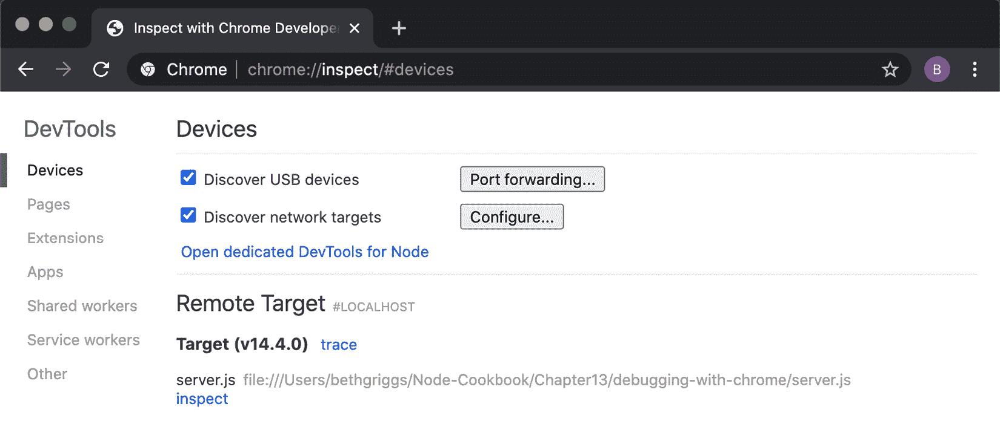
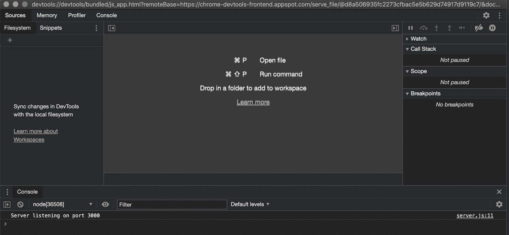
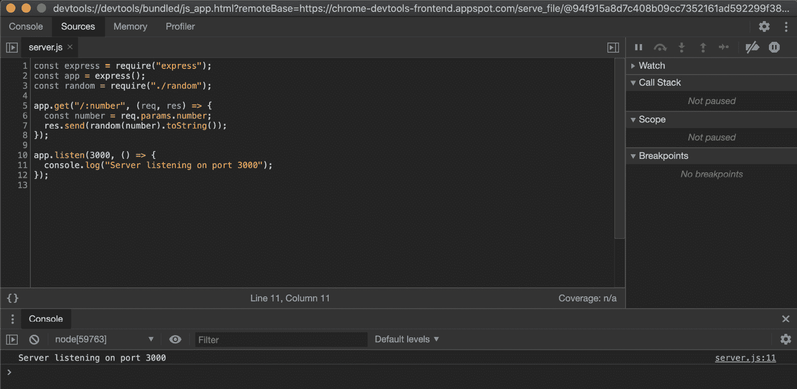
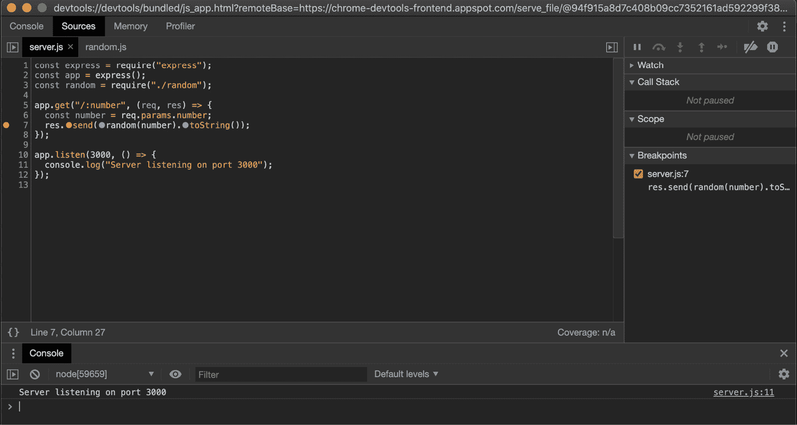
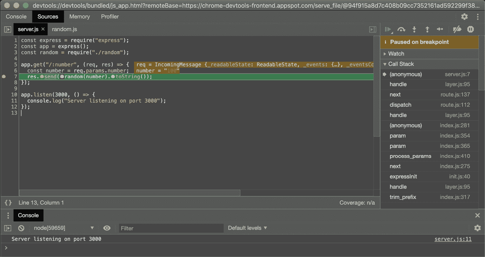
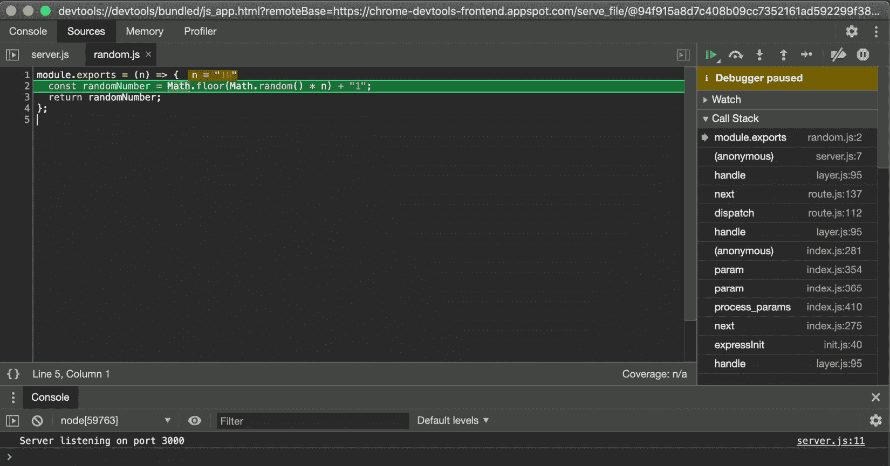
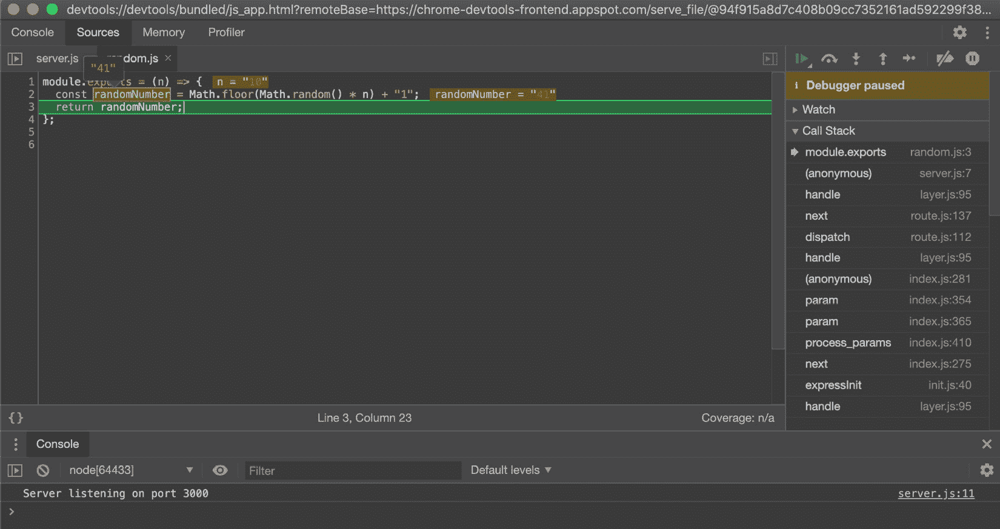
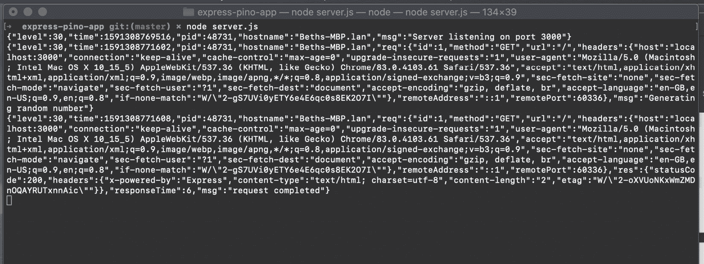
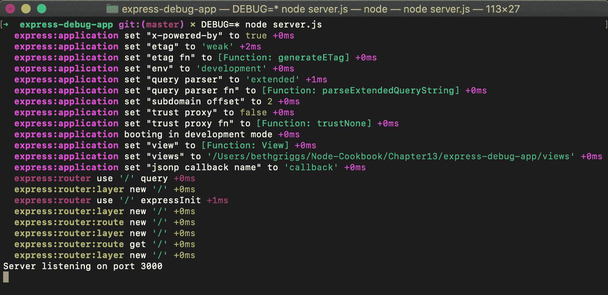
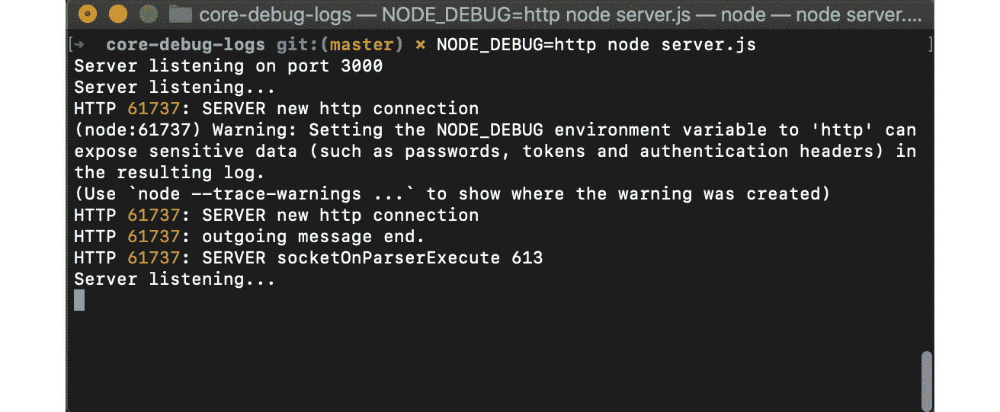

B13828_12_Final_ASB

# *第 12 章*：调试 Node.js

JavaScript 和 Node.js 的异步特性使调试过程非常简单。H然而，在过去的十年中，Node.js 作为一项技术已经成熟，调试能力和设施也相应提高。

在本章中，我们将考虑可以使我们的应用程序更容易调试的步骤。我们还将学习如何使用现代工具调试 Node.js 应用程序。在本章后面，我们将了解 Node.js 最新版本中提供的诊断报告功能。

本章将涵盖以下内容：

*   使用 ChromeDevTools 进行调试
*   使用 Node.js 进行日志记录
*   增强堆栈跟踪输出
*   使用诊断报告

# 技术要求

在本章中，您需要安装 Node.js 14，并在终端路径中提供。您可以使用以下命令测试路径中已安装并可用的 Node.js 版本：

```js
$ node --version
v14.3.0
```

您还需要访问编辑器和浏览器。对于 Chrome DevTools 配方的*调试，您需要安装 Google Chrome，您可以从[下载 https://www.google.co.uk/chrome/](https://www.google.co.uk/chrome/) 。*

# 使用 Chrome DevTool 诊断问题

Node.js 通过`--inspect`进程标志公开了一个调试实用程序，使我们能够使用 Chrome DevTools 界面调试和评测Node.js 进程。集成是通过 Chrome DevTools 协议实现的。该协议的存在意味着可以编写与 Chrome 开发工具集成的工具。

重要提示

`node --debug`和`node --debug-brk`是自 Node.js v6.3.0 以来一直被弃用的传统 Node.js 进程标志。`node --inspect`和`node --inspect-brk`是应该用来代替这些传统标志的现代等价物。

在本教程中，我们将学习如何使用 ChromeDevTools 诊断 web 应用程序中的问题。

## 准备好了吗

在此配方中，我们将调试一个小型 web 服务器。在开始烹饪之前，我们先准备一下：

1.  首先，让我们设置一个目录和此配方所需的文件：

    ```js
    $ mkdir debugging-with-chrome
    $ cd debugging-with-chrome
    $ npm init --yes
    $ npm install express
    $ touch server.js random.js
    ```

2.  将以下源代码添加到`server.js`以创建我们的 web 服务器：

    ```js
    const express = require("express");
    const app = express();
    const random = require("./random");
    app.get("/:number", (req, res) => {
      const number = req.params.number;
      res.send(random(number).toString());
    });
    app.listen(3000, () => {
      console.log("Server listening on port 3000");
    });
    ```

3.  在`random.js`中添加以下源代码。这将是我们通过服务器与之交互的模块：

    ```js
    module.exports = (n) => {
      const randomNumber = Math.floor(Math.random() * n) + "1";
      return randomNumber;
    };
    ```

现在我们已经有了一个可以调试的应用程序，我们可以继续进行配方步骤了。

## 怎么做

在这个配方中，我们将使用 ChromeDevTools 来调试应用程序中的路由。我们的应用程序将响应一个介于 0 和我们在路由中指定的数字之间的随机数。例如，[http://localhost:3000/10](http://localhost:3000/10) 应返回一个介于 1 和 10 之间的随机数：

用`$ node server.js`启动程序并导航到[http://localhost:3000/10](http://localhost:3000/10) 。刷新端点几次，您应该注意到程序通常会以大于 10 的数字响应。这似乎是坏的，所以让我们试着调试并理解原因。

1.  首先，我们需要在启用调试器的情况下启动程序。为此，我们需要将`--inspect`参数传递给 Node.js 进程：

    ```js
    $ node --inspect server.js 
    Debugger listening on ws://127.0.0.1:9229/35fa7c65-62a5-48b4-8428-9a414ec28afe
    For help, see: https://nodejs.org/en/docs/inspector
    Server listening on port 3000
    ```

2.  Instead of going directly to the link specified in the output, navigate to chrome://inspect/#devices in Google Chrome. Expect to see the following output:

    

    图 12.1 谷歌 Chrome inspector 设备界面截图

3.  Observe that our `server.js` is showing up as a **Remote Target**. Click the **inspect** link and the Chrome DevTools window will open, as shown in the following image:

    

    图 12.2 Chrome 开发工具界面截图

4.  Click on **server.js:11** in the bottom right of the window. This should ensure our `server.js` file is open:

    

    图 12.3 显示 server.js 文件的 Chrome DevTools 界面截图

5.  Now, we can add a breakpoint. Click the number **7** in the *Line-of-Code* column to the left of our code. A small red circle should appear next to the number. If you click *Show Debugger* in the top-right corner, you should see the breakpoint listed in the **Breakpoints** pane. The Chrome DevTools interface should look like the following:

    

    图 12.4–Chrome 开发工具的屏幕截图，显示在 server.js 文件中注册的断点

6.  现在，让我们打开一个新的常规浏览器窗口并导航到[http://localhost:3000/10](http://localhost:3000/10) 。请求将挂起，因为它已到达我们在*第 7 行*上注册的断点。
7.  Go back to Chrome DevTools. You should notice that there is a tooltip stating **Paused on breakpoint** at the top right of the interface. Also, to the right of the interface, you should see a **Call Stack** panel, which details the call frames:

    

    图 12.5–Chrome DevTools 界面的屏幕截图，显示在断点处暂停

8.  The debugger is waiting for us to take action. We can choose to step in or out of the next instruction. Let's step in to the function. To do this, click the icon of an arrow pointing down to a circle (these icons are right above the **Paused on breakpoint** message). When you hover over each icon, a tooltip will appear describing the icon's behavior. Once you have stepped in, you will see that we have moved into our `random.js` file:

    

    图 12.6–显示 random.js 文件的 Chrome DevTools 界面截图

9.  当我们在`random.js`中时，我们可以将鼠标悬停在这些值上，检查它们是否是我们期望的值。我们可以看到`n = 10`，正如预期的那样。
10.  跨过该功能（点击下方带点的半圆箭头），然后检查`randomNumber`的值。截图中数字为**41**，大于 10。这有助于我们确定错误在前一行的`randomNumber`逻辑中。既然我们已经确定了错误所在的线路，就更容易找到错误。我们正在添加字符串`"1"`而不是数字`1`：



图 12.7–Chrome DevTools 界面的屏幕截图，显示悬停时的变量值

我们已经学习了如何使用 ChromeDevTools 暂停并逐步完成代码。我们还了解到，我们可以检查变量值。

## 它是如何工作的

v8javascript 引擎提供了调试 Node.js 应用程序的能力。当我们向`node`进程传递`--inspect`参数时，Node.js 进程开始侦听调试客户端。具体来说，是 V8 inspector 打开了一个接受 WebSocket 连接的端口。WebSocket 连接允许客户端和 V8 inspector 进行交互。

在 Chrome DevTools 窗口的顶部，您将看到一个以`devtools://`开头的 URI。这是一个被 Google Chrome 浏览器识别并指示 Google Chrome 打开 Chrome DevTools 用户界面的协议。

在配方中，我们在 ChromeDevTools 窗口中设置了一个断点。当遇到断点注册所在的代码行时，事件循环（JavaScript 线程）将暂停。然后，V8 inspector 将通过 WebSocket 连接向客户端发送消息。来自 V8 inspector 的消息详细说明了程序的位置和状态。客户端可以根据收到的信息更新其状态。

类似地，如果用户选择单步执行某个函数，则会向 V8 inspector 发送一个命令，指示它临时恢复脚本的执行，然后再次暂停。与前面一样，V8 inspector 将向客户端发送一条消息，详细说明新的位置和状态。

在启动时暂停进程

js 还提供了一个标志，我们可以使用它在应用程序启动时暂停应用程序。此功能使我们能够在执行任何操作之前设置断点。当安装程序在调试阶段出错时，也可以帮助您。

此功能可通过`--inspect-brk`标志启用。下面是我们如何使用`--inspect-brk`标志开始`server.js`：`$ node --inspect-brk server.js`。

## 还有更多

Node.js 提供了一个命令行检查器，当我们无法访问图形用户界面时，该检查器非常有用。

我们可以使用基于命令行的调试器通过以下命令从配方运行应用程序：

```js
$ node inspect server.js
```

此命令将使我们进入调试模式，并输出`server.js`的前三行：


图 12.8–显示 Node.js inspector 实用程序的终端窗口

调试模式将在第一行暂停我们的程序。

调试模式提供了一系列命令和函数，我们可以使用这些命令和函数逐步完成并调试程序。您可以通过键入`help`并点击*回车*来输出这些命令的完整列表。

其中一个函数是`list()`函数，它将列出指定数量的以下行。例如，我们可以键入`list(11)`来输出我们程序的所有 12 行：

```js
debug> list(11)
> 1 const express = require("express");
  2 const app = express();
  3 const random = require("./random");
  4 
  5 app.get("/:number", (req, res) => {
  6   const number = req.params.number;
  7   res.send(random(number).toString());
  8 });
  9 
 10 app.listen(3000, () => {
 11   console.log("Server listening on port 3000");
 12 });
```

我们可以使用`setBreakpoint()`功能设置断点。我们必须为这个函数提供我们希望设置断点的行号。这个函数还有一个缩写：`sb()`。

我们在*第 7 行*上输入`setBreakpoint(7)`或`sb(7)`设置一个断点：

```js
debug> setBreakpoint(7)
  2 const app = express();
  3 const random = require("./random");
  4 
  5 app.get("/:number", (req, res) => {
  6   const number = req.params.number;
> 7   res.send(random(number).toString());
  8 });
  9 
 10 app.listen(3000, () => {
 11   console.log("Server listening on port 3000");
 12 });
```

插入符号（`>`表示在*第 7 行*上设置了断点。

程序仍处于暂停状态。我们可以通过键入 continue 命令`cont`来指示进程开始运行。它还有一个速记命令，`c`：

```js
debug> cont
< Server listening on port 3000
```

输入`cont`命令后，我们的程序将开始运行。我们的断点在我们的请求处理函数中。让我们在新的终端窗口中使用**cURL**发送请求：

```js
$ curl http://localhost:3000/10
```

该命令将挂起，因为它已到达`server.js`的*第 7*行的断点。如果我们返回调试会话，我们将看到调试器检测到已到达断点：

```js
break in server.js:7
  5 app.get("/:number", (req, res) => {
  6   const number = req.params.number;
> 7   res.send(random(number).toString());
  8 });
  9
```

现在，要进入函数，我们键入`step`命令：

```js
debug> step
break in random.js:2
  1 module.exports = (n) => {
> 2   const randomNumber = Math.floor(Math.random() * n) + "1";
  3   return randomNumber;
  4 };
```

这会进入`random.js`文件。请注意，命令行调试实用程序提供了一个类似于 Chrome DevTools 的界面，只是没有图形用户界面。

我们可以使用`exec`命令打印出当前范围内的引用。输入`exec n`输出`n`的值：

```js
debug> exec n
'10'
```

我们现在可以使用`out`命令退出。这将把我们带回我们的`server.js`文件：

```js
debug> out
break in server.js:7
  5 app.get("/:number", (req, res) => {
  6   const number = req.params.number;
> 7   res.send(random(number).toString());
  8 });
  9
```

现在，我们已经了解了如何使用命令行调试器逐步完成代码并输出参考值。要退出调试器，您可以键入`.exit`或输入*Ctrl*+*C*两次。

## 另见

*   [*第 6 章*](06.html#_idTextAnchor165)*探索 Node.js web 框架*中的*使用 Express.js*配方构建 web 应用程序
*   本章中使用 Node.js 配方的*日志记录*
*   本章中的*启用调试日志*配方

# 使用 Node.js 进行日志记录

有效的日志记录可以帮助您了解应用程序中发生了什么。日志可以帮助您查看应用程序在崩溃或失败之前发生了什么，从而有助于对崩溃或失败的原因进行回顾性分类。

日志记录也可用于帮助整理数据。例如，如果在 web 应用程序上记录对端点的所有访问，则可以整理所有请求日志以确定访问次数最多的端点。

在此配方中，我们将使用基于 JSON 的记录器`pino`来查看日志记录。在*部分还有更多*部分，我们将介绍摩根和温斯顿的替代伐木工人。

## 准备好了吗

1.  首先，我们将创建一个名为`express-pino-app`的新目录，初始化我们的项目，然后安装`express`模块：

    ```js
    $ mkdir express-pino-app
    $ cd express-pino-app
    $ npm init --yes
    $ npm install express
    ```

2.  现在，我们将为我们的服务器创建一个名为`server.js`：

    ```js
    $ touch server.js
    ```

    的文件
3.  在`server.js`中增加以下内容：

    ```js
    const express = require("express");
    const app = express();
    const PORT = 3000;
    app.get("/", (req, res) => {
      const randomNumber = getRandomNumber();
      res.send(`${randomNumber}`);
    });
    app.listen(PORT, () =>
      console.log(`Server listening on port ${PORT}`)
    );
    function getRandomNumber() {
      return Math.floor(Math.random() * 100) + 1;
    };
    ```

现在我们有了一个简单的服务器，我们将看看如何向它添加`pino`日志记录。

## 怎么做

在此配方中，我们将利用`express-pino-logger`模块通过 Express.js中间件添加日志记录：

1.  首先，从开始安装`pino`和`express-pino-logger`模块：

    ```js
    $ npm install pino express-pino-logger
    ```

2.  现在我们可以在`server.js`中导入`pino`和`express-pino-logger`。在`PORT`变量赋值后添加以下行：

    ```js
    const pino = require("pino")();
    const logger = require("express-pino-logger")({
      instance: pino,
    });
    ```

3.  现在，我们可以将`pino`记录器注册为 Express.js 中间件。在上一步添加的`logger`声明下方添加以下行：

    ```js
    app.use(logger);
    ```

4.  我们准备在请求中添加一条`pino`日志消息。我们将添加一条日志消息，通知我们正在生成一个随机数。将以下行添加到请求处理程序函数中。这应该是请求处理函数的第一行：

    ```js
      req.log.info("Generating random number");
    ```

5.  我们现在将现有的`console.log()`语句转换为使用`pino`记录器：

    ```js
    app.listen(PORT, () => pino.info(`Server listening on port ${PORT}`));
    ```

6.  我们可以启动我们的服务器并观察到我们的日志消息是输出，JSON 格式：

    ```js
    $ node server.js
    {"level":30,"time":1591308577332,"pid":48628,"hostname":"Beths-MBP.lan","msg":"Server listening on port 3000"}
    ```

7.  导航至[http://localhost:3000 在浏览器中](http://localhost:3000)（或使用**cURL**发送 HTTP GET 请求）。希望在终端窗口中看到以下日志输出：



图 12.9–显示具有 Pino 日志消息输出的终端的屏幕截图

现在，我们已经使用`express-pino-logger`模块在 Express.js web 服务器上启用了 Pino 登录。

## 它是如何工作的

`express-pino-logger`是一个中间件，可在我们的 Express.js web 服务器上实现 Pino 登录。我们独立地导入这些日志，以便直接和通过中间件与`pino`记录器交互。

引脚接口基于 Log4j。Log4j 是一个为 Java 编写的 Apache 记录器，但是对其接口的解释已经跨多种语言实现。

Pino 允许您按级别对错误消息进行分组。水平分别为`trace`、`debug`、`info`、`warn`、`error`和`fatal`。默认的记录级别设置为`info`。

在配方中，我们添加了信息级日志消息。为了添加`"Server listening on port 3000"`日志消息，我们直接使用`pino.info()`与`pino`交互。启动服务器时，日志消息被输出：

```js
{"level":30,"time":1591309005276,"pid":48790,"hostname":"Beths-MBP.lan","msg":"Server listening on port 3000"}
```

我们使用`app.use()`函数注册了`express-pino-logger`中间件。有关在 Express.js 中使用中间件的更多信息，请参阅[*第 6 章*](06.html#_idTextAnchor165)、*探索 Node.js web 框架*中的*使用 Express.js*构建 web 应用程序。

`express-pino-logger`中间件向每个传入请求添加一个日志对象。每个日志消息都可以通过请求对象（`req.log`上名为`log`的属性进行访问。每个日志对象对于每个请求都是唯一的。日志对象包含有关请求的数据和生成的唯一标识符。生成的唯一标识符使日志消息能够跟踪到特定的客户端请求。

在配方中，我们使用`req.log.info()`方法向请求的日志对象添加了一条额外的消息。传入请求的日志消息类似于以下内容，包含我们指定的消息：

```js
{"level":30,"time":1591310761795,"pid":48997,"hostname":"Beths-MBP.lan","req":{"id":1,"method":"GET","url":"/","headers":{"host":"localhost:3000","user-agent":"curl/7.64.1","accept":"*/*"},"remoteAddress":"::1","remotePort":60721},"msg":"Generating random number"}
```

`express-pino-logger`中间件还为每个完成的请求生成日志消息。JSON 中添加了一个`res`键。`res`键包含有关请求响应的数据，包括状态代码和标题。以下是已完成请求日志消息的示例：

```js
{"level":30,"time":1591310761799,"pid":48997,"hostname":"Beths-MBP.lan","req":{"id":1,"method":"GET","url":"/","headers":{"host":"localhost:3000","user-agent":"curl/7.64.1","accept":"*/*"},"remoteAddress":"::1","remotePort":60721},"res":{"statusCode":200,"headers":{"x-powered-by":"Express","content-type":"text/html; charset=utf-8","content-length":"2","etag":"W/\"2-wJdjj5LegLqNbGlrJubmAaX2Hrc\""}},"responseTime":4,"msg":"request completed"}
```

## 还有更多

现在我们来看看 Pino 如何与其他 web 框架一起使用。我们还将考虑摩根和温斯顿，NoDE.js 的两个替代的流行记录器。

### Pino 和 web 框架

配方演示了如何将 Pino 集成到 Express.js 应用程序中，以提供 JSON 日志记录。还可以将 Pino 与其他流行的 web 框架集成。Pino GitHub 组织为许多 web 框架提供中间件和连接器，包括以下：

*   `express-pino-logger`（[https://github.com/pinojs/express-pino-logger](https://github.com/pinojs/express-pino-logger) ：用于 Pino 的 Express.js 中间件，如配方中所用
*   `hapi-pino`（[https://github.com/pinojs/hapi-pino](https://github.com/pinojs/hapi-pino) ：用于 Pino 的 Hapi 插件
*   `koa-pino`（[https://github.com/pinojs/koa-pino-logger Pino）的膝关节炎中间件](https://github.com/pinojs/koa-pino-logger)
*   `restify`（[https://github.com/pinojs/restify-pino-logger](https://github.com/pinojs/restify-pino-logger) ：一个用于 Pino 的 Restify 中间件

Pino 日志记录功能内置于 Fastify web 框架中，只需要通过以下代码打开日志记录：

```js
const fastify = require("fastify")({
  logger: true,
});
```

关于如何集成中间件和插件的详细信息，请参考[*第 6 章*](06.html#_idTextAnchor165)、*探索 Node.js Web 框架*的相关配方。

### 摩根的日志记录

Morgan 是 Node.js 的 HTTP 请求记录器中间件。请注意，Morgan专注于提供 HTTP 日志记录，而不是用作通用的可扩展日志记录程序。Morgan 通常与 Express.js 一起使用，并在 Express.js GitHub 组织（[下维护 https://github.com/expressjs/morgan](https://github.com/expressjs/morgan) ）。让我们来看看摩根在日志记录方面提供了什么。

`express-generator`生成了一个框架 Express.js 应用程序（参见[*第 6 章*](06.html#_idTextAnchor165)*探索 Node.js web 框架*中*使用 Express.js*配方构建 web 应用程序的*中有更多的*部分）。生成的骨架应用程序已经包含了`morgan`记录器。

在终端中输入以下内容，在名为`express-morgan-app`的新目录中生成 Express.js 应用程序：

```js
$ npx express-generator --view=ejs express-morgan-app
$ cd express-morgan-app
$ npm install
```

打开`app.js`并观察*线路 5*上的`morgan`记录器已导入：

```js
var logger = require('morgan');
```

`app.js`中的*行*注册了`morgan`HTTP 日志中间件：

```js
app.use(logger('dev'));
```

参数`dev`表示我们需要开发格式的日志记录。在 Morgan 中，开发级日志是由响应状态着色的简明输出。Morgan 提供以下预定义格式：

*   **组合**：Apache 风格组合输出
*   **常用**：Apache 风格输出
*   **开发**：简洁的彩色编码输出
*   **短**：短输出
*   **微小**：最小输出

如果我们启动服务器并导航到[http://localhost:3000](http://localhost:3000) ，我们应该看到`morgan`在我们的终端窗口中记录 HTTP 请求：

```js
$ npm start
> express-morgan-app@0.0.0 start /Users/bethgriggs/Node-Cookbook/Chapter13/express-morgan-app
> node ./bin/www
GET / 200 8.077 ms - 207
GET /stylesheets/style.css 200 2.210 ms - 111
```

这是`morgan`开发级别日志输出。请注意，它为我们提供了请求方法、路由和响应时间。最终值（`207`和`111`表示内容长度。

### 温斯顿的日志记录

Winston 是 Node.js 的另一个流行的记录器。Winston 公开了一个与 Log4j 接口类似的接口。Pino 和 Winston 的主要区别在于 Winston 提供了更多的功能和配置选项。Winston 提供的功能包括日志转换和日志旋转。

让我们使用`express-generator`生成一个 Express.js 应用程序，并用`express-winston`模块替换 Morgan logger：

```js
$ npx express-generator --view=ejs express-winston-app
$ cd express-winston-app
$ npm install
```

现在我们需要卸载`morgan`模块并安装`express-winston`：

```js
$ npm uninstall morgan
$ npm install winston express-winston
```

现在我们可以将`app.js`中的`morgan`导入替换为以下内容。我们将继续使用`var`与`express-generator`的输出保持一致：

```js
var winston = require('winston');
var expressWinston = require('express-winston');
```

现在我们可以指导Express.js 使用我们的`winston`记录器中间件。下面的配置指示 Winston 以 JSON 格式将日志消息输出到 STDOUT。

在`app.js`中，将`app.use(logger('dev'));`行替换为以下内容：

```js
app.use(expressWinston.logger({ 
  transports: [
    new winston.transports.Console({ 
      json: true
    })
  ]
}));
```

我们通过`winston.transports.Console`属性来指示 Winston 以 JSON 格式公开日志。默认情况下，日志消息的格式为`${level}: ${message}`。

现在，我们可以使用`$ npm start`启动服务器并导航到[http://localhost:3000](http://localhost:3000) 。观察终端窗口中的JSON 格式日志：

```js
$ npm start
> express-winston-app@0.0.0 start /Users/bethgriggs/Node-Cookbook/Chapter13/express-winston-app
> node ./bin/www
{"meta":{"req":{"url":"/","headers":{"host":"localhost:3000","connection":"keep-alive","upgrade-insecure-requests":"1","user-agent":"Mozilla/5.0 (Macintosh; Intel Mac OS X 10_15_5) AppleWebKit/537.36 (KHTML, like Gecko) Chrome/83.0.4103.61 Safari/537.36","accept":"text/html,application/xhtml+xml,application/xml;q=0.9,img/webp,img/apng,*/*;q=0.8,application/signed-exchange;v=b3;q=0.9","sec-fetch-site":"none","sec-fetch-mode":"navigate","sec-fetch-user":"?1","sec-fetch-dest":"document","accept-encoding":"gzip, deflate, br","accept-language":"en-GB,en-US;q=0.9,en;q=0.8","if-none-match":"W/\"cf-sMq3uu/Hzh7Qc54TveG8DxiBA2U\""},"method":"GET","httpVersion":"1.1","originalUrl":"/","query":{}},"res":{"statusCode":304},"responseTime":7},"level":"info","message":"HTTP GET /"}
{"meta":{"req":{"url":"/stylesheets/style.css","headers":{"host":"localhost:3000","connection":"keep-alive","user-agent":"Mozilla/5.0 (Macintosh; Intel Mac OS X 10_15_5) AppleWebKit/537.36 (KHTML, like Gecko) Chrome/83.0.4103.61 Safari/537.36","accept":"text/css,*/*;q=0.1","sec-fetch-site":"same-origin","sec-fetch-mode":"no-cors","sec-fetch-dest":"style","referer":"http://localhost:3000/","accept-encoding":"gzip, deflate, br","accept-language":"en-GB,en-US;q=0.9,en;q=0.8","if-none-match":"W/\"6f-17281bf98c8\"","if-modified-since":"Thu, 04 Jun 2020 23:51:56 GMT"},"method":"GET","httpVersion":"1.1","originalUrl":"/stylesheets/style.css","query":{}},"res":{"statusCode":200},"responseTime":3},"level":"info","message":"HTTP GET /stylesheets/style.css"}
```

我们现在已将 Winston 日志记录添加到我们的 Express.js 应用程序中。我们已经使用`express-winston`中间件添加了它，这意味着每个 HTTP 请求都将输出日志消息。

## 另见

*   [*第五章*](05.html#_idTextAnchor134)*消费 Node.js 模块*配方*开发 Node.js 模块*
*   [*第 6 章*](06.html#_idTextAnchor165)*探索 Node.js web 框架*中的*使用 Express.js*配方构建 web 应用程序
*   本章中的*启用调试日志*配方

# 启用调试日志

是一个流行的库，使用了许多著名的框架，包括 Exp.js 和 Ko.js Web 框架和膝关节炎测试框架。`debug`是一个基于 Node.js 内核中使用的调试技术的小型 JavaScript 调试实用程序。

在配方中，我们将了解如何在 Express.js 应用程序上启用调试日志。

## 准备好了吗

1.  让我们创建一个 Express.js web 应用程序，以便启用调试日志。我们首先需要创建一个新目录并初始化我们的项目：

    ```js
    $ mkdir express-debug-app
    $ cd express-debug-app
    $ npm init --yes
    $ npm install express
    ```

2.  现在，我们将创建一个名为`server.js`：

    ```js
    $ touch server.js
    ```

    的文件
3.  将以下代码添加到`server.js`：

    ```js
    const express = require("express");
    const app = express();
    app.get("/", (req, res) => res.send("Hello World!"));
    app.listen(3000, () => {
      console.log("Server listening on port 3000");
    });
    ```

现在我们有了一个应用程序，我们已经准备好启用调试日志。

## 怎么做

在此配方中，我们将在应用程序上启用调试日志：

1.  要打开调试日志记录，请使用以下命令启动服务器：

    ```js
    $ DEBUG=* node server.js
    ```

2.  Expect to see the following color-coded output in your Terminal window:

    

    图 12.10–描述 web 服务器调试日志的终端窗口屏幕截图

3.  导航到[http://localhost:3000](http://localhost:3000) 在您的浏览器中向我们的服务器发送请求。您应该看到描述您的请求的日志消息已经输出：

    ```js
      express:router dispatching GET / +1s
      express:router query  : / +1ms
      express:router expressInit  : / +0ms
    ```

4.  使用*Ctrl*+*C*停止您的服务器。
5.  现在，我们还可以过滤输出的调试日志。我们将对其进行过滤，以仅查看 Express.js 路由操作。为此，请使用以下命令重新启动服务器：

    ```js
    $ DEBUG=express:router* node server.js
    ```

6.  希望在终端窗口中看到以下输出。请注意，仅输出 Express.js 路由操作：


图 12.11–终端窗口的屏幕截图，显示 web 服务器的过滤调试日志

现在，我们已经了解了如何通过终端在应用程序上启用调试日志。我们还学习了如何过滤日志。

## 它是如何工作的

我们首先预编`DEBUG=*`我们的启动命令。此语法将名为`DEBUG`的环境变量传递给 Node.js 进程，可通过`process.env.DEBUG`从应用程序内部访问该进程。

我们将该值设置为`*`，这将启用所有日志。稍后，我们通过设置`DEBUG=express:router*`来过滤日志。在内部，调试模块正在将我们设置的值转换为正则表达式。

Express.js 在内部使用`debug`模块插入其代码。在*中还有更多的*部分，我们将了解如何使用`debug`插入代码。

在生产中使用调试

默认调试配置不适用于登录生产。默认调试日志的目的是让人可读，因此使用了颜色编码。在生产过程中，您应该向流程传递`DEBUG_COLORS=no`值，以删除实现颜色编码的 ANSI 代码。这将使输出更易于机器读取。

## 还有更多

可以使用`debug`模块插入代码。我们可以从配方中将其添加到程序中。首先将配方中使用的`server.js`文件复制到一个新文件中，然后安装调试模块：

```js
$ cp server.js debug-server.js
$ npm install debug
```

将`debug-server.js`更改为以下内容。我们已经在*3 号线*上导入了调试模块，并在*6 号线*上增加了调试调用：

```js
const express = require("express");
const app = express();
const debug = require("debug")("my-server");
app.get("/", (req, res) => {
  debug("HTTP GET request to /");
  res.send("Hello World!");
});
app.listen(3000, () => {
  console.log("Server listening on port 3000");
});
```

使用以下命令启动应用程序，然后导航到[http://localhost:3000](http://localhost:3000) 。希望在您的终端窗口中看到我们的**HTTP GET 请求/**日志消息：

```js
$ DEBUG=my-server node debug-server.js 
Server listening on port 3000
  my-server HTTP GET request to / +0ms
```

请注意，我们的日志消息前面有`my-server`。这是日志消息的名称空间，我们在创建`debug`日志函数时声明了该名称空间。

## 另见

*   [*第五章*](05.html#_idTextAnchor134)*消费 Node.js 模块*配方*开发 Node.js 模块*
*   [*第 6 章*](06.html#_idTextAnchor165)*探索 Node.js web 框架*中的*使用 Express.js*配方构建 web 应用程序
*   本章中使用 Node.js 配方的*日志记录*
*   本章*启用 Node.js 核心调试日志*配方

# 启用 Node.js 核心调试日志

在调试应用程序中的一些问题时，深入了解 Node.js 的内部结构以及它如何处理程序的执行非常有用。Node.js 提供了调试日志，我们可以启用这些日志来帮助我们了解 Node.js 内部发生的事情。

这些核心调试日志可以通过名为`NODE_DEBUG`的环境变量启用。在配方中，我们将设置`NODE_DEBUG`环境变量，以允许我们记录内部 Node.js 行为。

## 准备好了吗

我们需要创建一个可以启用 Node.js 核心调试日志的应用程序。我们将创建一个简单的基于 Express.js 的服务器，其中包含一个路由：

```js
$ mkdir core-debug-logs
$ cd core-debug-logs
$ npm init --yes
$ npm install express
$ touch server.js
```

在`server.js`中添加以下内容：

```js
const express = require("express");
const app = express();
app.get("/", (req, res) => {
  res.send("Hello World!");
});
app.listen(3000, () => {
  console.log("Server listening on port 3000");
  setInterval(() => {
    console.log("Server listening...");
  }, 3000);
});
```

现在我们已经准备好了一个应用程序，我们可以启用核心调试日志，让我们能够看到 Node.js 运行时级别发生了什么。

## 怎么做

在此配方中，我们将在应用程序上启用 Node.js core 调试日志：

1.  我们只需要将`NODE_DEBUG`变量设置为希望记录的内部标志。内部标志与 Node.js 的特定子系统（如计时器或 HTTP）对齐。要启用计时器核心调试日志，请使用以下命令启动服务器：

    ```js
    $ NODE_DEBUG=timer node server.js
    ```

2.  Observe the additional log output from our program. We can see additional information about our `setInterval()` function, which is executed every 3000 ms:

    

    图 12.12–显示 Node.js core timer 调试消息的终端窗口屏幕截图

    前面的`TIMER`日志语句是从 Node.js core 中计时器的内部实现派生的额外调试信息，可在[中找到 https://github.com/nodejs/node/blob/master/lib/internal/timers.js](https://github.com/nodejs/node/blob/master/lib/internal/timers.js) 。

3.  现在我们将为`http`模块启用核心调试日志。使用以下命令重新启动服务器：

    ```js
    $ NODE_DEBUG=http node server.js
    ```

4.  导航至[http://localhost:3000](http://localhost:3000) 在浏览器中。您应该看到有关 HTTP 请求输出的内部日志：



图 12.13–显示 Node.js 核心 HTTP 调试消息的终端窗口屏幕截图

现在，我们已经了解了如何使用`NODE_DEBUG`环境变量来启用 Node.js 内部的日志记录。

## 它是如何工作的

在配方中，我们将`NODE_DEBUG`环境变量同时设置为`timer`和`http`子系统。`NODE_DEBUG`环境变量可设置为以下 Node.js 子系统：


图 12.14–详细说明通过 NODE_DEBUG 公开日志的子系统的表格

还可以通过`NODE_DEBUG`环境变量在多个子系统上启用调试日志。要启用多个子系统日志，可以将它们作为逗号分隔的列表传递。例如，要同时启用`http`和`timer`子系统，您需要提供以下命令：

```js
$ NODE_DEBUG=http,timer node server.js
```

每个日志消息的输出包括子系统/名称空间，然后是**进程标识符**（**PID**，然后是日志消息。

在配方中，我们首先启用了计时器核心调试日志。在我们的程序中，我们有一个`setInterval()`函数，用于打印消息**服务器侦听。。。**每 3000 毫秒进行一次标准输出。核心调试日志提供了关于间隔计时器是如何在内部创建的详细信息。

类似地，当我们启用`http`核心模块调试日志时，我们可以跟踪 HTTP请求期间内部发生的情况。`http`调试日志在描述我们的服务器接收和响应 HTTP 请求时发生的操作方面，是人类可读的。

扩展节点调试

可以使用 Node.js core`util.debuglog()`方法插入您自己的调试日志，您可以通过`NODE_DEBUG`环境变量启用这些日志。但是，一般不建议这样做。最好使用第三方`debug`模块，本章*启用调试日志*配方中介绍了该模块。`debug`模块以最小的开销提供额外的日志功能，包括时间戳和颜色编码。

## 另见

*   本章中的*调试 Node.js 与 Chrome DevTools*配方
*   本章中使用 Node.js 配方的*日志记录*
*   本章中的*启用调试日志*配方

# 增加堆栈跟踪大小

堆栈跟踪，有时称为堆栈回溯跟踪的被定义为堆栈帧列表。当 Node.js 进程遇到错误时，将显示一个堆栈跟踪，详细说明发生错误的函数以及调用该错误的函数。默认情况下，Node.js 的 V8 引擎将返回 10 个堆栈帧。

在调试某些错误时，拥有 10 个以上的堆栈帧可能会很有用。存储的堆栈帧数会带来性能成本。跟踪额外的堆栈帧将导致应用程序消耗更多的内存和 CPU。

在配方中，我们将增加堆栈跟踪的大小。

## 准备好了吗

1.  首先，我们应该为应用程序创建一个目录。我们将在程序中使用`express`模块，因此我们还需要初始化项目目录：

    ```js
    $ mkdir stack-trace-app
    $ cd stack-trace-app
    $ npm init --yes
    $ npm install express
    ```

2.  我们需要一些文件来制作这个食谱：

    ```js
    $ touch server.js routes.js
    ```

3.  将以下添加到`server.js`：

    ```js
    const express = require("express");
    const routes = require("./routes");
    const app = express();
    app.use(routes);
    app.listen(3000, () => {
      console.log("Server listening on port 3000");
    });
    ```

4.  And then add the following to `routes.js`:

    ```js
    const express = require("express");
    const router = new express.Router();
    router.get("/", (req, res) => {
      res.send(recursiveContent());
    });
    function recursiveContent(content, i = 10) {
      --i;
      if (i !== 0) {
        return recursiveContent(content, i);
      } else {
        return content.undefined_property;
      }
    }
    module.exports = router;
    ```

    `recursiveContent()`函数的目的是强制创建函数调用，但在更大、更复杂的应用程序中，可能会自然超出堆栈帧限制。

现在我们有了一个将超过默认调用堆栈限制的应用程序，我们可以继续进行配方步骤。

## 怎么做

在本配方中，我们将学习如何使用`--stack-trace-limit`进程标志启用附加堆栈帧：

1.  开始运行服务器：

    ```js
    $ node server.js
    Server listening on port 3000
    ```

2.  现在，在浏览器中，导航到[http://localhost:3000](http://localhost:3000) 。或者，您可以使用**cURL**向端点发送请求。
3.  观察我们看到以下堆栈跟踪输出返回：

    ```js
    TypeError: Cannot read property 'undefined_property' of undefined
        at recursiveContent (/Users/bethgriggs/Node-Cookbook/Chapter13/stack-trace-app/routes.js:13:20)
        at recursiveContent (/Users/bethgriggs/Node-Cookbook/Chapter13/stack-trace-app/routes.js:11:12)
        at recursiveContent (/Users/bethgriggs/Node-Cookbook/Chapter13/stack-trace-app/routes.js:11:12)
        at recursiveContent (/Users/bethgriggs/Node-Cookbook/Chapter13/stack-trace-app/routes.js:11:12)
        at recursiveContent (/Users/bethgriggs/Node-Cookbook/Chapter13/stack-trace-app/routes.js:11:12)
        at recursiveContent (/Users/bethgriggs/Node-Cookbook/Chapter13/stack-trace-app/routes.js:11:12)
        at recursiveContent (/Users/bethgriggs/Node-Cookbook/Chapter13/stack-trace-app/routes.js:11:12)
        at recursiveContent (/Users/bethgriggs/Node-Cookbook/Chapter13/stack-trace-app/routes.js:11:12)
        at recursiveContent (/Users/bethgriggs/Node-Cookbook/Chapter13/stack-trace-app/routes.js:11:12)
        at recursiveContent (/Users/bethgriggs/Node-Cookbook/Chapter13/stack-trace-app/routes.js:11:12)
    ```

4.  我们现在可以使用`--stack-trace-limit`标志重新启动应用程序。我们将设置为`20`
5.  现在，导航或向[发送请求 http://localhost:3000](http://localhost:3000) 又来了。观察我们现在有更多来自堆栈跟踪的帧：

    ```js
    TypeError: Cannot read property 'undefined_property' of undefined
        at recursiveContent (/Users/bethgriggs/Node-Cookbook/Chapter13/stack-trace-app/routes.js:13:20)
        at recursiveContent (/Users/bethgriggs/Node-Cookbook/Chapter13/stack-trace-app/routes.js:11:12)
        at recursiveContent (/Users/bethgriggs/Node-Cookbook/Chapter13/stack-trace-app/routes.js:11:12)
        at recursiveContent (/Users/bethgriggs/Node-Cookbook/Chapter13/stack-trace-app/routes.js:11:12)
        at recursiveContent (/Users/bethgriggs/Node-Cookbook/Chapter13/stack-trace-app/routes.js:11:12)
        at recursiveContent (/Users/bethgriggs/Node-Cookbook/Chapter13/stack-trace-app/routes.js:11:12)
        at recursiveContent (/Users/bethgriggs/Node-Cookbook/Chapter13/stack-trace-app/routes.js:11:12)
        at recursiveContent (/Users/bethgriggs/Node-Cookbook/Chapter13/stack-trace-app/routes.js:11:12)
        at recursiveContent (/Users/bethgriggs/Node-Cookbook/Chapter13/stack-trace-app/routes.js:11:12)
        at recursiveContent (/Users/bethgriggs/Node-Cookbook/Chapter13/stack-trace-app/routes.js:11:12)
        at recursiveContent (/Users/bethgriggs/Node-Cookbook/Chapter13/stack-trace-app/routes.js:11:12)
        at recursiveContent (/Users/bethgriggs/Node-Cookbook/Chapter13/stack-trace-app/routes.js:11:12)
        at recursiveContent (/Users/bethgriggs/Node-Cookbook/Chapter13/stack-trace-app/routes.js:11:12)
        at recursiveContent (/Users/bethgriggs/Node-Cookbook/Chapter13/stack-trace-app/routes.js:11:12)
        at recursiveContent (/Users/bethgriggs/Node-Cookbook/Chapter13/stack-trace-app/routes.js:11:12)
        at /Users/bethgriggs/Node-Cookbook/Chapter13/stack-trace-app/routes.js:5:12
        at Layer.handle [as handle_request] (/Users/bethgriggs/Node-Cookbook/Chapter13/stack-trace-app/node_modules/express/lib/router/layer.js:95:5)
        at next (/Users/bethgriggs/Node-Cookbook/Chapter13/stack-trace-app/node_modules/express/lib/router/route.js:137:13)
        at Route.dispatch (/Users/bethgriggs/Node-Cookbook/Chapter13/stack-trace-app/node_modules/express/lib/router/route.js:112:3)
        at Layer.handle [as handle_request] (/Users/bethgriggs/Node-Cookbook/Chapter13/stack-trace-app/node_modules/express/lib/router/layer.js:95:5)
    ```

6.  通过扩展返回的堆栈帧数，我们可以看到在*第 5 行*的`routes.js`中调用了`recursiveContent()`函数。这有助于我们认识到程序失败的原因是我们没有定义`content`并将其传递给`recursiveContent()`函数。

我们已经学习了如何返回额外的堆栈跟踪，以及这些跟踪如何帮助我们调试应用程序。

## 它是如何工作的

在配方中，我们使用`--stack-trace-limit`标志。此标志指示 V8 JavaScript 引擎保留更多堆栈。当发生错误时，堆栈跟踪将显示前面的函数调用，直到使用该标志设置的限制。在配方中，我们将其扩展到 20 个堆栈帧。

请注意，也可以在应用程序代码中设置此限制。以下行将堆栈跟踪限制设置为`20`：

```js
Error.stackTraceLimit = 20; 
```

还可以将堆栈跟踪限制设置为`Infinity`，这意味着将保留所有前面的函数调用：

```js
Error.stackTraceLimit = Infinity 
```

存储额外的堆栈跟踪会带来 CPU 和内存使用方面的性能成本。你应该考虑这可能对你的应用程序造成的影响。

## 还有更多

异步堆栈跟踪通过 V8 JavaScript 引擎更新添加到 Node.js 12，这些可以帮助我们调试异步函数。

异步堆栈跟踪帮助我们调试程序中的异步函数。让我们看一看异步堆栈跟踪：

1.  创建一个名为`async-stack-trace.js`：

    ```js
    $ touch async-stack-trace.js
    ```

    的文件
2.  Add the following to `async-stack-trace.js`:

    ```js
    foo().then(
      () => console.log("success"),
      (error) => console.error(error.stack)
    );
    async function foo() {
      await bar();
    }
    async function bar() {
      await Promise.resolve();
      throw new Error("Fail");
    }
    ```

    此程序包含一个异步函数`foo()`，它等待一个名为`bar()`的函数。`bar()`自动解析`Promise`并抛出错误。

3.  In versions of Node.js before Node.js 12, the following stack trace would be returned from the program:

    ```js
    Error: Fail
        at bar (/Users/bethgriggs/Node.js-14-Cookbook/Chapter13/stack-trace-app/async-stack-trace.js:12:9)
        at process._tickCallback (internal/process/next_tick.js:68:7)
        at Function.Module.runMain (internal/modules/cjs/loader.js:834:11)
        at startup (internal/bootstrap/node.js:283:19)
        at bootstrapNodeJSCore (internal/bootstrap/node.js:623:3) 
    ```

    注意跟踪只是告诉我们错误在`bar()`函数中，后面是一些内部函数调用，如`process._tickCallback()`。在 Node.js 12 之前，堆栈跟踪无法有效地报告异步函数调用。请注意，堆栈帧未显示`foo()`调用了`bar()`函数。

4.  However, thanks to an updated V8 engine, Node.js 12 and greater enable asynchronous stack traces. We will now get the following stack output when we run the same program with Node.js 14 (with `$ node async-stack-trace.js`):

    ```js
    Error: Fail
        at bar (/Users/bethgriggs/Node.js-14-Cookbook/Chapter13/stack-trace-app/async-stack-trace.js:12:9)
        at async foo (/Users/bethgriggs/Node.js-14-Cookbook/Chapter13/stack-trace-app/async-stack-trace.js:7:3) 
    ```

    更新版本的 Node.js 中的堆栈跟踪可以告诉我们，`bar()`函数是由一个名为`foo()`的异步函数调用的。

## 另见

*   [*第 6 章*](06.html#_idTextAnchor165)*探索 Node.js web 框架*中的*使用 Express.js*配方构建 web 应用程序
*   本章中使用 Node.js 配方的*日志记录*
*   本章*启用 Node.js 核心调试日志*配方
*   本章中的*创建诊断报告*配方

# 创建诊断报告

自 Node.js v11.8.0 以来，诊断报告实用程序一直在流程标志后面可用。诊断报告实用程序允许您根据需要或在某些事件发生时生成包含诊断数据的报告。可以生成报告的情况包括应用程序崩溃，或者应用程序性能缓慢或 CPU 使用率高。

它实现了与 Java 核心文件类似的目的。诊断报告包含有助于诊断应用程序中的问题的信息。报告的信息包括 Node.js 版本、触发报告的事件、堆栈跟踪等。

过去，诊断报告实用程序作为名为`node-report`的`npm`模块提供。但是，为了提高采用率并增强核心诊断功能，它被合并到 Node.js core 中。

在本教程中，我们将学习如何启用和配置诊断报告实用程序，并在应用程序中发生未捕获异常时生成报告。

## 准备好了吗

1.  首先，我们创建一个名为`diagnostic-report`：

    ```js
    $ mkdir diagnostic-report
    $ cd diagnostic-report
    ```

    的目录
2.  现在让我们创建一个文件来保存名为`server.js`：

    ```js
    $ touch server.js
    ```

    的服务器
3.  我们还要创建一个目录来存储报告：

    ```js
    $ mkdir reports
    ```

现在，我们准备好进入配方步骤。

## 怎么做

在这个配方中，我们将使用诊断报告实用程序创建一个关于未处理错误的报告。我们将为报告设置自定义目录和文件名。我们还将检查生成的报告，以了解有关未处理错误的信息：

1.  首先，我们将配方所需的核心 Node.js 模块导入`server.js`：

    ```js
    const http = require("http");
    const path = require("path");
    ```

2.  现在，让我们设置要捕获的诊断报告的目录和文件名：

    ```js
    process.report.directory = path.join(__dirname, "reports");
    process.report.filename = "my-diagnostic-report.json";
    ```

3.  现在，我们将向 web 服务器发送一个请求，但我们将故意指定一个无效的协议。将以下行添加到`server.js`：

    ```js
    http.get("hello://localhost:3000", (response) => {});
    ```

4.  现在，如果我们运行应用程序，我们应该会看到出现以下未捕获的`ERR_INVALID_PROTOCOL`错误：

    ```js
    $ node server.js                            
    _http_client.js:155
        throw new ERR_INVALID_PROTOCOL(protocol, expectedProtocol);
        ^
    TypeError [ERR_INVALID_PROTOCOL]: Protocol "hello:" not supported. Expected "http:"
        at new ClientRequest (_http_client.js:155:11)
        at request (http.js:47:10)
        at Object.get (http.js:51:15)
        at Object.<anonymous> (/Users/bethgriggs/Node-Cookbook/Chapter13/diagnostic-report/server.js:7:6)
        at Module._compile (internal/modules/cjs/loader.js:1200:30)
        at Object.Module._extensions..js (internal/modules/cjs/loader.js:1220:10)
        at Module.load (internal/modules/cjs/loader.js:1049:32)
        at Function.Module._load (internal/modules/cjs/loader.js:937:14)
        at Function.executeUserEntryPoint [as runMain] (internal/modules/run_main.js:71:12)
        at internal/main/run_main_module.js:17:47 {
      code: 'ERR_INVALID_PROTOCOL'
    }
    ```

5.  要启用诊断报告功能，我们需要使用`--report-uncaught-exception`标志启动 Node.js 进程。预期会看到以下输出，显示已创建报告：

    ```js
    $ node --report-uncaught-exception server.js
    Writing Node.js report to file: my-diagnostic-report.json
    Node.js report completed
    _http_client.js:155
        throw new ERR_INVALID_PROTOCOL(protocol, expectedProtocol);
        ^
    TypeError [ERR_INVALID_PROTOCOL]: Protocol "hello:" not supported. Expected "http:"
        at new ClientRequest (_http_client.js:155:11)
        at request (http.js:47:10)
        at Object.get (http.js:51:15)
        at Object.<anonymous> (/Users/bethgriggs/Node-Cookbook/Chapter13/diagnostic-report/server.js:7:6)
        at Module._compile (internal/modules/cjs/loader.js:1200:30)
        at Object.Module._extensions..js (internal/modules/cjs/loader.js:1220:10)
        at Module.load (internal/modules/cjs/loader.js:1049:32)
        at Function.Module._load (internal/modules/cjs/loader.js:937:14)
        at Function.executeUserEntryPoint [as runMain] (internal/modules/run_main.js:71:12)
        at internal/main/run_main_module.js:17:47 {
      code: 'ERR_INVALID_PROTOCOL'
    } 
    ```

6.  现在，我们可以看一下报告。它应该是在名为`my-diagnostic-report.json`的`reports`目录中创建的。在编辑器中打开该文件。
7.  识别文件顶部的`event`和`trigger`属性，并观察它是否提供了触发错误的事件的详细信息：

    ```js
        "event": "Protocol \"hello:\" not supported. Expected \"http:\"",
        "trigger": "Exception",
    ```

8.  在文件的下面，识别`javascriptStack`属性。应提供错误的堆栈跟踪：

    ```js
      "javascriptStack": {
        "message": "TypeError [ERR_INVALID_PROTOCOL]: Protocol \"hello:\" not supported. Expected \"http:\"",
        "stack": [
          "at new ClientRequest (_http_client.js:155:11)",
          "at request (http.js:47:10)",
          "at Object.get (http.js:51:15)",
          "at Object.<anonymous> (/Users/bethgriggs/Node-Cookbook/Chapter13/diagnostic-report/server.js:7:6)",
          "at Module._compile (internal/modules/cjs/loader.js:1200:30)",
          "at Object.Module._extensions..js (internal/modules/cjs/loader.js:1220:10)",
          "at Module.load (internal/modules/cjs/loader.js:1049:32)",
          "at Function.Module._load (internal/modules/cjs/loader.js:937:14)",
          "at Function.executeUserEntryPoint [as runMain] (internal/modules/run_main.js:71:12)"
        ]
      }
    ```

现在，我们已经了解了如何在未捕获异常上启用诊断报告实用程序，以及如何检查报告以获取诊断信息。

## 它是如何工作的

诊断报告实用程序允许在特定条件下将诊断摘要写入文件中。该实用程序内置于 Node.js core 中，通过将以下命令行标志之一传递给 Node.js 进程来启用：

*   `--report-uncaught-exception`：如配方中所用，它会在未捕获异常时触发崩溃。
*   `--report-on-signal`：收到指定信号后触发报告。
*   `--report-on-fatalerror`：致命错误触发报告，如内存不足错误。

请注意，也可以使用以下行从应用程序中触发报告的生成：

```js
process.report.writeReport();
```

在配方中，我们首先通过在程序中分配`process.report.directory`和`process.report.filename`变量来设置自定义目录。也可以通过`--report-directory`和`--report-filename`命令行参数设置这些参数。不需要设置目录和文件名。当省略目录时，将在启动 Node.js 进程的目录中生成报告。当省略指定的文件名时，该实用程序将默认创建具有以下命名约定的文件名：`report.20181126.091102.8480.0.001.json`。

## 另见

*   本章*启用 Node.js 核心调试日志*配方
*   本章中的*增加堆栈跟踪大小*配方