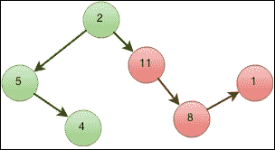
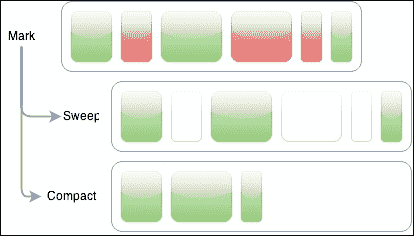
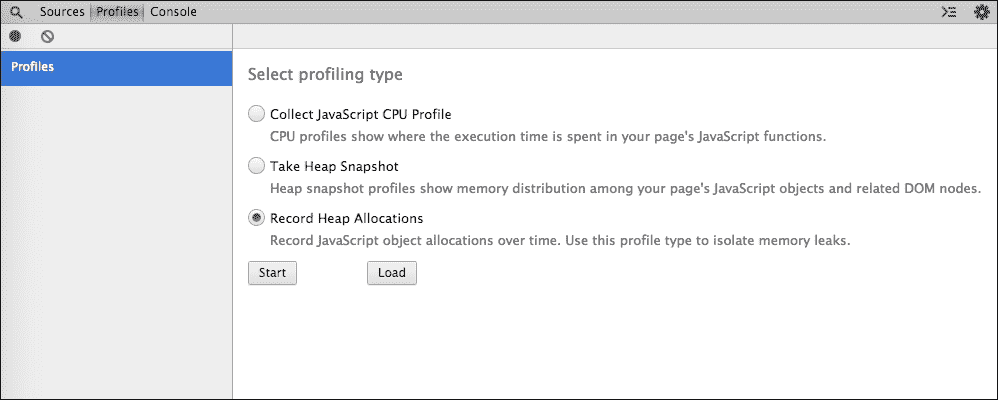
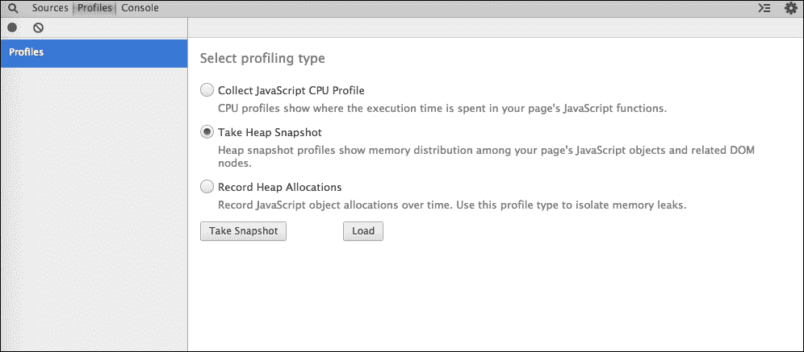
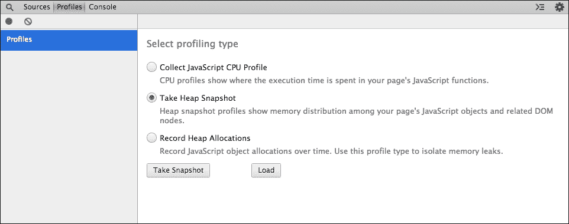

# 三、垃圾收集

编写应用时，管理可用内存既无聊又困难。当应用变得复杂时，很容易开始泄漏内存。许多编程语言都有自动内存管理，通过**垃圾** **收集器** ( **GC** )帮助开发人员忘记这种管理。垃圾回收只是内存管理的一部分，但它是最重要的一部分，负责回收不再使用的内存(垃圾)，方法是定期查看已释放的被引用对象并释放与之相关的内存。

气相色谱最常用的技术是监控参考计数。这意味着，对于每个对象，GC 保存引用它的其他对象的数量(计数)。当一个对象没有引用它时，它可以被收集，这意味着它可以被释放，它的内存可以被释放。

在 Node.js 引擎 V8 中，这种引用计数并不是经常检查的。相反，它被定期扫描，这个任务被称为一个周期。通常，这个周期不是原子的，这意味着程序将在这个周期运行时暂停执行。此外，为了保持引用计数，GC 需要内存。这意味着除了程序使用的内存之外，您的程序还有内存开销。此外，由于语言是动态的，对象可以改变类型，内存有时不能以最有效的方式使用。回想一下前面关于开发模式的章节，以便更有效地使用内存。

# 自动内存管理

GC 极大地简化了语言的使用，让开发人员有更多的时间关注应用的其他方面。此外，它可以减少(虽然不能完全消除)一种称为内存泄漏的错误，这种错误困扰着长期运行的应用和服务。然而，它的周期性任务会带来性能损失。它可以被注意到，也可以不被注意到，这取决于在短时间内使用和处理了多少内存。

通过将内存管理从开发人员手中转移出去，Node.js 消除或大大减少了几类错误:

*   **悬空指针错误**:当内存被释放，但仍有一个或多个指针引用该内存块时，就会出现这些错误。如果内存被重新分配，如果这些指针被用来从程序的其他部分改变块，将会导致不可预测的行为。在这种情况下，应用中会有两个以上的地方更改同一个内存块。这是一个特别难发现的 bug。
*   **双释放 bug**:内存释放一次后又释放一次时会出现这种情况。在这两者之间，它可能已经被应用的另一部分重新分配和使用，破坏了对重用块的访问。这类似于以前的内存，两个地方管理同一个块，但在这种情况下，一个试图使用它，另一个只会擦除数据。
*   **内存泄漏**:当对象在被释放之前被取消引用时，就会发生这种情况。当一个程序分配内存，使用内存，然后在显式释放内存之前处理对该内存的引用时，就会发生这种情况。如果这种行为反复发生，这种类型的错误可能会导致内存耗尽，尤其是在长期服务上。
*   **缓冲区溢出**:当试图写入比分配给任务的空间更多的信息时，就会出现这种情况。例如，当一个程序在某个地方分配了一个内存块，而这个内存块需要的空间比它分配的内存多，并且无法检测和重新分配所需的空间时，这是很常见的。该错误可能会导致应用或服务暂停。

另一方面，将内存管理从开发人员手中转移出去会消除对内存使用和管理方式的大量控制。当查看正在使用的内存并决定释放什么和什么时候释放未引用的对象时，垃圾收集将消耗资源，从而在您的应用执行期间产生不可预测的暂停。此外，垃圾收集器开始工作的时间可能是不可预测的，并且不受您的控制，这可能会在您的程序需要资源时引入不可预测的性能损失。

Node.js 就是这种情况，但是由于它使用了 V8，在`--expose_gc`标志下公开了一个`gc()`方法，所以可以手动强制使用。你不能决定它什么时候运行，但是如果你认为最好的话，你可以强迫它更频繁地运行。您还可以调整垃圾收集器的一些行为。要了解更多信息，请运行`--v8-options`节点。

没有办法阻止它的使用，所以你可以让它更频繁地运行，也许可以减少它的占用空间。垃圾收集的成本与引用对象的数量成正比，因此，如果在大量减少被引用对象后使用此方法，您可以保持应用的精简，并在以后减少垃圾收集的损失。


图 1:气相色谱内存图

## 记忆组织

把内存想象成元素的网格，通常是原语(数字和字符串)和对象(哈希表)。它可以表示为互连点的图形。内存可以用来保存对象信息或者引用其他对象。您可以将这种互连视为一个图表，其中叶子是保存信息的元素，其他节点是对其他节点的引用(在图 1 中，节点 **1** 、 **3** 、 **6** 和 **9** 是叶子)。

当使用 V8 时，有一些术语你可能会发现有助于更好地理解 V8 检查器或 Chrome 开发工具。物体本身所使用的记忆叫做**浅尺寸**。它用于存储它的即时值，通常，只有字符串和数组可以有很大的大小。

还有距离列，它是从根节点到节点本身的最小图形距离。根注释是引用开始指向其他节点的节点。在图 2 中，它将是节点 **2** ，因为没有指向 **2** 的箭头，图中的所有内容都从节点 **2** 开始。在检查员中，您将在**轮廓**中看到另一个术语，称为**保留尺寸**。这是删除对象后将释放的大小。它至少是对象的大小加上被引用对象的大小，这些对象也会立即被释放，因为它们也会被不引用。困惑？让我们看一个例子:



图 2:扫描前 GC 标记的节点

在上图中，您可以看到节点 **2** 是图中的根节点，因为没有节点引用(指向)它。该节点引用节点 **5** 和节点 **11** 。如果对节点 **11** 的引用被移除，则没有从节点 **2** (以及图的左侧部分的其余部分)到节点 **8** 和 **1** 的路径。这些节点是节点 **11** 的保留大小的一部分，因为没有它它们是无用的。当节点 **11** 被移除时，它们也将被移除。

## 内存泄漏

内存泄漏是可用内存的持续丢失，当程序反复无法释放不再使用的内存时就会发生。Node.js 应用会因为 GC 而间接遭受这个问题。这通常不是垃圾收集器的错，而是由一些不应该发生的对象破坏引起的，当您使用事件驱动的架构时，这并没有那么困难。

一旦应用达到中等规模，漏洞就会困扰每个开发人员。一旦你的程序开始与其他程序或客户端等外部元素进行更多的交互，或者当你的程序复杂性增加时，你就开始泄漏内存。由于某种原因，当您没有取消对应用中不再有用的对象的引用时，就会发生这种情况。如果垃圾收集器发现该对象仍然被其他对象引用，即使它对您的应用不再有用，它也会保留在堆中，并将被移动到一个名为**旧空间**的地方。

通常，对象会存在很长一段时间(从应用开始)或很短一段时间(为特定的客户端服务)。V8 GC 旨在利用这两种最常见的对象类型。GC 周期通常会清理这些寿命很短的对象，如果它认为这些对象仍然有用(也就是说，当它存活超过一两个 GC 周期时)，它会将它们移动到一个更大的区域，在那里它会开始积累垃圾。当这个区域变大时，垃圾收集周期的持续时间也会变大，你会开始注意到一些停顿(应用中的完全中断)一秒钟，甚至几秒钟。如果发生这种情况，这意味着您已经晚了分析您的应用。

对于较大的内存限制，例如 V8 的默认 1 GB 限制，如果您没有监控您的应用，当您的应用开始停止运行一秒钟时，您可能会注意到泄漏，在此之后，由于内存限制，它还需要几秒钟才能停止运行。对于大型对象集合，GC 周期变得非常占用 CPU，因此您应该真正监控 GC 内存管理，如果可能的话，避免更大的内存使用量。

## 事件发射器

由于 Node.js 使用了事件发射器，现在你应该会想到一个问题。由于 GC 只能扫描未被引用的对象，这意味着在您将事件侦听器附加到事件发射器后，不会收集它们:

```js
var net    = require("net");
var server = net.createServer();

server.on("connection", function (socket) {
  socket.pipe(socket);
});
server.listen(7, "0.0.0.0");
```

前面的代码只是一个回送服务器的例子。在这个例子中，GC 永远不会收集`server`，这在这种情况下很好，因为这是程序的主要对象。在其他情况下，您可能会遇到这样的情况，即您的发射器不会因为引用侦听器而被扫描。最重要的是，事件回调是函数 JavaScript 中的扩展对象——也不会被覆盖。

仔细看看前面的例子。想象一下，对于每个客户端(套接字)，您有更复杂的代码和一些私有协议。为了简化它，您使用适配器模式并创建一个抽象来访问每个客户端。这种抽象可以是一个事件发射器，作为将其与应用的其他部分分离的一种手段。当您的客户端保持连接时，任何没有显式取消事件连接的事件侦听器都不会被垃圾收集，即使它们不应该再存在(即使您将它们设置为 null 也是如此)。如果你的连接被卡住了，并且没有超时(例如，一个移动连接)，你会在一段时间内收集一大堆僵尸连接。

## 引用对象

GC 的主要目标是识别被破坏的内存。这是指应用不再使用的内存块，通常是因为代码不再引用它们。一旦识别，该内存可以被重新使用或释放给操作系统:

```js
function foo() {
  var bar = { x: 1 }, baz = bar.x;

  return bar; // baz is unreferenced but bar isn't
}
```

在前面的例子中，虽然`bar`和`baz`都是函数的局部变量(因为 JavaScript 函数作用域的原因)，`baz`在`return`之后会被尊重，但是`bar`不会，在你完全尊重它之前不会被释放。这可能看起来很明显，但是如果您的应用增长了，并且您开始使用您不知道它们如何在内部工作的外部模块，您可能会得到比您预期的更多的悬空引用:

```js
function foo() {
  var bar = { x: 1 };

  doSomething(bar);

  return bar;
}
```

现在假设您调用`foo`函数并忽略返回的对象。你可能会认为它会被忽略，但因为`doSomething`可能做了什么，所以不能保证。它可能提到了`bar`:

```js
function foo() {
  var bar = { x: 1 };

  doSomething(bar);

  bar = null;
}
```

现在想象一下，您不需要返回 bar 变量，因此在您不再需要它之后，您将它置为 null，从而破坏了引用。这样更好，对吗？不要。如果`doSomething`函数引用了`bar`，那么除了`doSomething`之外，您无法完全取消引用它。

更糟糕的是，函数可以通过在`bar`中创建引用自身的属性来创建循环引用。但是 GC 足够聪明，能够计算出应用的其余部分何时不再使用对象。这取决于你的代码有多复杂。请记住，如果有疑问(也就是说，它仍然在某个地方被引用，并且仍然可以使用)，GC 将不会扫描该对象。

在其工作的每个周期中，GC 在所谓的停止世界中暂停 V8 的执行，确切地知道所有对象在内存中的位置以及存在哪些引用。如果有太多的引用，GC 将只处理对象堆的部分，将暂停的影响降到最低。下图显示了 V8 如何扫描内存对象，标记未引用的对象(第一行，红色)，将它们从列表中清除(第二行)，然后通过删除对象之间的空白来压缩列表(第三行)



上一代 V8 GC 有两种清理旧空间的算法:标记-清除和标记-压缩。在这两种算法中，垃圾收集器遍历堆栈并标记可到达(引用)的对象。之后，它可以使用 mark-sweep 只扫描那些通过释放内存无法访问的对象，或者使用 mark-compact 重新分配和压缩使用的内存。这两种算法都在页面级别工作。这两种算法的问题在于，它们在中型应用中引入了显著的停顿。


2012 年，谷歌引入了一项改进，显著减少了垃圾收集周期中的暂停。它引入了增量标记，以避免穿越一个可能很大的区域。取而代之的是，GC 只是通过区域的一部分来做标记，使暂停变小。GC 不是大暂停，而是进行更多的小暂停。但改善并不止于此。标记后，GC 进行所谓的**懒扫**。由于垃圾收集器确切地知道哪些对象被引用了，哪些没有被引用(因为前面的标记步骤)，它现在可以释放未引用对象的内存(清除)。但它不需要马上这么做。相反，它只是根据需要进行扫描。将它们全部扫完之后，GC 再次开始新的标记循环。

只要你的程序保持精简和简单，气相色谱就会很快。不要创建一个单片怪物，然后寻找提高 V8 内存限制的方法。在 64 位机器上，您几乎可以将 1 GB 的限制增加一倍，但这不是解决方案。你真的应该分开你的申请。即便如此，如果您正在考虑更改限制，您正在寻找的节点可执行文件中的选项是`--max-stack-size`(以字节为单位)。

## 对象表示

在 V8 中，有三种基本类型:数字、布尔值和字符串。数字有两种形式:SMall 整数(SMI)，它是 31 位有符号整数，或者是在诸如 doubles(大数字)或具有扩展属性的数字等情况下的普通对象。字符串也有两种形式:一种在堆内，另一种在堆外，堆上有一个包装对象作为指向它的指针。

还有其他对象，如数组，它是具有神奇长度属性的对象，以及本机对象，它们不在堆本身中(它们像一些字符串一样被包装)，因此不受 GC 的管理或扫描。

## 对象堆

垃圾收集将对象存储在对象堆中。堆分为两个主要区域:新空间和旧空间，分别用于——你猜对了——新对象和旧对象。新空间是创建对象的地方，而旧空间是对象在一个或多个垃圾收集周期中存活下来后被移动到的地方。由于气相色谱不是持续工作的，在周期之间，可以创建对象，并在几分钟后销毁(和取消引用)。这是最常见的对象行为，因此 GC 通常会高效地对它们进行扫描。其他对象的寿命更长，因此它们将在循环中存活，因为它们一直被引用和使用。这是内存泄漏可能出现的地方。

这两个空间的设计有着不同的目标。新的空间比旧的空间小，设计得快速、有意义，并且 GC 分析得非常快。旧空间更大，包含一个周期后移动到那里的对象。这个旧空间可以增长到非常大的尺寸，从几兆字节到一千兆字节。这种设计利用了一种常见的行为，即大多数对象的生命周期都很短，因此只能生活在新的空间中，这种空间更小，管理起来也更快。

每个空间都由页面组成，这些页面是保存对象的连续内存块。每个页面的顶部都有几个标题和一个位图，告诉垃圾收集器对象使用页面的哪些部分。

物体的分离和从一个空间到另一个空间的移动会带来一些问题。一个显然是重新分配。另一个是需要知道新空间中对对象的引用是否只在旧空间中。这是一种可能的情况，应该阻止对象被清理，但这将迫使 GC 扫描旧空间来找出它，打破这种架构的速度。为了避免这种情况，GC 维护一个从旧空间到新空间的引用列表。这是另一个内存开销，但是扫描这个列表会更快。它通常很小，因为拥有这种引用相对较少。

新空间很小，创建新对象很便宜，因为这只是在已经保留的内存中增加一个指针的问题。当这个新空间变满时，会触发一个小循环来收集任何死对象并回收空间，从而避免使用更多空间。如果一个对象在两次小循环中幸存下来，它将被移动到旧空间。

在旧空间中，物体以一个大周期被扫过，这个周期比新空间中的小周期要少。当在这个空间中达到一定量的内存时，或者在更长的一段时间之后，可以触发这个主要循环。这个周期不太频繁，可能会让应用延迟一段时间。

## 堆快照

V8 允许你获得一个堆快照来分析对象间的内存分布。它允许您查看您的代码使用什么对象，每个对象使用了多少，以及如果您请求堆快照转储，应用如何使用它们。收集堆快照有几种方法，我们将研究其中的一些。

让我们创建一个小的泄漏程序，并用`node-inspector`模块进行分析。打开终端并全局安装节点检查器(`-g`)，以便您可以在机器的任何地方使用它。在下面的例子中，我们使用`sudo`，因为全局模块通常位于受限区域:

```js
$ sudo npm install -g node-inspector

```

检查员需要编译一些模块，所以你需要一个编译器。如果安装正确，您将看到已安装依赖项的列表，现在可以启动它了。一旦它运行，当你改变和重新启动你的程序时，没有必要重新启动它。现在不需要参数就可以启动它，并将其保留在终端选项卡中:

```js
$ node-inspector

```

您应该会看到类似于下面控制台输出的内容。你可以看到我用的是版本`0.10.0`，但是你可能会得到不同的版本。出于示例的目的，使用相同的版本实际上并不重要。根据您使用的版本，输出可能会有所不同。在这种情况下，它类似于这样:

```js
$ node-inspector
Node Inspector v0.10.0
Visit http://127.0.0.1:8080/debug?ws=127.0.0.1:8080&port=5858 to start debugging.

```

打开您的网页浏览器，前往输出中指示的页面。现在让我们创建一个名为`leaky`的程序。这个程序的目的是故意泄漏内存。创建一个文件夹，并在其中安装 V8 探查器:

```js
$ mkdir leaky
$ cd leaky
$ npm install v8-profiler

```

请注意，该模块也可能需要编译器。现在，在同一个文件夹中，创建一个名为`leaky.js`的文件，内容如下:

```js
require("v8-profiler");
var leakObject   = null;
function MemoryLeak() {
  var originalObject = leakObject;

  leakObject = {
    longString : new Array(1000000).join("*"),
    someMethod : function () {
      console.log(originalObject);
    }
  };
};

setInterval(MemoryLeak, 1000);
```

该程序可能会令人困惑，但其想法是让垃圾收集看不到我们正在强制它不要垃圾收集对象，因此会泄漏内存。如果你仔细观察，你会发现`leakObject`被重新定义了一个函数，如果被调用，这个函数会输出它，但是它引用它的方式让 GC 没有意识到我们可怕的目标。请注意，当运行这个程序时，您将很快耗尽内存，大概每秒 100 兆字节。在调试打开的情况下运行:

```js
$ node --debug leaky.js

```

现在进入你刚刚打开的网页，点击**刷新**，进入页面的**简介**选项卡，选择**拍摄堆快照**，点击**拍摄快照**按钮，如下图:



等一下再按一下那个按钮。您会看到快照出现在左侧栏上，您会注意到它们的大小不同。他们在增长，这是气相色谱泄露我们的废话计划。如果选择最后一张快照，并选择与第一张进行比较，您很容易注意到这一点。

您将看到大小和新对象都有变化。正增量意味着创建的对象多于销毁的对象。


您可以在前面的截图中看到检查器在显示快照时的样子。有一个构造函数或基本对象的列表。在这种情况下，因为我们正在比较**快照 3** 和**快照 1** ，所以有列显示了创建和删除了多少对象以及分配和释放了多少内存。

检测内存泄漏的另一个有用方法是记录对象随时间的分配。使用这个特殊的检查器，重启程序，前往**配置文件**，选择**记录堆分配**，点击**开始**，如这个截图所示:



检查员将开始记录。当你点击左上角的红色圆圈时，它就会停止。你会看到一个不断增长的时间线和每个小周期的分配条形图。如果你等一会儿，你会看到主要的循环和对象重新分配(从新区域到旧区域)。


停止后，您可以通过单击起点并将其拖动到终点来选择一段时间。您将只看到该期间的分配，而不是所有对象。您可以保存快照以供以后分析或比较。在这个具体的例子中，您可以看到每秒钟内存是如何快速消耗的。


您可以单击并展开对象列表来查看每个对象。如果您正在寻找特定的对象，可以使用顶部的过滤器。在本例中，您可以打开(字符串)组，您将看到我们在程序中创建了几个类似`********…`的实例。


使用`v8-profiler`可以让你不仅仅用`node-inspector`进行调试。例如，您可以拍摄代码的快照并对其进行分析——也许将其与以前的快照进行比较——或者序列化并保存它以供以后分析。

例如，考虑到前面的程序示例，我们可以定期检查堆栈中有多少节点:

```js
var profiler   = require("v8-profiler");
var leakObject = null;

function MemoryLeak() {
  var originalObject = leakObject;
  leakObject = {
    longString : new Array(1000000).join("*"),
    someMethod : function () {
      console.log(originalObject);
    }
  };
};

setInterval(MemoryLeak, 1000);
setInterval(function () {
  console.log("mem. nodes: %d", profiler.takeSnapshot().nodesCount);
}, 1000);
```

如果您运行这个新版本，您可能会得到类似于下面的输出。这是对象经受住了垃圾回收周期和内存泄漏的证明:

```js
$ node --debug leaky.js
Debugger listening on port 5858
mem. nodes: 37293
mem. nodes: 37645
mem. nodes: 37951
mem. nodes: 37991
mem. nodes: 38004
mem. nodes: 38012

```

这只是一个例子。如果您监控您的应用，并且内存在空闲时(没有做任何事情)随着时间的推移而不断增长，那么这是一个需要进一步分析的原因。第一类公民(所谓的类，指来自其他面向对象语言的人)将出现在应用快照的构造函数列表中。

还有其他模块可以用来分析和监控 Node.js 程序内存和垃圾收集器。`heapdump`模块是另一个简单的模块，可以帮助你偶尔将堆快照转储到磁盘。请记住，这些快照是同步的，因此如果堆很大，您的程序将暂停一会儿。

要使用它，只需像以前安装的其他模块一样安装它:

```js
$ npm install heapdump

```

然后改变你的程序来使用它。这里有一个程序的例子，它每分钟都给磁盘拍一张快照。这不是一个真实的或好的用例，但也许每小时一次的快照加上某种一次性脚本来避免填满磁盘不是一个坏主意:

```js
var heapdump = require("heapdump");

setInterval(function () {
  heapdump.writeSnapshot("" + Date.now() + ".heapsnapshot");
}, 60000);
```

文件的名称是以毫秒为单位的 Unix 日期，所以你永远都知道它是什么时候拍摄的。运行它并等待至少一个快照写入磁盘。在这种情况下，不需要在节点(`--debug`)中启用`debug`。

你一直在终端上运行，对吗？如果没有，请去做。然后像以前一样转到它的网页，刷新页面。



现在，不用选择**拍摄快照**，只需点击**加载**按钮，从你的磁盘中选择快照。这是另一种方法——离线方法——它通常更有用，因为您通常不会在调试模式下运行代码，也不会在 v8-inspector 中实时查看代码。另外，`node-inspector`会在你的程序停止时重启界面，所以你需要在重启节点检查器之前保存你的快照。

如果您知道内存泄漏，并且您能够通过强调它来重现它，那么您可以使用这种方法，并且可能通过为每个操作激活 GC 跟踪行来为程序的执行增加一点扭曲。然后，您可以看到 GC 何时进行清扫或标记。以下是监视垃圾收集操作时将看到的示例:

```js
$ node --trace_gc leaky.js
[26503]        8 ms: Scavenge 1.9 (37.5) -> 1.8 (37.5) MB, 0.8 ms 
[26503]        9 ms: Scavenge 1.9 (37.5) -> 1.9 (38.5) MB, 0.9 ms 
[26503]       53 ms: Scavenge 3.6 (39.5) -> 3.2 (39.5) MB, 0.7 ms 
[26503]      116 ms: Scavenge 5.1 (40.5) -> 4.1 (41.5) MB, 1.9 ms 
[26503]      155 ms: Scavenge 5.9 (41.5) -> 4.4 (41.5) MB, 1.1 ms 
[26503]     1227 ms: Scavenge 14.3 (50.1) -> 14.5 (50.1) MB, 0.8 ms (+ 1.6 ms in 1 steps since last GC) [allocation failure].
[26503]     1235 ms: Mark-sweep 14.6 (50.1) -> 5.4 (43.5) MB, 6.7 ms (+ 1.6 ms in 1 steps since start of marking, biggest step 1.6 ms) [HeapSnapshotGenerator::GenerateSnapshot] [GC in old space requested].

```

为了清晰起见，之前的部分输出被截断。编号 *26503* 是本例中程序的进程标识。您可以看到动作发生的时间以及在每条跟踪线的末端花费的时间。你也可以看到每个周期的动作(`Scavenge`和`Mark-sweep`)和记忆进化。

对于一个正在运行的应用，启用-trace-GC 是不可行的(如前面的命令)，您应该考虑一种适合您的体系结构的方法。其中一个选项是使用`heapdump`，每小时左右调度一次快照，保存最后 10 或 20 张快照。使用这种方法时，您至少应该查看最后一个快照，并将其与前一个快照进行比较，以了解应用如何随着时间的推移而开发。您可能会发现缓慢的内存泄漏或非常快的内存泄漏。对于快速的，您应该能够记录堆分配并快速停止泄漏。对于慢的，很难发现它，只有在很长一段时间内，你才能比较变化，找到幽灵。

还有另一个有用的模块可以帮你发现漏洞，这个模块叫做`memwatch`。这个模块将寻找堆大小的变化，当它发现堆大小不断增长时，它将发出一个泄漏事件(讽刺)。它还有一个不错的统计事件，包含了垃圾收集周期的信息。

让我们改变我们的初始程序，使用这个模块，而不是任何剖析器或检查器。是的，它不需要它们，甚至不需要您启用节点调试。首先，让我们安装它:

```js
$ npm install memwatch-next

```

现在，让我们将我们的程序更改为类似如下的内容:

```js
var memwatch   = require("memwatch-next");
var leakObject = null;

function MemoryLeak() {
  var originalObject = leakObject;

  leakObject = {
    longString : new Array(1000000).join("*"),
    someMethod : function () {
      console.log(originalObject);
    }
  };
};

setInterval(MemoryLeak, 1000);

memwatch.on("leak", function (info) {
console.log("GC leak detected: %d bytes growth", info.growth);
});

memwatch.on("stats", function (stats) {
  console.log("GC stats: %d cycles, %s bytes", stats.num_full_gc, stats.current_base);
});
```

现在只需运行程序。让它运行几秒钟，您将看到类似于以下示例输出的内容:

```js
$ node leaky.js
GC stats: 1 cycles, 13228416 bytes
GC stats: 2 cycles, 7509080 bytes
GC stats: 3 cycles, 7508408 bytes
GC stats: 4 cycles, 17317456 bytes
GC stats: 5 cycles, 23199080 bytes
GC stats: 6 cycles, 32201264 bytes
GC stats: 7 cycles, 45582232 bytes
GC leak detected: 40142200 bytes growth

```

您会注意到气相色谱循环经常发生。这是因为我们的程序行为。垃圾收集适应快速堆变化，并更频繁地触发周期。如果您将内存泄漏调用周期更改为 5 秒或更长，您将不得不等待更长时间才能看到周期和泄漏。

`memwatch`模块的工作原理是在 GC 扫描并压缩堆后检查堆的变化，所以它不会仅仅因为你的应用正在使用内存而触发泄漏，而是因为你正在使用它而没有处理它。

这个模块的另一个非常有用的特性是能够帮助您比较堆快照。您可以通过明确告诉模块您想要一个`heapdiff`来做到这一点。此时，模块快照堆，等待您再次调用快照，并对其进行比较。之后，它将为您提供一个对象，显示前后的总数以及每个快照的更改:

```js
var memwatch   = require("memwatch-next");
var heapdiff   = new memwatch.HeapDiff();
var leakObject = null;

function MemoryLeak() {
  var originalObject = leakObject;

  leakObject = {
    longString : new Array(1000000).join("*"),
    someMethod : function () {
      console.log(originalObject);
    }
  };
};

setInterval(MemoryLeak, 1000);

setTimeout(function () {
  console.log(heapdiff.end());
}, 10000);
```

运行程序。之后，您将获得类似如下的输出:

```js
$ node leaky.js
{ before: { nodes: 19524, size_bytes: 3131984, size: '2.99 mb' },
  after: { nodes: 21311, size_bytes: 12246992, size: '11.68 mb' },
  change:
   { size_bytes: 9115008,
     size: '8.69 mb',
     freed_nodes: 2201,
     allocated_nodes: 3988,
     details:
      [ [Object],
        [Object],
        [Object],
        [Object],
        …
        [Object],
        [Object],
        [Object] ] } }
```

如果你看一下`change.details`数组，你会注意到你有一个在堆之间变化的构造函数列表。如果快照之间发生泄漏，它将出现在其中一个项目中。在我们的例子中，它是字符串构造函数，因为我们泄漏了字符串变量。

不管有没有这些模块，您都应该监控内存的使用和增长。快速的内存泄漏会耗尽你的资源，让你的客户不开心。对于高负载应用，您应该创建压力测试，以便能够在应用进入生产之前检测到泄漏。

## 第三方管理

本着将您的应用划分为更小的组件的精神，有时将一些对象和操作移动到外部服务可能是一个更好的主意，这些服务有时针对特定的工作负载和对象格式进行了优化。在开始操作大型对象结构之前，先浏览一下这些服务器:

*   Memcached 用于键/值，Redis 用于列表、集合和哈希表
*   MongoDB 如果你想对数据运行 JavaScript，弹性搜索有趣的特性，比如数据超时或分层元素(文档内的文档)
*   如果您需要一些复杂映射/简化代码，请使用 HBase 如果您需要代码的轻量级版本，请使用 Hypertable
*   如果你需要一个图形数据库，和 Riak 来存储大的二进制数据

您的应用通常在内存上运行，因此如果它失败并停止，所使用的内存将会丢失，您的宝贵数据也会丢失。使用外部服务来处理数据(有时是操纵数据)可以大大减少内存占用。此外，这些服务通常允许您并发访问，使您能够为应用或工具的几个实例分担数据操作工作。

# 总结

您现在看到垃圾收集器任务并不那么容易，但是它在自动管理内存方面确实做得很好。你可以帮助它很多，特别是如果你在编写应用的时候考虑到了性能。为了避免长时间的垃圾收集周期，防止垃圾收集旧空间增长是必要的。否则，它会暂停您的应用，有时会强制您的服务重新启动。每次你创建一个新的变量，你分配内存和英寸更接近一个新的垃圾回收周期。即使理解了内存是如何管理的，有时也需要检查内存使用行为。最干净的方法是收集内存堆栈的快照堆，并使用 V8 检查器或其他类似软件进行分析。该接口是不言自明的，如果您按照浅大小、保留大小或引用计数对对象列表进行排序，泄漏就会简单地显示出来。但是在创建一个占用大量内存的应用之前，先看看数据库，不管是不是关系型的，因为这将帮助您存储和操作数据，避免自己使用该语言。请记住，JavaScript 不是为了创建计算密集型任务而设计的。如果您仍然需要执行更密集的任务，您可能希望对代码进行分析和改进，以便获得最佳性能。

在下一章中，我们将看到什么是概要分析，这样做的好处是什么，一些可用的分析工具，以及如何理解结果和升级代码。