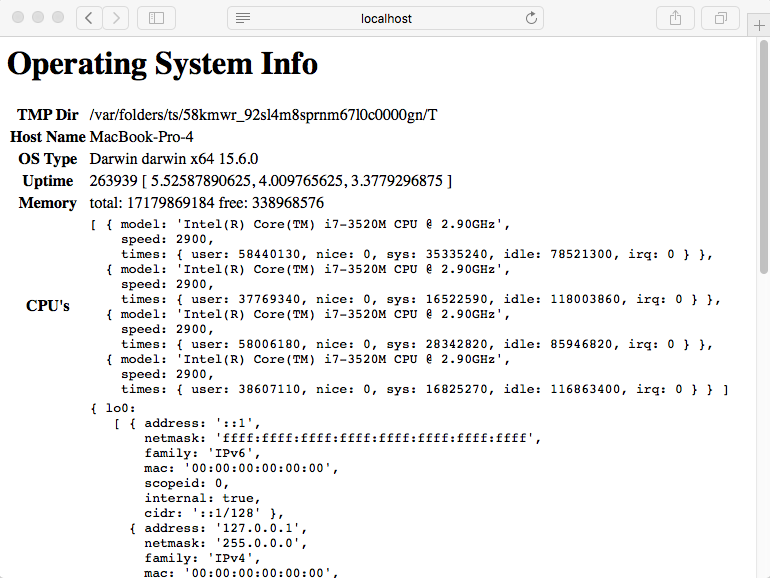
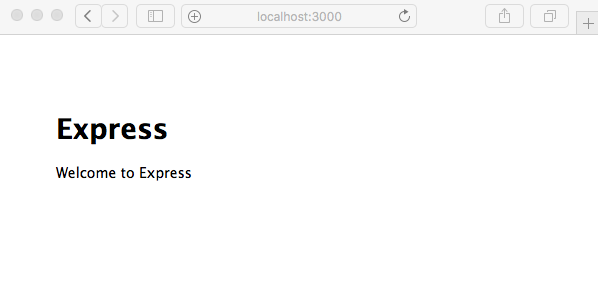
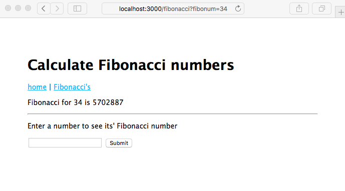

# 四、HTTP 服务器和客户端

既然您已经了解了 Node.js 模块，现在是时候通过构建一个简单的 Node.js web 应用来将这些知识应用到工作中了。在本章中，我们将继续介绍一个简单的应用，使我们能够探索 Node.js 的三种不同的应用框架。在后面的章节中，我们将构建一些更复杂的应用，但在我们能够行走之前，我们必须学会爬行。

本章将介绍以下主题：

*   事件发射器
*   侦听 HTTP 事件和 HTTP 服务器对象
*   HTTP 请求路由
*   ES2015 模板字符串
*   构建没有框架的简单 web 应用
*   Express 应用框架
*   Express 中间件功能
*   如何处理计算密集型代码
*   HTTP 客户端对象
*   使用 Express 创建简单的 REST 服务

# 使用 EventEmitter 发送和接收事件

EventEmitter 是 Node.js 的核心习惯用法之一。如果 Node.js 的核心思想是事件驱动的体系结构，那么从对象发出事件是该体系结构的主要机制之一。EventEmitter 是一个对象，它在其生命周期的不同点上提供事件通知。例如，HTTP 服务器对象发出与服务器对象的启动/关闭的每个阶段有关的事件，以及 HTTP 客户端发出的 HTTP 请求。

许多核心 Node.js 模块都是 EventEmitter，EventEmitter 是实现异步编程的优秀框架。EventEmitter 与 web 应用开发无关，但它们是 Node.js woodwork 的重要组成部分，您可能会忽略它们的存在

在本章中，我们将使用 HTTPServer 和 HTTPClient 对象。这两个都是`EventEmitter`类的子类，并依赖它为 HTTP 协议的每个步骤发送事件

# JavaScript 类和类继承

在开始`EventEmitter`课程之前，我们需要先看看 ES2015 的另一个功能：类。JavaScript 语言一直都有对象和类层次结构的概念，但没有其他语言那么正式。ES2015 类对象构建在现有的基于原型的继承模型上，但其语法与其他语言中的类定义非常相似。

例如，考虑这一类，我们将在后面的书中使用：

```js
class Note {
    constructor(key, title, body) {
        this._key = key;
        this._title = title;
        this._body = body;
    }
    get key() { return this._key; }
    get title() { return this._title; }
    set title(newTitle) { return this._title = newTitle; }
    get body() { return this._body; }
    set body(newBody) { return this._body = newBody; }
}
```

定义类后，可以将类定义导出到其他模块：

```js
module.exports.Note = class Note { .. }   # in CommonJS modules
export class Note { .. }                  # in ES6 modules
```

标有`get`或`set`关键字的函数是 getter 和 setter，用法如下：

```js
var aNote = new Note("key", "The Rain in Spain", "Falls mainly on the plain");
var key = aNote.key;
var title = aNote.title;
aNote.title = "The Rain in Spain, which made me want to cry with joy";
```

使用`new`创建类的新实例。您可以访问 getter 或 setter 函数，就像它是对象上的一个简单字段一样。在幕后调用 getter/setter 函数。

前面的实现不是最好的，因为`_title`和`_body`字段是公开可见的，并且没有数据隐藏或封装。稍后我们将讨论更好的实现。

一种是使用`instanceof`操作符测试给定对象是否属于某个类：

```js
if (anotherNote instanceof Note) {
    ... it's a Note, so act on it as a Note
}
```

最后，使用`extends`操作符声明一个子类，类似于在其他语言中所做的操作：

```js
class LoveNote extends Note {
    constructor(key, title, body, heart) {
        super(key, title, body);
        this._heart = heart;
    }
    get heart() { return this._heart; }
    set heart(newHeart) { return this._heart = newHeart; }
}
```

换句话说，`LoveNote`类拥有`Note`的所有字段，再加上这个名为`heart`的新字段。

# EventEmitter 类

`EventEmitter`对象在 Node.js 的事件模块中定义。直接使用`EventEmitter`类意味着执行`require('events')`。在大多数情况下，您将使用内部使用`EventEmitter`的现有对象，并且您不需要此模块。但在某些情况下，需要实现`EventEmitter`子类。

创建一个名为`pulser.js`的文件，其中包含以下代码：

```js
const EventEmitter = require('events');

class Pulser extends EventEmitter {
    start() {
        setInterval(() => {
            console.log(`${new Date().toISOString()} >>>> pulse`);
            this.emit('pulse');
            console.log(`${new Date().toISOString()} <<<< pulse`);
        }, 1000);
    }
}
module.exports = Pulser;
```

这定义了一个继承自`EventEmitter`的`Pulser`类。在较旧的 Node.js 版本中，这需要使用`util.inherits`，但新的类对象使子类化更简单

另一件需要检查的事情是回调函数中的`this.emit`如何引用 Pulser 对象。在 ES2015 arrow 函数之前，当我们的回调使用常规的`function`时，`this`不会引用`Pulser`对象。相反，它会引用与`setInterval`函数相关的其他对象。因为它是一个箭头函数，所以箭头函数中的`this`与外部函数中的`this`相同。

如果您需要使用`function`而不是箭头函数，此技巧将起作用：

```js
class Pulser extends EventEmitter {
    start() {
        var self = this;
        setInterval(function() {
            self.emit(...);
        });
    }
}
```

不同之处在于`this`对`self`的赋值。函数内部的`this`值不同，但`self`值在每个封闭范围内保持不变。现在我们有了箭头函数，这种广泛使用的技巧就不那么必要了。

如果您想要一个简单的 EventEmitter，但使用自己的类名，则扩展类的主体可以为空：

```js
class HeartBeat extends EventEmitter {}
const beatMaker = new HeartBeat();
```

`Pulser`类的目的是每秒向任何侦听器发送一次定时事件。`start`方法使用`setInterval`启动重复回调执行，每秒钟安排一次，调用`emit`将`pulse`事件发送给任何监听器。

现在，让我们看看如何使用`Pulser`对象。创建一个名为`pulsed.js`的新文件，其中包含：

```js
const Pulser = require('./pulser');

// Instantiate a Pulser object
const pulser = new Pulser();
// Handler function
pulser.on('pulse', () => {
    console.log(`${new Date().toISOString()} pulse received`);
});
// Start it pulsing
pulser.start(); 
```

在这里，我们创建一个`Pulser`对象并使用它的`pulse`事件。调用`pulser.on('pulse')`为`pulse`事件建立连接以调用回调函数。然后它调用`start`方法以使流程继续进行。

将其输入文件，并将文件命名为`pulsed.js`。运行时，应看到以下输出：

```js
$ node pulsed.js 
2017-12-03T06:24:10.272Z >>>> pulse
2017-12-03T06:24:10.275Z pulse received
2017-12-03T06:24:10.276Z <<<< pulse
2017-12-03T06:24:11.279Z >>>> pulse
2017-12-03T06:24:11.279Z pulse received
2017-12-03T06:24:11.279Z <<<< pulse
2017-12-03T06:24:12.281Z >>>> pulse
2017-12-03T06:24:12.281Z pulse received
2017-12-03T06:24:12.282Z <<<< pulse
```

这给了你一点关于`EventEmitter`课程的实用知识。现在让我们看看它的操作理论。

# 事件发射器理论

使用`EventEmitter`类，您的代码会发出其他代码可以接收的事件。这是一种连接程序中两个分离部分的方法，就像量子纠缠意味着两个电子可以从任何距离相互通信一样。看起来很简单。

事件名称可以是对您有意义的任何内容，您可以定义任意多个事件名称。事件名称仅通过使用事件名称调用`.emit`来定义。没有什么正式的事情要做，也没有事件名称的注册。只需调用`.emit`就足以定义事件名称。

By convention, the event name `error` indicates errors.

对象使用`.emit`函数发送事件。事件被发送到任何已注册以从对象接收事件的侦听器。程序通过调用对象的`.on`方法注册接收事件，给出事件名称和事件处理函数。

没有针对所有事件的中心分发点。相反，`EventEmitter`对象的每个实例管理自己的侦听器集，并将其事件分发给这些侦听器。

通常，需要随事件一起发送数据。为此，只需将数据作为参数添加到`.emit`调用中，如下所示：

```js
this.emit('eventName', data1, data2, ..); 
```

当程序接收到该事件时，数据显示为回调函数的参数。您的节目将收听以下事件：

```js
emitter.on('eventName', (data1, data2, ...theArgs) => { 
  // act on event 
}); 
```

事件接收者和事件发送者之间没有握手。也就是说，事件发送方只需继续其业务，就不会收到任何有关接收到的事件、采取的任何操作或发生的任何错误的通知。

在本例中，我们使用了 ES2015 的另一个特性，`rest`操作符，这里显示为`...theArgs.`*rest*操作符将任意数量的剩余函数参数捕获到一个数组中。由于`EventEmitter`可以传递任意数量的参数，`rest`操作员可以自动接收任意数量的参数，这是天作之合，或者是在 TC-39 委员会。

# HTTP 服务器应用

HTTP 服务器对象是所有 No.js Web 应用的基础。对象本身非常接近 HTTP 协议，其使用需要了解该协议。在大多数情况下，您将能够使用一个应用框架，例如隐藏 HTTP 协议细节的 Express，使程序员能够专注于业务逻辑。

我们在[第 2 章](02.html)*设置 Node.js*中已经看到了一个简单的 HTTP 服务器应用，如下所示：

```js
const http = require('http'); 
http.createServer((req, res) => { 
  res.writeHead(200, {'Content-Type': 'text/plain'}); 
  res.end('Hello, World!\n'); 
}).listen(8124, '127.0.0.1'); 
console.log('Server running at http://127.0.0.1:8124'); 
```

`http.createServer`函数创建一个`http.Server`对象。因为它是一个`EventEmitter`，所以可以用另一种方式来书写，以使该事实更加明确：

```js
const http = require('http'); 
const server = http.createServer(); 
server.on('request',  (req, res) => { 
  res.writeHead(200, {'Content-Type': 'text/plain'}); 
  res.end('Hello, World!\n'); 
}); 
server.listen(8124, '127.0.0.1'); 
console.log('Server running at http://127.0.0.1:8124'); 
```

`request`事件接受一个函数，该函数接收`request`和`response`对象。`request`对象具有来自 web 浏览器的数据，`response`对象用于收集响应中要发送的数据。`listen`功能使服务器开始监听并安排为来自 web 浏览器的每个请求发送事件。

现在，让我们看看基于 URL 的不同操作更有趣的内容。

创建一个名为`server.js`的新文件，其中包含以下代码：

```js
const http = require('http'); 
const util = require('util'); 
const url  = require('url'); 
const os   = require('os'); 

const server = http.createServer(); 
server.on('request', (req, res) => { 
    var requrl = url.parse(req.url, true); 
    if (requrl.pathname === '/') { 
        res.writeHead(200, {'Content-Type': 'text/html'}); 
        res.end( 
`<html><head><title>Hello, world!</title></head> 
<body><h1>Hello, world!</h1> 
<p><a href='/osinfo'>OS Info</a></p> 
</body></html>`); 
    } else if (requrl.pathname === "/osinfo") { 
        res.writeHead(200, {'Content-Type': 'text/html'}); 
        res.end( 
`<html><head><title>Operating System Info</title></head> 
<body><h1>Operating System Info</h1> 
<table> 
<tr><th>TMP Dir</th><td>${os.tmpdir()}</td></tr> 
<tr><th>Host Name</th><td>${os.hostname()}</td></tr> 
<tr><th>OS Type</th><td>${os.type()} ${os.platform()} ${os.arch()} ${os.release()}</td></tr> 
<tr><th>Uptime</th><td>${os.uptime()} ${util.inspect(os.loadavg())}</td></tr> 
<tr><th>Memory</th><td>total: ${os.totalmem()} free: ${os.freemem()}</td></tr> 
<tr><th>CPU's</th><td><pre>${util.inspect(os.cpus())}</pre></td></tr> 
<tr><th>Network</th><td><pre>${util.inspect(os.networkInterfaces())}</pre></td></tr> 
</table> 
</body></html>`); 
    } else { 
        res.writeHead(404, {'Content-Type': 'text/plain'}); 
        res.end("bad URL "+ req.url); 
    } 
}); 

server.listen(8124); 
console.log('listening to http://localhost:8124'); 
```

要运行它，请键入以下命令：

```js
$ node server.js
listening to http://localhost:8124
```

此应用与 PHP 的`sysinfo`函数类似。查阅节点的`os`模块，以提供有关服务器的信息。此示例可以轻松扩展以收集有关服务器的其他数据：



任何 web 应用的核心部分都是将请求路由到请求处理程序的方法。`request`对象附带了几条数据，其中两条对于路由请求非常有用：`request.url`和`request.method`字段。

在`server.js`中，我们参考`request.url`数据，确定在解析后显示哪一页（使用`url.parse`），以简化消化过程。在本例中，我们可以对`pathname`进行简单的比较，以确定使用哪个处理程序方法。

一些 web 应用关心所使用的 HTTP 动词（`GET`、`DELETE`、`POST`等），必须参考`request`对象的`request.method`字段。例如，`POST`经常用于`FORM`提交。

请求 URL 的`pathname`部分用于将请求分派给正确的处理程序。虽然这种基于简单字符串比较的路由方法适用于小型应用，但它很快就会变得笨拙。较大的应用将使用模式匹配来使用请求 URL 的一部分来选择请求处理程序函数，并使用其他部分从 URL 中提取请求数据。我们将在后面的*快速入门*一节中看到这一点。

在 npm 存储库中搜索 URL 匹配会发现几个有希望的包，这些包可用于实现请求匹配和路由。像 Express 这样的框架已经具备了这一功能并经过了测试。

如果无法识别请求 URL，服务器将使用`404`结果代码发回错误页面。结果代码告知浏览器请求的状态，`200`代码表示一切正常，`404`代码表示请求的页面不存在。当然，还有许多其他 HTTP 响应代码，每个代码都有自己的含义。

# ES2015 多行和模板字符串

上一个示例显示了 ES2015 引入的两个新功能：多行和模板字符串。该功能旨在简化我们的生活，同时创建文本字符串。

现有的字符串表示法使用单引号和双引号。模板字符串用反勾字符分隔，该字符也称为**严重重音**：

```js
`template string text` 
```

在 ES2015 之前，实现多行字符串的一种方法是以下构造：

```js
["<html><head><title>Hello, world!</title></head>", 
 "<body><h1>Hello, world!</h1>", 
 "<p><a href='/osinfo'>OS Info</a></p>", 
 "</body></html>"] 
.join('\n') 
```

是的，这是本书以前版本中相同示例中使用的代码。这就是我们可以利用 ES2015 所做的：

```js
`<html><head><title>Hello, world!</title></head> 
<body><h1>Hello, world!</h1> 
<p><a href='/osinfo'>OS Info</a></p> 
</body></html>`
```

这是更简洁和直接的。开头的引号在第一行，结尾的引号在最后一行，中间的所有内容都是字符串的一部分。

模板字符串功能的真正用途是支持字符串，我们可以轻松地将值直接替换到字符串中。大多数其他编程语言都支持这种功能，现在 JavaScript 也支持这种功能。

在 ES2015 之前，程序员可以编写如下代码：

```js
[ ... 
  "<tr><th>OS Type</th><td>{ostype} {osplat} {osarch} {osrelease}</td></tr>" 
  ... ].join('\n') 
.replace("{ostype}", os.type()) 
.replace("{osplat}", os.platform()) 
.replace("{osarch}", os.arch()) 
.replace("{osrelease}", os.release()) 
```

同样，这是从本书以前版本的相同示例中提取的。对于模板字符串，可以按如下方式编写：

```js
`...<tr><th>OS Type</th><td>${os.type()} ${os.platform()} ${os.arch()} ${os.release()}</td></tr>...` 
```

在模板字符串中，`${ .. }`括号内的部分被解释为表达式。它可以是一个简单的数学表达式、一个变量引用，也可以是一个函数调用。

最后要提到的是缩进问题。在普通编码中，将长参数列表缩进到与包含函数调用相同的级别。但是，对于这些多行字符串示例，文本内容与第 0 列齐平。怎么了？

这可能会妨碍代码的可读性，因此值得权衡代码可读性与另一个问题：HTML 输出中的字符过多。我们用于缩进代码以提高可读性的空格将成为字符串的一部分，并以 HTML 格式输出。通过使代码与列 0 齐平，我们不会以牺牲代码可读性为代价向输出中添加多余的空格。

这种方法还存在安全风险。你确认数据是安全的了吗？它不会构成安全攻击的基础？在本例中，我们处理的是来自安全数据源的简单字符串和数字。因此，此代码与 Node.js 运行时一样安全。用户提供的内容，以及恶意用户提供不安全内容并将某种恶意软件植入目标计算机的风险如何？

出于这一点和许多其他原因，使用外部模板引擎通常更安全。像 Express 这样的应用可以很容易地做到这一点。

# HTTP 嗅探器–侦听 HTTP 对话

HTTPServer 对象发出的事件可用于交付 web 应用的直接任务之外的其他目的。下面的代码演示了一个侦听所有 HTTP 服务器事件的有用模块。它可能是一个有用的调试工具，还可以演示 HTTP 服务器对象的操作方式。

js 的 HTTP 服务器对象是一个`EventEmitter`，HTTP 嗅探器只监听每个服务器事件，打印出与每个事件相关的信息。

我们将要做的是：

1.  创建一个模块`httpsniffer`，用于打印有关 HTTP 请求的信息。
2.  将该模块添加到我们刚刚创建的`server.js`脚本中。
3.  重新运行该服务器以查看 HTTP 活动的跟踪。

创建一个名为`httpsniffer.js`的文件，其中包含以下代码：

```js
const util = require('util'); 
const url  = require('url'); 

const timestamp = () => { return new Date().toISOString(); }

exports.sniffOn = function(server) { 
  server.on('request', (req, res) => { 
    console.log(`${timestamp()} e_request`); 
    console.log(`${timestamp()} ${reqToString(req)}`); 
  }); 
  server.on('close', errno => { console.log(`${timestamp()} e_close 
  ${errno}`); }); 
  server.on('checkContinue', (req, res) => { 
    console.log(`${timestamp()} e_checkContinue`); 
    console.log(`${timestamp()} ${reqToString(req)}`); 
    res.writeContinue(); 
  }); 
  server.on('upgrade', (req, socket, head) => { 
    console.log(`${timestamp()} e_upgrade`); 
    console.log(`${timestamp()} ${reqToString(req)}`);
  }); 
  server.on('clientError', () => { console.log(`${timestamp()} 
  e_clientError`); }); 
}; 

const reqToString = exports.reqToString = (req) => { 
  var ret=`req ${req.method} ${req.httpVersion} ${req.url}` +'\n'; 
  ret += JSON.stringify(url.parse(req.url, true)) +'\n'; 
  var keys = Object.keys(req.headers); 
  for (var i = 0, l = keys.length; i < l; i++) { 
    var key = keys[i]; 
    ret += `${i} ${key}: ${req.headers[key]}` +'\n'; 
  } 
  if (req.trailers) ret += util.inspect(req.trailers) +'\n'; 
  return ret; 
}; 
```

那是很多代码！但关键在于`sniffOn`功能。当给定 HTTP 服务器对象时，它使用`.on`函数来附加侦听器函数，这些侦听器函数打印关于每个发出事件的数据。它给出了应用上 HTTP 流量的相当详细的跟踪。

为了使用它，只需在`server.js`中的`listen`函数之前插入以下代码：

```js
require('./httpsniffer').sniffOn(server); 
server.listen(8124); 
console.log('listening to http://localhost:8124'); 
```

有了它，就可以像前面一样运行服务器了。您可以在浏览器中访问`http://localhost:8124/`，看到以下控制台输出：

```js
$ node server.js 
listening to http://localhost:8124
2017-12-03T19:21:33.162Z request
2017-12-03T19:21:33.162Z request GET 1.1 /
{"protocol":null,"slashes":null,"auth":null,"host":null,"port":null,"hostname":null,"hash":null,"search":"","query":{},"pathname":"/","path":"/","href":"/"}
0 host: localhost:8124
1 upgrade-insecure-requests: 1
2 accept: text/html,application/xhtml+xml,application/xml;q=0.9,*/*;q=0.8
3 user-agent: Mozilla/5.0 (Macintosh; Intel Mac OS X 10_11_6) AppleWebKit/604.3.5 (KHTML, like Gecko) Version/11.0.1 Safari/604.3.5
4 accept-language: en-us
5 accept-encoding: gzip, deflate
6 connection: keep-alive
{}

2017-12-03T19:21:42.154Z request
2017-12-03T19:21:42.154Z request GET 1.1 /osinfo
{"protocol":null,"slashes":null,"auth":null,"host":null,"port":null,"hostname":null,"hash":null,"search":"","query":{},"pathname":"/osinfo","path":"/osinfo","href":"/osinfo"}
0 host: localhost:8124
1 connection: keep-alive
2 upgrade-insecure-requests: 1
3 accept: text/html,application/xhtml+xml,application/xml;q=0.9,*/*;q=0.8
4 user-agent: Mozilla/5.0 (Macintosh; Intel Mac OS X 10_11_6) AppleWebKit/604.3.5 (KHTML, like Gecko) Version/11.0.1 Safari/604.3.5
5 referer: http://localhost:8124/
6 accept-language: en-us
7 accept-encoding: gzip, deflate
{}
```

现在您有了一个窥探 HTTPServer 事件的工具。这个简单的技术打印事件数据的详细日志。该图案可用于任何`EventEmitter`对象。您可以使用此技术检查程序中`EventEmitter`对象的实际行为。

# Web 应用框架

HTTPServer 对象与 HTTP 协议非常接近。虽然这一功能强大，就像驾驶杆式换档汽车让您对驾驶体验进行低级控制一样，但典型的 web 应用编程最好在更高级别上完成。有人使用汇编语言编写 web 应用吗？最好将 HTTP 细节抽象出来，集中精力于应用。

js 开发者社区已经开发了很多应用框架来帮助抽象 HTTP 协议细节的不同方面。其中，Express 是最受欢迎的，Koa（AutoT1）http://koajs.com/ 应该考虑使用，因为它是由同一个团队开发的，并且对`async`功能有完全集成的支持。

ExpressJS Wiki 有一个构建在 ExpressJS 之上的框架列表，或者与之相关的工具。这包括模板引擎、中间件模块等。ExpressJS Wiki 位于[https://github.com/expressjs/express/wiki](https://github.com/expressjs/express/wiki) 。

使用 web 框架的一个原因是，它们通常提供了 20 多年来 web 应用开发中使用的最佳实践。通常的最佳做法包括：

*   为错误 URL 提供页面（404 页面）
*   为任何注入脚本攻击屏蔽 URL 和表单
*   支持使用 cookie 来维护会话
*   记录使用情况跟踪和调试的请求
*   认证
*   处理静态文件，如图像、CSS、JavaScript 或 HTML
*   为缓存代理提供缓存控制头
*   限制页面大小或执行时间等事项

Web 框架帮助您将时间投入到任务中，而不会迷失在实现 HTTP 协议的细节中。对程序员来说，提取细节是提高效率的一种由来已久的方法。当使用一个库或框架提供处理细节的预打包函数时，这一点尤其正确。

# 快速入门

Express 可能是最流行的 Node.js web 应用框架。它非常流行，是 MEAN Stack 首字母缩略词的一部分。MEAN 指的是 MongoDB、ExpressJS、AngularJS 和 Node.js。Express 被描述为类似 Sinatra，指的是一个流行的 Ruby 应用框架，它不是一个固执己见的框架，这意味着框架作者在构建应用时不会强加自己的观点。这意味着 Express 对代码的结构没有严格要求；你只要用你认为最好的方式写就行了。

您可以访问[的 Express 主页 http://expressjs.com/](http://expressjs.com/) 。

很快，我们将实现一个使用 Express 计算斐波那契数的简单应用，在后面的章节中，我们将使用 Express 做更多的工作。我们还将探讨如何缓解前面讨论的计算密集型代码的性能问题。

在撰写本书时，Express 4.16 是当前版本，Express 5 正在进行 Alpha 测试。根据 ExpressJS 网站，Express4 和 Express5 之间几乎没有区别。

让我们从安装快速生成器开始。虽然我们可以开始编写一些代码，但是 express generator 提供了一个空白的启动应用。我们将接受它并修改它。

使用以下命令安装它：

```js
$ mkdir fibonacci
$ cd fibonacci
$ npm install express-generator@4.x  
```

这不同于 Express 网站上建议的安装方法，即使用`-g`标签进行全局安装。我们还使用显式版本号来确保兼容性。在写这本书时，`express-generator@5.x`并不存在。当它确实存在时，人们应该能够按照以下说明使用 5.x 版本。

前面，我们讨论了现在有多少人不建议在全球范围内安装模块。在 12 因素模型中，强烈建议不要安装全局依赖项，这就是我们正在做的。

结果是在`./node_modules/.bin`目录中安装了一个`express`命令：

```js
$ ls node_modules/.bin/
express 
```

按如下方式运行`express`命令：

```js
$ ./node_modules/.bin/express --help

  Usage: express [options] [dir]

  Options:

    -h, --help          output usage information
    -V, --version       output the version number
    -e, --ejs           add ejs engine support (defaults to jade)
        --hbs           add handlebars engine support
    -H, --hogan         add hogan.js engine support
    -c, --css <engine>  add stylesheet <engine> support 
 (less|stylus|compass|sass) (defaults to plain css)
        --git           add .gitignore
    -f, --force         force on non-empty directory 
```

我们可能不希望每次运行`express-generator`应用时都键入`./node_modules/.bin/express`，或者，就这一点而言，我们也不希望每次运行提供命令行实用程序的任何其他应用时都键入`./node_modules/.bin/express`。请参阅[第 3 章](03.html)、*Node.js 模块*中关于将该目录添加到`PATH`变量的讨论。

现在您已经在 AuthT1 目录中安装了 AutoT0}，使用它来设置空白框架应用：

```js
$ ./node_modules/.bin/express --view=hbs --git . 
destination is not empty, continue? [y/N] y 

 create : . 
 create : ./package.json 
 create : ./app.js 
 create : ./.gitignore 
 create : ./public 
 create : ./routes 
 create : ./routes/index.js 
 create : ./routes/users.js 
 create : ./views 
 create : ./views/index.hbs 
 create : ./views/layout.hbs 
 create : ./views/error.hbs 
 create : ./bin 
 create : ./bin/www 
 create : ./public/javascripts 
 create : ./public/images 
 create : ./public/stylesheets 
 create : ./public/stylesheets/style.css 

 install dependencies: 
 $ cd . && npm install 

 run the app: 
 $ DEBUG=fibonacci:* npm start 

 $ npm uninstall express-generator 
 added 83 packages and removed 5 packages in 4.104s

```

这为我们创建了一系列文件，我们将在一分钟内浏览这些文件。`node_modules`目录中仍有`express-generator`模块，该模块现在已不再有用。我们可以把它放在那里忽略它，或者我们可以将它添加到它生成的`package.json`的`devDependencies`中。或者，我们可以卸载它，如图所示。

接下来要做的是按照我们告诉的方式运行空白应用。显示的命令`npm start`依赖于提供的`package.json`文件的一部分：

```js
"scripts": { 
    "start": "node ./bin/www" 
}, 
```

`npm`工具支持脚本，这些脚本是自动化各种任务的方法。我们将在整本书中使用此功能来做各种事情。当十二因素应用模型建议自动化所有管理任务时，`npm`脚本功能是一个很好的机制。大多数`npm`脚本都是使用`npm run scriptName`命令运行的，但`start`命令是由`npm`明确识别的，可以如前所示运行。

这些步骤是：

1.  安装依赖项`npm install`。
2.  使用`npm start`启动应用。
3.  可选择修改`package.json`以始终与调试一起运行。

要安装依赖项并运行应用，请键入以下命令：

```js
$ npm install
$ DEBUG=fibonacci:* npm start

> fibonacci@0.0.0 start /Users/David/chap04/fibonacci
> node ./bin/www

 fibonacci:server Listening on port 3000 +0ms
```

以这种方式设置`DEBUG`变量将打开一些调试输出，其中包括关于监听端口 3000 的消息。否则，我们不会被告知这些信息。这个语法在 Bash shell 中用于运行带有环境变量的命令。如果出现错误，请尝试只运行“`npm start`”，然后阅读下一节。

我们可以修改提供的`npm start`脚本，以始终在启用调试的情况下运行应用。将`scripts`部分更改为以下内容：

```js
"scripts": { 
    "start": "DEBUG=fibonacci:* node ./bin/www" 
},
```

由于输出显示它正在监听端口`3000`，我们将浏览器指向
`http://localhost:3000/`并看到以下输出：



# 在 Windows cmd.exe 命令行中设置环境变量

如果您使用的是 Windows，则上一个示例可能会失败，错误是 DEBUG 不是已知命令。问题是 Windows shell，`cmd.exe`程序不支持 Bash 命令行结构

在命令行的开头添加`VARIABLE=value`是 Linux 和 macOS 上某些 Shell（如 Bash）所特有的。它只为正在执行的命令行设置环境变量，是临时覆盖特定命令的环境变量的一种非常方便的方法

显然，如果您的`package.json`要在不同的操作系统中使用，就需要一个解决方案。

最好的解决方案似乎是 npm 存储库中的`cross-env`包，请参阅：[https://www.npmjs.com/package/cross-env](https://www.npmjs.com/package/cross-env) 安装此软件包后，`package.json`中`scripts`部分的命令可以像 Linux/macOS 上的 Bash 一样设置环境变量。用法如下：

```js
"scripts": { 
    "start": "cross-env DEBUG=fibonacci:* node ./bin/www" 
}, 
"dependencies": {
    ...
    "cross-env": "5.1.x"
}
```

然后按如下方式执行该命令：

```js
C:\Users\david\Documents\chap04\fibonacci>npm install
... output from installing packages
C:\Users\david\Documents\chap04\fibonacci>npm run start

> fibonacci@0.0.0 start C:\Users\david\Documents\chap04\fibonacci
> cross-env DEBUG=fibonacci:* node ./bin/www

fibonacci:server Listening on port 3000 +0ms
GET / 304 90.597 ms - -
GET /stylesheets/style.css 304 14.480 ms - -
GET /fibonacci 200 84.726 ms - 503
GET /stylesheets/style.css 304 4.465 ms - -
GET /fibonacci?fibonum=22 500 1069.049 ms - 327
GET /stylesheets/style.css 304 2.601 ms - -
```

# 浏览默认的 Express 应用

我们有一个正在运行的空白快速应用；让我们看看为我们生成了什么。我们这样做是为了在开始编写`Fibonacci`应用之前熟悉 Express。

因为我们使用了`--view=hbs`选项，所以将此应用设置为使用`Handlebars.js`模板引擎。手柄是建立在胡子之上的，最初是为在浏览器中使用而设计的；更多信息请参见其主页[http://handlebarsjs.com/](http://handlebarsjs.com/) 。【T4 版本已在此处显示，并已与【T4 版本】一起打包使用】https://github.com/pillarjs/hbs

一般来说，模板引擎可以将数据插入生成的网页中。ExpressJS Wiki 有一个用于 Express[的模板引擎列表 https://github.com/expressjs/express/wiki#template-发动机](https://github.com/expressjs/express/wiki#template-engines)。

`views`目录包含两个文件`error.hbs`和`index.hbs`。`hbs`扩展名用于把手文件。另一个文件`layout.hbs`是默认页面布局。Handlebar 有几种方法来配置布局模板，甚至部分（代码片段可以包含在任何地方）。

`routes`目录包含初始路由设置，即处理特定 URL 的代码。我们稍后将修改这些。

`public`目录将包含应用不生成的资产，但只发送到浏览器。最初安装的是一个 CSS 文件`public/stylesheets/style.css`。

`package.json`文件包含我们的依赖项和其他元数据。

`bin`目录包含我们前面看到的`www`脚本。这是一个 Node.js 脚本，它初始化 HTTPServer 对象，在 TCP 端口上开始侦听，并调用我们将要讨论的最后一个文件`app.js`。这些脚本初始化 Express、连接路由模块以及执行其他操作。

在`www`和`app.js`脚本中有很多内容，所以让我们从应用初始化开始。我们先看一下`app.js`中的几行：

```js
var express = require('express'); 
... 
var app = express(); 
... 
module.exports = app; 
```

这意味着`app.js`是导出`express`模块返回的对象的模块。但是，它不会启动 HTTP 服务器对象。

现在，让我们转到`www`脚本。首先要看到的是，它从以下行开始：

```js
#!/usr/bin/env node
```

这是一种用于生成命令脚本的 Unix/Linux 技术。它说使用`node`命令作为脚本运行以下内容。换句话说，我们有 Node.js 代码，并且指示操作系统使用 Node.js 运行时执行该代码：

```js
$ ls -l bin/www
-rwx------  1 david  staff  1595 Feb  5  1970 bin/www
```

我们还可以看到脚本是由`express-generator`执行的

调用`app.js`模块如下：

```js
var app = require('../app'); 
... 
var port = normalizePort(process.env.PORT || '3000'); 
app.set('port', port); 
... 
var server = http.createServer(app); 
... 
server.listen(port); 
server.on('error', onError); 
server.on('listening', onListening); 
```

我们看到港口`3000`来自哪里；它是`normalizePort`函数的一个参数。我们还看到，设置`PORT`环境变量将覆盖默认端口`3000`。最后，我们看到 HTTP 服务器对象是在这里创建的，并且被告知使用在`app.js`中创建的应用实例。尝试运行以下命令：

```js
$ PORT=4242 DEBUG=fibonacci:* npm start
```

应用现在告诉您它正在收听端口`4242`，您可以在那里思考生命的意义。

`app`对象下一步传递给`http.createServer()`。查看 Node.js 文档可以发现，这个函数使用了一个`requestListener`，这只是一个函数，它使用了我们之前看到的`request`和`response`对象。因此，`app`对象就是这样一个函数。

最后，`www`脚本启动服务器，监听我们指定的端口。

现在让我们更详细地了解一下`app.js`：

```js
app.set('views', path.join(__dirname, 'views')); 
app.set('view engine', 'hbs');
```

这告诉 Express 在`views`目录中查找模板并使用 EJS 模板引擎。

`app.set`功能用于设置应用属性。在我们阅读（[时，浏览 API 文档将非常有用 http://expressjs.com/en/4x/api.html](http://expressjs.com/en/4x/api.html) 。

接下来是一系列的`app.use`调用：

```js
app.use(logger('dev')); 
app.use(bodyParser.json()); 
app.use(bodyParser.urlencoded({ extended: false })); 
app.use(cookieParser()); 
app.use(express.static(path.join(__dirname, 'public'))); 

app.use('/', routes); 
app.use('/users', users); 
```

`app.use`函数装载中间件函数。这是我们稍后将讨论的一个重要术语。目前，假设中间件功能是在路由处理过程中执行的。这意味着此处命名的所有功能都在`app.js`中启用：

*   使用 Morgan 请求记录器启用日志记录。访问[https://www.npmjs.com/package/morgan](https://www.npmjs.com/package/morgan) 用于其文档。
*   `body-parser`模块负责解析 HTTP 请求主体。访问[https://www.npmjs.com/package/body-parser](https://www.npmjs.com/package/body-parser) 用于其文档。
*   `cookie-parser`模块用于解析 HTTP cookies。访问[https://www.npmjs.com/package/cookie-parser](https://www.npmjs.com/package/cookie-parser) 用于其文档。
*   静态文件 web 服务器配置为服务`public`目录中的资产文件。
*   两个路由模块`routes`和`users`，用于设置处理哪些 URL 的功能。

# Express 中间件

让我们通过讨论中间件功能对我们的应用的作用来完成`app.js`的演练。我们在脚本末尾有一个示例：

```js
app.use(function(req, res, next) { 
  var err = new Error('Not found'); 
  err.status = 404; 
  next(err); 
}); 
```

评论说*捕获 404 并转发给错误处理程序*。您可能知道，HTTP 404 状态意味着未找到请求的资源。我们需要告诉用户他们的请求没有得到满足，也许可以给他们看一张鸟群从海里拉鲸鱼的照片。这是这样做的第一步。在进入报告此错误的最后一步之前，您必须了解中间件是如何工作的。

我们面前确实有一个中间件功能。请参阅[中的文件 http://expressjs.com/en/guide/writing-middleware.html](http://expressjs.com/en/guide/writing-middleware.html) 。

中间件函数有三个参数。前两个`request`和`response`相当于 Node.js HTTP 请求对象的`request`和`response`。但是，Express 使用附加数据和功能扩展对象。最后一个，`next`是一个回调函数，用于控制请求-响应周期何时结束，并可用于沿中间件管道发送错误。

传入的请求由第一个中间件函数处理，然后由下一个中间件函数处理，然后由下一个中间件函数处理，依此类推。每次请求被传递到中间件函数链上时，都会调用`next`函数。如果使用错误对象调用`next`，如图所示，则会发出错误信号。否则，控制只会传递给链中的下一个中间件函数。

如果不调用`next`会发生什么？HTTP 请求将挂起，因为没有给出响应。中间件函数在调用`response`对象上的函数时给出响应，如`res.send`或`res.render`。

例如，考虑包含 Ty0T0TA:

```js
app.get('/', function(req, res) { res.send('Hello World!'); }); 
```

它不调用`next`，而是调用`res.send`。通过发送请求的方法（】的响应是正确的。如果既不调用`next`也不调用`res.send`，则请求永远不会得到响应。

因此，中间件功能执行以下四项操作之一：

*   执行自己的业务逻辑。前面显示的请求记录器中间件就是一个示例。
*   修改请求或响应对象。`body-parser`和
    `cookie-parser`都这样做，寻找要添加到`request`对象的数据。
*   调用`next`继续执行下一个中间件函数，否则将发出错误信号。
*   发送响应，结束循环。

中间件执行的顺序取决于它们添加到`app`对象的顺序。首先执行第一个添加的命令，依此类推。

# 中间件和请求路径

到目前为止，我们已经看到了两种中间件功能。其中，第一个参数是 handler 函数。在另一个参数中，第一个参数是包含 URL 片段的字符串，第二个参数是处理函数。

实际上，`app.use`有一个可选的第一个参数：安装中间件的路径。路径是与请求 URL 的模式匹配，如果 URL 与该模式匹配，则会触发给定函数。甚至有一种方法可以在 URL 中提供命名参数：

```js
app.use('/user/profile/:id', function(req, res, next) { 
    userProfiles.lookup(req.params.id, (err, profile) => { 
          if (err) return next(err); 
          // do something with the profile 
          // Such as display it to the user 
          res.send(profile.display()); 
    }); 
}); 
```

此路径规范有一个模式`:id`，该值将落在`req.params.id`中。在本例中，我们建议使用用户配置文件服务，对于此 URL，我们希望显示有关命名用户的信息。

另一种使用中间件功能的方法是使用特定的 HTTP 请求方法。使用`app.use`时，任何请求都会被匹配，但实际上，`GET`请求的行为应该与`POST`请求不同。调用`app.METHOD`，其中`METHOD`与 HTTP 请求动词之一匹配。也就是说，`app.get`匹配`GET`方法，`app.post`匹配`POST`方法，依此类推。

最后，我们到达`router`对象。这是一种中间件，显式地用于根据请求的 URL 路由请求。请看`routes/users.js`：

```js
var express = require('express'); 
var router = express.Router(); 
router.get('/', function(req, res, next) { 
  res.send('respond with a resource'); 
}); 
module.exports = router; 
```

我们有一个模块，其`exports`对象是路由。这个路由只有一条路由，但它可以有任何数量的路由，你认为是合适的。

在`app.js`中增加如下内容：

```js
app.use('/users', users); 
```

我们为`app`对象讨论的所有函数都适用于`router`对象。如果请求匹配，路由将获得其自身处理功能链的请求。一个重要的细节是，当请求被传递到路由实例时，请求 URL 前缀被剥离。

您会注意到`users.js`中的`router.get`与`'/'`匹配，并且该路由安装在`'/users'`上。实际上，`router.get`也与`/users`匹配，但由于前缀被删除，因此它指定了`'/'`。这意味着路由可以安装在不同的路径前缀上，而无需更改路由实现。

# 错误处理

现在，我们终于可以返回到生成的`app.js`，404 错误页面未找到，以及应用可能希望向用户显示的任何其他错误。

中间件函数通过向`next`函数调用传递值来指示错误。一旦 Express 发现错误，它将跳过任何剩余的非错误路由，并且只将其传递给错误处理程序。错误处理函数的签名与我们前面看到的不同。

在我们正在检查的`app.js`中，这是我们的错误处理程序：

```js
app.use(function(err, req, res, next) { 
  res.status(err.status || 500); 
  res.render('error', { 
    message: err.message, 
    error: {} 
  }); 
}); 
```

错误处理函数有四个参数，在熟悉的`req`、`res`和`next`中增加了`err`。对于这个处理程序，我们使用`res.status`设置 HTTP 响应状态代码，并使用`res.render`使用`views/error.hbs`模板格式化 HTML 响应。`res.render`函数获取数据，用模板呈现数据以生成 HTML。

这意味着我们的应用中的任何错误都将在这里出现，绕过任何剩余的中间件功能。

# 用 Express 应用计算 Fibonacci 序列

斐波那契数是整数序列：*0、1、1、2、3、5、8、13、21、34。。。*

列表中的每个条目都是列表中前两个条目的总和。这个序列是 1202 年由比萨的莱昂纳多发明的，他也被称为斐波纳契。计算斐波那契序列项的一种方法是我们前面介绍的递归算法。我们将创建一个使用斐波那契实现的快速应用，然后探索几种方法来缓解计算密集型算法中的性能问题。

让我们从前面一步中创建的空白应用开始。我们让您将该应用命名为*斐波那契*是有原因的。我们在提前考虑。

在`app.js`中，对文件的顶部进行以下更改：

```js
const express = require('express');
const hbs = require('hbs');
const path = require('path');
const favicon = require('serve-favicon');
const logger = require('morgan');
const cookieParser = require('cookie-parser');
const bodyParser = require('body-parser');

const index = require('./routes/index');
const fibonacci = require('./routes/fibonacci');

const app = express();

// view engine setup
app.set('views', path.join(__dirname, 'views'));
app.set('view engine', 'hbs');
hbs.registerPartials(path.join(__dirname, 'partials'));

// uncomment after placing your favicon in /public
//app.use(favicon(path.join(__dirname, 'public', 'favicon.ico')));
app.use(logger('dev'));
app.use(bodyParser.json());
app.use(bodyParser.urlencoded({ extended: false }));
app.use(cookieParser());
app.use(express.static(path.join(__dirname, 'public')));

app.use('/', index);
app.use('/fibonacci', fibonacci);
```

这大部分是`express-generator`给我们的。`var`语句已更改为`const`，以获得一点点额外的舒适感。我们显式导入了`hbs`模块，以便进行一些配置。我们为 Fibonacci 导入了一个路由模块，我们马上就会看到。

对于`Fibonacci`应用，我们不需要支持用户，因此删除了该路由模块。`fibonacci`模块用于查询一个数字，我们将计算该数字的斐波那契数。

在顶层目录中，创建一个文件`math.js`，其中包含这个极其简单的斐波那契实现：

```js
exports.fibonacci = function(n) {
    if (n === 0) return 0;
    else if (n === 1 || n === 2) return 1;
    else return exports.fibonacci(n-1) + exports.fibonacci(n-2);
};
```

在`views`目录中，查看`express-generator`创建的名为`layout.hbs`的文件：

```js
<!DOCTYPE html>
<html>
  <head>
    <title>{{title}}</title>
    <link rel='stylesheet' href='/stylesheets/style.css' />
  </head>
  <body>
    {{{body}}}
  </body>
</html>
```

此文件包含我们将用于 HTML 页面的结构。按照 Handlebar 语法，我们可以看到`{{title}}`出现在 HTML`title`标记中。这意味着当我们调用`res.render`时，我们应该提供一个`title`属性。`{{{body}}}`标记是视图模板内容所在的位置。

将`views/index.hbs`更改为仅包含以下内容：

```js
<h1>{{title}}</h1>
{{> navbar}}
```

这是我们应用的首页。它将插入到`layout.hbs`中的`{{{body}}}`位置。标记物`{{> navbar}}`是指一个名为`navbar`的部分。前面，我们配置了一个名为`partials`的目录来保存部分。现在，让我们创建一个文件`partials/navbar.html`，其中包含：

```js
<div class='navbar'>
<p><a href='/'>home</a> | <a href='/fibonacci'>Fibonacci's</a></p>
</div>
```

这将作为一个导航栏，包含在每个页面上。

创建一个文件`views/fibonacci.hbs`，包含以下代码：

```js
<h1>{{title}}</h1>
{{> navbar}}
{{#if fiboval}}
  <p>Fibonacci for {{fibonum}} is {{fiboval}}</p>
  <hr/>
{{/if}}
<p>Enter a number to see its' Fibonacci number</p>
<form name='fibonacci' action='/fibonacci' method='get'>
<input type='text' name='fibonum' />
<input type='submit' value='Submit' />
</form>
```

Remember that the files in `views` are templates into which data is rendered. They serve the View aspect of the **Model-View-Controller** (**MVC**) paradigm, hence the directory name.

在`routes`目录中，删除`user.js`模块。它是由 Express 框架生成的，但是我们不会在这个应用中使用它。

在`routes/index.js`中，将路由功能更改为：

```js
/* GET home page. */ 
router.get('/', function(req, res, next) { 
  res.render('index', { title: "Welcome to the Fibonacci Calculator" }); 
}); 
```

传递给`res.render`的匿名对象包含我们提供给布局和视图模板的数据值

然后，最后，在`routes`目录中，创建一个名为`fibonacci.js`的文件，其中包含以下代码：

```js
const express = require('express'); 
const router = express.Router(); 

const math = require('../math'); 
router.get('/', function(req, res, next) { 
  if (req.query.fibonum) { 
    // Calculate directly in this server 
    res.render('fibonacci', { 
      title: "Calculate Fibonacci numbers", 
      fibonum: req.query.fibonum, 
      fiboval: math.fibonacci(req.query.fibonum) 
    }); 
  } else { 
    res.render('fibonacci', { 
      title: "Calculate Fibonacci numbers", 
      fiboval: undefined 
    }); 
  } 
}); 

module.exports = router; 
```

`package.json`已经设置好，因此我们可以使用`npm start`来运行脚本，并始终启用调试消息。现在我们已经准备好了：

```js
$ npm start

> fibonacci@0.0.0 start /Users/david/chap04/fibonacci
> DEBUG=fibonacci:* node ./bin/www

fibonacci:server Listening on port 3000 +0ms 
```

如图所示，您可以访问`http://localhost:3000/`并查看我们的产品：


此页面由`views/index.hbs`模板呈现。只需点击 Fibonacci 的链接即可进入下一页，当然这是从`views/fibonacci.hbs`模板呈现的。在该页面上，您可以输入一个数字，单击提交按钮，然后获得答案（提示：如果您希望在合理的时间内得到答案，请在`40`下方选择一个数字）：



让我们浏览一下应用，讨论它是如何工作的。

`app.js`中有两条路由：`/`路由，由`routes/index.js`处理；`/fibonacci`路由，由`routes/fibonacci.js`处理。

`res.render`函数使用提供的数据值呈现命名模板，并将结果作为 HTTP 响应发出。对于该应用的主页，呈现代码（`routes/index.js`和模板（`views/index.hbs`）并不多，所有操作都发生在斐波那契页面上。

`views/fibonacci.hbs`模板包含用户输入数字的表单。因为它是一个`GET`表单，当用户点击提交按钮时，浏览器会在`/fibonacci`URL 上发出 HTTP`GET`。`/fibonacci`上的`GET`与另一个`GET`的区别在于 URL 是否包含名为`fibonum`的查询参数。当用户第一次进入页面时，没有`fibonum`，因此无需计算。用户输入一个数字并点击提交后，会有一个`fibonum`和一些要计算的内容。

Express 自动解析查询参数，使其作为`req.query`可用。这意味着`routes/fibonacci.js`可以快速检查是否存在`fibonum`。如果有，则调用`fibonacci`函数计算值。

之前，我们要求您输入一个小于`40`的数字。继续输入一个更大的数字，例如`50`，但是去喝杯咖啡休息一下，因为这需要一段时间来计算。或者继续阅读下一节，在这里我们开始讨论计算密集型代码的使用。

# 计算密集型代码和 Node.js 事件循环

此斐波那契示例旨在说明应用的一个重要考虑因素，但效率低下。运行长时间计算时，Node.js 事件循环会发生什么变化？要查看效果，请打开两个浏览器窗口，每个窗口都打开到斐波那契页面。其中一个输入数字`55`或更大，另一个输入`10`。请注意，第二个窗口冻结，如果您让它运行足够长的时间，答案最终将在两个窗口中弹出。发生的情况是 Node.js 事件循环被阻止处理事件，因为斐波那契算法正在运行，并且永远不会向事件循环屈服。

由于 Node.js 只有一个执行线程，因此处理请求依赖于快速返回事件循环的请求处理程序。通常，异步编码样式确保事件循环定期执行。

即使是从地球另一端的服务器加载数据的请求也是如此，因为异步 I/O 是非阻塞的，控制会快速返回到事件循环。我们选择的天真的斐波那契函数不适合这个模型，因为它是一个长期运行的阻塞操作。这种类型的事件处理程序会阻止系统处理请求，并阻止 Node.js 执行它的本意，即成为速度极快的 web 服务器。

在这种情况下，长响应时间问题是显而易见的。响应时间迅速增加，你可以去西藏度假，也许在用斐波那契数字响应的时间内，在秘鲁转世成为美洲驼！

要更清楚地看到这一点，请创建一个名为`fibotimes.js`的文件，其中包含以下代码：

```js
const math = require('./math'); 
const util = require('util'); 

for (var num = 1; num < 80; num++) {
    let now = new Date().toISOString();
    console.log(`${now} Fibonacci for ${num} = ${math.fibonacci(num)}`);
} 
```

现在运行它。您将获得以下输出：

```js
$ node fibotimes.js 
2017-12-10T23:04:42.342Z Fibonacci for 1 = 1
2017-12-10T23:04:42.345Z Fibonacci for 2 = 1
2017-12-10T23:04:42.345Z Fibonacci for 3 = 2
2017-12-10T23:04:42.345Z Fibonacci for 4 = 3
2017-12-10T23:04:42.345Z Fibonacci for 5 = 5
...
2017-12-10T23:04:42.345Z Fibonacci for 10 = 55
2017-12-10T23:04:42.345Z Fibonacci for 11 = 89
2017-12-10T23:04:42.345Z Fibonacci for 12 = 144
2017-12-10T23:04:42.345Z Fibonacci for 13 = 233
2017-12-10T23:04:42.345Z Fibonacci for 14 = 377
...
2017-12-10T23:04:44.072Z Fibonacci for 40 = 102334155
2017-12-10T23:04:45.118Z Fibonacci for 41 = 165580141
2017-12-10T23:04:46.855Z Fibonacci for 42 = 267914296
2017-12-10T23:04:49.723Z Fibonacci for 43 = 433494437
2017-12-10T23:04:54.218Z Fibonacci for 44 = 701408733
...
2017-12-10T23:06:07.531Z Fibonacci for 48 = 4807526976
2017-12-10T23:07:08.056Z Fibonacci for 49 = 7778742049
^C
```

这将快速计算 Fibonacci 序列的前 40 个左右的成员，但在第 40 个成员之后，每个结果将花费几秒钟的时间，并从那里快速降级。在依赖于快速返回事件循环的单线程系统上执行此类代码是站不住脚的。包含此类代码的 web 服务会给用户带来较差的性能。

Node.js 中有两种解决此问题的通用方法：

*   **算法重构**：也许，就像我们选择的斐波那契函数一样，您的一个算法是次优的，可以重写以更快。或者，如果不是更快，也可以将其拆分为通过事件循环调度的回调。稍后我们将研究一种这样的方法。
*   **创建后端服务**：你能想象一个专门计算斐波那契数的后端服务器吗？好的，也许不是，但是实现后端服务器以减轻前端服务器的工作是很常见的，我们将在本章末尾实现后端 Fibonacci 服务器。

# 算法重构

为了证明我们手上有人为的问题，这里有一个更有效的`Fibonacci`函数：

```js
exports.fibonacciLoop = function(n) { 
    var fibos = []; 
    fibos[0] = 0; 
    fibos[1] = 1; 
    fibos[2] = 1; 
    for (var i = 3; i <= n; i++) { 
        fibos[i] = fibos[i-2] + fibos[i-1]; 
    } 
    return fibos[n]; 
} 
```

如果我们用对`math.fibonacciLoop`的调用代替`math.fibonacci`，则`fibotimes`程序运行得更快。即使这也不是最有效的实施；例如，一个简单的预连线查找表以牺牲一些内存为代价要快得多。

如下编辑`fibotimes.js`并重新运行脚本。这些数字飞过的如此之快，你的脑袋都快晕过去了：

```js
for (var num = 1; num < 8000; num++) {
    let now = new Date().toISOString();
    console.log(`${now} Fibonacci for ${num} = ${math.fibonacciLoop(num)}`);
}
```

有些算法并不容易优化，计算结果仍然需要很长时间。在本节中，我们将探讨如何处理效率低下的算法，因此将坚持使用效率低下的斐波那契实现。

可以将计算划分为块，然后通过事件循环分派这些块的计算。将以下代码添加到`math.js`：

```js
exports.fibonacciAsync = function(n, done) {
    if (n === 0) done(undefined, 0);
    else if (n === 1 || n === 2) done(undefined, 1);
    else {
        setImmediate(() => {
            exports.fibonacciAsync(n-1, (err, val1) => {
                if (err) done(err);
                else setImmediate(() => {
                    exports.fibonacciAsync(n-2, (err, val2) => {
                        if (err) done(err);
                        else done(undefined, val1+val2);
                    });
                });
            });
        });
    }
};
```

这将`fibonacci`函数从异步函数转换为传统的面向回调的异步函数。我们在计算的每个阶段都使用`setImmediate`来确保事件循环定期执行，并且服务器可以轻松地处理其他请求，同时快速进行计算。它不会减少所需的计算量；这仍然是愚蠢、低效的斐波那契算法。我们所做的就是通过事件循环扩展计算。

在`fibotimes.js`中，我们可以使用：

```js
const math = require('./math');
const util = require('util');

(async () => {
   for (var num = 1; num < 8000; num++) {
       await new Promise((resolve, reject) => {
           math.fibonacciAsync(num, (err, fibo) => {
               if (err) reject(err);
               else {
                   let now = new Date().toISOString();
                   console.log(`${now} Fibonacci for ${num} = 
                   ${fibo}`);
                   resolve();
               }
           })
       })
    }
})().catch(err => { console.error(err); });
```

此版本的`fibotimes.js`执行相同的操作，我们只需键入`node fibotimes`，但是，使用`fibonacciAsync`将需要更改服务器。

因为它是一个异步函数，所以我们需要更改路由代码。创建一个名为`routes/fibonacci-async1.js`的新文件，其中包含以下内容：

```js
const express = require('express');
const router = express.Router();

const math = require('../math');

router.get('/', function(req, res, next) {
  if (req.query.fibonum) {
    // Calculate using async-aware function, in this server
    math.fibonacciAsync(req.query.fibonum, (err, fiboval) => {
      res.render('fibonacci', {
        title: "Calculate Fibonacci numbers",
        fibonum: req.query.fibonum,
        fiboval: fiboval
      });
    });
  } else {
    res.render('fibonacci', {
      title: "Calculate Fibonacci numbers",
      fiboval: undefined
    });
  }
});

module.exports = router;
```

这与前面的相同，只是为异步斐波那契计算重写。

在`app.js`中，对应用接线进行以下更改：

```js
// const fibonacci = require('./routes/fibonacci');
const fibonacci = require('./routes/fibonacci-async1');
```

通过此更改，服务器在计算较大的斐波那契数时不再冻结。当然，计算仍然需要很长时间，但至少应用的其他用户没有被阻止。

您可以通过在应用中再次打开两个浏览器窗口来验证这一点。在一个窗口中输入 60，在另一个窗口中开始请求更小的斐波那契数。与原来的`fibonacci`功能不同，使用`fibonacciAsync`可以让两个窗口都给出答案，不过如果你真的在第一个窗口中输入了 60，那么你最好去西藏度假三个月：


这取决于您和您的特定算法，来选择如何最好地优化您的代码和处理您可能有的任何长时间运行的计算。

# 发出 HTTP 客户端请求

减少计算密集型代码的下一种方法是将计算推送到后端进程。为了探索这种策略，我们将使用 HTTP 客户机对象从后端 Fibonacci 服务器请求计算。然而，在我们研究它之前，让我们首先大致讨论一下如何使用 HTTP 客户机对象。

Node.js 包含一个 HTTP 客户端对象，用于发出 HTTP 请求。它能够发出任何类型的 HTTP 请求。在本节中，我们将使用 HTTP 客户端对象发出类似于调用**表示性状态转移**（**REST**web 服务的 HTTP 请求。

让我们从一些受`wget`或`curl`命令启发的代码开始，这些命令用于发出 HTTP 请求并显示结果。创建一个名为`wget.js`的文件，其中包含以下代码：

```js
const http = require('http');
const url = require('url');
const util = require('util');

const argUrl = process.argv[2];
const parsedUrl = url.parse(argUrl, true);

// The options object is passed to http.request
// telling it the URL to retrieve
const options = {
  host: parsedUrl.hostname,
  port: parsedUrl.port,
  path: parsedUrl.pathname,
  method: 'GET'
};

if (parsedUrl.search) options.path += "?"+parsedUrl.search;

const req = http.request(options);
// Invoked when the request is finished
req.on('response', res => {
  console.log('STATUS: ' + res.statusCode);
  console.log('HEADERS: ' + util.inspect(res.headers));
  res.setEncoding('utf8');
  res.on('data', chunk => { console.log('BODY: ' + chunk); });
  res.on('error', err => { console.log('RESPONSE ERROR: ' + err); });
});
// Invoked on errors
req.on('error', err => { console.log('REQUEST ERROR: ' + err); });
req.end();
```

您可以按如下方式运行脚本：

```js
$ node wget.js http://example.com
STATUS: 200
HEADERS: { 'accept-ranges': 'bytes',
 'cache-control': 'max-age=604800',
 'content-type': 'text/html',
 date: 'Sun, 10 Dec 2017 23:40:44 GMT',
 etag: '"359670651"',
 expires: 'Sun, 17 Dec 2017 23:40:44 GMT',
 'last-modified': 'Fri, 09 Aug 2013 23:54:35 GMT',
 server: 'ECS (rhv/81A7)',
 vary: 'Accept-Encoding',
 'x-cache': 'HIT',
 'content-length': '1270',
 connection: 'close' }
BODY: <!doctype html>
<html>
...
```

打印输出中还有更多内容，即`http://example.com/`页面的 HTML。`wget.js`的目的是发出 HTTP 请求，并向您展示大量响应细节。HTTP 请求通过`http.request`方法启动，如下所示：

```js
var http = require('http'); 
var options = { 
  host: 'example.com', 
  port: 80, 
  path: null, 
  method: 'GET' 
}; 
var request = http.request(options); 
request.on('response', response => {
  ...
});
```

`options`对象描述要发出的请求，响应到达时调用`callback`函数。`options`对象相当简单，`host`、`port`和`path`字段指定了请求的 URL。`method`字段必须是 HTTP 谓词之一（`GET`、`PUT`、`POST`等等）。您还可以为 HTTP 请求中的头提供一个`headers`数组。例如，您可能需要提供 cookie：

```js
var options = { 
  headers: { 'Cookie': '.. cookie value' } 
}; 
```

`response`对象本身就是`EventEmitter`，它发出`data`和`error`事件。`data`事件在数据到达时调用，`error`事件当然在错误时调用。

请求对象是一个`WritableStream`，对于包含数据的 HTTP 请求非常有用，例如`PUT`或`POST`。这意味着`request`对象具有向请求者写入数据的`write`函数。HTTP 请求中的数据格式由标准**多用途互联网邮件扩展**（**MIME**）指定，最初创建该标准是为了给我们提供更好的电子邮件。大约在 1992 年，WWW 社区与 MIME 标准委员会合作，该委员会正在为多部分、多媒体丰富的电子邮件开发一种格式。今天，收到外观奇特的电子邮件是如此普遍，以至于人们可能不知道电子邮件过去是纯文本的。MIME 类型被开发用来描述每一段数据的格式，而 WWW 社区则采用这种方式在 web 上使用。例如，将内容类型设置为[HTML]的 post。

# 从 Express 应用调用 REST 后端服务

现在我们已经了解了如何进行 HTTP 客户端请求，我们可以了解如何在 Express web 应用中进行 REST 查询。这实际上意味着向后端服务器发出 HTTP`GET`请求，后端服务器用 URL 表示的斐波那契数进行响应。为此，我们将重构`Fibonacci`应用，生成一个从应用调用的斐波那契服务器。虽然这对于计算斐波那契数来说有些过分，但它让我们了解在 Express 中实现多层应用堆栈的基础知识。

本质上，调用 REST 服务是一种异步操作。这意味着调用 REST 服务将涉及一个函数调用来启动请求，以及一个回调函数来接收响应。REST 服务是通过 HTTP 访问的，因此我们将使用 HTTP 客户机对象来实现这一点。

# 用 Express 实现一个简单的 REST 服务器

虽然 Express 有一个强大的模板系统，使其适合向浏览器交付 HTML 网页，但它也可以用于实现简单的 REST 服务。我们前面显示的参数化 URL（`/user/profile/:id`）可以充当 REST 调用的参数。Express 使得返回 JSON 编码的数据变得很容易。

现在，创建一个名为`fiboserver.js`的文件，其中包含以下代码：

```js
const math  = require('./math'); 
const express = require('express'); 
const logger = require('morgan'); 
const app = express(); 
app.use(logger('dev')); 
app.get('/fibonacci/:n', (req, res, next) => { 
    math.fibonacciAsync(Math.floor(req.params.n), (err, val) => { 
        if (err) next('FIBO SERVER ERROR ' + err); 
        else res.send({ n: req.params.n, result: val });
    }); 
}); 
app.listen(process.env.SERVERPORT); 
```

这是一个精简的 Express 应用，直接提供斐波那契计算服务。它支持的一种路由使用我们已经使用过的相同函数处理斐波那契计算。

这是我们第一次看到`res.send`被使用。这是一种灵活的发送响应的方法，可以采用一组头值（对于 HTTP 响应头）和 HTTP 状态代码。在这里使用时，它会自动检测对象，将其格式化为 JSON 文本，并将其与正确的`Content-Type`一起发送。

在`package.json`中，将其添加到`scripts`部分：

```js
"server": "SERVERPORT=3002 node ./fiboserver" 
```

这将自动启动我们的斐波那契服务。

Note that we're specifying the TCP/IP port via an environment variable and using that variable in the application. This is another aspect of the Twelve-Factor application model: to put configuration data in the environment.

现在，让我们运行它：

```js
$ npm run server
> fibonacci@0.0.0 server /Users/David/chap04/fibonacci
> SERVERPORT=3002 node ./fiboserver 
```

然后，在一个单独的命令窗口中，我们可以使用`curl`程序对此服务发出一些请求：

```js
$ curl -f http://localhost:3002/fibonacci/10
{"n":"10","result":55}
$ curl -f http://localhost:3002/fibonacci/11
{"n":"11","result":89}
$ curl -f http://localhost:3002/fibonacci/12
{"n":"12","result":144}  
```

在服务运行的窗口中，我们将看到`GET`请求的日志以及每个请求处理所需的时间：

```js
$ npm run server

> fibonacci@0.0.0 server /Users/David/chap04/fibonacci
> SERVERPORT=3002 node ./fiboserver 

GET /fibonacci/10 200 0.393 ms - 22
GET /fibonacci/11 200 0.647 ms - 22
GET /fibonacci/12 200 0.772 ms - 23
```

现在，让我们创建一个简单的客户端程序`fiboclient.js`，以编程方式调用 Fibonacci 服务：

```js
const http = require('http');
[
  "/fibonacci/30", "/fibonacci/20", "/fibonacci/10",
  "/fibonacci/9", "/fibonacci/8", "/fibonacci/7",
  "/fibonacci/6", "/fibonacci/5", "/fibonacci/4",
  "/fibonacci/3", "/fibonacci/2", "/fibonacci/1"
].forEach(path => {
    console.log(`${new Date().toISOString()} requesting ${path}`);
    var req = http.request({
      host: "localhost",
      port: process.env.SERVERPORT,
      path: path,
      method: 'GET'
    }, res => {
      res.on('data', chunk => {
          console.log(`${new Date().toISOString()} BODY: ${chunk}`);
      });
    });
    req.end();
});
```

然后，在`package.json`中，将其添加到`scripts`部分：

```js
"scripts": {
  "start": "node ./bin/www",
  "server": "SERVERPORT=3002 node ./fiboserver" ,
  "client": "SERVERPORT=3002 node ./fiboclient" 
}
```

然后运行*客户端*应用：

```js
$ npm run client

> fibonacci@0.0.0 client /Users/David/chap04/fibonacci
> SERVERPORT=3002 node ./fiboclient

2017-12-11T00:41:14.857Z requesting /fibonacci/30
2017-12-11T00:41:14.864Z requesting /fibonacci/20
2017-12-11T00:41:14.865Z requesting /fibonacci/10
2017-12-11T00:41:14.865Z requesting /fibonacci/9
2017-12-11T00:41:14.866Z requesting /fibonacci/8
2017-12-11T00:41:14.866Z requesting /fibonacci/7
2017-12-11T00:41:14.866Z requesting /fibonacci/6
2017-12-11T00:41:14.866Z requesting /fibonacci/5
2017-12-11T00:41:14.866Z requesting /fibonacci/4
2017-12-11T00:41:14.866Z requesting /fibonacci/3
2017-12-11T00:41:14.867Z requesting /fibonacci/2
2017-12-11T00:41:14.867Z requesting /fibonacci/1
2017-12-11T00:41:14.884Z BODY: {"n":"9","result":34}
2017-12-11T00:41:14.886Z BODY: {"n":"10","result":55}
2017-12-11T00:41:14.891Z BODY: {"n":"6","result":8}
2017-12-11T00:41:14.892Z BODY: {"n":"7","result":13}
2017-12-11T00:41:14.893Z BODY: {"n":"8","result":21}
2017-12-11T00:41:14.903Z BODY: {"n":"3","result":2}
2017-12-11T00:41:14.904Z BODY: {"n":"4","result":3}
2017-12-11T00:41:14.905Z BODY: {"n":"5","result":5}
2017-12-11T00:41:14.910Z BODY: {"n":"2","result":1}
2017-12-11T00:41:14.911Z BODY: {"n":"1","result":1}
2017-12-11T00:41:14.940Z BODY: {"n":"20","result":6765}
2017-12-11T00:41:18.200Z BODY: {"n":"30","result":832040}
```

我们正在构建将 REST 服务添加到 web 应用的方法。在这一点上，我们已经证明了一些事情，其中之一就是在我们的程序中调用 REST 服务的能力。

我们还无意中演示了长时间运行计算的问题。你会注意到请求是从最大的到最小的，但是结果是以一个非常不同的顺序出现的。为什么？这是因为每个请求的处理时间，以及我们使用的低效算法。计算时间的增加足以确保较大的请求值需要足够的处理时间来反转顺序。

发生的情况是`fiboclient.js`立即发送所有请求，然后每个请求都等待响应到达。因为服务器正在使用`fibonacciAsync`，所以它将同时计算所有响应。最快计算的值是首先准备好的值。当响应到达客户机时，匹配的响应处理程序启动，在本例中，结果打印到控制台。结果会在他们准备好的时候到达，而不会提前一毫秒。

# 为 REST 重构 Fibonacci 应用

现在我们已经实现了一个基于 REST 的服务器，我们可以返回到`Fibonacci`应用，应用我们学到的知识来改进它。我们将从`fiboclient.js`中提取一些代码，并将其移植到应用中。创建一个新文件`routes/fibonacci-rest.js`，代码如下：

```js
const express = require('express');
const router = express.Router();
const http = require('http');
const math = require('../math');

router.get('/', function(req, res, next) {
  if (req.query.fibonum) {
    var httpreq = http.request({ 
      host: "localhost", 
      port: process.env.SERVERPORT, 
      path: "/fibonacci/"+Math.floor(req.query.fibonum), 
      method: 'GET' 
    });
    httpreq.on('response', response => {
      response.on('data', chunk => { 
        var data = JSON.parse(chunk); 
        res.render('fibonacci', { 
          title: "Calculate Fibonacci numbers", 
          fibonum: req.query.fibonum, 
          fiboval: data.result 
        }); 
      }); 
      response.on('error', err => { next(err); }); 
    });
    httpreq.on('error', err => { next(err); }); 
    httpreq.end(); 
  } else {
    res.render('fibonacci', {
      title: "Calculate Fibonacci numbers",
      fiboval: undefined
    });
  }
});

module.exports = router;
```

在`app.js`中，进行以下更改：

```js
const index = require('./routes/index');
// const fibonacci = require('./routes/fibonacci');
// const fibonacci = require('./routes/fibonacci-async1');
// const fibonacci = require('./routes/fibonacci-await');
const fibonacci = require('./routes/fibonacci-rest');
```

然后，在`package.json`中，将`scripts`条目更改为以下内容：

```js
"scripts": {
  "start": "DEBUG=fibonacci:* node ./bin/www",
  "startrest": "DEBUG=fibonacci:* SERVERPORT=3002 node ./bin/www",
  "server": "DEBUG=fibonacci:* SERVERPORT=3002 node ./fiboserver" ,
  "client": "DEBUG=fibonacci:* SERVERPORT=3002 node ./fiboclient" 
},
```

三个`scripts`条目的`SERVERPORT`值如何相同？答案是变量在不同的地方使用不同。在`startrest`中，该变量用于`routes/fibonacci-rest.js`中，以了解 REST 服务正在哪个端口运行。同样地，在`client`中，`fiboclient.js`出于同样的目的使用该变量。最后，在`server`中，`fiboserver.js`脚本使用`SERVERPORT`变量来知道监听哪个端口。

在`start`和`startrest`中，`PORT`没有给出值。在这两种情况下，`bin/www`如果未指定，则默认为`PORT=3000`。

在一个命令窗口中启动后端服务器，在另一个命令窗口中启动应用。像以前一样打开浏览器窗口，并提出一些请求。您应该看到与此类似的输出：

```js
$ npm run server

> fibonacci@0.0.0 server /Users/David/chap04/fibonacci
> DEBUG=fibonacci:* SERVERPORT=3002 node ./fiboserver

GET /fibonacci/34 200 21124.036 ms - 27
GET /fibonacci/12 200 1.578 ms - 23
GET /fibonacci/16 200 6.600 ms - 23
GET /fibonacci/20 200 33.980 ms - 24
GET /fibonacci/28 200 1257.514 ms - 26
```

应用的输出如下所示：

```js
$ npm run startrest

> fibonacci@0.0.0 startrest /Users/David/chap04/fibonacci
> DEBUG=fibonacci:* SERVERPORT=3002 node ./bin/www

 fibonacci:server Listening on port 3000 +0ms
GET /fibonacci?fibonum=34 200 21317.792 ms - 548
GET /stylesheets/style.css 304 20.952 ms - -
GET /fibonacci?fibonum=12 304 109.516 ms - -
GET /stylesheets/style.css 304 0.465 ms - -
GET /fibonacci?fibonum=16 200 83.067 ms - 544
GET /stylesheets/style.css 304 0.900 ms - -
GET /fibonacci?fibonum=20 200 221.842 ms - 545
GET /stylesheets/style.css 304 0.778 ms - -
GET /fibonacci?fibonum=28 200 1428.292 ms - 547
GET /stylesheets/style.css 304 19.083 ms - -

```

因为我们没有改变模板，所以屏幕看起来和之前完全一样。

这个解决方案可能会遇到另一个问题。我们效率低下的斐波那契算法的异步实现可能会导致斐波那契服务进程内存不足。在 Node.js 常见问题解答中，[https://github.com/nodejs/node/wiki/FAQ](https://github.com/nodejs/node/wiki/FAQ) ，建议使用`--max_old_space_size`标志。您可以在`package.json`中添加以下内容：

```js
"server": "SERVERPORT=3002 node ./fiboserver --max_old_space_size 5000",
```

然而，FAQ 还指出，如果遇到最大内存空间问题，应用可能需要重构。这回到了我们几页前的观点，即有几种方法可以解决性能问题，其中之一就是应用的算法重构。

既然我们可以直接使用`fibonacciAsync`，为什么还要开发这个 REST 服务器呢？

我们现在可以将这个重量级计算的 CPU 负载推送到一个单独的服务器上。这样做将保留前端服务器上的 CPU 容量，以便它能够处理 web 浏览器。GPU 协处理器现在广泛用于数值计算，可以通过简单的网络 API 访问。繁重的计算可以分开进行，甚至可以在负载平衡器后面部署一个后端服务器集群，均匀地分配请求。为了创建多层系统，人们一直在做出这样的决定。

我们所演示的是，可以在 Node.js 和 Express 的几行代码中实现简单的多层 REST 服务。整个练习让我们有机会思考 Node.js 中的计算密集型代码。

# 一些 RESTful 模块和框架

以下是一些可用的包和框架，可帮助您完成基于 REST 的项目：

*   复原（[>http://restify.com/](http://restify.com/) ：这为 REST 事务的两端提供了客户端和服务器端框架。服务器端 API 类似于 Express。
*   环回（[http://loopback.io/](http://loopback.io/) ：这是目前快递项目赞助商 StrongLoop 提供的产品。它提供了许多功能，当然，它是建立在 Express 之上的。

# 总结

在本章中，您了解了很多关于节点的 HTTP 支持、实现 web 应用甚至 REST 服务实现的知识。

现在我们可以继续实现一个更完整的应用：一个用于记笔记的应用。在接下来的几章中，我们将使用 Notes 应用来探索 Express 应用框架、数据库访问、部署到云服务或在您自己的服务器上以及用户身份验证。

在下一章中，我们将构建基本的基础设施。