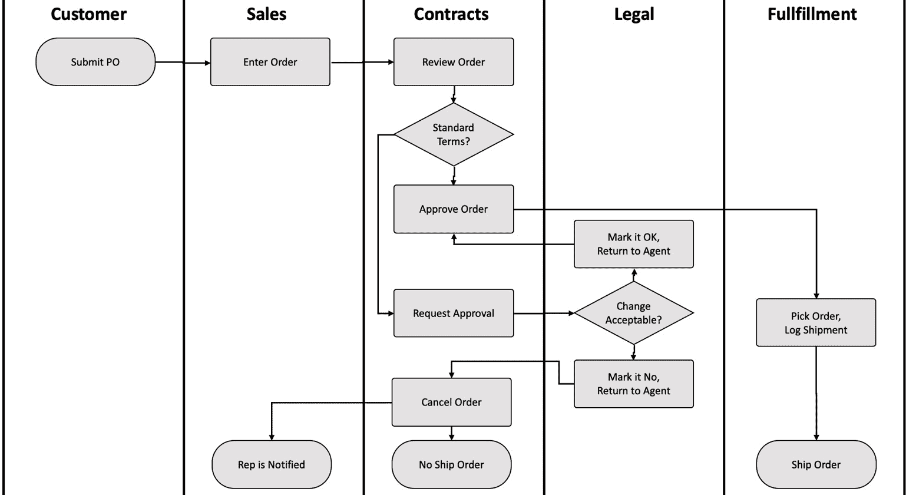
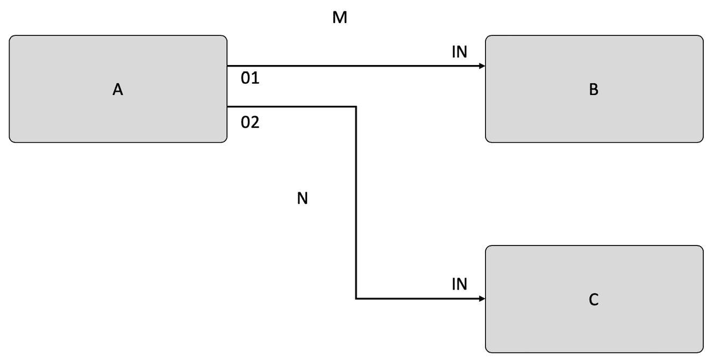
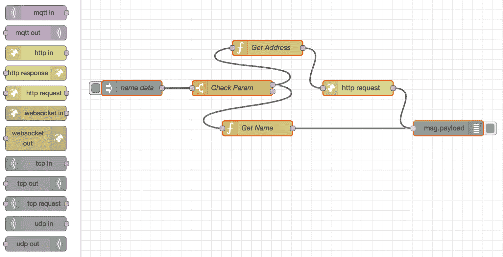
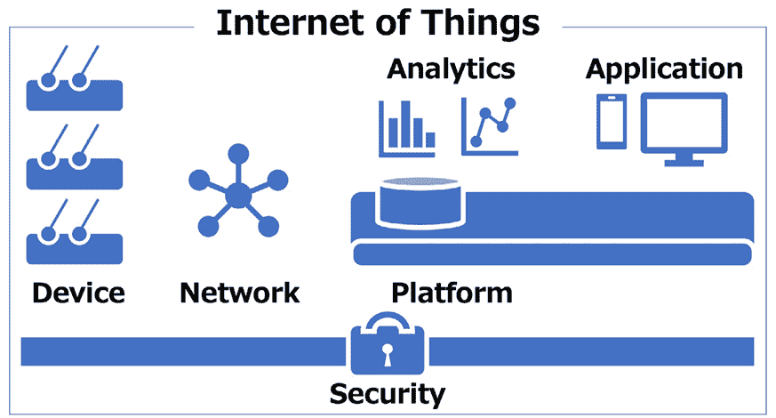

# 一、Node-RED 和基于流的编程简介

本章将帮助您从一个读者成长为一个 Node-RED 用户。 首先，您将了解**基于流的编程(FBP)**工具的历史，而不仅仅是 Node-RED。 你将会得到广泛的理解整个 Node-RED 作为构建 web 应用的一个有用的工具和**物联网**(**物联网)数据处理,之前了解物联网和 node . js Node-RED。**

 **提供技术内容将有助于加快软件应用的开发，但是如果您查看 Node-RED 工具本身的历史，它将帮助您更好地理解为什么需要 Node-RED 这样的 FBP 工具。 这就是我们在本章要做的。

更具体地说，我们将涵盖以下主题:

*   出口押汇是什么?
*   Node-RED 是什么?
*   Node-RED 好处
*   Node-RED 和物联网

让我们开始吧!

# 什么是 FBP?

那么，FBP 在中首先是什么呢? 你在工作中使用的工作流是你很容易想象得到的。 让我们回顾一下这些工作流。

## 工作流

在正常的工作流中，方框和连线表示流程流。 这可能只是一种商业设计。 盒子代表过程。 箱处理由谁、何时、何地、做什么和多少来定义。 有时，它就像显式地写出处理流程，例如使用泳道或将书写定义放在框中。 在任何情况下，看一下盒子就会知道要做什么。

另一方面，让我们试着将这个业务流程总结为一个文档。 你不觉得会很复杂吗? 谁会在阅读的时候做什么，即使他们把一些段落很好地放在一起? 你什么时候做? 这可能会让人困惑:

图 1.1 -工作流示例

现在，让我们回到软件编程。 FBP 是一种用于软件编程的概念，它定义了具有数据流的应用。 这个过程的每一部分都是一个黑盒。 它们在预定义的连接黑匣子之间通信数据。 FBP 之所以被称为面向组件的，是因为这些黑箱进程可以反复连接，形成几个应用，而不需要在内部进行修改。 让我们更详细地探讨 FBP。

## 基于流程的编程(FBP)

我认为 FBP 是工作流和数据流的很好结合。 FBP 使用**数据工厂**隐喻定义应用。 它将应用视为异步进程的网络，这些异步进程从某个点开始，执行单个顺序进程，每次执行一个操作，直到结束，而不是通过使用结构化数据块流进行通信。 这被称为**信息包**(**IP**)。 该视图关注于数据及其转换过程，以产生所需的输出。 网络通常在进程外部定义为一个由**调度器**解释的连接列表。

进程通过固定容量的连接进行通信。 连接使用端口连接到进程。 端口有一个由网络定义和进程代码一致同意的特定名称。 此时，可以通过使用多个进程来执行相同的代码。 一个特定的 IP 通常只属于一个进程，或者在两个进程之间传输。 端口类型可以是普通类型，也可以是阵列类型。

FBP 应用通常比传统程序运行得更快，因为只要有空间向进程输入数据和输出，FBP 进程就可以继续运行。 它不需要任何特殊的编程，并且最优地利用了机器上的所有处理器。

FBP 具有高级的、功能性的风格，使系统的行为可以很容易地定义; 例如，在分布式多方协议中，如分布式数据流模型中，为了准确分析判断变量或语句行为是否正确的标准:

图 1.2 -简单的 FBP 设计实例

现在您已经对 FBP 有了坚实的理解，让我们学习如何以这种方式实现 Node-RED。

# 什么是 Node-RED?

Node-RED是我们到目前为止描述过的 FBP 工具之一。 Node-RED 由 IBM 的新兴技术服务团队开发，现在由 OpenJS 基金会管理。

## 概述

FBP 是由 j·保罗·莫里森在 20 世纪 70 年代发明的。 正如我们前面提到的，FBP 将应用的行为描述为一个黑箱网络，在 node - red 中将其描述为一个“节点”。 处理在每个节点中定义; 将数据交给它，使用该数据执行处理，并将该数据传递给下一个节点。 网络扮演着允许数据在节点之间流动的角色。

这种编程方法非常容易使用，可以直观地制作模型，并便于多个层次的用户访问。 如果将问题分解为每个步骤，任何人都可以理解流程在做什么。 这就是为什么你不需要在节点内部编码:

图 1.3 - Node-RED 流编辑器作为 FBP 工具

## 流编辑器和运行时

Node-RED 不仅是一个编程工具，也是一个执行平台，用于封装使用 Node-RED 构建的应用的 Node.js 运行时。

我们需要使用**流编辑器**来制作用于物联网、web 服务等的 Node-RED 应用。 流编辑器也是一个 Node.js web 应用。 我们将在[*第三章*](03.html#_idTextAnchor044)*，通过创建基本流来理解 Node-RED 特性*中告诉你如何清楚地使用流编辑器。

流编辑器是 Node-RED 的核心功能，实际上是一个用 Node.js 制作的 web 应用。 它与 Node.js 运行时一起工作。 这个流编辑器在浏览器中操作。 您必须从面板中的各个节点中选择要使用的节点，并将其拖动到工作区中。 连接是将节点相互连接的过程，这将创建一个应用。 用户(开发人员)只需单击一下，就可以将应用部署到目标运行时。

包含各种节点的选项板可以很容易地展开，因为您可以安装开发人员创建的新节点，这意味着您可以很容易地将作为 JSON 文件创建的流共享给全世界。 在探讨 Node-RED 的优点之前，让我们先来看看它的创建过程。

## Node-RED 的历史和起源

2013 年初，IBM 英国新兴技术服务团队的 Nick-O'Leary 和 Dave Conway-Jones 创建了 Node-RED。

最初,只不过是**概念证明**(**PoC)帮助可视化和理解之间的映射消息队列遥测传输****(【显示】**MQTT)话题,但是很快,它变成了一个非常受欢迎的工具,可以很容易地扩展到各种用途。****

Node-RED 在 2013 年 9 月成为开源软件，目前仍在作为开源软件进行开发。 它于 2016 年 10 月成为 JS 基金会的创始项目之一，之后与 Node.js 基金会合并，于 2019 年 3 月创建了 OpenJS 基金会。

OpenJS 基金会作为一个中立的组织，支持 JavaScript 和 web 技术的发展，共同领导和保持任何项目和基金活动，这对整个生态系统都是有益的。 OpenJS 基金会目前托管了 30 多个开源 JavaScript 项目，包括 Appium、Dojo、jQuery、Node.js 和 webpack。

Node-RED 已经在 Apache 2 许可下可用，这使得它可以在广泛的设置中使用，无论是个人的还是商业的:

图 1.4 - Dave Conway-Jones 和 Nick O'Leary

为什么它被称为 Node-RED?

官方文档([https://nodered.org/about/](https://nodered.org/about/)称是一个听起来像“红色代码”的简单单词游戏。 这是一个死胡同，Node-RED 是一个很大的进步，它在最初几天的概念。 “Node”部分反映了流/节点编程模型，以及底层的 Node.js 运行时。

尼克和戴夫从来没有对“红色”部分的含义得出结论。 “快速事件开发者”是一个建议，但它从来没有被强迫正式的任何东西。 因此，“Node-RED”这个名字就有了意义。

# Node-RED 的好处

让我们思考一下。 你为什么用车? 我认为的答案非常简单明了。 首先，我们可以得出答案，从广义上说，汽车是一种交通工具。 还有其他交通方式，如步行、自行车、火车和公共汽车。 然后，我们有从这些选择中选择汽车的原因，如下:

*   你不会感到筋疲力尽。
*   你可以很快到达目的地。
*   你可以按照自己的节奏行动。
*   你可以保留自己的私人空间。

当然，也有一些缺点，但我认为这些都是使用汽车的主要原因。 虽然其他交通工具也可以服务于同样的目的，重要的是要考虑每一个的优点和缺点，并使用汽车作为交通工具的理由，你觉得是最适合你。

我们可以在软件领域看到同样的情况。 举例来说，你为什么要用 Word、Excel 和 PowerPoint? 您可能会使用 Word，因为它是编写文档最有效的方式。 然而，你可以单独使用一个字处理器或者手写任何东西。 同样，除了 Excel，您还可以使用任何其他方法来制作电子表格。 如果你想制作演示材料并让它们看起来有效，还有其他方法，除了 PowerPoint。 然而，您可能会选择最适合您情况的工具。

让我们回顾一下 Node-RED 的用途。 它是一个 FBP 工具，适用于制作 web 应用和物联网的数据控制应用。 它的开发环境和执行环境是使用 Node.js 创建的基于浏览器的应用，这使得它们的开发尽可能简单。

那么，使用提供这些特性的 Node-RED 的原因是什么呢? 您想避免大量编码吗? 你没有编程技能吗? 是的，当然，这些也是使用该程序的原因。

让我们回想一下汽车的例子。 从广义上说，我们的困境(运输)在这里被开发(创建)一个 Node.js 应用来描述软件工具所取代。 运输选项，如汽车、自行车、火车、公共汽车、轮船、飞机等等，都是选项，在软件开发中，我们也有许多选项，如使用 Node.js scratch，或使用 Node.js 的各种框架和使用 Node-RED。 至于选择 Node-RED 的原因，让我们来看看一些要点。

## 简化

在使用 Node-RED 编程时，您会注意到它的简单性。 正如名称 no-code/low-code 所示，无需编码，只需使用最少数量的操作，即可直观地完成编程。

## 效率

以 Node-RED 为代表的 FBP 几乎只用 GUI 操作就可以完成。 Node-RED 流编辑器负责构建应用执行环境、库同步、**集成开发环境**(**IDE**)和编辑器的准备工作，以便您能够集中精力进行开发。

## 常见

以面向对象的开发为代表，使源代码成为公共组件是开发中最重要的思想之一。 在常规的基于编码的开发中，每个公共组件都存在于函数和类中，但在 node - red 中，它们作为一个易于理解的节点(只是一个框)存在。 如果您没有一个节点作为您想要使用的公共组件，任何人都可以立即创建一个节点并将其发布到全世界。

## 高品质

高质量是基于流和可视化编程的真正价值所在。 作为组件提供的每个节点都是一个经过单元测试的完整模块。 因此，应用作者可以专注于在连接级别检查操作，而不必担心节点的内容。 这是一个很大的因素，消除人为错误在单一水平，确保高质量。

## 开源

Node-RED 是一个开源软件。 因此，它可以在 Apache2 许可下灵活使用。 一些是基于 Node-RED 开发自己的服务，而另一些则是更改自己的 UI，并将其作为内置部署。 正如前面提到的，我们还建立了一个平台，在这个平台上我们可以发布自己开发的节点，以便任何人都可以使用它。

## Node-RED 库

该库索引了发布到公共 npm 库([https://www.npmjs.com/](https://www.npmjs.com/))的所有 Node-RED 模块，假设它们遵循适当的打包指南。

这是我们看到最多的社区贡献的领域，有超过 2000 个节点可用——这意味着每个人都可以得到:

图 1.5 - Node-RED 库

## 各种平台

Node-RED 可以在各种平台上使用。 这是因为Node-RED 本身就是一个 Node.js 应用，正如我们之前提到的。 如果你有一个 Node.js 的运行时环境，你就可以运行它。 它主要用于 Edge 设备、云服务和嵌入式格式。

您可以通过理解 Node-RED 和物联网以及物联网架构之间的关系来了解这一点，这将在下一节中进行解释。

# Node-RED 与 IoT

同样，Node-RED 是一个**虚拟环境**，它在浏览器上以一种革命性的方式组合了硬件设备、api 和在线服务。 它提供以下功能:

*   基于浏览器的用户界面。
*   与 Node.js 工作，是轻量级的。
*   封装函数，可以作为节点使用(这意味着函数被锁定在一个抽象的胶囊中)。
*   您可以创建和添加自己的节点。
*   轻松访问 IBM 云服务。

换句话说，可以说这个工具适合于构建物联网相关的服务，比如设备上的数据控制，以及连接边缘设备和云服务。 最初，Node-RED 的开发概念是针对物联网的，所以这是有意义的。

现在，让我们来看看物联网的基本结构，让那些对物联网只有模糊认识的人能够理解它。 可以这样说物联网基本上由六层组成，如下图所示:

图 1.6 -物联网六层

让我们更详细地看看这些。

**设备**

这个装置就是所谓的边缘装置。 物联网有各种传感器，并处理从它们获得的数据。 由于只将数据放在边缘设备上没有意义，我们需要通过网关将数据发送到网络。

**网络**

这个网络需要将从设备获得的数据发送到互联网上的服务器。 它通常指的是互联网。 除了互联网，还有通过蓝牙或串行的 P2P 连接。

**平台**

接收和使用数据的一方是平台。 我们还可以有一个数据库，用于激活和验证事物、管理通信和持久化接收到的数据。

**分析学**

这是一个分析接收数据的层。 广义地说，它可以归类为一种应用。 这是准备数据的部分，以便将数据处理成有意义的形式。

**应用**

应用根据数据分析结果提供特定的服务。 它可以是 web 或移动应用，也可以是特定于硬件的嵌入式应用。 它可以说是物联网解决方案的最终用户所使用的层。

既然我们已经了解了物联网，我们将研究为什么应该使用 Node-RED。

## Node-RED 与 IoT

到目前为止，在解释物联网时，我们已经清楚地说明了为什么 Node-RED 适合物联网。 例如，您可以理解为什么为物联网开发的 FBP 工具在与 Node-RED 一起使用时仍然存在。 特别要考虑以下三点:

*   因为它可以在边缘设备上运行(预装在 Raspberry Pi OS 的特定版本上)，所以它非常适合在设备层进行数据处理。
*   由于它可以在云上运行(作为 IBM cloud 中的默认服务提供)，因此很容易与存储和分析中间件链接。
*   因为可以涵盖 MQTT 和 HTTP 协议，所以在边缘设备和服务器处理云之间交换数据非常容易。

通过这种方式，主要涵盖物联网所需元素的 Node-RED 现在被用于广泛的应用，如 web 服务和图表显示，以及物联网编程。 此外，截至 2020 年 6 月，如果你看谷歌 Node-RED 趋势，你可以看到用户数量正在逐渐增加。 因此，Node-RED 是一个非常有吸引力的 FBP 工具:

图 1.7 -“Node-RED”的谷歌趋势

典型的边缘设备可以使用 Node-RED 是树莓派。 当然，也可以在其他平台上使用 Node-RED，但它与树莓派配合得很好，树莓派也预装了一个操作系统版本。

树莓派操作系统支持 Node-RED

Node-RED 也被打包为树莓派操作系统存储库，并出现在他们的推荐软件列表中。 这允许它使用**apt-get install Node-RED**安装，包括树莓派 os 打包的 Node.js 版本，但不包括 npm。 更多信息可在[https://nodered.org/docs/getting-started/raspberrypi](https://nodered.org/docs/getting-started/raspberrypi)找到。

IBM Cloud 是一个可以使用 Node-RED 的典型云平台。 当然，您可以在其他云上使用 Node-RED，但是 IBM Cloud 提供了任何人都可以轻松启动的服务。

重要提示

Node-RED 可以在 IBM 云平台上作为其目录中的 Starter kit 应用之一使用。 在 IBM Cloud([https://nodered.org/docs/getting-started/ibmcloud](https://nodered.org/docs/getting-started/ibmcloud))上开始使用流编辑器作为 web 应用是非常容易的。

# 小结

在本章中，你学习了什么是 FBP 和 Node-RED。 由于这个原因，您现在明白了为什么 Node-RED 目前被许多人作为 FBP 工具喜爱和使用。 此时，您可能希望使用 Node-RED 构建应用。 在下一章中，我们将在我们的环境中安装 Node-RED，并更深入地研究它。**