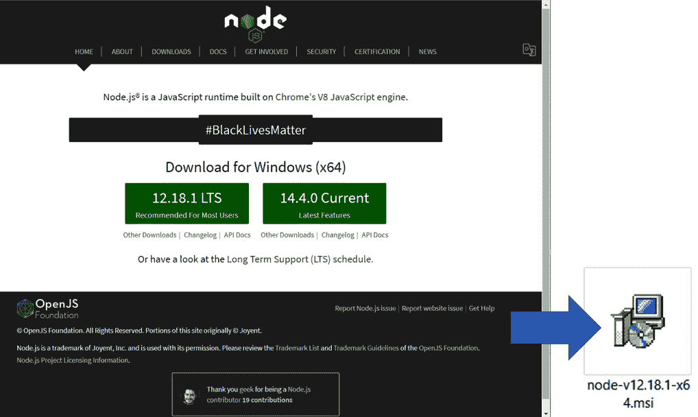
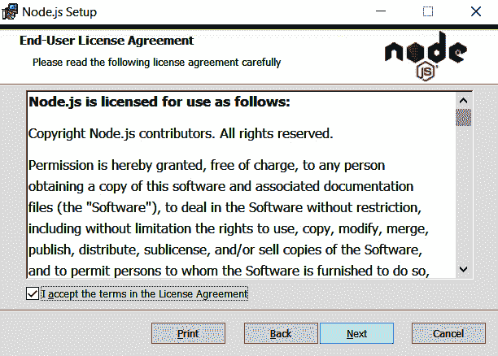
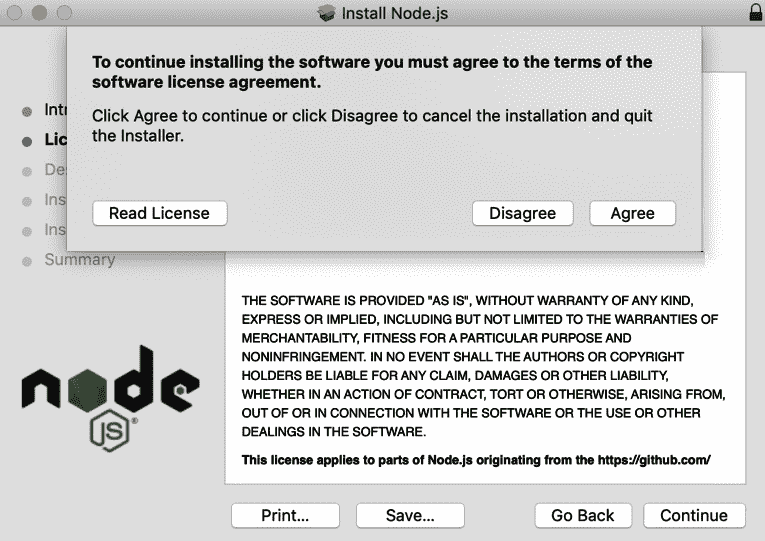
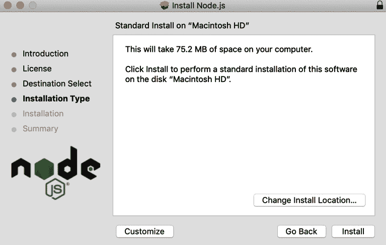
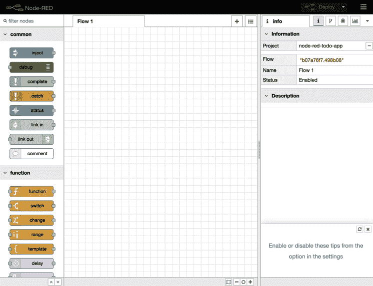
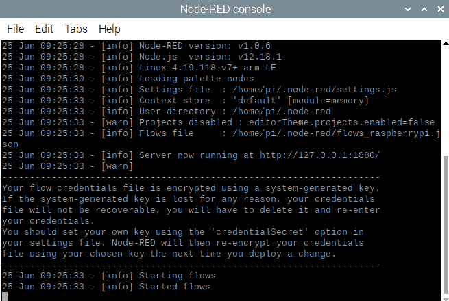
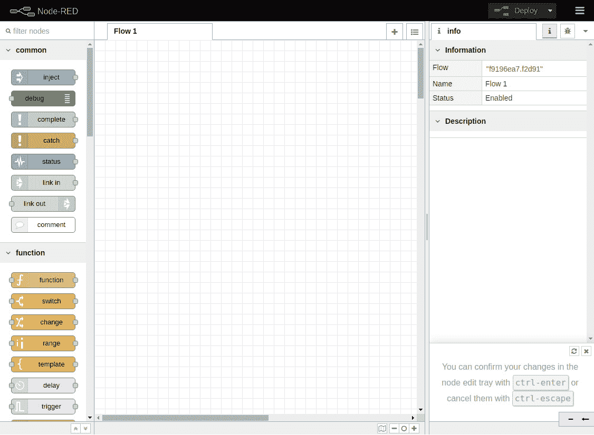

# 二、搭建开发环境

在本章中，您将安装使用 Node-RED 所需要的工具。 这不仅扩展到 Node-RED 本身，还扩展到它的运行时 Node.js，以及如何更新 Node-RED 和 Node.js。

Node-RED 于 2019 年 9 月发布了其 1.0 里程碑版本。 这反映了项目的成熟度，因为它已经被广泛应用于生产环境中。 通过对底层 Node.js 运行时进行更改，它将继续被开发并保持更新。 您可以通过[https://nodered.org/docs/getting-started/](https://nodered.org/docs/getting-started/)查看 Node-RED 的最新安装状态。

Node-RED 的官方网站提供了大量的安装指南，包括 local、Raspberry Pi、Docker、各大云平台等。

在本章中，您将学习如何在您的本地计算机上安装 Node-RED，无论您是在 Windows、Mac 或树莓派上运行它。 我们将涵盖以下议题:

*   Windows 安装**npm**和 Node.js
*   为 Mac 安装**npm**和 Node.js
*   为树莓派安装**npm**和 Node.js
*   Windows 下安装 Node-RED
*   为 Mac 安装 Node-RED
*   安装树莓派节点红

在本章结束时，我们将安装所有必要的工具，并准备继续使用 Node-RED 构建一些基本流程。

作为参考，作者的测试操作环境是 Windows 10 2004 18363.476、macOS Mojave 10.14.6 (18G5033)、Raspberry Pi OS 9.4 stretch。

# 技术要求

在本章中，您需要安装以下内容:

*   Node. Js (v12.18.1) *
*   npm (v6 14。5)*

*编写时的 LTS 版本。

# 在 Windows 上安装 npm 和 Node.js

如果你想在上使用Node- red，你必须安装 npm 和 Node。 js 通过以下网站:

https://nodejs.org/en/ home-downloadhead。

你可以直接在那里获得 Node.js 的 Windows 安装程序。 之后，遵循以下步骤:

1.  Access the original Node.js website and download the installer.

    您可以选择两个版本-**推荐**或**最新功能**-但在本书中，您应该使用**推荐**版本:

    

    图 2.1 -选择推荐版本安装程序

2.  点击下载的**msi**文件开始安装Node.js。 它包括 npm 的当前版本。 Node-RED 运行在 Node.js 运行时，所以它是必需的。
3.  只需根据安装向导单击对话框窗口的按钮，不过在安装过程中要记住一些要点。
4.  Next, you need to accept the End-User License Agreement:

    

    图 2.2 -最终用户许可协议窗口

    您也可以更改的安装目标文件夹。 在本书中，将使用默认文件夹(**C:/Program Files/nodejs/**):

    

    图 2.3 -安装目标文件夹

5.  No custom setup is needed on the next screen. You can select **Next** with only the default features selected:

    

    图 2.4 -不需要自定义设置

6.  On the following screen, you can click **Next** without checking anything. However, it's OK to install the tools that can be selected here. This includes the installations and settings the path of these environments (Visual C++, windows-build-tools, and Python):

    

    图 2.5 -本地模块的工具窗口

7.  Check the versions of your tools with the following commands when the installation for Node.js has finished:

    **$ node—version**

    **v12.18.1**

    $ npm -version

    **6.14.5**

    当 Node.js 和 npm 安装完成后，你可以检查它们的版本号。 这样，您就可以安装 Node-RED 了。

    重要提示

    根据项目，它是常见的操作稳定与旧的 Node.js 版本，但它不工作，如果你使用不同版本的 Node.js。 然而，每次切换项目时，卸载当前版本的 Node.js 并安装所需版本的 Node.js 需要时间。 所以，如果你正在使用 Windows，我建议你使用 Node.js 版本管理工具，比如 nodist([https://github.com/nullivex/nodist](https://github.com/nullivex/nodist))。 对于 Node.js 还有其他类型的版本控制工具，所以请尝试寻找一个容易使用的。

# 为 Mac 安装 npm 和 Node.js

如果你想在 macOS 上使用 Node-RED，你必须通过在以下网站安装**npm**和Node.js:

https://nodejs.org/en/#home-downloadhead

你可以直接在那里获得 Node.js 的 Mac 安装程序。

访问原始 Node.js 网站并下载安装程序。 您可以选择推荐版本或最新特性版本，但对于本书，您应该使用推荐版本:

图 2.6 -选择推荐的版本安装程序

点击下载的**.pkg**文件开始安装 Node.js。 它包括当前版本的**npm**。 Node-RED 运行在 Node.js 运行时，所以它是必需的。 只需按安装向导点击即可，不过在安装中有一些注意事项。

您需要接受最终用户许可协议:

图 2.7 -最终用户许可协议窗口

您可以更改安装位置。 在本书中，默认位置(Macintosh HD)将被使用:

图 2.8 -安装位置

当 Node.js 的安装完成后，您可以使用以下命令检查工具的版本。 一旦你完成了 Node.js 和**npm**的安装，你可以检查它们的版本号。 您已经准备好安装 Node-RED:

美元节点——版本

v12.18.1

$npm -版本

6.14.5

请注意

根据项目的不同，使用旧 Node.js 版本的操作是稳定的，如果使用不同版本的 Node.js，它将无法工作。 然而，每次切换项目时，卸载当前 Node.js 版本并安装所需的 Node.js 版本都需要时间。 所以，如果你正在使用 macOS，我建议使用 Node.js 版本管理工具，比如 Nodebrew([https://github.com/hokaccha/nodebrew](https://github.com/hokaccha/nodebrew))。 对于 Node.js 还有其他类型的版本控制工具，所以请尝试寻找一个容易使用的。

我们已经介绍了在 Windows 和 Mac 上的安装过程，现在让我们学习如何安装**npm**和Node.js。

# 为树莓派安装 npm 和 Node.js

如果你想在树莓派上使用 Node-RED，恭喜你——你已经准备安装 Node-RED。 这是因为 Node.js 和 npm 是默认安装的。 你可以使用现有的安装脚本来安装 Node-RED，包括 Node.js 和 npm。 这个脚本将在本章后面的*为树莓派安装 Node-RED*部分进行描述，因此您可以暂时跳过此操作。

但是，你应该在树莓派上检查 Node.js 和 npm 版本。 请输入以下命令:

美元节点——版本

v12.18.1

$npm -版本

6.14.5

如果不是 LTS 版本或稳定版本，可以通过 CLI 进行升级。 请输入并运行下面的命令来完成此操作。 在命令,在最后一行,**lts**已经被使用,但是你也可以把**,而不是【显示】稳定 lts 如果你想安装稳定版本:**

 **$ sudo apt-get 更新

$ sudo apt-get install -y nodejs

$ sudo NPM 安装 NPM

$ sudo n LTS

现在我们已经成功地检查了树莓派上的 Node.js 和 npm 版本，并更新了它们(如果适用的话)，我们将继续在 Windows 上安装 Node-RED。

重要提示

Node-RED 项目提供的脚本负责安装 Node.js 和**npm**。 通常不建议使用树莓派 OS 提供的版本，因为它们的打包方式很奇怪。

# 安装 Node-RED for Windows

在本节中，我们将解释如何在 Windows环境中设置 Node-RED。 这个过程只适用于 Windows 10，但也适用于 Windows 7 和 Windows Server 2008 R2 及以上版本。 目前不支持 Windows 7 或更早版本的 Windows Server 2008 R2，也不推荐使用。

对于 Windows，作为全局模块安装 Node-RED 会将**Node-RED**命令添加到系统路径中。 在命令提示符下执行如下命令:

$ NPM install -g——unsafe-perm node-red

一旦完成了 Node-RED 的安装，就可以直接使用 Node-RED。 请运行以下命令。 运行此命令后，您将识别用于访问 Node-RED 流编辑器的 URL。 通常，配置默认端口 1880 的 localhost(127.0.0.1)将被分配:

node-red 美元

欢迎来到 Node-RED

＝＝＝＝＝＝＝＝＝＝＝＝＝＝＝＝＝＝＝

…

[信息]开始流动

[信息]开始流动

[info]服务器现在运行在 http://127.0.0.1:1880/

让我们在浏览器上访问 Node-RED。 为此，键入从命令提示符接收到的 URL。 我强烈推荐使用 Chrome 或 Firefox 运行 Node-RED:

图 2.9 - Node-RED 流编辑器

现在，您已经准备好使用 Node-RED 进行编程了。 从[*第三章*](03.html#_idTextAnchor044)，*通过创建基本流程来理解 Node-RED 特性*，接下来将学习如何使用 Node-RED 实际构建应用。

现在，让我们继续在 macOS 中安装 Node-RED。

# 安装 Node-RED for Mac

在本节中，我们将解释如何在 macOS环境中设置 Node-RED。 这个程序是为了 macOS Mojave。 它可能适用于所有版本的 Mac OS X，但我强烈建议您使用当前版本的 macOS。

对于 macOS，将 Node-RED 安装为全局模块会将**Node-RED**命令添加到系统路径中。 在终端中执行如下命令。 您可能需要在命令前面添加**sudo**，这取决于您的本地设置:

$ sudo NPM install -g——unsafe-perm node-red

您还可以使用其他工具安装 Node-RED。 这主要适用于 Mac/Linux 或支持以下工具的操作系统:

1.  Docker ([https://www.docker.com/](https://www.docker.com/)), if you have the environment for running Docker.

    当前 Node-RED 1。 Docker Hub 上的 x 存储库被重命名为“**nodered/node-red**”。

    版本高达 0.20。 可以从[https://hub.docker.com/r/nodered/node-red-docker](https://hub.docker.com/r/nodered/node-red-docker)获得。

    重要提示

    当使用 Docker 运行 Node-RED 时，您需要确保如果容器损坏，添加的节点和流不会丢失。 可以通过将数据目录挂载到容器外部的卷来持久化这些用户数据。 您还可以通过使用绑定挂载或命名数据卷来实现这一点。

    执行以下命令安装 Node-RED。

    **$ docker run -it -p 1880:1880——name mynodered /node-red**

2.  Snap ([https://snapcraft.io/docs/installing-snapd](https://snapcraft.io/docs/installing-snapd)) if your OS supports it.

    如果你把它作为一个 Snap 包安装，你可以在一个安全的容器中运行它，这个容器不能访问你必须使用的外部特性，比如以下:

    *   访问系统主存(只允许读写本地主目录)。
    *   Gcc:编译要安装的节点的二进制组件所必需的。
    *   Git:如果你想利用项目特性，这是必需的。
    *   直接访问 GPIO 硬件。
    *   Access to external commands, such as flows executed in Exec nodes.

        容器的安全性较低，但您也可以以**经典**模式运行它们，这将提供更多访问权限。

        运行以下命令安装 Node-RED 与 Snap:

$ sudo snap install node-red

一旦完成了 Node-RED 的安装，就可以立即使用 Node-RED。 请运行以下命令。 运行此命令后，您可以找到访问 Node-RED 流编辑器的 URL。 通常，将分配带有默认端口**1880**的本地主机(**127.0.0.1**):

node-red 美元

欢迎来到 Node-RED

＝＝＝＝＝＝＝＝＝＝＝＝＝＝＝＝＝＝＝

…

[info]服务器现在运行在 http://127.0.0.1:1880/

[信息]开始流动

[信息]开始流动

让我们在浏览器上访问 Node-RED。 输入您从命令提示符收到的 URL。 我强烈推荐使用 Chrome 或 Firefox 运行 Node-RED:

图 2.10 - Node-RED 流编辑器

现在，您已经准备好使用 Node-RED 进行编程了。 在[*第三章*](03.html#_idTextAnchor044)，*通过创建基本流程来理解 Node-RED 特性，*我们将学习如何使用 Node-RED 实际构建应用。

我们最后的安装将是树莓派上的 Node-RED。

# 树莓派安装 Node-RED

在这个节中，我们将解释如何在树莓环境中设置 Node-RED。 这个过程是为树莓派 OS Buster (Debian 10.x)，但它将工作的树莓派 OS Jessie (Debian 8.x)和以上。

你可以很容易地检查你版本的树莓派操作系统。 只需在终端上运行以下命令:

lsb_release——美元

如果您还想检查 Debian 的版本，请运行以下命令:

猫/etc/debian_version 美元

现在，您已经准备好安装 Node-RED。 下面的脚本安装 Node-RED，包括 Node.js 和**npm**。 这个脚本还可以用于升级您已经安装的应用。

请注意

此说明可能会更改，因此建议您在需要时参考官方文档。

这个脚本适用于基于 debian 的操作系统，包括 Ubuntu 和 Diet-Pi:

$ bash

你可能需要运行**sudo apt install build-essential git**来确保 npm 能够构建需要安装的二进制组件。

Node-RED 已经被打包为一个树莓派 OS 存储库，并且包含在*推荐软件*列表中。 它可以通过**apt-get install Node-RED**命令安装，并且包含一个树莓派 OS 打包版本的 Node.js，但不包括 npm。

虽然乍一看使用这些包似乎很方便，但强烈建议使用安装脚本。

安装完成后，可以启动 Node-RED 并访问 Node-RED 流编辑器。 我们有两种启动方式，如下:

1.  Run with the CLI: If you want to run Node-RED locally, you can start Node-RED by using the **node-red** command in your Terminal. Then, you can stop it by pressing *Ctrl* + *C* or closing the Terminal window:

    **$ node-red**

2.  通过编程菜单运行:一旦安装了 Node-RED，你可以从树莓派菜单启动它。 点击**Menu | Programming | Node-RED**打开终端并启动 Node-RED。 一旦 Node-RED 被启动，你就可以从浏览器访问 Node-RED 流编辑器，就像你在 CLI 中所做的那样:

图 2.11 -通过树莓派菜单访问 Node-RED

从菜单启动 Node-RED 后，您应该检查终端上运行的 Node-RED 进程，并找到 Node-RED 流编辑器的 URL。 通常是与相同的 URL，可以直接通过 CLI 启动:

图 2.12 -检查 URL 访问 Node-RED 流编辑器

让我们在浏览器上访问 Node-RED。 您可以输入从命令提示符接收到的 URL 来完成此操作。 如果你的树莓派默认浏览器是 Chromium，那么使用Node-RED 应该没有问题。 然而，如果你想使用另一个浏览器，我强烈建议为运行 Node-RED 安装 Chromium:

图 2.13 - Node-RED 流编辑器

这是它! 我们现在已经介绍了每个工具的所有安装选项，以便开始使用 Node-RED。

# 小结

在本章中，您已经准备好了环境，可以使用 Node-RED 流编辑器。 此时，我相信您已经可以访问 Node-RED 流编辑器，因此您需要学习如何使用它。 在下一章中，我们将制作一个示例流，并学习 Node-RED 流编辑器的主要特性。**