# 三、通过创建基本流来理解 Node-RED 特性

在本章中，我们将实际使用 Node-RED flow Editor 创建一个流。 通过创建一个简单的流程，您将了解如何使用该工具及其特征。 为了更好地理解，我们将创建一些示例流。

从现在开始，您将使用 Node-RED 创建称为流的应用。 在本章中，您将学习如何使用 Node-RED 以及如何创建一个应用作为流。 为此，我们将涵盖以下主题:

*   Node-RED 流编辑器机制
*   使用流编辑器
*   为数据处理应用创建流
*   为 web 应用创建流程
*   导入和导出流定义

在本章结束时，你将掌握如何使用 Node-RED Flow Editor，并知道如何用它构建一个简单的应用。

# 技术要求

要完成本章，你需要具备以下条件:

*   Node-RED (v1.1.0 或更高版本)。
*   本章代码可在**Chapter03**文件夹[https://github.com/PacktPublishing/-Practical-Node-RED-Programming](https://github.com/PacktPublishing/-Practical-Node-RED-Programming)中找到。

# Node-RED 流编辑器机制

正如您在前面的章节中学到的，Node-RED 有两个逻辑部分:一个称为 Flow Editor 的开发环境和一个用于执行在那里创建的应用的执行环境。 它们分别称为运行时和编辑器。 让我们更详细地看看它们:

*   **运行时**:这包括一个 Node.js 应用运行时。 它负责运行已部署的流。
*   **编辑器**:这是一个 web 应用，用户可以在其中编辑他们的流。

主可安装包包含了这两个组件，一个 web 服务器提供了 Flow Editor 以及一个 REST Admin API 来管理运行时。 在内部，这些组件可以单独安装，并嵌入到现有的 Node.js 应用中，如下图所示:

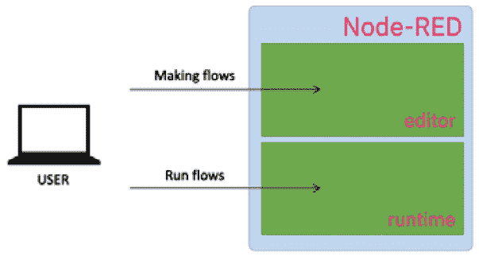

图 3.1 - Node-RED 概述

现在您已经理解了 Node-RED 的机制，让我们立即学习如何使用 Flow Editor。

## 使用流编辑器

让我们以为例，看看 Flow Editor 的主要功能。

流量编辑器的主要特点如下:

*   **Node**:Node- red 应用的主要构建块，它们代表定义良好的功能片段。
*   **Flow**:连接在一起的一系列节点，它们代表应用中传递的消息的一系列步骤。
*   左边的面板是面板:编辑器中可用的节点集合，您可以使用这些节点构建应用。
*   **部署按钮**:编辑完应用后，按此按钮部署应用。
*   **侧边栏**:用于显示各种功能的面板，如处理参数设置、规格、调试器显示等。
*   侧边栏选项卡:每个节点的设置、标准输出、更改管理等等。
*   **主菜单**:流程删除、定义导入/导出、项目管理等。

这些功能在流编辑器的屏幕上排列如下:

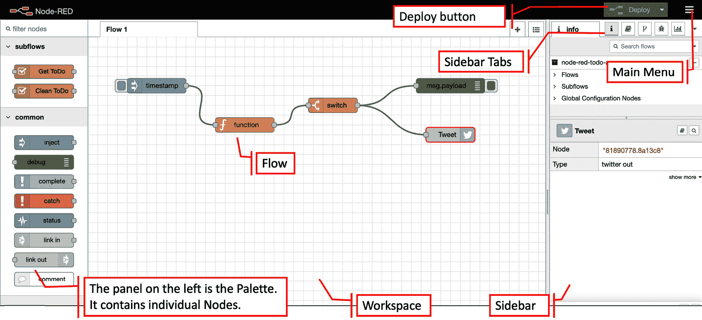

图 3.2 - Node-RED 流编辑器

在开始使用 Node-RED 之前，您需要了解 Flow 菜单中包含的内容。 其内容可能有所不同,这取决于 Node-RED 你使用的版本,但是有一些设置的项目,如**项目管理流**,**安排查看**、**导入/导出的流**,**安装节点发表在库,等等,都是普遍存在的。 有关如何使用 Node-RED 的更多信息，最好根据需要参考官方文档。**

 **重要提示

Node-RED 用户指南:[https://nodered.org/docs/user-guide/](https://nodered.org/docs/user-guide/)。

下图显示了 Node-RED 中的所有 Flow Editor 菜单选项:

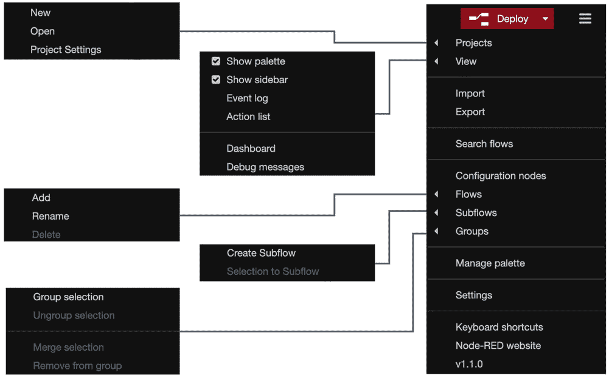

图 3.3 - Node-RED Flow Editor 菜单

这样，您就可以使用 Node-RED 构建应用了。 那么，让我们开始吧!

首先，您需要在您的环境中运行 Node-RED。 请参考第二章**,*设置开发环境,学习如何设置您的环境,比如 Windows, Mac 或覆盆子π,如果你还没有这么做。*

 *在 Node-RED 运行之后，让我们进入下一节，在那里我们将创建第一个流。

# 为数据处理应用制作流程

在这个部分中，您将创建一个工作的应用(在 Node-RED 中称为流)。 无论是**物联网**(**物联网**)还是作为 web 应用的服务器处理，Node-RED 执行的基本操作是依次传输数据。

在这里，我们将创建一个流，其中以伪方式生成 JSON 数据，数据最终通过 Node-RED 上的一些节点输出到标准输出。

在面板的左侧有许多节点。 请注意这里常见的**类别。 你应该能够很容易地找到**inject**节点，如下图所示:**

 **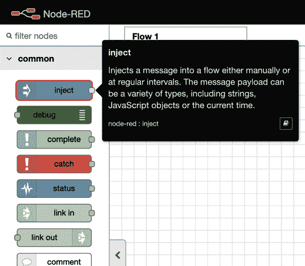

图 3.4 - Inject 节点

这个节点可以将消息注入到下一个节点。 让我们开始:

1.  Drag and drop it onto the palette of Flow 1 (the default flow tab).

    您将看到节点被标记为单词**时间戳**。 这是因为它的默认消息有效负载是一个时间戳值。 我们可以更改数据类型，所以让我们将其更改为 JSON 类型。

2.  Double-click the node and change its settings when the **Properties** panel of the node is opened:

    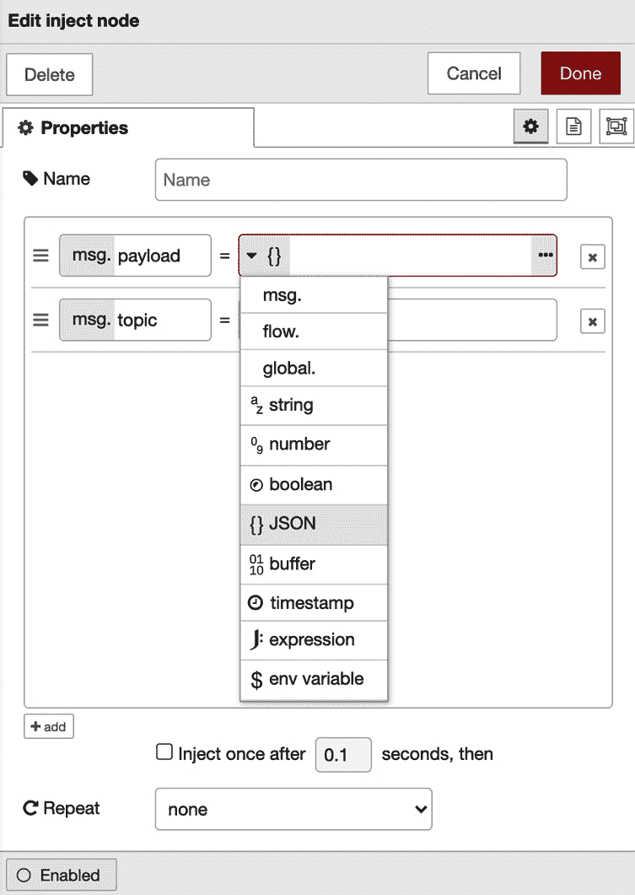

    图 3.5 -编辑注入节点属性面板

3.  单击第一个参数的下拉菜单，选择**{}JSON**。 您可以通过单击右边的**[…]**按钮来编辑 JSON 数据。
4.  点击**[…]**按钮，JSON 编辑器将打开。 可以使用基于文本的编辑器或可视化编辑器生成 JSON 数据。
5.  This time, let's make JSON data with an item called **{"name" : "Taiji"}**. You should replace my name with your name:

    

    图 3.6 - JSON 编辑器

    太好了——您已经成功地制作了一些示例 JSON 数据!

6.  点击**Done**按钮并关闭此面板。
7.  类似地，在调色板上放置一个**Debug**节点。
8.  After placing it, wire the **Inject** and **Debug** nodes to it.

    一旦执行此流，从**Inject**节点传递的 JSON 数据将由**debug**节点输出到调试控制台(标准输出)。 你不需要在**Debug**节点上配置任何东西:

    

    图 3.7 -放置 Debug 节点并连接它

9.  最后，您需要部署您创建的流。 在 Node-RED Flow Editor 中，通过单击右上角的**deploy**按钮，我们可以将工作区上的所有流部署到 Node-RED 运行时。
10.  Before running the flow, you should select the **Debug** tab from the node menu's side panel to enable the debug console, as shown in the following screenshot:

    

    图 3.8 -启用调试控制台

11.  让我们运行这个流程。 点击**Inject**节点的开关，查看调试控制台执行流的结果:

图 3.9 -执行流并检查结果

这是一个非常简单和容易处理数据流的示例。 在本书的后半部分，我们还将通过实际连接物联网设备并通过从 web API 获得的数据来实验数据处理。 在本节中，了解如何在 Node-RED 中处理数据就足够了。 接下来，我们将尝试为 web 应用创建流。

为 web 应用创建流程

在这个部分中，您将为一个 web 应用创建一个新的流。 我们将使用与前面创建数据处理流相同的方式创建这个流。

你可以在相同流程的工作空间中创建它(流程 1)，但是为了让事情更清楚和简单，让我们通过以下步骤为流程创建一个新的工作空间:

1.  Select **Flows | Add** from the **Flow** menu. Flow 2 will be added to the right-hand side of Flow 1\. These flow names, such as "Flow 1" and "Flow 2," are default names that are provided upon creation. You can rename the flow so that it has a more specific name if you want to:

    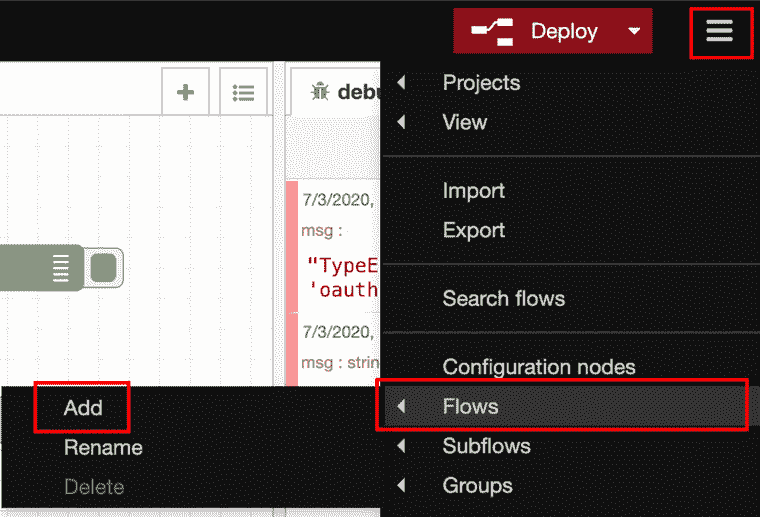

    图 3.10 -添加一个新的流

2.  Select the **http in** node from the **network** category on the palette, and then drag and drop it onto the palette of Flow 2 (the new flow tab you just added):

    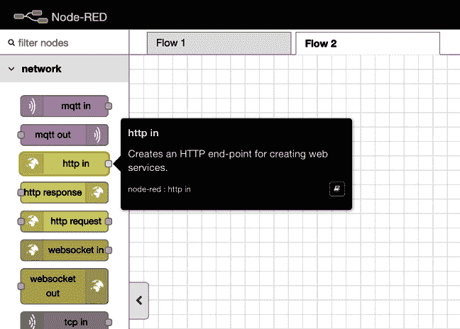

    图 3.11 -节点中的 http

3.  双击该节点打开其**Edit**对话框。
4.  Enter the URL (path) of the web application you will create.

    该路径将作为您将要创建的 web 应用的 URL 的一部分，位于 Node-RED URL 下。 在这种情况下，如果你的 Node-RED URL 是**http://localhost:1880/**，那么你的 web 应用 URL 将是**http://localhost:1880/web**。 下面的截图中可以看到一个例子:

    

    图 3.12 -设置 URL 的路径

5.  To send a request via HTTP, an HTTP response is required. So, place an **http response** node on the workspace of your Node-RED.

    您可以在调色板的**网络**类别中找到该节点，该节点位于节点的**http 旁边。 这里，**http 响应**节点简单地返回响应，因此您不需要打开配置面板。 你可以让它保持原样。 如果你想在响应消息中包含状态码，你可以在**设置**面板中这样做，如下截图所示:**

    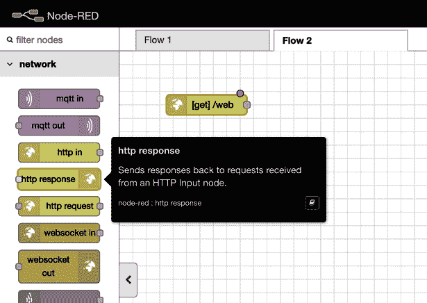

    图 3.13 - http 响应节点

6.  After placing an **http response** node on the palette, add a wire from the **http in** node to the **http response** node.

    这就完成了 web 应用的流程，因为我们已经允许 HTTP 请求和响应。 你会在每个节点的右上角看到一个浅蓝色的点，这表明它们还没有部署-所以请确保您点击**部署**按钮:

    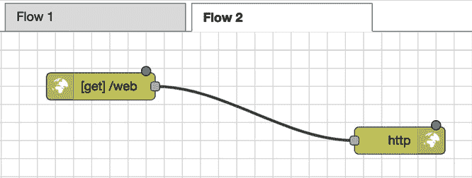

    图 3.14 -连线节点

7.  一旦成功部署，在浏览器中打开一个新标签。
8.  然后输入**http://localhost:1880/web**，访问节点部分**http 中显示的 web 应用的 URL。**

您应该发现屏幕上只显示**{}**。 这不是一个错误。 它是发送 HTTP 请求并返回响应的结果。 现在，由于我们没有设置要传递给响应的内容，所以将一个空 JSON 作为消息数据传递。 这个看起来如下:

图 3.15 - Web 应用结果

这不是很好，所以让我们创建一些内容。 让我们做一些非常简单的事情，实现一些简单的 HTML 代码。 那么，我应该在哪里编码呢? 答案很简单。 node - red 有一个模板节点，它允许您指定 HTML 代码作为输出。 让我们用这个:

1.  Drag and drop a **template** node between the **http in** node and the **http response** node on the wire, so that the **template** node will be connected on it:

    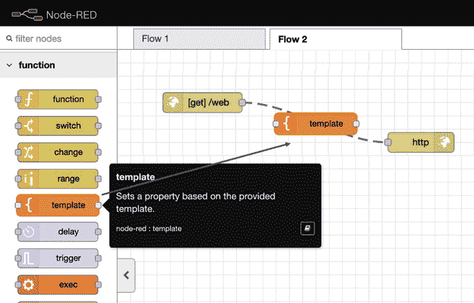

    图 3.16 -在两个现有节点之间的连线上放置一个“模板”节点

2.  Next, double-click the **template** node to open the settings panel. You can code on the **Template** area of the **settings** panel. This time, use the following sample HTML. The title is specified for the head. Let's attach a page heading to the body with the **<h1>** tag. Arrange the contents resembling the menu with the **<h2>** tag. The code will look like this:

    **<html>**

    **<头部>**

    **<title>node red Web sample</title>**

    **</head>**

    **<body>**

    **<h1>Hello Node-RED!! </ T1>**

    **<h2>Menu 1</h2>**

    **
这是 Node-RED 样本网页。 
**

    **
**

    **<h2>Menu 2</h2>**

    **
这是 Node-RED 样本网页。 
**

    【t】</body>

    **</html>**

    请注意

    你也可以从本书的 GitHub 存储库[https://github.com/PacktPublishing/-Practical-Node-RED-Programming/tree/master/Chapter03](https://github.com/PacktPublishing/-Practical-Node-RED-Programming/tree/master/Chapter03)获得这些代码。

3.  Once you have finished editing the **template** node, click the **Done** button to close it.

    下面的截图显示了你的模板节点在你编辑它时的样子:

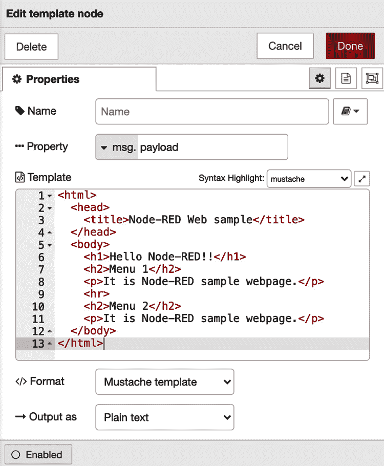

图 3.17 -模板区域中的代码

这样，我们就完成了准备在页面上显示的 HTML。 请确保您单击了**部署**按钮。 再次进入**http://localhost:1880/web**页面。 您现在应该看到以下输出:

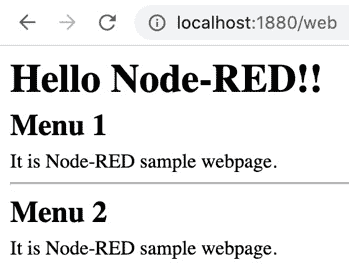

图 3.18 - Web 应用结果

此时，您应该了解如何在 Node-RED 上创建 web 应用。 我想，到目前为止，一切都很顺利。 现在我们已经建立了一些动力，让我们继续学习。 在下一节中，我们将导入和导出我们创建的流定义。

# 导入和导出流定义

在本节中，您将导入和导出您创建的流定义。 通常，在开发时，有必要备份源代码和版本控制。 您还可以导入其他人创建的源代码，或者导出自己的源代码并将其传递给其他人。 Node-RED 也有类似的概念。 在 node - red 中，通常的做法是导入和导出流本身，而不是导入或导出源代码(例如，前面描述的模板节点)。

那么，首先，让我们导出到目前为止创建的流。 这很容易做到:

1.  Simply select **Export** from the **Edit** dialog under the **Main** menu of the Node-RED Flow Editor.

    显示“**Export**”菜单时，只能选择当前流或自己的所有流。 您还可以选择没有缩进的原始 JSON，或者有缩进的格式化 JSON。

2.  在这里，选择当前流并选择**格式化**。
3.  Now, you can select how to save the exported JSON data – **Copy to clipboard** or **Download**. Here, we'd want to download the JSON data, so click the **Download** button:

    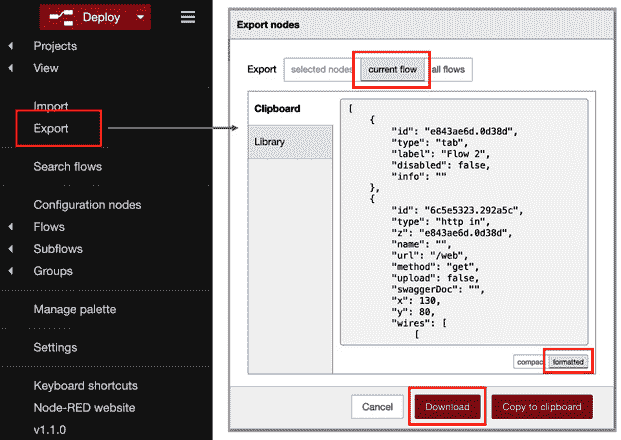

    图 3.19 -导出操作

    您将看到一个名为**的文件流。 json**在您的机器的下载位置。

4.  在文本编辑器中打开该文件，以便您可以检查 JSON 文件的内容。

通过这些，我们已经学会了如何输出。

接下来，我们需要导入该定义(**流。 json**)放入 Node-RED 流编辑器中。 通过以下步骤做到这一点:

1.  Simply select **Import** from the **Flow** menu in the Node-RED Flow Editor.

    当出现**导入**菜单时，可以选择**粘贴流程 json**或**基于导入**选择文件。 您还可以从流量选项卡中选择**当前流量**或**新流量**。 如果您选择**new flow**，将自动添加一个新的 flow 标签。

2.  在这里，请选择**选择一个基于导入**的文件并导入到**新流程**。 然后，选择名为**流的 JSON 文件。 json**导出到本地机器。
3.  Once the file has loaded, click the **Import** button:

    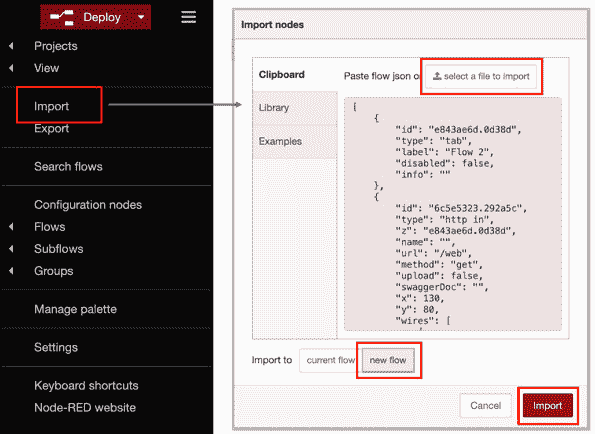

    图 3.20 -导入操作

4.  You now have the new tab, named Flow 2, next to the same flow on the old Flow 2 tab. It has been imported completely, but it hasn't been deployed yet, so click the **Deploy** button, as follows:

    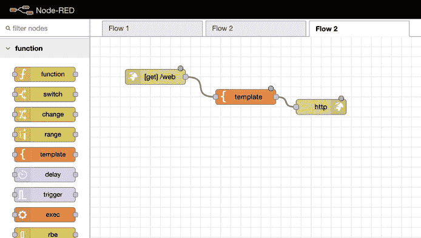

    图 3.21 -添加新流程

    这样，我们就成功地准备好了使用导入的流在我们的网页上显示的内容。 请确保单击**部署**按钮。

5.  通过转**http://localhost:1880/web**再次访问网页。

在这里，你会看到这个网页的设计与你导出的网页相同。 伟大的工作!

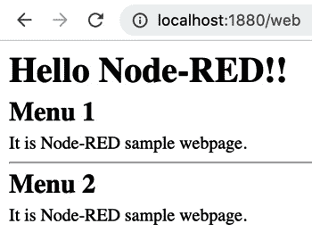

图 3.22 - web 应用的结果

现在，让我们结束这一章。

# 小结

在本章中，您学习了如何使用 Node-RED Flow Editor 制作基本流和导入/导出流。 现在您已经知道了如何使用 Node-RED Flow Editor，您将需要了解它的更多特性。 当然,Node-RED 并不只有**等基本节点注入**,**http**,和**模板,但也更具吸引力的节点如**【T7 切换】,【显示】改变**,**mqtt**,【病人】仪表板**。 在下一章中，我们将尝试使用几个主要节点，以便编写 JavaScript 代码、捕获错误、执行数据交换、延迟函数、使用 CSV 解析器等等。*****