# 十二、利用 Slack 和 IBM Watson 开发聊天机器人应用

在本章中，我们将使用 Node-RED 创建一个聊天机器人应用。 对于聊天机器人应用的 UI，我们将使用 Slack，我们将使用 IBM Watson AI 的技能。 在完成本章的教程后，您将学习如何将 Node-RED 与外部 API 结合起来创建应用。 这将帮助您在未来使用 Node-RED 创建可扩展的 web 应用。

让我们从以下几个话题开始:

*   创建一个 Slack 工作区
*   创建沃森助理 API
*   启用从 Node-RED 到 Slack 的连接
*   构建聊天机器人应用

在本章结束时，您将掌握如何使用 Node-RED 制作一个 Slack 聊天机器人应用。

# 技术要求

要在本章取得进展，你需要具备以下条件:

*   IBM Cloud 帐号:[https://cloud.ibm.com/](https://cloud.ibm.com/)。
*   本章使用的代码可在**第 12 章**文件夹[https://github.com/PacktPublishing/-Practical-Node-RED-Programming](https://github.com/PacktPublishing/-Practical-Node-RED-Programming)中找到。

# 创建一个 Slack 工作区

本教程使用**Slack**作为聊天机器人应用的UI。 Node-RED 负责控制聊天机器人应用后台的消息交换。

该聊天机器人应用的整体视图如下:

图 12.1 -应用概述

首先，按照以下步骤创建一个 Slack 工作空间，以便在此应用中使用。 如果你已经有一个 Slack 工作区，你可以使用现有的。 在这种情况下，跳过下面的步骤，并在您的工作区中创建一个名为**learning-node-red**的通道:

1.  Access [https://slack.com/create](https://slack.com/create), enter your email address, and click the **Next** button:

    

    图 12.2 -输入您的电子邮件地址

2.  Check the six-digit verification code from the email you received from Slack:

    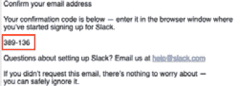

    图 12.3 -检查六位数代码

3.  Enter the verification code in the window that is displayed after you click **Next** with your email address. After entering your verification code, you will be redirected to the next window automatically:

    

    图 12.4 -输入验证码

4.  Give your workspace a name and click the **Next** button:

    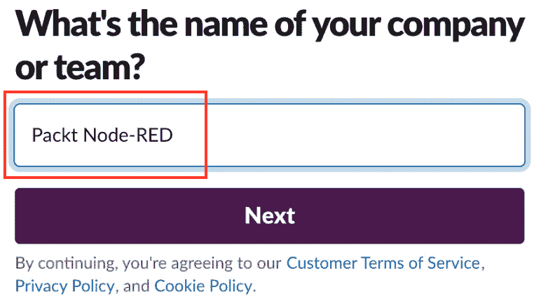

    图 12.5 -为工作区命名

5.  Create a channel in your workspace. You can use the **general** channel as it is, but let's create a channel to implement the chatbot. Here, we will create a channel named **Learning Node-RED**:

    

    图 12.6 -您的工作区名称

6.  Click **skip for now** without adding teammates:

    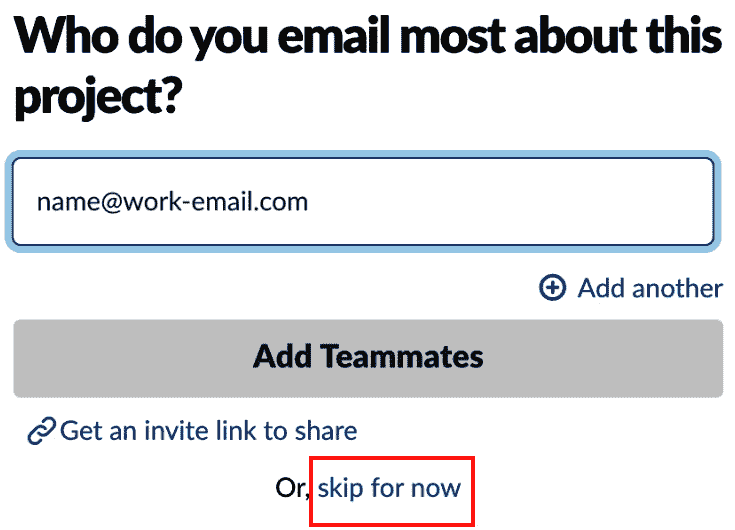

    图 12.7 -本教程不需要队友

7.  点击**查看你的频道在 Slack**打开您创建的工作区:

图 12.8 -单击“查看空闲通道

你已经为本教程创建了工作区:

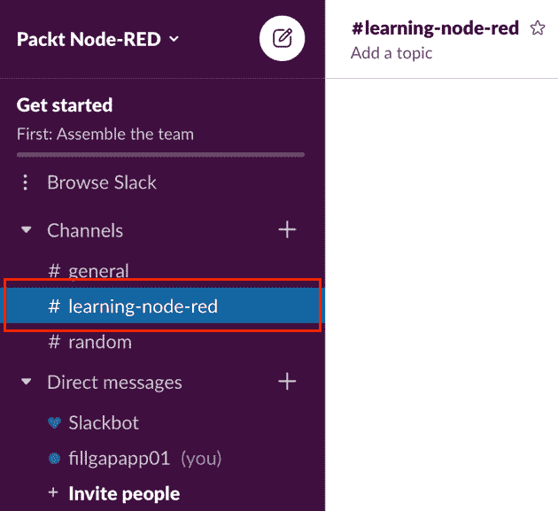

图 12.9 -您已经创建了工作区

重要提示

聊天机器人所在的频道最好是只有你参与的频道，除非你有公共目的。 这是因为对于不喜欢(或不感兴趣)聊天机器人的参与者来说，聊天机器人的运动可能会很嘈杂。

此时，你已经准备好了你的工作区和通道，可以在 Slack 中运行聊天机器人。 接下来，我们将创建一个机制，它将成为聊天机器人的引擎。

# 创建沃森助理 API

本教程使用 IBM 的**Watson Assistant API**作为聊天机器人的引擎。 Watson Assistant 可以使用自然语言分析来解释自然对话的意图和目的，并返回适当的答案。

有关沃森助手的详细信息，请访问:[https://www.ibm.com/cloud/watson-assistant-2/](https://www.ibm.com/cloud/watson-assistant-2/)。

要使用Watson Assistant API，您需要在 IBM Cloud 上创建一个 Watson Assistant API 的实例。 按照以下步骤创建它:

1.  Log in to your IBM Cloud dashboard, and search **Assistant** in the **Catalog**. Click the **Assistant** tile on the results of your search:

    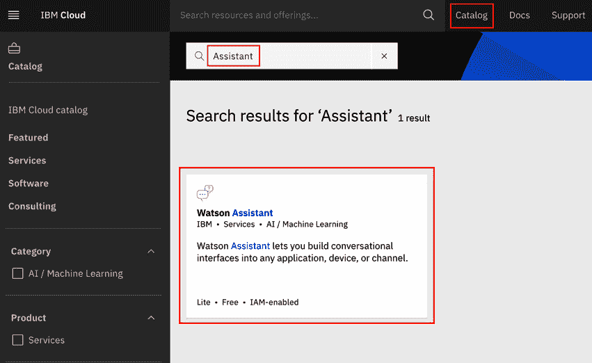

    图 12.10 -搜寻沃森助手

2.  创建一个沃森助理 API 服务。 为 Watson Assistant 服务数据中心选择一个**区域**。 达拉斯是稳定的，所以我们在这里选择了**达拉斯**。
3.  定价方案选择**Lite**。 服务名和资源组等其他项可以保持默认值。
4.  Click the **Create** button:

    

    图 12.11 -创建一个 Watson Assistant 服务

5.  Launch the Watson Assistant tool. Click the **Launch Watson Assistant** button to open the Watson Assistant console:

    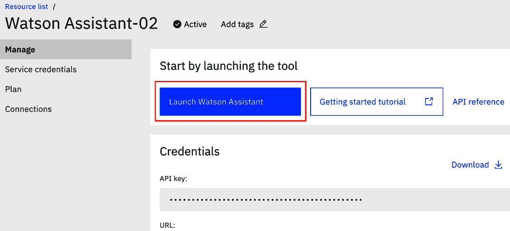

    图 12.12 -启动 Watson Assistant 控制台

6.  Create a **Skill** in your **Watson Assistant** service.

    当您第一次打开 Watson Assistant 控制台时，您将自动移动到**我的第一个技能**界面。

    通常，您将在这里创建一个沃森助理技能，但本实践教程将侧重于 Node-RED，而不是如何使用沃森助理。 因此，通过导入预先准备好的定义文件，可以创建 Watson Assistant 中的一项技能。

    如果你想创造自己的技能，那很好。 在这种情况下，Watson Assistant 的官方文档将会有帮助:[https://cloud.ibm.com/apidocs/assistant/assistant-v2](https://cloud.ibm.com/apidocs/assistant/assistant-v2)。

7.  Click **Assistants** on the side menu of the Watson Assistant console, and click the **Create assistant** button:

    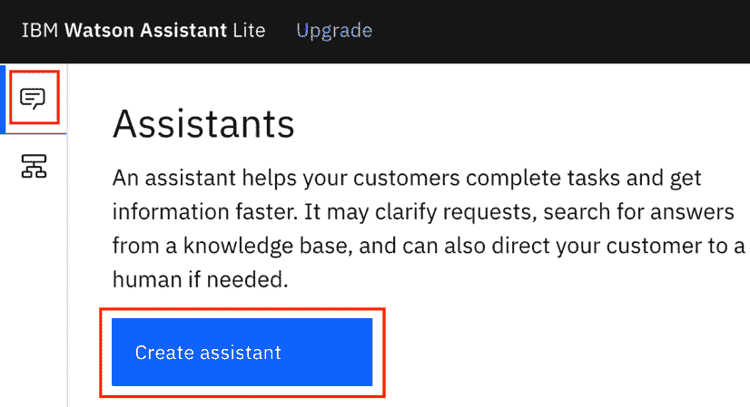

    图 12.13 -创建助手菜单

    这次我准备了一个技能，当被告知**给我讲一个笑话**时，它会随机返回一个笑话短语。

8.  Create an assistant for this frame, set the assistant's name to **Respond Joke Phrase**, and click the **Create assistant** button:

    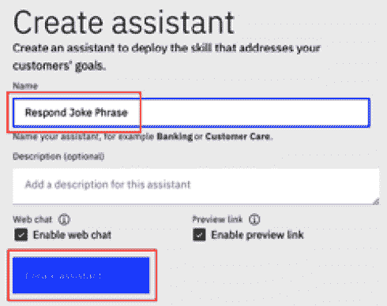

    图 12.14 -创建助手

9.  Import **Dialog**. When your assistant is created, the settings screen of the created assistant is displayed. In the **Dialog** area on that settings screen, click the **Add dialog skill** button:

    

    图 12.15 -添加对话框技能

10.  选择**Import skill**选项卡，选择要导入的技能的 JSON 文件。 在[https://github.com/PacktPublishing/-Practical-Node-RED-Programming/blob/master/Chapter12/skill-Respond-Joke-Phrase.json](https://github.com/PacktPublishing/-Practical-Node-RED-Programming/blob/master/Chapter12/skill-Respond-Joke-Phrase.json)下载此 JSON 文件。
11.  Click the **Import** button when the JSON file is selected:

    

    图 12.16 -导入对话框技能文件

    你将看到**对话**区域中的**回应笑话短语**:

    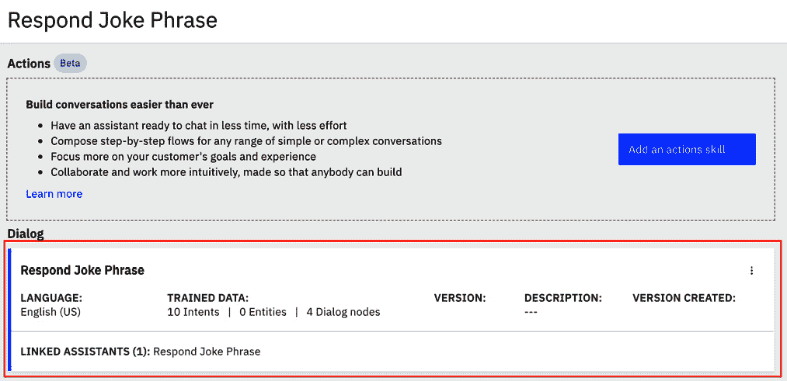

    图 12.17 -对话框技能导入

12.  这就完成了技能导入。 您可以返回简单的问候语和笑话短语，所以尝试使用 Watson Assistant 控制台提供的**try it**功能进行对话:

图 12.18—尝试一下

点击**Try it**按钮将打开聊天窗口。 试着在聊天窗口中键入接下来的对话:

**“Hello***”;* **Hi;** **“Tell****me****joke”;** ****你****知道****有什么****笑话吗?** ;*;***

 **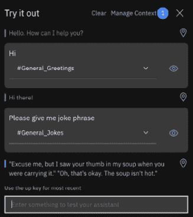

图 12.19 -测试会话

如果你没有得到一个好的答案，尝试另一个短语。 Watson 自然语言理解将 Watson Assistant 的**Try it out**窗口中所说的对话划分为意图或实体的类别。 如果会话没有被划分为所需的类，您可以在**Try it out**窗口中训练 Assistant API。

现在已经使用沃森助手创建了一个自动应答对话，还有一件事要做，那就是确认技能 ID。 这是稍后操作 Watson Assistant 作为 Node-RED API 时需要的 ID。

通过以下步骤检查**技能**屏幕上的技能 ID:

1.  Click **View API Details** under the **Skills** menu at the top right of the **Skill** tile you created:

    

    图 12.20 -访问 View API Details 菜单

2.  将显示的**技能 ID**记录

图 12.21 -检查并记录技能 ID

我们现在已经创建了一个自动响应聊天的聊天机器人服务。 接下来，让我们将其与 Slack 用户界面集成。

# 使能从 Node-RED 连接 Slack

接下来，让我们继续在 node - red 环境上准备一个 Slack 节点。 启动在 IBM Cloud 上创建的 Node-RED 流编辑器。

您在此步骤中所做的是在 node - red 环境中安装一个连接到 Slack 的节点。 这个方法很简单。 您所要做的就是从**管理面板**窗口中找到并安装节点，这在其他章节中已经做过几次了。

按照以下步骤进行:

重要提示

我相信 Node-RED 流编辑器在你的 IBM Cloud 已经创建一个服务(node . js 应用),但如果你还没有这么做,请参考[*第六章*](06.html#_idTextAnchor073)*,在云中实现 Node-RED*,创建一个 IBM Cloud 上 Node-RED 服务,在继续之前这一章。

1.  You need to install the **node-red-contrib-slack** node to use Slack from Node-RED, so click **Manage palette**:

    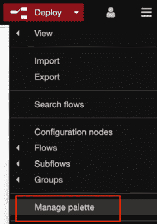

    图 12.22 -打开 Manage 选项板窗口

2.  Search the **node-red-contrib-slack** node and click the **Install** button:

    

    图 12.23 -安装 node-red-contrib-slack 节点

3.  You will see four nodes that belong to **node-red-contrib-slack** on your palette. You have to prepare Slack nodes for building this sample application:

    

    图 12.24 -松弛节点将出现在调色板上

4.  Make a bot in your Slack workspace by accessing the **Slack App Directory** via **Settings & administration** | **Manage apps** on your Slack application (desktop or web):

    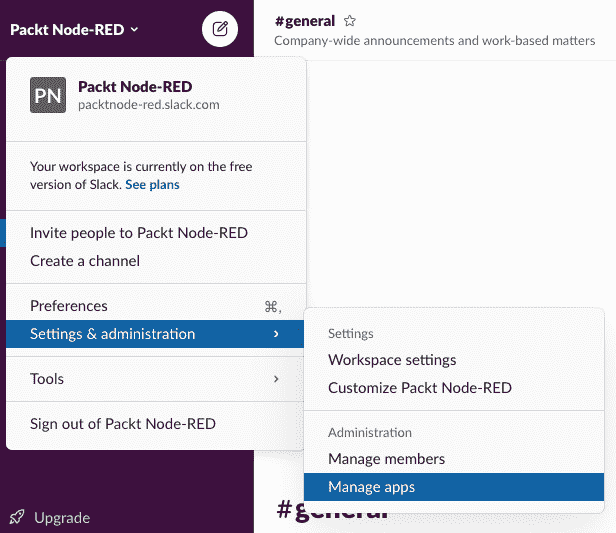

    图 12.25 -选择 Manage apps

5.  After moving to the Slack App Directory website, click the **slack app directory** logo at the top left of the website to access the Slack App Directory main page:

    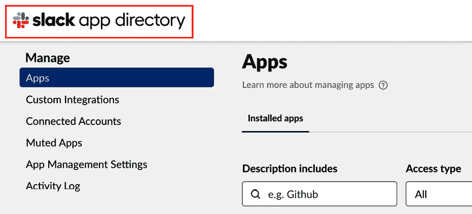

    图 12.26 -访问 Slack App 目录

    您也可以访问 Slack App目录顶部页面，URL 为:**https://<您的工作区>.slack.com/apps**。

    下面的 URL 只是一个示例:[https://packtnode-red.slack.com/apps](https://packtnode-red.slack.com/apps)。

    这个 URL 是根据 Slack 上的每个工作区名称自动生成的。

6.  Click the **Get Essential Apps** button to move to the application search window:

    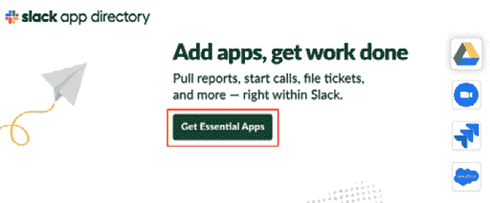

    图 12.27 -点击 Get Essential Apps 按钮

7.  Search the word **bots** and click **Bots** on the results:

    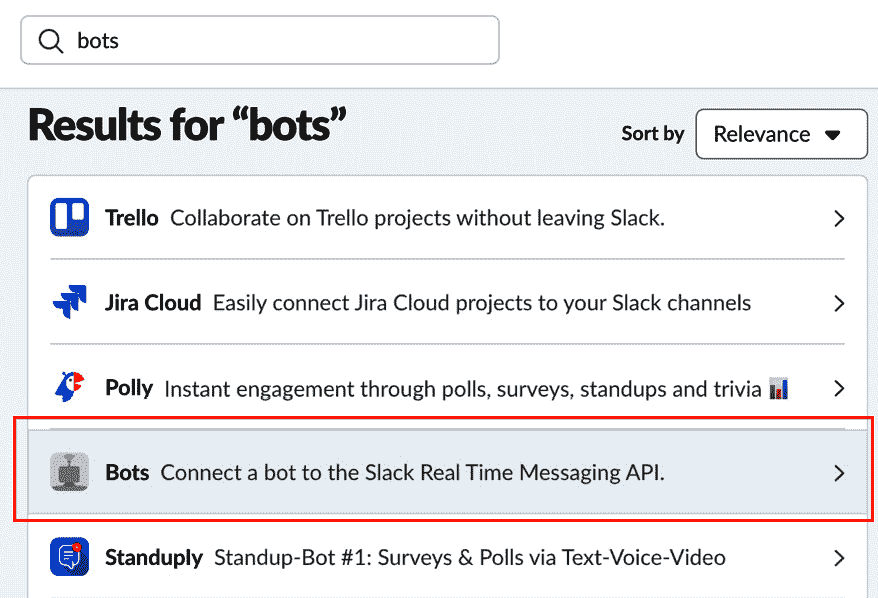

    图 12.28 -搜索 Bots 并选择它

8.  Click the **Add to Slack** button on the **Bots** app screen:

    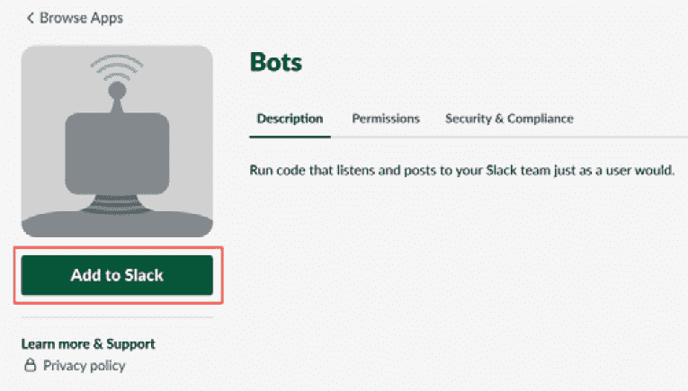

    图 12.29 -将 Bots 应用添加到工作区

9.  使用您喜欢的任何名称设置此 bot 应用的**用户名**。 在本例中，我们将其命名为**packt-bot**。
10.  Click the **Add bot integration** button:

    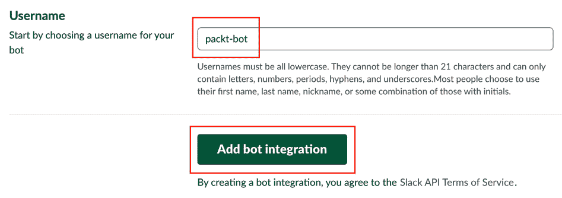

    图 12.30 -设置你的机器人名称

11.  On the next screen, the API token for using the bot will be generated and displayed. Make a note of this so that you do not forget it. This API token is used when creating a flow with Node-RED:

    重要提示

    在与应用共享 bot 用户令牌时要小心。 不要在公共代码存储库中发布 bot 用户令牌。 这是因为任何人都可以使用这个 API 令牌访问机器人。

    

    图 12.31 -确认 API 令牌

12.  点击**Save Integration**按钮完成 bot app 集成:

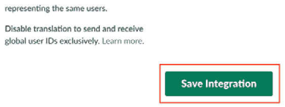

图 12.32 - Bot 应用集成完成

现在你准备好了。 让我们继续讨论流创建过程。

# 构建聊天机器人应用

到目前为止，您已经在 Watson Assistant 中创建了一个聊天机器人引擎，创建了一个 Slack 工作区，并集成了Bot 应用，您可以在该 Slack 工作区中使用它。

在这里，我们将把这些服务与 Node-RED 结合起来，并创建一个与 Node-RED 结合的机制，以便机器人在 Slack 的工作空间中进行对话时能够进行应答。

按照以下步骤创建一个流:

1.  Connect Watson Assistant to Node-RED. Access your Node-RED service dashboard via **Resource list** on IBM Cloud. Select the **Connections** tab and click the **Create connection** button:

    

    图 12.33 -在 Node-RED 上创建一个新连接

2.  Select the Watson Assistant service you created and click the **Next** button:

    

    图 12.34 -在 Node-RED 上创建一个新连接

3.  Click the **Connect** button with the default options to finish the connection setup. Doing this operation will restart the Node-RED application, which will take a few minutes to complete:

    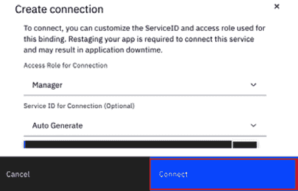

    图 12.35 -在 Node-RED 上完成创建新连接

4.  Make the flow to handle conversations on Slack.

    您已经有了 Slack 节点和 Watson 节点，可以在本教程中使用。

5.  Place a **slack-rtm-in** node, two **function** nodes, an **assistant** node, **slack-rtm-out**, and a **debug** node. After placing them, wire them sequentially as in the following figure:

    

    图 12.36 -放置节点并连接它们

6.  Set the parameters for each node.

    按照这个过程设置每个节点上的参数。 对于需要编码的节点，编码如下:

    *   The **slack-rtm-in** node:

        a)点击编辑按钮(铅笔图标)，打开**属性**面板:

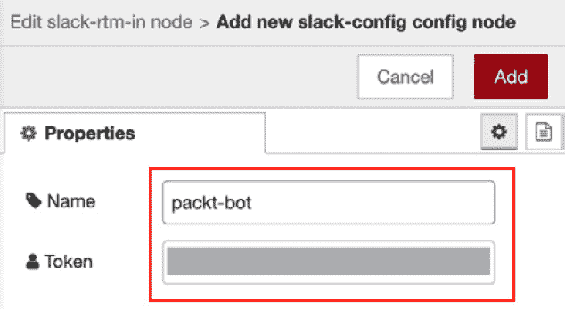

图 12.37 -打开属性面板

b)输入您在 Slack Bots 应用中生成的**Token**值。您可以为该配置设置任何名称。 在这个例子中，它被命名为**packt-bot**:

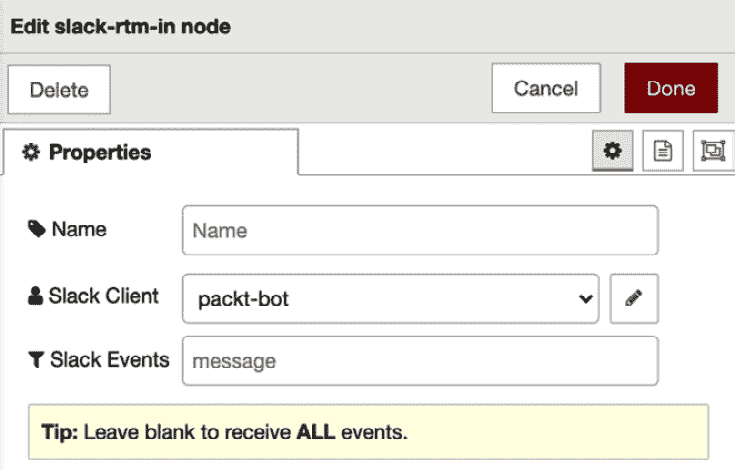

图 12.38 -设置连接 Slack 应用的配置属性

当您回到该节点的主面板时，您将看到已经在**Slack Client**属性中设置了配置。

c)点击**完成**按钮关闭该设置:

图 12.39 -完成 load -rtm-in 节点的属性设置

*   The **function** node (first one):

    a)在第一个**功能**节点中，输入以下内容:

    global.set(“通道”,msg.payload.channel);

    味精。 主题=“消息”;

    msg.payload = msg.payload.text;

    返回味精

    也可以参考下图:

图 12.40 -第一个功能节点编码

在这个函数节点中，在 Slack 上发布的消息将从从 Slack 发送的 JSON 数据中取出，并放入**msg。 有效载荷**。

另一个重要的过程是将 Slack 发送的信道信息存储在 Node-RED 的 Global 变量中。 存储在这里的信道信息将在稍后向 Slack 发送响应消息时使用。

*   The **assistant** node:

    在上一步中，您将 Watson Assistant 连接到 Node-RED。 这意味着您可以在不使用 API 密钥或秘密的情况下从 Node-RED 调用助理 API。

    当我双击**助手**节点打开设置面板时，我看不到任何属性，比如 API 键。 如果您在设置面板中看到它们，这意味着 Watson Assistant 和 Node-RED 连接进程失败。 在这种情况下，再次执行连接过程。

    这里只需要设置一个属性。 在**助手**节点的设置面板中，将您之前写下的沃森助手技能 ID 设置为**工作区 ID**属性:

图 12.41 -将 Skill ID 设置为工作区 ID

至此，完成了**助手**节点的设置。 保存您的设置并关闭设置面板。

*   The **function** node (the second one):

    在第一个**函数**节点中，输入如下代码:

    var g_channel=global.get("channel");

    味精。 主题=“消息”;

    msg.payload = {

    频道:g_channel,

    文字:msg.payload.output.text [0]

    ｝

    返回味精

    也可以参考下图:

图 12.42 -第二个函数节点编码

第二个函数节点存储自动回复消息回来沃森在**msg.payload.text 助理,和得到了松弛频道信息保存在第一个函数节点并将其存储在**msg.payload.channel**。**

 ***   The **slack-rtm-out** node:

    其次是**slack-rtm-out**节点，设置简单:

    a)双击**懈怠**节点，进入设置面板。

    b)您将看到您创建的名为**packt-bot**的配置已经被放置在这个节点属性中。 如果尚未设置，请从下拉列表中手动选择。 点击**Done**，设置完成:

图 12.43 -检查 slack-rtm-out 节点的属性设置

*   The **debug** node:

    这里的调试节点只是输出日志。 无需设置。

1.  Check the bot application on Slack.

    一个自动应答聊天机器人已经被创建使用 Slack。 让我们试试对话。

2.  On the channel you created in your Slack workspace, add the bot app you integrated and click the **Add an app** link on the channel:

    

    图 12.44 -单击 Add an app 链接

3.  点击**Add**按钮将 bot 应用添加到您的频道:

图 12.45 -添加您创建的 bot 应用

现在，我们来谈谈。 提到和跟你的机器人(**packt-bot**在这个例子中)通道上添加这机器人应用。因为只有对话我们正在学习华生助理是问候和听笑话,我们将发送一个消息从松弛,似乎与这两种。

首先，让我们打个招呼。 你会看到一种问候式的回应:

图 12.46 -与聊天机器人交换问候

然后给发一个信息，像**请****告诉****me****一个****笑话**。 它会随机地回复一个机器人选择的笑话:

图 12.47 -聊天机器人回答一些笑话

伟大的工作! 您最终使用 Node-RED 创建了聊天机器人应用。

如果您希望流配置文件在 Node-RED 环境中创建此流，可以在这里获取:[https://github.com/PacktPublishing/-Practical-Node-RED-Programming/blob/master/Chapter12/slack-watson-chatbot-flows.json](https://github.com/PacktPublishing/-Practical-Node-RED-Programming/blob/master/Chapter12/slack-watson-chatbot-flows.json)。

# 小结

在本章中，我们体验了如何使用 Slack、Watson 和 Node-RED 制作聊天机器人应用。 这一次，我们使用 Slack 作为聊天平台，但你可以使用任何有 api 的聊天平台，比如 LINE、Microsoft Teams 等等，而不是 Slack。

本章对于创建任何非物联网应用也很有帮助。 Node-RED 可以通过链接任何 Web API 来开发各种应用。

在下一章中，让我们开发自己的节点。 当然，它可以在任何环境中使用。 使用 node - red 开发您自己的节点意味着开发一个不能使用现有节点完成的新节点。 这无疑是 Node-RED 高级用户的第一步。****