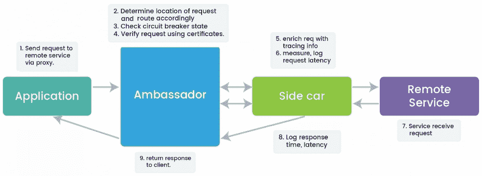
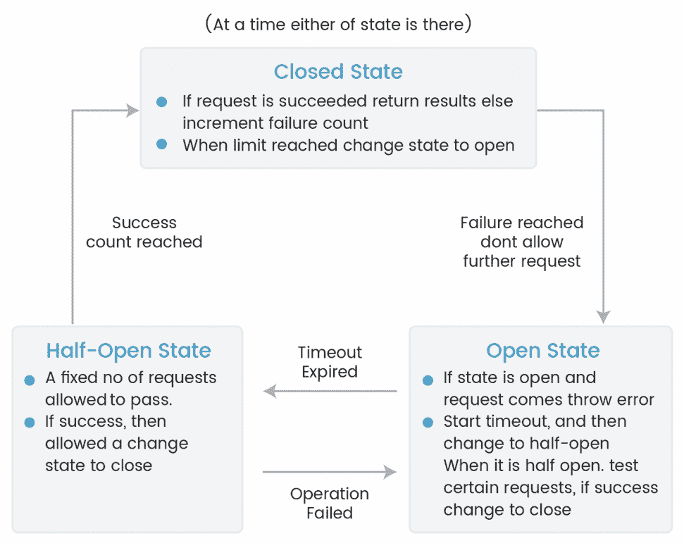

Debunking Microservices <link rel="stylesheet" href="css/style.css" type="text/css"> 

# 揭穿 Microservices

"If I had asked people what they wanted, they would have said faster horses." – Henry Ford

无论你是技术领导、开发人员，还是渴望适应现代网络新标准的技术专家，前面的行概括地代表了你当前的生活状况。 今天对于成功的业务的咒语是:快速失败、快速修复和快速上升、更快的交付、频繁的更改、适应不断变化的技术和容错系统是一些日常通用需求。 出于同样的原因，在最近的时间里，技术世界看到了架构设计的快速变化，这导致行业领导者(如 Netflix、Twitter、Amazon 等)从单一应用程序转向采用微服务。 在本章中，我们将揭开微服务的面纱，对其进行剖析，了解其概念、特点和优势。 我们将学习微服务设计方面的知识，并了解一些微服务设计模式。

在本章中，我们将讨论以下主题:

*   揭穿 microservices
*   微服务的主要考虑因素
*   Microservice 常见问题
*   微服务如何满足应用程序的 12 个因素
*   当今世界的微服务
*   Microservice 设计方面
*   Microservice 设计模式

# 揭穿 microservices

微服务开发背后的核心思想是，如果应用程序被分解成更小的独立单元，每个小组都能很好地执行其功能，那么构建和维护应用程序就变得简单了。 整个应用程序就变成了单个单元的总和。 让我们从揭秘微服务开始。

# microservices 崛起

今天的世界正呈指数级发展，它要求一个架构能够满足以下问题，这些问题促使我们重新思考传统架构模式，并导致了微服务的出现。

# 可根据需要选择多种语言

技术独立是非常必要的。 在任何时候，语言都会发生变化，采用率也会相应变化。 像沃尔玛这样的公司已经离开了 Java 堆栈而转向了 MEAN 堆栈。 今天的现代应用不仅仅局限于 web 界面，还扩展了对移动和智能手表应用的需求。 因此，用一种语言编写所有代码根本不是一个可行的选择。 我们需要一个多种语言可以共存和相互交流的架构或生态系统。 例如，我们可以在 Go、Node.js 和 Spring boot 中公开 REST api——网关作为前端的单点接触点。

# 容易处理所有权

今天的应用不仅包括单一的 web 界面，而且还超越了手机、智能手表和**虚拟现实**(**VR**)。 将逻辑分离为单个模块有助于控制一切，因为每个团队都拥有一个单元。 此外，多个事物应该能够并行运行，从而实现更快的交付。 团队之间的依赖性应该减少到零。 找到合适的人来解决问题并启动和运行系统需要一个微服务架构。

# 频繁的部署

应用程序需要不断发展，以跟上不断发展的世界。 当 Gmail 开始时，它只是一个简单的邮件实用程序，现在它已经发展到远不止于此。 这些频繁的更改需要频繁的部署，以至于最终用户甚至不知道正在发布一个新版本。 通过划分成更小的单元，团队可以通过测试处理频繁的部署，并迅速将特性交付给客户。 应该有一种优雅的堕落，也就是说，快速失败，然后完成它。

# 自我维持的开发单位

不同模块之间的紧密依赖很快就会影响到整个应用程序，从而导致应用程序下降。 这需要更小的独立单元，这样如果一个单元不能操作，整个应用程序就不会受到它的影响。

现在让我们深入了解微服务、它们的特征、优势以及实现微服务体系结构时面临的所有挑战。

# microservices 是什么?

微服务没有统一的定义。 简单地说，一个微服务可以是任何操作块或单元，它可以非常有效地处理它的单一职责。

**微服务**是构建自治、自我维持、松散耦合的业务能力的现代风格，概括起来就是一个完整的系统。 我们将探讨微服务的原则和特点，微服务提供的好处，以及需要注意的潜在陷阱。

# 原理和特点

定义微服务有一些原则和特征。 任何微服务模式都可以通过以下几点进行进一步的区分和解释。

# 没有单一的模块

微服务只是另一个满足单一运营业务需求的新项目。 微服务与业务单元变化相关联，因此必须是松散耦合的。 微服务应该能够持续地服务于不断变化的业务需求，而与其他业务单元无关。 对于其他服务，这只是一个消费问题，消费模式不应该改变。 实现可以在后台进行更改。

# 愚蠢的沟通管道

**微服务促进了微服务之间基本的、经过时间考验的异步通信机制。 根据这一原则，业务逻辑应该留在端点中，而不是与通信通道合并。 通信信道应该是哑的，只在通信协议中进行通信。 HTTP 是一种很好的通信协议，但是现在有一种反应性更强的方法——队列。 **Apache Kafka**和**RabbitMQ**是一些流行的哑通信管道提供商。**

 **# 分散或自治

在与微服务合作时，经常会出现失败的变化。 最终阻止故障传播到整个系统的应急计划。 此外，每个微服务可能都有自己的数据存储需求。 去中心化管理的正是这种需求。 例如，在我们的购物模块中，我们可以将客户及其事务相关信息存储在 SQL 数据库中，但由于产品数据是非结构化的，所以我们将其存储在 nosql 相关数据库中。 每个服务都应该能够决定在失败情况下应该做什么。

# 服务契约和无状态性

微服务应该通过服务合同得到很好的定义。 一个**服务契约**基本上提供了关于如何使用服务以及需要传递给该服务的所有参数的信息。 Swagger 和**AutoRest**是一些被广泛采用的用于创建服务契约的框架。 另一个显著特征是，微服务不存储任何东西，也不维护任何状态。 如果需要持久化某些内容，则将其持久化到缓存数据库或某些数据存储中。

# 轻量级

微服务是轻量级的，有助于在任何宿主环境中轻松地复制设置。 容器比管理程序更受欢迎。 通过将微服务绑定到某个上下文，轻量级应用程序容器帮助我们保持更低的占用空间。 设计良好的微服务应该只执行一项功能，并且运作良好。 容器化的微服务很容易移植，因此很容易实现自动伸缩。

# Polyglot

在微服务体系结构中，服务 API 背后的一切都是抽象和未知的。 在前面的购物车微服务示例中，我们可以将支付网关完全作为部署在云中的服务(无服务器架构)，而其他服务可以使用 Node.js。 内部实现完全隐藏在微服务后面，唯一需要注意的是整个通信协议应该是相同的。

现在，让我们看看微服务架构为我们提供了哪些优势。

# 微服务的好部分

采用微服务有几个优点和好处。 我们将着眼于使用微服务的好处和更高的商业价值。

# 依靠自己的团队

微服务体系结构使我们能够独立地扩展任何操作，按需提供可用性，并快速地引入新服务，而不需要零配置或很少配置。 对技术的依赖也大大减少。 例如，在我们的购物微服务架构中，库存和购物模块可以独立部署和工作。 库存服务将假设产品将存在并相应地工作。 只要满足库存和产品服务之间的通信协议，库存服务可以用任何语言进行编码。

# 服务的安全降级

任何系统的故障都是自然的，优雅的降级是微服务的关键优势。 故障不会级联到整个系统。 微服务的设计方式是遵循约定的服务水平协议; 如果没有满足**服务级别协议**(**sla**)，则服务将被丢弃。 例如，回到我们的购物微服务例子，如果我们的支付网关关闭，那么对该服务的进一步请求将停止，直到服务启动并运行。

# 支持多语言架构和 DevOps

微服务根据需要使用资源或有效地创建多语言体系结构。 例如，在购物微服务中，您可以将产品和客户数据存储在关系数据库中，但是任何审计或日志相关的数据都可以存储在**Elasticsearch**或**MongoDB**中。 由于每个微服务都是在其有限的环境中运行的，因此可以进行实验和创新。 改变影响的成本将非常小。 Microservices 使**DevOps**达到满级。 成功的微服务架构需要许多 DevOps 工具和技术。 小型微服务易于自动化，易于测试，如果需要，可以污染故障，并且易于扩展。 Docker**Docker**是用于容器化微服务的主要工具之一。

# 事件驱动架构

一个架构良好的微服务将支持异步事件驱动的架构。 事件驱动的架构很有帮助，因为任何事件都可以被跟踪——每个操作都是任何事件的结果，我们可以利用任何事件来调试问题。 微服务是采用发布者-订阅者模式设计的，这意味着添加任何订阅该事件的其他服务将只是一项任务。 例如，你正在使用一个购物网站，有一个添加到购物车的服务。 现在，我们想要添加新的功能，以便无论何时将产品添加到购物车中，都应该更新库存。 然后，可以准备一个只需要订阅添加到购物车服务的库存服务。

现在，我们将研究微服务体系结构带来的复杂性。

# 微服务中糟糕且具有挑战性的部分

强大的力量带来更大的挑战。 让我们看看设计微服务的挑战性部分。

# 组织和编制

这是适应微服务架构时面临的最大挑战之一。 这更像是一个非功能性的挑战，需要组建新的组织团队，并指导他们采用微服务、敏捷和 scrum 方法。 它们需要在这样一个环境中进行模拟，以便它们能够独立工作。 他们开发的结果应该以一种松散耦合和易于扩展的方式集成到系统中。

# 平台

创建完美的环境需要一个合适的团队，以及跨所有数据中心的可伸缩的故障安全基础设施。 选择合适的云提供商(**AWS**或**GCP**或**Azure**)，添加自动化、可伸缩性、高可用性、管理容器和微服务实例是一些关键的考虑因素。 此外，微服务还需要其他组件，比如企业服务总线、文档数据库、缓存数据库等等。 在处理微服务时，维护这些组件成为一项额外的任务。

# 测试

完全独立地测试带有依赖性的服务是极具挑战性的。 当微服务被引入生态系统时，需要进行适当的治理和测试，否则它将成为系统的单一故障点。 任何微服务都需要几个级别的测试。 它应该从服务是否能够访问横切关注点(缓存、安全性、数据库、日志)开始。 应该测试服务的功能，然后测试它将要通过的通信协议。 接下来是微服务与其他服务的协作测试。 之后是可伸缩性测试，然后是故障安全测试。

# 服务发现

在分布式环境中定位服务可能是一项乏味的任务。 不断的变化和交付是当今不断发展的世界的可怕要求。 在这种情况下，服务发现可能具有挑战性，因为我们希望独立的团队和团队之间的最小依赖关系。 服务发现应该为微服务提供动态位置。 服务的位置可能会根据部署和自动伸缩或故障而不断更改。 服务发现还应该注意服务状态不佳或性能不佳的情况。

# Microservice 例子

下面是一个购物微服务的图表，我们将在本书中实现它。 我们可以看到,每个服务是独立维护和有独立模块或较小的系统——**计费模块,客户模块**,**产品模块**,**和**供应商模块。 为了配合各个模块，我们有**API 网关**和**服务注册中心**。 添加任何额外的服务变得非常容易，因为服务注册中心将维护所有的动态条目，并相应地更新:****

 **

# 采用微服务时的关键考虑因素

微服务体系结构引入了定义良好的边界，这使得在边界内隔离故障成为可能。 但是，与其他分布式系统一样，在应用程序级别可能存在失败的机会。 为了最小化影响，我们需要设计容错微服务，以预定义的方式对特定类型的故障作出反应。 在适应微服务体系结构的同时，我们增加了一个用于通信的网络层，而不是内存方法调用，这将引入额外的延迟，并增加一个需要管理的层。 下面是一些考虑事项，如果在设计针对故障的微服务时小心处理，将在长期内使系统受益。

# 服务退化

微服务体系结构允许您隔离故障，从而使您能够隔离故障并获得适当的降级，因为故障包含在服务的边界内，并且不是级联的。 例如，在社交网站中，消息服务可能会下降，但这不会阻止最终用户使用社交网络。 他们仍然可以浏览帖子、共享状态、签到位置等等。 服务应该遵循特定的 sla。 如果微服务停止满足其 SLA，则应该恢复该服务以进行备份。 **Netflix 的 Hystrix**也是基于同样的原理。

# 适当的改变治理

在没有任何治理的情况下引入变革可能是一个巨大的问题。 在分布式系统中，服务是相互依赖的。 因此，当你引入一个新的变化时，应该最大限度地考虑是否引入了任何副作用或不想要的影响，那么它的影响应该是最小的。 应该提供各种变更管理策略和自动推出选项。 此外，在代码管理中应该有适当的治理。 开发应该通过 TDD 或 BDD 来完成，如果达到了约定的百分比，那么才应该进行推广。 释放应该逐步进行。 一个有用的策略是*蓝绿色*或*红黑*部署策略，其中运行两个生产环境。 您只在一个环境中推出更改，并且只有在验证更改之后才将负载平衡器指向一个新版本。 在维护登台环境时更有可能出现这种情况。

# 健康检查、负载均衡和高效网关路由

根据业务需求，微服务实例可以启动、重新启动、在出现故障时停止、在内存不足时运行和自动伸缩，这可能会使它暂时或永久不可用。 因此，架构和框架应该相应地进行设计。 例如，一个 Node.js 服务器，由于是单线程的，在故障的情况下会立即停止，但是使用优雅的工具，如**PM2**可以永远保持它们的运行。 应该引入一个网关，这将是微服务消费者的唯一接触点。 网关可以是一个负载平衡器，它应该跳过不健康的微服务实例。 负载平衡器应该能够收集运行状况信息度量并相应地路由流量，它应该智能地分析任何特定微服务上的流量，如果需要，它应该触发自动伸缩。

# 自凝

**自愈设计**可以帮助系统从灾难中恢复。 微服务的实现应该能够自动恢复丢失的服务和功能。 Docker 等工具在服务失败时重新启动服务。 Netflix 提供广泛的工具作为编排层来实现自我修复。 常用的有 Eureka 服务注册表和 Hystrix 断路器。 断路器使您的服务呼叫更有弹性。 它们跟踪每个微服务端点的状态。 每当遇到超时时，Hystrix 就会断开连接，触发修复微服务的需求，并恢复一些故障安全策略。 **Kubernates**是另一种选择。 如果吊舱或吊舱内的任何容器发生故障，库伯尼特斯将启动系统并保持副本集的完整性。

# 缓存故障转移

故障转移缓存有助于在出现临时故障或一些故障时提供必要的数据。 缓存层的设计应该让它能够明智地决定在正常情况下或故障转移情况下缓存可以使用多长时间。 可以使用 HTTP 设置缓存标准响应头。 max-age 标头指定资源被认为是新鲜的时间。 stale-if-error 报头确定资源应从缓存中提供多长时间。 还可以使用**Memcache**、**Redis**等库。

# 重试,直到

由于其自我修复的能力，微服务通常可以在很短的时间内启动并运行。 微服务体系结构应该具有*重试逻辑直到条件*的能力，因为我们可以预期服务将恢复或负载均衡器将服务请求重定向到另一个健康的实例。 频繁的重试也会对系统产生巨大的影响。 一般的想法是增加每次失败后重试之间的等待时间。 微服务应该能够处理幂等问题; 假设您正在尝试购买一个订单，那么不应该在客户上重复购买。 现在，让我们花时间重温微服务的概念，并理解关于微服务体系结构的最常见问题。

# Microservice 常见问题

在理解任何新术语时，我们经常会遇到几个问题。 以下是我们在理解微服务时最常遇到的一些问题:

*   **微服务不就像面向服务的体系结构(SOA)吗? 我不是已经有了吗? 我应该什么时候开始?**

如果您已经在软件行业工作了很长时间，那么看到微服务可能会让您记住 SOA。 微服务确实从 SOA 中获得了模块化和基于消息的通信的概念，但它们之间有许多不同之处。 虽然 SOA 更关注代码重用，但微服务遵循*在您自己的绑定上下文*规则。 微服务更像是 SOA 的一个子集。 微服务可以根据需要进行扩展。 并不是所有的微服务实现都是相同的。 在你的医疗领域使用 Netflix 的实施可能是一个坏主意，因为医疗报告中的任何错误都值得一个人的生命。 对于一个正在工作的微服务来说，简单的答案就是要有一个明确的目标，即服务要执行的操作，以及如果它不能执行，那么在失败时它应该做什么。 关于何时以及如何开始微服务，有各种各样的答案。 *Martin Fowler*是微服务的先驱之一，他提出要从整体服务开始，然后逐渐转向微服务。 但这里的问题是，在这个技术创新的时代，是否有足够的投资进入同样的阶段? 简短的回答是，在微服务领域早走有巨大的好处，因为它将从一开始就解决所有的问题。

*   **我们将如何处理所有的部分? 谁来负责?**

微服务引入了本地化和自治。 本地化意味着以前完成的大量工作将不再由中央团队来完成。 接受自治意味着信任所有团队，让他们自己做决定。 通过这种方式，管理软件变更甚至迁移变得非常容易和快速。 话虽如此，但这并不意味着没有中心体。 随着微服务的增加，体系结构变得更加复杂。 然后，中央团队应该处理所有集中控制，比如安全性、设计模式、框架、企业安全总线等等。 应该引入某些自治过程，例如 sla。 每个微服务都应该遵守这些 sla，并且系统设计应该是智能的，如果 sla 没有满足，那么就应该放弃微服务。

*   **我如何引入改变，或者我如何从微服务的发展开始?**

几乎所有成功的微服务故事都是从一个大到难以管理的整体开始的。 突然改变架构的某些部分会产生巨大的影响，应该逐渐采用*划分和*规则。 考虑问自己以下问题，以决定在整体中打破哪个部分——*我的应用程序是如何构建和打包的? 我的应用程序代码是如何编写的? 我可以有不同的数据源吗?当我引入多个数据源时，我的应用程序将如何运行? -*基于这些部分的答案，重构该部分，并测量和观察该应用程序的性能。 确保应用程序保持在其有限上下文中。 另一个可以开始的部分是在当前整体中性能最差的部分。 找到这些阻碍变革的瓶颈对组织有好处。 引入集中化操作最终将允许多个事情并行运行，从而为公司带来更大的好处。

*   **需要什么样的工具和技术?**

在设计微服务体系结构时，应考虑到每个特定阶段的技术或框架选择。 例如，微服务特性、云基础设施和容器的理想环境。 容器提供了异构和易于移植或迁移的系统。 使用 Docker 可以在微服务中提供弹性和可伸缩性。 微服务的任何部分，如 API Gateway 或服务注册表，都应该是 API 友好的，能够适应动态更改，而不是单点故障。 容器需要在服务器上切换开关，跟踪所有应用程序升级的合适框架——**Swarm**或**Kubernates**，以协调框架部署。 最后，使用一些监控工具对所有微服务进行运行状况检查并采取必要的行动。 普罗米修斯就是这样一个著名的工具。

*   **如何管理微服务系统?**

随着大量并行服务开发的进行，需要一个集中的治理策略。 我们不仅需要关注认证和服务器审计，还需要关注集中的关注点，如安全性、日志记录、可伸缩性，以及分布式关注点，如团队所有权、各种服务之间的共享关注点、代码分析器、特定于服务的关注点，等等。 在这种情况下，可以制定一些标准的指导方针，比如每个团队应该提供一个 Docker 配置文件，该文件将软件从依赖到构建，再到生成一个包含服务细节的容器捆绑在一起。 然后，Docker 映像可以以任何标准方式运行，也可以使用诸如 Amazon EC2、GCP 或 Kubernates 等编排工具。

*   **所有的微服务都应该用同一种语言编码吗?**

这个问题的一般答案是，它不是一个先决条件。 微服务通过预定义的协议(如 HTTP、Sockets、Thrift、RPC 等)相互交互，我们将在后面详细介绍。 这意味着可以用完全不同的技术堆栈编写不同的服务。 微服务的内部语言实现不如外部结果(即端点和 API)重要。 只要维护了通信协议，语言实现就不重要了，而不仅仅只有一种语言是一个额外的优势，但是添加太多的语言也会增加系统开发人员维护语言环境需求的复杂性。 整个生态系统不应该是一个野生丛林，在那里你可以种植任何东西。

基于云的系统现在有了一套标准的指导方针。 我们将着眼于著名的 12 因素应用以及微服务是如何遵循这些准则的。

# 微服务十二要素应用

"Good code fails when you don't have a good process and a platform to help you. Good team fails when you don't have a good culture that embraces DevOps and microservices." - Tim Spann

**十二因素应用**是针对**软件即服务(SaaS****)**或部署在云中的 web 应用或软件的方法。 它告诉我们期望从这类应用程序输出的特征。 它本质上只是概述了构建结构良好、可伸缩的云应用程序的必要性:

*   **代码库**:我们为每个 microservice 维持一个单一代码库,配置特定于自己的环境,如开发、QA、和刺激。每个 microservice 将有自己的仓库在一个版本控制系统如 Git,变幻无常,等等。
*   :所有的微服务都将把它们的依赖作为应用程序包的一部分。 在 Node.js 中，有`package.json`，它提到了所有的开发依赖和整体依赖。 我们甚至可以有一个私有的存储库，从中提取依赖项。
*   **Configs**:所有配置都应该基于服务器环境外部化。 应该将配置与代码分开。 你可以在 Node.js 中设置环境变量，也可以使用 Docker 组合来定义其他变量。
*   **支持服务**:任何通过网络消耗的服务，如数据库、I/O 操作、消息查询、SMTP、缓存将作为微服务公开，并使用 Docker 组合并独立于应用程序。
*   **构建、发布和运行**:我们将在分布式系统中使用 Docker 和 Git 等自动化工具。 使用 Docker，我们可以使用推、拉和运行命令隔离所有三个阶段。
*   **Processes**:微服务被设计为无状态且不共享任何内容，因此实现零容错和易于扩展。 卷用于保存数据，避免数据丢失。
*   **端口绑定**:微服务应该是自治和自包含的。 微服务应该嵌入服务侦听器作为服务本身的一部分。 例如，在 Node.js 应用中使用 HTTP 模块，服务网络暴露服务来处理所有进程的端口。
*   **并发**:微服务将通过复制向外扩展。 微服务是按比例扩大而不是按比例扩大的。 微服务可以根据工作负载多样性流进行伸缩或收缩。 并发性将被动态地维护。
*   **一次性**:通过快速启动和优雅关机最大化应用程序的健壮性 各种选项包括重启策略、使用 Docker 集群的编排、反向代理和使用服务容器的负载平衡。
*   **Dev/prod parity**:保持开发/生产/登台环境完全相同。 使用容器化的微服务可以通过*一次构建，在任何地方运行的策略*实现。 在不同的 DevOps 阶段部署相同的映像。
*   **Logs**:为日志创建单独的微服务，将其集中起来，作为事件流处理，并将其发送到诸如**elastic stack**(**ELK**)这样的框架。
*   **管理进程**:管理或任何管理任务都应该打包为一个进程，这样可以方便地执行、监视和管理它们。 这将包括数据库迁移、一次性脚本、修复错误数据等任务。

# 当今世界的微服务

现在，让我们看看当今世界微服务的先驱实现者，他们所拥有的优势，以及未来的路线图。 这些公司采用微服务的共同目标是摆脱铁板一块的地狱。 微服务甚至在前端看到了它的应用。 像**Zalando**这样的公司也使用微服务原则在 UI 级别进行组合。

# 网飞公司

**Netflix**是微服务采用的领跑者之一。 Netflix 每天处理数十亿的观看事件。 它需要一个健壮且可伸缩的架构来管理和处理这些数据。 Netflix 利用多语言持久性来获得他们采用的每一种技术解决方案的力量。 他们使用了**Cassandra**进行高容量和低延迟的写操作，并使用了一个手工制作的模型，该模型对中等容量的写操作进行了调优配置。 他们有**Redis**用于高速缓存级别的高容量和低延迟读取。 Netflix 定制的几个框架现在是开源的，可以使用:

| **Netflix Zuul** | 是通往外部世界的边缘服务器或看门人。 它不允许未经授权的请求通过。 它是与外界唯一的接触点。 |
| **Netflix Ribbon** | 服务使用者用于在运行时查找服务的负载均衡器。 如果发现多个微服务实例，ribbon 会使用负载平衡来均匀地分配负载。 |
| **Netflix Hystrix** | 一种用于保持系统正常运行的断路器。 Hystrix 会断开即将失败的服务的连接，只在服务再次启动时才连接。 |
| **Netflix 尤利卡** | 用于业务发现和注册。 它允许服务在运行时注册自己。 |
| **Netflix Turbine** | 用于检查运行微服务的运行状况的监视工具。 |

只要看看这些数据库里的星星，就能知道使用 Netflix 工具的微服务的使用率。

# 沃尔玛

沃尔玛是黑色星期五最受欢迎的公司之一。 在黑色星期五期间，它每分钟有超过 600 万的页面浏览量。 **沃尔玛**采用微服务架构，采用到 2020 年的世界，以合理的成本 100%可用。 向微服务的转变给公司带来了巨大的提升。 转化率上升了 20%。 他们在黑色星期五没有休息时间。 他们节省了 40%的计算能力，总体节省了 20-50%的成本。

# Spotify

**Spotify**每月有 7500 万活跃用户，平均时长为 23 分钟。 他们采用了微服务架构和多语言环境。 Spotify 是一家拥有 90 个团队、600 名开发人员和 5 个办事处的公司，它们分布在两大洲，都在开发同一款产品。 这是尽可能减少依赖的一个主要因素。

# Zalando

**Zalando**前端实现微服务。 他们引入了作为前端独立服务的片段。 片段可以在运行时按照提供的模板定义组合在一起。 与 Netflix 类似，他们也有外包的使用库:

| 【t】裁缝【t】 | 它是一个布局服务，它由不同的片段组成一个页面，因为它进行异步和基于流的获取，它有出色的**时间到第一个字节**(**TTFB**)。 |
| **船长** | 用于通信的 HTTP 路由器，更像是一个 HTTP 拦截器，它具有用过滤器修改请求和响应的能力。 |
| **摇床** | UI 组件库用于在跨多个团队开发片段时提供一致的用户体验。 |
| **被子** | 带有 REST API 的模板存储和管理器。 |
| **旅店老板** | 数据存储的路线。 |
| **镶嵌** | 服务器端渲染器和组件树构建器。 |

现在，它为 1500 多个时尚品牌提供服务，创造了超过 34.3 亿美元的收入，在 700 多人的团队中进行开发。

在下一节中，我们将从设计的角度揭穿微服务。 我们将看到微服务设计中涉及哪些组件，并看到广泛流行的微服务设计模式。

# Microservice 设计方面

在设计微服务时，需要做出各种重要的决定，比如微服务如何彼此通信、我们如何处理安全性、我们如何进行数据管理等等。 现在让我们来看看微服务设计中涉及的各个方面，并了解其可用的各种选项。

# microservices 之间的通信

让我们通过一个真实的例子来理解这个问题。 在购物车应用程序中，我们有产品微服务、库存微服务、结帐微服务和用户微服务。 现在用户选择购买产品; 对于用户，应该将产品添加到他们的购物车、支付金额、成功支付、结帐完成和更新库存。 现在，如果付款成功完成，那么应该只更新结帐和库存，因此服务需要彼此通信。 现在让我们来看看微服务可以用来相互通信或与任何外部客户机通信的一些机制。

# 远程过程调用(RPI)

简单地说，远程过程调用是一种协议，任何人都可以使用它访问远程位于网络中的任何其他提供者的服务，而不需要了解网络细节。 客户端使用请求和应答协议进行服务请求，是 REST 在大数据搜索系统中最可行的解决方案之一。 它具有序列化时间的主要优点之一。 提供 RPI 的技术有**Apache Thrift**和**谷歌的 gRPC**。 gRPC 是一个被广泛采用的库，它每天从 Node.js 中有超过 23000 次的下载。 它有一些很棒的实用程序，比如可插入身份验证、跟踪、负载平衡和健康检查。 它被 Netflix、CoreOS、Cisco 等公司使用。
这种通信方式有以下优点:

*   请求和答复很容易
*   维护简单，因为没有中间代理
*   基于 HTTP/2 的传输方法的双向流
*   在微服务风格的建筑生态系统中高效地连接多种语言服务

这种模式有以下挑战和需要考虑的问题:

*   调用者需要知道服务实例的位置，即维护客户端注册中心和服务器端注册中心
*   它只支持请求和应答模型，不支持其他模式，如通知、异步响应、发布/订阅模式、发布异步响应、流等等

RPI 使用二进制而不是文本来保持有效负载非常紧凑和高效。 这些请求在一个 TCP 连接上多路复用，这可以允许多个并发消息在不影响网络消耗使用的情况下传输。

# 消息传递和消息总线

当服务必须处理来自不同客户端接口的请求时，就会使用这种通信模式。 服务需要相互协作来处理一些特定的操作，为此它们需要使用进程间通信协议。 异步消息传递和消息总线就是其中之一。 微服务通过在各种消息传递通道上交换消息来相互通信。 **Apache Kafka**、**RabbitMQ**、**ActiveMQ**、**Kestrel**是微服务间广泛使用的消息代理。

消息代理最终实现以下功能:

*   将来自不同客户机的消息路由到不同的微服务目的地。
*   根据需要将消息更改为所需的转换。
*   能够进行消息聚合，将消息隔离为多个消息，并根据需要将它们发送到目的地并重新组合它们。
*   响应错误或事件。
*   使用发布-订阅模式提供内容和路由。
*   使用消息总线作为微服务之间的通信手段有以下优点:
*   客户端与服务分离; 他们不需要发现任何服务。 整个体系结构松散耦合。
*   高可用性，因为消息代理将消息持久存在，直到使用者能够处理它们进行操作。
*   它支持各种通信模式，包括广泛使用的请求/回复、通知、异步响应、发布-订阅等等。

虽然此模式提供了几个优点，但它增加了添加应该高度可用的消息代理的复杂性，因为它可能成为单点故障。 它还意味着客户机需要发现消息代理(单点联系人)的位置。

# Protobufs

协议缓冲区或**protobufs**是由谷歌创建的二进制格式。 谷歌将 protobufs 定义为一种与语言和平台无关的序列化结构化数据的扩展方式，可以作为一种通信协议使用。 Protobufs 还定义了一组定义消息结构的语言规则。 一些演示有效地表明 protobufs 比 JSON 快 6 倍。 它非常容易实现，涉及三个主要阶段:创建消息描述符、消息实现以及解析和序列化。 在微服务中使用 protobufs 会给你带来以下好处:

*   protobufs 的格式是自解释的正式格式。
*   它支持 RPC; 您可以将服务器 RPC 接口声明为协议文件的一部分。
*   它有一个结构验证选项。 由于它有在 protobufs 上序列化的较大的数据类型消息，它可以由负责交换它们的代码自动验证。

虽然 protobuf 模式有很多优点，但它也有一些缺点，缺点如下:

*   这是一个即将到来的模式; 因此，你不会找到很多关于 protobuf 实现的资源或详细文档。 如果你只是在 Stack Overflow 上寻找 protobuf 标签，你只会看到区区 10000 个问题。
*   由于它是二进制格式，所以与 JSON 相比，它是不可读的，而 JSON 则更易于阅读和分析。 下一代的 protobuf 和 flatbuffer 现在已经可以使用了。

# 服务发现

下一个明显需要注意的方面是任何客户机接口或任何微服务将通过该方法发现任何服务实例的网络位置。 基于微服务的现代应用程序运行在虚拟化或容器化环境中，在这些环境中，事物会动态变化，包括服务实例的数量及其位置。 此外，服务实例集还会根据自动伸缩、升级等动态更改。 我们需要一个详细的服务发现机制。 前面讨论的是广泛使用的模式。

# 用于服务-服务通信的服务注册中心

不同的微服务和各种客户端接口需要知道服务实例的位置，以便发送请求。 通常，虚拟机或容器有一个不同的或动态的 IP 地址，例如，当应用自动伸缩时，EC2 组会根据负载自动调整实例数量。 在任何地方都可以使用各种选项来维护注册表，比如客户端注册或服务器端注册。 客户端或微服务查找该注册表以查找用于通信的其他微服务。

让我们以 Netflix 的现实生活为例。 Netflix Eureka 是一家服务注册提供商。 它提供各种选项来注册和查询可用的服务实例。 使用`POST API`公开的服务实例会告诉我们它的网络位置。 它必须每 30 秒更新一次`PUT API`。 任何接口都可以使用`GET API`来获得该实例并根据需要使用它。 以下是一些广泛使用的选择:

*   `etcd`:用于共享配置和服务发现的键值存储。 Kubernates 和云计算等项目都基于`etcd`，因为它具有高可用性、基于键值和一致性。
*   `consul`:另一个服务发现工具。 它具有广泛的选项，如公开的 API 端点，允许客户端注册和发现服务并执行运行状况检查以确定服务可用性。
*   `ZooKeeper`:在分布式应用中使用非常广泛、高可用性和高性能的协调服务。 Zookeeper 最初是 Hadoop 的子项目，它是一个被广泛使用的顶级项目，并预先配置了各种框架。

有些系统具有内建的隐式服务注册表，内建为其框架的一部分。 例如，Kubernates, Marathon 和 AWS ELB。

# 服务器端发现

对任何服务发出的所有请求都通过路由器或运行在客户端接口已知位置的负载均衡器进行路由。 然后，路由器查询维护的注册表，并根据查询响应转发请求。 AWS 弹性负载平衡器**是一个经典的示例，它能够处理负载平衡、处理内部或外部流量，并充当服务注册中心。 EC2 实例通过公开的 API 调用或自动伸缩注册到 ELB。 其他选项包括 NGINX 和 NGINX Plus。 有一些可用的领事模板，它们最终从领事服务注册中心生成`nginx.conf`文件，并可以根据需要配置代理。**

使用服务器端发现的一些主要优点如下:

*   客户端不需要知道不同微服务的位置。 他们只需要知道路由器的位置，服务发现逻辑完全从客户端抽象出来，因此客户端没有任何逻辑。
*   有些环境免费提供此组件功能。

虽然这些选项有很大的优点，但也有一些缺点需要处理:

*   它具有更多的网络跳转，即一个来自客户机服务注册中心，另一个来自服务注册中心微服务。
*   如果环境没有提供负载均衡器，那么必须设置和管理它。 如果处理不当，那么它可能是一个单点故障。
*   所选的路由器或负载均衡器必须支持不同的通信协议。

# 客户端发现

在这种发现模式下，客户端负责处理可用微服务的网络位置，并在它们之间平衡传入请求的负载。 客户端需要查询服务注册中心(客户端维护的可用服务的数据库)。 然后客户端根据算法选择服务实例，然后发出请求。 Netflix 广泛地使用这种模式，并开放了他们的工具 Netflix OSS、Netflix Eureka、Netflix Ribbon 和 Netflix Prana。 使用这种模式有以下优点:

*   高性能和可用性，因为有更少的转换跳，也就是说，客户端只需要调用注册中心，注册中心将根据他们的需要重定向到微服务。
*   该模式相当简单，而且具有很高的弹性，因为除了服务注册中心外，没有任何活动部件。 由于客户机了解可用的微服务，它们可以轻松地做出智能决策，比如使用散列、何时触发自动伸缩等等。
*   使用这种服务发现模式的一个重要缺点是，客户端服务发现逻辑的实现必须在服务客户机所使用的框架的每一种编程语言中完成。 例如 Java、JavaScript、Scala、Node.js、Ruby 等等。

# 注册模式-自注册

在使用此模式时，任何微服务实例都负责从维护的服务注册中心注册和注销自身。 为了维护运行状况检查，服务实例发送心跳请求以防止其注册中心过期。 Netflix 也采用了类似的方法，并将他们的 Eureka 库外包，该库负责处理服务注册和注销的所有方面。 它有它的客户端在 Java 和 Node.js。 Node.js 客户端(`eureka-js-client`)每月的下载量超过 12000 次。 自注册模式有很多好处，比如任何一个微服务实例都可以知道自己的状态，因此它可以很容易地实现或切换到其他模式，比如**Starting**，**Available**等等。

然而，它也有以下缺点:

*   它将服务紧密地连接到自助注册中心，这迫使我们启用框架中使用的每种语言的服务注册代码
*   任何处于运行模式但不能处理请求的微服务，往往不知道要追求哪个状态，并且往往会忘记从注册表注销

# 数据管理

微服务设计方面的另一个重要问题是微服务应用程序中的数据库体系结构。 我们将看到各种选项，比如是否维护私有数据存储、管理事务以及在分布式系统中方便地查询数据存储。 最初的想法可能是使用单个数据库，但如果我们深入思考，很快就会发现这是一个不明智和不合适的解决方案，因为紧密耦合、不同的需求和任何服务的运行时阻塞。

# 数据库/服务

在分布式微服务体系结构中，不同的服务具有不同的存储需求和使用方法。 关系数据库是维护关系和进行复杂查询的理想选择。 当存在非结构化复杂数据时，MongoDB 等 NoSQL 数据库是最佳选择。 有些可能需要图形数据，因此使用*Neo4j*或*GraphQL*。 解决方案是保持每个微服务数据对该服务私有，并且只能通过 api 访问它。 每个微服务维护自己的数据存储，并且是该服务实现的私有部分，因此不能被其他服务直接访问。

在实现这种数据管理模式时，您可以选择如下:

*   **每个服务的私有表/集合**:每个微服务都有一组定义好的表或集合，这些表或集合只能由该服务访问
*   **每个服务的架构**:每个服务都有一个只能通过绑定到它的微服务来访问的架构
*   **每个服务的数据库**:每个微服务根据自己的需要和需求维护自己的数据库

考虑到这一点，为每个服务维护一个模式似乎是最符合逻辑的解决方案，因为它的开销更低，而且所有权也更清晰可见。 如果一些服务的使用率和吞吐量很高，但使用情况不同，那么维护一个单独的数据库是合理的选择。 一个必要的步骤是添加障碍，限制任何微服务直接访问数据。 添加此障碍的各种选项包括以受限制的权限分配用户 id 或访问控制机制(如 grant)。 这种模式有以下优点:

*   能够独立运行的松散耦合服务; 对一个服务的数据存储的更改不会影响任何其他服务。
*   每个服务都可以根据需要自由选择数据存储。 每个微服务都可以根据需要选择是使用关系数据库还是非关系数据库。 例如，任何需要对文本进行密集搜索的服务都可以使用**Solr**或**Elasticsearch**，而任何有结构化数据的服务都可以使用 SQL 数据库。

这个模式有以下缺点和优点，需要小心处理:

*   处理涉及跨多个服务的事务的复杂场景。 CAP 定理指出，在分布式数据存储中，不可能有以下三个保证(一致性、可用性和分区)中的两个以上，因此通常避免事务。
*   跨多个数据库的查询具有挑战性和资源消耗。
*   管理多个 SQL 和非 SQL 数据存储的复杂性。

为了克服这些缺点，在维护每个服务的数据库时使用了以下模式:

*   **Sagas**:saga 被定义为本地事务的批处理序列。 批处理中的每个条目都会更新指定的数据库，并通过发布消息或触发事件来让批处理中的下一个条目发生。 如果批处理中的任何条目在本地失败或违反了任何业务规则，则 saga 执行一系列补偿事务，补偿或撤消由 saga 批处理更新所做的更改。
*   **API Composition**:该模式坚持应用程序应该执行连接，而不是数据库。 例如，服务专门用于查询组合。 因此，如果我们想获取每月的产品分布，那么我们首先从产品服务中检索产品，然后查询分销服务以返回检索到的产品的分销信息。
*   **命令查询职责隔离(CQRS)**:该模式的原则是拥有一个或多个演进视图，这些视图通常具有来自各种服务的数据。 基本上，它将应用程序分成两部分—命令或操作端和查询或执行端。 它更像是一种发布者-订阅者模式，其中命令端操作创建/更新/删除请求，并在数据更改时发出事件。 执行程序端根据命令或操作端发出的事件的订阅，通过维护保持最新的视图来侦听这些事件并处理这些查询。

# 共享问题

分布式微服务架构中要处理的下一件大事是共享问题。 诸如 API 路由、安全性、日志记录和配置等一般事情是如何工作的? 让我们一个一个地看这些点。

# 外部化配置

应用程序通常使用一个或多个基础设施第三方服务，如服务注册中心、消息代理、服务器、云部署平台等等。 任何服务都必须能够在多个环境中运行而无需进行任何修改。 它应该具有获取外部配置的能力。 这种模式更像是一种指导方针，建议我们将所有配置具体化，包括数据库信息、环境信息、网络位置等等，这些配置创建一个启动服务，该服务读取这些信息并相应地准备应用程序。 有各种各样的选择。 Node.js 提供设置环境变量; 如果你使用 Docker，那么它有`docker-compose.yml`文件。

# 可观察性

回顾应用程序所需的 12 个因素，我们发现任何应用程序都需要一些集中的特性，即使它是分布式的。 这些集中的特性帮助我们在出现问题时进行适当的监视和调试。 让我们看看一些常见的可观察性参数。

# 日志聚合

每个服务实例将以标准化的格式生成关于它正在做什么的信息，这些信息包含不同级别的日志，例如错误、警告、信息、调试、跟踪、致命等等。 解决方案是使用集中的日志服务，该服务从每个服务实例收集日志，并将它们存储在某个公共位置，用户可以在那里搜索和分析日志。 这使我们能够为特定类型的日志配置警报。 此外，一个集中的服务将帮助执行审计日志、异常跟踪和 API 指标。 可用且广泛使用的框架有**Elastic Stack**(Elasticsearch, Logstash, Kibana)，**AWS CloudTrail**，以及**AWS CloudWatch**。

# 分布式跟踪

下一个大问题是理解行为和应用程序，以便在需要时排除问题。 这种模式更像是一种设计准则，它声明维护由微服务维护的唯一外部请求 ID。 需要将这个外部请求 ID 传递给处理该请求和所有日志消息中涉及的所有服务。 另一个指导原则是，在微服务执行操作时，包括请求和操作的开始时间和结束时间。

基于前面的设计方面，我们将看到常见的微服务设计模式，并深入理解每种模式。 我们将了解何时使用特定的模式，它解决了什么问题，以及在使用该设计模式时需要避免什么缺陷。

# Microservice 设计模式

随着微服务的发展，其设计原则也在发展。 下面是一些常见的设计模式，它们有助于设计一个高效和可伸缩的系统。 一些模式被 Facebook、Netflix、Twitter、LinkedIn 等所遵循，它们提供了一些最具伸缩性的架构。

# 异步消息传递微服务设计模式

在分布式系统中要考虑的最重要的事情之一是**状态**。 尽管 REST api 非常强大，但它有一个非常原始的缺陷，即同步，因此会阻塞。 该模式是关于实现非阻塞状态和异步性，以在整个应用程序中可靠地维护相同的状态，避免数据损坏，并允许在整个应用程序中更快地更改:

*   **问题**:从具体情况来看，如果我们采用单一责任原则，应用程序中的模型或实体对不同的微服务可能有不同的含义。 因此，无论何时发生任何更改，我们都需要确保不同的模型与这些更改同步。 此模式借助异步消息传递帮助解决了此问题。 为了确保整个数据的完整性，需要在微服务或数据存储之间复制关键业务数据和业务事件的状态。
*   **解决方案**:由于是异步通信，客户端或调用者假定消息不会立即收到，继续并附加回调到服务。 回调用于接收到响应时要进行的进一步操作。 最好使用轻量级消息代理(不要与 SOA 中使用的编排器混淆)。 消息代理是哑的，也就是说，它们不知道应用程序状态。 它们与处理事件的服务通信，但它们从不处理事件。 一些被广泛采用的例子包括 RabbitMQ、Azure 总线等等。 Instagram 的 feed 就是由这个简单的 RabbitMQ 提供的。 根据项目的复杂性，可以引入单个接收器，也可以引入多个接收器。 虽然单个接收器很好，但很快它就会成为单点故障。 更好的方法是采用被动的方式，引入发布-订阅的通信模式。 通过这种方式，发送方的通信将一次性提供给订阅方微服务。 实际上，当我们考虑一个常规场景时，任何模型中的更新都将触发对其所有订阅者的事件，这可能进一步触发他们自己模型中的更改。 为了避免这种情况，通常将事件总线引入这种类型的模式中，这种模式可以履行微服务间通信的角色，并充当消息代理。 一些常用的库有**AMQP**，**RabbitMQ**，**NserviceBus**，**MassTransit**，等等用于可扩展架构。

Here is an example using AMQP: [https://gist.github.com/parthghiya/114a6e19208d0adca7bda6744c6de23e](https://gist.github.com/parthghiya/114a6e19208d0adca7bda6744c6de23e).

*   **Take care of:**要成功实施本设计，应考虑以下几个方面:
*   当需要高可伸缩性时，或者当前域已经是基于消息的域时，应该优先考虑基于消息的命令而不是 HTTP。
*   跨微服务发布事件，以及改变原始微服务中的状态。
*   确保事件被沟通; 模拟事件是一种非常糟糕的设计模式。
*   维持订阅者消费者的地位，以提高性能。
*   什么时候打休息电话，什么时候打信息电话。 因为 HTTP 是一个同步调用，所以应该只在需要的时候使用它。

*   这是最常用的模式之一。 基于以下用例，你可以根据你的需求使用这个模式或它的变体:
*   当您想要使用实时流时，请使用*事件消防站*模式，该模式将*KAFKA*作为其关键组件之一。
*   当你的复杂系统被安排在各种服务中时，这个系统的一个变体 RabbitMQ 是非常有用的。
*   通常，直接订阅数据存储比订阅服务更有优势。 在这种情况下，*GemFire*或*Apache GeoCode*遵循这种模式是很有帮助的。

*   **不使用时:**在以下场景中，不推荐使用此模式:
*   当您在事件传输期间有大量的数据库操作时，因为数据库调用是同步的
*   当您的服务耦合时
*   当您没有定义标准方法来处理数据冲突情况时

# 后端,前端

当今世界，到处都需要一种移动优先的方式。 该服务对移动设备的响应可能会有所不同，因为移动设备的内容非常少，所以它只能显示很少的内容。 在网络上，它必须显示大量的内容，因为有大量的可用空间。 不同设备的场景可能会有很大不同。 例如在移动应用中，我们可能允许条形码扫描器，但在桌面应用中，这不是一个明智的选择。 这个模式解决了这些问题，并有助于跨多个接口有效地设计微服务:

*   **问题**:随着支持多个接口的服务开发的出现，在一个服务中管理所有内容变得极其痛苦。 这在任何单一界面中都不断发展变化; 保持服务在所有接口中工作的需求很快就会成为一个瓶颈和维护的痛苦。

*   **解决方案**:与其维护一个通用的 API，不如为每个用户体验或界面设计一个后端，最好称为前端的后端(**BFFs**)。 BFF 与单个界面或特定的用户体验紧密绑定，并由其特定的团队维护，以便轻松适应新的变化。 在实现此模式时，常见的问题之一是保持最好的朋友的数量。 一个更通用的解决方案是分离关注点，让每个 BFF 处理自己的职责。

*   **Take care of**:在实现这个设计模式时，应该注意以下几点，因为它们是最常见的陷阱:

*   公平考虑要维持的闺蜜数量。 只有当可以针对特定接口分离出对一般可用服务的关注时，才应该创建新的 BFF。
*   BFF 应该只包含特定于客户端/接口的代码，以避免代码重复。
*   在团队之间划分责任来维护最好的朋友。
*   这不应该与**Shim**相混淆，后者是一种转换到该类型接口所需的特定格式的转换器。
*   **何时使用**:此模式在以下场景中非常有用:

*   跨多个接口的通用后端服务存在不同的差异，单个接口在任何时间点都有多个更新。
*   您希望优化单个接口，并且不影响其他接口之间的实用程序。
*   有不同的团队，并为特定的接口实现替代语言，您希望分别维护它。
*   **什么时候不使用**:虽然这个模式确实解决了很多问题，但在以下场景中不推荐使用这个模式:

*   不要使用此模式处理一般参数问题，如身份验证、安全性或授权。 这只会增加延迟。
*   如果部署额外服务的成本太高。
*   当接口发出相同的请求时，它们之间没有太大的区别。
*   当只有一个接口且不支持多个接口时，BFF 就没有多大意义了。

# 网关聚合和卸载

转储或转移专门的、通用的服务和功能到网关。 通过将共享功能移到单个部分中，此模式可以引入简单性。 共享功能可以包括使用 SSL 证书、身份验证和授权等。 网关还可以用来将多个请求连接到单个请求中。 这种模式简化了客户端需要多次调用不同的微服务来进行某些操作的需求:

*   **问题**:通常，为了执行一个简单的任务，客户端可能需要对各种不同的微服务进行多个 HTTP 调用。 对服务器的太多调用需要增加资源、内存和线程，这会对性能和可伸缩性产生不利影响。 许多特性通常在多个服务中使用; 身份验证服务和产品签出服务都将以相同的方式使用日志。 该服务需要配置和维护。 此外，这些类型的服务需要一个额外的眼睛，因为他们是必不可少的。 例如:令牌验证、HTTPS 证书、加密、授权和身份验证。 对于每个部署，都很难进行管理，因为它必须跨越整个系统。

*   **解决方案:**此设计模式中的两个主要组件是网关和网关聚合器。 网关聚合器应该总是放在网关后面。 因此，实现了单一的职责，每个组件执行它们应该执行的操作。

*   **网关:**它将一些常见的操作，如证书管理、身份验证、SSL 终止、缓存、协议转换等卸载到一个地方。 它简化了开发，将所有这些逻辑抽象在一个地方，并在一个不是每个人都能访问网关的大型组织中加速开发，只有专门的团队在处理它。 它在整个应用程序中保持一致性。 网关可以确保最低限度的日志记录，从而帮助找到有问题的微服务。 它很像面向对象编程中的 facade 模式。 它的作用如下:

*   过滤器
*   公开各种微服务的单一入口点
*   通用操作(如授权、身份验证、中央配置等)的解决方案，将此逻辑抽象到单个位置
*   用于流量管理和监控的路由器

Netflix 使用类似的方法，他们每小时能够处理超过 50000 个请求，并且他们开源**ZuuL**:

*   **网关聚合器**:它接收客户端请求，然后决定发送客户端请求到哪个不同的系统，获取结果，然后聚合并发送回客户端。 对于客户端，它只是一个请求。 减少了客户机和服务器之间的整体往返行程。

Here is an example for aggregator: [https://gist.github.com/parthghiya/3f1c3428b1cf3cc6d76ddd18b4521e03.js](https://gist.github.com/parthghiya/3f1c3428b1cf3cc6d76ddd18b4521e03.js)

*   **Take care of**:为了在微服务中成功地实现这种设计模式，应该正确地处理以下缺陷:
*   不要引入服务耦合，也就是说，网关可以独立存在，而不需要其他服务使用者或服务实实者。
*   在这里，每个微服务都依赖于网关。 因此，网络延迟应该尽可能的低。
*   确保有多个网关实例，因为只有一个网关实例可能会将其作为单点故障引入。
*   每个请求都要经过网关。 因此，应该确保网关具有有效的内存和足够的性能，并且可以轻松地伸缩以处理负载。 进行一轮负载测试，以确保它能够处理大容量负载。
*   引入其他设计模式，如隔离、重试、节流和超时，以实现高效设计。
*   网关应该处理逻辑，如重试次数，等待服务直到。
*   应该处理缓存层，这可以提高性能。
*   网关聚合器应该在网关后面，因为请求聚合器将有另一个网关。 将它们组合在一个网关中可能会影响网关及其功能。
*   在使用异步方法时，您会发现自己被太多回调地狱的承诺所打击。 使用响应式方法，一种更声明的风格。 响应式编程从 Java 到 Node.js 再到 Android 都很流行。 您可以检查此链接，了解不同链接的响应式扩展:[https://github.com/reactivex](https://github.com/reactivex)。
*   网关中不应该有业务逻辑。

*   **何时使用**:该模式应该在以下场景中使用:
*   跨多个微服务，客户机需要与多个微服务通信。
*   当客户端处于小范围网络或蜂窝网络时，希望减少频繁的网络呼叫。 在一个请求中打断它是有效的，因为这样前端或网关只需要缓存一个请求。
*   当您想要封装内部结构或向组织中的大型团队引入抽象层时。

*   **何时不使用**:以下场景是当这个模式不适合的时候:
*   当你只是想减少网络呼叫时。 你不能仅仅为了这个需求而引入整个层次的复杂性。
*   网关的延迟太大。
*   在网关中没有异步选项。 您的系统对网关中的操作进行了太多的同步调用。 这将导致一个阻塞系统。
*   您的应用程序无法摆脱耦合服务。

# 代理路由和节流

当您有多个要跨单个端点公开的微服务，并且该单个端点根据需要路由服务时。 当您需要处理迫在眉睫的瞬时故障，并对失败的操作进行重试循环时，此应用程序很有帮助，从而提高应用程序的稳定性。 当您希望处理微服务使用的资源消耗时，此模式也很有帮助。

此模式用于满足商定的 sla，并处理资源的负载和资源分配消耗，即使需求增加会给资源带来负载:

*   **问题**:当一个客户端必须消费大量的微服务时，很快就会出现挑战，比如客户端管理每个端点和设置单独的端点。 如果重构任何服务中的任何部分代码，那么客户端也必须更新，因为客户端直接与端点联系。 此外，由于这些服务是在云中，它们必须具有容错能力。 故障包括临时的连接丢失或服务不可用。 这些错误应该可以自我纠正。 例如，正在处理大量并发请求的数据库服务应该限制更多请求，直到内存负载和资源利用率降低为止。 在重试请求时，操作就完成了。 在不同的时间段内，任何应用程序的负载都有很大的变化。 例如，社交媒体聊天平台在高峰办公时间的负荷会非常小，而购物门户网站在节日促销期间的负荷会非常大。 为了使系统高效地执行，它必须满足商定的 LSA，一旦超过了 LSA，就需要停止后续的请求，直到负载消耗减少。

*   **解决方案**:将网关层置于微服务前面。 这一层包括油门组件，以及重试组件，一旦失败。 随着这一层的增加，客户端只需要与此网关交互，而不需要与每个不同的微服务交互。 它允许您从客户端抽象后端调用，从而保持客户端简单，因为客户端只需要与网关交互。 可以添加任意数量的服务，而无需在任何时间点更改客户机。 此模式还可用于有效地处理版本控制。 新版本的微服务可以并行部署，网关也可以根据所传递的输入参数进行路由。 只需在网关级别上进行配置更改，就可以轻松维护新的更改。 此模式可以用作自动伸缩的替代策略。 这一层应该只允许网络请求达到一定的限制，然后控制请求，并在资源被释放后重试。 这将有助于系统维护 sla。 在实施节流组件时应该考虑以下几点:

*   要考虑的一个参数是用户请求或租户请求。 假设某个特定的承租者或用户触发了节流，那么可以放心地假设调用者存在一些问题。
*   节流实质上并不意味着停止请求。 如果可用，可以提供较低质量的资源，例如一个移动友好站点、较低质量的视频等等。 谷歌也一样。
*   保持微服务的优先级。 根据优先级，可以将它们放入重试队列中。 作为一种理想的解决方案，可以维护三个队列—取消、重试和稍后重试。

*   **Take care of**:这里给出了一些我们在成功实现这个模式时可能遇到的最常见的陷阱:
*   网关可以是一个单点故障。 在开发过程中，必须采取适当的步骤来确保它具有容错能力。 此外，它应该在多个实例中运行。
*   网关应该有适当的内存和资源分配，否则会造成瓶颈。 应该进行适当的负载测试，以确保故障不会级联。
*   路由可以基于 IP、报头、端口、URL、请求参数等进行。
*   重试策略应该根据业务需求仔细制定。 在某些地方，“请再试一次”而不是等待期和重审是可以的。 重试策略还可能影响应用程序的响应性。
*   为有效应用，该模式应与**断路器应用**结合使用。
*   如果服务是幂等的，那么并且只有在那个时候才应该重试。 在其他服务上尝试重审可能会产生不健康的后果。 例如，如果有一个支付服务等待来自其他支付网关的响应，重试组件可能认为它失败了，并可能发送另一个请求，从而向客户收取两次费用。
*   不同的异常应该根据异常处理相应的重试逻辑。
*   重试逻辑不应该干扰事务管理。 因此应该使用重试策略。
*   触发重试的所有失败都应该记录下来，并为将来的场景正确处理。
*   需要考虑的重要一点是，这并不能替代异常处理。 应该始终优先考虑异常，因为它们不会引入额外的层并增加延迟。
*   节流应该在系统早期添加，因为一旦系统实现就很难添加; 它应该精心设计。
*   节流应该迅速进行。 它应该足够聪明，能够检测到活动的增加，并采取适当的措施作出相应的反应。
*   应该根据业务需求决定节流和自动伸缩之间的考虑。
*   应该根据优先级将被限制的请求有效地放入队列中。

*   **何时使用:**此模式在以下场景中非常方便:
*   确保协议的 lsa 得到维护。
*   避免单个微服务消耗大部分资源，避免单个微服务耗尽资源。
*   处理突发的微服务消费。
*   处理瞬变和短命断层。

*   **When not to use:**在以下场景中，不应该使用此模式:
*   节流不应该被用作处理异常的方法。
*   当断层是长期存在的。 如果在这种情况下应用此模式，将严重影响应用程序的性能和响应能力。

# 大使和边车模式

当我们希望隔离常见的连接特性(如监视、日志记录、路由、安全性、身份验证、授权等)时，可以使用此模式。 它创建助手服务，这些服务充当大使和边车，完成代表服务发送请求的目标。 它只是位于流程之外的另一个代理。 专门的团队可以进行工作，让其他人不用担心它，从而提供封装和隔离。 它还允许应用程序由多个框架和技术组成。

此模式中的边车组件的作用就像附加在摩托车上的边车。 它和父微服务有相同的生命周期，退休的时间和父微服务一样，并且它做基本的外围任务:

*   **解决方案:**找到一组在不同微服务中通用的操作，并将它们放在各自的容器或流程中，从而为这些通用操作提供整个系统中所有框架和平台服务的相同接口。 添加大使层，作为应用程序和微服务之间的代理。 该大使可以监视性能指标，如延迟量、资源使用情况等。 大使器中的任何内容都可以独立于应用程序进行维护。 大使可以部署为容器、公共进程、守护进程或 windows 服务。 大使和车斗不是微服务的一部分，而是连接到微服务。 这种模式的一些常见优点如下:
*   独立于语言的 sidecar 和大使开发，也就是说，您不必为架构中的每一种语言构建 sidecar 和大使。
*   只是主机的一部分，所以它可以像其他微服务一样访问相同的资源。
*   由于与微服务的连接，几乎没有任何延迟
    Netflix 使用类似的方法，他们已经开源了他们的工具**Prana**([https://github.com/Netflix/Prana](https://github.com/Netflix/Prana))。 看看下面的图表:

*   **Take care of**:以下几点应该注意，因为它们是最常见的陷阱:
*   大使可以引入一些延迟。 应该深入考虑是使用代理还是公开公共功能作为库。
*   在大使和边车中添加通用功能是有益的，但它是所有场景都需要的吗? 例如，考虑对服务的重试次数，它可能对所有用例都不常见。
*   大使和边车的语言或框架将为其建立、管理和部署战略。 根据需要创建单个或多个实例的决策。
*   从服务向大使和代理传递一些参数的灵活性，反之亦然。
*   部署模式:这非常适合在容器中部署大使和 sidecar。
*   微间服务通信模式应该是框架无关的或者语言无关的。 从长远来看，这将是有益的。

*   **何时使用**:这个模式在以下场景中非常有用:
*   当涉及多个框架和语言时，您需要在整个应用程序中使用一组通用特性，如客户机连接、日志记录等。 大使和边车可以被应用程序中的任何服务使用。
*   服务由不同的团队或不同的组织拥有。
*   您需要独立的服务来处理这种横切功能，并且它们可以独立维护。
*   当你的团队非常庞大，你需要专门的团队来处理、管理和维护核心的横切功能。
*   您需要在遗留应用程序或难以更改的应用程序中支持最新的连接选项。
*   您希望监视整个应用程序的资源消耗，如果一个微服务的资源消耗很大，那么就切断它。

*   **何时不使用**:虽然此模式确实解决了许多问题，但在以下场景中不推荐使用此模式:
*   当网络延迟最大时。 引入代理层将引入一些开销，这会产生轻微的延迟，这可能不利于实时场景。
*   当连通性特性不能一般化并且需要与另一个服务进行另一层的集成和依赖时。
*   创建客户端库并将其作为包分发给微服务开发团队时。
*   对于小型应用程序，引入额外的层实际上是一种开销。
*   当一些服务需要独立扩展时; 如果是这样，那么更好的选择是单独部署它。

# 反腐微服务设计模式

通常，我们需要遗留应用程序和现代应用程序之间的互操作性或共存。 通过在现代应用程序和遗留应用程序之间引入外观，这种设计提供了一个简单的解决方案。 这种设计模式确保应用程序的设计不会受到遗留系统依赖关系的阻碍或阻塞:

*   **问题**:新系统或迁移过程中的系统经常需要与遗留系统进行通信。 新系统的模型和技术可能会有所不同，因为旧系统通常很弱，但是一些操作仍然可能需要遗留资源。 通常，这些遗留系统的设计和模式设计都很糟糕。 对于互操作性，我们可能仍然需要支持旧系统。 这种模式是关于解决这种破坏，同时仍然拥有一个更干净、更整洁、更容易维护的微服务生态系统。

*   **解决方案:**为了避免使用遗留代码或遗留系统，设计一个执行以下任务的层:作为与遗留代码通信的唯一层，防止直接访问遗留代码，不同的人可能以不同的方式处理它们。 其核心概念是通过放置 ACL 来分离遗留应用程序或损坏的应用程序，其目标是不更改遗留层，从而避免影响其方法或主要技术更改。

*   **反腐层**(**ACL**)应包含所有从旧模式转换为新需求的逻辑。 这一层可以作为单独的服务或转换器组件引入到任何需要的地方。 组织 ACL 设计的一般方法是将 facade、适配器、转换器和通信器组合起来与系统通信。 ACL 用于防止外部系统的意外行为在您的现有上下文中泄漏:

*   **Take care of:**在有效实现此模式时，应该考虑以下几点，因为它们是一些主要的陷阱:
*   应该适当地扩展 ACL 并为其提供更好的资源池，因为它将增加两个系统之间调用的延迟。
*   确保你引入的腐败层实际上是一种改进，而不是引入另一层腐败。
*   ACL 添加了一个额外的服务; 因此，它必须得到有效的管理、维持和扩大。
*   有效地决定 acl 的数量。 引入 ACL-a 的原因有很多，它可以将不需要的对象格式转换为所需的格式，以便在不同的语言之间通信，等等。
*   确保事务和数据一致性在两个系统之间得到维护并可以被监控的有效措施。
*   ACL 的持续时间，它是永久的，通信将如何处理。
*   虽然 ACL 应该成功地处理来自损坏层的异常，但它不应该完全处理，否则将很难保存关于原始错误的任何信息。
*   **何时使用:**强烈推荐反腐败模式，在以下情况下非常有用:
*   有一个巨大的系统需要从单片重构到微服务，并且有一个分阶段的迁移计划，而不是大爆炸式的迁移，即遗留系统和新系统需要共存并相互通信。
*   如果您正在处理的系统正在处理任何数据源，其模型是不需要的，或者与所需的模型不同步，那么可以引入此模式，它将完成将不需要的格式转换为所需的格式的任务。
*   当需要链接两个有界上下文时，也就是说，一个系统完全是由其他人开发的，而且对它的理解很少，可以引入这个模式作为系统之间的链接。
*   **当不使用时:**在以下场景中非常不推荐使用此模式:
*   新系统和遗留系统之间没有主要区别。 新系统可以在没有旧系统的情况下共存。
*   您有许多事务性操作，维护 ACL 和损坏层之间的数据一致性会增加太多延迟。 在这种情况下，该模式可以与其他模式合并。
*   您的组织没有额外的团队在需要时维护和扩展 ACL。

# 舱壁的设计模式

将微服务应用程序中的不同服务分离到不同的池中，这样，如果其中一个服务失败，其他服务将继续运行，而不管发生什么故障。 为每个微服务创建一个不同的池来最小化影响:

*   **问题**:这个模式的灵感来自于船体的分割部分。 如果船的船体受损，那么只有受损的部分会充满水，从而防止船沉没。 假设您正在连接使用公共线程池的各种微服务。 如果其中一个服务开始显示延迟，那么所有池成员都将耗尽而无法等待响应。 逐渐地，来自一个服务的大量请求将耗尽可用资源。 这就是这种模式建议为每个服务提供专用池的地方。
*   **解决方案**:根据负载和网络使用情况，将业务实例划分为不同的组。 这允许您隔离系统故障并防止连接池中的资源耗尽。 这个系统的基本优点是防止失败传播和配置资源池容量的能力。 对于优先级更高的服务，您可以分配更高的池。

For example, given is a sample file from which we can see pool allocation for service shopping-management: [https://gist.github.com/parthghiya/be80246cc5792f796760a0d43af935db](https://gist.github.com/parthghiya/be80246cc5792f796760a0d43af935db).

*   :确保注意以下几点，以确保实施适当的舱壁设计:
*   根据业务和技术需求在应用程序中定义适当的独立分区。
*   bulkhead 可以以线程池和进程的形式引入。 决定哪一个适合您的应用程序。
*   微服务部署中的隔离。

*   **何时使用:**舱壁模式在以下场景中增加了一个优势:
*   应用程序非常庞大，您希望保护它不受级联或扩散失败的影响
*   您可以将关键服务与标准服务隔离，并为它们分配单独的池

*   **不使用时:**此模式不适用于以下场景:
*   当你没有足够的预算来维持成本和管理方面的独立管理费用时
*   维护独立池所增加的复杂性级别是不必要的
*   您的资源使用是意外的，您不能隔离您的租户并对其进行限制，因为当您在一个分区中放置多个租户时，这是不可接受的

# 断路器

当服务需要处理请求时，它们有时需要相互协作。 在这种情况下，会出现其他服务不可用、显示高延迟或不可用的情况。 这个模式通过在电路中引入中断来解决这个问题，在整个架构中停止传播:

*   **问题**:在微服务体系结构中，当存在服务间通信时，需要调用远程调用，而不是内存调用。 可能会发生远程调用失败或达到超时限制并挂起而没有任何响应。 在这种情况下，当有许多调用者时，所有这些锁定的线程都可能耗尽资源，整个系统将变得无响应。
*   解决方案:解决这个问题的一个非常原始的想法是为一个受保护的函数调用引入一个包装器，它监视失败。 现在，这个包装器可以通过任何方式触发，比如在失败、数据库连接失败等情况下的某个阈值。 所有进一步的调用都将返回错误并停止灾难性传播。 这将使电路断开，而当电路断开时，它将避免进行保护呼叫。 就像在电路中一样，实现过程分为以下三个阶段。 分为**Closed State**，**Open State**，**Half-Open State**三个阶段，如下图所示:

Here is an example for implementation in Node.js: Hystrix is open sourced by Netflix [https://gist.github.com/parthghiya/777c2b423c9c8faf0d427fd7a3eeb95b](https://gist.github.com/parthghiya/777c2b423c9c8faf0d427fd7a3eeb95b)

*   **注意**:当你想应用断路器模式时，需要注意以下几点:
*   由于您正在调用一个远程调用，并且可能有许多远程调用调用异步和响应原则，因此必须使用 future、promise、async 和 await。
*   维护请求队列; 当你的队伍过于拥挤时，你很容易在赛道上摔倒。 总是监控电路，因为你经常需要再次激活它，一个有效的系统。 因此，要准备好重置机制和故障处理程序。
*   您有一个持久的存储和网络缓存，如**Memcache**或**Redis**来记录可用性。
*   日志记录、异常处理和中继失败的请求。

*   **何时使用**:在以下用例中，可以使用断路器模式:
*   当你不希望自己的资源被耗尽时，也就是说，一个注定要失败的行动在得到解决之前不应该去尝试。 您可以使用它检查外部服务的可用性。
*   当您可以稍微降低性能，但又希望获得系统的高可用性而不耗尽资源时。

*   **不使用**:在以下情况下，不建议引入断路器模式:
*   您没有一个有效的缓存层来监视和维护在给定时间内跨集群节点的请求的服务状态。
*   用于处理内存中的结构，或作为处理业务逻辑中的异常的替代品。 这会增加性能开销。

# 扼杀者模式

当今世界是一个技术不断发展的世界。 今天所写的只是明天的遗留代码。 这种模式在迁移过程中非常有用。 这种模式是通过用新的微服务应用程序和服务增量地替换功能的特定部分，最终迁移遗留系统。 它最终引入了一个代理，该代理重定向到遗留的或新的微服务，直到迁移完成，最后，你可以关闭扼杀者或代理:

*   **问题**:随着系统老化、新的开发工具和托管选项的发展，维护当前系统的云计算和无服务器平台的发展随着新特性和功能的增加而变得极其痛苦。 完全替换一个系统可能是一项艰巨的任务，为此需要进行逐步的迁移，以便对尚未迁移的部分仍然处理旧系统。 这个模式解决了这个问题。
*   **溶液**:绞杀溶液类似于一根藤蔓，它缠绕着一棵树，将其勒死。 随着时间的推移，迁移后的应用程序会扼杀原始应用程序，直到您可以关闭单片应用程序。 因此，整个过程如下:
*   **rebuild**:构建新的应用或站点(基于现代原则的无服务器或 AWS 云) 以敏捷的方式递增地重构功能。
*   **共存**:保持遗留应用程序不变。 引入一个 facade，它最终充当一个代理，并根据当前迁移状态决定将请求路由到哪里。 这个 facade 可以基于各种参数(如 IP 地址、用户代理或 cookie)在 web 服务器级别或编程级别引入。
*   **Terminate**:将所有内容重定向到现代迁移的应用程序，并断开与遗留应用程序的所有联系。

A sample gist of `.htaccess` that acts as a facade can be found at this link: [https://gist.github.com/parthghiya/a6935f65a262b1d4d0c8ac24149ce61d](https://gist.github.com/parthghiya/a6935f65a262b1d4d0c8ac24149ce61d).

该解决方案指示我们创建一个 facade 或代理，该 facade 或代理能够拦截将发送到后端遗留系统的请求。 然后，facade 或代理决定是将其路由到遗留应用程序还是新的微服务。 这是一个渐进的过程，这两个系统可以共存。 最终用户甚至不知道迁移过程何时完成。 如果采用的微服务方法不起作用，有一个非常简单的方法可以改变它。

*   **注意事项**:有效运用绞杀模式需要注意以下几点:
*   facade 或代理需要随着迁移而更新。
*   facade 或代理不应该成为单一的故障点或瓶颈。
*   迁移完成后，facade 将演变为遗留应用程序的适配器。
*   所编写的新代码应该能够很容易地被拦截，这样我们就可以在将来的迁移中替换它。

*   **何时使用**:当使用微服务替换遗留的单片应用程序时，strangler 应用程序非常有用。 该模式用于以下情况:
*   当您希望在行为驱动的开发中遵循测试驱动，并使用代码覆盖的可访问性运行快速和全面的测试，并适应 CI/CD 时。
*   您的应用程序可以包含边界上下文，模型应用于该区域。 例如，在购物车应用程序中，产品模块是一个上下文。

*   **何时不使用**:此模式可能不适用于以下场景:
*   当您无法拦截用户代理请求，或者无法在体系结构中引入 facade 时。
*   当您考虑一次一个页面一个页面地迁移时，或者您想一次完成全部迁移。
*   当你的应用程序更前端驱动; 此时，您必须根据前端与服务交互的方式对交互框架进行彻底的更改和重写，因为您不想公开用户代理与服务交互的各种方式。

# 总结

在本章中，我们剖析了微服务，了解了微服务的演变，微服务的特点，以及微服务的优势。 我们学习了微服务的各种设计原则，从单一应用程序到微服务的重构过程，以及各种微服务设计模式。

在下一章，我们将开启微服务之旅。 我们将通过我们的微服务旅程所需的所有设置。 我们将讨论与 Node.js 和 TypeScript 相关的概念，这两个概念在本书中都很重要。 我们还将创建我们的第一个微服务`Hello World`。****