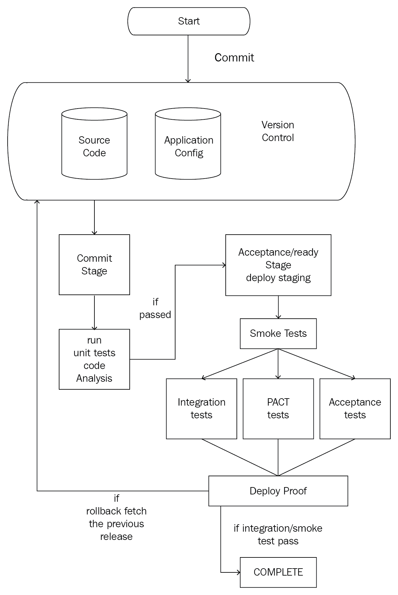
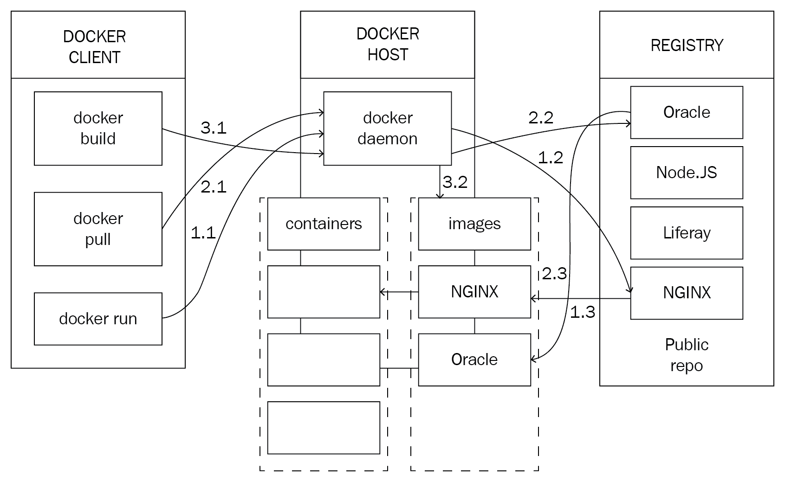
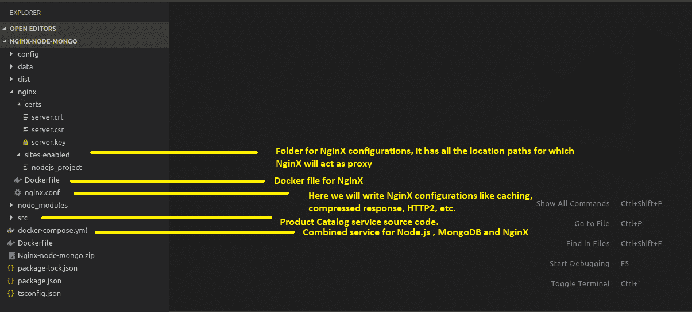
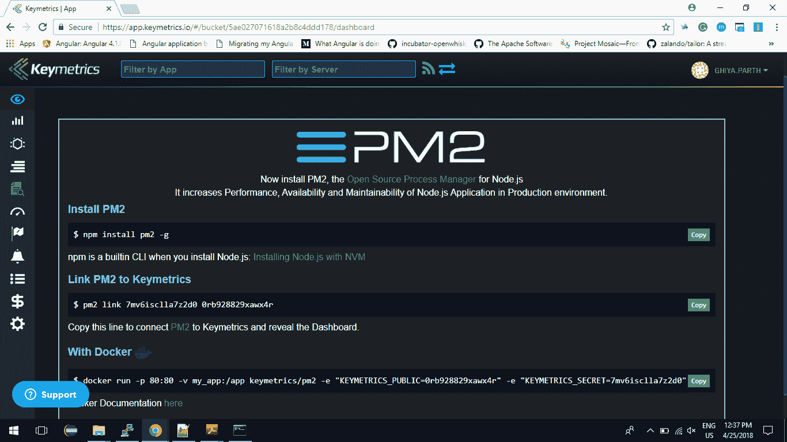
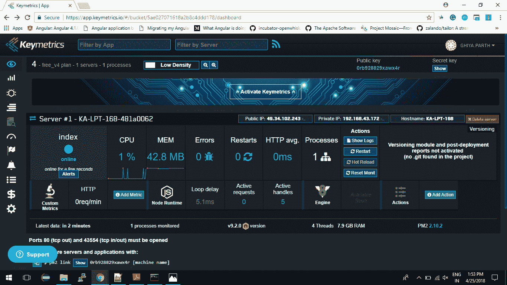
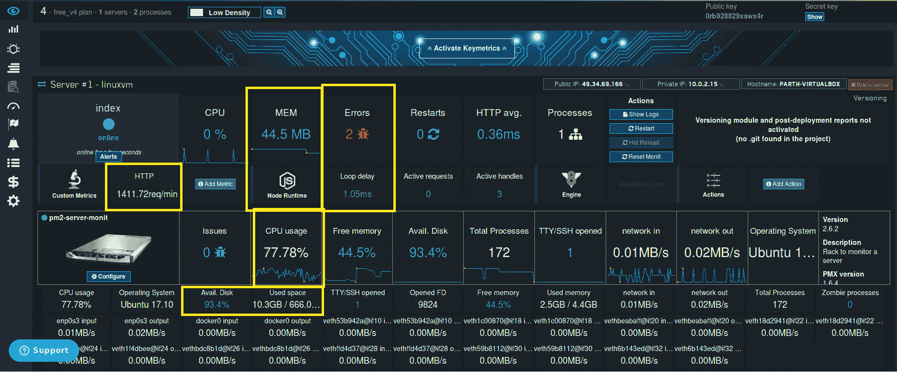
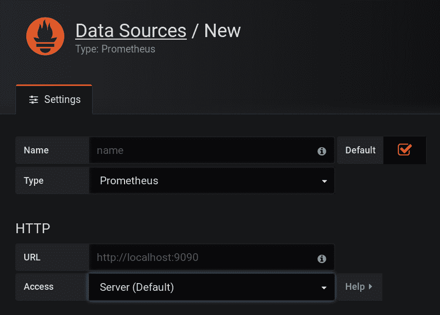

Deployment, Logging, and Monitoring <link rel="stylesheet" href="css/style.css" type="text/css"> 

# 部署、日志记录和监视

"Tactics without strategy is the noise before defeat." - Sun Tzu

在投入生产并开始盈利之前，我们需要一个非常强大的部署策略。 缺乏计划总是会导致无法预料的紧急情况，从而导致严重的失败。 这就是我们在本章要做的。 现在我们已经完成了我们的开发工作，并通过测试和提供文档添加了双重检查，现在我们将瞄准我们的*Go Live 阶段*。 我们将看到部署中涉及的所有方面，包括当前的趋势术语—持续集成、持续交付和新的无服务器架构。 然后，我们将看到对日志的需求以及如何创建一个自定义的集中式日志解决方案。 进一步，我们将研究**Zipkin**—一种用于分布式系统日志记录的新兴工具。 最后，我们来看看监控挑战。 我们将着眼于两个著名的工具——**Keymetrics**和**Prometheus**。

本章涵盖以下主题:

*   部署 101 年
*   构建管道
*   介绍码头工人
*   Serverless 架构
*   记录 101
*   使用 ELK 定制日志
*   使用 Zipkin 进行分布式跟踪
*   监测 101
*   使用 Keymetrics、Prometheus 和 Grafana 等工具进行监控

# 部署

在生产环境中发布一个应用程序，并且有足够的信心保证它不会崩溃或损失组织的资金，这是开发人员的梦想。 即使是一个手工错误，比如没有加载正确的配置文件，也会导致严重的问题。 在本节中，我们将了解如何自动化大多数事情，并了解持续集成和持续交付(CI 和 CD)。 让我们从理解整个构建管道开始。

# 决定发布计划

虽然有自信是好事，但过分自信就不好了。 在部署到生产环境时，我们应该随时准备回滚新的更改，以防出现重大的关键问题。 需要一个完整的构建管道，因为它可以帮助我们规划整个过程。 我们将在进行生产构建时采用这种技术:



Build pipeline

整个构建过程从**Start**块开始。 当任何提交发生时，WebHooks(由 Bitbucket 和 GitHub 提供)触发构建管道。 Bitbucket 也有构建管道工具([https://bitbucket.org/product/features/pipelines](https://bitbucket.org/product/features/pipelines))。 这个构建管道可以在主分支中出现合并时触发。 一旦进入构建阶段，我们首先运行一些代码覆盖率分析和单元测试。 如果测试结果不符合要求的 sla，我们将中止该进程。 如果它满足整体 sla，那么我们将从中创建一个映像，并在登台服务器上构建它(如果没有登台服务器，我们可以直接转移到生产服务器)。 一旦准备好 docker 映像，就可以根据部署的位置设置环境。 然后，运行一些健全检查以确保我们没有部署损坏的代码。 要运行它们，管道中的级别是一个极好的想法，可以将出错的机会降到最低。 现在，一旦服务满足 sla，现在就可以将其部署到实际环境中。 我通常遵循的一个良好实践是，生产服务器不应该有版本控制。 根据我们使用的工具(OpenShift、Kubernetes、Docker 等等)，我们传递这些工具来启动映像。 然后，我们需要开始集成测试，其中包括检查容器是否健康，以及检查服务注册中心和 API Gateway 是否注册了服务。 为了确保没有中断，我们需要一个滚动更新，即每次部署一个新实例并删除一个旧实例。 我们的代码库应该能够处理旧的/遗留的代码，并且它应该在被所有依赖者接受后被弃用。 在完成集成测试之后，下一个任务是运行契约测试和验收测试。 一旦这些测试成功运行，我们就可以从准备阶段转移到生产环境或进入活动环境。 如果管道失败，则将前一个成功的源代码作为回滚策略的一部分部署回去。

整个过程应该是自动化的，因为我们更容易出错。 我们将研究 CI/CD 以及它们如何使我们的生活变得更简单。 CI/CD 承诺，我们可以在功能完成时部署它，并且仍然非常有信心它不会破坏产品。 我们看到的管道有大量的任务和阶段与之相关。 让我们来看看以下几个阶段:

*   **开发阶段/特性分支**:我们从创建特性分支开始开发。 我们保持主分支不变，只在主分支中保留经过验证和测试的代码。 这样，我们的产品就是主分支的复制品，我们可以在开发分支中做任何数量的实验。 如果有什么失败了，我们总是可以恢复到主分支，并丢弃或删除一个分支。
*   **测试阶段/QA 分支**:一旦我们的开发完成，我们将代码推送到 QA 分支。 一旦我们的开发完成，我们将代码推到 QA 分支，以便它可以进行测试。 现代开发方法超越了一步，我们采用了 TDD/BDD。 每当我们将代码推给 QA 时，我们都会运行测试用例以获得准确的代码覆盖率。 我们运行一些 lint 工具，这给了我们一个关于代码质量的概念。 在这之后，如果这些测试成功了，那么我们只需要将代码推送到 QA 分支。
*   **发布阶段/主分支**:一旦我们的 QA 完成了，我们的测试用例覆盖率通过了，我们将代码推送到主分支，希望将其推送到产品中。 我们再次运行我们的测试用例和代码覆盖工具，并检查是否有什么东西被破坏了。 一旦成功，我们将代码推送到生产服务器，并运行一些冒烟测试和契约测试。
*   **发布/标记:一旦代码被推入生产并成功运行，我们就为发布创建一个分支/标记。 这有助于我们确保在不久的将来能够回到这一点。**

在每个阶段手动执行这样的过程是一个很麻烦的过程。 我们需要自动化，因为人类很容易出错。 我们需要一种持续交付机制，在这种机制中，代码中的单个提交可以确保所部署的代码对我的生态系统来说是安全的。 在下一节中，我们将讨论持续集成和持续交付:

*   **持续集成**:它是将来自其他分支的新特性集成或合并到主分支的实践，并确保新的更改不会破坏现有的特性。 一个常见的 CI 工作流是，在编写代码的同时，还要编写测试用例。 然后创建一个表示更改的 pull 请求。 构建可以运行测试、检查代码覆盖率并决定是否可以接受拉请求的软件。 一旦**Pull Request**(**PR**)被合并，它将进入 CD 部分——即连续交付。
*   **持续交付:**我们的目标是在任何时间点无缝地交付一小段、可测试的、易于部署的代码。 CD 是高度自动化的，在一些工具中，它是高度可配置的。 这种自动化有助于快速地将组件、特性和修复程序分发给客户，并让任何人对生产环境中存在的内容和数量有一个确切的概念。

随着 DevOps 的不断改进和容器的兴起，新的自动化工具也在兴起，以帮助 CI/CD 管道。 这些工具与日常工具集成，如代码仓库管理(GitHub 可以与 Travis 和 CircleCI 一起使用，Bitbucket 可以与 Bitbucket 管道一起使用)，以跟踪系统，如 slack 和 Jira。 此外，一种新的趋势正在出现，这就是无服务器部署，在这种情况下，开发人员只需要担心他们的代码和部署，其他问题将由供应商来解决(例如，Amazon 有 AWS，而谷歌有 GCP 功能)。 在下一节中，我们将研究各种可用的部署选项。

# 部署选项

在本节中，我们将介绍一些著名的可用部署选项，并分析它们的优缺点。 我们将从容器的世界开始，并看看为什么这些天所有的东西都是停靠的。 让我们开始吧。

在我们开始之前，让我们先熟悉一下 DevOps 101，以便理解我们将使用的所有术语。

# DevOps 101

在本节中，我们将研究一些基本的 DevOps 基础。 我们将了解什么是容器，它有什么优势。 我们将看到容器和 VM 机器之间的区别。

# 容器

随着云计算的发展，世界正在见证容器系统的重新进入。 由于技术上的简化，容器已经被广泛采用(Docker 遵循与 GIT 相同的命令)。 容器在操作系统之上提供私有空间。 这种技术也称为系统中的虚拟化。 容器是一种易于构建、打包和分区运行的机制(软件只驻留并限制于该容器)。 容器处理它们自己的文件系统、网络信息、内建的内部进程、OS 实用程序和其他应用程序配置。 集装箱可以在里面装载多种软件。

集装箱有以下优点:

*   独立的
*   轻量级
*   容易扩展
*   容易移动
*   更低的许可证和基础设施成本
*   自动通过 DevOps
*   版本控制就像 GIT
*   可重用的
*   不可变的

# 容器与虚拟机(vm)

从鸟瞰的角度看，两者似乎都陈述了同样的事情，但容器和虚拟机却有很大的不同。 VM 也提供硬件虚拟化，如 cpu 数量、内存存储等。 VM 和 OS 是一个独立的单元。 虚拟机复制完整的操作系统，因此它们是重量级的。 VM 为运行在其上的进程提供了完全的隔离，但它限制了可以启动的虚拟机的数量，因为它是重量级的，并且会消耗资源，并且需要花费精力来维护它。 与 vm 不同，容器共享内核和主机系统，因此容器的资源利用率非常低。 容器是轻量级的，因为它们在主机操作系统之上提供了一个隔离层。 由于容器映像可以公开使用(有一个巨大的 Docker 库)，开发人员的生活变得容易得多。 容器的轻量级特性有助于自动化构建、在任何地方发布工件、根据需要下载和复制，等等。

# 码头工人和集装箱世界

虚拟化是目前 DevOps 中最大的趋势之一。 虚拟化使我们能够跨各种软件实例共享硬件。 就像微服务支持隔离一样，Docker 通过创建容器来提供资源隔离。 为微服务使用 Docker 容器可以将整个服务及其依赖项打包在一个容器中，并在任何服务器上运行。 哇! 在每个环境中安装软件的时代已经过去了。 Docker 是一个开源项目，用于将任何应用程序作为轻量级容器打包、发布和运行，而无需在新环境中重新安装所有内容。 Docker 容器是平台和硬件无关的，因此可以很容易地在任何地方运行容器，从笔记本电脑到任何服务器，而无需使用任何特定的语言框架或打包软件。 集装箱化现在被称为 dockerization。 从[第 2 章](03.html)、*开始，我们已经进行了对接。 所以让我们来理解整个过程和涉及的概念。*

我们已经在[第 2 章](03.html)、*为旅程做好准备*中看到了 Docker 的安装。 现在，让我们深入了解 Docker。

# 码头工人组件

Docker 有以下三个组件:

*   **Docker 客户端**:Docker 客户端是一个命令行程序，通过 socket 通信或 REST api 通信与驻留在 Docker 主机中的 Docker 守护进程进行通信。 带有 CLI 选项的 Docker 客户端用于构建、打包、发布和运行任何 Docker 容器。
*   **Docker 主机**:Docker 主机基本上是一个服务端组件，包括一个 Docker 守护进程、容器和镜像:
    *   Docker 守护进程是一个运行在主机上的服务器端组件，包含构建、打包、运行和分发 Docker 容器的脚本。 Docker 守护进程为 Docker 客户端公开 RESTful api，作为与自己交互的一种方式。
    *   除了 Docker 守护进程，Docker 主机还包括运行在该特定容器中的容器和映像。 无论容器是启动和运行的，Docker 主机都包含这些容器的列表，以及启动、停止、重启、日志文件等选项。 Docker 映像是那些从公共存储库中构建或提取的映像。

*   **Docker 注册表**:注册表是一个公开可用的存储库，就像 GitHub。 开发人员可以将他们的容器映像推到那里，使其成为一个通用库，或者在团队中使用它作为版本控制。

在下面的图中，我们可以看到所有三个 Docker 组件之间的总体流程:



Docker components and flow

下面是一个典型的 Docker 流程:

1.  每当我们运行诸如`sudo docker run ubuntu /bin/echo 'hello carbon five!'`之类的命令时，该命令就会转到一个守护进程。 它尝试搜索是否有任何名称为 Ubuntu 的现有图像。 如果没有，则转到注册表并在那里找到映像。 它将从那里下载主机内的容器映像，创建一个容器，并运行`echo`命令。 它将 Ubuntu 映像添加到 docker 主机中可用的映像列表中。
2.  我们的大多数映像都位于 Docker Hub 存储库中的可用映像([https://hub.docker.com/](https://hub.docker.com/))之上。 除非非常需要，否则我们不会重复发明轮子。 Docker pull 向 Docker 主机发出一个命令，从存储库中取出一个特定的映像，并使它在 Docker 主机的映像列表中可用。

3.  命令从 Dockerfile 和可用上下文构建 Docker 映像。 构建的上下文是位于 Dockerfile 中提到的指定 PATH 或 URL 中的一组文件。 构建过程可以引用上下文中的任何文件。 例如，在我们的例子中，我们下载了 Node.js，然后基于`package.json`执行`npm install`。 Docker build 创建一个映像，并使它在 Docker 主机内的映像列表中可用。

# 码头工人的概念

现在我们已经了解了 Docker 的核心进程，让我们继续了解 Docker 中涉及的各种概念。 这些概念将使我们轻松地编写 Docker 文件并创建我们自己的微服务容器映像:

*   **Docker 映像**:一个 Docker 映像只是组成 Docker 业务能力的组件的快照。 它是操作系统库、应用程序及其依赖项的只读副本。 一旦创建一个映像，它将运行在任何 Docker 平台上，没有任何问题。 例如，我们的微服务的 Docker 映像将包含实现该微服务实现的业务能力所需的所有组件。 在我们的例子中，web 服务器(NGINX)、Node.js、PM2 和数据库(NoSQL 或 SQL)都是在运行时配置的。 所以，当有人想使用微服务或部署它时，他们只需要下载图像并运行它。 该映像将包含从 Linux 内核(`bootfs`)到操作系统(Ubuntu/CentOS)再到应用程序环境需求的所有层。
*   **Docker 容器**:一个 Docker 容器只是一个正在运行的 Docker 映像的实例。 你下载(或构建)或拉出一个 Docker 映像。 它运行在 Docker 容器中。 容器使用运行映像的主机操作系统的内核。 因此，它们实际上与运行在同一主机上的其他容器共享主机内核(如上图所示)。 Docker 运行时确保容器有自己独立的进程环境以及文件系统和网络配置。
*   **Docker Registry**:Docker Registry 就像 GitHub 一样，是一个发布和下载 Docker 图像的中心，[https://hub.docker.com](https://hub.docker.com)是 Docker 提供的集中可用的公共注册表。 就像 GitHub(一个提供版本控制的存储库)一样，Docker 也提供了一个公共和私有的映像存储库，它是根据需要而定的(我们可以让我们的存储库是私有的)。 我们可以创建一个映像并将其注册到 Docker Hub。 因此，下次当我们希望在任何其他机器上使用相同的映像时，我们只需引用存储库来提取映像。
*   **Dockerfile**:Dockerfile 是一个构建文件或脚本文件，包含如何构建 Docker 映像的书面指令。 可以记录多个步骤，从获得一些公共形象开始，到在其上构建应用程序。 我们已经写过 Docker 文件(回想一下[第二章`.Dockerfile`，](03.html)，*为旅程做好准备*)。
*   **Docker Compose**:Compose 是 Docker 提供的在一个容器内运行多容器 Docker 应用的工具。 以我们的产品目录微服务为例，我们需要一个 MongoDB 容器和一个 Node.js 容器。 Docker compose 只是一种工具。 Docker compose 是一个分三步的过程，首先在 Docker 文件中定义应用的环境，然后通过`docker-compose.yml`让其他服务一起在独立的环境中运行，最后使用`docker-compose up`运行应用。

# 码头工人命令参考

现在我们已经了解了 Docker 的概念，让我们来看看 Docker 命令，这样我们就可以把它们添加到我们的操场上:

| **命令** | **What does it do ?**What does it do ?**** |
| `docker images` | 查看我机器上可用的所有 Docker 图像。 |
| `docker run <options> <docker_image_name>:<version> <operation>` | 将 Docker 映像启动到容器中。 |
| `docker ps` | 检查 Docker 容器是否正在运行。 |
| `docker exec -ti <container-id> bash` | 通过实际运行 bash 提示符来查看 Docker 映像内部的内容。 能够使用`ls`、`ps`等命令。 |
| `docker exec <container_id> ifconfig` | 获取 Docker 容器的 IP 地址。 |
| `docker build` | 基于`.DockerFile`中的指令构建映像。 |
| `docker kill <containername> && docker rm <containername>` | 杀死一个正在运行的 Docker 容器。 |
| `docker rmi <imagename>` | 从本地存储库中删除一个 Docker 映像。 |
| `docker ps -q &#124; x args docker kill &#124; xargs docker rm` | 杀死所有正在运行的 Docker 容器。 |

# 使用 NGINX, Node.js 和 MongoDB 设置 Docker

现在我们知道基本的命令,让我们写 Dockerfile 和码头工人组成文件产品目录服务 NGINX 前处理负载平衡,以同样的方式我们写`docker compose up`MongoDB 和 node . js[第四章](05.html),*开始你 Microservice 旅程【5】。 你可以跟随`chapter 9/Nginx-node-mongo`中的例子，它只是一个产品目录微服务的副本，在上面添加了 NGINX，所以服务只能通过 NGINX 访问。 创建如下结构:*



NGINX-mongodb-node.js file structure

现在让我们写下一些规则:

1.  我们将为 Node.js 创建 Dockerfile。 它和我们以前用的是一样的。
2.  我们将为 NGINX 编写 Dockerfile。 我们告诉 NGINX 为在`sites-enabled`文件夹中定义的应用启用规则:

```js
FROM tutum/nginx
RUN rm /etc/nginx/sites-enabled/default
COPY nginx.conf /etc/nginx.conf
RUN mkdir /etc/nginx/ssl
COPY certs/server.key /etc/nginx/ssl/server.key
COPY certs/server.crt /etc/nginx/ssl/server.crt
ADD sites-enabled/ /etc/nginx/sites-enabled
```

3.  接下来，我们在 NGINX 内部定义一些加固规则，以照顾我们的负载平衡、缓存和其他需求。 我们将在两个地方写规则——`nodejs_project`和`nginx.conf`。 在 T2 中，我们定义了所有的代理级别设置和 NIGINX 服务器设置。 在`nodejs_project`中编写如下代码:

```js
server {
listen 80;
server_name product-catalog.org;
access_log /var/log/nginx/nodejs_project.log;
charset utf-8;
location / {
proxy_pass http://chapter9-app:8081;
proxy_set_header Host $host;
proxy_set_header X-Real-IP $remote_addr;
proxy_set_header X-Forwarded-For $proxy_add_x_forwarded_for;
}}
```

4.  让我们来看看一些为产品级配置 NGINX(加固我们的 web 服务器)的规则示例。 我们将在`nginx.conf`中编写这些规则。 为了压缩所有进入 NGINX 服务器的输入和输出请求，我们使用以下代码:

```js
http {...
gzip on;
gzip_comp_level 6;
gzip_vary on;
gzip_min_length 1000;
gzip_proxied any;
gzip_types text/plain text/html text/css application/json application/x-javascript text/xml application/xml application/xml+rss text/javascript;
gzip_buffers 16 8k;
...
}
```

上述参数只是使用这些属性配置任何入站或出站 HTTP 请求。 例如，它将 gzip 响应，gzip 所有类型的文件，等等。

5.  无论服务器之间交换的资源是什么，我们都可以缓存这些资源，所以每次都不需要再次查询。 这是缓存在 web 服务器层:

```js
http {
proxy_cache_path /var/cache/nginx levels=1:2 keys_zone=one:8m max_size=3000m inactive=600m;
proxy_temp_path /var/tmp;
}
```

6.  最后，我们创建我们的`docker compose`文件来启动 MongoDB, Node.js 和 NGINX 来定义。 从源文件复制`docker-compose.yml`文件以执行构建。
7.  打开终端，点击`docker-compose up --build`，看看我们的部署现场行动。

所有内部端口都将被阻塞。 唯一可访问的端口是默认端口`80`。 点击`localhost/products/products/products-listing`URL 查看我们的部署。 再次点击 URL，它将从缓存加载响应。 见下图:


Cache response

现在我们已经启动并运行了一个包含 web 层的容器映像，在下一节中，我们将看看构建管道以及 webhook 如何在其中扮演重要角色。

# 构建管道中的 WebHooks

WebHooks 是一种可以在项目中绑定事件的工具。 假设合并了一个 pull 请求，并且我们想立即触发一个 build-WebHooks 完成了我们的工作。 WebHook 本质上是一个 HTTP 回调。 你可以通过进入设置并添加 WebHook 来在你的存储库中配置 WebHook。 典型的 WebHook 屏幕如下所示:


WebHook

正如在前面的截图中看到的，它有各种各样的事件触发器，比如 Push、Fork、Updated、Pull requests、Issues 等等。 我们可以在这个 WebHook 的基础上设置警报和触发各种动作。

在下一节中，我们将看到微服务开发中出现的一种新趋势，即无服务器部署。

Please check extraced source/pipeline to see end to end pipeline in action.

# Serverless 架构

最近出现的新趋势是无服务器拓扑。 它实际上并不意味着无服务器或没有服务器。 服务器从用户中抽象出来，用户只关注开发方面，而把其他事情留给供应商。 AWS Lambda 是一个无服务器架构的例子，在这个架构中，您只需将微服务打包为一个 ZIP 文件并将其上传到 AWS Lambda。 Amazon 负责其他事务，包括生成足够的实例来处理批量服务请求。

Lambda 函数是无状态函数。 它通过调用 AWS 服务来处理请求。 我们只是根据点击请求的数量和服务这些请求所花费的时间来计费。 类似地，谷歌有云函数。 然而，这种模式有以下优点和缺点:

*   **优点:**
    *   我们只关注代码，不需要担心底层基础设施的细节。 AWS 有一个内置网关可与 Lambda 函数一起使用。
    *   非常弹性的架构。 它会自动处理加载请求。
    *   您需要为每个请求付费，而不是将整个 VM 出租并按月付费。
*   **缺点:**
    *   只有少数支持的语言。 没有多语言环境的自由。
    *   这些总是无状态的应用程序。 AWS Lambda 不能像 RabbitMQ 那样用于队列处理。
    *   如果应用程序不能快速启动，那么无服务器架构就不适合我们。

这基本上是关于部署的。 在下一节中，我们将讨论日志记录以及如何创建定制的集中日志记录解决方案。

# 日志记录

完全作为单个请求分布的微服务可能会触发对其他微服务的多个请求，并且跟踪失败或故障或跨所有服务的整体请求流的根本原因将成为问题。

在本节中，我们将学习如何通过正确的记录方式来跟踪不同的 Node.js 微服务。 回想一下日志的概念和日志的类型，我们在[第 4 章](05.html)、*开始你的微服务旅程*中见过。 我们将朝这个方向前进，并创建一个集中的日志存储。 让我们从理解分布式环境中的日志需求以及处理分布式日志所遵循的一些最佳实践开始。

# 日志的最佳实践

一旦进入后期开发阶段，我们假设出现了任何问题。 如果我们不处理单个服务器，我们就会完全迷失。 我们在处理多个服务器，整个系统在不断移动。 哇! 我们需要一个完整的证明策略因为我们不能到处乱逛，检查每个服务的日志。 我们完全不知道哪个微服务在哪个主机上运行，哪个微服务提供请求。 要跨所有容器打开日志文件，对日志进行扫描，然后将它们与所有请求关联起来，这确实是一个很麻烦的过程。 如果我们的环境启用了自动可伸缩性，那么调试问题就会变得极其复杂，因为我们实际上必须找到为请求服务的微服务实例。

这里有一些登录微服务的黄金法则，可以让你的生活更轻松。

# 集中和外部化日志存储

微服务分布在整个生态系统中，以简化开发并实现更快的开发。 由于微服务运行在多个主机上，在每个容器或服务器级别设置日志是不明智的。 相反，我们应该将所有生成的日志发送到外部和集中的地方，从那里我们可以很容易地从一个单一的地方获得日志信息。 这可能是任何其他物理系统或任何高可用的存储选项。 以下是一些著名的选择:

*   **ELK 或 Elastic stack**: ELK 栈([https://www.elastic.co/elk-stack](https://www.elastic.co/elk-stack))包括 Elasticsearch(一个分布式的全文可扩展的搜索数据库，允许存储大量的数据集)、Logstash(它从多种类型的源收集日志事件，并根据需要进行转换)、 Kibana(可视化日志事件或存储在 Elasticsearch 中的任何内容)。 使用 ELK 堆栈，我们可以在 Elasticsearch 中集中日志，由**Kibana**和**Logstash**的实用程序提供支持。

*   **CloudWatch(仅当您的环境在 AWS 中)**:Amazon CloudWatch([https://aws.amazon.com/cloudwatch/](https://aws.amazon.com/cloudwatch/))是一个监控服务，用于在您的 AWS 环境中运行的资源和应用程序。 我们可以利用 Amazon CloudWatch 来收集和跟踪指标，监控日志文件，设置一些关键警报，并自动对 AWS 资源部署中的变化做出反应。 CloudWatch 能够监控 AWS 资源，包括 Amazon EC2 实例、DynamoDB 表、RDS DB 实例或应用程序生成的任何自定义指标。 它监视所有应用程序的日志文件。 它提供系统对资源利用的可见性，并监视性能和运行状况。

# 日志中的结构化数据

日志信息不仅仅是原始信息，还应该包括一些内容，比如时间戳; 日志级别类型; 请求所花费的时间; 元数据，如设备类型、微服务名称、服务请求名称、实例名称、文件名、行号; 等等，从中我们可以在日志中获得正确的可用数据来调试任何问题。

# 通过关联 id 的标识符

我们在发出第一个服务请求时生成唯一标识符或相关 ID。 生成的惟一 ID 向下传递给其他调用微服务。 这样，我们就可以使用来自响应的唯一生成的 ID 来获取为任何服务请求指定的日志。 为此，我们有一个所谓的关联标识符或唯一生成的 UUID，将其传递给事务所经过的所有服务。 为了生成唯一的 ID, NPM 使用模块 UUID([https://www.npmjs.com/package/uuid](https://www.npmjs.com/package/uuid))。

# 日志级别和日志机制

基于应用程序的不同方面，我们需要在代码中使用不同的日志级别，并在代码中使用足够的日志语句。 我们将使用`winston`([https://www.npmjs.com/package/winston](https://www.npmjs.com/package/winston))，它具有动态更改日志级别的能力。 此外，我们将使用异步日志追加器，以便我们的线程不会被日志请求阻塞。 我们将利用**Async 钩子**([https://nodejs.org/api/async_hooks.html](https://nodejs.org/api/async_hooks.html))，这将帮助我们在流程中跟踪资源的生命周期。 Async Hook 允许我们通过注册任何生命周期事件的回调来调用任何生命周期事件。 在资源初始化时，我们获得创建资源的唯一标识符 ID(`asyncId`)和父标识符 ID(`triggerAsyncId`)。

# 可搜索的日志

在一个地方收集的日志文件应该是可搜索的。 例如，如果我们获得任何 UUID，那么日志记录解决方案应该能够基于该 UUID 进行搜索，以找到请求流。 现在，让我们来看看我们将要实现的自定义日志记录解决方案，并了解它将如何处理我们的日志记录问题:


Log custom flow

该图解释了核心组件及其定义的用途。 在进入实现部分之前，让我们看看所有的组件及其用途:

*   **日志仪表板**:它是我们定制的中央日志记录解决方案的 UI 前端。 我们将在 Elasticsearch 数据存储之上使用 Kibana([https://www.elastic.co/products/kibana](https://www.elastic.co/products/kibana))，因为它提供了许多开箱即用的特性。 我们将能够使用我们所记录的任何参数搜索索引日志。
*   **日志存储**:为了方便实时记录和存储大量的日志，我们将使用 Elasticsearch 作为我们定制的日志解决方案的数据存储。 Elasticsearch 允许任何客户机根据基于文本的索引查询任何参数。 另一个著名的选择是使用 Hadoop 的`MapReduce`程序来离线处理日志。
*   **日志流处理器**:日志流处理器通过分析实时日志事件来进行快速决策。 例如，如果任何服务不断抛出 404 错误，那么在能够对特定的事件流作出反应的情况下，流处理器就会派上用场。 在我们的例子中，流处理器从队列中获取数据，并在将其发送给 Elasticsearch 之前动态地处理它。
*   **日志发送方**:日志发送方通常收集来自不同端点和源的日志消息。 日志发送方将这些消息发送到另一组端点，或将它们写入数据存储，或将它们推到流处理端点，以便进行进一步的实时处理。 我们将使用像 RabbitMQ 和 ActiveMQ 这样的工具来处理日志流。 现在我们已经看到了自定义实现的体系结构，在下一节中，我们将看到如何在当前的应用程序中实现它。 让我们开始吧。

# 集中式自定义日志解决方案实现

在本节中，我们将查看自定义日志体系结构的实际实现，这是我们在前一节中看到的。 那么，让我们开始我们的旅程。 作为一套先决条件，我们需要安装以下软件:

*   Elasticsearch 6.2.4
*   Logstash 6.2.4
*   Kibana 6.2.4
*   Java 8
*   RabbitMQ 3.7.3

# 设置环境

在前一节中，我们讨论了相当多的软件。 我们需要确保每个软件都正确安装并在各自的端口上运行。 此外，我们需要确保 Kibana 知道我们的 Elasticsearch 主机，Logstash 知道我们的 Kibana 和 Elasticsearch 主机。 让我们开始:

1.  从:[https://www.elastic.co/downloads/elasticsearch](https://www.elastic.co/downloads/elasticsearch)下载 Elasticsearch 并将其提取到您选择的位置。 提取完成后，通过`eitherelasticsearch.bat`或`./bin/elasticsearch`启动服务器。 点击`http://localhost:9200/`，你应该能够看到 JSON 标语:你知道，for Search 以及 Elasticsearch 版本。
2.  下一位是 Kibana。 从:[https://www.elastic.co/downloads/kibana](https://www.elastic.co/downloads/kibana)下载 Kibana 并将其提取到所选择的位置。 然后打开`<kibana_home>/config/kibana.yml`，添加`elasticsearch.url: "http://localhost:9200"`行。 这告诉 Kibana 关于 Elasticsearch。 然后从`bin`文件夹启动 Kibana，然后导航到`http://localhost:5601`。 你应该看看 Kibana 的仪表盘。
3.  从[https://www.elastic.co/downloads/logstash](https://www.elastic.co/downloads/logstash)下载日志库。 把它提取到您选择的位置。 我们将通过编写一个简单的脚本来检查 Logstash 的安装。 创建一个文件`logstash-simple.conf`，并编写以下代码。 您可以在`Chapter 9/logstash-simple.conf`中找到这段代码:

```js
input { stdin { } }
output { elasticsearch { hosts => ["localhost:9200"] }
stdout { codec => rubydebug }}
```

现在点击`logstash -f logstash-simple.conf`。

您应该能够看到打印出来的 Elasticsearch 信息。 这确保我们的 Logstash 安装是完美的运行。

4.  接下来，我们需要安装 RabbitMQ。 RabbitMQ 是用 Erlang 编写的，需要安装 Erlang。 安装 Erlang 并确保设置了环境变量`ERLANG_HOME`。 然后安装 RabbitMQ。 安装完成后，按如下方式启动`rabbitmq`服务:

```js
rabbitmq-service.bat stop
rabbitmq-service.bat install
rabbitmq-service.bat start
```

5.  现在点击 URL`http://localhost:15672`。 你应该能够使用 guest/guest 凭证登录，这是默认的，并且能够看到 RabbitMQ 的仪表盘。

如果你无法看到服务器，你可能需要启用插件，如下所示:

`rabbitmq-plugins.bat enable rabbitmq_management rabbitmq_web_mqtt rabbitmq_amqp1_0`

我们已经成功安装了 RabbitMQ、Logstash、Elasticsearch 和 Kibana。 现在我们可以继续我们的实现了。

Please check extracted source `/customlogging` to see our solution in action. The solution makes use or previous architecture as explained.

# Node.js 中的分布式跟踪

分布式跟踪类似于跟踪一个特定的服务请求，该服务请求跨越服务该请求所涉及的所有服务。 这些服务构造一个图形，就像它们以客户机为根形成树一样，客户机启动初始请求。 Zipkin 提供了一个工具层来为服务请求生成 ID，基于此，我们可以使用该 ID 跟踪来自所有应用程序的数据。 在本节中，我们将看看如何使用 Zipkin。 你可以在`Chapter 9/Zipkin`找到完整的来源:

1.  自[第 4 章](04.html)，*开始你的微服务旅程*，启动我们的第一个微服务或任何单个微服务项目。 我们将向它添加`zipkin`依赖项:

```js
npm install zipkin zipkin-context-cls zipkin-instrumentation-express zipkin-instrumentation-fetch zipkin-transport-http node-fetch --save
npm install @types/zipkin-context-cls --save-dev
```

2.  我们现在需要一个 Zipkin 服务器。 我们将它配置为使用 Zipkin 服务器及其默认值，并只安装它的 jar。 下载`jar`[https:](https://search.maven.org/remote_content?g=io.zipkin.java&a=zipkin-server&v=LATEST&c=exec)[/ / search.maven.org/remote_content ? g = io.zipkin.java&= zipkin-server 最新&【显示】v = c =执行](https://search.maven.org/remote_content?g=io.zipkin.java&a=zipkin-server&v=LATEST&c=exec)或者你可以找到它在提取的源`chapter 9/zipkin`下的`server`文件夹。 下载完成后，按如下步骤打开 Zipkin 服务器:

```js
java -jar zipkin-server-2.7.1-exec.jar
```

下面的截图显示了一个 Zipkin 服务器:


log Zipkin

如截图所示，Zipkin 服务器有很多选项，包括提供一个收集器来接收跟踪信息、存储和 UI 选项来检查它。

3.  现在，我们将配置多个 Express 服务器，以便观察 Zipkin 如何处理整个事情。 我们将首先在一个微服务上建立 Zipkin，然后再建立多个微服务。 我们在前一章中的代码在 MongoDB 数据库中添加了任何产品信息。 我们将在这里配置 Zipkin。 我们需要告诉 Zipkin 将跟踪数据发送到哪里(这是非常明显的! 这将是我们运行在`9411`上的 Zipkin 服务器)以及如何发送跟踪数据(这就是问题所在——Zipkin 有三个支持选项 HTTP、Kafka 和 Fluentd。 我们将使用 HTTP)。 我们向 Zipkin 服务器发送一个 POST 请求。
4.  我们需要一些导入来配置我们的 Zipkin 服务器。 打开`Express.ts`并添加以下代码行:

```js
import {Tracer} from 'zipkin';
import {BatchRecorder} from 'zipkin';
import {HttpLogger} from 'zipkin-transport-http';
const CLSContext = require('zipkin-context-cls');
```

*   `Tracer`用于提供诸如在何处以及如何发送跟踪数据等信息。 它处理生成`traceIds`并告诉传输层何时记录什么。
*   `BatchRecorder`格式跟踪数据要发送到 Zipkin 收集器。
*   `HTTPLogger`是 HTTP 传输层。 它知道如何通过 HTTP 发布 Zipkin 数据。
*   对象为延续本地存储。 延续传递是一种模式，在这种模式中，函数调用一个函数链中的下一个函数，并提供所需的数据。 这方面的一个例子是 Node.js 自定义中间件层。

5.  我们现在正在把所有碎片拼在一起。 添加以下代码行:

```js
const ctxImpl=new CLSContext();
const logRecorder=new BatchRecorder({
logger:new HttpLogger({
endpoint:`http://loclhost:9411/api/v1/spans` }) })
const tracer=new Tracer({ctxImpl:ctxImpl,recorder:logRecorder})
```

这将设置 Zipkin 的基本要素以及一个将生成 64 位跟踪 ID 的跟踪程序。 现在我们需要仪器我们的 Express 服务器。

6.  现在，我们将告诉我们的`express`应用程序在其中间件层中使用`ZipkinMiddleware`:

```js
import {expressMiddleware as zipkinMiddleware} from 'zipkin-instrumentation-express';
...
this.app.use(zipkinMiddleware({tracer,serviceName:'products-service'}))
```

我们案例中的服务名称`'products-service'`实际上将出现在跟踪数据中。

7.  让我们点击我们的服务来看看实际的结果。 运行程序，向`products/add-update-product`发出 POST 请求，然后打开 Zipkin。 您将能够在“服务名称”下拉列表中看到`products-service`(我们注册到 Zipkin 服务器的服务名称)。 当你做一个搜索查询，你将能够看到如下:


Zipkin service log

这是我们处理一个微服务时的样子。 如图所示，这里还可以跟踪成功和失败的服务调用。 我们希望将注意力集中在包含不止一个微服务的服务上。

For those, who are directly running the code; please ensure that the following lines are commented out in the `ProductsController.tslet` file—`userRes= await this.zipkinFetch('http://localhost:3000/users/user-by-id/parthghiya');` and `console.log("user-res",userRes.text());`.

8.  让我们假设在我们的案例中，还有一个基于我们的业务能力的微服务，它与所有者的真实性有关。 因此，每当添加一个产品时，我们都想检查所有者是否为实际用户。

We will just create two projects with dummy logic.

9.  用一个用户创建另一个微服务项目，并用`@Get('/user-by-id/:userId')`创建一个 GET 请求，它基本上返回一个用户是否存在。 我们将从现有的项目中调用该微服务。 你可以跟随`chapter-9/user`。
10.  在现有的项目中，我们将 Zipkin 的配置移到外部文件中，以便它可以在整个项目中重用。 查看`ZipkinConfig.ts`的源代码
11.  在`ProductController.ts`中，实例化 Zipkin instrumentation fetch 的一个新对象，如下所示:

```js
import * as wrapFetch from 'zipkin-instrumentation-fetch';
this.zipkinFetch = wrapFetch(fetch, {
tracer,
serviceName: 'products-service'
});
```

12.  做一个取回请求，如下所示:

```js
let userRes= await this.zipkinFetch('http://localhost:3000/users/user-by-id/parthghiya');
```

13.  打开 Zipkin 仪表盘，你会看到以下内容:


Zipkin combined

整体报告可按以下要求浏览:


Tracing report

跟踪是一种非常有用的工具，它通过跟踪整个微服务生态系统中的任何请求来帮助诊断出现的问题。 在下一节中，我们将研究监视微服务。

# 监控

微服务是真正的分布式系统，具有大量的技术和部署拓扑。 如果没有适当的监控，运营团队可能很快就会在管理大型微服务系统时遇到麻烦。 为了增加问题的复杂性，微服务会根据负载动态地改变它们的拓扑结构。 这就需要适当的监视服务。 在本节中，我们将了解监视的需求，并查看一些监视工具。

# 监测 101

让我们从讨论监控 101 开始。 通常，监控可以定义为一些指标的集合，预定义的**服务水平协议**(**sla**)、聚合以及它们的验证和对前缀基线值的遵守。 每当出现服务级别违规时，监视工具必须生成警报并将其发送给管理员。 在本节中，我们将从用户体验的角度了解监控，以了解系统的行为，以及监控的挑战，并了解 Node.js 监控涉及的所有方面。

# 监控的挑战

与日志问题类似，监测微服务生态系统的主要挑战是存在太多的动态部分。 微服务完全是动态的，监控微服务的主要挑战如下:

*   统计信息和度量分布在多个服务、多个实例和多个机器或容器之间。
*   多语言环境增加了更多的困难。 单一的监视工具不足以满足所有必需的监视选项。
*   微服务的部署拓扑有很大的差异。 一些参数，如可伸缩性、自动配置、断路器等，可以按需改变体系结构。 这使得无法监视预配置的服务器、实例或任何其他监视参数。

在下一节中，我们将讨论监控的下一部分，即警报。 由于错误，我们不能每次都报警。 我们需要一些明确的规则。

# 什么时候该警觉，什么时候不该警觉?

没有人会对周日凌晨 3 点起床感到兴奋。 警报的一般规则是，如果没有什么东西阻止客户使用你的系统并增加你的资金，那么这种情况不值得在凌晨 3 点醒来。 在这一节中，我们将查看一些实例，并决定何时发出警告，何时不发出警告:

*   **Service goes down**:如果它是单一的，这肯定是一个巨大的打击，但作为一个优秀的微服务程序员，你已经建立了多个实例和集群。 这只会影响一个用户，该用户将再次获得服务请求的功能，并将防止失败的级联。 然而，如果许多服务出现故障，那么这绝对是值得提醒的。
*   **内存泄漏**:内存泄漏是另一件令人痛苦的事情，因为只有经过仔细的监视才能真正发现泄漏。 一个好的微服务实践建议设置环境，以便在实例超过某个内存阈值时能够停止它。 问题将在系统重启后自行修复。 但是，如果进程很快就耗尽了内存，那么就值得提醒了。
*   :慢速可用的服务不值得报警，除非它占用了巨大的资源池。 一个好的微服务实践建议使用基于事件和基于队列的实现的异步体系结构。
*   **增加 400s 和 500s**:如果 400s 和 500s 的数量呈指数增长，那么就有一些值得警惕的东西。 4xx 代码通常表示错误的服务或配置错误的核心工具。 这绝对值得注意。

在下一节中，我们将了解 Node.js 社区中可用的监控工具的实际实现。 我们将在 Keymetrics 和 Prometheus 的 Grafana 中看到一些实际例子。

# 监控工具

在本节中，我们将查看一些可用的监视工具，以及这些工具如何帮助我们解决不同的监视挑战。 当监控一个微服务时，我们最感兴趣的是硬件资源和应用程序指标:

| **硬件资源** |
| 内存利用率指标 | 应用程序消耗的内存量，例如 RAM 利用率、硬盘占用率等等。 |
| CPU 利用率指标 | 在给定的时间内，它使用的 CPU 总可用内存的百分比是多少? |
| 磁盘利用率指标 | 硬盘驱动器中的 I/O 内存，例如交换空间、可用空间、已用空间等等。 |
| **应用指标** |
| 每单位时间抛出的错误 | 从应用程序中抛出的关键错误的数量。 |
| 每单位时间内的呼叫/服务占用率 | 这个指标基本上告诉我们关于服务的流量。 |
| 响应时间 | 响应服务请求占用了多少时间。 |
| 服务重启次数 | Node.JS 是单线程的，这个应该被监控。 |

LINUX 的强大功能使查询硬件指标变得很容易。 Linux 中的`/proc`文件夹包含所有必要的信息。 基本上，它为系统中每个正在运行的进程(包括内核进程)提供了一个目录。 每个目录都包含其他有用的元数据。

当涉及到应用程序度量时，很难使用一些内置工具。 一些广泛使用的监控工具如下:

*   AppDynamics、Dynatrace 和 New Relic 是应用程序性能监控的领导者。 但这些都是在商业领域。
*   云供应商都有自己的监控工具，比如 AWS 使用 Amazon Cloudwatch，而谷歌云平台使用云监控。
*   Loggly、ELK、Splunk 和 Trace 是开源部分的首选。

现在我们来看看 Node.js 社区中的一些可用工具。

# PM2 和 keymetrics

我们已经了解了 PM2 的强大功能，以及它如何帮助我们解决各种问题，比如集群化、保持 Node.js 进程永远运行、零停机等等。 PM2 也有一个监视工具，用于维护多个应用程序指标。 PM2 将关键指标作为一个完整的工具引入，它具有内置的特性，比如仪表板、优化流程、来自关键指标的代码操作、异常报告、负载平衡器、事务跟踪、CPU 和内存监控等等。 它是一个基于 saas 的产品，具有免费层选项。 在本节中，我们将使用自由层。 让我们开始吧:

1.  我们要做的第一件事就是报名加入免费层。 创建一个帐户，一旦你登录，你将能够看到主屏幕。 一旦注册，我们将进入一个屏幕，我们配置我们的桶。

A bucket is a container on which multiple servers and multiple apps are attached. A bucket is something through which keymetrics define the context. For example, our shopping cart microservice has different services (payments, product catalog, inventory, and so on) hosted somewhere, and we could monitor all the servers in one bucket so that everything is easy to access.

2.  一旦我们创建了桶，我们将看到如下所示的屏幕。 该屏幕包含了开始使用关键参数所需的所有信息和必要的文档:



Keymetrics after bucket created

我们可以看到将 PM2 连接到 keymetrics 和 Docker 连接 keymetrics 的命令，我们将在后面使用:

```js
pm2 link <your_private_key> <your_public_key>
docker run -p 80:80 -v my_app:/app keymetrics/pm2 -e "KEYMETRICS_PUBLIC=<your_public_key>" -e "KEYMETRICS_SECRET=<your_secret_key>" 
```

作为安装的一部分，您还需要 PM2 监视器。 安装 PM2 后，运行以下命令:

```js
pm2 install pm2-server-monit
```

3.  下一步是配置 PM2 以在关键指标中推送数据。 现在，要启用服务器和 keymetrics 之间的通信，需要打开以下端口:必须打开端口 80 (TCP out)和 43554 (TCP in/out)。 PM2 将数据推送到关键指标上的端口`80`，而关键指标将数据推回到端口`43554`。 现在，我们将在产品目录微服务中配置关键指标。
4.  确保系统中安装了 PM2。 如果不是，只需执行以下命令将其安装为一个全局模块:

```js
npm install pm2 -g
```

5.  然后通过执行以下命令链接您的 PM2 与 keymetrics:

```js
pm2 link 7mv6isclla7z2d0 0rb928829xawx4r
```

6.  打开后，只需更改您的`package.json`脚本，从 PM2 而不是简单的节点进程开始。 只需在`package.json`中添加以下脚本:

```js
"start": "npm run clean && npm run build && pm2 start ./dist/index.js",
```

一旦启动作为一个 PM2 进程，你应该能够看到进程启动和仪表板 URL:


PM2 start with keymetrics

7.  转到 keymetrics，你将能够看到实时仪表板:



Keymetrics dashboard

8.  它为我们提供了有趣的指标，例如 CPU 使用率、可用内存、HTTP 平均响应、可用磁盘内存、错误、进程等等。 在下一节中，我们将研究如何利用关键度量来解决监视挑战。

# 监控应用程序异常和运行时问题的关键指标

尽管 PM2 在保持服务器正常运行方面做得很好，但我们需要监控发生的所有未知异常或潜在的内存泄漏源。 PMX 只提供了这个模块。 你可以参照`chapter 9/pmx-utilities`中的例子。 照常初始化`pmx`。 只要出现错误，就用`notify`方法通知`pmx`:

```js
pmx.notify(new Error("Unexpected Exception"));
```

这足以向 keymetrics 发送一个错误，以便向它提供关于应用程序异常的信息。 你也会收到电子邮件通知。

PMX 还监视服务的持续使用，以便检测内存泄漏(如果有的话)。 例如，检查路由`/memory-leak`。

下面显示了几个重要的关键指标:



Pmx utilities

# 添加自定义指标

最后，我们将看到如何根据业务能力和需求添加我们自己的定制指标。 大多数时候，我们经常需要一些定制，否则我们无法使用开箱即用的功能。 Keymetrics 为我们提供了探测。 键度量中的探测是一个自定义的度量，它以编程方式发送给键度量。 我们将看到四种探针，并举例说明:

*   **简单指标**:可以立即读取的值，即用于监视任何变量值。 这是一个非常基本的指标，开发者可以为推送到关键指标的数据设置一个值。
*   **计数器**:增加或减少的内容，即正在处理的下载、连接的用户、命中服务请求的次数、数据库宕机，等等。
*   **Meter**:度量事件/间隔，即每分钟对 HTTP 服务器的请求，等等。
*   直方图**:它保持统计相关值的存储尤其偏向于最后 5 分钟，以便研究它们的分布，例如监视在最后 5 分钟内对数据库执行查询的平均值，等等。**

我们将使用`pmx`([https://www.npmjs.com/package/pmx](https://www.npmjs.com/package/pmx))来查看定制度量的示例。 PMX 是 PM2 运行器的主要模块之一，它允许公开与应用程序相关的指标。 它可以揭示有用的模式，这些模式可以帮助根据需求扩展服务或有效地利用资源。

# 简单的度量标准

设置 PM2 度量值只是初始化探测并在其中设置一个值的问题。 我们可以通过以下步骤创建一个简单的指标。 您可以按照来源`chapter 9/simple_metric`:

1.  复制[第二章](02.html)、*中的`first microservice`骨架。 我们将在这里添加更改。 作为依赖项安装`pm2`和`pmx`模块:*

```js
npm install pm2 pmx -save
```

2.  在`HelloWorld.ts`中，用以下代码初始化`pmx`。 我们将添加一个简单的指标名称`'Simple Custom metric'`和变量初始化:

```js
constructor(){
this.pmxVar=pmx.init({http:true,errors:true, custom_probes:true,network:true,ports:true});
this.probe=this.pmxVar.probe();
this.metric=this.probe.metric({ name:'Simple custom metric' });}
```

我们用一些选项初始化 pmx，如下所示:

*   `http`:应该记录 HTTP 路由，并启用 PM2 来执行 HTTP 监视 HTTP 相关指标
*   `errors`:异常日志
*   `custom_probes`:JS 循环延迟和 HTTP 请求应该自动暴露为自定义指标
*   `ports`:它应该显示我们的应用程序正在收听的端口

3.  现在你可以用下面的方法在任何地方初始化这个值:

```js
this.metric.set(new Date().toISOString());
```

你现在可以在 keymetrics 仪表板中看到它，如下所示:


Simple metric

# 计数器度量

为了查看事件发生的次数等情况，这个度量非常有用。 在这个练习中，我们将看到我们的`/hello-world`被调用的次数。 你可以跟随`Chapter 9/counter-metric`中的例子:

1.  像以前一样初始化项目。 添加`pmx`依赖项。 创建一个带有路由控制器选项的`CustomMiddleware`:

```js
import { ExpressMiddlewareInterface } from "routing-controllers";
 const 
 pmx=require('pmx').init({http:true,errors:true, custom_probes:true,network:true,ports:true}); 

const pmxProbe=pmx.probe();
 const pmxCounter=pmxProbe.counter({
    name:'request counter for Hello World Controller',
    agg_type:'sum'}) 

export class CounterMiddleWare implements ExpressMiddlewareInterface {
    use(request: any, response: any, next: (err?: any) => any ):any {
        console.log("custom middle ware");
        pmxCounter.inc();
      next();   }} 
```

2.  在`HelloWorld.ts`之前添加注释并运行应用程序:

```js
@UseBefore(CounterMiddleWare)
@Controller('/hello-world')
export class HelloWorld { ... }
```

您应该能够看到如下内容:


Counter metric

# 计

这个度量允许我们记录事件实际发生的时间以及每个时间单位中事件发生的次数。 计算平均值是非常有用的，因为它可以让我们了解系统中的负载。 在这个练习中，我们将看看如何利用仪表度量:

1.  像往常一样初始化项目。 安装`pmx`和`pm2`依赖项。 它包含以下关键字:

*   **样本:**这个参数对应于我们要测量的度量的区间。 在我们的示例中，它是每分钟的调用次数，因此为`60`。
*   **时间框架:**这是我们想要保持关键度量数据的时间长度，它将被分析的整个时间框架。
    在构造函数中添加以下代码来初始化 meter metric 依赖:

```js
this.pmxVar=pmx.init({http:true,errors:true,custom_probes:true,network:true,ports:true});
  this.probe=this.pmxVar.probe();
 this.metric=this.probe.meter({
 name: 'averge per minute',
 samples:60,
 timeframe:3600 }) 
```

2.  在路由中，`@Get('/')`将初始化此标记。 这将为我们提供该路线`<server_url>/hello-world: this.metric.mark();`每分钟的平均调用次数。
3.  现在，运行这个指标。 您将能够在关键参数仪表板中看到该值。 类似地，您可以使用直方图度量。

在下一节中，我们将研究更高级的工具。

# 普罗米修斯和 Grafana

Prometheus 是一个著名的开源工具，它提供了强大的数据压缩选项和快速的数据查询，用于时间序列数据分析，用于 Node.js 监控。 Prometheus 有内置的可视化方法，但它的可配置程度不足以在仪表板中使用。 这就是 Grafana 的切入点。 在本节中，我们将看看如何使用 Prometheus 和 Grafana 来监视 Node.js 微服务。 所以让我们开始着手编码吧。 您可以遵循源代码中的`Chapter 9/prometheus-grafana`中的示例:

1.  像往常一样，从`chapter-2/first microservice`初始化一个新项目。 添加以下依赖项:

```js
npm install prom-client response-time --save
```

这些依赖关系将确保我们能够监控 Node.js 引擎，并能够收集服务的响应时间。

2.  接下来，我们将编写一些跨微服务阶段使用的中间件，例如注入 Express 和使用 after 中间件。 创建一个`MetricModule.ts`文件并添加以下代码:

```js
import * as promClient from 'prom-client';
 import * as responseTime from 'response-time';
 import { logger } from '../../common/logging'; 

export const Register=promClient.register;
 const Counter=promClient.Counter;
 const Histogram=promClient.Histogram;
 const summary=promClient.Summary; 
```

3.  接下来，我们将创建一些用于中间件的自定义函数。 这里，我们将创建一个函数; 您可以在`Chapter 9/prometheus-grafana/config/metrics-module/MetricModule.ts`中查看其他功能:

```js
//Function 1
 export var numOfRequests=new Counter({
    name:'numOfRequests',
    help:'Number of requests which are made through out the service',
    labelNames:['method']
 }) 
/*Function 2  to start metric collection */
 export var startCollection=function(){
    logger.info(" Metrics can be checked out at /metrics");
    this.promInterval=promClient.collectDefaultMetrics(); } 

/*THis function 3 increments the counters executed */
 export var requestCounters=function(req:any,res:any,next:any){
    if(req.path!='metrics'){
        numOfRequests.inc({method:req.method});
        totalPathsTakesn.inc({path:req.path});
   }   next();} 
//Function 4: start collecting metrics 
export var startCollection=function(){
  logger.info(" Metrics can be checked out at /metrics");
    this.promInterval=promClient.collectDefaultMetrics();} 
```

看看前面代码中提到的以下函数:

*   第一个函数用变量启动一个新的计数器
*   第二个函数启动 Prometheus 度量
*   第三个功能是一个中间件，它可以增加请求的数量
*   除度量路由外的功能计数器

4.  接下来，我们添加指标路径:

```js
@Controller('/metrics')
 export class MetricsRoute{
    @Get('/')
    async getMetrics(@Req() req:any,@Res() res:any):Promise<any> {
        res.set('Content-Type', Register.contentType);
        res.end(Register.metrics());   };} 
```

5.  接下来，我们在`express`应用程序中注入中间件。 在`express.ts`中，只需添加以下 LOC:

```js
..
this.app.use(requestCounters);
this.app.use(responseCounters)
..
startCollection()
```

6.  Node.js 安装完成。 现在是时候开始普罗米修斯了。 创建一个名为`prometheus-data`的文件夹，并在其中创建一个`yml config`文件:

```js
Scrape_configs:
 - job_name: 'prometheus-demo'
   scrape_interval: 5s
   Static_configs:
     - targets: ['10.0.2.15:4200']
       Labels:
         service: 'demo-microservice'
         group: 'production'
```

7.  运行以下命令生成 Docker 进程:

```js
sudo docker run -p 9090:9090 -v /home/parth/Desktop/prometheus-grafana/prometheus-data/prometheus.yml prom/prometheus
```

8.  您的普罗米修斯应该已经启动并运行，您应该会看到如下所示的屏幕:


Prom dashboard

9.  在您的应用程序上执行一些操作或使用一些压力测试工具，例如 JMeter 或[https://www.npmjs.com/package/loadtest](https://www.npmjs.com/package/loadtest)。 然后打开 Prometheus，在查询 shell 中写入`sum(numOfRequests)`。 您将能够看到实时图表和结果。 当我们点击`<server_url>/metrics`时，我们可以看到相同的结果。 点击下面的查询来尝试查看 Node.js 的内存使用`avg(nodejs_external_memory_bytes / 1024 / 1024) by (service)`。
10.  普罗米修斯是伟大的，但它不能用作仪表盘。 因此，我们利用了 Grafana，它具有优秀的可插入可视化平台功能。 它有内置的 Prometheus 数据源支持。 点击以下命令打开 Grafana 的 Docker 图像:

```js
docker run -i -p 3000:3000 grafana/grafana
```

一旦启动，转到`localhost:3000`并在用户名/密码中添加`admin/admin`登录。

11.  一旦登录,添加一个数据源与普罗米修斯型(打开屏幕添加数据源),输入你的 IP 地址:`9090`在 HTTP URL(普罗米修斯运行 URL)和`Server (Default)`(你正在访问的方式普罗米修斯)访问文本框,以便配置普罗米修斯作为数据源。 点击保存和测试来确认设置是否工作。 为了更好地理解，你可以查看下面的截图:



Grafana

12.  一旦配置好数据源，您就可以拥有自定义图形或任何东西，并通过 GUI 工具设计自己的自定义仪表板。 它看起来如下:


Grafana

Prometheus 是一个强大的工具，它不仅可以监视单个 Node.js 应用程序，还可以在多语言环境中使用。 使用 Grafana，您可以创建最适合您需要的仪表板。

这些是 Node.js 监控中部署时使用的重要工具。 也有其他的工具，但集成它们涉及到多语言环境的需要。 例如，[类人猿军](https://github.com/Netflix/SimianArmy/wiki/Chaos-Monkey)。 它被 Netflix 广泛使用和推广，以应对各种云计算挑战。 它是用各种各样的猴军猴工具构建的，用于维护网络健康、处理流量和定位安全问题。

# 生产就绪 microservice 标准

我们将快速总结一个可用于生产的微服务及其标准:

*   一个产品准备就绪的微服务是可靠的和稳定的服务请求:
*   它遵循遵循 12 因素应用标准的标准开发周期(回想一下[第一章](01.html)，*揭穿微服务*)
*   它的代码通过连接器、单元测试用例、集成、契约和 E2E 测试用例进行了彻底的测试
*   它使用 CI/CD 管道和增量构建策略
*   在服务出现故障时，可以使用备份、替代、回退和缓存
*   按照标准，具有稳定的服务注册和发现流程

*   微服务是可扩展且高可用的:
*   它有自动可伸缩性，基于负载随时到来
*   它能有效地利用硬件资源，不阻塞资源池
*   依赖关系随应用程序的大小而变化
*   它的流量可以根据需要重新路由
*   它以一种性能非阻塞且最好是异步响应的方式处理任务和进程
*   一个生产就绪的微服务已经为任何未准备好的灾难做好了准备:
*   它没有任何单点故障
*   通过足够的代码测试和负载测试来测试它的弹性
*   故障检测、阻止故障级联、故障修复以及自动可伸缩性都实现了自动化
*   一个生产就绪的微服务被适当地监控:
*   它有其确定的关键指标(自定义指标、错误、占用的内存等等)不断地被监视，不仅与微服务级别相关，而且还扩展到主机和基础设施级别
*   它有一个仪表板，很容易解释和所有重要的关键指标(你打赌，PM2 是我们唯一的选择)
*   由信号提供阈值定义的可操作警报(Prometheus 和时间序列查询)
*   微服务的产品准备就绪:
*   通过 Swagger 等工具生成的全面文档
*   为支持多语言环境，架构经常被审核并得到良好的审核

# 总结

在本章中，我们了解了部署流程。 我们看到了一些实时标准，一个部署管道，并最终熟悉了 Docker。 我们看到了一些 Docker 命令，并熟悉了 dockerization 的世界。 然后，我们看到了在处理巨大的分布式微服务时，日志记录和监控所涉及的一些挑战。 我们探索了各种日志记录解决方案，并使用著名的 ELK 堆栈实现了一个自定义的集中式日志记录解决方案。 在本章的后半部分，我们看到了监控工具，比如 keymetrics 和 Prometheus。

下一章将探讨我们产品的最后一部分:安全性和可伸缩性。 我们将看到如何保护我们的 Node.js 应用程序免受暴力破解攻击，以及我们的安全计划应该是什么。 然后，我们将讨论可伸缩性，并通过 aws 自动可伸缩性来扩展我们的微服务。*