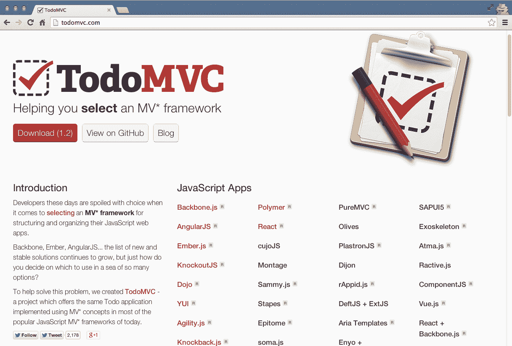
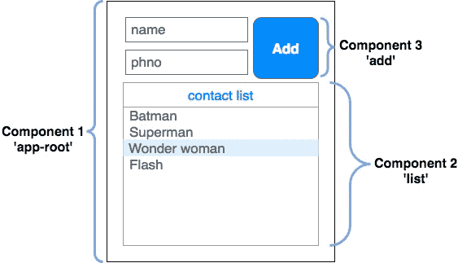
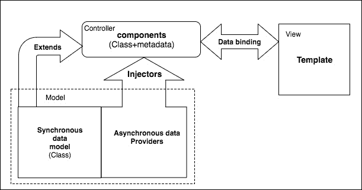
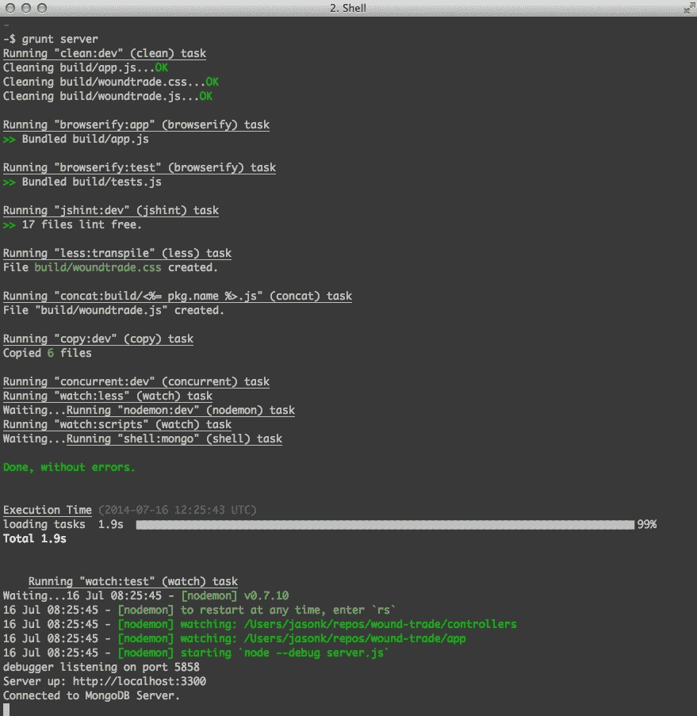
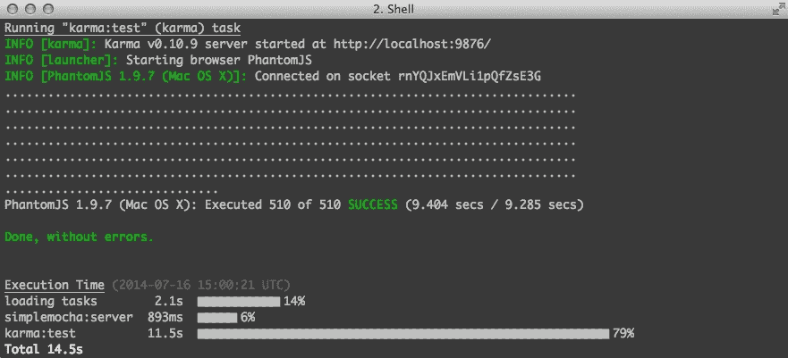

Single Page Applications with Popular Frontend Frameworks <link href="css/style.css" rel="stylesheet" type="text/css">  

# 带有流行前端框架的单页应用程序

在本章中,我们将看看前端的 web 应用程序开发的角度来看,专门用**单页面应用程序**(**SPA),也称为胖客户机应用程序。SPA,表示层的一大部分是卸载到浏览器,浏览器负责渲染页面, 处理导航，并对 API 进行数据调用。**

在本章中，我们将介绍:

*   为什么我们要使用诸如 Backbone.js、Ember.js 或 Angular.js 这样的前端框架?
*   究竟什么是单页应用程序?
*   流行的前端开发工具，如 Grunt、Gulp、Browserify、SAAS 和 Handlebars
*   前端的测试驱动开发

# 为什么要使用前端框架?

我们使用框架来提高我们的生产力，让我们保持理智，并且一般来说，让我们的开发过程更加愉快。 在本书的大部分章节中，我们使用了 Node.js 的 Express.js MVC 框架。 这个框架允许我们组织代码，并推断出大量样板代码，使我们有时间专注于自定义业务逻辑。 同样的道理也适用于应用程序的前端。 任何数量的复杂代码最终都需要适当地组织，我们需要使用一组标准的可重用工具来实现公共任务。 Express.js 让我们在用 Node.js 编写后端代码时变得轻松。 也有许多流行的前端框架可以依赖。

# 什么是单页应用程序?

目前复杂的 web 应用程序的趋势是模仿桌面应用程序，并改变传统网站的感觉。 对于传统的网站，与服务器的每一次交互都需要整个页面的回发，这需要进行一次完整的往返。 随着我们的 web 应用程序变得越来越复杂，向服务器发送和检索数据的需求也越来越大。

如果每次都依赖于整页回发，那么我们需要为其中一个请求提供便利; 我们的应用程序将感到缓慢和没有响应，因为用户将不得不等待一个完整的往返请求。 现在用户对他们的应用要求更多，如果你想一下我们写的应用，喜欢按钮就是一个完美的例子。 仅仅因为我们想将计数器增加 1，就必须向服务器发送整个页面的回发，这似乎是很多不必要的开销。 幸运的是，我们能够使用 jQuery 和 AJAX 轻松地纠正这个问题。 这是单个页面应用程序如何工作的一个完美示例(只是在更大的范围内)。

谷歌的 Gmail 是第一批杰出的单页面应用程序的一个很好的例子。 Gmail 给你一个接口，类似于 Microsoft Outlook 或任何传统的基于桌面的电子邮件客户端。 用户与应用程序的交互感觉就像与桌面应用程序的交互一样——*页面*永远不会重新加载，您可以轻松地切换应用程序中的窗格和选项卡，数据不断地实时刷新和更新。

创建 SPA 通常需要一个 HTML 页面作为应用程序的源，它会加载所有必要的 JavaScript 以触发一系列事件，包括:

*   **Bootstrapping the app**:这意味着通过 AJAX 连接到服务器下载必要的启动数据
*   **基于用户操作呈现屏幕**:这意味着监控由用户触发的事件并操纵 DOM，以便隐藏、显示或重绘应用程序的各个部分，这模拟桌面应用程序的感觉
*   **与服务器通信**:这意味着使用 AJAX 不断地从服务器发送和接收数据，这将通过浏览器保持有状态连接的假象

# TodoMVC 项目

当决定为下一个大型前端项目选择哪个前端框架时，决策过程可能会让人崩溃! 跟踪所有不同的框架以及每种框架的优缺点似乎是一种徒劳的练习。 幸运的是，人们已经响应了这个号召，并且有一个方便的网站不仅可以演示在几乎所有框架中编写的相同应用程序，而且还可以为每种框架提供完整的带注释的源代码!

TodoMVC 项目，[http://todomvc.com](http://todomvc.com)，是一个网站，专注于创建一个简单的，单页的，待办应用程序，它是使用每个验证 JavaScript MVC 框架编写的; 甚至还有一个是用普通的 JavaScript 写的! 所以，跳入一个框架最简单的方法就是看看它的 TodoMVC 代码示例:



一定要花点时间检查一下网站，深入挖掘每个特色框架。 通过看到以完全不同的方式编写相同的代码，你可以对不同的框架有一个很好的感觉; 没有两个是完全相同的，最终，这取决于你评估和弄清楚你更喜欢哪一个和为什么。

为了简洁起见，我将重点介绍我个人喜欢并认为在目前排名前列的三家公司。

# Backbone.js

**Backbone.js**是一个非常轻量级的(6.5 KB 的产品)MV*框架，它已经出现好几年了。 它拥有一个非常庞大的用户基础，许多大型 web 应用程序都是使用这个框架编写的:

*   USA Today
*   Hulu
*   LinkedIn
*   Trello
*   Disqus
*   可汗学院
*   沃尔玛的移动

如果您熟悉 jQuery 并已经使用它一段时间，并且希望开始改进代码的组织和模块化，那么 Backbone.js 是一个很好的框架。 此外，Backbone.js 需要 jQuery，并且与它集成得非常紧密，所以当你轻松进入这个前端开发的新世界时，学习它就少了一件需要担心的事情。

js 基于模型、集合、视图和路由的基本思想。 看看以下几点:

*   模型是存储和管理应用程序中所有数据的基本元素
*   集合存储模型
*   视图将 HTML 呈现到屏幕上，从模型和集合中检索动态数据
*   路由支持应用程序的 URL，允许应用程序的每个部分拥有自己独特的 URL(无需实际加载实时 URL)，并最终将所有内容结合在一起

由于 Backbone.js 是如此的轻量级，一个非常小和简单的样本代码集可以很快地放在一起:

```js
var Person = Backbone.Model.extend(); 
var PersonView = Backbone.View.extend({ 
    tag: 'div', 
    render: function() { 
        var html = [ 
            this.model.get('name'), 
            '<br/>', 
            this.model.get('website') 
        ].join(''); 

        this.$el.html(html); 

        return this;     
    } 
}); 

var person = new Person({ 
        name: 'Jason Krol', 
        website: 'http://kroltech.com' 
    }), 
    view = new PersonView({ model: person }); 

$('body').append(view.render().el); 
```

需要注意的一件事是，从本质上讲，Backbone.js 是非常轻量级的，它不包括大多数您期望的开箱即用的功能。 正如您在前面的代码中看到的，在我们创建的`View`对象中，我们必须提供一个`render`函数来手动呈现 HTML。 出于这个原因，许多人都不愿使用 Backbone.js，但也有人因为它给开发人员带来的原始功能和灵活性而接受它。

传统上，您不会像前面的示例那样，将所有代码放入一个文件中。 您可以将模型、集合和视图组织到一个结构中的单个文件夹中，就像我们在 Node.js 应用程序中组织代码一样。 将所有代码捆绑在一起将是构建工具的工作(这将在本章后面讨论)。

你可以通过访问其官方网站[http://backbonejs.org](http://backbonejs.org)了解更多关于 Backbone.js 的信息。 另外，别忘了在 TodoMVC 网站上查看待办事项应用的 Backbone.js 实现!

I maintain a repository on GitHub that has a boilerplate web application with complete code that uses the full stack we've covered in this book, as well as Backbone.js with Marionette for the frontend. Feel free to check it out at [http://github.com/jkat98/benm](http://github.com/jkat98/benm) (Backbone, Express, Node, and MongoDB).

# Ember.js

Ember.js 自诩为*框架，用于创建雄心勃勃的*web 应用程序。 Ember 的目标是针对相当大规模的 spa，所以用它来构建非常简单的东西的想法可能看起来有些过分，但它确实是可行的。 一个公平的评估是看一下 Ember 库的生产文件大小，它大约为 90kb(而 Backbone.js 为 6.5 KB)。 也就是说，如果您正在使用非常大的代码库构建非常健壮的东西，那么添加的 90kb 对您来说可能不是什么大问题。

下面是一个使用 Ember.js 的非常小的示例应用程序:

```js
var App = Ember.Application.create(), 
    movies = [{ 
        title: "Big Trouble in Little China", 
        year: "1986" 
    }, { 
        title: "Aliens", 
        year: "1986" 
    }]; 

App.IndexRoute = Ember.Route.extend({ 
    model: function() { 
        return movies;  
    } 
}); 

<script type="text/x-handlebars" data-template-name="index"> 
    {{#each}} 
        {{title}} - {{year}}<br/> 
    {{/each}} 
</script> 
```

Ember.js 的代码看起来有点像 Backbone.js 的代码，毫无疑问，许多经验丰富的 Backbone.js 开发人员发现，随着他们对更健壮解决方案的需求增加，他们会迁移到 Ember.js。 js 使用了熟悉的项，包括视图、模型、集合和路由，以及一个`Application`对象。

此外，Ember.js 还提供了组件功能，这是它更强大、更受欢迎的功能之一。 组件允许你创建小型的、模块化的、可重用的 HTML 组件，你可以根据需要将这些组件插入到你的应用程序中。 使用组件，您基本上可以创建自己的自定义 HTML 标记，这些标记的外观和行为与您定义的完全一致，并且可以在整个应用程序中轻松地重用它们。

使用 Ember.js 开发完全是关于惯例的。 与 Backbone.js 不同的是，Ember.js 试图去掉许多样板，并为你做出某些假设。 因此，您需要以特定的方式处理事情，控制器、视图和路由在命名约定方面需要遵循某种严格的模式。

js 网站提供了令人难以置信的在线文档和入门指南。 如果你有兴趣了解更多关于 Ember.js 的知识，请访问[http://emberjs.com/guides/](http://emberjs.com/guides/)。 另外，别忘了看看 TodoMVC 实现!

# React.js

在适应新的 JavaScript 技术方面从未有过如此激烈的竞争。 这是 JavaScript 的最佳时期。 Facebook 团队有一个强大的竞争者，叫做`React.js`。 因此，与 Angular 等其他 MVC 框架不同，`React.js`只是一个来自模型-视图-控制器的视图。 它是轻量级的，并以惊人的速度渲染。 代码的基本封装单元称为组件。 这些组件组合在一起，形成了一个完整的 UI。 让我们使用 es6 类为问候示例创建一个简单的组件，如下所示:

```js
class Greet extends React.Component {
  render() {
      this.props.user = this.props.user || 'All';
      return ( < div >
          <
          h4 > Greeting to { this.props.user }! < /h4> <
          /div>);
  }
}
```

前面的代码片段创建了一个简单的类来迎接用户。 我们对`React.component`进行了扩展，以提供在`Greet`类中可以访问的公共方法和变量。 每个创建的组件都需要一个`render`方法，该方法包含相应组件的 html 模板。 `props`是用于将数据从容器传递给子组件的公共变量，以此类推。

现在，我们需要在 HTML 文档中加载组件。 为此，我们需要在`reactDOM`API 下注册，该 API 由`React.js`库全局提供。 可以这样做:

```js
ReactDOM.render(
 <Greet user="Developers" />,
 document.getElementById('root')
);
```

对象的`render`方法需要两个参数。 首先是根节点，然后是根元素。 根节点是一个用于为不同的父组件声明主机的元素。 根元素`<div id="root" />`被写入`index.html`的主体中，以承载`React`组件的整个视图。
`reactDOM`负责创建一个虚拟 DOM，并观察对每个组件所做的任何更改。 只有更改/操作的部分被重新渲染，保持其他组件完整。 这提高了应用程序的性能。 我们所了解的组件中的变化也称为由不同库(如`reflux.js`或`redux.js`)维护的组件的状态。 [](http://redux.js/) 另一个重要特性是使用道具的单向绑定。 道具只是向视图传递数据的一种方式。 一旦脚手架和数据流设置好，react 项目就会为复杂的项目提供大量可伸缩的代码和易于维护的功能。 在 React.js[https://github.com/facebook/react/wiki/sites-using-react](https://github.com/facebook/react/wiki/sites-using-react)上有一个巨大的项目列表。 一旦你熟悉了 react web 应用，你就可以轻松地切换到 react native，从而创建令人惊叹的本地移动应用。

# 角

Angular 的出现是因为它是由谷歌构建的(它是开源的)。 Angular 基本上就像把 HTML 放到类固醇上。 您创建的应用程序和页面使用的是我们都熟悉的常规 HTML，但它们包含了许多新的自定义指令，这些指令扩展了 HTML 的核心功能，赋予了它令人敬畏的新功能。

Angular 的另一个让经验丰富的非 web 开发人员蜂拥而至的伟大特性是，它是由团队构建的，需要经过大量测试，并且支持依赖注入。 它是一个框架，它不会让创建复杂的 web 应用程序感觉像传统的 web 开发。

然而，别搞错了; JavaScript 在 Angular 的开发中仍然扮演着重要的角色。 新的 Angular 2.0 现在已经是 4.0 了，它已经是当今使用最广泛的框架之一。 它不仅引入了 TypeScript 来实现代码的语法模块化，而且还提供了新的语义，比如组件(而不是控制器)、管道、生命周期钩子和其他特性。 让我们通过实现一个简单的客户端应用程序来学习更多关于 Angular 的知识，该应用程序使用上一章中创建的 phone-API。

与 Angular.js 不同，Angular 2.0 是一个完整的框架，而不是一个单独的可包含文件。 这个框架附带了一堆特性，比如 rxJs、TypeScript、systemJs 等等，它们提供了代码的集成开发。 Angular 团队提供了一些简单的步骤来设置 Angular 2.0 种子应用。 然而，开发人员也可以创建一个 Angular 项目所需的最小文件的手动列表，尽管这并不推荐，而且也很耗时。 对于我们的客户端原型，我们将遵循[Angular 提供的 Angular 快速启动步骤。 io](http://angular.io/)，然后将我们的功能融入其中。 让我们遵循这些步骤。

# 搭建 Angular 应用

转至[https://angular.io/guide/quickstart](https://angular.io/guide/quickstart)，按以下三个步骤操作:

1.  安装`Angular/cli`。 它是全局安装的命令:

```js
npm install -g @Angular/cli
```

2.  创建一个新项目，并使用以下命令将其命名为`phonebook-app`:

```js
ng new phonebook-app
```

3.  通过`cd phonebook-app`进入`phonebook-app`目录。 最后，使用`ng serve --open`为应用程序提供服务。 `ng serve`命令用于在开发、编译和重建应用程序时监视更改。`--open`是一个可选的命令行参数，用于在浏览器选项卡中打开应用程序。 在这里，如果你收到一个错误，确保你重新安装 npm 包通过**`npm install`**命令。

The Google definition of transpile is the process of converting source code in one language to another language, which has a similar level of abstraction. Simply, this means we will write code in TypeScript, which is to be converted to JavaScript (as it works in a browser).

解释项目中的每个文件不在本书的上下文中，但是，我们将主要关注 Angular 的基本构建块来启动它。 目前我们主要关心的是`src/app`目录。 在创建组件之前，让我们添加 Twitter 的引导链接，用于应用程序[的基本样式。 在我们的`src`目录中，有`index.html`。 在`header`标签中插入以下 HTML 代码:](http://app.in/)

```js
<link rel="stylesheet" href="https://maxcdn.bootstrapcdn.com/bootstrap/3.3.7/css/bootstrap.min.css" integrity="sha384-BVYiiSIFeK1dGmJRAkycuHAHRg32OmUcww7on3RYdg4Va+PmSTsz/K68vbdEjh4u" crossorigin="anonymous">
```

# 理解 TypeScript 和 es6

TypeScript is a superset of JavaScript that compiles to clean the JavaScript output.
- [https://github.com/Microsoft/TypeScript](https://github.com/Microsoft/TypeScript)

顾名思义，TypeScript 意味着类型语言，它要求我们在代码中声明数据时指定数据类型。 这可以在不同的语言中看到，如 Java、c#等。 在 TypeScript 中，变量的声明是使用冒号来完成的，如下所示:

```js
let name : string = "Bruno";
```

其次，JavaScript 包含大多数(不是全部)面向对象的特性。 因此，它可以从语义上实现，但没有语法上的规定。 例如，OOP 的一个重要特性就是封装; 让我们来比较一下:

| **TypeScript 代码** | **JavaScript 代码(ES5)** |
| 

```js
class GreetTheWorld {
     greet() {
         return "Hello World";
     }
 }
```

 | 

```js
var GreetTheWorld = (function () {
     function GreetTheWorld() {
     }
     GreetTheWorld.prototype.greet = function () {
         return "Hello World";
     };
     return GreetTheWorld;
 }());
```

 |

最终，使用 TypeScript 作为主要脚本语言的框架会将它编译成 es5 JavaScript。 新的 es6 充当了 es5 和 TypeScript 之间的桥梁。 到目前为止，es6 已经逐渐将 TypeScript 的特性实现到 JavaScript 的类中。 知道了这一点，我们就很容易理解 TypeScript 在 Angular 框架中的用法了。 更深入的学习可以参考[https://www.TypeScriptlang.org/docs/home.html](https://www.typescriptlang.org/docs/home.html)。

# 模块和组件

Angular 2.0 为代码的可重用性和可维护性提供了一种基于组件的方法。 通过将每个功能组的元素可视化为一个组件，可以很容易地复制或重用它们。 让我们为我们的项目创建一个线框，这样我们就可以从我们的项目中挑选出这些组件:



在我们的项目结构中，我们已经有了`app.component.ts`作为我们的组件文件。 我们已经在组件元数据的`selector`属性中指定了`app-root`组件。 这个文件将用于处理根元素或父元素。 根据前面的线框，这个文件包含了`app-root`组件:

```js
import { Component } from '@Angular/core';
@Component({
    selector: 'app-root',
    templateUrl: './app.component.html',
    styleUrls: ['./app.component.css']
})

export class AppComponent {}
```

确保我们为每个组件附加了一个类，这样我们就可以导出一个`component`类，并在`app.modules.ts`中将它注册为 Angular 组件。 为了简洁起见，我们遵循标准命名惯例，将类名的第一个字母大写，然后导入 Angular 的组件类前缀。 所以在 app`module.ts`文件中，我们有以下代码:

```js
import { BrowserModule } from '@Angular/platform-browser';
import { NgModule } from '@Angular/core';
import { AppComponent } from './app.component';
@NgModule({
    declarations: [AppComponent],
    imports: [BrowserModule],
    providers: [],
    bootstrap: [AppComponent]
})
export class AppModule {}
```

一旦注册到`NgModule`，我们需要将根组件传递给 bootstrap 方法/属性。 Bootstrap 处理加载到我们决定使用的平台上。
根据设计，在应用组件中，我们只有一个大纲，它将作为其他组件的容器，因此，让我们创建一个模板。 用 HTML 代码`app.component.html`及其相关的 css 文件创建一个文件，如下所示:

`app.component.html`

```js
<div class="outter">
<!-- <subscribe></subscribe>-->
<!-- <list></list> -->
</div>

```

`app.component.css`

```js
.outter {
    padding: 20 px;
    border: solid 2 px# AAA;
    width: 200 px;
}
```

运行这段代码后，我们在浏览器中得到一个简单的大纲。 使用`ng serve`运行应用程序。

# 角数据流架构

为了对数据流有一个简单的了解，让我们比较一下 MVC 是如何在 Angular 中实现的。 考虑以下图表:



该图由 Angular 2.0 中的基本块组成，而不是所有方面。 模型由静态数据或同步数据类组成，它们在组件中被扩展或导入。 这些组件充当包含业务逻辑的控制器。 每个组件都有元数据，元数据将组件与模板连接起来。 最后，数据被绑定到`component`类变量，并且在模板中可用。 现在，对于我们的应用程序，我们需要显示联系人数据列表; 因此，我们将在新的组件文件`list.component.ts`中使用数据绑定的这个特性。 该文件提供了在电话簿中列出联系人的逻辑。 始终遵循三个步骤来包含组件。

1.  为列表组件及其模板创建元数据和类。 因此，我们有了`list.component.ts`，它由以下代码组成:

```js
import { Component } from '@Angular/core';
@Component({
    selector: 'list',
    templateUrl: './list.component.html'
})
export class ListComponent {
    public phoneList = []
    constructor() {
        this.phoneList = [{
            name: 'Superman',
            phno: 1234567890
        }, {
            name: 'Batman',
            phno: 2222222890
        }]
    }
} 
```

它还包括它的模板`list.component.html`:

```js
<div>
    <div class="list-group">
        <div class="list-group-item list-group-item-info">
            Contact list
        </div>
        <a href="#" *ngFor="let data of phoneList;" class="list-group-item">
 {{data.name}}
 <span class="badge">{{data.phone_no}}</span>
 </a>
   </div>
<div>
```

2.  将组件包含在`app.module`中，并将其注册在声明属性中，如下所示:

```js
import { ListComponent } from './list.component';
@NgModule({
    declarations: [
        AppComponent,
        ListComponent
    ],
    imports: [
        BrowserModule
    ],
    providers: [],
    bootstrap: [AppComponent]
})
```

3.  第三步是包含用于呈现组件的模板。 我们已经有了根组件`root-app`。 因此，从`app.component.htm`取消`list`标记的注释。 可以这样做:

```js
<div class="outter">
<!-- <subscribe></subscribe>-->
    <list>&lt;/list>
</div>
```

# 服务

前面的代码片段包含绑定到`phoneList`属性并因此呈现的静态数据，这是一个同步操作。 现在，如果我们需要显示异步数据，该怎么办? 让我们使用电话簿 api 并为客户机创建一个 HTTP 服务，以便显示异步数据。 让我们创建一个名为`phonebook.service.ts`的服务文件。 该文件包含获取和设置数据所需的所有 HTTP`request`方法。 现在，让我们创建一个`getContactlist`方法，它将获取服务器上的所有联系人数据。 所需代码如下:

```js
import { Injectable } from '@Angular/core';
import { HttpClient } from '@Angular/common/http';
import 'rxjs/add/operator/map'
@Injectable()
export class PhonebookService {
    constructor(private http: HttpClient) {}
    getContactList() {
        return this.http.get('http://localhost:8000/phone/list')
    }
}
```

这里，我们导入了用于从浏览器发出 XML HTTP 请求的`HttpClient`服务。 要使该文件成为服务提供者，需要使用`Injectable`函数。 注入对象中的元数据不是 Angular 自己提供的，因为 Angular 自己会发出元数据。 接下来，我们将通过在组件的`constructor`中注入该服务来使用它。 我们已经在构造函数中传递了一个参数化的值，这被称为依赖注入。

将当前代码修改为以下代码`list.components.ts`:

```js
import { Component } from '@Angular/core';
import { PhonebookService } from './phonebook.service';
@Component({
    selector: 'list',
    templateUrl: './list.component.html'
})
export class ListComponent {
    public phoneList = []
    constructor(private _pbService: PhonebookService) {
        this._pbService.getContactList()
            .subscribe((response) => {
                this.phoneList = response['data'];
            })
    }
}
```

最后，我们需要在`app.modules`的 providers 下注册服务，因为我们要在整个应用中使用它。在这一步，我们需要在`app.modules`中拥有以下代码:

```js
import {HttpClientModule} from '@Angular/common/http';
import {PhonebookService} from './phonebook.service';
```

并将其列入`ngModule`的提供者列表:

```js
@NgModule({
    declarations: [
        ListComponent,
        AppComponent
    ],
    imports: [
        BrowserModule,
        HttpClientModule
    ],
    providers: [PhonebookService],
    bootstrap: [AppComponent]
})
```

为了使用`Httpclient`服务，我们首先需要在`NgModules`中注册`httpModule`。
另外，确保我们的电话簿 API 节点服务器已经运行。 如果没有，使用`npm start`启动它，一旦我们启动`ng serve --open`，我们将收到来自服务器的超级英雄联系人列表。

# 形式

最后但并非最不重要的是，我们需要创建一个名为`add`的表单组件，它将添加一个新的电话记录。 在 Angular 中，有两种构建表单的方式:模板驱动表单和响应式表单。 因为响应式表单是 Angular 的一个新特性，所以我们要实现它。 简单地说，响应式表单通过代码逻辑而不是部分代码来控制表单指令。 让我们通过在我们的电话簿应用中实现它们来验证一下。
要创建的新组件文件是`add.component.ts`及其`.html`文件，如下所示:

```js
import {
    Component,
    Output,
    EventEmitter
} from '@Angular/core';
import {
    PhonebookService
} from './phonebook.service';
import {
    FormControl,
    FormGroup,
    Validators
} from '@Angular/forms';
@Component({
    selector: 'add',
    templateUrl: './add.component.html'
})
export class AddComponent {
    @Output() onAdded = new EventEmitter < Object > ();
    public newRecordForm = new FormGroup({
        name: new FormControl(),
        phone_no: new FormControl(0, [Validators.required, Validators.minLength(10)])
    });
    constructor(private _pbService: PhonebookService) {
        this.resetForm();
    }
    resetForm() {
        this.newRecordForm.reset();
    }
    onSubmit() {
        if (this.newRecordForm.valid) {
            const payload = this.newRecordForm.value;
            this._pbService.postContactList(payload).subscribe((response) => {
                let newListData = response['data'];
                this.onAdded.emit(newListData);
                this.resetForm();
            })
        }
    }
}
```

在前面的代码中，你可能会观察到 Angular 的一些新方面。 其解释如下:

*   `FormControl`和`FormGroup`:导入`FormControl`，这是一个以模型数据为输入并创建表单元素实例的指令。 可以使用`FormGroup`对这些表单元素进行聚合或分组。
*   `Validators`:类验证器提供了验证表单元素的方法。 它们作为第二个可选参数传递给`FormControl`，用于配置元素的验证。 它根据应用的条件将布尔属性设置为有效。
*   `Output`和`EventEmitter`将在后面解释。 所以，一旦我们的代码准备好了，让我们创建它的模板如下:

```js
<form [formGroup]="newRecordForm" (ngSubmit)="onSubmit()" novalidate>
    <div class="form-group">
        <label class="center-block">Name:
            <input class="form-control" formControlName="name">
        </label>
        <label class="center-block">Phone no:
            <input class="form-control" formControlName="phone_no" ngClass="">
        </label>
    </div>
    <input type="submit" name="submit">
</form>
```

在前面的代码中，我们可以研究`formGroup`是否是一个将公共变量作为输入的指令`newRecordForm`。 我们有一个名为`ngSubmit`的事件处理程序，带有公共方法`onSubmit`。 该方法负责将联系信息保存到我们的服务器。 这里的最后一个要求是将`newRecordForm`的属性映射到`formControlName`，以便将代码逻辑映射到模板中的适当元素。 像`form-control`这样的类用于 HTML 元素，只是基本设计的引导类。

# 组件通信

现在，我们需要在`app.component.html`中增加一个更改:

```js
<div class="container">
    <add (onAdded)="onAddedData($event)"></add>
    <list [phoneList]="listData"></list>
</div>
```

我们还需要在`app.component.ts`中增加一个变更，变更如下:

```js
export class AppComponent {
    public listData = [];
    onAddedData(newListData: any) {
        this.listData = newListData;
    }
}
```

为了在两个组件之间进行通信，需要进行此更改。 这种交流是为了什么?
在`add`组件中添加新记录时，需要将新添加的数据发送给 list 组件，list 组件不能直接绑定，所以我们使用`@output`将数据绑定回父组件。 `EventEmitter`用于通过应用模板中的绑定发出响应数据，如下所示:

`<add (onAdded)="onAddedData($event)"></add>`。

在这里，应用组件充当了它们之间的桥梁。 一旦父类接收到`AddedData`方法中的数据，它就通过`listData`变量的`@input`绑定与它的子列表组件通信。

注意浏览器中的变化; `form`组件将新数据添加到列表中，我们的电话簿应用程序已经为它的第一个原型做好了准备。

前端框架最近带有一些宗教色彩。 对某个框架发表负面评论或批评，你很可能会遭到支持者的抨击。 同样地，积极地谈论一个特定的框架，同样地，您可能会被攻击说不同的框架处理相同的主题会好得多。 当决定哪个框架适合你和/或你的项目时，底线通常是关于个人偏好的。 TodoMVC 网站上的每一个框架都可以以各自独特的方式实现相同的目标。 花些时间来评估一些，然后自己做决定!

# 前端开发工具

由于单页面应用程序的复杂特性，前端开发人员需要熟悉的工具套件越来越多，以便管理许多日常的、有时甚至是分分制的任务。

# 自动构建任务管理器

**构建工具**就像它听起来的那样——一个用于构建应用程序的工具。 当前端开发人员创建和维护应用程序时，在每次修改和保存文件时，可能需要重复执行许多任务。 使用构建工具，开发人员可以通过将责任卸给自动任务管理器来节省时间和脑力资源，该任务管理器可以监视文件的更改并执行所需的任意数量的任务。 这些任务可能包括以下任何数目:

*   连接
*   缩小
*   丑化和困惑
*   操纵
*   依赖项安装和准备
*   自定义脚本发射
*   并发观察家
*   服务器启动
*   测试自动化

现在一些比较流行的构建工具包括 Grunt、Gulp 和 Broccoli。 Grunt.js 已经存在了很多年，并且在开发社区中建立得非常好。 Gulp 和 Broccoli 都是新产品，但很快就获得了关注，其效果与 Grunt 略有不同。 在 Grunt 中，您使用配置文件定义和管理任务，而在 Gulp 和 Broccoli 中，您编写 Node.js 代码，并使用流的原始功能。 许多开发人员发现使用 Grunt 的配置文件是相当复杂和令人沮丧的，并且发现使用 Gulp 是一个令人耳目一新的改变。 然而，Grunt 的历史和受欢迎程度是毋庸置疑的。

这三个都是功能丰富的插件生态系统，可以帮助您在构建过程中自动化您所能想到的任何事情。

下面是一个典型的 Grunt`build`命令的输出示例:



在一个典型的单页面应用程序中，构建管理器可以负责下载和安装依赖项，将多个 JavaScript 文件连接到一个文件中，编译并调整 Browserify 模块，检查 JavaScript 文件的语法错误，将 LESS 文件编译为生产准备的 CSS 文件， 将文件复制到运行时目标，观察文件的更改以再次重复任何任务，最后，在代码更改时运行适当的测试——所有这些都来自一个命令!

Grunt 可以使用`npm`安装，并且应该全局安装。 执行以下命令在您的机器上安装 Grunt CLI:

```js
    $ npm install -g grunt-cli
```

更多信息请参考 Grunt.js 官方网站的入门指南[http://gruntjs.com/getting-started](http://gruntjs.com/getting-started)。

此外，你也可以查看 Gulp 和 Broccoli，了解更多信息:

*   [http://gulpjs.com/](http://gulpjs.com/)
*   [https://github.com/broccolijs/broccoli](https://github.com/broccolijs/broccoli)

# 依赖关系管理

从 DOM 操作(`jquery`)到时间戳格式化(`moment.js`)，有数百万个 JavaScript 库可以帮助您完成所有工作。 管理这些库和依赖关系有时会让人头疼。 对于前端，首选的依赖管理器是 Bower.io。

Bower 的工作方式与 npm 几乎完全相同; 它管理`bower.json`文件中的包。 在前端工作时(你需要一个已知的 JavaScript 库或插件，例如下划线)，只需执行`bower install underscore`，JavaScript 文件将被下载到项目中的本地`bower_components`文件夹中。 从那里，您可以通过更新构建过程或简单地复制文件(在 HTML 中包含一个脚本标记)来自动包含这些脚本; 然后，一切都准备好了。

Bower 可以使用 npm 来安装，并且应该是全局安装的。 执行以下命令在您的机器上安装 Bower:

```js
    $ npm install -g bower
    $ bower install jquery
    bower cached        git://github.com/jquery/jquery.git#2.1.0
    bower validate      2.1.0 against git://github.com/jquery/jquery.git#*
    bower new           version for git://github.com/jquery/jquery.git#*
    bower resolve       git://github.com/jquery/jquery.git#*
    bower download      https://github.com/jquery/jquery/archive/2.1.1.tar.gz
    bower extract       jquery#* archive.tar.gz
    bower resolved      git://github.com/jquery/jquery.git#2.1.1
    bower install       jquery#2.1.1
    jquery#2.1.1 bower_components/jquery

```

参观鲍尔。 io 网站([http://bower.io](http://bower.io))获取更多信息，以及可以通过`bower install`安装的脚本的完整目录。

# 模块化

在编写大型 JavaScript 应用程序时，关键是保持源代码组织良好，结构合理。 不幸的是，JavaScript 本身并没有很好地支持模块化代码的想法。 为了解决这个问题，有两个流行的库允许您编写模块化代码，并且只依赖于每一段代码中需要的模块。

An absolute must-read and incredible resource for frontend design patterns is Addy Osmandi's *Learning JavaScript Design Patterns*, which you can read for free by visiting the following URL:
[http://addyosmani.com/resources/essentialjsdesignpatterns/book/](http://addyosmani.com/resources/essentialjsdesignpatterns/book/)

Require.js 和 Browserify 是当今最流行的两个模块加载器。 每一种都有非常独特的语法和它自己的一组好处。 Require.js 遵循异步模块定义，这意味着每一段代码都需要定义自己的依赖项。 就我个人而言，我过去使用过 Require.js，最近我发现我真的很喜欢使用 Browserify。 Browserify 的优势之一是它使用了与 Node.js 相同的模块化模式; 因此，使用 Browserify 编写前端代码的感觉与使用 Node 相同。 您在前端使用`module.exports`和`require`，如果您在同一个应用程序内的 Node 和前端之间来回切换，则不必担心语法上下文切换。

将模块加载器与前面提到的流行 MVC 框架结合使用几乎是必须的，因为这两者就像花生酱和果冻一样密不可分!

如需更多资料，请浏览以下连结:

*   [http://browserify.org/](http://browserify.org/)
*   [http://requirejs.org/](http://requirejs.org/)

# HTML 模板表示引擎

幸运的是，在本书的整个过程中，我们已经介绍了 HTML 模板呈现引擎的概念。 主题和概念也直接转移到前端应用程序。 在浏览器中有许多不同的 HTML 模板引擎可供选择。

许多模板引擎将是基于胡子的，这意味着它们使用`{{`和`}}`来合并变量。 Handlebars 是目前我个人最喜欢的，主要是因为它在应用程序的后端和前端都工作得很好，而且我真的很喜欢使用它的助手。 js 有一个内置的`lite`模板渲染引擎，可以和 Backbone.js 一起使用，但其语法使用`<%`和`%>`(很像经典的 ASP 或 ASP.net MVC Razor 语法)。 通常，大多数前端 MVC 框架允许您自定义模板呈现引擎并使用任何您想要的引擎。 例如，可以将 Backbone.js 设置为使用 Handlebars.js，而不是默认使用下划线.js。

下面是一些当前可用的前端模板渲染引擎的一个小样本列表:

*   **Underscore.js**: [http://underscorejs.org](http://underscorejs.org)
*   **把手**:[http://handlebarsjs.com](http://handlebarsjs.com)
*   **胡子**:[http://mustache.github.io](http://mustache.github.io)
*   **Dust.js**:[http://akdubya.github.io/dustjs](http://akdubya.github.io/dustjs)
*   **EJS**:[http://embeddedjs.com](http://embeddedjs.com)

其中一些既可以在前端也可以在后端工作。

# CSS transpiling

在 CSS 文件中使用变量和逻辑的想法听起来像是美梦成真，对吧? 我们还没有达到这一步(至少在浏览器中); 然而，有一些工具可以让我们在 CSS 文件中使用变量和逻辑，并在构建步骤中编译它们。 LESS 和 SASS 是目前最流行的两个 CSS 编译器。 它们的行为几乎相同，只是在语法和特性上略有不同。 最大的区别是 LESS 使用 JavaScript
和 Node 编写，而 SASS 使用 Ruby; 因此，在您的机器上运行它们有不同的要求。

下面是一个示例 SASS 样式表文件:

```js
$sprite-bg:url("/images/editor/sprite-msg-bg.png"); 

@mixin radius($radius) { 
  -moz-border-radius: $radius; 
  -webkit-border-radius: $radius; 
  -ms-border-radius: $radius; 
  border-radius: $radius; 
} 

.upload-button { 
    border-bottom: solid 2px #005A8B; 
    background: transparent $sprite-bg no-repeat; 
    @include radius(4px); 
    cursor: pointer; 
} 

#step-status { 
    color:#dbdbdb; font-size:14px; 

    span.active { 
        color:#1e8acb; 
    } 

    &.basic-adjust, &.message-editor { 
        width: 525px; 
    } 

    .icon { 
        height:65px; 
        width: 50px; 
        margin:auto; 
    } 
} 

@import "alerts"; 
@import "attachments"; 
@import "codemirror"; 
@import "drafts"; 
```

查看示例代码，您可以看到我们有一些在常规 CSS 文件中通常无法工作的新元素。 其中包括:

*   定义用于整个样式表的自定义变量
*   定义 mixin，它作为可重用样式的伪函数(带有动态参数)
*   我们的样式定义中的 mixin 和变量
*   具有父/子关系的嵌套样式

当使用 LESS(或者在示例代码 SASS 的情况下)编译前面的代码时，输出是一个标准的`.css`样式表，它遵循所有正常的浏览器规则和语法。

如欲了解更多有关 LESS 及 SASS 的资料，请浏览以下连结:

*   [http://lesscss.org](http://lesscss.org)
*   [http://sass-lang.com](http://sass-lang.com)

# 测试和测试驱动开发

一个复杂的前端应用程序的开发与其他任何软件应用程序没有什么不同。 代码将是复杂和健壮的，没有理由不编写测试，以及实践测试驱动的开发。 前端测试框架和语言的可用性与任何其他语言一样健壮。 在本书中，我们用来测试 Node.js 代码的所有工具和概念也可以直接用于前端。

其他一些测试前端 JavaScript 的工具有:

*   :[http://karma-runner.github.io](http://karma-runner.github.io)
*   **Jasmine for writing test**:[http://jasmine.github.io](http://jasmine.github.io)

# PhantomJS 无头浏览器

关于测试前端代码，我想指出的一件事是，测试运行程序通常希望在浏览器窗口中运行。 这很好，也很有意义，但是在现实世界中，自动化您的测试或使用 TDD 快速执行它们可能有点痛苦，因为每次您的测试套件运行时浏览器窗口都要打开。 PhantomJS 是一个可用的*无头*浏览器，它可以在这种场景下完美地工作。 无头浏览器只是意味着它是一种从命令行在内存中运行的浏览器，没有实际的界面(像典型的浏览器)。

你可以很容易地配置 Karma 来使用 PhantomJS 而不是你所选择的浏览器来启动测试套件。 当使用 PhantomJS 作为浏览器时，测试在幕后执行，只报告错误。 下面是一个使用 PhantomJS 运行 Karma 的测试套件的输出示例:



# 总结

在这篇文章中，我们将介绍一些在进行典型 web 开发时使用的最常见的前端工具和框架。 我们查看了 TodoMVC 项目，并回顾了三种流行的 JavaScript 框架，以构建健壮和复杂的前端应用程序。

流行的构建工具，如 Grunt.js、Gulp 和 Broccoli，通过自动化大量每次修改文件时需要执行的重复任务，帮助开发人员简化工作流程。 从将脚本连接到单个文件，到缩小和压缩，再到执行自动化测试套件，任务运行器可以配置为处理几乎所有事情!

我们了解了两种常用的 CSS 编译器 LESS 和 SASS，并了解了它们如何通过使用 mixin、变量和嵌套来动态创建和管理 CSS 样式表。

最后，您了解了 PhantomJS(无头浏览器)，以及在运行前端测试时使用它，以便使用 Karma 之类的测试运行器从命令行快速轻松地执行测试。